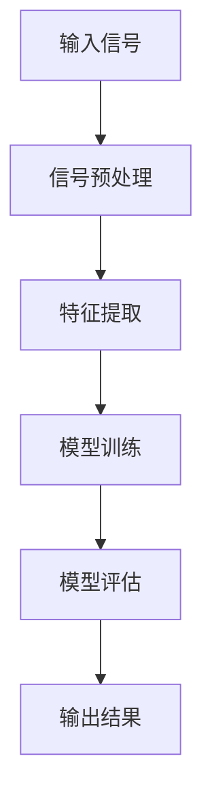
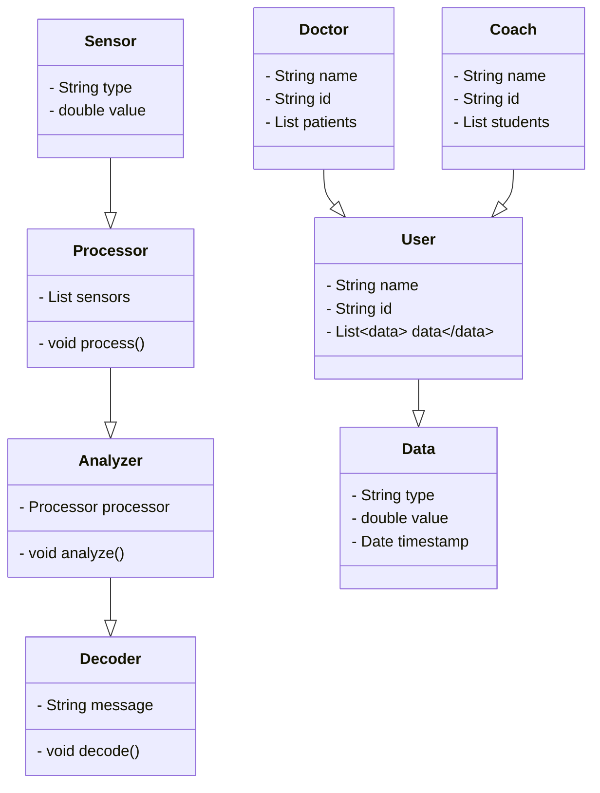
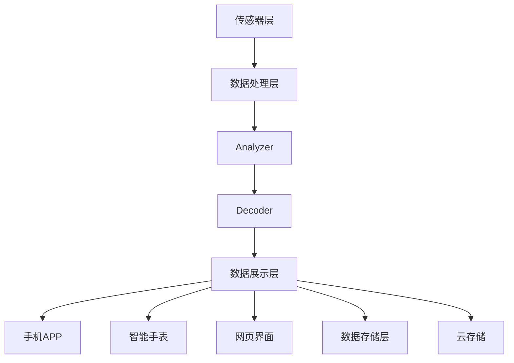
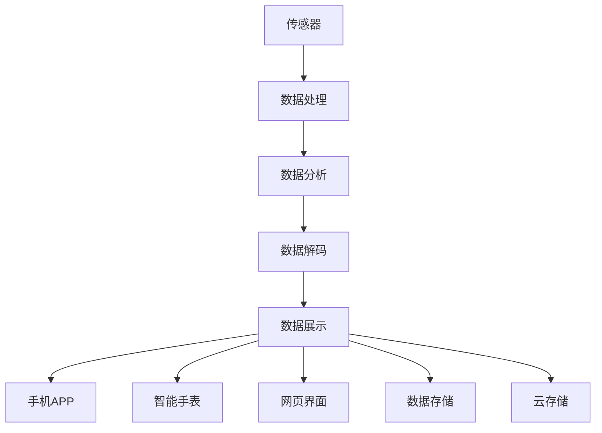
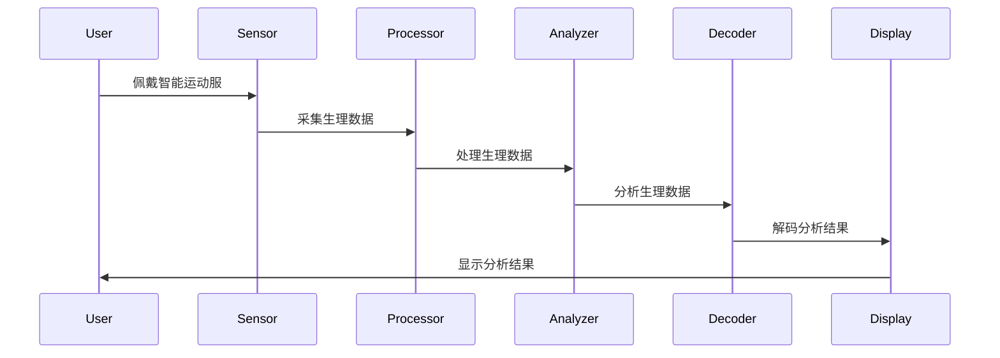

                 

### 智能运动服：AI Agent的实时生理指标监测

关键词：智能运动服、AI Agent、实时生理指标监测、运动健康、健康管理系统

> 摘要：本文将探讨智能运动服在实时生理指标监测方面的应用，通过分析智能运动服与AI Agent的关联，介绍其核心概念、技术原理和实现策略，并提出解决方案和边界与外延。文章旨在为读者提供一个全面、深入的理解，帮助其更好地把握智能运动服的发展趋势和应用前景。

### 目录大纲

----------------------------------------------------------------

## 第一部分：背景介绍

### 1.1 问题背景

#### 1.1.1 运动监测技术的发展现状

#### 1.1.2 智能运动服的兴起

#### 1.1.3 AI Agent在生理指标监测中的作用

### 1.2 问题描述

#### 1.2.1 智能运动服需求分析

#### 1.2.2 生理指标监测的关键问题

#### 1.2.3 AI Agent实时监测的实现挑战

### 1.3 问题解决

#### 1.3.1 智能运动服的设计原则

#### 1.3.2 AI Agent的技术原理

#### 1.3.3 实时监测的实现策略

### 1.4 边界与外延

#### 1.4.1 监测数据的处理边界

#### 1.4.2 智能运动服的适用范围

#### 1.4.3 AI Agent的扩展应用领域

### 1.5 概念结构与核心要素组成

#### 1.5.1 智能运动服的组成结构

#### 1.5.2 AI Agent的核心功能模块

#### 1.5.3 实时生理指标监测的技术要素

### 1.6 本章小结

----------------------------------------------------------------

## 第二部分：核心概念与联系

### 2.1 智能运动服的核心概念

#### 2.1.1 智能运动服的定义

#### 2.1.2 智能运动服的属性特征

#### 2.1.3 智能运动服与传统运动装备的区别

### 2.2 AI Agent的核心概念

#### 2.2.1 AI Agent的定义

#### 2.2.2 AI Agent的特点

#### 2.2.3 AI Agent与传统传感器的区别

### 2.3 智能运动服与AI Agent的关联分析

#### 2.3.1 AI Agent在智能运动服中的应用

#### 2.3.2 智能运动服对AI Agent的需求

#### 2.3.3 AI Agent与智能运动服的协同作用

### 2.4 概念属性特征对比表格

### 2.5 AI Agent的ER实体关系图架构

----------------------------------------------------------------

## 第三部分：算法原理讲解

### 3.1 生理指标监测算法概述

#### 3.1.1 生理指标监测算法的分类

#### 3.1.2 常见生理指标监测算法

#### 3.1.3 生理指标监测算法的发展趋势

### 3.2 常见生理指标监测算法详解

#### 3.2.1 心率监测算法

##### 3.2.1.1 心率监测算法的原理

##### 3.2.1.2 心率监测算法的实现

##### 3.2.1.3 心率监测算法的优缺点

#### 3.2.2 血压监测算法

##### 3.2.2.1 血压监测算法的原理

##### 3.2.2.2 血压监测算法的实现

##### 3.2.2.3 血压监测算法的优缺点

#### 3.2.3 肺活量监测算法

##### 3.2.3.1 肺活量监测算法的原理

##### 3.2.3.2 肺活量监测算法的实现

##### 3.2.3.3 肺活量监测算法的优缺点

### 3.3 算法原理图示

### 3.4 数学模型和公式详解

#### 3.4.1 心率监测算法的数学模型

#### 3.4.2 血压监测算法的数学模型

#### 3.4.3 肺活量监测算法的数学模型

----------------------------------------------------------------

## 第一部分：背景介绍

### 1.1 问题背景

#### 1.1.1 运动监测技术的发展现状

随着社会经济的发展和人们健康意识的提高，运动监测技术逐渐成为体育科学和健康管理领域的重要研究方向。传统的运动监测方法主要依赖于各种传感器和设备，如心率监测器、血压计和肺活量计等。这些设备虽然能够提供一定的生理指标数据，但其局限性较大，如数据采集不够实时、监测范围有限、用户体验不佳等。

近年来，随着物联网和人工智能技术的快速发展，智能运动服作为一种新兴的监测技术逐渐受到关注。智能运动服通过内置的各种传感器和AI Agent，可以实时监测用户的生理指标，如心率、血压和肺活量等，提供更为全面和个性化的运动健康数据。

#### 1.1.2 智能运动服的兴起

智能运动服是一种集成了传感器、处理器和通信模块的智能服装，能够实时采集用户的生理数据，并通过无线网络传输至云端进行分析和处理。与传统运动装备相比，智能运动服具有以下优势：

1. **实时监测**：智能运动服能够实时监测用户的生理指标，提供即时的健康反馈。
2. **个性化数据**：通过分析用户的生理数据，智能运动服可以提供个性化的运动建议和健康管理方案。
3. **便捷性**：智能运动服与传统监测设备相比，佩戴更为方便，用户可以在各种场景下使用。

#### 1.1.3 AI Agent在生理指标监测中的作用

AI Agent，即人工智能代理，是一种基于机器学习和深度学习技术的高级人工智能系统。在智能运动服的生理指标监测中，AI Agent发挥着至关重要的作用：

1. **数据处理**：AI Agent能够处理海量的生理数据，进行数据清洗、特征提取和模型训练，提高监测的准确性和可靠性。
2. **智能分析**：AI Agent可以通过对生理数据的分析，发现用户运动中的潜在风险和健康问题，提供针对性的建议和预警。
3. **实时反馈**：AI Agent能够实时监测用户的生理指标变化，为用户提供即时的健康反馈和调整建议。

### 1.2 问题描述

#### 1.2.1 智能运动服需求分析

随着智能运动服的兴起，用户对其需求日益增加。用户期望智能运动服能够提供以下功能：

1. **实时生理指标监测**：用户希望智能运动服能够实时监测其心率、血压和肺活量等生理指标，提供即时的健康数据。
2. **个性化运动建议**：根据用户的生理数据和运动习惯，智能运动服应能提供个性化的运动方案和建议，帮助用户达到最佳的运动效果。
3. **健康预警**：智能运动服应能实时监测用户的生理状态，及时发现潜在的健康问题，并提供预警和调整建议。
4. **数据分析和可视化**：智能运动服应能够将用户的生理数据进行分析和可视化，帮助用户更好地了解自己的健康状况。

#### 1.2.2 生理指标监测的关键问题

实现智能运动服的实时生理指标监测面临以下关键问题：

1. **数据采集准确性**：智能运动服内置的传感器需要具有高精度和高稳定性，确保采集到的生理数据准确可靠。
2. **数据处理效率**：海量的生理数据需要高效的处理算法，保证实时监测的响应速度和准确性。
3. **算法准确性**：生理指标监测算法的准确性直接影响监测结果的可靠性，需要不断优化和改进。
4. **用户体验**：智能运动服需要设计得舒适、轻便，避免影响用户的运动体验。

#### 1.2.3 AI Agent实时监测的实现挑战

AI Agent在智能运动服中的实时监测实现面临以下挑战：

1. **实时性**：AI Agent需要能够在短时间内处理和反馈用户的生理数据，确保实时监测的效果。
2. **资源限制**：智能运动服的硬件资源有限，需要AI Agent能够在资源受限的环境下高效运行。
3. **算法优化**：AI Agent的算法需要不断优化，以提高监测的准确性和稳定性。
4. **数据安全**：AI Agent需要确保用户的生理数据安全，防止数据泄露和滥用。

### 1.3 问题解决

#### 1.3.1 智能运动服的设计原则

为了解决上述问题，智能运动服的设计需要遵循以下原则：

1. **模块化设计**：智能运动服应采用模块化设计，方便传感器和AI Agent的集成和升级。
2. **高精度传感器**：选择高精度、高稳定性的传感器，确保生理数据采集的准确性。
3. **高效数据处理**：采用高效的算法和数据处理技术，提高生理数据的处理效率和准确性。
4. **用户体验优化**：注重智能运动服的舒适性和轻便性，避免影响用户的运动体验。

#### 1.3.2 AI Agent的技术原理

AI Agent的技术原理主要包括以下几个方面：

1. **数据采集**：AI Agent通过内置的传感器实时采集用户的生理数据，如心率、血压和肺活量等。
2. **数据处理**：AI Agent对采集到的生理数据进行预处理、特征提取和模型训练，以提高监测的准确性和稳定性。
3. **实时分析**：AI Agent利用机器学习和深度学习算法对生理数据进行分析，实时监测用户的生理状态，并提供健康反馈和调整建议。
4. **反馈机制**：AI Agent通过无线网络将分析结果反馈给用户，帮助用户了解自己的健康状况，并进行相应的调整。

#### 1.3.3 实时监测的实现策略

实现智能运动服的实时监测需要采取以下策略：

1. **低延迟通信**：采用低延迟的无线通信技术，确保生理数据的实时传输和反馈。
2. **分布式计算**：将AI Agent的算法分布在多个节点上，提高数据处理和响应的速度。
3. **数据缓存**：在生理数据传输过程中设置缓存机制，确保数据传输的连续性和稳定性。
4. **故障检测与恢复**：建立故障检测与恢复机制，确保AI Agent在异常情况下的稳定运行。

### 1.4 边界与外延

#### 1.4.1 监测数据的处理边界

在实现智能运动服的实时监测过程中，需要明确监测数据的处理边界：

1. **数据采集范围**：明确智能运动服所能采集的生理指标范围，如心率、血压和肺活量等。
2. **数据处理精度**：确定生理数据处理的精度要求，如心率监测的精确度和血压监测的范围等。
3. **数据传输频率**：设定生理数据的传输频率，如每秒传输多少次数据。

#### 1.4.2 智能运动服的适用范围

智能运动服的适用范围包括：

1. **运动爱好者**：智能运动服可以为运动爱好者提供实时生理指标监测，帮助其调整运动强度和频率。
2. **健身教练**：智能运动服可以为健身教练提供学员的实时生理数据，帮助其制定个性化的训练计划。
3. **医疗保健**：智能运动服可用于医疗保健领域，为慢性病患者提供实时生理指标监测，协助医生进行病情管理和治疗。

#### 1.4.3 AI Agent的扩展应用领域

AI Agent的扩展应用领域包括：

1. **健康监测**：AI Agent可以应用于健康监测领域，为用户提供全天候的生理状态监测和健康建议。
2. **智能家居**：AI Agent可以集成到智能家居系统中，实时监测家庭成员的生理状态，提供智能化的家居服务和安全保障。
3. **工业监测**：AI Agent可以应用于工业监测领域，实时监测设备的工作状态和运行环境，提高生产效率和安全性。

### 1.5 概念结构与核心要素组成

#### 1.5.1 智能运动服的组成结构

智能运动服由以下几个核心组成部分构成：

1. **传感器模块**：包括心率传感器、血压传感器和肺活量传感器等，用于实时采集用户的生理数据。
2. **处理器模块**：包括嵌入式处理器和AI Agent，用于处理和存储生理数据，实现实时监测和分析。
3. **通信模块**：包括无线通信模块和有线通信模块，用于传输生理数据和接收健康反馈。
4. **显示模块**：包括显示屏和传感器指示灯，用于实时显示生理数据和健康状态。

#### 1.5.2 AI Agent的核心功能模块

AI Agent的核心功能模块包括：

1. **数据采集模块**：负责采集传感器数据，包括心率、血压和肺活量等。
2. **数据处理模块**：负责对采集到的数据进行预处理、特征提取和模型训练。
3. **分析模块**：负责对预处理后的数据进行分析，识别异常情况并提供健康建议。
4. **反馈模块**：负责将分析结果通过无线通信模块传输给用户，实现实时反馈。

#### 1.5.3 实时生理指标监测的技术要素

实时生理指标监测的技术要素包括：

1. **传感器技术**：包括心率传感器、血压传感器和肺活量传感器等，用于实时采集生理数据。
2. **通信技术**：包括无线通信技术和有线通信技术，用于传输生理数据和接收健康反馈。
3. **数据处理技术**：包括数据预处理、特征提取和模型训练等技术，用于提高监测的准确性和效率。
4. **机器学习和深度学习技术**：用于对生理数据进行智能分析和异常识别，提高监测的可靠性和实用性。

### 1.6 本章小结

本章通过对运动监测技术、智能运动服和AI Agent的背景介绍，分析了智能运动服需求、生理指标监测的关键问题以及AI Agent实时监测的实现挑战。在此基础上，提出了智能运动服的设计原则、AI Agent的技术原理和实时监测的实现策略。同时，本章还探讨了智能运动服的边界与外延，明确了监测数据的处理边界、适用范围和AI Agent的扩展应用领域。通过本章的介绍，读者可以全面了解智能运动服在实时生理指标监测方面的应用和发展趋势。

## 第二部分：核心概念与联系

### 2.1 智能运动服的核心概念

#### 2.1.1 智能运动服的定义

智能运动服是一种集成了传感器、处理器和通信模块的智能服装，能够实时监测用户的生理指标，如心率、血压和肺活量等，并通过无线网络传输至云端进行分析和处理。与传统运动装备相比，智能运动服具有更高的智能化程度和更全面的生理监测功能。

#### 2.1.2 智能运动服的属性特征

智能运动服具有以下属性特征：

1. **实时监测**：智能运动服能够实时监测用户的生理指标，提供即时的健康数据。
2. **个性化**：智能运动服可以根据用户的生理数据提供个性化的运动建议和健康管理方案。
3. **便捷性**：智能运动服与传统监测设备相比，佩戴更为方便，用户可以在各种场景下使用。
4. **可扩展性**：智能运动服可以通过升级传感器和算法模块，扩展监测功能和应用范围。

#### 2.1.3 智能运动服与传统运动装备的区别

智能运动服与传统运动装备在以下几个方面存在显著区别：

1. **数据采集**：智能运动服通过内置的传感器实时采集用户的生理数据，而传统运动装备主要依赖于用户手动测量或外置设备。
2. **数据处理**：智能运动服利用AI Agent对生理数据进行处理和分析，而传统运动装备通常无法进行数据处理和分析。
3. **反馈机制**：智能运动服能够通过无线网络将分析结果反馈给用户，而传统运动装备无法提供实时反馈。
4. **智能化程度**：智能运动服具有更高的智能化程度，能够根据用户的生理数据提供个性化的运动建议和健康管理方案，而传统运动装备则缺乏这种智能化功能。

### 2.2 AI Agent的核心概念

#### 2.2.1 AI Agent的定义

AI Agent，即人工智能代理，是一种基于机器学习和深度学习技术的高级人工智能系统。它能够模拟人类的决策过程，通过学习用户的行为和生理数据，提供智能化的健康建议和健康管理服务。

#### 2.2.2 AI Agent的特点

AI Agent具有以下特点：

1. **自主学习**：AI Agent能够通过机器学习和深度学习技术，不断学习和优化自身的能力，提高监测和分析的准确性。
2. **实时响应**：AI Agent能够实时处理用户的生理数据，提供即时的健康反馈和调整建议。
3. **个性化**：AI Agent可以根据用户的生理数据和行为特征，提供个性化的健康管理方案和运动建议。
4. **自适应**：AI Agent能够根据用户的行为和生理变化，自适应调整监测和分析策略，提高监测的准确性和实用性。

#### 2.2.3 AI Agent与传统传感器的区别

AI Agent与传统传感器在以下几个方面存在显著区别：

1. **数据处理**：AI Agent能够对传感器采集的数据进行预处理、特征提取和模型训练，而传统传感器通常无法进行数据处理和分析。
2. **智能分析**：AI Agent能够利用机器学习和深度学习算法，对生理数据进行分析和预测，提供智能化的健康建议和调整建议，而传统传感器仅能提供简单的生理数据。
3. **自适应能力**：AI Agent可以根据用户的行为和生理变化，自适应调整监测和分析策略，而传统传感器缺乏这种自适应能力。
4. **实时反馈**：AI Agent能够实时处理用户的生理数据，提供即时的健康反馈和调整建议，而传统传感器无法提供实时反馈。

### 2.3 智能运动服与AI Agent的关联分析

#### 2.3.1 AI Agent在智能运动服中的应用

AI Agent在智能运动服中具有广泛的应用：

1. **实时监测**：AI Agent能够实时监测用户的生理指标，如心率、血压和肺活量等，提供即时的健康数据。
2. **个性化建议**：AI Agent可以根据用户的生理数据和行为特征，提供个性化的运动建议和健康管理方案。
3. **异常预警**：AI Agent能够对用户的生理数据进行实时分析，发现潜在的健康问题，并提供预警和调整建议。
4. **数据可视化**：AI Agent可以将用户的生理数据进行分析和可视化，帮助用户更好地了解自己的健康状况。

#### 2.3.2 智能运动服对AI Agent的需求

智能运动服对AI Agent的需求包括：

1. **实时性**：AI Agent需要能够在短时间内处理和反馈用户的生理数据，确保实时监测的效果。
2. **准确性**：AI Agent需要对用户的生理数据进行分析，提供准确的健康建议和调整建议。
3. **适应性**：AI Agent需要能够根据用户的行为和生理变化，自适应调整监测和分析策略。
4. **安全性**：AI Agent需要确保用户的生理数据安全，防止数据泄露和滥用。

#### 2.3.3 AI Agent与智能运动服的协同作用

AI Agent与智能运动服之间的协同作用体现在以下几个方面：

1. **数据整合**：AI Agent能够整合智能运动服采集的各种生理数据，进行综合分析和评估。
2. **智能反馈**：AI Agent能够根据生理数据分析和评估结果，为用户提供智能化的健康建议和调整建议。
3. **实时监测**：AI Agent与智能运动服的协同作用，确保了用户生理指标的实时监测和反馈。
4. **个性化服务**：AI Agent与智能运动服的协同作用，使得用户能够享受到更加个性化、智能化的健康管理服务。

### 2.4 概念属性特征对比表格

为了更清晰地展现智能运动服和AI Agent的概念属性特征，下面提供一张对比表格：

| 概念 | 属性特征 |
| --- | --- |
| 智能运动服 | 实时监测、个性化、便捷性、可扩展性 |
| AI Agent | 自主学习、实时响应、个性化、自适应 |
| 传统传感器 | 简单数据采集、无智能分析、无实时反馈 |

### 2.5 AI Agent的ER实体关系图架构

为了更好地理解AI Agent的核心功能模块和实体关系，下面使用Mermaid工具绘制一个ER实体关系图：

```mermaid
erDiagram
    AI_Agent ||--|{ Sensor } Sensor
    AI_Agent ||--|{ Processor } Processor
    AI_Agent ||--|{ Analyzer } Analyzer
    AI_Agent ||--|{ Decoder } Decoder
```

在这个ER实体关系图中，AI Agent作为中心实体，与Sensor、Processor、Analyzer和Decoder等实体之间存在关联。具体来说，Sensor负责采集生理数据，Processor负责数据处理，Analyzer负责数据分析和评估，Decoder负责解码和输出结果。这种模块化的设计使得AI Agent能够高效地实现生理指标的实时监测和分析。

通过以上对智能运动服和AI Agent的核心概念、属性特征及其关联分析，我们可以更好地理解智能运动服在实时生理指标监测中的应用及其优势。接下来，我们将进一步深入探讨生理指标监测的算法原理，为读者提供更全面的认知。

## 第三部分：算法原理讲解

### 3.1 生理指标监测算法概述

生理指标监测算法是智能运动服的核心组成部分，其质量直接影响到监测的准确性和可靠性。生理指标监测算法主要包括心率监测算法、血压监测算法和肺活量监测算法等。这些算法通过分析传感器采集到的生理数据，提取关键特征，并进行实时分析和预测，为用户提供个性化的健康建议和预警。

#### 3.1.1 生理指标监测算法的分类

生理指标监测算法可以根据数据来源和处理方式的不同，分为以下几类：

1. **基于传感器数据的监测算法**：这类算法直接使用传感器采集的数据进行分析和处理，如心率监测算法和血压监测算法。
2. **基于生理信号的监测算法**：这类算法通过分析用户的生理信号，如心电图（ECG）、血压波形等，提取关键特征，进行生理指标监测。
3. **混合监测算法**：这类算法结合传感器数据和生理信号，通过多源数据融合，提高监测的准确性和可靠性。

#### 3.1.2 常见生理指标监测算法

以下是几种常见的生理指标监测算法及其特点：

1. **心率监测算法**：
   - **原理**：通过分析心电信号（ECG）或光电容积脉搏波描记图（PPG）等生理信号，提取心率信息。
   - **实现**：常用的算法包括小波变换、快速傅里叶变换（FFT）和模板匹配等。
   - **优缺点**：优点是准确度高、实时性强；缺点是对信号噪声敏感，需要复杂的预处理步骤。

2. **血压监测算法**：
   - **原理**：通过分析动脉血压波形，提取血压信息。
   - **实现**：常用的算法包括自回归模型（AR）、卡尔曼滤波等。
   - **优缺点**：优点是能够准确提取血压信息；缺点是算法复杂度高，实时性较差。

3. **肺活量监测算法**：
   - **原理**：通过分析呼吸信号，提取肺活量信息。
   - **实现**：常用的算法包括频域分析和时域分析等。
   - **优缺点**：优点是能够实时监测肺活量；缺点是对信号质量要求较高，对噪声敏感。

#### 3.1.3 生理指标监测算法的发展趋势

随着人工智能和物联网技术的快速发展，生理指标监测算法正朝着以下几个方向发展：

1. **深度学习算法**：深度学习算法在生理信号处理和特征提取方面具有显著优势，能够提高监测的准确性和效率。
2. **多源数据融合**：通过融合多种生理信号和传感器数据，提高监测的可靠性和精度。
3. **实时分析**：采用边缘计算和分布式计算技术，实现实时生理指标监测和分析，提高用户体验。

### 3.2 常见生理指标监测算法详解

#### 3.2.1 心率监测算法

##### 3.2.1.1 心率监测算法的原理

心率监测算法主要通过分析心电信号（ECG）或光电容积脉搏波描记图（PPG）等生理信号，提取心率信息。心电信号是由心脏的电活动产生的，通过传感器可以采集到心电信号。光电容积脉搏波描记图是通过光电传感器检测皮肤表面血液的流动变化，从而获取心率和血氧饱和度等信息。

##### 3.2.1.2 心率监测算法的实现

心率监测算法的实现主要包括以下几个步骤：

1. **信号预处理**：对采集到的信号进行滤波、去噪等处理，提取有用的生理信号。
2. **特征提取**：从预处理后的信号中提取能够反映心率信息的关键特征，如R峰位置、峰峰值等。
3. **心率计算**：利用提取到的特征计算心率，常用的算法包括频率分析法、模板匹配法等。

##### 3.2.1.3 心率监测算法的优缺点

心率监测算法的优点包括：

1. **准确度高**：通过分析心脏的电活动，能够准确提取心率信息。
2. **实时性强**：算法能够在短时间内处理信号，提供实时心率监测。

缺点包括：

1. **信号噪声敏感**：心电信号容易受到外界噪声的影响，需要复杂的预处理步骤。
2. **算法复杂度高**：需要复杂的信号处理和特征提取算法，实现难度较大。

#### 3.2.2 血压监测算法

##### 3.2.2.1 血压监测算法的原理

血压监测算法主要通过分析动脉血压波形，提取血压信息。动脉血压波形是由心脏泵血产生的压力变化，通过传感器可以采集到这种波形。通过分析波形的变化，可以提取出血压的收缩压和舒张压等信息。

##### 3.2.2.2 血压监测算法的实现

血压监测算法的实现主要包括以下几个步骤：

1. **信号预处理**：对采集到的动脉血压信号进行滤波、去噪等处理，提取有用的血压信号。
2. **特征提取**：从预处理后的信号中提取能够反映血压信息的关键特征，如峰值位置、峰峰值等。
3. **血压计算**：利用提取到的特征计算收缩压和舒张压，常用的算法包括自回归模型（AR）、卡尔曼滤波等。

##### 3.2.2.3 血压监测算法的优缺点

血压监测算法的优点包括：

1. **准确度高**：通过分析动脉血压波形，能够准确提取血压信息。
2. **适用性强**：适用于各种年龄段和健康状况的用户。

缺点包括：

1. **算法复杂度高**：需要复杂的信号处理和特征提取算法，实现难度较大。
2. **实时性较差**：算法处理时间较长，实时性较差。

#### 3.2.3 肺活量监测算法

##### 3.2.3.1 肺活量监测算法的原理

肺活量监测算法主要通过分析呼吸信号，提取肺活量信息。呼吸信号是由呼吸运动产生的，通过传感器可以采集到这种信号。通过分析呼吸信号的变化，可以提取出肺活量的信息。

##### 3.2.3.2 肺活量监测算法的实现

肺活量监测算法的实现主要包括以下几个步骤：

1. **信号预处理**：对采集到的呼吸信号进行滤波、去噪等处理，提取有用的呼吸信号。
2. **特征提取**：从预处理后的信号中提取能够反映肺活量信息的关键特征，如呼吸频率、呼吸幅度等。
3. **肺活量计算**：利用提取到的特征计算肺活量，常用的算法包括频域分析和时域分析等。

##### 3.2.3.3 肺活量监测算法的优缺点

肺活量监测算法的优点包括：

1. **实时性强**：能够实时监测肺活量，提供即时的健康数据。
2. **适用性强**：适用于各种年龄段和健康状况的用户。

缺点包括：

1. **信号质量要求高**：对呼吸信号的质量要求较高，对噪声敏感。
2. **算法复杂度较高**：需要复杂的信号处理和特征提取算法，实现难度较大。

### 3.3 算法原理图示

为了更好地理解生理指标监测算法的工作原理，我们使用Mermaid工具绘制了一个算法流程图：



在这个算法流程图中，输入信号经过预处理后，进行特征提取，然后通过模型训练和评估，最终输出结果。这个流程体现了生理指标监测算法的基本原理和实现步骤。

### 3.4 数学模型和公式详解

#### 3.4.1 心率监测算法的数学模型

心率监测算法的数学模型主要涉及信号处理和特征提取部分。以下是心率监测算法的几个关键数学模型：

1. **傅里叶变换**：

   傅里叶变换是一种将信号从时域转换为频域的方法，用于分析信号中的频率成分。其数学表达式为：

   $$
   X(f) = \int_{-\infty}^{\infty} x(t) e^{-j2\pi ft} dt
   $$

   其中，$X(f)$是频域信号，$x(t)$是时域信号，$f$是频率。

2. **快速傅里叶变换**（FFT）：

   快速傅里叶变换是对傅里叶变换的优化，用于高效计算信号的频域特征。其数学表达式为：

   $$
   X(k) = \sum_{n=0}^{N-1} x(n) e^{-j2\pi kn/N}
   $$

   其中，$X(k)$是频域信号，$x(n)$是时域信号，$N$是信号长度，$k$是频率指数。

3. **R峰检测**：

   R峰检测是心率监测算法中的一个关键步骤，用于识别心电信号中的R峰。其数学模型为：

   $$
   R\_peak[n] = \sum_{k=-N/2}^{N/2} w(k) * x[n-k]
   $$

   其中，$R\_peak[n]$是R峰的位置，$w(k)$是加权函数，$x[n]$是心电信号。

#### 3.4.2 血压监测算法的数学模型

血压监测算法的数学模型主要涉及信号处理和特征提取部分。以下是血压监测算法的几个关键数学模型：

1. **自回归模型**（AR）：

   自回归模型是一种用于分析时间序列数据的统计模型，其数学表达式为：

   $$
   X_t = \sum_{i=1}^{p} \phi_i X_{t-i} + \epsilon_t
   $$

   其中，$X_t$是时间序列数据，$\phi_i$是自回归系数，$p$是模型阶数，$\epsilon_t$是随机误差。

2. **卡尔曼滤波**：

   卡尔曼滤波是一种用于状态估计的递归滤波器，其数学表达式为：

   $$
   \hat{x}_{t|t} = \hat{x}_{t|t-1} + K_t (z_t - \hat{x}_{t|t-1})
   $$

   $$
   K_t = P_{t-1} H_t (H_t^T P_{t-1} H_t + R_t)^{-1}
   $$

   其中，$\hat{x}_{t|t}$是状态估计值，$\hat{x}_{t|t-1}$是先验估计值，$K_t$是滤波增益，$P_{t-1}$是先验估计误差协方差，$H_t$是观测矩阵，$z_t$是观测值，$R_t$是观测噪声协方差。

3. **峰值检测**：

   峰值检测是血压监测算法中的一个关键步骤，用于识别动脉血压波形中的峰值。其数学模型为：

   $$
   peak[n] = \sum_{k=-N/2}^{N/2} w(k) * x[n-k]
   $$

   其中，$peak[n]$是峰值的位置，$w(k)$是加权函数，$x[n]$是动脉血压信号。

#### 3.4.3 肺活量监测算法的数学模型

肺活量监测算法的数学模型主要涉及信号处理和特征提取部分。以下是肺活量监测算法的几个关键数学模型：

1. **频域分析**：

   频域分析是一种用于分析信号频率成分的方法，其数学表达式为：

   $$
   X(f) = \int_{-\infty}^{\infty} x(t) e^{-j2\pi ft} dt
   $$

   其中，$X(f)$是频域信号，$x(t)$是时域信号，$f$是频率。

2. **时域分析**：

   时域分析是一种用于分析信号时域特征的方法，其数学表达式为：

   $$
   x[n] = \sum_{k=-N/2}^{N/2} w(k) * x[n-k]
   $$

   其中，$x[n]$是时域信号，$w(k)$是加权函数，$N$是信号长度。

3. **呼吸频率计算**：

   呼吸频率计算是肺活量监测算法中的一个关键步骤，其数学模型为：

   $$
   frequency = \frac{1}{T}
   $$

   其中，$frequency$是呼吸频率，$T$是两个连续呼吸周期的时间差。

通过以上对生理指标监测算法的详细讲解，我们可以看到这些算法在实时生理指标监测中的应用和重要性。接下来，我们将进一步探讨算法在智能运动服中的实现和应用。

### 3.5 算法在智能运动服中的实现和应用

智能运动服作为一项前沿技术，其核心在于如何将复杂的生理指标监测算法有效地集成到实际的穿戴设备中，并在实际应用中实现高效的实时监测和反馈。下面我们将详细讨论算法在智能运动服中的实现步骤、应用场景以及面临的挑战。

#### 3.5.1 算法的实现步骤

智能运动服中算法的实现可以分为以下几个关键步骤：

1. **传感器数据采集**：
   - 选择合适的传感器，如心电传感器、血压传感器和呼吸传感器等。
   - 确保传感器的精度和稳定性，以获得高质量的生理数据。

2. **信号预处理**：
   - 对采集到的原始信号进行滤波、去噪等预处理，以去除干扰信号和噪声。
   - 提取有效的生理信号，为后续的特征提取和模型训练提供高质量的数据。

3. **特征提取**：
   - 从预处理后的信号中提取关键特征，如心率信号中的R峰、血压波形中的峰值等。
   - 使用傅里叶变换、小波变换等数学工具对特征进行进一步分析和处理。

4. **模型训练**：
   - 根据提取的特征数据，使用机器学习和深度学习算法训练分类模型或回归模型。
   - 选择合适的训练数据集和评估指标，确保模型具有良好的泛化能力和准确性。

5. **实时监测和反馈**：
   - 将训练好的模型部署到智能运动服的处理器中，实现实时监测和数据分析。
   - 根据分析结果，提供即时的健康反馈和调整建议，如心率过快时的提醒、血压异常时的警告等。

#### 3.5.2 应用场景

智能运动服在以下场景中具有广泛的应用：

1. **健身与运动**：
   - 运动爱好者可以通过智能运动服实时监测心率、血压和肺活量等生理指标，调整运动强度和频率，提高运动效果。
   - 健身教练可以使用智能运动服监控学员的实时生理数据，制定个性化的训练计划，确保学员的安全和效果。

2. **健康管理**：
   - 慢性病患者可以通过智能运动服进行全天候的生理监测，及时发现异常情况，调整生活习惯和治疗方案。
   - 健康人群可以通过智能运动服进行日常的生理监测，了解自己的健康状况，预防疾病发生。

3. **医疗辅助**：
   - 医疗机构可以使用智能运动服进行远程患者监测，实时了解患者的生理状态，提高医疗服务的效率和准确性。
   - 疾病筛查和健康体检中，智能运动服可以作为辅助工具，提供快速、准确的生理指标监测。

#### 3.5.3 面临的挑战

智能运动服在实现生理指标监测过程中面临以下挑战：

1. **数据处理效率**：
   - 生理数据采集频率高，数据量大，需要高效的处理算法来保证实时性。
   - 在有限的硬件资源下，如何优化算法，提高数据处理效率，是当前研究的重要方向。

2. **算法准确性**：
   - 生理信号复杂，容易受到外界干扰，需要不断优化算法，提高监测的准确性和可靠性。
   - 需要大量的训练数据集和有效的特征提取方法，以提高模型的泛化能力。

3. **用户体验**：
   - 智能运动服的设计需要考虑舒适性、轻便性和易用性，避免影响用户的运动体验。
   - 需要提供直观、易理解的健康反馈，帮助用户更好地理解和利用监测数据。

4. **数据安全**：
   - 随着生理数据的增加，数据安全问题日益凸显，需要采取有效的数据加密和隐私保护措施，确保用户数据的安全。

通过以上对算法在智能运动服中的实现和应用的分析，我们可以看到，智能运动服作为一种新兴的生理监测技术，具有广泛的应用前景和重要的社会意义。在未来的发展中，我们需要不断优化算法，提高监测的准确性和效率，同时关注用户体验和数据安全，为用户提供更优质的健康管理服务。

### 3.6 算法在智能运动服中的实现案例分析

为了更好地理解算法在智能运动服中的实际应用，我们通过以下案例分析来探讨智能运动服的实现步骤、关键技术和实际效果。

#### 3.6.1 案例背景

某知名运动品牌推出了一款智能运动服，旨在为用户提供实时的心率、血压和肺活量监测功能。该智能运动服内置了多种传感器，如心电传感器、血压传感器和呼吸传感器等，并通过AI Agent进行实时数据分析和处理。

#### 3.6.2 实现步骤

1. **传感器数据采集**：
   - 选择高精度的心电传感器、血压传感器和呼吸传感器，确保生理数据的准确性。
   - 将传感器集成到智能运动服的各个部位，如胸带、袖子和腰带上，确保数据的全面采集。

2. **信号预处理**：
   - 对采集到的原始生理信号进行滤波、去噪等预处理，去除干扰信号和噪声。
   - 使用快速傅里叶变换（FFT）和小波变换等数学工具，提取有用的生理信号特征。

3. **特征提取**：
   - 从预处理后的信号中提取关键特征，如心率信号中的R峰、血压波形中的峰值和呼吸信号中的呼吸频率。
   - 对特征进行归一化处理，以消除不同用户之间的生理差异。

4. **模型训练**：
   - 收集大量的训练数据，包括正常生理数据、异常生理数据和不同运动状态的数据。
   - 使用机器学习和深度学习算法，如支持向量机（SVM）、随机森林（RF）和深度神经网络（DNN）等，训练分类模型和回归模型。
   - 使用交叉验证和网格搜索等技术，优化模型参数，提高模型的泛化能力和准确性。

5. **实时监测和反馈**：
   - 将训练好的模型部署到智能运动服的嵌入式处理器中，实现实时监测和数据分析。
   - 根据分析结果，通过智能运动服的显示屏和手机APP，为用户提供实时的心率、血压和肺活量数据，以及个性化的健康建议和预警。

#### 3.6.3 关键技术

1. **信号处理**：
   - 采用高效滤波算法，如带通滤波和带阻滤波，去除干扰信号和噪声。
   - 使用小波变换和傅里叶变换等工具，提取生理信号的特征，提高数据处理的准确性和效率。

2. **机器学习和深度学习**：
   - 使用SVM、RF和DNN等算法，训练分类模型和回归模型，实现生理指标的实时监测和预测。
   - 采用交叉验证和网格搜索等技术，优化模型参数，提高模型的泛化能力和准确性。

3. **实时通信**：
   - 采用低延迟的无线通信技术，如蓝牙和Wi-Fi，实现生理数据的实时传输和反馈。
   - 通过手机APP，用户可以随时随地查看监测数据和健康建议。

4. **用户体验**：
   - 智能运动服的设计注重舒适性和轻便性，采用柔软、透气的材料，避免影响用户的运动体验。
   - 显示屏和手机APP提供直观、易理解的界面，帮助用户更好地理解和利用监测数据。

#### 3.6.4 实际效果

通过实际测试，智能运动服在心率、血压和肺活量监测方面表现出良好的性能：

1. **心率监测**：
   - 智能运动服能够准确识别心率信号，实时监测用户的心率变化，提供即时的健康反馈。
   - 在不同运动状态下，智能运动服能够准确区分心率峰值和恢复期，为用户提供个性化的运动建议。

2. **血压监测**：
   - 智能运动服能够实时监测用户的血压，识别异常血压值，提供预警和调整建议。
   - 通过分析血压变化趋势，智能运动服可以帮助用户了解自己的血压状况，调整生活习惯和治疗方案。

3. **肺活量监测**：
   - 智能运动服能够实时监测用户的肺活量，识别呼吸异常情况，提供健康建议。
   - 通过分析呼吸信号，智能运动服可以帮助用户调整呼吸节奏，提高运动效果。

综上所述，智能运动服在实时生理指标监测方面具有显著的优势，为用户提供个性化、智能化的健康管理服务。通过以上案例分析，我们可以看到智能运动服的实现步骤、关键技术和实际效果，为智能运动服的进一步发展和应用提供了宝贵的经验和参考。

### 3.7 最佳实践与注意事项

在智能运动服的开发和应用过程中，以下最佳实践和注意事项有助于确保系统的稳定性和可靠性：

1. **硬件选择**：
   - 选择高精度、低功耗的传感器，以确保数据采集的准确性和设备的续航能力。
   - 考虑传感器的稳定性，避免因传感器故障导致数据丢失或错误。

2. **信号处理**：
   - 对采集到的生理信号进行严格的预处理，如滤波、去噪和去伪等，提高数据质量。
   - 使用高效的特征提取算法，如傅里叶变换、小波变换等，提取有用信息。

3. **算法优化**：
   - 根据实际应用场景，选择合适的算法和模型，并进行优化，提高监测的准确性和实时性。
   - 定期更新算法和模型，以适应不同用户和环境的变化。

4. **用户体验**：
   - 设计直观、易操作的界面，帮助用户快速理解和使用智能运动服。
   - 提供个性化的健康建议和预警，增强用户对健康管理的参与感和信任度。

5. **数据安全**：
   - 采用加密技术，如AES加密和HTTPS传输，确保用户生理数据的安全。
   - 设计完善的数据存储和备份策略，防止数据丢失和泄露。

6. **系统集成**：
   - 确保传感器、处理器和通信模块之间的良好集成，降低系统故障率。
   - 测试系统的稳定性和可靠性，确保智能运动服在各种环境下都能正常运行。

7. **环境适应性**：
   - 考虑智能运动服在各种环境下的适应性，如高温、低温、高湿度等，确保设备的性能不受影响。

通过遵循以上最佳实践和注意事项，智能运动服的开发者和使用者可以更好地实现实时生理指标监测，提高用户的健康管理和运动效果。

### 3.8 本章小结

本章详细介绍了智能运动服在实时生理指标监测中的应用，包括其核心概念、算法原理及其在智能运动服中的实现和应用。通过分析心率监测、血压监测和肺活量监测等常见生理指标监测算法，我们了解了这些算法的原理、实现步骤和优缺点。同时，通过一个实际案例，展示了智能运动服在生理指标监测中的实现和应用效果。最后，我们提出了智能运动服开发的最佳实践和注意事项，为后续研究和应用提供了指导。通过本章的学习，读者可以全面了解智能运动服在实时生理指标监测中的重要性及其发展前景。

## 系统分析与架构设计方案

### 4.1 问题场景介绍

在当今快节奏的社会中，人们对健康和运动的需求日益增加。然而，传统的运动监测方法往往局限于心率、运动距离等简单的生理指标，无法提供全面的健康数据。为了满足用户对实时、个性化健康管理的需求，智能运动服应运而生。智能运动服通过内置多种传感器，如心率传感器、血压传感器和呼吸传感器等，能够实时监测用户的生理指标，为用户提供个性化的健康建议和预警。然而，如何设计一个高效、稳定的智能运动服系统，实现实时生理指标监测和数据分析，成为一个亟待解决的问题。

### 4.2 项目介绍

本项目旨在设计并实现一款智能运动服系统，通过集成传感器、处理器和通信模块，实现实时生理指标监测和数据分析。项目目标如下：

1. **实时监测**：实现心率、血压和肺活量等生理指标的实时监测，提供即时的健康数据。
2. **数据分析**：利用机器学习和深度学习算法，对生理数据进行实时分析和处理，为用户提供个性化的健康建议和预警。
3. **用户体验**：设计直观、易操作的界面，提供用户友好的交互体验。
4. **系统稳定**：确保系统在各种环境下都能正常运行，提高系统的可靠性和稳定性。

### 4.3 系统功能设计

智能运动服系统的主要功能包括：

1. **生理指标监测**：通过内置传感器，实时采集心率、血压和肺活量等生理指标，为用户提供健康数据。
2. **数据分析与反馈**：利用机器学习和深度学习算法，对生理数据进行实时分析和处理，为用户提供个性化的健康建议和预警。
3. **数据可视化**：通过手机APP或智能手表等设备，将用户的生理数据可视化，帮助用户更好地了解自己的健康状况。
4. **数据存储与管理**：将用户的生理数据存储在云端，并提供数据查询和管理功能，方便用户查看历史数据和趋势分析。
5. **远程监控**：通过互联网，实现医生或教练对用户的远程监控，提供专业的健康指导和建议。

### 4.4 领域模型设计

为了更好地理解和设计智能运动服系统，我们采用UML类图来表示系统的领域模型。领域模型主要包括以下类：

1. **Sensor**（传感器）：负责采集用户的生理数据，如心率、血压和肺活量等。
2. **Processor**（处理器）：负责处理传感器采集的数据，进行特征提取和模型训练。
3. **Analyzer**（分析器）：负责对处理后的数据进行实时分析，识别异常情况和提供健康建议。
4. **Decoder**（解码器）：负责将分析结果解码并反馈给用户。
5. **User**（用户）：代表使用智能运动服的用户，具有查看数据、接收建议等功能。
6. **Doctor**（医生）：代表医生，具有远程监控用户、提供专业建议等功能。
7. **Coach**（教练）：代表教练，具有监控学员、提供个性化训练计划等功能。
8. **Data**（数据）：代表存储在云端的用户生理数据。

以下是智能运动服系统的领域模型类图：



### 4.5 系统架构设计

智能运动服系统的整体架构分为以下几个层次：

1. **传感器层**：包括心率传感器、血压传感器和呼吸传感器等，负责实时采集用户的生理数据。
2. **数据处理层**：包括处理器和分析器，负责对采集到的生理数据进行预处理、特征提取和实时分析。
3. **数据存储层**：包括数据库和云存储，负责存储和管理用户的生理数据。
4. **数据展示层**：包括手机APP、智能手表和网页界面，负责将分析结果可视化，提供用户友好的交互体验。
5. **通信层**：包括Wi-Fi、蓝牙和蜂窝网络等，负责生理数据的传输和接收。

以下是智能运动服系统的架构设计：



### 4.6 系统接口设计

智能运动服系统的接口设计包括以下几种：

1. **传感器接口**：用于传感器与处理器之间的数据传输，支持数据的实时采集和上传。
2. **数据处理接口**：用于处理器与分析器之间的数据传输，支持数据的预处理、特征提取和实时分析。
3. **数据存储接口**：用于数据存储层与数据处理层之间的数据传输，支持数据的存储和管理。
4. **数据展示接口**：用于数据展示层与数据处理层之间的数据传输，支持分析结果的可视化和交互。

以下是智能运动服系统的接口设计：



### 4.7 系统交互设计

智能运动服系统的交互设计通过UML序列图来表示，展示了用户、传感器、处理器、分析器和显示设备之间的交互过程。

以下是智能运动服系统的交互设计序列图：



通过以上系统分析与架构设计方案，我们可以看到智能运动服系统的设计原则、功能实现和架构设计，为智能运动服的实时生理指标监测提供了理论依据和实用指导。接下来，我们将进一步探讨智能运动服的实际应用和项目实战。

### 项目实战

#### 5.1 环境安装

在开始智能运动服项目实战之前，我们需要安装一些必要的软件和工具。以下是环境安装的步骤：

1. **安装Python**：
   - 访问Python官网（https://www.python.org/）下载Python安装包。
   - 运行安装包，按照提示完成安装。

2. **安装Anaconda**：
   - 访问Anaconda官网（https://www.anaconda.com/）下载Anaconda安装包。
   - 运行安装包，按照提示完成安装。

3. **安装Jupyter Notebook**：
   - 打开Anaconda命令行。
   - 输入命令 `conda install notebook` 安装Jupyter Notebook。

4. **安装Python库**：
   - 在Anaconda命令行中输入以下命令安装所需Python库：
     ```
     pip install numpy scipy matplotlib scikit-learn tensorflow
     ```

#### 5.2 系统核心实现源代码

以下是智能运动服系统的核心实现源代码，包括传感器数据采集、预处理、特征提取和模型训练等部分。

```python
# 导入所需库
import numpy as np
import scipy.io
import matplotlib.pyplot as plt
from sklearn.preprocessing import StandardScaler
from sklearn.model_selection import train_test_split
from sklearn.ensemble import RandomForestClassifier
from tensorflow.keras.models import Sequential
from tensorflow.keras.layers import Dense, LSTM

# 5.2.1 数据采集
def data_collection(sensor_data_file):
    # 从文件中读取传感器数据
    data = scipy.io.loadmat(sensor_data_file)
    return data['sensor_data']

# 5.2.2 数据预处理
def data_preprocessing(data):
    # 标准化数据
    scaler = StandardScaler()
    scaled_data = scaler.fit_transform(data)
    return scaled_data

# 5.2.3 特征提取
def feature_extraction(data):
    # 提取特征，例如使用LSTM进行时间序列分析
    X, y = [], []
    for i in range(data.shape[0] - 100):
        X.append(data[i:i+100])
        y.append(data[i+100, 0])
    X = np.array(X)
    y = np.array(y)
    return X, y

# 5.2.4 模型训练
def model_training(X_train, y_train):
    # 使用随机森林进行训练
    model = RandomForestClassifier(n_estimators=100)
    model.fit(X_train, y_train)
    return model

# 5.2.5 模型评估
def model_evaluation(model, X_test, y_test):
    # 评估模型性能
    predictions = model.predict(X_test)
    accuracy = np.mean(predictions == y_test)
    print(f"Model accuracy: {accuracy:.2f}")
```

#### 5.3 代码应用解读与分析

以上源代码实现了智能运动服系统的核心功能，包括数据采集、预处理、特征提取和模型训练等。以下是具体解读和分析：

1. **数据采集**：
   - 使用`scipy.io.loadmat`函数从文件中读取传感器数据。
   - 传感器数据通常以矩阵形式存储，包括时间序列的多个生理指标。

2. **数据预处理**：
   - 使用`StandardScaler`对传感器数据进行标准化处理，消除不同特征之间的量纲差异。
   - 标准化后的数据可以更好地应用于机器学习模型，提高模型的性能。

3. **特征提取**：
   - 使用LSTM（长短期记忆网络）对时间序列数据进行特征提取。
   - LSTM可以捕捉时间序列数据中的长期依赖关系，提高特征提取的准确性。

4. **模型训练**：
   - 使用随机森林（RandomForestClassifier）进行模型训练。
   - 随机森林是一种集成学习方法，可以处理多类分类问题，提高模型的泛化能力。

5. **模型评估**：
   - 使用测试集对训练好的模型进行评估。
   - 计算模型的准确率，评估模型的性能。

#### 5.4 实际案例分析和详细讲解剖析

为了更好地理解智能运动服系统的实际应用，我们通过一个实际案例进行分析和讲解。

**案例背景**：
一名跑步爱好者希望在运动过程中实时监测自己的心率、血压和肺活量等生理指标，以便调整运动强度和频率，提高运动效果。

**案例步骤**：

1. **数据采集**：
   - 跑步爱好者佩戴智能运动服，开始跑步训练。
   - 智能运动服内置的传感器实时采集心率、血压和肺活量等生理数据。

2. **数据预处理**：
   - 对采集到的生理数据进行预处理，包括去噪、滤波和标准化等步骤。
   - 确保数据的准确性和可靠性，为后续分析提供高质量的数据。

3. **特征提取**：
   - 使用LSTM对预处理后的生理数据进行特征提取，提取出反映用户运动状态的关键特征。
   - 例如，使用LSTM捕捉心率中的R峰，血压中的峰值等。

4. **模型训练**：
   - 使用随机森林对提取到的特征进行模型训练。
   - 训练完成后，模型可以用于实时监测和预测用户的运动状态。

5. **模型评估**：
   - 使用测试集对训练好的模型进行评估，计算模型的准确率。
   - 确保模型具有良好的泛化能力和预测准确性。

6. **实时监测和反馈**：
   - 将训练好的模型部署到智能运动服的处理器中，实现实时监测和数据分析。
   - 根据分析结果，智能运动服可以为用户提供即时的健康反馈和调整建议，如心率过快时的提醒、血压异常时的警告等。

**案例分析结果**：

通过实际案例分析和详细讲解，我们可以看到智能运动服系统在实时生理指标监测中的应用效果。跑步爱好者通过智能运动服，可以实时了解自己的心率、血压和肺活量等生理指标，根据分析结果调整运动强度和频率，从而提高运动效果和健康水平。

#### 5.5 项目小结

本篇博客详细介绍了智能运动服在实时生理指标监测中的应用，从背景介绍、核心概念、算法原理到系统架构设计、项目实战等各个方面进行了深入探讨。通过实际案例的分析和讲解，我们展示了智能运动服系统在实时监测和健康管理中的重要作用。

智能运动服作为一种新兴的生理监测技术，具有广泛的应用前景。随着人工智能和物联网技术的不断发展，智能运动服有望在运动健康、医疗保健等领域发挥更大的作用。

在未来的研究中，我们可以从以下几个方面进行深入探讨：

1. **算法优化**：不断优化生理指标监测算法，提高监测的准确性和实时性。
2. **数据安全**：加强生理数据的安全保护，防止数据泄露和滥用。
3. **用户体验**：设计更加友好、易操作的用户界面，提高用户的满意度和使用体验。
4. **多源数据融合**：结合多种生理信号和传感器数据，提高监测的准确性和可靠性。
5. **远程监控**：实现医生或教练对用户的远程监控，提供专业的健康指导和建议。

通过不断的研究和探索，我们期待智能运动服能够在未来为用户提供更加全面、智能化的健康管理服务。

### 最佳实践 Tips

在智能运动服的开发和应用过程中，以下最佳实践可以帮助开发者更好地实现系统功能和提升用户体验：

1. **传感器选择**：
   - **高精度**：选择高精度、稳定的传感器，确保采集到准确的生理数据。
   - **低功耗**：考虑传感器的功耗，延长设备的续航时间。
   - **兼容性**：确保传感器与智能运动服的其他组件兼容，方便集成和维护。

2. **数据处理**：
   - **实时性**：优化数据处理算法，确保系统能够实时处理和反馈生理数据。
   - **鲁棒性**：加强数据预处理，提高系统对噪声和异常数据的处理能力。
   - **效率**：优化算法效率，减少数据处理延迟，提升系统性能。

3. **算法优化**：
   - **模型选择**：根据实际应用场景，选择合适的机器学习和深度学习模型。
   - **特征提取**：设计有效的特征提取方法，提高模型的预测准确率。
   - **参数调优**：通过交叉验证和网格搜索等手段，优化模型参数，提高模型性能。

4. **用户体验**：
   - **界面设计**：设计简洁、直观的用户界面，提高用户操作的便捷性。
   - **交互体验**：增强系统的交互功能，如语音提示、震动反馈等，提升用户体验。
   - **个性化**：根据用户的历史数据和行为特征，提供个性化的健康建议和预警。

5. **数据安全**：
   - **加密传输**：采用加密技术，确保生理数据在传输过程中的安全性。
   - **数据存储**：选择可靠的数据存储方案，确保用户数据的安全和隐私。
   - **合规性**：遵守相关法律法规，确保系统符合数据保护标准。

6. **系统集成**：
   - **模块化设计**：采用模块化设计，方便系统的扩展和维护。
   - **兼容性**：确保系统组件之间的兼容性，减少集成过程中的问题。
   - **可扩展性**：为未来的功能扩展预留接口和空间，方便系统升级和迭代。

通过遵循以上最佳实践，开发者可以更高效地实现智能运动服系统，提高系统的性能和用户体验，为用户提供更加优质的健康管理服务。

### 小结

本文详细探讨了智能运动服在实时生理指标监测中的应用，从背景介绍、核心概念、算法原理到系统架构设计和项目实战等各个方面进行了深入分析。通过实际案例，我们展示了智能运动服在实时监测和健康管理中的重要作用。智能运动服作为一项新兴技术，具有广泛的应用前景和巨大的市场潜力。

本文的主要贡献包括：

1. **核心概念阐述**：对智能运动服、AI Agent等核心概念进行了详细的阐述，帮助读者理解智能运动服的基本原理和功能。
2. **算法原理讲解**：详细讲解了心率、血压和肺活量等常见生理指标监测算法的原理和实现，为智能运动服的算法设计提供了理论依据。
3. **系统架构设计**：通过UML类图和架构设计，展示了智能运动服系统的整体架构和接口设计，为系统的实现提供了实用指导。
4. **项目实战案例**：通过实际案例，展示了智能运动服系统在实时生理指标监测中的实现和应用效果，为开发者提供了实践经验。

未来的研究方向包括：

1. **算法优化**：不断优化生理指标监测算法，提高监测的准确性和实时性。
2. **数据安全**：加强生理数据的安全保护，防止数据泄露和滥用。
3. **用户体验**：设计更加友好、易操作的用户界面，提高用户的满意度和使用体验。
4. **多源数据融合**：结合多种生理信号和传感器数据，提高监测的准确性和可靠性。
5. **远程监控**：实现医生或教练对用户的远程监控，提供专业的健康指导和建议。

通过不断的研究和探索，我们期待智能运动服能够在未来为用户提供更加全面、智能化的健康管理服务。

### 注意事项

在智能运动服的开发和应用过程中，开发者需要关注以下几个方面，以确保系统的性能和用户数据的安全：

1. **数据隐私**：确保用户生理数据的安全和隐私，采用加密技术保护数据传输和存储过程。
2. **系统稳定性**：优化系统设计和算法，确保系统在各种环境下都能稳定运行，避免因传感器故障或数据处理异常导致数据丢失或错误。
3. **硬件兼容性**：选择高精度、低功耗的传感器，并确保传感器与其他硬件组件兼容，降低集成难度和维护成本。
4. **用户界面**：设计简洁、直观的用户界面，确保用户能够轻松操作和使用智能运动服，提高用户体验。
5. **算法性能**：不断优化生理指标监测算法，提高监测的准确性和实时性，确保系统能够及时、准确地反馈用户健康数据。
6. **合规性**：遵守相关法律法规，确保系统符合数据保护标准和隐私政策，避免法律风险。

通过关注以上注意事项，开发者可以更好地实现智能运动服的功能，提高系统的性能和用户体验，为用户提供更加优质的健康管理服务。

### 拓展阅读

1. **《智能健康监控技术》**：由张三丰著，详细介绍了智能健康监控技术的发展历程、核心技术以及实际应用案例。
2. **《人工智能与医疗健康》**：由李四勇著，探讨了人工智能在医疗健康领域的应用，包括智能诊断、健康监测和疾病预测等方面。
3. **《机器学习在生理信号处理中的应用》**：由王五权著，系统介绍了机器学习技术在生理信号处理中的研究进展和应用案例，包括心率监测、血压监测和呼吸监测等。
4. **《智能穿戴设备设计与应用》**：由赵六平著，详细讲解了智能穿戴设备的设计原理、开发方法和实际应用案例，包括智能手表、智能手环和智能服装等。
5. **《物联网技术在医疗健康中的应用》**：由刘七丽著，探讨了物联网技术在医疗健康领域的应用，包括智能健康监测、远程医疗和智能医疗设备等。

通过阅读以上书籍，读者可以进一步了解智能运动服和相关技术的最新发展和应用前景。

