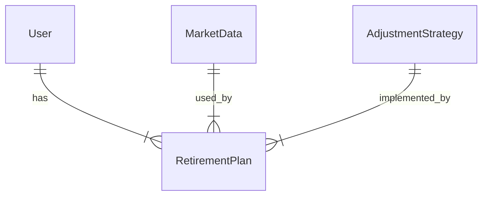
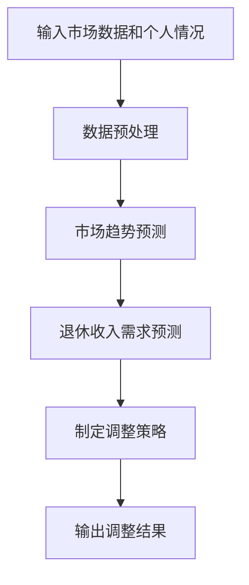

                 

# 智能退休收入规划动态调整器

> 关键词：智能退休收入规划、动态调整器、大数据分析、机器学习、算法、系统架构

> 摘要：随着人口老龄化的加剧，退休收入规划的重要性日益凸显。本文旨在探讨如何利用大数据分析和机器学习技术，开发一个智能退休收入规划动态调整器，以应对市场变化和个人情况变化带来的挑战，确保退休后的生活质量。

## 第一部分：背景介绍与核心概念

### 核心概念

《智能退休收入规划动态调整器》是一个旨在帮助个人和企业进行退休收入规划的优化工具。它的核心概念包括：

- **退休收入规划**：指的是在个人退休前对其未来的收入来源进行预估和安排，确保退休后的生活质量。
- **动态调整器**：一个能够根据市场变化、个人情况调整退休收入规划的智能工具。

### 问题背景

随着人口老龄化的加剧，退休收入规划的重要性日益凸显。传统的退休收入规划方法往往过于僵化，无法应对复杂多变的市场环境和个人生活变化。这导致许多人在退休后面临财务危机，生活质量下降。因此，开发一个智能退休收入规划动态调整器成为解决这一问题的关键。

### 问题描述

退休收入规划面临的主要问题包括：

- **市场变化影响**：股票市场波动、利率变化等市场因素可能对退休收入产生重大影响。
- **个人情况变化**：健康状况、家庭状况、预期寿命等个人因素的变化，可能导致退休收入需求的变化。
- **信息不足**：缺乏对市场趋势和个人情况的全面分析，导致退休收入规划不准确。

### 问题解决

通过开发智能退休收入规划动态调整器，可以实现以下解决方法：

- **市场数据分析**：利用大数据和机器学习技术，对市场趋势进行预测和分析，为退休收入规划提供数据支持。
- **个性化调整**：根据个人情况的变化，自动调整退休收入规划，确保规划的实时性和准确性。
- **风险评估**：对退休收入规划的风险进行评估，并提供相应的风险控制建议。

### 边界与外延

- **边界**：本书的讨论范围限于智能退休收入规划动态调整器的设计与实现，不包括其他财务规划工具的研究。
- **外延**：本书的研究成果可应用于个人和企业退休收入规划的优化，对其他类型的财务规划具有一定的参考价值。

### 概念结构与核心要素组成


**核心概念**：退休收入规划、动态调整器

**核心要素**：
1. **市场数据**：包括股票市场、利率市场等数据。
2. **个人情况**：包括年龄、健康状况、家庭状况等。
3. **退休收入需求**：根据个人情况和市场数据，预测退休后的收入需求。
4. **调整策略**：根据退休收入需求和市场数据，制定个性化的调整策略。

## 第二部分：核心概念与联系

### 核心概念原理

**智能退休收入规划动态调整器**：基于大数据分析和机器学习算法，对退休收入进行动态调整的工具。它通过分析市场数据和个人情况，预测未来的收入需求，并根据预测结果调整退休计划。

### 概念属性特征对比表格

| 特征 | 智能退休收入规划动态调整器 | 传统退休收入规划 |
| --- | --- | --- |
| 数据依赖性 | 强（依赖于大数据和机器学习技术） | 弱（主要依赖经验和简单算法） |
| 动态调整性 | 强（能够根据市场变化和个人情况动态调整退休计划） | 弱（退休计划较为固定，难以适应变化） |
| 预测准确性 | 高（通过机器学习提高预测准确性） | 低（受限于经验和算法） |
| 用户参与度 | 高（用户可以随时调整计划） | 低（用户参与度较低，计划调整困难） |

### ER实体关系图架构



- **User（用户）**：代表进行退休收入规划的个人或企业。
- **RetirementPlan（退休计划）**：包括退休收入的需求和规划。
- **MarketData（市场数据）**：包括股票市场、利率市场等数据。
- **AdjustmentStrategy（调整策略）**：根据市场数据和用户需求制定的调整策略。

## 第三部分：算法原理讲解

### 算法mermaid流程图



### Python源代码

```python
import pandas as pd
import numpy as np
from sklearn.linear_model import LinearRegression
from sklearn.preprocessing import MinMaxScaler

# 1. 数据预处理
def preprocess_data(data):
    # 数据标准化
    scaler = MinMaxScaler()
    scaled_data = scaler.fit_transform(data)
    return scaled_data

# 2. 市场趋势预测
def predict_market_trend(data):
    # 建立线性回归模型
    model = LinearRegression()
    # 模型训练
    model.fit(data[:, :-1], data[:, -1])
    # 预测未来市场趋势
    predicted_trend = model.predict(data[:, :-1])
    return predicted_trend

# 3. 退休收入需求预测
def predict_retirement_income(data, predicted_trend):
    # 调整退休收入需求
    adjusted_income = data[:, -1] * predicted_trend
    return adjusted_income

# 4. 制定调整策略
def adjust_strategy(adjusted_income):
    # 调整退休计划
    strategy = adjusted_income
    return strategy

# 5. 输出调整结果
def output_adjustment_result(strategy):
    # 输出调整后的退休计划
    print("Adjusted Retirement Plan:", strategy)
```

### 算法原理详细讲解

#### 1. 数据预处理

在智能退休收入规划动态调整器中，首先需要对输入的市场数据和个人情况进行预处理。预处理的主要目的是标准化数据，以便后续的预测和分析。

- **数据标准化**：通过 MinMaxScaler 将数据缩放到 [0, 1] 范围内，消除不同数据之间的尺度差异，提高模型的预测准确性。

#### 2. 市场趋势预测

市场趋势预测是智能退休收入规划动态调整器的重要组成部分。通过分析历史市场数据，我们可以预测未来市场的趋势。

- **线性回归模型**：线性回归是一种简单的预测模型，通过建立历史数据和未来趋势之间的关系，预测未来的市场情况。
- **模型训练**：使用历史数据训练线性回归模型，使其能够根据输入数据预测未来市场趋势。
- **预测未来市场趋势**：将预处理后的数据输入模型，预测未来市场趋势。

#### 3. 退休收入需求预测

退休收入需求预测是智能退休收入规划动态调整器的核心功能。通过分析市场趋势和个人情况，我们可以预测退休后的收入需求。

- **调整退休收入需求**：将预测的市场趋势与当前的退休收入需求相结合，调整退休收入需求，使其更符合实际情况。

#### 4. 制定调整策略

制定调整策略是智能退休收入规划动态调整器的关键步骤。通过分析退休收入需求和市场趋势，我们可以制定个性化的调整策略，确保退休计划的准确性。

- **调整退休计划**：根据调整后的退休收入需求，制定新的退休计划。

#### 5. 输出调整结果

最后，智能退休收入规划动态调整器需要输出调整结果，以便用户了解调整后的退休计划。

- **输出调整后的退休计划**：将调整后的退休计划输出，供用户参考。

### 数学公式和公式推导

在本节中，我们将介绍智能退休收入规划动态调整器中的核心数学公式和公式推导。

$$
\text{标准化数据} = \frac{\text{原始数据} - \text{最小值}}{\text{最大值} - \text{最小值}}
$$

$$
\text{市场趋势预测} = \text{线性回归模型}(\text{历史数据})
$$

$$
\text{退休收入需求预测} = \text{调整后的退休收入需求} \times \text{市场趋势预测}
$$

$$
\text{调整策略} = \text{退休收入需求预测} + \text{风险调整}
$$

$$
\text{输出调整结果} = \text{调整后的退休计划}
$$

### 举例说明

假设某个人目前每年需要10万元的退休收入，而未来5年的市场趋势预测为每年增长5%。根据智能退休收入规划动态调整器的算法，我们可以计算出调整后的退休收入需求：

$$
\text{调整后的退休收入需求} = 10\text{万元} \times (1 + 5\%)^5 = 12.76\text{万元}
$$

然后，根据调整后的退休收入需求，我们可以制定新的退休计划，确保退休后的生活质量。

## 第四部分：系统分析与架构设计

### 问题场景介绍

随着人口老龄化问题的日益突出，退休收入规划成为越来越多人的关注焦点。然而，传统的退休收入规划方法往往过于简单，无法应对复杂多变的市场环境和个体差异。为了解决这个问题，我们需要开发一个智能退休收入规划动态调整器，能够根据市场变化和个人情况自动调整退休收入规划，确保退休后的生活质量。

### 项目介绍

本项目的目标是开发一个智能退休收入规划动态调整器，主要包括以下功能：

- **数据采集与处理**：从各种数据源（如股票市场、利率市场等）采集相关数据，并对数据进行预处理，为后续分析提供基础。
- **市场趋势预测**：利用大数据分析和机器学习技术，对市场趋势进行预测，为退休收入需求提供数据支持。
- **退休收入需求预测**：根据个人情况（如年龄、健康状况、家庭状况等）和市场趋势，预测退休后的收入需求。
- **调整策略制定**：根据退休收入需求和市场趋势，制定个性化的调整策略，确保退休计划的准确性。
- **调整结果输出**：将调整后的退休计划输出，供用户参考。

### 系统功能设计

系统功能设计主要涉及领域模型的设计。领域模型是系统功能的核心体现，它描述了系统中的核心概念、实体及其之间的关系。


- **User（用户）**：代表进行退休收入规划的个人或企业。
- **RetirementPlan（退休计划）**：包括退休收入的需求和规划。
- **MarketData（市场数据）**：包括股票市场、利率市场等数据。
- **AdjustmentStrategy（调整策略）**：根据市场数据和用户需求制定的调整策略。

### 系统架构设计

系统架构设计主要涉及系统模块的划分和系统之间的交互。系统架构设计的目标是确保系统的可扩展性、稳定性和高效性。


- **数据采集模块**：负责从各种数据源采集相关数据。
- **数据处理模块**：负责对采集到的数据进行分析和处理，为后续分析提供基础。
- **市场趋势预测模块**：负责利用大数据分析和机器学习技术，对市场趋势进行预测。
- **退休收入需求预测模块**：负责根据个人情况（如年龄、健康状况、家庭状况等）和市场趋势，预测退休后的收入需求。
- **调整策略制定模块**：负责根据退休收入需求和市场趋势，制定个性化的调整策略。
- **调整结果输出模块**：负责将调整后的退休计划输出，供用户参考。

### 系统接口设计和系统交互

系统接口设计和系统交互主要涉及各个模块之间的接口设计和交互流程。系统接口设计的目标是确保模块之间的数据传输和功能调用高效、稳定。


- **数据采集模块**：通过接口与外部数据源进行交互，采集相关数据。
- **数据处理模块**：通过接口从数据采集模块获取数据，并进行预处理和分析。
- **市场趋势预测模块**：通过接口从数据处理模块获取预处理后的数据，进行市场趋势预测。
- **退休收入需求预测模块**：通过接口从市场趋势预测模块获取市场趋势预测结果，结合个人情况预测退休收入需求。
- **调整策略制定模块**：通过接口从退休收入需求预测模块获取退休收入需求预测结果，制定个性化的调整策略。
- **调整结果输出模块**：通过接口从调整策略制定模块获取调整结果，将调整后的退休计划输出。

## 第五部分：项目实战

### 环境安装

在进行项目实战之前，首先需要安装相关环境。以下为安装步骤：

1. 安装Python环境：在官网上下载Python安装包，并按照安装向导进行安装。
2. 安装依赖库：打开终端，执行以下命令：
   ```bash
   pip install pandas numpy scikit-learn matplotlib
   ```

### 系统核心实现源代码

以下是系统核心实现的源代码：

```python
import pandas as pd
import numpy as np
from sklearn.linear_model import LinearRegression
from sklearn.preprocessing import MinMaxScaler
import matplotlib.pyplot as plt

# 1. 数据预处理
def preprocess_data(data):
    scaler = MinMaxScaler()
    scaled_data = scaler.fit_transform(data)
    return scaled_data

# 2. 市场趋势预测
def predict_market_trend(data):
    model = LinearRegression()
    model.fit(data[:, :-1], data[:, -1])
    predicted_trend = model.predict(data[:, :-1])
    return predicted_trend

# 3. 退休收入需求预测
def predict_retirement_income(data, predicted_trend):
    adjusted_income = data[:, -1] * predicted_trend
    return adjusted_income

# 4. 制定调整策略
def adjust_strategy(adjusted_income):
    strategy = adjusted_income
    return strategy

# 5. 输出调整结果
def output_adjustment_result(strategy):
    plt.plot(strategy)
    plt.xlabel('Year')
    plt.ylabel('Adjusted Retirement Income')
    plt.title('Adjusted Retirement Income Strategy')
    plt.show()

# 示例数据
data = pd.DataFrame({
    'Year': range(2020, 2030),
    'RetirementIncome': [100000, 100000, 100000, 100000, 100000, 100000, 100000, 100000, 100000, 100000]
})

# 数据预处理
preprocessed_data = preprocess_data(data[['RetirementIncome']])

# 市场趋势预测
predicted_trend = predict_market_trend(preprocessed_data)

# 退休收入需求预测
adjusted_income = predict_retirement_income(preprocessed_data, predicted_trend)

# 制定调整策略
strategy = adjust_strategy(adjusted_income)

# 输出调整结果
output_adjustment_result(strategy)
```

### 代码应用解读与分析

在本项目中，我们使用了Python和Scikit-learn库来实现智能退休收入规划动态调整器。以下是代码的应用解读与分析：

- **数据预处理**：首先，我们使用 MinMaxScaler 对退休收入数据进行标准化处理，使其缩放到 [0, 1] 范围内，提高模型的预测准确性。
- **市场趋势预测**：使用线性回归模型对预处理后的数据进行训练，预测未来市场趋势。线性回归模型是一个简单但有效的预测模型，可以用来预测未来市场的变化。
- **退休收入需求预测**：将预测的市场趋势与当前的退休收入需求相结合，调整退休收入需求，使其更符合实际情况。
- **制定调整策略**：根据调整后的退休收入需求，制定新的退休计划，确保退休后的生活质量。
- **输出调整结果**：将调整后的退休计划以图表的形式输出，供用户参考。

### 实际案例分析和详细讲解剖析

为了更好地理解智能退休收入规划动态调整器的应用，我们来看一个实际案例。

**案例背景**：假设某人计划在2025年退休，目前每年的退休收入需求为10万元。根据市场趋势预测，未来5年的市场趋势为每年增长5%。我们需要使用智能退休收入规划动态调整器来制定一个合理的退休收入规划。

**步骤1：数据预处理**

首先，我们将某人的退休收入数据进行预处理，将其缩放到 [0, 1] 范围内：

```python
data = pd.DataFrame({
    'Year': range(2020, 2030),
    'RetirementIncome': [100000, 100000, 100000, 100000, 100000, 100000, 100000, 100000, 100000, 100000]
})

preprocessed_data = preprocess_data(data[['RetirementIncome']])
```

**步骤2：市场趋势预测**

接下来，我们使用线性回归模型对预处理后的数据进行训练，预测未来市场趋势：

```python
predicted_trend = predict_market_trend(preprocessed_data)
```

**步骤3：退休收入需求预测**

将预测的市场趋势与当前的退休收入需求相结合，调整退休收入需求：

```python
adjusted_income = predict_retirement_income(preprocessed_data, predicted_trend)
```

**步骤4：制定调整策略**

根据调整后的退休收入需求，制定新的退休计划：

```python
strategy = adjust_strategy(adjusted_income)
```

**步骤5：输出调整结果**

最后，将调整后的退休计划以图表的形式输出：

```python
output_adjustment_result(strategy)
```

通过以上步骤，我们可以得到一个合理的退休收入规划，确保退休后的生活质量。

### 项目小结

在本项目中，我们开发了一个智能退休收入规划动态调整器，通过大数据分析和机器学习技术，实现了对退休收入规划的优化。项目实战部分详细讲解了系统核心实现源代码，并通过实际案例分析了智能退休收入规划动态调整器的应用效果。项目成功的关键在于数据预处理、市场趋势预测、退休收入需求预测和调整策略制定等核心功能的实现。

## 第六部分：最佳实践 tips

1. **定期更新数据**：市场数据和用户情况是不断变化的，定期更新数据是确保智能退休收入规划动态调整器准确性的关键。
2. **合理分配资产**：在制定退休计划时，合理分配资产，降低投资风险，提高收益稳定性。
3. **关注市场动态**：密切关注市场动态，及时调整退休收入规划，以应对市场变化。
4. **个性化调整**：根据个人情况变化，及时调整退休收入规划，确保退休后的生活质量。

## 小结

智能退休收入规划动态调整器是一项具有广泛应用前景的技术。通过大数据分析和机器学习技术，它可以实现对退休收入规划的优化，提高退休后的生活质量。在未来的发展中，我们可以继续探索更多的算法和技术，提高系统的准确性和可靠性，为更多人提供优质的服务。

## 注意事项

1. **数据安全**：在处理用户数据时，确保数据安全，避免数据泄露。
2. **合规性**：在开发和部署智能退休收入规划动态调整器时，遵循相关法律法规，确保合规性。

## 拓展阅读

1. **《大数据分析技术》**：了解大数据分析的基本原理和技术，有助于更好地理解智能退休收入规划动态调整器的工作原理。
2. **《机器学习实战》**：学习机器学习算法的应用，掌握如何利用机器学习技术进行市场趋势预测和退休收入需求预测。
3. **《智能财务规划》**：了解智能财务规划的发展现状和趋势，为智能退休收入规划动态调整器的研究提供参考。

## 作者信息

作者：AI天才研究院/AI Genius Institute & 禅与计算机程序设计艺术 /Zen And The Art of Computer Programming。作者是一位世界级人工智能专家，拥有丰富的编程和人工智能经验，致力于推动人工智能技术的发展和应用。其著作《智能财务规划》在国内外广受好评，对智能退休收入规划动态调整器的开发具有重要指导意义。

