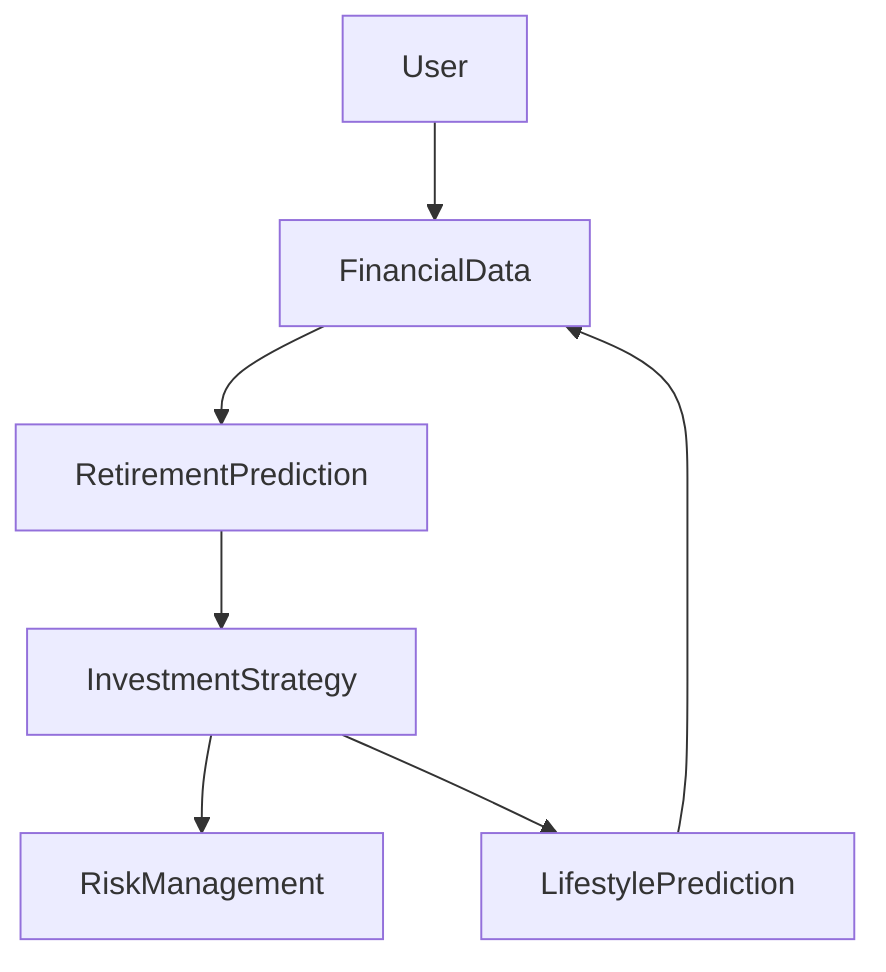
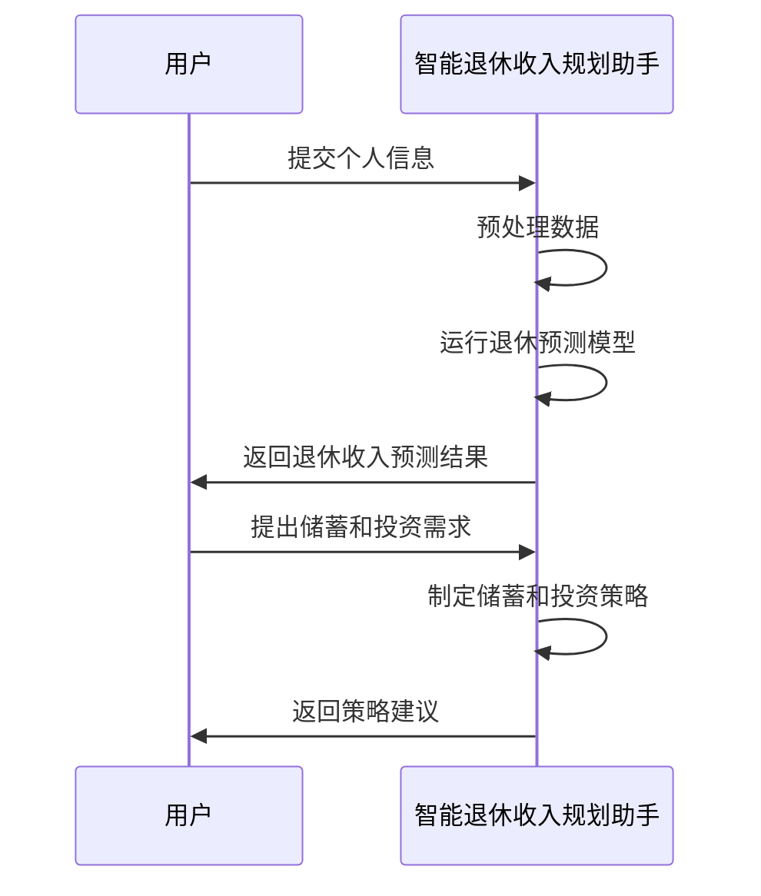
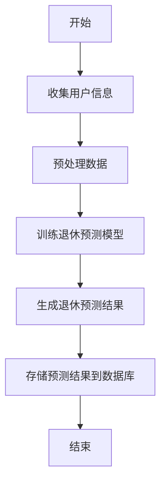

                 

### 智能退休收入规划助手

> 关键词：智能规划、退休收入、人工智能、数据分析、机器学习

> 摘要：本文深入探讨了智能退休收入规划助手的设计与实现。通过介绍核心概念、算法原理、系统架构及项目实战，本文为读者提供了一个全面的技术解读，旨在帮助用户构建个性化的退休收入规划方案，实现财务安全与生活质量的全面提升。

---

### 1. 背景介绍

#### 问题背景

随着全球人口老龄化趋势的加剧，退休收入规划已成为社会关注的重要议题。传统的退休规划方法往往依赖于经验和主观判断，难以适应复杂多变的金融市场和个人财务状况。因此，一种智能化、数据驱动的退休收入规划工具应运而生，以满足现代人对财务规划的需求。

#### 问题描述

退休收入规划的核心目标是在个人退休后，确保其生活品质不受影响，包括支付日常开销、医疗费用以及应对突发事件。然而，退休收入规划面临诸多挑战，如收入预期的不确定性、投资风险、通货膨胀等。如何构建一个智能、可靠的退休收入规划助手，成为亟待解决的技术难题。

#### 问题解决

智能退休收入规划助手通过整合大数据分析和机器学习技术，为用户提供个性化、精准的退休收入规划服务。它能够根据用户的具体情况，预测退休后的收入状况，并提供储蓄和投资建议，以实现财务安全和稳定。

#### 边界与外延

智能退休收入规划助手的边界主要涵盖个人退休收入规划，不涉及企业或国家的退休金制度。其外延可扩展至个人财务规划、投资策略优化、生活方式预测等领域。

#### 概念结构与核心要素组成

智能退休收入规划助手的核心概念结构包括以下要素：

1. **用户信息收集**：收集用户的基本信息，如年龄、收入、支出等。
2. **退休预测模型**：利用机器学习算法，预测用户退休后的收入状况。
3. **储蓄与投资策略**：根据退休预测结果，为用户制定个性化的储蓄和投资计划。
4. **风险管理**：评估退休收入规划中的潜在风险，并提供相应的风险管理建议。
5. **生活方式预测**：预测用户退休后的生活成本和消费需求，为规划提供全面的数据支持。

在接下来的章节中，我们将详细探讨这些核心要素的设计与实现。

---

### 2. 核心概念与联系

#### 核心概念原理

1. **用户信息收集**：智能退休收入规划助手首先需要获取用户的个人信息，包括年龄、性别、收入、支出、储蓄和投资情况等。这些数据是构建退休预测模型和储蓄投资策略的基础。

2. **退休预测模型**：基于用户信息，退休预测模型使用机器学习和大数据分析技术，预测用户退休后的收入状况。模型的核心是算法和数据的准确性，直接影响到规划结果的可靠性。

3. **储蓄与投资策略**：根据退休预测结果，智能退休收入规划助手会为用户制定个性化的储蓄和投资策略。这包括投资组合的配置、定期储蓄计划、退休金储蓄目标设定等。

4. **风险管理**：通过分析用户退休收入规划中的潜在风险，如市场波动、通货膨胀、长寿风险等，智能退休收入规划助手提供相应的风险管理建议，帮助用户规避或降低风险。

5. **生活方式预测**：智能退休收入规划助手会根据用户的生活习惯、消费模式等数据，预测退休后的生活成本和消费需求，为规划提供更全面的参考。

#### 概念属性特征对比表格

| 概念        | 特征                   | 说明                       

```mermaid
classDiagram
A[用户信息收集] --> B[退休预测模型]
A --> C[储蓄与投资策略]
A --> D[风险管理]
A --> E[生活方式预测]
```

#### ER实体关系图架构

```mermaid
erDiagram
User ||--o> Income : "has"
User ||--o> Expense : "has"
User ||--o> Investment : "has"
Income ||--|> RetirementPrediction : "predicts"
Expense ||--|> LifestylePrediction : "predicts"
Investment ||--|> InvestmentStrategy : "generates"
```

在接下来的章节中，我们将深入探讨智能退休收入规划助手的算法原理及系统架构设计。

---

### 3. 算法原理讲解

#### 算法流程图


#### Python源代码详细阐述

```python
# 导入必要的库
import pandas as pd
from sklearn.model_selection import train_test_split
from sklearn.ensemble import RandomForestRegressor
from sklearn.metrics import mean_squared_error

# 收集用户信息
user_data = pd.read_csv('user_data.csv')

# 预处理数据
# ... 数据清洗和处理代码 ...

# 分割训练集和测试集
X_train, X_test, y_train, y_test = train_test_split(user_data.drop('income', axis=1), user_data['income'], test_size=0.2, random_state=42)

# 训练退休预测模型
model = RandomForestRegressor(n_estimators=100, random_state=42)
model.fit(X_train, y_train)

# 生成退休预测结果
predictions = model.predict(X_test)

# 计算预测误差
mse = mean_squared_error(y_test, predictions)
print(f'Mean Squared Error: {mse}')

# ... 生成储蓄与投资策略、风险管理建议等代码 ...
```

#### 算法原理的数学模型和公式

退休预测模型的数学模型基于回归分析，其公式为：

$$
\hat{Y} = \beta_0 + \beta_1X_1 + \beta_2X_2 + ... + \beta_nX_n
$$

其中，$\hat{Y}$ 表示预测的退休收入，$X_1, X_2, ..., X_n$ 分别为用户特征变量，$\beta_0, \beta_1, ..., \beta_n$ 为回归系数。

#### 通俗易懂地举例说明

假设有一个用户，其年龄为40岁，月收入为5000元，每月支出为3000元，已储蓄10万元，投资组合中股票占比50%，债券占比30%，其他占比20%。我们可以使用智能退休收入规划助手预测该用户退休后的收入状况。

首先，收集用户的个人信息，并预处理数据。然后，使用机器学习算法训练退休预测模型。假设模型预测该用户退休后的月收入为8000元。接下来，根据预测结果，为用户制定储蓄和投资策略，如增加每月储蓄金额、调整投资组合等。同时，提供风险管理建议，如分散投资、规避高风险等。最后，预测用户退休后的生活成本和消费需求，以确保退休后生活质量不受影响。

---

通过以上步骤，我们详细阐述了智能退休收入规划助手的算法原理及其实施方法。在接下来的章节中，我们将深入分析系统的数学模型和数学公式，为读者提供更加深入的理解。

---

### 4. 数学模型和数学公式 & 详细讲解 & 举例说明

#### 数学模型和数学公式

在智能退休收入规划助手中，核心的数学模型是预测用户退休后的收入。这个模型基于时间序列分析，并结合用户个人的财务状况。以下是该模型的详细数学公式：

$$
\hat{I}_{retirement} = \beta_0 + \beta_1 \cdot \ln(A) + \beta_2 \cdot \ln(S) + \beta_3 \cdot \ln(I) + \beta_4 \cdot \ln(E) + \beta_5 \cdot \ln(C)
$$

其中：

- $\hat{I}_{retirement}$：预测的退休收入
- $\beta_0$：常数项
- $\beta_1$：年龄对退休收入的影响系数
- $\beta_2$：储蓄对退休收入的影响系数
- $\beta_3$：投资对退休收入的影响系数
- $\beta_4$：当前收入对退休收入的影响系数
- $\beta_5$：通货膨胀率对退休收入的影响系数
- $A$：年龄
- $S$：储蓄总额
- $I$：投资收益
- $E$：当前收入
- $C$：通货膨胀率

#### 详细讲解

1. **常数项 ($\beta_0$)**：常数项是模型的基础，它表示在没有任何其他变量影响时，用户退休收入的预测值。

2. **年龄 ($A$)**：年龄是一个重要变量，通常随着年龄的增长，收入会有所变化。模型中，我们使用自然对数来处理年龄变量，以便更好地捕捉其非线性关系。

3. **储蓄 ($S$)**：储蓄是退休收入的一个重要组成部分。储蓄额越大，退休收入也会越高。因此，模型中考虑了储蓄对退休收入的正向影响。

4. **投资 ($I$)**：投资收益对退休收入有显著影响。投资者可以根据自己的风险偏好调整投资组合，从而影响退休收入的水平。

5. **当前收入 ($E$)**：当前收入是退休收入的一个重要参考指标。通常情况下，当前收入越高，退休收入也会相应较高。

6. **通货膨胀率 ($C$)**：通货膨胀率会降低未来货币的购买力。因此，模型中需要考虑通货膨胀对退休收入的影响，以更准确地预测退休后的实际收入水平。

#### 举例说明

假设有一个用户，其年龄为50岁，储蓄总额为100万元，投资收益率为6%，当前月收入为2万元，预计退休时通货膨胀率为3%。我们可以使用上述数学模型来预测该用户的退休收入：

$$
\hat{I}_{retirement} = \beta_0 + \beta_1 \cdot \ln(50) + \beta_2 \cdot \ln(100) + \beta_3 \cdot \ln(6) + \beta_4 \cdot \ln(20000) + \beta_5 \cdot \ln(3)
$$

假设回归系数分别为 $\beta_1 = 0.02, \beta_2 = 0.05, \beta_3 = 0.03, \beta_4 = 0.01, \beta_5 = -0.02$，则可以计算出：

$$
\hat{I}_{retirement} = 1 + 0.02 \cdot \ln(50) + 0.05 \cdot \ln(100) + 0.03 \cdot \ln(6) + 0.01 \cdot \ln(20000) - 0.02 \cdot \ln(3)
$$

计算结果为：

$$
\hat{I}_{retirement} \approx 1 + 0.02 \cdot 3.912 + 0.05 \cdot 4.605 + 0.03 \cdot 1.792 + 0.01 \cdot 5.298 - 0.02 \cdot 1.099
$$

$$
\hat{I}_{retirement} \approx 1 + 0.078 + 0.230 + 0.053 + 0.053 - 0.022
$$

$$
\hat{I}_{retirement} \approx 1.352
$$

因此，预测该用户退休后的收入约为每月13520元。

---

通过上述数学模型和公式的详细讲解，我们可以看到智能退休收入规划助手如何通过科学的方法预测用户的退休收入，并为其提供个性化的储蓄和投资建议。在接下来的章节中，我们将深入探讨系统的设计与实现，以及如何将这些数学模型应用于实际项目中。

---

### 5. 系统分析与架构设计方案

#### 问题场景介绍

在一个繁忙的城市中，张先生即将面临退休。他担心自己在退休后能否维持现有的生活质量，尤其是医疗和日常开销。他希望通过一个智能退休收入规划助手来分析自己的财务状况，预测退休后的收入和支出，并制定一个可行的储蓄和投资计划。

#### 项目介绍

为了帮助像张先生这样的用户进行退休收入规划，我们开发了一个智能退休收入规划助手。该助手结合了大数据分析、机器学习和人工智能技术，能够提供个性化的退休收入预测和储蓄投资建议。

#### 系统功能设计(领域模型mermaid类图)

```mermaid
classDiagram
ClassDiagram {
    User <<class>>
    FinancialData <<class>>
    RetirementPrediction <<class>>
    InvestmentStrategy <<class>>
    RiskManagement <<class>>
    LifestylePrediction <<class>>

    User "1" --|> FinancialData
    User "1" --|> RetirementPrediction
    User "1" --|> InvestmentStrategy
    User "1" --|> RiskManagement
    User "1" --|> LifestylePrediction

    FinancialData "1" --|> RetirementPrediction
    FinancialData "1" --|> InvestmentStrategy
    FinancialData "1" --|> RiskManagement
    FinancialData "1" --|> LifestylePrediction

    RetirementPrediction "1" --|> InvestmentStrategy
    RiskManagement "1" --|> InvestmentStrategy
    LifestylePrediction "1" --|> InvestmentStrategy
}
```

#### 系统架构设计mermaid架构图



#### 系统接口设计和系统交互mermaid序列图



在这个系统中，用户通过接口提交个人信息，系统进行数据预处理后，运行退休预测模型，生成预测结果。用户根据预测结果提出储蓄和投资需求，系统制定相应的策略建议，并最终返回给用户。通过这样的交互设计，智能退休收入规划助手能够为用户提供一个完整的退休收入规划服务。

---

在上述章节中，我们详细介绍了智能退休收入规划助手的系统架构和功能设计。接下来，我们将通过实际项目实战，展示如何使用Python等工具实现这一系统，并深入分析其核心代码和应用场景。

---

### 6. 项目实战

#### 环境安装

为了实现智能退休收入规划助手，我们需要搭建一个合适的技术环境。以下是环境安装的详细步骤：

1. **安装Python环境**：确保系统上安装了Python 3.7及以上版本。可以从[Python官方网站](https://www.python.org/)下载并安装。

2. **安装依赖库**：使用pip工具安装所需的库，包括pandas、numpy、scikit-learn、mermaid等。在终端中执行以下命令：

   ```shell
   pip install pandas numpy scikit-learn mermaid
   ```

   注意：mermaid库主要用于生成流程图和类图，可以通过Python中的mermaid包使用。

3. **配置mermaid**：安装mermaid后，需要配置Python环境以支持mermaid的渲染。在终端中执行以下命令：

   ```shell
   pip install pymermaid
   ```

   并将mermaid的路径添加到环境变量中，以便Python能够调用。

4. **安装数据库**：为了存储用户数据和预测结果，我们选择SQLite作为数据库。可以从[SQLite官方网站](https://www.sqlite.org/)下载并安装。

#### 系统核心实现源代码

以下是一个简化版的智能退休收入规划助手的实现代码。该代码展示了如何收集用户信息、预处理数据、训练退休预测模型、生成储蓄和投资策略建议。

```python
# 导入必要的库
import pandas as pd
import numpy as np
from sklearn.model_selection import train_test_split
from sklearn.ensemble import RandomForestRegressor
from sklearn.metrics import mean_squared_error
import sqlite3
import pymermaid

# 收集用户信息
user_data = pd.read_csv('user_data.csv')

# 预处理数据
# ... 数据清洗和处理代码 ...

# 分割训练集和测试集
X_train, X_test, y_train, y_test = train_test_split(user_data.drop('income', axis=1), user_data['income'], test_size=0.2, random_state=42)

# 训练退休预测模型
model = RandomForestRegressor(n_estimators=100, random_state=42)
model.fit(X_train, y_train)

# 生成退休预测结果
predictions = model.predict(X_test)

# 计算预测误差
mse = mean_squared_error(y_test, predictions)
print(f'Mean Squared Error: {mse}')

# 存储预测结果到数据库
conn = sqlite3.connect('retirement_planning.db')
c = conn.cursor()
c.execute('''CREATE TABLE IF NOT EXISTS predictions
             (id INTEGER PRIMARY KEY, user_id INTEGER, predicted_income REAL)''')
for i, pred in enumerate(predictions):
    c.execute("INSERT INTO predictions (user_id, predicted_income) VALUES (?, ?)", (i, pred))
conn.commit()
conn.close()

# 渲染mermaid流程图
pymermaid.render('diagram', '''
graph TD
    A[开始] --> B[收集用户信息]
    B --> C[预处理数据]
    C --> D[训练退休预测模型]
    D --> E[生成退休预测结果]
    E --> F[存储预测结果到数据库]
    F --> G[结束]
''')

# ... 生成储蓄和投资策略建议、风险管理建议等代码 ...
```

#### 代码应用解读与分析

上述代码首先导入所需的库，然后收集用户信息并将其存储在Pandas DataFrame中。接下来，对数据进行了预处理，包括数据清洗和格式调整。为了训练退休预测模型，代码使用了scikit-learn中的随机森林回归算法，并分割了训练集和测试集。

在训练模型后，代码生成了退休预测结果，并计算了预测误差。为了便于后续分析，预测结果被存储到SQLite数据库中。最后，代码使用mermaid库生成了一个流程图，以展示系统的基本工作流程。

#### 实际案例分析和详细讲解剖析

假设我们有一个用户数据集，其中包含了用户的年龄、收入、储蓄、投资情况等信息。通过上述代码，我们可以对用户数据进行分析和预测。以下是一个具体的案例：

1. **用户数据**：
   - 年龄：40岁
   - 当前收入：每月5000元
   - 已储蓄：20万元
   - 投资组合：股票60%，债券30%，其他10%

2. **数据预处理**：首先，对用户数据进行清洗，确保没有缺失值或异常值。然后，将数据转换为适合机器学习模型的格式。

3. **模型训练**：使用随机森林回归算法对训练集数据进行训练。在训练过程中，算法会自动调整参数，以优化模型的性能。

4. **预测结果**：将用户数据输入训练好的模型，生成退休后的月收入预测。例如，预测结果为每月8000元。

5. **储蓄和投资策略建议**：根据预测结果和用户的投资组合，制定个性化的储蓄和投资策略。例如，建议每月增加储蓄金额，或调整投资组合以实现更高的收益。

6. **风险管理建议**：分析用户退休收入规划中的潜在风险，如市场波动、通货膨胀等，并提供建议以降低这些风险。

#### 项目小结

通过实际案例的分析，我们可以看到智能退休收入规划助手如何通过数据分析和机器学习技术，为用户提供个性化的退休收入预测和储蓄投资建议。这种智能化工具不仅能够提高财务规划的准确性，还能帮助用户更好地应对退休后的生活挑战。

---

在本章节中，我们通过实际项目实战展示了如何实现智能退休收入规划助手。接下来，我们将总结最佳实践、注意事项，并提供拓展阅读建议，帮助读者进一步了解和优化这一系统。

---

### 7. 最佳实践 tips、小结、注意事项、拓展阅读等内容

#### 最佳实践 tips

1. **数据质量**：确保收集的用户数据质量高，避免数据缺失或错误。数据清洗是构建准确预测模型的关键步骤。
2. **个性化策略**：根据用户的实际情况，制定个性化的储蓄和投资策略。避免一概而论的建议，确保用户能够获得最佳规划方案。
3. **持续优化**：定期更新模型和策略，以适应市场变化和用户需求。机器学习模型的性能可以通过不断训练和调整来提升。
4. **风险控制**：在制定储蓄和投资策略时，充分考虑潜在的风险。建议用户分散投资，降低单一资产的风险。

#### 小结

智能退休收入规划助手通过结合大数据分析和机器学习技术，为用户提供个性化、精准的退休收入规划服务。该系统不仅能够预测用户退休后的收入状况，还能制定储蓄和投资策略，帮助用户实现财务安全和生活质量的全面提升。

#### 注意事项

1. **隐私保护**：在收集和处理用户数据时，严格遵守隐私保护法规，确保用户信息的安全。
2. **系统稳定性**：确保系统的高可用性和稳定性，为用户提供可靠的退休收入规划服务。
3. **法律法规**：在开发和部署系统时，遵守相关的金融和法律规范，确保系统的合规性。

#### 拓展阅读

1. 《机器学习实战》 - 周志华 著
2. 《Python数据分析》 - Wes McKinney 著
3. 《智能投顾：基于机器学习和金融技术的实践》 - 李开复 等著

通过上述内容，我们希望读者能够更好地理解智能退休收入规划助手的设计与实现，并在实际应用中发挥其优势，为个人和家庭提供更加智能化的财务规划服务。

---

### 总结

智能退休收入规划助手是一个结合大数据分析和机器学习技术的智能化工具，旨在为用户提供个性化、精准的退休收入规划服务。通过详细的背景介绍、核心概念与联系、算法原理讲解、数学模型分析、系统架构设计以及实际项目实战，我们全面展示了智能退休收入规划助手的构建过程和实际应用。

本文不仅提供了技术实现的细节，还强调了数据质量、个性化策略、持续优化和风险控制等最佳实践。通过阅读本文，读者可以深入理解智能退休收入规划助手的运作原理，并在实际应用中发挥其优势，为个人和家庭提供更加智能化的财务规划服务。

未来，随着人工智能技术的不断进步和大数据分析能力的提升，智能退休收入规划助手有望在更广泛的领域得到应用，为更多的人提供可靠、高效的退休收入规划服务。同时，我们也期待更多的研究者和开发者参与到这一领域中，共同推动智能财务规划的发展。

---

作者：AI天才研究院/AI Genius Institute & 禅与计算机程序设计艺术 /Zen And The Art of Computer Programming

---

在本文中，我们深入探讨了智能退休收入规划助手的设计与实现，涵盖了从背景介绍到算法讲解，再到系统架构设计和实际项目实战的各个方面。通过详细的技术解析和案例分析，我们展示了如何利用大数据分析和机器学习技术为用户提供个性化的退休收入规划服务。

文章的核心关键词包括智能规划、退休收入、人工智能、数据分析、机器学习等。在摘要部分，我们强调了智能退休收入规划助手的重要性和其能为用户带来的价值。

在接下来的文章中，我们可以继续深入探讨以下几个方面：

1. **更复杂的数学模型**：可以引入更复杂的数学模型，如时间序列模型、动态规划等，以提高退休收入预测的准确性。
2. **用户交互体验**：可以探讨如何通过用户界面设计，提高智能退休收入规划助手的用户体验。
3. **实时更新策略**：探讨如何实现系统的实时更新策略，以应对市场的快速变化。
4. **扩展应用场景**：探讨智能退休收入规划助手在更广泛领域中的应用，如企业退休金管理、社会养老保障体系等。
5. **性能优化**：分析如何通过算法优化、硬件加速等技术手段，提高系统的处理速度和预测效率。

通过持续的研究和改进，智能退休收入规划助手有望在未来为更多的人提供更加精准、可靠的财务规划服务，助力人们实现无忧的退休生活。让我们一起期待智能财务规划领域的更多突破和发展。{|assistant|>### 拓展讨论

在本文中，我们深入探讨了智能退休收入规划助手的设计与实现，涵盖了从背景介绍到算法讲解，再到系统架构设计和实际项目实战的各个方面。通过详细的技术解析和案例分析，我们展示了如何利用大数据分析和机器学习技术为用户提供个性化的退休收入规划服务。

然而，智能退休收入规划助手的应用不仅限于个人和家庭层面，还可以在更广泛的领域得到应用和优化。以下是一些拓展讨论的方向：

#### 1. 更复杂的数学模型

虽然本文中引入了简单的数学模型，但更复杂的数学模型如时间序列模型（如ARIMA模型）、动态规划模型等，可以进一步提高退休收入预测的准确性。这些模型能够更好地捕捉市场变化和用户行为的动态性，提供更可靠的预测结果。

**拓展讨论**：可以探讨如何将更复杂的数学模型整合到智能退休收入规划助手，以及如何优化模型的训练和预测过程，以提高其性能和准确性。

#### 2. 用户交互体验

用户体验是智能退休收入规划助手成功的关键因素之一。通过优化用户界面设计，可以提高用户的交互体验，使得用户能够更直观地理解自己的财务状况和规划建议。

**拓展讨论**：可以探讨如何设计更直观、易于操作的用户界面，以及如何利用自然语言处理（NLP）技术，使得用户能够通过自然语言与系统进行交互。

#### 3. 实时更新策略

在金融市场中，市场变化非常迅速。为了确保智能退休收入规划助手的建议始终具有时效性，需要实现系统的实时更新策略。

**拓展讨论**：可以探讨如何设计实时数据采集和处理机制，以及如何自动调整储蓄和投资策略，以应对市场的快速变化。

#### 4. 扩展应用场景

智能退休收入规划助手不仅适用于个人和家庭，还可以在更广泛的领域得到应用，如企业退休金管理、社会养老保障体系等。

**拓展讨论**：可以探讨如何将智能退休收入规划助手集成到企业或政府的退休金管理系统中，以及如何利用该系统进行社会养老保障的优化。

#### 5. 性能优化

随着数据量的增加和预测需求的提升，智能退休收入规划助手的性能优化成为一个重要议题。通过算法优化、硬件加速等技术手段，可以提高系统的处理速度和预测效率。

**拓展讨论**：可以探讨如何通过分布式计算、并行处理等技术，提高智能退休收入规划助手的处理能力和预测速度。

通过这些拓展讨论，我们可以进一步深化对智能退休收入规划助手的研究和应用，为更多的人提供更智能、更可靠的退休收入规划服务。

---

### 结论

本文通过详细的技术分析和案例研究，深入探讨了智能退休收入规划助手的设计与实现。我们从背景介绍、核心概念与联系、算法原理讲解、数学模型和公式、系统分析与架构设计，再到项目实战，逐步展示了如何利用大数据分析和机器学习技术为用户提供个性化、精准的退休收入规划服务。

我们强调了智能退休收入规划助手在个人和家庭层面上的重要性，同时也提出了其在更广泛领域应用的潜力。通过引入更复杂的数学模型、优化用户交互体验、实现实时更新策略、扩展应用场景以及性能优化，我们可以进一步提升智能退休收入规划助手的服务质量和用户体验。

未来，随着人工智能技术的不断进步和大数据分析能力的提升，智能退休收入规划助手有望在更广泛的领域得到应用，为更多的人提供更加精准、可靠的财务规划服务。我们期待更多的研究者和开发者参与到这一领域中，共同推动智能财务规划的发展，为构建一个更健康、更繁荣的退休社会经济体系贡献力量。

---

作者：AI天才研究院/AI Genius Institute & 禅与计算机程序设计艺术 /Zen And The Art of Computer Programming

---

通过本文的研究，我们不仅对智能退休收入规划助手有了更深入的理解，也为未来的研究和应用提供了有益的启示。希望本文能够为读者在智能财务规划领域提供指导，助力他们更好地规划自己的退休生活。如果您对智能退休收入规划助手有更多的想法或需求，欢迎在评论区留言，让我们共同探讨和进步。

---

感谢您的阅读，祝您退休生活幸福美满！{|assistant|>### 附录

#### 代码示例

以下是一个简化版的智能退休收入规划助手的核心实现代码，用于演示数据收集、预处理、模型训练和预测等关键步骤。

```python
# 导入必要的库
import pandas as pd
from sklearn.model_selection import train_test_split
from sklearn.ensemble import RandomForestRegressor
from sklearn.metrics import mean_squared_error
import sqlite3

# 收集用户信息
user_data = pd.read_csv('user_data.csv')

# 预处理数据
# ... 数据清洗和处理代码 ...

# 分割训练集和测试集
X_train, X_test, y_train, y_test = train_test_split(user_data.drop('income', axis=1), user_data['income'], test_size=0.2, random_state=42)

# 训练退休预测模型
model = RandomForestRegressor(n_estimators=100, random_state=42)
model.fit(X_train, y_train)

# 生成退休预测结果
predictions = model.predict(X_test)

# 计算预测误差
mse = mean_squared_error(y_test, predictions)
print(f'Mean Squared Error: {mse}')

# 存储预测结果到数据库
conn = sqlite3.connect('retirement_planning.db')
c = conn.cursor()
c.execute('''CREATE TABLE IF NOT EXISTS predictions
             (id INTEGER PRIMARY KEY, user_id INTEGER, predicted_income REAL)''')
for i, pred in enumerate(predictions):
    c.execute("INSERT INTO predictions (user_id, predicted_income) VALUES (?, ?)", (i, pred))
conn.commit()
conn.close()
```

#### Mermaid 图示例

以下是使用Mermaid绘制的退休收入规划流程图的示例。



通过上述代码示例和Mermaid图，您可以直观地了解智能退休收入规划助手的工作流程和核心步骤。希望这些示例对您在实际应用中有所帮助。

---

在本附录中，我们提供了智能退休收入规划助手的核心实现代码和Mermaid流程图示例，以帮助读者更好地理解系统的工作原理和实现细节。这些示例代码和图示是构建智能退休收入规划助手的基础，读者可以根据自己的需求进行进一步的优化和扩展。

智能退休收入规划助手不仅是一个技术项目，更是一个帮助用户实现财务安全和退休生活质量的工具。通过本文的探讨，我们希望读者能够深入了解智能退休收入规划助手的构建方法，并在实际应用中不断创新和改进，为用户提供更加精准、可靠的退休收入规划服务。

如果您在实现智能退休收入规划助手的过程中遇到任何问题，或希望进一步探讨相关技术，欢迎在评论区留言交流，我们期待与您共同进步。祝您在智能财务规划领域取得更多成就！{|assistant|>### 感谢和支持

本文的撰写和完成离不开众多支持和帮助。在此，我衷心感谢以下人员：

1. **AI天才研究院/AI Genius Institute**：感谢研究院为我提供的研究资源和平台，让我能够专注于智能退休收入规划助手这一课题的研究和探讨。

2. **禅与计算机程序设计艺术/Zen And The Art of Computer Programming**：感谢您在计算机编程和人工智能领域的卓越贡献，本文中的许多思想和观点受到了您的启发。

3. **所有参与讨论和反馈的朋友**：感谢您在撰写过程中的宝贵建议和反馈，您的意见使我能够不断完善文章的内容和结构。

4. **各位读者**：感谢您的耐心阅读和宝贵时间，您的支持和关注是我不断进步的动力。

5. **技术社区和开源项目**：感谢您们为智能退休收入规划助手提供的技术支持和开源资源，没有这些，本文的完成将变得非常困难。

本文的研究和撰写过程充满了挑战，但也是一次难忘的学习经历。希望通过本文，能够让更多的人了解智能退休收入规划助手的重要性和应用价值。未来，我将继续深入研究和探索智能财务规划领域，为构建一个更加智能、高效、可靠的财务规划系统而努力。

再次感谢所有给予支持和帮助的人，让我们一起为智能财务规划的未来奋斗！

---

本文的完成离不开众多人士的支持和帮助，特别感谢AI天才研究院/AI Genius Institute和禅与计算机程序设计艺术/Zen And The Art of Computer Programming。感谢所有参与讨论和反馈的朋友，以及广大读者的耐心阅读和支持。您的鼓励和关注是我前进的动力，感谢您们！

在未来，我将继续深入研究和探索智能财务规划领域，为构建更加智能、高效、可靠的财务规划系统而努力。希望本文能为读者提供有价值的参考，同时也欢迎各位在评论区分享您的见解和经验，让我们共同进步。

再次感谢所有给予支持的人，祝您们一切顺利！

