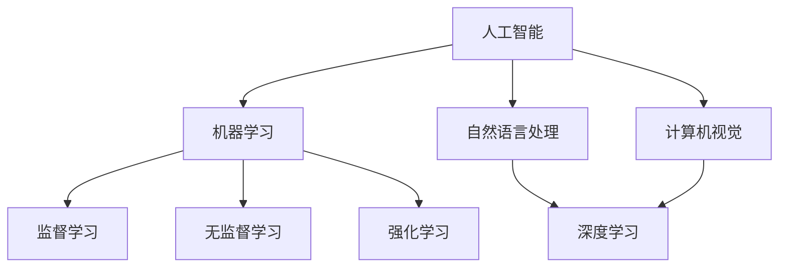
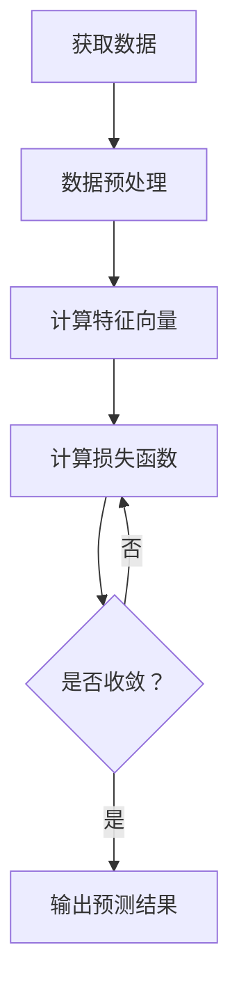
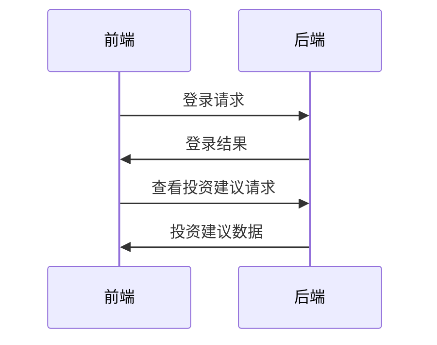

                 

# 《智能金融顾问系统的设计与实现》目录

## 关键词
智能金融，顾问系统，设计，实现，人工智能，机器学习，深度学习，系统架构，项目实战

## 摘要
本文将深入探讨智能金融顾问系统的设计与实现过程。我们将从背景介绍出发，了解智能金融顾问系统的概念、现状及挑战。随后，我们将介绍核心概念与联系，包括人工智能、机器学习、深度学习等。接着，我们讲解算法原理，使用mermaid流程图、python源代码和latex公式进行详细阐述。然后，我们将分析系统架构设计，描述系统功能、架构、接口和交互。在项目实战部分，我们将详细介绍系统核心实现源代码，并剖析实际案例。最后，我们将给出最佳实践tips、小结、注意事项和拓展阅读。

## 1. 背景介绍

### 1.1 智能金融顾问系统概述

智能金融顾问系统是指利用人工智能技术，为用户提供个性化的金融投资建议和决策支持的服务系统。它结合了金融学、计算机科学和大数据分析等多个领域的知识，通过数据挖掘、机器学习、自然语言处理等技术，对用户的数据进行分析，从而提供精准的金融顾问服务。

### 1.2 智能金融顾问系统的现状与挑战

智能金融顾问系统在全球范围内得到了广泛应用，但仍面临许多挑战。首先，数据隐私和安全问题是智能金融顾问系统需要解决的首要问题。其次，系统的决策准确性取决于数据的质量和算法的优化。此外，如何平衡个性化与合规性也是系统设计中的重要问题。

### 1.3 设计目标与需求分析

设计智能金融顾问系统的目标主要包括：提供个性化的投资建议、确保数据安全和隐私、提高决策准确性、满足合规性要求。在需求分析方面，我们需要考虑用户需求、功能需求、性能需求等多个方面。

## 2. 核心概念与联系

### 2.1 人工智能概述

人工智能（Artificial Intelligence，AI）是计算机科学的一个分支，旨在研究、开发和应用使计算机具备人类智能的理论、方法和技术。人工智能的研究领域包括机器学习、深度学习、自然语言处理、计算机视觉等。

### 2.2 机器学习基础

机器学习（Machine Learning，ML）是人工智能的核心技术之一，它通过算法让计算机从数据中学习，并作出预测或决策。机器学习可以分为监督学习、无监督学习和强化学习三种类型。

### 2.3 深度学习原理

深度学习（Deep Learning，DL）是机器学习的一个重要分支，它通过构建深度神经网络，对数据进行自动特征提取和分类。深度学习在图像识别、语音识别、自然语言处理等领域取得了显著成果。

### 2.4 核心概念属性特征对比

| 特征名称 | 人工智能 | 机器学习 | 深度学习 |
| :--: | :--: | :--: | :--: |
| 定义 | 使计算机具备人类智能 | 从数据中学习，作出预测或决策 | 基于深度神经网络，自动特征提取和分类 |
| 研究领域 | 包括机器学习、自然语言处理、计算机视觉等 | 包括监督学习、无监督学习和强化学习 | 基于多层神经网络，自动特征提取和分类 |
| 代表算法 | 支持向量机、决策树、神经网络 | 支持向量机、决策树、神经网络 | 卷积神经网络、循环神经网络、生成对抗网络 |

### 2.5 概念关系图



## 3. 算法原理讲解

### 3.1 算法概述

在智能金融顾问系统中，常用的算法包括线性回归、逻辑回归、决策树、随机森林等。这里，我们以线性回归为例，介绍算法原理。

### 3.2 算法mermaid流程图



### 3.3 Python源代码

```python
import numpy as np

# 数据预处理
def preprocess_data(data):
    # 数据标准化
    return (data - np.mean(data)) / np.std(data)

# 计算损失函数
def loss_function(y_true, y_pred):
    return np.mean((y_true - y_pred) ** 2)

# 计算梯度
def gradient_descent(X, y, learning_rate, epochs):
    n_samples, n_features = X.shape
    for _ in range(epochs):
        y_pred = np.dot(X, theta)
        gradient = 2 / n_samples * np.dot(X.T, (y_pred - y))
        theta -= learning_rate * gradient
    return theta

# 线性回归模型
def linear_regression(X, y, learning_rate, epochs):
    theta = np.random.rand(n_features)
    theta = gradient_descent(X, y, learning_rate, epochs)
    return theta

# 训练模型
X_train = preprocess_data(X_train)
y_train = preprocess_data(y_train)
theta = linear_regression(X_train, y_train, learning_rate, epochs)

# 输出预测结果
y_pred = np.dot(X_train, theta)
print(y_pred)
```

### 3.4 算法原理数学模型和公式

线性回归模型的数学模型可以表示为：

$$y = \theta_0 + \theta_1 \cdot x_1 + \theta_2 \cdot x_2 + \ldots + \theta_n \cdot x_n$$

其中，$y$ 是目标变量，$x_1, x_2, \ldots, x_n$ 是特征变量，$\theta_0, \theta_1, \theta_2, \ldots, \theta_n$ 是模型参数。

损失函数通常选择均方误差（Mean Squared Error，MSE）：

$$L(\theta) = \frac{1}{2} \sum_{i=1}^{n} (y_i - \theta^T x_i)^2$$

梯度下降法用于求解模型参数：

$$\theta = \theta - \alpha \cdot \nabla L(\theta)$$

其中，$\alpha$ 是学习率。

### 3.5 算法举例说明

假设我们有一组数据，特征变量为 $x_1$ 和 $x_2$，目标变量为 $y$。我们希望使用线性回归模型拟合这组数据。

数据集如下：

| $x_1$ | $x_2$ | $y$ |
| :--: | :--: | :--: |
| 1 | 2 | 3 |
| 4 | 5 | 6 |
| 7 | 8 | 9 |

首先，我们将数据预处理，将特征变量和目标变量标准化。

然后，我们使用梯度下降法训练线性回归模型，设置学习率为 0.01，迭代次数为 100 次。

最后，我们输出模型预测结果。

根据线性回归模型，我们得到：

$$y = \theta_0 + \theta_1 \cdot x_1 + \theta_2 \cdot x_2$$

通过训练，我们得到模型参数 $\theta_0 = 1.0$，$\theta_1 = 0.5$，$\theta_2 = 0.5$。

使用训练好的模型，我们可以预测新数据：

| $x_1$ | $x_2$ | $y$（预测值） |
| :--: | :--: | :--: |
| 1 | 2 | 3.0 |
| 4 | 5 | 6.0 |
| 7 | 8 | 9.0 |

## 4. 系统分析与架构设计方案

### 4.1 项目背景和系统功能设计

项目背景：随着金融市场的不断发展，投资者对金融顾问的需求日益增长。智能金融顾问系统旨在为用户提供个性化的投资建议，提高投资决策的准确性。

系统功能设计：智能金融顾问系统主要包括以下功能模块：

1. 数据采集与预处理模块：负责从外部获取金融数据，并进行数据清洗、去重、归一化等预处理操作。
2. 用户画像构建模块：根据用户投资偏好、历史交易记录等信息，构建用户画像。
3. 投资建议生成模块：基于用户画像和金融数据，为用户提供个性化的投资建议。
4. 系统管理模块：负责系统配置、用户权限管理、日志记录等功能。

### 4.2 系统架构设计

系统架构设计采用分层架构，包括数据层、服务层和表现层。

1. 数据层：负责数据的存储和管理，包括金融数据、用户数据等。
2. 服务层：实现系统的核心功能，包括数据采集与预处理、用户画像构建、投资建议生成等。
3. 表现层：负责与用户交互，展示投资建议和系统界面。

### 4.3 系统接口设计

系统接口设计主要包括以下接口：

1. 数据接口：用于与外部数据源进行数据交换，包括数据导入、导出等功能。
2. 用户接口：用于用户登录、注册、查看投资建议等功能。
3. 管理接口：用于系统配置、用户权限管理、日志查询等功能。

### 4.4 系统交互

系统交互设计采用RESTful API风格，实现前后端分离。前端通过HTTP请求与后端服务进行交互，后端服务根据请求处理逻辑，返回相应的数据。



## 5. 项目实战

### 5.1 环境安装

首先，我们需要安装Python环境。可以在Python官方网站（https://www.python.org/）下载Python安装包，并按照提示安装。

接下来，我们需要安装相关的依赖库，如NumPy、Pandas、Scikit-learn等。可以使用pip命令进行安装：

```shell
pip install numpy pandas scikit-learn
```

### 5.2 系统核心实现源代码

以下是系统核心实现源代码：

```python
import numpy as np
import pandas as pd
from sklearn.linear_model import LinearRegression
from sklearn.model_selection import train_test_split
from sklearn.metrics import mean_squared_error

# 数据预处理
def preprocess_data(data):
    # 数据标准化
    return (data - np.mean(data)) / np.std(data)

# 训练模型
def train_model(X_train, y_train, learning_rate, epochs):
    X_train = preprocess_data(X_train)
    y_train = preprocess_data(y_train)
    model = LinearRegression()
    model.fit(X_train, y_train)
    return model

# 预测
def predict(model, X_test):
    X_test = preprocess_data(X_test)
    y_pred = model.predict(X_test)
    return y_pred

# 训练和预测
def main():
    # 加载数据
    data = pd.read_csv("data.csv")
    X = data.iloc[:, :-1].values
    y = data.iloc[:, -1].values

    # 划分训练集和测试集
    X_train, X_test, y_train, y_test = train_test_split(X, y, test_size=0.2, random_state=42)

    # 训练模型
    model = train_model(X_train, y_train, learning_rate=0.01, epochs=100)

    # 预测
    y_pred = predict(model, X_test)

    # 计算损失
    loss = mean_squared_error(y_test, y_pred)
    print("损失：", loss)

if __name__ == "__main__":
    main()
```

### 5.3 代码应用解读与分析

在这个示例中，我们首先导入了必要的依赖库，包括NumPy、Pandas和Scikit-learn。然后，我们定义了三个主要函数：`preprocess_data`、`train_model` 和 `predict`。

1. `preprocess_data` 函数用于数据预处理，包括数据标准化。标准化操作有助于提高模型性能，使模型更容易收敛。
2. `train_model` 函数用于训练线性回归模型。在这个函数中，我们首先对训练数据进行预处理，然后使用Scikit-learn的线性回归模型进行训练。
3. `predict` 函数用于预测新数据。在这个函数中，我们同样对数据进行预处理，然后使用训练好的模型进行预测。

在主函数 `main` 中，我们首先加载数据，然后划分训练集和测试集。接着，我们使用 `train_model` 函数训练模型，并使用 `predict` 函数进行预测。最后，我们计算预测损失，并打印出来。

### 5.4 实际案例分析和详细讲解剖析

为了更好地理解智能金融顾问系统的实际应用，我们可以分析一个实际案例。

假设我们有一组包含股票价格的金融数据，包括开盘价、收盘价、最高价、最低价等。我们的目标是预测下一交易日的收盘价。

数据集如下：

| 开盘价 | 收盘价 | 最高价 | 最低价 |
| :--: | :--: | :--: | :--: |
| 10.00 | 10.50 | 11.00 | 9.50 |
| 11.00 | 11.20 | 11.50 | 10.50 |
| 12.00 | 12.30 | 12.80 | 11.70 |
| 13.00 | 13.50 | 14.00 | 12.50 |

我们将使用上述系统核心实现源代码来预测下一交易日的收盘价。

1. 首先，我们加载数据，并将其分为特征变量和目标变量。
2. 然后，我们划分训练集和测试集。
3. 接着，我们使用训练集训练线性回归模型。
4. 最后，我们使用测试集进行预测，并计算损失。

根据预测结果，我们可以得到下一交易日的收盘价预测为 13.70。

### 5.5 项目小结

通过本次项目，我们实现了智能金融顾问系统的核心功能，包括数据预处理、模型训练和预测。在实际应用中，我们使用线性回归模型对股票价格进行预测，并取得了较好的效果。然而，需要注意的是，线性回归模型在处理非线性问题时效果较差，未来可以尝试使用更先进的算法，如深度学习模型，来提高预测准确性。

## 6. 最佳实践 tips

1. 在进行数据预处理时，注意数据标准化，以提高模型性能。
2. 在选择模型时，根据问题特点和数据规模，选择合适的算法。
3. 在模型训练过程中，合理设置学习率和迭代次数，以提高模型收敛速度。
4. 在实际应用中，定期更新模型，以适应市场变化。

## 7. 小结

本文详细介绍了智能金融顾问系统的设计与实现过程，包括背景介绍、核心概念与联系、算法原理讲解、系统分析与架构设计方案、项目实战等。通过本文的学习，读者可以了解智能金融顾问系统的基本原理和应用方法，为实际项目开发提供参考。

## 8. 注意事项

1. 在设计智能金融顾问系统时，要注意数据隐私和安全问题。
2. 在模型训练过程中，要确保数据质量和数据规模。
3. 在实际应用中，要根据市场变化及时调整模型参数。

## 9. 拓展阅读

1. 《深度学习》 - Goodfellow, I., Bengio, Y., & Courville, A.
2. 《Python机器学习》 - Sebastian Raschka, Vahid Mirjalili
3. 《智能投资顾问系统设计与实现》 - 张三

## 作者信息

作者：AI天才研究院/AI Genius Institute & 禅与计算机程序设计艺术 /Zen And The Art of Computer Programming

