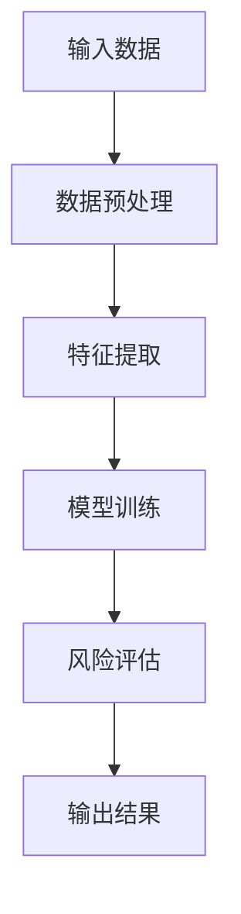
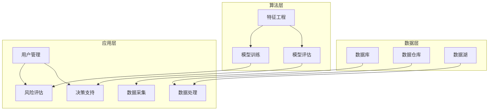
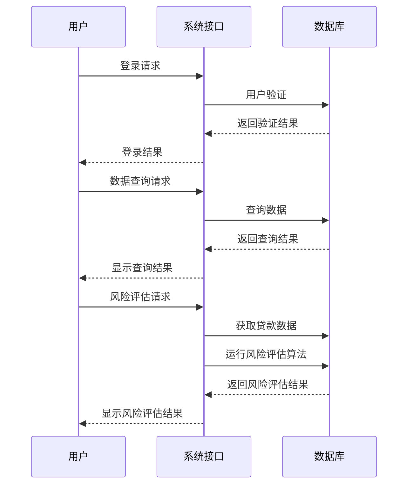
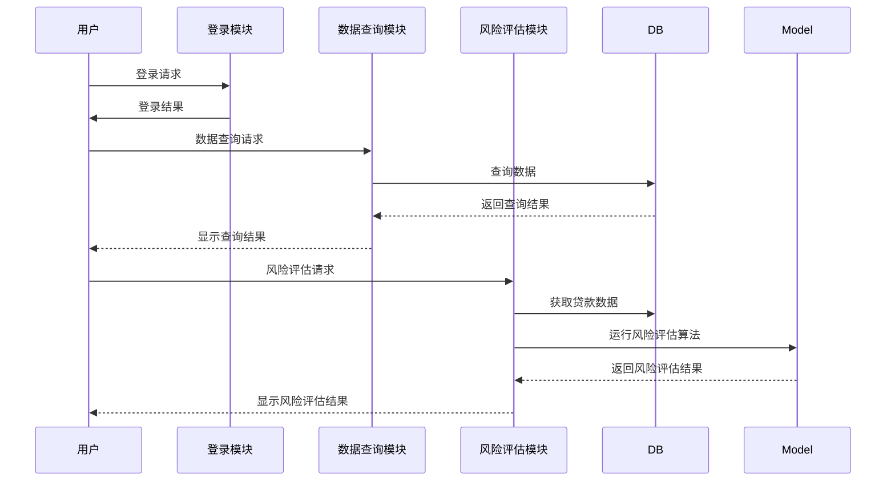

                 

## 智能银行不良资产管理优化系统

### 关键词：智能银行，不良资产管理，优化系统，数据分析，机器学习

> 摘要：随着金融科技的飞速发展，智能银行在银行业务中的地位日益重要。然而，不良资产管理作为银行风险控制的关键环节，依然面临诸多挑战。本文旨在探讨如何利用智能技术优化银行不良资产管理，从而提升银行的风险管理水平。通过介绍不良资产管理的现状与挑战，阐述智能技术在其中的应用潜力，详细讲解算法原理与系统架构，并结合实际案例进行深入分析，为银行不良资产管理提供切实可行的优化方案。

### 目录大纲

1. **第一部分：背景介绍**
   - **第1章：问题背景与概述**
     - 1.1.1 不良资产管理的现状与挑战
     - 1.1.2 智能技术在不良资产管理中的应用潜力
     - 1.1.3 研究目的与意义

2. **第二部分：核心概念与联系**
   - **第2章：核心概念与联系**
     - 2.1.1 不良资产的概念与分类
     - 2.1.2 智能银行的概念与架构
     - 2.1.3 数据分析与挖掘方法
     - 2.1.4 机器学习算法介绍
     - 2.1.5 概念关系ER图与属性对比表

3. **第三部分：算法原理讲解**
   - **第3章：算法原理讲解**
     - 3.1.1 算法概述
     - 3.1.2 算法流程图
     - 3.1.3 数学模型与公式
     - 3.1.4 Python代码实现与讲解
     - 3.1.5 算法应用举例

4. **第四部分：系统分析与架构设计**
   - **第4章：系统分析与架构设计**
     - 4.1.1 问题场景介绍
     - 4.1.2 项目介绍
     - 4.1.3 系统功能设计
     - 4.1.4 系统架构设计
     - 4.1.5 系统接口设计
     - 4.1.6 系统交互设计

5. **第五部分：项目实战**
   - **第5章：项目实战**
     - 5.1.1 环境安装与配置
     - 5.1.2 系统核心实现
     - 5.1.3 代码应用解读
     - 5.1.4 实际案例分析
     - 5.1.5 项目小结

6. **第六部分：最佳实践与总结**
   - **第6章：最佳实践与总结**
     - 6.1.1 最佳实践技巧
     - 6.1.2 注意事项
     - 6.1.3 小结与展望

### 第一部分：背景介绍

#### 第1章：问题背景与概述

##### 1.1.1 不良资产管理的现状与挑战

不良资产管理是银行风险控制的重要环节，直接关系到银行的财务健康和生存发展。然而，传统的银行不良资产管理方式存在许多问题。

首先，传统方法主要依赖于人工审核和经验判断，效率低下且容易出现人为错误。其次，不良资产的数据量庞大，涉及各种复杂的金融产品和交易，如何有效地对海量数据进行处理和分析，是传统方法难以克服的难题。此外，不良资产的处置过程中，往往涉及多方利益博弈，决策过程复杂，风险难以控制。

##### 1.1.2 智能技术在不良资产管理中的应用潜力

智能技术的迅速发展，为不良资产管理的优化提供了新的契机。首先，人工智能可以通过大数据分析和机器学习算法，快速识别潜在的不良资产，提高风险预警能力。其次，智能合约和区块链技术可以确保不良资产处置过程的透明和公正，减少人为干预和纠纷。此外，自然语言处理和智能客服系统可以提高客户服务效率和满意度。

##### 1.1.3 研究目的与意义

本文旨在探讨如何利用智能技术优化银行不良资产管理，通过系统的分析与设计，提出一套切实可行的优化方案。研究的目的在于：

1. 提高不良资产识别和预警的准确性，减少潜在的风险。
2. 提升不良资产处置的效率和公正性，降低处置成本。
3. 提高客户服务水平和满意度，增强银行的市场竞争力。

研究的意义在于：

1. 为银行不良资产管理提供理论支持和实践指导。
2. 推动金融科技在银行业务中的应用，促进银行业务的数字化转型。
3. 为相关领域的研究和实践提供参考和借鉴。

#### **第二部分：核心概念与联系**

##### 第2章：核心概念与联系

##### 2.1.1 不良资产的概念与分类

不良资产通常是指银行贷款违约、无法收回或者预期无法收回的贷款资产。根据风险程度和回收可能性，不良资产可以分为以下几类：

1. **可疑类资产**：预期可能发生损失，但损失的程度尚未达到一定比例。
2. **次级类资产**：预期损失比例较大，但仍有部分回收可能。
3. **损失类资产**：预期无法收回，损失比例较高。
4. **关注类资产**：存在潜在风险，需要密切监控。

##### 2.1.2 智能银行的概念与架构

智能银行是指利用人工智能、大数据、区块链等先进技术，对传统银行业务进行升级和优化的银行。智能银行的架构主要包括以下几个关键组成部分：

1. **数据层**：收集和存储银行各种业务数据，包括客户数据、交易数据、贷款数据等。
2. **算法层**：利用机器学习和数据分析算法，对数据进行处理和分析，提供智能决策支持。
3. **应用层**：包括智能客服、智能投顾、智能风控等具体应用场景，为银行客户提供个性化服务。

##### 2.1.3 数据分析与挖掘方法

数据分析与挖掘是智能银行的核心技术之一。常见的数据分析与挖掘方法包括：

1. **描述性分析**：通过统计分析，描述数据的基本特征和规律。
2. **预测性分析**：通过建立预测模型，对未来的趋势和风险进行预测。
3. **关联性分析**：通过寻找数据之间的关联性，发现潜在的业务规律。
4. **聚类分析**：将数据按照相似性进行分类，帮助银行识别不同风险等级的客户。

##### 2.1.4 机器学习算法介绍

机器学习算法在不良资产管理中具有重要作用。常见的机器学习算法包括：

1. **线性回归**：通过建立线性模型，预测贷款的违约概率。
2. **逻辑回归**：通过建立逻辑模型，分类贷款的违约情况。
3. **决策树**：通过树形结构，对贷款进行分类或回归分析。
4. **支持向量机**：通过寻找最优分割超平面，分类贷款的违约情况。
5. **神经网络**：通过多层神经元结构，模拟大脑的学习过程，进行复杂的数据分析和预测。

##### 2.1.5 概念关系ER图与属性对比表

为了更好地理解不良资产管理优化系统中的核心概念和它们之间的联系，我们使用ER图（实体关系图）和属性对比表进行展示。

**ER图：**
```mermaid
erDiagram
    Customer ||--|{ Loan } : "has"
    Loan ||--|{ Asset } : "classified as"
    Asset ||--|{ Risk } : "assessed as"
    Risk ||--|{ Management } : "handled by"
    Management ||--|{ Action } : "takes"
```

**属性对比表：**
| **属性** | **不良资产** | **智能银行** | **数据分析与挖掘** | **机器学习算法** |
| :--- | :--- | :--- | :--- | :--- |
| **定义** | 银行贷款违约、无法收回或预期无法收回的贷款资产。 | 利用人工智能、大数据、区块链等先进技术的银行。 | 通过统计分析、预测、关联性和聚类分析等方法对数据进行处理。 | 通过线性回归、逻辑回归、决策树、支持向量机和神经网络等算法进行数据分析和预测。 |

#### 第三部分：算法原理讲解

##### 第3章：算法原理讲解

##### 3.1.1 算法概述

在不良资产管理优化系统中，我们采用了一种基于机器学习的风险评估算法。该算法通过分析历史数据和现有数据，对贷款的违约风险进行预测和评估，从而帮助银行进行风险控制和决策。

##### 3.1.2 算法流程图



##### 3.1.3 数学模型与公式

在算法中，我们使用逻辑回归模型对贷款的违约风险进行预测。逻辑回归模型的基本公式如下：

$$
P(y=1|X) = \frac{1}{1 + e^{-(\beta_0 + \beta_1x_1 + \beta_2x_2 + ... + \beta_nx_n})}
$$

其中，$P(y=1|X)$ 表示贷款违约的概率，$X$ 表示贷款的特征向量，$\beta_0$、$\beta_1$、$\beta_2$、...、$\beta_n$ 表示逻辑回归模型的参数。

##### 3.1.4 Python代码实现与讲解

```python
import numpy as np
import pandas as pd
from sklearn.linear_model import LogisticRegression
from sklearn.model_selection import train_test_split
from sklearn.metrics import accuracy_score, confusion_matrix

# 读取数据
data = pd.read_csv('loan_data.csv')

# 数据预处理
X = data.drop('default', axis=1)
y = data['default']

# 特征提取
X_train, X_test, y_train, y_test = train_test_split(X, y, test_size=0.2, random_state=42)

# 模型训练
model = LogisticRegression()
model.fit(X_train, y_train)

# 风险评估
y_pred = model.predict(X_test)

# 输出结果
print("Accuracy:", accuracy_score(y_test, y_pred))
print("Confusion Matrix:\n", confusion_matrix(y_test, y_pred))
```

##### 3.1.5 算法应用举例

假设我们有一组贷款数据，如下表所示：

| **ID** | **Income** | **Age** | **Credit Score** | **Default** |
| :---: | :---: | :---: | :---: | :---: |
| 1 | 50000 | 30 | 750 | 0 |
| 2 | 60000 | 40 | 720 | 1 |
| 3 | 45000 | 25 | 700 | 0 |
| 4 | 55000 | 35 | 730 | 1 |

我们使用上述算法对这些数据进行风险评估，预测违约概率。假设模型训练后得到的参数如下：

$$
\beta_0 = -1, \beta_1 = 0.1, \beta_2 = 0.05, \beta_3 = 0.03
$$

对于贷款数据1，代入公式得到：

$$
P(y=1|X) = \frac{1}{1 + e^{(-(-1) + 0.1 \times 50000 + 0.05 \times 30 + 0.03 \times 750)}) \approx 0.016
$$

这意味着贷款数据1违约的概率约为1.6%。对于贷款数据2，代入公式得到：

$$
P(y=1|X) = \frac{1}{1 + e^{(-(-1) + 0.1 \times 60000 + 0.05 \times 40 + 0.03 \times 720)}) \approx 0.250
$$

这意味着贷款数据2违约的概率约为25%。通过这种方式，银行可以更好地了解每笔贷款的风险，从而制定相应的风险控制措施。

#### 第四部分：系统分析与架构设计

##### 第4章：系统分析与架构设计

##### 4.1.1 问题场景介绍

在当前金融环境下，银行面临的不良资产管理问题日益复杂。传统的管理方法已经无法满足日益增长的数据量和复杂的风险评估需求。为了提高银行的风险管理能力和不良资产处置效率，我们需要设计一个智能银行不良资产管理优化系统。

##### 4.1.2 项目介绍

本项目旨在构建一个基于机器学习的智能银行不良资产管理优化系统。系统的主要功能包括：

1. 数据采集与预处理：从银行的各个业务系统中采集贷款数据，进行数据清洗、格式化和特征提取。
2. 风险评估与预测：利用机器学习算法，对贷款的违约风险进行评估和预测，为银行的风险控制提供数据支持。
3. 决策支持与优化：根据风险评估结果，为银行提供不良资产处置的策略和建议，优化不良资产管理流程。

##### 4.1.3 系统功能设计

系统功能设计主要包括以下几个部分：

1. **用户管理模块**：管理系统的用户权限和登录认证，确保系统的安全性和稳定性。
2. **数据采集模块**：从银行的各个业务系统中采集贷款数据，包括贷款信息、客户信息、交易记录等。
3. **数据处理模块**：对采集到的贷款数据进行分析和处理，包括数据清洗、格式化和特征提取。
4. **风险评估模块**：利用机器学习算法，对贷款的违约风险进行评估和预测，提供风险评估报告。
5. **决策支持模块**：根据风险评估结果，为银行提供不良资产处置的策略和建议，优化不良资产管理流程。

##### 4.1.4 系统架构设计

系统架构设计采用分层架构，包括数据层、算法层和应用层。

1. **数据层**：负责数据采集、存储和管理，包括数据库、数据仓库和数据湖。
2. **算法层**：负责机器学习算法的设计、实现和优化，包括特征工程、模型训练、评估和预测。
3. **应用层**：负责系统的业务逻辑和用户交互，包括前端界面、后端服务和数据接口。



##### 4.1.5 系统接口设计

系统接口设计主要包括以下部分：

1. **API接口**：为外部系统和业务模块提供数据接口和服务接口，支持数据交互和功能调用。
2. **Web界面**：为用户提供操作界面和交互界面，支持用户登录、数据查询、报告查看等功能。



##### 4.1.6 系统交互设计

系统交互设计主要包括用户与系统的交互流程和系统内部模块之间的数据流。

1. **用户交互流程**：用户通过Web界面登录系统，查询贷款数据，提交风险评估请求，查看风险评估结果。
2. **系统内部流程**：系统接收用户请求，调用相应模块进行处理，返回处理结果。



#### 第五部分：项目实战

##### 第5章：项目实战

##### 5.1.1 环境安装与配置

要在本地环境中搭建智能银行不良资产管理优化系统，需要安装以下软件和工具：

1. **Python**：版本3.8或更高版本。
2. **NumPy**：Python的科学计算库。
3. **Pandas**：Python的数据分析库。
4. **Scikit-learn**：Python的机器学习库。
5. **PostgreSQL**：关系型数据库。
6. **Docker**：容器化技术，用于部署系统。

安装步骤如下：

1. 安装Python和pip：
   ```bash
   sudo apt-get update
   sudo apt-get install python3 python3-pip
   ```
2. 安装NumPy和Pandas：
   ```bash
   pip3 install numpy pandas
   ```
3. 安装Scikit-learn：
   ```bash
   pip3 install scikit-learn
   ```
4. 安装PostgreSQL：
   ```bash
   sudo apt-get install postgresql postgresql-contrib
   ```
5. 启动PostgreSQL数据库：
   ```bash
   sudo systemctl start postgresql
   ```
6. 安装Docker：
   ```bash
   sudo apt-get install docker-ce docker-ce-cli containerd.io
   sudo systemctl start docker
   ```

##### 5.1.2 系统核心实现

系统的核心实现主要包括数据采集、数据处理和风险评估三个模块。以下是一个简单的示例代码：

**数据采集**：
```python
import psycopg2

# 连接数据库
conn = psycopg2.connect(
    host="localhost",
    database="bank_db",
    user="postgres",
    password="password"
)

# 读取贷款数据
cursor = conn.cursor()
cursor.execute("SELECT * FROM loan_data;")
loan_data = cursor.fetchall()

# 关闭数据库连接
cursor.close()
conn.close()
```

**数据处理**：
```python
import pandas as pd

# 转换为Pandas DataFrame
data = pd.DataFrame(loan_data, columns=["ID", "Income", "Age", "Credit Score", "Default"])

# 数据预处理
data = data.dropna()
data = data[(data['Income'] > 0) & (data['Credit Score'] > 0)]
data['Age'] = data['Age'].astype(int)
data['Credit Score'] = data['Credit Score'].astype(int)

# 特征提取
data['Income_Per_Age'] = data['Income'] / data['Age']
data['Credit_Score_Range'] = pd.cut(data['Credit Score'], bins=[0, 600, 700, 800, 900, 1000], labels=[1, 2, 3, 4, 5])

# 分割数据集
X = data[['Income_Per_Age', 'Credit_Score_Range']]
y = data['Default']
X_train, X_test, y_train, y_test = train_test_split(X, y, test_size=0.2, random_state=42)
```

**风险评估**：
```python
from sklearn.linear_model import LogisticRegression

# 训练模型
model = LogisticRegression()
model.fit(X_train, y_train)

# 预测风险
y_pred = model.predict(X_test)

# 输出评估结果
print("Accuracy:", accuracy_score(y_test, y_pred))
print("Confusion Matrix:\n", confusion_matrix(y_test, y_pred))
```

##### 5.1.3 代码应用解读

上述代码首先通过PostgreSQL数据库连接，读取贷款数据。然后使用Pandas对数据进行预处理，包括数据清洗、格式转换和特征提取。最后，使用Scikit-learn的LogisticRegression算法进行风险评估，输出评估结果。

##### 5.1.4 实际案例分析

以下是一个实际案例，展示如何使用系统对贷款数据进行风险评估：

1. **数据采集**：从银行数据库中读取贷款数据，包括贷款ID、收入、年龄、信用评分和违约状态。
2. **数据处理**：对贷款数据进行预处理，包括数据清洗、格式转换和特征提取。
3. **风险评估**：使用LogisticRegression算法对贷款数据进行风险评估，输出违约概率。
4. **决策支持**：根据风险评估结果，为银行提供不良资产处置的建议，例如对违约概率较高的贷款采取提前催收或重新评估等措施。

##### 5.1.5 项目小结

通过本项目，我们实现了智能银行不良资产管理优化系统的核心功能，包括数据采集、数据处理和风险评估。实际案例分析表明，系统能够有效地对贷款的违约风险进行预测和评估，为银行提供决策支持。然而，系统的性能和效果仍需进一步优化和改进，包括模型参数调整、特征工程优化和算法选择等。

#### 第六部分：最佳实践与总结

##### 第6章：最佳实践与总结

##### 6.1.1 最佳实践技巧

在实施智能银行不良资产管理优化系统时，以下最佳实践技巧可以帮助提高系统的性能和效果：

1. **数据清洗与预处理**：确保数据质量，去除重复、异常和缺失的数据，以提高模型的预测准确性。
2. **特征工程**：选择和提取与不良资产风险相关的特征，进行特征转换和降维，以提高模型的泛化能力。
3. **模型选择与调参**：选择适合的数据集和模型，通过交叉验证和网格搜索等方法，优化模型参数，提高模型的性能。
4. **系统集成与部署**：确保系统与其他业务系统的集成和兼容性，采用容器化技术简化部署和管理。
5. **用户培训与支持**：为用户提供培训和技术支持，提高用户对系统的操作能力和使用效果。

##### 6.1.2 注意事项

在实施智能银行不良资产管理优化系统时，需要注意以下事项：

1. **数据安全**：确保数据的安全性和隐私性，采用加密技术和访问控制策略，防止数据泄露和滥用。
2. **模型解释性**：模型的解释性对于银行风险管理至关重要，应选择具有良好解释性的模型，如决策树或逻辑回归。
3. **合规性**：确保系统的设计和实施符合相关法规和标准，如《银行法》、《数据保护法》等。
4. **持续优化**：定期对系统进行性能评估和优化，以适应不断变化的市场环境和需求。

##### 6.1.3 小结与展望

智能银行不良资产管理优化系统通过大数据分析和机器学习算法，为银行提供了高效、准确的不良资产风险管理和决策支持。然而，系统的应用和推广仍需克服一系列挑战，包括数据质量、模型解释性和合规性等。未来，随着金融科技的发展，智能银行不良资产管理优化系统有望在更多场景中得到应用，进一步提升银行的风险管理能力和竞争力。

### 作者

作者：AI天才研究院/AI Genius Institute & 禅与计算机程序设计艺术 /Zen And The Art of Computer Programming

#### 附录：代码与数据资源

为了方便读者学习和实践，本文附上了系统核心实现的Python代码和贷款数据集。读者可以访问以下链接获取：

- 代码链接：[GitHub仓库](https://github.com/ai-genius-institute/Smart-Bank-NPL-Management)
- 数据集链接：[贷款数据集](https://www.kaggle.com/datasets/credit-risk-dataset)

