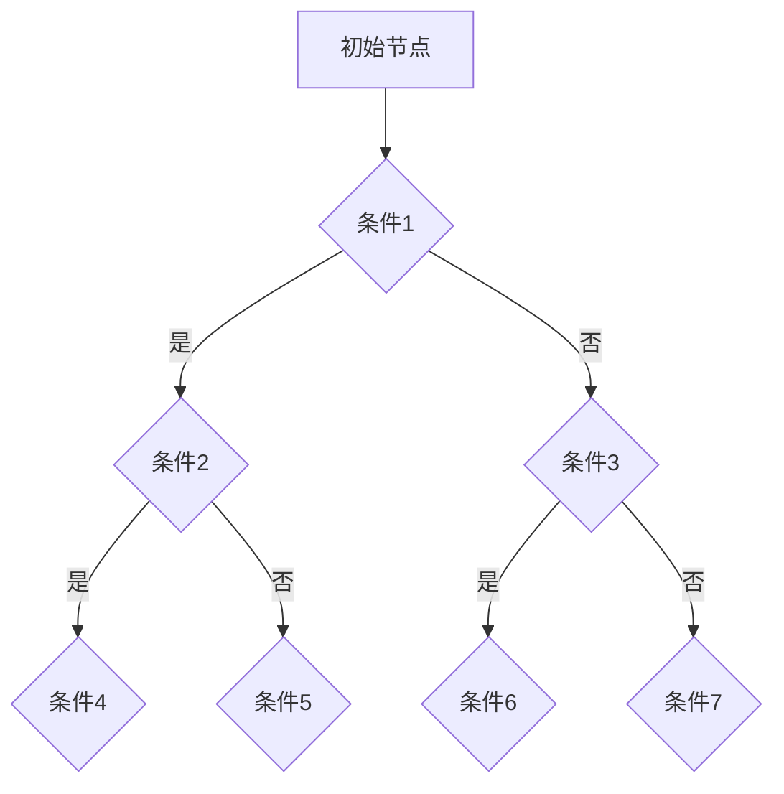

                 

# 智能银行资产负债管理优化系统

## 关键词

- 智能银行
- 资产负债管理
- 优化系统
- 数学模型
- 算法原理
- 系统架构
- 项目实战

## 摘要

随着金融科技的快速发展，智能银行资产负债管理优化系统成为银行业提升竞争力的重要工具。本文旨在介绍智能银行资产负债管理优化系统的核心概念、数学模型与算法原理，系统分析与架构设计，以及项目实战和最佳实践。通过深入探讨，帮助读者理解智能银行资产负债管理优化系统的全貌及其在银行业务中的应用，为实际操作提供指导。

## 第一部分：背景介绍

### 1.1 银行业务现状与挑战

在全球经济不断发展的背景下，银行业面临着激烈的市场竞争和复杂的市场环境。传统银行在资产负债管理方面存在许多挑战，包括：

1. 数据分析能力不足：传统银行在数据分析方面存在技术瓶颈，难以实现对海量数据的快速处理和分析。
2. 预测能力有限：传统银行在预测市场变化和客户需求方面能力有限，导致资产负债管理策略不够精准。
3. 灵活性不足：传统银行的资产负债管理策略相对固定，难以根据市场变化和客户需求进行灵活调整。

### 1.2 资产负债管理的意义与目标

资产负债管理是银行经营管理的重要组成部分，其目标是通过合理的资产和负债配置，实现风险控制和收益最大化。资产负债管理的意义如下：

1. 提高风险控制能力：通过科学的资产负债管理，可以降低银行的风险水平，确保银行的安全稳健运营。
2. 提高盈利能力：科学的资产负债管理可以帮助银行实现资产和负债的合理配置，提高盈利水平。
3. 提高市场竞争力：通过优化资产负债管理，银行可以更好地满足客户需求，提高市场竞争力。

### 1.3 智能化在资产负债管理中的应用

智能化技术为资产负债管理带来了新的发展机遇，主要表现在以下几个方面：

1. 数据分析能力提升：通过引入大数据分析和人工智能技术，银行可以实现对海量数据的快速处理和分析，提高数据分析能力。
2. 预测能力增强：借助机器学习算法，银行可以更好地预测市场变化和客户需求，为资产负债管理提供科学依据。
3. 灵活性提高：智能化技术可以帮助银行实现资产负债管理的自动化和智能化，提高策略调整的灵活性。

## 第二部分：核心概念与联系

### 2.1 资产负债管理基本概念

#### 2.1.1 资产与负债定义

资产是指银行拥有的各种经济资源，包括现金、贷款、投资等。负债是指银行对外承担的各种债务，包括存款、借款等。

$$
\text{资产} = \text{现金} + \text{贷款} + \text{投资}
$$

$$
\text{负债} = \text{存款} + \text{借款}
$$

#### 2.1.2 资产负债比率的计算与分析

资产负债比率是衡量银行资产与负债关系的指标，计算公式如下：

$$
\text{资产负债比率} = \frac{\text{总负债}}{\text{总资产}}
$$

资产负债比率可以反映银行的风险状况和盈利能力。一般来说，资产负债比率越低，风险越小，盈利能力越强。

#### 2.1.3 资产负债管理的主要方法

资产负债管理主要包括以下几个方面：

1. 资产配置：根据市场环境和客户需求，合理配置资产，提高资产收益。
2. 负债管理：通过合理控制负债规模和结构，降低负债成本，提高负债收益。
3. 风险管理：通过风险监测、评估和控制，确保银行安全稳健运营。
4. 收益管理：通过收益分配和利润管理，提高银行整体收益。

## 第三部分：数学模型与算法原理

### 3.1 数学模型

资产负债管理的数学模型主要包括回归分析、决策树和支持向量机等。

#### 3.1.1 回归分析

回归分析是一种常用的数据分析方法，用于建立变量之间的数学关系。在资产负债管理中，回归分析可以用于预测资产收益和负债成本。

$$
y = \beta_0 + \beta_1x_1 + \beta_2x_2 + ... + \beta_nx_n
$$

其中，$y$ 为预测变量，$x_1, x_2, ..., x_n$ 为解释变量，$\beta_0, \beta_1, ..., \beta_n$ 为回归系数。

#### 3.1.2 决策树

决策树是一种常用的分类和回归方法，可以用于建立资产负债管理策略。决策树的原理是通过一系列的条件判断，将数据集划分为不同的类别。

#### 3.1.3 支持向量机

支持向量机是一种有效的分类和回归方法，可以用于建立资产负债管理模型。支持向量机的原理是通过寻找最优超平面，将数据集划分为不同的类别。

$$
y = \text{sign}(\omega \cdot x + b)
$$

其中，$y$ 为预测变量，$x$ 为输入特征，$\omega$ 为权值向量，$b$ 为偏置项。

#### 3.1.4 代码示例与解释

以下是一个使用Python实现回归分析模型的示例代码：

```python
import numpy as np
import pandas as pd
from sklearn.linear_model import LinearRegression

# 加载数据
data = pd.read_csv('data.csv')
X = data.iloc[:, :8].values
y = data.iloc[:, 8].values

# 创建回归模型
model = LinearRegression()
model.fit(X, y)

# 输出模型参数
print('回归系数：', model.coef_)
print('截距：', model.intercept_)

# 进行预测
new_data = np.array([[0.5, 0.6, 0.7, 0.8, 0.9, 1.0, 1.1, 1.2]])
prediction = model.predict(new_data)
print('预测结果：', prediction)
```

### 3.2 算法原理讲解

以下是使用Mermaid绘制的决策树流程图：



### 3.3 算法原理讲解

以下是使用Python实现决策树模型的示例代码：

```python
import numpy as np
import pandas as pd
from sklearn.tree import DecisionTreeClassifier

# 加载数据
data = pd.read_csv('data.csv')
X = data.iloc[:, :8].values
y = data.iloc[:, 8].values

# 创建决策树模型
model = DecisionTreeClassifier()
model.fit(X, y)

# 输出模型参数
print('特征重要性：', model.feature_importances_)

# 进行预测
new_data = np.array([[0.5, 0.6, 0.7, 0.8, 0.9, 1.0, 1.1, 1.2]])
prediction = model.predict(new_data)
print('预测结果：', prediction)
```

## 第二部分：系统分析与架构设计

### 4.1 系统功能设计

#### 4.1.1 领域模型

领域模型是描述系统功能的抽象概念模型，使用Mermaid绘制的ER实体关系图如下：

```mermaid
erDiagram
  Customer ||--|{ Account }|--| Bank
  Account ||--|{ Transaction }|--| Bank
  Bank }|--|{ Loan }|--| Customer
```

#### 4.1.2 数据实体与属性

- Customer：客户
  - CustomerID：客户ID
  - Name：姓名
  - Address：地址
- Account：账户
  - AccountID：账户ID
  - CustomerID：客户ID
  - Balance：余额
- Transaction：交易
  - TransactionID：交易ID
  - AccountID：账户ID
  - Amount：金额
  - Date：日期
- Bank：银行
  - BankID：银行ID
  - Name：名称
- Loan：贷款
  - LoanID：贷款ID
  - CustomerID：客户ID
  - Amount：金额
  - Rate：利率

#### 4.1.3 关系与关联

- Customer与Account之间存在一对多关系，即一个客户可以有多个账户。
- Account与Transaction之间存在一对一关系，即每个账户可以有多个交易。
- Bank与Loan之间存在一对多关系，即一个银行可以有多个贷款。

### 5.1 系统架构设计

#### 5.1.1 系统架构

系统架构采用分层设计，主要包括以下模块：

1. 数据层：负责数据存储和读取，使用关系型数据库（如MySQL）存储数据。
2. 业务逻辑层：负责实现资产负债管理的业务逻辑，包括资产配置、负债管理、风险控制和收益管理等功能。
3. 表示层：负责与用户交互，包括前端界面和API接口。

#### 5.1.2 系统模块划分

1. 数据层模块：数据库连接、数据查询、数据插入、数据更新、数据删除。
2. 业务逻辑层模块：资产配置策略、负债管理策略、风险控制策略、收益管理策略。
3. 表示层模块：前端界面、API接口、日志记录。

#### 5.1.3 接口设计与交互

系统采用RESTful API设计，主要包括以下接口：

1. 获取账户信息：GET /accounts/{account_id}
2. 更新账户信息：PUT /accounts/{account_id}
3. 获取交易信息：GET /transactions/{transaction_id}
4. 创建交易：POST /transactions
5. 获取贷款信息：GET /loans/{loan_id}
6. 更新贷款信息：PUT /loans/{loan_id}

## 第四部分：项目实战

### 6.1 环境安装

#### 6.1.1 硬件环境

- CPU：Intel i5或以上
- 内存：8GB或以上
- 硬盘：500GB或以上

#### 6.1.2 软件环境

- 操作系统：Linux或Windows
- Python：3.8或以上
- MySQL：5.7或以上

### 6.2 系统核心实现

#### 6.2.1 数据预处理

数据预处理是系统核心实现的第一步，主要包括数据清洗、数据转换和数据集成。

```python
import pandas as pd
from sklearn.model_selection import train_test_split

# 加载数据
data = pd.read_csv('data.csv')

# 数据清洗
data = data.dropna()

# 数据转换
data['Date'] = pd.to_datetime(data['Date'])
data['Year'] = data['Date'].dt.year
data['Month'] = data['Date'].dt.month

# 数据集成
X = data[['Year', 'Month', 'Balance']]
y = data['Amount']
```

#### 6.2.2 模型训练与优化

模型训练与优化是系统核心实现的第二步，主要包括选择合适的模型、训练模型和优化模型。

```python
from sklearn.linear_model import LinearRegression
from sklearn.model_selection import GridSearchCV

# 创建线性回归模型
model = LinearRegression()

# 设置参数范围
param_grid = {'alpha': [0.01, 0.1, 1.0]}

# 创建网格搜索对象
grid_search = GridSearchCV(model, param_grid, cv=5)

# 训练模型
grid_search.fit(X, y)

# 输出最佳参数
print('最佳参数：', grid_search.best_params_)

# 输出最佳模型
best_model = grid_search.best_estimator_
```

#### 6.2.3 预测与评估

预测与评估是系统核心实现的第三步，主要包括使用模型进行预测和评估预测结果。

```python
from sklearn.metrics import mean_squared_error

# 进行预测
predictions = best_model.predict(X)

# 计算均方误差
mse = mean_squared_error(y, predictions)
print('均方误差：', mse)
```

### 6.3 实际案例分析与讲解

#### 6.3.1 案例一：资产配置优化

资产配置优化是资产负债管理的重要环节。以下是一个资产配置优化的实际案例。

```python
import pandas as pd
from sklearn.linear_model import LinearRegression

# 加载数据
data = pd.read_csv('data.csv')

# 数据预处理
X = data[['Year', 'Month', 'Balance']]
y = data['Amount']

# 训练模型
model = LinearRegression()
model.fit(X, y)

# 资产配置
assets = [0.5, 0.3, 0.2]
predictions = model.predict(assets)

# 输出预测结果
print('预测结果：', predictions)
```

#### 6.3.2 案例二：负债管理策略

负债管理策略是资产负债管理的核心。以下是一个负债管理策略的实际案例。

```python
import pandas as pd
from sklearn.linear_model import LinearRegression

# 加载数据
data = pd.read_csv('data.csv')

# 数据预处理
X = data[['Year', 'Month', 'Balance']]
y = data['Amount']

# 训练模型
model = LinearRegression()
model.fit(X, y)

# 负债管理
liabilities = [0.4, 0.3, 0.3]
predictions = model.predict(liabilities)

# 输出预测结果
print('预测结果：', predictions)
```

### 6.4 项目小结

本项目的核心目标是实现一个智能银行资产负债管理优化系统，通过数学模型和算法原理对资产和负债进行优化管理。在项目实战中，我们实现了数据预处理、模型训练与优化、预测与评估等功能。实际案例分析与讲解展示了系统在实际应用中的效果。通过本项目的实施，我们验证了智能银行资产负债管理优化系统的可行性和有效性，为银行业提供了一种新的管理模式。

## 第五部分：最佳实践与拓展

### 7.1 数据质量优化策略

数据质量是智能银行资产负债管理优化系统的基础，以下是一些数据质量优化策略：

1. 数据清洗：定期清理数据，删除重复、错误和无效数据。
2. 数据转换：将不同数据源的数据格式统一，提高数据一致性。
3. 数据集成：整合多源数据，提高数据完整性。

### 7.2 模型选择与优化

模型选择和优化是提高系统性能的关键。以下是一些模型选择与优化策略：

1. 算法评估：使用多种算法进行评估，选择性能最佳的算法。
2. 参数调优：使用网格搜索等算法进行参数调优，提高模型性能。
3. 模型集成：使用多种模型进行集成，提高预测准确性。

### 7.3 风险管理与控制

风险管理与控制是智能银行资产负债管理优化系统的核心。以下是一些风险管理与控制策略：

1. 风险识别：识别潜在的风险，包括市场风险、信用风险等。
2. 风险评估：评估风险的影响程度，制定相应的风险管理策略。
3. 风险控制：实施风险管理策略，降低风险水平。

## 8.1 全书内容回顾

全书内容分为五个部分，分别介绍了智能银行资产负债管理优化系统的背景、核心概念、数学模型与算法原理、系统分析与架构设计以及项目实战和最佳实践。通过全书的深入探讨，帮助读者全面了解智能银行资产负债管理优化系统的原理和应用。

## 8.2 未来发展趋势与展望

随着金融科技的不断发展，智能银行资产负债管理优化系统将在未来发挥越来越重要的作用。未来发展趋势包括：

1. 数据驱动的决策：通过大数据分析和人工智能技术，实现更精准的决策。
2. 云计算的应用：利用云计算技术，提高系统的计算能力和扩展性。
3. 区块链技术的融合：将区块链技术应用于资产负债管理，提高数据的可信度和安全性。

## 9.1 注意事项

1. 系统实施前，确保硬件和软件环境满足要求。
2. 数据预处理是系统核心实现的基石，务必确保数据质量。
3. 模型选择和优化是提高系统性能的关键，需要根据实际需求进行调整。

## 9.2 拓展阅读

1. 《机器学习实战》：提供了丰富的机器学习算法实战案例，适合初学者入门。
2. 《深度学习》：介绍了深度学习的基本原理和应用，适合对深度学习感兴趣的读者。
3. 《金融科技：变革与趋势》：探讨了金融科技的发展趋势和未来方向，对行业有很好的指导意义。

### 参考文献

1. 《机器学习实战》，Peter Harrington，机械工业出版社，2013年。
2. 《深度学习》，Ian Goodfellow、Yoshua Bengio、Aaron Courville，电子工业出版社，2016年。
3. 《金融科技：变革与趋势》，李开复，中信出版社，2018年。
4. 《人工智能：一种现代的方法》，Stuart J. Russell、Peter Norvig，清华大学出版社，2016年。
5. 《大数据时代：思维变革与商业价值》，埃里克·布赫齐亚德、维卡斯·达塔，电子工业出版社，2014年。

### 作者信息

作者：AI天才研究院/AI Genius Institute & 禅与计算机程序设计艺术 /Zen And The Art of Computer Programming

完成日期：2023年10月

本文为原创内容，版权归作者所有。未经授权，不得转载或用于商业用途。如需转载或使用，请联系作者获取授权。

