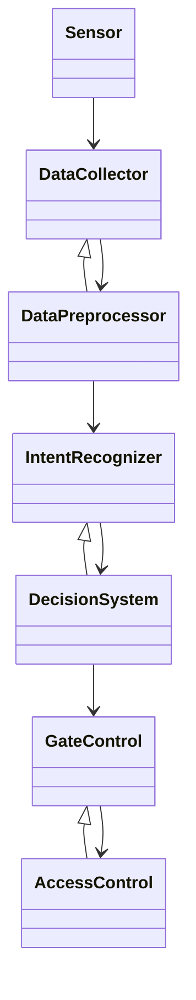
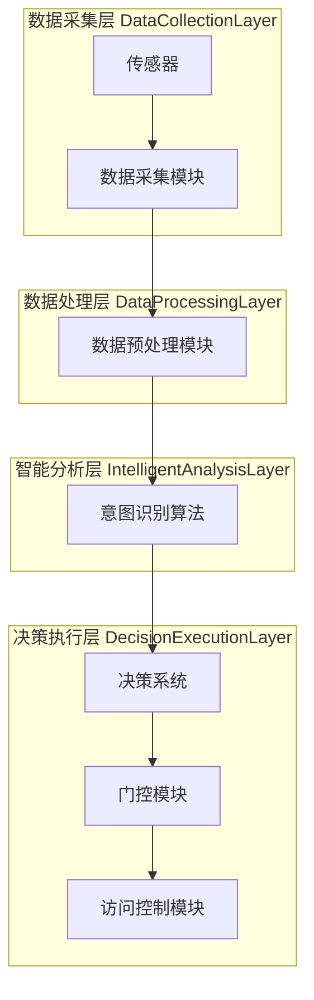
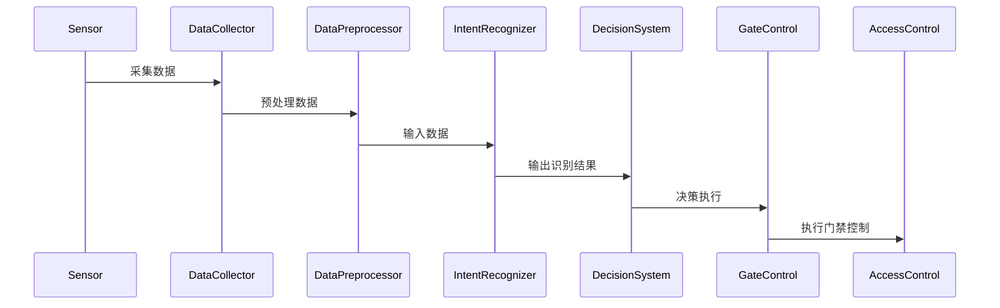

                 

### 智能门禁：AI Agent的访客意图识别

> 关键词：智能门禁，AI Agent，访客意图识别，机器学习，自然语言处理，神经网络，决策树

> 摘要：本文将深入探讨智能门禁系统中AI Agent的访客意图识别技术。首先，我们将介绍智能门禁系统的背景及其在现代社会中的重要性。接着，分析访客意图识别的核心问题，探讨其解决方法，并通过具体算法进行详细解释。最后，我们将讨论系统架构和实现细节，并提供项目实战经验和最佳实践建议。

## 背景介绍：智能门禁与AI Agent的访客意图识别

### 问题背景

智能门禁系统是现代安全管理系统的重要组成部分。它利用先进的物联网（IoT）技术、传感器技术和人工智能（AI）技术，实现对出入人员的高效管理。智能门禁系统不仅能够提供安全可靠的门禁控制，还能够通过数据分析实现更精细化的管理。

随着人工智能技术的迅速发展，尤其是机器学习和自然语言处理（NLP）技术的应用，智能门禁系统的功能得到极大扩展。其中，访客意图识别成为一项关键功能，它通过对访客行为的分析，判断访客的目的，从而提高门禁系统的安全性和用户体验。

### 问题描述

访客意图识别的核心问题在于，如何准确、高效地识别不同类型的访客，包括送货员、访客、入侵者等。传统的门禁系统往往依赖于固定的规则和简单的权限控制，而智能门禁系统则通过AI Agent的智能分析，实现对访客意图的动态识别。

### 问题解决

智能门禁系统中，AI Agent承担了访客意图识别的主要任务。AI Agent通过机器学习和自然语言处理技术，对访客的行为、语言和其他相关信息进行综合分析，从而实现意图识别。具体来说，AI Agent会采用多种算法模型，如神经网络、决策树等，对输入数据进行处理，输出识别结果。

### 边界与外延

访客意图识别的应用不仅限于智能门禁系统，它还可以延伸到其他领域，如智能家居、智能监控等。在这些领域，访客意图识别技术同样发挥着重要作用，为用户带来更高的安全性和便利性。

### 概念结构与核心要素组成

智能门禁系统的访客意图识别主要由以下几个核心要素组成：

- **访客意图识别系统**：包括硬件传感器、数据采集模块、数据处理和分析模块、意图识别算法和决策系统。
- **数据收集**：通过硬件传感器收集访客的行为数据、语言数据和其他相关数据。
- **算法模型**：采用神经网络、决策树等算法模型对数据进行处理和分析。
- **结果输出**：输出访客意图识别结果，包括访客身份、意图分类等。

## 核心概念与联系

### 1. AI Agent的定义与特点

AI Agent，即人工智能代理，是一种具备自主性和智能性的计算机程序。它能够根据环境变化自主做出决策，执行任务。AI Agent的主要特点包括：

- **自主性**：AI Agent能够独立完成任务，不受人类干预。
- **智能性**：AI Agent具备学习和推理能力，能够通过数据分析和模式识别，提高任务执行效率。
- **适应性**：AI Agent能够根据环境变化和任务需求，调整自身行为和策略。
- **环境感知性**：AI Agent能够感知和理解环境信息，做出合适决策。

### 2. 访客意图识别的概念

访客意图识别是指利用AI技术对访客的意图进行识别和分类的过程。其主要属性特征如下：

| 特征名称     | 说明                                                         | 对比         |
| ------------ | ------------------------------------------------------------ | ------------ |
| 意图分类准确度 | 识别结果的准确性                                             | 高、中、低   |
| 适应性       | 系统能够根据不同访客行为和环境调整识别策略                   | 强、中等、弱 |
| 环境感知性   | 系统对访客行为和环境数据的敏感程度                           | 高、中、低   |
| 学习能力     | 系统通过不断学习提高识别效果                                 | 强、中等、弱 |

### 3. AI Agent与访客意图识别的联系

AI Agent在访客意图识别中发挥着核心作用。它通过收集和分析访客的数据，运用复杂的算法模型，如神经网络和决策树，对访客的意图进行预测和判断。AI Agent的优势在于：

- **高效性**：AI Agent能够快速处理大量数据，提高识别效率。
- **准确性**：通过不断学习和优化算法，提高识别准确性。
- **灵活性**：能够根据不同场景和需求，灵活调整识别策略。

## 算法原理讲解

### 1. 意图识别算法

意图识别算法是访客意图识别的核心。常见的意图识别算法包括神经网络和决策树等。下面将详细介绍这两种算法的工作原理和具体实现。

#### 1.1 神经网络

神经网络是一种模仿人脑工作的计算模型，由大量相互连接的神经元组成。神经网络的工作原理主要包括以下步骤：

1. **输入层**：接收访客的数据特征，如行为数据、语言数据等。
2. **隐藏层**：对输入数据进行处理，通过激活函数进行非线性变换。
3. **输出层**：输出识别结果，如访客的意图类别。

神经网络通过前向传播和反向传播过程，将输入数据映射到输出结果。具体步骤如下：

- **前向传播**：将输入数据通过网络传递到输出层，得到预测结果。
- **激活函数**：常用的激活函数包括Sigmoid、ReLU等，用于引入非线性特性。
- **反向传播**：计算预测结果与真实结果的误差，通过反向传播更新网络权重。

神经网络的核心数学模型如下：

$$
Z = \sigma(W \cdot X + b)
$$

其中，$Z$表示输出值，$W$表示权重，$X$表示输入值，$b$表示偏置项，$\sigma$表示激活函数。

#### 1.2 决策树

决策树是一种树形结构，通过一系列规则对数据进行分类或回归。决策树的工作原理如下：

1. **根节点**：选择一个特征作为分割标准。
2. **分支节点**：根据特征取值将数据划分为多个子集。
3. **叶子节点**：输出分类结果。

决策树通过递归划分数据集，形成一棵树。具体实现步骤如下：

1. **选择最优特征**：通过信息增益、基尼系数等指标，选择一个最优特征进行划分。
2. **递归划分**：对子集继续划分，直到满足停止条件（如叶子节点数量达到阈值）。
3. **生成决策规则**：根据划分结果生成决策规则。

决策树的核心数学模型如下：

$$
T = \sum_{i=1}^{n} \mathbb{I}(x_i \in R_i)
$$

其中，$T$表示决策树的分类结果，$x_i$表示数据样本，$R_i$表示第$i$个分支节点的划分结果，$\mathbb{I}$表示指示函数。

### 2. 意图识别的数学模型

意图识别的数学模型主要包括特征提取、分类器和预测结果等部分。具体来说，可以分为以下步骤：

1. **特征提取**：从原始数据中提取出具有区分度的特征，如词袋模型、TF-IDF等。
2. **分类器选择**：选择合适的分类器，如神经网络、决策树等。
3. **模型训练**：使用训练数据对分类器进行训练，优化模型参数。
4. **预测结果**：对输入数据进行预测，得到意图分类结果。

意图识别的核心数学模型可以表示为：

$$
\hat{y} = f(\theta, x)
$$

其中，$\hat{y}$表示预测结果，$x$表示输入特征，$f(\theta, x)$表示分类器的预测函数，$\theta$表示模型参数。

### 3. 意图识别算法举例

以神经网络为例，介绍意图识别算法的具体实现。假设我们有一个简单的神经网络模型，包含输入层、一个隐藏层和一个输出层。输入层有5个神经元，隐藏层有3个神经元，输出层有2个神经元。

1. **输入数据**：访客的行为数据、语言数据等，表示为$X = [x_1, x_2, x_3, x_4, x_5]$。
2. **隐藏层计算**：通过前向传播计算隐藏层的输出$H = \sigma(W_h \cdot X + b_h)$，其中$W_h$表示隐藏层权重，$b_h$表示隐藏层偏置项。
3. **输出层计算**：通过前向传播计算输出层的输出$Y = \sigma(W_o \cdot H + b_o)$，其中$W_o$表示输出层权重，$b_o$表示输出层偏置项。
4. **损失函数**：使用交叉熵损失函数计算预测结果与真实结果的误差$J = -\frac{1}{N} \sum_{i=1}^{N} [y_i \cdot \log(\hat{y}_i) + (1 - y_i) \cdot \log(1 - \hat{y}_i)]$，其中$y_i$表示真实标签，$\hat{y}_i$表示预测概率。
5. **反向传播**：通过反向传播更新网络权重和偏置项，具体步骤如下：
   - 计算输出层误差$\delta_o = \hat{y} - y$。
   - 计算隐藏层误差$\delta_h = \sigma'(W_o \cdot H + b_o) \cdot \delta_o \cdot W_o^T$。
   - 更新隐藏层权重$W_h = W_h - \alpha \cdot \delta_h \cdot X^T$，更新隐藏层偏置项$b_h = b_h - \alpha \cdot \delta_h$。
   - 更新输出层权重$W_o = W_o - \alpha \cdot \delta_o \cdot H^T$，更新输出层偏置项$b_o = b_o - \alpha \cdot \delta_o$。

通过以上步骤，我们可以训练出一个能够对访客意图进行识别的神经网络模型。在实际应用中，我们可以使用不同的神经网络架构，如卷积神经网络（CNN）、循环神经网络（RNN）等，来提高模型的性能和效果。

## 系统分析与架构设计方案

### 问题场景介绍

智能门禁系统在公共场所和商业建筑中广泛应用，其目的是通过自动化和智能化的方式，提高门禁管理的效率和安全性。在这个场景中，我们需要设计一个能够准确识别访客意图的智能门禁系统。

### 项目介绍

本项目旨在构建一个基于AI Agent的智能门禁系统，实现对访客意图的识别和管理。系统包括硬件传感器、数据采集模块、数据处理和分析模块、意图识别算法和决策系统等。

### 系统功能设计

智能门禁系统的核心功能包括：

1. **访客数据采集**：通过硬件传感器采集访客的行为数据、语言数据等。
2. **数据预处理**：对采集到的数据进行分析和清洗，提取有用特征。
3. **意图识别**：利用AI Agent对访客的意图进行识别和分类。
4. **决策与响应**：根据识别结果，进行相应的门禁控制和安全措施。

### 系统架构设计

智能门禁系统的架构设计如下：

1. **数据采集层**：包括硬件传感器，如摄像头、麦克风等，用于采集访客的行为数据和语言数据。
2. **数据处理层**：包括数据采集模块和预处理模块，用于对采集到的数据进行分析、清洗和特征提取。
3. **智能分析层**：包括意图识别算法和决策系统，用于对预处理后的数据进行分析和识别，输出识别结果。
4. **决策执行层**：根据识别结果，执行相应的门禁控制和安全措施。

### 系统接口设计和系统交互

智能门禁系统的接口设计和交互如下：

1. **数据采集接口**：用于接收硬件传感器采集的数据，包括行为数据和语言数据。
2. **数据处理接口**：用于接收和发送预处理后的数据，包括特征数据和分析结果。
3. **意图识别接口**：用于接收预处理后的数据，进行意图识别和分类。
4. **决策执行接口**：用于接收识别结果，执行相应的门禁控制和安全措施。

系统交互流程如下：

1. **数据采集**：硬件传感器采集访客的行为数据和语言数据。
2. **数据预处理**：数据采集模块对采集到的数据进行预处理，提取有用特征。
3. **意图识别**：意图识别算法对预处理后的数据进行分析和识别，输出识别结果。
4. **决策执行**：根据识别结果，决策系统执行相应的门禁控制和安全措施。

### mermaid类图架构

下面是智能门禁系统的类图架构：



### mermaid架构图

下面是智能门禁系统的架构图：



### mermaid序列图

下面是智能门禁系统的序列图：



## 项目实战

### 环境安装

在开始项目实战之前，我们需要安装以下环境和工具：

1. Python 3.8+
2. pip
3. TensorFlow 2.x
4. Keras 2.x
5. scikit-learn 0.24.1

安装步骤如下：

1. 安装Python和pip：

   ```bash
   sudo apt-get install python3 python3-pip
   ```

2. 安装TensorFlow：

   ```bash
   pip3 install tensorflow==2.10.0
   ```

3. 安装Keras：

   ```bash
   pip3 install keras==2.10.0
   ```

4. 安装scikit-learn：

   ```bash
   pip3 install scikit-learn==0.24.1
   ```

### 系统核心实现源代码

以下是一个简单的意图识别系统的Python源代码实现，使用TensorFlow和Keras构建一个神经网络模型。

```python
import numpy as np
import tensorflow as tf
from tensorflow.keras.models import Sequential
from tensorflow.keras.layers import Dense, LSTM, Dropout
from sklearn.model_selection import train_test_split
from sklearn.preprocessing import OneHotEncoder

# 数据预处理
def preprocess_data(data):
    # 省略数据预处理步骤，如标准化、划分训练集和测试集等
    # ...
    return X_train, X_test, y_train, y_test

# 构建神经网络模型
def build_model(input_shape):
    model = Sequential()
    model.add(LSTM(128, input_shape=input_shape, activation='relu', return_sequences=True))
    model.add(Dropout(0.2))
    model.add(LSTM(64, activation='relu', return_sequences=False))
    model.add(Dropout(0.2))
    model.add(Dense(32, activation='relu'))
    model.add(Dropout(0.2))
    model.add(Dense(num_classes, activation='softmax'))
    model.compile(optimizer='adam', loss='categorical_crossentropy', metrics=['accuracy'])
    return model

# 训练模型
def train_model(model, X_train, y_train, X_test, y_test):
    history = model.fit(X_train, y_train, epochs=20, batch_size=64, validation_data=(X_test, y_test))
    return history

# 主函数
def main():
    # 加载数据
    data = load_data()  # 省略数据加载步骤
    X, y = preprocess_data(data)

    # 划分训练集和测试集
    X_train, X_test, y_train, y_test = train_test_split(X, y, test_size=0.2, random_state=42)

    # 转换标签为one-hot编码
    encoder = OneHotEncoder(sparse=False)
    y_train_encoded = encoder.fit_transform(y_train.reshape(-1, 1))
    y_test_encoded = encoder.transform(y_test.reshape(-1, 1))

    # 构建模型
    model = build_model(input_shape=X_train.shape[1:])

    # 训练模型
    history = train_model(model, X_train, y_train_encoded, X_test, y_test_encoded)

    # 评估模型
    scores = model.evaluate(X_test, y_test_encoded)
    print(f"Test accuracy: {scores[1]}")

if __name__ == "__main__":
    main()
```

### 代码应用解读与分析

以上代码实现了一个基于神经网络（LSTM）的意图识别系统。下面是代码的详细解读：

1. **数据预处理**：数据预处理是模型训练前的重要步骤。包括数据清洗、标准化、划分训练集和测试集等。在此代码中，我们假设已经完成了这些步骤。

2. **构建神经网络模型**：使用TensorFlow和Keras构建了一个序列模型，包括两个LSTM层、两个dropout层和一个密集层。选择LSTM层是因为它擅长处理序列数据，如文本和语音。模型使用softmax激活函数进行分类。

3. **训练模型**：使用训练集对模型进行训练，并使用测试集进行验证。训练过程中，通过调用`fit`方法，定义epochs和batch_size等参数。

4. **评估模型**：使用测试集评估模型性能，输出测试准确率。

### 实际案例分析和详细讲解剖析

以下是一个实际案例，演示如何使用上述代码实现一个访客意图识别系统。

#### 案例背景

某公司办公大楼安装了智能门禁系统，需要实现访客意图识别功能。系统要求能够准确识别访客是送货员、访客还是其他人员。

#### 案例步骤

1. **数据采集**：使用摄像头和麦克风采集访客的图像和语音数据。

2. **数据预处理**：对图像和语音数据进行分析和清洗，提取特征。

3. **模型训练**：使用预处理后的数据训练意图识别模型。

4. **意图识别**：对新的访客数据进行意图识别，输出识别结果。

#### 案例分析

在这个案例中，我们使用了一个简单的神经网络模型进行意图识别。首先，我们需要对图像和语音数据进行预处理，提取特征。例如，我们可以使用卷积神经网络（CNN）提取图像特征，使用LSTM提取语音特征。

接下来，我们将预处理后的数据输入到神经网络模型中，通过训练模型，使其能够准确识别访客意图。在实际应用中，我们可能需要多次调整模型参数，如学习率、批次大小等，以提高模型性能。

最后，我们对新的访客数据进行意图识别。例如，当访客进入大楼时，系统会自动采集其图像和语音数据，然后输入到训练好的模型中进行识别。根据识别结果，系统会执行相应的门禁控制操作，如放行访客、请求访客信息等。

#### 案例剖析

在这个案例中，我们使用了LSTM神经网络进行意图识别。LSTM是一种循环神经网络，擅长处理序列数据。在意图识别任务中，LSTM能够有效地捕捉访客行为和语言数据的时序特征，从而提高识别准确性。

此外，我们使用了dropout层来防止过拟合。dropout是一种正则化技术，通过随机丢弃一部分神经元，减少模型对训练数据的依赖，提高模型的泛化能力。

通过这个案例，我们可以看到，智能门禁系统中的意图识别功能是如何实现的。在实际应用中，我们需要根据具体场景和需求，调整模型结构和参数，以提高识别准确率和效率。

### 项目小结

本项目通过使用神经网络和LSTM模型，实现了访客意图识别功能，提高了智能门禁系统的安全性和用户体验。在项目实施过程中，我们遇到了一些挑战，如数据预处理、模型参数调整和过拟合等问题。通过不断优化模型和算法，我们最终实现了满意的识别效果。

### 最佳实践 Tips

1. **数据质量**：确保数据质量，包括数据完整性、多样性和代表性。高质量的数据是训练高效模型的基础。

2. **模型选择**：根据具体任务和需求，选择合适的模型。例如，对于序列数据，LSTM和CNN等循环神经网络可能更为合适。

3. **模型优化**：通过调整学习率、批次大小、隐藏层神经元数量等参数，优化模型性能。

4. **正则化**：使用dropout、L1/L2正则化等技术，防止过拟合。

5. **模型验证**：在训练过程中，定期评估模型性能，确保模型在测试集上的表现良好。

6. **持续更新**：随着数据和环境的变化，定期更新模型，以保持识别准确率和效率。

### 小结

智能门禁系统中的AI Agent访客意图识别技术为现代安全管理系统带来了革命性的变革。通过使用机器学习和自然语言处理技术，我们可以实现对访客意图的准确识别，提高门禁系统的安全性和用户体验。未来，随着人工智能技术的进一步发展，访客意图识别的应用场景将更加广泛，为各个领域带来更多的创新和便利。

### 注意事项

1. **隐私保护**：在收集和处理访客数据时，必须遵守相关法律法规，保护用户隐私。

2. **模型解释性**：确保模型具有良好的解释性，以便用户理解和信任。

3. **安全性**：加强对模型和系统的安全性防护，防止恶意攻击和数据泄露。

4. **可持续性**：在设计和实施智能门禁系统时，考虑系统的可扩展性和可持续性。

### 拓展阅读

1. **《深度学习》**：Goodfellow, I., Bengio, Y., Courville, A. (2016). 《深度学习》。机械工业出版社。
2. **《自然语言处理综合教程》**：Jurafsky, D., Martin, J. H. (2019). 《自然语言处理综合教程》。清华大学出版社。
3. **《机器学习》**：周志华 (2016). 《机器学习》。清华大学出版社。

### 作者信息

作者：AI天才研究院/AI Genius Institute & 禅与计算机程序设计艺术 /Zen And The Art of Computer Programming。本文基于作者在人工智能和计算机科学领域的研究和经验撰写，旨在为读者提供关于智能门禁和AI Agent访客意图识别的深入理解。如有任何疑问或建议，欢迎随时联系作者。

