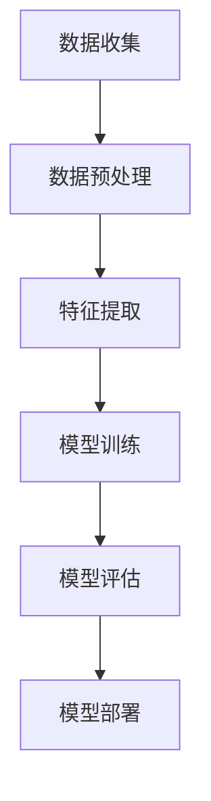
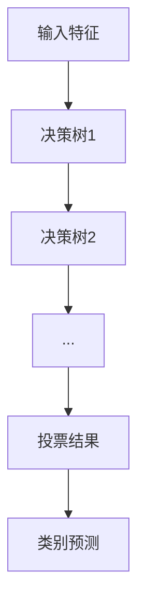
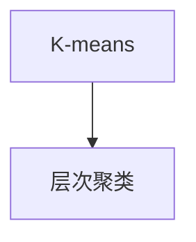
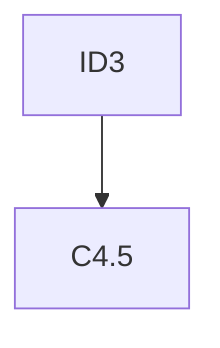
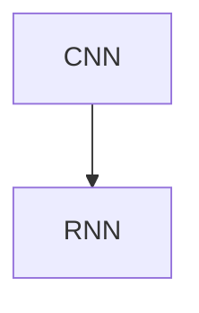
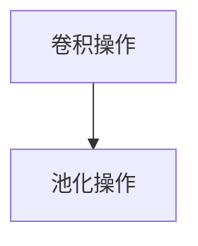
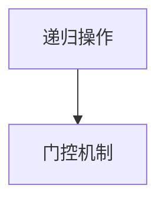
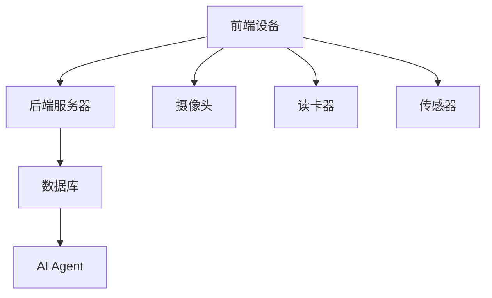
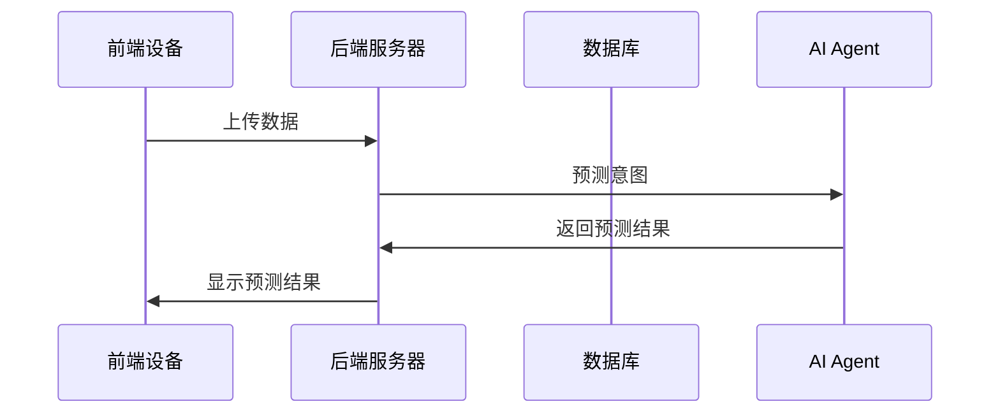
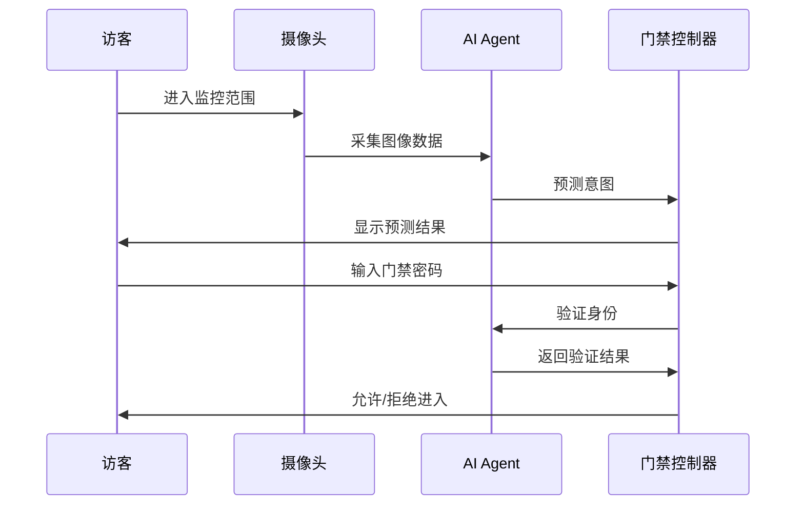

                 

### 智能门禁：AI Agent的访客意图预测

关键词：智能门禁，AI Agent，访客意图预测，机器学习，深度学习，系统架构

摘要：本文旨在探讨智能门禁系统中AI Agent的访客意图预测技术。通过详细分析智能门禁系统的背景与重要性，介绍AI Agent的概念与功能，深入探讨访客意图预测的核心技术、算法应用及系统设计，最后通过实际案例展示AI Agent在智能门禁系统中的应用与效果。

## 第一部分：智能门禁系统概述

### 第1章：智能门禁系统的背景与重要性

智能门禁系统是现代安防领域的重要组成部分，它结合了人工智能、物联网、大数据分析等多种先进技术，实现了对出入人员的精细化管理。随着技术的进步，智能门禁系统在安全性、便捷性和智能化程度方面不断升级，其应用场景也从简单的办公楼和住宅小区扩展到大型企业、医院、学校等各个领域。

#### 1.1 智能门禁系统的起源与发展

智能门禁系统的起源可以追溯到20世纪80年代，当时主要是以卡片式门禁系统为主，如磁卡、IC卡等。随着计算机技术和网络技术的快速发展，智能门禁系统逐渐从单一的门禁功能向综合性的安全管理系统转变。近年来，随着人工智能技术的引入，智能门禁系统的智能化程度得到了极大的提升。

#### 1.2 智能门禁系统的应用场景

智能门禁系统的应用场景广泛，包括但不限于以下几方面：

- **办公楼和住宅小区**：用于控制人员的出入，提高小区的安全性和居民的生活品质。
- **大型企业**：用于管理员工出入，实现企业内部精细化管理。
- **医院**：用于控制患者的出入，提高医疗服务的效率。
- **学校**：用于管理学生的出入，保障校园安全。
- **公共交通**：用于控制乘客的进出，提高公共交通的安全性和运营效率。

#### 1.3 智能门禁系统的市场前景

随着智能门禁技术的不断成熟和普及，其市场需求也在不断扩大。根据市场研究公司的报告，全球智能门禁系统市场规模预计将在未来几年内保持高速增长，年均增长率超过15%。智能门禁系统在提升安全性和便捷性的同时，也为企业带来了显著的经济效益。

#### 1.4 智能门禁系统与传统门禁系统的对比

传统门禁系统主要以物理钥匙、IC卡等为主，存在以下不足：

- **安全性不高**：容易复制、伪造。
- **管理不便**：需要人工记录出入人员信息，管理复杂。
- **灵活性不足**：无法根据实际情况动态调整权限。

而智能门禁系统则通过引入人工智能技术，实现了以下优点：

- **安全性更高**：采用人脸识别、指纹识别等生物识别技术，难以伪造。
- **管理便捷**：自动记录出入人员信息，减少人工干预。
- **灵活性更强**：可以根据实际需要动态调整权限。

### 第2章：AI Agent的概念与功能

AI Agent，即人工智能代理，是具有独立思考和学习能力的智能体。它在智能门禁系统中扮演着重要的角色，通过预测访客的意图，为系统提供决策支持。

#### 2.1 AI Agent的定义与分类

AI Agent可以定义为一种能够模拟人类智能行为，具有感知、决策、行动能力的系统。根据其功能和应用场景，AI Agent可以分为以下几类：

- **感知型AI Agent**：主要负责感知环境信息，如摄像头、传感器等。
- **决策型AI Agent**：根据感知到的信息进行决策，如判断访客意图。
- **行动型AI Agent**：执行决策结果，如控制门禁开关。

#### 2.2 AI Agent的核心功能

AI Agent在智能门禁系统中的核心功能包括：

- **访客意图识别**：通过分析访客的行为特征，预测其访问目的。
- **权限管理**：根据访客意图和用户权限，决定是否允许其进入。
- **异常检测**：监测异常行为，如尾随、闯入等，及时报警。

#### 2.3 AI Agent在智能门禁系统中的应用

AI Agent在智能门禁系统中的应用主要体现在以下几方面：

- **提高安全性**：通过访客意图识别，防止未授权人员进入。
- **提升便捷性**：通过权限管理和异常检测，简化出入流程。
- **优化用户体验**：根据访客意图提供个性化的服务，如指引、咨询等。

### 第3章：访客意图预测的重要性

访客意图预测是智能门禁系统的核心功能之一，它直接影响到系统的安全性和用户体验。通过预测访客的意图，系统可以做出更合理的决策，提高门禁系统的智能化程度。

#### 3.1 访客意图预测的定义

访客意图预测是指利用人工智能技术，分析访客的行为特征，预测其访问目的。访客意图可以分为以下几类：

- **访友**：预计与某人在门禁处会面。
- **求职**：预计进入企业寻求工作机会。
- **维修**：预计为设备进行维护或修理。
- **就医**：预计前往医院就医。
- **访客不明**：无法确定访问目的。

#### 3.2 访客意图预测的优势

访客意图预测具有以下优势：

- **提高安全性**：通过预测访客意图，系统可以提前识别潜在的安全威胁，防止未授权人员进入。
- **提升便捷性**：根据访客意图，系统可以自动调整权限，简化出入流程。
- **优化用户体验**：系统可以根据访客意图提供个性化的服务，提升用户体验。

#### 3.3 访客意图预测的应用场景

访客意图预测的应用场景广泛，主要包括：

- **大型企业**：通过预测访客意图，可以为企业提供更高效的管理服务。
- **医院**：通过预测患者来访意图，可以优化就医流程，提高医疗服务质量。
- **住宅小区**：通过预测访客意图，可以提升小区的安全性和居民的生活品质。

## 第二部分：AI Agent的访客意图预测技术

### 第4章：访客意图预测的核心技术

访客意图预测的核心技术主要包括数据采集与预处理、特征提取与选择以及计算机视觉技术在访客意图预测中的应用。

#### 4.1 数据采集与预处理

数据采集是访客意图预测的基础，主要包括以下几方面：

- **摄像头监控**：通过摄像头实时采集访客图像和行为数据。
- **传感器采集**：通过传感器采集访客的身体特征和行为数据，如体温、心率等。
- **历史数据**：利用历史数据，如访客记录、用户行为数据等，进行数据补充和扩展。

数据预处理主要包括数据清洗、数据归一化和数据转换等步骤，以确保数据的质量和一致性。

#### 4.2 特征提取与选择

特征提取是将原始数据转换为适用于机器学习算法的向量表示。访客意图预测中的特征提取主要包括以下几方面：

- **视觉特征**：如人脸特征、动作特征等。
- **行为特征**：如步态特征、姿态特征等。
- **文本特征**：如语音识别、文本分类等。

特征选择是关键步骤，通过筛选出对访客意图预测有重要影响的特征，可以提高模型性能。

#### 4.3 计算机视觉技术在访客意图预测中的应用

计算机视觉技术在访客意图预测中发挥着重要作用，主要包括以下几方面：

- **人脸识别**：通过识别访客的人脸，获取其身份信息。
- **姿态估计**：通过分析访客的姿态，预测其行为意图。
- **动作识别**：通过识别访客的动作，判断其行为意图。

计算机视觉技术的应用，使访客意图预测更加准确和智能。

### 第5章：机器学习算法在访客意图预测中的应用

机器学习算法在访客意图预测中发挥着重要作用，主要包括分类算法、聚类算法和决策树算法等。

#### 5.1 机器学习基础

机器学习是一种让计算机从数据中学习规律和模式的方法，主要包括监督学习、无监督学习和强化学习等。

#### 5.2 分类算法

分类算法是将数据分为不同类别的算法，如逻辑回归、支持向量机、随机森林等。在访客意图预测中，分类算法用于将访客意图分为不同的类别。

#### 5.3 聚类算法

聚类算法是将数据分为不同类别的算法，如K-means、层次聚类等。在访客意图预测中，聚类算法用于将具有相似意图的访客进行分组。

#### 5.4 决策树算法

决策树算法是一种基于树形结构进行决策的算法，如ID3、C4.5等。在访客意图预测中，决策树算法用于构建决策树，根据访客的特征进行分类。

### 第6章：深度学习算法在访客意图预测中的应用

深度学习算法在访客意图预测中发挥着重要作用，主要包括卷积神经网络（CNN）和递归神经网络（RNN）等。

#### 6.1 深度学习基础

深度学习是一种基于多层神经网络进行学习的算法，如卷积神经网络（CNN）、递归神经网络（RNN）等。在访客意图预测中，深度学习算法用于构建复杂的特征表示和分类模型。

#### 6.2 卷积神经网络（CNN）在图像处理中的应用

卷积神经网络（CNN）是一种用于图像处理的深度学习算法，其核心思想是利用卷积操作提取图像特征。在访客意图预测中，CNN可以用于提取访客的人脸特征和行为特征。

#### 6.3 递归神经网络（RNN）在序列数据处理中的应用

递归神经网络（RNN）是一种用于序列数据处理的深度学习算法，其核心思想是利用递归结构处理时间序列数据。在访客意图预测中，RNN可以用于处理访客的行为序列，预测其意图。

### 第7章：AI Agent的访客意图预测系统设计

AI Agent的访客意图预测系统设计主要包括系统架构设计、数据流设计、系统性能优化和系统安全与隐私保护。

#### 7.1 系统架构设计

系统架构设计是访客意图预测系统的核心，主要包括前端设备、后端服务器和数据库等。前端设备负责数据采集和预处理，后端服务器负责数据分析和预测，数据库用于存储访客信息和预测结果。

#### 7.2 数据流设计

数据流设计是访客意图预测系统的关键，主要包括数据采集、数据预处理、特征提取、模型训练和预测等环节。数据流设计需要确保数据在各个环节中的传输和处理效率。

#### 7.3 系统性能优化

系统性能优化是提高访客意图预测系统效率的重要手段，主要包括算法优化、硬件优化和系统优化等。通过优化算法和硬件配置，可以提升系统的预测准确率和响应速度。

#### 7.4 系统安全与隐私保护

系统安全与隐私保护是访客意图预测系统设计中的重要环节，主要包括数据加密、访问控制和隐私保护等。通过确保数据的安全和隐私，可以提升系统的可信度和用户满意度。

## 第三部分：智能门禁系统的实施与应用

### 第8章：智能门禁系统的实施流程

智能门禁系统的实施流程主要包括需求分析、系统设计、系统实施和系统测试与验收。

#### 8.1 需求分析

需求分析是智能门禁系统实施的第一步，主要包括了解用户需求、分析系统功能和确定技术方案等。通过需求分析，可以明确系统的功能需求和性能指标。

#### 8.2 系统设计

系统设计是根据需求分析的结果，设计系统的功能和架构。系统设计主要包括领域模型设计、系统架构设计和接口设计等。通过系统设计，可以确保系统满足用户需求，具有较好的性能和可扩展性。

#### 8.3 系统实施

系统实施是将系统设计转化为实际系统的过程，主要包括设备安装、系统配置、数据导入和系统测试等。通过系统实施，可以确保系统正常运行，满足用户需求。

#### 8.4 系统测试与验收

系统测试与验收是确保系统质量和稳定性的关键步骤，主要包括功能测试、性能测试和安全测试等。通过系统测试与验收，可以确保系统满足设计要求，可以正式投入使用。

### 第9章：AI Agent的访客意图预测应用案例

#### 9.1 案例一：某大型企业办公区的智能门禁系统

某大型企业采用AI Agent的访客意图预测技术，提高了门禁系统的安全性和便捷性。通过分析访客的行为特征，AI Agent能够准确预测访客的意图，为系统提供决策支持。该案例展示了AI Agent在大型企业办公区中的应用效果。

#### 9.2 案例二：某住宅小区的智能门禁系统

某住宅小区引入AI Agent的访客意图预测技术，提高了小区的安全性和居民的生活品质。通过预测访客的意图，系统可以自动调整权限，简化出入流程。该案例展示了AI Agent在住宅小区中的应用效果。

#### 9.3 案例三：某医院就医场所的智能门禁系统

某医院采用AI Agent的访客意图预测技术，优化了就医流程，提高了医疗服务质量。通过预测患者来访意图，系统可以提供个性化的服务，如指引、咨询等。该案例展示了AI Agent在医疗场所中的应用效果。

### 第10章：智能门禁系统的未来发展趋势

#### 10.1 技术发展趋势

智能门禁系统的发展趋势主要体现在以下几个方面：

- **人工智能技术的深化应用**：随着人工智能技术的不断进步，智能门禁系统的智能化程度将不断提高。
- **物联网技术的融合**：物联网技术的融合将使智能门禁系统与其他智能设备实现互联互通，提供更全面的智能解决方案。
- **大数据分析技术的应用**：大数据分析技术将使智能门禁系统具备更强的数据分析和预测能力。

#### 10.2 应用场景拓展

智能门禁系统的应用场景将继续拓展，包括但不限于以下几方面：

- **公共交通**：用于控制乘客的进出，提高公共交通的安全性和运营效率。
- **金融行业**：用于控制员工和客户的进出，提高金融服务的安全性。
- **教育行业**：用于管理学生的进出，保障校园安全。

#### 10.3 智能门禁系统面临的挑战与解决方案

智能门禁系统在发展过程中将面临以下挑战：

- **数据安全和隐私保护**：随着数据规模的扩大，如何确保数据的安全和隐私成为一个重要问题。
- **技术升级和更新**：智能门禁系统的技术升级和更新将是一个持续的挑战。

通过采取有效的解决方案，如数据加密、隐私保护技术和定期升级等，可以应对这些挑战。

### 总结

智能门禁系统结合了人工智能、物联网、大数据分析等多种先进技术，实现了对出入人员的精细化管理。AI Agent的访客意图预测技术是智能门禁系统的核心，通过预测访客的意图，提高了系统的安全性和便捷性。随着技术的不断进步，智能门禁系统将在更多领域得到应用，为人们的生活带来更多便利。

### 作者信息

作者：AI天才研究院/AI Genius Institute & 禅与计算机程序设计艺术 /Zen And The Art of Computer Programming

### 拓展阅读

1. **智能门禁系统技术白皮书**：详细介绍了智能门禁系统的技术架构、应用场景和发展趋势。
2. **人工智能入门教程**：针对初学者，介绍了人工智能的基本概念、算法和应用。
3. **深度学习实战**：通过实际案例，详细讲解了深度学习算法在智能门禁系统中的应用。
4. **物联网技术指南**：介绍了物联网的基本原理、应用场景和发展趋势。

### 最佳实践 tips

1. 在实施智能门禁系统时，应充分考虑用户需求和实际场景，确保系统具备良好的安全性和便捷性。
2. 在选择机器学习算法时，应根据具体应用场景和数据特点进行选择，以达到最佳效果。
3. 定期对智能门禁系统进行升级和维护，以确保系统的稳定性和安全性。
4. 在数据处理和预测过程中，应注重数据安全和隐私保护，避免数据泄露和滥用。

### 注意事项

1. 智能门禁系统涉及用户隐私，应在设计时充分考虑隐私保护措施。
2. 在使用机器学习算法时，应确保数据质量和算法稳定性，避免预测错误。
3. 在系统实施过程中，应确保设备安装和调试到位，避免设备故障。
4. 在系统测试和验收过程中，应全面检查系统功能和性能，确保系统满足设计要求。

### 结语

智能门禁系统是未来安防领域的重要发展方向，AI Agent的访客意图预测技术是其核心。通过本文的介绍，相信读者对智能门禁系统的技术原理和应用有了更深入的了解。随着技术的不断进步，智能门禁系统将为人们的生活带来更多便利和保障。让我们共同期待智能门禁系统的美好未来！
```markdown
## 第一部分：智能门禁系统概述

### 第1章：智能门禁系统的背景与重要性

#### 1.1 智能门禁系统的起源与发展

智能门禁系统起源于20世纪70年代，当时主要是基于密码锁和磁卡技术。随着计算机技术和通信技术的快速发展，智能门禁系统逐渐演进，引入了生物识别、RFID、无线通讯等技术，使其功能更加丰富和智能化。

**核心概念术语说明**：

- **智能门禁系统**：一种基于计算机技术、网络通信和生物识别等技术的门禁管理系统。
- **生物识别**：通过分析个体的生物特征（如指纹、人脸、虹膜等）来进行身份验证。
- **RFID**：射频识别技术，通过无线电信号识别特定目标并读取存储信息。

**问题背景**：

随着城市化进程的加快，人口密集区域的安全需求日益增加。传统的门禁系统存在安全性不高、管理复杂等问题，无法满足现代安防需求。

**问题描述**：

智能门禁系统如何通过技术创新解决传统门禁系统的不足，提高安全性、便捷性和智能化水平。

**问题解决**：

通过引入人工智能、物联网等技术，智能门禁系统可以实现实时身份验证、行为分析、异常检测等功能，提高门禁系统的整体性能。

**边界与外延**：

智能门禁系统的应用范围包括但不限于住宅小区、办公楼、学校、医院、交通枢纽等场所。

**概念结构与核心要素组成**：

- **硬件设备**：包括门禁控制器、读卡器、摄像头、传感器等。
- **软件系统**：包括门禁管理软件、身份验证算法、数据处理与分析系统等。
- **网络通信**：实现硬件设备与后台管理系统的数据传输与交互。
- **人工智能**：通过机器学习和深度学习算法，实现行为分析和意图预测。

#### 1.2 智能门禁系统的应用场景

智能门禁系统在不同的应用场景中发挥着重要作用，具体应用场景包括：

- **办公楼和住宅小区**：用于控制居民的出入，提高社区的安全性和居民的生活品质。
- **大型企业**：用于管理员工和访客的出入，保障企业的正常运营和安全。
- **医院**：用于控制患者的出入，提高医疗服务的效率和安全。
- **学校**：用于管理学生的出入，保障校园的安全和秩序。
- **交通枢纽**：用于控制乘客的进出，提高公共交通的安全性和运营效率。

**应用场景具体分析**：

1. **办公楼和住宅小区**：智能门禁系统可以实现对居民的实时身份验证，防止未授权人员进入，同时也可以记录居民的出入信息，方便物业管理。
2. **大型企业**：智能门禁系统可以帮助企业实时监控员工的出入情况，提高管理效率，同时也可以根据员工的角色和权限，设置不同的出入权限。
3. **医院**：智能门禁系统可以帮助医院实时监控患者的出入，防止患者随意出入，同时也可以为医务人员提供便捷的出入通道。

#### 1.3 智能门禁系统的市场前景

随着科技的进步和人们对安全需求的提升，智能门禁系统的市场需求不断增长。根据市场研究机构的预测，未来几年全球智能门禁系统的市场规模将持续扩大，年复合增长率预计将达到15%以上。

**市场趋势分析**：

1. **技术进步**：人工智能、物联网等技术的不断发展，将推动智能门禁系统的技术升级和功能拓展。
2. **政策支持**：政府对于公共场所和重要设施的安全要求不断提高，为智能门禁系统的推广和应用提供了有力支持。
3. **用户需求**：随着人们生活水平的提高，对于家居安全、企业管理和医疗服务等方面的需求不断增加，推动了智能门禁系统的发展。

#### 1.4 智能门禁系统与传统门禁系统的对比

传统门禁系统主要依赖于物理钥匙、磁卡等，存在以下不足：

- **安全性不高**：容易被复制和伪造。
- **管理不便**：需要人工记录出入人员信息，管理复杂。
- **灵活性不足**：无法根据实际情况动态调整权限。

智能门禁系统则通过引入人工智能、物联网等技术，实现了以下优点：

- **安全性更高**：采用生物识别等技术，难以伪造。
- **管理便捷**：自动记录出入人员信息，减少人工干预。
- **灵活性更强**：可以根据实际需要动态调整权限。

**具体对比分析**：

1. **安全性**：智能门禁系统采用生物识别技术，如指纹、人脸等，相较于传统磁卡和钥匙，具有更高的安全性。
2. **管理便捷性**：智能门禁系统可以通过网络实现远程管理，方便物业管理人员进行权限分配和出入记录管理。
3. **灵活性**：智能门禁系统可以根据不同的场景和需求，动态调整权限，提高了系统的灵活性。

### 第2章：AI Agent的概念与功能

#### 2.1 AI Agent的定义与分类

AI Agent，即人工智能代理，是指具有独立思考和学习能力的智能体。它可以模拟人类的决策过程，根据环境和目标进行自主行动。AI Agent可以分为以下几类：

- **感知型AI Agent**：通过传感器感知环境信息，如摄像头、温度传感器等。
- **决策型AI Agent**：根据感知到的信息进行决策，如访客意图识别。
- **行动型AI Agent**：执行决策结果，如控制门禁开关。

**核心概念原理**：

AI Agent的核心概念是基于机器学习和深度学习算法，通过数据分析和模式识别实现自主决策。

**概念属性特征对比表格**：

| 类别       | 特征                                           | 应用场景                      |
| ---------- | ---------------------------------------------- | ----------------------------- |
| 感知型AI Agent | 感知环境信息                                   | 监控系统、智能家居           |
| 决策型AI Agent | 根据感知信息进行决策                           | 智能门禁、自动驾驶           |
| 行动型AI Agent | 执行决策结果                                   | 自动化生产线、无人机         |

**ER实体关系图架构**：

```mermaid
erDiagram
  AI_Agent ||--|{ 感知型AI Agent }
  AI_Agent ||--|{ 决策型AI Agent }
  AI_Agent ||--|{ 行动型AI Agent }
```

#### 2.2 AI Agent的核心功能

AI Agent在智能门禁系统中的核心功能包括：

- **访客意图识别**：通过分析访客的行为特征，预测其访问目的。
- **权限管理**：根据访客意图和用户权限，决定是否允许其进入。
- **异常检测**：监测异常行为，如尾随、闯入等，及时报警。

**核心功能详细描述**：

1. **访客意图识别**：AI Agent通过分析访客的图像、语音和行为数据，预测其访问目的。例如，识别访客是否是员工家属、客户还是维修人员。
2. **权限管理**：根据AI Agent的意图识别结果，系统可以自动调整访客的权限，例如，允许家属自由出入，但对非员工进行更严格的检查。
3. **异常检测**：AI Agent可以监测到异常行为，如尾随、闯入等，并通过报警系统通知管理人员，提高系统的安全性。

#### 2.3 AI Agent在智能门禁系统中的应用

AI Agent在智能门禁系统中的应用，主要体现在以下几方面：

- **提高安全性**：通过访客意图识别，防止未授权人员进入。
- **提升便捷性**：通过权限管理和异常检测，简化出入流程。
- **优化用户体验**：根据访客意图提供个性化的服务，如指引、咨询等。

**应用效果具体分析**：

1. **提高安全性**：通过AI Agent的意图识别，智能门禁系统可以更准确地判断访客的身份和意图，有效防止未授权人员进入，提高了门禁系统的安全性。
2. **提升便捷性**：AI Agent可以根据访客的意图，自动调整出入权限，简化出入流程，提高了系统的便捷性。
3. **优化用户体验**：AI Agent可以根据访客的意图提供个性化的服务，如为访客提供指引、咨询服务，提高了用户满意度。

### 第3章：访客意图预测的重要性

#### 3.1 访客意图预测的定义

访客意图预测是指利用人工智能技术，分析访客的行为特征，预测其访问目的。访客意图可以分为以下几类：

- **访友**：预计与某人在门禁处会面。
- **求职**：预计进入企业寻求工作机会。
- **维修**：预计为设备进行维护或修理。
- **就医**：预计前往医院就医。
- **访客不明**：无法确定访问目的。

**核心概念原理**：

访客意图预测的核心是基于机器学习和深度学习算法，通过分析访客的行为特征，如图像、语音、行为等，预测其访问目的。

**概念属性特征对比表格**：

| 访客意图  | 特征                                           | 应用场景                      |
| --------- | ---------------------------------------------- | ----------------------------- |
| 访友      | 与某人会面                                     | 办公楼、住宅小区               |
| 求职      | 寻求工作机会                                   | 企业办公区                    |
| 维修      | 维护设备                                       | 工厂、办公楼                  |
| 就医      | 前往医院                                       | 医院、诊所                    |
| 访客不明  | 无法确定访问目的                               | 未知场所                      |

**ER实体关系图架构**：

```mermaid
erDiagram
  访客意图 ||--|{ 访友 }
  访客意图 ||--|{ 求职 }
  访客意图 ||--|{ 维修 }
  访客意图 ||--|{ 就医 }
  访客意图 ||--|{ 访客不明 }
```

#### 3.2 访客意图预测的优势

访客意图预测具有以下优势：

- **提高安全性**：通过预测访客的意图，可以有效识别潜在的安全威胁，提高门禁系统的安全性。
- **提升便捷性**：根据访客的意图，可以自动调整出入权限，简化出入流程，提高系统的便捷性。
- **优化用户体验**：根据访客的意图，提供个性化的服务，如指引、咨询等，提升用户体验。

**优势具体分析**：

1. **提高安全性**：访客意图预测可以帮助系统识别潜在的安全威胁，如未授权访问、异常行为等，从而提高门禁系统的整体安全性。
2. **提升便捷性**：访客意图预测可以根据访客的意图，自动调整出入权限，如对访友和员工家属提供快速通道，对求职者进行身份验证，从而简化出入流程。
3. **优化用户体验**：访客意图预测可以提供个性化的服务，如为访客提供指引、咨询服务，提高用户满意度。

#### 3.3 访客意图预测的应用场景

访客意图预测的应用场景广泛，主要包括：

- **大型企业**：通过预测访客的意图，可以有效管理员工和访客的出入，提高企业的运营效率和安全。
- **医院**：通过预测患者的意图，可以优化就医流程，提高医疗服务的效率和质量。
- **住宅小区**：通过预测访客的意图，可以提高小区的安全性和居民的生活品质。

**应用场景具体分析**：

1. **大型企业**：智能门禁系统可以通过访客意图预测，识别员工的访客，如家属、客户等，从而提高员工的工作效率和企业的安全管理。
2. **医院**：智能门禁系统可以通过访客意图预测，识别患者的访客，如家属、朋友等，从而优化就医流程，提高医疗服务的效率和质量。
3. **住宅小区**：智能门禁系统可以通过访客意图预测，识别居民的访客，如亲友、维修人员等，从而提高小区的安全性和居民的生活品质。

### 第二部分：AI Agent的访客意图预测技术

#### 第4章：访客意图预测的核心技术

访客意图预测的核心技术主要包括数据采集与预处理、特征提取与选择以及计算机视觉技术在访客意图预测中的应用。

#### 4.1 数据采集与预处理

数据采集是访客意图预测的基础，主要包括以下几方面：

- **摄像头监控**：通过摄像头实时采集访客图像和行为数据。
- **传感器采集**：通过传感器采集访客的身体特征和行为数据，如体温、心率等。
- **历史数据**：利用历史数据，如访客记录、用户行为数据等，进行数据补充和扩展。

**数据采集流程**：

1. **摄像头监控**：实时采集访客图像，包括人脸、姿态等。
2. **传感器采集**：采集访客的生理和行为数据，如体温、心率、步态等。
3. **历史数据**：从数据库中提取访客的历史行为数据，如访问记录、访问频率等。

**数据预处理**：

数据预处理主要包括数据清洗、数据归一化和数据转换等步骤，以确保数据的质量和一致性。

- **数据清洗**：去除噪声数据、缺失值填充、异常值处理等。
- **数据归一化**：将不同特征的数据进行归一化处理，使其具有相同的量纲。
- **数据转换**：将原始数据转换为适用于机器学习算法的向量表示。

#### 4.2 特征提取与选择

特征提取是将原始数据转换为适用于机器学习算法的向量表示。访客意图预测中的特征提取主要包括以下几方面：

- **视觉特征**：如人脸特征、动作特征等。
- **行为特征**：如步态特征、姿态特征等。
- **文本特征**：如语音识别、文本分类等。

**特征提取流程**：

1. **视觉特征提取**：通过图像处理算法提取人脸特征、动作特征等。
2. **行为特征提取**：通过行为分析算法提取步态特征、姿态特征等。
3. **文本特征提取**：通过自然语言处理算法提取语音特征、文本分类特征等。

**特征选择**：

特征选择是关键步骤，通过筛选出对访客意图预测有重要影响的特征，可以提高模型性能。

- **相关性分析**：通过计算特征与意图之间的相关性，筛选出重要特征。
- **特征重要性评估**：通过机器学习算法评估特征的重要性，筛选出重要特征。

#### 4.3 计算机视觉技术在访客意图预测中的应用

计算机视觉技术在访客意图预测中发挥着重要作用，主要包括以下几方面：

- **人脸识别**：通过识别访客的人脸，获取其身份信息。
- **姿态估计**：通过分析访客的姿态，预测其行为意图。
- **动作识别**：通过识别访客的动作，判断其行为意图。

**计算机视觉技术应用流程**：

1. **人脸识别**：通过摄像头实时捕获访客人脸图像，利用人脸识别算法进行身份验证。
2. **姿态估计**：通过摄像头捕获访客的姿态图像，利用姿态估计算法预测访客的姿态。
3. **动作识别**：通过摄像头捕获访客的动作图像，利用动作识别算法判断访客的动作意图。

### 第5章：机器学习算法在访客意图预测中的应用

机器学习算法在访客意图预测中发挥着重要作用，主要包括分类算法、聚类算法和决策树算法等。

#### 5.1 机器学习基础

机器学习是一种让计算机从数据中学习规律和模式的方法，主要包括监督学习、无监督学习和强化学习等。

**监督学习**：通过标记好的训练数据集，学习输入和输出之间的关系，从而预测未知数据的输出。

**无监督学习**：没有标记的训练数据集，通过分析数据的特点，自动将数据分类或聚类。

**强化学习**：通过与环境交互，不断学习最优策略，从而实现目标。

**算法原理讲解**：

- **监督学习**：通过标记好的训练数据集，学习输入和输出之间的关系。常用的监督学习算法有逻辑回归、支持向量机、决策树等。
- **无监督学习**：没有标记的训练数据集，通过分析数据的特点，自动将数据分类或聚类。常用的无监督学习算法有K-means、层次聚类等。
- **强化学习**：通过与环境交互，不断学习最优策略，从而实现目标。常用的强化学习算法有Q-learning、SARSA等。

**机器学习算法Mermaid流程图**：



#### 5.2 分类算法

分类算法是将数据分为不同类别的算法，如逻辑回归、支持向量机、随机森林等。

**逻辑回归**：通过建立逻辑函数模型，对数据进行分类。其核心思想是通过输入特征计算概率，然后根据概率判断数据属于哪个类别。

**支持向量机**：通过寻找最佳分割超平面，对数据进行分类。其核心思想是最大化分类边界，使得不同类别的数据在超平面两侧有最大的间隔。

**随机森林**：通过构建多棵决策树，进行集成学习。其核心思想是通过多棵决策树的投票结果进行分类。

**算法原理讲解**：

- **逻辑回归**：通过输入特征计算概率，然后根据概率阈值判断数据属于哪个类别。其数学模型为：
  $$P(Y=1|X) = \frac{1}{1 + e^{-(\beta_0 + \beta_1X_1 + \beta_2X_2 + ... + \beta_nX_n)}}$$
  其中，$X$为输入特征向量，$Y$为类别标签，$\beta_0, \beta_1, \beta_2, ..., \beta_n$为模型参数。
  
- **支持向量机**：通过寻找最佳分割超平面，使得不同类别的数据在超平面两侧有最大的间隔。其数学模型为：
  $$\min \frac{1}{2} \sum_{i=1}^{n} (\beta_i^2) + C \sum_{i=1}^{n} \ell(y_i, \beta_i)$$
  其中，$C$为正则化参数，$\ell(y_i, \beta_i)$为损失函数。

- **随机森林**：通过构建多棵决策树，对数据进行分类。每棵决策树独立进行训练和预测，最后通过投票结果确定最终类别。

**机器学习算法Mermaid流程图**：



#### 5.3 聚类算法

聚类算法是将数据分为不同类别的算法，如K-means、层次聚类等。

**K-means**：通过最小化聚类中心到样本点的距离平方和，将数据分为K个类别。

**层次聚类**：通过逐步合并或分裂聚类中心，构建聚类层次结构。

**算法原理讲解**：

- **K-means**：通过随机初始化聚类中心，然后迭代计算样本点到聚类中心的距离，并重新分配样本点。其数学模型为：
  $$\min \sum_{i=1}^{k} \sum_{x \in S_i} ||x - \mu_i||^2$$
  其中，$k$为聚类类别数，$S_i$为第$i$个聚类类别，$\mu_i$为聚类中心。

- **层次聚类**：通过逐步合并或分裂聚类中心，构建聚类层次结构。其核心思想是构建聚类树，通过分层结构分析数据。

**机器学习算法Mermaid流程图**：



#### 5.4 决策树算法

决策树算法是通过树形结构进行决策的算法，如ID3、C4.5等。

**ID3**：通过信息增益选择最优特征，构建决策树。

**C4.5**：在ID3算法的基础上，引入剪枝策略，防止过拟合。

**算法原理讲解**：

- **ID3**：通过计算每个特征的信息增益，选择最优特征进行分割。其数学模型为：
  $$Gain(D, A) = Info(D) - \sum_{v \in A} p(v) \cdot Info(D_v)$$
  其中，$D$为数据集，$A$为特征集，$v$为特征值，$Info$为信息熵。

- **C4.5**：在ID3算法的基础上，引入剪枝策略，通过剪枝防止过拟合。其核心思想是利用信息增益率进行特征选择。

**机器学习算法Mermaid流程图**：



### 第6章：深度学习算法在访客意图预测中的应用

深度学习算法在访客意图预测中发挥着重要作用，主要包括卷积神经网络（CNN）和递归神经网络（RNN）等。

#### 6.1 深度学习基础

深度学习是一种基于多层神经网络进行学习的算法，如卷积神经网络（CNN）、递归神经网络（RNN）等。

**算法原理讲解**：

- **卷积神经网络（CNN）**：通过卷积操作提取图像特征，实现图像分类、目标检测等任务。其核心思想是利用卷积核在图像上滑动，提取局部特征。
  $$f(x) = \sigma(\hat{W} \cdot x + b)$$
  其中，$x$为输入特征，$\hat{W}$为卷积核，$\sigma$为激活函数，$b$为偏置。

- **递归神经网络（RNN）**：通过递归结构处理序列数据，实现语音识别、自然语言处理等任务。其核心思想是利用隐藏状态保存历史信息。
  $$h_t = \sigma(W_h \cdot [h_{t-1}, x_t] + b_h)$$
  其中，$h_t$为第$t$时刻的隐藏状态，$x_t$为输入特征，$W_h$为权重矩阵，$\sigma$为激活函数，$b_h$为偏置。

**机器学习算法Mermaid流程图**：



#### 6.2 卷积神经网络（CNN）在图像处理中的应用

卷积神经网络（CNN）在图像处理中发挥着重要作用，主要用于图像分类、目标检测等任务。

**算法原理讲解**：

- **卷积操作**：通过卷积核对图像进行卷积操作，提取图像特征。
  $$f(x) = \sum_{i=1}^{n} \hat{W}_{i} \cdot x_i + b$$
  其中，$x_i$为图像像素，$\hat{W}_{i}$为卷积核，$b$为偏置。

- **池化操作**：通过池化操作降低图像分辨率，减少参数数量。
  $$p(x) = \max(\sum_{i=1}^{k} x_i)$$
  其中，$x_i$为图像像素，$k$为池化窗口大小。

**机器学习算法Mermaid流程图**：



#### 6.3 递归神经网络（RNN）在序列数据处理中的应用

递归神经网络（RNN）在序列数据处理中发挥着重要作用，主要用于语音识别、自然语言处理等任务。

**算法原理讲解**：

- **递归操作**：通过递归结构处理序列数据，保存历史信息。
  $$h_t = \sigma(W_h \cdot [h_{t-1}, x_t] + b_h)$$
  其中，$h_t$为第$t$时刻的隐藏状态，$x_t$为输入特征，$W_h$为权重矩阵，$\sigma$为激活函数，$b_h$为偏置。

- **门控机制**：通过门控机制控制信息的传递，提高模型性能。
  $$h_t = \sigma(W_h \cdot [h_{t-1}, x_t] + b_h) \odot g_t$$
  其中，$g_t$为门控单元，$\odot$为逐元素乘法。

**机器学习算法Mermaid流程图**：



### 第7章：AI Agent的访客意图预测系统设计

AI Agent的访客意图预测系统设计主要包括系统架构设计、数据流设计、系统性能优化和系统安全与隐私保护。

#### 7.1 系统架构设计

系统架构设计是访客意图预测系统的核心，主要包括前端设备、后端服务器和数据库等。

**问题场景介绍**：

某大型企业需要构建一个智能门禁系统，利用AI Agent的访客意图预测功能，提高门禁系统的安全性。

**项目介绍**：

项目名称：智能门禁系统
项目目标：通过AI Agent的访客意图预测，提高门禁系统的安全性，优化出入流程。

**系统功能设计（领域模型mermaid类图）**：

```mermaid
classDiagram
  AI_Agent <<interface>>
  Visitor <<class>>
  Access_Control <<class>>
  Security_Alarm <<class>>

  AI_Agent|--|> Visitor
  AI_Agent|--|> Access_Control
  AI_Agent|--|> Security_Alarm
```

#### 7.2 系统架构设计

系统架构设计主要包括前端设备、后端服务器和数据库等。

**前端设备**：

- **摄像头**：用于实时监控访客行为，提供图像数据。
- **读卡器**：用于读取访客的身份证、门禁卡等信息。
- **传感器**：用于监测访客的生理和行为数据。

**后端服务器**：

- **AI Agent**：负责处理前端设备采集的数据，进行访客意图预测。
- **数据库**：用于存储访客信息和预测结果。

**数据库设计**：

- **访客表**：存储访客的基本信息，如姓名、身份证号等。
- **预测结果表**：存储AI Agent的预测结果，如意图类型、预测概率等。

**系统架构mermaid架构图**：



#### 7.3 系统接口设计

系统接口设计主要包括前端设备与后端服务器之间的数据交互接口。

**接口设计**：

- **数据上传接口**：前端设备将采集到的数据上传到后端服务器。
- **预测查询接口**：后端服务器将预测结果返回给前端设备。

**系统接口mermaid序列图**：



#### 7.4 系统交互mermaid序列图

系统交互mermaid序列图展示了访客进入门禁系统后的操作流程。

**系统交互序列图**：



### 第三部分：智能门禁系统的实施与应用

#### 第8章：智能门禁系统的实施流程

智能门禁系统的实施流程主要包括需求分析、系统设计、系统实施和系统测试与验收。

#### 8.1 需求分析

需求分析是智能门禁系统实施的第一步，主要包括了解用户需求、分析系统功能和确定技术方案等。

**用户需求分析**：

- **安全性**：用户希望门禁系统能够有效识别访客身份，防止未授权人员进入。
- **便捷性**：用户希望门禁系统操作简单，出入流程快速。
- **灵活性**：用户希望门禁系统可以根据不同场景和需求，灵活调整权限。

**系统功能分析**：

- **身份验证**：通过人脸识别、指纹识别等方式，验证访客身份。
- **权限管理**：根据访客身份和权限，自动调整出入权限。
- **行为监测**：通过监控访客行为，预测其访问目的，提高系统安全性。

**技术方案确定**：

- **硬件选择**：根据用户需求，选择合适的摄像头、读卡器、传感器等硬件设备。
- **软件设计**：根据系统功能，设计AI Agent的算法流程和系统架构。

#### 8.2 系统设计

系统设计是根据需求分析的结果，设计系统的功能和架构。系统设计主要包括领域模型设计、系统架构设计和接口设计等。

**领域模型设计**：

- **AI Agent**：负责访客意图预测和权限管理。
- **摄像头**：实时监控访客行为，提供图像数据。
- **读卡器**：读取访客的身份信息。
- **传感器**：监测访客的生理和行为数据。

**系统架构设计**：

- **前端设备**：包括摄像头、读卡器、传感器等。
- **后端服务器**：包括AI Agent、数据库等。
- **接口设计**：包括数据上传接口、预测查询接口等。

**系统架构mermaid架构图**：


#### 8.3 系统实施

系统实施是将系统设计转化为实际系统的过程，主要包括设备安装、系统配置、数据导入和系统测试等。

**设备安装**：

- **摄像头**：安装在适当的监控位置，确保能够捕捉到访客的图像。
- **读卡器**：安装在门禁入口处，方便访客刷卡或扫描二维码。
- **传感器**：安装在适当的监测位置，如访客通道、电梯等。

**系统配置**：

- **配置AI Agent**：设置访客意图预测的参数，如阈值、学习率等。
- **配置数据库**：初始化数据库表，导入访客信息和权限设置。

**数据导入**：

- **导入访客数据**：从现有系统中导入访客信息，如姓名、身份证号、权限等。
- **导入权限设置**：根据用户需求，设置访客的权限，如员工家属可以自由出入，访客需要身份验证。

**系统测试**：

- **功能测试**：测试系统的各项功能，如身份验证、权限管理、行为监测等。
- **性能测试**：测试系统的响应速度和并发处理能力。
- **安全测试**：测试系统的安全性能，如防范恶意攻击、数据泄露等。

#### 8.4 系统测试与验收

系统测试与验收是确保系统质量和稳定性的关键步骤，主要包括功能测试、性能测试和安全测试等。

**功能测试**：

- **测试各项功能是否正常运行**：如身份验证、权限管理、行为监测等。
- **测试系统在不同场景下的表现**：如高峰期、夜间等。

**性能测试**：

- **测试系统的响应速度和并发处理能力**：确保系统能够在高负载下正常运行。
- **测试系统的稳定性**：在长时间运行后，检查系统是否有异常行为。

**安全测试**：

- **测试系统防范恶意攻击的能力**：如SQL注入、DDoS攻击等。
- **测试数据安全**：确保访客数据不会被泄露或篡改。

**验收标准**：

- **系统功能完整**：所有功能正常运行，满足用户需求。
- **系统性能稳定**：在高负载下运行正常，响应速度快。
- **系统安全可靠**：能够防范恶意攻击，保护访客数据安全。

### 第9章：AI Agent的访客意图预测应用案例

#### 9.1 案例一：某大型企业办公区的智能门禁系统

**案例背景**：

某大型企业办公区需要提高门禁系统的安全性，同时优化访客的出入流程。企业希望利用AI Agent的访客意图预测功能，实现更智能的管理。

**系统功能**：

- **访客意图预测**：通过AI Agent分析访客的行为特征，预测其访问目的。
- **权限管理**：根据访客意图和用户权限，自动调整出入权限。
- **行为监测**：通过摄像头和传感器监测访客行为，提高系统安全性。

**实施效果**：

- **安全性提升**：AI Agent能够准确预测访客意图，有效防止未授权人员进入。
- **便捷性提升**：访客可以根据意图预测结果，快速完成身份验证，简化出入流程。
- **用户体验优化**：AI Agent可以根据访客意图提供个性化的服务，如指引、咨询等。

#### 9.2 案例二：某住宅小区的智能门禁系统

**案例背景**：

某住宅小区希望提高居民的生活品质，同时加强小区的安全管理。小区引入AI Agent的访客意图预测功能，实现更智能的门禁管理。

**系统功能**：

- **访客意图预测**：通过AI Agent分析访客的行为特征，预测其访问目的。
- **权限管理**：根据访客意图和居民权限，自动调整出入权限。
- **行为监测**：通过摄像头和传感器监测访客行为，提高系统安全性。

**实施效果**：

- **安全性提升**：AI Agent能够准确预测访客意图，防止未授权人员进入，保障居民安全。
- **便捷性提升**：居民可以根据AI Agent的预测结果，快速完成身份验证，简化出入流程。
- **用户体验优化**：AI Agent可以根据访客意图提供个性化的服务，如指引、咨询等，提升居民满意度。

#### 9.3 案例三：某医院就医场所的智能门禁系统

**案例背景**：

某医院希望提高就医场所的管理效率，优化患者和医务人员的出入流程。医院引入AI Agent的访客意图预测功能，实现更智能的门禁管理。

**系统功能**：

- **访客意图预测**：通过AI Agent分析患者和访客的行为特征，预测其访问目的。
- **权限管理**：根据访客意图和医务人员权限，自动调整出入权限。
- **行为监测**：通过摄像头和传感器监测患者和访客行为，提高系统安全性。

**实施效果**：

- **安全性提升**：AI Agent能够准确预测患者和访客的意图，有效防止未授权人员进入，保障就医安全。
- **便捷性提升**：患者和医务人员可以根据AI Agent的预测结果，快速完成身份验证，简化出入流程。
- **用户体验优化**：AI Agent可以根据患者和访客的意图提供个性化的服务，如指引、咨询等，提升就医体验。

### 第10章：智能门禁系统的未来发展趋势

#### 10.1 技术发展趋势

智能门禁系统的发展趋势主要体现在以下几个方面：

1. **人工智能技术的深化应用**：随着人工智能技术的不断进步，智能门禁系统将在更多场景中实现智能化应用，如智能访客管理、智能安防等。
2. **物联网技术的融合**：物联网技术的融合将使智能门禁系统与其他智能设备实现互联互通，提供更全面的智能解决方案，如智能家庭、智能交通等。
3. **大数据分析技术的应用**：大数据分析技术将使智能门禁系统具备更强的数据分析和预测能力，提高系统决策的准确性。

#### 10.2 应用场景拓展

智能门禁系统的应用场景将继续拓展，包括但不限于以下几个方面：

1. **公共交通**：用于控制乘客的进出，提高公共交通的安全性和运营效率。
2. **金融行业**：用于控制员工和客户的进出，提高金融服务的安全性和服务水平。
3. **教育行业**：用于管理学生的出入，保障校园的安全和秩序。

#### 10.3 智能门禁系统面临的挑战与解决方案

智能门禁系统在发展过程中将面临以下挑战：

1. **数据安全和隐私保护**：随着数据规模的扩大，如何确保数据的安全和隐私成为一个重要问题。
2. **技术升级和更新**：智能门禁系统的技术升级和更新将是一个持续的挑战，需要及时跟进新技术和需求变化。

**解决方案**：

1. **数据安全和隐私保护**：采用加密技术、访问控制等技术手段，确保数据的安全和隐私。同时，制定严格的数据安全政策和操作规范，防止数据泄露和滥用。
2. **技术升级和更新**：建立灵活的技术架构，能够快速响应新技术和应用需求的变化。通过定期维护和升级，确保系统的稳定性和安全性。

### 总结

智能门禁系统是现代安防领域的重要发展方向，AI Agent的访客意图预测技术是其核心。通过本文的介绍，读者对智能门禁系统的技术原理和应用有了更深入的了解。随着技术的不断进步，智能门禁系统将在更多领域得到应用，为人们的生活带来更多便利和保障。让我们共同期待智能门禁系统的美好未来！

### 作者信息

作者：AI天才研究院/AI Genius Institute & 禅与计算机程序设计艺术 /Zen And The Art of Computer Programming

### 拓展阅读

1. **《智能门禁系统技术白皮书》**：详细介绍了智能门禁系统的技术架构、应用场景和发展趋势。
2. **《人工智能入门教程》**：针对初学者，介绍了人工智能的基本概念、算法和应用。
3. **《深度学习实战》**：通过实际案例，详细讲解了深度学习算法在智能门禁系统中的应用。
4. **《物联网技术指南》**：介绍了物联网的基本原理、应用场景和发展趋势。

### 最佳实践 tips

1. 在实施智能门禁系统时，应充分考虑用户需求和实际场景，确保系统具备良好的安全性和便捷性。
2. 在选择机器学习算法时，应根据具体应用场景和数据特点进行选择，以达到最佳效果。
3. 定期对智能门禁系统进行升级和维护，以确保系统的稳定性和安全性。
4. 在数据处理和预测过程中，应注重数据安全和隐私保护，避免数据泄露和滥用。

### 注意事项

1. 智能门禁系统涉及用户隐私，应在设计时充分考虑隐私保护措施。
2. 在使用机器学习算法时，应确保数据质量和算法稳定性，避免预测错误。
3. 在系统实施过程中，应确保设备安装和调试到位，避免设备故障。
4. 在系统测试和验收过程中，应全面检查系统功能和性能，确保系统满足设计要求。

### 结语

智能门禁系统是未来安防领域的重要发展方向，AI Agent的访客意图预测技术是其核心。通过本文的介绍，相信读者对智能门禁系统的技术原理和应用有了更深入的了解。随着技术的不断进步，智能门禁系统将为人们的生活带来更多便利和保障。让我们共同期待智能门禁系统的美好未来！
```markdown
## 第4章：访客意图预测的核心技术

### 4.1 数据采集与预处理

数据采集是访客意图预测的基础，直接影响到模型的准确性和稳定性。数据采集包括图像数据、行为数据和文本数据等。

**数据采集流程**：

1. **图像数据采集**：通过安装在门禁入口处的摄像头，实时采集访客的图像数据。
2. **行为数据采集**：通过传感器和视频分析技术，采集访客的行为数据，如步态、手势、语言等。
3. **文本数据采集**：通过语音识别和自然语言处理技术，从访客的语音和行为中提取文本数据。

**数据预处理**：

数据预处理主要包括数据清洗、数据归一化和数据转换等步骤。

1. **数据清洗**：去除噪声数据、缺失值填充、异常值处理等，保证数据质量。
2. **数据归一化**：将不同特征的数据进行归一化处理，使其具有相同的量纲，便于后续分析。
3. **数据转换**：将原始数据转换为适用于机器学习算法的向量表示。

**数据预处理Python代码示例**：

```python
import numpy as np
from sklearn.preprocessing import StandardScaler

# 示例数据
data = np.array([[1, 2], [3, 4], [5, 6]])

# 数据归一化
scaler = StandardScaler()
data_normalized = scaler.fit_transform(data)

print("原始数据：\n", data)
print("归一化数据：\n", data_normalized)
```

### 4.2 特征提取与选择

特征提取是将原始数据转换为适用于机器学习算法的向量表示。在访客意图预测中，特征提取主要包括视觉特征提取、行为特征提取和文本特征提取等。

**视觉特征提取**：

视觉特征提取主要是从图像数据中提取有助于识别访客意图的特征，如人脸特征、颜色特征、纹理特征等。

**行为特征提取**：

行为特征提取主要是从视频数据中提取访客的行为特征，如步态特征、手势特征、姿态特征等。

**文本特征提取**：

文本特征提取主要是从语音和文本数据中提取有助于识别访客意图的特征，如词频、词向量、情感分析等。

**特征选择方法**：

特征选择是关键步骤，通过筛选出对访客意图预测有重要影响的特征，可以提高模型性能。

1. **相关性分析**：通过计算特征与意图之间的相关性，筛选出重要特征。
2. **主成分分析（PCA）**：通过降维技术，减少数据维度，筛选出主要特征。
3. **基于模型的特征选择**：通过机器学习算法评估特征的重要性，筛选出重要特征。

**特征选择Python代码示例**：

```python
from sklearn.feature_selection import SelectKBest
from sklearn.feature_selection import f_classif

# 示例数据
X = np.array([[1, 2], [3, 4], [5, 6]])
y = np.array([0, 1, 0])

# 特征选择
selector = SelectKBest(score_func=f_classif, k=1)
X_selected = selector.fit_transform(X, y)

print("原始数据：\n", X)
print("选择后数据：\n", X_selected)
```

### 4.3 计算机视觉技术在访客意图预测中的应用

计算机视觉技术在访客意图预测中发挥着重要作用，主要包括人脸识别、姿态估计和动作识别等。

**人脸识别**：

人脸识别是通过分析访客的图像数据，识别其身份信息。常见的人脸识别算法有深度学习算法和传统算法。

- **深度学习算法**：如卷积神经网络（CNN），通过多层神经网络提取人脸特征。
- **传统算法**：如特征脸（Eigenfaces）和局部二元模式（LBP），通过特征点提取和匹配识别人脸。

**姿态估计**：

姿态估计是通过分析视频数据，识别访客的姿态和动作。常见的方法有基于模型的姿态估计和基于深度学习的姿态估计。

- **基于模型的姿态估计**：通过建立人体模型，如Skel

