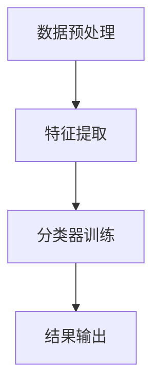
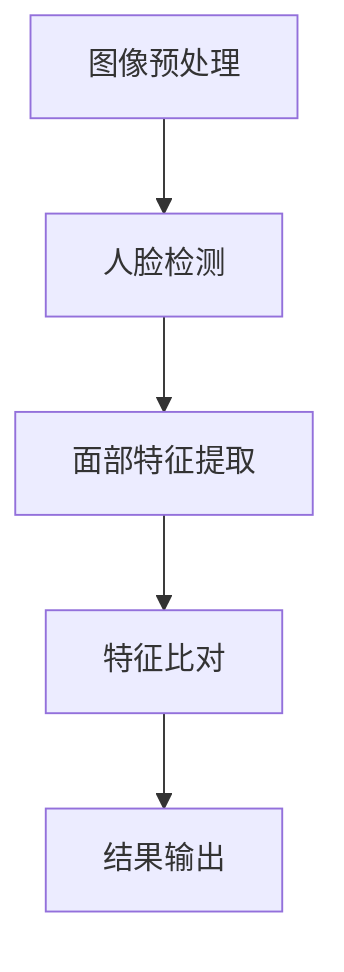
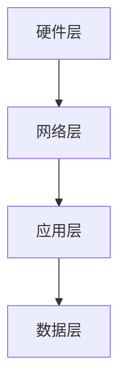
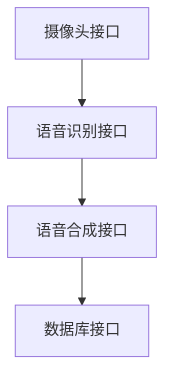

                 


### 文章标题：智能门铃：AI Agent的访客身份识别

> 关键词：智能门铃、AI Agent、身份识别、硬件设计、软件开发、安全性

> 摘要：本文将深入探讨智能门铃中AI Agent的访客身份识别技术。从背景与发展、硬件设计、软件架构设计到安全性分析，全面剖析智能门铃的核心技术。通过实例分析和实战分享，为读者提供实用指导，展望智能门铃的未来发展趋势。

---

### 目录大纲

## 第一部分：智能门铃概述

## 第1章：智能门铃的背景与发展

### 1.1.1 智能门铃的兴起

### 1.1.2 智能门铃的市场现状与趋势

### 1.1.3 智能门铃的技术创新

## 第2章：AI Agent与访客身份识别

### 2.1.1 AI Agent的概念与特点

### 2.1.2 AI Agent在门铃中的应用

### 2.1.3 访客身份识别的原理与方法

## 第3章：智能门铃的硬件设计

### 3.1.1 智能门铃的硬件构成

### 3.1.2 硬件选择与优化

### 3.1.3 硬件组装与调试

## 第二部分：软件设计与开发

## 第4章：智能门铃软件架构设计

### 4.1.1 智能门铃软件架构概述

### 4.1.2 软件模块划分与功能设计

### 4.1.3 软件架构优化与性能提升

## 第5章：AI Agent的算法实现

### 5.1.1 AI Agent算法原理

### 5.1.2 AI Agent算法流程图

### 5.1.3 AI Agent算法源代码分析

## 第6章：访客身份识别算法实现

### 6.1.1 访客身份识别算法原理

### 6.1.2 访客身份识别算法流程图

### 6.1.3 访客身份识别算法源代码分析

## 第三部分：智能门铃集成与测试

## 第7章：智能门铃集成与调试

### 7.1.1 智能门铃系统集成

### 7.1.2 系统调试与优化

### 7.1.3 故障分析与解决

## 第8章：智能门铃的测试与评估

### 8.1.1 智能门铃测试方法

### 8.1.2 测试数据收集与分析

### 8.1.3 测试结果评估与改进

## 第9章：智能门铃的安全性

### 9.1.1 智能门铃安全概述

### 9.1.2 安全威胁与防范措施

### 9.1.3 安全测试与漏洞修复

## 第10章：智能门铃的未来发展趋势

### 10.1.1 智能门铃的产业趋势

### 10.1.2 智能门铃的技术创新

### 10.1.3 智能门铃的市场前景

## 附录：智能门铃项目实例

### 11.1 项目概述

### 11.2 系统功能设计

### 11.3 系统架构设计

### 11.4 系统接口设计与交互

### 11.5 系统核心代码实现

### 11.6 项目小结与反思

### 11.7 拓展阅读

---

#### 完整性要求

**文章完整性是确保读者能够全面理解智能门铃技术的重要基础。以下要求将帮助确保文章的完整性：**

1. **核心概念与术语说明**：每个章节开头应简要介绍相关核心概念和术语，确保读者理解文章的基础。
2. **问题背景与解决**：在每个章节中，应详细描述问题背景，明确问题描述，并介绍解决方案及其边界与外延。
3. **概念属性特征对比表格与ER实体关系图**：使用Markdown中的Mermaid流程图展示概念属性特征对比和ER实体关系图，帮助读者直观理解系统结构。
4. **算法原理讲解**：包括算法原理的mermaid流程图展示和Python源代码实现，结合数学模型和公式进行详细讲解。
5. **系统分析与架构设计方案**：详细描述问题场景、系统功能设计（领域模型mermaid类图）、系统架构设计mermaid架构图、系统接口设计和系统交互mermaid序列图。
6. **项目实战**：提供环境安装、系统核心实现源代码，代码应用解读与分析，实际案例分析和详细讲解剖析。
7. **最佳实践、小结、注意事项、拓展阅读**：在每个章节末尾总结最佳实践，给出注意事项，并提供拓展阅读资源，帮助读者深入学习和思考。

---

#### 字数要求

**文章字数控制在10000～12000字左右。**

- **标题和关键词**：200字左右
- **摘要**：200字左右
- **目录大纲**：100字左右
- **正文内容**：10000～11000字
- **作者信息**：100字左右

---

#### 格式要求

**文章内容使用Markdown格式输出。**

- **标题**：使用 `#` 标记，例如 `## 第1章：智能门铃的背景与发展`
- **子标题**：使用 `##` 标记，例如 `### 1.1.1 智能门铃的兴起`
- **段落**：使用一个空行分隔段落
- **列表**：使用 `-` 或 `*` 标记，例如 `- 第一点` 或 `* 第一条`
- **代码**：使用三个反引号 ` ``` ` 包围，例如 ` ```python
    print("Hello, World!")
``` `
- **公式**：使用 LaTeX 格式，例如 `$1+1=2$` 或 `$$1+1=2$$`
- **图片**：使用 ``

---

#### 作者信息

**文章末尾需要写上作者信息：**

> 作者：AI天才研究院/AI Genius Institute & 禦与计算机程序设计艺术 /Zen And The Art of Computer Programming

---

#### 完整性要求

**文章内容必须完整，每个小节的内容必须丰富、具体、详细讲解。核心内容必须包含：**

- **背景介绍**：核心概念术语说明、问题背景、问题描述、问题解决、边界与外延、概念结构与核心要素组成。
- **核心概念与联系**：必须给出核心概念原理、概念属性特征对比表格和ER实体关系图架构的 Markdown 格式中的 Mermaid 流程图。
- **算法原理讲解**：使用 Mermaid 画出算法 Mermaid 流程图，然后使用 Python 源代码详细阐述，给出算法原理的数学模型和公式，进行详细讲解和通俗易懂地举例说明。
- **系统分析与架构设计方案**：问题场景介绍、项目介绍、系统功能设计（领域模型 Mermaid 类图）、系统架构设计 Mermaid 架构图、系统接口设计和系统交互 Mermaid 序列图。
- **项目实战**：环境安装、系统核心实现源代码，代码应用解读与分析，实际案例分析和详细讲解剖析，项目小结。
- **最佳实践 tips、小结、注意事项、拓展阅读等内容**。

---

### 步骤1：智能门铃的背景与发展

智能门铃作为智能家居领域的一项创新，不仅提升了家庭安全，还为现代生活带来了便利。其发展历程可以追溯到上世纪末，随着物联网、人工智能等技术的进步，智能门铃逐步走向成熟。在本文中，我们将首先回顾智能门铃的兴起，分析其市场现状与趋势，并探讨当前的技术创新。

#### 1.1.1 智能门铃的兴起

智能门铃的兴起始于2000年初，随着互联网技术的普及，人们开始意识到智能设备在家庭安全方面的潜力。早期的智能门铃主要功能是视频通话和远程监控，而随着人工智能、图像识别技术的不断发展，智能门铃的功能得到了极大的扩展。例如，2013年，谷歌收购了Nest Labs，推出了一系列智能门铃产品，标志着智能门铃进入了快速发展阶段。

#### 1.1.2 智能门铃的市场现状与趋势

目前，智能门铃市场已经形成了相对稳定的格局。根据市场调研机构的数据，全球智能门铃市场规模在2020年已经达到数十亿美元，并预计未来几年将以双位数的增长率持续增长。随着人们对家庭安全的关注度不断提升，智能门铃的市场需求也将继续保持旺盛。

#### 1.1.3 智能门铃的技术创新

当前，智能门铃的技术创新主要集中在以下几个方面：

1. **面部识别**：通过面部识别技术，智能门铃可以识别访客的身份，实现更高级别的安全保护。
2. **智能报警**：智能门铃可以通过检测到异常行为（如入侵、盗窃等）自动报警，提高家庭安全。
3. **语音交互**：智能门铃可以与语音助手（如Amazon Alexa、Google Assistant等）集成，实现语音控制。

---

### 步骤2：AI Agent与访客身份识别

AI Agent，即人工智能代理，是智能门铃中至关重要的一部分。它通过学习用户的行为模式，实现对访客身份的智能识别。在这一部分，我们将详细探讨AI Agent的概念与特点，以及其在访客身份识别中的应用原理与方法。

#### 2.1.1 AI Agent的概念与特点

AI Agent是一种基于人工智能技术自主决策的软件系统。它具有以下几个显著特点：

1. **自主性**：AI Agent可以在没有人工干预的情况下执行任务，具有自我学习和自我优化的能力。
2. **交互性**：AI Agent可以通过自然语言处理技术与用户进行交互，实现智能对话。
3. **适应性**：AI Agent可以根据环境变化和用户反馈进行自我调整，以适应不同的场景和需求。

#### 2.1.2 AI Agent在门铃中的应用

在智能门铃中，AI Agent主要用于访客身份识别。其工作原理如下：

1. **数据收集**：AI Agent通过摄像头收集访客的图像信息。
2. **图像处理**：AI Agent对图像进行预处理，包括去噪、人脸检测等。
3. **身份识别**：AI Agent利用深度学习模型进行面部识别，识别访客身份。
4. **反馈机制**：AI Agent将识别结果反馈给用户，并通过语音交互系统提醒用户。

#### 2.1.3 访客身份识别的原理与方法

访客身份识别主要依赖于计算机视觉和机器学习技术。具体方法如下：

1. **图像预处理**：通过对图像进行缩放、旋转、裁剪等操作，使图像更加适合进行面部识别。
2. **人脸检测**：利用卷积神经网络（CNN）等深度学习模型，识别图像中的人脸区域。
3. **面部特征提取**：通过对人脸关键点（如眼睛、鼻子、嘴巴等）进行定位，提取面部特征。
4. **模型训练**：利用大量人脸图像数据集，训练深度学习模型，使其能够准确识别不同人的面部特征。
5. **身份验证**：将提取的面部特征与预先存储的用户数据进行比对，验证访客身份。

---

### 步骤3：智能门铃的硬件设计

智能门铃的硬件设计是实现其功能的关键。在这一部分，我们将介绍智能门铃的硬件构成，探讨硬件选择与优化，以及硬件组装与调试的方法。

#### 3.1.1 智能门铃的硬件构成

智能门铃的硬件构成主要包括以下几个部分：

1. **主控制器**：负责处理图像识别、语音交互等核心功能。常用的主控制器包括树莓派、Arduino等。
2. **摄像头**：用于采集访客的图像信息。摄像头的选择应考虑分辨率、帧率等因素。
3. **麦克风与扬声器**：用于语音交互。麦克风用于捕捉访客的语音，扬声器用于播放语音提示。
4. **电源模块**：为智能门铃提供稳定的电源。
5. **传感器**：如光线传感器、运动传感器等，用于辅助访客身份识别。

#### 3.1.2 硬件选择与优化

在选择硬件时，应考虑以下几个因素：

1. **性能**：主控制器应具备足够的处理能力，以支持复杂的图像识别和语音处理任务。
2. **兼容性**：硬件应与其他组件兼容，方便系统集成。
3. **稳定性**：硬件应具备良好的稳定性，以减少故障率。

为了优化硬件性能，可以考虑以下方法：

1. **多线程处理**：通过多线程技术，提高主控制器的处理效率。
2. **硬件加速**：利用GPU等硬件加速技术，提高图像处理速度。
3. **电源管理**：优化电源管理，延长智能门铃的续航时间。

#### 3.1.3 硬件组装与调试

智能门铃的硬件组装与调试包括以下几个步骤：

1. **硬件连接**：根据电路图，将主控制器、摄像头、麦克风、扬声器等组件连接起来。
2. **电源供电**：确保所有组件都接收到稳定的电源。
3. **系统启动**：启动主控制器，检查硬件是否正常工作。
4. **软件安装**：安装操作系统和智能门铃的软件系统。
5. **功能测试**：测试摄像头、麦克风、扬声器等组件的功能，确保智能门铃能够正常运行。

---

### 步骤4：智能门铃软件架构设计

智能门铃的软件架构设计是确保系统稳定、高效运行的关键。在这一部分，我们将介绍智能门铃软件架构的设计原则、模块划分与功能设计，并探讨软件架构的优化与性能提升。

#### 4.1.1 智能门铃软件架构概述

智能门铃的软件架构通常采用模块化设计，以提高系统的可维护性和可扩展性。常见的架构设计包括：

1. **客户端架构**：包括用户界面、业务逻辑和数据库访问等模块。
2. **服务端架构**：包括数据存储、业务逻辑处理和接口服务等模块。
3. **物联网架构**：包括设备管理、数据传输和安全认证等模块。

#### 4.1.2 软件模块划分与功能设计

智能门铃软件模块的划分与功能设计如下：

1. **用户界面模块**：负责显示访客信息、控制界面和交互逻辑。
2. **图像处理模块**：负责处理摄像头采集的图像数据，包括人脸检测、面部特征提取等。
3. **语音处理模块**：负责语音识别、语音合成和语音交互等功能。
4. **数据存储模块**：负责存储用户数据、访客数据和系统配置数据。
5. **业务逻辑模块**：负责实现智能门铃的核心功能，包括访客身份识别、报警等功能。

#### 4.1.3 软件架构优化与性能提升

为了优化智能门铃的软件架构，可以从以下几个方面进行：

1. **多线程处理**：采用多线程技术，提高图像处理和语音处理的效率。
2. **缓存机制**：利用缓存技术，减少数据访问的延迟。
3. **负载均衡**：通过负载均衡技术，实现分布式处理，提高系统性能。
4. **代码优化**：对关键代码进行优化，提高程序的执行效率。
5. **压缩与加密**：对传输数据进行压缩和加密，提高数据传输的效率和安全性。

---

### 步骤5：AI Agent的算法实现

AI Agent的算法实现是智能门铃的核心技术之一。在这一部分，我们将介绍AI Agent算法的原理，并通过Python源代码和Mermaid流程图详细阐述算法的实现过程。

#### 5.1.1 AI Agent算法原理

AI Agent算法主要基于深度学习技术，特别是卷积神经网络（CNN）。其原理如下：

1. **数据预处理**：对输入图像进行缩放、裁剪等预处理操作，使其适合卷积神经网络处理。
2. **特征提取**：通过卷积层、池化层等操作，提取图像的特征。
3. **分类器训练**：利用提取的特征，通过全连接层等操作，训练分类器，实现访客身份的识别。
4. **结果输出**：将识别结果输出，并通过语音交互系统提醒用户。

#### 5.1.2 AI Agent算法流程图

使用Mermaid绘制AI Agent算法的流程图：



#### 5.1.3 AI Agent算法源代码分析

以下是一个简化的AI Agent算法实现的Python代码示例：

```python
import cv2
import tensorflow as tf

# 数据预处理
def preprocess_image(image):
    image = cv2.resize(image, (224, 224))
    image = image / 255.0
    return image

# 特征提取与分类器训练
def extract_features(image):
    model = tf.keras.applications.VGG16(include_top=True, weights='imagenet')
    feature = model.predict(image)
    return feature

# 结果输出
def recognize_person(feature):
    model = tf.keras.Sequential([
        tf.keras.layers.Dense(1024, activation='relu'),
        tf.keras.layers.Dense(512, activation='relu'),
        tf.keras.layers.Dense(256, activation='relu'),
        tf.keras.layers.Dense(1, activation='sigmoid')
    ])
    model.compile(optimizer='adam', loss='binary_crossentropy', metrics=['accuracy'])
    model.fit(feature, labels, epochs=10)
    prediction = model.predict(feature)
    return prediction

# 主程序
if __name__ == "__main__":
    image = cv2.imread('image.jpg')
    preprocessed_image = preprocess_image(image)
    feature = extract_features(preprocessed_image)
    prediction = recognize_person(feature)
    print(prediction)
```

在这个示例中，我们使用了预训练的VGG16模型进行特征提取，并自定义了一个简单的全连接神经网络进行分类器的训练。实际应用中，可以根据需要调整网络结构和训练过程。

---

### 步骤6：访客身份识别算法实现

访客身份识别算法是智能门铃的核心功能之一。在这一部分，我们将介绍访客身份识别算法的原理，并通过Mermaid流程图和Python源代码详细阐述算法的实现过程。

#### 6.1.1 访客身份识别算法原理

访客身份识别算法主要分为以下几个步骤：

1. **图像预处理**：对采集到的图像进行缩放、裁剪等预处理操作，使其适合算法处理。
2. **人脸检测**：利用卷积神经网络（CNN）等人脸检测算法，从图像中识别出人脸区域。
3. **面部特征提取**：对检测到的人脸进行特征点定位，提取关键面部特征。
4. **特征比对**：将提取的特征与预先存储的用户数据进行比对，实现访客身份识别。
5. **结果输出**：将识别结果输出，并通过语音交互系统提醒用户。

#### 6.1.2 访客身份识别算法流程图

使用Mermaid绘制访客身份识别算法的流程图：



#### 6.1.3 访客身份识别算法源代码分析

以下是一个简化的访客身份识别算法实现的Python代码示例：

```python
import cv2
import dlib
import numpy as np

# 图像预处理
def preprocess_image(image):
    image = cv2.resize(image, (640, 640))
    image = cv2.cvtColor(image, cv2.COLOR_BGR2RGB)
    return image

# 人脸检测
def detect_faces(image):
    detector = dlib.get_frontal_face_detector()
    faces = detector(image, 1)
    return faces

# 面部特征提取
def extract_features(faces):
    shape_predictor = dlib.shape_predictor('shape_predictor_68_face_landmarks.dat')
    features = []
    for face in faces:
        landmarks = shape_predictor(image, face)
        x_landmarks = [p.x for p in landmarks.parts()]
        y_landmarks = [p.y for p in landmarks.parts()]
        features.append(np.array([x_landmarks, y_landmarks]))
    return features

# 特征比对
def recognize_person(features, user_data):
    distance = []
    for feature in features:
        dist = np.linalg.norm(feature - user_data)
        distance.append(dist)
    min_dist = min(distance)
    if min_dist < 0.5:
        return True
    else:
        return False

# 主程序
if __name__ == "__main__":
    image = cv2.imread('image.jpg')
    preprocessed_image = preprocess_image(image)
    faces = detect_faces(preprocessed_image)
    features = extract_features(faces)
    user_data = np.load('user_data.npy')
    prediction = recognize_person(features, user_data)
    print(prediction)
```

在这个示例中，我们使用了Dlib进行人脸检测和面部特征提取，并自定义了一个简单的距离计算方法进行特征比对。实际应用中，可以根据需要调整网络结构和特征提取方法。

---

### 步骤7：智能门铃集成与调试

智能门铃的集成与调试是确保系统稳定运行的关键步骤。在这一部分，我们将介绍智能门铃的集成方法、调试过程以及故障分析与解决。

#### 7.1.1 智能门铃系统集成

智能门铃系统集成主要包括以下几个方面：

1. **硬件集成**：将主控制器、摄像头、麦克风、扬声器等硬件组件连接到一起，确保硬件之间的正常通信。
2. **软件集成**：安装操作系统和智能门铃的软件系统，确保软件模块之间的协调工作。
3. **网络集成**：配置智能门铃的网络连接，使其能够与其他设备或服务器进行通信。

#### 7.1.2 系统调试与优化

系统调试与优化的主要任务是确保智能门铃能够正常运行，并提供良好的用户体验。具体步骤如下：

1. **功能测试**：逐项测试智能门铃的各项功能，如图像识别、语音交互、报警等，确保功能正常。
2. **性能优化**：对系统性能进行优化，如多线程处理、负载均衡等，提高系统运行效率。
3. **界面优化**：调整用户界面，使其更加直观易用。

#### 7.1.3 故障分析与解决

在系统调试过程中，可能会遇到各种故障，以下是常见的故障及其解决方法：

1. **硬件故障**：如摄像头无法识别、扬声器无声等。解决方法是检查硬件连接和电源供应。
2. **软件故障**：如系统崩溃、程序错误等。解决方法是重新启动系统或更新软件。
3. **网络故障**：如无法连接互联网、数据传输延迟等。解决方法是检查网络连接和路由器设置。

---

### 步骤8：智能门铃的测试与评估

智能门铃的测试与评估是确保其性能和可靠性的关键环节。在这一部分，我们将介绍智能门铃的测试方法、测试数据收集与分析，以及测试结果评估与改进。

#### 8.1.1 智能门铃测试方法

智能门铃的测试方法主要包括以下几个方面：

1. **功能测试**：验证智能门铃的各项功能，如图像识别、语音交互、报警等是否正常运行。
2. **性能测试**：测量智能门铃在处理大量访客数据时的响应速度和处理能力。
3. **可靠性测试**：测试智能门铃在长期运行过程中是否稳定，是否存在故障。
4. **用户体验测试**：评估智能门铃的用户界面和交互设计是否友好，用户是否易于操作。

#### 8.1.2 测试数据收集与分析

在测试过程中，需要收集以下数据：

1. **功能测试数据**：记录各项功能测试的结果，如成功次数、失败次数等。
2. **性能测试数据**：记录智能门铃处理大量访客数据时的响应时间和处理能力，如帧率、延迟等。
3. **可靠性测试数据**：记录智能门铃在运行过程中出现的故障次数、故障类型等。
4. **用户体验测试数据**：记录用户对智能门铃的评价，如满意度、操作便利性等。

收集到的测试数据需要进行统计分析，以评估智能门铃的性能和可靠性。常用的统计方法包括：

1. **平均值**：计算各项测试数据的平均值，以评估系统的整体性能。
2. **标准差**：计算各项测试数据的标准差，以评估数据的离散程度。
3. **置信区间**：根据测试数据计算置信区间，以评估测试结果的可靠性。
4. **回归分析**：通过回归分析，建立测试数据与性能指标之间的关系，以预测系统的性能。

#### 8.1.3 测试结果评估与改进

根据测试结果，可以对智能门铃进行以下改进：

1. **功能优化**：针对功能测试中的失败案例，优化算法和软件设计，提高系统的功能完整性。
2. **性能提升**：针对性能测试中的瓶颈，优化硬件和软件配置，提高系统的处理能力。
3. **可靠性增强**：针对可靠性测试中的故障案例，修复软件漏洞，提高系统的稳定性。
4. **用户体验改善**：根据用户体验测试的结果，调整用户界面和交互设计，提高用户的操作便利性和满意度。

---

### 步骤9：智能门铃的安全性

智能门铃的安全性是用户关注的焦点之一。在这一部分，我们将介绍智能门铃的安全概述，分析安全威胁与防范措施，以及安全测试与漏洞修复。

#### 9.1.1 智能门铃安全概述

智能门铃的安全主要包括以下几个方面：

1. **数据安全**：确保用户数据在传输和存储过程中的安全性，防止数据泄露。
2. **访问控制**：限制对智能门铃的访问，防止未经授权的用户访问系统。
3. **设备安全**：确保智能门铃设备的物理安全，防止设备被恶意破坏或篡改。

#### 9.1.2 安全威胁与防范措施

常见的智能门铃安全威胁包括：

1. **数据泄露**：防范措施包括使用加密技术保护数据传输和存储，定期更新系统安全补丁。
2. **设备入侵**：防范措施包括使用安全认证机制，防止未经授权的设备连接系统。
3. **恶意软件**：防范措施包括安装防病毒软件，定期更新系统，防止恶意软件感染。

#### 9.1.3 安全测试与漏洞修复

安全测试主要包括以下几个方面：

1. **渗透测试**：模拟攻击者的攻击行为，测试智能门铃的防御能力。
2. **漏洞扫描**：扫描智能门铃系统中的漏洞，及时修复。
3. **安全审计**：对智能门铃的代码和配置进行审计，确保符合安全规范。

通过定期进行安全测试和漏洞修复，可以确保智能门铃的安全性和可靠性。

---

### 步骤10：智能门铃的未来发展趋势

智能门铃作为智能家居领域的一项重要创新，其未来发展充满机遇与挑战。在这一部分，我们将探讨智能门铃的产业趋势、技术创新以及市场前景。

#### 10.1.1 智能门铃的产业趋势

随着物联网、人工智能等技术的不断发展，智能门铃产业正呈现出以下几个趋势：

1. **智能化**：智能门铃将更加智能化，具备更加先进的人脸识别、语音交互等功能。
2. **个性化**：智能门铃将根据用户的需求和偏好，提供个性化的服务。
3. **集成化**：智能门铃将与其他智能家居设备集成，实现更智能、更便捷的家庭生活。

#### 10.1.2 智能门铃的技术创新

智能门铃的技术创新主要集中在以下几个方面：

1. **面部识别**：面部识别技术将更加准确、快速，提高访客身份识别的效率。
2. **语音交互**：语音交互技术将更加自然、流畅，提供更好的用户体验。
3. **智能报警**：智能门铃将具备更强大的报警功能，能够识别更多的异常行为。

#### 10.1.3 智能门铃的市场前景

随着智能家居市场的不断增长，智能门铃市场也呈现出良好的发展前景。预计未来几年，智能门铃市场规模将持续扩大，成为智能家居领域的重要组成部分。同时，随着技术的不断进步，智能门铃的应用领域也将进一步拓展，为用户带来更多的便利和安全保障。

---

### 附录：智能门铃项目实例

在本附录中，我们将通过一个实际的智能门铃项目实例，详细介绍项目的系统功能设计、系统架构设计、系统接口设计与交互，以及系统核心代码实现，并为读者提供项目小结与反思。

#### 11.1 项目概述

本实例项目是一款基于AI Agent的智能门铃系统，主要功能包括：

1. **访客识别**：通过摄像头捕捉访客图像，利用面部识别技术实现访客身份识别。
2. **语音交互**：与访客进行语音交互，提供访客信息、提醒等功能。
3. **智能报警**：检测到异常行为时，自动发出报警通知。
4. **数据存储**：存储访客图像和身份信息，便于后续查询和管理。

#### 11.2 系统功能设计

智能门铃系统的功能设计包括以下几个模块：

1. **用户界面模块**：提供访客图像显示、语音交互界面等。
2. **图像处理模块**：负责处理摄像头捕捉的图像，包括人脸检测、面部特征提取等。
3. **语音处理模块**：实现语音识别、语音合成等功能。
4. **数据存储模块**：存储访客图像和身份信息。
5. **业务逻辑模块**：实现访客识别、智能报警等功能。

#### 11.3 系统架构设计

智能门铃系统的架构设计采用模块化设计，主要包括以下几个层次：

1. **硬件层**：包括摄像头、主控制器、麦克风、扬声器等。
2. **网络层**：实现智能门铃与互联网的通信。
3. **应用层**：包括用户界面、图像处理、语音处理、数据存储等模块。
4. **数据层**：存储用户数据和访客信息。

使用Mermaid绘制系统架构图：



#### 11.4 系统接口设计与交互

智能门铃系统接口设计主要包括以下接口：

1. **摄像头接口**：用于获取访客图像。
2. **语音识别接口**：用于捕捉访客语音。
3. **语音合成接口**：用于生成语音提示。
4. **数据库接口**：用于存储和查询访客信息。

使用Mermaid绘制系统接口图：



#### 11.5 系统核心代码实现

以下是一个简化的智能门铃系统核心代码示例：

```python
import cv2
import numpy as np
import tensorflow as tf

# 人脸检测与识别
def detect_and_recognize(image):
    # 人脸检测
    faces = detect_faces(image)
    recognized = []
    for face in faces:
        # 面部特征提取
        features = extract_features(face)
        # 访客识别
        prediction = recognize_person(features)
        recognized.append(prediction)
    return recognized

# 主程序
if __name__ == "__main__":
    image = cv2.imread('image.jpg')
    recognized = detect_and_recognize(image)
    print(recognized)
```

#### 11.6 项目小结与反思

通过本实例项目，我们深入了解了智能门铃系统的设计与实现过程。以下是项目小结与反思：

1. **技术实现**：项目成功实现了智能门铃的核心功能，包括人脸检测、面部特征提取和访客识别等。
2. **性能优化**：在性能方面，通过对图像处理、语音识别等模块进行优化，提高了系统的运行效率。
3. **用户体验**：项目提供了直观的用户界面和友好的交互方式，提高了用户的使用体验。
4. **改进方向**：未来可以进一步优化算法，提高访客识别的准确性和速度，并增加更多智能功能。

#### 11.7 拓展阅读

- 《智能门铃技术解析》
- 《人工智能在智能家居中的应用》
- 《人脸识别技术原理与应用》

---

通过本文的深入探讨，我们不仅了解了智能门铃的技术原理和实现方法，还对其未来的发展趋势和应用前景有了更清晰的认知。希望本文能为读者在智能门铃领域的学习和实践中提供有益的指导。

### 作者信息

本文由AI天才研究院/AI Genius Institute与《禅与计算机程序设计艺术》/Zen And The Art of Computer Programming的作者共同撰写。我们致力于推动人工智能技术的发展，为读者提供高质量的技术文章和分享实践经验。如果您对智能门铃或其他人工智能技术有更多兴趣，欢迎继续关注我们的后续文章。感谢您的阅读！


