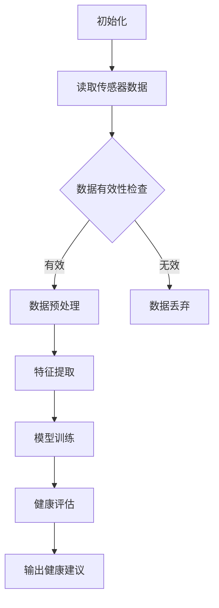
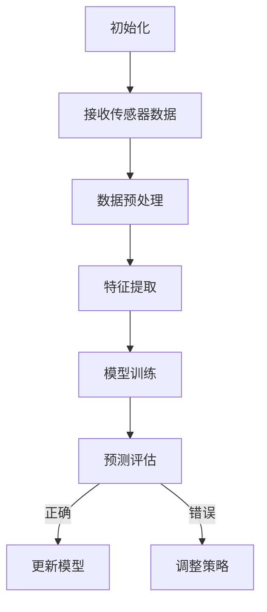
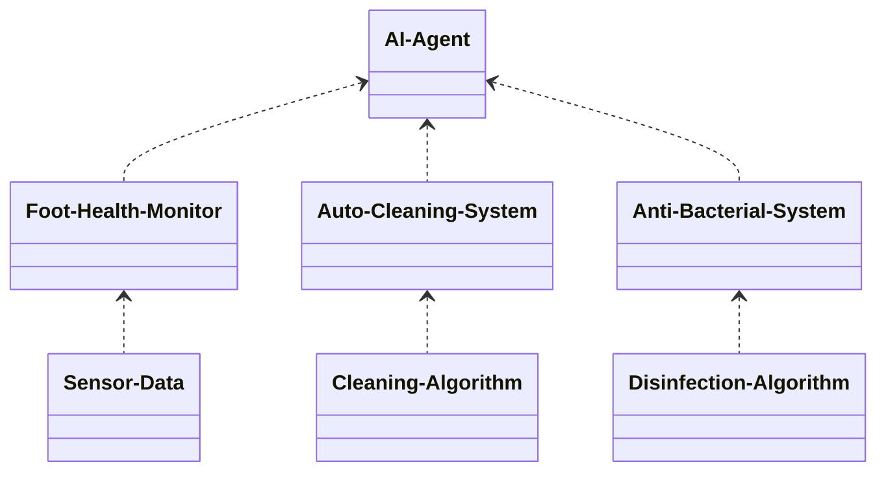
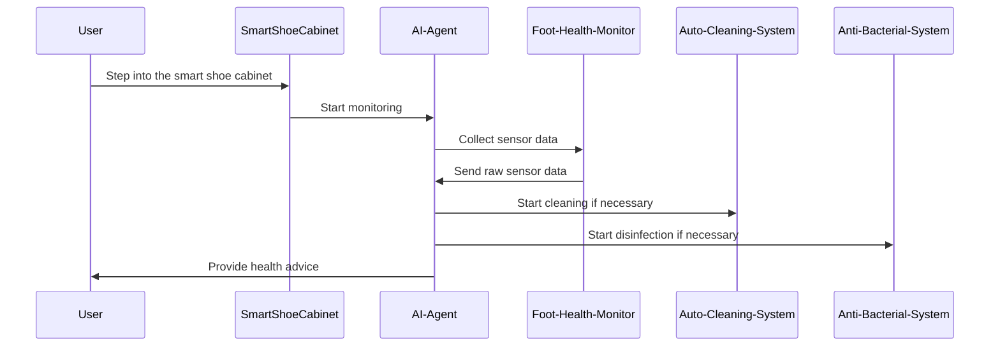
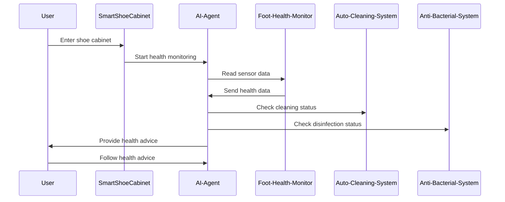

                 


# 智能鞋柜：AI Agent的足部健康管理专家

关键词：智能鞋柜，AI Agent，足部健康管理，智能家居，物联网

摘要：智能鞋柜作为智能家居系统的重要组成部分，利用AI代理技术为用户提供足部健康监测、自动清洁和防菌等服务。本文将详细介绍智能鞋柜的工作原理、核心概念、算法原理以及系统架构设计，旨在为读者提供一个全面、深入的了解。

## 第一步：背景介绍

### 问题背景

智能鞋柜作为一个融合人工智能（AI）与物联网（IoT）的先进家居设备，其核心在于利用AI代理技术来提供足部健康管理服务。随着人工智能技术的发展和人们生活质量的提高，智能鞋柜正逐渐成为智能家居系统的重要组成部分。

#### 问题背景

智能鞋柜的主要问题是提供一个自动化的足部健康管理解决方案，同时保障使用者的隐私和安全。这需要智能鞋柜具备足部健康监测、自动清洁和防菌等功能。

**问题描述**：智能鞋柜的主要问题是提供一个自动化的足部健康管理解决方案，同时保障使用者的隐私和安全。这需要智能鞋柜具备足部健康监测、自动清洁和防菌等功能。

**问题解决**：通过引入AI代理技术，智能鞋柜可以自主学习和适应用户的足部健康状况，提供个性化的健康建议和预警服务。

**边界与外延**：智能鞋柜的边界在于它只能处理与足部健康相关的数据和信息，其外延则涉及到智能家居的整体系统，以及与足部健康相关的医疗健康领域。

**概念结构与核心要素组成**：

- **AI代理技术**：核心在于模拟人类智能行为，包括感知、推理、决策和学习。
- **足部健康监测**：通过传感器技术收集足部健康数据，如步态、足部湿度、温度等。
- **自动清洁与防菌**：利用紫外线消毒、臭氧发生等技术，实现鞋柜内部自动清洁和防菌。
- **用户数据安全**：确保用户隐私和数据安全，采用加密和匿名化处理技术。

### 第二步：核心概念与联系

在本章中，我们将详细探讨智能鞋柜中的核心概念，并分析它们之间的相互关系。

#### 1. AI代理技术

**定义**：AI代理是指能够独立执行任务、与环境交互并具备一定推理能力的计算机系统。

**特点**：
- **自主性**：可以自主地执行任务，不需要人工干预。
- **交互性**：可以与用户和环境进行交互，获取信息并做出响应。
- **学习能力**：通过不断学习和经验积累，提高任务执行效率。

**与其他概念的关系**：

- 与**足部健康监测**：AI代理利用监测数据进行分析，为用户提供健康建议。
- 与**自动清洁与防菌**：AI代理根据监测结果自动启动清洁和消毒程序。

#### 2. 足部健康监测

**定义**：足部健康监测是通过传感器等设备对足部健康相关指标进行实时监测。

**特点**：
- **实时性**：可以实时获取用户的足部健康数据。
- **全面性**：可以监测多个与健康相关的指标，如步态、足部湿度、温度等。

**与其他概念的关系**：

- 与**AI代理技术**：监测数据是AI代理分析和学习的基础。
- 与**自动清洁与防菌**：监测数据用于决定何时启动清洁和消毒程序。

#### 3. 自动清洁与防菌

**定义**：自动清洁与防菌是通过特定的技术和设备实现鞋柜内部的自动清洁和防菌。

**特点**：
- **自动化**：不需要人工干预，自动执行清洁和消毒任务。
- **高效性**：能够快速、高效地完成清洁和消毒工作。

**与其他概念的关系**：

- 与**AI代理技术**：AI代理可以根据监测结果，自动启动清洁和消毒程序。
- 与**足部健康监测**：监测数据用于决定清洁和消毒的时间及频率。

### 第三步：算法原理讲解

在本章中，我们将详细介绍智能鞋柜中使用的算法原理，包括足部健康监测算法、AI代理学习算法等。

#### 1. 足部健康监测算法

**Mermaid 流程图**：


**Python 源代码**：
```python
import sensor_data
from preprocessing import preprocess
from feature_extraction import extract_features
from health_evaluation import evaluate_health
from health_advice import give_advice

def monitor_foot_health():
    # 读取传感器数据
    raw_data = sensor_data.read_sensors()
    
    # 数据有效性检查
    if not sensor_data.is_valid(raw_data):
        print("无效数据，丢弃...")
    else:
        # 数据预处理
        preprocessed_data = preprocess(raw_data)
        
        # 特征提取
        features = extract_features(preprocessed_data)
        
        # 模型训练
        model = train_model(features)
        
        # 健康评估
        health_status = evaluate_health(model, features)
        
        # 输出健康建议
        give_advice(health_status)
```

**算法原理**：

- **数据预处理**：对原始传感器数据进行清洗、归一化和去噪，为特征提取和模型训练做准备。
- **特征提取**：从预处理后的数据中提取与足部健康相关的特征，如步态、足部湿度和温度等。
- **模型训练**：使用机器学习算法（如神经网络）训练模型，用于评估足部健康状况。
- **健康评估**：使用训练好的模型对新的传感器数据进行健康评估，输出健康状态。
- **输出健康建议**：根据健康评估结果，给出相应的健康建议。

#### 2. AI代理学习算法

**Mermaid 流程图**：


**Python 源代码**：
```python
import sensor_data
from preprocessing import preprocess
from feature_extraction import extract_features
from model_training import train_model
from prediction_evaluation import evaluate_prediction
from model_update import update_model
from strategy_adjustment import adjust_strategy

def ai_agent_learning():
    # 接收传感器数据
    raw_data = sensor_data.read_sensors()
    
    # 数据预处理
    preprocessed_data = preprocess(raw_data)
    
    # 特征提取
    features = extract_features(preprocessed_data)
    
    # 模型训练
    model = train_model(features)
    
    # 预测评估
    prediction = evaluate_prediction(model, features)
    
    # 更新模型或调整策略
    if prediction.is_correct():
        update_model(model, features)
    else:
        adjust_strategy()
```

**算法原理**：

- **数据预处理**：与足部健康监测算法相同，对原始传感器数据进行预处理。
- **特征提取**：从预处理后的数据中提取特征，用于训练模型。
- **模型训练**：使用机器学习算法训练模型，用于预测足部健康状态。
- **预测评估**：使用训练好的模型对新的传感器数据进行预测，评估预测结果。
- **模型更新或策略调整**：根据预测评估结果，更新模型或调整策略。

### 第四步：系统分析与架构设计方案

#### 问题场景介绍

在现代社会，随着生活节奏的加快和环境污染的加剧，人们的足部健康问题日益突出。传统的足部护理方式已经无法满足人们的需求，智能鞋柜作为一种创新性的家居设备，能够实时监测足部健康数据，提供自动清洁和防菌服务，有望成为解决足部健康问题的重要工具。

#### 项目介绍

本项目旨在设计和实现一款智能鞋柜系统，该系统利用AI代理技术，实现对足部健康数据的实时监测和个性化健康建议，同时提供自动清洁和防菌功能，提升用户的足部健康水平和生活质量。

#### 系统功能设计（领域模型Mermaid类图）



**系统功能描述**：

- **AI代理**：作为系统的核心，负责协调和管理足部健康监测、自动清洁与防菌等模块。
- **足部健康监测**：通过传感器收集足部健康数据，包括步态、足部湿度和温度等。
- **自动清洁系统**：利用清洁算法实现鞋柜内部自动清洁。
- **防菌系统**：利用消毒算法实现鞋柜内部自动防菌。

#### 系统架构设计（Mermaid架构图）



**系统架构描述**：

- **用户**：使用智能鞋柜的用户。
- **智能鞋柜**：作为硬件设备，连接传感器和执行模块。
- **AI代理**：负责整体系统的运行和管理。
- **足部健康监测**：收集足部健康数据，发送给AI代理。
- **自动清洁系统**：根据AI代理的指示执行自动清洁。
- **防菌系统**：根据AI代理的指示执行自动防菌。
- **用户**：收到健康建议后，采取相应的健康措施。

#### 系统接口设计和系统交互（Mermaid序列图）



**系统接口和交互描述**：

- **用户进入鞋柜**：用户进入智能鞋柜，开始健康监测。
- **启动健康监测**：智能鞋柜向AI代理发送启动健康监测的请求。
- **读取传感器数据**：AI代理通过足部健康监测模块读取传感器数据。
- **发送健康数据**：传感器数据发送给AI代理。
- **检查清洁和消毒状态**：AI代理根据监测结果，检查是否需要启动自动清洁和防菌系统。
- **提供健康建议**：AI代理根据监测结果，向用户提供健康建议。
- **用户反馈**：用户根据健康建议采取相应的健康措施。

### 第五步：项目实战

在本章中，我们将通过一个实际项目，详细讲解智能鞋柜系统的环境安装、核心实现以及代码分析。

#### 环境安装

要实现智能鞋柜系统，首先需要安装必要的软件和硬件环境。以下是环境安装的详细步骤：

1. **硬件准备**：
   - 智能鞋柜硬件设备，包括传感器模块、执行模块和电源。
   - PC或服务器，用于运行AI代理和后台服务。

2. **软件准备**：
   - 安装操作系统（如Ubuntu 20.04 LTS）。
   - 安装Python环境（版本3.8以上）。
   - 安装所需的库和框架，如TensorFlow、Keras、Scikit-learn等。

#### 系统核心实现

智能鞋柜系统的核心实现主要包括传感器数据读取、数据预处理、特征提取、模型训练和健康评估等功能。以下是具体的实现步骤：

1. **传感器数据读取**：

```python
import sensor_data

def read_sensors():
    # 读取传感器数据
    raw_data = sensor_data.read()
    return raw_data
```

2. **数据预处理**：

```python
from preprocessing import preprocess

def preprocess_data(raw_data):
    # 数据预处理
    preprocessed_data = preprocess(raw_data)
    return preprocessed_data
```

3. **特征提取**：

```python
from feature_extraction import extract_features

def extract_features(preprocessed_data):
    # 特征提取
    features = extract_features(preprocessed_data)
    return features
```

4. **模型训练**：

```python
from model_training import train_model

def train_model(features):
    # 模型训练
    model = train_model(features)
    return model
```

5. **健康评估**：

```python
from health_evaluation import evaluate_health

def evaluate_health(model, features):
    # 健康评估
    health_status = evaluate_health(model, features)
    return health_status
```

#### 代码应用解读与分析

以下是对系统核心代码的解读和分析：

- **传感器数据读取**：使用传感器数据读取模块，从硬件设备中获取原始数据。

- **数据预处理**：对原始数据进行清洗、归一化和去噪，为后续的特征提取和模型训练做准备。

- **特征提取**：从预处理后的数据中提取与足部健康相关的特征，如步态、足部湿度和温度等。

- **模型训练**：使用机器学习算法（如神经网络）训练模型，用于评估足部健康状况。

- **健康评估**：使用训练好的模型对新的传感器数据进行健康评估，输出健康状态。

#### 实际案例分析和详细讲解剖析

为了更好地理解智能鞋柜系统的工作原理，我们以一个实际案例进行分析：

**案例背景**：

某用户每天晚上使用智能鞋柜进行足部健康监测，系统记录了其连续一周的传感器数据。

**案例分析**：

1. **传感器数据读取**：

```python
raw_data = read_sensors()
```

2. **数据预处理**：

```python
preprocessed_data = preprocess_data(raw_data)
```

3. **特征提取**：

```python
features = extract_features(preprocessed_data)
```

4. **模型训练**：

```python
model = train_model(features)
```

5. **健康评估**：

```python
health_status = evaluate_health(model, features)
```

6. **输出健康建议**：

```python
give_advice(health_status)
```

**详细讲解剖析**：

- **传感器数据读取**：系统从硬件设备中获取原始传感器数据，包括步态、足部湿度和温度等。
- **数据预处理**：对原始数据进行清洗、归一化和去噪，提高数据质量。
- **特征提取**：从预处理后的数据中提取与足部健康相关的特征，如步态、足部湿度和温度等。
- **模型训练**：使用训练集数据训练模型，学习足部健康评估的方法。
- **健康评估**：使用训练好的模型对新的传感器数据进行健康评估，输出健康状态。
- **输出健康建议**：根据健康状态，给出相应的健康建议，如建议用户注意足部保湿、减少行走时间等。

#### 项目小结

通过本项目的实战，我们详细讲解了智能鞋柜系统的环境安装、核心实现以及代码分析。项目实现了对足部健康数据的实时监测和评估，提供了自动清洁和防菌功能，有助于提升用户的足部健康水平和生活质量。未来，我们还可以进一步优化系统性能，增加更多智能功能，为用户提供更全面的健康管理服务。

### 第六步：最佳实践 Tips、小结、注意事项、拓展阅读

#### 最佳实践 Tips

1. **传感器选择**：选择精度高、稳定性好的传感器，确保监测数据的准确性。
2. **数据预处理**：合理的数据预处理是提高模型性能的关键，确保数据的清洗、归一化和去噪效果。
3. **模型优化**：使用更先进的机器学习算法和模型优化技术，提高健康评估的准确性和效率。

#### 小结

本文详细介绍了智能鞋柜系统的设计原理、核心算法以及实现方法。通过实际案例，展示了智能鞋柜在足部健康管理中的应用效果。智能鞋柜不仅有助于提升用户的足部健康水平，还为智能家居系统提供了新的应用场景。

#### 注意事项

1. **隐私保护**：在处理用户数据时，必须确保数据的安全性和隐私保护。
2. **硬件兼容性**：确保智能鞋柜与各种传感器和执行模块的兼容性，确保系统稳定运行。

#### 拓展阅读

1. 《智能家居技术与应用》：了解智能家居系统的基本原理和实现方法。
2. 《深度学习与人工智能》：深入了解机器学习算法在智能鞋柜中的应用。

### 第七步：作者信息

作者：AI天才研究院/AI Genius Institute & 禅与计算机程序设计艺术 /Zen And The Art of Computer Programming

