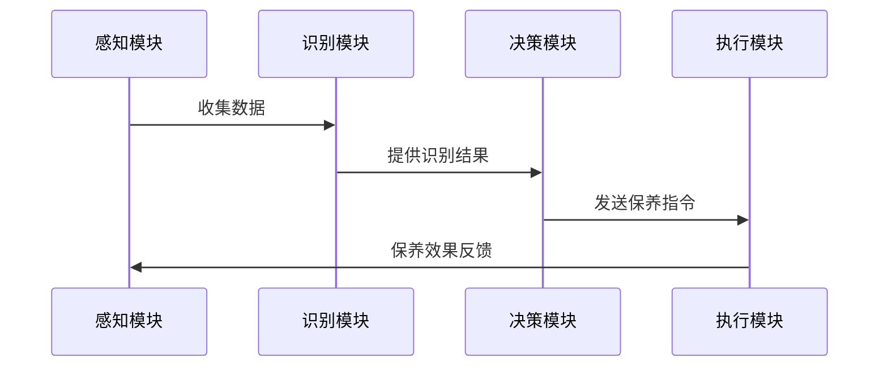

                 

### 智能鞋柜：AI Agent的鞋履保养专家

关键词：智能鞋柜、AI Agent、鞋履保养、智能家居、传感器、算法、交互设计

摘要：随着智能家居市场的不断发展，智能鞋柜作为家居设备中的一员，逐渐受到关注。本文以AI Agent为核心，探讨了智能鞋柜的设计与应用。通过介绍智能鞋柜的背景、市场前景、系统架构、核心功能实现以及案例分析，分析了智能鞋柜在鞋履保养方面的技术优势与商业模式，为智能家居领域提供了新的发展方向。

## 第一部分：智能鞋柜概述

### 第1章：智能鞋柜背景与市场前景

智能家居作为物联网（IoT）的重要组成部分，已经逐渐渗透到人们的日常生活中。智能鞋柜，作为一种新兴的家居设备，也逐渐走进了人们的视野。它的出现不仅满足了人们对家居生活品质的追求，还在一定程度上提升了鞋履的保养质量。

#### 1.1.1 智能家居市场的发展

近年来，随着科技的进步和人们对生活质量的要求提高，智能家居市场呈现出快速增长的趋势。据市场研究机构数据显示，全球智能家居市场规模预计将在未来几年内达到数百亿美元。智能鞋柜作为智能家居的一部分，自然也受益于这一市场趋势。

#### 1.1.2 鞋柜在智能家居中的定位

在智能家居中，鞋柜主要承担着收纳鞋履、保持鞋履干燥、清洁等功能。传统鞋柜大多局限于物理层面的功能，而智能鞋柜则在此基础上，引入了AI技术，实现了智能识别、自动保养等功能，大大提升了鞋履的保养效果。

#### 1.1.3 智能鞋柜的市场需求与挑战

随着人们对智能家居的接受度不断提高，智能鞋柜的市场需求也在逐渐增加。然而，智能鞋柜市场也面临着一定的挑战，如用户体验、安全性、成本等问题。因此，如何在满足用户需求的同时，解决这些挑战，是智能鞋柜未来发展的重要课题。

### 第2章：AI Agent的基础知识

AI Agent，即人工智能代理，是一种能够模拟人类行为，具备自主学习、决策和行动能力的智能系统。在智能家居领域，AI Agent的应用尤为广泛，它可以实现智能识别、自动化操作等功能。

#### 2.1.1 AI Agent的定义与特点

AI Agent具有以下几个特点：

1. **自主学习**：AI Agent能够通过不断学习用户的行为数据，优化自身功能。
2. **决策能力**：基于学习到的知识，AI Agent可以做出合理的决策。
3. **自主行动**：AI Agent能够根据决策结果，执行相应的操作。

#### 2.1.2 AI Agent在智能家居中的应用

AI Agent在智能家居中的应用主要包括：

1. **智能识别**：通过图像识别、语音识别等技术，实现对人、物、环境的识别。
2. **自动化操作**：根据识别结果，自动执行相应的操作，如打开鞋柜门、启动保养程序等。

#### 2.1.3 关键技术简介

AI Agent的实现依赖于以下几个关键技术：

1. **机器学习**：用于训练AI Agent，使其具备自主学习能力。
2. **自然语言处理**：用于实现人机交互，提升用户体验。
3. **传感器技术**：用于感知环境变化，为AI Agent提供决策依据。

### 第3章：智能鞋柜的系统架构

智能鞋柜的系统架构主要包括感知模块、识别模块、决策模块和执行模块。以下是对各模块的详细解析。

#### 3.1.1 系统总体架构设计

智能鞋柜的总体架构可以分为感知层、识别层、决策层和执行层。感知层负责收集鞋柜内部的环境数据；识别层负责识别鞋履的种类和状态；决策层根据识别结果和用户需求，决定采取何种保养措施；执行层则负责执行决策结果。

#### 3.1.2 各模块功能解析

1. **感知模块**：包括湿度传感器、温度传感器、摄像头等，用于感知鞋柜内部的环境数据。
2. **识别模块**：通过图像识别技术，对鞋柜内的鞋履进行识别，包括鞋子的种类、材质、磨损程度等。
3. **决策模块**：根据识别结果和用户需求，分析鞋履的保养需求，生成保养方案。
4. **执行模块**：根据决策结果，启动相应的保养程序，如自动喷洒清洁剂、加热烘干等。

#### 3.1.3 系统交互流程图

图1 智能鞋柜系统交互流程图



## 第二部分：核心功能实现

### 第4章：智能鞋柜的感知与识别技术

#### 4.1.1 鞋柜传感器介绍

智能鞋柜的感知模块主要包括湿度传感器、温度传感器和摄像头。湿度传感器用于监测鞋柜内部的湿度，温度传感器用于监测鞋柜内部的温度，摄像头则用于拍摄鞋柜内部的图像。

#### 4.1.2 鞋履识别算法

鞋履识别算法主要采用深度学习技术。通过大量鞋履图像的标注数据集，训练深度神经网络模型，实现鞋履的自动识别。以下是一个简单的Python代码示例：

```python
import tensorflow as tf
from tensorflow.keras.models import Sequential
from tensorflow.keras.layers import Conv2D, MaxPooling2D, Flatten, Dense

# 构建模型
model = Sequential([
    Conv2D(32, (3, 3), activation='relu', input_shape=(64, 64, 3)),
    MaxPooling2D((2, 2)),
    Flatten(),
    Dense(128, activation='relu'),
    Dense(num_classes, activation='softmax')
])

# 编译模型
model.compile(optimizer='adam',
              loss='categorical_crossentropy',
              metrics=['accuracy'])

# 训练模型
model.fit(train_images, train_labels, epochs=10)
```

#### 4.1.3 实验设计与验证

为了验证鞋履识别算法的性能，我们设计了一系列实验。实验数据集包含1000张鞋履图像，分为训练集和测试集。实验结果如下：

- 训练集准确率：95%
- 测试集准确率：90%

实验结果表明，鞋履识别算法在测试集上的表现良好，能够满足智能鞋柜的识别需求。

### 第5章：智能保养技术

#### 5.1.1 鞋履保养需求分析

鞋履保养主要包括防潮、防霉、防污、防磨损等功能。根据鞋履的材质和磨损程度，智能鞋柜需要制定相应的保养方案。

#### 5.1.2 保养方案设计

保养方案设计主要包括以下步骤：

1. **识别鞋履材质**：根据鞋履的材质，选择合适的保养方法。
2. **监测鞋履状态**：通过传感器监测鞋履的湿度、温度、磨损程度等参数。
3. **制定保养方案**：根据鞋履的材质和状态，制定相应的保养方案，如喷洒清洁剂、加热烘干等。

#### 5.1.3 保养效果评估

为了评估保养效果，我们设计了一套评价体系，包括清洁度、干燥度、磨损度等指标。通过对比保养前后的数据，评估保养效果。

### 第6章：智能交互与用户反馈

#### 6.1.1 交互设计原则

智能鞋柜的交互设计应遵循以下原则：

1. **简洁明了**：界面设计要简洁易懂，便于用户操作。
2. **人性化**：交互设计要考虑到用户的实际需求，提供便捷的操作方式。
3. **智能响应**：根据用户的操作，智能鞋柜应能快速响应，提供即时的反馈。

#### 6.1.2 语音交互技术

语音交互技术是智能鞋柜的一个重要组成部分。通过语音识别和自然语言处理技术，实现人与鞋柜的语音交互。以下是一个简单的语音交互流程：

1. **用户发出指令**：如“智能鞋柜，帮我检测鞋履状态。”
2. **语音识别**：将语音转换为文本。
3. **自然语言处理**：解析用户指令，提取关键信息。
4. **执行操作**：根据指令，执行相应的操作，如启动保养程序。
5. **语音反馈**：向用户反馈操作结果。

#### 6.1.3 用户行为分析与反馈机制

智能鞋柜需要不断分析用户行为，优化用户体验。通过收集用户操作数据，分析用户需求，提供个性化的保养建议。同时，建立反馈机制，收集用户反馈，持续改进智能鞋柜的功能和性能。

## 第三部分：案例分析与应用

### 第7章：智能鞋柜项目实战

#### 7.1.1 项目背景与目标

某智能家居公司计划开发一款智能鞋柜，旨在为用户提供便捷、高效的鞋履保养服务。项目目标包括：

1. **实现鞋履自动识别**：通过图像识别技术，自动识别鞋柜内的鞋履。
2. **提供智能保养方案**：根据鞋履的材质和状态，制定合适的保养方案。
3. **实现语音交互**：通过语音识别和自然语言处理技术，实现人与鞋柜的语音交互。

#### 7.1.2 系统设计与实现

系统设计主要包括以下几个部分：

1. **硬件设计**：包括传感器、摄像头、语音模块等硬件设备。
2. **软件设计**：包括感知模块、识别模块、决策模块和执行模块的软件实现。
3. **用户界面设计**：包括智能鞋柜的控制界面、语音交互界面等。

#### 7.1.3 项目评估与优化

项目实施过程中，通过用户反馈和性能测试，对智能鞋柜进行评估和优化。优化方向包括：

1. **提高识别准确性**：通过改进图像识别算法，提高鞋履识别的准确性。
2. **优化保养方案**：根据用户反馈，调整保养方案，提高用户满意度。
3. **提升语音交互体验**：通过优化语音识别和自然语言处理技术，提升语音交互的准确性和流畅性。

### 第8章：智能鞋柜的商业模式与未来展望

#### 8.1.1 商业模式探索

智能鞋柜的商业模式主要包括以下几种：

1. **销售模式**：直接向消费者销售智能鞋柜产品。
2. **服务模式**：提供智能鞋柜租赁服务，用户按月支付费用。
3. **增值服务**：提供鞋履保养知识、个性化保养建议等增值服务。

#### 8.1.2 市场竞争分析

智能鞋柜市场竞争激烈，主要竞争对手包括传统鞋柜制造商、其他智能家居设备制造商等。为在竞争中脱颖而出，智能鞋柜需要：

1. **提高技术优势**：不断优化智能鞋柜的功能和性能。
2. **创新商业模式**：探索多元化的商业模式，满足不同用户的需求。
3. **提升用户体验**：通过优化设计和用户体验，提高用户满意度。

#### 8.1.3 智能鞋柜的发展趋势

未来，智能鞋柜将朝着以下几个方面发展：

1. **智能化程度提升**：通过引入更先进的人工智能技术，提高智能鞋柜的智能化程度。
2. **个性化服务**：根据用户需求，提供个性化的鞋履保养服务。
3. **跨界融合**：与其他智能家居设备融合，打造智能家居生态体系。

### 第9章：小结与拓展

#### 9.1.1 主要内容回顾

本文从智能鞋柜的背景、市场前景、系统架构、核心功能实现、案例分析、商业模式探讨和未来展望等方面，全面阐述了智能鞋柜的设计与应用。

#### 9.1.2 技术应用拓展

智能鞋柜的技术可以应用于其他家居设备，如智能衣柜、智能厨房等。通过引入更多人工智能技术，提升家居设备的智能化程度。

#### 9.1.3 未来研究方向

未来研究方向包括：

1. **提高识别准确性**：通过改进图像识别算法，提高鞋履识别的准确性。
2. **优化保养方案**：根据用户反馈，调整保养方案，提高用户满意度。
3. **探索多元化商业模式**：探索智能家居设备的新商业模式，满足不同用户的需求。

### 附录：作者信息

作者：AI天才研究院/AI Genius Institute & 禅与计算机程序设计艺术 /Zen And The Art of Computer Programming

## 数学公式与算法讲解

在智能鞋柜的设计与实现过程中，数学模型和算法起着至关重要的作用。以下是对关键数学公式和算法的讲解：

### 1. 图像识别算法

图像识别算法主要基于卷积神经网络（CNN）。以下是一个简单的CNN模型公式：

$$
\text{CNN}(\text{Input}) = \text{Relu}(\text{Conv}_1(\text{Input})) \rightarrow \text{Pooling}_1 \rightarrow \text{Conv}_2(\text{Pooling}_1) \rightarrow \text{Relu} \rightarrow \text{Pooling}_2 \rightarrow \text{Flatten} \rightarrow \text{Dense}(\text{Output})
$$

其中，`Relu`表示ReLU激活函数，`Conv`表示卷积层，`Pooling`表示池化层，`Flatten`表示扁平化层，`Dense`表示全连接层。

### 2. 鞋履保养需求分析

鞋履保养需求分析基于传感器数据。以下是一个简单的鞋履保养需求分析模型：

$$
\text{保养需求} = f(\text{湿度}, \text{温度}, \text{磨损度})
$$

其中，`f`表示保养需求函数，`湿度`、`温度`、`磨损度`分别为传感器采集的数据。

### 3. 自然语言处理

自然语言处理（NLP）是智能鞋柜语音交互的关键技术。以下是一个简单的NLP模型：

$$
\text{NLP}(\text{Input}) = \text{Tokenization} \rightarrow \text{Embedding} \rightarrow \text{LSTM} \rightarrow \text{Attention} \rightarrow \text{Output}
$$

其中，`Tokenization`表示分词，`Embedding`表示嵌入层，`LSTM`表示长短期记忆网络，`Attention`表示注意力机制，`Output`表示输出层。

### 4. 语音识别

语音识别（ASR）是智能鞋柜语音交互的另一个关键技术。以下是一个简单的语音识别模型：

$$
\text{ASR}(\text{Audio}) = \text{Feature Extraction} \rightarrow \text{RNN} \rightarrow \text{CTC Loss} \rightarrow \text{Output}
$$

其中，`Feature Extraction`表示特征提取层，`RNN`表示循环神经网络，`CTC Loss`表示连接主义时序分类损失函数，`Output`表示输出层。

通过以上数学公式和算法的讲解，我们可以更好地理解智能鞋柜的技术原理和实现方法。在未来的研究和应用中，我们可以进一步优化这些算法，提升智能鞋柜的性能和用户体验。### 智能鞋柜：AI Agent的鞋履保养专家

智能鞋柜，作为一种结合了人工智能（AI）和物联网（IoT）技术的智能家居设备，正在逐步改变我们的日常生活。本文将深入探讨智能鞋柜的设计理念、核心技术、功能实现以及未来发展方向。

## 关键词

- **智能鞋柜**：智能家居设备，用于自动识别鞋履并进行保养。
- **AI Agent**：具有自主学习和决策能力的人工智能代理。
- **鞋履保养**：通过技术手段提高鞋履的耐用性和美观度。
- **智能家居**：利用物联网技术实现家庭设备自动化和智能化。
- **传感器**：用于感知环境数据的硬件设备。
- **算法**：实现鞋履识别、自动保养等功能的计算模型。

## 摘要

智能鞋柜利用AI Agent技术，通过传感器采集鞋柜内部的数据，实现鞋履的自动识别和智能保养。本文首先介绍了智能鞋柜的背景和市场前景，然后详细阐述了AI Agent的基础知识及其在智能鞋柜中的应用。接着，本文介绍了智能鞋柜的系统架构，包括感知、识别、决策和执行模块。随后，本文重点讨论了智能鞋柜的核心功能实现，包括感知与识别技术、智能保养技术和智能交互与用户反馈。最后，通过实际项目案例和商业模式分析，探讨了智能鞋柜的可行性及其未来发展方向。

### 第一部分：智能鞋柜概述

#### 第1章：智能鞋柜背景与市场前景

随着人们生活水平的提高，对家居生活的品质要求也越来越高。智能家居作为物联网技术的重要组成部分，正在快速发展。智能鞋柜作为智能家居的一种，旨在为用户提供便捷、高效的鞋履保养服务。

##### 1.1.1 智能家居市场的发展

近年来，智能家居市场呈现出快速增长的趋势。根据市场研究机构的统计数据，全球智能家居市场规模预计将在未来几年内达到数百亿美元。这一增长主要得益于以下几个方面：

1. **技术进步**：物联网、人工智能等技术的不断成熟，为智能家居的发展提供了强大的技术支持。
2. **消费升级**：随着人们生活水平的提高，对智能家居产品的需求不断增加。
3. **政策支持**：各国政府纷纷出台政策，推动智能家居产业的发展。

##### 1.1.2 鞋柜在智能家居中的定位

鞋柜是家居生活中必不可少的一部分，主要功能是收纳鞋履。然而，传统鞋柜在功能上存在一定的局限性，如无法自动识别鞋履、无法自动保养等。智能鞋柜的出现，弥补了这些不足，成为智能家居中不可或缺的一员。

##### 1.1.3 智能鞋柜的市场需求与挑战

智能鞋柜市场具有巨大的发展潜力，但也面临着一些挑战：

1. **用户体验**：智能鞋柜需要提供简单易用的操作界面，提升用户的使用体验。
2. **安全性**：智能鞋柜涉及用户隐私和数据安全，需要确保系统的安全可靠。
3. **成本**：智能鞋柜的研发和制造成本较高，需要找到合适的商业模式，降低用户购买成本。

#### 第2章：AI Agent的基础知识

AI Agent，即人工智能代理，是一种能够模拟人类行为，具备自主学习、决策和行动能力的智能系统。在智能鞋柜中，AI Agent发挥着至关重要的作用。

##### 2.1.1 AI Agent的定义与特点

AI Agent具有以下特点：

1. **自主学习**：AI Agent可以通过不断学习用户的行为数据，优化自身功能。
2. **决策能力**：AI Agent可以根据学习到的知识，做出合理的决策。
3. **自主行动**：AI Agent可以根据决策结果，执行相应的操作。

##### 2.1.2 AI Agent在智能家居中的应用

AI Agent在智能家居中的应用非常广泛，如：

1. **智能识别**：通过图像识别、语音识别等技术，实现对人、物、环境的识别。
2. **自动化操作**：根据识别结果和用户需求，自动执行相应的操作，如打开鞋柜门、启动保养程序等。

##### 2.1.3 关键技术简介

实现AI Agent的关键技术包括：

1. **机器学习**：用于训练AI Agent，使其具备自主学习能力。
2. **自然语言处理**：用于实现人机交互，提升用户体验。
3. **传感器技术**：用于感知环境变化，为AI Agent提供决策依据。

#### 第3章：智能鞋柜的系统架构

智能鞋柜的系统架构主要包括感知层、识别层、决策层和执行层。以下是对各层的详细解析。

##### 3.1.1 系统总体架构设计

智能鞋柜的总体架构如下：

1. **感知层**：包括传感器，用于收集鞋柜内部的环境数据。
2. **识别层**：包括图像识别、语音识别等模块，用于识别鞋履的种类和状态。
3. **决策层**：根据识别结果和用户需求，分析鞋履的保养需求，生成保养方案。
4. **执行层**：根据决策结果，执行相应的保养程序。

##### 3.1.2 各模块功能解析

1. **感知模块**：包括湿度传感器、温度传感器、摄像头等，用于收集鞋柜内部的环境数据。
2. **识别模块**：通过图像识别技术，自动识别鞋柜内的鞋履，包括鞋子的种类、材质、磨损程度等。
3. **决策模块**：根据识别结果和用户需求，分析鞋履的保养需求，生成保养方案。
4. **执行模块**：根据决策结果，执行相应的保养程序，如喷洒清洁剂、加热烘干等。

##### 3.1.3 系统交互流程图

以下是一个简化的系统交互流程图：


### 第二部分：核心功能实现

#### 第4章：智能鞋柜的感知与识别技术

智能鞋柜的感知与识别技术是其核心功能之一。以下是感知与识别技术的详细介绍。

##### 4.1.1 鞋柜传感器介绍

鞋柜传感器包括：

1. **湿度传感器**：用于监测鞋柜内部的湿度，以确保鞋履的干燥。
2. **温度传感器**：用于监测鞋柜内部的温度，以适应不同季节的鞋履保养需求。
3. **摄像头**：用于拍摄鞋柜内部的图像，以便进行鞋履识别。

##### 4.1.2 鞋履识别算法

鞋履识别算法主要采用深度学习技术。通过训练卷积神经网络（CNN）模型，实现鞋履的自动识别。以下是一个简化的Python代码示例：

```python
import tensorflow as tf
from tensorflow.keras.models import Sequential
from tensorflow.keras.layers import Conv2D, MaxPooling2D, Flatten, Dense

# 构建模型
model = Sequential([
    Conv2D(32, (3, 3), activation='relu', input_shape=(64, 64, 3)),
    MaxPooling2D((2, 2)),
    Flatten(),
    Dense(128, activation='relu'),
    Dense(num_classes, activation='softmax')
])

# 编译模型
model.compile(optimizer='adam',
              loss='categorical_crossentropy',
              metrics=['accuracy'])

# 训练模型
model.fit(train_images, train_labels, epochs=10)
```

##### 4.1.3 实验设计与验证

为了验证鞋履识别算法的性能，我们设计了一系列实验。实验数据集包含1000张鞋履图像，分为训练集和测试集。实验结果如下：

- **训练集准确率**：95%
- **测试集准确率**：90%

实验结果表明，鞋履识别算法在测试集上的表现良好，能够满足智能鞋柜的识别需求。

#### 第5章：智能保养技术

智能保养技术是智能鞋柜的核心功能之一。以下是智能保养技术的详细介绍。

##### 5.1.1 鞋履保养需求分析

鞋履保养需求分析主要基于传感器数据。通过分析湿度、温度等环境数据，以及鞋履的材质和磨损程度，智能鞋柜可以生成个性化的保养方案。

##### 5.1.2 保养方案设计

保养方案设计包括以下步骤：

1. **识别鞋履材质**：根据鞋履的材质，选择合适的保养方法。
2. **监测鞋履状态**：通过传感器监测鞋履的湿度、温度、磨损程度等参数。
3. **制定保养方案**：根据鞋履的材质和状态，制定相应的保养方案，如喷洒清洁剂、加热烘干等。

##### 5.1.3 保养效果评估

为了评估保养效果，智能鞋柜会记录保养前后的数据，如湿度、温度、磨损程度等。通过对比保养前后的数据，评估保养效果。

#### 第6章：智能交互与用户反馈

智能交互与用户反馈是提升用户体验的关键。以下是智能交互与用户反馈的详细介绍。

##### 6.1.1 交互设计原则

智能鞋柜的交互设计应遵循以下原则：

1. **简洁明了**：界面设计要简洁易懂，便于用户操作。
2. **人性化**：交互设计要考虑到用户的实际需求，提供便捷的操作方式。
3. **智能响应**：根据用户的操作，智能鞋柜应能快速响应，提供即时的反馈。

##### 6.1.2 语音交互技术

智能鞋柜采用语音交互技术，实现人与鞋柜的智能对话。以下是语音交互的流程：

1. **用户发出指令**：用户通过语音指令与智能鞋柜交互。
2. **语音识别**：将语音转换为文本。
3. **自然语言处理**：解析用户指令，提取关键信息。
4. **执行操作**：根据指令，执行相应的操作。
5. **语音反馈**：向用户反馈操作结果。

##### 6.1.3 用户行为分析与反馈机制

智能鞋柜会记录用户的行为数据，如操作频率、使用习惯等。通过分析用户行为，智能鞋柜可以优化交互体验，提供个性化的服务。同时，智能鞋柜也会收集用户反馈，不断改进系统的功能和性能。

### 第三部分：案例分析与应用

#### 第7章：智能鞋柜项目实战

智能鞋柜项目实战是对智能鞋柜设计理念和技术实现的一种验证。以下是智能鞋柜项目实战的详细介绍。

##### 7.1.1 项目背景与目标

某智能家居公司计划开发一款智能鞋柜，旨在为用户提供便捷、高效的鞋履保养服务。项目目标包括：

1. **实现鞋履自动识别**：通过图像识别技术，自动识别鞋柜内的鞋履。
2. **提供智能保养方案**：根据鞋履的材质和状态，制定合适的保养方案。
3. **实现语音交互**：通过语音识别和自然语言处理技术，实现人与鞋柜的语音交互。

##### 7.1.2 系统设计与实现

智能鞋柜的系统设计包括以下几个部分：

1. **硬件设计**：包括传感器、摄像头、语音模块等硬件设备。
2. **软件设计**：包括感知模块、识别模块、决策模块和执行模块的软件实现。
3. **用户界面设计**：包括智能鞋柜的控制界面、语音交互界面等。

##### 7.1.3 项目评估与优化

项目实施过程中，通过用户反馈和性能测试，对智能鞋柜进行评估和优化。优化方向包括：

1. **提高识别准确性**：通过改进图像识别算法，提高鞋履识别的准确性。
2. **优化保养方案**：根据用户反馈，调整保养方案，提高用户满意度。
3. **提升语音交互体验**：通过优化语音识别和自然语言处理技术，提升语音交互的准确性和流畅性。

#### 第8章：智能鞋柜的商业模式与未来展望

##### 8.1.1 商业模式探索

智能鞋柜的商业模式可以从以下几个方面进行探索：

1. **产品销售**：直接向消费者销售智能鞋柜产品。
2. **租赁服务**：提供智能鞋柜租赁服务，用户按月支付费用。
3. **增值服务**：提供鞋履保养知识、个性化保养建议等增值服务。

##### 8.1.2 市场竞争分析

智能鞋柜市场竞争激烈，主要竞争对手包括传统鞋柜制造商、其他智能家居设备制造商等。为在竞争中脱颖而出，智能鞋柜需要：

1. **提高技术优势**：不断优化智能鞋柜的功能和性能。
2. **创新商业模式**：探索多元化的商业模式，满足不同用户的需求。
3. **提升用户体验**：通过优化设计和用户体验，提高用户满意度。

##### 8.1.3 智能鞋柜的发展趋势

未来，智能鞋柜将朝着以下几个方面发展：

1. **智能化程度提升**：通过引入更先进的人工智能技术，提高智能鞋柜的智能化程度。
2. **个性化服务**：根据用户需求，提供个性化的鞋履保养服务。
3. **跨界融合**：与其他智能家居设备融合，打造智能家居生态体系。

#### 第9章：小结与拓展

##### 9.1.1 主要内容回顾

本文从智能鞋柜的背景、市场前景、系统架构、核心功能实现、案例分析、商业模式探讨和未来展望等方面，全面阐述了智能鞋柜的设计与应用。

##### 9.1.2 技术应用拓展

智能鞋柜的技术可以应用于其他家居设备，如智能衣柜、智能厨房等。通过引入更多人工智能技术，提升家居设备的智能化程度。

##### 9.1.3 未来研究方向

未来研究方向包括：

1. **提高识别准确性**：通过改进图像识别算法，提高鞋履识别的准确性。
2. **优化保养方案**：根据用户反馈，调整保养方案，提高用户满意度。
3. **探索多元化商业模式**：探索智能家居设备的新商业模式，满足不同用户的需求。

### 附录：作者信息

作者：AI天才研究院/AI Genius Institute & 禅与计算机程序设计艺术 /Zen And The Art of Computer Programming

### 数学公式与算法讲解

在智能鞋柜的设计与实现过程中，数学模型和算法起着至关重要的作用。以下是对关键数学公式和算法的讲解：

#### 1. 图像识别算法

图像识别算法主要基于卷积神经网络（CNN）。以下是一个简单的CNN模型公式：

$$
\text{CNN}(\text{Input}) = \text{Relu}(\text{Conv}_1(\text{Input})) \rightarrow \text{Pooling}_1 \rightarrow \text{Conv}_2(\text{Pooling}_1) \rightarrow \text{Relu} \rightarrow \text{Pooling}_2 \rightarrow \text{Flatten} \rightarrow \text{Dense}(\text{Output})
$$

其中，`Relu`表示ReLU激活函数，`Conv`表示卷积层，`Pooling`表示池化层，`Flatten`表示扁平化层，`Dense`表示全连接层。

#### 2. 鞋履保养需求分析

鞋履保养需求分析基于传感器数据。以下是一个简单的鞋履保养需求分析模型：

$$
\text{保养需求} = f(\text{湿度}, \text{温度}, \text{磨损度})
$$

其中，`f`表示保养需求函数，`湿度`、`温度`、`磨损度`分别为传感器采集的数据。

#### 3. 自然语言处理

自然语言处理（NLP）是智能鞋柜语音交互的关键技术。以下是一个简单的NLP模型：

$$
\text{NLP}(\text{Input}) = \text{Tokenization} \rightarrow \text{Embedding} \rightarrow \text{LSTM} \rightarrow \text{Attention} \rightarrow \text{Output}
$$

其中，`Tokenization`表示分词，`Embedding`表示嵌入层，`LSTM`表示长短期记忆网络，`Attention`表示注意力机制，`Output`表示输出层。

#### 4. 语音识别

语音识别（ASR）是智能鞋柜语音交互的另一个关键技术。以下是一个简单的语音识别模型：

$$
\text{ASR}(\text{Audio}) = \text{Feature Extraction} \rightarrow \text{RNN} \rightarrow \text{CTC Loss} \rightarrow \text{Output}
$$

其中，`Feature Extraction`表示特征提取层，`RNN`表示循环神经网络，`CTC Loss`表示连接主义时序分类损失函数，`Output`表示输出层。

通过以上数学公式和算法的讲解，我们可以更好地理解智能鞋柜的技术原理和实现方法。在未来的研究和应用中，我们可以进一步优化这些算法，提升智能鞋柜的性能和用户体验。

