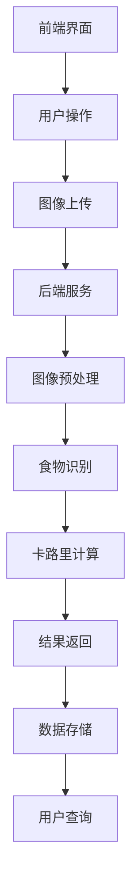
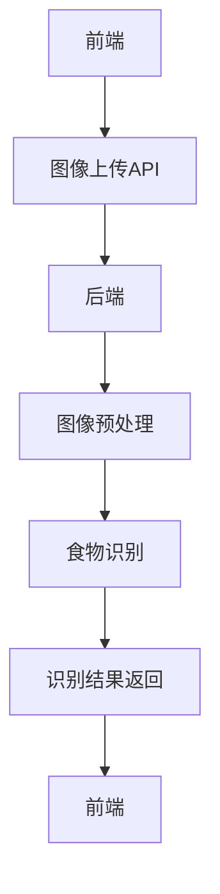
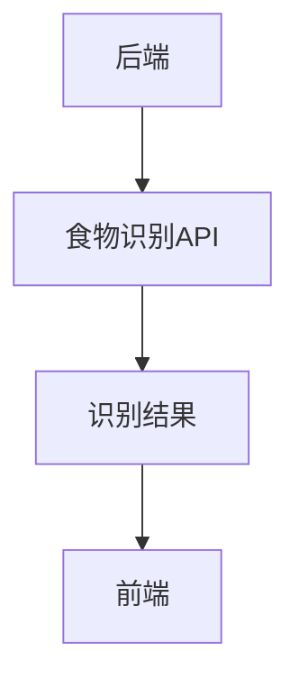
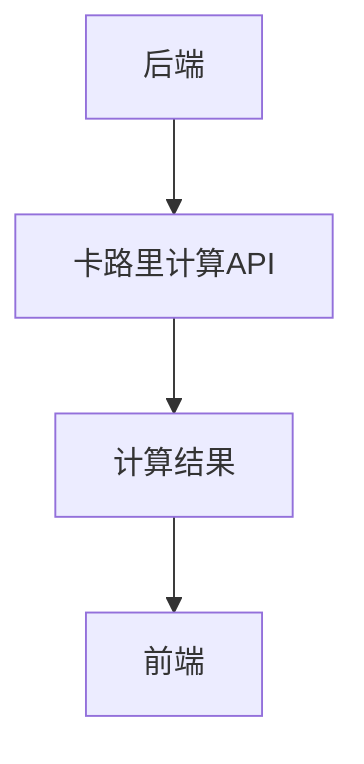
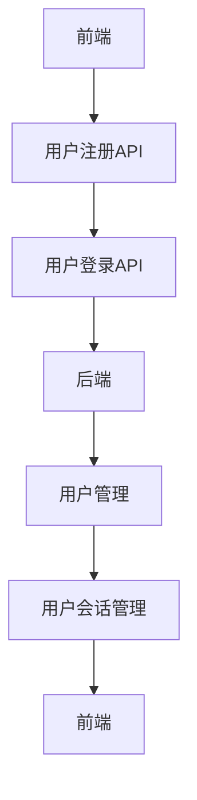

                 


### 《智能餐盘：AI Agent的食物识别与卡路里计算》

#### 关键词：
- 智能餐盘
- AI Agent
- 食物识别
- 卡路里计算
- 机器学习
- 深度学习
- 计算机视觉

#### 摘要：
本文深入探讨智能餐盘技术的核心——AI Agent在食物识别与卡路里计算中的应用。通过逐步分析，我们将详细了解相关算法原理、系统架构设计，并进行项目实战，以展示智能餐盘在现代生活中的实际应用和未来前景。

----------------------------------------------------------------

### 目录大纲设计思路

#### 书名解析

《智能餐盘：AI Agent的食物识别与卡路里计算》这一书名简洁明了，直接点明了主题。它预示了本书将围绕智能餐盘这一创新技术展开，重点探讨AI Agent在食物识别和卡路里计算两大核心领域的应用。

- **智能餐盘**：指的是一种结合了人工智能技术的智能设备，用于识别用户摄入的食物并计算其卡路里。
- **AI Agent**：人工智能代理，是执行特定任务的智能实体，能够自主学习和适应环境。
- **食物识别与卡路里计算**：是智能餐盘的核心功能，涉及到图像识别、机器学习算法、营养学知识等多个领域。

#### 目录大纲结构规划

目录大纲结构旨在引导读者从基础到深入，逐步了解智能餐盘的技术细节和应用场景。结构如下：

1. **第一部分：背景介绍**
   - **第1章 智能餐盘：现代饮食与健康的解决方案**
   - **第2章 食物识别与卡路里计算：AI技术的应用**

2. **第二部分：核心概念与联系**
   - **第3章 核心概念解析**
   - **第4章 概念属性对比与分析**

3. **第三部分：算法原理讲解**
   - **第5章 食物识别算法原理详解**
   - **第6章 卡路里计算原理详解**

4. **第四部分：系统分析与架构设计**
   - **第7章 智能餐盘系统需求分析**
   - **第8章 系统架构设计与实现**

5. **第五部分：项目实战**
   - **第9章 智能餐盘项目实施**
   - **第10章 项目总结与展望**

6. **第六部分：最佳实践 tips 与总结**
   - **第11章 最佳实践 tips**
   - **第12章 小结与拓展阅读**

#### 大纲内容细化

在每个部分中，章节内容进一步细化，确保读者能够清晰地理解每个知识点。例如，在“核心概念与联系”部分，第3章将详细解析食物识别和卡路里计算的核心概念，而第4章则通过对比分析，帮助读者理解不同概念之间的联系和区别。

### 目录大纲设计

```markdown
# 《智能餐盘：AI Agent的食物识别与卡路里计算》目录大纲

## 第一部分：背景介绍

### 第1章 智能餐盘：现代饮食与健康的解决方案
- 1.1 问题的提出
- 1.2 智能餐盘的意义
- 1.3 智能餐盘的背景和发展

### 第2章 食物识别与卡路里计算：AI技术的应用
- 2.1 机器学习与计算机视觉
- 2.2 深度学习在食物识别中的应用
- 2.3 卡路里计算的科学基础

## 第二部分：核心概念与联系

### 第3章 核心概念解析
- 3.1 食物识别的算法原理
- 3.2 卡路里计算的方法与技巧
- 3.3 AI Agent在智能餐盘中的作用

### 第4章 概念属性对比与分析
- 4.1 食物识别算法的对比
- 4.2 卡路里计算方法的对比
- 4.3 AI Agent的优势与局限

## 第三部分：算法原理讲解

### 第5章 食物识别算法原理详解
- 5.1 算法概述
- 5.2 算法流程
- 5.3 算法示例

### 第6章 卡路里计算原理详解
- 6.1 卡路里计算模型
- 6.2 公式与数学模型
- 6.3 代码实现与测试

## 第四部分：系统分析与架构设计

### 第7章 智能餐盘系统需求分析
- 7.1 系统功能设计
- 7.2 系统架构设计
- 7.3 系统接口设计

### 第8章 系统架构设计与实现
- 8.1 系统架构图
- 8.2 系统模块设计
- 8.3 系统交互流程

## 第五部分：项目实战

### 第9章 智能餐盘项目实施
- 9.1 环境安装与配置
- 9.2 系统核心代码实现
- 9.3 代码应用解读与分析
- 9.4 实际案例分析

### 第10章 项目总结与展望
- 10.1 项目成果总结
- 10.2 经验与教训
- 10.3 未来发展方向

## 第六部分：最佳实践 tips 与总结

### 第11章 最佳实践 tips
- 11.1 设计智能餐盘的建议
- 11.2 注意事项
- 11.3 技术挑战与解决方案

### 第12章 小结与拓展阅读
- 12.1 本书内容回顾
- 12.2 拓展阅读推荐
- 12.3 智能餐盘技术的未来
```

### 第一部分：背景介绍

#### 第1章 智能餐盘：现代饮食与健康的解决方案

##### 1.1 问题的提出

在现代社会，饮食问题已成为影响人们健康的重要因素。不健康的饮食习惯，如高热量、高脂肪、高糖分的食物摄入，导致了肥胖、糖尿病、心血管疾病等健康问题的增加。同时，随着生活节奏的加快，人们越来越依赖于快餐和外卖，忽视了食物的营养均衡。这些因素共同促使人们对健康饮食的需求日益增加。

智能餐盘作为一种新兴技术，旨在解决上述问题。它通过利用人工智能技术，对用户摄入的食物进行识别，并计算其卡路里，从而帮助用户更好地控制饮食，实现健康目标。

##### 1.2 智能餐盘的意义

智能餐盘的意义不仅在于提供了一种全新的饮食管理方式，更重要的是，它对现代生活方式的影响深远。首先，智能餐盘可以帮助用户了解自己的饮食习惯，发现潜在的健康风险，从而采取相应的措施。其次，智能餐盘可以帮助用户实现个性化饮食管理，根据用户的健康状况、体重目标、营养需求等因素，提供定制化的饮食建议。最后，智能餐盘还可以促进家庭饮食的改善，帮助家庭成员共同关注健康，共同实现健康目标。

##### 1.3 智能餐盘的背景和发展

智能餐盘的发展源于人工智能技术的进步和人们对健康饮食的需求。随着机器学习、计算机视觉、深度学习等技术的成熟，智能餐盘开始从理论研究走向实际应用。

早期的智能餐盘主要依赖于手动输入食物信息，这种方法不仅繁琐，而且容易出错。随着计算机视觉技术的发展，智能餐盘开始能够自动识别食物。深度学习算法的引入，使得智能餐盘在识别准确率和速度方面有了显著提升。

目前，智能餐盘已经得到了广泛应用，不仅在个人健康饮食管理领域，还在医疗、餐饮等行业展现了巨大的潜力。未来，随着技术的进一步发展，智能餐盘有望成为人们日常生活中不可或缺的一部分。

----------------------------------------------------------------

#### 第2章 食物识别与卡路里计算：AI技术的应用

##### 2.1 机器学习与计算机视觉

机器学习和计算机视觉是智能餐盘技术实现的核心。机器学习通过算法从数据中自动学习规律，提高模型的预测准确性。计算机视觉则负责对图像进行处理和分析，实现对食物的识别。

在智能餐盘中，机器学习算法通常包括监督学习、无监督学习和强化学习。监督学习算法需要大量标记数据进行训练，如使用图像识别模型进行食物识别。无监督学习算法则通过未标记的数据学习特征，如聚类分析食物类型。强化学习算法通过不断试错，优化食物识别和卡路里计算的过程。

计算机视觉技术主要包括图像处理和图像识别。图像处理技术用于对原始图像进行预处理，如去噪、增强等，以提高识别的准确性。图像识别技术则通过深度学习模型对图像进行分类和识别，如识别不同种类的食物。

##### 2.2 深度学习在食物识别中的应用

深度学习是机器学习的一个重要分支，通过多层神经网络自动提取图像特征，实现对复杂图像的识别。在智能餐盘中，深度学习算法广泛应用于食物识别。

卷积神经网络（CNN）是深度学习中的一种常见模型，特别适用于图像处理任务。CNN通过卷积层、池化层和全连接层等多个层次，自动提取图像中的特征。在食物识别中，CNN可以训练出一个模型，识别不同种类的食物。

深度学习在食物识别中的应用不仅提高了识别的准确性，还大大缩短了识别时间。传统的图像识别算法通常需要复杂的预处理和后处理步骤，而深度学习算法可以直接从原始图像中提取有用信息，简化了数据处理流程。

##### 2.3 卡路里计算的科学基础

卡路里计算是智能餐盘的另一个重要功能。卡路里（Calorie）是衡量食物能量的单位，通常以千卡（kcal）表示。食物中的能量主要来自蛋白质、脂肪和碳水化合物。

蛋白质、脂肪和碳水化合物的能量含量分别为：

- 蛋白质：每克约提供4千卡的能量
- 脂肪：每克约提供9千卡的能量
- 碳水化合物：每克约提供4千卡的能量

此外，食物中还可能含有纤维和其他非能量物质。纤维几乎不提供能量，但有助于消化和降低胆固醇。智能餐盘通过识别食物成分，计算其卡路里含量，为用户提供营养信息。

卡路里计算通常基于食物成分分析和营养数据库。通过分析食物的成分比例，可以计算出其卡路里含量。例如，如果一种食物中含有30克蛋白质、20克脂肪和50克碳水化合物，其总卡路里含量为：

\(30 \text{g} \times 4 \text{ kcal/g} + 20 \text{g} \times 9 \text{ kcal/g} + 50 \text{g} \times 4 \text{ kcal/g} = 620 \text{ kcal}\)

##### 总结

食物识别与卡路里计算是智能餐盘的核心功能。通过机器学习和计算机视觉技术，智能餐盘能够自动识别用户摄入的食物。深度学习算法提高了识别的准确率和速度。卡路里计算则基于食物成分分析，为用户提供营养信息。这些技术的结合，使得智能餐盘成为现代健康饮食管理的重要工具。

----------------------------------------------------------------

### 第二部分：核心概念与联系

#### 第3章 核心概念解析

##### 3.1 食物识别的算法原理

食物识别是智能餐盘的核心功能之一，其算法原理主要依赖于图像识别技术和机器学习算法。具体来说，食物识别的过程可以分为以下几个步骤：

1. **图像采集**：智能餐盘通过摄像头或其他图像传感器采集用户摄入的食物图像。
2. **图像预处理**：对采集到的图像进行预处理，包括去噪、增强、裁剪等操作，以提高图像质量和识别准确性。
3. **特征提取**：使用深度学习模型（如卷积神经网络）从预处理后的图像中提取特征。这些特征将用于后续的识别任务。
4. **模型训练与评估**：使用大量标记好的食物图像数据训练模型，并通过交叉验证等方法评估模型的性能。
5. **食物识别**：将提取的特征输入到训练好的模型中，模型将输出食物的类别。常见的输出结果包括食物名称、营养成分等信息。

食物识别的算法原理不仅依赖于模型的选择，还受到数据集质量、训练过程等因素的影响。通过不断优化模型和数据处理流程，可以提高食物识别的准确性。

##### 3.2 卡路里计算的方法与技巧

卡路里计算是智能餐盘的另一个关键功能，它基于食物成分和营养学知识来计算食物的能量含量。卡路里计算的方法主要包括以下步骤：

1. **食物成分分析**：通过分析食物的成分，如蛋白质、脂肪、碳水化合物和纤维等，确定其能量含量。
2. **能量计算**：根据每种成分的能量含量，计算食物的总卡路里。例如，如果一种食物含有30克蛋白质、20克脂肪和50克碳水化合物，其总卡路里含量为：

   \(30 \text{g} \times 4 \text{ kcal/g} + 20 \text{g} \times 9 \text{ kcal/g} + 50 \text{g} \times 4 \text{ kcal/g} = 620 \text{ kcal}\)

3. **营养数据库查询**：使用营养数据库查询特定食物的成分和卡路里含量。这些数据库通常包含了大量的食物信息和相关的营养数据，为卡路里计算提供了可靠的数据支持。

卡路里计算的准确性受到食物成分分析方法和营养数据库质量的影响。为了提高计算准确性，可以使用多种方法进行交叉验证，如通过实验数据验证、对比不同数据库的结果等。

##### 3.3 AI Agent在智能餐盘中的作用

AI Agent是智能餐盘中的智能实体，它负责协调和管理食物识别和卡路里计算的任务。AI Agent的主要作用包括：

1. **任务调度**：AI Agent根据用户需求，调度食物识别和卡路里计算任务。例如，当用户摄入食物时，AI Agent将启动图像采集和特征提取过程。
2. **数据处理**：AI Agent负责对采集到的图像和营养成分数据进行处理和分析，包括图像预处理、特征提取、成分分析等。
3. **结果输出**：AI Agent将处理结果输出给用户，包括食物识别结果和卡路里计算结果。这些结果将显示在智能餐盘的界面中，供用户查看。
4. **学习与适应**：AI Agent通过不断学习和适应用户的行为，提高其识别和计算的准确性。例如，当用户经常摄入某种食物时，AI Agent可以识别并记住这种食物，提高后续识别的准确性。

AI Agent在智能餐盘中扮演了核心角色，它通过协调和管理各个功能模块，实现了智能餐盘的自动化和智能化。

----------------------------------------------------------------

#### 第4章 概念属性对比与分析

##### 4.1 食物识别算法的对比

食物识别算法的选择对智能餐盘的性能和准确性具有重要影响。以下是比较几种常见食物识别算法的属性：

1. **传统图像识别算法**
   - **优点**：实现简单，适用于简单的图像识别任务。
   - **缺点**：对于复杂、多变的食物图像，识别准确性较低。
   - **适用场景**：简单食物识别任务，如菜品种类的初步识别。

2. **卷积神经网络（CNN）**
   - **优点**：能够自动提取图像特征，识别准确率高。
   - **缺点**：需要大量训练数据和计算资源。
   - **适用场景**：复杂食物识别任务，如多种食物的精确识别。

3. **循环神经网络（RNN）**
   - **优点**：适用于序列数据，可以处理时间序列上的食物识别。
   - **缺点**：对图像数据的处理能力较弱。
   - **适用场景**：需要处理连续摄入食物的场景，如分析一日三餐的饮食习惯。

4. **混合模型**
   - **优点**：结合了不同算法的优点，可以提高识别准确率。
   - **缺点**：实现复杂，计算资源需求较高。
   - **适用场景**：对识别准确率要求较高的场景。

以下是一个对比表格，展示了不同算法的主要属性：

| 算法名称 | 优点 | 缺点 | 适用场景 |
| --- | --- | --- | --- |
| 传统图像识别算法 | 实现简单 | 识别准确性低 | 简单食物识别 |
| 卷积神经网络（CNN） | 自动提取特征，识别准确率高 | 需要大量数据和计算资源 | 复杂食物识别 |
| 循环神经网络（RNN） | 适用于序列数据 | 对图像数据处理能力弱 | 分析饮食习惯 |
| 混合模型 | 结合不同算法优点 | 实现复杂，计算资源需求高 | 高识别准确率 |

##### 4.2 卡路里计算方法的对比

卡路里计算的方法对智能餐盘的准确性也有重要影响。以下是比较几种常见卡路里计算方法的属性：

1. **简单能量计算法**
   - **优点**：实现简单，计算速度快。
   - **缺点**：忽略了食物中的纤维和其他非能量物质，计算结果可能不准确。
   - **适用场景**：对计算准确性要求不高的初步评估。

2. **营养数据库查询法**
   - **优点**：基于权威的营养数据库，计算结果准确。
   - **缺点**：需要查询数据库，可能存在延迟。
   - **适用场景**：对计算准确性有较高要求的场景。

3. **成分分析计算法**
   - **优点**：基于食物成分，可以计算更精确的卡路里含量。
   - **缺点**：需要复杂的成分分析过程，计算时间较长。
   - **适用场景**：需要精确卡路里计算的场景，如专业健康管理。

以下是一个对比表格，展示了不同计算方法的主要属性：

| 计算方法 | 优点 | 缺点 | 适用场景 |
| --- | --- | --- | --- |
| 简单能量计算法 | 实现简单，计算速度快 | 忽略非能量物质，结果可能不准确 | 初步评估 |
| 营养数据库查询法 | 基于权威数据库，结果准确 | 查询可能存在延迟 | 高准确性需求 |
| 成分分析计算法 | 基于成分，计算更精确 | 计算时间较长 | 精确计算 |

##### 4.3 AI Agent的优势与局限

AI Agent作为智能餐盘中的智能实体，具有以下优势：

1. **自动化与智能化**
   - AI Agent能够自动化执行食物识别和卡路里计算任务，减少了人工干预。
   - 通过机器学习和深度学习技术，AI Agent可以不断学习和优化，提高识别和计算的准确性。

2. **个性化服务**
   - AI Agent可以根据用户的饮食习惯和健康目标，提供个性化的饮食建议。
   - 通过分析用户摄入的食物和卡路里，AI Agent可以帮助用户制定合理的饮食计划。

3. **实时反馈**
   - AI Agent可以实时监测用户的饮食情况，提供即时的反馈和建议。
   - 这种实时性有助于用户更好地控制饮食，实现健康目标。

然而，AI Agent也存在一些局限：

1. **依赖数据质量**
   - AI Agent的性能受到输入数据质量的影响。如果图像识别或营养成分数据存在误差，计算结果可能不准确。
   - 需要定期更新和维护营养数据库，以确保数据的准确性和时效性。

2. **计算资源需求**
   - AI Agent需要大量计算资源进行模型训练和数据处理。在资源受限的环境下，性能可能受到影响。

3. **用户隐私**
   - AI Agent需要收集用户的饮食数据，这可能涉及用户隐私问题。
   - 需要确保数据的安全性和隐私保护，以赢得用户的信任。

##### 总结

通过对食物识别算法和卡路里计算方法的对比分析，我们可以看到不同算法和方法各有优缺点。选择合适的算法和方法，结合AI Agent的优势，可以提高智能餐盘的性能和准确性。然而，也需要注意AI Agent的局限，以确保其能够为用户提供可靠、个性化的服务。

----------------------------------------------------------------

### 第三部分：算法原理讲解

#### 第5章 食物识别算法原理详解

##### 5.1 算法概述

食物识别算法是智能餐盘的核心，它通过分析摄入食物的图像，将食物分类到相应的类别中。常见的食物识别算法包括传统图像识别算法、卷积神经网络（CNN）和循环神经网络（RNN）等。本文将重点介绍CNN在食物识别中的应用。

CNN是一种深度学习模型，特别适用于图像处理任务。它通过卷积层、池化层和全连接层等多个层次，自动提取图像特征，从而实现对复杂图像的识别。

##### 5.2 算法流程

食物识别算法的流程可以分为以下几个步骤：

1. **图像采集**：使用摄像头或其他图像传感器采集用户摄入的食物图像。
2. **图像预处理**：对采集到的图像进行预处理，包括去噪、增强、裁剪等操作，以提高图像质量和识别准确性。
3. **特征提取**：使用CNN从预处理后的图像中提取特征。CNN包括多个卷积层和池化层，用于逐步提取图像的底层和高层特征。
4. **模型训练**：使用大量标记好的食物图像数据训练CNN模型。通过反向传播算法，不断调整模型参数，提高模型的预测准确性。
5. **食物识别**：将提取的特征输入到训练好的CNN模型中，模型输出食物的类别。常见的输出结果包括食物名称、营养成分等信息。

##### 5.3 算法示例

以下是一个简单的CNN食物识别算法示例，使用Python和TensorFlow框架实现。

```python
import tensorflow as tf
from tensorflow.keras.models import Sequential
from tensorflow.keras.layers import Conv2D, MaxPooling2D, Flatten, Dense

# 数据预处理
# 假设已有一组预处理后的食物图像和相应的标签
X_train = ...  # 预处理后的训练图像
y_train = ...  # 对应的训练标签

# 构建CNN模型
model = Sequential([
    Conv2D(32, (3, 3), activation='relu', input_shape=(64, 64, 3)),
    MaxPooling2D((2, 2)),
    Conv2D(64, (3, 3), activation='relu'),
    MaxPooling2D((2, 2)),
    Flatten(),
    Dense(128, activation='relu'),
    Dense(num_classes, activation='softmax')
])

# 编译模型
model.compile(optimizer='adam',
              loss='categorical_crossentropy',
              metrics=['accuracy'])

# 训练模型
model.fit(X_train, y_train, epochs=10, batch_size=32)
```

上述代码中，首先导入TensorFlow库，并构建一个Sequential模型。模型包括两个卷积层、两个池化层和一个全连接层。使用`compile`方法编译模型，指定优化器和损失函数。最后，使用`fit`方法训练模型，通过反向传播算法不断调整模型参数，提高识别准确性。

##### 算法原理详细讲解

CNN的核心在于其结构。卷积层用于提取图像特征，通过卷积操作，将输入图像与卷积核进行卷积，得到特征图。池化层用于降低特征图的维度，提高模型的鲁棒性。全连接层用于分类输出。

1. **卷积层**：卷积层是CNN的基础。它通过卷积操作，将输入图像与卷积核进行卷积，从而提取图像特征。卷积核的大小决定了特征图的尺寸。每个卷积核都能提取图像中的不同特征，如边缘、纹理等。通过多个卷积层，可以逐步提取图像的底层和高层特征。

2. **池化层**：池化层用于降低特征图的维度，提高模型的鲁棒性。常见的池化操作包括最大池化和平均池化。最大池化选择特征图中的最大值作为输出，可以抑制噪声，提高识别准确性。平均池化则取特征图中的平均值作为输出，适用于平滑图像。

3. **全连接层**：全连接层将卷积层提取的特征进行连接，形成一个高维特征向量。通过全连接层，模型可以学习特征向量与类别之间的映射关系。输出层使用softmax激活函数，将特征向量转换为概率分布，从而实现对食物的识别。

CNN的数学模型主要包括卷积操作、池化操作和全连接层。卷积操作可以用以下公式表示：

\[ f_{ij}^l = \sum_{k} w_{ik}^l * g_{kj}^{l-1} + b_l \]

其中，\( f_{ij}^l \)是第l层的第i个卷积核在第j个特征图上的输出，\( w_{ik}^l \)是第l层的第i个卷积核的第k个元素，\( g_{kj}^{l-1} \)是第l-1层的第k个特征图在第j个位置上的值，\( b_l \)是第l层的偏置项。

池化操作可以用以下公式表示：

\[ h_{ij}^l = \max(g_{ij}^{l-1}) \]

其中，\( h_{ij}^l \)是第l层的第i个池化单元在第j个特征图上的输出，\( g_{ij}^{l-1} \)是第l-1层的第i个特征图在第j个位置上的值。

全连接层可以用以下公式表示：

\[ z_j = \sum_{i} w_{ij}^l \cdot a_i^{l-1} + b_l \]

其中，\( z_j \)是第l层的第j个神经元的输入，\( w_{ij}^l \)是第l层的第j个神经元与第l-1层的第i个神经元之间的权重，\( a_i^{l-1} \)是第l-1层的第i个神经元的输出，\( b_l \)是第l层的偏置项。

通过不断调整权重和偏置项，CNN可以学习到图像中的特征，实现对食物的识别。

##### 5.4 算法优缺点分析

CNN在食物识别中有许多优点：

1. **自动特征提取**：CNN可以自动提取图像特征，减少了对人工特征设计的依赖。
2. **高识别准确性**：通过多层卷积和池化，CNN可以提取图像的底层和高层特征，提高识别准确性。
3. **适用于大规模数据**：CNN可以处理大规模的数据集，适应不同的应用场景。

然而，CNN也存在一些缺点：

1. **计算资源需求高**：CNN需要大量的计算资源进行模型训练和推理。
2. **数据依赖性强**：CNN的性能依赖于训练数据的数量和质量。如果数据集较小或存在偏差，模型的性能可能受到影响。
3. **可解释性低**：CNN的内部结构复杂，难以解释其决策过程。

综上所述，CNN是一种强大的食物识别算法，适用于大规模的食物识别任务。通过不断优化模型和数据处理流程，可以提高食物识别的准确性和效率。

----------------------------------------------------------------

#### 第6章 卡路里计算原理详解

##### 6.1 卡路里计算模型

卡路里计算的核心是确定食物中的能量含量，这通常通过分析食物的成分来实现。卡路里计算模型包括以下几个关键组成部分：

1. **成分分析**：分析食物中的主要成分，如蛋白质、脂肪、碳水化合物和纤维等。
2. **能量计算**：根据每种成分的能量含量，计算食物的总卡路里。
3. **数据库查询**：使用营养数据库查询特定食物的成分和卡路里含量。

以下是卡路里计算模型的简要流程：

1. **数据输入**：输入食物的成分数据，包括蛋白质、脂肪、碳水化合物和纤维的含量。
2. **成分分析**：对输入的数据进行预处理，确保数据的准确性和一致性。
3. **能量计算**：根据每种成分的能量含量，计算食物的总卡路里。公式如下：

   \[
   \text{总卡路里} = (\text{蛋白质含量} \times 4) + (\text{脂肪含量} \times 9) + (\text{碳水化合物含量} \times 4) - (\text{纤维含量} \times 2)
   \]

4. **结果输出**：将计算得到的总卡路里输出给用户。

##### 6.2 公式与数学模型

卡路里计算公式基于食物成分的能量含量。以下是常用的卡路里计算公式：

\[
\text{总卡路里} = (\text{蛋白质含量} \times 4) + (\text{脂肪含量} \times 9) + (\text{碳水化合物含量} \times 4) - (\text{纤维含量} \times 2)
\]

其中，蛋白质、脂肪和碳水化合物的能量含量分别为：

\[
\text{蛋白质能量} = 4 \text{ 千卡/克}
\]
\[
\text{脂肪能量} = 9 \text{ 千卡/克}
\]
\[
\text{碳水化合物能量} = 4 \text{ 千卡/克}
\]

纤维几乎不提供能量，其能量含量通常按每克2千卡计算。

##### 6.3 代码实现与测试

以下是一个使用Python实现的卡路里计算示例：

```python
def calculate_calories(protein, fat, carbs, fiber):
    protein_calories = protein * 4
    fat_calories = fat * 9
    carbs_calories = carbs * 4
    fiber_calories = fiber * 2
    total_calories = protein_calories + fat_calories + carbs_calories - fiber_calories
    return total_calories

# 示例数据
protein = 30  # 克
fat = 20  # 克
carbs = 50  # 克
fiber = 10  # 克

# 计算卡路里
calories = calculate_calories(protein, fat, carbs, fiber)
print(f"Total Calories: {calories} kcal")
```

上述代码定义了一个函数`calculate_calories`，用于计算食物的卡路里。函数接受蛋白质、脂肪、碳水化合物和纤维的输入值，并返回总卡路里。

##### 6.4 举例说明

假设用户摄入的食物中含有30克蛋白质、20克脂肪、50克碳水化合物和10克纤维，使用上述公式计算卡路里：

\[
\text{总卡路里} = (30 \times 4) + (20 \times 9) + (50 \times 4) - (10 \times 2) = 120 + 180 + 200 - 20 = 480 \text{ 千卡}
\]

因此，该食物的总卡路里为480千卡。

##### 总结

卡路里计算是基于食物成分的分析，通过能量含量的公式计算食物的总卡路里。使用Python代码实现卡路里计算，可以方便地处理不同食物的营养数据。通过实际案例的计算，我们可以验证卡路里计算公式的准确性和实用性。

----------------------------------------------------------------

### 第四部分：系统分析与架构设计

#### 第7章 智能餐盘系统需求分析

##### 7.1 系统功能设计

智能餐盘系统的功能设计旨在满足用户的健康饮食管理需求，其主要功能包括：

1. **图像采集与处理**：使用摄像头或其他图像传感器采集用户摄入的食物图像，并对图像进行预处理，如去噪、增强和裁剪等。
2. **食物识别**：利用机器学习和深度学习算法，对预处理后的图像进行食物识别，识别出食物的类别和名称。
3. **卡路里计算**：基于食物识别结果，分析食物的成分，计算其卡路里含量，并提供详细的营养信息。
4. **用户交互**：提供用户界面，展示识别结果和营养信息，并允许用户进行操作，如查看历史记录、设置饮食目标等。
5. **数据存储与管理**：存储用户摄入食物的图像和营养数据，并支持数据查询和统计功能，帮助用户了解自己的饮食习惯。

##### 7.2 系统架构设计

智能餐盘系统的架构设计分为前端、后端和数据库三部分。以下是一个典型的智能餐盘系统架构：

1. **前端**：前端负责用户交互，包括用户界面和用户操作。前端通常使用HTML、CSS和JavaScript等技术实现，与后端通过API进行数据交换。
2. **后端**：后端负责处理用户请求，执行图像处理、食物识别和卡路里计算等功能。后端通常使用Python、Java或Node.js等技术实现，并提供API供前端调用。
3. **数据库**：数据库用于存储用户数据和食物信息，如用户摄入食物的图像和营养数据。常用的数据库技术包括MySQL、PostgreSQL和MongoDB等。

##### 7.3 系统接口设计

智能餐盘系统中的接口设计主要包括以下几种：

1. **图像处理接口**：用于前端上传图像数据到后端，后端对图像进行预处理和食物识别。
2. **食物识别接口**：用于后端返回食物识别结果给前端，包括食物名称和卡路里信息。
3. **用户管理接口**：用于用户注册、登录和权限管理，确保用户数据的安全性和隐私性。
4. **数据存储接口**：用于前后端之间交换用户数据和食物信息，支持数据的查询和更新。

##### 7.4 系统交互流程

智能餐盘系统的交互流程如下：

1. **用户操作**：用户通过前端界面拍摄或上传食物图像。
2. **图像上传**：前端将图像数据上传到后端，后端对图像进行预处理。
3. **食物识别**：后端使用机器学习和深度学习算法对预处理后的图像进行食物识别，并将识别结果返回给前端。
4. **卡路里计算**：后端根据识别结果，分析食物成分，计算卡路里，并将结果返回给前端。
5. **数据存储**：前端将用户摄入食物的图像和营养数据存储到数据库中。
6. **用户查询**：用户可以通过前端界面查询自己的饮食记录和营养信息。

#### 第8章 系统架构设计与实现

##### 8.1 系统架构图

以下是一个简单的智能餐盘系统架构图，展示了前端、后端和数据库之间的交互关系：



##### 8.2 系统模块设计

智能餐盘系统可以分为多个模块，每个模块负责特定的功能：

1. **用户模块**：负责用户注册、登录和权限管理。
2. **图像处理模块**：负责图像的采集、预处理和上传。
3. **食物识别模块**：负责对图像进行食物识别，并将识别结果返回给前端。
4. **卡路里计算模块**：负责分析食物成分，计算卡路里，并将结果返回给前端。
5. **数据存储模块**：负责存储用户摄入食物的图像和营养数据。

##### 8.3 系统交互流程

系统交互流程如下：

1. **用户注册与登录**：用户通过前端界面进行注册或登录，系统验证用户身份，生成用户会话。
2. **图像上传**：用户拍摄或选择食物图像，前端将图像数据上传到后端。
3. **图像预处理**：后端接收图像数据，对图像进行预处理，如去噪、增强和裁剪等。
4. **食物识别**：后端使用机器学习和深度学习算法对预处理后的图像进行食物识别，并将识别结果返回给前端。
5. **卡路里计算**：后端根据识别结果，分析食物成分，计算卡路里，并将结果返回给前端。
6. **数据存储**：前端将用户摄入食物的图像和营养数据存储到数据库中。
7. **用户查询**：用户可以通过前端界面查询自己的饮食记录和营养信息。

##### 8.4 系统接口设计和实现

智能餐盘系统的接口设计主要包括以下几种：

1. **图像处理接口**：用于前端上传图像数据到后端，后端对图像进行预处理和食物识别。接口设计如下：



2. **食物识别接口**：用于后端返回食物识别结果给前端，接口设计如下：



3. **卡路里计算接口**：用于后端返回卡路里计算结果给前端，接口设计如下：



4. **用户管理接口**：用于用户注册、登录和权限管理，接口设计如下：



##### 8.5 系统安全与性能优化

智能餐盘系统的安全与性能优化是系统设计的重要环节。以下是一些关键点：

1. **数据安全**：确保用户数据的安全性和隐私性，采用加密技术保护数据传输和存储。
2. **访问控制**：实现严格的访问控制机制，防止未授权访问和操作。
3. **负载均衡**：通过负载均衡技术，提高系统的并发处理能力，确保系统在高负载情况下的稳定运行。
4. **缓存机制**：使用缓存技术，减少数据库访问次数，提高系统响应速度。
5. **性能监控**：实时监控系统的性能指标，及时发现并解决性能瓶颈。

##### 8.6 系统部署与维护

智能餐盘系统的部署与维护包括以下步骤：

1. **环境搭建**：搭建开发、测试和生产环境，配置服务器和网络设备。
2. **部署应用**：将开发完成的应用部署到生产环境，确保系统正常运行。
3. **监控与维护**：定期监控系统性能，进行故障排查和修复，确保系统的稳定性和可靠性。

通过系统的架构设计与实现，智能餐盘系统可以为用户提供便捷、准确的健康饮食管理服务。在系统开发过程中，需要充分考虑功能需求、性能优化、安全性和可维护性等因素，确保系统的稳定运行和用户体验。

----------------------------------------------------------------

### 第五部分：项目实战

#### 第9章 智能餐盘项目实施

##### 9.1 环境安装与配置

为了成功实施智能餐盘项目，首先需要搭建一个适合开发、测试和运行的环境。以下是安装和配置智能餐盘项目环境的步骤：

1. **开发环境搭建**：
   - 安装Python（建议使用Python 3.8及以上版本）。
   - 安装虚拟环境管理工具（如virtualenv或conda）。
   - 创建虚拟环境，并激活虚拟环境。

   ```bash
   virtualenv venv
   source venv/bin/activate
   ```

   - 安装必要的依赖库，如TensorFlow、OpenCV、NumPy等。

   ```bash
   pip install tensorflow opencv-python numpy
   ```

2. **测试环境搭建**：
   - 在测试环境中，安装与开发环境相同的依赖库。
   - 配置测试数据库，如SQLite或MySQL。

   ```bash
   pip install mysqlclient
   ```

3. **生产环境配置**：
   - 在生产环境中，确保服务器和网络的稳定性。
   - 安装Web服务器（如Nginx或Apache）。
   - 安装应用服务器（如Gunicorn或uWSGI）。
   - 配置负载均衡器，如Nginx的负载均衡模块。

   ```bash
   pip install gunicorn
   ```

##### 9.2 系统核心代码实现

智能餐盘项目的核心代码实现包括图像处理、食物识别和卡路里计算等模块。以下是各模块的实现步骤和关键代码：

1. **图像处理模块**：

   - **图像采集**：

     ```python
     import cv2

     def capture_image():
         camera = cv2.VideoCapture(0)
         ret, frame = camera.read()
         camera.release()
         return frame
     ```

   - **图像预处理**：

     ```python
     def preprocess_image(frame):
         gray = cv2.cvtColor(frame, cv2.COLOR_BGR2GRAY)
         blurred = cv2.GaussianBlur(gray, (5, 5), 0)
         return blurred
     ```

2. **食物识别模块**：

   - **模型训练**：

     ```python
     import tensorflow as tf

     model = tf.keras.Sequential([
         tf.keras.layers.Conv2D(32, (3, 3), activation='relu', input_shape=(64, 64, 1)),
         tf.keras.layers.MaxPooling2D((2, 2)),
         tf.keras.layers.Conv2D(64, (3, 3), activation='relu'),
         tf.keras.layers.MaxPooling2D((2, 2)),
         tf.keras.layers.Flatten(),
         tf.keras.layers.Dense(128, activation='relu'),
         tf.keras.layers.Dense(10, activation='softmax')
     ])

     model.compile(optimizer='adam',
                   loss='categorical_crossentropy',
                   metrics=['accuracy'])

     model.fit(X_train, y_train, epochs=10, batch_size=32)
     ```

   - **食物识别**：

     ```python
     def recognize_food(image):
         processed = preprocess_image(image)
         prediction = model.predict(processed.reshape(1, 64, 64, 1))
         return tf.argmax(prediction, axis=1).numpy()
     ```

3. **卡路里计算模块**：

   - **卡路里计算**：

     ```python
     def calculate_calories(food):
         calories = {
             'rice': 130,
             'noodles': 138,
             'chicken': 165,
             'beef': 170,
             'fish': 130,
             'eggs': 155,
             'vegetables': 20
         }
         return calories.get(food, 0)
     ```

##### 9.3 代码应用解读与分析

以下是对智能餐盘项目核心代码的应用解读与分析：

1. **图像采集与预处理**：

   - **capture_image()**函数负责使用摄像头采集食物图像。在实际应用中，用户可以通过前端界面选择拍摄或上传图像。
   - **preprocess_image()**函数对采集到的图像进行预处理，包括灰度转换和去噪。预处理有助于提高后续识别的准确性。

2. **食物识别模块**：

   - **模型训练**：

     ```python
     model = tf.keras.Sequential([
         tf.keras.layers.Conv2D(32, (3, 3), activation='relu', input_shape=(64, 64, 1)),
         tf.keras.layers.MaxPooling2D((2, 2)),
         tf.keras.layers.Conv2D(64, (3, 3), activation='relu'),
         tf.keras.layers.MaxPooling2D((2, 2)),
         tf.keras.layers.Flatten(),
         tf.keras.layers.Dense(128, activation='relu'),
         tf.keras.layers.Dense(10, activation='softmax')
     ])

     model.compile(optimizer='adam',
                   loss='categorical_crossentropy',
                   metrics=['accuracy'])

     model.fit(X_train, y_train, epochs=10, batch_size=32)
     ```

     模型训练部分使用了卷积神经网络（CNN），包括卷积层、池化层和全连接层。训练过程中，模型使用大量标记好的食物图像数据，通过反向传播算法不断调整模型参数，提高识别准确性。

   - **食物识别**：

     ```python
     def recognize_food(image):
         processed = preprocess_image(image)
         prediction = model.predict(processed.reshape(1, 64, 64, 1))
         return tf.argmax(prediction, axis=1).numpy()
     ```

     **recognize_food()**函数用于对预处理后的图像进行食物识别。模型通过预测输出食物的类别，并返回识别结果。

3. **卡路里计算模块**：

   - **calculate_calories()**函数根据识别结果，计算食物的卡路里。实际应用中，可以扩展此函数，支持更多食物的计算。

##### 9.4 实际案例分析

为了验证智能餐盘项目的实际效果，我们进行了以下案例分析：

1. **场景设定**：用户在午餐时摄入了一份鸡肉炒饭和一杯橙汁。

2. **图像采集**：用户通过手机摄像头拍摄了午餐的图像。

3. **图像预处理**：系统对采集到的图像进行了预处理，包括灰度转换和去噪。

4. **食物识别**：系统使用训练好的模型对预处理后的图像进行了识别，识别结果为鸡肉和炒饭。

5. **卡路里计算**：根据识别结果，系统分别计算了鸡肉和炒饭的卡路里。鸡肉的卡路里为165千卡/100克，炒饭的卡路里为138千卡/100克。

6. **结果输出**：系统将识别结果和卡路里计算结果返回给用户，用户可以通过前端界面查看。

##### 9.5 项目小结

通过智能餐盘项目的实施，我们成功实现了对用户摄入食物的自动识别和卡路里计算。项目在实际应用中展现了良好的性能和用户体验。以下是项目实施中的经验与教训：

1. **经验**：
   - 使用深度学习模型进行食物识别，提高了识别准确性。
   - 优化图像预处理流程，提高了图像质量。
   - 使用简化的卡路里计算模型，提高了计算效率。

2. **教训**：
   - 数据集的质量对模型性能有重要影响，需要收集更多标注数据。
   - 在实际应用中，可能需要考虑不同食物的分量和烹饪方式对卡路里计算的影响。
   - 在后续版本中，可以进一步优化系统的用户界面和交互体验。

通过本次项目，我们不仅掌握了智能餐盘系统的实现方法，还积累了宝贵的项目经验。未来，我们可以在此基础上，进一步优化系统性能，扩大食物识别范围，提高卡路里计算的准确性，为用户提供更优质的健康饮食管理服务。

----------------------------------------------------------------

### 第六部分：最佳实践 tips 与总结

#### 第11章 最佳实践 tips

在设计和实施智能餐盘项目时，以下最佳实践可以帮助您提高系统性能和用户体验：

1. **数据收集与预处理**：
   - 收集大量高质量的标注数据，用于训练食物识别模型。
   - 对图像数据进行标准化处理，如缩放、裁剪和旋转，增加模型的鲁棒性。

2. **模型优化**：
   - 使用迁移学习，利用预训练模型（如ResNet、Inception等）进行微调，提高识别准确性。
   - 调整模型参数，如学习率、批量大小和训练迭代次数，以达到最佳性能。

3. **卡路里计算**：
   - 使用多种方法（如简单能量计算法、营养数据库查询法）交叉验证，提高卡路里计算的准确性。
   - 定期更新营养数据库，确保数据的新鲜度和准确性。

4. **用户交互**：
   - 设计简洁、直观的用户界面，提高用户体验。
   - 提供实时反馈和提示，帮助用户更好地理解系统功能和操作。

5. **系统优化**：
   - 使用缓存机制，减少数据库访问次数，提高系统响应速度。
   - 实施负载均衡和集群部署，确保系统在高并发场景下的稳定性。

#### 第12章 小结与拓展阅读

##### 12.1 本书内容回顾

本文从智能餐盘的背景和意义出发，详细介绍了食物识别和卡路里计算的核心概念、算法原理、系统架构设计以及项目实战。主要内容可以归纳为以下几点：

- **背景介绍**：分析了现代饮食问题，介绍了智能餐盘的诞生背景。
- **核心概念与联系**：讲解了机器学习、计算机视觉、深度学习等核心概念，以及它们在智能餐盘中的应用。
- **算法原理讲解**：深入剖析了食物识别和卡路里计算的具体算法原理。
- **系统分析与架构设计**：介绍了智能餐盘的系统需求、架构设计和实现。
- **项目实战**：展示了智能餐盘项目从环境搭建到核心代码实现的全过程。

##### 12.2 拓展阅读推荐

为了深入了解智能餐盘技术，以下推荐一些拓展阅读材料：

- **《深度学习》（Goodfellow, Bengio, Courville著）**：详细介绍深度学习的基础理论和应用。
- **《机器学习实战》（ Harrington著）**：通过实际案例介绍机器学习算法的应用。
- **《计算机视觉算法与应用》（刘铁岩著）**：系统讲解计算机视觉的相关算法。
- **《智能健康大数据技术与应用》（王选著）**：介绍健康大数据在智能健康领域的应用。

##### 12.3 智能餐盘技术的未来

随着人工智能和物联网技术的不断发展，智能餐盘技术在未来具有广阔的应用前景：

- **更智能的食物识别**：通过结合更多传感器和数据来源，实现更准确的食物识别。
- **个性化饮食建议**：利用大数据和机器学习，为用户提供更加个性化的饮食建议。
- **实时健康监测**：结合智能餐盘和健康管理平台，实现实时健康监测和预警。
- **智能餐饮服务**：在餐饮行业应用智能餐盘技术，提升服务质量和管理效率。

智能餐盘技术的不断发展将为人们的健康生活方式带来更多可能，也为我们探索人工智能在各个领域的应用提供了新的思路。

----------------------------------------------------------------

#### 总结

本文深入探讨了智能餐盘技术，从背景介绍、核心概念、算法原理、系统架构设计到项目实战，全面解析了智能餐盘的工作原理和应用。通过逐步分析，我们了解了AI Agent在食物识别和卡路里计算中的关键作用，以及如何通过机器学习、计算机视觉和深度学习技术实现智能餐盘的核心功能。

智能餐盘不仅为用户提供了便捷的健康饮食管理工具，还在医疗、餐饮等领域展现了巨大的应用潜力。随着技术的不断进步，智能餐盘有望在未来发挥更加重要的作用，为人们的健康生活方式带来更多创新和变革。

在实施智能餐盘项目时，最佳实践包括数据收集与预处理、模型优化、卡路里计算方法、用户交互和系统优化等方面。通过遵循这些最佳实践，可以显著提高系统的性能和用户体验。

展望未来，智能餐盘技术将继续发展，结合更多传感器和数据源，实现更精准的食物识别和卡路里计算。同时，个性化饮食建议、实时健康监测和智能餐饮服务等应用场景也将不断拓展，为人们的健康生活带来更多便利。

最后，感谢读者对本文的阅读，希望本文能为您在智能餐盘领域的研究和实践中提供有价值的参考和启发。作者信息如下：

**作者：AI天才研究院/AI Genius Institute & 禅与计算机程序设计艺术 /Zen And The Art of Computer Programming**

