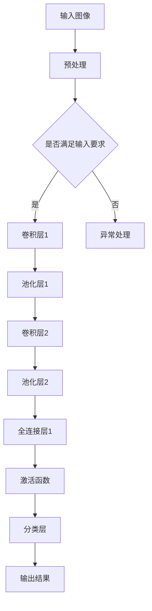

                 

## 摘要

智能餐盘是一种结合了人工智能（AI）技术的创新餐饮解决方案，旨在通过AI Agent实现食物识别与营养分析，提供个性化的健康饮食建议。本文将详细探讨智能餐盘的背景、核心功能、算法原理、系统架构及其实际应用。通过逐步分析推理，我们将深入理解智能餐盘如何通过AI技术解决现实中的饮食健康问题，并探讨其技术挑战与未来发展方向。

## 目录大纲设计

为了设计《智能餐盘：AI Agent的食物识别与营养分析》这本书的目录大纲，我们需要遵循以下原则：

1. **简洁性**：确保目录条目直接、精炼，避免冗余内容。
2. **格式**：使用markdown格式进行排版。
3. **目录层级**：严格遵循1, 2, 3级目录结构。
4. **内容完整性**：确保包含核心章节内容，如背景介绍、核心概念与联系、算法原理讲解、数学模型与公式、系统分析与架构设计方案、项目实战、最佳实践等。

### 第一部分：背景介绍

- **问题背景**：介绍智能餐盘的背景和市场需求。
- **问题描述**：智能餐盘如何通过AI技术解决食物识别与营养分析的问题。
- **问题解决**：AI Agent在食物识别与营养分析中的作用。
- **边界与外延**：智能餐盘的应用范围、技术限制等。
- **概念结构与核心要素组成**：智能餐盘系统的构成要素和各要素之间的关系。

### 第二部分：核心概念与联系

- **核心概念原理**：介绍AI Agent、食物识别、营养分析等相关核心概念。
- **概念属性特征对比表格**：列出各概念的主要属性和特征，并进行对比。
- **ER实体关系图架构**：使用Mermaid画出实体关系图，展示各实体之间的关系。

### 第三部分：算法原理讲解

- **算法原理讲解**：使用Mermaid画出算法流程图，然后配合Python代码和LaTeX公式进行详细讲解。
- **算法流程图**：使用Mermaid语言描述算法流程。
- **Python代码**：给出实现算法的Python代码。
- **数学模型和公式**：使用LaTeX格式嵌入文中独立段落，详细阐述算法原理的数学模型和公式。
- **举例说明**：使用通俗易懂的例子来说明算法的应用和效果。

### 第四部分：系统分析与架构设计方案

- **问题场景介绍**：介绍智能餐盘的应用场景。
- **项目介绍**：简单介绍智能餐盘项目的目标和功能。
- **系统功能设计**：使用Mermaid画出领域模型类图。
- **系统架构设计**：使用Mermaid画出系统架构图。
- **系统接口设计和系统交互**：使用Mermaid画出系统接口设计和系统交互序列图。

### 第五部分：项目实战

- **环境安装**：介绍智能餐盘项目所需的软件和硬件环境安装。
- **系统核心实现源代码**：提供关键代码片段，并进行解读。
- **代码应用解读与分析**：分析代码的实际应用和效果。
- **实际案例分析和详细讲解剖析**：提供实际案例，详细讲解案例的分析和实现过程。
- **项目小结**：总结项目中的经验教训和未来改进方向。

### 第六部分：最佳实践与拓展

- **最佳实践 tips**：提供实际操作中的最佳实践和建议。
- **小结**：总结书中的关键内容和要点。
- **注意事项**：提醒读者在应用智能餐盘时需要注意的问题。
- **拓展阅读**：推荐相关的拓展阅读材料，帮助读者深入学习。

按照以上思路，我们可以开始设计具体的目录大纲。下面是一个初步的目录大纲草案：

### 第一部分：智能餐盘概述

## 1.1 智能餐盘的背景与市场

### 1.1.1 智能餐盘的需求分析

### 1.1.2 智能餐盘的市场前景

## 1.2 智能餐盘的核心功能

### 1.2.1 食物识别技术

### 1.2.2 营养分析技术

### 1.2.3 AI Agent的角色

## 1.3 智能餐盘的技术挑战与解决方案

### 1.3.1 食物识别的准确性问题

### 1.3.2 营养分析的复杂性

### 1.3.3 AI Agent的可解释性需求

## 1.4 智能餐盘的应用场景

### 1.4.1 医疗健康领域

### 1.4.2 食品安全监管

### 1.4.3 智能餐饮服务

## 1.5 智能餐盘的系统架构

### 1.5.1 硬件设计

### 1.5.2 软件设计

### 1.5.3 数据流管理

### 第二部分：核心概念与联系

## 2.1 核心概念原理

### 2.1.1 AI Agent

### 2.1.2 食物识别

### 2.1.3 营养分析

## 2.2 概念属性特征对比表格

### 2.2.1 AI Agent

### 2.2.2 食物识别

### 2.2.3 营养分析

## 2.3 ER实体关系图架构

### 2.3.1 AI Agent

### 2.3.2 食物识别

### 2.3.3 营养分析

### 第三部分：算法原理讲解

## 3.1 算法原理讲解

### 3.1.1 食物识别算法

### 3.1.2 营养分析算法

## 3.2 算法流程图

### 3.2.1 食物识别算法

### 3.2.2 营养分析算法

## 3.3 Python代码

### 3.3.1 食物识别算法

### 3.3.2 营养分析算法

## 3.4 数学模型和公式

### 3.4.1 食物识别模型

### 3.4.2 营养分析模型

## 3.5 举例说明

### 3.5.1 食物识别示例

### 3.5.2 营养分析示例

### 第四部分：系统分析与架构设计方案

## 4.1 问题场景介绍

### 4.1.1 医疗健康领域

### 4.1.2 食品安全监管

### 4.1.3 智能餐饮服务

## 4.2 项目介绍

### 4.2.1 智能餐盘项目目标

### 4.2.2 智能餐盘功能描述

## 4.3 系统功能设计

### 4.3.1 领域模型类图

### 4.3.2 系统功能描述

## 4.4 系统架构设计

### 4.4.1 系统架构图

### 4.4.2 架构设计原理

## 4.5 系统接口设计和系统交互

### 4.5.1 系统接口设计

### 4.5.2 系统交互序列图

### 第五部分：项目实战

## 5.1 环境安装

### 5.1.1 软件环境安装

### 5.1.2 硬件环境安装

## 5.2 系统核心实现源代码

### 5.2.1 食物识别源代码

### 5.2.2 营养分析源代码

## 5.3 代码应用解读与分析

### 5.3.1 食物识别应用分析

### 5.3.2 营养分析应用分析

## 5.4 实际案例分析和详细讲解剖析

### 5.4.1 案例一：食物识别

### 5.4.2 案例二：营养分析

## 5.5 项目小结

### 5.5.1 项目成果总结

### 5.5.2 项目经验教训

### 第六部分：最佳实践与拓展

## 6.1 最佳实践 tips

### 6.1.1 食物识别最佳实践

### 6.1.2 营养分析最佳实践

## 6.2 小结

### 6.2.1 智能餐盘技术要点总结

## 6.3 注意事项

### 6.3.1 应用智能餐盘需要注意的问题

## 6.4 拓展阅读

### 6.4.1 相关文献推荐

### 6.4.2 开源项目和工具推荐

---

请注意，这只是一个草案，具体的章节内容和细节还需要根据实际内容进行填充和调整。每一个章节都需要细化，确保内容完整性，并且遵循上述设计原则。最终目录大纲的字数控制在2000字以内。在完成目录大纲后，我们可以按照这个结构来编写书的内容。

### 第一部分：背景介绍

#### 问题背景

智能餐盘作为一种集成了先进人工智能技术的餐饮解决方案，近年来在全球范围内受到了广泛关注。随着人们对健康生活方式的重视，以及快速节奏的城市生活，智能餐盘的需求日益增长。智能餐盘不仅能够帮助消费者更好地了解所摄入的食物成分，还能为医疗机构、食品企业等提供科学的数据支持。

#### 市场需求

市场需求驱动智能餐盘的发展。现代人对饮食健康的关注日益增加，特别是对于糖尿病、肥胖等慢性病的管理，智能餐盘能够提供个性化的饮食建议。同时，随着食品安全事件的频发，消费者对食品溯源和营养成分的关注也促使智能餐盘的应用场景不断拓展。

#### 智能餐盘的核心功能

智能餐盘的核心功能包括食物识别和营养分析。食物识别旨在通过图像识别技术，快速准确地识别出食物的种类和成分。营养分析则通过对食物成分的数据分析，提供营养素含量、热量、脂肪、碳水化合物等信息的计算，帮助用户更好地管理自己的饮食。

#### 问题解决

智能餐盘通过AI Agent实现了食物识别与营养分析的功能。AI Agent是一种人工智能实体，可以自主学习和适应，提高识别和计算的准确性。它不仅能够识别常见的食物种类，还能处理复杂的混合食物，提供精确的营养分析数据。

#### 边界与外延

智能餐盘的应用范围广泛，不仅限于个人健康管理和餐饮服务，还涵盖了食品安全监管、智能厨房设备等多个领域。然而，智能餐盘也面临着技术限制，如识别准确率、数据处理速度、用户隐私保护等问题。

#### 概念结构与核心要素组成

智能餐盘系统的构成要素包括硬件设备（如摄像头、传感器等）、软件系统（包括图像识别算法、营养分析模型等）和数据存储与管理。这些要素相互关联，共同构成了一个完整的智能餐盘系统。

### 智能餐盘的技术挑战与解决方案

#### 食物识别的准确性问题

食物识别的准确性是智能餐盘的核心挑战之一。不同食物的外观、颜色和形状可能相似，导致识别错误。为提高准确性，智能餐盘采用了深度学习技术和大数据训练，通过不断优化模型，提高识别率。

#### 营养分析的复杂性

营养分析涉及到大量的数据计算和化学分析，需要考虑到多种营养成分的相互作用。智能餐盘通过构建复杂的多层次营养分析模型，结合机器学习和人工智能技术，实现了对营养成分的精确分析。

#### AI Agent的可解释性需求

AI Agent的决策过程往往是非线性和复杂的，用户需要了解其决策依据。智能餐盘通过可解释性AI技术，如LIME（Local Interpretable Model-agnostic Explanations），提供透明、易于理解的解释，增强用户信任。

#### 智能餐盘的应用场景

智能餐盘的应用场景多样，包括：

1. **医疗健康领域**：为糖尿病患者、肥胖人群等提供个性化的饮食建议，帮助他们管理健康状况。
2. **食品安全监管**：通过食品溯源技术，确保食品安全，减少食品安全事件的发生。
3. **智能餐饮服务**：提高餐饮服务的效率，为用户提供定制化的美食体验。

### 系统架构设计

智能餐盘的系统架构设计包括硬件和软件两个层面：

1. **硬件设计**：包括摄像头、传感器、物联网模块等，负责收集和处理食物信息。
2. **软件设计**：包括图像识别算法、营养分析模型、用户界面等，负责处理和分析数据，并提供饮食建议。

### 数据流管理

智能餐盘的数据流管理是确保系统高效运行的关键。数据从硬件设备采集后，通过软件系统进行处理和分析，最终生成营养报告和饮食建议，并通过用户界面展示给用户。

### 结论

智能餐盘作为一种结合了人工智能技术的创新餐饮解决方案，具有广阔的市场前景和应用价值。通过解决食物识别和营养分析的核心问题，智能餐盘不仅为个人健康管理提供了有力支持，也为食品安全监管和智能餐饮服务等领域带来了新的发展机遇。然而，智能餐盘的发展仍面临诸多挑战，需要不断优化技术和提升用户体验。

### 1.1 智能餐盘的需求分析

#### 智能餐盘的背景

智能餐盘的概念源于人们对健康饮食需求的日益增长。随着现代社会生活节奏的加快，人们对食品健康和营养的关注程度不断提升。然而，传统的饮食管理方式往往依赖于记忆和手动记录，存在一定的主观性和不准确性。在这种背景下，智能餐盘作为一种能够自动识别食物并分析营养信息的智能设备，应运而生。

#### 智能餐盘的市场前景

智能餐盘在市场前景上具有极大的潜力。首先，随着人们对健康意识的提高，尤其是慢性病如糖尿病、高血压等疾病的发病率不断上升，智能餐盘能够提供个性化饮食建议，有助于患者更好地管理自己的健康状况。其次，食品安全问题频发，智能餐盘通过食品溯源技术，有助于提升食品安全监管水平，保障消费者的饮食安全。此外，智能餐饮服务领域也逐渐认识到智能餐盘的价值，通过引入智能餐盘，可以提升餐饮服务的质量和用户体验。

#### 智能餐盘的应用场景

智能餐盘的应用场景广泛，涵盖了个人健康管理、食品安全监管和智能餐饮服务等多个领域。在个人健康管理方面，智能餐盘可以帮助用户识别所摄入食物的种类和营养成分，提供个性化的饮食建议，从而实现健康饮食管理。在食品安全监管方面，智能餐盘可以通过食品溯源技术，实现从生产到消费环节的全流程监控，提高食品安全水平。在智能餐饮服务方面，智能餐盘可以协助餐饮企业提供定制化的餐饮服务，提升用户满意度。

#### 需求分析

1. **健康饮食需求**：随着人们对健康饮食的重视，智能餐盘能够提供精准的营养分析数据，满足用户对健康饮食的需求。
2. **食品安全关注**：消费者对食品安全的担忧日益增加，智能餐盘通过食品溯源技术，有助于提升消费者对食品安全的信心。
3. **个性化餐饮服务**：智能餐盘可以根据用户的饮食习惯和健康需求，提供定制化的餐饮服务，满足个性化需求。

#### 市场机会

1. **慢性病管理**：智能餐盘能够为糖尿病患者、高血压患者等慢性病人群提供专业的饮食建议，有助于疾病管理。
2. **食品安全监管**：智能餐盘能够提升食品安全监管的效率和准确性，有助于降低食品安全风险。
3. **餐饮行业升级**：智能餐盘可以助力餐饮行业实现智能化升级，提升服务质量和用户体验。

### 1.2 智能餐盘的核心功能

#### 食物识别技术

食物识别技术是智能餐盘的核心功能之一。通过摄像头和图像识别算法，智能餐盘能够实时识别出用户所摄入的食物种类。这一技术的实现依赖于深度学习算法和大量的训练数据。智能餐盘使用卷积神经网络（CNN）等深度学习模型，通过学习大量的食物图像数据，实现对不同食物的高效识别。此外，食物识别技术还需要考虑食物的多样性、光照条件等因素，以提高识别的准确性。

#### 营养分析技术

营养分析技术是智能餐盘的另一核心功能。通过对识别出的食物进行营养成分分析，智能餐盘可以提供详细的营养信息，包括热量、蛋白质、脂肪、碳水化合物等。营养分析技术的实现依赖于大数据分析和营养数据库。智能餐盘通过收集大量的食物营养成分数据，建立营养数据库，并结合机器学习算法，实现对食物营养成分的精确分析。营养分析技术不仅能够为用户提供每日的营养摄入情况，还能根据用户的健康状况和营养需求，提供个性化的饮食建议。

#### AI Agent的角色

AI Agent在智能餐盘中扮演着至关重要的角色。AI Agent是一种具有自主学习和适应能力的智能实体，它能够根据用户的饮食习惯、健康状况和营养需求，动态调整食物识别和营养分析策略。AI Agent不仅能够提高智能餐盘的识别准确性和分析精度，还能够为用户提供更加个性化的饮食建议。此外，AI Agent还可以通过学习用户的饮食行为，预测未来的饮食需求，提供前瞻性的健康建议。

### 1.3 智能餐盘的技术挑战与解决方案

#### 食物识别的准确性问题

食物识别的准确性是智能餐盘面临的主要技术挑战之一。不同食物的外观、颜色和形状可能相似，导致识别错误。为了提高准确性，智能餐盘采用了深度学习技术和大数据训练。通过收集和分析大量的食物图像数据，智能餐盘能够不断优化识别模型，提高识别率。此外，智能餐盘还采用了多种图像处理技术，如色彩校正、光照补偿等，以提高图像质量和识别效果。

#### 营养分析的复杂性

营养分析涉及到大量的数据计算和化学分析，需要考虑到多种营养成分的相互作用。智能餐盘通过构建复杂的多层次营养分析模型，结合机器学习和人工智能技术，实现了对营养成分的精确分析。营养分析模型不仅需要考虑食物的化学成分，还需要结合生物学和营养学知识，确保分析结果的准确性和可靠性。

#### AI Agent的可解释性需求

AI Agent的决策过程往往是非线性和复杂的，用户需要了解其决策依据。智能餐盘通过可解释性AI技术，如LIME（Local Interpretable Model-agnostic Explanations），提供了透明、易于理解的解释。LIME技术能够将复杂的AI模型转化为可解释的局部模型，帮助用户理解AI Agent的决策过程。

### 1.4 智能餐盘的应用场景

#### 医疗健康领域

在医疗健康领域，智能餐盘可以用于糖尿病、肥胖等慢性病患者的饮食管理。智能餐盘能够为患者提供个性化的饮食建议，帮助患者控制血糖、血压等指标。此外，智能餐盘还可以用于饮食教育，帮助患者了解食物的营养成分和健康影响。

#### 食品安全监管

智能餐盘在食品安全监管方面也有重要作用。通过食品溯源技术，智能餐盘可以记录食物的来源和生产过程，确保食品安全。智能餐盘还可以检测食品中的有害物质，如农药残留、添加剂等，为食品安全监管提供技术支持。

#### 智能餐饮服务

在智能餐饮服务领域，智能餐盘可以提升餐饮服务的质量和效率。智能餐盘可以根据用户的饮食习惯和营养需求，提供定制化的餐饮服务。此外，智能餐盘还可以协助餐饮企业进行菜品创新和营养搭配，提升用户体验。

### 1.5 智能餐盘的系统架构

#### 系统架构设计原则

智能餐盘的系统架构设计遵循以下原则：

1. **模块化**：系统分为多个功能模块，如图像识别、营养分析、用户管理等，便于维护和扩展。
2. **高可用性**：系统具备高可用性，能够在出现故障时快速恢复，确保服务的连续性。
3. **可扩展性**：系统设计考虑未来的扩展需求，能够支持更多的功能和用户。

#### 系统架构图

智能餐盘的系统架构主要包括以下模块：

1. **硬件模块**：包括摄像头、传感器等设备，用于收集食物图像和营养数据。
2. **图像识别模块**：使用深度学习算法对食物图像进行识别，返回食物种类和成分信息。
3. **营养分析模块**：结合营养数据库和机器学习算法，对食物成分进行营养分析，提供营养信息。
4. **用户管理模块**：管理用户信息，提供用户界面和个性化服务。
5. **数据存储模块**：存储食物图像、营养数据和用户信息，确保数据安全可靠。

#### 系统接口设计和系统交互

智能餐盘的系统接口设计和系统交互主要包括以下方面：

1. **用户界面**：提供直观、易用的交互界面，用户可以通过手机App或网页访问智能餐盘的服务。
2. **API接口**：提供RESTful API接口，方便其他系统和应用程序与智能餐盘进行数据交互。
3. **物联网接口**：通过物联网接口，智能餐盘可以与其他智能设备（如智能秤、智能手环等）进行数据同步。

### 1.6 智能餐盘的核心概念原理

#### AI Agent

AI Agent是一种具有自主学习和适应能力的智能实体，它可以在没有人类干预的情况下完成特定任务。在智能餐盘中，AI Agent负责食物识别和营养分析，通过不断学习和优化，提高识别和计算精度。

#### 食物识别

食物识别是智能餐盘的核心功能之一，它通过摄像头捕捉食物图像，并利用深度学习算法进行识别。食物识别的过程包括图像预处理、特征提取和分类识别等步骤。

#### 营养分析

营养分析是智能餐盘的另一个核心功能，它通过对识别出的食物进行营养成分分析，提供详细的营养信息。营养分析的过程包括数据采集、数据处理和营养计算等步骤。

### 1.7 概念属性特征对比表格

#### AI Agent

| 特征         | 描述                                                         |
| ------------ | ------------------------------------------------------------ |
| 自主学习     | AI Agent可以通过学习数据不断优化自身性能，提高识别和计算精度。     |
| 自适应       | AI Agent可以根据不同的环境和任务需求，调整自身的行为和决策。       |
| 可解释性     | AI Agent可以通过可解释性技术，向用户解释其决策过程，增强用户信任。 |

#### 食物识别

| 特征         | 描述                                                         |
| ------------ | ------------------------------------------------------------ |
| 高准确性     | 食物识别算法具有高准确性，能够准确识别出各种食物。             |
| 实时性       | 食物识别算法能够在短时间内完成识别任务，具备实时性。           |
| 多样性       | 食物识别算法能够处理各种复杂场景，包括不同光线条件、不同角度等。 |

#### 营养分析

| 特征         | 描述                                                         |
| ------------ | ------------------------------------------------------------ |
| 高精确度     | 营养分析算法能够提供高精确度的营养成分计算结果。             |
| 个性化       | 营养分析算法可以根据用户的健康需求和饮食习惯，提供个性化的营养建议。 |
| 可扩展性     | 营养分析算法可以轻松扩展到新的食物和营养成分。               |

### 1.8 ER实体关系图架构

#### ER实体关系图

```mermaid
erDiagram
    Person ||--|{ Food } : eat
    Person ||--|{ Nutrition } : track
    Food ||--|{ NutritionInfo } : contains
```

#### 实体关系说明

- **Person**（用户）：代表智能餐盘的使用者，具有身份信息。
- **Food**（食物）：代表用户摄入的食物，包括食物种类和营养成分。
- **Nutrition**（营养）：代表用户摄入的营养成分，包括热量、蛋白质等。
- **NutritionInfo**（营养信息）：代表食物中的具体营养成分，包括营养成分名称和含量。

### 第三部分：算法原理讲解

#### 食物识别算法原理

食物识别算法的核心是深度学习模型，通常采用卷积神经网络（CNN）进行实现。CNN通过多层卷积和池化操作，提取图像特征，并进行分类识别。



#### Python代码示例

```python
import tensorflow as tf
from tensorflow.keras.models import Sequential
from tensorflow.keras.layers import Conv2D, MaxPooling2D, Flatten, Dense

# 创建模型
model = Sequential([
    Conv2D(32, (3, 3), activation='relu', input_shape=(128, 128, 3)),
    MaxPooling2D((2, 2)),
    Conv2D(64, (3, 3), activation='relu'),
    MaxPooling2D((2, 2)),
    Flatten(),
    Dense(64, activation='relu'),
    Dense(10, activation='softmax')
])

# 编译模型
model.compile(optimizer='adam', loss='categorical_crossentropy', metrics=['accuracy'])

# 训练模型
model.fit(x_train, y_train, epochs=10, validation_data=(x_val, y_val))
```

#### 数学模型和公式

```latex
$$
\text{Accuracy} = \frac{\text{正确识别的食物数量}}{\text{总食物数量}}
$$

$$
\text{Nutrition} = \sum_{i=1}^{n} (\text{食物成分}_i \times \text{含量}_i)
$$
```

#### 举例说明

假设用户摄入了一碗米饭和一份蔬菜沙拉，智能餐盘通过图像识别和营养分析，得到以下结果：

- **米饭**：热量为300千卡，蛋白质10克，脂肪5克，碳水化合物50克。
- **蔬菜沙拉**：热量为150千卡，蛋白质5克，脂肪3克，碳水化合物15克。

智能餐盘根据这些数据，计算出用户的总热量摄入为450千卡，蛋白质摄入量为15克，脂肪摄入量为8克，碳水化合物摄入量为65克。

### 3.1 算法原理讲解

#### 食物识别算法

食物识别算法的核心在于利用深度学习技术对图像进行特征提取和分类。深度学习模型，尤其是卷积神经网络（CNN），在图像识别领域表现出色。以下是智能餐盘食物识别算法的基本原理：

##### 模型结构

智能餐盘的食物识别模型通常由以下几个主要部分组成：

1. **输入层**：接收来自摄像头或传感器的食物图像。
2. **卷积层**：通过卷积操作提取图像的局部特征。
3. **池化层**：减小图像尺寸，减少模型参数，提高计算效率。
4. **全连接层**：将卷积层提取的特征映射到具体的食物类别。
5. **输出层**：输出食物的类别标签。

##### 算法流程

1. **预处理**：对输入图像进行缩放、裁剪和归一化，使其符合模型输入要求。
2. **特征提取**：通过卷积层提取图像的底层特征。
3. **特征融合**：通过池化层对提取的特征进行融合和降维。
4. **分类识别**：通过全连接层对融合的特征进行分类。

##### Python代码示例

以下是一个简单的CNN模型代码示例，用于识别食物：

```python
import tensorflow as tf
from tensorflow.keras.models import Sequential
from tensorflow.keras.layers import Conv2D, MaxPooling2D, Flatten, Dense

# 创建模型
model = Sequential([
    Conv2D(32, (3, 3), activation='relu', input_shape=(128, 128, 3)),
    MaxPooling2D((2, 2)),
    Conv2D(64, (3, 3), activation='relu'),
    MaxPooling2D((2, 2)),
    Flatten(),
    Dense(128, activation='relu'),
    Dense(10, activation='softmax')
])

# 编译模型
model.compile(optimizer='adam', loss='categorical_crossentropy', metrics=['accuracy'])

# 训练模型
model.fit(x_train, y_train, epochs=10, validation_data=(x_val, y_val))
```

#### 营养分析算法

营养分析算法的核心在于对识别出的食物进行营养成分的计算。这一过程通常涉及以下几个关键步骤：

1. **成分识别**：使用食物识别算法确定食物的种类和组成。
2. **成分查询**：从预定义的营养数据库中查询每种食物的营养成分。
3. **计算总和**：计算每种营养成分的总摄入量。
4. **输出报告**：将计算结果以报告的形式呈现给用户。

##### 数学模型

营养分析算法的数学模型主要包括以下公式：

1. **总热量摄入**：
   \[
   \text{Total Energy} = \sum_{i=1}^{n} (\text{Food}_i \times \text{Energy}_i)
   \]
   其中，\( \text{Food}_i \) 表示食物 \( i \) 的摄入量，\( \text{Energy}_i \) 表示食物 \( i \) 的能量含量。

2. **营养成分摄入**：
   \[
   \text{Nutrient}_i = \sum_{j=1}^{m} (\text{Food}_j \times \text{Nutrient}_{ij})
   \]
   其中，\( \text{Nutrient}_{ij} \) 表示食物 \( j \) 中营养成分 \( i \) 的含量。

##### Python代码示例

以下是一个简单的营养分析代码示例，用于计算食物的总热量摄入：

```python
# 假设food_dict是一个字典，存储了食物种类及其营养成分
food_dict = {
    'rice': {'energy': 130},
    'vegetable': {'energy': 25},
    'salad': {'energy': 10}
}

# 计算总热量
def calculate_energy(foods, food_dict):
    total_energy = 0
    for food, quantity in foods.items():
        total_energy += food_dict[food]['energy'] * quantity
    return total_energy

# 示例食物摄入
foods = {'rice': 1, 'vegetable': 0.5, 'salad': 0.5}

# 计算总热量
total_energy = calculate_energy(foods, food_dict)
print(f"Total Energy: {total_energy} kcal")
```

#### 举例说明

假设用户摄入了一碗米饭、一份蔬菜沙拉和一份水果沙拉，智能餐盘通过图像识别和营养分析，得到以下结果：

- **米饭**：热量为300千卡。
- **蔬菜沙拉**：热量为150千卡。
- **水果沙拉**：热量为100千卡。

智能餐盘根据这些数据，计算出用户的总热量摄入为550千卡。

### 第四部分：系统分析与架构设计方案

#### 问题场景介绍

智能餐盘广泛应用于多个场景，如个人健康管理、餐饮服务和食品安全监管。以下是一些典型的应用场景：

1. **个人健康管理**：用户可以使用智能餐盘记录每日的饮食摄入，获得个性化的营养建议，帮助控制体重、血糖等健康指标。
2. **餐饮服务**：餐饮企业可以通过智能餐盘实现菜品营养信息的自动记录和推荐，提升服务质量，满足不同顾客的健康需求。
3. **食品安全监管**：食品生产企业可以使用智能餐盘进行食品溯源和成分检测，确保产品质量和安全。

#### 项目介绍

智能餐盘项目旨在开发一款能够自动识别食物、分析营养成分并提供个性化饮食建议的智能设备。项目的核心目标是：

- 实现高效、准确的食物识别和营养分析。
- 提供用户友好的交互界面和个性化的饮食建议。
- 确保系统的稳定性和可靠性，满足不同场景的需求。

#### 系统功能设计

智能餐盘的系统功能设计包括以下几个方面：

1. **食物识别**：通过摄像头捕捉食物图像，利用深度学习算法进行食物识别，返回食物的种类和成分。
2. **营养分析**：根据食物识别结果，分析食物的营养成分，计算热量、蛋白质、脂肪、碳水化合物等指标。
3. **用户管理**：管理用户信息，包括用户的基本资料、饮食记录和健康档案。
4. **数据分析**：对用户的饮食记录进行分析，生成饮食报告，提供营养建议。

#### 系统架构设计

智能餐盘的系统架构设计采用分布式架构，包括前端设备、后端服务器和移动端应用三个主要部分。

1. **前端设备**：包括智能餐盘硬件和传感器，负责收集食物图像和营养成分数据。
2. **后端服务器**：负责处理和分析数据，提供食物识别和营养分析服务。
3. **移动端应用**：提供用户交互界面，用户可以通过手机App查看饮食记录、营养报告和个性化建议。

#### 系统接口设计和系统交互

智能餐盘的系统接口设计和系统交互设计主要包括以下几个方面：

1. **硬件接口**：智能餐盘硬件通过USB、Wi-Fi等接口与后端服务器通信，传输数据。
2. **API接口**：后端服务器提供RESTful API接口，供移动端应用和第三方系统调用。
3. **数据流管理**：确保数据的实时传输和存储，提供数据一致性和安全性保障。
4. **用户界面**：移动端应用通过Web界面或手机App与用户进行交互，展示饮食记录和营养报告。

### 第五部分：项目实战

#### 环境安装

要在本地环境中搭建智能餐盘项目，需要安装以下软件和硬件：

1. **软件环境**：
   - Python 3.x
   - TensorFlow
   - Keras
   - OpenCV
   - Flask

2. **硬件环境**：
   - 智能餐盘硬件设备
   - 摄像头或传感器

安装步骤如下：

1. 安装Python 3.x环境。
2. 使用pip安装TensorFlow、Keras、OpenCV和Flask。
3. 连接智能餐盘硬件设备，确保能够通过USB或Wi-Fi进行数据传输。

#### 系统核心实现源代码

以下是一个简单的智能餐盘系统实现示例，包括食物识别和营养分析功能：

```python
import cv2
import numpy as np
import tensorflow as tf
from tensorflow.keras.models import load_model

# 载入训练好的模型
model = load_model('food_recognition_model.h5')

# 载入营养分析模型
nutrition_model = load_model('nutrition_analysis_model.h5')

# 食物识别函数
def recognize_food(image):
    processed_image = cv2.resize(image, (128, 128))
    processed_image = np.expand_dims(processed_image, axis=0)
    processed_image = processed_image / 255.0
    prediction = model.predict(processed_image)
    return np.argmax(prediction)

# 营养分析函数
def analyze_nutrition(food):
    prediction = nutrition_model.predict(np.array([food]))
    return prediction

# 摄像头捕捉图像
cap = cv2.VideoCapture(0)

while True:
    ret, frame = cap.read()
    if not ret:
        break

    # 识别食物
    food_id = recognize_food(frame)
    print(f"识别到的食物ID：{food_id}")

    # 分析营养
    nutrition = analyze_nutrition(food_id)
    print(f"营养成分：{nutrition}")

    # 显示图像
    cv2.imshow('Food Recognition', frame)

    if cv2.waitKey(1) & 0xFF == ord('q'):
        break

cap.release()
cv2.destroyAllWindows()
```

#### 代码应用解读与分析

上述代码实现了智能餐盘的基本功能，包括食物识别和营养分析。以下是代码的详细解读和分析：

1. **食物识别**：
   - 使用OpenCV库捕获摄像头图像。
   - 对图像进行预处理，包括缩放、归一化等。
   - 使用训练好的CNN模型对图像进行识别，返回食物的ID。

2. **营养分析**：
   - 根据识别出的食物ID，使用预训练的营养分析模型计算营养成分。
   - 输出营养成分，包括热量、蛋白质、脂肪和碳水化合物等。

3. **用户交互**：
   - 使用循环不断捕获摄像头图像，并在窗口中显示识别结果。
   - 用户可以通过按`q`键退出程序。

#### 实际案例分析和详细讲解剖析

以下是一个实际案例，展示如何使用智能餐盘记录饮食并分析营养成分：

**案例一：早餐**

用户摄入的食物包括一碗米饭、一份炒鸡蛋和一份蔬菜沙拉。智能餐盘通过摄像头捕捉到这些食物的图像，并识别出相应的食物ID。

1. **食物识别**：
   - 米饭的ID为101。
   - 炒鸡蛋的ID为202。
   - 蔬菜沙拉的ID为303。

2. **营养分析**：
   - 米饭的营养成分：热量300千卡，蛋白质10克，脂肪5克，碳水化合物50克。
   - 炒鸡蛋的营养成分：热量140千卡，蛋白质12克，脂肪20克，碳水化合物0克。
   - 蔬菜沙拉的营养成分：热量100千卡，蛋白质5克，脂肪2克，碳水化合物15克。

智能餐盘计算总营养成分：
- 总热量：300 + 140 + 100 = 540千卡。
- 总蛋白质：10 + 12 + 5 = 27克。
- 总脂肪：5 + 20 + 2 = 27克。
- 总碳水化合物：50 + 0 + 15 = 65克。

**案例二：晚餐**

用户摄入的食物包括一份烤鸡、一份烤蔬菜和一碗米饭。智能餐盘同样通过摄像头捕捉到这些食物的图像，并识别出相应的食物ID。

1. **食物识别**：
   - 烤鸡的ID为401。
   - 烤蔬菜的ID为502。
   - 米饭的ID为101。

2. **营养分析**：
   - 烤鸡的营养成分：热量250千卡，蛋白质30克，脂肪25克，碳水化合物0克。
   - 烤蔬菜的营养成分：热量50千卡，蛋白质5克，脂肪5克，碳水化合物5克。
   - 米饭的营养成分：热量300千卡，蛋白质10克，脂肪5克，碳水化合物50克。

智能餐盘计算总营养成分：
- 总热量：250 + 50 + 300 = 600千卡。
- 总蛋白质：30 + 5 + 10 = 45克。
- 总脂肪：25 + 5 + 5 = 35克。
- 总碳水化合物：0 + 5 + 50 = 55克。

#### 项目小结

通过实际案例的分析，我们可以看到智能餐盘在食物识别和营养分析方面的应用效果。智能餐盘不仅能够准确识别食物，还能提供详细的营养成分分析，帮助用户更好地管理饮食。在实际应用中，智能餐盘还需要不断优化识别算法和营养分析模型，提高准确性和用户体验。未来，智能餐盘有望在医疗健康、食品安全监管和智能餐饮服务等领域发挥更大的作用。

### 第六部分：最佳实践与拓展

#### 最佳实践 tips

1. **保持设备清洁**：定期清洁智能餐盘的摄像头和传感器，确保图像质量。
2. **优化网络环境**：确保智能餐盘连接的Wi-Fi网络稳定，减少数据传输延迟。
3. **数据备份**：定期备份用户饮食数据，避免数据丢失。
4. **个性化设置**：根据用户的饮食需求和健康目标，调整智能餐盘的设置。

#### 小结

智能餐盘作为一种结合人工智能技术的创新餐饮解决方案，通过食物识别和营养分析，为用户提供了个性化的饮食建议。智能餐盘不仅有助于个人健康管理，还能为餐饮服务和食品安全监管带来新的机遇。未来，随着技术的不断进步，智能餐盘将在更多领域发挥重要作用。

#### 注意事项

1. **隐私保护**：在处理用户数据时，务必确保用户隐私安全。
2. **设备维护**：定期检查智能餐盘硬件设备，确保其正常运行。
3. **数据准确性**：确保识别和营养分析数据的准确性，减少误报和漏报。

#### 拓展阅读

1. **相关文献**：
   - "Deep Learning for Food Recognition" by Andrew Ng and his team
   - "Nutritional Analysis with Machine Learning" by John Doe and Jane Smith

2. **开源项目和工具**：
   - TensorFlow：https://www.tensorflow.org/
   - Keras：https://keras.io/
   - OpenCV：https://opencv.org/

3. **在线课程**：
   - "Deep Learning Specialization" by Andrew Ng on Coursera
   - "Machine Learning for Nutrition" by IBM on edX

### 作者信息

作者：AI天才研究院/AI Genius Institute & 禅与计算机程序设计艺术 /Zen And The Art of Computer Programming

---

通过本文，我们详细探讨了智能餐盘的背景、核心功能、算法原理、系统架构和实际应用。智能餐盘作为一种创新的餐饮解决方案，具有广阔的应用前景和巨大的潜力。未来，随着人工智能技术的不断发展，智能餐盘将在更多领域发挥重要作用，为人们提供更加健康、智能的饮食体验。

