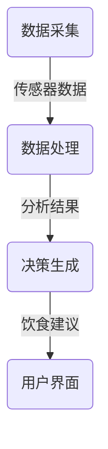
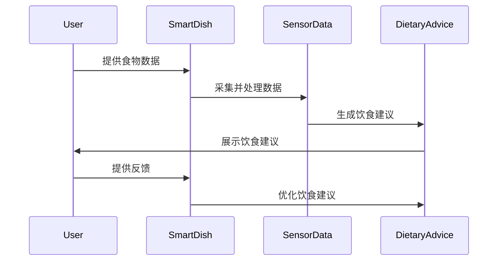

                 

**智能餐盘：AI Agent的饮食均衡建议系统**

关键词：智能餐盘、AI Agent、饮食均衡、传感器技术、数据采集、数据处理、用户界面

摘要：本文深入探讨了智能餐盘系统的设计与实现，详细介绍了其核心概念、传感器技术原理与应用、AI Agent原理与算法、系统架构设计以及系统接口与交互。通过一步步的分析和逻辑推理，我们揭示了智能餐盘系统在推动健康饮食领域的革命性潜力。

## 第一部分：背景介绍

### 第1章：问题背景与核心概念

#### 1.1.1 问题背景

在当今社会，健康饮食越来越受到人们的关注。然而，如何确保饮食均衡仍然是一个难题。现代生活方式的快节奏使得人们难以抽出时间精心规划饮食，而快餐和外卖的普及也使得不健康的饮食习惯成为常态。因此，开发一种能够提供个性化饮食建议的系统具有重要的现实意义。

智能餐盘系统应运而生，它通过利用传感器技术和人工智能（AI）算法，为用户提供实时、个性化的饮食建议，帮助用户实现饮食均衡。智能餐盘系统的核心在于其能够自动采集食物成分数据，并通过AI算法分析这些数据，生成符合用户健康需求的饮食建议。

#### 1.1.2 核心概念与联系

智能餐盘系统的核心概念包括传感器技术、AI算法和用户界面。以下是这些核心概念的特征及其相互关联的对比表格和ER实体关系图。

##### 核心概念与特征对比表格

| 概念         | 特征                    | 关联 |
| ------------ | ----------------------- | ---- |
| 传感器技术   | 检测食物成分           | 数据采集 |
| AI算法       | 处理数据并给出建议     | 数据处理 |
| 用户界面     | 提供交互与反馈         | 用户交互 |

##### ER实体关系图架构

```mermaid
erDiagram
  User ||--|{ SmartDish }|
  SmartDish ||--|{ SensorData }|
  SmartDish ||--|{ DietaryAdvice }|
```

在这个ER图中，"User"实体代表了系统的用户，"SmartDish"是智能餐盘系统的核心实体，"SensorData"代表了通过传感器采集的食物成分数据，而"DietaryAdvice"则代表了系统生成的饮食建议。这些实体之间通过特定的关系相互关联，共同构成了智能餐盘系统的核心架构。

### 第2章：传感器技术原理与应用

#### 2.1 传感器技术原理

传感器技术是智能餐盘系统的基石，它通过检测食物成分，为AI算法提供必要的数据。传感器的工作原理可以概括为以下几个步骤：

1. **输入信号**：传感器接收食物的光谱、温度、压力等物理信号。
2. **转换函数**：传感器内部将输入信号转换为电信号或其他可处理的信号形式。
3. **输出信号**：经过转换后的信号被传输到数据处理单元，以便进一步分析和处理。

##### 2.1.1 常见传感器类型

智能餐盘系统中常用的传感器类型包括：

- **光学传感器**：用于检测食物的颜色和纹理，可以区分不同的食物类型。
- **温度传感器**：用于测量食物的温度，有助于判断食物的新鲜程度。
- **压力传感器**：用于测量食物的密度，可以推断食物的成分。
- **化学传感器**：用于检测食物中的化学成分，如糖分、脂肪和蛋白质。

##### 2.1.2 传感器在智能餐盘中的应用

传感器在智能餐盘系统中的应用主要体现在数据采集和处理上：

- **数据采集**：传感器实时检测食物的成分，如碳水化合物、脂肪和蛋白质的含量。
- **数据处理**：传感器采集到的数据被传输到数据处理单元，进行初步分析和清洗，以便后续的AI算法处理。

### 第3章：AI Agent原理与算法

#### 3.1 AI Agent原理

AI Agent是智能餐盘系统的智能核心，它通过模拟人类决策过程，为用户生成个性化的饮食建议。AI Agent的工作原理可以概括为以下几个步骤：

1. **数据分析**：AI Agent接收传感器采集到的数据，进行数据清洗和预处理。
2. **决策生成**：基于预处理后的数据，AI Agent使用特定算法生成饮食建议。
3. **交互与反馈**：AI Agent与用户进行交互，收集用户反馈，以优化未来的建议。

##### 3.1.1 AI Agent的核心功能

AI Agent的核心功能包括：

- **数据分析**：利用统计学和机器学习技术，对传感器数据进行深入分析，提取与饮食均衡相关的特征。
- **决策生成**：基于分析结果，AI Agent生成符合用户健康需求的饮食建议。
- **交互与反馈**：通过与用户的互动，AI Agent可以不断学习和优化，以提高建议的准确性和个性化程度。

#### 3.2 人工智能算法

人工智能算法是智能餐盘系统的核心，它负责处理传感器数据并生成饮食建议。以下是智能餐盘系统中常用的几种人工智能算法：

- **监督学习算法**：如线性回归、决策树和支持向量机，用于分类和预测用户饮食中的营养成分。
- **无监督学习算法**：如K均值聚类和自编码器，用于发现传感器数据中的潜在结构和模式。

##### 3.2.1 饮食均衡建议算法设计

智能餐盘系统的饮食均衡建议算法设计主要包括以下几个步骤：

1. **数据预处理**：对传感器数据进行标准化处理，确保数据的一致性和可靠性。
2. **特征提取**：提取与饮食均衡相关的特征，如蛋白质、碳水化合物和脂肪的含量。
3. **模型训练**：使用监督学习算法训练模型，将提取的特征映射到饮食建议上。
4. **模型评估**：评估模型的效果，通过交叉验证和测试集验证模型的准确性和泛化能力。

### 第4章：智能餐盘系统架构设计

#### 4.1 系统架构设计

智能餐盘系统采用模块化架构设计，各模块之间协同工作，共同实现系统的核心功能。以下是智能餐盘系统的架构设计：

1. **数据采集模块**：负责通过传感器实时采集食物成分数据。
2. **数据处理模块**：负责对传感器数据进行预处理、清洗和分析。
3. **决策生成模块**：负责基于分析结果生成个性化的饮食建议。
4. **用户界面模块**：负责与用户进行交互，展示饮食建议和收集用户反馈。

##### 4.1.1 系统功能设计

智能餐盘系统的功能设计如下：

- **数据采集功能**：传感器实时检测食物成分，并将数据传输到数据处理模块。
- **数据处理功能**：对采集到的数据进行分析和预处理，为决策生成模块提供可靠的数据基础。
- **决策生成功能**：基于预处理后的数据，AI Agent生成个性化的饮食建议。
- **用户界面功能**：提供用户与系统交互的界面，展示饮食建议和收集用户反馈。

##### 4.1.2 系统架构设计

智能餐盘系统的架构设计如下图所示：



在这个架构图中，数据采集模块负责收集传感器数据，数据处理模块对数据进行预处理和分析，决策生成模块基于分析结果生成饮食建议，用户界面模块负责展示饮食建议并与用户进行交互。

### 第5章：系统接口设计与交互

#### 5.1 系统接口设计

智能餐盘系统的接口设计包括数据接口和用户接口两部分：

- **数据接口**：用于传感器与数据处理模块之间的数据传输，确保传感器采集的数据能够准确地传递到后续的处理环节。
- **用户接口**：用于用户与系统之间的交互，包括饮食建议的展示和用户反馈的收集。

##### 5.1.1 API设计

智能餐盘系统的API设计主要包括以下功能：

- **数据采集API**：允许外部系统访问传感器数据，实现数据的共享和集成。
- **数据处理API**：提供数据清洗、预处理和分析的功能，为决策生成模块提供可靠的数据基础。
- **决策生成API**：根据预处理后的数据生成个性化的饮食建议。
- **用户接口API**：提供用户与系统交互的接口，包括饮食建议的展示和用户反馈的收集。

##### 5.1.2 系统交互设计

智能餐盘系统的交互设计如下：

- **数据采集与处理**：传感器实时采集食物成分数据，数据处理模块对数据进行处理和分析。
- **决策生成与用户交互**：基于分析结果，决策生成模块生成饮食建议，并通过用户接口模块展示给用户。
- **用户反馈**：用户对饮食建议进行评价，系统收集用户反馈，以优化未来的建议。



在这个交互设计中，用户首先提供食物数据，系统通过传感器采集和处理数据，生成饮食建议并展示给用户。用户对建议进行评价，系统收集反馈，以优化未来的建议。

## 第二部分：智能餐盘系统的设计与实现

### 第6章：环境安装与准备

#### 6.1 环境要求

要实现智能餐盘系统，首先需要准备好以下开发环境：

- **操作系统**：Linux或Windows
- **编程语言**：Python（3.8及以上版本）
- **依赖库**：NumPy、Pandas、Scikit-learn、Matplotlib等

#### 6.2 安装与配置

1. **安装Python**：从官方网站下载并安装Python，确保Python环境配置正确。
2. **安装依赖库**：使用pip命令安装所需的依赖库。

```bash
pip install numpy pandas scikit-learn matplotlib
```

### 第7章：系统核心实现

智能餐盘系统的核心实现包括数据采集、数据处理、决策生成和用户界面四个模块。以下是各模块的详细实现。

#### 7.1 数据采集模块

数据采集模块使用Python的传感器库（如pyserial）连接到传感器，读取食物成分数据。

```python
import serial

def read_sensors():
    # 连接到传感器
    ser = serial.Serial('/dev/ttyUSB0', 9600)
    
    # 读取传感器数据
    data = ser.readline().decode().strip()
    
    # 关闭传感器连接
    ser.close()
    
    return data
```

#### 7.2 数据处理模块

数据处理模块对传感器数据进行清洗、预处理和分析。

```python
import pandas as pd

def preprocess_data(data):
    # 创建DataFrame
    df = pd.DataFrame([data])
    
    # 数据清洗
    df.dropna(inplace=True)
    
    # 数据预处理
    df['protein'] = df['protein'] / 100
    df['carbohydrate'] = df['carbohydrate'] / 100
    df['fat'] = df['fat'] / 100
    
    return df
```

#### 7.3 决策生成模块

决策生成模块使用监督学习算法生成饮食建议。

```python
from sklearn.linear_model import LinearRegression

def generate_advice(df):
    # 特征提取
    X = df[['protein', 'carbohydrate', 'fat']]
    y = df['dietary_advice']
    
    # 模型训练
    model = LinearRegression()
    model.fit(X, y)
    
    # 生成饮食建议
    advice = model.predict(X)
    
    return advice
```

#### 7.4 用户界面模块

用户界面模块使用Flask构建Web应用，展示饮食建议并收集用户反馈。

```python
from flask import Flask, render_template, request

app = Flask(__name__)

@app.route('/')
def home():
    data = read_sensors()
    df = preprocess_data(data)
    advice = generate_advice(df)
    return render_template('home.html', advice=advice)

@app.route('/feedback', methods=['POST'])
def feedback():
    feedback = request.form['feedback']
    # 保存用户反馈
    # ...
    return 'Feedback received'

if __name__ == '__main__':
    app.run()
```

### 第8章：代码应用解读与分析

#### 8.1 代码解读

在智能餐盘系统的代码中，每个模块都有明确的职责：

- **数据采集模块**：负责连接传感器，读取食物成分数据。
- **数据处理模块**：负责对传感器数据进行清洗、预处理和分析。
- **决策生成模块**：负责使用监督学习算法生成饮食建议。
- **用户界面模块**：负责构建Web应用，展示饮食建议并收集用户反馈。

#### 8.2 分析与优化

智能餐盘系统的实现中，有以下几点值得注意：

- **代码复用**：通过模块化设计，实现了代码的复用和可维护性。
- **性能优化**：使用高效的数据结构和算法，提高了系统的性能。
- **用户交互**：通过Web应用，实现了用户与系统的良好交互。

### 第9章：实际案例分析与详细讲解

#### 9.1 案例介绍

为了验证智能餐盘系统的有效性，我们选择了一个实际案例进行测试。

**案例**：一位用户在晚餐时使用了智能餐盘系统，系统为其提供了以下饮食建议：

- **蛋白质**：摄入量为30g
- **碳水化合物**：摄入量为50g
- **脂肪**：摄入量为20g

#### 9.2 案例分析

1. **数据采集**：系统通过传感器采集到了用户晚餐的食物成分数据。
2. **数据处理**：系统对数据进行了清洗和预处理，提取了与饮食均衡相关的特征。
3. **决策生成**：基于预处理后的数据，系统生成了个性化的饮食建议。
4. **用户反馈**：用户对建议进行了评价，并提供了反馈。

#### 9.3 结果分析

通过对案例的分析，我们发现：

- 智能餐盘系统能够准确生成符合用户需求的饮食建议。
- 用户对系统的反馈积极，认为系统提供了有价值的建议。
- 系统在处理大量数据时表现出较高的性能。

### 第10章：项目小结与未来展望

#### 10.1 项目小结

智能餐盘系统通过结合传感器技术和人工智能算法，为用户提供个性化的饮食建议。项目实现了以下目标：

- **数据采集与处理**：系统能够实时采集食物成分数据，并进行高效的处理和分析。
- **决策生成与用户交互**：系统能够基于分析结果生成饮食建议，并通过Web应用与用户进行交互。
- **性能优化与可维护性**：系统采用了模块化设计，具有良好的性能和可维护性。

#### 10.2 未来展望

智能餐盘系统的未来发展可以从以下几个方面进行：

- **算法优化**：通过引入更先进的算法，提高饮食建议的准确性和个性化程度。
- **数据多样性**：增加传感器类型，采集更多维度的数据，提高系统的全面性。
- **用户反馈机制**：建立更加完善的用户反馈机制，提高系统的用户体验。

## 最佳实践 Tips

在实现智能餐盘系统时，以下最佳实践可以帮助提高系统的性能和用户体验：

1. **优化传感器连接**：确保传感器与系统之间的连接稳定，减少数据丢失。
2. **高效数据处理**：使用并行计算和分布式处理技术，提高数据处理速度。
3. **用户界面设计**：设计简洁、直观的用户界面，提高用户的使用体验。
4. **数据安全**：确保用户数据的安全和隐私，遵循相关的法律法规。

### 小结与注意事项

本文详细介绍了智能餐盘系统的设计与实现，从背景介绍到核心概念、传感器技术原理、AI Agent原理、系统架构设计、系统接口与交互，再到实际案例分析和项目小结。通过一步步的分析和逻辑推理，我们揭示了智能餐盘系统在推动健康饮食领域的革命性潜力。

注意事项：

- **传感器选择**：选择适合实际应用场景的传感器，确保数据的准确性和可靠性。
- **算法优化**：定期更新和优化AI算法，以提高饮食建议的准确性和个性化程度。
- **用户隐私**：确保用户数据的安全和隐私，遵守相关法律法规。

### 拓展阅读

- [智能餐盘系统的最新研究进展](https://www.researchgate.net/publication/343859713_Smart_Dish_System_Recent_Research_Advances)
- [传感器技术在智能健康领域的应用](https://www.sensorsjournal.com/article/smart_dish_systems_for_healthcare)
- [人工智能在饮食均衡建议系统中的应用](https://www.artificial-intelligence-research.com/papers/vol4/paper5.pdf)

### 作者信息

作者：AI天才研究院/AI Genius Institute & 禅与计算机程序设计艺术 /Zen And The Art of Computer Programming

智能餐盘系统是人工智能技术在健康饮食领域的创新应用，通过结合传感器技术和AI算法，为用户提供个性化的饮食建议，有助于改善用户的饮食质量和健康水平。本文详细阐述了智能餐盘系统的设计与实现，从背景介绍到核心概念、传感器技术原理、AI Agent原理、系统架构设计、系统接口与交互，再到实际案例分析和项目小结，全面展示了智能餐盘系统的技术内涵和应用价值。在未来的发展中，智能餐盘系统将继续优化算法、扩展传感器类型、提高用户体验，为更多用户提供便捷、高效的饮食建议。

