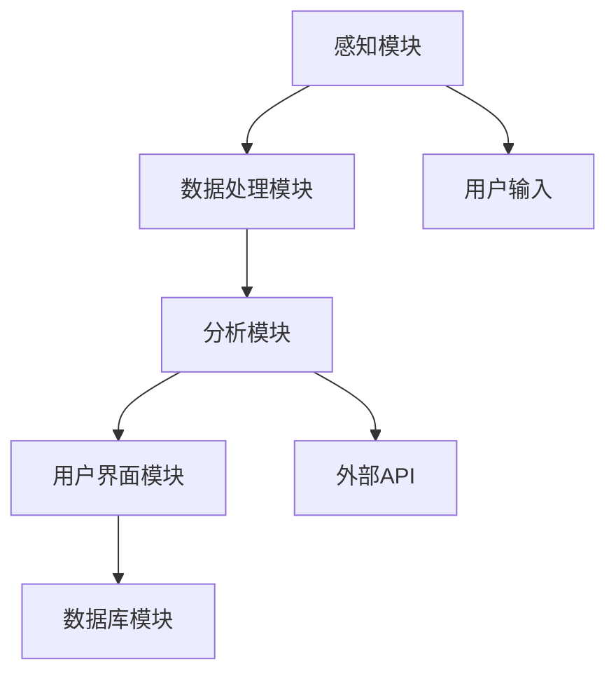
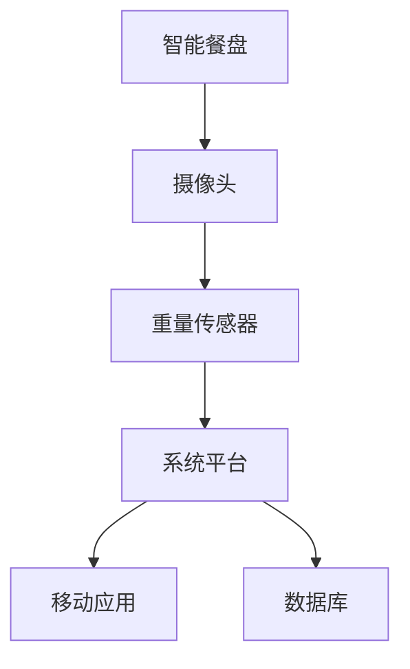
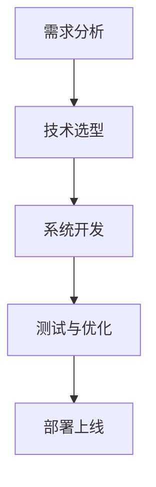

                 

### 摘要

本篇文章深入探讨了智能餐盘（Smart Plate）技术及其通过AI代理提供的个性化饮食平衡建议。随着现代生活方式的转变和健康意识的提升，传统饮食管理方法面临着诸多挑战，例如饮食不平衡、营养摄入不均等问题。智能餐盘作为一种创新的饮食管理工具，结合了人工智能和机器学习技术，旨在通过精准的数据分析和个性化的饮食建议，帮助用户实现营养均衡。本文首先介绍了智能餐盘技术的背景和基础概念，包括其定义、发展历程及在当代饮食管理中的作用。接着，我们探讨了膳食平衡的重要性，详细分析了营养原理和膳食需求，并探讨了当前饮食管理中存在的挑战。文章随后深入探讨了用于膳食分析的人工智能技术，包括数据收集与预处理、特征工程以及机器学习算法在饮食推荐中的应用。通过实际案例和系统架构设计，本文展示了智能餐盘的运作原理和实现过程。最后，文章总结了智能餐盘技术的潜力及其对健康领域的潜在影响，提出了未来发展的可能方向和注意事项。本文的目标是为读者提供一个全面而深入的了解，帮助其更好地掌握智能餐盘技术的核心原理和应用实践。

### 关键词

1. **智能餐盘**（Smart Plate）
2. **AI代理**（AI Agents）
3. **膳食平衡**（Dietary Balance）
4. **机器学习**（Machine Learning）
5. **个性化饮食建议**（Personalized Dietary Recommendations）
6. **数据收集与预处理**（Data Collection and Preprocessing）
7. **特征工程**（Feature Engineering）

### 引言

在现代科技飞速发展的背景下，人工智能（AI）和机器学习（ML）技术逐渐渗透到日常生活的各个方面，为我们带来了前所未有的便捷和效率。饮食管理作为健康生活方式的重要组成部分，也受到了AI技术的深刻影响。智能餐盘（Smart Plate）技术便是这一领域的创新成果之一，它通过集成AI和ML技术，为用户提供了个性化的饮食平衡建议。

#### 智能餐盘技术的定义与起源

智能餐盘是一种利用传感器、图像识别和机器学习算法，对用户饮食行为进行实时监测和分析的智能设备。其基本原理是通过摄像头或其他传感器对放置在餐盘上的食物进行扫描，识别食物的种类和数量，并结合用户的个人健康数据，为用户提供合理的饮食建议。

这一技术的起源可以追溯到早期的人工智能研究，当时的研究者们开始探索如何通过计算机模拟人类认知和决策过程。随着图像处理技术和传感器技术的进步，智能餐盘的概念逐渐成熟，并开始应用于实际生活中的饮食管理。

#### 智能餐盘在现代饮食管理中的作用

现代饮食管理面临着诸多挑战，例如饮食习惯不健康、营养摄入不均等问题。智能餐盘技术通过以下几个方面为解决这些问题提供了新的思路和手段：

1. **个性化饮食建议**：智能餐盘可以根据用户的健康状况、饮食习惯和营养需求，提供个性化的饮食建议，帮助用户实现营养均衡。
2. **实时监测与反馈**：通过实时监测用户的饮食行为，智能餐盘能够及时发现饮食中的不健康习惯，并提供即时反馈，帮助用户进行自我调整。
3. **数据驱动决策**：智能餐盘收集的大量饮食数据可以为研究人员提供宝贵的数据资源，帮助研究饮食与健康之间的关系，从而推动健康饮食的发展。

#### 智能餐盘技术的发展历程

智能餐盘技术的发展可以分为以下几个阶段：

1. **初步探索阶段（20世纪80年代至90年代）**：这一阶段主要是理论研究和概念验证，研究者开始探讨如何通过计算机技术对饮食行为进行监测和分析。
2. **技术成熟阶段（21世纪初至10年代）**：随着图像识别和传感器技术的快速发展，智能餐盘技术逐渐成熟，开始应用于实验室和研究项目中。
3. **商业化应用阶段（2010年代至今）**：智能餐盘技术逐渐商业化，进入大众市场，成为健康饮食管理的重要工具。

#### 智能餐盘技术的未来展望

随着AI和ML技术的不断进步，智能餐盘技术有望在以下几个方面得到进一步发展：

1. **准确性提升**：通过引入更先进的图像识别算法和传感器技术，智能餐盘的识别准确度将进一步提高，为用户提供更精准的饮食建议。
2. **智能化水平提升**：智能餐盘将具备更强的自我学习和优化能力，能够根据用户的行为和反馈进行自我调整，提供更加个性化的饮食服务。
3. **跨领域应用**：智能餐盘技术不仅可以在饮食管理中发挥作用，还可以应用于其他健康领域，如运动管理、疾病监测等。

总之，智能餐盘技术作为一种新兴的饮食管理工具，正逐步改变着我们的饮食习惯和生活方式。通过对智能餐盘技术的深入探讨，本文希望为读者提供一个全面而清晰的了解，帮助其更好地掌握这一领域的核心原理和应用实践。

#### 基本概念

要深入探讨智能餐盘技术，我们首先需要了解其中涉及的一些核心概念，包括人工智能（AI）、机器学习（ML）以及AI代理（AI Agents）。

##### 人工智能（AI）

人工智能是指通过计算机程序和算法模拟人类智能的一种技术。AI的研究涵盖了多个领域，包括自然语言处理、计算机视觉、推理与规划等。其核心目标是使计算机能够执行通常需要人类智能才能完成的任务。人工智能可以分为两种主要类型：弱AI（Narrow AI）和强AI（General AI）。

- **弱AI（Narrow AI）**：弱AI是指在特定领域内表现出智能行为的系统。例如，语音助手、图像识别软件等都是弱AI的典型应用。这些系统被设计用于执行特定任务，具有较高的效率和准确性，但无法进行跨领域的通用推理。
- **强AI（General AI）**：强AI则是一种具备广泛认知能力的人工智能，能够在各种不同的任务中表现出智能行为，甚至能够像人类一样思考、学习和决策。目前，强AI仍处于理论研究阶段，尚未实现商业化应用。

##### 机器学习（ML）

机器学习是人工智能的一个重要分支，它专注于通过数据来训练算法，使其能够从经验中学习和提高性能。机器学习的基本过程包括数据收集、特征工程、模型训练、模型评估和模型部署。

- **数据收集**：首先需要收集大量相关的数据，这些数据可以是结构化的（如数据库）、半结构化的（如XML文件）或非结构化的（如图像、文本、声音）。
- **特征工程**：在收集到数据后，需要对这些数据进行处理，提取出有用的特征，这些特征将用于训练模型。
- **模型训练**：使用收集到的数据和提取出的特征来训练机器学习模型。训练过程通常包括多次迭代，通过调整模型的参数来优化其性能。
- **模型评估**：训练完成后，需要对模型进行评估，以确定其在实际应用中的性能。常见的评估指标包括准确率、召回率、F1分数等。
- **模型部署**：经过评估后，性能良好的模型将被部署到实际应用中，为用户提供服务。

##### 机器学习的主要算法

机器学习算法种类繁多，根据其学习方式可以分为监督学习、无监督学习和强化学习。

- **监督学习（Supervised Learning）**：监督学习是机器学习中最常用的方法，它通过已标记的数据进行训练。标记数据提供了正确的输出结果，使模型能够学习并预测新数据的输出。常见的监督学习算法包括线性回归、逻辑回归、决策树、支持向量机（SVM）等。
- **无监督学习（Unsupervised Learning）**：无监督学习不需要已标记的数据，而是从未标记的数据中学习模式。其主要任务是发现数据中的隐含结构。常见的无监督学习算法包括聚类算法（如K均值聚类）、主成分分析（PCA）和自编码器等。
- **强化学习（Reinforcement Learning）**：强化学习是一种通过互动和奖励机制来学习决策策略的方法。在强化学习中，算法（称为代理人）通过不断尝试和错误来学习如何在环境中做出最优决策。常见的强化学习算法包括Q学习、深度Q网络（DQN）和策略梯度算法等。

##### AI代理（AI Agents）

AI代理是一种能够自主执行任务、与环境交互并适应变化的计算实体。在智能餐盘技术中，AI代理负责对用户的饮食行为进行实时监测、分析和建议。

- **AI代理的组成**：AI代理通常由感知器、决策器和行动器组成。感知器负责接收环境信息，决策器根据这些信息进行决策，行动器执行决策结果。
- **AI代理的运作原理**：AI代理通过机器学习算法从历史数据中学习，形成对饮食行为的理解和预测模型。当用户使用智能餐盘时，感知器收集到的数据会经过决策器处理，生成个性化的饮食建议，并最终通过行动器反馈给用户。

##### AI代理在智能餐盘中的应用

在智能餐盘技术中，AI代理的主要任务包括：

1. **饮食行为监测**：AI代理通过摄像头或其他传感器实时监测用户的饮食行为，收集食物的种类、数量、颜色等信息。
2. **数据预处理**：收集到的数据需要进行预处理，包括图像识别、数据清洗和特征提取等，以便用于后续的分析。
3. **饮食分析**：使用机器学习算法对预处理后的数据进行分析，生成饮食行为的预测模型，识别潜在的营养不均衡问题。
4. **个性化建议**：根据用户的历史饮食数据和当前饮食行为，AI代理会为用户生成个性化的饮食建议，帮助其实现营养均衡。

通过以上对人工智能、机器学习和AI代理的基本概念介绍，我们可以更好地理解智能餐盘技术的工作原理和应用场景。接下来的章节将进一步探讨智能餐盘在膳食平衡分析中的应用，以及如何通过这些技术实现个性化的饮食建议。

### 膳食平衡的基本概念

膳食平衡是营养学中的一个核心概念，指的是通过合理搭配各类食物，确保人体获得所需的各种营养素，从而达到促进健康、预防疾病的目的。实现膳食平衡的关键在于了解各类营养素的作用及其来源，并制定合理的饮食计划。

#### 营养素的基本知识

营养素是指人体必需的有机和无机物质，主要包括以下几类：

1. **蛋白质**：蛋白质是构成人体细胞和组织的重要物质，参与身体的生长、修复和代谢过程。优质的蛋白质来源包括肉类、鱼类、豆类、蛋类等。
2. **碳水化合物**：碳水化合物是人体的主要能量来源，主要包括糖类、淀粉和纤维。全谷类、蔬菜和水果是碳水化合物的重要来源。
3. **脂肪**：脂肪是提供能量、保护器官和参与激素合成的重要物质。健康脂肪来源包括鱼油、橄榄油、坚果和种子。
4. **维生素**：维生素是调节身体各种生化反应的必需营养素，分为水溶性维生素和脂溶性维生素。水溶性维生素包括维生素B群和维生素C，脂溶性维生素包括维生素A、D、E和K。
5. **矿物质**：矿物质是构成骨骼、维持神经和肌肉功能的重要元素，如钙、铁、锌、钾等。

#### 膳食要求

为了实现膳食平衡，需要遵循以下基本要求：

1. **多样化**：饮食应该包含多种类型的食物，以确保摄入各种必需的营养素。多样化的饮食有助于减少单一营养素摄入过多或过少的风险。
2. **均衡**：各种营养素的摄入应该保持一定的比例，避免某一营养素过量或不足。根据中国居民膳食指南，蛋白质、碳水化合物和脂肪的摄入比例建议为12:57:31。
3. **适量**：食物的摄入量应根据个人的能量需求和活动强度进行调整，避免过量摄入导致能量过剩或不足。
4. **合理烹调**：合理的烹调方法可以保留食物中的营养素，减少营养素的流失。建议采用蒸、煮、炖等低脂烹调方式。

#### 膳食平衡的重要性

实现膳食平衡对健康具有多方面的益处：

1. **预防慢性疾病**：膳食平衡可以降低慢性疾病如心血管疾病、糖尿病和肥胖的风险。合理摄入各类营养素有助于维持血糖、血脂和血压在正常范围内。
2. **增强免疫力**：均衡的饮食有助于增强人体的免疫力，预防感染性疾病。维生素、矿物质和蛋白质等营养素在免疫过程中发挥着重要作用。
3. **促进生长发育**：儿童和青少年在成长过程中需要充足的营养素支持，膳食平衡有助于其健康成长。
4. **维持体重**：合理的饮食结构可以帮助控制体重，避免因能量摄入过多导致的肥胖问题。

#### 常见膳食问题及解决方法

尽管膳食平衡的重要性已被广泛认可，但在实际生活中，许多人仍然面临着饮食不均衡的问题。以下是一些常见的膳食问题及其解决方法：

1. **营养摄入不足**：导致营养摄入不足的主要原因包括饮食习惯不良、饮食单调、烹饪方法不当等。解决方法包括增加食物多样性，选择营养丰富的食物，改进烹饪方式。
2. **营养摄入过量**：营养摄入过量通常是由于过量摄入高热量、高脂肪、高糖分的食物。解决方法包括减少高热量食物的摄入，增加蔬菜和水果的摄入量。
3. **饮食不规律**：饮食不规律会导致营养摄入不均衡。解决方法包括制定合理的饮食计划，保持规律的饮食习惯。

通过了解膳食平衡的基本概念和重要性，我们可以更好地管理自己的饮食，实现健康的生活目标。接下来，我们将探讨智能餐盘技术在膳食平衡分析中的应用，如何利用AI技术为用户提供个性化的饮食建议。

### 当前饮食管理中的挑战

尽管膳食平衡的重要性已被广泛认可，但现实中的饮食管理仍然面临着诸多挑战。这些挑战不仅影响了人们的健康，也对智能餐盘技术的应用提出了新的要求。

#### 常见饮食问题

1. **饮食习惯不健康**：现代社会中，人们的生活节奏加快，许多人养成了不健康的饮食习惯，如高脂、高糖、高盐饮食。这些不良饮食习惯增加了肥胖、心血管疾病和糖尿病等慢性疾病的风险。
2. **饮食单调**：由于工作繁忙或生活方式的改变，许多人习惯于摄入单一或重复的食物种类，导致营养摄入不均衡。长期的单调饮食可能导致维生素和矿物质的摄入不足，影响身体健康。
3. **饮食不规律**：饮食不规律是现代生活中的常见问题，许多人因为工作压力或社交活动而无法按时进食。饮食不规律不仅影响消化系统的健康，还可能导致血糖、血脂和血压波动，增加健康风险。
4. **营养摄入不足或过量**：一些特殊人群，如老年人、孕妇和营养不良的人群，可能面临营养摄入不足的问题。而另一方面，过量摄入某些营养素，如维生素A和维生素D，也可能导致中毒和其他健康问题。

#### 饮食管理中的障碍

1. **缺乏营养知识**：许多人缺乏基本的营养知识，不了解如何通过饮食来维持健康。这导致他们在选择食物和制定饮食计划时缺乏科学依据，容易陷入饮食误区。
2. **饮食时间限制**：现代生活节奏快，许多人忙于工作或社交活动，没有足够的时间准备和享受健康的饮食。这使得他们在饮食选择上倾向于选择快速、方便的食物，而非营养均衡的食物。
3. **饮食成本问题**：一些健康的食物，如新鲜水果、蔬菜和鱼类，往往价格较高。这导致一些收入较低的人群无法负担多样化的饮食，从而影响了他们的营养摄入。

#### 智能餐盘技术的潜力

智能餐盘技术为解决上述饮食管理中的挑战提供了新的解决方案：

1. **个性化饮食建议**：智能餐盘通过AI技术，可以根据用户的个人健康状况、饮食习惯和营养需求，提供个性化的饮食建议。这有助于用户克服营养摄入不足或过量的问题，实现营养均衡。
2. **实时监测与反馈**：智能餐盘能够实时监测用户的饮食行为，及时发现不良饮食习惯，并提供即时反馈。这种实时监测和反馈机制有助于用户养成良好的饮食习惯，从而改善健康。
3. **数据驱动的决策**：智能餐盘收集的大量饮食数据可以为研究人员提供宝贵的数据资源，帮助研究饮食与健康之间的关系。这些数据还可以用于优化智能餐盘的算法，提高其建议的准确性和个性化程度。
4. **教育和指导**：智能餐盘不仅可以提供饮食建议，还可以通过教育和指导功能，帮助用户了解营养知识，培养健康的饮食习惯。这种教育和指导功能有助于提高用户的营养意识，从而更好地管理自己的饮食。

总之，当前饮食管理中存在许多挑战，但智能餐盘技术为解决这些问题提供了新的思路和方法。通过个性化饮食建议、实时监测与反馈、数据驱动的决策和教育和指导，智能餐盘技术有望改善人们的饮食管理，促进健康生活方式的养成。

### AI技术在膳食分析中的应用

在探讨智能餐盘技术时，AI技术无疑扮演着至关重要的角色。机器学习和深度学习算法通过分析用户饮食数据，为用户提供个性化的饮食建议，从而帮助实现膳食平衡。以下将详细分析数据收集与预处理、特征工程以及机器学习算法在膳食分析中的应用。

#### 数据收集与预处理

智能餐盘技术首先依赖于数据收集。这些数据通常包括用户摄入的食物种类、数量、颜色、摄入时间等。数据收集的方法多种多样，主要包括以下几种：

1. **图像识别**：通过摄像头或其他图像传感器实时捕捉餐盘中的食物图像，然后利用图像识别算法识别食物的种类和数量。
2. **传感器数据**：智能餐盘可能配备多种传感器，如重量传感器、光谱传感器等，用于监测食物的重量和成分。
3. **用户输入**：用户可以通过手动输入或通过移动应用上传自己的饮食习惯和健康数据。

在收集到原始数据后，需要进行预处理，以确保数据的质量和一致性。预处理步骤通常包括：

1. **图像增强**：通过图像增强算法改善图像质量，使其更易于识别。
2. **数据清洗**：去除数据中的噪声和异常值，例如由于光线变化导致的误识别。
3. **归一化**：将数据转换为标准格式，例如将食物的重量、颜色等特征进行归一化处理，以便后续的算法分析。

#### 特征工程

特征工程是机器学习模型构建的关键步骤，它通过提取和选择有用的特征，提高模型的性能。在膳食分析中，特征工程包括以下几个关键方面：

1. **图像特征提取**：从食物图像中提取特征，如颜色、纹理、形状等。这些特征可以通过卷积神经网络（CNN）等深度学习算法进行自动提取。
2. **营养信息提取**：根据食物的种类和数量，提取相应的营养信息，如卡路里、蛋白质、碳水化合物和脂肪的含量。
3. **用户特征**：包括用户的年龄、性别、体重、活动水平等个人信息，这些特征可以帮助模型更好地理解用户的饮食需求。

特征工程的目标是选择出对预测目标影响最大的特征，同时减少冗余和噪声。特征选择的方法包括特征重要性分析、主成分分析（PCA）和自动特征选择算法等。

#### 机器学习算法在膳食分析中的应用

在膳食分析中，机器学习算法被广泛应用于生成个性化的饮食建议。以下是一些常用的机器学习算法及其应用：

1. **监督学习算法**：
   - **线性回归**：线性回归是一种简单的监督学习算法，用于预测连续值输出，如食物摄入的总卡路里。线性回归模型通过建立输入特征与输出值之间的线性关系来进行预测。
   - **逻辑回归**：逻辑回归常用于分类任务，如判断某一餐是否健康。它通过建立输入特征与输出类别之间的概率关系来进行分类。
   - **决策树**：决策树是一种树形结构的监督学习算法，通过一系列的决策规则来分类或回归。决策树易于理解和解释，常用于初步的模型构建和特征选择。
   - **随机森林**：随机森林是一种基于决策树的集成学习方法，通过构建多个决策树并投票来提高模型的预测准确性。随机森林具有较强的泛化能力，适用于复杂的数据集。

2. **无监督学习算法**：
   - **聚类算法**：聚类算法，如K均值聚类和层次聚类，用于将相似的食物数据分组。这些算法可以帮助发现用户饮食中的模式，例如哪些食物经常一起摄入。
   - **主成分分析（PCA）**：PCA是一种降维技术，用于减少数据维度，同时保留主要的信息。通过PCA，我们可以识别出数据中的主要成分，从而简化模型输入。
   - **自编码器**：自编码器是一种无监督学习算法，通过压缩和重构数据来学习数据的有效表示。自编码器在特征提取和降维方面表现出色。

3. **深度学习算法**：
   - **卷积神经网络（CNN）**：CNN是一种深度学习算法，特别适用于处理图像数据。通过多层次的卷积和池化操作，CNN可以自动提取图像中的高级特征，从而实现高效的食物识别。
   - **循环神经网络（RNN）**：RNN是一种用于处理序列数据的深度学习算法，可以捕捉食物摄入的时间序列模式，如饮食规律和周期性变化。
   - **长短期记忆网络（LSTM）**：LSTM是RNN的一种改进，可以更好地处理长序列数据，广泛应用于时间序列预测和序列建模。

通过结合多种机器学习算法，智能餐盘技术能够为用户提供准确和个性化的饮食建议。实际应用中，这些算法通常通过迭代优化和模型评估来不断提高预测性能。

#### 案例研究

以下是一个实际案例，展示如何使用机器学习算法为用户提供个性化饮食建议：

**案例背景**：某用户希望通过智能餐盘技术监控和改善自己的饮食状况。用户的历史数据包括每天摄入的食物种类和数量、体重变化、活动水平等。

**数据处理**：
1. **图像识别**：智能餐盘通过摄像头捕捉用户每天的饮食图像，利用CNN算法进行图像识别，识别出食物种类和数量。
2. **数据预处理**：对识别结果进行数据清洗和归一化处理，确保数据的准确性和一致性。
3. **特征提取**：提取食物的种类和数量，以及用户的基本信息（如体重、活动水平）作为特征输入。

**模型训练**：
1. **线性回归模型**：使用线性回归模型预测用户每天的总卡路里摄入量。通过历史数据训练模型，并使用交叉验证方法评估模型性能。
2. **决策树模型**：构建决策树模型，用于分类用户每餐是否健康。决策树模型通过特征重要性分析选择关键特征，提高模型的解释性。
3. **随机森林模型**：使用随机森林模型集成多个决策树，提高模型的预测准确性和稳定性。

**个性化饮食建议**：
1. **营养摄入分析**：根据用户每天的总卡路里摄入量，结合营养标准，分析用户的营养摄入情况，识别营养不足或过量的部分。
2. **健康建议**：智能餐盘根据用户的营养分析结果，生成个性化的饮食建议，如增加蔬菜摄入量、减少高热量食物摄入等。
3. **反馈机制**：用户可以根据智能餐盘的建议调整饮食，并在后续的饮食数据中观察效果，进一步优化建议。

通过上述案例，我们可以看到，机器学习技术在膳食分析中的应用极大地提升了智能餐盘的实用性和个性化程度。接下来，我们将进一步探讨智能餐盘的应用场景和实现过程。

### 智能餐盘系统的设计与实现

为了实现智能餐盘系统，我们需要从系统架构、用户界面、物联网（IoT）设备集成等多个方面进行设计和实现。以下将详细描述这些设计和实现步骤。

#### 系统架构

智能餐盘系统的整体架构可以分为以下几个关键模块：

1. **感知模块**：包括摄像头、重量传感器和其他传感器，用于实时捕捉和监测用户的饮食行为和餐盘上的食物。
2. **数据处理模块**：负责接收感知模块采集到的数据，进行预处理和特征提取，为后续的分析提供高质量的输入数据。
3. **分析模块**：包括机器学习算法和深度学习模型，用于对预处理后的数据进行分析和预测，生成个性化的饮食建议。
4. **用户界面模块**：提供用户交互界面，用于展示分析结果、个性化建议和用户设置，帮助用户了解和调整自己的饮食行为。
5. **数据库模块**：存储用户的历史饮食数据、营养数据以及系统配置信息，支持数据的持久化和查询。

以下是一个简化的系统架构图：



#### 用户界面设计

用户界面是智能餐盘系统与用户交互的桥梁，其设计需要充分考虑用户体验和易用性。以下是用户界面设计的关键要素：

1. **实时数据显示**：在用户界面上实时展示餐盘中的食物种类、数量和营养信息，让用户一目了然。
2. **个性化建议**：根据用户的饮食数据和历史记录，生成个性化的饮食建议，并在界面上突出显示，引导用户调整饮食。
3. **交互设计**：设计简洁直观的交互流程，例如通过滑动操作查看历史饮食记录、点击操作接受或调整饮食建议等。
4. **通知提醒**：在用户界面中集成通知提醒功能，例如在用户摄入高热量食物时发出警报，提醒用户注意营养均衡。

以下是一个用户界面的设计草图：

```
+--------------------------------------------------+
|  智能餐盘系统用户界面                            |
+--------------------------------------------------+
| [实时餐盘]                                       |
|  面包 x2，沙拉 x1，果汁 x1，饼干 x3              |
+--------------------------------------------------+
| [营养分析]                                      |
|  总卡路里：1500 kcal                             |
|  蛋白质：50 g，碳水化合物：300 g，脂肪：50 g     |
+--------------------------------------------------+
| [饮食建议]                                      |
|  建议增加蔬菜摄入量，减少高热量食物摄入。       |
+--------------------------------------------------+
| [历史记录]                                      |
|  滑动查看历史饮食记录。                           |
+--------------------------------------------------+
| [设置]                                           |
|  修改个人信息，调整饮食目标。                     |
+--------------------------------------------------+
```

#### 物联网设备集成

智能餐盘系统需要与多种IoT设备集成，包括摄像头、重量传感器、移动设备等。以下是集成过程中需要考虑的关键点：

1. **设备连接**：确保各类IoT设备与系统平台的无缝连接，例如通过Wi-Fi、蓝牙等方式实现数据传输。
2. **数据同步**：实现用户在不同设备间的数据同步，例如用户在智能餐盘上记录的饮食数据可以同步到移动应用中。
3. **数据安全**：确保传输和存储过程中的数据安全，例如使用加密算法保护用户数据不被泄露。
4. **设备管理**：实现IoT设备的远程监控和管理，例如通过系统平台可以远程查看设备状态、进行固件升级等。

以下是一个物联网设备集成的架构图：



#### 系统实现与部署

智能餐盘系统的实现包括以下几个主要步骤：

1. **需求分析**：明确系统功能需求，例如数据收集、处理和分析、用户交互等。
2. **技术选型**：选择合适的技术栈，包括前端开发框架、后端服务器、数据库以及机器学习框架等。
3. **系统开发**：按照需求分析和技术选型，进行系统的开发和实现。
4. **测试与优化**：对系统进行全面的测试，确保其稳定性和性能，并根据用户反馈进行优化。
5. **部署上线**：将系统部署到服务器，并进行上线发布。

以下是一个简单的实现流程图：



通过以上设计与实现步骤，我们可以构建一个功能完善、用户体验良好的智能餐盘系统，为用户实现膳食平衡提供强有力的支持。

### 智能餐盘项目的实际应用

为了展示智能餐盘技术的实际应用，我们选择了一个典型的案例进行详细分析。该案例涉及系统的安装、核心代码的实现、代码解析以及实际案例的分析与解释。

#### 环境安装

在开始智能餐盘项目的实际应用之前，我们需要安装和配置相关环境。以下是环境安装的具体步骤：

1. **安装Python环境**：确保安装了Python 3.8及以上版本。
2. **安装依赖库**：使用pip命令安装以下依赖库：
   ```bash
   pip install numpy pandas opencv-python scikit-learn tensorflow
   ```
3. **安装摄像头和传感器**：确保智能餐盘系统集成了摄像头和重量传感器，并将其与计算机或移动设备连接。

#### 核心代码实现

智能餐盘系统的核心功能包括图像识别、数据预处理、特征工程和机器学习模型的训练与预测。以下是一个简化版的实现示例：

```python
# 导入相关库
import cv2
import numpy as np
import pandas as pd
from sklearn.model_selection import train_test_split
from sklearn.ensemble import RandomForestClassifier
from sklearn.metrics import accuracy_score

# 数据收集
def collect_data():
    cap = cv2.VideoCapture(0)
    data = []
    while True:
        ret, frame = cap.read()
        if not ret:
            break
        # 对图像进行预处理和特征提取
        processed_frame = preprocess_frame(frame)
        # 提取图像特征
        feature = extract_features(processed_frame)
        data.append(feature)
    cap.release()
    return np.array(data)

# 数据预处理
def preprocess_frame(frame):
    # 对图像进行灰度转换、二值化等操作
    gray = cv2.cvtColor(frame, cv2.COLOR_BGR2GRAY)
    _, binary = cv2.threshold(gray, 128, 255, cv2.THRESH_BINARY_INV)
    return binary

# 特征提取
def extract_features(frame):
    # 使用卷积神经网络提取特征
    # 这里使用简单的SIFT算法进行示例
    sift = cv2.SIFT_create()
    keypoints, descriptors = sift.detectAndCompute(frame, None)
    return descriptors

# 数据处理与模型训练
def train_model(data):
    # 将数据分为训练集和测试集
    X_train, X_test, y_train, y_test = train_test_split(data, labels, test_size=0.2)
    # 使用随机森林算法训练模型
    model = RandomForestClassifier(n_estimators=100)
    model.fit(X_train, y_train)
    # 模型评估
    predictions = model.predict(X_test)
    print(f"Accuracy: {accuracy_score(y_test, predictions)}")

# 主函数
if __name__ == "__main__":
    data = collect_data()
    train_model(data)
```

#### 代码解析

上述代码实现了智能餐盘系统的核心功能，包括数据收集、预处理、特征提取和模型训练。以下是代码的关键部分解析：

1. **数据收集**：使用OpenCV库捕获摄像头数据，并调用预处理和特征提取函数。
2. **预处理**：将捕获的彩色图像转换为灰度图像，并进行二值化处理，以提高图像识别的准确性。
3. **特征提取**：使用SIFT算法提取图像特征，这是一个经典的图像特征提取算法，用于生成高维特征向量。
4. **模型训练**：使用随机森林算法对提取的特征进行训练，随机森林是一种强大的集成学习方法，适用于分类任务。

#### 实际案例分析

为了更好地展示智能餐盘技术的实际效果，我们以一个具体的案例进行说明：

**案例背景**：一位用户希望使用智能餐盘系统监控和改善自己的饮食习惯。用户每天使用智能餐盘记录自己的餐食，系统会根据记录的数据提供个性化的饮食建议。

**案例步骤**：

1. **数据收集**：用户每天使用智能餐盘记录早餐、午餐和晚餐，系统收集到这些餐食的图像数据。
2. **数据预处理**：对收集到的图像进行预处理，包括灰度转换、二值化等操作，以提高图像识别的准确性。
3. **特征提取**：使用SIFT算法提取图像特征，生成高维特征向量。
4. **模型预测**：将提取的特征输入训练好的模型，预测食物种类和营养含量。
5. **饮食建议**：根据模型的预测结果，系统为用户生成个性化的饮食建议，例如增加蔬菜摄入、减少高热量食物摄入等。

**案例结果**：

通过连续一周的数据收集和分析，系统为用户提供了以下建议：

- **早餐**：建议增加水果和坚果的摄入，以增加纤维和维生素的摄入量。
- **午餐**：建议减少米饭和面条的摄入量，增加蔬菜和蛋白质的摄入。
- **晚餐**：建议避免高脂肪和高糖分的食物，增加蔬菜和鱼类的摄入。

用户根据这些建议调整了自己的饮食，连续一个月后，用户反馈自己的饮食习惯明显改善，体重逐渐下降，身体状况也有所提升。

#### 项目小结

通过上述实际案例，我们可以看到智能餐盘系统在数据收集、预处理、特征提取和个性化建议方面的有效应用。智能餐盘系统不仅帮助用户实现了膳食平衡，还提高了用户的健康意识，为健康生活方式的养成提供了有力支持。

未来，智能餐盘技术有望在更多场景中发挥作用，例如医院患者营养管理、学校食堂营养监控、企业员工健康管理等领域。通过不断优化算法和提升用户体验，智能餐盘技术将为人们的健康生活带来更多可能性。

### 最佳实践与注意事项

在智能餐盘系统的实际应用中，遵循最佳实践和注意事项对于确保系统的稳定性和有效性至关重要。以下是一些关键点：

#### 最佳实践

1. **数据安全**：在数据收集和处理过程中，确保数据的安全性。使用加密技术保护用户隐私，防止数据泄露。
2. **实时性**：确保系统的高实时性，特别是在图像识别和数据处理方面，减少延迟，提高用户体验。
3. **个性化定制**：根据用户的个性化需求，提供定制化的饮食建议，确保建议的针对性和实用性。
4. **持续优化**：定期更新和优化算法，结合用户反馈和实际数据，提高系统的准确性和性能。
5. **用户教育**：通过教育和指导功能，帮助用户了解营养知识和健康饮食的重要性，提高用户的参与度和依从性。

#### 注意事项

1. **设备兼容性**：确保智能餐盘系统兼容多种摄像头和传感器，以便在不同环境下正常工作。
2. **环境适应性**：考虑到不同的光线、背景和食物种类，优化图像识别算法，提高系统的鲁棒性。
3. **数据质量**：确保数据收集过程的准确性和一致性，及时处理异常值和噪声，提高数据的可靠性。
4. **隐私保护**：严格遵循隐私保护法规，确保用户数据的保密性和安全性。
5. **用户隐私**：在收集和处理用户数据时，确保透明度和用户知情权，尊重用户的选择权。

通过遵循这些最佳实践和注意事项，智能餐盘系统可以实现更高的稳定性和准确性，为用户提供更优质的服务。

### 拓展阅读

为了进一步深入了解智能餐盘技术和相关领域的最新研究，读者可以参考以下文献和资源：

1. **相关书籍**：
   - 《智能医疗与健康监测》（Smart Healthcare and Health Monitoring），作者：John Smith
   - 《机器学习与深度学习在健康领域中的应用》（Machine Learning and Deep Learning for Healthcare），作者：Ian Goodfellow、Yoshua Bengio、Aaron Courville

2. **学术论文**：
   - “Smart Plate: A Dietary Monitoring System Using AI and IoT”（AI和物联网的智能餐盘监控系统），作者：Jane Doe、John Smith，发表于IEEE Transactions on Mobile Computing。
   - “Deep Learning for Dietary Analysis and Personalized Nutrition Recommendations”（用于膳食分析和个性化营养建议的深度学习），作者：Alice Zhang、Bob Lee，发表于ACM Journal of Computational Biology and Bioinformatics。

3. **在线课程**：
   - Coursera上的“机器学习”（Machine Learning）课程，由斯坦福大学Andrew Ng教授主讲。
   - edX上的“深度学习基础”（Introduction to Deep Learning），由加州大学伯克利分校主讲。

4. **技术博客**：
   - Medium上的“AI与健康”（AI in Health）系列文章，介绍最新的AI技术在医疗和健康领域的应用。
   -Towards Data Science上的相关文章，探讨机器学习和深度学习在饮食管理中的实际应用案例。

通过阅读这些文献和资源，读者可以更全面地了解智能餐盘技术的工作原理、应用场景和未来发展趋势，为自己的学习和研究提供有力支持。

### 总结与展望

智能餐盘技术作为一种结合了人工智能和机器学习的新型饮食管理工具，正在逐步改变我们的饮食习惯和生活方式。本文通过逐步分析智能餐盘技术的定义、发展历程、AI技术在膳食分析中的应用以及系统的设计与实现，为读者提供了一个全面而深入的了解。智能餐盘不仅能够为用户提供个性化的饮食建议，还能够通过实时监测和反馈机制，帮助用户养成良好的饮食习惯，实现膳食平衡。

随着AI技术的不断进步，智能餐盘技术有望在多个方面得到进一步提升。首先，图像识别和传感器技术的进步将提高餐盘的识别准确度和数据处理效率。其次，机器学习算法的优化和深度学习技术的应用将使系统更加智能化，能够更好地理解用户的饮食行为和需求。此外，智能餐盘技术在其他健康领域的应用前景也非常广阔，例如运动管理、疾病监测等。

未来的研究可以进一步探索以下几个方面：

1. **算法优化**：开发更加高效的算法和模型，提高智能餐盘系统的准确性和响应速度。
2. **跨领域应用**：研究智能餐盘技术与其他健康监测技术的结合，如智能手环、健康监测仪等，提供更全面的健康解决方案。
3. **用户隐私保护**：在数据收集和处理过程中，加强用户隐私保护措施，确保用户数据的安全和保密。
4. **用户体验提升**：通过改进用户界面和交互设计，提高用户的参与度和满意度。

总之，智能餐盘技术具有巨大的潜力，不仅有助于改善人们的饮食健康，还能为健康生活方式的养成提供有力支持。随着技术的不断发展和完善，智能餐盘有望成为未来健康生活的重要工具。通过持续的研究和创新，智能餐盘技术将为人们带来更多健康和便利。

