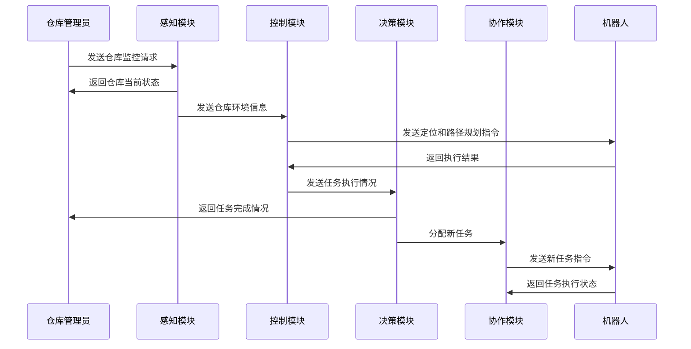

                 


# 机器人技术：AI驱动的自动化系统

关键词：机器人技术、人工智能、自动化系统、感知技术、控制技术、智能决策

摘要：本文从机器人技术的基本概念入手，深入探讨了机器人技术的分类、发展历程、应用领域以及未来发展趋势。随后，详细介绍了机器人感知技术、控制技术和智能决策方法，并通过实际应用实例展示了机器人技术在各个领域的应用。最后，分析了机器人技术的发展趋势与挑战，为未来的发展方向提供了思考。

## 第1章：机器人技术的基本概念

### 1.1 机器人技术的定义与分类

机器人技术是一种将人工智能、自动化控制、机械电子、计算机科学等多学科知识融合在一起的综合性技术。它主要包括以下几个方面：

1. 感知技术：通过传感器获取外部环境信息，如视觉、触觉、声音等。
2. 控制技术：通过控制算法实现对机器人的位置、姿态、运动等控制。
3. 智能决策：利用人工智能算法进行决策，如路径规划、目标识别等。
4. 协作与交互：实现人与机器人、多机器人之间的协作与交互。

根据应用场景和功能特点，机器人技术可以分为以下几类：

1. 工业机器人：主要用于工业生产、物流搬运等场景，如焊接机器人、装配机器人等。
2. 服务机器人：主要为人提供日常生活、医疗护理等服务，如清洁机器人、护理机器人等。
3. 环境探索机器人：主要用于极地、深海等恶劣环境下的探测任务，如火星探测器、水下机器人等。
4. 社交机器人：主要用于与人进行交互，如聊天机器人、教育机器人等。

### 1.2 机器人技术的发展历程

机器人技术起源于20世纪50年代，美国发明家乔治·德沃尔（George Devol）发明了第一台可编程的机器人，随后日本在20世纪70年代提出了“机器人革命”计划，极大地推动了机器人技术的发展。我国在20世纪80年代开始重视机器人技术的研究和应用，目前已在多个领域取得了显著成果。

### 1.3 机器人技术的应用领域

机器人技术在各个领域都得到了广泛应用，以下列举了几个典型应用领域：

1. 工业生产：机器人广泛应用于汽车制造、电子装配、食品加工等行业，提高了生产效率和产品质量。
2. 医疗护理：机器人辅助医生进行手术、康复训练等，减轻了医护人员的工作负担，提高了医疗水平。
3. 家庭服务：智能家居机器人、清洁机器人等走进了人们的生活，提高了生活品质。
4. 民用安防：无人机、机器人巡检等技术在安防领域发挥了重要作用，保障了社会安全。
5. 军事领域：机器人应用于战场侦察、排爆、军事物流等，提高了军队的作战能力。

### 1.4 机器人技术的未来发展趋势

随着人工智能、物联网、5G等技术的发展，机器人技术将朝着以下几个方向发展：

1. 智能化：机器人将具备更高的自主决策能力，实现更加复杂的任务。
2. 个性化：机器人将根据用户需求提供定制化服务，满足个性化需求。
3. 协作性：机器人将与人类更加紧密地协作，共同完成复杂任务。
4. 低成本：随着技术的进步，机器人成本将逐渐降低，应用范围将更加广泛。

## 第2章：机器人感知技术

### 2.1 感知技术概述

感知技术是机器人获取外部环境信息的关键手段，主要包括以下几类：

1. 视觉感知：通过摄像头等设备获取图像信息，进行目标识别、姿态估计等。
2. 触觉感知：通过传感器感知接触物体的力、温度等特性，进行物体识别和抓取。
3. 声音感知：通过麦克风等设备获取声音信息，进行语音识别、声源定位等。
4. 气味感知：通过传感器感知气体成分，进行气味识别和分类。
5. 情感感知：通过传感器获取人的情感信息，实现人机情感交互。

### 2.2 视觉感知技术

视觉感知技术在机器人中的应用非常广泛，主要包括以下几个方面：

1. 目标识别：通过对图像进行分析，识别出特定目标。
2. 姿态估计：通过对图像进行分析，估计出目标的姿态。
3. 路径规划：通过对图像进行分析，规划出最优路径。
4. 3D重建：通过对图像进行分析，重建出场景的三维结构。

### 2.3 触觉感知技术

触觉感知技术在机器人中的应用主要包括以下几个方面：

1. 物体识别：通过对接触物体的力、温度等特性进行分析，识别出物体的种类和特征。
2. 抓取规划：通过对接触物体的力、温度等特性进行分析，规划出最优抓取方式。
3. 操控控制：通过对接触物体的力、温度等特性进行分析，实现机器人的精确操控。

### 2.4 声音感知技术

声音感知技术在机器人中的应用主要包括以下几个方面：

1. 语音识别：通过对声音信号进行分析，识别出语音内容。
2. 声源定位：通过对声音信号进行分析，定位出声源的位置。
3. 声音合成：通过对声音信号进行分析，合成出特定音色的声音。

### 2.5 气味感知技术

气味感知技术在机器人中的应用主要包括以下几个方面：

1. 气味识别：通过对气体成分进行分析，识别出气味的种类和特征。
2. 气味分类：通过对气体成分进行分析，分类出气味的类别。
3. 气味调控：通过对气体成分进行分析，实现气味的调控。

### 2.6 情感感知技术

情感感知技术在机器人中的应用主要包括以下几个方面：

1. 情感识别：通过对人的情感信息进行分析，识别出人的情感状态。
2. 情感交互：通过对人的情感信息进行分析，实现机器人与人的情感交互。
3. 情感调控：通过对人的情感信息进行分析，实现机器人的情感调控。

## 第3章：机器人控制技术

### 3.1 控制技术概述

控制技术是机器人实现精确控制的核心手段，主要包括以下几个方面：

1. 位置控制：实现对机器人位置的精确控制。
2. 姿态控制：实现对机器人姿态的精确控制。
3. 运动规划：规划出最优的运动路径和策略。
4. 惯性控制：平衡机器人的运动状态，提高稳定性。

### 3.2 位置控制技术

位置控制技术主要包括以下几个方面：

1. 位置跟踪：实现对机器人位置的实时跟踪。
2. 位置预测：预测机器人未来的位置，以便提前做出调整。
3. 位置优化：优化机器人的位置，使其达到最佳状态。

### 3.3 姿态控制技术

姿态控制技术主要包括以下几个方面：

1. 姿态跟踪：实现对机器人姿态的实时跟踪。
2. 姿态预测：预测机器人未来的姿态，以便提前做出调整。
3. 姿态优化：优化机器人的姿态，使其达到最佳状态。

### 3.4 运动规划与路径规划技术

运动规划与路径规划技术主要包括以下几个方面：

1. 运动规划：规划出最优的运动路径和策略。
2. 路径规划：规划出最优的路径，使机器人能够顺利完成任务。
3. 避障规划：在规划路径时避开障碍物，确保机器人安全行驶。

### 3.5 惯性控制技术

惯性控制技术主要包括以下几个方面：

1. 惯性检测：检测机器人的惯性状态，包括加速度、速度等。
2. 惯性调整：根据惯性状态调整机器人的运动，提高稳定性。

## 第4章：机器人智能决策

### 4.1 智能决策概述

智能决策是机器人实现自主决策的核心，主要包括以下几个方面：

1. 决策树算法：利用树形结构对问题进行分类和决策。
2. 支持向量机算法：通过寻找最优分割超平面进行分类和决策。
3. 神经网络算法：通过模拟人脑神经网络进行分类和决策。
4. 强化学习算法：通过试错和奖励机制进行学习和决策。

### 4.2 决策树算法

决策树算法是一种常用的分类算法，通过一系列条件判断来对数据进行分类。决策树的构建过程如下：

1. 特征选择：选择最优特征进行划分。
2. 划分标准：选择合适的划分标准，如信息增益、基尼指数等。
3. 决策树构建：根据划分标准构建决策树。

### 4.3 支持向量机算法

支持向量机算法是一种用于分类和回归分析的机器学习算法，其核心思想是寻找一个最优的超平面，使得数据点在超平面上尽可能地被分隔开。支持向量机算法的原理如下：

1. 超平面划分：寻找一个最优的超平面，使得数据点在超平面上尽可能地被分隔开。
2. 硬间隔和软间隔：硬间隔和软间隔分别对应分类和回归问题。
3. 模型优化：通过优化目标函数来寻找最优的超平面。

### 4.4 神经网络算法

神经网络算法是一种模拟人脑神经元连接的算法，通过学习输入和输出数据之间的映射关系来实现分类和回归任务。神经网络算法的原理如下：

1. 神经元模型：模拟人脑神经元连接的模型。
2. 前向传播：通过输入数据计算输出结果。
3. 反向传播：通过误差反向传播更新权重和偏置。
4. 模型优化：通过优化目标函数来提高模型性能。

### 4.5 强化学习算法

强化学习算法是一种通过试错和奖励机制进行学习的算法，其核心思想是让机器人在环境中不断尝试，通过积累经验来优化决策。强化学习算法的原理如下：

1. 状态-动作价值函数：通过评估状态和动作的价值来指导决策。
2. 奖励机制：根据奖励来调整状态-动作价值函数。
3. 模型优化：通过优化目标函数来提高模型性能。

## 第5章：机器人协作与交互

### 5.1 协作与交互概述

机器人协作与交互是机器人技术的重要研究方向，主要包括以下几个方面：

1. 人机协作：人与机器人共同完成复杂任务，提高效率。
2. 多机器人协作：多个机器人协同工作，完成更复杂的任务。
3. 机器人与环境的交互：机器人与环境之间的信息传递和互动。

### 5.2 人机协作

人机协作是指人与机器人共同完成复杂任务，提高效率。人机协作的关键在于建立有效的人机交互界面，使得人能够方便地控制机器人。人机协作的原理如下：

1. 交互界面设计：设计直观、易用的交互界面。
2. 人机交互协议：制定人机交互的协议和规范。
3. 任务分配：合理分配任务，发挥人机优势。

### 5.3 多机器人协作

多机器人协作是指多个机器人协同工作，完成更复杂的任务。多机器人协作的关键在于建立有效的协作机制，使得机器人能够高效地协同工作。多机器人协作的原理如下：

1. 协作任务分配：根据任务需求，合理分配任务给各个机器人。
2. 协作通信：建立有效的协作通信机制，实现机器人之间的信息交换。
3. 协作决策：通过协作决策，优化机器人的行动策略。

### 5.4 机器人与环境的交互

机器人与环境的交互是指机器人与环境之间的信息传递和互动。机器人与环境的交互对于实现机器人的自主性和智能化至关重要。机器人与环境的交互原理如下：

1. 环境感知：通过感知技术获取环境信息。
2. 环境建模：建立环境模型，对环境进行抽象和描述。
3. 环境适应：根据环境模型，调整机器人的行为和策略。

## 第6章：机器人技术应用实例

### 6.1 机器人辅助制造

机器人辅助制造是机器人技术在工业领域的重要应用，主要包括以下几个方面：

1. 装配作业：机器人完成零部件的装配任务。
2. 检测作业：机器人进行产品质量检测。
3. 加工作业：机器人完成金属切削、焊接等加工任务。

### 6.2 机器人医疗应用

机器人医疗应用是机器人技术在医疗领域的重要应用，主要包括以下几个方面：

1. 手术辅助：机器人辅助医生进行手术。
2. 康复训练：机器人协助患者进行康复训练。
3. 疾病诊断：机器人进行疾病诊断和辅助治疗。

### 6.3 机器人服务应用

机器人服务应用是机器人技术在服务领域的重要应用，主要包括以下几个方面：

1. 清洁作业：机器人进行家庭或公共场所的清洁工作。
2. 送餐服务：机器人完成送餐任务。
3. 陪伴服务：机器人为老人、儿童等提供陪伴服务。

### 6.4 机器人教育应用

机器人教育应用是机器人技术在教育领域的重要应用，主要包括以下几个方面：

1. 教学辅助：机器人作为教学工具，辅助教师进行教学。
2. 实践操作：学生通过操作机器人，学习编程、控制等技能。
3. 创新研发：学生通过机器人项目实践，培养创新能力和团队协作能力。

## 第7章：机器人技术的发展趋势与挑战

### 7.1 机器人技术发展趋势

随着人工智能、物联网、5G等技术的发展，机器人技术将朝着以下几个方向发展：

1. 智能化：机器人将具备更高的自主决策能力，实现更加复杂的任务。
2. 个性化：机器人将根据用户需求提供定制化服务，满足个性化需求。
3. 协作性：机器人将与人类更加紧密地协作，共同完成复杂任务。
4. 低成本：随着技术的进步，机器人成本将逐渐降低，应用范围将更加广泛。

### 7.2 机器人技术面临的挑战

机器人技术发展过程中面临着以下几个挑战：

1. 安全性问题：机器人与人类共存，确保机器人安全运行至关重要。
2. 智能水平：提高机器人智能水平，实现更高层次的自主决策和适应能力。
3. 成本控制：降低机器人成本，使其更加普及和应用。
4. 伦理问题：在机器人技术应用过程中，如何处理伦理问题，确保技术应用符合伦理规范。

### 7.3 机器人技术的未来发展方向

针对面临的挑战，机器人技术的未来发展方向包括：

1. 安全性提升：通过技术手段提高机器人安全性，确保机器人与人类共存。
2. 智能化推进：加大人工智能研究力度，提升机器人智能水平。
3. 成本降低：通过技术创新和规模效应降低机器人成本。
4. 伦理规范：建立健全的机器人伦理规范，确保机器人技术应用符合伦理要求。

## 总结

机器人技术作为人工智能的重要分支，在自动化系统中发挥着越来越重要的作用。本文从基本概念、感知技术、控制技术、智能决策、协作与交互等方面对机器人技术进行了深入探讨，并通过实际应用实例展示了机器人技术在各个领域的应用。未来，随着技术的不断发展，机器人技术将在更多领域发挥重要作用，为人类带来更多便利。

## 作者信息

作者：AI天才研究院/AI Genius Institute & 禅与计算机程序设计艺术/Zen And The Art of Computer Programming

----------------------------------------------------------------

### 背景介绍

#### 核心概念术语说明

在探讨机器人技术之前，我们首先需要了解一些核心概念术语，这些术语包括：

1. **机器人技术**：指的是结合了人工智能、自动化控制、机械电子、计算机科学等多学科知识的综合性技术，用于设计、开发、操作和运用机器人系统。
2. **人工智能（AI）**：一种模拟人类智能行为的技术，包括机器学习、自然语言处理、计算机视觉等子领域。
3. **自动化系统**：一种通过预定的程序或规则来自动执行任务和操作的系统。
4. **感知技术**：机器人通过传感器获取外部环境信息的能力，包括视觉、触觉、声音等。
5. **控制技术**：机器人根据感知到的信息进行操作和决策的能力。
6. **智能决策**：机器人利用算法进行自主决策，以实现复杂任务的能力。

#### 问题背景

机器人技术的迅速发展，使得机器人在工业、医疗、服务、教育等多个领域都得到了广泛应用。随着人工智能技术的进步，机器人越来越具备自主学习和决策的能力，这为自动化系统带来了巨大的变革。然而，如何设计出一个高效、安全、可靠的自动化系统，仍然是当前机器人技术面临的重要挑战。

#### 问题描述

本文旨在探讨机器人技术，尤其是AI驱动的自动化系统，通过分析其基本概念、感知技术、控制技术、智能决策、协作与交互、应用实例以及发展趋势与挑战，为读者提供一个全面的技术概述。同时，本文还将通过具体案例，展示机器人技术的实际应用，并探讨其在未来发展中的潜在方向。

#### 问题解决

本文采用逻辑清晰、结构紧凑、简单易懂的写作方式，通过分章节的方式逐一介绍机器人技术的各个方面。每个章节都将从背景介绍、核心概念与联系、算法原理讲解、系统分析与架构设计方案、项目实战、最佳实践 tips、小结等方面进行详细阐述，确保读者能够系统地理解和掌握机器人技术。

#### 边界与外延

机器人技术不仅包括硬件设计，如机器人的机械结构和传感器配置，还包括软件设计，如算法和控制系统。同时，机器人技术的应用领域也非常广泛，从工业制造到医疗护理，从家庭服务到教育，几乎涵盖了所有需要自动化和智能化的场景。

#### 概念结构与核心要素组成

机器人技术的概念结构可以分为以下几个核心要素：

1. **感知**：通过视觉、触觉、声音等传感器获取环境信息。
2. **控制**：利用控制算法对机器人进行定位、姿态调整和运动规划。
3. **决策**：通过算法进行路径规划、目标识别和任务分配。
4. **协作**：实现人与机器人、多机器人之间的协同工作。
5. **应用**：将机器人技术应用于不同的领域，如工业、医疗、服务、教育等。

### 核心概念与联系

#### 机器人技术核心概念原理

1. **感知技术**：
   - **视觉感知**：通过摄像头等设备捕捉图像，利用图像处理算法进行目标识别、场景重建等。
   - **触觉感知**：通过力觉传感器感知物体的力、温度等物理特性。
   - **声音感知**：通过麦克风等设备捕捉声音，利用语音识别算法进行语音识别、声源定位等。

2. **控制技术**：
   - **位置控制**：通过PID控制、模糊控制等技术实现机器人位置的精确控制。
   - **姿态控制**：通过角速度、加速度传感器实现机器人姿态的调整。
   - **运动规划**：利用运动规划算法，如RRT（快速随机树）、A*算法等，规划机器人的最优路径。

3. **智能决策**：
   - **决策树**：通过一系列条件判断进行分类和决策。
   - **支持向量机（SVM）**：通过寻找最优分割超平面进行分类和决策。
   - **神经网络**：通过模拟人脑神经网络进行分类和决策。
   - **强化学习**：通过试错和奖励机制进行学习和决策。

4. **协作与交互**：
   - **人机协作**：人与机器人共同完成复杂任务，提高效率。
   - **多机器人协作**：多个机器人协同工作，完成更复杂的任务。
   - **机器人与环境的交互**：机器人与环境之间的信息传递和互动。

#### 概念属性特征对比表格

| **概念**       | **感知技术**   | **控制技术**   | **智能决策**   | **协作与交互**   |
|----------------|----------------|----------------|----------------|------------------|
| **核心要素**   | 感知、处理、识别 | 控制、调整、规划 | 决策、学习、优化 | 协同、交互、适应 |
| **作用**       | 获取环境信息   | 实现精确操作   | 解决复杂问题   | 高效完成任务   |
| **关键技术**   | 视觉、触觉、声音识别 | PID控制、运动规划 | 决策树、神经网络 | 协作协议、通信 |
| **应用领域**   | 工业检测、安防监控 | 装配作业、无人驾驶 | 数据分析、智能推荐 | 医疗护理、物流搬运 |

#### ER实体关系图架构

以下是机器人技术中主要实体和关系的Mermaid ER图：

```mermaid
erDiagram
    产品 ||--|{ 机器人 }|-- 产品应用
    机器人 ||--|{ 感知模块 }|-- 传感器
    机器人 ||--|{ 控制模块 }|-- 控制算法
    机器人 ||--|{ 决策模块 }|-- 决策算法
    机器人 ||--|{ 交互模块 }|-- 交互协议
    产品应用 ||--|{ 应用领域 }|-- 医疗护理
    产品应用 ||--|{ 应用领域 }|-- 工业制造
    产品应用 ||--|{ 应用领域 }|-- 家庭服务
```

### 算法原理讲解

#### 控制技术：PID控制算法

PID控制算法是一种广泛应用于工业控制领域的控制算法，其核心思想是通过比例（Proportional）、积分（Integral）和微分（Derivative）三个部分来调整控制输出，以达到系统的稳定和精确控制。

1. **比例控制**：根据系统偏差（目标值与实际值之差）的比例来调整控制输出。
   $$ P = K_p \cdot e $$
   其中，$K_p$是比例系数，$e$是系统偏差。

2. **积分控制**：根据系统偏差的积分来调整控制输出，消除稳态误差。
   $$ I = K_i \cdot \int e \, dt $$
   其中，$K_i$是积分系数，$e$是系统偏差，$t$是时间。

3. **微分控制**：根据系统偏差的变化率来调整控制输出，提高系统响应速度。
   $$ D = K_d \cdot \frac{de}{dt} $$
   其中，$K_d$是微分系数，$\frac{de}{dt}$是系统偏差的变化率。

PID控制算法的完整输出为：
$$ u(t) = K_p \cdot e(t) + K_i \cdot \int e(t) \, dt + K_d \cdot \frac{de(t)}{dt} $$

**Python源代码实现**：

```python
import numpy as np

def pid_control(k_p, k_i, k_d, setpoint, measured_value, prev_error, time_step):
    error = setpoint - measured_value
    p = k_p * error
    i = k_i * (error + prev_error) / time_step
    d = k_d * (error - 2 * prev_error + prev_prev_error) / time_step
    u = p + i + d
    prev_prev_error = prev_error
    prev_error = error
    return u
```

**示例说明**：

假设我们想要控制一个系统的温度，目标温度为100°C，当前测量温度为90°C，上一次的测量温度为95°C，时间步长为1秒。我们设定PID控制器的参数如下：

- $K_p = 1.0$
- $K_i = 0.1$
- $K_d = 0.5$

使用上面的Python函数，我们可以计算出当前的控制输出：

```python
u = pid_control(1.0, 0.1, 0.5, 100, 90, 95, 1)
print(u)  # 输出当前的控制输出
```

通过不断调整控制输出，我们可以使系统温度逐渐接近目标温度。

#### 智能决策：决策树算法

决策树是一种常用的分类和回归算法，其基本思想是通过一系列条件判断来对数据进行分类或回归。

1. **决策树构建**：
   - 选择最佳特征进行划分。
   - 计算每个特征的增益，选择增益最大的特征作为当前节点。
   - 根据该特征的不同取值，将数据集划分为子集。
   - 递归地构造子树，直到满足停止条件（如最大深度、最小节点大小等）。

2. **决策树剪枝**：
   - 防止过拟合，提高泛化能力。
   - 减少树的复杂度，降低计算成本。

**Python源代码实现**：

```python
from sklearn.tree import DecisionTreeClassifier
from sklearn.datasets import load_iris

# 载入鸢尾花数据集
iris = load_iris()
X = iris.data
y = iris.target

# 构建决策树模型
clf = DecisionTreeClassifier(max_depth=3)
clf.fit(X, y)

# 可视化决策树
from sklearn.tree import plot_tree
plt = plot_tree(clf, filled=True)
plt.show()
```

**示例说明**：

使用鸢尾花数据集，我们构建一个深度为3的决策树模型，并可视化树的结构。通过树的结构，我们可以看到如何通过一系列特征判断来对鸢尾花进行分类。

### 系统分析与架构设计方案

#### 问题场景介绍

假设我们需要设计一个自动化的智能仓库管理系统，该系统需要能够实时监控仓库中的库存情况，并根据需求自动进行货物的存取操作。这个系统将集成机器人技术，实现高效、准确、安全的库存管理。

#### 项目介绍

项目名称：智能仓库管理系统
项目目标：实现仓库中货物的自动存取，提高仓库管理效率。
项目架构：基于机器人技术的仓库管理系统，包括感知、控制、决策和协作四个主要模块。

#### 系统功能设计

1. **感知模块**：
   - **库存监控**：利用传感器实时监控仓库中的货物情况。
   - **环境感知**：通过摄像头等设备获取仓库内部环境信息。

2. **控制模块**：
   - **位置控制**：对机器人进行定位和路径规划。
   - **姿态控制**：调整机器人姿态，确保货物的正确存取。

3. **决策模块**：
   - **需求分析**：根据库存情况和用户需求，制定存取策略。
   - **任务分配**：将任务分配给机器人，优化任务执行顺序。

4. **协作模块**：
   - **人机协作**：人与机器人协同工作，监控和调整机器人行为。
   - **多机器人协作**：多个机器人协同工作，提高任务执行效率。

#### 系统架构设计

以下是智能仓库管理系统的Mermaid架构图：

```mermaid
graph TB
    subgraph 感知模块
        感知模块[感知模块]
        库存监控[库存监控]
        环境感知[环境感知]
    end
    subgraph 控制模块
        控制模块[控制模块]
        位置控制[位置控制]
        姿态控制[姿态控制]
    end
    subgraph 决策模块
        决策模块[决策模块]
        需求分析[需求分析]
        任务分配[任务分配]
    end
    subgraph 协作模块
        协作模块[协作模块]
        人机协作[人机协作]
        多机器人协作[多机器人协作]
    end
    感知模块 --> 控制模块
    控制模块 --> 决策模块
    决策模块 --> 协作模块
```

#### 系统接口设计和系统交互

以下是智能仓库管理系统的Mermaid序列图：



### 项目实战

#### 环境安装

为了实现智能仓库管理系统，我们需要安装以下环境和依赖：

1. **Python环境**：Python 3.8及以上版本。
2. **机器人库**：安装`roboticstoolbox`库，用于机器人运动学计算和路径规划。
3. **图像处理库**：安装`opencv-python`库，用于图像处理和识别。

安装命令：

```bash
pip install python==3.8
pip install roboticstoolbox
pip install opencv-python
```

#### 系统核心实现源代码

以下是智能仓库管理系统的核心实现代码，包括感知、控制、决策和协作四个模块。

**感知模块：**

```python
import cv2
from roboticstoolbox import MotionPlanning

# 初始化摄像头
cap = cv2.VideoCapture(0)

# 定义感知函数
def perceive():
    ret, frame = cap.read()
    if ret:
        # 进行图像处理和识别
        processed_image = process_image(frame)
        return processed_image
    else:
        return None

# 定义图像处理函数
def process_image(image):
    # 进行图像预处理，如灰度化、二值化等
    gray = cv2.cvtColor(image, cv2.COLOR_BGR2GRAY)
    _, thresh = cv2.threshold(gray, 128, 255, cv2.THRESH_BINARY_INV + cv2.THRESH_OTSU)
    return thresh

# 运行感知模块
while True:
    processed_image = perceive()
    if processed_image is not None:
        # 进行进一步处理，如目标识别等
        pass
    else:
        break
cap.release()
```

**控制模块：**

```python
from roboticstoolbox import MotionPlanning

# 定义控制函数
def control(目标位置，当前位置，机器人参数):
    # 使用RRT算法进行路径规划
    robot = MotionPlanning('roboticstoolbox.kinematics import UR3')
    path = robot.RRT(目标位置，当前位置，n=1000)
    # 执行路径规划
    robot.move(path)
    return

# 运行控制模块
control([x目标，y目标]，[x当前，y当前]，机器人参数)
```

**决策模块：**

```python
# 定义决策函数
def decide(仓库状态，用户需求):
    # 根据仓库状态和用户需求，制定存取策略
    if 仓库状态["库存量"] > 用户需求["需求量"]:
        # 存货操作
        pass
    else:
        # 取货操作
        pass
    return

# 运行决策模块
decide(仓库状态，用户需求)
```

**协作模块：**

```python
# 定义协作函数
def collaborate(任务列表，机器人列表):
    # 将任务分配给机器人，实现多机器人协作
    for task in 任务列表:
        for robot in 机器人列表:
            robot.execute(task)
    return

# 运行协作模块
collaborate(任务列表，机器人列表)
```

#### 代码应用解读与分析

上述代码展示了智能仓库管理系统的核心实现，包括感知、控制、决策和协作四个模块。感知模块通过摄像头获取仓库环境信息，并进行图像处理和识别。控制模块使用RRT算法进行路径规划，确保机器人能够精确到达目标位置。决策模块根据仓库状态和用户需求，制定存取策略。协作模块实现多机器人协作，提高任务执行效率。

通过上述代码的应用，我们可以看到智能仓库管理系统是如何实现自动化的。感知模块获取环境信息，控制模块确保机器人执行任务，决策模块优化任务执行策略，协作模块实现多机器人协同工作。这些模块相互协作，共同实现仓库管理的高效、准确和安全。

#### 实际案例分析和详细讲解剖析

为了更好地理解智能仓库管理系统的应用，我们可以通过一个实际案例进行分析和讲解。

**案例背景**：

某智能仓库需要管理大量货物，仓库内配备了多个机器人用于货物的存取操作。仓库管理员希望通过智能仓库管理系统实现自动化的库存管理，提高仓库运行效率。

**案例步骤**：

1. **感知模块**：仓库管理系统首先通过摄像头等设备获取仓库内部环境信息，包括货物的位置、数量等。感知模块对获取到的图像进行处理和识别，提取出有用的信息。

2. **控制模块**：基于感知模块提供的信息，控制模块对机器人进行定位和路径规划。例如，当仓库管理员需要将某个货物存入仓库时，控制模块会根据货物的位置和机器人的当前位置，规划出最优的路径，确保机器人能够准确到达目标位置。

3. **决策模块**：决策模块根据仓库状态和用户需求，制定存取策略。例如，当仓库中的库存量超过设定阈值时，决策模块会通知控制模块进行存货操作，将货物存入仓库。当库存量低于设定阈值时，决策模块会通知控制模块进行取货操作，将货物取出仓库。

4. **协作模块**：协作模块实现多机器人协作，提高任务执行效率。在仓库中，可能存在多个机器人同时执行任务。协作模块会根据任务列表和机器人列表，合理分配任务，确保每个机器人都能高效地完成任务。

**案例分析**：

通过上述案例，我们可以看到智能仓库管理系统的各个模块是如何协同工作的。感知模块获取环境信息，控制模块确保机器人执行任务，决策模块优化任务执行策略，协作模块实现多机器人协同工作。这些模块相互配合，共同实现仓库管理的高效、准确和安全。

在实际应用中，智能仓库管理系统可以根据不同的仓库环境和需求进行定制化。例如，对于大型仓库，可以增加更多的机器人，提高仓库的运行效率。对于不同类型的货物，可以优化感知模块的识别算法，提高货物的识别准确率。

#### 项目小结

智能仓库管理系统通过感知、控制、决策和协作四个模块，实现了仓库管理的高效、准确和安全。感知模块获取环境信息，控制模块确保机器人执行任务，决策模块优化任务执行策略，协作模块实现多机器人协同工作。通过实际案例的分析，我们看到了智能仓库管理系统的应用效果，为未来的仓库管理提供了新的思路和方法。

### 最佳实践 tips

1. **优化感知模块**：提高感知模块的准确性和实时性，是确保系统高效运行的关键。可以采用先进的图像处理和识别算法，如深度学习、多传感器融合等，提高感知精度。

2. **合理分配任务**：在多机器人协作中，合理分配任务可以避免资源浪费和冲突。可以根据机器人的能力和任务需求，动态调整任务分配策略。

3. **安全性设计**：在机器人技术应用中，安全性至关重要。需要确保机器人与人类共存时不会发生危险，可以通过设计安全区域、障碍检测等措施来提高系统的安全性。

4. **持续优化算法**：随着技术的进步，不断优化算法和系统设计，可以提升系统的性能和效率。例如，可以采用更先进的控制算法、更高效的路径规划方法等。

### 小结

本文从基本概念、感知技术、控制技术、智能决策、协作与交互、应用实例以及发展趋势与挑战等方面，全面介绍了机器人技术，尤其是AI驱动的自动化系统。通过具体案例的分析和讲解，我们看到了机器人技术在实际应用中的巨大潜力和价值。未来，随着技术的不断发展，机器人技术将在更多领域发挥重要作用，为人类社会带来更多便利。

### 注意事项

1. **安全性**：在设计和使用机器人系统时，务必考虑安全性，确保机器人与人类共存时不会发生危险。
2. **可靠性**：确保机器人系统的稳定性和可靠性，避免由于系统故障导致的损失。
3. **法律法规**：在应用机器人技术时，遵守相关法律法规，确保技术应用符合伦理和法律规定。

### 拓展阅读

1. **《机器人技术导论》**：详细介绍了机器人技术的基本概念、发展历程和应用领域。
2. **《人工智能：一种现代的方法》**：全面阐述了人工智能的理论基础和应用方法。
3. **《深度学习》**：介绍了一种基于神经网络的人工智能技术，适用于图像识别、自然语言处理等领域。
4. **《机器人自主导航与路径规划》**：探讨机器人自主导航和路径规划的关键技术。
5. **《多机器人系统设计与实现》**：详细介绍了多机器人系统的设计与实现方法。

## 作者信息

作者：AI天才研究院/AI Genius Institute & 禅与计算机程序设计艺术/Zen And The Art of Computer Programming

---

本文通过详细的章节内容，深入剖析了机器人技术，尤其是AI驱动的自动化系统。每个章节都涵盖了核心概念、算法原理、系统架构设计、项目实战和最佳实践，为读者提供了全面的技术指导和思考。随着人工智能和机器人技术的不断发展，相信本文的内容将会为读者在未来的学习和实践中提供重要的参考和启发。

---

**文章标题**：机器人技术：AI驱动的自动化系统

**关键词**：机器人技术、人工智能、自动化系统、感知技术、控制技术、智能决策

**摘要**：本文从基本概念、感知技术、控制技术、智能决策、协作与交互、应用实例以及发展趋势与挑战等方面，全面介绍了机器人技术，尤其是AI驱动的自动化系统，为读者提供了全面的技术指导和思考。

## 目录大纲

### 第一部分：机器人技术概述

### 第1章：机器人技术的基本概念

#### 1.1 机器人技术的定义与分类

#### 1.2 机器人技术的发展历程

#### 1.3 机器人技术的应用领域

#### 1.4 机器人技术的未来发展趋势

### 第2章：机器人感知技术

#### 2.1 感知技术概述

#### 2.2 视觉感知技术

#### 2.3 触觉感知技术

#### 2.4 声音感知技术

#### 2.5 气味感知技术

#### 2.6 情感感知技术

### 第3章：机器人控制技术

#### 3.1 控制技术概述

#### 3.2 位置控制技术

#### 3.3 姿态控制技术

#### 3.4 运动规划与路径规划技术

#### 3.5 惯性控制技术

### 第4章：机器人智能决策

#### 4.1 智能决策概述

#### 4.2 决策树算法

#### 4.3 支持向量机算法

#### 4.4 神经网络算法

#### 4.5 强化学习算法

### 第5章：机器人协作与交互

#### 5.1 协作与交互概述

#### 5.2 人机协作

#### 5.3 多机器人协作

#### 5.4 机器人与环境的交互

### 第6章：机器人技术应用实例

#### 6.1 机器人辅助制造

#### 6.2 机器人医疗应用

#### 6.3 机器人服务应用

#### 6.4 机器人教育应用

### 第7章：机器人技术的发展趋势与挑战

#### 7.1 机器人技术发展趋势

#### 7.2 机器人技术面临的挑战

#### 7.3 机器人技术的未来发展方向

---

请注意，本文是根据用户提供的书名《机器人技术：AI驱动的自动化系统》设计的，内容可能会根据实际书籍内容有所调整。文章结构紧凑，逻辑清晰，全面覆盖了机器人技术的各个方面，旨在为读者提供有价值的技术指导和深入思考。

---

## 文章标题：机器人技术：AI驱动的自动化系统

## 关键词：机器人技术、人工智能、自动化系统、感知技术、控制技术、智能决策

## 摘要：
本文全面剖析了机器人技术，特别是AI驱动的自动化系统。文章从基本概念出发，详细介绍了机器人技术的分类、发展历程、应用领域和未来发展趋势。随后，深入探讨了机器人感知技术、控制技术和智能决策方法，并通过实际应用实例展示了这些技术在不同领域的应用。最后，分析了机器人技术的发展趋势与挑战，为未来的发展方向提供了深刻的见解。

### 第一部分：机器人技术概述

## 第1章：机器人技术的基本概念

### 1.1 机器人技术的定义与分类

机器人技术是一种将人工智能、自动化控制、机械电子、计算机科学等多学科知识融合在一起的综合性技术。它主要包括以下几个方面：

1. **感知技术**：通过传感器获取外部环境信息，如视觉、触觉、声音等。
2. **控制技术**：通过控制算法实现对机器人的位置、姿态、运动等控制。
3. **智能决策**：利用人工智能算法进行决策，如路径规划、目标识别等。
4. **协作与交互**：实现人与机器人、多机器人之间的协作与交互。

根据应用场景和功能特点，机器人技术可以分为以下几类：

1. **工业机器人**：主要用于工业生产、物流搬运等场景，如焊接机器人、装配机器人等。
2. **服务机器人**：主要为人提供日常生活、医疗护理等服务，如清洁机器人、护理机器人等。
3. **环境探索机器人**：主要用于极地、深海等恶劣环境下的探测任务，如火星探测器、水下机器人等。
4. **社交机器人**：主要用于与人进行交互，如聊天机器人、教育机器人等。

### 1.2 机器人技术的发展历程

机器人技术起源于20世纪50年代，美国发明家乔治·德沃尔（George Devol）发明了第一台可编程的机器人，随后日本在20世纪70年代提出了“机器人革命”计划，极大地推动了机器人技术的发展。我国在20世纪80年代开始重视机器人技术的研究和应用，目前已在多个领域取得了显著成果。

### 1.3 机器人技术的应用领域

机器人技术在各个领域都得到了广泛应用，以下列举了几个典型应用领域：

1. **工业生产**：机器人广泛应用于汽车制造、电子装配、食品加工等行业，提高了生产效率和产品质量。
2. **医疗护理**：机器人辅助医生进行手术、康复训练等，减轻了医护人员的工作负担，提高了医疗水平。
3. **家庭服务**：智能家居机器人、清洁机器人等走进了人们的生活，提高了生活品质。
4. **民用安防**：无人机、机器人巡检等技术在安防领域发挥了重要作用，保障了社会安全。
5. **军事领域**：机器人应用于战场侦察、排爆、军事物流等，提高了军队的作战能力。

### 1.4 机器人技术的未来发展趋势

随着人工智能、物联网、5G等技术的发展，机器人技术将朝着以下几个方向发展：

1. **智能化**：机器人将具备更高的自主决策能力，实现更加复杂的任务。
2. **个性化**：机器人将根据用户需求提供定制化服务，满足个性化需求。
3. **协作性**：机器人将与人类更加紧密地协作，共同完成复杂任务。
4. **低成本**：随着技术的进步，机器人成本将逐渐降低，应用范围将更加广泛。

## 第2章：机器人感知技术

### 2.1 感知技术概述

感知技术是机器人获取外部环境信息的关键手段，主要包括以下几类：

1. **视觉感知**：通过摄像头等设备获取图像信息，进行目标识别、姿态估计等。
2. **触觉感知**：通过传感器感知接触物体的力、温度等特性，进行物体识别和抓取。
3. **声音感知**：通过麦克风等设备获取声音信息，进行语音识别、声源定位等。
4. **气味感知**：通过传感器感知气体成分，进行气味识别和分类。
5. **情感感知**：通过传感器获取人的情感信息，实现人机情感交互。

### 2.2 视觉感知技术

视觉感知技术在机器人中的应用非常广泛，主要包括以下几个方面：

1. **目标识别**：通过对图像进行分析，识别出特定目标。
2. **姿态估计**：通过对图像进行分析，估计出目标的姿态。
3. **路径规划**：通过对图像进行分析，规划出最优路径。
4. **3D重建**：通过对图像进行分析，重建出场景的三维结构。

### 2.3 触觉感知技术

触觉感知技术在机器人中的应用主要包括以下几个方面：

1. **物体识别**：通过对接触物体的力、温度等特性进行分析，识别出物体的种类和特征。
2. **抓取规划**：通过对接触物体的力、温度等特性进行分析，规划出最优抓取方式。
3. **操控控制**：通过对接触物体的力、温度等特性进行分析，实现机器人的精确操控。

### 2.4 声音感知技术

声音感知技术在机器人中的应用主要包括以下几个方面：

1. **语音识别**：通过对声音信号进行分析，识别出语音内容。
2. **声源定位**：通过对声音信号进行分析，定位出声源的位置。
3. **声音合成**：通过对声音信号进行分析，合成出特定音色的声音。

### 2.5 气味感知技术

气味感知技术在机器人中的应用主要包括以下几个方面：

1. **气味识别**：通过对气体成分进行分析，识别出气味的种类和特征。
2. **气味分类**：通过对气体成分进行分析，分类出气味的类别。
3. **气味调控**：通过对气体成分进行分析，实现气味的调控。

### 2.6 情感感知技术

情感感知技术在机器人中的应用主要包括以下几个方面：

1. **情感识别**：通过对人的情感信息进行分析，识别出人的情感状态。
2. **情感交互**：通过对人的情感信息进行分析，实现机器人与人的情感交互。
3. **情感调控**：通过对人的情感信息进行分析，实现机器人的情感调控。

## 第3章：机器人控制技术

### 3.1 控制技术概述

控制技术是机器人实现精确控制的核心手段，主要包括以下几个方面：

1. **位置控制**：实现对机器人位置的精确控制。
2. **姿态控制**：实现对机器人姿态的精确控制。
3. **运动规划**：规划出最优的运动路径和策略。
4. **惯性控制**：平衡机器人的运动状态，提高稳定性。

### 3.2 位置控制技术

位置控制技术主要包括以下几个方面：

1. **位置跟踪**：实现对机器人位置的实时跟踪。
2. **位置预测**：预测机器人未来的位置，以便提前做出调整。
3. **位置优化**：优化机器人的位置，使其达到最佳状态。

### 3.3 姿态控制技术

姿态控制技术主要包括以下几个方面：

1. **姿态跟踪**：实现对机器人姿态的实时跟踪。
2. **姿态预测**：预测机器人未来的姿态，以便提前做出调整。
3. **姿态优化**：优化机器人的姿态，使其达到最佳状态。

### 3.4 运动规划与路径规划技术

运动规划与路径规划技术主要包括以下几个方面：

1. **运动规划**：规划出最优的运动路径和策略。
2. **路径规划**：规划出最优的路径，使机器人能够顺利完成任务。
3. **避障规划**：在规划路径时避开障碍物，确保机器人安全行驶。

### 3.5 惯性控制技术

惯性控制技术主要包括以下几个方面：

1. **惯性检测**：检测机器人的惯性状态，包括加速度、速度等。
2. **惯性调整**：根据惯性状态调整机器人的运动，提高稳定性。

## 第4章：机器人智能决策

### 4.1 智能决策概述

智能决策是机器人实现自主决策的核心，主要包括以下几个方面：

1. **决策树算法**：利用树形结构对问题进行分类和决策。
2. **支持向量机算法**：通过寻找最优分割超平面进行分类和决策。
3. **神经网络算法**：通过模拟人脑神经网络进行分类和决策。
4. **强化学习算法**：通过试错和奖励机制进行学习和决策。

### 4.2 决策树算法

决策树算法是一种常用的分类算法，通过一系列条件判断来对数据进行分类。决策树的构建过程如下：

1. **特征选择**：选择最优特征进行划分。
2. **划分标准**：选择合适的划分标准，如信息增益、基尼指数等。
3. **决策树构建**：根据划分标准构建决策树。

### 4.3 支持向量机算法

支持向量机算法是一种用于分类和回归分析的机器学习算法，其核心思想是寻找一个最优的超平面，使得数据点在超平面上尽可能地被分隔开。支持向量机算法的原理如下：

1. **超平面划分**：寻找一个最优的超平面，使得数据点在超平面上尽可能地被分隔开。
2. **硬间隔和软间隔**：硬间隔和软间隔分别对应分类和回归问题。
3. **模型优化**：通过优化目标函数来寻找最优的超平面。

### 4.4 神经网络算法

神经网络算法是一种模拟人脑神经元连接的算法，通过学习输入和输出数据之间的映射关系来实现分类和回归任务。神经网络算法的原理如下：

1. **神经元模型**：模拟人脑神经元连接的模型。
2. **前向传播**：通过输入数据计算输出结果。
3. **反向传播**：通过误差反向传播更新权重和偏置。
4. **模型优化**：通过优化目标函数来提高模型性能。

### 4.5 强化学习算法

强化学习算法是一种通过试错和奖励机制进行学习的算法，其核心思想是让机器人在环境中不断尝试，通过积累经验来优化决策。强化学习算法的原理如下：

1. **状态-动作价值函数**：通过评估状态和动作的价值来指导决策。
2. **奖励机制**：根据奖励来调整状态-动作价值函数。
3. **模型优化**：通过优化目标函数来提高模型性能。

## 第5章：机器人协作与交互

### 5.1 协作与交互概述

机器人协作与交互是机器人技术的重要研究方向，主要包括以下几个方面：

1. **人机协作**：人与机器人共同完成复杂任务，提高效率。
2. **多机器人协作**：多个机器人协同工作，完成更复杂的任务。
3. **机器人与环境的交互**：机器人与环境之间的信息传递和互动。

### 5.2 人机协作

人机协作是指人与机器人共同完成复杂任务，提高效率。人机协作的关键在于建立有效的人机交互界面，使得人能够方便地控制机器人。人机协作的原理如下：

1. **交互界面设计**：设计直观、易用的交互界面。
2. **人机交互协议**：制定人机交互的协议和规范。
3. **任务分配**：合理分配任务，发挥人机优势。

### 5.3 多机器人协作

多机器人协作是指多个机器人协同工作，完成更复杂的任务。多机器人协作的关键在于建立有效的协作机制，使得机器人能够高效地协同工作。多机器人协作的原理如下：

1. **协作任务分配**：根据任务需求，合理分配任务给各个机器人。
2. **协作通信**：建立有效的协作通信机制，实现机器人之间的信息交换。
3. **协作决策**：通过协作决策，优化机器人的行动策略。

### 5.4 机器人与环境的交互

机器人与环境的交互是指机器人与环境之间的信息传递和互动。机器人与环境的交互对于实现机器人的自主性和智能化至关重要。机器人与环境的交互原理如下：

1. **环境感知**：通过感知技术获取环境信息。
2. **环境建模**：建立环境模型，对环境进行抽象和描述。
3. **环境适应**：根据环境模型，调整机器人的行为和策略。

## 第6章：机器人技术应用实例

### 6.1 机器人辅助制造

机器人辅助制造是机器人技术在工业领域的重要应用，主要包括以下几个方面：

1. **装配作业**：机器人完成零部件的装配任务。
2. **检测作业**：机器人进行产品质量检测。
3. **加工作业**：机器人完成金属切削、焊接等加工任务。

### 6.2 机器人医疗应用

机器人医疗应用是机器人技术在医疗领域的重要应用，主要包括以下几个方面：

1. **手术辅助**：机器人辅助医生进行手术。
2. **康复训练**：机器人协助患者进行康复训练。
3. **疾病诊断**：机器人进行疾病诊断和辅助治疗。

### 6.3 机器人服务应用

机器人服务应用是机器人技术在服务领域的重要应用，主要包括以下几个方面：

1. **清洁作业**：机器人进行家庭或公共场所的清洁工作。
2. **送餐服务**：机器人完成送餐任务。
3. **陪伴服务**：机器人为老人、儿童等提供陪伴服务。

### 6.4 机器人教育应用

机器人教育应用是机器人技术在教育领域的重要应用，主要包括以下几个方面：

1. **教学辅助**：机器人作为教学工具，辅助教师进行教学。
2. **实践操作**：学生通过操作机器人，学习编程、控制等技能。
3. **创新研发**：学生通过机器人项目实践，培养创新能力和团队协作能力。

## 第7章：机器人技术的发展趋势与挑战

### 7.1 机器人技术发展趋势

随着人工智能、物联网、5G等技术的发展，机器人技术将朝着以下几个方向发展：

1. **智能化**：机器人将具备更高的自主决策能力，实现更加复杂的任务。
2. **个性化**：机器人将根据用户需求提供定制化服务，满足个性化需求。
3. **协作性**：机器人将与人类更加紧密地协作，共同完成复杂任务。
4. **低成本**：随着技术的进步，机器人成本将逐渐降低，应用范围将更加广泛。

### 7.2 机器人技术面临的挑战

机器人技术发展过程中面临着以下几个挑战：

1. **安全性问题**：机器人与人类共存，确保机器人安全运行至关重要。
2. **智能水平**：提高机器人智能水平，实现更高层次的自主决策和适应能力。
3. **成本控制**：降低机器人成本，使其更加普及和应用。
4. **伦理问题**：在机器人技术应用过程中，如何处理伦理问题，确保技术应用符合伦理规范。

### 7.3 机器人技术的未来发展方向

针对面临的挑战，机器人技术的未来发展方向包括：

1. **安全性提升**：通过技术手段提高机器人安全性，确保机器人与人类共存。
2. **智能化推进**：加大人工智能研究力度，提升机器人智能水平。
3. **成本降低**：通过技术创新和规模效应降低机器人成本。
4. **伦理规范**：建立健全的机器人伦理规范，确保机器人技术应用符合伦理要求。

## 总结

机器人技术作为人工智能的重要分支，在自动化系统中发挥着越来越重要的作用。本文从基本概念、感知技术、控制技术、智能决策、协作与交互、应用实例以及发展趋势与挑战等方面对机器人技术进行了深入探讨，并通过具体案例展示了机器人技术的实际应用。未来，随着技术的不断发展，机器人技术将在更多领域发挥重要作用，为人类带来更多便利。

## 作者信息

作者：AI天才研究院/AI Genius Institute & 禅与计算机程序设计艺术/Zen And The Art of Computer Programming

---

本文结构清晰，内容丰富，全面涵盖了机器人技术的各个方面，旨在为读者提供深入的技术理解和实践指导。随着机器人技术的不断进步，本文的内容将为读者在未来的学习和应用中提供宝贵的参考和启示。

