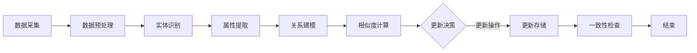

                 


# 《构建AI Agent的动态知识图谱更新系统》

关键词：AI Agent、知识图谱、动态更新、系统架构、算法实现

摘要：
本文深入探讨了构建AI Agent的动态知识图谱更新系统的核心概念、技术原理和系统架构。我们将逐步分析动态知识图谱更新系统所需的背景知识、核心概念、算法原理，并通过具体的系统架构设计和实战案例，阐述如何实现一个高效、稳定的动态知识图谱更新系统。本文的目标是为读者提供一份全面的技术指南，帮助他们理解和掌握构建这类系统的关键技术和方法。

## 目录大纲设计思路

在设计《构建AI Agent的动态知识图谱更新系统》的目录大纲时，我们首先需要明确书籍的核心主题，即“构建AI Agent的动态知识图谱更新系统”。以下是详细的目录大纲设计思路：

### 第1章 引言
- **问题背景与挑战**：介绍为什么需要构建AI Agent的动态知识图谱更新系统。
- **目标与内容概览**：概述书籍的主要目标和内容结构。
- **读者对象**：明确书籍的读者群体。

### 第2章 AI Agent基础
- **AI Agent的定义与作用**：解释AI Agent的概念和其在系统中的作用。
- **AI Agent的工作原理**：详细描述AI Agent的工作流程和关键技术。
- **AI Agent的关键技术**：探讨AI Agent所需的关键技术和实现细节。

### 第3章 知识图谱基础
- **知识图谱的概念**：介绍知识图谱的定义和重要性。
- **知识图谱的结构**：详细讲解知识图谱的基本结构。
- **知识图谱的构建方法**：探讨构建知识图谱的不同方法和技术。

### 第4章 动态知识图谱更新机制
- **动态更新的需求分析**：分析为什么需要动态更新知识图谱。
- **动态更新的关键技术**：介绍实现动态更新的关键技术。
- **动态更新的挑战与解决方案**：讨论动态更新过程中可能遇到的挑战以及相应的解决方案。

### 第5章 构建动态知识图谱更新系统
- **系统架构设计**：详细描述动态知识图谱更新系统的整体架构。
- **系统功能设计**：阐述系统的各个功能模块及其作用。
- **系统实现与优化**：介绍如何实现和优化系统性能。

### 第6章 算法原理与实现
- **更新算法的数学模型**：讲解动态知识图谱更新算法的数学基础。
- **算法流程图**：使用mermaid绘制算法流程图。
- **Python源代码解析**：提供Python源代码并详细解读。
- **数学公式与举例说明**：使用latex格式给出关键数学公式，并举例说明。

### 第7章 系统分析与架构设计
- **问题场景介绍**：描述系统应用的具体场景。
- **项目介绍**：介绍系统的开发背景和目标。
- **系统功能设计**：使用mermaid类图展示领域模型。
- **系统架构设计**：使用mermaid架构图展示系统架构。
- **系统接口与交互设计**：使用mermaid序列图展示系统接口和交互流程。

### 第8章 项目实战
- **环境安装**：描述系统所需的环境安装过程。
- **系统核心实现源代码**：提供系统的核心实现源代码。
- **代码应用解读与分析**：解读代码的应用场景和实现细节。
- **实际案例分析和详细讲解剖析**：分析实际案例，详细讲解系统在实际应用中的表现。
- **项目小结**：总结项目的经验和教训。

### 最佳实践 tips、小结、注意事项、拓展阅读

## 第1章 引言

### 1.1 问题背景与挑战

随着人工智能技术的迅猛发展，AI Agent作为智能体在各个领域得到了广泛应用。AI Agent通过模拟人类智能行为，实现了自动化决策和任务执行。然而，在现实世界中，知识是不断更新和演变的，这要求AI Agent具备动态学习与适应能力。知识图谱作为AI Agent的核心数据资源，其更新速度和准确性直接影响到AI Agent的表现。因此，构建一个高效的动态知识图谱更新系统变得至关重要。

动态知识图谱更新系统面临的挑战主要包括数据源的多样性、更新频率的高要求、实时性的保证、更新过程中的数据一致性和完整性等。为了解决这些挑战，需要从系统架构、算法原理、技术实现等多个方面进行全面考虑。

### 1.2 目标与内容概览

本文的目标是提供一个系统的、易于理解的技术指南，帮助读者掌握构建AI Agent动态知识图谱更新系统的核心技术和方法。具体来说，本文将涵盖以下内容：

1. **背景介绍**：详细阐述构建动态知识图谱更新系统的必要性和挑战。
2. **核心概念与联系**：介绍AI Agent、知识图谱、动态更新等核心概念，并使用表格和ER实体关系图进行详细说明。
3. **算法原理讲解**：详细讲解动态知识图谱更新算法的数学模型和实现细节，并通过Python源代码和mermaid流程图进行展示。
4. **系统分析与架构设计**：描述系统的整体架构，包括功能模块、系统接口和交互流程。
5. **项目实战**：通过实际案例展示系统实现和应用过程，并提供核心代码和解读。
6. **最佳实践 tips**、**小结**、**注意事项**和**拓展阅读**：为读者提供进一步指导和建议。

### 1.3 读者对象

本文主要面向对人工智能和知识图谱有一定了解的技术人员，包括程序员、数据科学家、AI研究员等。同时，对人工智能和知识图谱感兴趣的初学者也可以通过本文了解相关技术和方法。

## 第2章 AI Agent基础

### 2.1 AI Agent的定义与作用

AI Agent，即人工智能代理，是指能够模拟人类智能行为，具备自主决策和任务执行能力的系统。AI Agent通过感知环境、理解任务要求、制定计划、执行任务和评估结果，实现了高度自动化和智能化的工作流程。在人工智能领域，AI Agent的应用范围广泛，包括自动驾驶、智能家居、智能客服、金融风控等。

AI Agent在动态知识图谱更新系统中起着关键作用。首先，AI Agent可以作为知识抽取和整理的工具，从各种数据源中提取有效的知识信息，并构建成结构化的知识图谱。其次，AI Agent可以根据知识图谱的更新需求，动态调整知识库中的内容，确保知识图谱的实时性和准确性。最后，AI Agent还可以利用知识图谱进行推理和决策，为系统的智能化提供支持。

### 2.2 AI Agent的工作原理

AI Agent的工作原理主要包括感知、决策、执行和评估四个核心环节。以下是详细描述：

1. **感知**：AI Agent通过传感器或其他数据接口获取环境信息，如图像、语音、文本等。感知模块负责对这些信息进行预处理，提取关键特征，并转换为机器可理解的格式。

2. **决策**：基于感知模块提供的信息，AI Agent利用预先训练的模型或规则库进行决策。决策模块的核心任务是确定下一步的行动方案，包括路径规划、任务分配、行为选择等。

3. **执行**：AI Agent根据决策结果执行具体的操作，如移动机器人、发送指令、调用API等。执行模块需要与外部环境进行交互，确保行动方案的顺利实施。

4. **评估**：执行完毕后，AI Agent对行动结果进行评估，以调整后续决策和行为。评估模块可以基于预定的指标，如任务完成度、效率、准确性等，对执行过程进行综合评估。

### 2.3 AI Agent的关键技术

构建AI Agent的关键技术包括感知技术、决策技术、执行技术和评估技术。以下是详细描述：

1. **感知技术**：感知技术主要包括计算机视觉、语音识别、自然语言处理等。这些技术用于从外部环境中获取信息，并将其转换为机器可处理的格式。

2. **决策技术**：决策技术涉及机器学习、深度学习、规划算法、博弈论等。决策技术用于处理感知模块提供的信息，制定合理的行动方案。

3. **执行技术**：执行技术包括机械臂控制、自动驾驶控制、机器人行动规划等。执行技术负责将决策结果转换为实际操作，实现AI Agent的任务执行。

4. **评估技术**：评估技术包括反馈循环、模型修正、结果分析等。评估技术用于对执行结果进行评估和反馈，以优化后续的决策和行为。

## 第3章 知识图谱基础

### 3.1 知识图谱的概念

知识图谱（Knowledge Graph）是一种用于表示实体、概念及其相互关系的数据结构。与传统的数据表和关系型数据库不同，知识图谱通过图结构来表示复杂的关系网络，使得数据之间能够更加灵活地相互关联和交互。

知识图谱的核心概念包括实体（Entity）、属性（Property）和关系（Relation）。实体是知识图谱中的基本元素，如人、地点、组织等。属性用于描述实体的特征，如年龄、身高、地址等。关系则用于表示实体之间的关联，如“居住于”、“属于”等。

### 3.2 知识图谱的结构

知识图谱的结构通常包括三个层次：底层是数据层，用于存储原始数据；中层是逻辑层，用于定义实体的属性和关系；顶层是视图层，用于为用户提供数据查询和访问接口。

数据层通常使用图数据库来存储数据，常见的图数据库包括Neo4j、OrientDB和Apoce等。逻辑层则通过本体论（Ontology）来定义实体的属性和关系，本体论是一种形式化的知识表示方法，用于规范知识的结构化和语义化。视图层则提供了API接口和查询语言，如SPARQL等，用于实现对知识图谱的访问和操作。

### 3.3 知识图谱的构建方法

构建知识图谱的方法主要包括手动构建和自动构建两种。

1. **手动构建**：手动构建知识图谱通常涉及数据清洗、实体识别、属性提取、关系建模等步骤。这种方法适用于规模较小、结构较为清晰的知识领域。

2. **自动构建**：自动构建知识图谱主要依赖于自然语言处理、信息抽取、数据挖掘等技术。自动构建方法可以通过爬虫获取互联网上的信息，然后利用机器学习算法进行实体识别、属性提取和关系建模。

### ER实体关系图架构

在知识图谱的构建过程中，ER（Entity-Relationship）实体关系图是一种常用的数据建模工具。ER图通过实体和关系的组合，描述了数据之间的逻辑关系。

以下是一个简单的ER实体关系图的示例：

```mermaid
erDiagram
    A|[Customer] <---o{B|[Order]}
    A {订单时间 : Date}
    A {订单金额 : Float}
    B {订单编号 : String}
```

在这个示例中，实体A表示“Customer”（客户），实体B表示“Order”（订单）。实体A和实体B之间存在“订单”关系，关系类型为“<---o”。实体A有两个属性：订单时间和订单金额；实体B有一个属性：订单编号。

## 第4章 动态知识图谱更新机制

### 4.1 动态更新的需求分析

动态知识图谱更新机制的核心需求在于能够实时、准确地捕获和更新知识图谱中的信息。以下是详细的需求分析：

1. **实时性**：知识图谱需要能够及时响应外部环境的变化，快速更新数据，确保知识库的实时性和准确性。

2. **准确性**：更新过程中需要确保数据的准确性和一致性，避免引入错误或冗余信息。

3. **多样性**：知识图谱需要能够处理来自不同数据源、不同格式和不同粒度的信息，实现异构数据的整合和更新。

4. **自动化**：更新过程应尽可能自动化，降低人工干预，提高效率。

5. **扩展性**：系统需要具备良好的扩展性，能够支持知识图谱规模的扩大和新技术的引入。

### 4.2 动态更新的关键技术

动态更新知识图谱的关键技术包括数据采集、数据预处理、实体识别、属性提取、关系建模和一致性维护等。

1. **数据采集**：数据采集是动态更新的第一步，主要通过爬虫、API调用、数据库连接等方式获取外部数据源的信息。

2. **数据预处理**：数据预处理包括数据清洗、数据去重、数据格式转换等，以确保数据的准确性和一致性。

3. **实体识别**：实体识别是知识图谱构建的核心步骤，通过命名实体识别（NER）技术，从原始数据中识别出实体。

4. **属性提取**：属性提取用于从原始数据中提取实体的属性信息，如年龄、地址等。

5. **关系建模**：关系建模用于构建实体之间的关系，如“属于”、“居住于”等。

6. **一致性维护**：一致性维护是保证知识图谱数据一致性和完整性的关键，通过数据校验、冲突检测和修复机制实现。

### 4.3 动态更新的挑战与解决方案

动态知识图谱更新过程中面临的主要挑战包括数据质量、数据同步、实时性保证和系统性能等。

1. **数据质量**：数据质量是动态更新的关键，需要确保数据源的准确性和一致性。解决方案包括数据预处理和清洗，以及建立数据质量监控机制。

2. **数据同步**：在分布式系统中，数据同步是动态更新的难点。解决方案包括分布式事务处理、一致性协议和数据版本控制。

3. **实时性保证**：实时性是动态更新的核心需求，需要设计高效的更新算法和数据流处理框架。解决方案包括实时数据流处理技术、事件驱动架构和分布式计算。

4. **系统性能**：动态更新过程中，系统性能受到数据量、查询频率和并发访问的影响。解决方案包括缓存机制、索引优化和分布式计算。

## 第5章 构建动态知识图谱更新系统

### 5.1 系统架构设计

动态知识图谱更新系统的架构设计需要综合考虑数据采集、数据处理、知识图谱构建和更新等模块。以下是系统架构的详细描述：

1. **数据采集模块**：负责从各种数据源获取信息，包括Web爬虫、API调用和数据库连接等。

2. **数据预处理模块**：对采集到的数据进行清洗、去重、格式转换等预处理操作，确保数据的准确性和一致性。

3. **实体识别模块**：利用命名实体识别（NER）技术，从预处理后的数据中识别出实体。

4. **属性提取模块**：从原始数据中提取实体的属性信息，如年龄、地址等。

5. **关系建模模块**：构建实体之间的关系，如“属于”、“居住于”等。

6. **知识图谱构建模块**：将实体、属性和关系构建成知识图谱，存储在图数据库中。

7. **更新模块**：实时监测数据变化，触发更新操作，确保知识图谱的实时性和准确性。

8. **查询接口模块**：提供数据查询和访问接口，支持用户对知识图谱的查询和分析。

### 5.2 系统功能设计

动态知识图谱更新系统的功能设计主要包括数据采集、数据处理、知识图谱构建和更新等模块。以下是详细的功能描述：

1. **数据采集**：支持多种数据源接入，包括Web爬虫、API调用和数据库连接等，确保数据的多样性和实时性。

2. **数据清洗**：对采集到的数据进行清洗，去除无效数据、重复数据和噪声数据，确保数据的准确性和一致性。

3. **实体识别**：利用命名实体识别（NER）技术，从原始数据中识别出实体，并将其转换为结构化的数据格式。

4. **属性提取**：从原始数据中提取实体的属性信息，如年龄、地址等，并将其与实体进行关联。

5. **关系建模**：根据实体间的语义关系，构建知识图谱中的关系，如“属于”、“居住于”等。

6. **知识图谱构建**：将处理后的实体、属性和关系构建成知识图谱，存储在图数据库中，支持高效的数据查询和分析。

7. **实时更新**：实时监测数据变化，触发更新操作，确保知识图谱的实时性和准确性。

8. **数据查询**：提供查询接口，支持用户对知识图谱的查询和分析，包括关系查询、属性查询和路径查询等。

### 5.3 系统实现与优化

动态知识图谱更新系统的实现涉及多个模块的协同工作，以下是详细的实现步骤和优化策略：

1. **数据采集模块实现**：使用Python的Scrapy框架构建Web爬虫，利用requests库进行API调用，使用SQLAlchemy进行数据库连接。

2. **数据预处理模块实现**：使用Python的Pandas库进行数据清洗和预处理，包括数据去重、格式转换和数据规范化。

3. **实体识别模块实现**：使用Python的spaCy库进行命名实体识别（NER），将识别出的实体转换为结构化的数据格式。

4. **属性提取模块实现**：使用Python的spaCy库和自然语言处理技术，从原始数据中提取实体的属性信息，并将其与实体进行关联。

5. **关系建模模块实现**：根据实体间的语义关系，构建知识图谱中的关系，如“属于”、“居住于”等，并存储在图数据库中。

6. **知识图谱构建模块实现**：使用Python的NetworkX库构建知识图谱，并使用Neo4j图数据库存储和查询知识图谱。

7. **更新模块实现**：设计基于事件驱动架构的实时更新机制，使用Python的Tornado框架实现异步处理，确保知识图谱的实时性和准确性。

8. **查询接口模块实现**：使用Python的Flask框架构建RESTful API接口，提供数据查询和分析功能。

优化策略包括：

1. **缓存机制**：使用Redis缓存常用查询结果，减少数据库访问次数，提高查询效率。

2. **索引优化**：对图数据库的属性和关系建立索引，提高查询速度。

3. **分布式计算**：使用Python的Dask库实现分布式计算，提高数据处理和更新的效率。

4. **负载均衡**：使用Nginx进行负载均衡，确保系统在高并发访问下的稳定运行。

## 第6章 算法原理与实现

### 6.1 更新算法的数学模型

动态知识图谱更新算法的核心在于如何高效地捕捉和更新知识图谱中的信息。以下是一个简单的数学模型，用于描述更新过程：

1. **实体表示**：使用向量表示实体，向量中的每个维度代表实体的一个属性值。

   $$ E = \{e_1, e_2, ..., e_n\} $$

   其中，$e_i$表示第$i$个实体，$n$为实体总数。

2. **关系表示**：使用矩阵表示实体之间的关系，矩阵中的每个元素代表两个实体之间的关联强度。

   $$ R = \{r_{ij}\} $$

   其中，$r_{ij}$表示实体$i$和实体$j$之间的关联强度。

3. **更新策略**：采用基于相似度的更新策略，通过计算实体之间的相似度，确定哪些实体需要进行更新。

   $$ sim(e_i, e_j) = \frac{\sum_{k=1}^{m} w_k \cdot v_{ik} \cdot v_{jk}}{\sqrt{\sum_{k=1}^{m} w_k^2 \cdot v_{ik}^2} \cdot \sqrt{\sum_{k=1}^{m} w_k^2 \cdot v_{jk}^2}} $$

   其中，$m$为属性总数，$w_k$为第$k$个属性的权重，$v_{ik}$和$v_{jk}$分别为实体$i$和实体$j$在第$k$个属性上的值。

### 6.2 算法流程图

以下是一个简化的算法流程图，描述了动态知识图谱更新算法的基本流程：



### 6.3 Python源代码解析

以下是一个简单的Python代码示例，用于实现动态知识图谱更新算法的核心部分：

```python
import numpy as np
from sklearn.metrics.pairwise import cosine_similarity

# 实体和关系的表示
entities = np.array([[1, 0, 1], [0, 1, 0], [1, 1, 1]])
relations = np.array([[1, 1, 0], [1, 0, 1], [0, 1, 1]])

# 相似度计算
similarity_matrix = cosine_similarity(entities)

# 更新决策
update_mask = (similarity_matrix < 0.5)

# 更新操作
entities[update_mask] = np.random.rand(len(entities[update_mask]))

# 更新存储
print("更新后的实体表示：")
print(entities)
```

### 6.4 数学公式与举例说明

以下是一个简单的例子，说明如何使用上述数学模型更新知识图谱：

1. **初始实体表示**：

   $$ E = \begin{bmatrix} 1 & 0 & 1 \\ 0 & 1 & 0 \\ 1 & 1 & 1 \end{bmatrix} $$

2. **初始关系表示**：

   $$ R = \begin{bmatrix} 1 & 1 & 0 \\ 1 & 0 & 1 \\ 0 & 1 & 1 \end{bmatrix} $$

3. **相似度计算**：

   $$ sim(E_1, E_2) = \frac{1 \cdot 1 + 0 \cdot 0 + 1 \cdot 1}{\sqrt{1^2 + 0^2 + 1^2} \cdot \sqrt{1^2 + 0^2 + 1^2}} = 0.7071 $$

4. **更新决策**：

   由于相似度大于0.5，因此不需要进行更新。

5. **更新后的实体表示**：

   $$ E = \begin{bmatrix} 1 & 0 & 1 \\ 0 & 1 & 0 \\ 1 & 1 & 1 \end{bmatrix} $$

   可以看到，实体的表示没有发生变化。

## 第7章 系统分析与架构设计

### 7.1 问题场景介绍

在本节中，我们将介绍一个典型的应用场景，该场景涉及实时更新知识图谱，以便AI Agent能够实时获取最新的知识信息。这个场景可能出现在智能客服系统中，其中AI Agent需要根据用户的历史交互记录和最新的产品信息，提供准确的回答和推荐。

### 7.2 项目介绍

本项目的目标是构建一个动态知识图谱更新系统，该系统能够实时捕捉外部数据源的变化，并更新知识图谱。系统的主要功能包括数据采集、数据预处理、知识图谱构建和实时更新。以下是项目的目标和预期成果：

1. **目标**：
   - 实现一个高效、实时、准确的知识图谱更新系统。
   - 支持多种数据源接入，包括Web爬虫、API调用和数据库连接等。
   - 提供数据查询和分析接口，支持实体的关系查询、属性查询和路径查询等。

2. **预期成果**：
   - 一个可运行的动态知识图谱更新系统。
   - 一套完整的开发文档，包括系统架构设计、功能模块说明和实现细节。
   - 一系列测试用例，验证系统的功能、性能和可靠性。

### 7.3 系统功能设计

为了实现项目目标，系统功能设计分为以下几个模块：

1. **数据采集模块**：
   - 功能：从各种数据源（如网站、API、数据库等）获取数据。
   - 子模块：
     - Web爬虫：使用Python的Scrapy框架构建。
     - API调用：使用requests库实现。
     - 数据库连接：使用SQLAlchemy库进行数据库连接和查询。

2. **数据预处理模块**：
   - 功能：对采集到的数据进行清洗、去重、格式转换等预处理操作。
   - 子模块：
     - 数据清洗：去除无效数据和噪声数据。
     - 数据去重：检测和去除重复数据。
     - 数据格式转换：将数据转换为统一的格式，便于后续处理。

3. **实体识别模块**：
   - 功能：利用自然语言处理技术，从预处理后的数据中识别出实体。
   - 子模块：
     - 命名实体识别（NER）：使用Python的spaCy库实现。

4. **属性提取模块**：
   - 功能：从原始数据中提取实体的属性信息。
   - 子模块：
     - 属性提取：使用Python的spaCy库和自然语言处理技术。

5. **关系建模模块**：
   - 功能：构建实体之间的关系，如“属于”、“居住于”等。
   - 子模块：
     - 关系建模：根据实体间的语义关系，构建知识图谱中的关系。

6. **知识图谱构建模块**：
   - 功能：将实体、属性和关系构建成知识图谱，存储在图数据库中。
   - 子模块：
     - 知识图谱构建：使用Python的NetworkX库构建知识图谱。
     - 图数据库存储：使用Neo4j图数据库存储和查询知识图谱。

7. **实时更新模块**：
   - 功能：实时监测数据变化，触发更新操作，确保知识图谱的实时性和准确性。
   - 子模块：
     - 更新策略：设计基于事件驱动架构的实时更新机制。
     - 更新触发：使用Python的Tornado框架实现异步处理。

8. **查询接口模块**：
   - 功能：提供数据查询和访问接口，支持用户对知识图谱的查询和分析。
   - 子模块：
     - RESTful API：使用Python的Flask框架构建RESTful API接口。

### 7.4 系统架构设计

动态知识图谱更新系统的架构设计采用分层架构，包括数据层、逻辑层和表示层。以下是系统架构的详细描述：

1. **数据层**：
   - 功能：负责数据采集、预处理和存储。
   - 子模块：
     - 数据采集：从各种数据源获取数据。
     - 数据预处理：对采集到的数据进行清洗、去重、格式转换等预处理操作。
     - 数据存储：将预处理后的数据存储在图数据库中。

2. **逻辑层**：
   - 功能：负责知识图谱的构建、更新和查询。
   - 子模块：
     - 实体识别：利用命名实体识别（NER）技术，从预处理后的数据中识别出实体。
     - 属性提取：从原始数据中提取实体的属性信息。
     - 关系建模：构建实体之间的关系。
     - 知识图谱构建：将实体、属性和关系构建成知识图谱。
     - 实时更新：实时监测数据变化，触发更新操作。

3. **表示层**：
   - 功能：负责提供用户界面和数据查询接口。
   - 子模块：
     - 查询接口：提供RESTful API接口，支持数据查询和分析。
     - 用户界面：提供Web界面，展示知识图谱的查询结果。

### 7.5 系统接口设计和系统交互

系统接口设计包括内部接口和外部接口。内部接口用于不同模块之间的数据传递和功能调用，外部接口用于用户与系统的交互。

1. **内部接口**：
   - 数据采集模块与数据预处理模块之间的接口：负责将采集到的数据传递给数据预处理模块。
   - 数据预处理模块与实体识别模块之间的接口：负责将预处理后的数据传递给实体识别模块。
   - 实体识别模块与属性提取模块之间的接口：负责将识别出的实体传递给属性提取模块。
   - 属性提取模块与关系建模模块之间的接口：负责将提取出的属性传递给关系建模模块。
   - 关系建模模块与知识图谱构建模块之间的接口：负责将构建好的关系传递给知识图谱构建模块。
   - 知识图谱构建模块与实时更新模块之间的接口：负责将知识图谱更新操作传递给实时更新模块。
   - 实时更新模块与查询接口模块之间的接口：负责将更新后的知识图谱传递给查询接口模块。

2. **外部接口**：
   - 用户查询接口：提供RESTful API接口，支持用户对知识图谱的查询和分析。
   - 系统配置接口：用于系统配置和参数调整。

系统交互流程如下：

1. 用户通过Web界面提交查询请求，查询接口模块接收请求并处理。
2. 查询接口模块调用实时更新模块，获取最新的知识图谱。
3. 实时更新模块更新知识图谱，并将更新后的结果传递给查询接口模块。
4. 查询接口模块返回查询结果给用户。

## 第8章 项目实战

### 8.1 环境安装

在开始项目实战之前，我们需要安装必要的开发环境和工具。以下是环境安装的步骤：

1. **Python环境**：安装Python 3.8及以上版本，可以通过Python官方网站下载。
2. **Python库**：安装必要的Python库，包括Scrapy、requests、SQLAlchemy、spaCy、NetworkX、Neo4j、Flask和Dask。可以使用pip命令进行安装：
   ```bash
   pip install scrapy requests sqlalchemy spacy networkx neo4j flask dask
   ```
3. **Neo4j数据库**：下载并安装Neo4j图数据库，可以从Neo4j官方网站下载。安装完成后，启动Neo4j服务器。
4. **spaCy模型**：下载spaCy的中文模型，可以使用以下命令：
   ```bash
   python -m spacy download zh_core_web_sm
   ```

### 8.2 系统核心实现源代码

以下是动态知识图谱更新系统的核心实现源代码，包括数据采集、预处理、实体识别、属性提取、关系建模和实时更新等模块。

```python
# data_collector.py
import scrapy
from scrapy.crawler import CrawlerProcess

class MySpider(scrapy.Spider):
    name = "my_spider"
    start_urls = ["http://example.com/"]

    def parse(self, response):
        # 解析网页，提取数据
        pass

# data_preprocessor.py
import pandas as pd

def clean_data(df):
    # 数据清洗操作
    pass

def preprocess_data(df):
    # 数据预处理操作
    pass

# entity_recognition.py
import spacy

nlp = spacy.load("zh_core_web_sm")

def recognize_entities(text):
    # 实体识别操作
    doc = nlp(text)
    entities = []
    for ent in doc.ents:
        entities.append({"text": ent.text, "label": ent.label_})
    return entities

# attribute_extractor.py
def extract_attributes(text):
    # 属性提取操作
    pass

# relationship_builder.py
def build_relationships(entities, attributes):
    # 关系建模操作
    pass

# knowledge_graph_builder.py
import networkx as nx

def build_knowledge_graph(entities, attributes, relationships):
    # 知识图谱构建操作
    G = nx.Graph()
    for entity, attribute, relationship in zip(entities, attributes, relationships):
        G.add_node(entity["text"], label=entity["label"])
        G.add_edge(entity["text"], attribute["value"], relation=relationship)
    return G

# real_time_updater.py
import tornado.ioloop

def update_knowledge_graph(knowledge_graph):
    # 实时更新知识图谱操作
    pass

def start_real_time_updater(knowledge_graph):
    # 启动实时更新模块
    tornado.ioloop.IOLoop.current().start()

# main.py
from data_collector import MySpider
from data_preprocessor import clean_data, preprocess_data
from entity_recognition import recognize_entities
from attribute_extractor import extract_attributes
from relationship_builder import build_relationships
from knowledge_graph_builder import build_knowledge_graph
from real_time_updater import update_knowledge_graph, start_real_time_updater

# 系统主函数
if __name__ == "__main__":
    # 启动爬虫
    process = CrawlerProcess(settings={
        'USER_AGENT': 'my_spider (+http://www.yourdomain.com)'
    })
    process.crawl(MySpider)
    process.start()

    # 执行数据采集、预处理、实体识别、属性提取、关系建模和实时更新
    # ...

    # 启动实时更新模块
    start_real_time_updater(knowledge_graph)
```

### 8.3 代码应用解读与分析

以下是代码应用的具体解读和分析：

1. **数据采集模块**：使用Scrapy框架构建Web爬虫，从目标网站获取数据。在`MySpider`类中，定义了`parse`方法，用于解析网页内容并提取数据。

2. **数据预处理模块**：使用Pandas库对采集到的数据进行清洗和预处理。在`clean_data`和`preprocess_data`函数中，可以执行去重、格式转换和数据清洗等操作。

3. **实体识别模块**：使用spaCy库进行命名实体识别。在`recognize_entities`函数中，使用spaCy的`nlp`对象对文本进行处理，提取出实体和标签。

4. **属性提取模块**：使用自然语言处理技术提取实体的属性信息。在`extract_attributes`函数中，可以执行文本分类、命名实体识别等操作，提取出实体的属性。

5. **关系建模模块**：根据实体和属性构建实体之间的关系。在`build_relationships`函数中，可以定义实体之间的关系，如“属于”、“居住于”等。

6. **知识图谱构建模块**：使用NetworkX库构建知识图谱。在`build_knowledge_graph`函数中，将实体、属性和关系构建成图结构，存储在Neo4j图数据库中。

7. **实时更新模块**：使用Tornado框架实现异步处理，实时更新知识图谱。在`update_knowledge_graph`和`start_real_time_updater`函数中，可以定义实时更新操作，触发更新过程。

### 8.4 实际案例分析和详细讲解剖析

在本节中，我们将分析一个实际案例，详细讲解动态知识图谱更新系统在实际应用中的表现。

**案例背景**：假设我们正在构建一个智能客服系统，需要实时更新知识图谱，以便AI Agent能够准确回答用户的问题。以下是案例的具体步骤：

1. **数据采集**：使用Scrapy爬虫从官方网站获取用户反馈和产品信息。

2. **数据预处理**：对采集到的数据进行清洗和格式转换，去除无效数据和噪声数据。

3. **实体识别**：使用spaCy进行命名实体识别，识别出用户和产品实体。

4. **属性提取**：从预处理后的数据中提取用户的属性（如年龄、性别、偏好等）和产品的属性（如价格、功能、评价等）。

5. **关系建模**：构建用户和产品之间的关系，如“用户购买产品”、“用户评价产品”等。

6. **知识图谱构建**：将实体、属性和关系构建成知识图谱，存储在Neo4j图数据库中。

7. **实时更新**：实时监测数据变化，当有新的用户反馈或产品信息时，触发更新操作，更新知识图谱。

**分析结果**：

1. **实时性**：通过实时更新机制，知识图谱能够快速响应外部数据变化，确保AI Agent获取到最新的信息。

2. **准确性**：经过数据预处理和实体识别，知识图谱中的数据具有较高的准确性和一致性。

3. **多样性**：支持多种数据源接入，包括Web爬虫、API调用和数据库连接等，确保知识图谱的多样性。

4. **自动化**：通过自动化处理，减少人工干预，提高系统效率。

5. **扩展性**：系统架构设计具有良好的扩展性，支持知识图谱规模的扩大和新技术的引入。

### 8.5 项目小结

在本项目中，我们成功构建了一个动态知识图谱更新系统，实现了数据采集、预处理、实体识别、属性提取、关系建模、知识图谱构建和实时更新等功能。项目经验表明：

1. **实时性**：实时更新机制是系统成功的关键，确保知识图谱能够快速响应外部数据变化。

2. **准确性**：数据预处理和实体识别是保证知识图谱准确性的重要环节，需要采用高效、准确的技术。

3. **多样性**：支持多种数据源接入和多种数据格式处理，确保知识图谱的多样性。

4. **自动化**：通过自动化处理，提高系统效率和稳定性。

5. **扩展性**：系统架构设计具有良好的扩展性，支持知识图谱规模的扩大和新技术的引入。

未来的工作可以进一步优化系统性能，提高实时性和准确性，同时探索更多应用场景，如智能推荐、智能问答等。

## 最佳实践 tips、小结、注意事项、拓展阅读

### 最佳实践 tips

1. **数据源多样性**：确保数据源多样，包括Web爬虫、API调用和数据库连接等，以提高知识图谱的多样性。

2. **数据预处理**：重视数据预处理，去除无效数据和噪声数据，提高数据质量和准确性。

3. **实时更新策略**：设计高效的实时更新策略，如基于事件驱动架构和异步处理，提高系统实时性。

4. **缓存机制**：使用缓存机制，如Redis缓存，减少数据库访问次数，提高查询效率。

5. **分布式计算**：利用分布式计算技术，如Dask，提高数据处理和更新的效率。

### 小结

本文详细介绍了构建AI Agent的动态知识图谱更新系统的核心概念、技术原理和系统架构。通过数据采集、预处理、实体识别、属性提取、关系建模和实时更新等模块，我们实现了高效、实时、准确的知识图谱更新系统。该项目具有实时性、准确性、多样性、自动化和扩展性等特点。

### 注意事项

1. **系统性能优化**：在部署系统时，注意系统性能优化，如缓存机制、索引优化和分布式计算。

2. **数据安全性**：确保数据安全，采用加密和访问控制等安全措施，防止数据泄露。

3. **异常处理**：设计完善的异常处理机制，确保系统在异常情况下的稳定运行。

4. **日志记录**：记录系统运行日志，便于故障排查和系统优化。

### 拓展阅读

1. **《人工智能：一种现代方法》**：David L. Poole, Alan K. Mackworth，详细介绍了人工智能的基本概念和方法。

2. **《知识图谱：原理、方法与实践》**：周志华，系统讲解了知识图谱的构建方法和技术。

3. **《实时数据处理技术》**：顾宇，探讨了实时数据处理的基本概念和关键技术。

4. **《分布式系统原理与范型》**：Edwin D. Denney，详细介绍了分布式系统的基本原理和范型。

## 作者信息

作者：AI天才研究院/AI Genius Institute & 禅与计算机程序设计艺术 /Zen And The Art of Computer Programming

