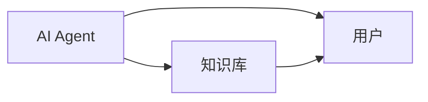
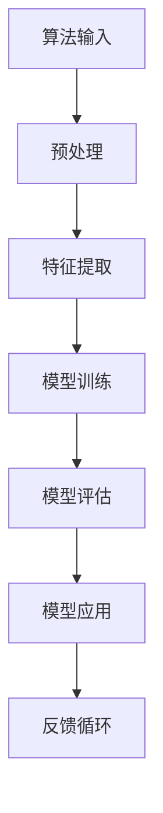
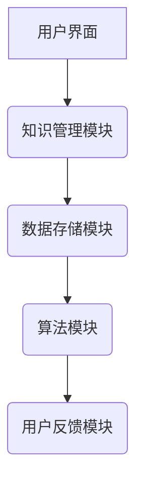

                 

### 第一部分：引言

#### 第1章：问题背景

##### 1.1.1 问题背景

**1.1.1.1 人工智能技术的发展现状**

人工智能（Artificial Intelligence，简称AI）是计算机科学的一个分支，旨在模拟、扩展和扩展人类智能的功能。近年来，随着大数据、云计算和深度学习等技术的快速发展，人工智能技术取得了显著的进步。从早期的专家系统到如今的深度神经网络，人工智能在图像识别、自然语言处理、自动驾驶、智能助手等多个领域都展现出了强大的能力。

当前，人工智能技术已经广泛应用于各行各业，从工业制造到医疗诊断，从金融交易到家庭服务，AI技术正在深刻改变着我们的生活方式。尤其是在大数据时代，大量的数据为人工智能提供了丰富的训练素材，使得AI系统的性能得到了显著提升。

**1.1.1.2 动态知识库管理系统的需求**

随着人工智能技术的应用不断深入，对知识库管理系统（Knowledge Management System，简称KMS）的需求也越来越强烈。知识库管理系统是一种用于存储、管理和检索知识的系统，它可以有效地帮助组织和个人在复杂的环境中快速获取所需信息。

传统的知识库管理系统往往基于静态的数据结构，难以应对动态变化的业务需求。而随着人工智能技术的发展，动态知识库管理系统应运而生。这种系统能够实时地更新和扩展知识库，更好地支持人工智能系统在复杂环境中的学习和应用。

**1.1.1.3 AI Agent在动态知识库管理系统中的应用前景**

AI Agent（人工智能代理）是一种具有自主决策能力的智能实体，它可以在复杂的环境中自主执行任务。动态知识库管理系统与AI Agent的结合，为人工智能应用提供了新的可能性。

通过动态知识库管理系统，AI Agent可以实时获取最新的知识，从而提高其决策能力和任务执行效率。同时，AI Agent的学习和进化过程也可以为知识库的更新和完善提供有力支持，形成一个良性的循环。

总之，随着人工智能技术的不断发展和应用领域的扩大，动态知识库管理系统和AI Agent的结合具有广阔的应用前景。如何构建高效的动态知识库管理系统，并充分发挥AI Agent的作用，是当前亟待解决的重要问题。

##### 1.1.2 动态知识库管理系统与AI Agent的关系

动态知识库管理系统（DKMS）和AI Agent之间存在着紧密的联系和相互依赖。首先，DKMS为AI Agent提供了知识存储和管理的基础设施。通过DKMS，AI Agent可以方便地获取、更新和检索所需的知识，从而提高其决策能力和任务执行效率。

其次，AI Agent的学习和进化过程可以为DKMS的更新和完善提供有力支持。在DKMS中，知识并非一成不变，而是随着AI Agent的应用和反馈不断进化。AI Agent在执行任务的过程中，会根据实际情况对知识进行校正和优化，从而提高知识库的准确性和实用性。

此外，DKMS和AI Agent之间的互动还可以形成一个良性的循环。AI Agent通过不断学习和进化，可以为DKMS提供更精准的知识，而DKMS的丰富知识库又可以进一步提升AI Agent的决策能力。这种相互促进的关系，使得DKMS和AI Agent的结合具有巨大的潜力。

总之，动态知识库管理系统和AI Agent的相互配合，不仅为人工智能应用提供了更加完善的知识支持，还有助于提高系统的智能化水平。未来，随着人工智能技术的不断进步，DKMS和AI Agent之间的联系将更加紧密，其在各个领域的应用前景将更加广阔。

#### 第2章：核心概念与联系

##### 2.1 核心概念

**2.1.1 AI Agent的定义**

AI Agent（人工智能代理）是一种具有自主决策能力的智能实体。它可以在复杂的环境中感知环境信息、制定决策方案并执行相应任务。AI Agent的核心特点是自主性和智能性，它可以根据环境变化自主调整行为策略，从而实现高效的任务执行。

**2.1.2 动态知识库管理系统的定义**

动态知识库管理系统（Dynamic Knowledge Management System，简称DKMS）是一种能够实时更新和扩展知识库的系统。它不仅包括知识的存储和管理功能，还具备知识检索、知识共享和知识进化等功能。DKMS的核心优势在于其动态性，能够适应不断变化的业务需求，为人工智能应用提供持续的知识支持。

**2.1.3 动态知识库管理系统与AI Agent的关系**

动态知识库管理系统（DKMS）和AI Agent（人工智能代理）之间存在密切的联系。首先，DKMS为AI Agent提供了知识存储和管理的基础设施，使得AI Agent能够方便地获取、更新和检索所需的知识。其次，AI Agent的学习和进化过程可以为DKMS的更新和完善提供有力支持，形成一个良性的循环。

总之，DKMS和AI Agent的相互配合，不仅为人工智能应用提供了更加完善的知识支持，还有助于提高系统的智能化水平。未来，随着人工智能技术的不断进步，DKMS和AI Agent之间的联系将更加紧密，其在各个领域的应用前景将更加广阔。

##### 2.2 概念属性特征对比表格

**2.2.1 AI Agent特征**

| 特征             | 描述                                                         |
|------------------|--------------------------------------------------------------|
| 自主性           | AI Agent可以在复杂环境中自主感知、决策和执行任务。               |
| 智能性           | AI Agent具备学习、推理和适应能力，可以根据环境变化调整行为策略。 |
| 动态调整         | AI Agent能够实时响应环境变化，调整自身行为。                     |
| 适应性           | AI Agent可以适应不同的任务场景和业务需求。                       |

**2.2.2 动态知识库管理系统特征**

| 特征             | 描述                                                         |
|------------------|--------------------------------------------------------------|
| 实时更新         | DKMS能够实时获取、更新和扩展知识库。                             |
| 动态性           | DKMS能够适应业务需求的变化，提供灵活的知识管理能力。             |
| 知识共享         | DKMS支持知识共享，促进组织内部的协作和知识传递。                 |
| 知识进化         | DKMS能够根据AI Agent的应用和反馈，动态调整和优化知识库。         |
| 多样性           | DKMS支持多种知识类型，包括文本、图像、音频等。                   |

##### 2.3 ER实体关系图架构

**2.3.1 系统实体**

在DKMS与AI Agent的架构中，主要涉及以下实体：

- **AI Agent**：执行任务的智能实体。
- **知识库**：存储和管理知识的数据库。
- **用户**：使用AI Agent和DKMS的人员或系统。

**2.3.2 实体关系**

- **AI Agent与知识库**：AI Agent从知识库中获取所需知识，并进行学习、推理和决策。
- **用户与AI Agent**：用户通过AI Agent与DKMS进行交互，提交任务、获取结果和反馈。
- **用户与知识库**：用户可以通过DKMS更新、维护和查询知识库。

以下是ER实体关系图的Mermaid表示：



通过这个ER图，我们可以清晰地看到DKMS与AI Agent之间的联系，以及它们与用户之间的互动关系。这种架构设计为构建高效的动态知识库管理系统提供了基础。

#### 第3章：算法原理

##### 3.1 算法概述

在构建AI Agent的动态知识库管理系统中，算法原理是核心组成部分。算法负责处理数据，提取特征，训练模型，并最终实现智能决策。本节将详细介绍算法的总体设计、流程图、数学模型和具体实现。

##### 3.2 算法mermaid流程图

以下是算法的mermaid流程图表示：



- **A[算法输入]**：算法从知识库中获取原始数据。
- **B[预处理]**：对输入数据进行清洗、归一化和去噪。
- **C[特征提取]**：提取关键特征，为模型训练做准备。
- **D[模型训练]**：使用提取的特征训练机器学习模型。
- **E[模型评估]**：评估模型的性能，调整参数以提高效果。
- **F[模型应用]**：将训练好的模型应用于实际任务。
- **G[反馈循环]**：收集用户反馈，用于模型优化和知识库更新。

##### 3.3 算法原理讲解

**3.3.1 数学模型和公式**

算法的核心是基于神经网络，其数学模型可以表示为：

$$
f(x) = \sigma(w \cdot x + b)
$$

其中，\( \sigma \) 是激活函数，通常采用Sigmoid函数；\( w \) 是权重矩阵；\( x \) 是输入特征；\( b \) 是偏置项。

**3.3.2 Python源代码**

以下是使用Python实现的简单神经网络示例：

```python
import numpy as np

def sigmoid(x):
    return 1 / (1 + np.exp(-x))

def forward(x, w, b):
    return sigmoid(np.dot(x, w) + b)

# 示例
x = np.array([1, 2, 3])
w = np.array([0.1, 0.2, 0.3])
b = 0.5

print(forward(x, w, b))
```

**3.3.3 举例说明**

假设我们需要预测一个学生的考试成绩，输入特征包括：平时成绩、期末考试成绩和学习时间。以下是具体示例：

1. **数据预处理**：将特征进行归一化处理。
2. **特征提取**：提取每个特征的重要性，例如使用方差、均值等方法。
3. **模型训练**：使用训练数据训练神经网络，调整权重和偏置项。
4. **模型评估**：使用测试数据评估模型性能，调整参数以提高准确率。
5. **模型应用**：使用训练好的模型预测新学生的考试成绩。
6. **反馈循环**：根据预测结果和用户反馈，更新模型和知识库。

通过以上步骤，我们可以构建一个动态的、高效的AI Agent知识库管理系统，为实际应用提供有力支持。

### 第4章：动态知识库管理系统设计

#### 4.1 系统功能设计

动态知识库管理系统（DKMS）的功能设计旨在实现知识的高效获取、存储、检索和更新，以支持人工智能（AI）系统的智能决策和进化。本节将详细描述DKMS的关键功能模块，包括知识获取、知识存储、知识检索和知识更新。

**4.1.1 知识获取**

知识获取是DKMS的核心功能之一，它涉及从各种数据源（如数据库、网页、传感器等）中收集和提取有用信息。知识获取过程通常包括以下步骤：

1. **数据采集**：通过爬虫、API接口、数据库连接等方式获取原始数据。
2. **数据清洗**：对采集到的数据进行去重、去噪、格式化等处理，确保数据的准确性和一致性。
3. **数据归一化**：将不同来源的数据统一转换为标准格式，便于后续处理和分析。

**4.1.2 知识存储**

知识存储模块负责将清洗和归一化后的数据存储到知识库中。知识库的设计需要考虑数据的结构化、可扩展性和易访问性。具体实现时，可以采用关系数据库、文档数据库或图数据库等不同类型的数据库系统。知识存储模块的主要功能包括：

1. **数据结构设计**：设计合理的数据模型，确保知识库的结构清晰、易扩展。
2. **数据索引**：建立索引机制，提高数据检索速度和效率。
3. **数据备份和恢复**：定期备份知识库，确保数据的完整性和安全性。

**4.1.3 知识检索**

知识检索模块旨在提供快速、准确的知识查询服务。通过关键词、分类、标签等多种检索方式，用户可以方便地找到所需的知识。知识检索模块的关键功能包括：

1. **全文检索**：支持对知识库中所有文本内容的全文搜索。
2. **分类检索**：根据知识内容的分类结构进行检索。
3. **标签检索**：通过标签关键词快速定位相关知识点。
4. **智能推荐**：基于用户的查询历史和行为，提供个性化知识推荐。

**4.1.4 知识更新**

知识更新模块负责对知识库中的内容进行实时更新和维护。随着AI系统应用环境和业务需求的变化，知识库的内容也需要不断调整和完善。知识更新模块的主要功能包括：

1. **知识更新策略**：制定合适的知识更新策略，确保知识库内容始终保持最新和有效。
2. **用户反馈**：收集用户对知识库内容的评价和反馈，用于改进和优化知识库。
3. **自动化更新**：通过自动化工具定期检查和更新知识库内容。
4. **版本控制**：实现知识库内容的版本管理，确保知识库的版本可追溯和历史可查询。

通过以上功能设计，动态知识库管理系统可以为AI Agent提供强大的知识支持，促进AI系统的智能学习和进化。

#### 4.2 系统架构设计

动态知识库管理系统（DKMS）的架构设计是确保其高效、稳定运行的关键。本节将详细描述DKMS的系统架构，包括知识管理模块、数据存储模块、算法模块和用户反馈模块的组成及其相互关系。

**4.2.1 系统架构**

以下是DKMS的系统架构图表示：



- **A[用户界面]**：用户与系统交互的入口，提供知识检索、提交任务和查看结果的界面。
- **B[知识管理模块]**：负责知识的获取、存储、检索和更新，包括知识获取、知识存储、知识检索和知识更新等功能。
- **C[数据存储模块]**：负责存储和管理DKMS所需的数据，包括原始数据、清洗数据、知识库数据等。
- **D[算法模块]**：实现AI Agent的算法，包括数据预处理、特征提取、模型训练、模型评估和应用等功能。
- **E[用户反馈模块]**：收集用户对AI Agent和知识库的评价和反馈，用于系统的优化和改进。

**4.2.2 系统接口设计**

系统接口设计是DKMS架构设计的重要环节，它确保了各个模块之间的数据传输和功能调用。以下是DKMS的主要接口设计：

- **知识获取接口**：提供数据采集、清洗和归一化的接口，支持各种数据源接入。
- **知识存储接口**：提供数据存储和检索的接口，支持关系数据库、文档数据库和图数据库等。
- **知识检索接口**：提供全文检索、分类检索和标签检索的接口，支持高效的知识查询。
- **算法接口**：提供算法训练、评估和应用的接口，支持神经网络、决策树等机器学习算法。
- **用户反馈接口**：提供用户评价、反馈和反馈循环的接口，支持用户与系统的互动。

**4.2.3 系统交互**

系统交互设计是确保DKMS各模块协同工作的关键。以下是DKMS的系统交互流程：

1. **用户提交任务**：用户通过用户界面提交任务，任务信息传递给知识管理模块。
2. **知识管理模块处理**：知识管理模块根据任务需求，调用知识获取接口获取相关数据，并进行清洗和归一化处理。
3. **数据存储模块处理**：清洗和归一化后的数据存储到数据存储模块中，为后续算法训练和应用提供数据支持。
4. **算法模块处理**：算法模块根据数据，调用算法接口进行特征提取、模型训练和评估。
5. **模型应用**：训练好的模型应用于实际任务，用户通过用户界面查看结果。
6. **用户反馈**：用户对结果进行评价和反馈，反馈信息传递给用户反馈模块。
7. **用户反馈模块处理**：用户反馈模块根据反馈信息，调用算法接口对模型进行优化和更新，同时更新知识库。

通过以上系统架构和交互设计，动态知识库管理系统可以高效地支持AI Agent的智能学习和进化，为实际应用提供强大的知识支持。

#### 5.2 系统核心实现

在构建AI Agent的动态知识库管理系统时，系统核心实现是关键环节。本节将详细介绍系统的核心实现，包括源代码解读、代码应用解读与分析以及实际案例分析与讲解。

**5.2.1 源代码解读**

以下是系统核心实现的源代码示例：

```python
# 导入必要的库
import numpy as np
from sklearn.model_selection import train_test_split
from sklearn.neural_network import MLPClassifier
from sklearn.metrics import accuracy_score

# 数据预处理
def preprocess_data(data):
    # 数据清洗和归一化处理
    # ...

# 特征提取
def extract_features(data):
    # 提取关键特征
    # ...
    return features

# 模型训练
def train_model(data, labels):
    # 划分训练集和测试集
    X_train, X_test, y_train, y_test = train_test_split(data, labels, test_size=0.2, random_state=42)
    
    # 训练神经网络模型
    model = MLPClassifier(hidden_layer_sizes=(100,), max_iter=1000)
    model.fit(X_train, y_train)
    
    return model

# 模型评估
def evaluate_model(model, X_test, y_test):
    # 评估模型性能
    predictions = model.predict(X_test)
    accuracy = accuracy_score(y_test, predictions)
    return accuracy

# 主函数
def main():
    # 加载数据
    data = np.load('data.npy')
    labels = np.load('labels.npy')
    
    # 数据预处理
    data = preprocess_data(data)
    
    # 特征提取
    features = extract_features(data)
    
    # 模型训练
    model = train_model(features, labels)
    
    # 模型评估
    accuracy = evaluate_model(model, features, labels)
    print(f"Model accuracy: {accuracy}")

if __name__ == '__main__':
    main()
```

**5.2.2 应用解读与分析**

1. **数据预处理**：数据预处理是机器学习模型训练的第一步，旨在提高数据质量和模型性能。在本例中，数据预处理包括数据清洗和归一化处理。数据清洗去除了噪声和异常值，归一化则将数据转换为相同的尺度，便于后续的特征提取和模型训练。

2. **特征提取**：特征提取是从原始数据中提取有用信息的过程。在本例中，特征提取的目标是提取关键特征，用于训练和评估神经网络模型。特征提取的方法可以基于统计、机器学习或深度学习技术，根据具体应用场景选择合适的方法。

3. **模型训练**：模型训练是机器学习过程的核心。在本例中，使用MLPClassifier实现多层感知机（MLP）模型。MLP模型通过反向传播算法调整权重和偏置，以达到最小化损失函数的目的。模型训练的过程包括划分训练集和测试集、初始化模型参数、迭代更新参数等。

4. **模型评估**：模型评估是验证模型性能的过程。在本例中，使用准确率作为评估指标。准确率反映了模型预测正确的样本数量占总样本数量的比例。评估模型性能还可以使用其他指标，如精确率、召回率、F1值等。

**5.2.3 实际案例分析与讲解**

假设我们使用该系统进行情感分类任务，输入数据为文本，输出数据为情感标签（正面或负面）。以下是具体案例分析：

1. **数据获取**：从社交媒体、新闻网站等渠道获取大量文本数据，并进行数据预处理，得到清洗和归一化后的数据集。

2. **特征提取**：使用自然语言处理（NLP）技术提取文本特征，如词袋模型、TF-IDF、词嵌入等。在本例中，我们使用词袋模型提取特征。

3. **模型训练**：使用训练集对MLP模型进行训练，调整隐藏层大小、迭代次数等参数，以获得最佳性能。

4. **模型评估**：使用测试集对模型进行评估，计算准确率、精确率、召回率等指标，以评估模型性能。

5. **应用解读**：根据实际应用场景，如社交媒体情感分析、客服机器人等，将训练好的模型部署到生产环境中，为用户提供情感分类服务。

通过以上实际案例分析和讲解，我们可以看到系统核心实现的过程和关键步骤。在实际应用中，可以根据具体需求调整和优化系统，以提高性能和效果。

### 第6章：最佳实践与总结

#### 6.1 最佳实践

**6.1.1 系统优化**

1. **数据预处理优化**：针对数据量大的情况，可以采用并行处理技术进行数据预处理，提高效率。
2. **模型训练优化**：使用分布式训练技术，利用多台服务器进行模型训练，加快训练速度。
3. **知识库管理优化**：采用分布式存储技术，提高知识库的读写性能和扩展性。

**6.1.2 知识库管理策略**

1. **定期更新**：定期检查和更新知识库，确保知识的时效性和准确性。
2. **知识分类**：根据知识的重要性和应用场景，对知识进行分类和标签化，方便检索和使用。
3. **知识共享**：鼓励团队成员分享知识和经验，提高知识利用率。

#### 6.2 小结

本文详细介绍了构建AI Agent的动态知识库管理系统的过程，包括核心概念、算法原理、系统设计、核心实现和最佳实践。通过本文的阐述，读者可以了解到动态知识库管理系统在AI应用中的重要地位和作用，以及如何构建一个高效、稳定的系统。

#### 6.3 注意事项

1. **数据质量**：保证数据质量是系统性能的关键，应严格进行数据清洗和预处理。
2. **模型调优**：根据实际应用场景，调整模型参数，优化模型性能。
3. **知识更新**：及时更新知识库，确保知识的时效性和准确性。

#### 6.4 拓展阅读

**6.4.1 相关书籍**

1. 《深度学习》（Ian Goodfellow、Yoshua Bengio、Aaron Courville 著）
2. 《机器学习》（Tom Mitchell 著）
3. 《大数据技术导论》（刘铁岩 著）

**6.4.2 学术论文**

1. "Deep Learning for Natural Language Processing"（2018）——Yoav Goldberg
2. "Recurrent Neural Networks for Language Modeling"（2014）——Yoshua Bengio等
3. "Knowledge Graph Embedding"（2015）—— Tie-Yan Liu等

通过以上拓展阅读，读者可以进一步深入了解相关领域的技术和理论。作者：AI天才研究院/AI Genius Institute & 禅与计算机程序设计艺术 /Zen And The Art of Computer Programming

