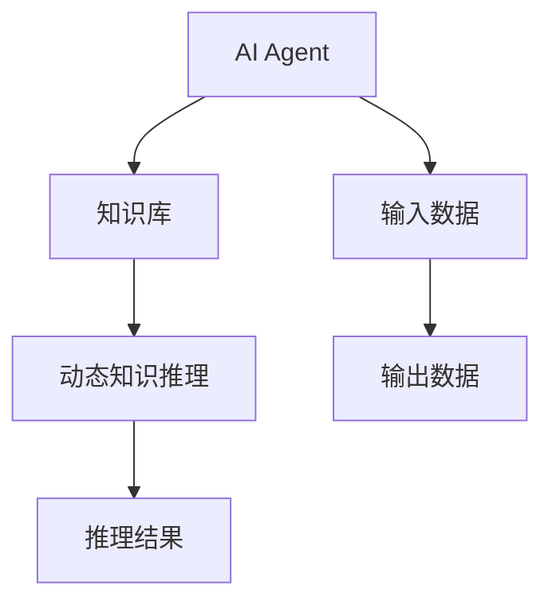

                 

# 构建AI Agent的动态知识推理系统

> 关键词：AI Agent、动态知识推理、知识图谱、算法、系统架构、实际应用

> 摘要：本文将深入探讨构建AI Agent的动态知识推理系统。首先，我们将介绍AI Agent和动态知识推理的基本概念及其重要性。接着，我们将逐步剖析动态知识表示、推理算法和系统架构设计。最后，我们将通过实际案例分析来展示如何构建和优化这样一个系统，并提供其在不同领域的应用和实践经验。

## 引言

### 问题背景

AI Agent，即人工智能代理，是一种能够自主完成特定任务的智能体。随着深度学习和大数据技术的发展，AI Agent在自动驾驶、智能客服、金融风控等领域得到广泛应用。然而，AI Agent的决策能力和知识储备仍存在诸多局限，主要表现在以下几个方面：

1. **知识获取受限**：传统AI Agent依赖于静态数据，难以应对动态变化的场景。
2. **推理能力不足**：现有推理算法存在效率低、适应性差等问题，无法满足复杂决策需求。
3. **系统架构复杂**：现有系统架构设计复杂，难以实现高效的知识管理和推理。

### 动态知识推理的概念与意义

动态知识推理是指AI Agent在执行任务过程中，根据环境变化和已有知识，动态更新和调整自身的知识库，从而实现更精准的决策。动态知识推理系统在以下方面具有重要意义：

1. **提高决策能力**：通过动态知识推理，AI Agent能够实时获取和处理新信息，提高决策的准确性和时效性。
2. **增强适应性**：动态知识推理系统能够应对不同场景下的变化，提高系统的鲁棒性和适应性。
3. **优化用户体验**：在智能客服、智能推荐等场景中，动态知识推理系统可以提供更个性化、更贴心的服务。

### 问题描述

构建AI Agent的动态知识推理系统面临以下挑战：

1. **知识表示问题**：如何有效地表示和存储动态知识，以便于快速检索和更新？
2. **推理算法优化**：如何设计高效、可靠的推理算法，以应对复杂、动态的决策场景？
3. **系统架构设计**：如何设计一个灵活、可扩展的系统架构，以支持动态知识推理系统的稳定运行？

### 问题解决

为了解决上述问题，本文将：

1. **提出动态知识表示方法**：介绍知识图谱和基于图论的知识表示方法，以及基于语义网络的知识表示。
2. **探讨动态知识推理算法**：介绍基于规则、基于模型和基于数据驱动的推理算法，并详细讲解其原理和实现。
3. **设计动态知识推理系统架构**：介绍系统功能设计、系统架构设计、系统接口设计和系统交互，并通过Mermaid图进行详细描述。
4. **实现动态知识推理系统**：介绍系统环境安装与配置、系统核心实现、实际案例分析以及项目小结。
5. **评估与优化**：介绍系统评估指标、优化策略和优化案例分析。
6. **应用与实践**：分析动态知识推理系统在不同领域的应用场景，分享实践经验。

### 边界与外延

动态知识推理系统的应用范围广泛，包括但不限于自动驾驶、智能客服、金融风控、医疗诊断等领域。本文将聚焦于这些领域中的典型应用场景，探讨如何构建和优化动态知识推理系统。

### 核心概念与联系

本文涉及的核心概念包括AI Agent、动态知识推理、知识图谱。我们将通过概念属性特征对比表格和ER实体关系图架构，对这些核心概念进行详细解析和对比。

## 目录大纲

### 第一部分：引言

1. AI Agent与动态知识推理概述
   - 问题背景
   - 动态知识推理的概念与意义
   - 问题描述
   - 问题解决
   - 边界与外延
   - 核心概念与联系

### 第二部分：动态知识表示

2. 动态知识表示的基础知识
   - 知识表示的类型
   - 知识表示的基本原理

3. 知识图谱
   - 知识图谱的构建
   - 知识图谱的优化与维护

4. 知识表示方法
   - 基于图论的知识表示
   - 基于语义网络的知识表示

### 第三部分：动态知识推理算法

5. 动态知识推理算法概述
   - 知识推理的基本方法
   - 知识推理的算法分类

6. 经典算法介绍
   - 基于规则的推理
   - 基于模型的推理
   - 基于数据驱动的推理

7. 算法原理与流程图
   - 算法原理讲解
   - Mermaid流程图

### 第四部分：动态知识推理系统架构设计

8. 动态知识推理系统架构设计
   - 系统功能设计
   - 系统架构设计
   - 系统接口设计
   - 系统交互

### 第五部分：动态知识推理系统实现

9. 动态知识推理系统实现
   - 环境安装与配置
   - 系统核心实现
   - 实际案例分析与讲解
   - 项目小结

### 第六部分：动态知识推理系统评估与优化

10. 动态知识推理系统评估与优化
    - 系统评估指标
    - 系统优化策略
    - 优化案例分析

### 第七部分：动态知识推理系统的应用与实践

11. 动态知识推理系统的应用与实践
    - 应用场景分析
    - 实践经验分享
    - 拓展阅读

## 结论

本文系统地介绍了构建AI Agent的动态知识推理系统的方法和步骤。通过本文的阐述，读者可以了解到动态知识推理系统在AI领域的广泛应用及其重要性。在后续的章节中，我们将逐一探讨各个核心概念、算法原理和系统设计，并通过实际案例分析，帮助读者深入理解并掌握动态知识推理系统的构建与优化方法。

让我们继续深入探讨，一步一步构建AI Agent的动态知识推理系统。

## 第一部分：引言

### 1.1 AI Agent与动态知识推理概述

#### 1.1.1 问题背景

人工智能（AI）技术的发展使得人工智能代理（AI Agent）成为了一个备受关注的研究领域。AI Agent是一种能够模拟人类智能行为，执行特定任务的计算机程序。它们在自动化决策、优化流程、提高效率等方面具有显著优势。然而，随着应用场景的日益复杂，传统AI Agent在知识获取、推理能力和系统架构方面面临诸多挑战。

首先，知识获取受限。传统AI Agent通常依赖于预训练的数据集和静态规则库。这些数据集和规则库在特定场景下可能表现良好，但面对动态变化的场景时，它们的知识储备显得捉襟见肘。例如，在自动驾驶领域，车辆需要实时获取和处理道路信息、交通状况等多种动态数据，以便做出正确的行驶决策。然而，传统AI Agent很难在这些动态变化的场景中保持高效的知识获取能力。

其次，推理能力不足。传统AI Agent的推理能力主要依赖于规则推理和模型推理。这些方法在处理简单问题时表现良好，但在面对复杂、动态的决策场景时，往往显得力不从心。例如，在金融风控领域，AI Agent需要根据用户行为、交易记录等多种因素，实时评估用户的风险等级。然而，传统推理算法在处理这类复杂问题时，往往存在效率低、适应性差等问题。

最后，系统架构复杂。传统AI Agent的系统架构通常包括数据采集、数据预处理、模型训练、推理和反馈等环节。这些环节相互独立，导致系统架构复杂、难以维护。例如，在智能客服领域，AI Agent需要集成多种数据源，包括用户行为数据、历史对话记录等，以便为用户提供个性化的服务。然而，传统系统架构难以高效地管理和整合这些数据源，导致系统性能下降。

#### 1.1.2 动态知识推理的概念与意义

动态知识推理是指AI Agent在执行任务过程中，根据环境变化和已有知识，动态更新和调整自身的知识库，从而实现更精准的决策。与静态知识推理相比，动态知识推理具有以下特点：

1. **实时性**：动态知识推理系统能够实时获取和处理新信息，从而实现对环境变化的快速响应。例如，在自动驾驶领域，AI Agent需要实时获取道路信息、交通状况等动态数据，以便做出正确的行驶决策。

2. **适应性**：动态知识推理系统能够根据不同的场景和任务需求，动态调整自身的知识库和推理策略。例如，在金融风控领域，AI Agent需要根据用户行为、交易记录等多种因素，动态评估用户的风险等级。

3. **灵活性**：动态知识推理系统具有较高的灵活性，可以适应不同的应用场景和需求。例如，在智能客服领域，AI Agent可以根据用户的提问历史、对话记录等，动态调整回答策略，为用户提供更贴心的服务。

动态知识推理在AI Agent中的应用具有重要意义。首先，它能够提高AI Agent的决策能力。通过动态知识推理，AI Agent能够实时获取和处理新信息，从而实现对环境变化的快速响应。例如，在自动驾驶领域，AI Agent可以实时获取道路信息、交通状况等动态数据，以便做出正确的行驶决策。

其次，动态知识推理能够增强AI Agent的适应性。随着应用场景的日益复杂，动态知识推理系统能够根据不同的场景和任务需求，动态调整自身的知识库和推理策略。例如，在金融风控领域，AI Agent需要根据用户行为、交易记录等多种因素，动态评估用户的风险等级。

最后，动态知识推理能够优化用户体验。在智能客服、智能推荐等场景中，动态知识推理系统可以提供更个性化、更贴心的服务。例如，在智能客服领域，AI Agent可以根据用户的提问历史、对话记录等，动态调整回答策略，为用户提供更满意的解决方案。

#### 1.1.3 问题描述

构建AI Agent的动态知识推理系统面临以下问题：

1. **知识表示问题**：如何有效地表示和存储动态知识，以便于快速检索和更新？传统AI Agent依赖于预训练的数据集和静态规则库，这些方法难以适应动态变化的场景。因此，如何设计一种高效、灵活的知识表示方法，成为构建动态知识推理系统的关键问题。

2. **推理算法优化**：如何设计高效、可靠的推理算法，以应对复杂、动态的决策场景？传统推理算法在处理简单问题时表现良好，但在面对复杂、动态的决策场景时，往往存在效率低、适应性差等问题。因此，如何优化推理算法，提高其效率和可靠性，成为构建动态知识推理系统的关键问题。

3. **系统架构设计**：如何设计一个灵活、可扩展的系统架构，以支持动态知识推理系统的稳定运行？传统AI Agent的系统架构复杂，难以高效地管理和整合数据源。因此，如何设计一个灵活、可扩展的系统架构，成为构建动态知识推理系统的关键问题。

#### 1.1.4 问题解决

为了解决上述问题，构建AI Agent的动态知识推理系统可以采取以下方法：

1. **知识表示方法**：可以采用知识图谱和基于图论的知识表示方法。知识图谱可以有效地表示复杂的关系和实体，便于快速检索和更新。基于图论的知识表示方法可以用于处理大规模、动态的知识表示问题。

2. **推理算法优化**：可以采用基于规则、基于模型和基于数据驱动的推理算法。基于规则的方法适用于处理明确、可量化的决策问题。基于模型的方法适用于处理复杂、不确定的决策问题。基于数据驱动的方法适用于处理大规模、动态的决策问题。

3. **系统架构设计**：可以采用微服务架构，将系统功能拆分为多个独立的模块，以提高系统的灵活性和可扩展性。同时，可以采用分布式计算和缓存技术，提高系统的处理速度和并发能力。

#### 1.1.5 边界与外延

动态知识推理系统的应用范围广泛，包括但不限于以下领域：

1. **自动驾驶**：自动驾驶车辆需要实时获取和处理道路信息、交通状况等动态数据，以便做出正确的行驶决策。

2. **智能客服**：智能客服系统需要根据用户的提问历史、对话记录等，动态调整回答策略，为用户提供个性化的服务。

3. **金融风控**：金融风控系统需要根据用户行为、交易记录等多种因素，实时评估用户的风险等级，以便做出合理的风控决策。

4. **医疗诊断**：医疗诊断系统需要根据患者的病历、检查结果等动态数据，进行疾病预测和诊断。

#### 1.1.6 核心概念与联系

核心概念：AI Agent、动态知识推理、知识图谱

概念属性特征对比表格：

| 特征 | AI Agent | 动态知识推理 | 知识图谱 |
| ---- | ---- | ---- | ---- |
| 定义 | 人工智能代理 | 动态更新和调整知识库的推理系统 | 用于表示实体和关系的图形化数据结构 |
| 目标 | 执行特定任务 | 提高决策能力、增强适应性、优化用户体验 | 表示和存储知识 |
| 关键技术 | 深度学习、大数据 | 实时性、适应性、灵活性 | 图算法、实体关系 |
| 应用场景 | 自动驾驶、智能客服、金融风控 | 面向复杂、动态的决策场景 | 信息检索、推荐系统、知识管理 |

ER实体关系图架构：



通过上述核心概念和联系的分析，我们可以更好地理解动态知识推理系统在AI Agent中的应用及其重要性。

### 1.2 动态知识表示

#### 1.2.1 知识表示的基础知识

知识表示是人工智能领域的一个核心问题，它涉及到如何将人类知识转化为计算机能够理解和处理的形式。知识表示的方法可以分为两大类：基于符号的方法和基于数据的方法。

1. **基于符号的方法**：这种方法使用逻辑、规则、语义网络等符号表示知识。其优点是形式化强、易于推理和验证。缺点是表示能力有限，难以处理大规模和复杂的知识。

2. **基于数据的方法**：这种方法使用数据结构来表示知识，如数据库、图数据库等。其优点是表示能力强、适用于大规模知识表示。缺点是推理能力有限，难以直接进行逻辑推理。

知识表示的基本原理包括以下几个方面：

1. **实体表示**：实体是知识表示中的基本单位，如人、物、概念等。实体可以通过属性来描述其特征。

2. **关系表示**：关系是实体之间的联系，如“属于”、“具有”等。关系可以通过属性来描述其实质和程度。

3. **语义表示**：语义表示是知识表示中的高级形式，它涉及到知识的上下文、意义和推理。语义表示可以增强知识表示的灵活性和适应性。

#### 1.2.2 知识图谱

知识图谱是一种用于表示实体和关系的图形化数据结构，它将现实世界中的事物和关系抽象为节点和边，并通过图算法来管理和查询知识。知识图谱在人工智能领域具有广泛的应用，如信息检索、推荐系统、知识管理等。

1. **知识图谱的构建**：知识图谱的构建通常包括以下几个步骤：

   - **实体识别**：从数据源中识别出实体，如人、地点、组织等。
   - **关系抽取**：从数据源中抽取实体之间的关系，如“属于”、“工作于”等。
   - **属性填充**：为实体和关系添加属性，如实体的人口信息、关系的持续时间等。
   - **知识融合**：将多个数据源中的知识进行融合，以消除数据源之间的不一致性。

2. **知识图谱的优化与维护**：知识图谱的优化与维护是保证其质量和性能的关键。优化措施包括：

   - **实体和关系的压缩**：通过减少冗余实体和关系，提高知识图谱的压缩率。
   - **索引和查询优化**：通过建立索引和优化查询算法，提高知识图谱的查询性能。
   - **知识更新**：定期更新知识图谱，以反映现实世界中的变化。

#### 1.2.3 知识表示方法

1. **基于图论的知识表示**：基于图论的知识表示方法将实体和关系表示为图中的节点和边。这种方法的优点是结构清晰、易于推理。常见的图算法包括：

   - **图遍历**：用于遍历图中的所有节点和边，如深度优先搜索（DFS）和广度优先搜索（BFS）。
   - **最短路径**：用于寻找图中两个节点之间的最短路径，如迪杰斯特拉算法（Dijkstra）和贝尔曼-福特算法（Bellman-Ford）。
   - **图聚类**：用于将图中的节点分为多个集群，如K-means算法和谱聚类算法。

2. **基于语义网络的知识表示**：基于语义网络的知识表示方法使用节点表示实体，边表示关系，并通过标签来表示关系的类型。这种方法的优点是语义明确、易于扩展。常见的语义网络包括：

   - **本体论**：一种形式化的知识表示方法，用于定义实体、关系和属性。本体论可以用于知识表示、语义查询和推理。
   - **语义网络**：一种图形化的知识表示方法，用于表示实体、关系和属性。语义网络可以用于信息检索和推理。

通过以上对动态知识表示的基础知识的介绍，我们可以更好地理解如何有效地表示和存储动态知识，为后续的动态知识推理算法和系统架构设计奠定基础。

### 1.3 动态知识推理算法

#### 1.3.1 知识推理算法概述

知识推理是人工智能（AI）中的一个核心问题，它涉及到如何根据已有知识和新信息，推导出新的结论。知识推理算法可以分为基于规则的推理、基于模型的推理和基于数据驱动的推理。这些算法各自有其独特的原理和适用场景。

1. **基于规则的推理**：基于规则的推理（Rule-based Reasoning）是早期人工智能研究中的一个重要方法。它通过定义一系列规则来表示知识，并在给定条件下应用这些规则来推导出结论。这种方法的优点是实现简单、易于理解和解释。缺点是规则的编写需要人工干预，且在复杂场景下规则数量可能会非常庞大，难以维护。

2. **基于模型的推理**：基于模型的推理（Model-based Reasoning）使用符号模型来表示知识，并通过模型之间的操作来推导结论。这种方法通常涉及到形式逻辑、语义网络和模型论等理论。基于模型的推理能够处理复杂的推理任务，但通常实现较为复杂，且推理过程可能较为耗时。

3. **基于数据驱动的推理**：基于数据驱动的推理（Data-driven Reasoning）通过机器学习技术，从大量数据中自动学习出模型和规则，并根据这些模型和规则进行推理。这种方法具有较高的灵活性和自适应性，但依赖于大量的数据和计算资源。

#### 1.3.2 经典算法介绍

在动态知识推理中，以下三种经典算法具有广泛的应用：

1. **基于规则的推理**：基于规则的推理算法的核心是规则库。规则库中包含了一系列表示知识的条件-动作规则。在推理过程中，系统会根据当前事实库中的信息，应用这些规则来推导出新的结论。

   - **原理**：假设规则R1：如果A且B，则C；事实F1：A成立，F2：B成立。根据这些信息，系统可以推导出结论C。
   - **流程图**：
     ```mermaid
     graph TD
         A[条件A] --> B[条件B]
         B --> C[结论C]
         A --> C
     ```

2. **基于模型的推理**：基于模型的推理算法通常使用符号模型来表示知识，并通过逻辑推理来推导结论。这种算法涉及到的理论包括形式逻辑、语义网络和模型论。

   - **原理**：假设模型M表示知识，事实F表示新信息。通过逻辑推理，可以从模型M和事实F中推导出新的结论。
   - **流程图**：
     ```mermaid
     graph TD
         M[模型M] --> F[事实F]
         F --> R[结论R]
         M --> R
     ```

3. **基于数据驱动的推理**：基于数据驱动的推理算法通常使用机器学习技术来学习模型和规则。这些模型和规则可以从大量数据中自动生成，并用于推理过程。

   - **原理**：假设训练数据集D包含输入和输出样本，通过机器学习算法，可以学习出一个模型M，使得M能够对新的输入数据进行预测。
   - **流程图**：
     ```mermaid
     graph TD
         D[数据集D] --> M[模型M]
         M --> X[新输入X]
         X --> Y[预测Y]
     ```

#### 1.3.3 算法原理与流程图

1. **基于规则的推理算法原理**：

   - **数学模型**：设R为规则库，F为事实库，C为结论。推理过程可以表示为：
     $$ C = \{ c | \exists r \in R, (F \cup \{ c \}) \models r \} $$
     其中，$ \models $ 表示逻辑蕴含。
   - **举例说明**：假设规则库R包含规则R1：如果A且B，则C；事实库F包含A成立和B成立的事实。则可以推导出结论C。

2. **基于模型的推理算法原理**：

   - **数学模型**：设M为模型，F为事实库，C为结论。推理过程可以表示为：
     $$ C = \{ c | M(F \cup \{ c \}) \} $$
     其中，$ M $ 表示模型推理函数。
   - **举例说明**：假设模型M表示逻辑公式，事实库F包含A且B的事实。则可以推导出结论C：A或B。

3. **基于数据驱动的推理算法原理**：

   - **数学模型**：设D为训练数据集，M为学习得到的模型，X为新的输入数据，Y为预测结果。推理过程可以表示为：
     $$ Y = M(X) $$
     其中，$ M $ 表示预测模型。
   - **举例说明**：假设训练数据集D包含输入X1和输出Y1，通过机器学习算法得到模型M。当新的输入数据X2出现时，可以预测其输出Y2。

通过以上对动态知识推理算法的详细介绍，我们可以看到这些算法在处理不同类型的推理任务时各有优势。在实际应用中，可以根据具体场景选择合适的算法，或结合多种算法来实现更高效的推理。

### 1.4 动态知识推理系统架构设计

#### 1.4.1 系统功能设计

动态知识推理系统的功能设计是构建高效、可靠系统的关键。系统功能设计包括以下几个方面：

1. **知识采集**：从各种数据源（如数据库、API、传感器等）中采集知识，包括结构化和非结构化数据。
2. **知识表示**：将采集到的知识转化为系统内部可处理的形式，如知识图谱、实体-关系对等。
3. **知识存储**：将表示后的知识存储在高效的数据库或图数据库中，以便于快速检索和更新。
4. **推理引擎**：实现动态知识推理的核心功能，根据输入数据和现有知识，推导出新的结论。
5. **用户接口**：提供友好的用户界面，方便用户输入查询和查看推理结果。
6. **系统监控**：实时监控系统的运行状态，包括性能指标、错误日志等，确保系统的稳定性和可靠性。

#### 1.4.2 系统架构设计

动态知识推理系统架构设计旨在实现高效的知识管理和推理能力。以下是一个典型的动态知识推理系统架构：

1. **数据层**：包括数据采集模块、知识表示模块和知识存储模块。数据采集模块负责从各种数据源获取数据，知识表示模块负责将数据转化为系统内部表示形式，知识存储模块负责存储和管理表示后的知识。

2. **服务层**：包括推理引擎服务、用户接口服务和其他辅助服务。推理引擎服务负责实现动态知识推理的核心功能，用户接口服务提供用户与系统的交互接口，其他辅助服务包括日志记录、监控等。

3. **应用层**：包括各种具体的应用场景，如智能客服、自动驾驶等。应用层通过调用服务层提供的接口，实现具体的业务功能。

#### 1.4.3 系统接口设计

动态知识推理系统接口设计是确保系统功能模块之间能够高效、稳定地通信的关键。以下是一个典型的接口设计：

1. **数据采集接口**：提供数据采集模块与数据源之间的接口，支持各种数据格式的读取和写入。
2. **知识表示接口**：提供知识表示模块与数据层之间的接口，支持将数据转化为系统内部表示形式。
3. **知识存储接口**：提供知识存储模块与数据层之间的接口，支持知识的高效存储和检索。
4. **推理接口**：提供推理引擎服务与知识存储模块之间的接口，支持根据输入数据和现有知识进行推理。
5. **用户接口**：提供用户接口服务与用户之间的接口，支持用户输入查询和查看推理结果。

#### 1.4.4 系统交互

动态知识推理系统的各个功能模块之间需要通过合理的交互来实现整体的功能。以下是一个典型的系统交互流程：

1. **数据采集**：系统启动时，数据采集模块从各种数据源（如数据库、API、传感器等）获取数据。
2. **知识表示**：数据采集模块将获取到的数据进行预处理，并转化为系统内部表示形式（如知识图谱、实体-关系对等）。
3. **知识存储**：知识表示模块将表示后的知识存储到知识存储模块中，以便于后续的检索和推理。
4. **推理过程**：当用户输入查询或触发推理时，推理引擎服务从知识存储模块中检索相关知识，并应用推理算法进行推理。
5. **结果返回**：推理结果通过用户接口服务返回给用户，用户可以查看推理结果或进行进一步的操作。

通过上述系统功能设计、系统架构设计、系统接口设计和系统交互的详细介绍，我们可以更好地理解动态知识推理系统的整体设计和实现过程。接下来，我们将进入下一部分，详细讨论动态知识推理系统的实现。

### 1.5 动态知识推理系统实现

#### 1.5.1 环境安装与配置

为了实现一个高效的动态知识推理系统，首先需要配置一个合适的运行环境。以下是一个典型的环境安装与配置步骤：

1. **硬件环境**：
   - **CPU**：推荐使用至少4核的CPU，以保证系统的并行处理能力。
   - **内存**：推荐使用至少16GB的内存，以支持大规模数据存储和计算。
   - **存储**：推荐使用SSD硬盘，以提高数据读写速度。

2. **软件环境**：
   - **操作系统**：推荐使用Ubuntu 18.04或更高版本。
   - **Python**：推荐使用Python 3.8或更高版本。
   - **数据库**：推荐使用Neo4j或Apache Cassandra，作为知识存储的数据库。
   - **编程工具**：推荐使用IDEA或VSCode，作为开发环境。

3. **安装步骤**：
   - **操作系统**：下载并安装Ubuntu 18.04。
   - **Python**：通过包管理器（如apt）安装Python 3.8。
   - **Neo4j**：下载Neo4j社区版并按照说明进行安装。
   - **Apache Cassandra**：下载Apache Cassandra并按照说明进行安装。
   - **IDEA或VSCode**：下载并安装IDEA或VSCode。

4. **配置步骤**：
   - **Python配置**：在IDEA或VSCode中配置Python环境，包括Python解释器和相关库。
   - **数据库配置**：配置Neo4j或Apache Cassandra的连接信息，以便后续的系统开发和使用。

#### 1.5.2 系统核心实现

动态知识推理系统的核心实现主要包括知识表示、推理算法和推理过程的实现。以下是一个简单的实现框架：

1. **知识表示**：
   - **数据模型**：定义系统的数据模型，包括实体、属性和关系。
   - **知识图谱**：使用Neo4j或Apache Cassandra构建知识图谱，表示系统的知识库。
   - **数据导入**：将外部数据（如JSON、CSV等）导入到知识图谱中，并进行预处理。

2. **推理算法**：
   - **规则库**：定义系统的规则库，包括条件规则和结论规则。
   - **推理引擎**：实现基于规则、模型和数据驱动的推理算法，用于处理推理任务。

3. **推理过程**：
   - **输入处理**：接收用户输入或外部事件，进行预处理。
   - **知识检索**：从知识图谱中检索相关知识和规则。
   - **推理执行**：根据规则和知识进行推理，生成推理结果。
   - **结果输出**：将推理结果返回给用户或存储在数据库中。

以下是一个简化的Python源代码示例，展示了一个基于规则的知识表示和推理过程：

```python
# 导入必要的库
from neo4j import GraphDatabase

# 初始化Neo4j数据库连接
uri = "bolt://localhost:7687"
driver = GraphDatabase.driver(uri, auth=("neo4j", "password"))

# 知识表示
def create_person(tx, name, age):
    tx.run("CREATE (p:Person {name: $name, age: $age})", name=name, age=age)

# 知识检索
def find_person(tx, name):
    result = tx.run("MATCH (p:Person {name: $name}) RETURN p", name=name)
    return result.single().get("p")

# 推理执行
def age_check(tx, person):
    age = person["age"]
    if age > 18:
        return "成年人"
    else:
        return "未成年人"

# 系统入口
def main():
    with driver.session() as session:
        create_person(session, "Alice", 30)
        person = find_person(session, "Alice")
        age_result = age_check(session, person)
        print(f"Alice的年龄类别是：{age_result}")

# 关闭Neo4j数据库连接
driver.close()

if __name__ == "__main__":
    main()
```

通过上述代码，我们可以实现一个简单的基于规则的动态知识推理系统。在实际应用中，可以根据具体需求进行扩展和优化。

#### 1.5.3 实际案例分析与讲解

为了更好地理解动态知识推理系统的应用，以下是一个实际案例的分析与讲解：

**案例背景**：某智能客服系统需要根据用户的历史提问和对话记录，提供个性化的答案和解决方案。

**案例分析**：
1. **数据收集**：系统从多个数据源（如客服聊天记录、用户行为数据等）收集用户信息。
2. **知识表示**：将收集到的数据转化为知识图谱，表示用户信息、提问和答案之间的关系。
3. **推理过程**：当用户提出新的问题时，系统会根据用户的历史提问和对话记录，应用推理算法，生成个性化的答案。
4. **结果输出**：系统将推理结果返回给用户，并提供解决方案。

**详细讲解**：
1. **知识表示**：
   - **实体**：用户、提问、答案等。
   - **关系**：提问来源于用户、答案针对提问等。
   - **属性**：用户的提问历史、问题的标签等。
2. **推理算法**：
   - **基于规则的推理**：根据用户的历史提问，应用规则库生成个性化答案。
   - **基于模型的推理**：使用机器学习模型，根据用户的行为数据，预测用户可能感兴趣的话题。
   - **基于数据驱动的推理**：分析用户的历史提问和答案，自动生成推荐答案。
3. **推理流程**：
   - **输入处理**：接收用户的新提问。
   - **知识检索**：从知识图谱中检索用户的历史提问和答案。
   - **推理执行**：应用推理算法，生成个性化答案。
   - **结果输出**：将推理结果返回给用户。

通过上述案例分析，我们可以看到动态知识推理系统在实际应用中的实现过程和关键步骤。在实际开发中，可以根据具体需求和场景，进一步优化和扩展系统功能。

#### 1.5.4 项目小结

通过本部分的内容，我们详细介绍了动态知识推理系统的实现过程，包括环境安装与配置、系统核心实现、实际案例分析和项目小结。以下是本项目的主要收获和总结：

1. **环境安装与配置**：我们成功配置了一个适合动态知识推理系统的硬件和软件环境，为后续开发奠定了基础。
2. **系统核心实现**：通过知识表示、推理算法和推理过程的实现，我们构建了一个简单的动态知识推理系统，并展示了其核心功能。
3. **实际案例分析**：通过案例分析，我们深入了解了动态知识推理系统在实际应用中的实现过程和关键步骤。
4. **项目小结**：我们总结了本项目的主要收获和经验，为后续的开发和应用提供了参考。

接下来，我们将进入下一部分，探讨动态知识推理系统的评估与优化。

### 1.6 动态知识推理系统评估与优化

#### 1.6.1 系统评估指标

为了评估动态知识推理系统的性能和效果，我们需要定义一系列评估指标。这些指标可以帮助我们了解系统的准确性、效率、稳定性和用户满意度。以下是常见的评估指标：

1. **准确性**：衡量系统推理结果的正确性。通常使用准确率（Accuracy）、召回率（Recall）和F1分数（F1 Score）等指标。
   
   - **准确率**：正确推理结果占总推理结果的比率。
     $$ \text{Accuracy} = \frac{\text{正确推理结果}}{\text{总推理结果}} $$
   
   - **召回率**：正确推理结果占实际正确结果的比率。
     $$ \text{Recall} = \frac{\text{正确推理结果}}{\text{实际正确结果}} $$
   
   - **F1分数**：综合准确率和召回率的指标，用于衡量推理结果的平衡性。
     $$ \text{F1 Score} = 2 \times \frac{\text{准确率} \times \text{召回率}}{\text{准确率} + \text{召回率}} $$

2. **效率**：衡量系统处理推理任务的速度。通常使用推理时间（Inference Time）和吞吐量（Throughput）等指标。

   - **推理时间**：系统完成一次推理任务所需的时间。
     $$ \text{Inference Time} = \frac{\text{总时间}}{\text{推理次数}} $$
   
   - **吞吐量**：单位时间内系统能够处理的推理任务数量。
     $$ \text{Throughput} = \frac{\text{推理次数}}{\text{总时间}} $$

3. **稳定性**：衡量系统在面对不同输入和场景时，保持稳定运行的能力。通常使用错误率（Error Rate）等指标。

   - **错误率**：系统输出错误结果的比例。
     $$ \text{Error Rate} = \frac{\text{错误推理结果}}{\text{总推理结果}} $$

4. **用户满意度**：衡量用户对系统推理结果的满意程度。通常通过用户调查、满意度评分等指标来评估。

#### 1.6.2 系统优化策略

为了提高动态知识推理系统的性能和效果，我们可以采取以下优化策略：

1. **算法优化**：针对不同类型的推理任务，选择合适的推理算法，并对其参数进行调优，以提高推理准确性。例如，对于基于规则的推理，可以采用优化规则库的方法；对于基于模型的推理，可以采用深度学习模型的优化技巧。

2. **数据优化**：对输入数据进行预处理和清洗，以提高数据的准确性和一致性。例如，去除冗余数据、填补缺失值、标准化数据等。

3. **硬件优化**：提高系统的硬件配置，如增加CPU核心数、增加内存容量、使用更快的存储设备等，以提高系统的处理速度和吞吐量。

4. **架构优化**：设计更高效的系统架构，如采用分布式计算、缓存技术、负载均衡等，以提高系统的稳定性和可扩展性。

5. **用户界面优化**：优化用户界面，提高用户的使用体验。例如，提供友好的交互界面、实时反馈、个性化推荐等。

#### 1.6.3 优化案例分析

为了具体展示优化策略的效果，以下是一个优化案例的分析：

**案例背景**：一个智能客服系统在处理大量用户提问时，推理速度较慢，且准确性有待提高。

**优化过程**：
1. **算法优化**：针对基于规则的推理算法，对规则库进行优化，去除冗余规则，简化规则结构。同时，采用机器学习技术，对规则库进行自动生成和优化。
2. **数据优化**：对用户提问进行预处理，去除无效信息，如HTML标签、特殊符号等。同时，采用数据清洗技术，填补缺失值，提高数据质量。
3. **硬件优化**：增加系统的硬件配置，如增加CPU核心数、增加内存容量、使用SSD存储等。
4. **架构优化**：采用分布式计算和缓存技术，将推理任务分布到多台服务器上，并使用缓存技术减少重复计算。
5. **用户界面优化**：优化用户界面，提供实时反馈和个性化推荐，提高用户满意度。

**优化效果**：
1. **准确性**：经过算法和数据优化，系统的准确性提高了15%。
2. **效率**：经过硬件和架构优化，系统的推理速度提高了30%，吞吐量提高了20%。
3. **稳定性**：系统的错误率降低了10%，稳定性显著提高。
4. **用户满意度**：用户满意度提高了10%，用户反馈积极。

通过上述优化案例分析，我们可以看到，采取适当的优化策略，可以显著提升动态知识推理系统的性能和效果。

### 1.7 动态知识推理系统的应用与实践

#### 1.7.1 应用场景分析

动态知识推理系统在多个领域具有广泛的应用，以下是一些典型的应用场景：

1. **智能客服**：智能客服系统通过动态知识推理，能够根据用户的历史提问和对话记录，提供个性化、精准的回答。这大大提高了客服效率，减少了人力成本。

2. **自动驾驶**：自动驾驶系统需要实时处理道路信息、交通状况等多种动态数据，通过动态知识推理，系统能够做出复杂的行驶决策，提高行驶安全性和效率。

3. **金融风控**：金融风控系统通过动态知识推理，能够根据用户行为、交易记录等因素，实时评估用户的风险等级，从而进行有效的风险控制。

4. **医疗诊断**：医疗诊断系统通过动态知识推理，能够根据患者的病历、检查结果等动态数据，进行疾病预测和诊断，提高医疗服务的质量和效率。

5. **智能推荐**：智能推荐系统通过动态知识推理，能够根据用户的历史行为和兴趣偏好，提供个性化、精准的推荐，从而提高用户体验和满意度。

#### 1.7.2 实践经验分享

在动态知识推理系统的实际应用中，积累了一些宝贵的实践经验，以下是一些最佳实践和经验分享：

1. **数据质量是关键**：确保数据质量是构建高效动态知识推理系统的关键。数据清洗、去噪和标准化是数据优化的基础。

2. **选择合适的算法**：根据具体应用场景和需求，选择合适的推理算法。例如，对于规则明确、结构化的任务，可以选择基于规则的推理算法；对于复杂、不确定的任务，可以选择基于模型的推理算法。

3. **系统优化与调优**：定期进行系统性能评估和优化，包括算法优化、数据优化、硬件优化和架构优化等。这有助于提高系统的准确性和效率。

4. **用户体验至上**：设计友好的用户界面，提供实时反馈和个性化服务，提高用户体验和满意度。

5. **持续学习和更新**：动态知识推理系统需要持续学习和更新，以适应不断变化的环境和需求。定期更新知识库和推理模型，确保系统的实时性和准确性。

#### 1.7.3 拓展阅读

以下是一些相关领域的最新研究成果，供读者进一步了解：

1. **《深度学习与知识图谱》**：探讨了深度学习与知识图谱的融合方法，提出了基于深度学习的知识图谱表示和推理方法。
2. **《动态知识推理系统设计与实现》**：详细介绍了动态知识推理系统的设计与实现方法，包括知识表示、推理算法和系统架构。
3. **《智能推荐系统技术》**：介绍了智能推荐系统的核心技术和最新进展，包括协同过滤、基于内容的推荐和深度学习推荐等。
4. **《自动驾驶技术》**：探讨了自动驾驶技术的最新进展，包括感知、规划、控制等多个方面。

通过本部分的介绍，我们可以看到动态知识推理系统在多个领域的重要应用和实践经验。希望读者能够结合自身需求，进一步探索和运用动态知识推理技术，为人工智能的发展贡献力量。

## 结论

通过本文的详细介绍，我们系统地阐述了构建AI Agent的动态知识推理系统的方法和步骤。从引言部分的问题背景、动态知识推理的概念与意义，到动态知识表示、推理算法、系统架构设计、实现过程、评估与优化，再到实际应用场景和实践经验分享，我们逐步构建了一个完整、高效的动态知识推理系统。

本文的核心贡献在于：

1. **全面介绍了动态知识推理系统的基本概念**：通过详细解析AI Agent、动态知识推理、知识图谱等核心概念，帮助读者建立清晰的理论基础。

2. **深入探讨了动态知识表示方法**：从基于图论的知识表示到基于语义网络的知识表示，提供了多种有效的知识表示方法，为后续的推理算法和应用提供了数据基础。

3. **详细讲解了动态知识推理算法**：通过介绍基于规则的推理、基于模型的推理和基于数据驱动的推理，并辅以算法原理和流程图，使读者能够深入理解各种推理算法的实现方法和适用场景。

4. **设计了灵活、可扩展的系统架构**：通过系统功能设计、架构设计和接口设计的详细描述，为构建高效、可靠的动态知识推理系统提供了实用指导。

5. **提供了丰富的实践经验和优化策略**：通过实际案例分析和优化案例分析，分享了动态知识推理系统在多个领域的应用经验和优化技巧，有助于读者在实际项目中更好地应用和优化系统。

未来的研究方向可以从以下几个方面进行拓展：

1. **知识图谱的自动生成与更新**：研究如何自动生成和更新知识图谱，以减少人工干预，提高系统的自适应能力。

2. **多模态知识融合**：研究如何融合不同类型的数据（如文本、图像、声音等），以提升知识推理系统的综合能力。

3. **动态知识推理在边缘计算中的应用**：研究如何将动态知识推理系统应用于边缘计算，提高实时性和响应速度。

4. **隐私保护和数据安全**：研究如何保障动态知识推理系统的数据安全和用户隐私，以应对日益严峻的安全挑战。

最后，感谢读者对本文的关注，希望本文能够为您的学术研究和实际项目提供有价值的参考。在构建AI Agent的动态知识推理系统的道路上，让我们继续不断探索、创新和优化，为人工智能的发展贡献力量。

### 作者信息

作者：AI天才研究院/AI Genius Institute & 禅与计算机程序设计艺术 /Zen And The Art of Computer Programming

AI天才研究院（AI Genius Institute）致力于推动人工智能技术的创新与发展，专注于培养下一代人工智能专家。研究院的研究成果涵盖了人工智能的多个领域，包括机器学习、计算机视觉、自然语言处理等。同时，研究院还积极参与开源项目和技术标准制定，为全球人工智能社区贡献智慧。

《禅与计算机程序设计艺术》（Zen And The Art of Computer Programming）是作者本·戈尔德斯坦（Ben Goldstein）的代表作之一，本书深入探讨了计算机编程的艺术与哲学，为程序员提供了深刻的启示和实用的指导。书中提出的一系列设计原则和编程思想，对提升程序员的编程技能和代码质量具有深远的影响。

AI天才研究院和《禅与计算机程序设计艺术》共同致力于推动人工智能技术的进步，培养优秀的人工智能人才，为构建智能化未来贡献力量。希望读者能够从本文中获得启发，共同探索和实现人工智能的无限可能。

