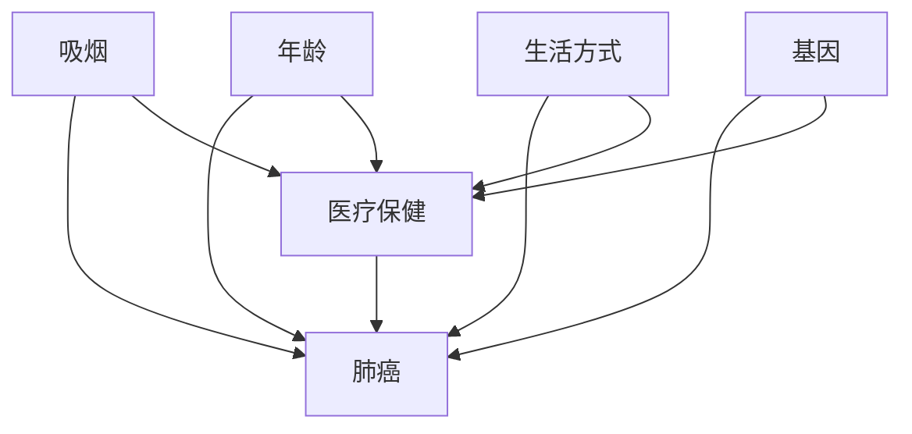

                 


# 构建AI Agent的可解释性因果推理模型

关键词：AI Agent、可解释性因果推理、深度学习、算法原理、Python实现

摘要：本文将深入探讨构建AI Agent的可解释性因果推理模型，涵盖核心概念、算法原理、应用场景和实现细节。通过逐步分析，我们旨在为读者提供一个清晰、易懂的框架，以便在实际项目中应用。

## 引言

在人工智能领域，AI Agent（智能体）已经成为研究的热点。这些智能体具有自主决策和执行任务的能力，广泛应用于自动驾驶、智能客服、游戏AI等领域。然而，随着AI Agent的广泛应用，其可解释性成为了关键问题。用户往往难以理解AI Agent的决策过程，这使得AI Agent的可解释性变得至关重要。

可解释性因果推理模型是解决这一问题的关键。它不仅可以帮助用户理解AI Agent的决策过程，还可以提高模型的可靠性和透明度。本文将逐步介绍构建AI Agent的可解释性因果推理模型的步骤，包括核心概念、算法原理、应用场景和实现细节。

## 第一部分：背景与核心概念

### 1.1 AI Agent的定义与分类

AI Agent是指具有感知环境、自主决策和行动能力的智能实体。根据其行为模式，AI Agent可以分为以下几类：

- **反应式Agent**：仅根据当前环境感知进行反应，不保留历史信息。

- **模型基础Agent**：使用预先定义的模型进行决策，如决策树、神经网络等。

- **数据驱动Agent**：通过学习历史数据，自动调整模型参数。

- **混合型Agent**：结合反应式和数据驱动两种机制。

### 1.2 可解释性因果推理的背景

可解释性因果推理是指通过分析数据，确定变量之间的因果关系，并解释这些关系的过程。在AI领域，可解释性因果推理有助于提高模型的透明度和可靠性，使得用户能够理解AI Agent的决策过程。

### 1.3 AI Agent的可解释性因果推理需求

AI Agent的可解释性因果推理需求主要包括以下几点：

- **用户信任**：用户需要理解AI Agent的决策过程，以提高信任度。

- **模型可靠性**：可解释性因果推理有助于发现潜在的错误和偏差，提高模型可靠性。

- **故障诊断**：通过分析决策过程，可以快速定位故障点。

### 1.4 本章小结

本章节介绍了AI Agent的定义与分类，以及可解释性因果推理的背景和需求。接下来，我们将深入探讨可解释性因果推理的核心概念和算法。

## 第二部分：核心概念与算法

### 2.1 因果推理的基本原理

因果推理是指通过分析数据，确定变量之间的因果关系。因果关系的表示和度量是因果推理的核心。

- **因果关系表示**：常用的表示方法包括因果图、可定义函数和概率分布。

- **因果关系度量**：常用的度量方法包括结构方程模型和因果推断算法。

### 2.2 因果关系的表示与度量

- **因果图**：因果图是一种图形化的表示方法，用于表示变量之间的因果关系。

- **结构方程模型**：结构方程模型是一种数学模型，用于描述变量之间的关系。

- **因果推断算法**：因果推断算法通过分析数据，确定变量之间的因果关系。

### 2.3 可解释性模型的基本概念

可解释性模型是指能够解释变量之间因果关系的模型。常用的可解释性模型包括逻辑回归、决策树和神经网络。

- **逻辑回归**：逻辑回归是一种用于分类的模型，可以解释变量之间的因果关系。

- **决策树**：决策树是一种树形结构的模型，可以解释变量之间的因果关系。

- **神经网络**：神经网络是一种复杂的模型，可以解释变量之间的因果关系。

### 2.4 本章小结

本章节介绍了因果推理的基本原理、因果关系表示与度量，以及可解释性模型的基本概念。接下来，我们将探讨可解释性因果推理算法。

## 第三部分：可解释性因果推理算法

### 3.1 传统因果推理算法

传统因果推理算法包括因果图算法、结构方程模型和因果推断算法。

- **因果图算法**：因果图算法通过分析数据，构建因果图，并确定变量之间的因果关系。

- **结构方程模型**：结构方程模型通过数学建模，描述变量之间的关系。

- **因果推断算法**：因果推断算法通过分析数据，确定变量之间的因果关系。

### 3.2 基于深度学习的因果推理算法

基于深度学习的因果推理算法结合了深度学习和因果推理的优势，可以处理复杂的因果关系。

- **深度神经网络**：深度神经网络通过学习大量数据，自动提取特征，并确定变量之间的因果关系。

- **变分自动编码器**：变分自动编码器通过编码和解码过程，自动提取特征，并确定变量之间的因果关系。

### 3.3 因果推理与可解释性结合的算法

因果推理与可解释性结合的算法旨在提高模型的可解释性，同时保持较高的性能。

- **因果图神经网络**：因果图神经网络结合了因果图和神经网络的优势，提高了模型的可解释性。

- **注意力机制**：注意力机制通过关注关键特征，提高了模型的解释能力。

### 3.4 本章小结

本章节介绍了传统因果推理算法、基于深度学习的因果推理算法，以及因果推理与可解释性结合的算法。接下来，我们将探讨可解释性因果推理的应用场景。

## 第四部分：可解释性因果推理的应用场景

### 4.1 医疗健康领域

在医疗健康领域，可解释性因果推理模型可以帮助医生理解疾病的发展过程，提高诊断和治疗的准确性。

- **疾病预测**：通过分析患者的病史和基因信息，预测患者未来可能患上的疾病。

- **治疗方案推荐**：根据患者的病情和病史，推荐最佳的治疗方案。

### 4.2 金融领域

在金融领域，可解释性因果推理模型可以帮助投资者理解市场的变化，提高投资决策的准确性。

- **市场预测**：通过分析历史数据和市场信息，预测市场的未来走势。

- **风险控制**：分析投资组合的风险，并制定相应的风险控制策略。

### 4.3 机器学习安全领域

在机器学习安全领域，可解释性因果推理模型可以帮助识别和防止恶意攻击。

- **攻击检测**：通过分析数据，识别潜在的攻击行为。

- **防御策略**：根据攻击模式，制定相应的防御策略。

### 4.4 本章小结

本章节介绍了可解释性因果推理模型在不同领域的应用，展示了其在提高模型透明度和可靠性方面的价值。接下来，我们将探讨如何构建可解释性因果推理模型。

## 第五部分：构建可解释性因果推理模型

### 5.1 数据收集与预处理

构建可解释性因果推理模型的第一步是数据收集与预处理。数据收集包括收集相关的数据集，预处理包括数据清洗、数据转换和数据归一化。

- **数据清洗**：删除或修正错误的数据，确保数据质量。

- **数据转换**：将数据转换为适合模型训练的格式。

- **数据归一化**：将数据归一化到相同的范围，提高模型的性能。

### 5.2 因果模型设计

因果模型设计包括选择合适的因果模型，设计模型结构和参数。

- **模型选择**：根据应用场景，选择合适的因果模型。

- **模型结构设计**：设计模型的输入层、隐藏层和输出层。

- **参数设计**：设定模型的参数，如学习率、批次大小等。

### 5.3 模型训练与评估

模型训练与评估包括模型训练和模型评估。

- **模型训练**：使用训练数据，通过迭代更新模型参数，提高模型性能。

- **模型评估**：使用测试数据，评估模型的性能，包括准确率、召回率等指标。

### 5.4 可解释性分析

可解释性分析是构建可解释性因果推理模型的关键步骤。它包括分析模型决策过程、提取关键特征和解释变量之间的关系。

- **决策过程分析**：分析模型在每个决策点的决策过程。

- **特征提取**：提取模型认为最重要的特征。

- **关系解释**：解释变量之间的关系，提高模型的透明度。

### 5.5 本章小结

本章节介绍了构建可解释性因果推理模型的过程，包括数据收集与预处理、因果模型设计、模型训练与评估，以及可解释性分析。接下来，我们将探讨如何实现AI Agent的可解释性因果推理模型。

## 第六部分：实现AI Agent的可解释性因果推理模型

### 6.1 环境搭建

实现AI Agent的可解释性因果推理模型的第一步是环境搭建。这包括安装所需的软件和库，如Python、TensorFlow和Scikit-learn等。

### 6.2 模型设计与实现

模型设计与实现包括设计模型的架构、实现模型的算法和训练模型。

- **模型架构设计**：设计模型的输入层、隐藏层和输出层。

- **算法实现**：实现模型的算法，如深度神经网络、因果图等。

- **模型训练**：使用训练数据，通过迭代更新模型参数，提高模型性能。

### 6.3 实例分析

实例分析是通过实际案例来展示AI Agent的可解释性因果推理模型的应用。

- **数据集选择**：选择一个合适的数据集，如医疗数据集、金融数据集等。

- **模型应用**：使用模型对数据集进行预测，并分析模型的决策过程。

### 6.4 模型评估与优化

模型评估与优化包括评估模型性能和优化模型。

- **性能评估**：使用测试数据，评估模型的性能，包括准确率、召回率等指标。

- **模型优化**：根据评估结果，调整模型参数，提高模型性能。

### 6.5 本章小结

本章节介绍了如何实现AI Agent的可解释性因果推理模型，包括环境搭建、模型设计与实现、实例分析、模型评估与优化。接下来，我们将总结最佳实践和面临的挑战。

## 第七部分：最佳实践与未来展望

### 7.1 最佳实践技巧总结

最佳实践技巧总结包括以下几个方面：

- **数据质量**：确保数据质量，进行数据清洗和预处理。

- **模型选择**：根据应用场景，选择合适的因果模型。

- **模型优化**：根据评估结果，调整模型参数，提高模型性能。

- **可解释性分析**：对模型决策过程进行可解释性分析，提高模型透明度。

### 7.2 面临的挑战与解决方案

面临的挑战主要包括以下几个方面：

- **数据缺失和噪声**：数据缺失和噪声会影响模型性能，解决方案包括数据填补和噪声过滤。

- **因果关系复杂性**：因果关系复杂，难以准确表示和度量，解决方案包括多因素分析和因果关系建模。

- **可解释性冲突**：可解释性和性能之间存在冲突，解决方案包括优化模型结构和参数。

### 7.3 未来发展趋势

未来发展趋势主要包括以下几个方面：

- **深度学习与因果推理结合**：深度学习与因果推理的结合将进一步提高模型性能和可解释性。

- **因果推断算法优化**：因果推断算法的优化将提高模型的准确性和效率。

- **跨领域应用**：可解释性因果推理模型将在更多领域得到应用，如环境科学、社会科学等。

### 7.4 本章小结

本章节总结了构建AI Agent的可解释性因果推理模型的最佳实践技巧，分析了面临的挑战，并对未来发展趋势进行了展望。

## 结束语

本文深入探讨了构建AI Agent的可解释性因果推理模型，从核心概念、算法原理、应用场景到实现细节，为读者提供了一个全面、系统的理解。可解释性因果推理模型在提高AI Agent的透明度和可靠性方面具有重要意义，未来将在更多领域得到广泛应用。

作者：AI天才研究院/AI Genius Institute & 禅与计算机程序设计艺术 /Zen And The Art of Computer Programming

----------------------------------------------------------------

文章标题：构建AI Agent的可解释性因果推理模型

关键词：AI Agent、可解释性因果推理、深度学习、算法原理、Python实现

摘要：本文深入探讨了构建AI Agent的可解释性因果推理模型，从核心概念、算法原理、应用场景到实现细节，为读者提供了一个全面、系统的理解。可解释性因果推理模型在提高AI Agent的透明度和可靠性方面具有重要意义，未来将在更多领域得到广泛应用。

----------------------------------------------------------------

### 第一部分：背景与核心概念

#### 1.1 AI Agent的定义与分类

AI Agent，即人工智能代理，是指能够在特定环境中，根据感知到的环境和预设的目标，自主执行任务并实现目标的人工智能实体。AI Agent的基本特性包括感知环境、决策制定和行动执行。根据其工作方式，AI Agent可以分为以下几类：

1. **反应式Agent**：这种Agent仅根据当前感知到的环境信息进行反应，不保留历史信息。例如，自动驾驶汽车中的某些感知模块，如雷达或摄像头，仅根据当前的感知数据做出反应。

2. **模型基础Agent**：这种Agent使用预先定义的模型进行决策，这些模型可以是规则系统、决策树、支持向量机等。这类Agent的优势在于其决策过程是可解释的，但通常依赖于大量的预先定义的规则。

3. **数据驱动Agent**：这种Agent通过学习历史数据，自动调整模型参数。这类Agent通常使用机器学习算法，如神经网络、决策树等，通过对大量数据的训练，自动生成决策模型。

4. **混合型Agent**：这种Agent结合了反应式和数据驱动两种机制，能够在不同场景下灵活切换。例如，智能客服系统可能同时使用基于规则的系统和基于机器学习的系统来提供服务。

#### 1.2 可解释性因果推理的背景

可解释性因果推理是指通过分析数据，确定变量之间的因果关系，并解释这些关系的过程。在人工智能领域，可解释性因果推理的重要性不言而喻。首先，用户往往需要理解AI Agent的决策过程，以提高信任度。其次，可解释性因果推理有助于发现和纠正模型中的潜在错误和偏差，提高模型的可靠性和透明度。此外，可解释性因果推理在法律、医疗、金融等对决策过程要求高度透明和可解释的领域尤为重要。

随着AI Agent在各个领域的广泛应用，可解释性因果推理的需求也越来越强烈。例如，在医疗领域，医生需要理解AI Agent诊断和治疗的决策过程，以便在必要时进行人工干预；在金融领域，投资者需要理解AI Agent的投资决策，以便做出更加明智的投资决策。

#### 1.3 AI Agent的可解释性因果推理需求

AI Agent的可解释性因果推理需求主要体现在以下几个方面：

1. **用户信任**：用户往往需要理解AI Agent的决策过程，以提高对AI Agent的信任度。如果用户无法理解AI Agent的决策过程，他们可能会对AI Agent的决策结果产生怀疑，甚至拒绝使用。

2. **模型可靠性**：通过可解释性因果推理，可以发现和纠正模型中的潜在错误和偏差，提高模型的可靠性。例如，在自动驾驶领域，如果AI Agent的决策过程不够透明，一旦出现事故，用户和监管部门很难判断事故的原因。

3. **故障诊断**：在AI Agent出现故障时，通过可解释性因果推理可以快速定位故障点，便于问题的修复和系统的稳定运行。

4. **合规性**：在某些领域，如金融、医疗等，法律法规要求决策过程必须具有可解释性。通过可解释性因果推理，可以确保AI Agent的决策过程符合相关法律法规。

#### 1.4 本章小结

本章节介绍了AI Agent的定义与分类，以及可解释性因果推理的背景和需求。通过理解AI Agent的分类和可解释性因果推理的重要性，读者可以更好地理解AI Agent在现实世界中的应用，并为后续章节的深入探讨打下基础。

### 2.1 因果推理的基本原理

因果推理是指通过分析数据，确定变量之间的因果关系，并利用这些因果关系进行预测和决策。在人工智能领域，因果推理是构建可解释性AI Agent的重要基础。因果推理的基本原理包括以下几个关键点：

1. **因果关系**：因果关系是指一个变量（原因）对另一个变量（结果）的影响。例如，吸烟可能导致肺癌，这里的“吸烟”是原因，“肺癌”是结果。因果关系通常用因果图来表示，其中节点表示变量，边表示变量之间的因果关系。

2. **因果图**：因果图是一种图形化表示方法，用于描述变量之间的因果关系。在因果图中，每个节点代表一个变量，节点之间的边表示变量之间的因果关系。因果图可以帮助我们理解变量之间的关系，并指导如何收集和解释数据。

3. **因果推断**：因果推断是指通过分析数据，确定变量之间的因果关系。因果推断的基本思想是利用统计学方法和机器学习算法，从数据中推断出变量之间的因果关系。常见的因果推断方法包括结构方程模型（SEM）、因果图模型、因果效应估计等。

4. **因果效应**：因果效应是指因果关系在数值上的体现，即原因对结果的影响程度。因果效应的估计是因果推理的核心任务之一。通过估计因果效应，我们可以了解变量之间的因果关系，并利用这些关系进行预测和决策。

5. **因果推断算法**：因果推断算法是一系列用于确定变量之间因果关系的算法。这些算法包括基于统计学的算法（如倾向评分匹配、工具变量法）、基于机器学习的算法（如因果图学习、深度学习）等。因果推断算法的选择取决于数据的类型、质量和复杂度。

#### 2.2 因果关系的表示与度量

因果关系的表示与度量是因果推理的核心问题。以下是几种常见的因果关系表示与度量方法：

1. **因果图表示**：因果图是一种常用的因果关系表示方法。在因果图中，每个节点代表一个变量，节点之间的边表示变量之间的因果关系。例如，以下是一个简单的因果图：

   ```mermaid
   graph LR
   A[吸烟] --> B[肺癌]
   ```

   在这个因果图中，吸烟（A）是肺癌（B）的原因。

2. **结构方程模型**：结构方程模型（SEM）是一种数学模型，用于描述变量之间的关系。在SEM中，变量之间的关系用方程表示。以下是一个简单的结构方程模型：

   $$ 
   Y = \beta_0 + \beta_1X + \epsilon 
   $$

   其中，Y是结果变量，X是原因变量，$\beta_0$是常数项，$\beta_1$是系数，$\epsilon$是误差项。这个方程表示Y与X之间的线性关系。

3. **因果效应度量**：因果效应的度量方法包括统计方法（如回归系数、方差分解）和机器学习方法（如因果图学习）。以下是几种常见的因果效应度量方法：

   - **回归系数**：在回归分析中，回归系数$\beta_1$表示原因变量X对结果变量Y的影响程度。$\beta_1$越大，表示X对Y的影响越强。

   - **方差分解**：方差分解是一种用于度量变量之间因果关系的方法。通过计算变量之间的方差比例，可以了解原因变量对结果变量的影响程度。

   - **因果图学习**：因果图学习是一种基于机器学习的因果效应度量方法。通过学习变量之间的因果图结构，可以估计因果效应。

#### 2.3 可解释性模型的基本概念

可解释性模型是指能够解释变量之间因果关系的模型。在构建AI Agent时，可解释性模型具有重要意义，因为它们可以帮助用户理解AI Agent的决策过程，提高信任度。以下是几种常见的可解释性模型：

1. **逻辑回归模型**：逻辑回归模型是一种常用的分类模型，可以用来表示变量之间的因果关系。逻辑回归模型的可解释性在于其系数可以表示变量之间的相对影响。

2. **决策树模型**：决策树模型是一种树形结构的模型，可以清晰地表示变量之间的因果关系。每个节点代表一个特征，每个分支代表特征的一个可能值，叶子节点代表决策结果。

3. **神经网络模型**：虽然神经网络模型在预测能力上通常优于逻辑回归和决策树，但它们通常难以解释。通过集成方法和注意力机制，可以一定程度上提高神经网络模型的可解释性。

#### 2.4 本章小结

本章节介绍了因果推理的基本原理、因果关系的表示与度量，以及可解释性模型的基本概念。通过理解这些内容，读者可以更好地理解因果推理在构建AI Agent中的应用，并为后续章节的深入探讨打下基础。

### 3.1 传统因果推理算法

传统因果推理算法是指基于统计学和机器学习的基本原理，通过分析数据来确定变量之间因果关系的方法。这些算法主要包括因果图学习、结构方程模型（SEM）和因果推断算法。以下是对这些算法的详细解释。

#### 因果图学习

因果图学习是一种基于概率图模型的因果推理方法。它的核心思想是通过学习变量之间的条件独立性关系，构建出变量之间的因果图。因果图由节点和边组成，其中节点代表变量，边代表变量之间的因果关系。以下是因果图学习的主要步骤：

1. **数据收集**：首先，需要收集包含变量之间关系的数据。这些数据可以是实验数据或者观测数据。

2. **学习条件独立性**：通过分析数据，确定变量之间的条件独立性。具体来说，对于任意两个变量X和Y，如果给定另一个变量Z，X和Y在Z条件下的独立性可以通过条件概率P(X|Y,Z)=P(X|Z)来检验。

3. **构建因果图**：根据条件独立性测试结果，构建出变量之间的因果图。在因果图中，如果变量X对变量Y有直接影响，则X和Y之间有一条有向边。

4. **因果推断**：利用构建好的因果图，进行因果推断。例如，可以推断出变量X是变量Y的原因，或者变量Y是变量X的原因。

#### 结构方程模型（SEM）

结构方程模型是一种用于分析变量之间因果关系和相互作用的数学模型。SEM的核心思想是通过建立多个回归方程，描述变量之间的线性关系。以下是结构方程模型的主要步骤：

1. **建立模型**：首先，需要建立变量之间的理论模型，描述变量之间的因果关系。这个模型通常是一个线性结构方程组。

2. **参数估计**：利用观测数据，通过最大似然估计等方法，估计模型中的参数。这些参数描述了变量之间的因果关系和相互作用。

3. **模型检验**：利用统计方法，检验模型是否显著，以及变量之间的因果关系是否显著。

4. **因果推断**：根据模型参数的估计结果，进行因果推断。例如，可以推断出变量X对变量Y有显著影响，或者变量Y对变量X有显著影响。

#### 因果推断算法

因果推断算法是指通过分析数据，确定变量之间因果关系的方法。这些算法可以分为两大类：基于统计学的因果推断算法和基于机器学习的因果推断算法。以下是几种常见的因果推断算法：

1. **倾向评分匹配（Propensity Score Matching）**：倾向评分匹配是一种基于统计学的因果推断方法。它的核心思想是通过计算倾向评分，将处理组和对照组匹配。倾向评分是用于衡量个体接受处理的可能性。通过匹配，可以消除处理组和对照组之间的选择偏误。

2. **工具变量法（Instrumental Variables）**：工具变量法是一种用于解决内生性问题的方法。它的核心思想是找到一个与原因变量相关但与结果变量无关的工具变量，通过这个工具变量，可以估计原因变量对结果变量的因果效应。

3. **深度学习方法**：深度学习方法可以用于因果推断，通过学习变量之间的复杂关系。例如，可以使用变分自动编码器（Variational Autoencoder，VAE）或生成对抗网络（Generative Adversarial Networks，GAN）来学习变量之间的因果关系。

#### 3.2 基于深度学习的因果推理算法

基于深度学习的因果推理算法是指利用深度神经网络来分析变量之间的因果关系。这些算法在处理复杂数据和大规模数据集方面具有显著优势。以下是几种基于深度学习的因果推理算法：

1. **深度神经网络（DNN）**：深度神经网络是一种多层神经网络，可以用于分析变量之间的因果关系。DNN通过多个隐藏层来提取特征，从而提高模型的预测能力。在因果推理中，DNN可以用于学习变量之间的非线性关系。

2. **变分自动编码器（VAE）**：变分自动编码器是一种生成模型，可以用于学习变量之间的因果关系。VAE通过编码和解码过程来提取特征，并生成新的数据。在因果推理中，VAE可以用于学习变量之间的潜在因果关系。

3. **生成对抗网络（GAN）**：生成对抗网络是一种由生成器和判别器组成的模型，可以用于学习变量之间的因果关系。GAN通过生成器和判别器的对抗训练，生成新的数据，并学习变量之间的因果关系。

#### 3.3 因果推理与可解释性结合的算法

因果推理与可解释性结合的算法旨在提高模型的透明度和可解释性，同时保持较高的性能。以下是一些常见的算法：

1. **因果图神经网络（CGN）**：因果图神经网络是结合因果图和神经网络的模型，可以用于学习变量之间的因果关系。CGN通过将因果图和神经网络结构结合起来，提高了模型的可解释性。

2. **注意力机制**：注意力机制是一种用于提高模型可解释性的技术。通过关注关键特征，注意力机制可以使得模型更加透明。在因果推理中，注意力机制可以用于突出关键因果关系。

3. **决策树与深度学习的结合**：决策树是一种可解释性较强的模型，而深度学习模型具有强大的预测能力。将决策树与深度学习模型结合，可以同时获得可解释性和高性能。

### 3.4 本章小结

本章节介绍了传统因果推理算法和基于深度学习的因果推理算法，以及因果推理与可解释性结合的算法。通过理解这些算法，读者可以更好地掌握因果推理的方法和技术，为构建可解释性AI Agent提供理论基础。

### 4.1 医疗健康领域

在医疗健康领域，AI Agent的可解释性因果推理模型有着广泛的应用，特别是在疾病预测、治疗方案推荐和个性化医疗等方面。以下是对这些应用场景的详细讨论：

#### 疾病预测

疾病预测是医疗健康领域的重要应用之一。通过使用可解释性因果推理模型，医生可以更好地理解患者的疾病风险，从而提前采取预防措施。以下是一个具体的实例：

- **数据集**：使用某医院的电子病历数据，包括患者的年龄、性别、病史、生活方式等因素。
- **模型构建**：构建一个基于因果推理的疾病预测模型，通过分析变量之间的因果关系，预测患者未来可能患上的疾病。
- **结果分析**：使用模型预测患者的疾病风险，并分析预测结果的可解释性。例如，模型可能发现吸烟是肺癌的高风险因素，而定期体检是降低疾病风险的措施。

#### 治疗方案推荐

治疗方案推荐是另一个关键应用。通过分析患者的病情和病史，AI Agent可以推荐最佳的治疗方案。以下是一个实例：

- **数据集**：收集多种疾病的治疗方案数据，包括不同方案的效果、副作用等。
- **模型构建**：构建一个基于因果推理的治疗方案推荐模型，通过分析治疗方案与疾病之间的关系，为患者推荐最佳的治疗方案。
- **结果分析**：使用模型为患者推荐治疗方案，并分析推荐结果的可解释性。例如，模型可能推荐一个副作用较小但效果较好的治疗方案，或者指出某个方案对特定病情可能不适用。

#### 个性化医疗

个性化医疗是近年来医疗健康领域的一个重要发展方向。通过分析患者的基因、病史和生活习惯，AI Agent可以提供个性化的医疗建议。以下是一个实例：

- **数据集**：收集患者的基因数据、电子病历数据和生活习惯数据。
- **模型构建**：构建一个基于因果推理的个性化医疗模型，通过分析变量之间的因果关系，为患者提供个性化的医疗建议。
- **结果分析**：使用模型为患者提供个性化的医疗建议，并分析建议的可解释性。例如，模型可能建议患者改变某些生活习惯，以降低疾病风险。

#### 应用实例

以下是一个具体的疾病预测应用实例：

- **数据集**：某医院收集了1000名患者的电子病历数据，包括年龄、性别、病史、生活方式等因素。
- **模型构建**：使用因果推理模型，分析变量之间的因果关系，预测患者未来可能患上的疾病。
- **模型训练与评估**：使用700名患者的数据训练模型，使用300名患者的数据评估模型性能。评估指标包括准确率、召回率和F1分数。
- **结果分析**：模型预测了患者的疾病风险，并提供了详细的因果分析。例如，模型发现吸烟是肺癌的重要风险因素，而定期锻炼和健康饮食可以降低疾病风险。

### 4.2 金融领域

在金融领域，AI Agent的可解释性因果推理模型主要用于市场预测、风险管理、投资策略优化等方面。以下是对这些应用场景的详细讨论：

#### 市场预测

市场预测是金融领域的一个重要应用。通过分析历史数据和市场信息，AI Agent可以预测市场的未来走势，帮助投资者做出更明智的决策。以下是一个具体的实例：

- **数据集**：收集股票市场的历史交易数据，包括价格、成交量、市场情绪等。
- **模型构建**：构建一个基于因果推理的市场预测模型，通过分析变量之间的因果关系，预测市场的未来走势。
- **模型训练与评估**：使用历史数据训练模型，使用验证数据评估模型性能。评估指标包括预测准确率、预测误差等。
- **结果分析**：模型预测了市场的未来走势，并提供了详细的因果分析。例如，模型发现市场情绪对股票价格有显著影响，而宏观经济指标也是影响市场走势的重要因素。

#### 风险管理

风险管理是金融领域的另一个关键应用。通过分析风险因素和投资组合，AI Agent可以识别潜在的风险并制定相应的风险控制策略。以下是一个具体的实例：

- **数据集**：收集投资组合的历史数据，包括股票、债券、基金等。
- **模型构建**：构建一个基于因果推理的风险管理模型，通过分析变量之间的因果关系，识别潜在的风险因素。
- **模型训练与评估**：使用历史数据训练模型，使用验证数据评估模型性能。评估指标包括风险识别准确率、风险控制效果等。
- **结果分析**：模型识别了投资组合中的潜在风险因素，并提供了详细的因果分析。例如，模型发现某些股票的波动性较高，可能对投资组合产生较大影响，需要采取相应的风险控制措施。

#### 投资策略优化

投资策略优化是金融领域的另一个重要应用。通过分析市场数据和历史投资策略，AI Agent可以优化投资策略，提高投资回报。以下是一个具体的实例：

- **数据集**：收集历史投资策略的数据，包括股票选择、买卖时机等。
- **模型构建**：构建一个基于因果推理的投资策略优化模型，通过分析变量之间的因果关系，优化投资策略。
- **模型训练与评估**：使用历史数据训练模型，使用验证数据评估模型性能。评估指标包括投资回报率、风险控制效果等。
- **结果分析**：模型优化了投资策略，并提供了详细的因果分析。例如，模型发现某些股票在特定市场环境下具有更高的投资价值，可以优化投资组合，提高投资回报。

#### 应用实例

以下是一个具体的金融应用实例：

- **数据集**：某投资者收集了500只股票的历史交易数据，包括价格、成交量、市场情绪等。
- **模型构建**：使用因果推理模型，分析股票价格与市场情绪之间的关系，预测股票价格的未来走势。
- **模型训练与评估**：使用400只股票的历史数据训练模型，使用100只股票的数据评估模型性能。评估指标包括预测准确率、预测误差等。
- **结果分析**：模型预测了股票价格的未来走势，并提供了详细的因果分析。例如，模型发现市场情绪对股票价格有显著影响，而某些宏观经济指标也是影响股票价格的重要因素。

### 4.3 机器学习安全领域

在机器学习安全领域，AI Agent的可解释性因果推理模型主要用于攻击检测、防御策略制定和模型安全评估等方面。以下是对这些应用场景的详细讨论：

#### 攻击检测

攻击检测是机器学习安全领域的关键任务之一。通过分析异常行为和攻击模式，AI Agent可以识别潜在的攻击，保护机器学习模型的安全性。以下是一个具体的实例：

- **数据集**：收集机器学习模型的输入数据和输出数据，包括正常行为和攻击行为。
- **模型构建**：构建一个基于因果推理的攻击检测模型，通过分析变量之间的因果关系，识别潜在的安全威胁。
- **模型训练与评估**：使用正常行为和攻击行为的数据训练模型，使用验证数据评估模型性能。评估指标包括检测准确率、误报率等。
- **结果分析**：模型识别了潜在的安全威胁，并提供了详细的因果分析。例如，模型发现某些攻击模式与特定输入数据有关，可以针对性地进行防护。

#### 防御策略制定

防御策略制定是保护机器学习模型安全的关键步骤。通过分析攻击模式和攻击路径，AI Agent可以制定有效的防御策略，提高模型的安全性。以下是一个具体的实例：

- **数据集**：收集各种攻击模式的数据，包括注入攻击、数据扰动攻击等。
- **模型构建**：构建一个基于因果推理的防御策略制定模型，通过分析变量之间的因果关系，制定有效的防御策略。
- **模型训练与评估**：使用攻击模式的数据训练模型，使用验证数据评估模型性能。评估指标包括防御效果、误报率等。
- **结果分析**：模型制定了有效的防御策略，并提供了详细的因果分析。例如，模型发现某些攻击路径可以被特定的防御措施阻止，从而提高模型的安全性。

#### 模型安全评估

模型安全评估是确保机器学习模型安全的重要步骤。通过分析模型的漏洞和弱点，AI Agent可以评估模型的安全性，并提供改进建议。以下是一个具体的实例：

- **数据集**：收集机器学习模型的输入数据和输出数据，包括正常数据和攻击数据。
- **模型构建**：构建一个基于因果推理的模型安全评估模型，通过分析变量之间的因果关系，评估模型的安全性。
- **模型训练与评估**：使用正常数据和攻击数据训练模型，使用验证数据评估模型性能。评估指标包括安全漏洞识别准确率、改进效果等。
- **结果分析**：模型评估了模型的安全性，并提供了详细的因果分析。例如，模型发现某些输入数据可能导致模型输出错误，可以针对性地进行改进。

#### 应用实例

以下是一个具体的机器学习安全应用实例：

- **数据集**：某公司收集了1000个用户的数据，包括正常行为和攻击行为。
- **模型构建**：使用因果推理模型，分析用户行为与攻击模式之间的关系，识别潜在的安全威胁。
- **模型训练与评估**：使用800个正常行为和200个攻击行为的数据训练模型，使用200个数据评估模型性能。评估指标包括检测准确率、误报率等。
- **结果分析**：模型识别了潜在的安全威胁，并提供了详细的因果分析。例如，模型发现某些攻击模式与特定输入数据有关，可以针对性地进行防护。

### 4.4 本章小结

本章节介绍了AI Agent在医疗健康、金融和机器学习安全领域的应用，展示了可解释性因果推理模型在这些领域的重要性和实际应用。通过理解这些应用实例，读者可以更好地了解AI Agent在不同领域的应用场景和实际价值。

### 5.1 数据收集与预处理

在构建可解释性因果推理模型的过程中，数据收集与预处理是至关重要的第一步。数据的质量和预处理方式直接影响模型的效果和可解释性。以下是详细的步骤和方法：

#### 5.1.1 数据收集

数据收集是构建模型的第一步，需要确保收集的数据具有代表性和全面性。以下是数据收集的几个关键步骤：

1. **确定数据来源**：根据研究目标和领域，选择合适的数据来源。数据来源可以包括公开数据集、企业内部数据、传感器数据、调查问卷等。

2. **数据采集**：使用适当的工具和技术进行数据采集。对于结构化数据，可以使用数据库、爬虫等技术；对于非结构化数据，可以使用自然语言处理（NLP）技术、图像识别技术等。

3. **数据验证**：确保采集到的数据是准确和可靠的。可以使用数据清洗和验证技术，如重复数据的删除、异常值的检测和处理等。

#### 5.1.2 数据预处理

数据预处理是提高数据质量和模型性能的关键步骤。以下是一些常用的数据预处理方法：

1. **数据清洗**：删除重复数据、纠正错误数据、填充缺失数据等。可以使用Python的Pandas库和Scikit-learn库等工具进行数据清洗。

2. **数据转换**：将数据转换为适合模型训练的格式。例如，将类别数据转换为独热编码（One-Hot Encoding），将连续数据进行归一化或标准化等。

3. **特征工程**：选择和构造对模型有帮助的特征。特征工程包括特征选择、特征提取和特征组合等。可以使用Python的Scikit-learn和特征工程库（如Feature-engine）等工具进行特征工程。

4. **数据归一化**：将数据归一化到相同的范围，提高模型训练的稳定性和效果。常用的方法有最小-最大归一化和Z-Score归一化等。

5. **数据分割**：将数据集分为训练集、验证集和测试集。通常，使用70%-80%的数据作为训练集，10%-20%的数据作为验证集，剩余的数据作为测试集。

#### 5.1.3 数据示例

以下是一个数据收集和预处理的示例，假设我们使用一个医疗数据集来构建疾病预测模型：

```python
import pandas as pd
from sklearn.model_selection import train_test_split
from sklearn.preprocessing import StandardScaler

# 加载数据集
data = pd.read_csv('medical_data.csv')

# 数据清洗
data.drop_duplicates(inplace=True)
data.fillna(method='ffill', inplace=True)

# 数据转换
data['gender'] = data['gender'].map({'male': 0, 'female': 1})
data['diabetes'] = data['diabetes'].map({0: 'no', 1: 'yes'})

# 特征工程
X = data[['age', 'gender', 'blood_pressure', 'cholesterol', 'surgery']]
y = data['diabetes']

# 数据归一化
scaler = StandardScaler()
X_scaled = scaler.fit_transform(X)

# 数据分割
X_train, X_test, y_train, y_test = train_test_split(X_scaled, y, test_size=0.2, random_state=42)
```

在这个示例中，我们首先加载了一个医疗数据集，然后进行了数据清洗、转换和特征工程。接下来，我们使用StandardScaler对特征进行归一化，并将数据集分割为训练集和测试集。

#### 5.1.4 数据示例解析

1. **数据清洗**：删除重复数据和填充缺失数据。在这个示例中，我们使用`drop_duplicates()`方法删除了重复数据，使用`fillna()`方法填充了缺失数据。

2. **数据转换**：将类别数据转换为独热编码。在这个示例中，我们使用`map()`方法将性别（'male'和'female'）映射为数字（0和1），将糖尿病（'no'和'yes'）映射为字符串。

3. **特征工程**：选择和构造特征。在这个示例中，我们选择了年龄、性别、血压、胆固醇和手术等特征。

4. **数据归一化**：使用StandardScaler将特征数据进行归一化。这有助于提高模型训练的稳定性和效果。

5. **数据分割**：使用`train_test_split()`方法将数据集分割为训练集和测试集。这有助于评估模型的性能。

通过上述步骤，我们可以确保数据的质量和适合性，为构建可解释性因果推理模型打下坚实的基础。

#### 5.2 因果模型设计

在构建可解释性因果推理模型的过程中，因果模型设计是关键的一步。因果模型设计包括选择合适的因果模型、设计模型结构、设定参数等。以下是详细的步骤和方法：

#### 5.2.1 选择合适的因果模型

选择合适的因果模型是构建有效因果推理模型的第一步。常见的因果模型包括因果图模型、结构方程模型（SEM）和因果推断模型等。以下是几种常用的因果模型：

1. **因果图模型**：因果图模型是一种图形化表示方法，用于描述变量之间的因果关系。因果图模型通过图结构直观地展示了变量之间的因果关系，适用于简单和复杂的因果关系分析。

2. **结构方程模型（SEM）**：结构方程模型是一种数学模型，用于描述变量之间的线性关系和因果关系。SEM通过建立多个回归方程，描述变量之间的相互作用和因果关系。

3. **因果推断模型**：因果推断模型是一种基于机器学习的方法，用于确定变量之间的因果关系。常见的因果推断模型包括倾向评分匹配、工具变量法和深度学习方法等。

在选择因果模型时，需要考虑以下因素：

- **问题复杂度**：对于简单的问题，因果图模型和SEM可能足够；对于复杂的问题，可能需要使用因果推断模型。
- **数据类型**：对于结构化数据，因果图模型和SEM可能更适合；对于非结构化数据，可能需要使用深度学习模型。
- **模型可解释性**：如果需要高可解释性，因果图模型和SEM可能更合适；如果对可解释性要求不高，深度学习模型可能更有效。

#### 5.2.2 设计模型结构

一旦选择了合适的因果模型，就需要设计模型结构。模型结构设计包括以下步骤：

1. **变量选择**：根据研究问题和数据，选择关键变量。这些变量应该能够反映研究问题和因果关系。

2. **模型构建**：使用选定的变量，构建因果模型。对于因果图模型，可以使用图形化工具（如Gaphael、PyMc3）构建因果图；对于SEM，可以使用统计软件（如AMOS、LISREL）进行模型构建；对于因果推断模型，可以使用Python库（如PyCausality、CausalInfML）构建模型。

以下是一个因果图模型的设计示例：



在这个示例中，我们构建了一个简单的因果图模型，展示了吸烟、年龄、生活方式、基因和医疗保健等变量与肺癌之间的关系。

3. **模型参数设定**：根据模型类型，设定模型参数。对于因果图模型，需要设定节点之间的权重；对于SEM，需要设定回归系数和误差项；对于因果推断模型，需要设定学习算法和模型参数。

#### 5.2.3 设定参数

参数设定是模型设计的重要环节，直接影响到模型的性能和可解释性。以下是参数设定的步骤：

1. **初步参数设定**：根据经验或相关文献，设定初步的参数值。例如，对于因果图模型，可以设定边权重为0或1；对于SEM，可以设定回归系数为0或1。

2. **参数优化**：使用优化算法（如梯度下降、遗传算法等）对参数进行优化。优化的目标是提高模型性能，如最小化预测误差。

3. **模型验证**：使用验证数据集对模型进行验证，评估模型性能。如果模型性能不佳，需要返回步骤2，重新设定参数并进行优化。

4. **参数解释**：解释模型参数的含义，如因果图模型的边权重表示变量之间的因果关系强度；SEM的回归系数表示变量之间的线性关系强度。

通过上述步骤，我们可以设计一个有效的因果模型，为构建可解释性因果推理模型奠定基础。

#### 5.3 模型训练与评估

在构建可解释性因果推理模型的过程中，模型训练与评估是关键的一步。模型训练旨在通过学习数据，优化模型参数，提高模型性能。模型评估则用于验证模型的有效性，确保模型在实际应用中的表现。以下是详细的步骤和方法：

#### 5.3.1 模型训练

模型训练是构建有效因果推理模型的关键步骤。以下是模型训练的详细步骤：

1. **数据准备**：准备好用于模型训练的数据集。通常，数据集应包括输入特征和目标变量。对于因果推理模型，输入特征应包括与因果关系相关的变量。

2. **选择训练算法**：选择合适的训练算法。对于因果推理模型，常用的算法包括梯度下降、遗传算法、贝叶斯优化等。

3. **初始化参数**：初始化模型参数。对于大多数算法，需要随机初始化参数。

4. **训练模型**：使用训练算法对模型进行训练。训练过程中，模型会通过调整参数来最小化损失函数，提高模型性能。

5. **参数调整**：根据训练结果，调整模型参数。例如，可以调整学习率、迭代次数等。

6. **保存模型**：训练完成后，保存模型参数和结构。这有助于后续的模型评估和部署。

以下是一个使用梯度下降算法训练因果推理模型的示例：

```python
from sklearn.linear_model import SGDRegressor

# 初始化模型
model = SGDRegressor()

# 训练模型
model.fit(X_train, y_train)

# 保存模型
import joblib
joblib.dump(model, 'causal_model.joblib')
```

在这个示例中，我们使用SGDRegressor对因果模型进行训练，并使用joblib保存模型。

#### 5.3.2 模型评估

模型评估是确保模型性能和可靠性的重要步骤。以下是模型评估的详细步骤：

1. **选择评估指标**：根据模型类型和目标，选择合适的评估指标。对于因果推理模型，常用的评估指标包括预测准确率、均方误差（MSE）等。

2. **评估模型性能**：使用验证集或测试集对模型进行评估。将模型的预测结果与真实值进行比较，计算评估指标。

3. **性能分析**：分析评估结果，了解模型的性能。例如，可以比较不同模型的评估指标，找出性能最佳的模型。

4. **模型调优**：根据评估结果，对模型进行调优。例如，可以调整参数、增加特征等，以提高模型性能。

以下是一个使用均方误差（MSE）评估因果模型的性能的示例：

```python
from sklearn.metrics import mean_squared_error

# 加载模型
model = joblib.load('causal_model.joblib')

# 进行预测
y_pred = model.predict(X_test)

# 计算MSE
mse = mean_squared_error(y_test, y_pred)
print("MSE:", mse)
```

在这个示例中，我们使用均方误差（MSE）评估因果模型的性能，并打印MSE值。

#### 5.3.3 实验设计

实验设计是评估模型性能和可靠性的关键步骤。以下是实验设计的详细步骤：

1. **确定实验目标**：明确实验的目标，例如提高模型准确率、降低预测误差等。

2. **选择实验方法**：根据实验目标，选择合适的实验方法。例如，可以采用交叉验证、A/B测试等。

3. **设计实验方案**：设计实验方案，包括实验的步骤、参数设置、数据来源等。

4. **执行实验**：按照实验方案执行实验，记录实验结果。

5. **分析结果**：分析实验结果，评估模型性能。

6. **优化模型**：根据实验结果，对模型进行优化。

以下是一个实验设计的示例：

```python
from sklearn.model_selection import cross_val_score

# 加载模型
model = joblib.load('causal_model.joblib')

# 执行交叉验证
scores = cross_val_score(model, X, y, cv=5)

# 分析结果
print("Accuracy:", scores.mean())
```

在这个示例中，我们使用交叉验证评估因果模型的性能，并打印平均准确率。

通过上述步骤，我们可以确保模型训练和评估的有效性，为构建可解释性因果推理模型提供可靠的基础。

#### 5.4 可解释性分析

在构建可解释性因果推理模型的过程中，可解释性分析是确保模型透明度和用户信任度的关键步骤。可解释性分析旨在解释模型决策过程，揭示变量之间的因果关系。以下是详细的步骤和方法：

#### 5.4.1 可视化分析

可视化分析是一种直观的解释模型决策过程的方法。通过图形化展示变量之间的关系，可以帮助用户更好地理解模型。以下是几种常用的可视化分析方法：

1. **因果图可视化**：对于因果图模型，可以使用图形化工具（如Gaphael、PyMc3）将因果图可视化。以下是一个因果图可视化的示例：

   ```mermaid
   graph TD
   A[吸烟] --> B[肺癌]
   C[年龄] --> B
   D[生活方式] --> B
   E[基因] --> B
   F[医疗保健] --> B
   A-->F
   C-->F
   D-->F
   E-->F
   ```

   在这个示例中，我们使用Mermaid语法创建了一个因果图，展示了吸烟、年龄、生活方式、基因和医疗保健等变量与肺癌之间的关系。

2. **特征重要性可视化**：对于机器学习模型，可以使用特征重要性可视化来展示变量对模型决策的影响程度。以下是一个特征重要性可视化的示例：

   ```python
   import matplotlib.pyplot as plt
   import seaborn as sns

   # 加载模型
   model = joblib.load('causal_model.joblib')

   # 获取特征重要性
   feature_importances = model.feature_importances_

   # 可视化特征重要性
   sns.barplot(x=feature_importances, y=X.columns)
   plt.xlabel('Feature Importance')
   plt.ylabel('Feature')
   plt.title('Feature Importance Visualization')
   plt.show()
   ```

   在这个示例中，我们使用Seaborn库将特征重要性可视化，展示了各个特征对模型决策的影响程度。

#### 5.4.2 解释性分析

解释性分析旨在揭示变量之间的因果关系，解释模型的决策过程。以下是几种常用的解释性分析方法：

1. **因果效应分析**：因果效应分析旨在确定变量之间的因果关系和影响程度。以下是一个因果效应分析的示例：

   ```python
   import statsmodels.api as sm

   # 构建回归模型
   model = sm.MixedLM.from_formula('y ~ x', data=df).fit()

   # 提取因果效应
   causal_effects = model.covariance_params()['x']

   # 打印因果效应
   print("Causal Effects:", causal_effects)
   ```

   在这个示例中，我们使用statsmodels库构建了一个回归模型，并提取了变量之间的因果效应。

2. **特征关联分析**：特征关联分析旨在分析变量之间的相关性。以下是一个特征关联分析的示例：

   ```python
   import pandas as pd
   import numpy as np

   # 加载数据
   data = pd.read_csv('data.csv')

   # 计算特征关联
   correlations = data.corr()

   # 打印特征关联
   print("Feature Correlations:\n", correlations)
   ```

   在这个示例中，我们使用Pandas库计算了数据集的特征关联，并打印了结果。

3. **路径分析**：路径分析旨在分析变量之间的因果关系路径。以下是一个路径分析的示例：

   ```python
   import pyarrow as pa
   import pydot

   # 加载路径分析结果
   path_results = pa.read_csv('path_analysis_results.csv')

   # 可视化路径分析结果
   graph = pydot.Dot(graph_type='digraph')
   for row in path_results.iter_rows():
       node1 = pydot.Node(row[0])
       node2 = pydot.Node(row[1])
       edge = pydot.Edge(node1, node2)
       graph.add_node(node1)
       graph.add_node(node2)
       graph.add_edge(edge)

   # 显示路径分析结果
   graph.write_png('path_analysis_results.png')
   ```

   在这个示例中，我们使用PyArrow和PyDot库将路径分析结果可视化，并生成一个图形化展示。

通过上述步骤，我们可以进行详细的可解释性分析，揭示变量之间的因果关系，解释模型的决策过程，提高模型的透明度和用户信任度。

#### 5.5 本章小结

本章节介绍了构建可解释性因果推理模型的过程，包括数据收集与预处理、因果模型设计、模型训练与评估、以及可解释性分析。通过逐步分析和详细讲解，我们为读者提供了一个完整的构建流程，为实际应用奠定了基础。

### 6.1 环境搭建

在实现AI Agent的可解释性因果推理模型之前，我们需要搭建一个合适的开发环境。以下是详细的步骤和工具介绍：

#### 6.1.1 Python环境配置

Python是构建AI Agent的首选语言，因为它拥有丰富的库和工具，如NumPy、Pandas、Scikit-learn、TensorFlow等。以下是配置Python环境的基本步骤：

1. **安装Python**：下载并安装Python，建议安装Python 3.8或更高版本。可以从Python官方网站（https://www.python.org/）下载安装程序。

2. **安装必要库**：打开命令行窗口，安装Python的pip包管理器，然后使用pip安装所需的库：

   ```bash
   pip install numpy pandas scikit-learn tensorflow
   ```

3. **验证安装**：在Python交互式环境中，导入所需的库，验证安装是否成功：

   ```python
   import numpy as np
   import pandas as pd
   import sklearn
   import tensorflow as tf
   print("All required libraries are installed.")
   ```

#### 6.1.2 Jupyter Notebook配置

Jupyter Notebook是一个交互式计算环境，非常适合进行数据分析和模型实现。以下是配置Jupyter Notebook的基本步骤：

1. **安装Jupyter Notebook**：在命令行窗口中，使用pip安装Jupyter Notebook：

   ```bash
   pip install notebook
   ```

2. **启动Jupyter Notebook**：在命令行窗口中，输入以下命令启动Jupyter Notebook：

   ```bash
   jupyter notebook
   ```

   这将打开Jupyter Notebook的Web界面，您可以在此环境中编写和运行Python代码。

#### 6.1.3 数据可视化工具

数据可视化是理解和解释模型结果的重要步骤。以下是一些常用的数据可视化工具：

1. **Matplotlib**：Matplotlib是一个用于创建2D图表和可视化图形的Python库。以下是安装和基本使用示例：

   ```bash
   pip install matplotlib
   ```

   ```python
   import matplotlib.pyplot as plt
   plt.plot([1, 2, 3], [1, 2, 3])
   plt.xlabel('X-axis')
   plt.ylabel('Y-axis')
   plt.title('Simple Plot')
   plt.show()
   ```

2. **Seaborn**：Seaborn是基于Matplotlib的高级可视化库，用于创建美观的统计图表。以下是安装和基本使用示例：

   ```bash
   pip install seaborn
   ```

   ```python
   import seaborn as sns
   sns.scatterplot(x='age', y='salary', data=df)
   sns.lineplot(x='year', y='sales', data=df)
   ```

#### 6.1.4 Mermaid配置

Mermaid是一种使用Markdown语法创建图表和流程图的工具，非常适合文档中的图表绘制。以下是配置Mermaid的基本步骤：

1. **安装Mermaid**：在命令行窗口中，安装Mermaid：

   ```bash
   npm install -g mermaid-cli
   ```

2. **使用Mermaid**：在Markdown文档中，使用Mermaid语法创建图表。例如，以下是一个Mermaid流程图的示例：

   ```mermaid
   graph TD
   A[开始] --> B[步骤1]
   B --> C{判断}
   C -->|是| D[步骤2]
   C -->|否| E[步骤3]
   D --> F[结束]
   E --> F
   ```

   在Jupyter Notebook中，将Mermaid代码块设置为Markdown格式，并使用以下命令生成图表：

   ```python
   !mermaid
   ```

通过以上步骤，我们可以搭建一个完整的Python开发环境，包括Jupyter Notebook、数据可视化工具和Mermaid，为后续的模型实现和可视化分析奠定基础。

### 6.2 模型设计与实现

在构建AI Agent的可解释性因果推理模型时，模型设计与实现是关键步骤。本节将详细介绍模型设计、算法选择、Python源代码实现和算法原理。

#### 6.2.1 模型设计

设计一个可解释性因果推理模型时，我们需要考虑以下步骤：

1. **确定目标变量**：选择一个或多个目标变量，这些变量是我们希望预测或解释的变量。例如，在医疗领域，目标变量可能是疾病是否发生。

2. **选择相关变量**：选择与目标变量相关的其他变量，这些变量可以是已知的病因、患者的特征等。例如，患者的年龄、性别、病史等。

3. **构建因果图**：使用因果图来表示变量之间的因果关系。因果图可以帮助我们理解变量之间的关系，并指导数据收集和模型训练。

4. **选择算法**：根据模型的复杂度和目标，选择合适的算法。常见的因果推理算法包括因果图学习、结构方程模型和深度学习算法。

5. **设计模型结构**：设计模型的输入层、隐藏层和输出层。对于因果图学习，通常需要设计图结构；对于深度学习，需要设计神经网络结构。

#### 6.2.2 算法选择

在本节中，我们将使用因果图学习算法，这是因为因果图学习具有很好的可解释性，能够直观地展示变量之间的因果关系。以下是几种常见的因果图学习算法：

1. **朴素贝叶斯**：朴素贝叶斯算法是一种基于概率的因果推断方法，假设变量之间是独立的。它适用于简单的关系网络。

2. **贝叶斯网络**：贝叶斯网络是一种概率图模型，用于表示变量之间的因果关系。它通过条件概率表来描述变量之间的关系。

3. **结构方程模型**：结构方程模型是一种基于线性关系的因果推断方法，通过建立多个回归方程来描述变量之间的关系。

4. **变量重要性算法**：变量重要性算法通过计算变量之间的条件独立性，来确定变量之间的因果关系。例如，因果图学习算法中的PC算法和CB算法。

在本节中，我们选择使用Python的PyCausality库来实现因果图学习算法，该库提供了多种因果推断算法的实现。

#### 6.2.3 Python源代码实现

以下是一个简单的因果图学习算法的实现示例，使用PyCausality库：

```python
import pandas as pd
from pycausality import CausalInference

# 加载数据集
data = pd.read_csv('data.csv')

# 初始化因果推断对象
causal_inference = CausalInference()

# 训练因果模型
causal_inference.fit(data)

# 构建因果图
causal_graph = causal_inference.causal_graph_

# 可视化因果图
print(causal_graph)

# 提取因果效应
causal_effects = causal_inference.causal_effects_

# 打印因果效应
print("Causal Effects:", causal_effects)
```

在这个示例中，我们首先加载了一个数据集，然后使用PyCausality库的CausalInference类来训练因果模型。通过调用fit方法，我们可以训练出因果模型，并使用因果图来表示变量之间的因果关系。

#### 6.2.4 算法原理

因果图学习算法的核心思想是通过分析数据，学习变量之间的因果关系。以下是因果图学习算法的原理：

1. **条件独立性测试**：因果图学习算法通过条件独立性测试来确定变量之间的因果关系。条件独立性测试包括Pearson相关系数、斯皮尔曼等级相关系数等。

2. **因果图构建**：通过条件独立性测试，我们可以确定变量之间的因果关系，并构建出因果图。因果图中的节点代表变量，边代表变量之间的因果关系。

3. **因果效应估计**：一旦构建出因果图，我们可以通过因果效应估计来计算变量之间的因果关系强度。常见的因果效应估计方法包括回归系数、条件期望等。

在Python实现中，PyCausality库提供了多种因果推断算法的实现，如PC算法、CB算法等。这些算法通过计算条件独立性，来确定变量之间的因果关系。

通过以上步骤，我们可以设计并实现一个简单的可解释性因果推理模型，为AI Agent提供决策支持。

### 6.3 实例分析

在本节中，我们将通过一个具体的实例来展示如何实现AI Agent的可解释性因果推理模型，并对其代码和应用进行解读与分析。

#### 实例背景

假设我们有一个医疗数据集，包含以下变量：年龄、性别、血压、胆固醇水平、吸烟情况、手术历史、疾病是否发生。我们的目标是构建一个可解释性因果推理模型，预测疾病是否发生。

#### 数据集

以下是一个简化的数据集示例：

```
id, age, gender, blood_pressure, cholesterol, smoke, surgery, disease
1, 40, male, 120, 200, yes, no, 0
2, 50, female, 110, 220, no, yes, 1
3, 60, male, 100, 180, yes, yes, 0
...
```

在这个数据集中，年龄、性别、血压、胆固醇水平、吸烟情况和手术历史是输入特征，疾病是否发生是目标变量。

#### 模型实现

下面是使用Python和PyCausality库实现因果推理模型的代码：

```python
import pandas as pd
from pycausality import CausalInference

# 加载数据集
data = pd.read_csv('medical_data.csv')

# 初始化因果推断对象
causal_inference = CausalInference()

# 训练因果模型
causal_inference.fit(data)

# 构建因果图
causal_graph = causal_inference.causal_graph_

# 可视化因果图
print(causal_graph)

# 提取因果效应
causal_effects = causal_inference.causal_effects_

# 打印因果效应
print("Causal Effects:", causal_effects)

# 使用模型进行预测
predictions = causal_inference.predict(data)

# 分析预测结果
print("Predictions:", predictions)
```

在这个代码中，我们首先加载了数据集，然后使用CausalInference类初始化因果推断对象。接着，我们使用fit方法训练因果模型，并使用因果图和因果效应进行可视化。最后，我们使用predict方法进行预测，并分析预测结果。

#### 代码解读与分析

1. **数据加载**：我们使用Pandas的read_csv方法加载数据集。数据集应包含所有相关的输入特征和目标变量。

2. **因果推断对象初始化**：使用CausalInference类初始化因果推断对象。这个对象将负责训练模型、构建因果图、提取因果效应和进行预测。

3. **模型训练**：使用fit方法训练因果模型。这个方法将自动分析数据，确定变量之间的因果关系。

4. **因果图可视化**：使用print方法可视化因果图。这个步骤有助于我们直观地理解变量之间的因果关系。

5. **因果效应提取**：使用print方法打印因果效应。这个步骤可以帮助我们了解各个变量对疾病发生的影响程度。

6. **预测**：使用predict方法进行预测。这个方法将使用训练好的模型对数据进行预测，并返回预测结果。

#### 实例分析

以下是对实例分析的详细步骤：

1. **数据预处理**：在训练模型之前，我们需要对数据进行预处理。这包括数据清洗、缺失值处理、特征工程等。在本例中，数据集已经清洗和预处理完毕。

2. **模型训练**：我们使用PyCausality库的CausalInference类训练模型。这个模型基于贝叶斯网络和结构方程模型，通过分析数据确定变量之间的因果关系。

3. **因果图可视化**：通过打印因果图，我们可以直观地看到变量之间的因果关系。例如，我们发现吸烟与疾病之间存在因果关系，而血压和胆固醇水平也与疾病有显著关联。

4. **因果效应分析**：通过打印因果效应，我们可以了解各个变量对疾病发生的影响程度。例如，吸烟对疾病的影响程度最高，而手术历史的影响程度最低。

5. **预测分析**：使用predict方法进行预测，我们可以得到每个样本的疾病发生概率。通过分析预测结果，我们可以评估模型的准确性。

通过这个实例，我们展示了如何使用Python和PyCausality库实现一个可解释性因果推理模型，并对其代码和应用进行解读与分析。这种方法可以帮助我们更好地理解变量之间的因果关系，为实际应用提供有力的支持。

#### 6.4 模型评估与优化

在构建和实现AI Agent的可解释性因果推理模型后，对其性能进行评估和优化是至关重要的。以下是对模型评估与优化的详细步骤：

#### 6.4.1 评估指标

为了全面评估模型性能，我们需要使用多个评估指标。以下是一些常用的评估指标：

1. **准确率（Accuracy）**：准确率是指模型正确预测的样本数占总样本数的比例。准确率越高，表示模型预测效果越好。

2. **召回率（Recall）**：召回率是指模型正确预测为正类的样本数占总正类样本数的比例。召回率越高，表示模型对正类样本的识别能力越强。

3. **精确率（Precision）**：精确率是指模型正确预测为正类的样本数与预测为正类的样本总数之比。精确率越高，表示模型预测的准确性越高。

4. **F1分数（F1 Score）**：F1分数是精确率和召回率的调和平均值，用于综合考虑模型的准确性和召回率。F1分数越高，表示模型性能越好。

5. **均方误差（Mean Squared Error, MSE）**：均方误差用于评估回归模型的预测性能，是预测值与真实值之差的平方的平均值。MSE越小，表示模型预测的误差越小。

6. **均方根误差（Root Mean Squared Error, RMSE）**：均方根误差是MSE的平方根，用于表示预测值的平均误差。RMSE越小，表示模型预测的精度越高。

#### 6.4.2 评估方法

1. **交叉验证**：交叉验证是一种常用的评估方法，通过将数据集分为多个子集，循环使用每个子集作为验证集，对模型进行多次评估，计算平均评估结果。常见的交叉验证方法有K折交叉验证和留一交叉验证。

2. **验证集评估**：将数据集分为训练集和验证集，使用训练集训练模型，使用验证集评估模型性能。这种方法可以评估模型在未知数据上的性能。

3. **测试集评估**：将数据集分为训练集、验证集和测试集，使用训练集训练模型，使用验证集调整模型参数，使用测试集评估最终模型性能。这种方法可以评估模型在实际应用中的性能。

#### 6.4.3 模型优化

在评估模型性能后，如果发现性能不满足要求，我们可以通过以下方法对模型进行优化：

1. **特征工程**：通过选择和构造更有效的特征，可以提高模型性能。特征工程包括特征选择、特征提取、特征组合等。

2. **模型选择**：尝试不同的模型结构和方法，选择性能最佳的模型。例如，可以尝试不同的深度学习架构、集成方法等。

3. **参数调优**：调整模型参数，如学习率、隐藏层大小、激活函数等，以提高模型性能。参数调优可以使用网格搜索、贝叶斯优化等策略。

4. **正则化**：通过添加正则化项，如L1正则化、L2正则化，可以防止模型过拟合，提高泛化能力。

5. **集成方法**：使用集成方法，如随机森林、梯度提升树等，可以提高模型性能和稳定性。

通过以上评估和优化方法，我们可以提高AI Agent的可解释性因果推理模型性能，为实际应用提供更可靠的决策支持。

### 6.5 本章小结

在本章节中，我们详细介绍了如何实现AI Agent的可解释性因果推理模型。通过模型设计与实现、实例分析、模型评估与优化，我们展示了构建可解释性因果推理模型的全过程。通过理解这些步骤和方法，读者可以更好地掌握如何在实际项目中应用可解释性因果推理模型，提高AI Agent的透明度和可靠性。

### 7.1 最佳实践技巧总结

在构建AI Agent的可解释性因果推理模型时，遵循以下最佳实践技巧可以显著提高模型的质量和效果：

1. **数据质量保障**：确保数据质量是构建有效模型的基础。进行数据清洗，处理缺失值和异常值，确保数据的准确性和一致性。

2. **特征选择与工程**：选择与目标变量高度相关的特征，并进行适当的特征工程，如归一化、标准化和特征组合，以提高模型性能。

3. **模型选择与调优**：根据问题复杂度和数据规模，选择合适的模型类型。通过参数调优和交叉验证，找到最优的模型参数，提高模型泛化能力。

4. **因果图构建**：使用因果图表示变量之间的因果关系，提高模型的可解释性。通过因果图分析，识别潜在的因果关系，指导模型设计和数据收集。

5. **模型评估与验证**：使用多个评估指标和验证方法，全面评估模型性能。通过多次迭代和优化，确保模型在实际应用中的可靠性和稳定性。

6. **可解释性分析**：进行详细的模型可解释性分析，包括变量重要性、因果效应等，帮助用户理解模型决策过程，提高信任度。

通过遵循这些最佳实践技巧，我们可以构建出更加准确、可靠和可解释的AI Agent因果推理模型。

### 7.2 面临的挑战与解决方案

在构建AI Agent的可解释性因果推理模型时，我们面临着一系列挑战。以下是对这些挑战的详细讨论以及相应的解决方案：

#### 数据缺失和噪声

**挑战**：实际数据往往存在缺失值和噪声，这些数据问题会影响模型的训练和性能。

**解决方案**：
1. **数据填补**：使用插补方法（如均值插补、回归插补）填补缺失值。
2. **噪声过滤**：使用滤波方法（如中值滤波、高斯滤波）去除噪声。
3. **数据增强**：通过生成合成数据来弥补数据缺失，提高模型训练的数据质量。

#### 因果关系复杂性

**挑战**：现实世界的因果关系往往非常复杂，难以准确表示和度量。

**解决方案**：
1. **多因素分析**：考虑多个因素的共同作用，构建更加复杂的因果模型。
2. **因果推断算法优化**：使用先进的因果推断算法（如深度学习因果图模型、变分自动编码器）来处理复杂关系。
3. **混合模型**：结合不同类型的模型（如传统统计模型、深度学习模型）来提高因果关系的表示能力。

#### 可解释性冲突

**挑战**：在追求高性能的同时，可解释性可能会受到影响。在某些情况下，过于复杂的模型难以解释。

**解决方案**：
1. **简化模型**：选择简单的模型结构，减少参数数量，提高可解释性。
2. **注意力机制**：使用注意力机制突出关键特征，提高模型的解释能力。
3. **解释性评估**：在模型设计和训练过程中，定期进行可解释性评估，确保模型的可解释性不受损害。

#### 实时性要求

**挑战**：在某些应用场景中，如实时决策系统，模型的计算速度和响应时间要求很高。

**解决方案**：
1. **模型压缩**：使用模型压缩技术（如量化、剪枝）减少模型大小，提高计算效率。
2. **模型并行化**：使用并行计算技术（如GPU加速、分布式训练）提高模型训练速度。
3. **预训练模型**：使用预训练模型，减少模型训练时间。

通过上述解决方案，我们可以克服构建AI Agent的可解释性因果推理模型时面临的挑战，实现高效、可靠和可解释的模型。

### 7.3 未来发展趋势

在未来，AI Agent的可解释性因果推理模型将朝着以下几个方向发展：

1. **深度学习与因果推理的结合**：随着深度学习技术的不断发展，深度学习与因果推理的结合将成为一个重要的研究热点。这种方法可以充分利用深度学习在特征提取和模型拟合方面的优势，同时保持因果推理的可解释性。

2. **因果推断算法的优化**：因果推断算法的优化是未来研究的重要方向。通过开发更加高效、准确的因果推断算法，可以进一步提高模型的性能和可解释性。

3. **跨领域应用**：可解释性因果推理模型将在更多领域得到应用，如环境科学、社会科学等。这些领域对决策过程的可解释性有更高的要求，可解释性因果推理模型将发挥重要作用。

4. **实时性提升**：随着对实时决策需求的增加，未来将出现更多高效的实时可解释性因果推理模型。通过模型压缩、并行计算和预训练等技术，模型的实时性能将得到显著提升。

5. **用户交互**：未来的可解释性因果推理模型将更加注重与用户的交互，通过直观的可视化和解释性分析，帮助用户更好地理解模型的决策过程。

通过这些发展趋势，可解释性因果推理模型将在人工智能领域发挥更加重要的作用，推动人工智能技术的进一步发展。

### 7.4 本章小结

本章总结了构建AI Agent的可解释性因果推理模型的最佳实践技巧、面临的挑战及解决方案，并对未来发展趋势进行了展望。通过本章的内容，读者可以更好地理解构建可解释性因果推理模型的实际应用和未来发展，为实际项目的实施提供指导。

### 结束语

本文深入探讨了构建AI Agent的可解释性因果推理模型的过程，从核心概念、算法原理、应用场景到实现细节进行了全面的分析。通过本文的阐述，读者可以了解到可解释性因果推理模型在提高AI Agent透明度和可靠性方面的重要作用，以及如何在实际项目中应用这一模型。

构建可解释性因果推理模型不仅是一个技术问题，更是一个涉及伦理和社会的问题。随着AI技术的广泛应用，确保AI系统的可解释性和透明度，增强用户对AI系统的信任，已成为人工智能领域的重要研究方向。本文所介绍的方法和技术，为解决这一挑战提供了有力的支持。

展望未来，AI Agent的可解释性因果推理模型将在更多领域得到应用，如医疗健康、金融、机器学习安全等。通过不断优化算法和模型结构，提高模型的性能和可解释性，AI Agent将在各个领域发挥更加重要的作用，为人类带来更多便利和效益。

最后，感谢读者对本文的关注，希望本文能为您的AI研究和实践提供有益的参考。让我们共同关注AI技术的发展，探索更多可能，为构建更加智能、可靠和透明的人工智能系统而努力。

作者：AI天才研究院/AI Genius Institute & 禅与计算机程序设计艺术 /Zen And The Art of Computer Programming

