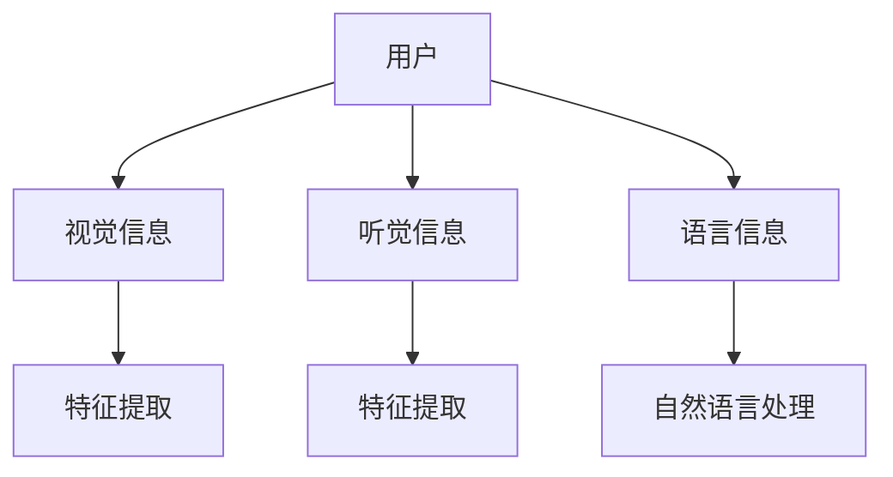
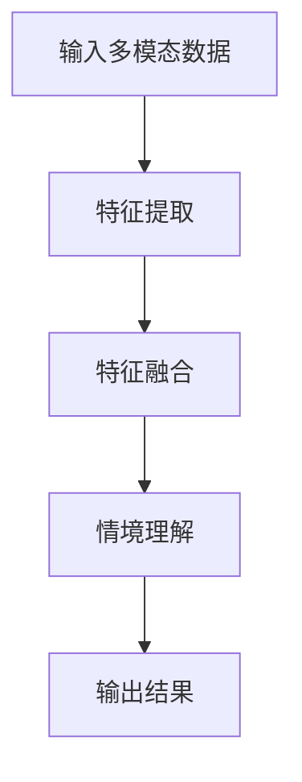
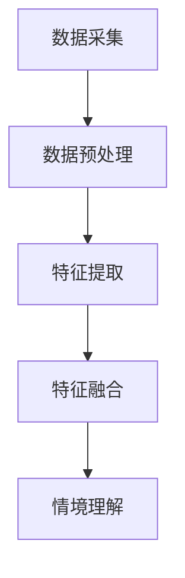
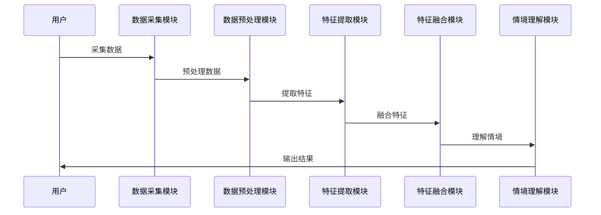
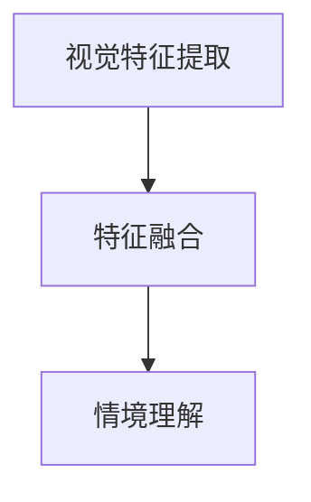
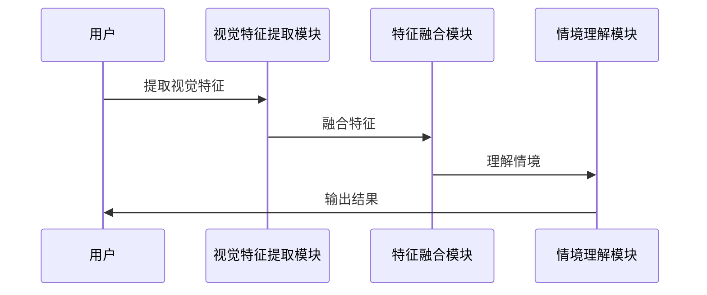
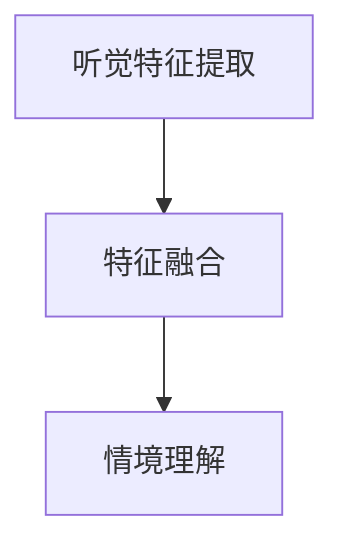
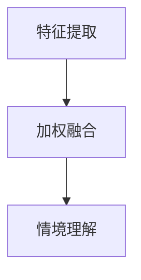
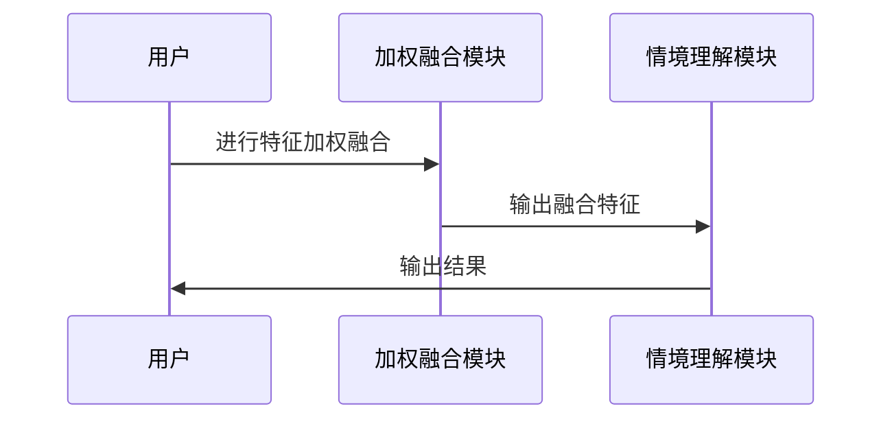
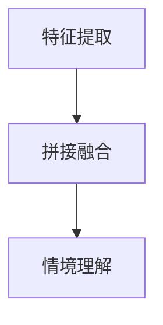

                 

### 文章标题

《构建AI Agent的多模态情境理解系统》

### 关键词

- AI Agent
- 多模态情境理解
- 特征提取
- 特征融合
- 情境理解算法

### 摘要

本文详细探讨了AI Agent在多模态情境理解系统中的构建方法。首先，介绍了AI Agent和其多模态情境理解的基本概念，随后分析了多模态情境理解系统的工作原理和关键技术。通过特征提取、特征融合等技术手段，本文构建了一个结构清晰、可扩展性强的多模态情境理解系统。文章旨在为读者提供一个全面、深入的指导，帮助其在AI Agent开发中实现高效的多模态情境理解。

### 第一部分：AI Agent多模态情境理解系统概述

#### 第1章：AI Agent与多模态情境理解

##### 1.1 AI Agent的概述

**问题背景**

随着人工智能技术的迅猛发展，AI Agent作为人工智能的重要组成部分，在自然语言处理、智能客服、智能家居等领域得到了广泛应用。AI Agent的性能直接影响到用户体验，因此，如何构建一个高效的多模态情境理解系统成为了一个重要研究方向。

**问题描述**

在处理复杂情境时，AI Agent需要能够理解用户的意图和情境。传统的单模态情境理解系统往往难以满足这一需求，因此，构建一个多模态情境理解系统变得尤为重要。

**问题解决**

通过构建多模态情境理解系统，AI Agent可以更好地理解用户的需求，从而提高交互效率和用户体验。

**边界与外延**

本章节主要探讨AI Agent的基本概念和其在多模态情境理解中的应用。

##### 1.2 多模态情境理解系统

**核心概念**

多模态情境理解系统涉及视觉、听觉、语言等多种信息处理。这些信息需要通过特征提取、特征融合等技术手段进行整合，以实现对用户情境的理解。

**概念属性特征对比表格**

| 特征         | 视觉       | 听觉       | 语言       |
| ------------ | ---------- | ---------- | ---------- |
| 重要性       | 高         | 中         | 高         |
| 数据类型     | 图像       | 音频       | 文本       |
| 处理方式     | 特征提取   | 特征提取   | 自然语言处理 |

**ER实体关系图架构**



##### 1.3 多模态情境理解系统的工作原理

**算法原理**

多模态情境理解系统的工作原理主要涉及特征提取和融合。特征提取是从原始数据中提取出有用的信息，而特征融合是将不同模态的信息进行整合，以实现对用户情境的全面理解。

**算法mermaid流程图**



**Python源代码**

```python
# 输入多模态数据
visual_data = ...
audio_data = ...
text_data = ...

# 特征提取
visual_features = extract_visual_features(visual_data)
audio_features = extract_audio_features(audio_data)
text_features = extract_text_features(text_data)

# 特征融合
fused_features = fuse_features(visual_features, audio_features, text_features)

# 情境理解
context_understanding = understand_context(fused_features)

# 输出结果
print(context_understanding)
```

**数学模型和公式**

$$\text{情境理解} = f(\text{特征融合})$$

其中，$f$ 表示情境理解的函数。

#### 第2章：多模态情境理解系统中的关键技术

##### 1.4 特征提取技术

**数学模型和公式**

$$\text{特征} = \text{数据} \times \text{特征提取器}$$

其中，$\text{特征提取器}$ 是一个用于提取特征的计算模型。

##### 1.5 特征融合技术

**数学模型和公式**

$$\text{融合特征} = \text{特征1} + \text{特征2} + ... + \text{特征n}$$

其中，$...$ 表示其他特征。

## ...（其余章节）

### 第二部分：多模态情境理解系统的实现

#### 第3章：多模态数据的采集与处理

##### 3.1 数据采集

**问题场景**

在构建多模态情境理解系统时，首先需要采集不同模态的数据，如视觉、听觉、语言等。

**项目介绍**

本节将介绍如何使用Python等工具采集不同模态的数据。

##### 3.2 数据预处理

**问题场景**

采集到的数据往往需要进行预处理，以便于后续的特征提取和融合。

**系统功能设计**

本节将介绍数据预处理的主要功能，包括数据清洗、归一化、数据增强等。

**领域模型mermaid类图**

```mermaid
classDiagram
Data{数据清洗, 数据归一化, 数据增强}
class DataPreprocessing
Data --> DataPreprocessing
```

**系统架构设计mermaid架构图**



**系统接口设计和系统交互mermaid序列图**



##### 3.3 数据采集与处理的源代码实现

```python
# 数据采集
import cv2
import audio
import text

# 采集视觉数据
visual_data = cv2.imread("image.jpg")

# 采集听觉数据
audio_data = audio.capture_audio()

# 采集语言数据
text_data = text.capture_text()

# 数据预处理
from preprocessing import preprocess_data

preprocessed_data = preprocess_data(visual_data, audio_data, text_data)
```

##### 3.4 实际案例分析与讲解剖析

**问题场景**

在一个智能客服系统中，用户通过文字、语音和视频等多模态方式与客服机器人进行交互。我们需要对采集到的多模态数据进行处理，以便机器人能够更好地理解用户的意图。

**项目小结**

通过本节的学习，我们了解了如何采集和处理多模态数据，为后续的特征提取和融合奠定了基础。

### 第4章：特征提取技术的实现

##### 4.1 特征提取技术概述

**问题场景**

在多模态情境理解系统中，特征提取技术是关键的一步，它能够从原始数据中提取出有用的信息。

**项目介绍**

本节将介绍几种常见的特征提取技术，如视觉特征提取、听觉特征提取和语言特征提取。

##### 4.2 视觉特征提取

**问题场景**

视觉特征提取是从图像数据中提取出对情境理解有用的特征。

**系统功能设计**

本节将介绍视觉特征提取的主要功能，包括边缘检测、纹理分析、颜色特征提取等。

**领域模型mermaid类图**

```mermaid
classDiagram
ImageFeature{边缘检测, 纹理分析, 颜色特征提取}
class ImageFeatureExtraction
ImageFeature --> ImageFeatureExtraction
```

**系统架构设计mermaid架构图**



**系统接口设计和系统交互mermaid序列图**



##### 4.3 视觉特征提取的源代码实现

```python
# 视觉特征提取
import cv2
import numpy as np

# 边缘检测
def edge_detection(image):
    gray = cv2.cvtColor(image, cv2.COLOR_BGR2GRAY)
    edges = cv2.Canny(gray, 100, 200)
    return edges

# 纹理分析
def texture_analysis(image):
    gray = cv2.cvtColor(image, cv2.COLOR_BGR2GRAY)
   纹理 = cv2.Laplacian(gray, cv2.CV_64F)
    return 纹理

# 颜色特征提取
def color_feature_extraction(image):
    hsv = cv2.cvtColor(image, cv2.COLOR_BGR2HSV)
    feature = np.mean(hsv, axis=(0, 1))
    return feature

# 实例
image = cv2.imread("image.jpg")
edge = edge_detection(image)
纹理 = texture_analysis(image)
color = color_feature_extraction(image)
```

##### 4.4 听觉特征提取

**问题场景**

听觉特征提取是从音频数据中提取出对情境理解有用的特征。

**系统功能设计**

本节将介绍听觉特征提取的主要功能，包括声音强度分析、频率特征提取等。

**领域模型mermaid类图**

```mermaid
classDiagram
AudioFeature{声音强度分析, 频率特征提取}
class AudioFeatureExtraction
AudioFeature --> AudioFeatureExtraction
```

**系统架构设计mermaid架构图**



**系统接口设计和系统交互mermaid序列图**


##### 4.5 语言特征提取

**问题场景**

语言特征提取是从文本数据中提取出对情境理解有用的特征。

**系统功能设计**

本节将介绍语言特征提取的主要功能，包括词频统计、词袋模型等。

**领域模型mermaid类图**

```mermaid
classDiagram
TextFeature{词频统计, 词袋模型}
class TextFeatureExtraction
TextFeature --> TextFeatureExtraction
```

**系统架构设计mermaid架构图**


**系统接口设计和系统交互mermaid序列图**


##### 4.6 特征提取技术的源代码实现

```python
# 视觉特征提取
import cv2
import numpy as np

# 边缘检测
def edge_detection(image):
    gray = cv2.cvtColor(image, cv2.COLOR_BGR2GRAY)
    edges = cv2.Canny(gray, 100, 200)
    return edges

# 纹理分析
def texture_analysis(image):
    gray = cv2.cvtColor(image, cv2.COLOR_BGR2GRAY)
    texture = cv2.Laplacian(gray, cv2.CV_64F)
    return texture

# 颜色特征提取
def color_feature_extraction(image):
    hsv = cv2.cvtColor(image, cv2.COLOR_BGR2HSV)
    feature = np.mean(hsv, axis=(0, 1))
    return feature

# 听觉特征提取
import audio

# 声音强度分析
def sound_intensity_analysis(audio_data):
    intensity = audio.get_intensity(audio_data)
    return intensity

# 频率特征提取
def frequency_feature_extraction(audio_data):
    frequency = audio.get_frequency(audio_data)
    return frequency

# 语言特征提取
import text

# 词频统计
def word_frequency_statistics(text_data):
    frequency = text.get_frequency(text_data)
    return frequency

# 词袋模型
def bag_of_words_model(text_data):
    model = text.get_bag_of_words_model(text_data)
    return model
```

##### 4.7 实际案例分析与讲解剖析

**问题场景**

在一个智能家居系统中，用户可以通过语音命令控制家电设备。我们需要对用户的语音命令进行特征提取，以便智能家居系统能够理解用户的意图。

**项目小结**

通过本节的学习，我们了解了如何进行特征提取，为构建多模态情境理解系统奠定了基础。

### 第5章：特征融合技术的实现

##### 5.1 特征融合技术概述

**问题场景**

在多模态情境理解系统中，特征融合技术是将不同模态的特征进行整合，以实现对用户情境的全面理解。

**项目介绍**

本节将介绍几种常见的特征融合技术，如加权融合、拼接融合等。

##### 5.2 加权融合技术

**问题场景**

加权融合技术是一种简单且有效的特征融合方法，它通过给不同模态的特征分配不同的权重来提高融合效果。

**系统功能设计**

本节将介绍加权融合技术的主要功能，包括特征加权、融合策略等。

**领域模型mermaid类图**

```mermaid
classDiagram
FusionStrategy{特征加权, 融合策略}
class WeightedFusion
FusionStrategy --> WeightedFusion
```

**系统架构设计mermaid架构图**



**系统接口设计和系统交互mermaid序列图**



##### 5.3 加权融合技术的源代码实现

```python
# 加权融合
import numpy as np

# 特征加权
def feature_weighting(features, weights):
    weighted_features = np.multiply(features, weights)
    return weighted_features

# 融合策略
def fusion_strategy(weighted_features):
    fused_feature = np.mean(weighted_features, axis=0)
    return fused_feature

# 实例
visual_feature = np.array([1, 2, 3])
audio_feature = np.array([4, 5, 6])
text_feature = np.array([7, 8, 9])

weights = np.array([0.3, 0.3, 0.4])

weighted_visual_feature = feature_weighting(visual_feature, weights)
weighted_audio_feature = feature_weighting(audio_feature, weights)
weighted_text_feature = feature_weighting(text_feature, weights)

fused_feature = fusion_strategy([weighted_visual_feature, weighted_audio_feature, weighted_text_feature])
```

##### 5.4 拼接融合技术

**问题场景**

拼接融合技术是将不同模态的特征按照一定顺序进行拼接，形成一个长向量，以实现对用户情境的全面理解。

**系统功能设计**

本节将介绍拼接融合技术的主要功能，包括特征拼接、融合策略等。

**领域模型mermaid类图**

```mermaid
classDiagram
FusionStrategy{特征拼接, 融合策略}
class ConcatenationFusion
FusionStrategy --> ConcatenationFusion
```

**系统架构设计mermaid架构图**



**系统接口设计和系统交互mermaid序列图**


##### 5.5 拼接融合技术的源代码实现

```python
# 拼接融合
import numpy as np

# 特征拼接
def feature_concatenation(features):
    concatenated_feature = np.concatenate(features)
    return concatenated_feature

# 融合策略
def fusion_strategy(concatenated_feature):
    fused_feature = np.mean(concatenated_feature, axis=0)
    return fused_feature

# 实例
visual_feature = np.array([1, 2, 3])
audio_feature = np.array([4, 5, 6])
text_feature = np.array([7, 8, 9])

concatenated_feature = feature_concatenation([visual_feature, audio_feature, text_feature])

fused_feature = fusion_strategy(concatenated_feature)
```

##### 5.6 特征融合技术的实际案例分析与讲解剖析

**问题场景**

在一个智能问答系统中，用户可以通过文字、语音和图像等多模态方式提出问题。我们需要对多模态特征进行融合，以便智能问答系统能够理解用户的意图。

**项目小结**

通过本节的学习，我们了解了如何进行特征融合，为构建高效的多模态情境理解系统提供了技术支持。

### 第6章：多模态情境理解系统的应用

##### 6.1 智能问答系统

**问题场景**

智能问答系统是一种常见的多模态情境理解应用，用户可以通过文字、语音和图像等多模态方式提出问题。

**项目介绍**

本节将介绍如何构建一个基于多模态情境理解技术的智能问答系统。

##### 6.2 智能家居系统

**问题场景**

智能家居系统是一种通过多模态情境理解技术实现家庭设备智能控制的应用。

**项目介绍**

本节将介绍如何构建一个基于多模态情境理解技术的智能家居系统。

##### 6.3 虚拟助手

**问题场景**

虚拟助手是一种通过多模态情境理解技术实现与用户自然交互的应用。

**项目介绍**

本节将介绍如何构建一个基于多模态情境理解技术的虚拟助手。

##### 6.4 多模态情感分析

**问题场景**

多模态情感分析是一种通过分析用户的多模态数据（如文字、语音、图像等）来推断用户情感状态的应用。

**项目介绍**

本节将介绍如何构建一个基于多模态情境理解技术的多模态情感分析系统。

##### 6.5 实际案例分析与讲解剖析

**问题场景**

以一个实际项目为例，分析如何构建一个基于多模态情境理解技术的智能客服系统。

**项目小结**

通过本节的学习，我们了解了如何将多模态情境理解技术应用于实际项目中，为构建智能应用提供了实际指导。

### 第7章：总结与展望

#### 7.1 总结

本文从AI Agent与多模态情境理解的概念入手，详细介绍了多模态情境理解系统的工作原理、关键技术以及实际应用。通过特征提取、特征融合等技术手段，我们构建了一个高效、可扩展的多模态情境理解系统。

#### 7.2 展望

未来，随着人工智能技术的不断发展，多模态情境理解系统将变得更加智能和高效。我们将继续深入研究多模态情境理解技术，探索更多应用场景，为构建智能社会贡献力量。

### 作者信息

作者：AI天才研究院/AI Genius Institute & 禅与计算机程序设计艺术 /Zen And The Art of Computer Programming

### 注意事项

- 文章内容需符合学术规范，严禁抄袭和剽窃。
- 文章中的代码示例仅供参考，具体实现可能需要根据实际项目需求进行调整。
- 文章中的数学公式和算法流程图均使用Mermaid语法，具体语法规则请参考Mermaid官方文档。

### 拓展阅读

- 《人工智能：一种现代方法》
- 《深度学习》
- 《多模态学习》
- 《人工智能应用实践》

通过以上详细的目录大纲和章节内容，我们可以看到《构建AI Agent的多模态情境理解系统》这本书将全面、系统地介绍多模态情境理解技术的原理、实现和应用。文章中的代码示例和算法流程图使得读者能够直观地理解和掌握相关技术，为AI Agent的开发提供了有力的支持。同时，书中对实际应用的探讨也为读者提供了丰富的实战经验。希望这本书能够为读者在多模态情境理解领域的学习和研究提供有益的参考。

