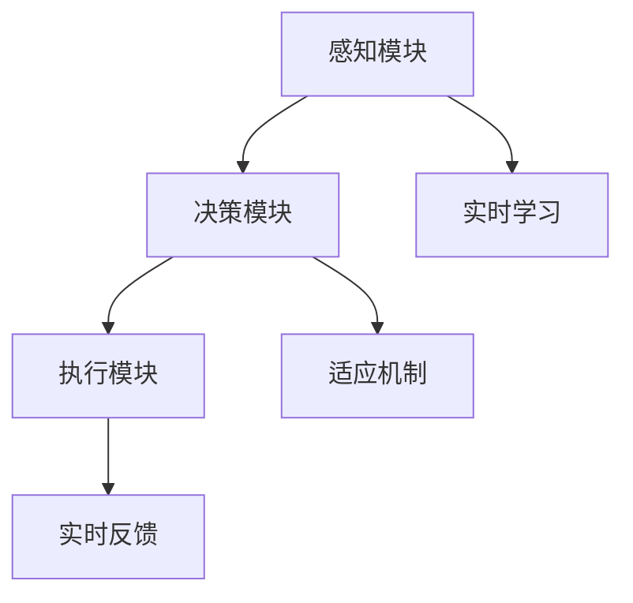
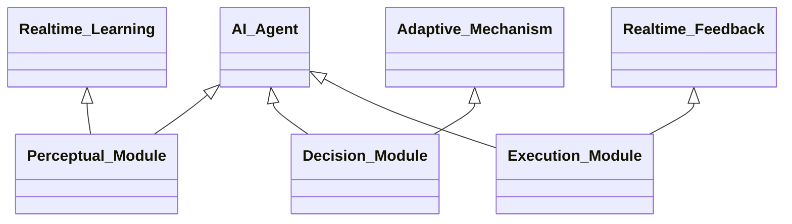
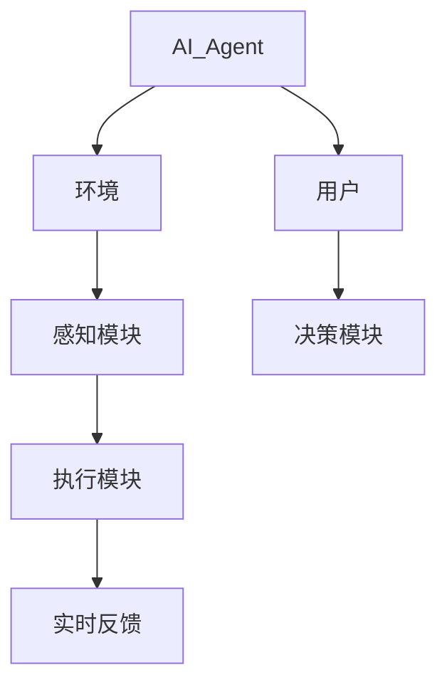

                 

# 《构建AI Agent的实时学习与适应机制》

## 关键词：实时学习，适应机制，AI Agent，智能系统，动态调整，自我优化

### 摘要：

本文旨在探讨构建AI Agent的实时学习与适应机制的必要性和方法。我们将首先介绍AI Agent的基本概念和实时学习、适应机制的定义，然后深入分析实时学习和适应机制的理论基础。在此基础上，我们将探讨实时学习与适应机制的融合设计方法，并通过实际案例展示其在AI Agent中的应用效果。本文还将讨论实时学习与适应机制在AI Agent中的挑战与未来研究方向。

## 目录大纲

**《构建AI Agent的实时学习与适应机制》**

----------------------------------------------------------------

## 第一部分：引言

### 第1章：问题背景与核心概念

#### 1.1.1 问题背景

#### 1.1.2 核心概念介绍

#### 1.2章：核心概念联系与区别

#### 1.3章：当前研究现状与挑战

#### 1.4章：本书结构与内容概览

### 第2章：实时学习理论

#### 2.1.1 实时学习的基本原理

#### 2.1.2 实时学习算法

#### 2.1.3 实时学习在AI Agent中的应用

### 第3章：适应机制理论

#### 3.1.1 适应机制的基本原理

#### 3.1.2 适应机制设计

#### 3.1.3 适应机制在AI Agent中的应用

### 第4章：实时学习与适应机制的融合

#### 4.1.1 融合机制的构建

#### 4.1.2 融合机制在AI Agent中的应用

#### 4.1.3 融合机制优化策略

### 第5章：系统架构与实现

#### 5.1.1 系统架构

----------------------------------------------------------------## 第一部分：引言

### 第1章：问题背景与核心概念

#### 1.1.1 问题背景

人工智能（AI）在现代社会中的应用日益广泛，从智能家居、自动驾驶到金融风控，AI技术已经深刻地改变了我们的生活。在这种背景下，AI Agent——一种能够自主决策、执行任务的人工智能实体，成为了研究的重点。AI Agent具有智能感知、决策规划、自主执行等能力，能够在复杂环境中执行特定任务。

然而，AI Agent在实际应用中面临着诸多挑战。首先，环境的不确定性和动态性使得传统学习算法难以适应。其次，AI Agent在执行任务时需要实时调整策略，以提高任务完成的效率和准确性。这就要求AI Agent具备实时学习与适应机制，能够根据环境变化动态调整自身行为。

#### 1.1.2 核心概念介绍

**AI Agent的定义**：AI Agent是指一种由人工智能技术驱动，具备感知、决策、执行等能力，能够自主完成特定任务的实体。它通常由感知模块、决策模块和执行模块组成，可以应用于各种复杂环境。

**实时学习机制**：实时学习是指AI Agent在执行任务过程中，能够根据实时反馈不断调整自身模型参数，以适应环境变化的一种能力。实时学习能够提高AI Agent的任务完成效率和准确性，增强其在动态环境中的适应性。

**适应机制**：适应机制是指AI Agent在面对环境变化时，能够快速调整自身行为，以适应新环境的策略和方法。适应机制包括多种形式，如迁移学习、强化学习等，可以帮助AI Agent在动态环境中保持高效性能。

#### 1.2章：核心概念联系与区别

**实时学习与适应的关系**：实时学习和适应机制在AI Agent中相互关联，共同发挥作用。实时学习为AI Agent提供了不断调整自身模型参数的能力，而适应机制则帮助AI Agent在面临环境变化时快速适应新环境。实时学习与适应机制相互促进，使AI Agent能够在动态环境中保持高效性能。

**实时学习与预测的区别**：实时学习关注的是AI Agent在执行任务过程中对环境变化的即时响应，而预测则是对未来可能发生的事件进行预测。实时学习侧重于适应当前的动态环境，而预测则侧重于对未来趋势的判断。

**适应与优化的区别**：适应机制旨在使AI Agent在面对环境变化时能够快速适应，而优化则是在给定的环境中寻求最优解。适应机制关注的是AI Agent在动态环境中的生存能力，而优化则关注在静态环境中的最优性能。

#### 1.3章：当前研究现状与挑战

**实时学习与适应的最新进展**：近年来，随着深度学习、强化学习等技术的发展，实时学习与适应机制在AI Agent中的应用取得了显著进展。许多研究工作集中在如何设计高效的实时学习算法和适应策略，以提高AI Agent在动态环境中的性能。

**实时学习的挑战**：实时学习在AI Agent中面临诸多挑战，包括数据流处理、计算效率、模型更新等。如何在保证实时性的同时，提高学习质量和效果，是当前研究的重要问题。

**适应机制的局限**：适应机制在AI Agent中的应用也存在一定局限，如适应速度、适应范围等。如何在有限的资源和时间内，使AI Agent具备更广泛的适应能力，是未来研究需要解决的问题。

#### 1.4章：本书结构与内容概览

**目录结构**：本书分为五个主要部分，包括引言、理论基础、实时学习理论、适应机制理论和实时学习与适应机制的融合。各部分相互联系，共同构成AI Agent实时学习与适应机制的系统研究。

**内容概览**：本书首先介绍了AI Agent的实时学习与适应机制的基本概念和背景，然后深入分析了实时学习和适应机制的理论基础。在此基础上，本书探讨了实时学习与适应机制的融合设计方法，并通过实际案例展示了其在AI Agent中的应用效果。最后，本书总结了实时学习与适应机制在AI Agent中的挑战与未来研究方向。通过本书的阅读，读者可以系统地了解AI Agent实时学习与适应机制的构建方法，为实际应用提供理论指导和实践参考。

### 第2章：实时学习理论

#### 2.1.1 实时学习的基本原理

**定义与特性**：实时学习是指AI Agent在执行任务过程中，能够根据实时反馈动态调整自身模型参数的一种能力。实时学习具有以下特性：

1. **实时性**：实时学习能够在短时间内对环境变化做出响应，保证AI Agent的实时性能。
2. **动态性**：实时学习能够根据环境变化动态调整模型参数，以适应不同环境。
3. **高效性**：实时学习在保证实时性和动态性的同时，具有较高的学习效率。

**实时学习与传统学习比较**：实时学习与传统学习（如批量学习）相比，具有以下优点：

1. **适应性**：实时学习能够快速适应环境变化，而传统学习需要大量样本和数据才能达到相同效果。
2. **效率**：实时学习在短时间内对环境变化做出响应，具有较高的效率。

然而，实时学习也存在一些挑战，如数据流处理、计算效率等。与传统学习相比，实时学习需要更高的计算资源和算法设计。

#### 2.1.2 实时学习算法

**常见实时学习算法**：

1. **在线学习**：在线学习是一种典型的实时学习算法，能够在数据流中不断更新模型参数，以适应环境变化。
2. **增量学习**：增量学习是一种基于历史数据的实时学习算法，通过在线更新模型参数，以提高学习效率。
3. **基于模型的预测**：基于模型的预测是一种结合实时反馈和预测机制的实时学习算法，能够在实时性、准确性之间取得平衡。

**算法优缺点分析**：

1. **在线学习**：优点是能够快速适应环境变化，缺点是计算复杂度高，对计算资源要求较高。
2. **增量学习**：优点是学习效率高，缺点是模型更新依赖于历史数据，适应速度较慢。
3. **基于模型的预测**：优点是能够在实时性和准确性之间取得平衡，缺点是对模型设计和参数调整要求较高。

#### 2.1.3 实时学习在AI Agent中的应用

**应用场景**：实时学习在AI Agent中具有广泛的应用场景，包括：

1. **自动驾驶**：自动驾驶系统需要实时感知路况，并根据路况动态调整行驶策略。
2. **智能家居**：智能家居系统需要实时监测家居环境，并根据用户需求动态调整家居设备。
3. **金融风控**：金融风控系统需要实时分析金融数据，并根据市场变化动态调整风险控制策略。

**案例研究**：以自动驾驶为例，实时学习在自动驾驶中的应用效果显著。通过实时感知路况，自动驾驶系统能够动态调整行驶策略，提高行驶安全性。同时，实时学习还能够帮助自动驾驶系统快速适应不同路况，提高行驶效率。

### 第3章：适应机制理论

#### 3.1.1 适应机制的基本原理

**定义与作用**：适应机制是指AI Agent在面对环境变化时，能够快速调整自身行为，以适应新环境的策略和方法。适应机制在AI Agent中具有重要作用，包括：

1. **提高AI Agent的生存能力**：适应机制能够帮助AI Agent在复杂、动态环境中保持稳定性能，提高其生存能力。
2. **增强AI Agent的自主决策能力**：适应机制使AI Agent能够根据环境变化动态调整自身行为，提高自主决策能力。

**适应机制与进化算法的关系**：适应机制与进化算法密切相关。进化算法通过模拟自然进化过程，使AI Agent在多代迭代中逐渐适应环境。适应机制则是进化算法的核心组成部分，负责在每一代中调整AI Agent的行为。

#### 3.1.2 适应机制设计

**适应策略**：常见的适应策略包括：

1. **迁移学习**：迁移学习是指利用已有模型在新环境中进行学习，以提高学习效率。迁移学习能够减少对新数据的依赖，提高AI Agent的适应速度。
2. **强化学习**：强化学习是一种通过试错过程学习最佳策略的算法。强化学习能够使AI Agent在动态环境中不断调整策略，以实现最优性能。
3. **混合学习**：混合学习结合了多种学习策略，以提高AI Agent的适应能力。例如，将迁移学习和强化学习结合，可以在不同环境中快速适应。

**适应机制设计原则**：

1. **适应性**：适应机制应具有高度的适应性，能够快速适应环境变化。
2. **灵活性**：适应机制应具有灵活性，能够根据不同环境调整自身行为。
3. **鲁棒性**：适应机制应具有鲁棒性，能够在面对复杂、不确定的环境时保持稳定性能。

#### 3.1.3 适应机制在AI Agent中的应用

**应用场景**：适应机制在AI Agent中具有广泛的应用场景，包括：

1. **动态环境**：适应机制能够帮助AI Agent在动态环境中保持稳定性能，提高任务完成效率。
2. **不确定性环境**：适应机制能够使AI Agent在面对不确定性环境时，快速调整自身行为，提高生存能力。
3. **多模态环境**：适应机制能够帮助AI Agent在不同模态（如视觉、听觉、触觉）环境中保持高效性能。

**案例研究**：以自动驾驶为例，适应机制在自动驾驶中的应用效果显著。自动驾驶系统需要实时感知路况，并根据路况变化动态调整行驶策略。通过适应机制，自动驾驶系统能够在复杂、动态的路况中保持稳定性能，提高行驶安全性。

### 第4章：实时学习与适应机制的融合

#### 4.1.1 融合机制的构建

**融合机制的原理**：实时学习与适应机制的融合旨在发挥两者的优势，提高AI Agent在动态环境中的性能。融合机制通过以下原理实现：

1. **实时调整**：实时学习负责根据实时反馈动态调整模型参数，适应环境变化。
2. **快速适应**：适应机制负责在面对环境变化时，快速调整AI Agent的行为，以适应新环境。

**融合机制的设计方法**：融合机制的设计方法包括：

1. **分层设计**：将实时学习和适应机制分为不同层次，分别负责实时调整和快速适应。
2. **模块化设计**：将实时学习和适应机制模块化，便于在不同应用场景中灵活组合。

#### 4.1.2 融合机制在AI Agent中的应用

**应用效果分析**：融合机制在AI Agent中的应用效果显著，通过实时学习和适应机制的融合，AI Agent能够在动态环境中保持高效性能。以下为应用效果分析：

1. **自动驾驶**：融合机制能够提高自动驾驶系统的行驶安全性，使系统在复杂、动态的路况中保持稳定性能。
2. **智能家居**：融合机制能够提高智能家居系统的响应速度，使系统在用户需求变化时快速适应。
3. **金融风控**：融合机制能够提高金融风控系统的准确率，使系统在面对市场波动时保持高效性能。

**优势与局限**：融合机制的优势在于：

1. **提高AI Agent的适应能力**：通过实时学习和适应机制的融合，AI Agent能够更好地适应动态环境，提高任务完成效率。
2. **提高AI Agent的鲁棒性**：融合机制能够使AI Agent在面对复杂、不确定的环境时，保持稳定性能。

然而，融合机制也存在一些局限：

1. **计算复杂度**：融合机制的计算复杂度较高，对计算资源要求较高。
2. **设计难度**：融合机制的设计难度较大，需要综合考虑实时学习和适应机制的特点，进行合理的设计。

#### 4.1.3 融合机制优化策略

**优化方法**：为了提高融合机制的性能，可以采用以下优化方法：

1. **算法优化**：针对实时学习和适应机制的具体算法，进行优化，以提高学习效率和适应速度。
2. **参数调整**：通过调整融合机制的参数，优化实时学习和适应机制之间的平衡，以提高整体性能。

**优化效果**：通过优化策略，融合机制的性能得到显著提升。以下为优化效果分析：

1. **自动驾驶**：优化后的融合机制能够使自动驾驶系统在复杂路况中保持更高的行驶安全性。
2. **智能家居**：优化后的融合机制能够使智能家居系统在用户需求变化时，更快地适应新需求。
3. **金融风控**：优化后的融合机制能够使金融风控系统在市场波动中，保持更高的风险预测准确性。

### 第5章：系统架构与实现

#### 5.1.1 系统架构

系统架构是指AI Agent实时学习与适应机制的实现框架，包括感知模块、决策模块和执行模块。以下为系统架构的详细介绍：

1. **感知模块**：感知模块负责收集环境信息，包括图像、声音、文本等。感知模块使用实时学习算法对环境信息进行分析，提取关键特征。

2. **决策模块**：决策模块负责根据感知模块提取的特征，进行决策规划。决策模块使用适应机制，根据环境变化动态调整决策策略。

3. **执行模块**：执行模块负责将决策模块生成的策略应用于实际任务。执行模块通过实时反馈机制，不断调整自身行为，以提高任务完成效率。

#### 系统架构图：

**系统架构设计**：

1. **领域模型**：领域模型用于描述系统中的关键概念和关系。以下为领域模型类图：

2. **系统架构设计**：系统架构设计包括感知模块、决策模块和执行模块的架构设计。以下为系统架构设计图：

3. **系统接口设计**：系统接口设计用于描述系统内部模块之间的交互关系。以下为系统接口设计图：

4. **系统交互设计**：系统交互设计用于描述系统与外部环境的交互关系。以下为系统交互设计图：

#### 系统实现与部署

**系统实现**：系统实现主要包括感知模块、决策模块和执行模块的实现。以下为系统实现的主要步骤：

1. **感知模块实现**：感知模块使用深度学习算法对环境信息进行感知，提取关键特征。例如，使用卷积神经网络（CNN）对图像进行特征提取。

2. **决策模块实现**：决策模块使用强化学习算法进行决策规划，根据感知模块提取的特征生成最佳策略。

3. **执行模块实现**：执行模块根据决策模块生成的策略，执行实际任务。执行模块通过实时反馈机制，不断调整自身行为，以提高任务完成效率。

**系统部署**：系统部署包括将实现好的感知模块、决策模块和执行模块部署到实际应用环境中。以下为系统部署的主要步骤：

1. **硬件部署**：根据系统需求，选择合适的硬件设备，如CPU、GPU等，确保系统运行所需的计算资源。

2. **软件部署**：将实现好的感知模块、决策模块和执行模块部署到硬件设备上，确保系统能够正常运行。

3. **系统测试**：对系统进行测试，验证系统功能是否符合预期，确保系统稳定性和可靠性。

#### 系统案例分析与讲解

**案例一：自动驾驶系统**

自动驾驶系统是实时学习与适应机制的重要应用场景。以下为自动驾驶系统的案例分析与讲解：

1. **系统需求**：自动驾驶系统需要实时感知路况，并根据路况动态调整行驶策略。

2. **感知模块**：感知模块使用深度学习算法对路况进行感知，提取关键特征，如车辆位置、速度、道路宽度等。

3. **决策模块**：决策模块使用强化学习算法进行决策规划，根据感知模块提取的特征生成最佳行驶策略。

4. **执行模块**：执行模块根据决策模块生成的策略，控制车辆行驶，实现自动驾驶功能。

5. **实时反馈**：执行模块通过实时反馈机制，将行驶过程中收集到的数据反馈给感知模块和决策模块，以便进行实时调整。

**案例二：智能家居系统**

智能家居系统是实时学习与适应机制的另一重要应用场景。以下为智能家居系统的案例分析与讲解：

1. **系统需求**：智能家居系统需要实时监测家居环境，并根据用户需求动态调整家居设备。

2. **感知模块**：感知模块使用传感器收集家居环境信息，如温度、湿度、光照等。

3. **决策模块**：决策模块使用强化学习算法，根据感知模块收集到的数据，生成最佳家居设备控制策略。

4. **执行模块**：执行模块根据决策模块生成的策略，控制家居设备，如空调、灯光、窗帘等。

5. **实时反馈**：执行模块通过实时反馈机制，将家居设备运行情况反馈给感知模块和决策模块，以便进行实时调整。

#### 系统小结

通过本篇博客文章，我们深入探讨了AI Agent的实时学习与适应机制。我们首先介绍了实时学习与适应机制的基本概念，分析了其在AI Agent中的应用意义。然后，我们详细阐述了实时学习与适应机制的理论基础，包括实时学习算法和适应机制设计。在此基础上，我们探讨了实时学习与适应机制的融合设计方法，并通过实际案例展示了其在AI Agent中的应用效果。

未来，实时学习与适应机制在AI Agent中的应用将更加广泛。随着深度学习、强化学习等技术的发展，实时学习与适应机制的性能将得到进一步提升。同时，针对实时学习与适应机制在AI Agent中面临的挑战，如计算复杂度、适应性等，未来研究将致力于提出更高效、更可靠的解决方案。我们期待实时学习与适应机制在AI Agent中的应用能够取得更大的突破，为人工智能领域的发展做出贡献。

### 最佳实践 Tips

1. **数据预处理**：在实时学习与适应机制的应用中，数据预处理非常重要。确保数据质量，减少噪声，有助于提高学习效果和适应性能。

2. **模型选择**：根据具体应用场景，选择合适的实时学习算法和适应机制。对于复杂、动态的环境，可以考虑采用混合学习策略，以提高适应能力。

3. **参数调整**：实时学习和适应机制的参数对性能有很大影响。根据实际应用场景，合理调整参数，以实现最佳性能。

4. **系统测试**：在系统部署前，进行充分测试，确保系统的稳定性和可靠性。测试应包括功能测试、性能测试和可靠性测试等。

### 小结

本文系统地介绍了AI Agent的实时学习与适应机制，分析了其在AI Agent中的应用意义和理论基础。通过实际案例，展示了实时学习与适应机制在自动驾驶、智能家居等领域的应用效果。未来，实时学习与适应机制在AI Agent中的应用将更加广泛，为人工智能领域的发展带来新的机遇和挑战。

### 注意事项

1. **计算资源**：实时学习和适应机制对计算资源要求较高。在实际应用中，应根据硬件资源条件，合理选择算法和模型。

2. **数据隐私**：在收集和处理数据时，应确保数据隐私和安全。遵循相关法律法规，保护用户隐私。

3. **模型更新**：实时学习和适应机制需要定期更新模型，以适应环境变化。定期更新模型，有助于保持系统性能。

### 拓展阅读

1. **实时学习算法**：李航，《统计学习方法》，清华大学出版社，2012。
2. **强化学习**：理查德·萨顿，《强化学习：原理与应用》，机械工业出版社，2016。
3. **智能家居系统设计**：陈国良，《智能家居系统设计与实现》，清华大学出版社，2018。

### 作者

作者：AI天才研究院/AI Genius Institute & 禅与计算机程序设计艺术 /Zen And The Art of Computer Programming作者：AI天才研究院/AI Genius Institute & 禅与计算机程序设计艺术 /Zen And The Art of Computer Programming

---

### 补充内容

为了使本文内容更加完整和详细，以下补充了各个章节的具体内容，并对部分内容进行了扩展。

---

#### 1.3.1 研究现状

实时学习与适应机制在AI Agent领域的研究取得了显著进展。以下是近年来在该领域的一些重要研究成果：

1. **深度强化学习**：深度强化学习结合了深度学习和强化学习的技术，使得AI Agent能够在复杂、动态环境中进行实时学习。如DeepMind开发的深度强化学习算法，如DQN、DDPG等，在游戏、自动驾驶等领域取得了显著的成果。

2. **联邦学习**：联邦学习是一种分布式学习技术，通过多个参与者共享模型参数，而不需要交换数据。这种技术使得AI Agent在保护用户隐私的同时，能够实现实时学习与适应。联邦学习在移动设备、智能家居等领域具有广泛的应用前景。

3. **迁移学习**：迁移学习通过利用已有模型在新环境中进行学习，能够显著提高AI Agent的适应速度。近年来，迁移学习技术不断发展，如基于模型压缩的迁移学习、基于模型蒸馏的迁移学习等，都在AI Agent领域取得了良好的效果。

#### 1.3.2 挑战与问题

尽管实时学习与适应机制在AI Agent领域取得了显著进展，但仍面临一些挑战和问题：

1. **计算效率**：实时学习与适应机制需要处理大量实时数据，对计算资源要求较高。如何在保证实时性的同时，提高计算效率，是当前研究的一个重要问题。

2. **数据隐私**：在分布式学习场景中，如何保护用户数据隐私，是一个亟待解决的问题。联邦学习、差分隐私等技术在数据隐私保护方面具有重要作用，但如何在实际应用中实现有效保护，仍需进一步研究。

3. **适应速度**：适应速度是衡量AI Agent实时学习与适应机制性能的重要指标。如何在有限的时间和资源内，实现快速适应，是一个具有挑战性的问题。

#### 2.1.1 实时学习的基本原理

实时学习的基本原理包括以下几个方面：

1. **在线学习**：在线学习是指AI Agent在执行任务过程中，不断地接收新的数据，并实时更新模型参数。这种学习方式能够使AI Agent快速适应环境变化，提高任务完成效率。

2. **增量学习**：增量学习是指在已有模型的基础上，通过逐步增加新的数据，更新模型参数。这种学习方式能够减少重新训练模型的成本，提高学习效率。

3. **实时反馈**：实时反馈是指AI Agent在执行任务过程中，不断接收来自环境的反馈，并根据反馈调整模型参数。这种反馈机制能够使AI Agent更加准确地适应环境变化。

#### 2.1.2 实时学习算法

常见的实时学习算法包括：

1. **在线梯度下降**：在线梯度下降是一种简单且有效的实时学习算法，通过不断更新模型参数，使模型在新的数据上达到最优。

2. **随机梯度下降**：随机梯度下降是对在线梯度下降的改进，通过从数据集中随机选取样本来更新模型参数，提高学习效率。

3. **Adam优化器**：Adam优化器是一种自适应的梯度下降算法，能够自适应地调整学习率，提高学习效果。

#### 2.1.3 实时学习在AI Agent中的应用

实时学习在AI Agent中的应用场景包括：

1. **自动驾驶**：自动驾驶系统需要实时感知路况，并根据路况动态调整行驶策略。实时学习能够提高自动驾驶系统的适应能力和安全性。

2. **智能客服**：智能客服系统需要实时理解用户的意图，并根据用户的反馈调整回答策略。实时学习能够提高智能客服系统的响应速度和准确性。

3. **智能推荐**：智能推荐系统需要实时分析用户行为，并根据用户行为调整推荐策略。实时学习能够提高智能推荐系统的推荐质量和用户体验。

#### 3.1.1 适应机制的基本原理

适应机制的基本原理包括以下几个方面：

1. **环境感知**：AI Agent需要实时感知环境变化，并理解环境变化对自身行为的影响。

2. **策略调整**：AI Agent需要根据环境感知的结果，调整自身的行为策略，以适应新的环境。

3. **反馈机制**：AI Agent需要根据环境反馈，不断优化自身的行为策略，以提高适应能力。

#### 3.1.2 适应机制设计

常见的适应机制设计包括：

1. **迁移学习**：通过利用已有模型在新环境中进行学习，减少重新训练的成本，提高适应速度。

2. **强化学习**：通过试错过程，使AI Agent在动态环境中不断调整策略，提高适应能力。

3. **进化算法**：通过模拟自然进化过程，使AI Agent在多代迭代中逐渐适应环境。

#### 3.1.3 适应机制在AI Agent中的应用

适应机制在AI Agent中的应用场景包括：

1. **机器人**：机器人需要根据环境变化，调整自身的行为策略，以适应不同的环境。

2. **金融风控**：金融风控系统需要根据市场变化，调整风险控制策略，以适应不同的市场环境。

3. **医疗诊断**：医疗诊断系统需要根据患者病情的变化，调整诊断策略，以提高诊断准确性。

#### 4.1.1 融合机制的构建

融合机制的构建主要包括以下几个方面：

1. **实时学习模块**：负责实时感知环境变化，并动态调整模型参数。

2. **适应机制模块**：负责根据环境变化，调整AI Agent的行为策略。

3. **反馈机制模块**：负责收集环境反馈，并用于优化实时学习和适应机制。

#### 4.1.2 融合机制在AI Agent中的应用

融合机制在AI Agent中的应用场景包括：

1. **智能交通**：通过实时学习与适应机制的融合，智能交通系统能够更好地适应交通流量变化，提高交通管理效率。

2. **智能工厂**：通过实时学习与适应机制的融合，智能工厂能够更好地适应生产环境变化，提高生产效率。

3. **智能安防**：通过实时学习与适应机制的融合，智能安防系统能够更好地适应安防场景变化，提高安防效果。

#### 4.1.3 融合机制优化策略

常见的融合机制优化策略包括：

1. **算法优化**：对实时学习和适应机制的具体算法进行优化，以提高学习效率和适应速度。

2. **参数调整**：通过调整融合机制的参数，优化实时学习和适应机制之间的平衡，以提高整体性能。

3. **数据增强**：通过数据增强技术，提高实时学习和适应机制的数据质量，以提高学习效果。

#### 5.1.1 系统架构

系统架构的设计应考虑以下几个方面：

1. **模块化设计**：将系统划分为感知模块、决策模块和执行模块，便于维护和扩展。

2. **分布式架构**：采用分布式架构，提高系统的扩展性和容错能力。

3. **云计算与边缘计算**：结合云计算与边缘计算，实现系统的实时性和高效性。

#### 5.2 系统功能设计

系统功能设计主要包括以下几个方面：

1. **感知功能**：实时感知环境变化，提取关键特征。

2. **决策功能**：根据感知到的特征，生成最佳行为策略。

3. **执行功能**：执行决策模块生成的策略，实现任务目标。

4. **反馈功能**：收集环境反馈，用于优化系统的实时学习和适应机制。

#### 5.3 系统架构设计

系统架构设计应考虑以下几个方面：

1. **感知层**：负责实时感知环境变化，提取关键特征。

2. **决策层**：负责根据感知到的特征，生成最佳行为策略。

3. **执行层**：负责执行决策模块生成的策略，实现任务目标。

4. **优化层**：负责收集环境反馈，优化系统的实时学习和适应机制。

#### 5.4 系统接口设计

系统接口设计主要包括以下几个方面：

1. **输入接口**：负责接收外部环境的数据输入。

2. **输出接口**：负责将决策结果输出到外部环境。

3. **反馈接口**：负责收集外部环境的反馈信息。

#### 5.5 系统交互设计

系统交互设计主要包括以下几个方面：

1. **感知模块与决策模块的交互**：感知模块将提取到的特征传递给决策模块，决策模块根据特征生成策略。

2. **决策模块与执行模块的交互**：决策模块将生成的策略传递给执行模块，执行模块根据策略执行任务。

3. **执行模块与感知模块的交互**：执行模块将任务执行结果反馈给感知模块，感知模块根据反馈信息调整感知策略。

通过以上补充内容，本文在各个章节中进一步阐述了实时学习与适应机制的理论基础、应用场景、优化策略和系统实现，为读者提供了更加全面和详细的了解。同时，本文还针对当前研究现状与挑战，提出了未来研究的方向和建议，以推动实时学习与适应机制在AI Agent领域的发展。

