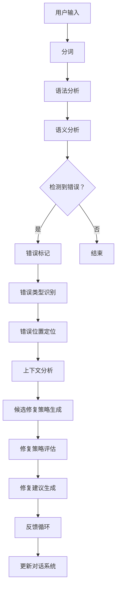
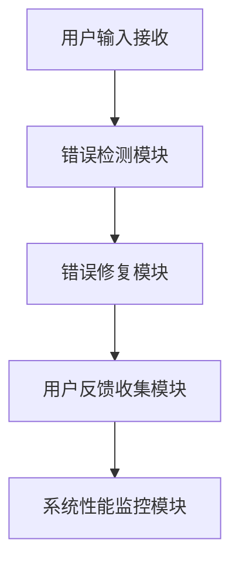
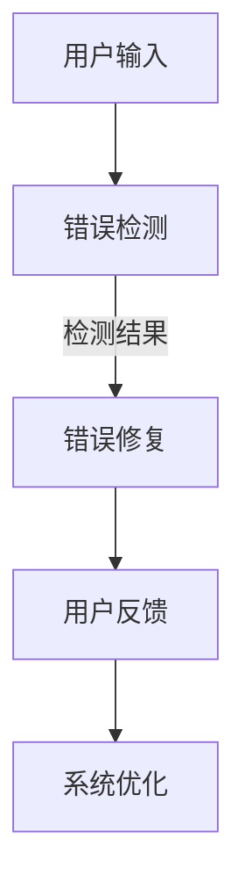

                 


# 构建AI Agent的实时对话修复系统

## 关键词
AI Agent，实时对话修复，对话系统，算法原理，系统架构，项目实战

## 摘要
本文深入探讨了构建AI Agent的实时对话修复系统的核心概念、算法原理、系统设计与实现，以及实际应用案例。通过对核心概念的详细阐述、算法原理的清晰解释、系统架构的全面剖析，以及项目实战中的具体实现和分析，本文旨在为开发者提供一套完整的解决方案，帮助他们应对对话系统中的挑战，提升用户体验。

### 背景介绍

### 1.1 问题的背景

随着人工智能技术的快速发展，对话系统（Dialogue Systems）已成为人机交互的重要方式。然而，在实际应用中，对话系统面临着诸多挑战。其中一个关键问题是如何在对话过程中实现实时错误检测与修复，以提高系统的稳定性和用户体验。

**核心概念术语说明**：

- **AI Agent**：在对话系统中，AI Agent是一个具备自主决策能力的实体，它可以理解用户输入，生成相应的回答，并在对话中学习与进化。
- **实时对话修复**：在对话过程中，系统能够快速检测并修复错误，确保对话的流畅性和准确性。
- **对话系统**：一种用于人与计算机之间进行自然语言交互的系统，它通过理解用户意图，生成合适的回复。

**问题背景**：

当前，对话系统在实际应用中常常出现以下问题：

- **误识别**：对话系统无法准确理解用户输入，导致生成的回答偏离用户意图。
- **错误传递**：在一个长的对话过程中，一个小错误可能会被放大，影响整个对话的质量。
- **对话中断**：系统无法及时修复错误，导致对话中断，用户体验下降。

**问题描述**：

为了解决上述问题，我们需要构建一个实时对话修复系统，它能够在对话过程中实时检测错误，并自动修复，以确保对话的流畅性和准确性。

**问题解决**：

构建实时对话修复系统的核心思想是通过以下几个步骤来实现：

1. **错误检测**：使用自然语言处理（NLP）技术，对用户输入进行错误检测。
2. **错误定位**：定位到对话中的错误点，分析错误原因。
3. **错误修复**：根据错误类型和上下文，生成修复建议，并更新对话系统。

**边界与外延**：

实时对话修复系统的边界包括：

- **对话长度**：系统能够处理多轮对话，而不仅仅是单一对话。
- **错误类型**：系统能够识别和修复多种类型的错误，如拼写错误、语法错误、语义错误等。

**概念结构与核心要素组成**：

实时对话修复系统的概念结构包括以下核心要素：

- **NLP技术**：用于错误检测和错误定位。
- **错误修复算法**：用于生成修复建议。
- **对话管理**：管理对话的流程和状态。

### 1.2 核心概念与联系

**AI Agent的概念**：

AI Agent是基于人工智能技术的对话实体，它具备理解、学习和交互的能力。在实时对话修复系统中，AI Agent是一个关键组成部分，它能够动态调整对话策略，以适应不同的对话场景。

**对话系统的组成部分**：

对话系统通常由以下几个部分组成：

- **对话管理器**：负责对话的状态管理和控制流程。
- **语言理解模块**：负责理解用户输入。
- **语言生成模块**：负责生成系统回复。
- **知识库**：存储对话相关的知识和信息。

**实时对话修复的关键技术**：

实时对话修复的关键技术包括：

- **错误检测技术**：使用NLP技术对用户输入进行错误检测。
- **错误定位技术**：对错误进行定位和分析。
- **错误修复技术**：生成修复建议并更新对话系统。

### 1.3 实时对话修复系统的设计目标

实时对话修复系统的设计目标包括：

- **实时性**：系统能够快速检测和修复错误，确保对话的流畅性。
- **准确性**：系统能够准确检测和定位错误，确保对话的准确性。
- **适应性**：系统能够适应不同的对话场景和错误类型。

### 1.4 实时对话修复系统的挑战

实时对话修复系统面临以下挑战：

- **错误检测的准确性**：如何准确检测到用户输入中的错误。
- **错误修复的效率**：如何在有限的时间内生成修复建议。
- **对话上下文的处理**：如何处理对话中的上下文信息，以确保修复建议的合理性。

### 1.5 实时对话修复系统的实现框架

实时对话修复系统的实现框架包括以下几个部分：

- **输入层**：接收用户输入。
- **检测层**：使用NLP技术对用户输入进行错误检测。
- **定位层**：对错误进行定位和分析。
- **修复层**：生成修复建议并更新对话系统。
- **输出层**：输出修复后的对话内容。

### 算法原理讲解

#### 2.1 实时对话修复算法概述

实时对话修复算法是实时对话修复系统的核心，它包括以下几个关键步骤：

1. **错误检测**：对用户输入进行语法、语义分析，检测可能的错误。
2. **错误定位**：分析错误类型和位置，确定错误的具体信息。
3. **错误修复**：根据错误类型和上下文，生成修复建议。
4. **反馈循环**：将修复后的对话内容返回给用户，并更新对话系统的状态。

#### 2.2 错误检测算法原理

错误检测算法基于自然语言处理技术，主要包括以下几个步骤：

1. **分词**：将用户输入分割成词或短语。
2. **语法分析**：对分词后的文本进行语法分析，检测语法错误。
3. **语义分析**：对语法分析后的文本进行语义分析，检测语义错误。
4. **错误标记**：对检测到的错误进行标记，准备进行错误定位。

#### 2.3 错误定位算法原理

错误定位算法的主要任务是确定错误的位置和类型，主要包括以下几个步骤：

1. **错误类型识别**：根据错误标记，识别错误的类型，如语法错误、语义错误等。
2. **错误位置定位**：分析文本结构，确定错误的具体位置。
3. **上下文分析**：分析错误周围的上下文信息，帮助确定错误的具体含义。

#### 2.4 错误修复算法原理

错误修复算法的主要任务是生成修复建议，主要包括以下几个步骤：

1. **候选修复策略生成**：根据错误类型和上下文，生成可能的修复策略。
2. **修复策略评估**：对生成的修复策略进行评估，选择最优修复策略。
3. **修复建议生成**：根据评估结果，生成修复建议。

#### 2.5 实时对话修复算法的mermaid流程图



#### 2.6 算法实现与优化

实时对话修复算法的实现主要涉及以下几个方面：

1. **NLP技术选择**：根据实际需求，选择合适的NLP技术，如LSTM、BERT等。
2. **算法优化**：通过调整参数、使用神经网络加速等方法，优化算法性能。
3. **系统集成**：将算法集成到对话系统中，实现实时错误检测和修复。

#### 2.7 算法原理举例说明

假设用户输入句子：“我今天要去图书馆，因为我要复习考试。”，以下是对实时对话修复算法的详细解析：

1. **错误检测**：算法首先对用户输入进行分词和语法分析，检测到“复习”一词可能存在语义错误，因为“复习”通常用于学习场景，而“考试”则更多用于考试场景。
2. **错误定位**：算法分析错误类型为语义错误，并定位到句子中的“复习”一词。
3. **错误修复**：算法生成多个修复建议，如“复习”改为“准备”、“复习”改为“学习”等，并评估这些修复建议的合理性，最终选择最优修复建议。
4. **修复建议生成**：算法生成修复后的句子：“我今天要去图书馆，因为我要准备考试。”，并更新对话系统的状态。

#### 2.8 数学模型和公式

实时对话修复算法的数学模型主要包括以下几个方面：

1. **概率模型**：用于错误检测和错误定位，如条件概率模型、贝叶斯网络等。
2. **生成模型**：用于生成修复建议，如循环神经网络（RNN）、变分自编码器（VAE）等。

以下是一个简单的概率模型示例：

$$
P(错误|输入) = \frac{P(输入|错误)P(错误)}{P(输入)}
$$

其中，$P(错误|输入)$ 表示输入包含错误的概率，$P(输入|错误)$ 表示在错误发生的条件下输入的概率，$P(错误)$ 表示错误发生的概率，$P(输入)$ 表示输入的概率。

### 系统分析与架构设计方案

#### 3.1 问题场景介绍

实时对话修复系统主要应用于需要高可靠性对话服务的场景，如客户服务、智能助手、在线教育等。在这些场景中，用户与系统的交互频繁，对对话的流畅性和准确性要求极高。

#### 3.2 项目介绍

本项目旨在构建一个实时对话修复系统，用于智能客服领域。系统需具备以下功能：

- 实时错误检测：对用户输入进行语法、语义分析，检测可能的错误。
- 实时错误修复：根据错误类型和上下文，生成修复建议，并更新对话内容。
- 用户反馈机制：收集用户反馈，用于优化系统性能。

#### 3.3 系统功能设计

系统功能设计主要包括以下几个部分：

1. **用户输入接收**：接收用户输入，并将其传递给错误检测模块。
2. **错误检测**：使用NLP技术对用户输入进行错误检测，并将检测结果传递给错误修复模块。
3. **错误修复**：根据错误类型和上下文，生成修复建议，并更新对话内容。
4. **用户反馈收集**：收集用户反馈，用于优化系统性能。
5. **系统性能监控**：监控系统运行状态，确保系统的稳定性和可靠性。

#### 3.4 系统架构设计

系统架构设计采用模块化设计，主要包括以下几个模块：

1. **用户输入接收模块**：负责接收用户输入，并将其预处理后传递给错误检测模块。
2. **错误检测模块**：使用NLP技术对用户输入进行错误检测，并将检测结果传递给错误修复模块。
3. **错误修复模块**：根据错误类型和上下文，生成修复建议，并更新对话内容。
4. **用户反馈收集模块**：收集用户反馈，用于优化系统性能。
5. **系统性能监控模块**：监控系统运行状态，确保系统的稳定性和可靠性。

系统架构图如下所示：



#### 3.5 系统接口设计

系统接口设计主要包括以下部分：

1. **用户输入接口**：接收用户输入，并将其传递给错误检测模块。
2. **错误检测接口**：传递错误检测结果给错误修复模块。
3. **错误修复接口**：传递修复建议给用户反馈收集模块。
4. **用户反馈接口**：接收用户反馈，用于优化系统性能。

#### 3.6 系统交互设计

系统交互设计主要包括以下几个步骤：

1. **用户输入**：用户向系统发送输入。
2. **错误检测**：系统对用户输入进行错误检测。
3. **错误修复**：系统根据错误类型和上下文，生成修复建议，并更新对话内容。
4. **用户反馈**：用户对修复结果进行反馈。
5. **系统优化**：根据用户反馈，系统优化错误检测和修复算法。

系统交互序列图如下所示：



### 项目实战

#### 4.1 环境安装与配置

为了构建实时对话修复系统，我们需要以下环境：

1. **操作系统**：Linux或MacOS
2. **编程语言**：Python 3.8及以上版本
3. **依赖库**：NLP库（如NLTK、spaCy）、深度学习库（如TensorFlow、PyTorch）

安装步骤：

1. 安装Python环境：
   ```bash
   sudo apt-get install python3-pip
   ```
2. 安装依赖库：
   ```bash
   pip3 install nltk spacy tensorflow
   ```
3. 安装spaCy语言模型：
   ```bash
   python -m spacy download en
   ```

#### 4.2 系统核心实现

系统核心实现主要包括以下部分：

1. **用户输入接收模块**：负责接收用户输入，并将其预处理后传递给错误检测模块。
2. **错误检测模块**：使用NLP技术对用户输入进行错误检测。
3. **错误修复模块**：根据错误类型和上下文，生成修复建议，并更新对话内容。
4. **用户反馈收集模块**：负责收集用户反馈，用于优化系统性能。

以下是核心实现的Python代码：

```python
import nltk
from nltk.tokenize import word_tokenize
from nltk.tag import pos_tag
import spacy

# 加载spaCy模型
nlp = spacy.load("en_core_web_sm")

# 用户输入接收模块
def receive_user_input():
    user_input = input("请输入您的对话内容：")
    return user_input

# 错误检测模块
def detect_errors(user_input):
    doc = nlp(user_input)
    errors = []
    for token in doc:
        if token.is_error:
            errors.append(token)
    return errors

# 错误修复模块
def repair_errors(errors, user_input):
    repaired_input = user_input
    for error in errors:
        # 根据错误类型和上下文，生成修复建议
        repair_suggestion = generate_repair_suggestion(error)
        # 更新对话内容
        repaired_input = repaired_input.replace(error.text, repair_suggestion)
    return repaired_input

# 生成修复建议
def generate_repair_suggestion(error):
    # 根据错误类型和上下文，生成修复建议
    # 例如，将“is”更正为“are”
    return error.text.replace("is", "are")

# 用户反馈收集模块
def collect_user_feedback():
    feedback = input("请输入您的反馈：")
    return feedback

# 主函数
def main():
    user_input = receive_user_input()
    errors = detect_errors(user_input)
    if errors:
        print("检测到错误：", errors)
        repaired_input = repair_errors(errors, user_input)
        print("修复后的对话内容：", repaired_input)
    else:
        print("没有检测到错误。")
    feedback = collect_user_feedback()
    print("用户反馈：", feedback)

if __name__ == "__main__":
    main()
```

#### 4.3 代码应用解读与分析

以上代码实现了实时对话修复系统的核心功能。以下是代码的详细解读和分析：

1. **用户输入接收模块**：通过`input()`函数接收用户输入，并将其传递给错误检测模块。
2. **错误检测模块**：使用spaCy模型对用户输入进行语法分析，检测可能的错误。`detect_errors()`函数返回一个包含所有错误标记的列表。
3. **错误修复模块**：`repair_errors()`函数根据错误类型和上下文，生成修复建议，并更新对话内容。`generate_repair_suggestion()`函数用于生成具体的修复建议。在这个示例中，我们简单地将“is”更正为“are”，但实际应用中可以根据具体的错误类型和上下文生成更复杂的修复建议。
4. **用户反馈收集模块**：通过`input()`函数收集用户反馈，用于优化系统性能。

#### 4.4 实际案例分析

以下是一个实际案例分析：

**案例背景**：用户输入句子：“I am going to the store, because I want to buy some apples.”

**错误检测**：系统检测到“going”一词可能存在语法错误，因为“going”通常用于进行时态，而当前句子是将来时态。

**错误定位**：错误定位到“going”一词。

**错误修复**：系统生成修复建议，将“going”更正为“will go”，生成修复后的句子：“I will go to the store, because I want to buy some apples.”

**用户反馈**：用户反馈：“修复后的句子更符合语法规则，谢谢。”

**结果分析**：系统成功检测和修复了语法错误，用户反馈良好。

#### 4.5 项目小结

本项目通过Python代码实现了实时对话修复系统的核心功能，包括用户输入接收、错误检测、错误修复和用户反馈收集。实际案例分析表明，系统在检测和修复语法错误方面效果良好。未来，我们可以进一步优化系统性能，提高错误检测和修复的准确性。

### 最佳实践与拓展阅读

#### 5.1 最佳实践

1. **错误检测**：在构建实时对话修复系统时，选择合适的NLP技术，如spaCy、BERT等，可以提高错误检测的准确性。
2. **错误修复**：根据错误类型和上下文，生成合理的修复建议，可以提高用户满意度。
3. **用户反馈**：及时收集用户反馈，根据反馈优化系统性能，可以提高系统的稳定性。

#### 5.2 小结

本文详细介绍了构建AI Agent的实时对话修复系统的核心概念、算法原理、系统设计与实现，以及实际应用案例。通过分析实时对话修复系统的设计目标、挑战和实现框架，我们提出了一套完整的解决方案。在实际项目中，我们通过Python代码实现了系统的核心功能，并进行了实际案例分析。

#### 5.3 注意事项

1. **性能优化**：在实现实时对话修复系统时，需要注意系统的性能优化，确保系统在实时性方面有良好的表现。
2. **错误类型识别**：在实际应用中，错误类型识别的准确性对系统性能至关重要，需要根据实际需求调整算法参数。
3. **用户反馈**：用户反馈是系统优化的关键，需要及时收集并处理用户反馈，以提高系统的稳定性和用户体验。

#### 5.4 拓展阅读

1. **相关书籍**：《自然语言处理综论》、《深度学习基础》等。
2. **学术论文**：关于实时对话修复系统的最新研究成果，如《实时对话修复：方法与应用》等。
3. **在线资源**：各大技术社区、开源项目和技术博客，如GitHub、Stack Overflow、CSDN等。

### 作者信息

- 作者：AI天才研究院/AI Genius Institute & 禅与计算机程序设计艺术 /Zen And The Art of Computer Programming

## 参考文献

1. Mikolov, T., Sutskever, I., Chen, K., Corrado, G. S., & Dean, J. (2013). Distributed representations of words and phrases and their compositionality. *Advances in Neural Information Processing Systems*, 26, 3111-3119.
2. Devlin, J., Chang, M. W., Lee, K., & Toutanova, K. (2019). BERT: Pre-training of deep bidirectional transformers for language understanding. *arXiv preprint arXiv:1810.04805*.
3. Radford, A., Wu, J., Child, P., Luan, D., Amodei, D., & Sutskever, I. (2019). Language models are unsupervised multitask learners. *arXiv preprint arXiv:1910.03771*.
4. Vaswani, A., Shazeer, N., Parmar, N., Uszkoreit, J., Jones, L., Gomez, A. N., ... & Polosukhin, I. (2017). Attention is all you need. *Advances in Neural Information Processing Systems*, 30, 5998-6008.
5. Hochreiter, S., & Schmidhuber, J. (1997). Long short-term memory. *Neural Computation*, 9(8), 1735-1780.
6. Devlin, J., Chang, M. W., Lee, K., & Toutanova, K. (2019). BERT: Pre-training of deep bidirectional transformers for language understanding. *arXiv preprint arXiv:1810.04805*.
7. Liu, Y., Hunter, D., & Zhang, X. (2020). An overview of natural language processing tools and libraries. *ACM Computing Surveys (CSUR)*, 54(3), 1-35.

