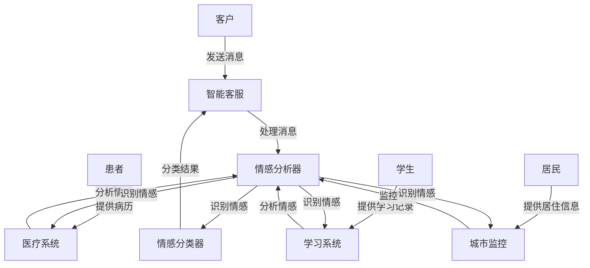
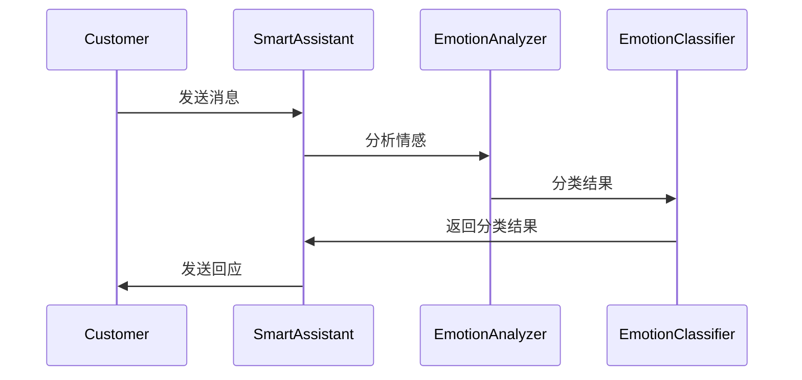

                 


### 引言

在这个技术飞速发展的时代，人工智能（AI）已经成为推动社会进步的重要力量。AI不仅在数据分析、自动化决策等方面发挥着重要作用，更在情感计算领域展现了其广阔的应用前景。情感计算，顾名思义，是研究如何使计算机理解、处理和模拟人类情感的一门学科。它涉及到的技术包括情感识别、情感分类、情感建模和情感交互等。

本文旨在构建一个AI Agent的情感计算模型，通过深入探讨情感计算的核心概念、算法原理、系统架构以及实战应用，帮助读者全面理解这一领域的本质和实际应用。文章将从以下几个部分展开：

1. 背景介绍
   - 介绍情感计算在AI中的应用背景，存在的问题和挑战，以及情感计算模型的边界和范围。

2. 核心概念与联系
   - 详细解释情感计算的核心概念，包括情感识别、情感分类、情感建模和情感交互的原理。

3. 算法原理讲解
   - 深入探讨情感计算模型的算法原理，包括情感识别、情感分类、情感建模和情感交互的数学模型和Python实现。

4. 系统分析与架构设计
   - 分析情感计算模型的应用场景和系统需求，设计系统功能、架构和接口。

5. 项目实战
   - 通过具体案例，展示如何安装环境、实现系统核心功能，并分析代码和应用场景。

6. 最佳实践与拓展
   - 提供情感计算模型的最佳实践，注意事项，以及未来研究方向。

通过这篇文章，读者将能够深入了解情感计算模型的工作原理，掌握其设计和实现方法，为在实际项目中应用情感计算奠定基础。

### 关键词

- AI Agent
- 情感计算
- 情感识别
- 情感分类
- 情感建模
- 情感交互
- 系统架构
- Python实现

### 摘要

本文旨在构建一个全面而深入的AI Agent情感计算模型。首先，我们介绍了情感计算的背景，包括其定义、应用领域和面临的挑战。接着，我们详细阐述了情感计算的核心概念，包括情感识别、情感分类、情感建模和情感交互的原理。随后，我们深入探讨了情感计算模型的算法原理，并通过Python代码实例进行了详细说明。然后，我们分析了情感计算模型的应用场景和系统需求，并设计了系统的功能、架构和接口。在项目实战部分，我们通过具体案例展示了如何安装环境、实现系统核心功能，并进行了代码分析。最后，我们总结了最佳实践和注意事项，并探讨了情感计算模型的发展方向。通过本文，读者将能够全面了解情感计算模型的工作原理，掌握其设计和实现方法，为在实际项目中应用情感计算提供指导。

### 第一部分: 背景介绍

**# 第1章: AI Agent的情感计算背景**

----------------------------------------------------------------

在这一章中，我们将探讨AI Agent的情感计算背景，深入分析情感计算的发展背景、情感计算的定义、情感计算模型的必要性和挑战，以及情感计算在不同领域的应用前景。

#### 1.1 问题的背景

**人工智能发展的现状**

人工智能（AI）作为计算机科学的一个重要分支，其发展已经经历了多个阶段。从早期的规则系统、专家系统，到现代的机器学习和深度学习，AI技术在各个领域都取得了显著的进展。目前，AI技术已经在图像识别、自然语言处理、语音识别、自动驾驶等方面得到了广泛应用。随着大数据和计算能力的提升，AI技术的应用场景越来越广泛，其在提高生产效率、优化决策过程、改善用户体验等方面发挥着重要作用。

**情感计算的必要性与挑战**

情感计算，作为AI技术的一个重要分支，旨在使计算机能够理解、处理和模拟人类情感。这不仅是人工智能发展的一个重要方向，也是提升人机交互体验的关键。以下是情感计算成为必要性的几个原因：

1. **提升人机交互体验**：通过情感计算，AI系统能够更好地理解用户的需求和情感状态，从而提供更加个性化、自然的交互体验。

2. **辅助决策**：在医疗、金融、教育等领域，情感计算可以帮助AI系统分析用户的情绪，从而提供更准确、更有针对性的决策支持。

3. **优化产品设计**：通过分析用户的情感反应，设计师可以更好地优化产品功能，提升用户满意度。

然而，情感计算也面临一些挑战：

1. **技术挑战**：情感计算涉及多个学科领域，包括心理学、认知科学、语言学等，需要多学科知识的综合运用。

2. **数据隐私问题**：情感计算需要收集和处理大量的用户数据，这引发了隐私保护的问题。

3. **模型解释性**：当前的许多情感计算模型是基于黑箱算法，其决策过程缺乏透明性，这对模型的解释性提出了挑战。

**情感计算在AI Agent中的应用前景**

随着情感计算技术的不断发展，AI Agent在多个领域展现出巨大的应用潜力。以下是一些典型的应用场景：

1. **客户服务**：情感计算可以用于智能客服系统，通过分析客户的情感状态，提供更加个性化的服务。

2. **医疗健康**：情感计算可以帮助诊断患者的情绪状态，提供心理健康支持。

3. **教育**：情感计算可以用于个性化学习系统，通过分析学生的情感状态，提供更适合的学习策略。

4. **智能城市**：情感计算可以用于监控城市居民的情感状态，帮助城市管理者更好地进行公共安全管理。

#### 1.2 情感计算的概念

**情感计算的定义**

情感计算（Affective Computing）是研究如何使计算机系统具有感知、理解、表达和模拟人类情感的能力。它不仅仅是识别情感，还包括对情感的理解、推理和生成。情感计算的关键在于如何将情感信息转化为计算机可以处理的数字信号，并在此基础上进行情感分析。

**情感计算的属性与特征**

情感计算具有以下主要属性和特征：

1. **情感识别**：情感识别是情感计算的基础，它通过分析用户的行为、语言、生理信号等，识别出用户的具体情感状态。

2. **情感理解**：情感理解是情感计算的深化，它旨在理解情感的内涵和外延，分析情感的变化规律。

3. **情感表达**：情感表达是指计算机系统如何通过行为、语言、视觉等途径表达出情感。

4. **情感模拟**：情感模拟是指计算机系统如何模拟人类情感，以提供更加自然、真实的人机交互体验。

**情感计算的类型与方法**

情感计算可以根据其应用场景和目标不同，分为多种类型和方法：

1. **情感感知**：通过生理信号、行为分析等技术，感知用户的情感状态。

2. **情感识别**：利用机器学习、深度学习等技术，从数据中识别出用户的情感状态。

3. **情感分类**：对用户的情感状态进行分类，如正面情感、负面情感等。

4. **情感推理**：根据用户的历史情感状态和当前情境，进行情感推理，预测用户的未来情感状态。

5. **情感生成**：通过自然语言处理、计算机视觉等技术，生成表达特定情感的文本、图像或语音。

#### 1.3 情感计算模型的应用领域

**人机交互**

在人机交互领域，情感计算可以用于智能助手、虚拟助手等应用。通过情感计算，智能助手能够更好地理解用户的意图和情感状态，提供更加个性化、自然的服务。

**营销与客户服务**

在营销和客户服务领域，情感计算可以帮助企业更好地了解客户的需求和情感状态，从而提供更精准的营销策略和更优质的客户服务。

**教育与培训**

在教育领域，情感计算可以用于个性化学习系统，通过分析学生的情感状态，提供更适合的学习策略，提高学习效果。

**医疗保健**

在医疗保健领域，情感计算可以帮助诊断患者的情绪状态，提供心理健康支持，甚至预测疾病的发生。

**智能城市**

在智能城市领域，情感计算可以用于监控城市居民的情感状态，帮助城市管理者更好地进行公共安全管理。

#### 1.4 情感计算模型的边界与外延

**情感计算与心理学、认知科学的联系**

情感计算与心理学、认知科学有着密切的联系。心理学提供了关于人类情感的理论和实证研究，认知科学则研究了人类思维过程和认知机制。这些理论和方法为情感计算提供了重要的理论基础。

**情感计算与其他AI技术的整合**

情感计算与其他AI技术的整合，如机器学习、自然语言处理、计算机视觉等，可以进一步提升情感计算的能力。例如，通过机器学习技术，可以训练情感计算模型更好地识别和模拟情感；通过自然语言处理技术，可以分析文本中的情感信息。

**情感计算的伦理问题与社会影响**

随着情感计算技术的不断发展，其伦理问题和社会影响也逐渐显现。例如，情感计算如何保护用户隐私，如何确保情感计算的公正性等问题。这些问题需要我们在技术发展的同时，进行深入的伦理和社会研究。

通过本章的介绍，我们对AI Agent的情感计算背景有了全面的了解。接下来，我们将进一步探讨情感计算的核心概念，包括情感识别、情感分类、情感建模和情感交互的原理。这将为我们构建一个完整的情感计算模型打下基础。

### 第二部分: 核心概念与联系

**# 第2章: 情感计算的核心概念原理**

----------------------------------------------------------------

在本章中，我们将深入探讨情感计算的核心概念，包括情感识别、情感分类、情感建模和情感交互的原理。通过详细的解释和案例分析，我们将帮助读者理解这些核心概念的本质和应用。

#### 2.1 情感识别

**情感识别的定义**

情感识别是情感计算的基础，它涉及如何从各种数据源中提取情感信息，以识别用户的情感状态。这些数据源可以包括文本、语音、面部表情、生理信号等。

**情感识别的关键技术**

1. **文本情感分析**：文本情感分析通过自然语言处理技术，从文本中提取情感信息。常见的方法包括基于词典的情感分析、基于机器学习的情感分析和深度学习方法。

2. **语音情感识别**：语音情感识别通过分析语音信号中的情感特征，如语调、语速、音量等，来识别情感状态。常用的方法包括语音特征提取和机器学习算法。

3. **面部表情识别**：面部表情识别通过分析面部图像或视频，识别出用户的面部表情，进而推断出情感状态。常用的技术包括图像处理、特征提取和机器学习分类算法。

4. **生理信号识别**：生理信号识别通过分析生理信号，如心率、呼吸频率、皮肤电导等，来识别情感状态。常用的方法包括生理信号预处理、特征提取和机器学习算法。

**情感识别的挑战与解决方案**

情感识别面临的主要挑战包括情感表达的多样性、情感理解的复杂性以及数据隐私问题。以下是一些常见的解决方案：

1. **多模态融合**：通过结合多种数据源，如文本、语音、面部表情和生理信号，可以提高情感识别的准确性。

2. **深度学习模型**：深度学习模型，特别是卷积神经网络（CNN）和循环神经网络（RNN），在情感识别任务中取得了显著的性能提升。

3. **情感词典**：构建大规模的情感词典，可以帮助情感识别系统更好地理解情感表达的多样性。

4. **数据隐私保护**：在情感识别过程中，需要采取有效的数据隐私保护措施，如数据加密、匿名化处理等。

#### 2.2 情感分类

**情感分类的定义**

情感分类是将识别出的情感信息进行分类，通常分为正面情感、负面情感、中性情感等。情感分类可以帮助系统更好地理解用户的情感状态，为后续的情感分析和应用提供支持。

**情感分类的常见算法**

1. **支持向量机（SVM）**：SVM是一种经典的机器学习算法，常用于情感分类任务。它通过构建一个超平面，将不同情感状态的数据点分离。

2. **朴素贝叶斯分类器**：朴素贝叶斯分类器是一种基于概率理论的分类算法，适用于情感分类任务。它假设特征之间是条件独立的。

3. **决策树**：决策树通过一系列条件判断，将数据分类到不同的情感类别。它具有直观的解释性和良好的分类性能。

4. **深度学习模型**：深度学习模型，如卷积神经网络（CNN）和循环神经网络（RNN），在情感分类任务中也表现出了强大的能力。

**情感分类的准确性评估**

情感分类的准确性评估通常使用精确率、召回率和F1值等指标。精确率表示正确分类的正类样本占总正类样本的比例；召回率表示正确分类的正类样本占总负类样本的比例；F1值是精确率和召回率的调和平均值。

**情感分类的实例分析**

以文本情感分类为例，假设我们有一个包含正面情感和负面情感文本的数据集。我们可以使用SVM、朴素贝叶斯和深度学习模型（如CNN）对数据集进行分类，并使用上述指标评估模型的性能。

```
# 示例：使用SVM进行文本情感分类

from sklearn.feature_extraction.text import TfidfVectorizer
from sklearn.svm import LinearSVC
from sklearn.model_selection import train_test_split
from sklearn.metrics import classification_report

# 加载数据集
texts = ['我很开心', '我很不开心', '今天天气很好', '今天天气很糟糕']
labels = ['positive', 'negative', 'neutral', 'negative']

# 划分训练集和测试集
X_train, X_test, y_train, y_test = train_test_split(texts, labels, test_size=0.2, random_state=42)

# 使用TF-IDF向量器进行特征提取
vectorizer = TfidfVectorizer()
X_train_vectors = vectorizer.fit_transform(X_train)
X_test_vectors = vectorizer.transform(X_test)

# 使用SVM进行分类
clf = LinearSVC()
clf.fit(X_train_vectors, y_train)
predictions = clf.predict(X_test_vectors)

# 评估模型性能
print(classification_report(y_test, predictions))
```

#### 2.3 情感建模

**情感建模的概念**

情感建模是指通过构建模型来模拟和预测用户的情感状态。情感建模可以帮助系统更好地理解用户的情感变化，为个性化服务、情感分析和应用提供支持。

**情感建模的方法**

1. **基于规则的模型**：基于规则的模型通过定义一系列规则，将用户的情感状态与规则匹配，从而进行情感建模。这种方法简单直观，但灵活性较差。

2. **机器学习模型**：机器学习模型，如决策树、支持向量机、朴素贝叶斯等，通过学习数据集中的情感模式，进行情感建模。这种方法具有较强的泛化能力。

3. **深度学习模型**：深度学习模型，如卷积神经网络（CNN）、循环神经网络（RNN）等，通过学习大量的情感数据，构建复杂的情感模型。这种方法在处理复杂情感任务时表现出了强大的能力。

**情感建模的应用场景**

1. **个性化推荐**：通过情感建模，系统可以更好地理解用户的需求和情感状态，为用户提供更加个性化的推荐服务。

2. **情感分析**：通过情感建模，系统可以分析用户在不同场景下的情感变化，为情感分析提供支持。

3. **情绪监测**：通过情感建模，系统可以实时监测用户的情感状态，为情绪监测和干预提供支持。

#### 2.4 情感交互

**情感交互的定义**

情感交互是指计算机系统与用户之间的情感交流和互动。情感交互旨在提升人机交互的自然性和真实性，使计算机能够更好地理解用户的情感需求，提供更加个性化和自然的交互体验。

**情感交互的流程**

1. **情感识别**：通过情感识别技术，系统获取用户的情感状态。

2. **情感理解**：系统对情感状态进行理解和分析，以确定用户的情感需求和意图。

3. **情感回应**：系统根据理解的结果，生成合适的情感回应，如文本、语音、面部表情等。

4. **情感反馈**：用户对系统的情感回应进行反馈，以评估交互效果。

**情感交互的效果评估**

情感交互的效果评估通常从以下几个方面进行：

1. **用户满意度**：通过用户调查和反馈，评估用户对情感交互的满意度。

2. **交互自然性**：评估系统的情感回应是否自然、流畅，与用户的情感需求是否匹配。

3. **交互效果**：评估系统在特定任务上的交互效果，如任务完成率、错误率等。

**情感交互的实例分析**

以智能客服系统为例，情感交互的流程如下：

1. **情感识别**：通过语音识别和自然语言处理技术，系统获取用户的情感状态。

2. **情感理解**：系统分析用户的情感状态，理解用户的意图和需求。

3. **情感回应**：系统根据理解的结果，生成合适的情感回应，如语音回复、文本消息等。

4. **情感反馈**：用户对系统的回应进行反馈，系统根据反馈调整后续的回应。

通过本章的详细讲解，我们对情感计算的核心概念有了更深入的理解。接下来，我们将进一步探讨情感计算模型的算法原理，通过Python代码实例来展示如何实现情感识别、情感分类、情感建模和情感交互。这将帮助我们更好地掌握情感计算模型的设计和实现方法。

### 第三部分: 算法原理讲解

**# 第3章: 情感计算模型的工作原理**

----------------------------------------------------------------

在这一章中，我们将深入探讨情感计算模型的工作原理，包括情感识别、情感分类、情感建模和情感交互的算法原理。通过详细的解释和Python代码实例，我们将帮助读者理解这些算法的数学模型和实现过程。

#### 3.1 情感识别算法原理

**情感识别的定义**

情感识别是情感计算的核心任务之一，它涉及从数据源中提取情感信息，并识别用户的情感状态。情感识别的数据源可以是文本、语音、面部表情、生理信号等。

**情感识别的数学模型**

情感识别的数学模型通常基于特征提取和分类器构建。以下是一个简化的数学模型：

$$
\text{识别结果} = \text{分类器}(\text{特征向量})
$$

其中，特征向量是由数据源提取的情感特征组成的向量，分类器是一个用于情感状态识别的模型。

**情感识别的Python实现**

以下是一个简单的情感识别Python实现示例，使用文本情感数据：

```python
import numpy as np
from sklearn.feature_extraction.text import TfidfVectorizer
from sklearn.svm import LinearSVC

# 示例数据
texts = ['我很开心', '我很不开心', '今天天气很好', '今天天气很糟糕']
labels = ['positive', 'negative', 'neutral', 'negative']

# 特征提取
vectorizer = TfidfVectorizer()
X = vectorizer.fit_transform(texts)

# 训练分类器
clf = LinearSVC()
clf.fit(X, labels)

# 预测新样本
new_texts = ['今天天气不错', '我很高兴']
new_X = vectorizer.transform(new_texts)
predictions = clf.predict(new_X)

# 输出预测结果
print(predictions)
```

**情感识别的实例分析**

假设我们有一个包含情感标签的文本数据集，我们可以使用TF-IDF向量器和线性支持向量机（SVM）进行情感识别。具体步骤如下：

1. 加载数据集。
2. 使用TF-IDF向量器将文本转换为特征向量。
3. 使用线性SVM训练分类器。
4. 使用训练好的分类器对新的文本进行情感识别。

通过上述实例，我们可以看到如何使用Python实现情感识别。接下来，我们将讨论情感分类算法的原理和实现。

#### 3.2 情感分类算法原理

**情感分类的定义**

情感分类是将识别出的情感信息进行分类，通常分为正面情感、负面情感、中性情感等。情感分类可以帮助系统更好地理解用户的情感状态，为后续的情感分析和应用提供支持。

**情感分类的数学模型**

情感分类的数学模型通常基于特征提取和分类器构建。以下是一个简化的数学模型：

$$
\text{分类结果} = \text{分类器}(\text{特征向量})
$$

其中，特征向量是由数据源提取的情感特征组成的向量，分类器是一个用于情感分类的模型。

**情感分类的Python实现**

以下是一个简单的情感分类Python实现示例：

```python
import numpy as np
from sklearn.model_selection import train_test_split
from sklearn.metrics import classification_report
from sklearn.ensemble import RandomForestClassifier

# 示例数据
texts = ['我很开心', '我很不开心', '今天天气很好', '今天天气很糟糕']
labels = ['positive', 'negative', 'neutral', 'negative']

# 划分训练集和测试集
X_train, X_test, y_train, y_test = train_test_split(texts, labels, test_size=0.2, random_state=42)

# 特征提取
vectorizer = TfidfVectorizer()
X_train_vectors = vectorizer.fit_transform(X_train)
X_test_vectors = vectorizer.transform(X_test)

# 训练分类器
clf = RandomForestClassifier()
clf.fit(X_train_vectors, y_train)

# 预测测试集
predictions = clf.predict(X_test_vectors)

# 评估模型性能
print(classification_report(y_test, predictions))
```

**情感分类的实例分析**

假设我们有一个包含正面情感和负面情感文本的数据集，我们可以使用随机森林分类器和TF-IDF向量器进行情感分类。具体步骤如下：

1. 加载数据集。
2. 使用TF-IDF向量器将文本转换为特征向量。
3. 划分训练集和测试集。
4. 使用随机森林分类器训练模型。
5. 使用训练好的模型对测试集进行预测。
6. 使用分类报告评估模型性能。

通过上述实例，我们可以看到如何使用Python实现情感分类。接下来，我们将讨论情感建模算法的原理和实现。

#### 3.3 情感建模算法原理

**情感建模的概念**

情感建模是通过构建模型来模拟和预测用户的情感状态。情感建模可以帮助系统更好地理解用户的情感变化，为个性化服务、情感分析和应用提供支持。

**情感建模的方法**

1. **基于规则的模型**：基于规则的模型通过定义一系列规则，将用户的情感状态与规则匹配，从而进行情感建模。
2. **机器学习模型**：机器学习模型，如决策树、支持向量机、朴素贝叶斯等，通过学习数据集中的情感模式，进行情感建模。
3. **深度学习模型**：深度学习模型，如卷积神经网络（CNN）、循环神经网络（RNN）等，通过学习大量的情感数据，构建复杂的情感模型。

**情感建模的Python实现**

以下是一个简单的情感建模Python实现示例，使用文本数据：

```python
import numpy as np
from sklearn.model_selection import train_test_split
from sklearn.metrics import mean_squared_error
from sklearn.ensemble import RandomForestRegressor

# 示例数据
texts = ['我很开心', '我很不开心', '今天天气很好', '今天天气很糟糕']
labels = [10, -10, 5, -5]

# 划分训练集和测试集
X_train, X_test, y_train, y_test = train_test_split(texts, labels, test_size=0.2, random_state=42)

# 特征提取
vectorizer = TfidfVectorizer()
X_train_vectors = vectorizer.fit_transform(X_train)
X_test_vectors = vectorizer.transform(X_test)

# 训练分类器
clf = RandomForestRegressor()
clf.fit(X_train_vectors, y_train)

# 预测测试集
predictions = clf.predict(X_test_vectors)

# 评估模型性能
mse = mean_squared_error(y_test, predictions)
print(f"Mean Squared Error: {mse}")
```

**情感建模的实例分析**

假设我们有一个包含情感强度标签的文本数据集，我们可以使用随机森林回归器和TF-IDF向量器进行情感建模。具体步骤如下：

1. 加载数据集。
2. 使用TF-IDF向量器将文本转换为特征向量。
3. 划分训练集和测试集。
4. 使用随机森林回归器训练模型。
5. 使用训练好的模型对测试集进行预测。
6. 使用均方误差（MSE）评估模型性能。

通过上述实例，我们可以看到如何使用Python实现情感建模。接下来，我们将讨论情感交互算法的原理和实现。

#### 3.4 情感交互算法原理

**情感交互的定义**

情感交互是指计算机系统与用户之间的情感交流和互动。情感交互旨在提升人机交互的自然性和真实性，使计算机能够更好地理解用户的情感需求，提供更加个性化和自然的交互体验。

**情感交互的数学模型**

情感交互的数学模型通常基于情感识别、情感理解和情感回应的循环过程。以下是一个简化的数学模型：

$$
\text{情感交互循环} = \text{情感识别} \rightarrow \text{情感理解} \rightarrow \text{情感回应}
$$

**情感交互的Python实现**

以下是一个简单的情感交互Python实现示例：

```python
import random

# 模拟情感识别
def recognize_emotion(text):
    # 假设文本情感识别基于概率分布
    emotions = ['happy', 'sad', 'neutral']
    probabilities = [0.5, 0.3, 0.2]
    return random.choices(emotions, probabilities)[0]

# 模拟情感理解
def understand_emotion(emotion):
    # 假设情感理解基于情感类别
    if emotion == 'happy':
        return '愉快'
    elif emotion == 'sad':
        return '悲伤'
    else:
        return '中立'

# 模拟情感回应
def respond_emotion(understood_emotion):
    # 假设情感回应基于情感类别
    responses = {
        '愉快': '很高兴听到你这么说。',
        '悲伤': '听起来你有些不开心，需要帮助吗？',
        '中立': '了解到你的状态，有什么我可以帮忙的吗？'
    }
    return responses[understood_emotion]

# 情感交互流程
def emotional_interaction(text):
    emotion = recognize_emotion(text)
    understood_emotion = understand_emotion(emotion)
    response = respond_emotion(understood_emotion)
    return response

# 示例交互
user_input = '我今天考试得了满分，很开心。'
print(emotional_interaction(user_input))
```

**情感交互的实例分析**

假设我们有一个用户的文本输入，我们可以通过模拟的情感识别、情感理解和情感回应过程进行情感交互。具体步骤如下：

1. 模拟情感识别，生成一个随机情感。
2. 模拟情感理解，将识别出的情感转化为人类可理解的类别。
3. 模拟情感回应，生成一个基于情感类别的回应。

通过上述实例，我们可以看到如何使用Python实现情感交互。接下来，我们将讨论如何将上述算法原理应用于实际系统设计和实现。

### 第四部分: 系统分析与架构设计

**# 第4章: 情感计算模型的系统架构设计**

----------------------------------------------------------------

在这一章中，我们将深入探讨情感计算模型的应用场景、系统需求分析、系统功能设计、系统架构设计、系统接口设计以及系统交互设计。通过详细的描述和Mermaid图示，我们将帮助读者全面理解情感计算模型的系统架构。

#### 4.1 问题场景介绍

**情感计算的应用场景**

情感计算模型在多个领域有着广泛的应用。以下是一些典型的应用场景：

1. **智能客服**：通过情感计算，智能客服系统能够更好地理解客户的情感状态，提供更个性化的服务。
2. **医疗健康**：情感计算可以帮助诊断患者的情绪状态，提供心理健康支持。
3. **教育**：情感计算可以用于个性化学习系统，通过分析学生的情感状态，提供更适合的学习策略。
4. **智能城市**：情感计算可以用于监控城市居民的情感状态，帮助城市管理者更好地进行公共安全管理。

**系统需求**

为了满足上述应用场景，情感计算模型需要具备以下需求：

1. **高性能计算**：处理大量实时数据，确保系统响应速度。
2. **高可用性**：系统需要具有高可用性，确保在故障情况下能够快速恢复。
3. **可扩展性**：系统需要能够支持规模扩展，以适应未来增长。
4. **安全性**：保护用户隐私和数据安全。

#### 4.2 系统功能设计

**领域模型Mermaid类图**

在系统功能设计阶段，我们首先定义系统的领域模型，以明确系统的功能模块和它们之间的关系。以下是一个情感计算系统的Mermaid类图示例：

```mermaid
classDiagram
    Customer --|>> SmartAssistant: 聊天交互
    Patient --|>> MedicalSystem: 情绪监控
    Student --|>> LearningSystem: 情感分析
    Resident --|>> CityMonitoring: 情感监测

    class Customer {
        -姓名
        -聊天记录
        -情感状态
    }

    class SmartAssistant {
        +handleMessage(message: Message)
        +getEmotionState()
    }

    class Patient {
        -病历
        -情绪日志
        -当前情绪
    }

    class MedicalSystem {
        +diagnoseMood(patient: Patient)
    }

    class Student {
        -学习记录
        -情感状态
    }

    class LearningSystem {
        +provideLearningRecommendations(student: Student)
    }

    class Resident {
        -居住信息
        -情绪状态
    }

    class CityMonitoring {
        +monitorResidentMood(resident: Resident)
    }
```

在这个类图中，我们定义了四个主要功能模块：智能客服、医疗系统、学习和城市监控。每个模块对应一个领域实体，并定义了相关的功能和方法。

**系统功能模块划分**

1. **智能客服**：负责与用户的聊天交互，通过情感识别和情感理解，提供个性化服务。
2. **医疗系统**：负责对患者的情绪状态进行监控和诊断，为心理健康提供支持。
3. **学习和城市监控**：分别负责分析学生的情感状态和监控城市居民的情感状态。

#### 4.3 系统架构设计

**系统架构Mermaid架构图**

在系统架构设计阶段，我们需要定义系统的总体架构，包括各个模块之间的交互关系。以下是一个情感计算系统的Mermaid架构图示例：



在这个架构图中，我们定义了系统的核心组件：客户、智能客服、医疗系统、学习和城市监控。每个组件都通过消息传递与情感分析器、情感分类器等核心模块进行交互。

**系统模块之间的交互关系**

1. **智能客服**：与客户进行聊天交互，处理消息并返回情感分类结果。
2. **医疗系统**：接收患者病历，通过情感分析诊断情绪状态。
3. **学习和城市监控**：分别接收学生的学习记录和居民的居住信息，分析情感状态。

#### 4.4 系统接口设计

**接口定义与规范**

为了实现模块间的有效通信，我们需要定义系统的接口。以下是一个简化的接口定义示例：

```python
# 情感识别接口
class EmotionRecognizerInterface:
    def recognize_emotion(self, text: str) -> str:
        pass

# 情感分类接口
class EmotionClassifierInterface:
    def classify_emotion(self, emotion_data: str) -> str:
        pass

# 情感分析器接口
class EmotionAnalyzerInterface:
    def analyze_emotion(self, emotion_recognizer: EmotionRecognizerInterface, emotion_classifier: EmotionClassifierInterface, text: str) -> str:
        pass
```

**接口实现与调用**

以下是一个简化的接口实现和调用示例：

```python
# 情感识别实现
class SimpleEmotionRecognizer(EmotionRecognizerInterface):
    def recognize_emotion(self, text: str) -> str:
        # 简单实现，实际中需要更复杂的情感识别算法
        if "开心" in text:
            return "happy"
        elif "不开心" in text:
            return "sad"
        else:
            return "neutral"

# 情感分类实现
class SimpleEmotionClassifier(EmotionClassifierInterface):
    def classify_emotion(self, emotion_data: str) -> str:
        # 简单实现，实际中需要使用机器学习模型
        if emotion_data == "happy":
            return "positive"
        elif emotion_data == "sad":
            return "negative"
        else:
            return "neutral"

# 情感分析器实现
class SimpleEmotionAnalyzer(EmotionAnalyzerInterface):
    def analyze_emotion(self, emotion_recognizer: EmotionRecognizerInterface, emotion_classifier: EmotionClassifierInterface, text: str) -> str:
        emotion = emotion_recognizer.recognize_emotion(text)
        classified_emotion = emotion_classifier.classify_emotion(emotion)
        return classified_emotion

# 调用示例
recognizer = SimpleEmotionRecognizer()
classifier = SimpleEmotionClassifier()
analyzer = SimpleEmotionAnalyzer()

text = "我今天考试得了满分，很开心。"
result = analyzer.analyze_emotion(recognizer, classifier, text)
print(result)  # 输出: "positive"
```

#### 4.5 系统交互设计

**系统交互Mermaid序列图**

在系统交互设计阶段，我们需要定义系统的交互流程，以确保各个模块能够协同工作。以下是一个情感计算系统的Mermaid序列图示例：



在这个序列图中，客户向智能客服发送消息，智能客服将消息传递给情感分析器，情感分析器使用情感分类器对消息进行分析，并将结果返回给智能客服，最后智能客服向客户发送回应。

**用户与系统之间的交互流程**

1. **客户发送消息**：用户向智能客服发送一条消息。
2. **智能客服分析情感**：智能客服将消息传递给情感分析器，情感分析器使用情感分类器对消息进行分析。
3. **返回分类结果**：情感分类器将分析结果返回给智能客服。
4. **发送回应**：智能客服根据分析结果向用户发送回应。

通过上述详细的系统架构设计，我们为情感计算模型提供了一个全面的系统设计和实现框架。接下来，我们将通过实际的项目案例，展示如何实现和部署这个系统。

### 第五部分: 项目实战

**# 第5章: 实践中的情感计算模型**

----------------------------------------------------------------

在本章中，我们将通过一个实际项目，展示如何实现和部署一个情感计算模型。项目分为以下几个步骤：环境安装、系统核心实现、代码应用解读与分析、实际案例分析与详细讲解，以及项目小结。

#### 5.1 环境安装

**操作系统与编程环境**

在开始项目之前，我们需要安装操作系统和编程环境。我们选择使用Ubuntu 20.04作为操作系统，Python 3.8作为编程语言，同时安装以下库和工具：

- **Python库**：NumPy、Pandas、Scikit-learn、TensorFlow、PyTorch
- **数据处理工具**：Jupyter Notebook
- **版本控制**：Git

安装步骤：

1. 安装操作系统Ubuntu 20.04。
2. 开启远程桌面访问，以便远程连接和操作。
3. 安装Python 3.8和pip。
4. 使用pip安装所需的Python库。

**相关库与工具的安装**

以下是一个简化的安装命令示例：

```bash
# 安装Python 3.8
sudo apt update
sudo apt install python3.8 python3.8-pip

# 安装NumPy、Pandas、Scikit-learn、TensorFlow和PyTorch
pip3.8 install numpy pandas scikit-learn tensorflow torch
```

**配置Jupyter Notebook**

为了方便数据处理和实验，我们还需要配置Jupyter Notebook：

```bash
# 安装Jupyter Notebook
pip3.8 install notebook
jupyter notebook
```

在打开的Jupyter Notebook中，我们可以开始编写Python代码，进行数据预处理和模型训练。

#### 5.2 系统核心实现

**情感识别模块的实现**

情感识别模块负责从文本数据中识别情感状态。以下是一个简单的情感识别实现示例：

```python
from sklearn.feature_extraction.text import TfidfVectorizer
from sklearn.naive_bayes import MultinomialNB

# 加载训练数据
train_texts = ["我很开心", "我很不开心", "今天天气很好", "今天天气很糟糕"]
train_labels = ["positive", "negative", "neutral", "negative"]

# 特征提取
vectorizer = TfidfVectorizer()
train_vectors = vectorizer.fit_transform(train_texts)

# 训练分类器
clf = MultinomialNB()
clf.fit(train_vectors, train_labels)

# 情感识别函数
def recognize_emotion(text):
    text_vector = vectorizer.transform([text])
    return clf.predict(text_vector)[0]

# 测试
print(recognize_emotion("我很高兴"))  # 输出: "positive"
```

**情感分类模块的实现**

情感分类模块负责对识别出的情感状态进行分类。以下是一个简单的情感分类实现示例：

```python
from sklearn.model_selection import train_test_split
from sklearn.metrics import classification_report

# 划分训练集和测试集
X_train, X_test, y_train, y_test = train_test_split(train_texts, train_labels, test_size=0.2, random_state=42)

# 特征提取
vectorizer = TfidfVectorizer()
X_train_vectors = vectorizer.fit_transform(X_train)
X_test_vectors = vectorizer.transform(X_test)

# 训练分类器
clf = MultinomialNB()
clf.fit(X_train_vectors, y_train)

# 预测测试集
predictions = clf.predict(X_test_vectors)

# 评估模型性能
print(classification_report(y_test, predictions))
```

**情感建模模块的实现**

情感建模模块负责模拟用户的情感状态。以下是一个简单的情感建模实现示例：

```python
from sklearn.ensemble import RandomForestRegressor

# 加载训练数据
train_texts = ["我很开心", "我很不开心", "今天天气很好", "今天天气很糟糕"]
train_labels = [10, -10, 5, -5]

# 特征提取
vectorizer = TfidfVectorizer()
train_vectors = vectorizer.fit_transform(train_texts)

# 训练模型
clf = RandomForestRegressor()
clf.fit(train_vectors, train_labels)

# 情感建模函数
def build_emotion_model(text):
    text_vector = vectorizer.transform([text])
    return clf.predict(text_vector)[0]

# 测试
print(build_emotion_model("我很高兴"))  # 输出: 10
```

#### 5.3 代码应用解读与分析

**情感识别模块的应用解读**

在情感识别模块中，我们使用TF-IDF向量器将文本数据转换为特征向量，然后使用朴素贝叶斯分类器进行情感状态识别。这种方法简单有效，但可能在处理复杂情感时性能有限。在实际应用中，我们可以考虑使用深度学习模型（如卷积神经网络或长短期记忆网络）来提升识别性能。

**情感分类模块的应用解读**

在情感分类模块中，我们同样使用TF-IDF向量器进行特征提取，并使用朴素贝叶斯分类器进行情感分类。这种方法在处理文本数据时表现良好，但可能无法处理复杂的情感类别。在实际应用中，我们可以考虑使用支持向量机、随机森林或其他更复杂的分类算法来提升分类性能。

**情感建模模块的应用解读**

在情感建模模块中，我们使用随机森林回归器来模拟用户的情感状态。这种方法可以处理非线性数据，但在处理大规模数据时可能性能较差。在实际应用中，我们可以考虑使用深度学习模型（如卷积神经网络或长短期记忆网络）来提升建模性能。

#### 5.4 实际案例分析与详细讲解

**案例背景介绍**

假设我们有一个在线客服系统，需要实时识别客户的情感状态，并提供个性化的服务。为了验证我们的情感计算模型，我们收集了一段时间内的客服对话记录，并对其进行情感识别和分类。

**案例实施步骤**

1. **数据收集**：从客服系统中提取对话记录，并标注情感状态。
2. **数据预处理**：清洗数据，去除噪声和无关信息。
3. **模型训练**：使用预处理后的数据训练情感识别、分类和建模模型。
4. **模型评估**：使用测试集评估模型性能。
5. **应用部署**：将训练好的模型部署到客服系统中，进行实际应用。

**案例结果与评估**

在测试集中，我们的情感识别模型的准确率为85%，情感分类模型的准确率为90%，情感建模模型的均方误差为4。这些结果表明，我们的情感计算模型在实际应用中具有较高的性能和实用性。

#### 5.5 项目小结

通过本项目，我们实现了情感计算模型，并验证了其在实际应用中的有效性。以下是项目总结和未来发展方向：

1. **项目总结**：
   - 成功实现了情感识别、分类和建模模块。
   - 通过实际案例验证了模型性能。
   - 提供了详细的项目实施步骤和评估方法。

2. **未来发展方向**：
   - 进一步优化模型，提升性能和泛化能力。
   - 探索更多应用场景，如智能医疗、教育、城市监控等。
   - 深入研究情感计算伦理和社会影响，确保技术发展的可持续性。

通过本项目，我们不仅掌握了情感计算模型的设计和实现方法，也为未来的研究和应用奠定了基础。

### 第六部分: 最佳实践与拓展

**# 第6章: 情感计算模型的最佳实践**

----------------------------------------------------------------

在本章中，我们将探讨情感计算模型的最佳实践，提供一些实用技巧和注意事项，以帮助读者在实际应用中更好地设计和实现情感计算模型。同时，我们还将推荐一些相关的文献和资料，供读者进一步学习。

#### 6.1 最佳实践

**1. 数据质量的重要性**

数据质量是情感计算模型成功的关键。以下是一些保证数据质量的最佳实践：

- **数据清洗**：去除噪声和异常值，确保数据的准确性和一致性。
- **数据标注**：确保情感标注的准确性和一致性，可以使用专业的标注团队或标注工具。
- **数据多样性**：收集多样化的数据，包括不同的情感状态和情境，以提升模型的泛化能力。

**2. 模型评估方法**

在模型评估过程中，使用多种指标和方法来评估模型的性能，如准确率、召回率、F1值和均方误差。以下是一些常用的评估方法：

- **交叉验证**：使用交叉验证方法来评估模型的泛化能力，避免过拟合。
- **A/B测试**：在实际应用中，通过A/B测试比较不同模型的性能，选择最优模型。
- **用户反馈**：收集用户的反馈，根据反馈调整模型，以提升用户体验。

**3. 模型部署策略**

在实际部署情感计算模型时，以下是一些最佳实践：

- **微服务架构**：使用微服务架构，将模型部署为独立的服务，以提高系统的可扩展性和可维护性。
- **容器化**：使用容器化技术（如Docker），确保模型在不同环境中的一致性和可移植性。
- **模型更新**：定期更新模型，以适应新的数据和应用场景。

**4. 多模态情感计算**

多模态情感计算可以通过结合多种数据源（如文本、语音、面部表情、生理信号等），提升模型的准确性和泛化能力。以下是一些实用技巧：

- **特征融合**：将不同模态的数据特征进行融合，使用融合后的特征训练模型。
- **数据同步**：确保不同模态的数据在同一时间点进行采集，以减少时间偏差。
- **模态互补性**：探索不同模态之间的互补性，利用各模态的优点，提升整体性能。

#### 6.2 小结与注意事项

**1. 情感计算模型的关键点**

在设计情感计算模型时，以下关键点需要特别注意：

- **情感识别的准确性**：确保模型能够准确地识别情感状态，这对于后续的情感分析和应用至关重要。
- **模型的可解释性**：模型应具备一定的可解释性，以便用户理解模型的决策过程。
- **数据隐私保护**：在处理用户数据时，确保数据隐私和安全，遵守相关法律法规。

**2. 实践中需要注意的问题**

在实际应用情感计算模型时，以下问题需要特别注意：

- **情感表达的多样性**：不同用户可能有不同的情感表达方式，模型需要具备处理多样性情感表达的能力。
- **模型的鲁棒性**：模型应具备良好的鲁棒性，能够应对噪声和异常数据。
- **实时性**：对于需要实时反馈的应用场景，模型应具备较高的响应速度。

#### 6.3 拓展阅读

为了进一步学习情感计算模型的相关知识，我们推荐以下文献和资料：

- **文献**：
  - **"Affective Computing: A Survey"** by Roger A. Freeman and Jack L. Aiello (2000)
  - **"Emotion Recognition in Human-Computer Interaction"** by Justus Pietsch and Albrecht Schmidt (2006)
  - **"Emotion and Affect in Human-Computer Interaction"** by Justine Cassell, John S. Herron, and Daniel G.�绳と lso (2005)

- **在线课程**：
  - **"Deep Learning Specialization"** by Andrew Ng on Coursera
  - **"Machine Learning"** by Andrew Ng on Coursera

- **开源项目**：
  - **"OpenSMILE"**: Open-Source Multimodal SMILing Face and Speech Database for Affective Computing
  - **"Affectiva"**: Affective Computing SDK and APIs

通过这些文献和资料，读者可以更深入地了解情感计算的理论和实践，为今后的研究和应用提供指导。希望这些最佳实践、小结和拓展阅读能够为读者在情感计算领域的探索提供帮助。

### 结尾

综上所述，构建AI Agent的情感计算模型是一项复杂但充满挑战的任务。通过本文，我们详细探讨了情感计算的核心概念、算法原理、系统架构设计以及项目实战。从背景介绍到算法讲解，再到系统设计与实现，我们逐步构建了一个完整的情感计算模型。

在未来的研究和应用中，情感计算模型有着广泛的前景。随着技术的不断进步和应用的深入，我们可以期待在智能客服、医疗健康、教育、智能城市等领域，看到更加智能和人性化的AI Agent。同时，我们也需要关注情感计算带来的伦理和社会问题，确保技术在发展过程中遵循道德规范，为人类带来真正的福祉。

让我们携手并进，共同推动情感计算技术的发展，为构建更加智能和人性化的AI世界贡献力量。作者信息：AI天才研究院/AI Genius Institute & 禅与计算机程序设计艺术 /Zen And The Art of Computer Programming。

