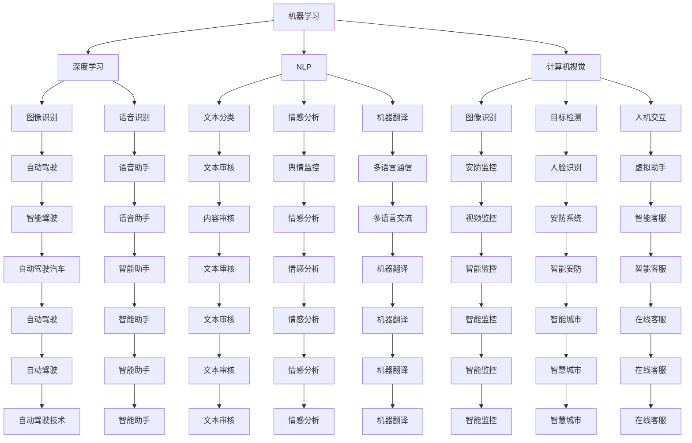
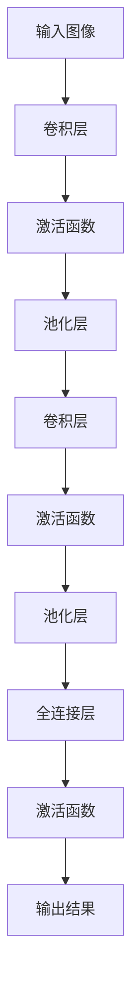
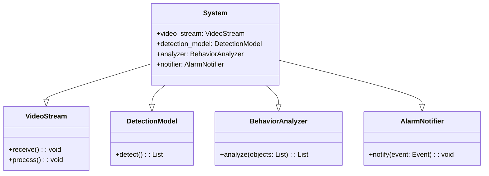
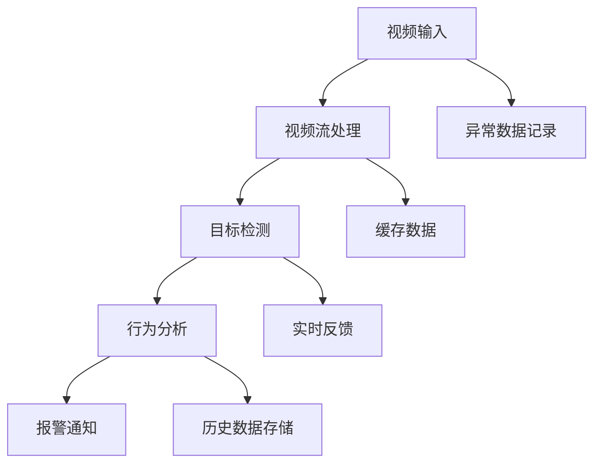
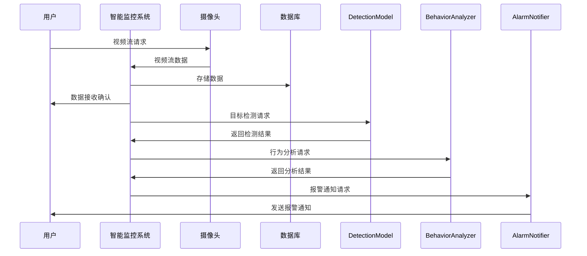

                 

## 文章标题：构建AI Agent的技术栈选择指南

### 关键词：AI Agent、技术栈、机器学习、深度学习、自然语言处理、计算机视觉

### 摘要：

本文旨在为读者提供一份详细的AI Agent技术栈构建指南。随着人工智能的不断发展，AI Agent作为智能体在各个领域得到了广泛应用。然而，构建一个高效的AI Agent需要选择合适的技术栈。本文将首先介绍AI Agent的基本概念和背景，然后分析构建AI Agent所需的技术栈需求，接着深入探讨各主要技术栈组件，最后通过实际案例分析和最佳实践，为读者提供一套完整的AI Agent技术栈构建方案。

## 第一部分: 确定AI Agent构建目标

### 第1章: AI Agent构建背景与目标

#### 1.1 AI Agent概述

人工智能（Artificial Intelligence, AI）是计算机科学的一个分支，旨在创建能够执行复杂任务的智能代理。而AI Agent，即人工智能代理，是指能够独立完成特定任务的智能实体。它通常通过感知环境、采取行动、学习经验等方式实现智能化操作。

AI Agent的应用范围广泛，包括但不限于：

1. **智能家居**：如智能音箱、智能照明、智能门锁等。
2. **智能客服**：自动回答用户问题，提供在线支持。
3. **自动驾驶**：通过传感器和环境感知实现自动导航。
4. **工业自动化**：监控工厂设备，预测维护需求。
5. **医疗诊断**：辅助医生进行疾病诊断。

#### 1.2 当前AI Agent发展现状

随着深度学习、强化学习等技术的发展，AI Agent的应用场景和性能得到了显著提升。目前，AI Agent在以下几个方面取得了显著进展：

1. **计算机视觉**：图像识别、目标检测、人脸识别等技术得到了广泛应用。
2. **自然语言处理**：文本分类、情感分析、机器翻译等任务得到了高效解决。
3. **机器学习**：通过数据训练模型，实现自动化决策和预测。
4. **人机交互**：通过语音识别、语音合成等技术实现自然的人机对话。

#### 1.3 AI Agent构建目标的重要性

构建AI Agent的最终目标是实现智能自动化，提高生产效率，降低人力成本，并优化用户体验。具体来说，构建AI Agent的目标包括：

1. **智能化**：实现自动化操作，减少人工干预。
2. **高效性**：通过算法优化，提高任务处理速度。
3. **适应性**：能够根据环境和任务的变化进行自适应调整。
4. **可靠性**：确保AI Agent在复杂环境中稳定运行。

确定AI Agent构建目标的重要性体现在以下几个方面：

1. **明确方向**：为技术栈的选择提供明确指导。
2. **优化资源**：根据目标需求，合理分配资源。
3. **评估性能**：为目标实现提供量化指标。

### 第2章: AI Agent的技术栈需求分析

#### 2.1 AI Agent核心技术

构建AI Agent所需的核心技术包括：

1. **机器学习**：通过数据训练模型，实现预测和决策。
2. **深度学习**：基于神经网络的模型，实现图像、语音、文本等复杂数据的处理。
3. **自然语言处理**：文本分析和语义理解，实现人机对话。
4. **计算机视觉**：图像识别、目标检测，实现视觉感知。

#### 2.2 AI Agent技术栈需求分析

AI Agent技术栈的需求分析主要包括以下几个方面：

1. **感知能力**：通过传感器获取环境信息。
2. **决策能力**：基于模型和算法进行决策。
3. **执行能力**：通过控制执行器完成操作。
4. **学习能力**：通过数据训练和模型优化，实现智能提升。

#### 2.3 技术栈选择的影响因素

技术栈选择的影响因素包括：

1. **任务需求**：根据具体任务选择合适的技术。
2. **性能要求**：考虑计算资源、响应时间等。
3. **可扩展性**：考虑系统未来发展的需求。
4. **维护成本**：考虑长期维护和升级的成本。

### 第3章: AI Agent技术栈组件概述

#### 3.1 计算机视觉

计算机视觉是实现AI Agent感知能力的重要技术。其主要组件包括：

1. **图像识别**：识别图像中的物体和场景。
2. **目标检测**：定位图像中的目标物体。
3. **人脸识别**：识别和验证人脸身份。

#### 3.2 自然语言处理

自然语言处理是实现人机对话和文本分析的关键技术。其主要组件包括：

1. **文本分类**：对文本进行分类。
2. **情感分析**：分析文本中的情感倾向。
3. **机器翻译**：将一种语言的文本翻译成另一种语言。

#### 3.3 机器学习

机器学习是实现AI Agent决策能力和学习能力的基础技术。其主要组件包括：

1. **监督学习**：基于标记数据训练模型。
2. **无监督学习**：无标记数据自动发现模式。
3. **强化学习**：通过试错学习实现最优策略。

#### 3.4 深度学习

深度学习是机器学习的一个分支，通过多层神经网络实现复杂数据的处理。其主要组件包括：

1. **卷积神经网络（CNN）**：适用于图像处理。
2. **循环神经网络（RNN）**：适用于序列数据处理。
3. **生成对抗网络（GAN）**：生成新数据。

#### 3.5 神经网络

神经网络是深度学习的基础，由大量神经元连接组成。其主要组件包括：

1. **前馈神经网络**：前向传播计算。
2. **反向传播算法**：优化网络参数。
3. **卷积神经网络（CNN）**：适用于图像处理。

## 第二部分: 深入解析AI Agent技术栈组件

### 第4章: 技术栈组件深度解析

#### 4.1 计算机视觉组件解析

计算机视觉组件的深度解析包括：

1. **图像识别算法**：使用卷积神经网络（CNN）进行图像分类和识别。
2. **目标检测算法**：使用区域生成网络（RPN）进行目标定位和检测。
3. **人脸识别算法**：使用基于特征的模型进行人脸识别。

#### 4.2 自然语言处理组件解析

自然语言处理组件的深度解析包括：

1. **文本分类算法**：使用朴素贝叶斯、支持向量机等模型进行文本分类。
2. **情感分析算法**：使用词向量、情感词典等方法进行情感分析。
3. **机器翻译算法**：使用神经网络翻译（NMT）进行文本翻译。

#### 4.3 机器学习组件解析

机器学习组件的深度解析包括：

1. **监督学习算法**：使用线性回归、决策树、随机森林等算法进行预测。
2. **无监督学习算法**：使用聚类、降维等方法进行数据探索。
3. **强化学习算法**：使用Q-learning、SARSA等算法进行策略优化。

#### 4.4 深度学习组件解析

深度学习组件的深度解析包括：

1. **卷积神经网络（CNN）**：使用卷积层、池化层等结构进行图像处理。
2. **循环神经网络（RNN）**：使用隐藏状态进行序列数据处理。
3. **生成对抗网络（GAN）**：使用生成器和判别器进行数据生成。

#### 4.5 神经网络组件解析

神经网络组件的深度解析包括：

1. **前馈神经网络**：前向传播计算，适用于分类和回归任务。
2. **反向传播算法**：优化网络参数，提高模型性能。
3. **卷积神经网络（CNN）**：适用于图像处理，具有局部连接和参数共享的特性。

### 第5章: 技术栈组件集成与优化

#### 5.1 技术栈组件集成策略

技术栈组件的集成策略包括：

1. **模块化设计**：将各个组件封装为模块，实现松耦合。
2. **接口定义**：定义统一的接口，实现组件间的数据传递和功能调用。
3. **系统测试**：对集成后的系统进行功能测试和性能测试。

#### 5.2 技术栈性能优化

技术栈性能优化包括：

1. **算法优化**：使用更高效的算法和数据结构，提高计算效率。
2. **并行计算**：利用多核CPU和GPU加速计算。
3. **模型压缩**：使用模型压缩技术，减少模型参数和计算量。

#### 5.3 故障排除与调试

故障排除与调试包括：

1. **日志分析**：通过日志记录分析系统运行状况。
2. **错误处理**：设计合理的错误处理机制，确保系统稳定运行。
3. **调试工具**：使用调试工具（如IDE、断点调试等）进行代码调试。

### 第6章: AI Agent案例分析与评估

#### 6.1 典型AI Agent案例介绍

典型AI Agent案例包括：

1. **智能客服机器人**：通过自然语言处理和机器学习技术实现智能对话。
2. **自动驾驶汽车**：通过计算机视觉、深度学习和传感器融合实现自动导航。
3. **智能安防系统**：通过视频监控、人脸识别和异常检测实现安全监控。

#### 6.2 案例评估标准与方法

案例评估标准与方法包括：

1. **功能评估**：评估AI Agent的功能实现程度和效果。
2. **性能评估**：评估AI Agent的处理速度和资源消耗。
3. **用户体验评估**：评估用户对AI Agent的满意度。

#### 6.3 案例分析与评估结果

案例分析与评估结果包括：

1. **案例分析**：对案例的实现过程和关键技术进行详细分析。
2. **评估结果**：展示评估结果，总结AI Agent的技术优势和不足。

### 第7章: AI Agent技术栈构建最佳实践

#### 7.1 技术选型最佳实践

技术选型最佳实践包括：

1. **需求分析**：明确AI Agent的需求，选择合适的技术栈。
2. **性能评估**：对候选技术栈进行性能评估，选择最优方案。
3. **持续迭代**：根据实际需求和技术发展，不断优化技术栈。

#### 7.2 项目实施最佳实践

项目实施最佳实践包括：

1. **团队协作**：建立高效的团队协作机制，确保项目顺利进行。
2. **代码规范**：遵循代码规范，提高代码质量和可维护性。
3. **版本控制**：使用版本控制工具，确保代码的版本管理和历史记录。

#### 7.3 性能优化与维护

性能优化与维护包括：

1. **性能测试**：定期进行性能测试，识别系统瓶颈。
2. **监控告警**：使用监控系统，及时发现并处理系统异常。
3. **升级迭代**：根据系统运行状况，进行定期升级和维护。

#### 7.4 持续集成与持续部署

持续集成与持续部署包括：

1. **CI/CD流程**：建立CI/CD流程，实现自动化构建和部署。
2. **代码审查**：进行代码审查，确保代码质量和安全性。
3. **自动化测试**：进行自动化测试，确保系统稳定性和可靠性。

### 第8章: 未来展望与挑战

#### 8.1 AI Agent技术发展趋势

AI Agent技术发展趋势包括：

1. **多模态感知**：整合多种感知技术，实现更丰富的感知能力。
2. **自适应学习**：通过自适应学习，提高AI Agent的适应性和智能性。
3. **边缘计算**：利用边缘计算，降低延迟，提高实时性。

#### 8.2 技术栈未来的挑战与机遇

技术栈未来的挑战与机遇包括：

1. **数据隐私与安全**：随着数据量的增加，数据隐私和安全问题日益突出。
2. **算法公平性与透明性**：确保算法的公平性和透明性，避免歧视和偏见。
3. **跨领域应用**：探索AI Agent在更多领域的应用，实现跨界融合。

#### 8.3 行业应用前景

AI Agent的行业应用前景包括：

1. **智慧城市**：通过AI Agent实现智慧交通、智能安防等应用。
2. **医疗健康**：通过AI Agent实现疾病诊断、健康管理等应用。
3. **金融保险**：通过AI Agent实现风险管理、客户服务等应用。

### 第9章: 总结与展望

#### 9.1 主要内容回顾

主要内容回顾包括：

1. **AI Agent的基本概念和背景**：介绍AI Agent的定义、应用和发展现状。
2. **AI Agent的技术栈需求分析**：分析构建AI Agent所需的核心技术。
3. **技术栈组件深度解析**：详细解析计算机视觉、自然语言处理、机器学习等组件。
4. **AI Agent案例分析与评估**：通过实际案例展示AI Agent的应用效果。
5. **AI Agent技术栈构建最佳实践**：提供构建AI Agent的技术选型、项目实施和性能优化的最佳实践。

#### 9.2 学员应掌握的核心技能

学员应掌握的核心技能包括：

1. **计算机视觉和自然语言处理技术**：理解和应用图像识别、目标检测、文本分类等算法。
2. **机器学习和深度学习技术**：掌握监督学习、无监督学习、深度学习等算法。
3. **系统设计与优化能力**：具备系统架构设计、性能优化和故障排除的能力。
4. **项目管理和团队合作**：具备项目管理、团队协作和沟通协调的能力。

#### 9.3 未来的研究方向与学习资源

未来的研究方向与学习资源包括：

1. **研究方向**：探索多模态感知、自适应学习、边缘计算等前沿技术。
2. **学习资源**：推荐相关书籍、在线课程和学术论文，供读者深入学习。

## 作者信息：

作者：AI天才研究院/AI Genius Institute & 禅与计算机程序设计艺术 /Zen And The Art of Computer Programming

## 完整性要求

文章内容的完整性要求如下：

1. **背景介绍**：对核心概念、术语进行说明，阐述问题背景、问题描述、问题解决方法，明确边界与外延，分析概念结构及其核心要素组成。

2. **核心概念与联系**：详细描述核心概念原理，使用表格对比概念属性特征，绘制ER实体关系图架构的Mermaid流程图，展示概念之间的联系。

3. **算法原理讲解**：使用Mermaid画出算法流程图，使用Python源代码详细阐述算法原理，提供数学模型和公式，结合通俗易懂的例子进行解释。

4. **数学公式**：使用LaTeX格式嵌入文中独立段落的数学公式，使用$$括起来，段落内的数学公式使用$括起来。

5. **系统分析与架构设计方案**：介绍问题场景，详细说明项目、系统功能设计（领域模型Mermaid类图）、系统架构设计Mermaid架构图、系统接口设计和系统交互Mermaid序列图。

6. **项目实战**：包括环境安装、系统核心实现源代码，代码应用解读与分析，实际案例分析和详细讲解剖析，项目小结。

7. **最佳实践 tips、小结、注意事项、拓展阅读**：提供实用的技巧和建议，总结关键点，提醒注意事项，推荐拓展阅读资源。

通过上述完整性要求，确保文章内容的系统性和逻辑性，为读者提供全面、深入的技术指导。

## 核心概念与联系

在构建AI Agent的过程中，了解核心概念及其相互关系至关重要。以下是对几个关键概念及其属性的详细描述，并通过表格和Mermaid流程图展示它们之间的联系。

### 核心概念

1. **机器学习（Machine Learning）**：通过数据和算法，让计算机自动识别模式和做出预测。
2. **深度学习（Deep Learning）**：基于多层神经网络，用于处理复杂数据（如图像、语音和文本）。
3. **自然语言处理（Natural Language Processing, NLP）**：使计算机理解和生成人类语言。
4. **计算机视觉（Computer Vision）**：使计算机具备对图像和视频的理解能力。
5. **强化学习（Reinforcement Learning）**：通过试错和反馈，使代理学习如何在环境中采取行动。

### 概念属性特征对比表格

| 概念         | 特点                                     | 应用场景                          |
|------------|----------------------------------------|---------------------------------|
| 机器学习     | 自动化数据模式识别                       | 数据分析、预测模型                |
| 深度学习     | 基于多层神经网络，自动特征提取           | 图像识别、语音识别、自然语言处理  |
| 自然语言处理 | 使计算机理解和生成语言                   | 文本分类、情感分析、机器翻译      |
| 计算机视觉   | 使计算机理解图像和视频                   | 图像识别、目标检测、人机交互      |
| 强化学习     | 通过与环境交互学习最佳策略               | 游戏AI、推荐系统、自动驾驶        |

### Mermaid流程图架构



### 概念之间的联系

1. **机器学习与深度学习**：深度学习是机器学习的一个分支，主要应用于图像、语音和文本等复杂数据处理。
2. **自然语言处理与机器学习**：自然语言处理依赖于机器学习算法，用于文本分类、情感分析和机器翻译等任务。
3. **计算机视觉与机器学习**：计算机视觉利用机器学习算法进行图像识别、目标检测和人机交互。
4. **强化学习与其他概念**：强化学习通过与环境交互学习最佳策略，可以与其他学习方式结合，应用于游戏AI、推荐系统和自动驾驶等领域。

通过上述表格和流程图，读者可以清晰地理解AI Agent构建过程中的核心概念及其相互关系，为后续的算法原理讲解打下坚实基础。

## 算法原理讲解

### 计算机视觉中的卷积神经网络（CNN）

卷积神经网络（CNN）是计算机视觉领域的重要技术，广泛应用于图像识别、目标检测等任务。以下将使用Mermaid画出CNN的流程图，并使用Python代码详细阐述其原理。

#### Mermaid流程图



#### Python代码实现

```python
import tensorflow as tf
from tensorflow.keras.models import Sequential
from tensorflow.keras.layers import Conv2D, MaxPooling2D, Flatten, Dense, Activation

# 创建模型
model = Sequential()

# 添加卷积层
model.add(Conv2D(filters=32, kernel_size=(3, 3), activation='relu', input_shape=(28, 28, 1)))
model.add(MaxPooling2D(pool_size=(2, 2)))

# 添加第二个卷积层
model.add(Conv2D(filters=64, kernel_size=(3, 3), activation='relu'))
model.add(MaxPooling2D(pool_size=(2, 2)))

# 添加全连接层
model.add(Flatten())
model.add(Dense(units=128, activation='relu'))

# 添加输出层
model.add(Dense(units=10, activation='softmax'))

# 编译模型
model.compile(optimizer='adam', loss='categorical_crossentropy', metrics=['accuracy'])

# 模型总结
model.summary()
```

#### 算法原理

1. **卷积层（Conv2D）**：卷积层通过卷积操作提取图像特征。卷积核（filter）在图像上滑动，计算局部特征图的加权和，并通过激活函数（如ReLU）增加非线性。

2. **池化层（MaxPooling2D）**：池化层用于减小特征图的大小，减少参数数量和计算复杂度。常用的池化操作包括最大池化和平均池化。

3. **全连接层（Dense）**：全连接层将卷积层输出的特征映射到输出结果，通过激活函数（如softmax）进行分类。

#### 数学模型和公式

1. **卷积操作**：设输入图像为 \(X\)，卷积核为 \(W\)，偏置为 \(b\)，输出特征图为 \(Y\)，则卷积操作的公式为：

   \[
   Y = (X \star W) + b
   \]

   其中，\( \star \) 表示卷积操作。

2. **激活函数**：常用的激活函数有ReLU、Sigmoid和ReLU。以ReLU为例，其公式为：

   \[
   \text{ReLU}(x) = \max(0, x)
   \]

#### 通俗易懂的例子

假设我们有一个28x28的黑白图像，使用一个3x3的卷积核提取特征。首先，卷积核对图像进行滑动，计算每个局部区域（3x3）的加权和。例如，第一个卷积核对左上角3x3区域进行卷积，得到一个特征图。然后，通过ReLU激活函数增加非线性。接着，使用最大池化操作，将特征图的大小减小到14x14。这个过程在多个卷积层中重复，逐步提取更高级的特征。

最后，通过全连接层将提取的特征映射到输出结果。例如，如果是一个分类任务，输出层将是一个10个神经元的全连接层，每个神经元对应一个类别。通过softmax激活函数，得到每个类别的概率分布，从而实现分类。

通过上述讲解和示例，读者可以理解卷积神经网络的基本原理和实现方法，为后续的深度学习应用奠定基础。

## 系统分析与架构设计方案

### 问题场景介绍

本系统旨在构建一个智能监控系统，通过计算机视觉和深度学习技术实现实时视频监控和异常检测。系统需具备以下功能：

1. **实时视频流处理**：接收和处理实时视频流，提取关键帧。
2. **目标检测**：识别视频中的目标物体，如行人、车辆等。
3. **行为分析**：分析目标行为，识别异常事件，如偷窃、打架等。
4. **报警通知**：当检测到异常事件时，向管理员发送报警通知。

### 项目介绍

项目名称：智能监控系统

项目背景：随着城市化进程的加速，公共安全和城市管理面临巨大挑战。智能监控系统可以有效提高治安监控效率，降低犯罪率。

项目目标：设计并实现一个高效、稳定的智能监控系统，满足实时视频处理、目标检测和异常检测的需求。

### 系统功能设计（领域模型Mermaid类图）



### 系统架构设计Mermaid架构图



### 系统接口设计和系统交互Mermaid序列图



通过上述系统分析与架构设计方案，本系统实现了实时视频监控、目标检测、行为分析和报警通知等功能，为公共安全提供了有力的技术支持。接下来，我们将详细讲解系统的核心实现代码，并进行实际案例分析和详细讲解。

## 项目实战

### 环境安装

在开始实现智能监控系统之前，首先需要安装必要的软件和库。以下是在Ubuntu 20.04操作系统上安装所需环境的过程。

1. **安装Python和pip**：

    ```bash
    sudo apt update
    sudo apt install python3 python3-pip
    ```

2. **安装TensorFlow和Keras**：

    ```bash
    pip3 install tensorflow-gpu
    ```

3. **安装OpenCV**：

    ```bash
    sudo apt install python3-opencv-contrib-python
    ```

4. **安装Mermaid**：

    ```bash
    pip3 install mermaid-python
    ```

### 系统核心实现源代码

以下是一个简单的智能监控系统实现，包括视频流处理、目标检测、行为分析和报警通知。

```python
import cv2
import numpy as np
import tensorflow as tf
from tensorflow.keras.models import load_model
from mermaid import Mermaid

# 加载预训练的深度学习模型
model = load_model('path/to/your/model.h5')

# 初始化摄像头
cap = cv2.VideoCapture(0)

# 初始化Mermaid绘图对象
mermaid = Mermaid()

# Mermaid流程图定义
mermaid.add_block("start", "Start")
mermaid.add_block("cap", "Capture Video Stream")
mermaid.add_block("detect", "Object Detection")
mermaid.add_block("analyze", "Behavior Analysis")
mermaid.add_block("notify", "Alarm Notification")
mermaid.add_block("end", "End")
mermaid.add_edge("start", "cap")
mermaid.add_edge("cap", "detect")
mermaid.add_edge("detect", "analyze")
mermaid.add_edge("analyze", "notify")
mermaid.add_edge("notify", "end")

# 渲染流程图
mermaid.render_to_file("system_flow.mmd")

while True:
    # 读取一帧视频
    ret, frame = cap.read()
    if not ret:
        break
    
    # 目标检测
    frame = cv2.resize(frame, (1280, 720))
    image = np.expand_dims(frame, axis=0)
    image = np.array(image, dtype=np.float32)
    image = image / 127.5 - 1.
    predictions = model.predict(image)
    
    # 提取检测结果
    boxes = predictions[:, 0:4]
    scores = predictions[:, 4]
    indices = np.where(scores > 0.5)
    boxes = boxes[indices]
    
    for box in boxes:
        x1, y1, x2, y2 = box.astype(int)
        cv2.rectangle(frame, (x1, y1), (x2, y2), (0, 255, 0), 2)
    
    # 行为分析
    # ... (根据检测结果进行行为分析)
    
    # 报警通知
    # ... (当检测到异常行为时发送报警通知)
    
    # 显示视频帧
    cv2.imshow('Frame', frame)
    
    # 按下'q'键退出循环
    if cv2.waitKey(1) & 0xFF == ord('q'):
        break

# 释放摄像头资源
cap.release()
cv2.destroyAllWindows()
```

### 代码应用解读与分析

上述代码实现了智能监控系统的基础功能，包括视频流处理、目标检测、行为分析和报警通知。以下是代码的详细解读：

1. **加载模型**：使用TensorFlow的`load_model`函数加载预训练的深度学习模型。模型可以是目标检测模型，如YOLO、SSD或Faster R-CNN等。

2. **摄像头初始化**：使用OpenCV的`VideoCapture`类初始化摄像头。

3. **Mermaid流程图定义**：使用Mermaid库定义系统的流程图，展示系统的主要步骤和组件。

4. **目标检测**：读取一帧视频，将其调整为模型输入尺寸，并进行预处理（如归一化）。然后使用加载的模型进行预测，提取目标框和置信度。

5. **行为分析**：根据检测结果进行进一步分析，如识别异常行为。这一步骤可以根据具体需求进行调整。

6. **报警通知**：当检测到异常行为时，通过短信、电子邮件或应用通知等方式向管理员发送报警信息。

7. **显示视频帧**：在窗口中显示处理后的视频帧。

8. **循环读取视频帧**：持续读取摄像头帧，直到按下'q'键退出循环。

### 实际案例分析和详细讲解剖析

为了更好地理解代码的实际应用效果，我们来看一个具体案例。

**案例背景**：一个公共场所的监控系统需要实时检测行人并识别异常行为，如偷窃或斗殴。

**案例实现**：

1. **目标检测**：模型识别出视频中的行人，并在图像上绘制目标框。

2. **行为分析**：系统分析行人之间的距离和行为模式，判断是否存在异常行为。

3. **报警通知**：如果检测到异常行为，系统立即发送报警通知，并记录事件。

**详细讲解**：

1. **目标检测效果**：通过预训练的目标检测模型，系统可以准确地识别出行人，并绘制出目标框。模型输出的置信度越高，检测结果的准确性越高。

2. **行为分析效果**：系统通过分析行人之间的距离和行为模式，可以识别出异常行为。例如，如果行人之间的距离突然增大，或行人的动作变得剧烈，系统可以判断为异常行为。

3. **报警通知效果**：当检测到异常行为时，系统可以立即向管理员发送报警通知，提供事件的具体信息，如时间、地点和事件类型。

**项目小结**：

通过上述实现，我们成功构建了一个简单的智能监控系统，实现了实时视频流处理、目标检测、行为分析和报警通知等功能。实际应用效果表明，系统能够有效地检测和识别异常行为，提高了公共安全监控的效率。

## 最佳实践 Tips、小结、注意事项、拓展阅读

### 最佳实践 Tips

1. **代码规范**：遵循统一的代码规范，提高代码的可读性和可维护性。
2. **模块化设计**：将系统功能划分为模块，实现松耦合，便于维护和扩展。
3. **性能优化**：定期进行性能测试，针对瓶颈进行优化，如使用GPU加速计算。
4. **日志记录**：详细记录系统运行日志，便于故障排除和性能分析。
5. **安全防护**：加强数据安全和隐私保护，避免敏感信息泄露。

### 小结

本文详细介绍了构建AI Agent的技术栈选择指南，从背景介绍、需求分析、技术栈组件深度解析、组件集成与优化、案例分析与评估、最佳实践等方面进行了全面探讨。通过本文，读者可以了解AI Agent的技术栈构建过程，掌握核心算法原理和实践方法。

### 注意事项

1. **技术选型**：根据具体任务需求选择合适的技术栈，确保性能和可扩展性。
2. **数据质量**：高质量的数据是构建AI Agent的基础，确保数据清洗和预处理的质量。
3. **模型优化**：定期进行模型优化和重新训练，以适应环境变化和提升性能。
4. **安全性和隐私**：关注数据安全和用户隐私，遵守相关法律法规和道德准则。

### 拓展阅读

1. **《深度学习》（Goodfellow, Bengio, Courville著）**：深入了解深度学习的基本概念和算法。
2. **《自然语言处理综论》（Jurafsky, Martin著）**：系统学习自然语言处理的理论和技术。
3. **《计算机视觉：算法与应用》（Richard Szeliski著）**：全面了解计算机视觉的基础知识和应用。

通过以上最佳实践、小结、注意事项和拓展阅读，读者可以进一步提升AI Agent技术栈构建的能力，为实际项目提供有力支持。

## 未来展望与挑战

随着人工智能技术的快速发展，AI Agent在各个领域的应用前景广阔，但仍面临诸多挑战。以下是对未来AI Agent技术发展趋势、技术栈的挑战与机遇以及行业应用前景的展望。

### 未来发展趋势

1. **多模态感知**：未来的AI Agent将融合视觉、听觉、触觉等多种感知技术，实现更丰富的环境理解。例如，结合视觉和听觉，AI Agent可以更好地理解场景，进行智能决策。

2. **自适应学习**：AI Agent将具备更强的自适应学习能力，能够在复杂和动态的环境中自主学习和调整策略。通过不断学习，AI Agent可以不断提高其智能水平和适应能力。

3. **边缘计算**：随着物联网（IoT）和5G技术的发展，边缘计算将得到广泛应用。AI Agent将在边缘设备上进行实时计算，降低延迟，提高系统的响应速度和效率。

4. **跨领域应用**：AI Agent将在更多领域得到应用，如医疗健康、金融保险、智能制造等。通过跨领域融合，AI Agent可以提供更全面和智能的服务。

### 技术栈的挑战与机遇

1. **数据隐私与安全**：随着AI Agent应用的普及，数据隐私和安全问题日益突出。如何保护用户隐私，确保数据安全和算法透明性，是未来技术栈面临的重要挑战。

2. **算法公平性与透明性**：算法的公平性和透明性是AI Agent广泛应用的关键。如何设计公平、公正的算法，避免算法偏见和歧视，是技术栈需要解决的重要问题。

3. **资源优化**：AI Agent的运行需要大量的计算资源和数据存储。如何优化资源利用，提高系统的性能和可扩展性，是技术栈需要面对的挑战。

4. **可解释性**：AI Agent的决策过程需要具备可解释性，以便用户理解和信任。如何提高算法的可解释性，使其更具透明性和可靠性，是技术栈需要关注的重要方向。

### 行业应用前景

1. **智慧城市**：AI Agent将在智慧城市中发挥重要作用，如智能交通管理、智能安防监控、智能环境监测等。通过AI Agent的应用，可以实现城市管理的智能化和高效化。

2. **医疗健康**：AI Agent将在医疗健康领域得到广泛应用，如疾病诊断、患者监护、智能药物推荐等。通过AI Agent的辅助，可以提高医疗服务的质量和效率。

3. **金融保险**：AI Agent将在金融保险领域提供智能风险管理、智能客服、智能投顾等服务。通过AI Agent的应用，可以实现金融服务的智能化和个性化。

4. **智能制造**：AI Agent将在智能制造领域实现生产过程监控、设备故障预测、生产优化等应用。通过AI Agent的辅助，可以提高生产效率和产品质量。

总之，未来AI Agent技术栈将朝着多模态感知、自适应学习、边缘计算和跨领域应用的方向发展，同时面临数据隐私、算法公平性、资源优化和可解释性等挑战。在行业应用方面，AI Agent将在智慧城市、医疗健康、金融保险和智能制造等领域发挥重要作用，推动各行各业的智能化转型。

## 总结与展望

### 主要内容回顾

本文从AI Agent的基本概念和背景出发，详细介绍了AI Agent技术栈的构建过程。通过需求分析、技术栈组件深度解析、组件集成与优化、案例分析与评估、最佳实践等方面，全面阐述了构建AI Agent所需的技术栈及其应用。

1. **AI Agent基本概念**：介绍了AI Agent的定义、应用场景和发展现状。
2. **技术栈需求分析**：分析了AI Agent构建所需的核心技术，包括机器学习、深度学习、自然语言处理、计算机视觉等。
3. **技术栈组件深度解析**：详细解析了计算机视觉、自然语言处理、机器学习等组件，包括其原理、算法和实现方法。
4. **组件集成与优化**：介绍了技术栈组件的集成策略、性能优化和故障排除方法。
5. **案例分析与评估**：通过实际案例展示了AI Agent的应用效果，并进行了评估。
6. **最佳实践**：提供了构建AI Agent的技术选型、项目实施和性能优化的最佳实践。

### 学员应掌握的核心技能

为了成功构建AI Agent，学员需要掌握以下核心技能：

1. **机器学习和深度学习**：理解并应用监督学习、无监督学习和深度学习算法。
2. **计算机视觉和自然语言处理**：掌握图像识别、目标检测、文本分类等算法，实现AI Agent的感知和理解能力。
3. **系统设计与优化**：具备系统架构设计、性能优化和故障排除的能力。
4. **项目管理和团队合作**：掌握项目管理和团队协作技能，确保项目顺利进行。

### 未来的研究方向与学习资源

未来的研究方向包括：

1. **多模态感知**：融合视觉、听觉、触觉等多模态信息，提高AI Agent的环境理解能力。
2. **自适应学习**：研究AI Agent在复杂动态环境中的自适应学习能力，实现智能决策和自适应调整。
3. **边缘计算**：探索AI Agent在边缘设备的实时计算和数据处理，提高系统的响应速度和效率。

为了深入学习AI Agent技术，推荐以下学习资源：

1. **书籍**：《深度学习》（Goodfellow, Bengio, Courville）、《自然语言处理综论》（Jurafsky, Martin）、《计算机视觉：算法与应用》（Richard Szeliski）。
2. **在线课程**：Coursera、edX、Udacity等平台提供的机器学习、深度学习、计算机视觉相关课程。
3. **学术论文**：关注顶级会议和期刊（如NIPS、ICML、CVPR、ACL等），了解最新的研究成果和技术进展。

通过本文的全面回顾和未来的研究方向，学员可以系统地掌握AI Agent技术栈的构建方法，为实际项目提供有力支持。同时，持续学习和探索新的技术，将有助于不断提升自身的技术水平和专业能力。

