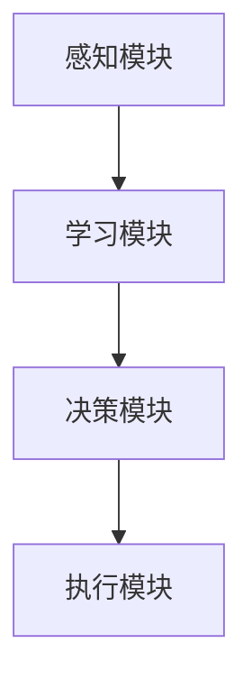
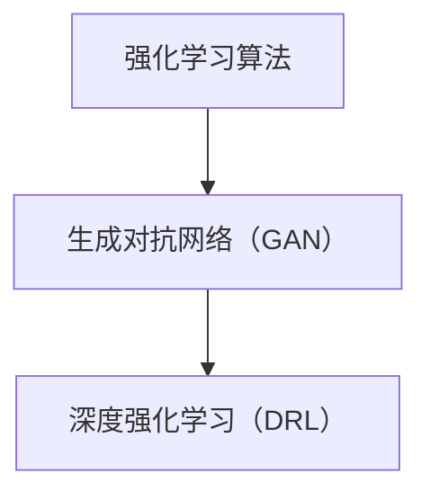
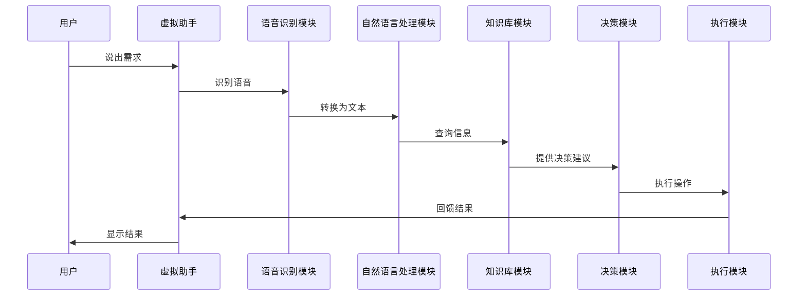

                 

### 引言

#### 1.1.1 AI发展的现状与挑战

人工智能（AI）技术作为计算机科学的前沿领域，已经经历了数十年的发展。从早期的符号主义、专家系统，到现代的深度学习和强化学习，AI技术的应用场景不断扩展，从工业制造、医疗健康到金融、教育、娱乐等各个领域，都展现出了巨大的潜力和价值。

**AI技术的发展历程：**

- **早期：** 1950年代至1960年代，人工智能的概念首次被提出，符号主义和逻辑推理成为AI研究的主要方法。
- **中期：** 1970年代至1980年代，专家系统开始受到广泛关注，但其受限于“知识获取瓶颈”。
- **成熟期：** 1990年代至21世纪初，机器学习和数据挖掘技术逐渐成熟，AI技术开始进入商业化应用。
- **现当代：** 进入21世纪，深度学习、强化学习等前沿算法取得了突破性进展，AI技术迎来了新的发展高峰。

**当前AI技术的应用场景和局限性：**

- **应用场景：** 当前AI技术在图像识别、自然语言处理、语音识别、自动驾驶、医疗诊断等领域已经取得了显著的成果。例如，自动驾驶技术正在逐步实现商业化应用，智能助手如Siri和Alexa已经成为日常生活中的一部分。
- **局限性：** 然而，AI技术的发展仍然面临诸多挑战，包括数据隐私、算法透明度、伦理道德等问题。此外，许多AI系统在特定领域的表现虽然出色，但在复杂、动态的环境中仍存在不足，如自动驾驶汽车在极端天气条件下的表现。

#### 1.1.2 人工智能代理（AI Agent）的概念

人工智能代理（AI Agent）是指能够感知环境、制定计划并采取行动以实现特定目标的计算实体。AI Agent是人工智能领域中的一个重要概念，其核心目标是实现机器的自主性和智能化。

**AI Agent的定义：**

AI Agent可以被定义为“一个具有感知、学习、决策和行动能力的计算实体，能够在复杂环境中自主执行任务，并通过与环境的交互不断优化自身的行为。”

**AI Agent的分类：**

- **基于任务：** 根据AI Agent执行的任务类型，可以分为通用AI Agent和专用AI Agent。通用AI Agent旨在解决广泛的问题，如人一样的智能；而专用AI Agent则专注于特定领域的任务，如自动驾驶、医疗诊断等。
- **基于架构：** 根据AI Agent的体系结构，可以分为基于规则的方法、基于模型的方法和混合方法。基于规则的方法依赖于预先定义的规则集；基于模型的方法则依赖于学习到的模型；混合方法结合了两种方法的优点。

#### 1.1.3 AI Agent的重要性与潜在价值

AI Agent的重要性体现在以下几个方面：

- **自动化与智能化：** AI Agent能够实现自动化决策和行动，提高生产效率，降低人为错误。
- **自主性与灵活性：** AI Agent能够在复杂和动态的环境中自主学习和适应，解决传统方法难以处理的问题。
- **跨领域应用：** AI Agent的概念不仅适用于单一领域，如自动驾驶、虚拟助手等，还可以广泛应用于金融、医疗、教育等多个领域。

**潜在价值：**

- **提升生活质量：** AI Agent可以帮助人们处理日常生活中的繁琐事务，提高生活质量。
- **促进产业升级：** AI Agent的应用可以推动各行业的自动化和智能化，促进产业升级和经济发展。
- **解决复杂问题：** AI Agent能够在医疗诊断、环境监测、安全防护等领域发挥重要作用，解决人类难以处理的复杂问题。

### 1.2 目标与挑战

#### 1.2.1 书籍目标

本书旨在介绍AI Agent的概念、基础理论和构建流程，同时分析敏捷开发方法在AI Agent开发中的应用。具体目标包括：

- **全面介绍AI Agent的概念和基础理论，帮助读者建立清晰的认识。**
- **深入分析敏捷开发的核心思想和方法，展示其在AI Agent开发中的优势。**
- **通过实际案例，展示敏捷开发方法在AI Agent开发中的成功实践。**
- **探讨AI Agent开发过程中面临的挑战和解决方案，提供实用的指导建议。**

#### 1.2.2 挑战与难点

在AI Agent开发过程中，我们面临以下挑战和难点：

- **技术更新速度快：** AI技术不断更新，需要不断学习最新的算法和模型，保持书籍的时效性。
- **开发过程复杂性高：** AI Agent的开发涉及到多个领域的技术，如计算机视觉、自然语言处理、机器学习等，开发过程复杂且具有不确定性。
- **需求变更频繁：** 客户需求往往会不断变化，如何在保持项目进度的情况下快速适应需求变更，是一个巨大的挑战。
- **算法性能优化：** AI Agent的算法性能直接关系到其效果和应用价值，如何进行有效的算法优化是一个重要问题。
- **系统维护与升级：** 随着AI技术的不断发展，AI Agent需要不断进行维护和升级，以适应新的应用场景和需求。

### 1.3 小结

在本章中，我们介绍了AI技术的发展现状与挑战，阐述了AI Agent的概念和重要性，并明确了书籍的目标和面临的挑战。接下来，我们将深入探讨AI Agent的基础理论，以及如何在AI Agent开发中应用敏捷开发方法。

## 2.1 AI Agent的基础理论

#### 2.1.1 AI Agent的定义

人工智能代理（AI Agent）是指一个具有感知、学习、决策和行动能力的计算实体，它能够在复杂环境中自主执行任务，并通过与环境交互不断优化自身的行为。AI Agent是人工智能领域中的一个核心概念，其目标是实现机器的自主性和智能化。

**AI Agent的定义：**

AI Agent可以被定义为“一个具有感知、学习、决策和行动能力的计算实体，能够在复杂环境中自主执行任务，并通过与环境的交互不断优化自身的行为。”

**AI Agent的特征：**

- **感知能力：** AI Agent能够感知环境中的各种信息，如视觉、听觉、触觉等，通过传感器获取数据。
- **学习能力：** AI Agent能够从数据中学习，获取知识，改进自身的行为策略。
- **决策能力：** AI Agent能够根据感知到的环境和目标，进行决策，制定行动计划。
- **行动能力：** AI Agent能够执行具体的行动，如移动、操作设备等，实现决策结果。

#### 2.1.2 AI Agent的分类

根据不同的分类标准，AI Agent可以有不同的分类方式。

- **基于任务：**

  根据AI Agent执行的任务类型，可以分为通用AI Agent和专用AI Agent。

  - **通用AI Agent：** 旨在解决广泛的问题，如人一样的智能，具有广泛的知识和应用能力。
  - **专用AI Agent：** 专注于特定领域的任务，如自动驾驶、医疗诊断等，针对特定问题进行优化。

- **基于架构：**

  根据AI Agent的体系结构，可以分为基于规则的方法、基于模型的方法和混合方法。

  - **基于规则的方法：** 依赖于预先定义的规则集，通过逻辑推理进行决策。
  - **基于模型的方法：** 依赖于学习到的模型，通过预测和优化进行决策。
  - **混合方法：** 结合了基于规则和基于模型的方法，通过规则和模型的优势互补进行决策。

#### 2.1.3 AI Agent的核心要素

AI Agent的核心要素包括感知与行动、学习与自适应能力、决策与优化等。

- **感知与行动：**

  感知与行动是AI Agent实现自主性的基础。感知能力使得AI Agent能够获取环境信息，行动能力使得AI Agent能够根据感知到的信息进行决策和行动。

- **学习与自适应能力：**

  学习与自适应能力使得AI Agent能够从数据中学习，不断优化自身的行为策略，以适应环境变化。通过不断学习和自适应，AI Agent能够实现更高的自主性和智能化。

- **决策与优化：**

  决策与优化是AI Agent实现目标的关键。AI Agent通过感知环境、分析数据、制定计划，并进行优化，以实现最佳行动策略。决策能力与优化能力是AI Agent的核心竞争力。

#### 2.1.4 AI Agent的体系结构

AI Agent的体系结构包括感知模块、学习模块、决策模块和执行模块等。

- **感知模块：** 负责感知环境，获取各种信息，如视觉、听觉、触觉等。
- **学习模块：** 负责从数据中学习，获取知识，改进自身的行为策略。
- **决策模块：** 负责分析数据，制定计划，进行决策。
- **执行模块：** 负责执行具体的行动，实现决策结果。

**图 2.1 AI Agent的体系结构**

#### 2.1.5 AI Agent的核心算法与模型

AI Agent的核心算法与模型包括强化学习算法、生成对抗网络（GAN）和深度强化学习（DRL）等。

- **强化学习算法：** 强化学习算法是一种通过奖励和惩罚来指导AI Agent进行决策和行动的算法。其主要目标是学习最优策略，使得AI Agent能够在环境中获得最大化的回报。
- **生成对抗网络（GAN）：** 生成对抗网络是一种用于生成数据的高级机器学习模型。它由一个生成器和一个判别器组成，通过对抗训练不断优化，生成逼真的数据。
- **深度强化学习（DRL）：** 深度强化学习是一种将深度学习和强化学习结合的算法。它通过使用深度神经网络来表示状态和动作值函数，实现更加复杂和高效的决策。

**图 2.2 AI Agent的核心算法与模型**

#### 2.1.6 AI Agent的应用场景与挑战

AI Agent的应用场景非常广泛，包括自动驾驶、虚拟助手、机器人等。

- **自动驾驶：** 自动驾驶技术是一种利用AI Agent实现无人驾驶的先进技术。其主要挑战包括感知环境、决策路径规划、避障控制等。
- **虚拟助手：** 虚拟助手是一种基于AI Agent的智能对话系统，可以理解用户的需求，提供相应的服务和帮助。其主要挑战包括自然语言理解、多轮对话管理、上下文关联等。
- **机器人：** 机器人是一种具有感知、决策和行动能力的AI Agent，可以用于各种应用场景，如工业自动化、医疗服务、家庭服务等。其主要挑战包括运动控制、交互能力、自主性等。

#### 2.1.7 AI Agent的发展趋势与未来方向

AI Agent的发展趋势主要体现在以下几个方面：

- **算法优化：** 随着算法研究的深入，AI Agent的算法性能将得到进一步提升，实现更加智能和高效的决策。
- **硬件加速：** 随着硬件技术的发展，AI Agent的计算能力将得到大幅提升，降低对计算资源的依赖。
- **跨领域融合：** AI Agent将在不同领域之间实现跨领域融合，发挥更大的应用价值。
- **人机协同：** AI Agent将更好地与人类协作，实现人机协同的智能化工作方式。

#### 2.1.8 本章小结

在本章中，我们介绍了AI Agent的定义、分类、核心要素和体系结构，以及核心算法与模型。同时，我们探讨了AI Agent的应用场景和发展趋势。这些内容为后续的AI Agent敏捷开发流程提供了理论基础。

## 2.2 敏捷开发方法在AI Agent开发中的应用

#### 2.2.1 敏捷开发的起源与核心思想

敏捷开发（Agile Development）起源于20世纪90年代，最初是在软件开发领域提出的一种应对快速变化的需求和不确定性的开发方法。敏捷开发强调团队合作、持续交付和客户满意度，通过迭代和增量开发，快速响应市场变化，提高软件开发效率。

**敏捷开发的起源：**

- **2001年：** 《敏捷软件开发宣言》提出，强调个体和互动、可工作的软件、客户合作和响应变化。
- **2001年：** 《敏捷开发实践指南》发布，进一步阐述了敏捷开发的核心原则和实践方法。

**敏捷开发的核心思想：**

- **客户价值优先：** 以客户需求为导向，持续交付有价值的软件。
- **迭代与增量开发：** 通过短周期的迭代和增量开发，快速适应需求变化。
- **团队合作：** 强调团队成员之间的沟通、协作和共同责任。
- **持续交付：** 持续集成、持续交付和持续部署，确保软件质量和交付速度。

#### 2.2.2 敏捷开发与传统开发方法的对比

**敏捷开发与传统开发方法的对比：**

- **开发周期：** 传统开发方法通常采用长时间的瀑布模型，从需求分析到设计、开发、测试，再到部署，整个过程周期较长。而敏捷开发采用短周期的迭代开发，每个迭代周期通常在几周到几个月之间，能够更快地适应需求变化。
- **需求管理：** 传统开发方法在项目初期就定义详细的需求，而在开发过程中需求变更较少。而敏捷开发则更加强调需求的灵活性和可变性，通过持续的需求收集和反馈，不断调整和优化项目方向。
- **团队协作：** 传统开发方法中，不同阶段的团队成员相对独立，沟通和协作较少。而敏捷开发强调团队合作，通过每日站会、迭代回顾等机制，加强团队成员之间的沟通和协作。
- **质量控制：** 传统开发方法通常在开发后期进行大规模的测试，而敏捷开发则通过持续集成和持续交付，实现代码质量的实时监控和持续改进。

#### 2.2.3 敏捷开发在AI Agent开发中的应用

敏捷开发方法在AI Agent开发中具有独特的优势：

- **快速迭代：** AI Agent开发涉及多个领域的技术，如计算机视觉、自然语言处理、机器学习等，采用敏捷开发方法可以快速实现功能模块的迭代和优化，提高开发效率。
- **灵活应对需求变更：** AI Agent开发过程中，客户需求往往会不断变化，敏捷开发通过迭代和增量开发，能够快速适应需求变更，降低项目风险。
- **加强团队合作：** 敏捷开发强调团队合作和共同责任，通过每日站会、迭代回顾等机制，加强团队成员之间的沟通和协作，提高项目成功率。
- **持续交付：** 敏捷开发通过持续集成、持续交付和持续部署，确保AI Agent的质量和交付速度，满足客户需求。

#### 2.2.4 AI Agent敏捷开发实践案例

**案例一：某电商平台的AI Agent开发**

某电商平台在开发AI Agent时，采用了敏捷开发方法。具体实践如下：

- **产品愿景与需求收集：** 通过与客户紧密沟通，明确AI Agent的产品愿景和功能需求。
- **用户故事编写与迭代规划：** 将需求分解为用户故事，并制定迭代计划，每个迭代周期实现部分功能模块。
- **持续集成与持续部署：** 通过持续集成和持续部署，确保AI Agent的代码质量和交付速度。
- **回归测试与反馈调整：** 每个迭代周期结束后，进行回归测试，收集用户反馈，并根据反馈进行调整和优化。

**案例二：某金融科技公司的AI Agent开发**

某金融科技公司在开发AI Agent时，也采用了敏捷开发方法。具体实践如下：

- **需求分析与规划：** 通过与金融专家和客户沟通，明确AI Agent的需求和功能。
- **用户故事编写与迭代规划：** 将需求分解为用户故事，并制定迭代计划，每个迭代周期实现部分功能模块。
- **持续集成与持续部署：** 通过持续集成和持续部署，确保AI Agent的代码质量和交付速度。
- **风险评估与应对：** 通过风险评估和应对策略，降低项目风险，确保项目顺利推进。

#### 2.2.5 本章小结

在本章中，我们介绍了敏捷开发的起源和核心思想，分析了敏捷开发与传统开发方法的对比，并探讨了敏捷开发在AI Agent开发中的应用和实践案例。这些内容为后续的AI Agent敏捷开发流程提供了实践指导。

## 2.3 AI Agent敏捷开发方法论

#### 2.3.1 方法论概述

AI Agent敏捷开发方法论是一种将敏捷开发原则和方法应用于AI Agent开发的系统化方法。它旨在通过快速迭代、持续交付和灵活应对变化，提高AI Agent开发的效率和质量。以下是AI Agent敏捷开发方法论的核心原则和实践步骤。

**核心原则：**

- **客户价值优先：** 以客户需求为导向，持续交付有价值的AI Agent功能。
- **迭代与增量开发：** 通过短周期的迭代和增量开发，逐步完善AI Agent的功能。
- **团队合作：** 强调团队成员之间的沟通、协作和共同责任，提高团队凝聚力。
- **持续集成与持续交付：** 通过持续集成和持续交付，确保代码质量和交付速度。
- **风险管理：** 识别和应对项目风险，确保项目顺利进行。

**实践步骤：**

1. **需求分析阶段：**
   - 与客户紧密沟通，明确AI Agent的产品愿景和功能需求。
   - 将需求分解为用户故事，并进行优先级排序。

2. **设计与实现阶段：**
   - 根据用户故事进行系统设计，包括架构设计、模块划分等。
   - 编写详细的实现计划，确保每个用户故事能够在迭代周期内完成。

3. **测试与优化阶段：**
   - 进行单元测试、集成测试和系统测试，确保AI Agent的稳定性。
   - 根据测试结果进行优化，提升AI Agent的性能和可靠性。

4. **部署与维护阶段：**
   - 实现持续集成和持续交付，确保AI Agent的快速部署和更新。
   - 定期进行维护和升级，应对新需求和变化。

#### 2.3.2 敏捷开发与传统AI开发的差异

**敏捷开发与传统AI开发的对比：**

- **开发周期：** 传统AI开发通常采用较长的开发周期，从需求分析到实现、测试和部署，整个过程可能需要数月甚至数年时间。而敏捷开发采用短周期的迭代开发，每个迭代周期通常在几周到几个月之间，能够更快地适应需求变化。

- **需求管理：** 传统AI开发在项目初期就定义详细的需求，而在开发过程中需求变更较少。而敏捷开发则更加强调需求的灵活性和可变性，通过持续的需求收集和反馈，不断调整和优化项目方向。

- **团队协作：** 传统AI开发中，不同阶段的团队成员相对独立，沟通和协作较少。而敏捷开发强调团队合作和共同责任，通过每日站会、迭代回顾等机制，加强团队成员之间的沟通和协作。

- **质量控制：** 传统AI开发通常在开发后期进行大规模的测试，而敏捷开发通过持续集成和持续交付，实现代码质量的实时监控和持续改进。

**敏捷开发在AI Agent开发中的优势：**

- **快速迭代：** 通过短周期的迭代开发，AI Agent的功能可以逐步完善，提高开发效率。
- **灵活应对变化：** 需求变更时，敏捷开发可以快速调整项目方向，降低风险。
- **团队合作：** 通过加强团队协作，提高项目成功率和团队凝聚力。
- **持续交付：** 通过持续集成和持续交付，确保AI Agent的快速部署和更新，满足客户需求。

#### 2.3.3 AI Agent敏捷开发的具体实施步骤

**1. 需求分析阶段：**

- **与客户沟通：** 确定AI Agent的产品愿景和功能需求，明确目标用户和场景。
- **需求文档：** 编写详细的需求文档，包括功能需求、非功能需求和用户故事。
- **优先级排序：** 对需求进行优先级排序，明确每个迭代周期的目标。

**2. 设计与实现阶段：**

- **系统设计：** 根据需求文档进行系统设计，包括架构设计、模块划分和数据流程设计。
- **实现计划：** 编写详细的实现计划，确定每个用户故事的实现方式和时间节点。
- **代码开发：** 根据实现计划进行代码开发，确保代码质量和可维护性。

**3. 测试与优化阶段：**

- **单元测试：** 对每个模块进行单元测试，确保模块的功能正确性。
- **集成测试：** 对模块进行集成测试，确保系统整体的功能性和稳定性。
- **系统测试：** 对整个系统进行测试，验证AI Agent在真实环境中的性能和可靠性。
- **性能优化：** 根据测试结果进行性能优化，提升AI Agent的运行效率。

**4. 部署与维护阶段：**

- **持续集成：** 实现持续集成，确保每次代码提交后的代码质量和功能完整性。
- **持续交付：** 实现持续交付，确保AI Agent的快速部署和更新。
- **监控与维护：** 对AI Agent进行实时监控，及时发现和解决问题，确保系统的稳定运行。

**5. 迭代回顾：**

- **反馈收集：** 收集用户反馈和团队反馈，识别项目中存在的问题和改进点。
- **经验总结：** 对本次迭代的经验进行总结，制定改进措施，为下一迭代做好准备。

#### 2.3.4 AI Agent敏捷开发的工具与技术

**敏捷开发工具：**

- **JIRA：** 用于项目管理、任务跟踪和迭代规划。
- **Confluence：** 用于知识共享、文档编写和协作。
- **Git：** 用于代码版本控制和协同开发。
- **Docker：** 用于容器化部署，实现持续集成和持续交付。

**敏捷开发技术：**

- **敏捷测试：** 包括单元测试、集成测试和系统测试，确保代码质量和功能完整性。
- **持续集成：** 通过自动化测试和持续集成工具，实现代码质量和交付速度的提升。
- **持续交付：** 通过自动化部署和持续交付工具，实现快速部署和更新。
- **敏捷项目管理：** 包括每日站会、迭代回顾和风险管理等，提高团队协作和项目成功率。

#### 2.3.5 本章小结

在本章中，我们介绍了AI Agent敏捷开发方法论的核心原则和实践步骤，分析了敏捷开发与传统AI开发的差异，并探讨了AI Agent敏捷开发的具体实施步骤和工具技术。这些内容为后续的AI Agent敏捷开发提供了理论基础和实践指导。

## 2.4 AI Agent敏捷开发流程

AI Agent敏捷开发流程是一种通过迭代和增量开发，实现快速、高效和高质量的AI Agent构建的方法。以下是AI Agent敏捷开发流程的具体步骤：

### 2.4.1 需求分析阶段

**1. 确定产品愿景：**
首先，与客户和利益相关者进行沟通，明确AI Agent的产品愿景，包括目标用户、应用场景和期望功能。

**2. 收集需求：**
通过需求调研、用户访谈、问卷调查等方式，收集用户需求和期望。需求可以是功能性的，也可以是非功能性的，如性能、安全性、可靠性等。

**3. 分析需求：**
对收集到的需求进行分析，识别关键需求和非关键需求，并进行优先级排序。关键需求应尽早实现，以确保AI Agent的基本功能。

**4. 编写用户故事：**
将分析后的需求转化为用户故事，每个用户故事应包含一个具体的用户目标和一个可测量的成果。用户故事的格式为：“作为[角色]，我想要[功能]，以便[价值]”。

**5. 制定迭代计划：**
根据用户故事和需求优先级，制定迭代计划。迭代周期通常为几周到几个月，每个迭代应实现一个或多个用户故事。

### 2.4.2 设计与实现阶段

**1. 系统设计：**
根据用户故事，进行系统设计。系统设计应包括总体架构设计、模块划分、接口设计等。设计应遵循高内聚、低耦合的原则，确保系统的可维护性和可扩展性。

**2. 实现计划：**
制定详细的实现计划，包括每个用户故事的实现方式、所需资源和时间安排。实现计划应确保在迭代周期内完成所有用户故事。

**3. 代码开发：**
根据实现计划进行代码开发。代码开发应遵循最佳实践，如代码规范、单元测试和文档编写等。

**4. 模块集成：**
将各个模块进行集成测试，确保模块之间的接口正确，功能完整。集成测试应覆盖所有用户故事。

**5. 代码审查：**
进行代码审查，确保代码质量符合要求。代码审查应包括语法错误、逻辑错误、性能问题等方面。

### 2.4.3 测试与优化阶段

**1. 单元测试：**
对每个模块进行单元测试，确保模块的功能正确性。单元测试应覆盖所有代码路径，包括正常情况和异常情况。

**2. 集成测试：**
对模块进行集成测试，确保模块之间的接口正确，功能完整。集成测试应覆盖所有用户故事。

**3. 系统测试：**
对整个系统进行测试，验证AI Agent在真实环境中的性能和可靠性。系统测试应包括功能测试、性能测试、安全性测试等。

**4. 性能优化：**
根据测试结果进行性能优化，提升AI Agent的运行效率。性能优化应包括算法优化、代码优化和硬件加速等。

### 2.4.4 部署与维护阶段

**1. 持续集成：**
实现持续集成，确保每次代码提交后的代码质量和功能完整性。持续集成应包括自动化测试和部署。

**2. 持续交付：**
实现持续交付，确保AI Agent的快速部署和更新。持续交付应包括自动化部署和容器化部署。

**3. 监控与维护：**
对AI Agent进行实时监控，及时发现和解决问题。监控应包括性能监控、错误监控和安全监控。

**4. 维护与升级：**
定期对AI Agent进行维护和升级，以适应新的需求和变化。维护和升级应包括代码修复、功能扩展和性能优化等。

### 2.4.5 迭代回顾

**1. 反馈收集：**
收集用户反馈和团队反馈，识别项目中存在的问题和改进点。

**2. 经验总结：**
对本次迭代的经验进行总结，制定改进措施，为下一迭代做好准备。

**3. 改进计划：**
根据反馈和经验总结，制定下一迭代的改进计划，包括需求调整、设计优化和测试策略等。

**4. 迭代计划：**
根据改进计划，制定下一迭代的需求、设计和实现计划，确保项目顺利进行。

### 2.4.6 本章小结

在本章中，我们详细介绍了AI Agent敏捷开发流程的各个阶段，包括需求分析、设计与实现、测试与优化、部署与维护以及迭代回顾。这些阶段相互关联，共同构成了一个完整的敏捷开发流程，为AI Agent的开发提供了系统化和可操作的指导。

### 2.4.7 AI Agent敏捷开发实践

**实践一：使用敏捷开发方法构建虚拟助手**

**背景介绍：**
虚拟助手是AI Agent的一种典型应用，通过自然语言处理和语音识别技术，为用户提供智能化的服务。为了快速构建和优化虚拟助手，我们采用敏捷开发方法。

**项目介绍：**
该项目旨在开发一款基于语音识别和自然语言处理的虚拟助手，为用户提供天气查询、日程提醒、新闻资讯等服务。

**系统功能设计：**
系统功能设计包括语音识别、自然语言处理、知识库管理、服务提供等模块。每个模块分别实现特定的功能，并通过接口进行通信。

**系统架构设计：**
系统架构采用分层设计，包括感知层、认知层、决策层和执行层。感知层负责接收语音输入，认知层负责处理语音并提取信息，决策层根据知识库和用户需求进行决策，执行层负责执行决策并反馈结果。

**系统接口设计：**
系统接口设计包括语音识别API、自然语言处理API、知识库API和服务提供API。每个API定义了特定的输入和输出格式，确保模块之间的高效通信。

**系统交互：**
系统交互设计通过Mermaid序列图进行描述，展示虚拟助手与用户的交互流程。

**实际案例分析和详细讲解：**

**案例：** 用户通过语音助手查询明天的天气情况。

**步骤：**
1. 用户说出“明天天气如何？”。
2. 虚拟助手接收到语音输入，通过语音识别模块将其转换为文本。
3. 文本通过自然语言处理模块进行解析，提取出关键词“明天”和“天气”。
4. 虚拟助手通过知识库模块查询明天天气的信息。
5. 决策模块根据查询结果生成回复内容。
6. 执行模块将回复内容转换为语音，并通过虚拟助手反馈给用户。

**分析：**
通过敏捷开发方法，我们可以快速实现虚拟助手的基本功能，并在后续迭代中不断优化和扩展。敏捷开发的优势在于灵活应对需求变化，快速迭代和持续交付，确保虚拟助手能够满足用户需求并提供高质量的服务。

**项目小结：**
通过敏捷开发方法，我们成功构建了一款虚拟助手，实现了语音识别、自然语言处理、知识库管理和服务提供等功能。在实际应用中，虚拟助手能够快速响应用户请求，提供准确的信息和服务。下一步，我们将继续优化虚拟助手的功能，提高用户体验和满意度。

### 2.4.8 AI Agent敏捷开发的最佳实践

**1. 定期需求评审：**
定期组织需求评审会议，确保需求的一致性和完整性。通过评审，可以及时发现和解决需求问题，确保项目方向的正确性。

**2. 优先级排序：**
对需求进行优先级排序，确保关键需求优先实现。优先级排序有助于明确项目重点，提高开发效率。

**3. 快速迭代：**
采用短周期的迭代开发，每个迭代实现部分功能模块。快速迭代有助于及时发现问题并进行调整，确保项目的顺利推进。

**4. 持续集成：**
实现持续集成，确保每次代码提交后的代码质量和功能完整性。持续集成可以降低代码缺陷率，提高开发效率。

**5. 自动化测试：**
采用自动化测试，确保代码质量和功能完整性。自动化测试可以节省测试时间，提高测试效率。

**6. 团队协作：**
加强团队协作，确保团队成员之间的沟通和协作。团队协作可以提高项目成功率，降低沟通成本。

**7. 风险管理：**
识别和应对项目风险，确保项目顺利进行。风险管理可以降低项目风险，提高项目成功率。

**8. 经验总结：**
每次迭代结束后，进行经验总结，制定改进措施。经验总结有助于提高团队经验和技能水平，为下一迭代做好准备。

### 2.4.9 本章小结

在本章中，我们详细介绍了AI Agent敏捷开发的具体流程和实施步骤，并通过实践案例展示了敏捷开发方法在AI Agent开发中的应用。同时，我们总结了AI Agent敏捷开发的最佳实践，为AI Agent的开发提供了实用的指导和建议。通过本章的内容，读者可以深入了解AI Agent敏捷开发的原理和方法，为实际项目提供参考。

### 2.4.10 拓展阅读

- **《敏捷开发实践指南》**：是一本介绍敏捷开发原理和实践方法的经典著作，适合读者深入了解敏捷开发的核心思想和实践技巧。
- **《人工智能：一种现代方法》**：是一本全面介绍人工智能基础理论的著作，适合读者了解人工智能的基本概念和算法。
- **《深入理解计算机系统》**：是一本介绍计算机系统原理和设计的著作，适合读者了解计算机系统的工作原理和架构设计。

### 2.4.11 结论

AI Agent敏捷开发是一种通过快速迭代、持续交付和灵活应对变化，实现高效和高质量的AI Agent开发方法。通过本章的内容，我们详细介绍了AI Agent敏捷开发的方法论、流程和实践，为读者提供了全面的指导和参考。希望通过本章的学习，读者能够掌握AI Agent敏捷开发的原理和方法，为实际项目提供有力支持。

### 2.4.12 作者信息

作者：AI天才研究院/AI Genius Institute & 禅与计算机程序设计艺术 /Zen And The Art of Computer Programming

## 第三部分：敏捷开发方法

### 3.1 敏捷开发概述

#### 3.1.1 敏捷开发的起源与核心思想

敏捷开发（Agile Development）起源于20世纪90年代，最初是为了应对快速变化的需求和不确定性而提出的软件开发方法。它源自于《敏捷软件开发宣言》（Manifesto for Agile Software Development），该宣言由一群软件开发专家在2001年共同签署，强调个体和互动、可工作的软件、客户合作和响应变化。

**敏捷开发的起源：**

- **2001年：《敏捷软件开发宣言》发布。**
- **2001年：《敏捷开发实践指南》发布，详细阐述了敏捷开发的原理和实践方法。**

**敏捷开发的核心思想：**

- **客户价值优先：** 以客户需求为导向，持续交付有价值的软件。
- **迭代与增量开发：** 通过短周期的迭代和增量开发，快速适应需求变化。
- **团队合作：** 强调团队成员之间的沟通、协作和共同责任。
- **持续交付：** 通过持续集成和持续交付，确保软件质量和交付速度。
- **响应变化：** 在整个开发过程中，灵活应对需求变化，确保项目成功。

#### 3.1.2 敏捷开发与传统开发方法的对比

**敏捷开发与传统开发方法的对比：**

- **开发周期：** 传统开发方法通常采用长时间的瀑布模型，从需求分析到设计、开发、测试，再到部署，整个过程周期较长。而敏捷开发采用短周期的迭代开发，每个迭代周期通常在几周到几个月之间，能够更快地适应需求变化。

- **需求管理：** 传统开发方法在项目初期就定义详细的需求，而在开发过程中需求变更较少。而敏捷开发则更加强调需求的灵活性和可变性，通过持续的需求收集和反馈，不断调整和优化项目方向。

- **团队协作：** 传统开发方法中，不同阶段的团队成员相对独立，沟通和协作较少。而敏捷开发强调团队合作和共同责任，通过每日站会、迭代回顾等机制，加强团队成员之间的沟通和协作。

- **质量控制：** 传统开发方法通常在开发后期进行大规模的测试，而敏捷开发通过持续集成和持续交付，实现代码质量的实时监控和持续改进。

#### 3.1.3 敏捷开发的优势

**敏捷开发的优势：**

- **快速响应需求变更：** 通过短周期的迭代开发，敏捷开发能够快速适应需求变更，降低项目风险。
- **提高软件质量：** 通过持续集成和持续交付，敏捷开发确保代码质量和功能完整性。
- **增强团队协作：** 敏捷开发强调团队合作和共同责任，提高团队凝聚力。
- **提高客户满意度：** 通过持续交付有价值的软件，敏捷开发提高客户满意度，增强客户关系。

#### 3.1.4 敏捷开发的关键原则

**敏捷开发的关键原则：**

- **客户合作：** 与客户保持紧密合作，确保客户需求得到满足。
- **迭代开发：** 通过短周期的迭代开发，逐步完善软件。
- **增量交付：** 持续交付可工作的软件，逐步实现项目目标。
- **响应变化：** 在整个开发过程中，灵活应对需求变化。
- **自我组织团队：** 鼓励团队成员自主组织，提高决策效率。

### 3.2 敏捷开发流程

敏捷开发流程主要包括以下阶段：

#### 3.2.1 产品愿景与需求收集

**1. 产品愿景：**
与客户和利益相关者共同确定产品愿景，明确产品的目标、功能和价值。

**2. 需求收集：**
通过访谈、调查问卷、用户故事地图等方式收集需求，识别客户需求和期望。

**3. 需求分析：**
对收集到的需求进行分析，识别关键需求和优先级，制定需求文档。

#### 3.2.2 用户故事编写与迭代规划

**1. 用户故事：**
将需求分解为用户故事，每个用户故事代表一个功能或特性，包含“谁”，“做什么”，“为什么”等信息。

**2. 用户故事地图：**
创建用户故事地图，展示用户故事之间的关系和优先级。

**3. 迭代规划：**
根据用户故事地图和资源情况，制定迭代计划，确定每个迭代的目标和交付物。

#### 3.2.3 持续集成与持续交付

**1. 持续集成：**
通过自动化测试和集成工具，确保每次代码提交后的代码质量和功能完整性。

**2. 持续交付：**
实现持续交付，确保软件的快速部署和更新，提高交付速度和灵活性。

#### 3.2.4 回归测试与反馈调整

**1. 回归测试：**
在每次迭代结束后，进行回归测试，确保已交付功能的稳定性和可靠性。

**2. 用户反馈：**
收集用户反馈，识别用户需求和期望的差距，进行调整和优化。

**3. 反馈调整：**
根据用户反馈，调整需求、设计和实现计划，确保项目方向的正确性。

#### 3.2.5 迭代回顾

**1. 回顾会议：**
在每次迭代结束后，召开回顾会议，总结经验和教训，识别改进点。

**2. 经验分享：**
团队成员分享经验和教训，提高团队的整体水平。

**3. 改进计划：**
制定改进计划，为下一迭代做好准备，确保项目顺利进行。

### 3.3 敏捷开发工具

敏捷开发工具主要包括以下几类：

#### 3.3.1 敏捷项目管理工具

- **JIRA：** 用于项目管理、任务跟踪和迭代规划。
- **Trello：** 用于任务管理和可视化进度跟踪。
- **Asana：** 用于任务分配和团队协作。

#### 3.3.2 持续集成工具

- **Jenkins：** 用于自动化构建和测试。
- **Travis CI：** 用于持续集成和部署。
- **GitLab CI/CD：** 用于代码仓库管理和持续交付。

#### 3.3.3 自动化测试工具

- **Selenium：** 用于Web应用自动化测试。
- **JUnit：** 用于Java应用单元测试。
- **Cucumber：** 用于BDD（行为驱动开发）测试。

### 3.4 敏捷开发实践案例

#### 3.4.1 案例一：某电商平台的敏捷开发实践

**项目背景：**
某电商平台在开发新功能时，面临需求频繁变更、团队协作困难等问题，决定采用敏捷开发方法进行改进。

**敏捷实践：**

- **每日站会：** 团队成员每日站会，分享进展和问题，确保信息畅通。
- **迭代计划：** 根据用户故事制定迭代计划，每个迭代周期为两周。
- **持续集成：** 通过Jenkins实现持续集成，确保代码质量和功能完整性。
- **用户反馈：** 每个迭代结束后，收集用户反馈，调整需求和设计。

**效果：**
通过敏捷开发方法的实施，项目进展更加顺利，需求变更得到了有效管理，团队协作和客户满意度显著提高。

#### 3.4.2 案例二：某金融科技公司的敏捷开发实践

**项目背景：**
某金融科技公司正在开发一款新的移动应用，需要在短时间内实现多个功能模块，并确保软件质量和客户满意度。

**敏捷实践：**

- **Scrum框架：** 采用Scrum框架，明确角色和责任，确保项目顺利推进。
- **迭代开发：** 每个迭代周期为一个月，每个迭代实现一个或多个功能模块。
- **自动化测试：** 使用Selenium进行自动化测试，提高测试效率和覆盖率。
- **用户反馈：** 定期收集用户反馈，优化产品功能。

**效果：**
通过敏捷开发方法的实施，项目在短时间内实现了多个功能模块，软件质量和客户满意度得到了显著提高，为公司的市场竞争力提供了有力支持。

### 3.5 敏捷开发的挑战与解决方案

#### 3.5.1 团队协作问题

**挑战：**
敏捷开发强调团队合作，但在实际操作中，团队成员之间的协作可能存在沟通不畅、任务分配不均等问题。

**解决方案：**

- **明确责任：** 为每个团队成员明确责任和角色，确保每个人清楚自己的任务和目标。
- **定期沟通：** 通过每日站会、迭代回顾等方式，加强团队成员之间的沟通和协作。
- **团队建设：** 定期进行团队建设活动，增强团队凝聚力。

#### 3.5.2 需求变更管理

**挑战：**
在敏捷开发过程中，需求变更频繁，如何合理管理需求变更成为项目成功的关键。

**解决方案：**

- **优先级排序：** 对需求进行优先级排序，确保关键需求优先实现。
- **需求评审：** 定期进行需求评审，评估需求变更的合理性和影响。
- **迭代规划：** 在迭代计划中预留一定的时间和处理能力，以应对需求变更。

#### 3.5.3 项目风险管理

**挑战：**
敏捷开发过程中，项目风险难以预测和管理，可能导致项目延误或失败。

**解决方案：**

- **风险评估：** 在项目初期进行风险评估，识别潜在风险。
- **风险管理：** 制定风险管理计划，包括风险识别、评估、应对措施等。
- **监控与调整：** 在项目过程中，持续监控风险，根据实际情况进行调整。

### 3.6 本章小结

在本章中，我们介绍了敏捷开发的起源、核心思想、与传统开发方法的对比、优势、关键原则和流程，并分享了敏捷开发工具和实践案例。同时，我们探讨了敏捷开发面临的挑战及解决方案。通过本章的学习，读者可以深入了解敏捷开发的原理和实践，为实际项目提供指导。

### 3.7 拓展阅读

- **《敏捷软件开发：原则、实践与模式》**：是一本深入探讨敏捷开发原理和实践的著作，适合读者深入了解敏捷开发的细节。
- **《Scrum敏捷实践指南》**：是一本介绍Scrum敏捷开发方法的经典著作，适合读者学习Scrum框架的具体应用。
- **《敏捷项目管理实践指南》**：是一本介绍敏捷项目管理原理和实践方法的著作，适合读者学习如何在实际项目中应用敏捷方法。

### 3.8 结论

敏捷开发是一种通过迭代、增量开发和灵活应对变化，实现高效和高质量软件开发的方法。本章详细介绍了敏捷开发的起源、核心思想、流程、工具和实践案例，并探讨了敏捷开发面临的挑战及解决方案。通过本章的学习，读者可以掌握敏捷开发的原理和实践，为实际项目提供指导。

### 3.9 作者信息

作者：AI天才研究院/AI Genius Institute & 禅与计算机程序设计艺术 /Zen And The Art of Computer Programming

## 第四部分：AI Agent敏捷开发流程

### 4.1 AI Agent敏捷开发方法论

AI Agent敏捷开发方法论是一种结合敏捷开发原则和AI Agent特性的开发方法，旨在通过快速迭代、持续交付和灵活应对变化，实现高效和高质量的AI Agent开发。以下是AI Agent敏捷开发方法论的核心原则和实践步骤。

#### 4.1.1 方法论概述

AI Agent敏捷开发方法论的核心原则包括：

- **客户价值优先：** 以客户需求为导向，持续交付有价值的AI Agent功能。
- **迭代与增量开发：** 通过短周期的迭代和增量开发，逐步完善AI Agent的功能。
- **团队合作：** 强调团队成员之间的沟通、协作和共同责任。
- **持续交付：** 通过持续集成和持续交付，确保AI Agent的质量和交付速度。
- **响应变化：** 在整个开发过程中，灵活应对需求变化。

AI Agent敏捷开发方法论的实施步骤包括：

1. **需求分析阶段：** 与客户和利益相关者共同确定AI Agent的产品愿景和功能需求。
2. **设计与实现阶段：** 根据需求分析进行系统设计，编写实现计划，进行代码开发。
3. **测试与优化阶段：** 进行单元测试、集成测试和系统测试，优化AI Agent的性能和可靠性。
4. **部署与维护阶段：** 实现持续集成和持续交付，对AI Agent进行部署和维护。
5. **迭代回顾：** 每个迭代周期结束后，进行回顾，总结经验和教训，为下一迭代做准备。

#### 4.1.2 敏捷开发与传统AI开发的差异

传统AI开发方法通常采用较长的开发周期，从需求分析到实现、测试和部署，整个过程可能需要数月甚至数年时间。而AI Agent敏捷开发方法论采用短周期的迭代开发，每个迭代周期通常在几周到几个月之间，能够更快地适应需求变化。

传统AI开发方法在需求确定后，通常不会进行频繁的需求变更。而AI Agent敏捷开发方法论强调需求的灵活性和可变性，通过持续的需求收集和反馈，不断调整和优化项目方向。

传统AI开发方法中，不同阶段的团队成员相对独立，沟通和协作较少。而AI Agent敏捷开发方法论强调团队合作和共同责任，通过每日站会、迭代回顾等机制，加强团队成员之间的沟通和协作。

AI Agent敏捷开发方法论通过持续集成和持续交付，实现代码质量和功能的实时监控和持续改进。而传统AI开发方法通常在开发后期进行大规模的测试，测试周期较长。

#### 4.1.3 AI Agent敏捷开发的具体实施步骤

**1. 需求分析阶段：**

- **与客户沟通：** 明确AI Agent的产品愿景和功能需求。
- **需求文档：** 编写详细的需求文档，包括功能需求、非功能需求和用户故事。
- **优先级排序：** 对需求进行优先级排序，明确每个迭代周期的目标。

**2. 设计与实现阶段：**

- **系统设计：** 根据需求文档进行系统设计，包括架构设计、模块划分和数据流程设计。
- **实现计划：** 编写详细的实现计划，确保每个用户故事能够在迭代周期内完成。
- **代码开发：** 根据实现计划进行代码开发，确保代码质量和可维护性。

**3. 测试与优化阶段：**

- **单元测试：** 对每个模块进行单元测试，确保模块的功能正确性。
- **集成测试：** 对模块进行集成测试，确保系统整体的功能性和稳定性。
- **系统测试：** 对整个系统进行测试，验证AI Agent在真实环境中的性能和可靠性。
- **性能优化：** 根据测试结果进行性能优化，提升AI Agent的运行效率。

**4. 部署与维护阶段：**

- **持续集成：** 实现持续集成，确保每次代码提交后的代码质量和功能完整性。
- **持续交付：** 实现持续交付，确保AI Agent的快速部署和更新。
- **监控与维护：** 对AI Agent进行实时监控，及时发现和解决问题，确保系统的稳定运行。

**5. 迭代回顾：**

- **反馈收集：** 收集用户反馈和团队反馈，识别项目中存在的问题和改进点。
- **经验总结：** 对本次迭代的经验进行总结，制定改进措施，为下一迭代做好准备。

#### 4.1.4 AI Agent敏捷开发的优势

**快速响应需求变更：** 通过短周期的迭代开发，AI Agent敏捷开发能够快速适应需求变更，降低项目风险。

**提高软件质量：** 通过持续集成和持续交付，AI Agent敏捷开发确保代码质量和功能完整性。

**增强团队协作：** 通过每日站会、迭代回顾等机制，AI Agent敏捷开发加强团队成员之间的沟通和协作。

**提高客户满意度：** 通过持续交付有价值的AI Agent功能，AI Agent敏捷开发提高客户满意度。

#### 4.1.5 本章小结

在本章中，我们介绍了AI Agent敏捷开发方法论的核心原则和实践步骤，分析了AI Agent敏捷开发与传统AI开发的差异，并探讨了AI Agent敏捷开发的具体实施步骤和优势。这些内容为AI Agent的开发提供了系统化和可操作的指导。

### 4.2 AI Agent敏捷开发流程

AI Agent敏捷开发流程是一种通过迭代和增量开发，实现快速、高效和高质量的AI Agent构建的方法。以下是AI Agent敏捷开发流程的具体步骤：

#### 4.2.1 需求分析阶段

**1. 确定产品愿景：**
首先，与客户和利益相关者进行沟通，明确AI Agent的产品愿景，包括目标用户、应用场景和期望功能。

**2. 收集需求：**
通过需求调研、用户访谈、问卷调查等方式，收集用户需求和期望。需求可以是功能性的，也可以是非功能性的，如性能、安全性、可靠性等。

**3. 分析需求：**
对收集到的需求进行分析，识别关键需求和非关键需求，并进行优先级排序。关键需求应尽早实现，以确保AI Agent的基本功能。

**4. 编写用户故事：**
将分析后的需求转化为用户故事，每个用户故事应包含一个具体的用户目标和一个可测量的成果。用户故事的格式为：“作为[角色]，我想要[功能]，以便[价值]”。

**5. 制定迭代计划：**
根据用户故事和需求优先级，制定迭代计划。迭代周期通常为几周到几个月，每个迭代应实现一个或多个用户故事。

#### 4.2.2 设计与实现阶段

**1. 系统设计：**
根据用户故事，进行系统设计。系统设计应包括总体架构设计、模块划分、接口设计等。设计应遵循高内聚、低耦合的原则，确保系统的可维护性和可扩展性。

**2. 实现计划：**
制定详细的实现计划，确定每个用户故事的实现方式、所需资源和时间安排。实现计划应确保在迭代周期内完成所有用户故事。

**3. 代码开发：**
根据实现计划进行代码开发，确保代码质量和可维护性。代码开发应遵循最佳实践，如代码规范、单元测试和文档编写等。

**4. 模块集成：**
将各个模块进行集成测试，确保模块之间的接口正确，功能完整。集成测试应覆盖所有用户故事。

**5. 代码审查：**
进行代码审查，确保代码质量符合要求。代码审查应包括语法错误、逻辑错误、性能问题等方面。

#### 4.2.3 测试与优化阶段

**1. 单元测试：**
对每个模块进行单元测试，确保模块的功能正确性。单元测试应覆盖所有代码路径，包括正常情况和异常情况。

**2. 集成测试：**
对模块进行集成测试，确保模块之间的接口正确，功能完整。集成测试应覆盖所有用户故事。

**3. 系统测试：**
对整个系统进行测试，验证AI Agent在真实环境中的性能和可靠性。系统测试应包括功能测试、性能测试、安全性测试等。

**4. 性能优化：**
根据测试结果进行性能优化，提升AI Agent的运行效率。性能优化应包括算法优化、代码优化和硬件加速等。

#### 4.2.4 部署与维护阶段

**1. 持续集成：**
实现持续集成，确保每次代码提交后的代码质量和功能完整性。持续集成应包括自动化测试和部署。

**2. 持续交付：**
实现持续交付，确保AI Agent的快速部署和更新。持续交付应包括自动化部署和容器化部署。

**3. 监控与维护：**
对AI Agent进行实时监控，及时发现和解决问题，确保系统的稳定运行。监控应包括性能监控、错误监控和安全监控。

**4. 维护与升级：**
定期对AI Agent进行维护和升级，以适应新的需求和变化。维护和升级应包括代码修复、功能扩展和性能优化等。

#### 4.2.5 迭代回顾

**1. 反馈收集：**
收集用户反馈和团队反馈，识别项目中存在的问题和改进点。

**2. 经验总结：**
对本次迭代的经验进行总结，制定改进措施，为下一迭代做好准备。

**3. 改进计划：**
根据反馈和经验总结，制定下一迭代的改进计划，包括需求调整、设计优化和测试策略等。

**4. 迭代计划：**
根据改进计划，制定下一迭代的需求、设计和实现计划，确保项目顺利进行。

#### 4.2.6 本章小结

在本章中，我们详细介绍了AI Agent敏捷开发流程的各个阶段，包括需求分析、设计与实现、测试与优化、部署与维护以及迭代回顾。这些阶段相互关联，共同构成了一个完整的敏捷开发流程，为AI Agent的开发提供了系统化和可操作的指导。

### 4.3 AI Agent敏捷开发实践

**实践一：使用敏捷开发方法构建虚拟助手**

**背景介绍：**
虚拟助手是AI Agent的一种典型应用，通过自然语言处理和语音识别技术，为用户提供智能化的服务。为了快速构建和优化虚拟助手，我们采用敏捷开发方法。

**项目介绍：**
该项目旨在开发一款基于语音识别和自然语言处理的虚拟助手，为用户提供天气查询、日程提醒、新闻资讯等服务。

**系统功能设计：**
系统功能设计包括语音识别、自然语言处理、知识库管理、服务提供等模块。每个模块分别实现特定的功能，并通过接口进行通信。

**系统架构设计：**
系统架构采用分层设计，包括感知层、认知层、决策层和执行层。感知层负责接收语音输入，认知层负责处理语音并提取信息，决策层根据知识库和用户需求进行决策，执行层负责执行决策并反馈结果。

**系统接口设计：**
系统接口设计包括语音识别API、自然语言处理API、知识库API和服务提供API。每个API定义了特定的输入和输出格式，确保模块之间的高效通信。

**系统交互：**
系统交互设计通过Mermaid序列图进行描述，展示虚拟助手与用户的交互流程。

**实际案例分析和详细讲解：**

**案例：** 用户通过语音助手查询明天的天气情况。

**步骤：**
1. 用户说出“明天天气如何？”。
2. 虚拟助手接收到语音输入，通过语音识别模块将其转换为文本。
3. 文本通过自然语言处理模块进行解析，提取出关键词“明天”和“天气”。
4. 虚拟助手通过知识库模块查询明天天气的信息。
5. 决策模块根据查询结果生成回复内容。
6. 执行模块将回复内容转换为语音，并通过虚拟助手反馈给用户。

**分析：**
通过敏捷开发方法，我们可以快速实现虚拟助手的基本功能，并在后续迭代中不断优化和扩展。敏捷开发的优势在于灵活应对需求变化，快速迭代和持续交付，确保虚拟助手能够满足用户需求并提供高质量的服务。

**项目小结：**
通过敏捷开发方法，我们成功构建了一款虚拟助手，实现了语音识别、自然语言处理、知识库管理和服务提供等功能。在实际应用中，虚拟助手能够快速响应用户请求，提供准确的信息和服务。下一步，我们将继续优化虚拟助手的功能，提高用户体验和满意度。

### 4.4 AI Agent敏捷开发的工具与技术

**敏捷开发工具：**

- **JIRA：** 用于项目管理、任务跟踪和迭代规划。
- **Confluence：** 用于知识共享、文档编写和协作。
- **Git：** 用于代码版本控制和协同开发。
- **Docker：** 用于容器化部署，实现持续集成和持续交付。

**敏捷开发技术：**

- **敏捷测试：** 包括单元测试、集成测试和系统测试，确保代码质量和功能完整性。
- **持续集成：** 通过自动化测试和持续集成工具，实现代码质量和交付速度的提升。
- **持续交付：** 通过自动化部署和持续交付工具，实现快速部署和更新。
- **敏捷项目管理：** 包括每日站会、迭代回顾和风险管理等，提高团队协作和项目成功率。

### 4.5 AI Agent敏捷开发的最佳实践

**1. 定期需求评审：**
定期组织需求评审会议，确保需求的一致性和完整性。通过评审，可以及时发现和解决需求问题，确保项目方向的正确性。

**2. 优先级排序：**
对需求进行优先级排序，确保关键需求优先实现。优先级排序有助于明确项目重点，提高开发效率。

**3. 快速迭代：**
采用短周期的迭代开发，每个迭代实现部分功能模块。快速迭代有助于及时发现问题并进行调整，确保项目的顺利推进。

**4. 持续集成：**
实现持续集成，确保每次代码提交后的代码质量和功能完整性。持续集成可以降低代码缺陷率，提高开发效率。

**5. 自动化测试：**
采用自动化测试，确保代码质量和功能完整性。自动化测试可以节省测试时间，提高测试效率。

**6. 团队协作：**
加强团队协作，确保团队成员之间的沟通和协作。团队协作可以提高项目成功率，降低沟通成本。

**7. 风险管理：**
识别和应对项目风险，确保项目顺利进行。风险管理可以降低项目风险，提高项目成功率。

**8. 经验总结：**
每次迭代结束后，进行经验总结，制定改进措施。经验总结有助于提高团队经验和技能水平，为下一迭代做好准备。

### 4.6 本章小结

在本章中，我们详细介绍了AI Agent敏捷开发的方法论、流程和实践，并探讨了敏捷开发工具和技术。通过实际案例分析和最佳实践总结，我们展示了如何使用敏捷开发方法构建高效的AI Agent。这些内容为AI Agent的开发提供了全面的指导和参考。

### 4.7 拓展阅读

- **《敏捷开发实践指南》**：一本介绍敏捷开发原理和实践方法的经典著作，适合读者深入了解敏捷开发的细节。
- **《人工智能：一种现代方法》**：一本全面介绍人工智能基础理论的著作，适合读者了解人工智能的基本概念和算法。
- **《持续交付：发布可靠软件的系统化方法》**：一本介绍持续交付原理和实践方法的著作，适合读者学习如何实现高效的软件交付。

### 4.8 结论

AI Agent敏捷开发是一种结合敏捷开发原则和AI Agent特性的高效开发方法，通过快速迭代、持续交付和灵活应对变化，实现高质量和高效的AI Agent开发。本章详细介绍了AI Agent敏捷开发的方法论、流程、工具和实践，为AI Agent的开发提供了全面的指导和参考。希望通过本章的学习，读者能够掌握AI Agent敏捷开发的原理和方法，为实际项目提供有力支持。

### 4.9 作者信息

作者：AI天才研究院/AI Genius Institute & 禅与计算机程序设计艺术 /Zen And The Art of Computer Programming

