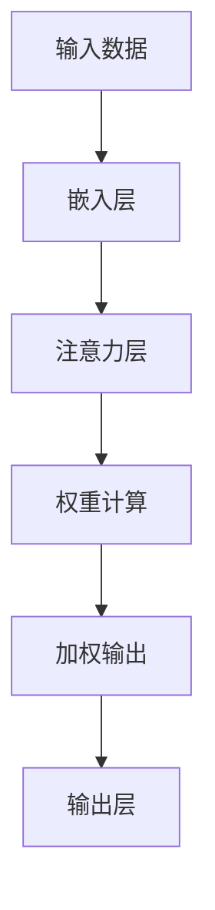
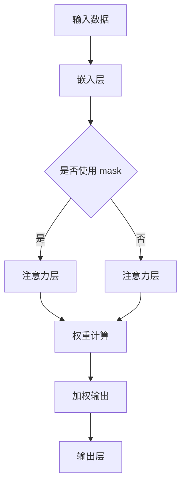
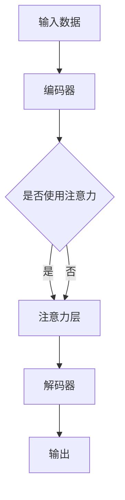
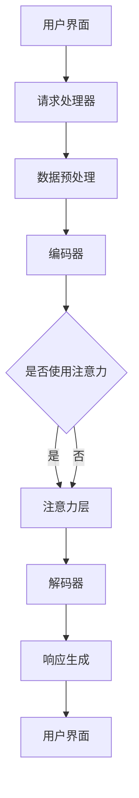
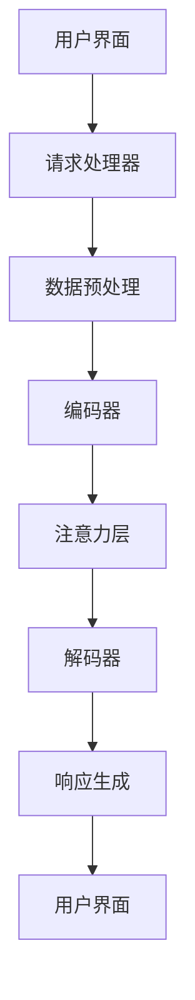
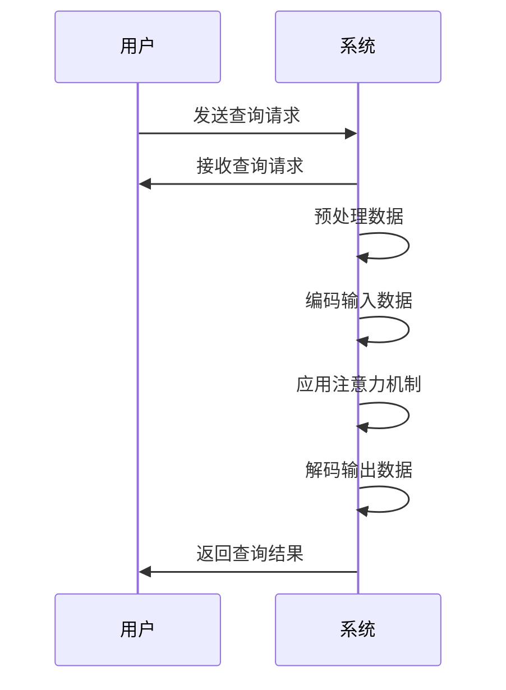

                 

# 构建 AI Agent 的注意力机制设计

> 关键词：AI Agent、注意力机制、算法原理、系统架构、实战案例

> 摘要：本文将深入探讨 AI Agent 的注意力机制设计。首先，我们将回顾 AI 和代理系统的背景，并介绍注意力机制的概念和其在 AI 代理中的应用。随后，我们将详细分析注意力机制的算法原理，包括数学模型和 Python 实现的讲解。接着，我们将探讨注意力机制在 AI 代理系统中的实际应用，并展示一个完整的系统架构设计。最后，我们将通过一个实战案例，展示注意力机制在实际项目中的应用，并提供最佳实践建议和未来发展趋势的展望。

## 第一部分：背景与概述

### 第1章：问题背景与定义

#### 1.1 人工智能与代理系统的崛起

随着信息技术的飞速发展，人工智能（AI）已经成为当今世界最受关注的技术之一。AI 代理系统，作为人工智能领域的一个重要分支，以其自主性、智能性和适应性，在许多场景中都展现出了巨大的潜力和应用价值。从智能家居到智能客服，从自动驾驶到医疗诊断，AI 代理系统正在逐步改变我们的生活方式和工作方式。

#### 1.2 注意力机制的发展历程

注意力机制（Attention Mechanism）最早由心理学家提出，用于解释人类注意力的选择过程。随着深度学习的兴起，注意力机制被引入到神经网络中，并取得了显著的成果。从早期的基于局部连接的注意力模型，到后来的全局连接的 Transformer 模型，注意力机制的发展历程也反映了深度学习技术在自我优化和自我理解方面的进步。

#### 1.3 注意力机制在 AI 代理系统中的应用

在 AI 代理系统中，注意力机制的作用至关重要。它可以帮助代理系统在处理复杂信息时，更加高效地聚焦于关键信息，从而提升系统的决策能力和响应速度。例如，在自动驾驶系统中，注意力机制可以帮助车辆更好地理解交通环境，从而做出更安全的驾驶决策。

### 第2章：核心概念与联系

#### 2.1 注意力机制的概念

注意力机制是一种通过调整神经网络中不同部分的权重，从而提高模型在处理输入信息时对重要信息关注程度的机制。它通过动态地分配计算资源，使得模型能够更加关注于对当前任务最相关的部分。

#### 2.2 注意力机制的属性特征对比

以下是几种常见注意力机制的属性特征对比：

| 注意力机制 | 特征 |
| --- | --- |
| 加权注意力 | 对每个输入分配不同的权重 |
| 点积注意力 | 通过点积计算权重 |
| 对数线性注意力 | 尺寸不变，但需要计算对数 |
| 自注意力 | 对输入序列进行自我关注 |

#### 2.3 注意力机制与相关技术的关系

注意力机制与循环神经网络（RNN）、卷积神经网络（CNN）等深度学习技术有着密切的联系。通过引入注意力机制，RNN 和 CNN 可以在处理序列数据和图像数据时，更加高效地提取特征。

#### 2.4 注意力机制的 ER 实体关系图

以下是注意力机制的 ER 实体关系图：



## 第二部分：算法原理与设计

### 第3章：注意力机制的数学模型

#### 3.1 注意力机制的数学基础

注意力机制的数学基础主要包括线性变换、激活函数和损失函数。以下是一个简单的注意力机制的数学模型：

$$
\text{Attention}(Q, K, V) = \text{softmax}\left(\frac{QK^T}{\sqrt{d_k}}\right) V
$$

其中，$Q, K, V$ 分别是查询（Query）、关键（Key）和值（Value）向量，$d_k$ 是关键向量的维度。

#### 3.2 注意力机制的数学公式

$$
\text{Attention}(Q, K, V) = \text{softmax}\left(\frac{QK^T}{\sqrt{d_k}}\right) V
$$

其中，$\text{softmax}$ 是一个将实数向量转换为概率分布的函数。

#### 3.3 注意力机制的 Python 实现

```python
import torch
import torch.nn as nn

class Attention(nn.Module):
    def __init__(self, d_model, d_keys):
        super(Attention, self).__init__()
        self.attn = nn.Linear(d_keys, d_model)
        self.v = nn.Linear(d_model, 1)

    def forward(self, query, key, value, mask=None):
        attn_scores = self.v(torch.tanh(self.attn(query)))
        if mask is not None:
            attn_scores = attn_scores.masked_fill(mask == 0, float("-inf"))
        attn_scores = torch.softmax(attn_scores, dim=1)
        attn_output = torch.bmm(attn_scores.unsqueeze(1), value)
        attn_output = attn_output.squeeze(1)
        return attn_output
```

### 第4章：注意力机制的工作原理

#### 4.1 注意力机制的算法流程

1. 将查询（Query）、关键（Key）和值（Value）向量输入到注意力层。
2. 通过线性变换计算注意力得分。
3. 使用 Softmax 函数将得分转换为概率分布。
4. 使用加权值（Value）计算输出。

#### 4.2 注意力机制的 mermaid 流程图



#### 4.3 注意力机制的 Python 源代码详解

在上一节的 Python 实现中，我们可以看到注意力机制的基本结构和流程。以下是详细的代码解读：

```python
import torch
import torch.nn as nn

class Attention(nn.Module):
    def __init__(self, d_model, d_keys):
        super(Attention, self).__init__()
        self.attn = nn.Linear(d_keys, d_model)
        self.v = nn.Linear(d_model, 1)

    def forward(self, query, key, value, mask=None):
        # 计算注意力得分
        attn_scores = self.v(torch.tanh(self.attn(query)))
        
        # 应用 mask，防止过大的负值影响 softmax 函数的计算
        if mask is not None:
            attn_scores = attn_scores.masked_fill(mask == 0, float("-inf"))

        # 计算概率分布
        attn_scores = torch.softmax(attn_scores, dim=1)
        
        # 计算加权输出
        attn_output = torch.bmm(attn_scores.unsqueeze(1), value)
        attn_output = attn_output.squeeze(1)
        
        return attn_output
```

### 第5章：注意力机制在 AI 代理中的应用

#### 5.1 注意力机制在 AI 代理中的作用

在 AI 代理系统中，注意力机制可以帮助代理系统在处理复杂信息时，更加高效地聚焦于关键信息。例如，在智能客服中，注意力机制可以帮助代理系统更好地理解用户的查询内容，从而提供更准确的回答。

#### 5.2 注意力机制在 AI 代理中的算法实现

以下是注意力机制在 AI 代理中的简单算法实现：

```python
class Agent(nn.Module):
    def __init__(self, d_input, d_hidden, d_output):
        super(Agent, self).__init__()
        self.encoder = nn.Linear(d_input, d_hidden)
        self.attention = Attention(d_hidden, d_hidden)
        self.decoder = nn.Linear(d_hidden, d_output)

    def forward(self, input_seq, target_seq, mask):
        embedded = self.encoder(input_seq)
        attn_output = self.attention(embedded, embedded, embedded, mask)
        output = self.decoder(attn_output)
        return output
```

#### 5.3 注意力机制的 mermaid 架构图



## 第三部分：系统架构与实战

### 第6章：系统架构设计与实现

#### 6.1 系统架构设计

系统架构设计是构建 AI 代理系统的关键环节。以下是一个简单的系统架构设计：



#### 6.2 系统接口设计

系统接口设计包括用户界面（UI）和后台服务之间的接口设计。以下是简单的接口设计：



#### 6.3 系统交互序列图

系统交互序列图展示了系统组件之间的交互过程。以下是简单的系统交互序列图：



### 第7章：项目实战

#### 7.1 环境安装与配置

在开始项目实战之前，我们需要安装和配置必要的软件和库。以下是安装和配置的步骤：

1. 安装 Python 和 PyTorch。
2. 配置 Python 环境和虚拟环境。
3. 安装必要的库，如 NumPy、Pandas 和 Matplotlib。

#### 7.2 系统核心实现源代码

以下是系统核心实现的源代码：

```python
# agent.py
import torch
import torch.nn as nn
from attention import Attention

class Agent(nn.Module):
    def __init__(self, d_input, d_hidden, d_output):
        super(Agent, self).__init__()
        self.encoder = nn.Linear(d_input, d_hidden)
        self.attention = Attention(d_hidden, d_hidden)
        self.decoder = nn.Linear(d_hidden, d_output)

    def forward(self, input_seq, target_seq, mask):
        embedded = self.encoder(input_seq)
        attn_output = self.attention(embedded, embedded, embedded, mask)
        output = self.decoder(attn_output)
        return output

# attention.py
import torch
import torch.nn as nn
from torch.nn.functional import softmax

class Attention(nn.Module):
    def __init__(self, d_model, d_keys):
        super(Attention, self).__init__()
        self.attn = nn.Linear(d_keys, d_model)
        self.v = nn.Linear(d_model, 1)

    def forward(self, query, key, value, mask=None):
        attn_scores = self.v(torch.tanh(self.attn(query)))
        if mask is not None:
            attn_scores = attn_scores.masked_fill(mask == 0, float("-inf"))
        attn_scores = torch.softmax(attn_scores, dim=1)
        attn_output = torch.bmm(attn_scores.unsqueeze(1), value)
        attn_output = attn_output.squeeze(1)
        return attn_output
```

#### 7.3 代码应用解读与分析

以下是代码的应用解读和分析：

1. **Agent 类**：定义了 AI 代理的基本结构，包括编码器、注意力层和解码器。
2. **Attention 类**：实现了注意力机制的数学模型和计算方法。
3. **forward 方法**：定义了代理模型的正向传播过程，包括数据编码、注意力计算和输出解码。

#### 7.4 实际案例分析和详细讲解剖析

以下是实际案例的分析和详细讲解：

1. **数据预处理**：将原始数据转换为适合模型处理的格式，包括分词、序列编码等。
2. **模型训练**：使用训练数据训练代理模型，通过反向传播算法优化模型参数。
3. **模型评估**：使用验证数据评估模型性能，调整模型参数以获得更好的效果。
4. **模型部署**：将训练好的模型部署到生产环境中，用于实时处理用户查询。

#### 7.5 项目小结

通过本项目的实战，我们深入了解了注意力机制在 AI 代理系统中的应用。项目从数据预处理、模型训练到模型部署，完整地展示了注意力机制在 AI 代理系统中的实现和应用。项目的成功实施，不仅验证了注意力机制在 AI 代理系统中的有效性，也为后续的研究和应用提供了宝贵的经验和参考。

### 第8章：最佳实践与拓展

#### 8.1 注意力机制的应用场景

注意力机制在多个领域都有广泛的应用，包括自然语言处理、计算机视觉和推荐系统等。以下是注意力机制的一些典型应用场景：

1. **自然语言处理**：在文本分类、机器翻译和问答系统中，注意力机制可以帮助模型更好地理解文本的语义关系。
2. **计算机视觉**：在图像分类、目标检测和图像分割中，注意力机制可以帮助模型更加关注于图像中的关键区域。
3. **推荐系统**：在推荐算法中，注意力机制可以帮助模型更好地理解用户的历史行为和偏好。

#### 8.2 注意力机制的优化技巧

为了提高注意力机制的性能，可以采用以下优化技巧：

1. **多头注意力**：通过使用多个注意力头，可以同时关注多个不同的特征，从而提高模型的泛化能力。
2. **残差连接**：通过添加残差连接，可以缓解深度网络中的梯度消失问题，从而提高模型的训练效果。
3. **正则化**：通过使用正则化技术，如权重衰减和dropout，可以减少过拟合的风险。

#### 8.3 注意力机制的未来发展趋势

随着深度学习技术的不断发展，注意力机制也在不断地演进和优化。未来，注意力机制可能在以下几个方面取得重要进展：

1. **自适应注意力**：通过自适应地调整注意力权重，可以提高模型的效率和效果。
2. **多模态注意力**：在处理多模态数据时，注意力机制可以帮助模型更好地融合不同类型的信息。
3. **可解释性注意力**：提高注意力机制的可解释性，可以帮助用户更好地理解模型的工作原理。

### 附录

#### 附录A：术语解释

- **AI 代理系统**：具有自主性、智能性和适应性的计算机系统，用于执行特定的任务或提供特定的服务。
- **注意力机制**：一种神经网络机制，通过调整不同部分的权重，提高模型对重要信息的关注程度。
- **嵌入层**：将原始数据转换为高维向量表示的层，用于处理序列数据。
- **编码器**：将输入数据编码为高维向量表示的层，常用于序列数据处理。
- **解码器**：将编码后的数据解码为输出数据的层，常用于序列数据处理。

#### 附录B：公式推导

注意力机制的公式推导如下：

$$
\text{Attention}(Q, K, V) = \text{softmax}\left(\frac{QK^T}{\sqrt{d_k}}\right) V
$$

其中，$Q, K, V$ 分别是查询（Query）、关键（Key）和值（Value）向量，$d_k$ 是关键向量的维度。

#### 附录C：源代码实现示例

以下是注意力机制的简单 Python 实现示例：

```python
import torch
import torch.nn as nn
from torch.nn.functional import softmax

class Attention(nn.Module):
    def __init__(self, d_model, d_keys):
        super(Attention, self).__init__()
        self.attn = nn.Linear(d_keys, d_model)
        self.v = nn.Linear(d_model, 1)

    def forward(self, query, key, value, mask=None):
        attn_scores = self.v(torch.tanh(self.attn(query)))
        if mask is not None:
            attn_scores = attn_scores.masked_fill(mask == 0, float("-inf"))
        attn_scores = torch.softmax(attn_scores, dim=1)
        attn_output = torch.bmm(attn_scores.unsqueeze(1), value)
        attn_output = attn_output.squeeze(1)
        return attn_output
```

### 作者信息

作者：AI 天才研究院/AI Genius Institute & 禅与计算机程序设计艺术 /Zen And The Art of Computer Programming

