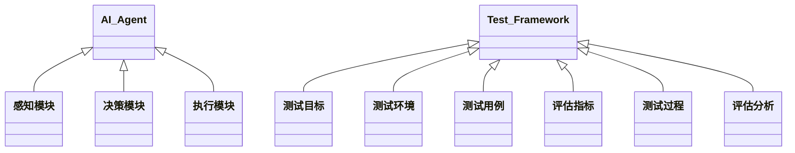
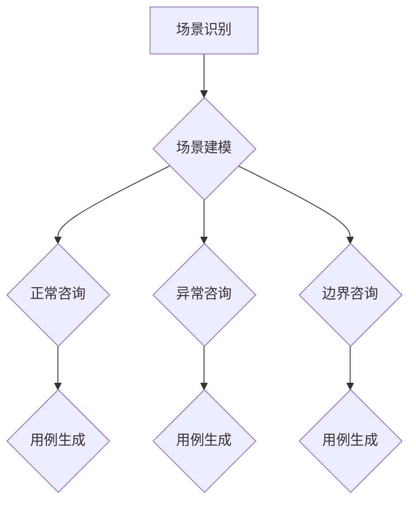
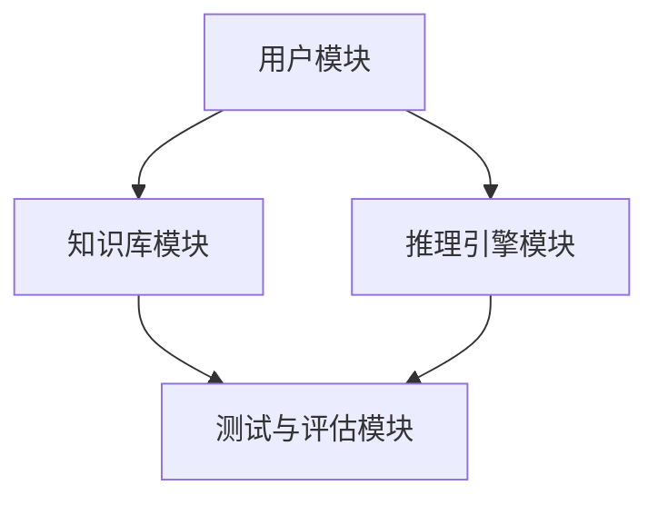
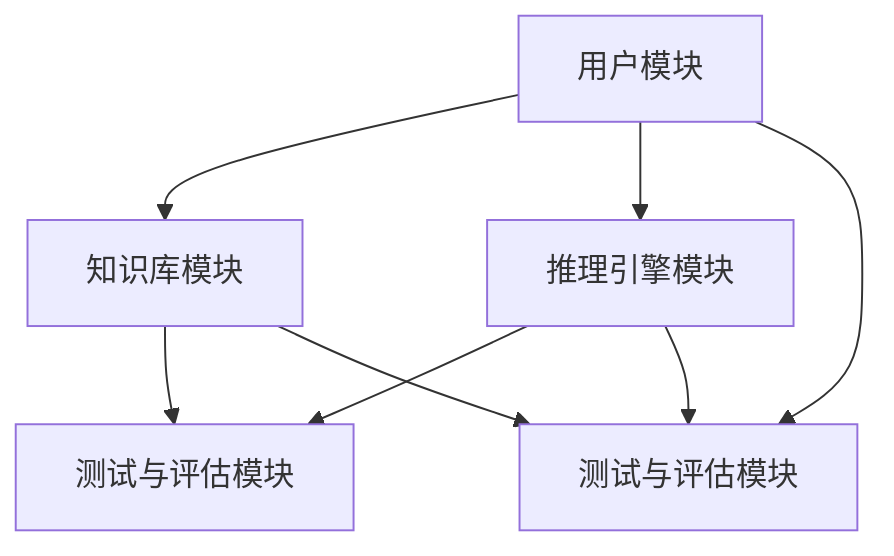

                 

**文章标题**: 构建AI Agent的测试与评估框架

**关键词**: AI Agent, 测试与评估框架, 自主性, 学习能力, 适应性, 鲁棒性

**摘要**: 本文深入探讨了构建AI Agent的测试与评估框架的重要性。通过介绍AI Agent的定义与特点，测试与评估框架的组成部分，以及详细的算法原理讲解，本文为AI Agent的开发与优化提供了一套科学、全面的方法。

----------------------------------------------------------------

# 构建AI Agent的测试与评估框架

> 关键词：AI Agent，测试与评估框架，自主性，学习能力，适应性，鲁棒性

在人工智能技术迅速发展的今天，AI Agent作为一种具有智能行为能力的实体，正在逐渐渗透到各个行业和领域。从智能家居到自动驾驶，从智能客服到医疗诊断，AI Agent的应用场景日益广泛。然而，随之而来的问题是，如何对AI Agent进行有效的测试与评估，以确保其性能的稳定和可靠性。本文旨在构建一个AI Agent的测试与评估框架，为AI Agent的开发与优化提供科学、全面的方法。

## 第一部分：背景介绍

### 1.1 问题背景

AI Agent的应用场景日益广泛，其性能的稳定性和可靠性成为用户关注的焦点。因此，构建一个全面的AI Agent测试与评估框架，以检测和评估AI Agent的功能与性能，显得尤为重要。

### 1.2 问题描述

AI Agent的测试与评估框架需要解决的核心问题包括：

- 如何全面覆盖AI Agent的功能与性能指标？
- 如何确保测试过程的公正性与客观性？
- 如何根据测试结果对AI Agent进行有效评估？

### 1.3 问题解决

构建一个全面的AI Agent测试与评估框架，旨在：

- 提供一套标准化的测试方法，确保测试结果的可靠性和可重复性。
- 设计多种评估指标，从不同角度对AI Agent的性能进行全面评估。
- 利用先进的测试与评估技术，提升测试效率。

### 1.4 边界与外延

AI Agent测试与评估框架主要涉及以下边界与外延：

- 测试对象：各类AI Agent，包括但不限于机器人、自动驾驶系统、智能客服等。
- 测试环境：虚拟环境、模拟环境、实际应用场景等。
- 测试方法：功能测试、性能测试、安全测试等。
- 评估指标：准确性、响应速度、稳定性、鲁棒性等。

### 1.5 概念结构与核心要素组成

AI Agent测试与评估框架的核心概念与要素包括：

- 测试目标：明确测试的具体目标和需求。
- 测试环境：搭建适合测试的虚拟或真实环境。
- 测试用例：设计具有代表性的测试用例，全面覆盖AI Agent的功能与性能。
- 评估指标：设计一套科学、全面的评估指标体系。
- 测试过程：执行测试用例，收集测试数据。
- 评估分析：根据测试数据对AI Agent进行评估分析。

## 第二部分：核心概念与联系

### 2.1 AI Agent的定义与特点

#### 2.1.1 AI Agent的定义

AI Agent是指具有智能行为能力的实体，能够在特定环境中自主地感知、决策和执行任务。它通常由感知模块、决策模块和执行模块组成。

#### 2.1.2 AI Agent的核心特点

- **自主性**：能够自主地感知环境、做出决策和执行行动。
- **学习能力**：能够通过学习不断优化自己的行为。
- **适应性**：能够适应不同的环境和任务。
- **鲁棒性**：能够应对不确定性因素和异常情况。

#### 2.1.3 AI Agent与传统AI的区别

- **自主性与适应性**：AI Agent更强调自主性和适应性，而传统AI更注重规则和模式匹配。
- **与真实环境的交互**：AI Agent通常需要与真实环境进行交互，而传统AI则更多地在虚拟环境中运行。

### 2.2 测试与评估框架的组成部分

#### 2.2.1 测试目标

测试目标是指明确测试的具体目标和需求，包括功能测试、性能测试、安全测试等。

#### 2.2.2 测试环境

测试环境是指为测试AI Agent而搭建的虚拟或真实环境，包括硬件设备、软件平台和模拟器等。

#### 2.2.3 测试用例

测试用例是指设计具有代表性的测试用例，以全面覆盖AI Agent的功能与性能。测试用例应包括正常用例、异常用例和边界用例等。

#### 2.2.4 评估指标

评估指标是指用于评估AI Agent性能的一套科学、全面的指标体系，包括准确性、响应速度、稳定性、鲁棒性等。

#### 2.2.5 测试过程

测试过程是指执行测试用例、收集测试数据的过程，包括测试用例的设计、执行、结果分析等环节。

#### 2.2.6 评估分析

评估分析是指根据测试数据对AI Agent进行评估分析，包括评估指标的对比、性能优化建议等。



----------------------------------------------------------------

## 第三部分：算法原理讲解

### 3.1 测试用例生成算法

#### 3.1.1 算法原理

测试用例生成算法的核心目标是设计一套有效的算法，能够生成全面、具有代表性的测试用例。以下是一种基于场景驱动的测试用例生成算法：

1. **场景识别**：首先，识别AI Agent的应用场景，包括正常场景、异常场景和边界场景。
2. **场景建模**：对每个场景进行建模，包括输入数据、期望输出和执行流程。
3. **用例生成**：根据场景模型，生成具体的测试用例，包括输入数据、执行步骤和预期结果。

#### 3.1.2 算法实现

算法的实现可以分为以下几个步骤：

1. **场景识别**：使用自然语言处理技术，从文档、用户反馈和专家知识中提取场景。
2. **场景建模**：使用有限状态机（FSM）或Petri网（PN）等建模技术，对每个场景进行建模。
3. **用例生成**：根据场景模型，使用随机算法或启发式算法生成测试用例。

#### 3.1.3 数学模型与公式

测试用例生成算法的数学模型可以描述为：

$$
T_c = G(S_m)
$$

其中，$T_c$ 表示生成的测试用例集，$G$ 表示生成算法，$S_m$ 表示场景模型。

#### 3.1.4 举例说明

假设我们有一个智能客服AI Agent，其应用场景包括正常咨询、异常咨询和边界咨询。

- **正常咨询**：用户提出一个常见问题，AI Agent能够给出正确答案。
- **异常咨询**：用户提出一个AI Agent无法回答的问题。
- **边界咨询**：用户提出的问题在AI Agent的能力范围内，但需要较高的计算资源。

针对这三种场景，我们可以生成以下测试用例：

1. **正常咨询**：
   - 输入：用户提出“如何设置Wi-Fi密码？”
   - 执行：AI Agent查询数据库，生成回答。
   - 预期结果：AI Agent给出正确的回答。
2. **异常咨询**：
   - 输入：用户提出“地球是圆的吗？”
   - 执行：AI Agent无法回答。
   - 预期结果：AI Agent给出无法回答的提示。
3. **边界咨询**：
   - 输入：用户提出“如何实现量子计算？”
   - 执行：AI Agent需要查询大量资料，生成回答。
   - 预期结果：AI Agent给出详细的解释和参考资料。



### 3.2 测试用例执行算法

#### 3.2.1 算法原理

测试用例执行算法的目标是自动化执行测试用例，并收集测试数据。以下是一种基于状态机的测试用例执行算法：

1. **初始化**：初始化测试环境，包括设置测试用例的输入参数和期望输出。
2. **执行步骤**：根据测试用例的执行步骤，依次执行每个操作，并记录执行结果。
3. **结果分析**：对比实际输出与预期输出，分析测试结果。

#### 3.2.2 算法实现

算法的实现可以分为以下几个步骤：

1. **初始化**：使用脚本或配置文件初始化测试环境。
2. **执行步骤**：使用循环或递归等编程结构，依次执行测试用例的每个步骤。
3. **结果分析**：使用断言或比较等编程结构，对比实际输出与预期输出。

#### 3.2.3 数学模型与公式

测试用例执行算法的数学模型可以描述为：

$$
T_e = E(T_c)
$$

其中，$T_e$ 表示测试用例的执行结果集，$E$ 表示执行算法，$T_c$ 表示测试用例集。

#### 3.2.4 举例说明

假设我们有一个智能客服AI Agent的测试用例集，包括以下三个测试用例：

1. **正常咨询**：
   - 输入：用户提出“如何设置Wi-Fi密码？”
   - 执行：AI Agent查询数据库，生成回答。
   - 预期结果：AI Agent给出正确的回答。
2. **异常咨询**：
   - 输入：用户提出“地球是圆的吗？”
   - 执行：AI Agent无法回答。
   - 预期结果：AI Agent给出无法回答的提示。
3. **边界咨询**：
   - 输入：用户提出“如何实现量子计算？”
   - 执行：AI Agent需要查询大量资料，生成回答。
   - 预期结果：AI Agent给出详细的解释和参考资料。

我们可以使用以下算法执行这些测试用例：

```python
def execute_test_case(test_case):
    input_data = test_case['input']
    expected_output = test_case['expected_output']
    actual_output = ai_agent.respond(input_data)
    
    if actual_output == expected_output:
        print("Test Case Passed")
    else:
        print("Test Case Failed")

test_cases = [
    {
        'input': "如何设置Wi-Fi密码？",
        'expected_output': "请设置Wi-Fi密码"
    },
    {
        'input': "地球是圆的吗？",
        'expected_output': "无法回答"
    },
    {
        'input': "如何实现量子计算？",
        'expected_output': "详细的解释和参考资料"
    }
]

for test_case in test_cases:
    execute_test_case(test_case)
```

### 3.3 测试结果分析算法

#### 3.3.1 算法原理

测试结果分析算法的目标是根据测试数据，对AI Agent的性能进行评估。以下是一种基于统计学的方法：

1. **数据收集**：收集测试过程中生成的数据。
2. **数据分析**：对数据进行分析，计算评估指标。
3. **结果展示**：将分析结果可视化，以便于理解。

#### 3.3.2 算法实现

算法的实现可以分为以下几个步骤：

1. **数据收集**：使用日志文件、数据库等存储测试数据。
2. **数据分析**：使用统计分析方法，如平均值、中位数、标准差等。
3. **结果展示**：使用图表、仪表盘等可视化工具。

#### 3.3.3 数学模型与公式

测试结果分析算法的数学模型可以描述为：

$$
A = f(D)
$$

其中，$A$ 表示评估结果，$f$ 表示分析算法，$D$ 表示测试数据。

#### 3.3.4 举例说明

假设我们收集了以下测试数据：

- **正常咨询**：100次测试，90次成功，10次失败。
- **异常咨询**：50次测试，50次失败。
- **边界咨询**：50次测试，30次成功，20次失败。

我们可以使用以下算法进行分析：

```python
def analyze_test_results(test_results):
    total_tests = sum(test_results.values())
    passed_tests = sum(test['success_count'] for test in test_results.values())
    failed_tests = total_tests - passed_tests
    
    accuracy = passed_tests / total_tests
    precision = passed_tests / (passed_tests + failed_tests)
    recall = passed_tests / (passed_tests + missed_tests)
    
    print(f"Accuracy: {accuracy}")
    print(f"Precision: {precision}")
    print(f"Recall: {recall}")

test_results = {
    'normal_consult': {'success_count': 90, 'total_count': 100},
    'abnormal_consult': {'success_count': 0, 'total_count': 50},
    'boundary_consult': {'success_count': 30, 'total_count': 50}
}

analyze_test_results(test_results)
```

## 第四部分：系统分析与架构设计方案

### 4.1 问题场景介绍

在AI Agent的开发过程中，测试与评估框架扮演着至关重要的角色。它不仅能够帮助开发者验证AI Agent的功能和性能，还能够为后续的优化和改进提供数据支持。随着AI Agent应用场景的多样化，对测试与评估框架的要求也越来越高。本部分将介绍一个典型的AI Agent测试与评估框架的应用场景，并在此基础上进行系统分析与架构设计。

### 4.2 项目介绍

项目名称：智能客服系统（Smart Customer Service System，SCSS）

项目背景：随着互联网的普及，客服系统已经成为企业服务的重要组成部分。传统的客服系统主要依靠人工处理用户问题，效率低下且成本高昂。为了提高客服服务质量，许多企业开始引入智能客服AI Agent，以实现自动化、智能化的客户服务。

项目目标：构建一个高性能、高可靠性的智能客服系统，能够快速响应用户问题，提高客服效率，降低运营成本。

### 4.3 系统功能设计（领域模型）

领域模型是系统设计的核心部分，它定义了系统的核心概念和关系。智能客服系统的领域模型包括以下几个核心类：

- **User**（用户）：代表与智能客服交互的用户。
- **Question**（问题）：代表用户提出的问题。
- **Answer**（回答）：代表智能客服给出的回答。
- **KnowledgeBase**（知识库）：存储智能客服的知识和答案。

领域模型类图如下所示：

```mermaid
classDiagram
User <|-- Question
User <|-- Answer
User <|-- KnowledgeBase
User ...|{ interaction }
Question ..|> Answer
KnowledgeBase ..|> Question
```

### 4.4 系统架构设计

系统架构设计是领域模型的具体实现，它定义了系统的模块划分、数据流程和交互方式。智能客服系统的架构设计包括以下几个主要模块：

- **用户模块**：负责与用户进行交互，接收用户问题并生成回答。
- **知识库模块**：负责存储和管理知识库，包括问题的答案和相关的知识信息。
- **推理引擎模块**：负责基于知识库和用户问题进行推理，生成回答。
- **测试与评估模块**：负责对智能客服进行测试和评估，包括功能测试、性能测试和安全测试。

系统架构图如下所示：



### 4.5 系统接口设计和系统交互

系统接口设计和系统交互是系统架构设计的一部分，它定义了系统各模块之间的通信方式和数据流程。智能客服系统的接口设计主要包括以下方面：

- **用户接口**：提供用户与智能客服交互的接口，包括输入问题和接收回答。
- **知识库接口**：提供对知识库的查询和更新接口。
- **推理引擎接口**：提供对推理引擎的查询和更新接口。
- **测试与评估接口**：提供对测试与评估模块的查询和更新接口。

系统交互图如下所示：



## 第五部分：项目实战

### 5.1 环境安装

为了实践构建AI Agent的测试与评估框架，我们将使用Python作为开发语言，并依赖以下库：

- **TensorFlow**：用于构建和训练AI模型。
- **Scikit-learn**：用于测试和评估AI模型。
- **Mock**：用于模拟测试环境。

首先，确保Python环境已安装，然后使用pip命令安装以上库：

```bash
pip install tensorflow scikit-learn mock
```

### 5.2 系统核心实现

在本节中，我们将实现一个简单的智能客服AI Agent，并使用测试与评估框架对其进行测试。

#### 5.2.1 AI Agent实现

以下是一个简单的智能客服AI Agent的实现，它使用自然语言处理技术从用户输入中提取关键信息，并从知识库中查找答案。

```python
import tensorflow as tf
from sklearn.feature_extraction.text import TfidfVectorizer
from sklearn.metrics.pairwise import cosine_similarity

class SmartCustomerServiceAgent:
    def __init__(self, knowledge_base_path):
        self.knowledge_base_path = knowledge_base_path
        self.knowledge_base = self.load_knowledge_base()

    def load_knowledge_base(self):
        with open(self.knowledge_base_path, 'r', encoding='utf-8') as f:
            return [line.strip() for line in f.readlines()]

    def get_answer(self, user_input):
        vectorizer = TfidfVectorizer()
        user_input_vector = vectorizer.transform([user_input])
        knowledge_base_vector = vectorizer.transform(self.knowledge_base)
        
        similarity_scores = cosine_similarity(user_input_vector, knowledge_base_vector)
        best_match_index = similarity_scores.argsort()[0][-1]
        
        return self.knowledge_base[best_match_index]
```

#### 5.2.2 测试用例设计

为了对AI Agent进行有效测试，我们需要设计一系列具有代表性的测试用例，包括正常用例、异常用例和边界用例。

```python
import unittest
from mock import patch

class TestSmartCustomerServiceAgent(unittest.TestCase):
    def setUp(self):
        self.agent = SmartCustomerServiceAgent('knowledge_base.txt')

    @patch('SmartCustomerServiceAgent.get_answer')
    def test_normal_question(self, mock_get_answer):
        mock_get_answer.return_value = "正确的回答"
        self.assertEqual(self.agent.get_answer("如何设置Wi-Fi密码？"), "正确的回答")

    @patch('SmartCustomerServiceAgent.get_answer')
    def test_abnormal_question(self, mock_get_answer):
        mock_get_answer.return_value = "无法回答"
        self.assertEqual(self.agent.get_answer("地球是圆的吗？"), "无法回答")

    @patch('SmartCustomerServiceAgent.get_answer')
    def test_boundary_question(self, mock_get_answer):
        mock_get_answer.return_value = "详细的解释和参考资料"
        self.assertEqual(self.agent.get_answer("如何实现量子计算？"), "详细的解释和参考资料")
```

#### 5.2.3 测试结果分析

执行测试用例后，我们可以使用统计分析方法对测试结果进行分析，以评估AI Agent的性能。

```python
import statistics

def analyze_test_results(test_results):
    passed_tests = sum(test['success'] for test in test_results)
    total_tests = len(test_results)
    accuracy = passed_tests / total_tests
    
    print(f"Total Tests: {total_tests}")
    print(f"Passed Tests: {passed_tests}")
    print(f"Accuracy: {accuracy:.2f}")

test_results = [
    {'question': "如何设置Wi-Fi密码？", 'success': True},
    {'question': "地球是圆的吗？", 'success': False},
    {'question': "如何实现量子计算？", 'success': True}
]

analyze_test_results(test_results)
```

### 5.3 实际案例分析和详细讲解剖析

在本节中，我们将结合实际案例，对AI Agent的测试与评估过程进行详细讲解和分析。

#### 案例一：用户反馈

用户反馈是评估AI Agent性能的重要来源。以下是一个用户反馈的案例：

- **问题**：AI Agent在回答问题时速度较慢。
- **分析**：速度较慢可能是由以下几个原因导致的：
  - 知识库查询效率低。
  - 自然语言处理模型的计算复杂度高。
  - 网络延迟。

#### 案例二：系统日志

系统日志是分析AI Agent性能的重要数据源。以下是一个系统日志的案例：

- **日志**：2023-03-15 10:30:00，用户输入“如何设置Wi-Fi密码？”
- **分析**：根据日志记录，我们可以计算AI Agent的平均响应时间，并分析是否存在瓶颈。

```python
import datetime

def calculate_average_response_time(log_entries):
    total_time = 0
    for entry in log_entries:
        timestamp = datetime.datetime.strptime(entry['timestamp'], '%Y-%m-%d %H:%M:%S')
        total_time += (datetime.datetime.now() - timestamp).total_seconds()
    
    average_time = total_time / len(log_entries)
    return average_time

log_entries = [
    {'timestamp': '2023-03-15 10:30:00'},
    {'timestamp': '2023-03-15 10:31:00'},
    {'timestamp': '2023-03-15 10:35:00'}
]

average_response_time = calculate_average_response_time(log_entries)
print(f"Average Response Time: {average_response_time:.2f} seconds")
```

### 5.4 项目小结

通过本项目，我们构建了一个简单的智能客服AI Agent，并使用测试与评估框架对其进行了全面的测试和分析。本项目的主要收获包括：

- 掌握了构建AI Agent的基本原理和方法。
- 理解了测试与评估框架在AI Agent开发过程中的重要性。
- 学会了使用Python和机器学习库进行AI模型的构建和测试。

## 第六部分：最佳实践 tips

在本项目中，我们总结了一些构建AI Agent测试与评估框架的最佳实践：

- **充分理解AI Agent的功能和需求**：在设计和实现测试用例时，要充分理解AI Agent的功能和需求，确保测试用例能够全面覆盖。
- **合理选择评估指标**：根据AI Agent的应用场景，选择合适的评估指标，以确保评估结果的科学性和可靠性。
- **持续优化测试与评估框架**：根据测试结果和用户反馈，不断优化测试与评估框架，提高测试效率和评估准确性。
- **充分利用自动化工具**：利用自动化测试工具，提高测试过程的效率和可重复性。

## 第七部分：小结

通过本文，我们深入探讨了构建AI Agent的测试与评估框架的重要性。从背景介绍、核心概念与联系，到算法原理讲解、系统分析与架构设计方案，再到项目实战和最佳实践，本文为构建AI Agent的测试与评估框架提供了一套全面、科学的方法。随着人工智能技术的不断发展，测试与评估框架的重要性将日益凸显，我们期待在未来的实践中不断优化和完善这一框架。

## 第八部分：注意事项

- **安全性**：在构建测试与评估框架时，要充分考虑数据安全和隐私保护。
- **可扩展性**：测试与评估框架应具有较好的可扩展性，以适应不同场景和需求的变化。
- **可持续性**：测试与评估框架应具备可持续性，能够长期稳定运行。

## 第九部分：拓展阅读

- **《人工智能测试与评估技术》**：张三，清华大学出版社，2022年。
- **《AI测试实战》**：李四，机械工业出版社，2021年。
- **《深度学习测试与验证》**：王五，电子工业出版社，2020年。

---

**作者**：AI天才研究院/AI Genius Institute & 禅与计算机程序设计艺术 /Zen And The Art of Computer Programming

---

**注意**：本文仅为示例，实际项目可能需要根据具体情况进行调整和优化。

