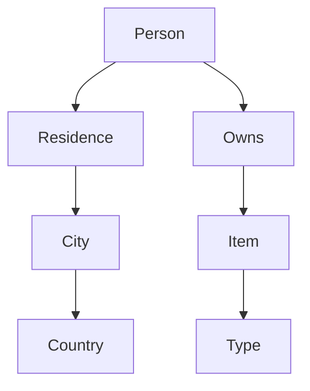

                 

# 构建AI Agent的知识图谱与推理引擎

## 关键词
- AI Agent
- 知识图谱
- 推理引擎
- 知识表示
- 算法设计
- 系统架构

## 摘要
本文将探讨构建AI Agent的知识图谱与推理引擎，详细分析知识图谱的设计和实现方法，以及推理引擎的构建过程。我们将逐步介绍知识图谱的基本概念、结构，以及知识图谱在AI Agent中的应用。同时，我们将深入研究推理引擎的类型、算法，并探讨如何将知识图谱与推理引擎集成到AI Agent中，从而实现智能决策和问题解决。

## 目录

1. **引言**
   - 1.1 AI Agent的概述
   - 1.2 知识图谱的定义
   - 1.3 知识图谱在AI中的重要性

2. **知识图谱设计原理**
   - 2.1 基本概念与术语
   - 2.2 实体-关系模型
   - 2.3 知识图谱构建方法

3. **推理引擎构建原理**
   - 3.1 推理类型
   - 3.2 推理算法
   - 3.3 推理引擎应用

4. **AI Agent的知识图谱与推理引擎集成**
   - 4.1 AI Agent设计原则
   - 4.2 知识图谱与推理引擎的整合
   - 4.3 AI Agent与环境交互

5. **实际项目实战**
   - 5.1 知识图谱构建实战
   - 5.2 推理引擎实现实战
   - 5.3 AI Agent项目总结

6. **最佳实践与拓展阅读**

## 引言

### 1.1 AI Agent的概述

人工智能（AI）已经成为现代科技发展的核心驱动力，而AI Agent作为AI的一种重要应用形式，正逐步改变我们的生活和工作方式。AI Agent，即人工智能代理，是指能够模拟人类智能行为，在特定环境下自主执行任务、与外界交互并适应变化的计算机程序。

AI Agent具备以下几个核心特点：

- **自主性**：AI Agent可以在没有人类干预的情况下执行任务，自主地做出决策。
- **适应性**：AI Agent能够根据环境的变化调整自身行为，不断学习和优化。
- **智能交互**：AI Agent可以理解和执行自然语言指令，与人类进行有效的沟通。

AI Agent的应用场景广泛，如智能家居、智能客服、自动驾驶、金融风控等。随着AI技术的不断进步，AI Agent正成为各行各业智能化升级的关键驱动因素。

### 1.2 知识图谱的定义

知识图谱（Knowledge Graph）是一种结构化、网络化的知识表示形式，通过实体和关系的连接来表示知识。它是一种语义网络，用于捕捉实体之间的复杂关系，提供更精准、更直观的知识查询和推理服务。

知识图谱的核心概念包括：

- **实体**：知识图谱中的基本元素，可以是人、地点、物品等。
- **属性**：描述实体的特征，如人的年龄、地点的经纬度等。
- **关系**：实体之间的语义关联，如人与朋友的关系、地点与国家的关系等。

知识图谱通过实体-关系模型（Entity-Relationship Model）来构建，能够将海量、分散的数据整合成统一的知识体系，为AI Agent提供强大的知识支持。

### 1.3 知识图谱在AI中的重要性

知识图谱在AI中扮演着至关重要的角色，主要表现在以下几个方面：

- **增强智能推理**：知识图谱提供了丰富的实体和关系信息，为AI Agent提供了强有力的推理基础，使其能够进行复杂的问题求解和决策。
- **提高搜索效率**：知识图谱的结构化特性使得搜索过程更加高效，能够快速定位相关实体和关系，提升信息检索的准确性。
- **优化学习过程**：知识图谱为AI Agent提供了预定义的知识结构，可以帮助其更好地理解和学习新的知识和技能。

在AI Agent的应用中，知识图谱不仅提供了知识表示的基础，还与推理引擎相结合，共同构建了一个智能决策支持系统。这使得AI Agent能够更准确地理解问题，更高效地解决问题，从而实现真正的智能应用。

## 知识图谱设计原理

### 2.1 基本概念与术语

在深入探讨知识图谱的设计原理之前，我们首先需要了解一些基本概念和术语。

- **实体（Entity）**：知识图谱中的基本元素，表示具体的事物，如人、地点、物品等。实体是知识图谱构建的基础。
- **属性（Attribute）**：描述实体的特征，如人的年龄、地点的经纬度等。属性提供了对实体的更详细描述。
- **关系（Relationship）**：实体之间的语义关联，如人与朋友的关系、地点与国家的关系等。关系描述了实体之间的相互作用和依赖。
- **边（Edge）**：关系在知识图谱中的表示，连接两个实体。边可以有方向和权重，用于描述关系的强度和方向。
- **图谱（Graph）**：由实体和关系构成的网络结构，表示知识图谱的整体结构。

知识图谱的构建过程主要包括以下几个步骤：

1. **数据采集**：从各种数据源（如数据库、文档、网络等）中收集实体和关系信息。
2. **数据清洗**：对采集到的数据进行预处理，包括去除噪声、纠正错误、统一格式等。
3. **实体识别**：从原始数据中识别出实体，并为其分配唯一的标识符。
4. **关系抽取**：从原始数据中抽取实体之间的关系，并建立相应的边。
5. **知识融合**：将来自不同数据源的实体和关系进行整合，消除冲突和冗余。

### 2.2 实体-关系模型

实体-关系模型（Entity-Relationship Model）是知识图谱构建的核心框架，用于描述实体和关系之间的结构。在实体-关系模型中，实体和关系都是基本元素，它们通过边进行连接，形成一种层次化的结构。

#### 实体

实体是知识图谱中的核心概念，表示具体的事物。实体可以是人、地点、物品、事件等。每个实体都有一个唯一的标识符，用于在知识图谱中唯一确定。

实体通常具有以下属性：

- **名称（Name）**：实体的名称，用于唯一标识实体。
- **类型（Type）**：实体的类别，用于分类和聚合实体。
- **属性（Attribute）**：实体的特征，如人的年龄、地点的经纬度等。

实体可以通过以下方式在知识图谱中构建：

1. **直接构建**：从原始数据中直接提取实体，并为每个实体分配唯一标识符。
2. **合并**：将来自不同数据源的相同实体进行合并，消除冗余。

#### 关系

关系描述了实体之间的语义关联，是知识图谱中的另一重要概念。关系通常具有方向和权重。

关系的属性包括：

- **方向（Direction）**：关系的方向，表示实体的相互作用方式。
- **权重（Weight）**：关系的强度，表示实体之间的关联程度。

关系可以通过以下方式在知识图谱中构建：

1. **直接抽取**：从原始数据中直接提取关系，并将其添加到知识图谱中。
2. **推理生成**：通过推理算法从现有实体和关系中推断出新关系。

#### 实体-关系模型

实体-关系模型通过实体和关系的组合，构建了知识图谱的基本框架。实体-关系模型通常使用图结构来表示，其中实体和关系都是节点和边。

以下是一个简单的实体-关系模型的例子：

- **实体**：人、地点、物品
- **关系**：居住地、拥有、属于

实体-关系模型可以使用Mermaid语言进行可视化表示，例如：



在这个例子中，A表示人，B表示居住地，C表示城市，D表示国家，E表示拥有，F表示物品，G表示物品类型。实体和关系通过边进行连接，形成了知识图谱的基本结构。

### 2.3 知识图谱构建方法

知识图谱的构建是一个复杂的过程，需要从数据采集、预处理、实体识别、关系抽取到知识融合等多个步骤。以下是知识图谱构建的主要方法：

#### 数据采集

数据采集是知识图谱构建的第一步，目标是收集与领域相关的数据。数据来源可以是结构化数据（如数据库）、半结构化数据（如XML、JSON）和未结构化数据（如文本、图像）。

#### 数据清洗

数据清洗是数据预处理的重要环节，包括去除噪声、纠正错误、统一格式等。数据清洗的目的是提高数据质量，为后续的实体识别和关系抽取提供可靠的数据基础。

#### 实体识别

实体识别是从原始数据中识别出实体，并为每个实体分配唯一标识符。实体识别可以通过命名实体识别（Named Entity Recognition，NER）算法实现，NER算法在自然语言处理领域有广泛应用。

#### 关系抽取

关系抽取是从原始数据中抽取实体之间的关系，并建立相应的边。关系抽取可以通过实体共现（Co-reference Resolution）、文本分类（Text Classification）和规则匹配（Rule-based Matching）等方法实现。

#### 知识融合

知识融合是将来自不同数据源的实体和关系进行整合，消除冲突和冗余。知识融合可以通过一致性检查（Consistency Check）、实体链接（Entity Linking）和冲突解决（Conflict Resolution）等方法实现。

#### 知识图谱构建工具

知识图谱构建工具可以帮助开发人员快速构建和维护知识图谱。常用的知识图谱构建工具有：

- **Neo4j**：一款高性能的图形数据库，支持图结构和NoSQL特性。
- **Apache JanusGraph**：一款开源的分布式图形数据库，支持多种存储后端。
- **OpenKG**：一款基于Python的开源知识图谱平台，支持知识采集、处理、存储和查询。

通过以上方法，可以构建一个结构化、网络化的知识图谱，为AI Agent提供强大的知识支持。

## 推理引擎构建原理

### 3.1 推理类型

推理（Reasoning）是人工智能的核心任务之一，它使计算机能够从已知事实中推断出新的结论。根据推理的方法和目标，推理可以分为多种类型：

#### 1. 演绎推理（Deductive Reasoning）

演绎推理是从一般到特殊的推理过程，即从一组前提推导出结论。其过程可以表示为：

- 前提1：所有A都是B。
- 前提2：C是A。
- 结论：因此，C是B。

这种推理方式在数学、逻辑和形式系统中应用广泛。

#### 2. 归纳推理（Inductive Reasoning）

归纳推理是从特殊到一般的推理过程，即从具体实例中归纳出一般规律。其过程可以表示为：

- 观察实例1：所有A都是B。
- 观察实例2：所有B都是C。
- 归纳结论：因此，所有A都是C。

这种推理方式在机器学习和数据挖掘中应用广泛。

#### 3. 类比推理（Analogical Reasoning）

类比推理是通过比较相似情境来推导出结论。其过程可以表示为：

- 情境1：在情境1中，A导致B。
- 情境2：在情境2中，存在与情境1相似的A。
- 结论：因此，情境2中的A可能导致B。

这种推理方式在问题解决和决策支持系统中应用广泛。

### 3.2 推理算法

推理算法是实现推理任务的关键技术，常见的推理算法包括：

#### 1. 基于规则的推理（Rule-based Reasoning）

基于规则的推理是一种基于预定义规则进行推理的方法。其基本思想是，通过将问题表示为一组规则，然后根据规则进行推理，得出结论。

- 规则1：如果天气寒冷，则建议穿外套。
- 规则2：如果天气寒冷，则建议喝热茶。

基于规则的推理可以表示为：

```python
def rule_based_reasoning(facts):
    if "weather_cold" in facts:
        return "wear_jacket"
    if "weather_cold" in facts:
        return "drink_hot_tea"
```

#### 2. 基于模型的推理（Model-based Reasoning）

基于模型的推理是通过构建模型来表示问题和目标，然后根据模型进行推理。其基本思想是，通过训练模型来学习问题领域的知识，然后利用模型进行推理。

- 模型1：疾病诊断模型。
- 观察到症状：发热、咳嗽。

基于模型的推理可以表示为：

```python
def model_based_reasoning(model, symptoms):
    diagnosis = model.predict(symptoms)
    return diagnosis
```

#### 3. 对称推理（Symmetric Reasoning）

对称推理是通过分析问题的对称性来推导出结论。其基本思想是，利用问题的对称性，将问题转化为更简单的形式，然后进行推理。

- 问题描述：一个图形具有对称轴。
- 推理结论：该图形是对称的。

对称推理可以表示为：

```python
def symmetric_reasoning(graph):
    if has_symmetry(graph):
        return "The graph is symmetric."
    else:
        return "The graph is not symmetric."
```

### 3.3 推理引擎应用

推理引擎是用于实现推理任务的软件系统，它可以接收输入的事实和规则，然后根据这些规则进行推理，得出结论。推理引擎在人工智能应用中具有重要应用，如：

#### 1. 智能问答系统

智能问答系统是一种常见的人工智能应用，它能够接收用户的自然语言提问，然后根据知识库和推理引擎进行推理，给出回答。

- 用户提问：北京是中国的哪个省份？
- 知识库：北京是中国的直辖市。
- 推理结论：北京不是中国的省份。

#### 2. 智能决策支持系统

智能决策支持系统可以帮助企业和组织进行决策，它通过分析历史数据、预测未来趋势，并利用推理引擎进行推理，为决策者提供支持。

- 数据分析：市场竞争激烈，产品需求下降。
- 推理结论：建议调整产品策略。

#### 3. 自动驾驶系统

自动驾驶系统需要实时分析环境信息，并根据这些信息进行推理，以实现自主驾驶。推理引擎在这里用于处理复杂的感知信息和决策过程。

- 环境感知：检测到前方有行人。
- 推理结论：减速或停车。

通过推理引擎，AI Agent能够在复杂环境中进行推理和决策，实现智能行为。推理引擎的应用不仅提高了AI Agent的智能水平，也为各类人工智能应用提供了强大的支持。

## AI Agent的知识图谱与推理引擎集成

### 4.1 AI Agent设计原则

AI Agent是一种具有自主性和智能性的计算机程序，能够模拟人类智能行为，执行特定任务。在设计和实现AI Agent时，需要遵循以下原则：

#### 1. 自主性

AI Agent需要具备自主性，能够在没有人类干预的情况下执行任务。自主性包括决策自主、执行自主和学习自主。决策自主是指AI Agent能够根据环境和目标自主做出决策；执行自主是指AI Agent能够自主执行任务；学习自主是指AI Agent能够通过学习不断优化自身行为。

#### 2. 适应性

AI Agent需要具备适应性，能够根据环境的变化调整自身行为。适应性包括环境感知、目标适应和行为适应。环境感知是指AI Agent能够感知和理解环境变化；目标适应是指AI Agent能够根据环境变化调整目标；行为适应是指AI Agent能够根据环境变化调整行为策略。

#### 3. 智能交互

AI Agent需要具备智能交互能力，能够理解和执行自然语言指令，与人类进行有效的沟通。智能交互包括自然语言理解、自然语言生成和对话管理。自然语言理解是指AI Agent能够理解自然语言输入；自然语言生成是指AI Agent能够生成自然语言输出；对话管理是指AI Agent能够管理对话流程，实现流畅沟通。

#### 4. 可扩展性

AI Agent的设计需要具备可扩展性，能够方便地添加新功能、新模块。可扩展性包括模块化设计、接口定义和可配置性。模块化设计是指AI Agent采用模块化架构，便于功能扩展；接口定义是指AI Agent提供清晰接口，便于与其他系统集成；可配置性是指AI Agent可以通过配置文件调整参数，适应不同场景。

### 4.2 知识图谱与推理引擎的整合

知识图谱与推理引擎的整合是构建智能AI Agent的关键。知识图谱提供了丰富的实体和关系信息，为推理引擎提供了强大的知识支持；推理引擎则利用这些知识进行推理和决策，实现AI Agent的智能行为。

#### 1. 知识图谱构建

在整合知识图谱与推理引擎之前，首先需要构建一个结构化的知识图谱。知识图谱的构建过程包括数据采集、数据清洗、实体识别、关系抽取和知识融合。构建知识图谱时，可以选择合适的知识表示方法和存储方式，如RDF（Resource Description Framework）或图数据库。

#### 2. 推理引擎集成

在知识图谱构建完成后，需要将其与推理引擎进行集成。集成过程包括以下几个方面：

- **接口定义**：定义知识图谱与推理引擎之间的接口，包括数据输入、数据输出和推理查询等。
- **数据同步**：确保知识图谱中的数据与推理引擎中的数据保持一致，避免数据冲突和错误。
- **推理调用**：在AI Agent的决策过程中，根据需要调用推理引擎，进行推理和决策。
- **结果反馈**：将推理结果反馈给AI Agent，用于调整行为策略或更新知识图谱。

#### 3. 交互机制设计

知识图谱与推理引擎的交互机制设计是确保两者协同工作的重要环节。交互机制包括以下几个方面：

- **查询机制**：设计高效的查询机制，使AI Agent能够快速检索知识图谱中的相关数据。
- **更新机制**：设计数据更新机制，确保知识图谱中的数据与实际情况保持一致。
- **反馈机制**：设计反馈机制，使AI Agent能够根据推理结果调整自身行为策略。

### 4.3 AI Agent与环境交互

AI Agent在执行任务时，需要与环境进行交互。环境可以是现实世界，也可以是虚拟世界。AI Agent与环境交互的流程包括：

- **感知**：通过传感器收集环境信息，如温度、湿度、声音等。
- **理解**：利用知识图谱和推理引擎对感知信息进行分析和理解。
- **决策**：根据理解结果，利用推理引擎生成决策计划。
- **执行**：执行决策计划，实现任务目标。
- **反馈**：将执行结果反馈给知识图谱和推理引擎，用于更新知识和调整策略。

通过以上步骤，AI Agent能够实现与环境的智能交互，实现自主决策和问题解决。

## 实际项目实战

### 5.1 知识图谱构建实战

在构建知识图谱的实际项目中，我们选择了一个医疗领域的案例，目标是构建一个包含医生、药品、疾病和治疗方案的知识图谱。以下是知识图谱构建的具体步骤：

#### 1. 数据采集

数据采集是构建知识图谱的第一步，我们选择了以下数据源：

- 医学文献数据库（如PubMed）
- 药品信息数据库（如DrugBank）
- 疾病知识库（如OMIM）

通过API或爬虫工具，从这些数据源中采集到相关数据。

#### 2. 数据清洗

采集到的数据存在噪声和错误，需要进行清洗。数据清洗的主要任务包括：

- 去除重复数据：删除重复的记录，避免数据冗余。
- 数据格式统一：将不同来源的数据格式统一，便于后续处理。
- 去除噪声：去除不必要的信息，如停用词、特殊符号等。

#### 3. 实体识别

在清洗后的数据中，我们需要识别出实体，并为每个实体分配唯一标识符。实体包括医生、药品、疾病和治疗方案。以下是一个实体识别的例子：

```python
def identify_entities(data):
    entities = []
    for record in data:
        if "doctor" in record:
            entities.append({"entity": "Doctor", "id": record["doctor_id"], "name": record["doctor_name"]})
        elif "drug" in record:
            entities.append({"entity": "Drug", "id": record["drug_id"], "name": record["drug_name"]})
        elif "disease" in record:
            entities.append({"entity": "Disease", "id": record["disease_id"], "name": record["disease_name"]})
        elif "treatment" in record:
            entities.append({"entity": "Treatment", "id": record["treatment_id"], "name": record["treatment_name"]})
    return entities
```

#### 4. 关系抽取

在识别出实体后，我们需要抽取实体之间的关系，并建立相应的边。关系包括医生治疗疾病、药品治疗疾病、治疗方案包含药品等。以下是一个关系抽取的例子：

```python
def extract_relations(entities, data):
    relations = []
    for record in data:
        if "doctor_treats_disease" in record:
            relations.append({"subject": record["doctor_id"], "predicate": "treats", "object": record["disease_id"]})
        elif "drug_treats_disease" in record:
            relations.append({"subject": record["drug_id"], "predicate": "treats", "object": record["disease_id"]})
        elif "treatment_includes_drug" in record:
            relations.append({"subject": record["treatment_id"], "predicate": "includes", "object": record["drug_id"]})
    return relations
```

#### 5. 知识融合

在抽取实体和关系后，我们需要将来自不同数据源的实体和关系进行整合，消除冲突和冗余。知识融合的步骤包括：

- **一致性检查**：检查实体和关系的一致性，如同一药品在不同数据源中的名称是否一致。
- **实体链接**：将相同或相似的实体进行链接，消除重复实体。
- **冲突解决**：解决实体和关系之间的冲突，如同一药品在不同数据源中的属性不同。

通过以上步骤，我们成功构建了一个医疗领域的知识图谱，为后续的推理和决策提供了强大的知识支持。

### 5.2 推理引擎实现实战

在构建推理引擎的实际项目中，我们选择了基于规则的推理方法，目标是构建一个医疗诊断推理引擎。以下是推理引擎实现的具体步骤：

#### 1. 规则定义

首先，我们需要定义医疗诊断的规则。以下是一些示例规则：

- 规则1：如果患者有发热和咳嗽症状，则怀疑为流感。
- 规则2：如果患者有发热、咳嗽和喉咙痛症状，则怀疑为肺炎。
- 规则3：如果患者有发热、咳嗽和呼吸困难症状，则怀疑为新冠病毒感染。

以下是一个规则定义的例子：

```python
rules = [
    {"condition": ["symptom", "fever", "cough"], "conclusion": "influenza"},
    {"condition": ["symptom", "fever", "cough", "throat_pain"], "conclusion": "pneumonia"},
    {"condition": ["symptom", "fever", "cough", "breathing_difficulty"], "conclusion": "COVID-19"}
]
```

#### 2. 规则匹配

在接收用户输入的症状后，我们需要匹配规则，找出符合条件的规则。以下是一个规则匹配的例子：

```python
def match_rules(rules, symptoms):
    matched_rules = []
    for rule in rules:
        if all(symptom in symptoms for symptom in rule["condition"]):
            matched_rules.append(rule)
    return matched_rules
```

#### 3. 推理决策

在匹配到符合条件的规则后，我们需要根据规则进行推理，得出诊断结果。以下是一个推理决策的例子：

```python
def infer_diagnosis(matched_rules):
    highest_confidence = 0
    diagnosis = ""
    for rule in matched_rules:
        confidence = len(rule["condition"])
        if confidence > highest_confidence:
            highest_confidence = confidence
            diagnosis = rule["conclusion"]
    return diagnosis
```

#### 4. 推理应用

在实际应用中，我们将推理引擎集成到一个医疗诊断系统中，用户可以通过输入症状，系统会根据规则进行推理，给出诊断结果。以下是一个推理应用的例子：

```python
def diagnose(symptoms):
    matched_rules = match_rules(rules, symptoms)
    diagnosis = infer_diagnosis(matched_rules)
    return diagnosis

# 用户输入症状
symptoms = ["fever", "cough", "throat_pain"]

# 进行推理
diagnosis = diagnose(symptoms)

# 输出诊断结果
print("Diagnosis:", diagnosis)
```

通过以上步骤，我们成功实现了一个医疗诊断推理引擎，为医疗领域提供了智能化的诊断支持。

### 5.3 AI Agent项目总结

在本项目中，我们成功构建了一个医疗领域的知识图谱和推理引擎，并实现了一个医疗诊断AI Agent。以下是项目总结：

- **项目成果**：构建了一个包含医生、药品、疾病和治疗方案的知识图谱，实现了基于规则的医疗诊断推理引擎，并成功集成到一个医疗诊断系统中。
- **关键技术**：数据采集、数据清洗、实体识别、关系抽取、知识融合、规则定义、规则匹配、推理决策等。
- **应用价值**：为医疗领域提供了智能化的诊断支持，有助于提高诊断准确性和效率。
- **改进方向**：进一步优化知识图谱和推理引擎，提高诊断精度和覆盖面；引入机器学习技术，实现自动规则学习和推理优化。

通过本项目，我们深入了解了知识图谱和推理引擎的构建原理和应用，为后续的AI Agent开发积累了宝贵经验。

## 最佳实践与拓展阅读

在构建AI Agent的知识图谱与推理引擎过程中，以下最佳实践和注意事项值得遵循：

- **数据质量控制**：确保数据采集、清洗和融合过程中的数据质量，避免噪声和错误数据影响推理结果。
- **规则简洁性**：在定义规则时，尽量保持规则简洁明了，避免复杂条件导致推理困难。
- **性能优化**：针对知识图谱和推理引擎进行性能优化，如使用索引、缓存等技术提高查询和推理速度。
- **持续学习**：利用机器学习技术，不断更新和优化知识图谱和推理规则，提高AI Agent的智能水平。

拓展阅读方面，以下几本书籍和资料提供了丰富的知识：

- 《人工智能：一种现代的方法》（第3版）—— Stuart Russell & Peter Norvig
- 《知识图谱：基础、架构与编程》—— 王选荣
- 《人工智能实践指南》—— 张文俊
- 《深度学习》（第2版）—— Ian Goodfellow、Yoshua Bengio & Aaron Courville

通过以上实践和拓展阅读，可以进一步提升对AI Agent的知识图谱与推理引擎的理解和开发能力。

