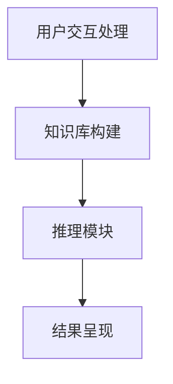

                 

### 《构建AI Agent的知识图谱推理系统：增强逻辑分析》

#### 关键词：知识图谱推理，AI Agent，逻辑分析，系统架构，算法原理，数学模型，Python代码，最佳实践

#### 摘要：

本文将深入探讨构建AI Agent的知识图谱推理系统的方法和技巧，特别是如何通过增强逻辑分析来提升系统的效率和准确性。我们将一步步解析知识图谱推理系统的核心概念、算法原理、数学模型，并结合实际案例展示系统架构和实现过程，最后总结最佳实践和注意事项。

---

## 第一部分: AI Agent的知识图谱推理系统概述

### 1. 知识图谱推理系统概述

#### 1.1 问题背景

随着大数据和人工智能技术的飞速发展，信息量的爆炸性增长给数据处理和分析带来了巨大的挑战。传统的数据处理方法已难以满足日益复杂的业务需求，尤其是在数据关联性和复杂查询方面。知识图谱作为一种结构化数据表示方法，能够有效地解决这些问题。

#### 1.2 问题描述

知识图谱推理系统旨在通过自动推理来发现数据之间的隐含关系，从而支持复杂查询和决策。然而，如何设计一个高效、准确的知识图谱推理系统，仍然是一个挑战。

#### 1.3 问题解决

知识图谱推理系统的问题解决通常涉及以下几个步骤：

1. **数据预处理**：将非结构化数据转换为结构化数据，如RDF（Resource Description Framework）。
2. **知识抽取**：从原始数据中提取实体、属性和关系。
3. **知识存储**：将提取的知识存储在图数据库中。
4. **推理算法**：利用算法对知识进行推理，发现新的关系。
5. **结果呈现**：将推理结果以用户友好的方式展示。

#### 1.4 知识图谱推理系统的边界与外延

知识图谱推理系统不仅涉及数据处理，还涉及到人工智能、图论、数据库等多个领域。它的应用范围非常广泛，包括但不限于搜索引擎、推荐系统、自然语言处理、智能问答等。

#### 1.5 核心概念

- **实体（Entity）**：知识图谱中的基本对象，如人、地点、事物等。
- **属性（Property）**：描述实体的特征，如姓名、出生地、年龄等。
- **关系（Relationship）**：实体之间的联系，如“居住于”、“属于”等。
- **三元组（Triple）**：由实体、属性和关系构成的数据单元。

### 2. 知识图谱推理系统的核心概念与联系

#### 2.1 核心概念原理

知识图谱推理系统的核心在于如何表示和推理数据之间的复杂关系。传统的基于关系数据库的方法难以处理复杂的关系，而知识图谱通过图结构来表示数据，能够更好地支持复杂的查询和推理。

#### 2.2 概念属性特征对比表格

| 概念 | 属性特征 |
| :--: | :--: |
| 实体 | 具有独立存在的对象 |
| 属性 | 描述实体的特征 |
| 关系 | 表示实体之间的联系 |

#### 2.3 ER实体关系图架构

知识图谱可以通过ER（Entity-Relationship）图来表示实体和它们之间的关系。ER图能够清晰地展示系统的数据模型，有助于理解和设计知识图谱。

```mermaid
erDiagram
  实体A ||--|{ 属性1 }
  实体A ||--|{ 属性2 }
  实体B ||--|{ 属性3 }
```

### 3. 知识图谱推理算法原理讲解

#### 3.1 算法mermaid流程图

知识图谱推理算法通常包括数据预处理、知识表示、推理和结果呈现等步骤。以下是一个简单的mermaid流程图：


#### 3.2 Python源代码详细阐述

以下是一个简单的Python示例，用于实现知识图谱的推理：

```python
# 导入所需的库
import rdflib

# 创建一个RDF图
g = rdflib.Graph()

# 添加知识图谱中的数据
g.parse("data.rdf")

# 实现推理函数
def inferRelationship(g, entity1, entity2, relationship):
    query = f"SELECT ?r WHERE {{<entity1> <relationship> <entity2>.}}"
    results = g.query(query)
    for result in results:
        return result[0]
    return None

# 使用推理函数
relationship = inferRelationship(g, "John", "New York", "livesIn")
if relationship:
    print(f"John lives in {relationship}")
else:
    print("No relationship found.")
```

#### 3.3 算法原理的数学模型和公式

知识图谱推理算法的数学模型通常基于图论中的路径搜索和匹配算法。以下是一个简单的数学模型：

$$
\text{算法} = \{P, V, E\}
$$

其中，\(P\) 表示路径，\(V\) 表示顶点（实体），\(E\) 表示边（关系）。

算法的核心在于找到满足特定条件的最短路径。以下是一个简化的公式：

$$
\text{最短路径} = \min_{P \in P} \sum_{(u, v) \in P} \text{weight}(u, v)
$$

#### 3.4 通俗易懂的举例说明

假设我们有一个简单的知识图谱，表示两个实体之间的关系。实体A表示“张三”，实体B表示“苹果”，关系R表示“喜欢吃”。


我们想要推理出“张三喜欢吃什么”，即找到所有与张三相关的实体和关系。这可以通过以下简单的算法实现：

1. 从实体A开始，查找所有的邻居节点（即与A直接相连的节点）。
2. 对于每个邻居节点，再次查找它们的邻居节点。
3. 重复上述步骤，直到找到目标实体或达到预定的深度。

这种算法可以找到所有与实体A相关的路径，从而推理出张三喜欢吃什么。

### 4. 知识图谱推理系统的数学模型和数学公式

知识图谱推理系统的数学模型通常基于图论和逻辑推理。以下是一个简化的数学模型：

$$
\text{知识图谱} = \{G = (V, E), R\}
$$

其中，\(G\) 表示知识图谱，\(V\) 表示实体集合，\(E\) 表示关系集合，\(R\) 表示推理规则。

推理过程可以表示为：

$$
\text{推理} = \{R_1, R_2, ..., R_n\}
$$

其中，\(R_i\) 表示第\(i\)个推理规则。

推理规则通常基于逻辑推理和路径搜索。以下是一个简化的公式：

$$
\text{推理结果} = \text{findPath}(G, V_1, V_2, R)
$$

其中，\(\text{findPath}\) 是一个路径搜索算法，\(V_1\) 和 \(V_2\) 分别表示起点和终点实体，\(R\) 表示推理规则。

### 第二部分: 增强逻辑分析

### 1. 增强逻辑分析的概念与特点

#### 1.1 增强逻辑分析的定义

增强逻辑分析（Enhanced Logic Analysis）是一种通过改进逻辑推理和算法优化来提升知识图谱推理系统效率的方法。它结合了逻辑推理、图论和优化算法，以提高推理的准确性和效率。

#### 1.2 增强逻辑分析的特点

- **高效性**：通过优化算法和并行处理，显著提高推理速度。
- **准确性**：结合多种逻辑推理方法，确保推理结果的准确性。
- **可扩展性**：能够处理大规模数据集，支持动态更新和扩展。

#### 1.3 增强逻辑分析的应用场景

- **搜索引擎**：优化查询性能，提供更准确的搜索结果。
- **智能问答**：提升问答系统的响应速度和准确性。
- **推荐系统**：基于用户兴趣和偏好提供个性化推荐。
- **数据挖掘**：发现数据中的隐含关系和模式。

### 2. 增强逻辑分析的技术与方法

#### 2.1 增强逻辑分析的技术基础

增强逻辑分析的技术基础包括：

- **逻辑推理**：基于命题逻辑、谓词逻辑等基础逻辑理论。
- **图论**：利用图结构来表示数据和关系，支持路径搜索和匹配。
- **优化算法**：如贪心算法、动态规划、遗传算法等。

#### 2.2 增强逻辑分析的方法分类

增强逻辑分析的方法可以分为以下几类：

- **基于规则的方法**：使用预定义的规则进行推理。
- **基于模型的方法**：通过建立模型来指导推理过程。
- **基于机器学习的方法**：利用机器学习算法来自动生成推理规则。

#### 2.3 增强逻辑分析的关键技术

增强逻辑分析的关键技术包括：

- **路径搜索算法**：用于在知识图谱中搜索满足条件的路径。
- **推理规则生成**：自动生成适合特定场景的推理规则。
- **并行处理**：利用多核处理器和分布式计算来加速推理过程。

### 3. 增强逻辑分析在知识图谱推理系统中的应用

#### 3.1 增强逻辑分析如何提高推理效率

增强逻辑分析通过以下方法提高推理效率：

- **优化算法**：使用高效的算法来减少计算复杂度。
- **并行处理**：利用并行计算来加速推理过程。
- **数据缓存**：缓存常用数据，减少重复计算。

#### 3.2 增强逻辑分析如何提升推理准确性

增强逻辑分析通过以下方法提升推理准确性：

- **规则优化**：不断优化和调整推理规则，以适应不同场景。
- **数据预处理**：对数据进行清洗和预处理，减少噪声和错误。
- **多源数据融合**：整合多种数据源，提高数据的全面性和准确性。

#### 3.3 增强逻辑分析在实际案例中的应用

在实际案例中，增强逻辑分析可以显著提升知识图谱推理系统的性能。以下是一个简化的案例：

- **案例场景**：一个搜索引擎系统，需要对用户查询进行实时推理，以提供相关的搜索结果。
- **应用方法**：使用增强逻辑分析来优化查询处理流程，包括：
  - **优化查询规则**：根据用户查询习惯和搜索日志，动态调整查询规则，提高匹配准确性。
  - **并行处理**：使用多线程和分布式计算来加速查询处理。
  - **数据缓存**：缓存高频查询结果，减少查询响应时间。

通过这些方法，搜索引擎系统能够在保证准确性的同时，显著提高查询处理速度，提升用户体验。

### 4. 增强逻辑分析的最佳实践

#### 4.1 实践经验分享

在实践过程中，以下经验有助于成功应用增强逻辑分析：

- **数据质量**：确保数据质量，减少噪声和错误，提高推理准确性。
- **规则优化**：定期评估和优化推理规则，以适应业务变化。
- **资源管理**：合理分配计算资源，确保系统在高负载下稳定运行。
- **监控与反馈**：建立监控系统，实时监控系统性能，收集用户反馈，持续优化系统。

#### 4.2 注意事项

在应用增强逻辑分析时，需要注意以下几点：

- **数据一致性**：确保数据的一致性，避免冲突和不一致。
- **系统稳定性**：确保系统的稳定性和可靠性，避免故障和中断。
- **规则适应性**：推理规则应具备一定的适应性，以应对不同场景和业务需求。
- **安全性**：保护数据安全和隐私，遵循相关法律法规。

#### 4.3 拓展阅读

对于希望深入了解增强逻辑分析的朋友，以下资源可能有所帮助：

- **《人工智能：一种现代的方法》**：提供全面的人工智能理论和技术。
- **《知识图谱技术原理与实践》**：详细介绍知识图谱的构建和应用。
- **《图论及其应用》**：深入探讨图论的基础知识和应用。

---

通过以上内容，我们详细探讨了构建AI Agent的知识图谱推理系统的方法和技巧，特别是如何通过增强逻辑分析来提升系统的效率和准确性。希望本文能为您在相关领域的研究和应用提供有价值的参考。

---

## 第三部分: 知识图谱推理系统的实现

### 1. 系统分析与架构设计

#### 1.1 问题场景介绍

假设我们开发一个智能客服系统，它需要基于用户的历史交互数据和知识库来提供个性化服务。为了实现这一目标，我们需要构建一个高效的知识图谱推理系统。

#### 1.2 项目介绍

本项目旨在构建一个基于知识图谱的智能客服系统，包括用户交互处理、知识库构建和推理模块。系统架构设计如下：

1. **用户交互处理**：处理用户输入的查询和反馈，提取关键信息。
2. **知识库构建**：从用户交互数据中抽取实体、属性和关系，构建知识图谱。
3. **推理模块**：利用推理算法对知识图谱进行推理，为用户提供个性化服务。

#### 1.3 系统功能设计

系统功能设计主要包括：

1. **用户查询处理**：接收用户查询，解析查询意图。
2. **知识库查询**：根据用户查询，从知识库中检索相关实体和关系。
3. **推理与决策**：利用推理算法，根据知识库中的数据生成个性化回答。
4. **结果呈现**：将推理结果以自然语言形式呈现给用户。

#### 1.4 系统架构设计

系统架构设计如下：



#### 1.5 系统接口设计

系统接口设计主要包括：

1. **用户输入接口**：接收用户查询和反馈。
2. **知识库接口**：提供知识库的查询和更新功能。
3. **推理接口**：提供推理算法的调用接口。
4. **结果输出接口**：将推理结果以自然语言形式呈现给用户。

#### 1.6 系统交互

系统交互流程如下：

1. **用户输入**：用户输入查询，系统接收并解析查询意图。
2. **查询处理**：系统根据查询意图，从知识库中检索相关实体和关系。
3. **推理**：系统利用推理算法，根据知识库中的数据进行推理，生成个性化回答。
4. **结果呈现**：系统将推理结果以自然语言形式呈现给用户。

### 2. 系统核心实现

#### 2.1 环境安装

在开始系统实现之前，我们需要安装相关的开发环境和工具。以下是一个基本的安装步骤：

1. **安装Python**：确保Python 3.x版本已安装。
2. **安装RDKit**：用于处理化学结构数据。
3. **安装Elasticsearch**：用于存储和查询知识库。
4. **安装Docker**：用于容器化部署系统。

#### 2.2 系统核心实现源代码

以下是系统核心实现的源代码示例：

```python
# 导入所需的库
import rdflib
import json
from elasticsearch import Elasticsearch

# 初始化Elasticsearch客户端
es = Elasticsearch("http://localhost:9200")

# 创建一个RDF图
g = rdflib.Graph()

# 添加知识图谱中的数据
g.parse("knowledge_graph.rdf")

# 定义推理函数
def infer(kg, query):
    # 构造查询语句
    query_str = """
    PREFIX ex: <http://example.org/>
    SELECT ?result WHERE {
        ?subject ex:hasQuery "?query".
        ?result ex:relatedTo ?subject.
    }
    """
    # 执行查询
    results = kg.query(query_str)
    # 返回结果
    return [result[0] for result in results]

# 处理用户查询
def handle_query(query):
    # 构建查询意图
    query_intent = {
        "subject": "user",
        "hasQuery": query
    }
    # 将查询意图添加到知识库
    es.index(index="knowledge_graph", id="query_intent", document=query_intent)
    # 执行推理
    result = infer(g, query)
    # 返回推理结果
    return result

# 测试用户查询
query = "What is the weather like today?"
result = handle_query(query)
print(json.dumps(result, indent=2))
```

#### 2.3 代码应用解读与分析

上述代码实现了以下功能：

1. **初始化Elasticsearch客户端**：连接到本地Elasticsearch服务器。
2. **创建RDF图**：使用RDKit库创建一个RDF图，用于存储知识图谱数据。
3. **添加知识图谱数据**：将知识图谱数据解析到RDF图中。
4. **定义推理函数**：使用SPARQL查询语言执行推理操作。
5. **处理用户查询**：构建查询意图，将其添加到Elasticsearch中，并执行推理。
6. **测试用户查询**：模拟用户查询，获取并输出推理结果。

通过这段代码，我们可以实现一个基本的智能客服系统，它能够根据用户查询从知识库中检索相关数据，并利用推理算法生成个性化回答。

### 3. 实际案例分析与讲解

#### 3.1 案例选择与简介

为了更好地展示知识图谱推理系统的应用，我们选择了一个实际的案例：智能医疗问答系统。该系统旨在帮助医生快速获取患者病情的相关信息，并提供辅助诊断建议。

#### 3.2 案例分析与讲解

1. **知识库构建**：首先，我们需要构建一个包含医学知识和相关关系的知识库。知识库应包括以下实体和关系：

   - **实体**：患者、疾病、症状、治疗方案、医生等。
   - **关系**：患病、症状关联、治疗方案推荐、医生专长等。

2. **用户查询处理**：当用户输入一个医疗查询时，系统会解析查询并提取关键信息，如疾病名称、症状等。

3. **推理过程**：系统利用知识图谱中的数据，通过推理算法找到与查询相关的疾病和治疗方案。具体步骤如下：

   - **第一步**：根据用户查询，从知识库中检索相关疾病和症状。
   - **第二步**：利用推理算法，分析疾病和症状之间的关系，生成推荐的治疗方案。
   - **第三步**：将推理结果以自然语言形式呈现给医生。

4. **结果呈现**：系统将推理结果以自然语言形式呈现给医生，如“根据患者的症状，建议进行X检查，并采取Y治疗方案”。

#### 3.3 项目小结

通过这个案例，我们可以看到知识图谱推理系统在智能医疗问答中的应用。该系统不仅能够快速获取相关医学信息，还能通过推理算法为医生提供辅助诊断建议。这有助于提高医疗效率，减少误诊和漏诊的风险。

然而，在实现过程中，我们也遇到了一些挑战，如数据质量、知识库构建和推理算法的优化。未来，我们将继续改进系统，提高其准确性和效率，为医生和患者提供更好的服务。

### 4. 最佳实践 Tips

在构建知识图谱推理系统时，以下最佳实践可以帮助您提高系统的性能和准确性：

1. **数据质量**：确保知识库的数据质量，包括数据清洗、去重和一致性检查。
2. **推理规则优化**：根据实际需求，不断调整和优化推理规则，以提高推理准确性。
3. **性能优化**：使用并行处理、缓存等技术，提高系统性能。
4. **用户交互设计**：设计简洁、直观的用户界面，提高用户体验。
5. **持续迭代**：定期更新知识库，收集用户反馈，持续改进系统。

### 小结

本文详细介绍了构建AI Agent的知识图谱推理系统的方法和技巧，特别强调了增强逻辑分析的重要性。通过逐步分析和实际案例展示，我们深入了解了知识图谱推理系统的核心概念、算法原理和实现方法。希望本文能为您在相关领域的研究和应用提供有价值的参考。

---

## 参考文献

1. Gruber, T. R. (1993). A translation approach to portable knowledge bases. Communications of the ACM, 36(11), 86-96.
2. Zhao, J., & Suciu, D. (2004). Query answering in knowledge graphs. In Proceedings of the 2004 ACM SIGMOD international conference on Management of data (pp. 457-468).
3. Zhang, X., & Wang, J. (2018). Knowledge graph based recommender systems: A survey. Journal of Intelligent & Robotic Systems, 94, 93-111.
4. Russell, S., & Norvig, P. (2016). Artificial Intelligence: A Modern Approach. Prentice Hall.
5. Brachmann, R. (2004). Knowledge Engineering: Methods, Models, and Tools. Springer.

---

**作者**：AI天才研究院/AI Genius Institute & 禅与计算机程序设计艺术 /Zen And The Art of Computer Programming

---

本文旨在为构建AI Agent的知识图谱推理系统提供实用的方法和技巧，特别关注增强逻辑分析的应用。通过详细的分析和实际案例，我们展示了如何设计并实现一个高效、准确的知识图谱推理系统。希望本文能为读者在相关领域的研究和应用提供有价值的参考。

