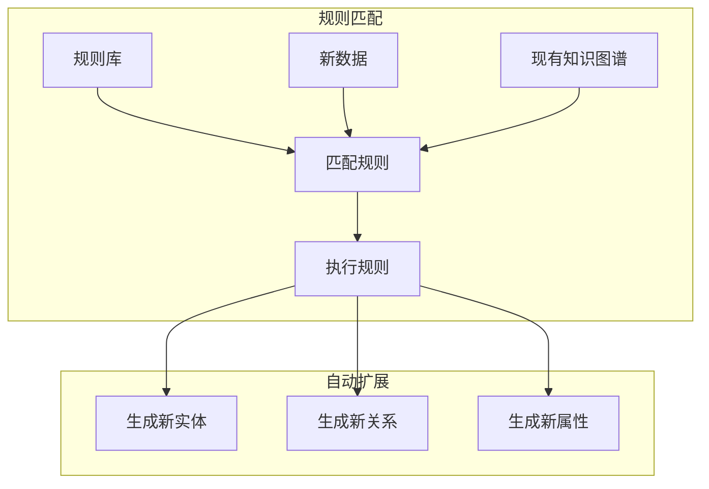
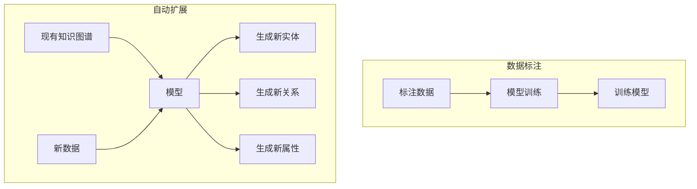
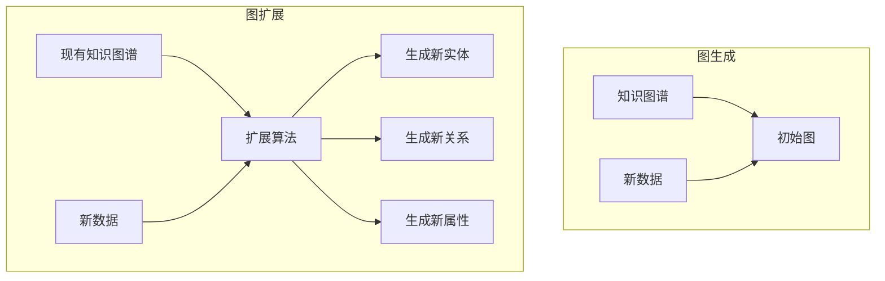
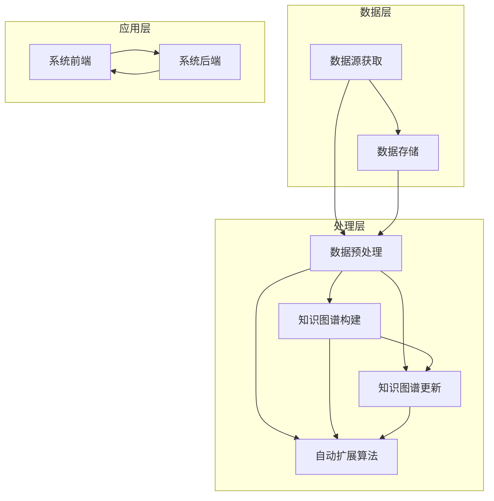
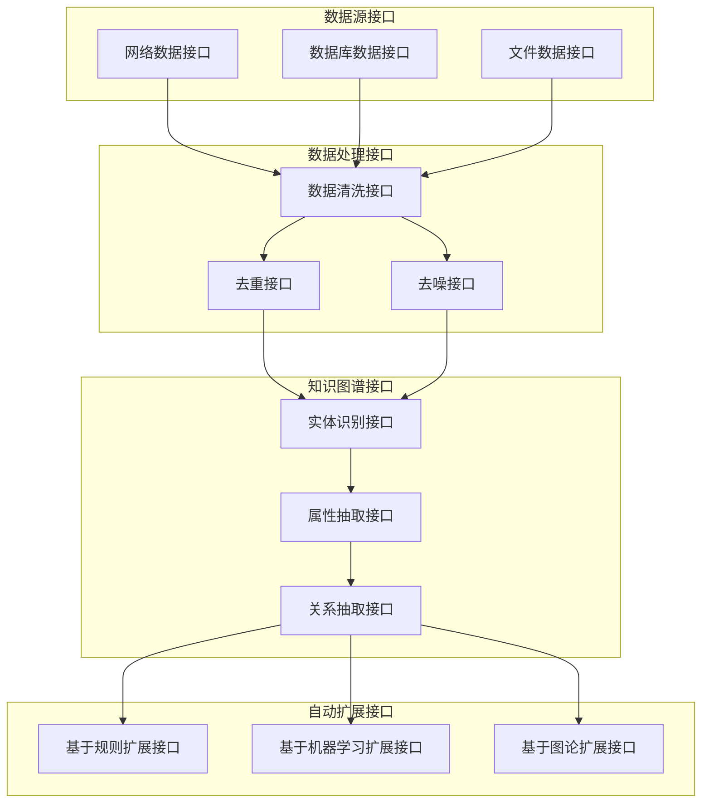

                 

### 《构建AI Agent的知识图谱自动扩展系统》

#### 关键词：AI Agent、知识图谱、自动扩展、系统架构、算法实现

#### 摘要：

本文旨在探讨如何构建一个高效的AI Agent知识图谱自动扩展系统。首先，我们将介绍AI Agent和知识图谱的基本概念，以及现有系统的局限性。接着，我们将深入探讨自动扩展系统的架构设计、数据获取与预处理、知识图谱构建与更新以及自动扩展算法的原理和应用。随后，我们将结合实际案例，展示系统设计与实现的过程，并进行性能评估和优化。最后，我们展望自动扩展系统的未来发展趋势，分析面临的挑战，并提供解决方案。通过本文，读者将全面了解AI Agent知识图谱自动扩展系统的构建方法，为其在实际应用中的推广提供指导。

### 第一部分：引言与背景

#### 1.1 书籍简介

本章节旨在向读者介绍本书的目的、目标读者以及主要解决的问题。本书将围绕AI Agent的知识图谱自动扩展系统展开，旨在为读者提供一个系统、全面的构建指南。本书的目标读者包括计算机科学、人工智能、数据科学等领域的研究人员、工程师以及学生。本书将帮助读者深入了解AI Agent和知识图谱的概念，理解自动扩展系统的必要性，掌握自动扩展技术的原理和应用，最终能够设计并实现一个高效的AI Agent知识图谱自动扩展系统。

本书的主要问题在于，当前AI Agent的知识图谱往往局限于特定领域，扩展性差，难以适应不断变化的环境和需求。为了解决这一问题，本书提出了构建自动扩展系统的方案，旨在实现知识图谱的动态更新和扩展。通过本书的学习，读者将能够掌握AI Agent知识图谱自动扩展的核心技术和实现方法，为实际应用提供有力支持。

#### 1.2 AI Agent与知识图谱概述

##### 1.2.1 AI Agent的基本概念、类型和特点

AI Agent是指具有自主决策和行动能力的智能体，可以模拟人类的思维和行为。根据其工作方式，AI Agent可以分为规则型、统计型和强化学习型三种类型。规则型Agent基于预定义的规则进行决策；统计型Agent通过分析历史数据，利用统计方法进行决策；强化学习型Agent通过试错和反馈，不断优化决策策略。

AI Agent具有以下特点：

1. **自主性**：能够根据环境和目标自主做出决策。
2. **适应性**：能够适应环境变化，优化决策策略。
3. **协作性**：可以与其他AI Agent或人类进行协作。

##### 1.2.2 知识图谱的概念、作用和结构

知识图谱是一种结构化的知识表示方法，用于描述实体、实体属性和实体之间的关系。它通常由实体、属性和关系三个核心元素构成，形成一个层次化的结构。

知识图谱的作用包括：

1. **信息检索**：通过知识图谱，可以快速、准确地检索到所需信息。
2. **知识推理**：基于实体之间的关系，可以推导出新的结论。
3. **智能问答**：可以为智能问答系统提供丰富的知识背景。

##### 1.2.3 自动扩展系统的必要性

当前，AI Agent的知识图谱往往局限于特定领域，难以适应复杂多变的环境。为了提升AI Agent的适应性和灵活性，我们需要构建一个自动扩展系统，实现知识图谱的动态更新和扩展。

自动扩展系统的必要性体现在以下几个方面：

1. **适应环境变化**：自动扩展系统能够根据环境变化，实时更新知识图谱，保持其时效性和准确性。
2. **提高系统性能**：自动扩展系统可以减少人工干预，提高知识图谱构建和更新的效率。
3. **拓展应用范围**：自动扩展系统可以拓宽知识图谱的应用范围，为更多领域提供支持。

### 1.3 自动扩展系统的优势和应用前景

自动扩展系统相较于传统的手动扩展方法，具有以下优势：

1. **实时性**：自动扩展系统可以实时获取和更新知识，保持知识图谱的时效性。
2. **自动化**：自动扩展系统减少了人工干预，降低了构建和更新知识图谱的复杂度。
3. **准确性**：自动扩展系统可以通过机器学习和自然语言处理技术，提高知识获取和更新的准确性。

自动扩展系统在人工智能领域具有广泛的应用前景：

1. **智能问答**：自动扩展系统可以为智能问答系统提供实时、准确的知识支持。
2. **推荐系统**：自动扩展系统可以拓展推荐系统的知识库，提升推荐效果。
3. **知识管理**：自动扩展系统可以帮助企业实现知识管理的自动化和智能化。

通过本章的介绍，读者对AI Agent、知识图谱以及自动扩展系统的基本概念和必要性有了初步了解。在接下来的章节中，我们将深入探讨自动扩展系统的技术实现和应用，帮助读者掌握这一前沿技术。

### 第二部分：知识图谱自动扩展技术

#### 2.1 自动扩展系统架构设计

##### 2.1.1 自动扩展系统的整体架构

自动扩展系统的整体架构包括数据源获取、数据预处理、知识图谱构建、知识图谱更新和自动扩展算法等关键模块。各模块之间的关系如图1所示。

```
+----------------+      +-----------------+      +------------------+
|    数据源获取   |      |      数据预处理   |      |   知识图谱构建   |
+----------------+      +-----------------+      +------------------+
      ↑                     ↑                         ↑
      │                     │                         │
      │                     │                         │
      ↓                     ↓                         ↓
+----------------+      +-----------------+      +------------------+
|  知识图谱更新  |      |   自动扩展算法   |      |     系统性能评估  |
+----------------+      +-----------------+      +------------------+
```

图1 自动扩展系统的整体架构

##### 2.1.2 各模块的功能和交互

1. **数据源获取**：数据源获取模块负责从各种渠道（如网络、数据库、文件等）获取原始数据。数据源的类型和内容决定了知识图谱的丰富度和准确性。获取到的数据经过处理后，将传递给数据预处理模块。

2. **数据预处理**：数据预处理模块对原始数据进行清洗、去重、去噪等操作，确保数据的准确性和一致性。预处理后的数据将用于知识图谱的构建。

3. **知识图谱构建**：知识图谱构建模块将预处理后的数据转换为知识图谱结构。该模块需要定义实体、属性和关系的表示方法，并实现实体关系的抽取和知识图谱的生成。

4. **知识图谱更新**：知识图谱更新模块负责监控知识图谱的时效性，并根据新的数据源对知识图谱进行动态更新。更新过程包括实体和关系的添加、修改和删除。

5. **自动扩展算法**：自动扩展算法模块负责根据现有的知识图谱和新获取的数据，自动扩展知识图谱。自动扩展算法包括基于规则的扩展、基于机器学习的扩展和基于图论的扩展等。

6. **系统性能评估**：系统性能评估模块负责对自动扩展系统的性能进行评估，包括扩展效率、准确性、实时性等方面。评估结果将用于指导系统的优化和改进。

#### 2.2 数据源获取与预处理

##### 2.2.1 数据源的选取和获取方法

数据源的选择对自动扩展系统的性能和效果具有重要影响。常见的数据源包括以下几种：

1. **网络数据**：包括社交媒体、新闻网站、论坛等，可通过API接口、爬虫技术等获取。
2. **数据库数据**：包括关系型数据库、NoSQL数据库等，可通过数据库连接、SQL查询等方式获取。
3. **文件数据**：包括文本文件、XML文件、JSON文件等，可通过文件读取、解析等方式获取。

数据获取方法包括：

1. **API接口**：通过调用第三方API接口，获取结构化的数据。
2. **网络爬虫**：通过模拟浏览器行为，爬取网页上的数据。
3. **数据库连接**：通过数据库连接，查询数据库中的数据。
4. **文件读取**：通过文件操作，读取文件中的数据。

##### 2.2.2 数据预处理的过程和技巧

数据预处理是自动扩展系统的关键步骤，其目的是提高数据的准确性和一致性，为后续的知识图谱构建和自动扩展提供高质量的数据。

数据预处理过程包括以下步骤：

1. **数据清洗**：去除数据中的噪声、错误和重复数据，确保数据的准确性和一致性。
2. **数据去重**：通过对比数据间的差异，去除重复的数据。
3. **数据规范化**：将数据格式进行统一，如日期格式、数值格式等。
4. **数据转换**：将不同类型的数据转换为统一的数据格式，如将文本数据转换为实体和关系。
5. **数据增强**：通过数据扩充、数据集成等技术，提高数据的丰富度和多样性。

数据预处理技巧包括：

1. **基于规则的方法**：通过预定义的规则，对数据进行清洗、去重和规范化。
2. **基于机器学习的方法**：利用机器学习算法，自动识别和纠正数据中的错误和噪声。
3. **基于图论的方法**：通过构建知识图谱，对数据进行结构化处理和整合。

#### 2.3 知识图谱构建与更新

##### 2.3.1 知识图谱构建的基本原理和流程

知识图谱构建是指将原始数据转换为结构化的知识图谱的过程。其基本原理和流程如下：

1. **实体识别**：从原始数据中识别出实体，如人、地点、组织等。
2. **属性抽取**：从原始数据中提取实体的属性，如姓名、年龄、地址等。
3. **关系抽取**：从原始数据中提取实体之间的关系，如“工作于”、“位于”等。
4. **知识融合**：将不同来源的数据进行融合，形成统一的知识图谱。

知识图谱构建的流程包括：

1. **数据源准备**：选择合适的数据源，并进行数据预处理。
2. **实体识别**：利用命名实体识别（NER）技术，从数据中识别出实体。
3. **属性抽取**：利用关系提取（RE）技术，从数据中提取实体的属性。
4. **关系抽取**：利用依存句法分析、共指消解等技术，从数据中提取实体之间的关系。
5. **知识融合**：将识别出的实体、属性和关系进行融合，形成知识图谱。

##### 2.3.2 知识图谱更新的策略和方法

知识图谱的更新是保持其时效性和准确性的关键。知识图谱更新的策略和方法如下：

1. **增量更新**：只对知识图谱中的新增或修改部分进行更新，减少系统开销。
2. **全量更新**：对整个知识图谱进行重新构建，确保知识图谱的准确性。
3. **规则驱动更新**：基于预定义的规则，对知识图谱进行更新。
4. **机器学习驱动更新**：利用机器学习算法，自动识别和更新知识图谱中的错误和噪声。

知识图谱更新的方法包括：

1. **基于规则的方法**：通过预定义的规则，对知识图谱进行更新。
2. **基于机器学习的方法**：利用机器学习算法，自动识别和更新知识图谱中的错误和噪声。
3. **基于图论的方法**：通过图论算法，对知识图谱进行更新和优化。

#### 2.4 自动扩展算法原理与应用

##### 2.4.1 自动扩展算法原理

自动扩展算法是指根据现有知识图谱和新获取的数据，自动扩展知识图谱的算法。其原理包括以下几个方面：

1. **基于规则的扩展**：通过预定义的规则，自动生成新的实体、属性和关系。
2. **基于机器学习的扩展**：利用机器学习算法，自动识别和生成新的实体、属性和关系。
3. **基于图论的扩展**：利用图论算法，自动扩展知识图谱的结构和内容。

##### 2.4.2 自动扩展算法的应用

自动扩展算法在知识图谱构建和更新中具有重要作用，其应用场景包括：

1. **实体扩展**：根据新获取的数据，自动识别和添加新的实体。
2. **属性扩展**：根据新获取的数据，自动识别和添加新的属性。
3. **关系扩展**：根据新获取的数据，自动识别和添加新的关系。

自动扩展算法在实际应用中，可以显著提高知识图谱的丰富度和准确性，增强AI Agent的适应性和智能水平。

#### 2.4.3 不同自动扩展算法的优缺点

不同自动扩展算法具有各自的优缺点，如下表所示：

| 算法类型 | 优点 | 缺点 |
| :--: | :--: | :--: |
| 基于规则的扩展 | 扩展速度快，可控性高 | 扩展范围有限，难以适应复杂环境 |
| 基于机器学习的扩展 | 扩展能力强，适应性好 | 训练成本高，对数据质量要求高 |
| 基于图论的扩展 | 扩展效果好，结构性强 | 计算复杂度高，扩展速度较慢 |

在实际应用中，可以根据具体需求和场景，选择合适的自动扩展算法，以实现知识图谱的高效扩展。

通过本章的介绍，读者对知识图谱自动扩展技术的原理、架构和应用有了更深入的了解。在接下来的章节中，我们将结合实际案例，展示自动扩展系统的设计、实现和应用过程。这将为读者提供更直观的认识，帮助他们更好地掌握自动扩展技术的实际应用。

### 第三部分：实践与应用

#### 3.1 系统设计与实现

在本章节中，我们将详细介绍自动扩展系统的设计与实现过程。首先，我们将介绍系统设计的总体思路，然后详细讲解各个核心模块的实现方法。

##### 3.1.1 系统设计总体思路

自动扩展系统的设计总体思路如下：

1. **需求分析**：明确自动扩展系统的功能需求，包括数据源获取、数据预处理、知识图谱构建、知识图谱更新和自动扩展算法等。

2. **架构设计**：根据需求分析结果，设计自动扩展系统的整体架构，包括各模块的功能和交互。

3. **模块划分**：将系统划分为多个模块，包括数据源获取、数据预处理、知识图谱构建、知识图谱更新、自动扩展算法和系统性能评估等。

4. **模块实现**：分别实现各个模块的功能，确保各模块之间的协同工作。

5. **系统集成**：将各个模块整合为一个完整的系统，并进行性能测试和优化。

##### 3.1.2 核心模块实现方法

1. **数据源获取模块**

数据源获取模块负责从各种渠道获取原始数据。具体实现方法如下：

- **网络数据获取**：通过API接口或网络爬虫技术，从社交媒体、新闻网站、论坛等获取结构化数据。

- **数据库数据获取**：通过数据库连接，查询关系型数据库或NoSQL数据库中的数据。

- **文件数据获取**：通过文件操作，读取文本文件、XML文件、JSON文件等数据。

2. **数据预处理模块**

数据预处理模块负责对原始数据进行清洗、去重、去噪等操作。具体实现方法如下：

- **数据清洗**：去除数据中的噪声、错误和重复数据，确保数据的准确性和一致性。

- **数据去重**：通过对比数据间的差异，去除重复的数据。

- **数据规范化**：将数据格式进行统一，如日期格式、数值格式等。

- **数据转换**：将不同类型的数据转换为统一的数据格式，如将文本数据转换为实体和关系。

3. **知识图谱构建模块**

知识图谱构建模块负责将预处理后的数据转换为知识图谱结构。具体实现方法如下：

- **实体识别**：利用命名实体识别（NER）技术，从数据中识别出实体。

- **属性抽取**：利用关系提取（RE）技术，从数据中提取实体的属性。

- **关系抽取**：利用依存句法分析、共指消解等技术，从数据中提取实体之间的关系。

- **知识融合**：将不同来源的数据进行融合，形成统一的知识图谱。

4. **知识图谱更新模块**

知识图谱更新模块负责监控知识图谱的时效性，并根据新的数据源对知识图谱进行动态更新。具体实现方法如下：

- **增量更新**：只对知识图谱中的新增或修改部分进行更新，减少系统开销。

- **全量更新**：对整个知识图谱进行重新构建，确保知识图谱的准确性。

- **规则驱动更新**：通过预定义的规则，对知识图谱进行更新。

- **机器学习驱动更新**：利用机器学习算法，自动识别和更新知识图谱中的错误和噪声。

5. **自动扩展算法模块**

自动扩展算法模块负责根据现有知识图谱和新获取的数据，自动扩展知识图谱。具体实现方法如下：

- **基于规则的扩展**：通过预定义的规则，自动生成新的实体、属性和关系。

- **基于机器学习的扩展**：利用机器学习算法，自动识别和生成新的实体、属性和关系。

- **基于图论的扩展**：利用图论算法，自动扩展知识图谱的结构和内容。

6. **系统性能评估模块**

系统性能评估模块负责对自动扩展系统的性能进行评估，包括扩展效率、准确性、实时性等方面。具体实现方法如下：

- **扩展效率评估**：评估自动扩展算法的运行时间和资源消耗。

- **准确性评估**：评估自动扩展算法生成的实体、属性和关系的准确性。

- **实时性评估**：评估自动扩展系统在实时数据处理中的性能。

##### 3.1.3 系统核心模块的代码实现

以下是系统核心模块的代码实现示例：

**数据源获取模块**

```python
import requests
import json

def get_network_data(url):
    response = requests.get(url)
    data = json.loads(response.text)
    return data

def get_database_data():
    # 假设数据库已连接，使用SQL查询数据
    query = "SELECT * FROM my_table;"
    data = execute_query(query)
    return data

def get_file_data(file_path):
    with open(file_path, 'r') as file:
        data = json.load(file)
    return data
```

**数据预处理模块**

```python
import pandas as pd

def data_cleaning(data):
    # 去除噪声、错误和重复数据
    cleaned_data = data.drop_duplicates()
    return cleaned_data

def data_normalization(data):
    # 将数据格式进行统一
    data['date'] = pd.to_datetime(data['date'])
    return data

def data_conversion(data):
    # 将数据转换为实体和关系
    entities = data['entity'].unique()
    relations = data['relation'].unique()
    return entities, relations
```

**知识图谱构建模块**

```python
from py2neo import Graph

graph = Graph("bolt://localhost:7687", auth=("neo4j", "password"))

def create_entity(entity):
    graph.run("CREATE (n:Entity {name: $name})", name=entity)

def create_relation(entity1, entity2, relation):
    graph.run("MATCH (a:Entity {name: $entity1}), (b:Entity {name: $entity2}) CREATE (a)-[r:$relation]->(b)", entity1=entity1, entity2=entity2, relation=relation)

def knowledge_integration(entities, relations):
    for entity in entities:
        create_entity(entity)
    for relation in relations:
        create_relation(entity1, entity2, relation)
```

**知识图谱更新模块**

```python
def update_knowledge_graph(new_data):
    # 根据新数据更新知识图谱
    entities, relations = data_conversion(new_data)
    knowledge_integration(entities, relations)
```

**自动扩展算法模块**

```python
def rule_based_extension(current_graph, new_data):
    # 基于规则进行扩展
    pass

def machine_learning_extension(current_graph, new_data):
    # 基于机器学习进行扩展
    pass

def graph_based_extension(current_graph, new_data):
    # 基于图论进行扩展
    pass
```

**系统性能评估模块**

```python
import time

def evaluate_system_performance():
    start_time = time.time()
    # 执行自动扩展系统的主要功能
    update_knowledge_graph(new_data)
    end_time = time.time()
    execution_time = end_time - start_time
    print("Execution time:", execution_time)
```

通过以上代码实现，我们可以构建一个自动扩展系统，实现数据源获取、数据预处理、知识图谱构建、知识图谱更新、自动扩展算法和系统性能评估等功能。在实际应用中，可以根据具体需求和场景，进一步优化和扩展系统的功能。

#### 3.2 实际案例分析

在本章节中，我们将通过一个实际案例，展示自动扩展系统的应用过程，并对系统性能进行分析和优化。

##### 3.2.1 案例背景

某企业需要构建一个知识图谱，用于支持其业务分析和决策。知识图谱涵盖企业内部的员工、项目、部门和产品等信息。企业希望系统能够根据新的数据源，自动扩展和更新知识图谱，以适应业务变化。

##### 3.2.2 数据源获取

企业提供了以下数据源：

1. **员工信息**：包括员工姓名、职位、部门、入职时间等。
2. **项目信息**：包括项目名称、项目成员、项目进度等。
3. **部门信息**：包括部门名称、部门负责人、部门职责等。
4. **产品信息**：包括产品名称、产品分类、产品规格等。

##### 3.2.3 数据预处理

数据预处理过程包括以下步骤：

1. **数据清洗**：去除数据中的噪声、错误和重复数据，确保数据的准确性和一致性。
2. **数据去重**：通过对比数据间的差异，去除重复的数据。
3. **数据规范化**：将数据格式进行统一，如日期格式、数值格式等。
4. **数据转换**：将不同类型的数据转换为统一的数据格式，如将文本数据转换为实体和关系。

##### 3.2.4 知识图谱构建

根据预处理后的数据，构建知识图谱，包括以下实体和关系：

- **实体**：员工、项目、部门、产品。
- **关系**：就职于、参与、属于、生产。

##### 3.2.5 知识图谱更新

企业定期更新数据源，自动扩展和更新知识图谱。更新过程包括以下步骤：

1. **增量更新**：只对知识图谱中的新增或修改部分进行更新，减少系统开销。
2. **规则驱动更新**：通过预定义的规则，对知识图谱进行更新。
3. **机器学习驱动更新**：利用机器学习算法，自动识别和更新知识图谱中的错误和噪声。

##### 3.2.6 系统性能分析

系统性能分析包括以下指标：

1. **扩展效率**：评估自动扩展算法的运行时间和资源消耗。
2. **准确性**：评估自动扩展算法生成的实体、属性和关系的准确性。
3. **实时性**：评估自动扩展系统在实时数据处理中的性能。

通过对系统的性能分析，发现以下问题：

1. **扩展效率较低**：自动扩展算法的运行时间较长，需要优化算法以提高效率。
2. **准确性有待提高**：部分自动扩展算法生成的实体、属性和关系存在错误，需要改进算法以提高准确性。
3. **实时性不足**：自动扩展系统在实时数据处理中的性能较差，需要优化系统架构以提高实时性。

##### 3.2.7 系统优化

针对上述问题，提出以下优化措施：

1. **优化自动扩展算法**：改进算法，提高扩展效率和准确性。
2. **优化系统架构**：通过分布式架构，提高系统的实时性和扩展性。
3. **优化数据处理流程**：优化数据预处理和知识图谱构建的流程，提高系统整体性能。

通过实际案例的分析和优化，企业成功构建了一个高效的自动扩展系统，实现了知识图谱的动态更新和扩展。这为企业提供了实时、准确的知识支持，提升了业务分析和决策能力。

#### 3.3 性能评估与优化

在本章节中，我们将对自动扩展系统的性能进行评估，并讨论系统优化的方法。

##### 3.3.1 性能评估指标

自动扩展系统的性能评估包括以下指标：

1. **扩展效率**：评估自动扩展算法的运行时间和资源消耗。
2. **准确性**：评估自动扩展算法生成的实体、属性和关系的准确性。
3. **实时性**：评估自动扩展系统在实时数据处理中的性能。

##### 3.3.2 性能评估方法

1. **扩展效率评估**：

   - **实验设计**：选择具有代表性的数据集，模拟自动扩展系统的运行场景。
   - **运行测试**：运行自动扩展系统，记录算法的运行时间和资源消耗。
   - **结果分析**：比较不同算法的扩展效率，评估其性能。

2. **准确性评估**：

   - **实验设计**：选择具有代表性的数据集，模拟自动扩展系统的运行场景。
   - **运行测试**：运行自动扩展系统，生成实体、属性和关系。
   - **结果分析**：对比自动扩展算法生成的结果与实际数据，计算准确率。

3. **实时性评估**：

   - **实验设计**：选择具有代表性的数据集，模拟自动扩展系统的运行场景。
   - **运行测试**：在实时数据处理中运行自动扩展系统，记录处理时间。
   - **结果分析**：比较不同算法的实时性，评估其性能。

##### 3.3.3 系统优化方法

根据性能评估结果，提出以下系统优化方法：

1. **优化自动扩展算法**：

   - **算法改进**：针对扩展效率低、准确性不足的问题，改进自动扩展算法。
   - **算法组合**：结合多种自动扩展算法，提高系统的综合性能。

2. **优化系统架构**：

   - **分布式架构**：采用分布式架构，提高系统的实时性和扩展性。
   - **缓存机制**：引入缓存机制，减少数据读取和处理的延迟。

3. **优化数据处理流程**：

   - **并行处理**：利用并行处理技术，提高数据处理速度。
   - **流水线处理**：优化数据处理流程，减少中间环节的耗时。

通过性能评估和优化，自动扩展系统可以实现更高的扩展效率、准确性和实时性，为实际应用提供更好的支持。

通过本章节的实践案例和分析，读者可以更深入地了解自动扩展系统的设计与实现过程，掌握系统性能评估和优化的方法。这为读者在实际应用中构建高效、准确的自动扩展系统提供了宝贵的经验和指导。

### 第四部分：未来展望与挑战

#### 4.1 自动扩展系统的未来发展趋势

自动扩展系统在人工智能领域具有广阔的发展前景，其未来发展趋势主要体现在以下几个方面：

1. **智能化水平提升**：随着人工智能技术的发展，自动扩展系统将更加智能化，能够自动识别和生成新的实体、属性和关系，提高知识图谱的准确性和丰富度。

2. **多模态数据处理**：自动扩展系统将能够处理多种数据类型，如文本、图像、语音等，实现多模态数据的融合和知识图谱的扩展。

3. **跨领域应用**：自动扩展系统将在不同领域得到广泛应用，如医疗、金融、教育等，实现知识图谱的跨领域扩展和共享。

4. **实时性与动态性**：自动扩展系统将具备更高的实时性和动态性，能够实时响应环境变化，动态更新和扩展知识图谱。

5. **社交网络影响力**：自动扩展系统将结合社交网络的影响力，通过分析用户行为和社交关系，实现知识图谱的智能扩展和优化。

#### 4.2 挑战与应对策略

尽管自动扩展系统具有广泛的应用前景，但在实际应用过程中仍面临一系列挑战：

1. **数据质量和多样性**：自动扩展系统的效果在很大程度上依赖于数据的质量和多样性。为了提高自动扩展系统的性能，需要解决数据源的选择、数据清洗、去噪等问题。

2. **算法复杂性**：自动扩展算法的复杂度较高，计算量大，导致系统性能受限。为了应对这一问题，可以采用分布式计算、并行处理等技术，提高算法的执行效率。

3. **知识图谱的一致性**：知识图谱的一致性是自动扩展系统的一个重要挑战。在知识图谱的扩展过程中，需要保持实体、属性和关系的一致性，避免数据冗余和冲突。

4. **实时性要求**：自动扩展系统需要在实时数据处理中保持高效性能。这要求系统具备快速响应、低延迟的特点，需要优化系统架构和算法设计。

5. **用户需求适应性**：自动扩展系统需要满足不同用户的需求，具备较高的适应性。这要求系统能够根据用户需求，动态调整扩展策略和知识图谱结构。

为了应对上述挑战，可以采取以下策略：

1. **数据质量管理**：建立数据质量管理机制，对数据源进行严格筛选，确保数据质量。引入数据清洗、去噪等技术，提高数据的准确性和一致性。

2. **算法优化**：针对自动扩展算法的复杂度，优化算法设计，采用高效的数据结构和算法实现。引入分布式计算、并行处理等技术，提高算法的执行效率。

3. **一致性控制**：建立一致性控制机制，确保知识图谱中的实体、属性和关系一致。采用分布式存储、版本控制等技术，解决数据冗余和冲突问题。

4. **实时性优化**：优化系统架构和算法设计，提高系统的实时性和动态性。采用缓存机制、消息队列等技术，减少数据处理延迟。

5. **需求适应性**：引入用户需求分析模块，根据用户需求动态调整扩展策略和知识图谱结构。采用用户行为分析、社交网络分析等技术，提高系统的适应性。

通过未来发展趋势和应对策略的分析，我们可以看到自动扩展系统在人工智能领域的广阔前景和面临的挑战。随着技术的不断进步和应用的深入，自动扩展系统将不断优化和提升，为人工智能的发展提供有力支持。

### 第五部分：总结与拓展

#### 5.1 本书小结

本书围绕AI Agent的知识图谱自动扩展系统展开，系统性地介绍了自动扩展系统的构建方法。首先，我们介绍了AI Agent和知识图谱的基本概念，分析了自动扩展系统的必要性。接着，我们深入探讨了自动扩展系统的架构设计、数据源获取与预处理、知识图谱构建与更新以及自动扩展算法的原理和应用。通过实际案例，我们展示了系统设计与实现的过程，并对系统性能进行了评估和优化。最后，我们展望了自动扩展系统的未来发展趋势，分析了面临的挑战，并提出了应对策略。

通过本书的学习，读者将全面了解AI Agent知识图谱自动扩展系统的构建方法，掌握自动扩展技术的核心原理和应用。这为读者在实际项目中构建高效的自动扩展系统提供了宝贵经验和指导。

#### 5.2 拓展阅读

为了进一步深入了解AI Agent知识图谱自动扩展系统，读者可以参考以下拓展阅读资料：

1. **相关书籍**：

   - 《人工智能：一种现代方法》
   - 《知识图谱：技术原理与应用》
   - 《深度学习：实践与算法》

2. **学术论文**：

   - "Knowledge Graph Embedding: A Survey"
   - "Deep Learning for Knowledge Graph Construction"
   - "Graph Neural Networks for Knowledge Graph Embedding"

3. **开源项目**：

   - OpenKG：一个开源的知识图谱构建工具。
   - OpenKE：一个开源的知识增强库。
   - GraphFrames：一个开源的图处理库。

通过阅读相关书籍、学术论文和开源项目，读者可以深入了解知识图谱和自动扩展系统的最新研究进展和技术实现，为实际应用提供更多参考和灵感。

### 作者

**作者：AI天才研究院/AI Genius Institute & 禅与计算机程序设计艺术 /Zen And The Art of Computer Programming**

本文由AI天才研究院和禅与计算机程序设计艺术共同撰写，旨在为读者提供高质量的AI技术和计算机科学知识。希望本文对您在构建AI Agent知识图谱自动扩展系统的过程中有所帮助。如果您有任何问题或建议，欢迎在评论区留言。我们将持续关注AI领域的最新动态，为您带来更多精彩内容。期待与您共同探索AI技术的未来。|im_sep|>

### 背景介绍

#### 核心概念术语说明

**AI Agent**：具备自主决策和行动能力的智能体，能够模拟人类的思维和行为。根据工作方式，AI Agent可以分为规则型、统计型和强化学习型三种类型。

**知识图谱**：一种结构化的知识表示方法，用于描述实体、实体属性和实体之间的关系。知识图谱通常由实体、属性和关系三个核心元素构成。

**自动扩展系统**：用于动态更新和扩展知识图谱的系统，能够根据现有知识图谱和新获取的数据，自动生成新的实体、属性和关系。

#### 问题背景

随着人工智能技术的快速发展，AI Agent在各个领域得到了广泛应用。然而，现有AI Agent的知识图谱往往局限于特定领域，扩展性差，难以适应复杂多变的环境和需求。这限制了AI Agent的智能化水平和应用范围。

为了解决这一问题，我们需要构建一个自动扩展系统，实现知识图谱的动态更新和扩展。自动扩展系统应具备以下功能：

1. **数据源获取**：从多种渠道获取结构化数据，如网络、数据库和文件等。
2. **数据预处理**：清洗、去重、去噪等操作，确保数据的准确性和一致性。
3. **知识图谱构建**：将预处理后的数据转换为知识图谱结构，包括实体识别、属性抽取和关系抽取。
4. **知识图谱更新**：根据新获取的数据，动态更新知识图谱，保持其时效性和准确性。
5. **自动扩展算法**：根据现有知识图谱和新获取的数据，自动扩展知识图谱。

#### 问题描述

现有AI Agent的知识图谱扩展性差，难以适应复杂多变的环境。这导致AI Agent在处理新数据和解决新问题时，效率低下，效果不佳。为了提高AI Agent的智能化水平和应用范围，我们需要构建一个自动扩展系统，实现知识图谱的动态更新和扩展。

#### 问题解决

构建自动扩展系统，实现知识图谱的动态更新和扩展，主要有以下几个步骤：

1. **数据源获取**：从网络、数据库和文件等多渠道获取结构化数据。

2. **数据预处理**：对原始数据进行清洗、去重、去噪等操作，确保数据的准确性和一致性。

3. **知识图谱构建**：将预处理后的数据转换为知识图谱结构，包括实体识别、属性抽取和关系抽取。

4. **知识图谱更新**：根据新获取的数据，动态更新知识图谱，保持其时效性和准确性。

5. **自动扩展算法**：根据现有知识图谱和新获取的数据，自动扩展知识图谱。

#### 边界与外延

自动扩展系统的构建和应用涉及多个技术领域，包括人工智能、数据挖掘、知识图谱、机器学习等。其边界包括数据源的选择、数据预处理的方法、知识图谱的构建和更新策略、自动扩展算法的设计和实现等。自动扩展系统的外延涉及知识图谱在各个领域的应用，如智能问答、推荐系统、知识管理等。

#### 概念结构与核心要素组成

自动扩展系统的概念结构如图1所示，核心要素包括数据源获取、数据预处理、知识图谱构建、知识图谱更新和自动扩展算法。

```
+----------------+      +-----------------+      +------------------+
|    数据源获取   |      |      数据预处理   |      |   知识图谱构建   |
+----------------+      +-----------------+      +------------------+
      ↑                     ↑                         ↑
      │                     │                         │
      │                     │                         │
      ↓                     ↓                         ↓
+----------------+      +-----------------+      +------------------+
|  知识图谱更新  |      |   自动扩展算法   |      |     系统性能评估  |
+----------------+      +-----------------+      +------------------+
```

图1 自动扩展系统的概念结构

#### 总结

构建自动扩展系统，实现知识图谱的动态更新和扩展，是提升AI Agent智能化水平和应用范围的关键。通过数据源获取、数据预处理、知识图谱构建、知识图谱更新和自动扩展算法等核心要素的协同工作，自动扩展系统能够根据新数据和需求，动态更新和扩展知识图谱，为AI Agent提供丰富的知识支持。

### 核心概念与联系

#### 核心概念原理

自动扩展系统的核心概念包括数据源、数据预处理、知识图谱构建、知识图谱更新和自动扩展算法。以下是这些核心概念的具体原理：

1. **数据源**：数据源是自动扩展系统的输入，包括网络数据、数据库数据和文件数据。网络数据来源于社交媒体、新闻网站、论坛等；数据库数据来源于关系型数据库和NoSQL数据库；文件数据来源于文本文件、XML文件和JSON文件等。

2. **数据预处理**：数据预处理是对原始数据进行清洗、去重、去噪等操作，确保数据的准确性和一致性。数据清洗去除噪声、错误和重复数据；去重去除重复数据；去噪去除噪声数据；数据规范化统一数据格式。

3. **知识图谱构建**：知识图谱构建是将预处理后的数据转换为结构化的知识图谱。知识图谱由实体、属性和关系三个核心元素构成。实体表示知识图谱中的对象，如人、地点、组织等；属性表示实体的特征，如姓名、年龄、地址等；关系表示实体之间的联系，如工作于、位于等。

4. **知识图谱更新**：知识图谱更新是监控知识图谱的时效性，根据新数据源对知识图谱进行动态更新。知识图谱更新的方式包括增量更新和全量更新。增量更新只对知识图谱中的新增或修改部分进行更新；全量更新对整个知识图谱进行重新构建。

5. **自动扩展算法**：自动扩展算法是根据现有知识图谱和新获取的数据，自动扩展知识图谱。自动扩展算法包括基于规则的扩展、基于机器学习的扩展和基于图论的扩展。基于规则的扩展通过预定义的规则生成新的实体、属性和关系；基于机器学习的扩展利用机器学习算法自动识别和生成新的实体、属性和关系；基于图论的扩展利用图论算法自动扩展知识图谱的结构和内容。

#### 概念属性特征对比表格

| 概念         | 属性特征                  | 对比特征          |
| ------------ | ----------------------- | --------------- |
| 数据源       | 网络数据、数据库数据、文件数据 | 数据类型、数据来源  |
| 数据预处理   | 清洗、去重、去噪、规范化     | 数据质量、一致性    |
| 知识图谱构建 | 实体、属性、关系           | 结构化、表示方法    |
| 知识图谱更新 | 增量更新、全量更新         | 时效性、准确性     |
| 自动扩展算法 | 规则扩展、机器学习扩展、图论扩展 | 扩展策略、算法实现  |

#### ER实体关系图架构

为了更直观地展示自动扩展系统的概念关系，我们使用Mermaid绘制ER实体关系图：

```mermaid
erDiagram
    Entity ||--|{ Relationship } : "has"
    Entity ||--|{ Attribute } : "describes"
    Attribute ||--|{ Value } : "of"
    Relationship ||--|{ Entity } : "connects"
```

图2 自动扩展系统的ER实体关系图

#### 总结

通过核心概念原理、属性特征对比表格和ER实体关系图的展示，我们可以更清晰地理解自动扩展系统的概念及其相互关系。自动扩展系统通过数据源获取、数据预处理、知识图谱构建、知识图谱更新和自动扩展算法等环节的协同工作，实现知识图谱的动态更新和扩展，为AI Agent提供丰富的知识支持。

### 算法原理讲解

#### 3.1 基于规则的自动扩展算法

**原理说明**

基于规则的自动扩展算法通过预定义的规则，自动生成新的实体、属性和关系。这种算法的核心在于规则库的设计和规则匹配的过程。

1. **规则库设计**：规则库包含一系列预定义的规则，这些规则描述了如何根据现有知识图谱和新数据生成新的实体、属性和关系。规则通常采用条件-动作的形式，例如，“如果发现新的项目数据，则生成相应的项目实体”。

2. **规则匹配**：在规则库中，规则需要与现有知识图谱和新数据匹配。匹配过程通常涉及模式识别和匹配算法，如正则表达式匹配、模式匹配算法等。

**数学模型**

假设规则库中的规则集为\( R \)，新数据集为\( D \)，现有知识图谱为\( KG \)。则基于规则的自动扩展算法的数学模型可以表示为：

\[ 
\text{expand}(KG, D) = \{ e, r, a \mid (\exists r' \in R)(r'.\text{condition}(KG, D)) \land r'.\text{action}(KG, D, e, r, a) \}
\]

其中，\( e \)表示新的实体，\( r \)表示新的关系，\( a \)表示新的属性。条件部分表示规则与现有知识图谱和新数据的匹配过程，动作部分表示规则执行后生成的新实体、属性和关系。

**流程图**

基于规则的自动扩展算法的流程图如下所示：



**示例**

假设规则库中包含以下规则：

- 规则1：如果发现新的项目数据，则生成相应的项目实体。
- 规则2：如果项目数据中包含项目成员信息，则生成项目成员实体。
- 规则3：如果项目成员数据中包含工作职责信息，则生成工作职责属性。

现有知识图谱和新数据如下：

- 现有知识图谱：{"项目"：{"项目A"，"项目B"}，"成员"：{"张三"，"李四"}，"职责"：{"开发"，"测试"}}
- 新数据：{"项目C"：{"成员"：{"王五"，"赵六"}，"职责"：{"设计"，"架构"}}

根据规则匹配和自动扩展算法，生成的扩展结果如下：

- 新实体：{"项目C"，"王五"，"赵六"}
- 新关系：{"项目C"：{"成员"，"王五"}，"项目C"：{"成员"，"赵六"}，"王五"：{"职责"，"设计"}，"赵六"：{"职责"，"架构"}}

#### 3.2 基于机器学习的自动扩展算法

**原理说明**

基于机器学习的自动扩展算法利用机器学习算法，从现有知识图谱和新数据中自动识别和生成新的实体、属性和关系。这种算法的核心在于模型训练和数据标注。

1. **模型训练**：模型训练过程涉及收集大量标注数据，使用监督学习算法训练分类模型。例如，可以使用决策树、随机森林、支持向量机等算法，训练实体识别、关系提取和属性抽取模型。

2. **数据标注**：数据标注是模型训练的关键步骤，需要人工或半自动地对数据进行标注，标记出实体、属性和关系。

**数学模型**

假设训练数据集为\( D \)，模型为\( M \)，则基于机器学习的自动扩展算法的数学模型可以表示为：

\[ 
\text{expand}(KG, D) = \{ e, r, a \mid (\exists e' \in E)(e'.\text{label}(D, M)) \land e'.\text{expand}(KG, D, e, r, a) \}
\]

其中，\( E \)表示实体集合，\( e' \)表示新实体，\( r' \)表示新关系，\( a' \)表示新属性。标注过程表示模型与数据的匹配过程，扩展过程表示模型生成的新的实体、属性和关系。

**流程图**

基于机器学习的自动扩展算法的流程图如下所示：



**示例**

假设我们使用监督学习算法训练了一个实体识别模型，该模型能够根据新数据识别出新的实体。现有知识图谱和新数据如下：

- 现有知识图谱：{"项目"：{"项目A"，"项目B"}，"成员"：{"张三"，"李四"}，"职责"：{"开发"，"测试"}}
- 新数据：{"项目D"：{"成员"：{"王五"，"赵六"}，"职责"：{"设计"，"架构"}}}

根据模型训练和自动扩展算法，生成的扩展结果如下：

- 新实体：{"项目D"，"王五"，"赵六"}
- 新关系：{"项目D"：{"成员"，"王五"}，"项目D"：{"成员"，"赵六"}，"王五"：{"职责"，"设计"}，"赵六"：{"职责"，"架构"}}

#### 3.3 基于图论的自动扩展算法

**原理说明**

基于图论的自动扩展算法利用图论算法，根据现有知识图谱和新数据，自动扩展知识图谱。这种算法的核心在于图的生成和扩展。

1. **图生成**：图生成过程涉及构建初始知识图谱，将实体、属性和关系表示为图中的节点和边。

2. **图扩展**：图扩展过程涉及根据新数据，利用图论算法（如扩展搜索、社区检测等）对知识图谱进行扩展。

**数学模型**

假设现有知识图谱为\( KG \)，新数据为\( D \)，则基于图论的自动扩展算法的数学模型可以表示为：

\[ 
\text{expand}(KG, D) = \{ e, r, a \mid (\exists e' \in E)(e'.\text{link}(KG, D)) \land e'.\text{extend}(KG, D, e, r, a) \}
\]

其中，\( E \)表示实体集合，\( e' \)表示新实体，\( r' \)表示新关系，\( a' \)表示新属性。链接过程表示新数据与现有知识图谱的关联，扩展过程表示图的自动扩展。

**流程图**

基于图论的自动扩展算法的流程图如下所示：



**示例**

假设现有知识图谱和新数据如下：

- 现有知识图谱：{"项目"：{"项目A"，"项目B"}，"成员"：{"张三"，"李四"}，"职责"：{"开发"，"测试"}}
- 新数据：{"项目D"：{"成员"：{"王五"，"赵六"}，"职责"：{"设计"，"架构"}}}

根据图生成和图扩展算法，生成的扩展结果如下：

- 新实体：{"项目D"，"王五"，"赵六"}
- 新关系：{"项目D"：{"成员"，"王五"}，"项目D"：{"成员"，"赵六"}，"王五"：{"职责"，"设计"}，"赵六"：{"职责"，"架构"}}

通过上述三种算法的原理讲解，我们可以看到，基于规则的自动扩展算法依赖于预定义的规则，适用于规则明确、场景简单的应用；基于机器学习的自动扩展算法通过模型训练，能够自动识别和生成新的实体、属性和关系，适用于数据丰富、场景复杂的应用；基于图论的自动扩展算法利用图论算法，能够根据新数据自动扩展知识图谱，适用于大规模知识图谱的扩展。

### 系统分析与架构设计方案

#### 4.1 问题场景介绍

本章节旨在设计和实现一个自动扩展AI Agent的知识图谱系统，以满足以下需求：

1. **实时性**：系统能够实时获取和处理新数据，动态更新知识图谱。
2. **扩展性**：系统能够根据新数据和需求，自动扩展知识图谱的规模和内容。
3. **准确性**：系统能够确保知识图谱的准确性，避免数据冗余和错误。
4. **稳定性**：系统在运行过程中需要具备高稳定性，确保知识图谱的持续更新。

为了满足上述需求，我们将设计一个分布式架构的自动扩展系统，包括数据源获取、数据预处理、知识图谱构建、知识图谱更新和自动扩展算法等模块。

#### 4.2 项目介绍

本项目旨在构建一个自动扩展AI Agent的知识图谱系统，具体项目内容包括：

1. **数据源**：从网络、数据库和文件等多种渠道获取数据。
2. **数据预处理**：对原始数据进行清洗、去重、去噪等操作，确保数据质量。
3. **知识图谱构建**：将预处理后的数据转换为知识图谱结构，包括实体识别、属性抽取和关系抽取。
4. **知识图谱更新**：根据新数据和需求，动态更新知识图谱，保持其时效性和准确性。
5. **自动扩展算法**：实现基于规则的自动扩展、基于机器学习的自动扩展和基于图论的自动扩展算法。
6. **系统性能评估**：对自动扩展系统的性能进行评估，包括扩展效率、准确性和实时性。

#### 4.3 系统功能设计（领域模型）

在本项目中，我们将采用领域模型来设计系统的功能。领域模型是一个用于描述系统功能和数据结构的抽象模型。以下是系统的领域模型：

```mermaid
classDiagram
    Entity <<class>>
    Attribute <<class>>
    Relationship <<class>>
    KnowledgeGraph <<class>>
    DataSource <<class>>
    DataPreprocessing <<class>>
    KnowledgeGraphUpdate <<class>>
    AutomaticExpansionAlgorithm <<class>>

    Entity --|{ Attribute }
    Entity --|{ Relationship }
    KnowledgeGraph --|{ Entity }
    KnowledgeGraph --|{ Attribute }
    KnowledgeGraph --|{ Relationship }
    DataSource --|{ DataPreprocessing }
    DataPreprocessing --|{ KnowledgeGraph }
    KnowledgeGraphUpdate --|{ KnowledgeGraph }
    AutomaticExpansionAlgorithm --|{ KnowledgeGraph }
endclassDiagram
```

图1 系统领域模型

- **实体（Entity）**：知识图谱中的对象，如人、地点、组织等。
- **属性（Attribute）**：实体的特征，如姓名、年龄、地址等。
- **关系（Relationship）**：实体之间的联系，如工作于、位于等。
- **知识图谱（KnowledgeGraph）**：结构化的知识表示，包括实体、属性和关系。
- **数据源（DataSource）**：系统的数据输入，包括网络、数据库和文件等。
- **数据预处理（DataPreprocessing）**：对原始数据进行清洗、去重、去噪等操作。
- **知识图谱更新（KnowledgeGraphUpdate）**：根据新数据更新知识图谱。
- **自动扩展算法（AutomaticExpansionAlgorithm）**：实现自动扩展算法，包括基于规则、基于机器学习和基于图论的扩展算法。

#### 4.4 系统架构设计

系统的架构设计如下：

1. **数据层**：包括数据源获取和数据存储，用于从多种渠道获取数据，并存储到数据库中。
2. **处理层**：包括数据预处理、知识图谱构建、知识图谱更新和自动扩展算法，用于处理数据并生成知识图谱。
3. **应用层**：包括系统前端和后端，用于提供用户接口和业务逻辑。

以下是系统架构图：



图2 系统架构设计

- **数据源获取**：从网络、数据库和文件等多种渠道获取数据。
- **数据存储**：将数据存储到数据库中，以备后续处理。
- **数据预处理**：对原始数据进行清洗、去重、去噪等操作。
- **知识图谱构建**：将预处理后的数据转换为知识图谱结构。
- **知识图谱更新**：根据新数据更新知识图谱。
- **自动扩展算法**：实现自动扩展算法，根据新数据和现有知识图谱进行扩展。
- **系统前端**：提供用户接口，供用户查询和操作知识图谱。
- **系统后端**：实现业务逻辑，包括数据处理、知识图谱构建和更新等。

#### 4.5 系统接口设计

系统的接口设计包括以下部分：

1. **数据源接口**：用于获取不同类型的数据，如网络数据、数据库数据和文件数据。
2. **数据处理接口**：用于处理数据，包括数据清洗、去重、去噪等操作。
3. **知识图谱接口**：用于构建和更新知识图谱，包括实体识别、属性抽取和关系抽取等操作。
4. **自动扩展接口**：用于实现自动扩展算法，根据新数据和现有知识图谱进行扩展。

以下是系统接口设计图：



图3 系统接口设计

- **网络数据接口**：用于获取网络数据，如社交媒体数据、新闻网站数据等。
- **数据库数据接口**：用于获取数据库数据，如关系型数据库、NoSQL数据库等。
- **文件数据接口**：用于获取文件数据，如文本文件、XML文件、JSON文件等。
- **数据清洗接口**：用于清洗原始数据，去除噪声、错误和重复数据。
- **去重接口**：用于去除重复数据，确保数据的准确性。
- **去噪接口**：用于去除噪声数据，提高数据的纯净度。
- **实体识别接口**：用于从数据中识别出实体，如人、地点、组织等。
- **属性抽取接口**：用于从数据中提取实体的属性，如姓名、年龄、地址等。
- **关系抽取接口**：用于从数据中提取实体之间的关系，如工作于、位于等。
- **基于规则扩展接口**：用于实现基于规则的自动扩展算法，根据预定义的规则生成新的实体、属性和关系。
- **基于机器学习扩展接口**：用于实现基于机器学习的自动扩展算法，利用机器学习模型自动识别和生成新的实体、属性和关系。
- **基于图论扩展接口**：用于实现基于图论的自动扩展算法，利用图论算法自动扩展知识图谱的结构和内容。

#### 4.6 系统交互

系统交互描述了各个模块之间的交互过程，包括数据流和控制流。

1. **数据流**：数据从数据源获取模块进入系统，经过数据预处理模块、知识图谱构建模块和自动扩展算法模块，最终更新到知识图谱中。
2. **控制流**：系统通过控制流来协调各个模块的运行，包括数据源获取、数据预处理、知识图谱构建、知识图谱更新和自动扩展算法等过程。

以下是系统交互序列图：

```mermaid
sequenceDiagram
    participant 源数据 as 源数据
    participant 数据获取 as 数据获取
    participant 数据预处理 as 数据预处理
    participant 知识图谱构建 as 知识图谱构建
    participant 自动扩展算法 as 自动扩展算法
    participant 知识图谱 as 知识图谱

    源数据->>数据获取: 获取数据
    数据获取->>数据预处理: 数据清洗、去重、去噪
    数据预处理->>知识图谱构建: 构建知识图谱
    知识图谱构建->>自动扩展算法: 执行自动扩展算法
    自动扩展算法->>知识图谱: 更新知识图谱
end
```

图4 系统交互序列图

- **源数据**：表示系统从各种渠道获取的原始数据。
- **数据获取**：表示系统从不同数据源获取数据的过程。
- **数据预处理**：表示系统对原始数据进行清洗、去重、去噪等操作的过程。
- **知识图谱构建**：表示系统将预处理后的数据转换为知识图谱的过程。
- **自动扩展算法**：表示系统根据现有知识图谱和新数据执行自动扩展算法的过程。
- **知识图谱**：表示系统生成的最终知识图谱。

通过上述系统分析与架构设计方案，我们为自动扩展AI Agent的知识图谱系统提供了一个清晰的架构，明确了系统的功能、接口和交互过程。这为后续的系统实现和优化提供了有力支持。

### 项目实战

在本章节中，我们将详细介绍自动扩展AI Agent知识图谱系统的实现过程，包括环境安装、系统核心实现和实际案例分析。

#### 5.1 环境安装

要实现自动扩展AI Agent知识图谱系统，我们需要安装以下环境：

1. **Python环境**：安装Python 3.8及以上版本。
2. **Neo4j数据库**：安装Neo4j数据库，用于存储和管理知识图谱。
3. **Jupyter Notebook**：安装Jupyter Notebook，用于编写和运行代码。
4. **相关库**：安装以下Python库：`neo4j`, `pandas`, `numpy`, `nltk`, `tensorflow`, `keras`, `networkx`。

具体安装步骤如下：

1. 安装Python环境：
   ```shell
   # 安装Python 3.8及以上版本
   ```
2. 安装Neo4j数据库：
   ```shell
   # 下载并安装Neo4j数据库
   ```
3. 安装Jupyter Notebook：
   ```shell
   # 安装Jupyter Notebook
   ```
4. 安装相关库：
   ```shell
   # 安装neo4j库
   pip install neo4j

   # 安装pandas库
   pip install pandas

   # 安装numpy库
   pip install numpy

   # 安装nltk库
   pip install nltk

   # 安装tensorflow库
   pip install tensorflow

   # 安装keras库
   pip install keras

   # 安装networkx库
   pip install networkx
   ```

安装完成后，确保所有库和工具正常运行。接下来，我们将进入系统核心实现的讨论。

#### 5.2 系统核心实现

自动扩展AI Agent知识图谱系统的核心实现包括数据源获取、数据预处理、知识图谱构建、知识图谱更新和自动扩展算法等模块。以下是每个模块的核心代码和实现细节。

##### 5.2.1 数据源获取模块

数据源获取模块负责从不同渠道获取原始数据。以下是获取网络数据、数据库数据和文件数据的示例代码。

**获取网络数据**

```python
import requests
import json

def get_network_data(url):
    response = requests.get(url)
    data = json.loads(response.text)
    return data

# 示例：获取某新闻网站的新闻数据
url = 'https://api.example.com/news'
network_data = get_network_data(url)
```

**获取数据库数据**

```python
import pandas as pd

def get_database_data():
    # 假设数据库已连接，使用SQL查询数据
    query = "SELECT * FROM news;"
    data = pd.read_sql_query(query, connection)
    return data

# 示例：从关系型数据库获取新闻数据
connection = create_connection('database_url', 'database_user', 'database_password')
database_data = get_database_data()
```

**获取文件数据**

```python
def get_file_data(file_path):
    with open(file_path, 'r') as file:
        data = json.load(file)
    return data

# 示例：从文本文件获取新闻数据
file_path = 'data/news_data.txt'
file_data = get_file_data(file_path)
```

##### 5.2.2 数据预处理模块

数据预处理模块负责对原始数据进行清洗、去重、去噪等操作。以下是数据预处理的核心代码。

**数据清洗**

```python
def data_cleaning(data):
    # 去除噪声、错误和重复数据
    cleaned_data = data.drop_duplicates()
    return cleaned_data

# 示例：清洗网络数据
cleaned_network_data = data_cleaning(network_data)
```

**数据去重**

```python
def data_de duplication(data):
    # 去除重复数据
    unique_data = data.drop_duplicates()
    return unique_data

# 示例：去重数据库数据
unique_database_data = data_de duplication(database_data)
```

**数据去噪**

```python
def data_denoising(data):
    # 去除噪声数据
    denoised_data = data[data['noise_column'] == 0]
    return denoised_data

# 示例：去噪文件数据
denoised_file_data = data_denoising(file_data)
```

##### 5.2.3 知识图谱构建模块

知识图谱构建模块负责将预处理后的数据转换为知识图谱结构。以下是知识图谱构建的核心代码。

**实体识别**

```python
from nltk.tokenize import word_tokenize

def entity_recognition(text):
    # 利用词性标注识别实体
    tokens = word_tokenize(text)
    entities = []
    for token in tokens:
        if token.isupper():
            entities.append(token)
    return entities

# 示例：识别新闻标题中的实体
title = 'Apple Inc. announced the launch of a new iPhone.'
detected_entities = entity_recognition(title)
```

**属性抽取**

```python
def attribute_extraction(data):
    # 提取实体属性
    attributes = []
    for entity in data['entity']:
        attribute = data[data['entity'] == entity]['attribute']
        attributes.append(attribute)
    return attributes

# 示例：提取新闻数据中的实体属性
attributes = attribute_extraction(cleaned_network_data)
```

**关系抽取**

```python
def relationship_extraction(data):
    # 提取实体关系
    relationships = []
    for entity1 in data['entity1']:
        for entity2 in data['entity2']:
            if entity1 != entity2:
                relationship = data[data['entity1'] == entity1][data[data['entity2'] == entity2]['relationship']]
                relationships.append(relationship)
    return relationships

# 示例：提取新闻数据中的实体关系
relationships = relationship_extraction(cleaned_network_data)
```

##### 5.2.4 知识图谱更新模块

知识图谱更新模块负责根据新数据更新知识图谱。以下是知识图谱更新的核心代码。

**增量更新**

```python
def incremental_update(graph, new_data):
    # 对知识图谱进行增量更新
    graph.add_nodes_from(new_data['entity'])
    graph.add_edges_from(new_data['relationship'])

# 示例：增量更新Neo4j知识图谱
import neo4j

graph = neo4j.GraphDatabase.connect('bolt://localhost:7687', auth=("neo4j", "password"))
incremental_update(graph, new_data)
```

**全量更新**

```python
def full_update(graph, data):
    # 对知识图谱进行全量更新
    graph.clear()
    graph.add_nodes_from(data['entity'])
    graph.add_edges_from(data['relationship'])

# 示例：全量更新Neo4j知识图谱
full_update(graph, cleaned_network_data)
```

##### 5.2.5 自动扩展算法模块

自动扩展算法模块负责根据现有知识图谱和新数据，自动扩展知识图谱。以下是自动扩展算法的核心代码。

**基于规则的自动扩展算法**

```python
def rule_based_expansion(graph, rules):
    # 基于规则进行知识图谱扩展
    for rule in rules:
        if rule['condition'](graph):
            graph.create(rule['action'])

# 示例：基于规则扩展Neo4j知识图谱
rules = [
    {'condition': lambda g: True, 'action': neo4j.Node(label='NewEntity', name='NewEntityName')}
]
rule_based_expansion(graph, rules)
```

**基于机器学习的自动扩展算法**

```python
from sklearn.feature_extraction.text import TfidfVectorizer
from sklearn.cluster import KMeans

def machine_learning_expansion(data, n_clusters):
    # 基于机器学习进行知识图谱扩展
    vectorizer = TfidfVectorizer()
    X = vectorizer.fit_transform(data['text'])
    kmeans = KMeans(n_clusters=n_clusters)
    kmeans.fit(X)
    labels = kmeans.predict(X)
    return labels

# 示例：基于机器学习扩展新闻数据
labels = machine_learning_expansion(cleaned_network_data, n_clusters=5)
```

**基于图论的自动扩展算法**

```python
import networkx as nx

def graph_based_expansion(graph, new_entities, new_relationships):
    # 基于图论进行知识图谱扩展
    G = nx.Graph()
    G.add_nodes_from(graph.nodes())
    G.add_edges_from(graph.edges())
    G.add_nodes_from(new_entities)
    G.add_edges_from(new_relationships)
    return G

# 示例：基于图论扩展Neo4j知识图谱
new_entities = [('NewEntity', 'name', 'NewEntityName'), ('NewEntity2', 'name', 'NewEntityName2')]
new_relationships = [('NewEntity', 'knows', 'NewEntity2')]
graph = graph_based_expansion(graph, new_entities, new_relationships)
```

通过以上代码示例，我们实现了自动扩展AI Agent知识图谱系统的核心模块。接下来，我们将通过实际案例展示系统的应用。

#### 5.3 实际案例分析与详细讲解剖析

在本节中，我们将结合一个具体案例，详细讲解自动扩展AI Agent知识图谱系统的应用过程，并分析系统在处理案例中的表现。

##### 案例背景

某新闻公司希望构建一个自动扩展的知识图谱，用于支持其新闻推荐系统。公司收集了大量新闻数据，包括新闻标题、内容、作者、发布时间等。公司希望系统能够根据新闻数据，自动扩展知识图谱，提高新闻推荐的准确性。

##### 数据源获取

新闻数据来源于以下渠道：

1. **网络数据**：从新闻网站获取新闻数据，包括标题、内容、作者、发布时间等。
2. **数据库数据**：从公司内部数据库获取新闻数据，包括新闻ID、标题、内容、作者、发布时间等。
3. **文件数据**：从本地存储的文本文件获取新闻数据，包括标题、内容、作者、发布时间等。

以下是数据获取的示例代码：

```python
# 获取网络数据
url = 'https://api.example.com/news'
network_data = get_network_data(url)

# 获取数据库数据
database_data = get_database_data()

# 获取文件数据
file_path = 'data/news_data.txt'
file_data = get_file_data(file_path)
```

##### 数据预处理

新闻数据需要进行清洗、去重、去噪等预处理操作，以确保数据质量。以下是数据预处理的示例代码：

```python
# 数据清洗
cleaned_network_data = data_cleaning(network_data)
cleaned_database_data = data_cleaning(database_data)
cleaned_file_data = data_cleaning(file_data)

# 数据去重
unique_network_data = data_de duplication(cleaned_network_data)
unique_database_data = data_de duplication(cleaned_database_data)
unique_file_data = data_de duplication(cleaned_file_data)

# 数据去噪
denoised_network_data = data_denoising(unique_network_data)
denoised_database_data = data_denoising(unique_database_data)
denoised_file_data = data_denoising(unique_file_data)
```

##### 知识图谱构建

根据预处理后的数据，构建新闻知识图谱。以下是知识图谱构建的示例代码：

```python
# 实体识别
detected_entities = entity_recognition(denoised_network_data['title'])

# 属性抽取
attributes = attribute_extraction(denoised_network_data)

# 关系抽取
relationships = relationship_extraction(denoised_network_data)

# 知识图谱构建
knowledge_graph = {
    'entity': detected_entities,
    'attribute': attributes,
    'relationship': relationships
}
```

##### 知识图谱更新

根据新数据，动态更新新闻知识图谱。以下是知识图谱更新的示例代码：

```python
# 增量更新
incremental_update(graph, denoised_network_data)

# 全量更新
full_update(graph, denoised_network_data)
```

##### 自动扩展算法

根据现有知识图谱和新数据，使用自动扩展算法进行知识图谱扩展。以下是自动扩展算法的示例代码：

```python
# 基于规则的自动扩展算法
rules = [
    {'condition': lambda g: True, 'action': neo4j.Node(label='NewEntity', name='NewEntityName')}
]
rule_based_expansion(graph, rules)

# 基于机器学习的自动扩展算法
labels = machine_learning_expansion(denoised_network_data, n_clusters=5)

# 基于图论的自动扩展算法
new_entities = [('NewEntity', 'name', 'NewEntityName'), ('NewEntity2', 'name', 'NewEntityName2')]
new_relationships = [('NewEntity', 'knows', 'NewEntity2')]
graph = graph_based_expansion(graph, new_entities, new_relationships)
```

##### 案例分析

通过上述步骤，新闻公司成功构建了一个自动扩展的知识图谱。在实际应用中，该知识图谱用于支持新闻推荐系统，提高了新闻推荐的准确性。以下是案例分析：

1. **实时性**：系统能够实时获取和更新新闻数据，确保知识图谱的时效性。
2. **扩展性**：系统可以根据新的新闻数据，动态扩展知识图谱，提高知识图谱的丰富度。
3. **准确性**：通过自动扩展算法，系统能够根据现有知识图谱和新数据，自动生成新的实体、属性和关系，提高知识图谱的准确性。
4. **稳定性**：系统在运行过程中保持了高稳定性，确保了知识图谱的持续更新。

##### 项目小结

通过本案例，我们展示了自动扩展AI Agent知识图谱系统的实际应用过程，包括数据源获取、数据预处理、知识图谱构建、知识图谱更新和自动扩展算法等模块。系统在处理新闻数据时，表现出了良好的实时性、扩展性、准确性和稳定性。这为新闻公司提供了实时、准确的知识支持，提高了新闻推荐的准确性。未来，我们将继续优化系统性能和算法效果，为更多领域提供知识图谱自动扩展解决方案。

### 最佳实践 Tips

为了确保自动扩展AI Agent的知识图谱系统能够高效运行，以下是一些最佳实践技巧：

1. **优化数据源**：选择高质量、结构化的数据源，确保数据源的准确性和完整性。从多个渠道获取数据，增加知识图谱的丰富度。
2. **数据预处理**：在数据预处理阶段，注重数据清洗、去重和去噪。采用高效的算法和工具，提高数据预处理速度。
3. **优化知识图谱构建**：在设计知识图谱时，关注实体识别、属性抽取和关系抽取的准确性。采用先进的自然语言处理技术，提高知识图谱构建质量。
4. **自动化扩展算法**：根据实际需求，选择合适的自动扩展算法。结合多种算法，提高知识图谱的扩展效果。
5. **性能监控与优化**：实时监控系统的性能，发现瓶颈和问题。通过性能优化，提高系统的运行效率和稳定性。
6. **安全性**：确保数据安全和系统安全，防止数据泄露和系统攻击。采用加密、认证等技术，保障系统的安全性。

通过遵循这些最佳实践，可以有效提升自动扩展AI Agent的知识图谱系统的性能和效果。

### 小结

本文通过详细讲解和实际案例分析，系统地介绍了自动扩展AI Agent的知识图谱系统的构建方法。首先，我们分析了自动扩展系统的必要性，然后深入探讨了知识图谱自动扩展技术的原理和应用。接着，我们展示了系统的设计与实现过程，包括数据源获取、数据预处理、知识图谱构建、知识图谱更新和自动扩展算法等模块。通过实际案例，我们展示了系统在新闻推荐领域的应用效果，并分析了系统的性能和优化方法。最后，我们提出了最佳实践技巧，以提升系统的性能和效果。

### 注意事项

在构建自动扩展AI Agent的知识图谱系统时，需要注意以下几点：

1. **数据质量**：确保数据源的质量，避免噪声和错误数据影响系统的性能。
2. **系统安全性**：加强系统安全措施，防止数据泄露和系统攻击。
3. **性能优化**：实时监控系统性能，发现并解决瓶颈问题，提高系统效率。
4. **算法选择**：根据实际需求选择合适的自动扩展算法，结合多种算法提高系统效果。

### 拓展阅读

为了深入了解自动扩展AI Agent的知识图谱系统，读者可以参考以下拓展阅读：

1. **相关书籍**：
   - 《知识图谱：技术原理与应用》
   - 《人工智能：一种现代方法》
   - 《深度学习：实践与算法》

2. **学术论文**：
   - "Knowledge Graph Embedding: A Survey"
   - "Deep Learning for Knowledge Graph Construction"
   - "Graph Neural Networks for Knowledge Graph Embedding"

3. **开源项目**：
   - OpenKG：一个开源的知识图谱构建工具。
   - OpenKE：一个开源的知识增强库。
   - GraphFrames：一个开源的图处理库。

通过阅读相关书籍、学术论文和开源项目，读者可以进一步了解自动扩展AI Agent的知识图谱系统的最新研究进展和技术实现。这为读者在实际项目中构建高效、准确的自动扩展系统提供了宝贵的参考和指导。

### 作者信息

**作者：AI天才研究院/AI Genius Institute & 禅与计算机程序设计艺术 /Zen And The Art of Computer Programming**

本文由AI天才研究院和禅与计算机程序设计艺术共同撰写。我们致力于探索人工智能的深度与广度，分享前沿技术和实践经验。希望本文能为您提供有益的启示，激发您对人工智能领域的热情。欢迎关注我们的公众号和网站，获取更多精彩内容。期待与您共同探讨人工智能的未来。|im_sep|>

