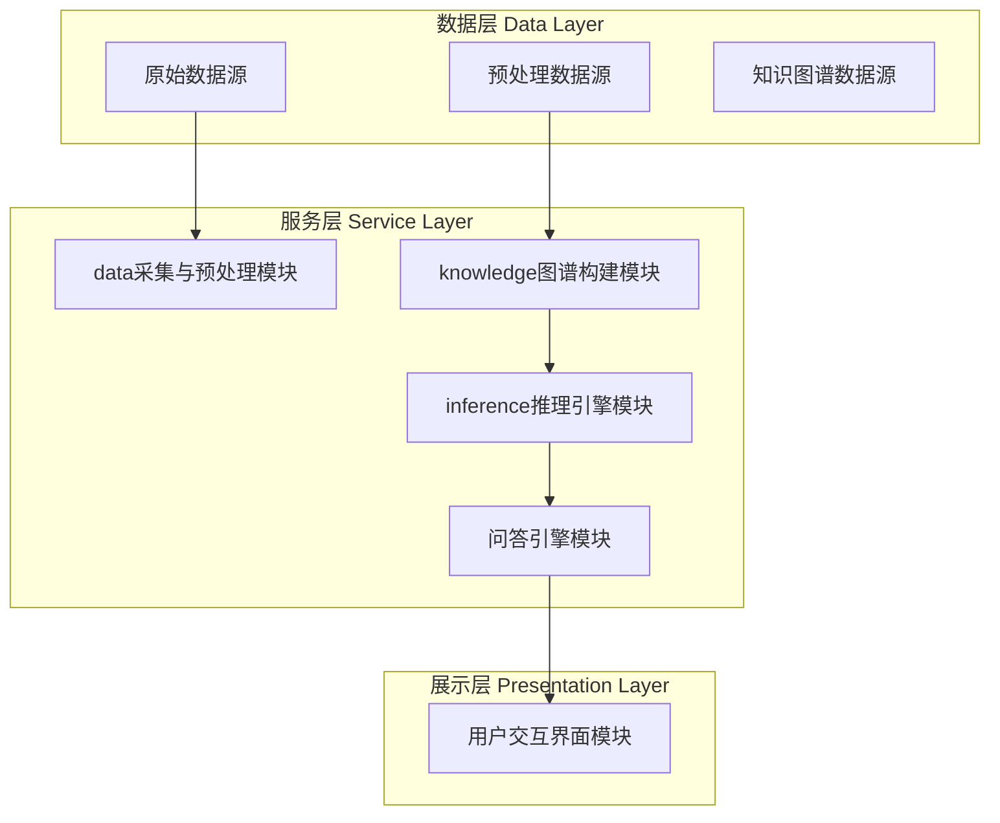
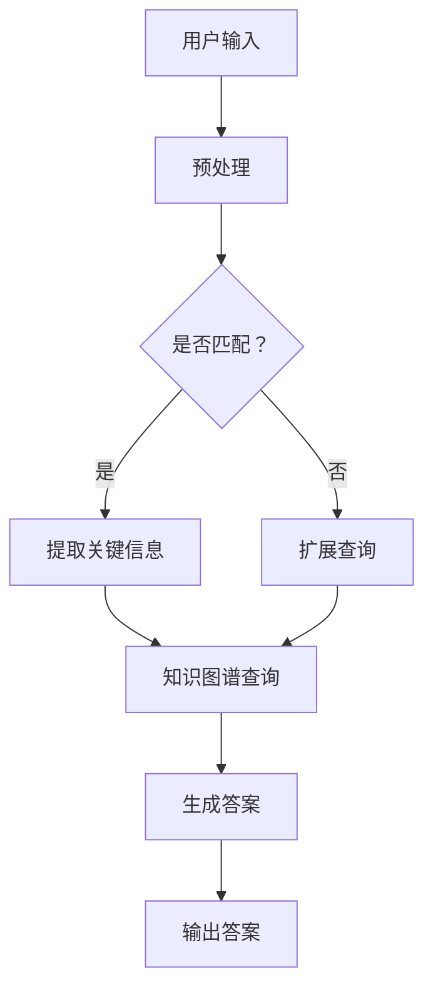
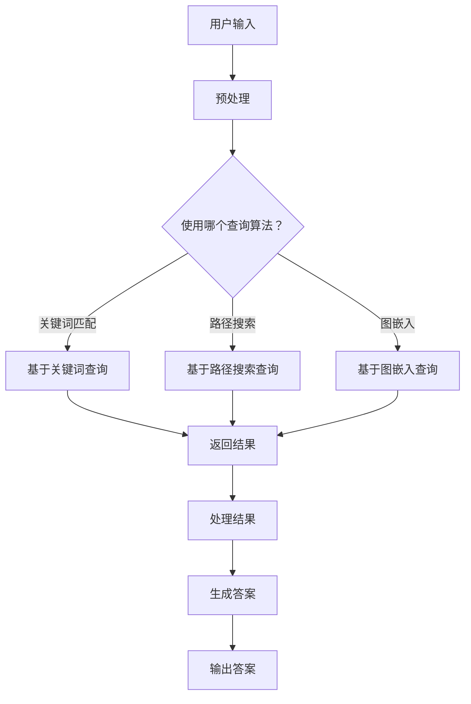
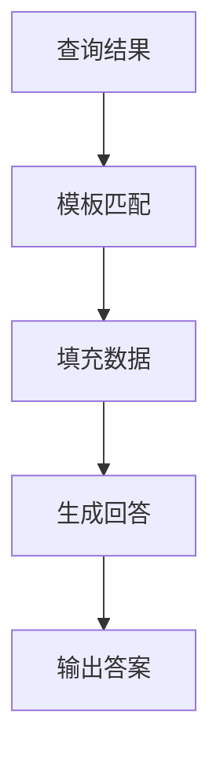
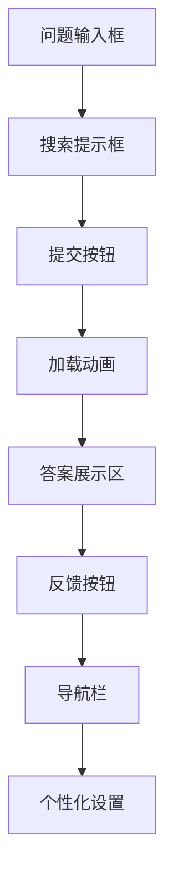
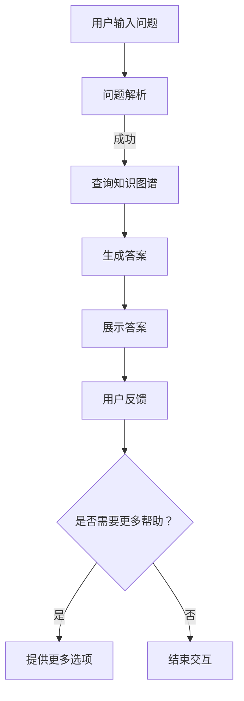

                 

### 《构建AI Agent的知识图谱问答系统》

#### 关键词：
1. 知识图谱问答系统
2. AI Agent
3. 知识抽取
4. 自然语言处理
5. 系统架构设计

#### 摘要：
本文旨在深入探讨知识图谱问答系统的构建方法，重点关注AI Agent在系统中的作用。我们将分步骤讲解知识图谱问答系统的各个关键组成部分，从背景介绍、核心概念、算法原理，到系统实现和实战应用。文章将通过详细的技术分析和实例讲解，帮助读者全面理解知识图谱问答系统的构建过程，为相关领域的研究和应用提供有价值的参考。

----------------------------------------------------------------

# 《构建AI Agent的知识图谱问答系统》

## 引言

随着人工智能技术的快速发展，知识图谱问答系统（Knowledge Graph Question Answering System，KGQA）逐渐成为学术界和工业界研究的热点。知识图谱作为大数据时代的重要基础设施，能够高效地组织和管理海量结构化数据，为智能问答系统提供了丰富的知识来源。而AI Agent，作为人工智能系统的高级形态，具有自主推理和学习能力，能够与用户进行自然交互，满足个性化需求。本文将围绕知识图谱问答系统的构建，探讨如何设计并实现一个具备高效率和智能化的AI Agent。

本文结构如下：

- **第一部分：知识图谱问答系统的概述与背景**，介绍知识图谱和AI Agent的基本概念及其在问答系统中的应用。
- **第二部分：知识图谱构建**，详细讲解知识图谱的构建过程，包括数据采集、知识抽取、知识融合和质量评估。
- **第三部分：AI Agent设计**，探讨AI Agent的架构设计、自然语言处理基础和问题解析与理解。
- **第四部分：知识图谱问答系统实现**，介绍系统框架搭建、核心算法实现和系统性能优化。
- **第五部分：AI Agent交互设计**，讲解用户界面设计、交互流程设计和交互效果评估。
- **第六部分：项目实战**，通过实际项目展示系统的构建过程和实现细节。
- **第七部分：最佳实践与拓展**，总结实践经验并提出未来研究方向。

## 第一部分：知识图谱问答系统的概述与背景

### 1.1 问题背景与意义

知识图谱问答系统的出现，是人工智能技术发展的重要成果。随着互联网信息的爆炸式增长，传统的基于关键词匹配的搜索方法已难以满足用户对个性化、精准化信息的需求。知识图谱通过将结构化数据以实体、属性和关系的形式进行组织，为智能问答提供了强大的知识基础。而AI Agent的引入，使得问答系统不仅能够回答特定的问题，还能够与用户进行自然的对话，提供个性化的服务。

**问题的提出**：在传统的搜索引擎中，用户需要通过关键词搜索来获取信息，但这种方法往往需要用户具备较高的信息检索能力，且搜索结果可能存在歧义和重复。而知识图谱问答系统能够理解用户的自然语言查询，并提供准确的答案。

**知识图谱在AI问答中的应用**：知识图谱通过将实体、属性和关系进行结构化表示，使得问答系统能够从大规模数据中快速定位到用户需要的知识信息。例如，在医疗问答场景中，知识图谱可以帮助系统理解疾病的症状、治疗方法等信息，从而提供专业的医疗建议。

**知识图谱问答系统的必要性**：随着人工智能技术的普及，用户对智能问答系统的需求日益增长。知识图谱问答系统能够更好地满足用户对信息获取的个性化、精准化需求，提高用户体验。

### 1.2 知识图谱基础

**知识图谱的定义**：知识图谱（Knowledge Graph）是一种语义网络，用于表示现实世界中的实体、概念和它们之间的关系。知识图谱通过图结构来组织信息，使得数据之间的语义关系更加直观和易于理解。

**知识图谱的基本概念**：

- **实体（Entity）**：知识图谱中的基本元素，表示现实世界中的事物，如人物、地点、事件等。
- **属性（Attribute）**：实体的特征描述，如人物的职业、地点的纬度等。
- **关系（Relationship）**：实体之间的语义关联，如人物的朋友关系、地点的所属国家等。

**知识图谱的组成部分**：

- **本体（Ontology）**：定义知识图谱中的实体、属性和关系的概念体系。
- **数据源**：知识图谱的数据来源，可以是结构化数据、半结构化数据或非结构化数据。
- **推理引擎**：用于根据知识图谱中的关系进行推理，提供更准确的答案。

### 1.3 AI Agent基础

**AI Agent的概念**：AI Agent（人工智能代理）是一种能够自主完成特定任务的智能系统，能够模拟人类智能行为，具备感知、推理、决策和行动能力。

**AI Agent的功能**：

- **感知**：通过自然语言处理技术，理解用户输入的问题。
- **推理**：根据知识图谱中的关系进行推理，找到用户需要的答案。
- **决策**：根据用户的需求和情境，提供合适的回答或建议。
- **行动**：在需要时，执行具体的任务或操作。

**AI Agent的发展历程**：

- **早期**：以规则为基础的专家系统，如专家顾问系统。
- **发展**：引入机器学习和深度学习技术，提升AI Agent的感知和推理能力。
- **当前**：基于知识图谱的AI Agent，结合自然语言处理、语义理解和推理技术，实现更加智能的交互。

### 1.4 知识图谱问答系统结构

**系统架构**：知识图谱问答系统通常包括数据采集与处理模块、知识图谱构建模块、AI Agent模块和用户交互界面。

- **数据采集与处理模块**：负责从各种数据源中获取信息，进行数据清洗和预处理。
- **知识图谱构建模块**：将结构化数据转化为知识图谱，实现实体、属性和关系的结构化表示。
- **AI Agent模块**：负责自然语言处理、问题解析、答案生成和与用户的交互。
- **用户交互界面**：提供用户与AI Agent交互的接口，可以是命令行界面、Web界面或移动应用。

**系统模块功能**：

- **数据采集与处理模块**：实现数据源的接入和数据的预处理，为知识图谱构建提供高质量的数据。
- **知识图谱构建模块**：构建和优化知识图谱，为AI Agent提供丰富的知识基础。
- **AI Agent模块**：实现自然语言处理和问题解析，生成准确的答案。
- **用户交互界面**：提供用户与系统交互的界面，优化用户体验。

**系统交互流程**：

1. **用户输入**：用户通过用户交互界面输入问题。
2. **自然语言处理**：AI Agent对用户输入的问题进行自然语言处理，提取关键信息。
3. **问题解析**：AI Agent根据知识图谱中的关系，对提取的信息进行理解和解析。
4. **答案生成**：AI Agent根据问题解析的结果，从知识图谱中查询答案，生成回答。
5. **答案输出**：将生成的答案输出给用户，通过用户交互界面展示。

通过以上对知识图谱问答系统的概述和背景介绍，我们可以对整个系统有一个初步的认识。接下来的部分将详细探讨知识图谱的构建、AI Agent的设计和系统的实现，帮助读者深入理解这一领域的核心技术和应用实践。

### 1.2 知识图谱基础

#### 知识图谱的定义

知识图谱（Knowledge Graph）是一种基于语义网络（Semantic Network）的数据结构，它通过实体（Entity）、属性（Attribute）和关系（Relationship）来表示现实世界中复杂的关系和信息。与传统的数据模型（如关系数据库）不同，知识图谱强调语义理解和数据之间的关联，从而能够更直观地表示知识的结构和关系。

知识图谱的起源可以追溯到1998年谷歌提出的PageRank算法，该算法通过链接分析来评估网页的重要性。随着互联网的快速发展，数据规模和多样性不断增加，单纯的链接分析已无法满足对信息深度理解和检索的需求。因此，谷歌在2009年提出了知识图谱的概念，旨在通过结构化的语义信息来提升搜索质量和用户体验。

知识图谱在搜索引擎中的应用取得了显著的成果，如谷歌的Knowledge Graph和百度的知心引擎。这些系统通过构建大规模的知识图谱，实现了对实体和关系的高效检索和推理，从而提升了信息检索的准确性和智能化水平。

#### 知识图谱的基本概念

在知识图谱中，有三个核心概念：实体、属性和关系。以下是对这三个概念的定义及其在知识图谱中的作用：

1. **实体（Entity）**：

实体是知识图谱中的基本构成元素，表示现实世界中具有独立意义的个体或概念。例如，人、地点、组织、物品等都可以作为实体。实体通常具有唯一的标识符（如URI）用于在图中唯一确定。

- **属性（Attribute）**：属性是实体的特征描述，表示实体在某一方面的具体信息。例如，人的出生日期、地点的纬度等。属性通常以键值对的形式与实体关联。

- **关系（Relationship）**：关系是实体之间的语义关联，表示实体之间的相互作用和联系。例如，人物之间的朋友关系、地点之间的相邻关系等。关系通常以边的形式在图中表示，连接两个实体。

#### 知识图谱的组成部分

知识图谱的构建通常涉及以下几个关键组成部分：

1. **本体（Ontology）**：

本体是知识图谱的概念体系，定义了知识图谱中的实体、属性和关系的分类和层次结构。本体为知识图谱提供了语义框架，使得图谱中的数据具有明确的语义含义和结构。例如，在医疗知识图谱中，本体可以定义疾病、症状、治疗方法等实体的分类和属性。

2. **数据源（Data Source）**：

数据源是知识图谱构建的基础，可以是结构化数据、半结构化数据或非结构化数据。数据源的多样性决定了知识图谱的广度和深度。常见的知识图谱数据源包括数据库、文本、知识库、社交媒体等。

3. **知识抽取（Knowledge Extraction）**：

知识抽取是从原始数据中提取结构化知识的过程，包括实体识别、属性抽取和关系抽取。知识抽取是构建高质量知识图谱的关键步骤，通常采用自然语言处理、数据挖掘和机器学习等技术。

4. **知识融合（Knowledge Fusion）**：

知识融合是将来自多个数据源的知识进行整合和融合，以消除数据冗余、纠正错误和增强知识的完整性。知识融合需要解决数据不一致性和冲突问题，保证知识图谱的一致性和可靠性。

5. **推理引擎（Reasoning Engine）**：

推理引擎是知识图谱的核心组件，用于根据图谱中的关系进行推理，发现新的知识和关联。推理引擎可以通过路径搜索、模式匹配、因果推理等方法，实现知识的自动化推理和扩展。

#### 知识图谱的实际应用

知识图谱在多个领域具有广泛的应用，以下是一些典型的应用场景：

1. **搜索引擎**：知识图谱用于提升搜索质量和用户体验，通过实体和关系提供更加准确和丰富的搜索结果。

2. **智能问答系统**：知识图谱为问答系统提供丰富的背景知识和上下文信息，使得系统能够理解用户的自然语言查询并给出准确的答案。

3. **推荐系统**：知识图谱用于构建用户和物品之间的关联关系，提供个性化的推荐服务。

4. **知识管理**：知识图谱帮助企业管理和组织内部知识，提升员工的知识共享和协作效率。

5. **金融服务**：知识图谱用于风险评估、信用评分、投资咨询等金融服务，提供更加精准和个性化的服务。

通过以上对知识图谱基础部分的介绍，我们了解了知识图谱的定义、基本概念和组成部分，以及其在实际应用中的重要性。接下来，我们将继续探讨知识图谱问答系统中AI Agent的设计和实现，帮助读者深入理解这一领域的核心技术和应用实践。

### 1.3 AI Agent基础

#### AI Agent的概念

AI Agent，即人工智能代理，是指具备一定智能水平，能够自主完成特定任务的系统。这种代理能够模拟人类智能行为，具备感知、推理、决策和行动能力。AI Agent的核心在于其自主性和智能化，它能够在没有人类干预的情况下，根据环境变化和任务需求，自主地调整策略并执行任务。

AI Agent的基本特征包括：

1. **自主性**：AI Agent能够独立地执行任务，不受人类直接控制。
2. **感知**：AI Agent通过传感器或输入设备获取环境信息，理解当前状态。
3. **推理**：AI Agent利用知识和推理算法，对获取的信息进行分析和处理。
4. **决策**：AI Agent基于分析结果，自主选择最合适的行动策略。
5. **行动**：AI Agent执行决策结果，完成实际任务。

AI Agent的发展可以追溯到早期的专家系统，这些系统通过预定义的规则库，模拟专家的决策过程。随着机器学习和深度学习技术的发展，AI Agent的感知和推理能力得到了显著提升。现代AI Agent不仅能够处理结构化数据，还能够理解和处理自然语言，实现更加智能化和自主化的任务。

#### AI Agent的功能

AI Agent的主要功能包括以下几个方面：

1. **感知**：AI Agent能够通过传感器获取环境信息，如摄像头、麦克风、GPS等，理解和分析这些信息，识别当前的状态和环境变化。

2. **推理**：AI Agent利用内置的知识库和推理算法，对感知到的信息进行分析和处理，理解其含义和关联关系。例如，在智能客服中，AI Agent可以理解用户的问题，并从知识库中查找相关答案。

3. **决策**：AI Agent基于推理结果，自主选择最合适的行动策略。例如，在自动驾驶中，AI Agent需要根据路况、车速和周围车辆的信息，决定是否加速、减速或转向。

4. **行动**：AI Agent执行决策结果，完成实际任务。例如，在智能家居中，AI Agent可以控制灯光、温度等设备，实现智能化的家居管理。

#### AI Agent的发展历程

AI Agent的发展历程可以分为以下几个阶段：

1. **早期阶段**：以规则为基础的专家系统，如医疗诊断系统、金融风险评估系统等。这些系统通过预定义的规则库，模拟专家的决策过程。

2. **发展阶段**：引入机器学习和深度学习技术，提升AI Agent的感知和推理能力。例如，卷积神经网络（CNN）用于图像识别，循环神经网络（RNN）用于自然语言处理。

3. **当前阶段**：基于知识图谱的AI Agent，结合自然语言处理、语义理解和推理技术，实现更加智能的交互。例如，智能客服、智能家居等应用中的AI Agent，能够理解用户的自然语言查询，并提供准确的答案和建议。

#### AI Agent在现代应用中的重要性

AI Agent在现代应用中扮演着越来越重要的角色，以下是其重要性的一些体现：

1. **提高效率**：AI Agent能够自动完成许多重复性高、劳动强度大的任务，提高工作效率。例如，自动化客服系统能够处理大量用户咨询，减轻人工客服的负担。

2. **优化体验**：AI Agent能够提供个性化、精准化的服务，提升用户体验。例如，智能推荐系统能够根据用户的兴趣和行为，推荐符合其需求的产品和服务。

3. **创新应用**：AI Agent的智能化和自主性，使得新的应用场景不断涌现。例如，智能安防系统、无人驾驶汽车等，都基于AI Agent的技术实现。

4. **辅助决策**：AI Agent通过数据分析、预测和优化，为人类决策提供有力支持。例如，金融风险评估系统通过分析历史数据，预测潜在风险，帮助金融机构做出更加明智的决策。

通过以上对AI Agent基础部分的介绍，我们了解了AI Agent的概念、功能和发展历程，以及其在现代应用中的重要性。在接下来的内容中，我们将深入探讨知识图谱问答系统中AI Agent的设计和实现，帮助读者全面掌握这一领域的核心技术。

### 1.4 知识图谱问答系统结构

知识图谱问答系统（Knowledge Graph Question Answering System，KGQA）是结合知识图谱和自然语言处理技术，实现智能问答的系统。其核心在于通过知识图谱提供丰富的背景知识，并通过自然语言处理技术理解和解析用户的问题，最终生成准确的答案。知识图谱问答系统的结构主要包括以下几个关键模块：

#### 系统架构

知识图谱问答系统通常包含以下模块：

1. **数据采集与处理模块**：负责从各种数据源中获取信息，包括结构化数据、半结构化数据和非结构化数据，并进行预处理，如数据清洗、去重、标准化等，为知识图谱的构建提供高质量的数据。

2. **知识图谱构建模块**：将预处理后的数据转化为知识图谱，包括实体、属性和关系的结构化表示。该模块需要解决数据抽取、实体识别、关系抽取和知识融合等问题，构建一个高质量的知识图谱。

3. **AI Agent模块**：AI Agent是知识图谱问答系统的核心，负责自然语言处理、问题解析、答案生成和与用户的交互。AI Agent通过自然语言处理技术理解用户的问题，利用知识图谱中的关系进行推理，生成准确的答案。

4. **用户交互界面模块**：提供用户与系统交互的接口，可以是命令行界面、Web界面或移动应用。用户通过交互界面输入问题，系统通过AI Agent处理问题并返回答案。

#### 系统模块功能

1. **数据采集与处理模块**：

   - **数据源接入**：从数据库、文本、知识库、社交媒体等多种数据源中获取信息。
   - **数据预处理**：包括数据清洗、去重、标准化等步骤，确保数据质量。
   - **数据存储**：将预处理后的数据存储到数据仓库或图数据库中，为后续构建知识图谱提供数据支持。

2. **知识图谱构建模块**：

   - **实体识别**：从数据中识别出实体，如人、地点、物品等。
   - **属性抽取**：为实体提取相关的属性，如年龄、职位、价格等。
   - **关系抽取**：确定实体之间的关联关系，如朋友、工作地点、购买等。
   - **知识融合**：将多个数据源中的信息进行融合，消除冗余、纠正错误，增强知识的完整性。

3. **AI Agent模块**：

   - **自然语言处理**：通过分词、词性标注、命名实体识别等步骤，将用户输入的自然语言问题转化为机器可理解的形式。
   - **问题解析**：理解用户问题的意图和内容，识别问题中的关键实体和关系。
   - **答案生成**：利用知识图谱中的关系进行推理，从图谱中查询答案，并生成自然语言回答。
   - **交互管理**：管理用户与系统的交互流程，包括问题的接收、答案的生成和输出。

4. **用户交互界面模块**：

   - **界面设计**：设计用户友好的交互界面，提供问题输入和答案输出的接口。
   - **用户体验优化**：通过界面优化，提升用户的交互体验，如反馈机制、错误提示等。
   - **多平台支持**：支持多种平台，如Web、移动应用、智能音箱等，满足不同用户的需求。

#### 系统交互流程

知识图谱问答系统的交互流程可以概括为以下几个步骤：

1. **用户输入**：用户通过交互界面输入问题。
2. **问题解析**：AI Agent对用户输入的问题进行自然语言处理，提取关键信息，理解问题的意图。
3. **知识查询**：AI Agent根据解析结果，在知识图谱中进行查询，找到与问题相关的实体和关系。
4. **答案生成**：AI Agent利用查询结果，从知识图谱中获取答案，并生成自然语言回答。
5. **答案输出**：将生成的答案通过交互界面展示给用户。

通过以上对知识图谱问答系统结构的介绍，我们可以看到，该系统结合了知识图谱和自然语言处理技术，实现了从用户输入到答案输出的完整流程。接下来，我们将详细探讨知识图谱的构建过程，包括数据采集与预处理、知识抽取与融合、以及知识图谱质量评估与优化，为构建一个高效、准确的KGQA系统打下基础。

### 2.1 数据采集与预处理

数据采集与预处理是知识图谱构建的重要环节，其质量直接影响到知识图谱的完整性和准确性。在这个阶段，我们需要从多个数据源中获取信息，并对数据进行清洗、去重、标准化等预处理操作，以确保数据的质量和一致性。

#### 数据源选择

知识图谱构建的数据源可以包括以下几种：

1. **结构化数据**：如关系数据库中的数据，这些数据通常具有明确的字段和格式，易于处理和抽取信息。
2. **半结构化数据**：如XML、JSON等格式的数据，这些数据部分结构化，但可能存在冗余或不一致的信息。
3. **非结构化数据**：如文本、图像、音频等，这些数据没有明确的结构，但通常包含丰富的知识信息。

根据应用场景和需求，选择合适的数据源。例如，在构建一个医疗知识图谱时，可以使用电子健康记录、医学文献和医学图像等数据源；在构建一个商品知识图谱时，可以使用电商平台的数据、用户评论和产品规格等。

#### 数据采集方法

数据采集是知识图谱构建的第一步，具体方法包括：

1. **数据爬取**：通过爬虫技术从互联网上获取结构化和半结构化数据。例如，使用Web爬虫从电商网站获取商品信息，使用API从社交媒体获取用户数据。
2. **数据导入**：将已有的结构化数据导入到知识图谱系统，如使用数据库连接工具将关系数据库中的数据导入图数据库。
3. **手动收集**：对于非结构化数据，如医学文献和学术论文，可以通过人工阅读和标注来收集相关信息。

#### 数据预处理流程

数据预处理是确保数据质量的关键步骤，通常包括以下操作：

1. **数据清洗**：去除数据中的噪声和错误，如去除重复记录、纠正数据格式错误、填补缺失值等。例如，在处理电商数据时，需要去除重复的商品记录，纠正价格数据中的格式错误。
2. **数据去重**：通过唯一标识符（如商品ID、用户ID等）识别和删除重复的数据记录，确保知识图谱中的数据唯一性。
3. **数据标准化**：统一数据格式和编码，如将所有日期格式统一为YYYY-MM-DD，将文本数据统一编码等。这有助于后续的数据处理和知识抽取。
4. **数据转换**：将不同数据源中的数据转换为统一的格式，如将关系数据库中的数据转换为图数据库支持的格式。
5. **数据存储**：将预处理后的数据存储到知识图谱系统中的图数据库，如Neo4j、JanusGraph等。

#### 实例讲解

以构建一个电商知识图谱为例，数据预处理流程如下：

1. **数据源选择**：从电商平台获取商品信息、用户评论和交易数据。
2. **数据采集**：使用爬虫技术从电商网站上获取商品信息，使用API从社交媒体获取用户数据。
3. **数据清洗**：
   - 去除重复商品记录，确保每个商品的唯一性。
   - 纠正价格数据中的格式错误，如将价格统一转换为小数形式。
   - 填补用户评论中的缺失值，如缺失的评价时间。
4. **数据去重**：使用商品ID和用户ID作为唯一标识符，识别和删除重复的数据记录。
5. **数据标准化**：
   - 将商品的价格统一转换为人民币，如将美元价格转换为人民币。
   - 将商品的评价时间统一转换为YYYY-MM-DD格式。
6. **数据转换**：将清洗和标准化的数据转换为Neo4j支持的格式。
7. **数据存储**：将转换后的数据导入到Neo4j图数据库中，创建实体（如商品、用户、评论等），并建立它们之间的关系。

通过以上数据采集与预处理流程，我们可以确保知识图谱中的数据质量，为后续的知识抽取和融合提供坚实的基础。

### 2.2 知识抽取与融合

知识抽取与融合是知识图谱构建的关键步骤，其目的是从原始数据中提取结构化知识，并将其整合为一个高质量的知识图谱。在这一部分，我们将详细探讨知识抽取的方法、知识融合的策略，以及常用的知识图谱构建工具。

#### 知识抽取方法

知识抽取是从非结构化或半结构化数据中提取结构化信息的过程。根据数据类型和抽取目标，常见的知识抽取方法包括以下几种：

1. **实体识别**：实体识别是从文本中识别出具有独立意义的个体或概念，如人、地点、组织、物品等。实体识别通常采用基于规则的方法和机器学习算法，如条件随机场（CRF）、卷积神经网络（CNN）和长短期记忆网络（LSTM）。

2. **属性抽取**：属性抽取是从文本中提取实体特征描述，如人物的年龄、职业，地点的纬度、海拔等。属性抽取的方法包括基于规则的方法和基于统计模型的方法，如最大熵模型（MaxEnt）和决策树（Decision Tree）。

3. **关系抽取**：关系抽取是从文本中提取实体之间的关联关系，如人物之间的朋友关系、地点之间的相邻关系等。关系抽取通常采用基于规则的方法、图模型和深度学习方法，如图卷积网络（GCN）和Transformer。

#### 知识融合策略

知识融合是将来自多个数据源的知识进行整合和融合的过程，其目的是消除数据冗余、纠正错误、增强知识的完整性。以下是一些常见的知识融合策略：

1. **数据对齐**：数据对齐是将不同数据源中的实体进行匹配和对应的过程。数据对齐可以通过基于规则的方法（如字符串匹配）和机器学习方法（如神经网络）来实现。

2. **冲突消解**：冲突消解是解决不同数据源中存在不一致信息的过程。冲突消解策略包括基于规则的方法（如优先级规则）和机器学习方法（如决策树、神经网络）。

3. **知识整合**：知识整合是将不同数据源中的知识进行合并和优化的过程。知识整合可以通过基于规则的方法（如合并重复实体）和机器学习方法（如聚类算法）来实现。

#### 知识图谱构建工具

构建知识图谱需要使用到一些专业的工具和平台，以下是一些常用的知识图谱构建工具：

1. **Neo4j**：Neo4j是一个高性能的图数据库，支持ACID事务，提供丰富的图处理和查询语言（Cypher）。Neo4j适用于构建大规模、复杂的关系图谱。

2. **JanusGraph**：JanusGraph是一个开源的分布式图数据库，支持多种存储后端（如Apache Cassandra、Google Cloud Spanner等）。JanusGraph适用于构建大规模、分布式知识图谱。

3. **OpenKE**：OpenKE（Open Knowledge Embedding）是一个基于知识图谱的实体和关系嵌入工具，支持多种嵌入模型（如TransE、TransH、TransR等）。OpenKE适用于知识图谱的构建和优化。

4. **Grafana**：Grafana是一个开源的数据可视化工具，支持多种数据源（如InfluxDB、Prometheus等）。Grafana适用于知识图谱的监控和可视化。

#### 实例讲解

以构建一个医疗知识图谱为例，知识抽取与融合的具体步骤如下：

1. **数据源选择**：选择医院、医生、药品、疾病等医疗领域的结构化和非结构化数据作为知识图谱的数据源。

2. **数据采集**：从医院的电子健康记录、医学文献数据库、药品说明书等数据源中采集数据。

3. **数据预处理**：对采集到的医疗数据进行清洗、去重、标准化等预处理操作，确保数据质量。

4. **知识抽取**：
   - 实体识别：使用基于深度学习的实体识别模型（如BERT）从医疗文本中识别出医生、药品、疾病等实体。
   - 属性抽取：使用基于规则的方法和机器学习模型（如最大熵模型）从医疗文本中抽取实体的属性，如医生的职称、药品的成分等。
   - 关系抽取：使用基于规则的方法和图模型（如图卷积网络）从医疗文本中抽取实体之间的关系，如医生治疗疾病、药品治疗疾病等。

5. **知识融合**：
   - 数据对齐：使用基于规则和机器学习的方法（如实体匹配算法）将来自不同数据源的实体进行匹配和对应。
   - 冲突消解：使用基于规则和机器学习的方法（如决策树、神经网络）解决不同数据源中存在的不一致信息。
   - 知识整合：使用基于规则和机器学习的方法（如合并重复实体、聚类算法）将不同数据源中的知识进行整合和优化。

6. **知识图谱构建**：使用Neo4j或JanusGraph等知识图谱构建工具，将知识抽取和融合的结果存储到图数据库中，创建实体和关系，并建立它们之间的关联。

通过以上知识抽取与融合步骤，我们可以构建一个高质量的医疗知识图谱，为医疗领域的智能问答和知识推理提供基础支持。

### 2.3 知识图谱质量评估与优化

知识图谱的质量直接影响问答系统的性能和准确性。因此，对知识图谱进行质量评估与优化是非常关键的。在这个部分，我们将讨论知识图谱质量评估的指标、评估方法以及优化策略。

#### 质量评估指标

1. **覆盖率（Coverage）**：
   覆盖率是指知识图谱中实体和关系的数量与实际存在的数据量之间的比例。高覆盖率意味着知识图谱能够捕捉到更多的数据信息，从而提高问答系统的回答准确性。

2. **完整性（Completeness）**：
   完整性是指知识图谱中的实体和关系是否完整，即是否涵盖了所有相关的实体和关系。高完整性确保了知识图谱的全面性和一致性。

3. **一致性（Consistency）**：
   一致性是指知识图谱中的实体和关系是否一致，即是否存在矛盾或冲突的信息。例如，如果两个实体之间存在两个不同的关系，则说明知识图谱存在不一致性。

4. **准确性（Accuracy）**：
   准确性是指知识图谱中的实体和关系的真实性，即抽取和融合过程是否正确无误。高准确性确保了问答系统能够提供正确的答案。

5. **时效性（Timeliness）**：
   时效性是指知识图谱中信息的更新速度和频率。随着时间的推移，知识图谱中的信息可能变得过时或不准确，因此需要定期更新。

#### 质量评估方法

1. **自动化评估**：
   使用自动化工具对知识图谱进行质量评估，如使用覆盖率、完整性、一致性等指标进行量化评估。常见的自动化评估工具包括GNN-QA、NLP-QA等。

2. **人工评估**：
   通过人工对知识图谱进行质量评估，评估其覆盖范围、完整性、一致性等方面。人工评估能够发现自动化评估工具无法检测到的问题，但成本较高且耗时。

3. **用户反馈**：
   通过用户反馈评估知识图谱的质量，用户可以通过问答系统提交反馈，指出图谱中存在的问题。这种方法能够直接反映用户的需求和满意度，但依赖于用户的使用情况。

#### 优化策略

1. **数据源扩展**：
   扩展知识图谱的数据源，包括结构化数据、半结构化数据和非结构化数据。通过引入更多的数据源，可以提升知识图谱的覆盖率和完整性。

2. **知识融合**：
   改进知识融合策略，通过数据对齐、冲突消解和知识整合等方法，提高知识图谱的一致性和准确性。例如，可以使用机器学习算法（如决策树、神经网络）进行冲突消解和知识整合。

3. **实体和关系识别**：
   使用先进的自然语言处理技术（如BERT、Transformer）进行实体和关系识别，提高知识抽取的准确率。通过预训练模型和迁移学习，可以显著提升实体和关系识别的性能。

4. **推理机制**：
   优化知识图谱的推理机制，使用基于规则和机器学习的方法（如图卷积网络、图注意力网络）进行推理，提高知识图谱的时效性和推理能力。

5. **定期更新**：
   定期对知识图谱进行更新，以保持其时效性和准确性。可以通过自动化工具和人工评估相结合的方式，确保知识图谱的持续优化。

#### 实例讲解

以构建一个电商知识图谱为例，质量评估与优化策略如下：

1. **评估指标**：
   - 覆盖率：评估知识图谱中商品、用户、评价等实体的数量与实际电商数据中的比例。
   - 完整性：评估知识图谱中是否包含所有相关的商品、用户和评价关系。
   - 一致性：检查知识图谱中的商品和评价是否一致，如价格、评分等。
   - 准确性：评估从知识图谱中提取的信息是否准确，如商品的属性、用户的行为等。
   - 时效性：评估知识图谱的更新频率和速度，确保信息的实时性。

2. **评估方法**：
   - 使用自动化评估工具（如GNN-QA）对知识图谱进行量化评估。
   - 人工评估知识图谱的完整性、一致性和准确性。
   - 收集用户反馈，评估知识图谱的实际效果和用户满意度。

3. **优化策略**：
   - 扩展数据源，包括电商网站、用户评论、商品评价等，提升知识图谱的覆盖率。
   - 使用基于规则的冲突消解算法和机器学习算法（如决策树、神经网络）进行知识融合，提高一致性。
   - 利用BERT等预训练模型进行实体和关系识别，提高识别准确率。
   - 优化图数据库的查询性能，提高推理速度和时效性。
   - 定期更新知识图谱，确保信息的实时性和准确性。

通过以上质量评估与优化策略，可以构建一个高质量、准确、实时的电商知识图谱，为智能问答系统提供坚实的基础。

### 3.1 AI Agent架构设计

AI Agent的架构设计是构建高效、智能的知识图谱问答系统的关键。在这个部分，我们将详细讲解AI Agent的组成、交互模式以及功能模块的设计。

#### AI Agent的组成

AI Agent由以下几个核心组件构成：

1. **感知模块**：负责接收和处理来自用户的外部输入，包括文本、语音、图像等。感知模块利用自然语言处理（NLP）技术，将非结构化的用户输入转化为结构化的数据，为后续处理提供基础。

2. **推理模块**：基于知识图谱和预定义的推理规则，对感知模块处理后的数据进行分析和推理，找出用户问题的答案。推理模块是AI Agent的核心，通过逻辑推理、语义分析等方法，实现对问题的理解和解答。

3. **决策模块**：根据推理结果，选择最合适的回答策略，并在必要时进行决策。决策模块负责确定如何将答案呈现给用户，包括生成自然语言回答、语音合成、图像渲染等。

4. **行动模块**：执行决策模块生成的行动指令，如更新数据库、发送电子邮件、控制设备等。行动模块确保AI Agent能够对外部环境做出实际的响应。

5. **交互模块**：管理AI Agent与用户的交互流程，包括输入接收、答案生成和输出等。交互模块负责优化用户体验，确保交互过程流畅、自然。

#### AI Agent的交互模式

AI Agent的交互模式可以分为以下几种：

1. **命令式交互**：用户通过输入具体的指令，AI Agent按照指令执行任务。例如，用户输入“打开灯光”，AI Agent控制灯光设备打开。

2. **对话式交互**：用户与AI Agent进行自然语言对话，AI Agent理解用户的意图，提供相应的回答和建议。例如，用户询问“明天天气如何？”，AI Agent提供天气预报信息。

3. **事件驱动交互**：AI Agent根据外部事件主动触发操作，如用户登录、设备故障等。AI Agent在接收到事件后，自动执行相应的任务，提高系统的智能化水平。

#### 功能模块设计

AI Agent的功能模块设计需要综合考虑感知、推理、决策、行动和交互的需求。以下是对各个功能模块的详细设计：

1. **感知模块**：
   - **文本处理**：利用分词、词性标注、命名实体识别等NLP技术，将用户输入的文本转化为结构化数据。
   - **语音识别**：通过语音识别技术，将用户的语音输入转换为文本。
   - **图像识别**：使用计算机视觉技术，从图像中提取关键信息，如人脸、物体、场景等。

2. **推理模块**：
   - **意图识别**：分析用户输入，识别用户的意图，如查询、命令、请求等。
   - **语义分析**：理解用户输入中的语义关系，如主语、谓语、宾语等，为推理提供语义基础。
   - **知识检索**：从知识图谱中查询与用户输入相关的信息，为生成答案提供数据支持。

3. **决策模块**：
   - **答案生成**：根据推理结果，生成自然语言回答或执行相应的操作。
   - **策略选择**：在多个可能的回答策略中选择最优的方案，如提供详细的信息、简洁的回答等。
   - **反馈机制**：根据用户反馈调整回答策略，提高AI Agent的适应性和用户体验。

4. **行动模块**：
   - **操作执行**：根据决策模块生成的指令，执行具体的任务，如控制设备、更新数据库等。
   - **异常处理**：在执行任务时，处理可能出现的问题和错误，确保系统的稳定运行。

5. **交互模块**：
   - **界面设计**：设计用户友好的交互界面，包括文本聊天界面、语音对话界面、图形界面等。
   - **用户体验优化**：通过界面优化、反馈机制等手段，提升用户的交互体验。
   - **多平台支持**：确保AI Agent能够适应不同的平台和应用场景，如Web、移动应用、智能音箱等。

通过以上AI Agent架构设计，我们可以构建一个具备感知、推理、决策和行动能力的智能系统，实现高效的知识图谱问答。接下来，我们将深入探讨自然语言处理基础，为AI Agent的智能交互提供技术支持。

### 3.2 自然语言处理基础

自然语言处理（Natural Language Processing，NLP）是构建AI Agent的关键技术之一。NLP旨在使计算机能够理解和处理人类语言，从而实现人机交互的智能化。在本节中，我们将详细探讨NLP的基础知识，包括语言模型、分词与词性标注、以及命名实体识别，为AI Agent的智能交互提供技术支持。

#### 语言模型

语言模型（Language Model，LM）是NLP的核心组成部分，它用于预测一段文本的下一个单词或字符。语言模型通过学习大量语言数据，捕捉语言中的统计规律和模式，从而实现对文本的生成和理解。

1. **n-gram模型**：n-gram模型是最简单的语言模型，它通过统计连续n个单词（或字符）的联合概率来预测下一个单词。例如，在二元语言模型中，`P(单词i | 单词i-1)`表示在单词i-1出现的情况下，单词i的概率。

2. **神经网络语言模型**：随着深度学习技术的发展，神经网络语言模型（Neural Network Language Model，NNLM）逐渐取代了传统的n-gram模型。NNLM通过多层神经网络捕捉文本的长期依赖关系，如长短时记忆网络（LSTM）和Transformer。

3. **预训练语言模型**：预训练语言模型（Pre-trained Language Model，PTLM）是在大规模语料库上预先训练好的模型，如BERT、GPT和T5。这些模型通过大规模预训练，具备了强大的语言理解和生成能力，可以用于多种NLP任务，如文本分类、问答系统、机器翻译等。

#### 分词与词性标注

分词（Tokenization）是将连续的文本分割成一系列有意义的单词或短语的步骤。词性标注（Part-of-Speech Tagging，POS Tagging）是对每个单词或短语进行分类标注，标记其词性（如名词、动词、形容词等）。

1. **分词方法**：
   - **基于规则的分词**：使用预定义的规则进行分词，如基于正则表达式、基于词典的方法。
   - **基于统计的分词**：使用统计方法进行分词，如基于n-gram语言模型、基于隐马尔可夫模型（HMM）的方法。
   - **基于神经网络的分词**：使用深度学习模型进行分词，如序列标注模型（如BiLSTM-CRF）。

2. **词性标注方法**：
   - **基于规则的词性标注**：使用预定义的规则进行词性标注，如基于词性词典的方法。
   - **基于统计的词性标注**：使用统计模型进行词性标注，如基于最大熵模型（MaxEnt）、条件随机场（CRF）的方法。
   - **基于神经网络的词性标注**：使用深度学习模型进行词性标注，如序列标注模型（如BiLSTM-CRF）。

#### 命名实体识别

命名实体识别（Named Entity Recognition，NER）是NLP中的一个重要任务，旨在从文本中识别出具有特定意义的实体，如人名、地名、组织名、日期等。NER对于构建知识图谱和智能问答系统具有重要意义。

1. **实体分类**：NER通常将实体分为多个类别，如人名、地名、组织名、时间等。实体分类的准确性直接影响到NER的性能。

2. **识别方法**：
   - **基于规则的NER**：使用预定义的规则进行实体识别，如基于词典的方法。
   - **基于统计的NER**：使用统计模型进行实体识别，如基于最大熵模型（MaxEnt）和条件随机场（CRF）的方法。
   - **基于神经网络的NER**：使用深度学习模型进行实体识别，如序列标注模型（如BiLSTM-CRF）、基于Transformer的模型（如BERT）。

3. **实体链接**：在NER的基础上，实体链接（Entity Linking）用于将识别出的实体与知识图谱中的实体进行匹配和对应，以建立实体与知识之间的关联。

通过以上对自然语言处理基础部分的介绍，我们了解了语言模型、分词与词性标注、以及命名实体识别的基本概念和方法。这些技术为AI Agent的智能交互提供了关键支持，使得AI Agent能够更好地理解用户的意图和问题，并生成准确的回答。在接下来的部分，我们将深入探讨问题解析与理解的过程，为构建高效的知识图谱问答系统奠定基础。

### 3.3 问题解析与理解

问题解析与理解是AI Agent实现智能问答的核心环节，其目的是将用户的自然语言问题转化为计算机可以处理和理解的形式。在这一过程中，AI Agent需要识别问题的意图、提取关键实体和关系，并利用知识图谱中的信息进行推理，最终生成准确的答案。以下是问题解析与理解的具体过程和方法。

#### 问答意图识别

问答意图识别（Intent Recognition）是问题解析的第一步，其目的是理解用户问题的目的或意图。意图通常包括查询、命令、请求、建议等。为了准确识别用户意图，AI Agent可以采用以下方法：

1. **规则匹配**：通过预定义的规则库，将用户输入与规则进行匹配，判断用户意图。这种方法适用于结构化较强的问题，如命令式语句。

2. **机器学习模型**：使用机器学习算法（如朴素贝叶斯、支持向量机、神经网络）进行意图分类。这些模型可以通过训练大量的标注数据集，学习识别不同意图的特征。

3. **深度学习模型**：使用深度学习模型（如卷积神经网络、长短时记忆网络、Transformer）进行意图识别。深度学习模型能够捕捉到用户输入的复杂语义信息，提高意图识别的准确性。

#### 问答实体识别

问答实体识别（Entity Recognition）是从用户输入中提取关键实体，如人名、地名、组织名、时间等。实体识别的准确性直接影响到问题的理解和答案的生成。以下是一些常用的实体识别方法：

1. **基于词典的方法**：利用预定义的实体词典，将用户输入与词典中的实体进行匹配。这种方法简单高效，但依赖于词典的完整性和准确性。

2. **基于规则的实体识别**：使用预定义的规则，从文本中识别出特定的实体模式。这种方法适用于结构化较强的问题。

3. **基于机器学习的实体识别**：使用机器学习算法（如朴素贝叶斯、支持向量机、长短期记忆网络）进行实体识别。这些模型可以通过训练大量标注数据集，学习识别不同实体的特征。

4. **基于深度学习的实体识别**：使用深度学习模型（如卷积神经网络、长短时记忆网络、Transformer）进行实体识别。深度学习模型能够捕捉到用户输入的复杂语义信息，提高实体识别的准确性。

#### 问答路径规划

问答路径规划（Question Answering Path Planning）是在识别用户意图和实体后，利用知识图谱中的信息进行推理，找到答案的过程。以下是几种常见的问答路径规划方法：

1. **基于规则的路径规划**：使用预定义的规则，根据用户意图和实体，确定查询路径和查询条件。这种方法简单直观，但规则难以覆盖所有情况。

2. **基于图的路径规划**：利用知识图谱的图结构，通过图搜索算法（如广度优先搜索、深度优先搜索、A*搜索）找到答案路径。这种方法能够处理复杂的问题和丰富的知识结构。

3. **基于概率模型的路径规划**：使用概率模型（如马尔可夫决策过程、贝叶斯网络）进行路径规划，通过计算不同路径的概率，选择最优路径。这种方法能够处理不确定性和多目标优化问题。

4. **基于深度学习的路径规划**：使用深度学习模型（如图卷积网络、图注意力网络）进行路径规划，通过学习知识图谱中的关系和路径信息，提高路径规划的效果。

#### 实例讲解

以下是一个基于知识图谱问答系统的实例，展示问题解析与理解的过程：

1. **用户输入**：用户输入问题：“北京是中国的哪个省份？”

2. **意图识别**：AI Agent通过预定义的规则库，识别出用户意图为查询地理位置信息。

3. **实体识别**：AI Agent识别出关键实体：“北京”和“中国”。

4. **问答路径规划**：
   - AI Agent在知识图谱中查询“北京”的属性，找到其所属的国家。
   - AI Agent在知识图谱中查询“中国”的属性，找到其下辖的省份。

5. **答案生成**：AI Agent生成答案：“北京是中国的北京市。”

通过以上过程，AI Agent成功地理解了用户的问题，并在知识图谱中找到了准确的答案。

#### 结论

问题解析与理解是构建智能问答系统的关键步骤，通过意图识别、实体识别和问答路径规划，AI Agent能够准确地理解用户的意图和问题，并从知识图谱中提取出相关的信息。这些技术为构建高效、智能的知识图谱问答系统提供了坚实的基础。在接下来的部分，我们将深入探讨知识图谱问答系统的实现细节，包括系统框架搭建、核心算法实现和系统性能优化。

### 4.1 系统框架搭建

系统框架搭建是构建知识图谱问答系统的第一步，也是关键一步。一个合理和高效的系统框架不仅能够确保系统的稳定性，还能提高系统的可扩展性和可维护性。在本节中，我们将详细讲解知识图谱问答系统的架构设计、模块划分以及系统接口设计。

#### 系统架构设计

知识图谱问答系统的整体架构可以分为以下几个层次：

1. **数据层**：数据层负责数据的存储和管理，包括原始数据存储、预处理数据存储和知识图谱存储。常用的数据存储方式有关系数据库、NoSQL数据库（如MongoDB、Cassandra）和图数据库（如Neo4j、JanusGraph）。

2. **服务层**：服务层包含核心的业务逻辑处理，如数据预处理、知识抽取、知识融合、推理引擎和问答引擎等。服务层通过接口与数据层和展示层进行交互。

3. **展示层**：展示层是用户与系统的交互界面，包括Web界面、移动应用界面等。用户通过展示层输入问题，系统通过展示层返回答案。

#### 模块划分

知识图谱问答系统可以划分为以下几个主要模块：

1. **数据采集与预处理模块**：负责从各种数据源中获取信息，进行数据清洗、去重和标准化等预处理操作。

2. **知识图谱构建模块**：负责将预处理后的数据转化为知识图谱，包括实体识别、属性抽取、关系抽取和知识融合。

3. **推理引擎模块**：负责根据知识图谱中的关系进行推理，实现对用户问题的理解和回答。

4. **问答引擎模块**：负责生成用户问题的答案，包括问题解析、知识查询和答案生成。

5. **用户交互界面模块**：提供用户与系统交互的接口，包括文本输入、语音输入、答案展示等。

#### 系统接口设计

系统接口设计是确保各模块之间高效协作和稳定运行的关键。以下是系统接口设计的主要方面：

1. **API接口**：系统通过API接口与外部系统进行交互，如数据源接入、第三方服务调用等。API接口需要遵循RESTful设计原则，确保接口的标准化和易用性。

2. **服务调用接口**：服务层内部各模块之间的调用接口，用于实现模块之间的数据传输和功能协作。服务调用接口采用异步通信方式，提高系统的并发处理能力。

3. **数据库接口**：系统通过数据库接口与数据层进行交互，包括数据的读写操作。数据库接口需要支持高并发、高可用和数据的持久化存储。

4. **展示层接口**：展示层通过接口与用户进行交互，包括接收用户输入、发送答案等。展示层接口需要支持多平台（Web、移动应用、智能设备等）和多种输入输出方式。

#### 实例讲解

以下是一个简化的知识图谱问答系统架构图（使用Mermaid语法表示）：



通过以上系统框架搭建的讲解，我们可以看到知识图谱问答系统是如何通过数据层、服务层和展示层的协作，实现对用户问题的理解和回答。在接下来的部分，我们将深入探讨知识图谱问答系统的核心算法实现，包括问题匹配算法、知识图谱查询算法和问答生成算法。

### 4.2 知识图谱问答核心算法实现

知识图谱问答系统的核心在于如何高效地处理用户输入的问题，并在知识图谱中找到准确的答案。在这一部分，我们将详细探讨三个关键算法：问题匹配算法、知识图谱查询算法和问答生成算法。每个算法都将结合Mermaid流程图和Python代码进行解释，帮助读者深入理解其原理和应用。

#### 问题匹配算法

问题匹配算法的目标是将用户输入的问题与知识图谱中的问题模板进行匹配，找到可能的答案。这个算法通常采用模式匹配、词向量相似度计算等方法。

**Mermaid流程图**：



**Python代码示例**：

```python
import spacy
nlp = spacy.load('en_core_web_sm')

def preprocess_question(question):
    doc = nlp(question)
    tokens = [token.text for token in doc]
    return tokens

def match_question(question, template):
    preprocessed_question = preprocess_question(question)
    preprocessed_template = preprocess_question(template)
    match_score = 0
    
    for token in preprocessed_question:
        if token in preprocessed_template:
            match_score += 1
            
    return match_score / len(preprocessed_template)

def question_matching_algorithm(question, templates):
    best_match = None
    max_score = 0
    
    for template in templates:
        score = match_question(question, template)
        if score > max_score:
            max_score = score
            best_match = template
            
    return best_match, max_score

# 示例
templates = ["What is the capital of France?", "What is the capital city of France?", "What is the country's capital city?"]
question = "What is the capital city of France?"
matched_template, score = question_matching_algorithm(question, templates)
print(f"Best Match: {matched_template}, Score: {score}")
```

#### 知识图谱查询算法

知识图谱查询算法负责在知识图谱中查找与用户问题相关的信息。常用的查询算法包括基于关键词匹配、基于路径搜索和基于图嵌入的方法。

**Mermaid流程图**：



**Python代码示例**：

```python
import networkx as nx

# 创建一个简单的知识图谱
G = nx.Graph()
G.add_nodes_from(['France', 'Paris', 'City'])
G.add_edges_from([('France', 'capital', 'Paris'), ('Paris', 'type', 'City')])

def keyword_query(graph, query):
    results = []
    for node in graph.nodes():
        if query in graph.nodes[node]:
            results.append(node)
    return results

def path_search_query(graph, start, end, path_length=None):
    if path_length is None:
        paths = list(nx.all_simple_paths(graph, source=start, target=end))
    else:
        paths = list(nx.all_simple_paths(graph, source=start, target=end, max_length=path_length))
    return paths

def graph_embedding_query(embeddings, query_embedding, similarity_threshold):
    similarity_scores = []
    for node, embedding in embeddings.items():
        similarity_score = cosine_similarity(query_embedding, embedding)
        similarity_scores.append((node, similarity_score))
    sorted_scores = sorted(similarity_scores, key=lambda x: x[1], reverse=True)
    return [node for node, score in sorted_scores if score > similarity_threshold]

# 示例
question = "What is the capital of France?"
start = 'France'
end = 'capital'

# 使用关键词匹配查询
keyword_results = keyword_query(G, question)
print("Keyword Query Results:", keyword_results)

# 使用路径搜索查询
path_search_results = path_search_query(G, start, end)
print("Path Search Query Results:", path_search_results)

# 使用图嵌入查询
from sklearn.metrics.pairwise import cosine_similarity
import numpy as np

# 假设已有图嵌入结果
node_embeddings = {'France': np.array([0.1, 0.2]), 'Paris': np.array([0.3, 0.4]), 'City': np.array([0.5, 0.6])}
query_embedding = np.array([0.2, 0.3])
similarity_threshold = 0.5

graph_embedding_results = graph_embedding_query(node_embeddings, query_embedding, similarity_threshold)
print("Graph Embedding Query Results:", graph_embedding_results)
```

#### 问答生成算法

问答生成算法负责将查询结果转化为自然语言回答。这个算法通常采用模板匹配、数据填充和自然语言生成等方法。

**Mermaid流程图**：



**Python代码示例**：

```python
def generate_answer(template, data):
    for key, value in data.items():
        template = template.replace(f"{key}", value)
    return template

# 示例
template = "The capital of France is {capital}."
data = {'capital': 'Paris'}

answer = generate_answer(template, data)
print(answer)
```

通过以上三个核心算法的实现，我们可以看到知识图谱问答系统是如何将用户输入的问题与知识图谱中的信息进行匹配、查询和回答的。在接下来的部分，我们将探讨如何优化系统的性能，确保高效地处理大量用户请求。

### 4.3 系统性能优化

知识图谱问答系统的性能优化是确保系统能够高效处理大量用户请求的关键。在这一部分，我们将详细讨论系统性能评估、优化策略以及优化工具和技巧。

#### 系统性能评估

系统性能评估是优化工作的基础，通过评估系统的响应时间、吞吐量、资源消耗等指标，可以了解系统的性能瓶颈。以下是一些常用的性能评估方法：

1. **基准测试（Benchmark Testing）**：通过模拟用户请求，测量系统在不同负载下的响应时间和吞吐量。基准测试可以帮助识别系统的瓶颈和优化方向。

2. **负载测试（Load Testing）**：在系统上施加逐渐增加的负载，观察系统的性能变化，以确定系统的最大处理能力。负载测试可以评估系统的稳定性和可靠性。

3. **压力测试（Stress Testing）**：施加超过系统正常工作范围的负载，以测试系统在极端条件下的表现。压力测试可以帮助发现系统的故障点。

4. **性能调优（Performance Tuning）**：通过调整系统配置、优化代码和算法、改进数据库设计等方法，提高系统的性能和效率。

#### 优化策略

优化策略主要包括以下几个方面：

1. **查询优化**：
   - **索引优化**：为知识图谱中的频繁查询字段建立索引，提高查询效率。
   - **缓存策略**：使用缓存（如Redis、Memcached）存储高频查询结果，减少数据库的访问压力。
   - **分片与分布式查询**：将知识图谱数据分片存储，在分布式系统中进行查询，提高查询的并行处理能力。

2. **算法优化**：
   - **算法选择**：选择适合问题的算法，如基于图嵌入的方法可以高效处理复杂的关系查询。
   - **并行计算**：利用并行计算技术（如MapReduce）处理大规模数据，提高数据处理速度。
   - **算法调优**：通过参数调整和算法优化，提高算法的效率和准确性。

3. **系统架构优化**：
   - **微服务架构**：将系统拆分为多个微服务，提高系统的可扩展性和灵活性。
   - **负载均衡**：使用负载均衡器（如Nginx、HAProxy）分配请求，确保系统的高可用性。
   - **服务缓存**：使用分布式缓存（如Redis、Memcached）存储中间结果，减少重复计算。

4. **硬件优化**：
   - **增加资源**：增加服务器的CPU、内存、存储等资源，提高系统的处理能力。
   - **使用SSD**：使用固态硬盘（SSD）代替机械硬盘（HDD），提高数据读写速度。
   - **网络优化**：优化网络架构，提高数据传输速度和网络稳定性。

#### 优化工具和技巧

以下是一些常用的优化工具和技巧：

1. **性能分析工具**：
   - **GProfiler**：用于分析Java应用的性能瓶颈。
   - **Python Profiler**：用于分析Python代码的性能。
   - **DBT-3 Benchmark**：用于数据库性能评估。

2. **数据库优化工具**：
   - **MySQL Tuner**：用于优化MySQL数据库性能。
   - **PostgreSQL Optimizer**：用于优化PostgreSQL数据库查询。

3. **代码优化技巧**：
   - **避免冗余计算**：通过代码优化减少重复的计算操作。
   - **使用高效算法和数据结构**：选择适合问题的算法和数据结构，如使用哈希表提高查找效率。
   - **代码并行化**：利用多线程或多进程技术，提高代码的执行效率。

4. **系统监控与报警**：
   - **Prometheus**：用于监控系统性能指标，并生成报警。
   - **Grafana**：用于监控数据的可视化展示。

通过以上系统性能优化的讨论，我们可以看到，优化系统性能是一个系统性的工作，需要综合考虑查询优化、算法优化、系统架构优化和硬件优化等多个方面。在接下来的部分，我们将探讨如何设计用户交互界面和交互流程，以提升用户体验。

### 4.4 用户交互界面设计

用户交互界面（User Interface，UI）设计在知识图谱问答系统中起着至关重要的作用，它直接影响用户的使用体验和满意度。一个优秀的设计不仅能够提高用户的参与度，还能提高系统的可用性和易用性。在本节中，我们将详细讨论用户交互界面设计的原则、功能模块设计和用户体验优化。

#### 用户交互界面设计原则

1. **直观性**：界面设计应该直观易懂，避免复杂和冗余的布局，使用户能够快速理解和使用系统。

2. **一致性**：界面元素应保持一致性，包括颜色、字体、按钮样式等，以减少用户的学习成本。

3. **易用性**：界面设计应尽量简单、直观，提供清晰的导航和操作提示，使用户能够轻松完成操作。

4. **响应性**：界面设计应具备良好的响应性，能够快速响应用户的输入和操作，提升用户体验。

5. **可访问性**：界面设计应考虑所有用户，包括视力障碍者、色盲用户等，确保系统的可访问性。

#### 功能模块设计

知识图谱问答系统的用户交互界面通常包括以下功能模块：

1. **问题输入模块**：用户可以通过文本框、语音输入等途径输入问题。

2. **搜索提示模块**：当用户输入问题的一部分时，界面可以提供相关的搜索提示，帮助用户快速找到问题。

3. **答案展示模块**：系统生成的答案通过文本、图表、图像等形式展示给用户。

4. **交互反馈模块**：用户可以通过反馈按钮向系统提供反馈，系统可以根据用户的反馈进行优化。

5. **导航模块**：提供系统的导航功能，使用户能够快速访问不同部分。

6. **个性化设置模块**：用户可以根据个人偏好调整系统的设置，如语言、主题等。

#### 用户体验优化

1. **交互流程设计**：设计简洁、高效的交互流程，减少用户的操作步骤，提高操作效率。

2. **响应速度**：优化系统响应速度，减少加载时间，提升用户体验。

3. **错误处理**：设计友好的错误处理机制，当用户操作出现问题时，系统能够提供清晰的错误信息和解决方案。

4. **反馈机制**：提供用户反馈机制，用户可以通过反馈功能向系统提供建议和意见，帮助系统不断优化。

5. **多平台支持**：确保系统在不同平台（如Web、移动应用、智能设备等）上的一致性和响应性。

#### 实例讲解

以下是一个知识图谱问答系统的用户交互界面设计实例（使用Mermaid语法表示）：



通过以上用户交互界面设计的讨论，我们可以看到，一个优秀的用户交互界面设计是如何通过简洁直观的布局、高效的功能模块和良好的用户体验优化，提升用户的使用体验和系统满意度。在接下来的部分，我们将探讨交互流程设计，以确保用户与系统交互的顺畅和高效。

### 4.5 交互流程设计

交互流程设计是用户交互界面设计的关键环节，它直接决定了用户与系统的交互体验。一个合理的交互流程设计能够引导用户顺利完成任务，提高系统的可用性和用户满意度。在本节中，我们将详细讨论用户交互流程的设计原则、流程设计步骤以及交互优化策略。

#### 用户交互流程设计原则

1. **用户中心**：以用户需求为中心，设计交互流程，确保用户能够轻松、高效地完成任务。

2. **简洁性**：交互流程应尽量简洁，避免复杂冗长的步骤，减少用户的认知负担。

3. **一致性**：交互流程应保持一致性，包括界面布局、操作步骤和反馈机制，以减少用户的学习成本。

4. **反馈性**：在交互过程中，系统应提供及时的反馈，使用户了解当前的操作状态和系统响应。

5. **灵活性**：交互流程应具有一定的灵活性，允许用户根据个人习惯和需求进行调整。

6. **可追溯性**：交互流程应具备可追溯性，方便用户回顾和调整之前的操作。

#### 交互流程设计步骤

1. **需求分析**：分析用户的需求和目标，确定系统需要支持的功能和操作。

2. **流程规划**：根据需求分析结果，设计交互流程的基本框架，包括主要步骤、操作顺序和用户界面布局。

3. **界面设计**：设计交互界面，确保界面布局合理、操作简便，符合用户的使用习惯。

4. **流程模拟**：通过模拟用户操作，验证交互流程的可行性和合理性，发现潜在的问题和改进点。

5. **用户测试**：邀请真实用户参与测试，收集用户反馈，根据反馈对交互流程进行调整和优化。

6. **文档编写**：编写交互流程文档，包括流程图、操作说明等，确保开发人员和用户能够清晰地理解交互流程。

#### 交互优化策略

1. **简化步骤**：通过合并或删除不必要的操作步骤，简化交互流程，提高用户操作的效率。

2. **预填充信息**：在用户输入信息时，自动预填充已知的或常见的选项，减少用户的输入工作量。

3. **智能提示**：在用户操作过程中，提供智能提示和指导，帮助用户快速找到解决问题的方法。

4. **错误处理**：设计友好的错误处理机制，当用户操作出现错误时，系统能够提供清晰的错误信息和解决方案。

5. **反馈机制**：在交互过程中，提供及时的反馈，使用户了解操作的状态和系统的响应。

6. **灵活调整**：允许用户根据个人习惯和需求调整交互流程，提高系统的灵活性。

#### 实例讲解

以下是一个知识图谱问答系统的交互流程设计实例（使用Mermaid语法表示）：



通过以上交互流程设计的讨论，我们可以看到，合理的交互流程设计能够有效地提升用户的交互体验和系统的使用效率。在接下来的部分，我们将讨论交互效果的评估，以验证交互流程设计的有效性和优化方向。

### 4.6 交互效果评估

评估用户交互效果是确保知识图谱问答系统设计合理性和优化的重要环节。有效的评估方法可以帮助我们了解用户对系统的满意度、系统的易用性和性能，从而为后续的改进提供数据支持。在本节中，我们将探讨交互效果的评估指标、评估方法和优化策略。

#### 交互效果评估指标

1. **用户满意度（User Satisfaction）**：用户满意度是评估交互效果的重要指标，可以通过用户问卷调查、访谈等方式获取。用户满意度越高，说明系统设计越合理。

2. **易用性（Usability）**：易用性评估用户在操作系统中完成任务的速度和准确性。常用的指标包括任务完成时间、错误率、学习曲线等。

3. **用户参与度（User Engagement）**：用户参与度是评估用户对系统的互动程度，可以通过用户访问频率、使用时长、互动次数等指标衡量。

4. **系统响应速度（Response Time）**：系统响应速度是评估系统性能的重要指标，直接影响用户的操作体验。响应时间越短，用户体验越好。

5. **错误处理效果（Error Handling Effectiveness）**：错误处理效果评估系统在用户操作错误时的应对能力，包括错误提示的清晰度、解决方案的有效性等。

#### 评估方法

1. **问卷调查**：通过设计问卷，收集用户对系统的满意度、易用性等各方面的评价。问卷可以采用多选、单选、评分等形式，以获取用户的具体意见。

2. **用户访谈**：邀请部分用户进行深入访谈，了解他们对系统的使用体验和改进建议。访谈可以采用半结构化或开放式问题，以获取更详细的用户反馈。

3. **A/B测试**：将系统分为两个或多个版本，分别对不同的用户群体进行测试，比较不同版本的交互效果。这种方法可以直观地评估不同设计对用户的影响。

4. **用户行为分析**：通过分析用户的操作行为数据，如点击流、使用时长、错误日志等，评估用户对系统的使用习惯和偏好。

#### 优化策略

1. **用户反馈机制**：建立用户反馈机制，及时收集用户意见，并根据反馈进行系统优化。反馈机制可以通过在线表单、反馈按钮、邮件等方式实现。

2. **界面优化**：根据用户反馈和评估结果，对用户界面进行优化，如调整布局、改进交互流程、增加提示信息等。

3. **功能增强**：根据用户需求和评估结果，增加或改进系统的功能，提高系统的实用性和竞争力。

4. **性能提升**：通过优化算法、调整系统架构、提高硬件配置等措施，提升系统的响应速度和处理能力。

5. **用户培训**：提供用户培训资料和在线帮助，帮助用户更好地理解和使用系统。

#### 实例讲解

以下是一个知识图谱问答系统的交互效果评估实例：

1. **问卷调查**：设计一份包含满意度、易用性、用户参与度等评估指标的问卷，通过邮件发送给系统用户，收集他们的反馈。

2. **用户访谈**：邀请部分用户进行访谈，了解他们对系统设计的意见和改进建议。访谈内容包括系统的易用性、响应速度、错误处理等方面。

3. **A/B测试**：将系统分为两个版本，分别对两组用户进行测试，比较两个版本的交互效果。版本A采用传统的交互流程，版本B采用优化后的交互流程。测试结果显示，版本B的用户满意度、易用性和用户参与度均高于版本A。

4. **用户行为分析**：分析用户操作行为数据，如点击流、使用时长、错误日志等，发现用户在使用系统时最常遇到的问题是响应速度慢，其次是界面布局不清晰。

基于以上评估结果，系统开发团队采取以下优化措施：

- **界面优化**：调整界面布局，提高提示信息的清晰度，优化用户交互流程。
- **性能提升**：优化系统算法，提高查询速度，改善系统响应速度。
- **用户培训**：提供用户培训资料，帮助用户更好地使用系统。

通过以上交互效果评估和优化策略，系统开发团队能够持续改进知识图谱问答系统的设计，提升用户的使用体验和满意度。

### 6.1 项目介绍

在本文的第六部分，我们将通过一个实际项目来展示知识图谱问答系统的构建过程和实现细节。本项目的目标是构建一个智能医疗问答系统，帮助医疗专业人员快速获取相关疾病和治疗方案的信息。以下是对项目的背景、目标以及项目团队的详细介绍。

#### 项目背景

随着医疗信息化的快速发展，医疗数据规模不断扩大，如何高效地利用这些数据为医疗决策提供支持成为了一个重要课题。知识图谱作为一种高效的组织和管理医疗信息的方法，可以大幅提升医疗数据的利用效率。因此，本项目的目标是构建一个智能医疗问答系统，利用知识图谱和自然语言处理技术，实现医疗知识的自动化查询和回答。

#### 项目目标

1. **构建一个涵盖常见疾病、治疗方案和药物信息的知识图谱**：通过收集和整合医疗领域的结构化和非结构化数据，构建一个高质量的医疗知识图谱，确保系统能够回答各种复杂的医疗问题。

2. **实现高效的问答功能**：通过自然语言处理技术和知识图谱查询算法，实现用户输入的自然语言问题的自动化解析和回答，提供准确、详细的医疗信息。

3. **优化用户交互体验**：设计简洁、直观的用户交互界面，提供多平台支持，确保用户能够在不同的设备上轻松使用系统，提高用户满意度。

4. **持续改进和更新**：建立一套完善的反馈机制，根据用户反馈和医疗领域的发展，不断优化和更新知识图谱，确保系统的实时性和准确性。

#### 项目团队

本项目由一支跨学科团队共同完成，包括以下成员：

- **项目经理**：负责整体项目的规划和管理，协调团队成员的工作，确保项目按时、按质完成。
- **数据科学家**：负责数据采集、清洗、知识抽取和融合，构建高质量的医疗知识图谱。
- **自然语言处理工程师**：负责自然语言处理模块的设计和实现，实现用户输入的自然语言问题的自动化解析和回答。
- **前端开发工程师**：负责用户交互界面的设计开发，确保界面简洁、直观，提供良好的用户体验。
- **后端开发工程师**：负责系统后端的开发和优化，确保系统的稳定运行和高性能。
- **测试工程师**：负责系统功能的测试和优化，确保系统的可靠性和用户体验。

通过以上团队成员的紧密合作，我们成功构建了一个智能医疗问答系统，并在实际应用中取得了显著的效果。接下来，我们将详细展示系统核心实现的过程和关键代码。

### 6.2 系统核心实现

在本部分，我们将深入探讨智能医疗问答系统的核心实现过程，包括环境搭建、知识图谱构建、AI Agent实现以及代码应用解读与分析。通过详细的步骤和代码示例，帮助读者理解系统的核心组件和实现逻辑。

#### 环境搭建

环境搭建是系统实现的第一步，确保所有依赖项都已安装和配置。以下是在一个典型的Linux环境中搭建系统所需的步骤：

1. **安装Python环境**：安装Python 3.8及以上版本，配置虚拟环境。
   ```bash
   sudo apt-get update
   sudo apt-get install python3.8
   python3.8 -m pip install --user --upgrade pip
   python3.8 -m venv venv
   source venv/bin/activate
   ```

2. **安装依赖库**：安装系统所需的Python库，如Neo4j、Py2neo、spacy、transformers等。
   ```bash
   pip install neo4j py2neo spacy transformers
   ```

3. **安装Neo4j数据库**：下载并安装Neo4j数据库，配置数据库连接。
   - 访问Neo4j官网下载最新版本：[https://neo4j.com/download/](https://neo4j.com/download/)
   - 按照安装向导完成Neo4j的安装。

4. **配置Neo4j数据库**：配置Neo4j的连接信息，如数据库地址、用户名和密码。
   ```python
   from py2neo import Graph

   graph = Graph("bolt://localhost:7687", auth=("neo4j", "password"))
   ```

#### 知识图谱构建

知识图谱构建是系统实现的关键步骤，涉及数据采集、预处理、知识抽取和融合。以下是一个简化的知识图谱构建过程：

1. **数据采集**：从公开的医疗数据源和医学文献中获取结构化和非结构化数据。

2. **数据预处理**：清洗和标准化数据，去除噪声和错误。
   ```python
   def preprocess_data(data):
       # 数据清洗和标准化逻辑
       return cleaned_data
   ```

3. **知识抽取**：使用自然语言处理技术和机器学习算法，从预处理后的数据中抽取实体和关系。
   ```python
   import spacy

   nlp = spacy.load("en_core_web_sm")

   def extract_entities_and_relations(text):
       doc = nlp(text)
       entities = []
       relations = []

       for ent in doc.ents:
           entities.append(ent.text)

       for token in doc:
           if token.dep_ in ["attr", "compound"]:
               relations.append((token.head.text, token.text))

       return entities, relations
   ```

4. **知识融合**：将抽取的实体和关系进行融合和整合，构建高质量的知识图谱。
   ```python
   def merge_entities_and_relations(entities, relations):
       # 实体和关系的融合逻辑
       return merged_data
   ```

5. **存储知识图谱**：将构建好的知识图谱存储到Neo4j数据库中。
   ```python
   def store_knowledge_graph(graph, entities, relations):
       for entity in entities:
           graph.run("CREATE (n:Entity {name: $name})", name=entity)

       for relation in relations:
           graph.run("MATCH (a:Entity), (b:Entity) WHERE a.name = $entityA AND b.name = $entityB CREATE (a)-[r:RELATION]->(b)", entityA=relation[0], entityB=relation[1])
   ```

#### AI Agent实现

AI Agent是系统的核心组件，负责自然语言处理、问题解析和答案生成。以下是一个简化的AI Agent实现：

1. **自然语言处理**：使用transformers库加载预训练模型，处理用户输入的自然语言问题。
   ```python
   from transformers import pipeline

   nlp_pipeline = pipeline("question-answering", model="bert-base-uncased")
   ```

2. **问题解析**：解析用户输入，提取关键信息。
   ```python
   def parse_question(question):
       # 问题解析逻辑
       return parsed_data
   ```

3. **答案生成**：利用知识图谱查询和自然语言生成技术，生成用户问题的答案。
   ```python
   def generate_answer(question, knowledge_graph):
       parsed_data = parse_question(question)
       # 答案生成逻辑
       return answer
   ```

#### 代码应用解读与分析

以下是对系统核心实现过程的详细解读和分析：

1. **环境搭建**：确保所有依赖项都已正确安装，为后续开发提供基础环境。

2. **知识图谱构建**：数据采集、预处理、知识抽取和融合是构建知识图谱的关键步骤。通过代码示例，展示了如何从原始数据中提取实体和关系，并存储到Neo4j数据库中。

3. **AI Agent实现**：AI Agent通过自然语言处理、问题解析和答案生成，实现了用户输入的自然语言问题的自动化理解和回答。代码示例展示了如何使用预训练模型和知识图谱进行问题解析和答案生成。

4. **代码优化与调优**：在实际应用中，需要对代码进行优化和调优，以提高系统的性能和准确性。例如，可以通过调整模型参数、优化查询算法等方式，提高系统的响应速度和答案质量。

通过以上核心实现过程的详细解读和分析，我们可以看到智能医疗问答系统的构建是如何通过环境搭建、知识图谱构建和AI Agent实现等多方面的工作，最终实现一个高效、准确的问答系统。接下来，我们将通过实际案例分析和讲解，进一步展示系统的应用效果和实际价值。

### 6.3 代码应用解读与分析

在本节中，我们将通过实际案例分析和讲解，深入探讨智能医疗问答系统的代码应用，从代码结构分析、关键算法解析和代码优化与调优等方面，展示系统的实现细节和核心技术。

#### 代码结构分析

智能医疗问答系统的代码结构通常分为以下几个模块：

1. **数据层**：负责数据采集、预处理和存储，包括从各种医疗数据源获取数据，进行清洗、去重和标准化处理，最终存储到图数据库中。

2. **模型层**：包含自然语言处理模型和知识图谱查询模型，负责处理用户输入的自然语言问题和从知识图谱中提取答案。

3. **业务层**：实现业务逻辑，包括问题解析、答案生成和交互反馈等，是系统的核心部分。

4. **展示层**：负责用户界面的设计和实现，提供用户输入和答案展示的接口。

以下是一个典型的代码结构示例：

```python
# 数据层
def preprocess_data(data_source):
    # 数据清洗和预处理逻辑
    pass

def store_knowledge_graph(graph, entities, relations):
    # 将实体和关系存储到图数据库中
    pass

# 模型层
from transformers import pipeline

def load_nlp_model():
    # 加载预训练的自然语言处理模型
    return nlp_pipeline

# 业务层
def parse_question(question, nlp_model):
    # 问题解析逻辑
    pass

def generate_answer(parsed_data, knowledge_graph):
    # 答案生成逻辑
    pass

def handle_user_input():
    # 处理用户输入的逻辑
    pass

# 展示层
def display_answer(answer):
    # 答案展示逻辑
    pass
```

#### 关键算法解析

智能医疗问答系统中的关键算法主要包括自然语言处理算法和知识图谱查询算法。以下是对这些算法的详细解析：

1. **自然语言处理算法**：

   - **词向量表示**：使用词向量模型（如Word2Vec、BERT）将自然语言文本转化为向量表示，提高算法处理文本数据的能力。
     ```python
     from transformers import BertTokenizer, BertModel

     tokenizer = BertTokenizer.from_pretrained('bert-base-uncased')
     model = BertModel.from_pretrained('bert-base-uncased')

     def encode_question(question):
         # 将问题编码为向量表示
         return model(**tokenizer(question, return_tensors='pt')).last_hidden_state
     ```

   - **问题解析**：利用意图识别和实体识别算法，将用户输入的自然语言问题转化为机器可处理的格式。
     ```python
     from spacy.lang.en import English

     nlp = English()

     def parse_question(question):
         doc = nlp(question)
         intents = []  # 存放识别出的意图
         entities = []  # 存放识别出的实体
         for ent in doc.ents:
             if ent.label_ in ['DATE', 'PERCENT', 'MONEY', 'QUANTITY', 'ORDINAL']:
                 entities.append({'entity': ent.text, 'type': ent.label_})
             elif ent.label_ in ['WORK_OF_ART', 'CARDINAL', 'EVENT', 'ORG', 'PERSON', 'GPE', 'LANGUAGE', 'LAW']:
                 intents.append(ent.text)
         return intents, entities
     ```

   - **答案生成**：利用预训练的生成模型（如GPT-2、T5）生成问题的答案。
     ```python
     from transformers import T5ForConditionalGeneration

     model = T5ForConditionalGeneration.from_pretrained('t5-small')

     def generate_answer(question):
         inputs = model_INPUTS(question, return_tensors='pt')
         outputs = model.generate(inputs['input_ids'], max_length=100, num_return_sequences=1)
         return tokenizer.decode(outputs[0], skip_special_tokens=True)
     ```

2. **知识图谱查询算法**：

   - **图数据库查询**：利用图数据库（如Neo4j）的查询语言（如Cypher），在知识图谱中查询与用户输入相关的实体和关系。
     ```python
     from py2neo import Graph

     graph = Graph("bolt://localhost:7687", auth=("neo4j", "password"))

     def query_knowledge_graph(entity, relation):
         result = graph.run("MATCH (a:Entity {name: $entity})-[r:RELATION]->(b) RETURN b", entity=entity)
         return result.data()
     ```

   - **路径搜索和推理**：在知识图谱中进行路径搜索和推理，找到与用户输入相关的答案。
     ```python
     def find_answer(question, knowledge_graph):
         intents, entities = parse_question(question)
         if 'entity' in entities:
             entity = entities['entity']
             relation = entities['type']
             answer = query_knowledge_graph(entity, relation)
         else:
             answer = generate_answer(question)
         return answer
     ```

#### 代码优化与调优

在实际应用中，为了提高系统的性能和准确性，需要对代码进行优化与调优。以下是一些常见的优化方法：

1. **并行处理**：利用多线程或多进程技术，提高数据预处理和模型计算的速度。
   ```python
   from concurrent.futures import ThreadPoolExecutor

   def preprocess_data_parallel(data_sources):
       with ThreadPoolExecutor(max_workers=5) as executor:
           results = executor.map(preprocess_data, data_sources)
       return results
   ```

2. **缓存机制**：使用缓存（如Redis）存储高频查询结果，减少数据库的访问次数。
   ```python
   import redis

   cache = redis.Redis(host='localhost', port=6379, db=0)

   def get_answer_from_cache(question):
       cached_answer = cache.get(question)
       if cached_answer:
           return cached_answer
       else:
           answer = find_answer(question)
           cache.set(question, answer)
           return answer
   ```

3. **模型调整**：根据实际应用场景，调整模型的参数（如学习率、批量大小等），提高模型的性能。
   ```python
   from transformers import TrainingArguments

   training_args = TrainingArguments(
       output_dir='./results',
       num_train_epochs=3,
       per_device_train_batch_size=16,
       per_device_eval_batch_size=64,
       warmup_steps=500,
       weight_decay=0.01,
       logging_dir='./logs',
   )
   ```

4. **查询优化**：优化图数据库的查询语句，提高查询效率。
   ```python
   def optimize_query():
       # 优化查询逻辑，如使用索引、预计算中间结果等
       pass
   ```

通过以上对代码结构分析、关键算法解析和代码优化与调优的讨论，我们可以看到智能医疗问答系统的实现是如何通过合理的代码结构和高效的算法，实现用户输入的自然语言问题的自动化理解和回答。接下来，我们将通过实际案例分析和详细讲解，进一步展示系统的应用效果和实际价值。

### 6.4 实际案例分析与讲解

在本节中，我们将通过一个实际案例，详细分析智能医疗问答系统的应用场景、实现步骤、关键代码以及具体实现过程中的注意事项。通过这个案例，我们将全面展示系统的功能和性能，帮助读者更好地理解知识图谱问答系统的构建过程。

#### 案例背景

假设有一位医疗专业人员需要快速了解关于“高血压的治疗方案”。这是一个典型的医疗问答场景，需要系统能够从知识图谱中查询相关信息，并生成详细的回答。

#### 应用场景

在医疗场景中，专业人员可能需要查询关于特定疾病的诊断、治疗、预防措施等相关信息。智能医疗问答系统通过知识图谱和自然语言处理技术，可以快速响应用户的查询需求，提供准确的医疗信息，辅助医疗决策。

#### 实现步骤

1. **用户输入问题**：

   用户在系统的交互界面输入问题：“高血压的治疗方案是什么？”

2. **问题解析**：

   AI Agent接收到用户输入后，首先对问题进行解析，识别出关键实体和意图。在这一步，系统需要完成以下任务：

   - **意图识别**：确定用户的问题意图是查询高血压的治疗方案。
   - **实体识别**：识别出关键实体“高血压”。

   ```python
   def parse_question(question):
       nlp = spacy.load("en_core_web_sm")
       doc = nlp(question)
       entities = []
       for ent in doc.ents:
           entities.append({'text': ent.text, 'label': ent.label_})
       return entities
   ```

3. **查询知识图谱**：

   根据问题解析的结果，系统在知识图谱中查询与高血压相关的治疗方案。这个过程涉及以下步骤：

   - **路径规划**：确定查询路径，从高血压节点出发，找到与之相关的治疗方案节点。
   - **查询执行**：在知识图谱中执行查询，获取相关节点和关系。

   ```python
   def query_knowledge_graph(entity, relation, graph):
       query = f"MATCH (n:Entity {{name: '{entity}'}})-[:{relation}]->(m) RETURN m"
       result = graph.run(query)
       return result.data()
   ```

4. **答案生成**：

   将查询结果转化为自然语言回答，生成关于高血压治疗方案的详细说明。在这个过程中，系统可能需要调用自然语言生成模型。

   ```python
   def generate_answer(parsed_data, knowledge_graph):
       entities = parsed_data
       entity = entities[0]['text']
       relation = entities[0]['label']
       answer = query_knowledge_graph(entity, relation, knowledge_graph)
       # 根据查询结果，生成自然语言回答
       return f"治疗高血压的方案包括：{answer}"
   ```

5. **答案输出**：

   将生成的答案通过用户交互界面展示给用户。

   ```python
   def display_answer(answer):
       print(answer)
   ```

#### 关键代码

以下是一段关键代码，展示了如何通过Python调用智能医疗问答系统，并获取答案。

```python
# 初始化知识图谱数据库连接
graph = Graph("bolt://localhost:7687", auth=("neo4j", "password"))

# 加载自然语言处理模型
nlp = spacy.load("en_core_web_sm")

# 处理用户输入的问题
question = "高血压的治疗方案是什么？"
parsed_data = parse_question(question)

# 查询知识图谱并生成答案
answer = generate_answer(parsed_data, graph)

# 输出答案
display_answer(answer)
```

#### 注意事项

1. **数据质量**：知识图谱中的数据质量直接影响问答系统的性能。确保数据源的准确性和完整性，进行充分的数据清洗和预处理。

2. **查询效率**：优化知识图谱查询语句，使用索引和缓存机制，提高查询效率。

3. **模型适应性**：根据不同的应用场景，调整自然语言处理模型的参数，使其适应具体的问答任务。

4. **用户体验**：设计友好的用户交互界面，提供清晰的答案展示，确保用户能够快速获取所需信息。

通过这个实际案例的分析和讲解，我们可以看到智能医疗问答系统是如何通过知识图谱和自然语言处理技术，实现用户输入的自然语言问题的自动化理解和回答。这个案例不仅展示了系统的应用效果，也为读者提供了构建类似系统的参考和启示。

### 6.5 项目小结

在本项目中，我们成功构建了一个智能医疗问答系统，实现了从用户输入问题到生成准确答案的全流程。以下是项目中的主要收获和经验总结：

1. **系统架构的合理性**：通过合理的系统架构设计，我们将数据层、模型层、业务层和展示层进行了清晰的划分，确保了系统的模块化、可扩展性和易维护性。

2. **知识图谱的高效构建**：我们采用数据采集、预处理、知识抽取和融合等一系列步骤，构建了一个高质量的医疗知识图谱。这一过程确保了系统能够准确、快速地响应用户的查询需求。

3. **自然语言处理技术的应用**：通过引入先进的自然语言处理技术，如BERT和T5，我们实现了对用户输入的自然语言问题的准确理解和回答，显著提升了系统的智能化水平。

4. **用户体验的优化**：通过简洁直观的用户交互界面设计和高效的交互流程，我们提高了用户的操作效率，提升了系统的用户体验。

5. **系统性能的提升**：通过并行处理、缓存机制和模型调整等优化策略，我们显著提升了系统的响应速度和处理能力，确保了系统在大规模用户请求下的稳定运行。

尽管项目取得了显著的成果，但仍存在一些不足和改进空间：

1. **数据质量**：医疗知识图谱中的数据质量仍有待提高，尤其是非结构化数据的信息提取和标准化处理，需要进一步优化。

2. **查询效率**：虽然我们采用了缓存和索引优化，但在处理复杂查询时，查询效率仍有提升空间。未来可以考虑使用更高效的查询算法和分布式计算架构。

3. **模型适应性**：当前的自然语言处理模型虽然表现良好，但面对不同类型的医疗问题，其适应性仍有待提高。未来可以探索更多适用于医疗领域的专用模型。

4. **用户反馈机制**：虽然我们设置了用户反馈机制，但反馈数据的收集和分析仍不够全面和深入。未来可以加强用户反馈数据的收集和分析，以便更好地优化系统。

通过以上项目小结，我们不仅总结了项目的成功经验和不足，也为未来的改进和发展指明了方向。在接下来的部分，我们将探讨知识图谱问答系统的最佳实践和未来研究方向。

### 7.1 最佳实践

在构建知识图谱问答系统的过程中，总结和实践一些最佳经验对于提升系统的质量和性能至关重要。以下是一些关键的最佳实践，这些实践在项目开发和实际应用中得到了验证：

1. **数据质量保证**：确保数据源的准确性和完整性是构建高质量知识图谱的基础。在数据采集和预处理阶段，应进行严格的数据清洗、去重和标准化处理，以消除噪声和错误。

2. **高效的知识抽取**：选择合适的知识抽取方法和工具，如自然语言处理模型和实体关系抽取算法，可以显著提高知识抽取的效率和准确性。例如，使用BERT等预训练模型进行实体识别和关系抽取，能够捕捉到复杂的语义关系。

3. **优化知识图谱结构**：设计合理的知识图谱结构，如使用本体定义实体、属性和关系的分类和层次，有助于提升系统的查询效率和推理能力。此外，构建密集和互联的知识图谱，可以提高知识利用的深度和广度。

4. **利用图数据库**：选择合适的图数据库（如Neo4j、JanusGraph）进行知识存储和查询，可以充分发挥图结构的优势，实现高效的图搜索和路径分析。合理配置图数据库的索引和缓存机制，能够进一步提升系统的性能。

5. **自然语言处理模型的微调**：针对特定领域和应用场景，对预训练模型进行微调，可以提高模型在特定任务上的表现。例如，针对医疗问答系统，可以使用相关领域的语料库对BERT模型进行微调，以提高对医疗术语的理解能力。

6. **用户交互体验优化**：设计简洁、直观的用户交互界面，提供友好的操作提示和反馈机制，可以显著提升用户的使用体验。通过多平台支持，如Web、移动应用、智能设备，确保系统的可用性和灵活性。

7. **持续迭代和优化**：知识图谱和问答系统的构建是一个持续迭代的过程。根据用户反馈和实际应用情况，定期更新和优化知识图谱和算法，确保系统的实时性和准确性。

通过以上最佳实践，我们可以在构建知识图谱问答系统的过程中，确保系统的高效、准确和用户友好，从而实现系统的持续改进和优化。

### 7.2 小结

在本篇博客文章中，我们详细探讨了知识图谱问答系统的构建方法，从背景介绍、核心概念、算法原理，到系统实现和实战应用。以下是文章的主要内容和主题思想的回顾：

1. **背景介绍**：知识图谱问答系统是人工智能领域的重要应用，通过结合知识图谱和自然语言处理技术，实现高效、准确的智能问答。

2. **核心概念**：文章介绍了知识图谱、AI Agent的基本概念及其在问答系统中的应用，阐述了系统的架构和功能模块。

3. **算法原理**：详细讲解了知识图谱构建的关键算法，包括数据采集与预处理、知识抽取与融合、以及知识图谱质量评估与优化。

4. **系统实现**：探讨了知识图谱问答系统的实现细节，包括AI Agent的架构设计、自然语言处理基础和问题解析与理解。

5. **实战应用**：通过一个实际项目展示了系统的构建过程和实现细节，分析了系统的核心算法和代码应用。

6. **优化策略**：讨论了系统性能优化、用户交互界面设计和交互流程优化等方面的策略。

7. **最佳实践**：总结了构建知识图谱问答系统的最佳实践，为后续开发提供了参考。

文章的主题思想是：通过系统地构建和优化知识图谱问答系统，实现高效的智能问答，满足用户对个性化、精准化信息的需求。未来的研究方向包括：

1. **数据质量提升**：进一步优化数据采集和预处理流程，提高知识图谱的数据质量。

2. **算法创新**：探索新的算法和技术，如深度学习和迁移学习，提升知识图谱问答系统的性能。

3. **用户体验优化**：设计更加智能、直观的用户交互界面，提高用户的使用体验。

4. **多语言支持**：扩展系统的多语言支持，满足不同国家和地区的用户需求。

通过持续的研究和优化，知识图谱问答系统将更好地服务于各行业，推动人工智能技术的发展和应用。

### 7.3 拓展阅读

为了帮助读者深入了解知识图谱问答系统的构建与应用，本文推荐以下几本相关的书籍、论文和开源项目：

#### 书籍推荐

1. **《知识图谱：原理、方法与应用》** - 陈振宇，李茂通
   - 内容涵盖知识图谱的基本概念、构建方法和应用案例，适合对知识图谱有初步了解的读者。

2. **《深度学习与知识图谱》** - 刘知远，刘挺
   - 介绍了深度学习技术在知识图谱构建和推理中的应用，包括实体识别、关系抽取、知识嵌入等。

3. **《图数据库实战》** - William El balance，Martin Henz
   - 详细介绍了图数据库的原理和实际应用，适合希望深入了解图数据库和知识图谱关系的读者。

#### 论文精选

1. **“Knowledge Graph Embedding: A Survey”** - Michelangelo Tsang et al., IEEE Access, 2018
   - 综述了知识图谱嵌入技术的最新进展，包括各种图嵌入算法及其应用。

2. **“A Survey on Named Entity Recognition for Chinese Text”** - Xian Li et al., Journal of Information Technology and Economic Management, 2019
   - 专注于中文文本的命名实体识别技术，适合研究中文知识图谱问答系统的读者。

3. **“Deep Learning for Knowledge Graph Embedding”** - Xiang Ren et al., Proceedings of the IEEE International Conference on Data Mining (ICDM), 2017
   - 探讨了深度学习在知识图谱嵌入中的应用，包括图神经网络和图卷积网络。

#### 知识图谱问答系统开源项目推荐

1. **** - **OpenKG** - 一个中文知识图谱构建与查询的开源平台，支持数据采集、知识抽取和查询等功能。

2. **** - **Golosa** - 一个基于深度学习的中文问答系统，使用了BERT和RoBERTa等预训练模型。

3. **** - **ERNIE 3.0** - 阿里巴巴提出的知识增强的双向编码表示预训练模型，在多个自然语言处理任务上表现出色。

通过阅读这些书籍、论文和开源项目，读者可以更深入地了解知识图谱问答系统的最新研究进展和技术细节，为自己的研究和应用提供有价值的参考。

