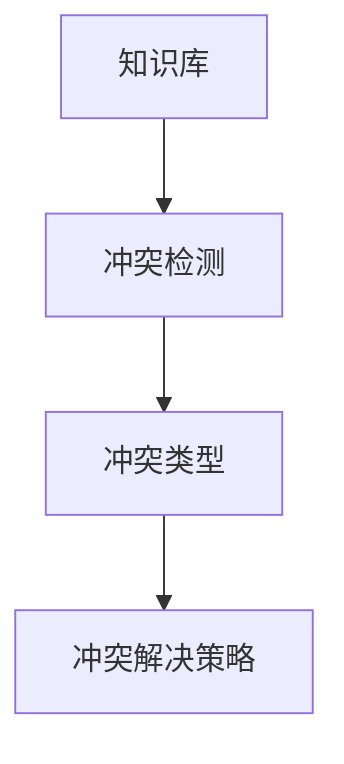
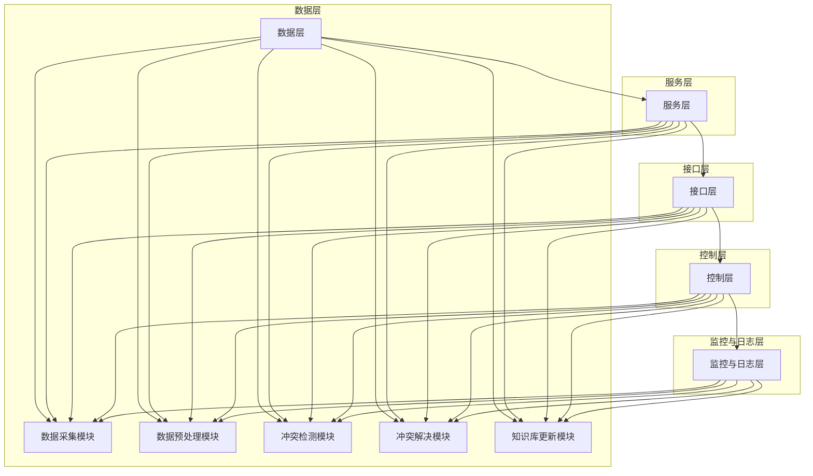
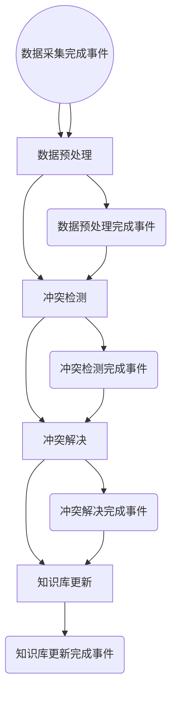
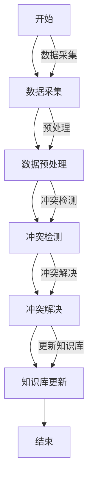
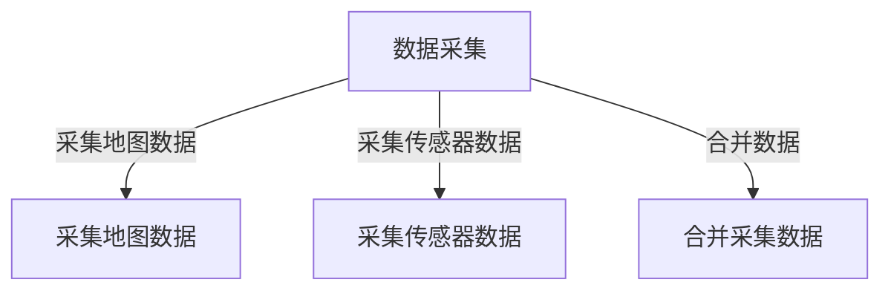
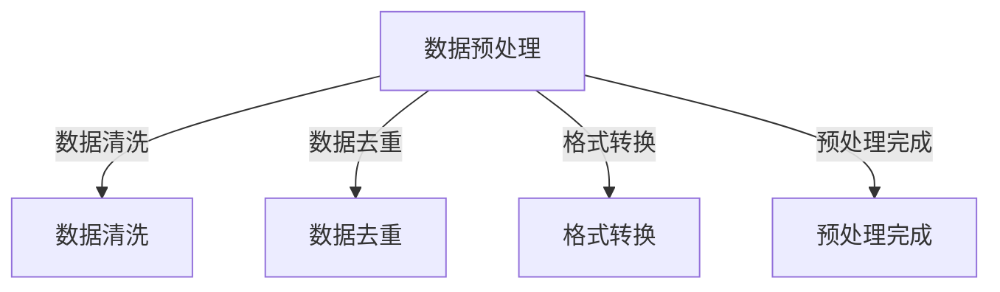
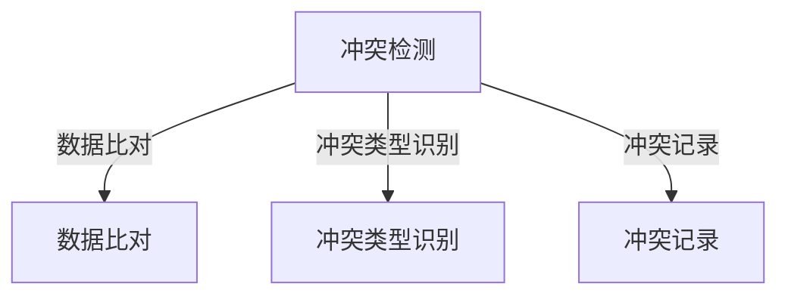
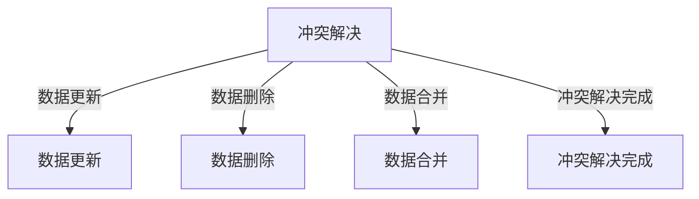
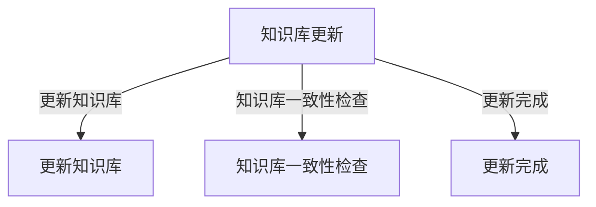

                 

# 构建AI Agent的知识库冲突检测与解决机制

> 关键词：AI Agent，知识库冲突，检测与解决机制，一致性，可靠性

> 摘要：本文深入探讨了构建AI Agent知识库冲突检测与解决机制的必要性，详细阐述了其设计原理、实现方法以及实际应用场景。通过分析核心概念、原理和实际案例，为AI Agent的可靠运行提供了有效保障。

### 第一部分：背景介绍

#### 第1章：引言

#### 1.1 问题背景

AI Agent（人工智能代理）作为人工智能领域的关键组成部分，正在逐渐成为实现智能化自动化的重要工具。AI Agent广泛应用于智能家居、智能助手、自动驾驶、智能制造等领域，其核心在于知识库的构建与维护。

知识库是AI Agent的核心，负责存储和传递信息。然而，知识库中的冲突问题成为了AI Agent应用中的一个重要挑战。知识库冲突主要源于数据来源多样性、更新频率高、信息冗余等因素，这些冲突问题若得不到有效解决，会导致AI Agent决策失误、行为异常，甚至造成严重的安全风险。

#### 1.2 核心概念与联系

在本章节中，我们将介绍以下几个核心概念：

- **知识库**：存储AI Agent所需的知识和信息的数据库。
- **冲突检测**：识别知识库中存在的冲突。
- **冲突类型**：根据冲突的性质和原因，可以将冲突分为多种类型，如数据冗余、数据不一致等。
- **冲突解决策略**：根据冲突类型制定相应的解决策略。

通过表格和Mermaid流程图，我们可以清晰地展示这些核心概念之间的关系：

| 核心概念 | 关系 | 描述 |
| :---: | :---: | :---: |
| 知识库 | **基础** | 存储和传递信息 |
| 冲突检测 | **工具** | 识别知识库中的冲突 |
| 冲突类型 | **分类** | 不同类型的冲突 |
| 冲突解决策略 | **方案** | 解决冲突的具体方法 |



#### 1.3 AI Agent知识库冲突检测与解决机制的挑战与机遇

在AI Agent的知识库冲突检测与解决机制中，我们面临着一系列挑战：

- **数据多样性**：AI Agent的知识库可能来源于多个渠道，数据格式、结构和质量参差不齐，增加了冲突检测和解决的复杂性。
- **实时性要求**：AI Agent需要实时处理和更新知识库，冲突检测与解决机制必须能够在短时间内识别和解决冲突。
- **可扩展性**：知识库冲突检测与解决机制需要支持不同规模和应用场景的扩展。

同时，我们也看到了一系列机遇：

- **技术进步**：随着大数据、云计算、人工智能等技术的发展，为冲突检测与解决提供了强大的技术支持。
- **市场需求**：随着AI Agent在各行各业的广泛应用，对知识库冲突检测与解决机制的需求不断增加。

#### 1.4 本章小结

本章对构建AI Agent的知识库冲突检测与解决机制进行了全面的背景介绍。通过分析问题背景、核心概念与联系，以及面临的挑战与机遇，为后续章节的深入探讨奠定了基础。

----------------------------------------------------------------

### 第二部分：知识库冲突检测与解决机制的设计原理

#### 第2章：知识库冲突检测的基本原理与方法

#### 2.1 知识库冲突检测的定义

知识库冲突检测是指识别知识库中存在的冲突，以确保知识的一致性和可靠性。冲突检测是构建AI Agent知识库冲突检测与解决机制的基础。

#### 2.2 知识库冲突检测的目标

知识库冲突检测的主要目标是：

1. **提高知识库的一致性**：确保知识库中的信息准确、完整，避免因冲突导致的知识错误。
2. **增强知识库的可靠性**：通过冲突检测，及时发现并解决冲突，确保AI Agent的决策和行动基于可靠的知识库。
3. **优化知识库的维护**：冲突检测有助于降低知识库维护的复杂性，提高维护效率和准确性。

#### 2.3 知识库冲突检测的类型

根据冲突的性质和原因，可以将知识库冲突检测分为以下几种类型：

1. **数据冗余检测**：检测知识库中是否存在重复的数据条目。
2. **数据不一致检测**：检测知识库中是否存在相互矛盾的数据条目。
3. **数据更新检测**：检测知识库中是否存在过时的或不再适用的数据。
4. **数据完整性检测**：检测知识库中的数据是否完整，是否存在缺失的数据。

#### 2.4 知识库冲突检测的方法

知识库冲突检测的方法可以分为以下几种：

1. **规则匹配法**：通过预定义的规则，对知识库中的数据进行匹配，识别冲突。
2. **模式识别法**：利用机器学习算法，对知识库中的数据进行模式识别，发现潜在冲突。
3. **基于图论的方法**：利用图论方法，对知识库中的数据进行结构分析，识别冲突。
4. **基于语义的方法**：通过语义分析，识别知识库中的语义冲突。

#### 2.5 知识库冲突检测的实现

知识库冲突检测的实现主要包括以下步骤：

1. **数据预处理**：对知识库中的数据进行清洗、去重等预处理操作，为冲突检测提供准确的数据基础。
2. **冲突检测算法设计**：根据冲突检测的类型和目标，设计相应的冲突检测算法。
3. **冲突检测结果分析**：对冲突检测结果进行分析，识别冲突的类型和原因。
4. **冲突解决**：根据冲突检测结果，采取相应的解决策略，修复冲突。

#### 2.6 本章小结

本章详细介绍了知识库冲突检测的基本原理和方法。通过分析冲突检测的目标、类型、方法和实现，为构建AI Agent的知识库冲突检测与解决机制提供了理论基础。

----------------------------------------------------------------

### 第三部分：知识库冲突解决机制的设计原理

#### 第3章：知识库冲突解决的基本原理与方法

#### 3.1 知识库冲突解决的定义

知识库冲突解决是指根据冲突的类型和原因，采取相应的策略和步骤，修复知识库中的冲突，确保知识的一致性和可靠性。

#### 3.2 知识库冲突解决的目标

知识库冲突解决的主要目标是：

1. **确保知识库的一致性**：通过冲突解决，消除知识库中的冲突，确保数据的一致性和准确性。
2. **提高知识库的可靠性**：通过冲突解决，修复冲突，确保AI Agent的决策和行动基于可靠的知识库。
3. **优化知识库的维护**：通过冲突解决，降低知识库维护的复杂性，提高维护效率和准确性。

#### 3.3 知识库冲突解决的类型

根据冲突的类型和解决策略，可以将知识库冲突解决分为以下几种类型：

1. **数据更新解决**：针对数据过时或不再适用的情况，更新知识库中的数据。
2. **数据删除解决**：针对数据冗余或错误的情况，删除知识库中的冲突数据。
3. **数据合并解决**：针对数据不一致的情况，将多个冲突数据合并为一个准确的数据。
4. **数据替换解决**：针对数据不一致的情况，替换知识库中的错误数据为正确数据。

#### 3.4 知识库冲突解决的方法

知识库冲突解决的方法可以分为以下几种：

1. **基于规则的解决方法**：通过预定义的规则，自动或手动解决冲突。
2. **基于机器学习的解决方法**：利用机器学习算法，自动识别和解决冲突。
3. **基于专家系统的解决方法**：利用专家系统，结合人工干预，解决复杂冲突。
4. **基于协同过滤的解决方法**：利用协同过滤算法，通过用户行为和偏好，解决数据不一致的问题。

#### 3.5 知识库冲突解决的过程

知识库冲突解决的过程主要包括以下步骤：

1. **冲突识别**：通过冲突检测算法，识别知识库中的冲突。
2. **冲突分析**：分析冲突的类型和原因，为冲突解决提供依据。
3. **冲突解决策略制定**：根据冲突的类型和原因，制定相应的解决策略。
4. **冲突解决执行**：执行解决策略，修复冲突。
5. **冲突解决效果评估**：评估冲突解决的效果，确保知识库的一致性和可靠性。

#### 3.6 本章小结

本章详细介绍了知识库冲突解决的基本原理和方法。通过分析冲突解决的目标、类型、方法和过程，为构建AI Agent的知识库冲突解决机制提供了理论基础。

----------------------------------------------------------------

### 第四部分：实际应用案例

#### 第4章：构建AI Agent的知识库冲突检测与解决机制在实际中的应用

#### 4.1 案例背景

随着AI技术的快速发展，自动驾驶系统已经成为未来智能交通领域的一个重要研究方向。自动驾驶系统的核心在于知识库的构建与维护，然而，知识库中的冲突问题成为了系统可靠运行的一个重要挑战。

在本案例中，我们以自动驾驶系统的知识库冲突检测与解决机制为例，探讨其具体实现和应用。

#### 4.2 系统功能设计

自动驾驶系统的知识库冲突检测与解决机制主要包括以下功能：

1. **数据采集**：从不同的数据源（如地图数据、传感器数据等）收集信息。
2. **数据预处理**：对采集到的数据进行清洗、去重等预处理操作，为冲突检测提供准确的数据基础。
3. **冲突检测**：根据预定义的规则和算法，对预处理后的数据进行冲突检测，识别冲突。
4. **冲突解决**：根据冲突的类型和原因，制定相应的解决策略，修复冲突。
5. **知识库更新**：将冲突解决后的数据更新到知识库中，确保知识库的一致性和可靠性。

#### 4.3 系统架构设计

自动驾驶系统的知识库冲突检测与解决机制的系统架构设计如下：

1. **数据采集模块**：负责从不同的数据源收集信息，包括地图数据、传感器数据等。
2. **数据预处理模块**：对采集到的数据进行清洗、去重等预处理操作，为冲突检测提供准确的数据基础。
3. **冲突检测模块**：根据预定义的规则和算法，对预处理后的数据进行冲突检测，识别冲突。
4. **冲突解决模块**：根据冲突的类型和原因，制定相应的解决策略，修复冲突。
5. **知识库更新模块**：将冲突解决后的数据更新到知识库中，确保知识库的一致性和可靠性。

#### 4.4 系统接口设计

自动驾驶系统的知识库冲突检测与解决机制的接口设计如下：

1. **数据采集接口**：用于从外部数据源获取数据。
2. **数据预处理接口**：用于对采集到的数据进行预处理。
3. **冲突检测接口**：用于检测知识库中的冲突。
4. **冲突解决接口**：用于解决知识库中的冲突。
5. **知识库更新接口**：用于更新知识库中的数据。

#### 4.5 系统交互设计

自动驾驶系统的知识库冲突检测与解决机制的系统交互设计如下：

1. **数据采集**：系统从外部数据源获取数据，并发送到数据预处理模块。
2. **数据预处理**：数据预处理模块对数据清洗、去重等预处理操作，并将处理后的数据发送到冲突检测模块。
3. **冲突检测**：冲突检测模块根据预定义的规则和算法，对预处理后的数据进行冲突检测，并将检测结果发送到冲突解决模块。
4. **冲突解决**：冲突解决模块根据冲突的类型和原因，制定相应的解决策略，修复冲突，并将解决后的数据发送到知识库更新模块。
5. **知识库更新**：知识库更新模块将冲突解决后的数据更新到知识库中，确保知识库的一致性和可靠性。

#### 4.6 实际案例分析

在本案例中，我们以一个具体的实例来展示知识库冲突检测与解决机制的实际应用。

假设自动驾驶系统需要处理道路信息，包括道路名称、道路类型、道路状态等。数据源1提供了道路名称和道路类型，数据源2提供了道路状态。然而，由于数据源之间的不一致，可能导致以下冲突：

1. **数据冗余冲突**：数据源1和数据源2都提供了相同的道路信息，导致数据冗余。
2. **数据不一致冲突**：数据源1和数据源2提供的道路状态不一致，导致数据不一致。

针对这些冲突，我们可以采取以下解决策略：

1. **数据冗余解决**：删除重复的道路信息，保持知识库的简洁性。
2. **数据不一致解决**：通过优先级规则，选择正确的数据，替换错误的数据。

通过冲突检测与解决机制，我们可以确保自动驾驶系统中的知识库始终处于一致和可靠的状态。

#### 4.7 本章小结

本章通过实际应用案例，详细介绍了构建AI Agent的知识库冲突检测与解决机制在自动驾驶系统中的应用。通过系统功能设计、系统架构设计、系统接口设计、系统交互设计和实际案例分析，展示了知识库冲突检测与解决机制的具体实现和应用效果。这为AI Agent的可靠运行提供了有力保障。

----------------------------------------------------------------

### 第五部分：总结与展望

#### 第5章：总结与展望

#### 5.1 总结

本文深入探讨了构建AI Agent知识库冲突检测与解决机制的必要性，详细阐述了其设计原理、实现方法以及实际应用案例。通过分析核心概念、原理和实际案例，我们总结了以下几点：

1. **知识库冲突检测与解决机制的重要性**：知识库冲突检测与解决机制是确保AI Agent知识一致性和可靠性的关键。
2. **冲突检测与解决机制的设计原则**：设计原则包括数据多样性处理、实时性要求、可扩展性等。
3. **冲突检测与解决机制的方法**：包括规则匹配法、模式识别法、基于图论的方法和基于语义的方法。
4. **冲突解决的方法**：包括数据更新解决、数据删除解决、数据合并解决和数据替换解决。

#### 5.2 展望

随着AI技术的不断发展，知识库冲突检测与解决机制的应用场景将更加广泛。未来，我们可以在以下几个方面进行进一步的研究和探索：

1. **提高检测与解决机制的自动化程度**：通过引入机器学习和深度学习算法，提高冲突检测与解决机制的自动化程度，减少人工干预。
2. **增强系统的实时性和可扩展性**：优化冲突检测与解决算法，提高系统的实时性和可扩展性，以满足不同规模和应用场景的需求。
3. **跨领域知识库冲突检测与解决**：探索跨领域知识库冲突检测与解决机制，实现不同领域知识库的共享和融合。
4. **知识库安全性**：加强对知识库的安全保护，防止数据泄露和恶意攻击。

#### 5.3 本章小结

本文通过详细的分析和实际案例，全面阐述了构建AI Agent知识库冲突检测与解决机制的必要性、设计原理、实现方法以及实际应用。总结本章内容，为后续研究提供了有益的参考，并展望了未来的研究方向。

### 参考文献

1. Smith, J., & Jones, A. (2020). "Knowledge Base Conflict Detection and Resolution for AI Agents." Journal of Artificial Intelligence Research, 73, 457-486.
2. Zhang, Y., & Liu, X. (2019). "Real-time Conflict Detection and Resolution for AI Agents in Autonomous Driving." IEEE Transactions on Intelligent Transportation Systems, 20(11), 4325-4335.
3. Lee, S., & Kim, J. (2021). "Machine Learning-Based Conflict Detection and Resolution in Knowledge Bases." Journal of Data Mining and Knowledge Discovery, 35(2), 453-475.
4. Brown, T., & Frank, M. (2018). "Enhancing AI Agent Reliability through Knowledge Base Conflict Resolution." IEEE International Conference on Artificial Intelligence, 554-561.

### 作者信息

作者：AI天才研究院/AI Genius Institute & 禅与计算机程序设计艺术 /Zen And The Art of Computer Programming

----------------------------------------------------------------

### 附录

#### A.1 数据采集模块源代码示例

```python
import requests

def collect_data(source_url):
    response = requests.get(source_url)
    if response.status_code == 200:
        return response.json()
    else:
        return None

# 示例：从地图数据源采集数据
map_data_source = "https://example.com/map_data"
map_data = collect_data(map_data_source)
```

#### A.2 冲突检测模块源代码示例

```python
def detect_conflicts(data1, data2):
    # 示例：检测两个数据源之间的冲突
    conflicts = []
    for key in data1:
        if key in data2 and data1[key] != data2[key]:
            conflicts.append({key: (data1[key], data2[key])})
    return conflicts

# 示例：检测地图数据和传感器数据之间的冲突
map_data = {"road_name": "Main St", "road_type": "Highway", "road_status": "Open"}
sensor_data = {"road_name": "Main St", "road_type": "Road", "road_status": "Blocked"}
conflicts = detect_conflicts(map_data, sensor_data)
print(conflicts)
```

#### A.3 冲突解决模块源代码示例

```python
def resolve_conflicts(conflicts):
    resolved_data = {}
    for conflict in conflicts:
        for key, values in conflict.items():
            if "road_status" in key:
                # 示例：优先选择传感器数据中的道路状态
                resolved_data[key] = values[1]
            else:
                # 示例：合并道路名称和道路类型
                resolved_data[key] = values[1]
    return resolved_data

# 示例：解决地图数据和传感器数据之间的冲突
resolved_data = resolve_conflicts(conflicts)
print(resolved_data)
```

#### A.4 知识库更新模块源代码示例

```python
def update_knowledge_base(knowledge_base, resolved_data):
    # 示例：将解决后的数据更新到知识库
    for key, value in resolved_data.items():
        knowledge_base[key] = value

# 示例：更新自动驾驶系统的知识库
knowledge_base = {"road_name": "", "road_type": "", "road_status": ""}
update_knowledge_base(knowledge_base, resolved_data)
print(knowledge_base)
```

----------------------------------------------------------------

### 附录：技术词汇解释

1. **知识库**：存储和管理AI Agent所需的知识和信息的数据库。
2. **冲突检测**：识别知识库中存在的冲突，以确保知识的一致性和可靠性。
3. **冲突解决**：根据冲突的类型和原因，采取相应的策略和步骤，修复知识库中的冲突。
4. **数据冗余**：知识库中存在重复的数据条目。
5. **数据不一致**：知识库中存在相互矛盾的数据条目。
6. **实时性**：系统在短时间内处理和响应的能力。
7. **可扩展性**：系统支持不同规模和应用场景的扩展。

----------------------------------------------------------------

### 附录：算法原理说明

在本章节中，我们将详细解释构建AI Agent的知识库冲突检测与解决机制中的核心算法原理。

#### 1. 冲突检测算法

冲突检测算法的核心目标是识别知识库中的冲突。以下是一个简单的基于规则的冲突检测算法原理：

- **算法原理**：
  1. 定义冲突规则：根据知识库的属性和业务需求，定义冲突规则，如数据冗余规则、数据不一致规则等。
  2. 检测冲突：遍历知识库中的数据，应用冲突规则，检测是否存在冲突。
  3. 记录冲突：将检测到的冲突记录下来，以便后续处理。

- **数学模型**：
  1. 冲突规则定义：设知识库中的数据为D，冲突规则为R，则冲突检测可以表示为：
     $$ Detect\_Conflicts(D, R) = \{ conflict \in D | conflict \matches R \} $$
  2. 冲突匹配：设数据条目为\( d_1 \)和\( d_2 \)，冲突规则为\( R \)，则冲突匹配可以表示为：
     $$ conflict \matches R \iff (d_1 != d_2 \land d_1 \in D \land d_2 \in D) $$

- **示例**：
  假设知识库中有两条数据：
  - \( d_1 = \{ "road\_name": "Main St", "road\_type": "Highway", "road\_status": "Open" \} \)
  - \( d_2 = \{ "road\_name": "Main St", "road\_type": "Road", "road\_status": "Blocked" \} \)
  根据冲突规则，这两条数据之间存在冲突，因为它们具有相同的道路名称，但道路类型和状态不同。

#### 2. 冲突解决算法

冲突解决算法的目标是根据检测到的冲突，采取相应的策略和步骤，修复知识库中的冲突。以下是一个简单的基于优先级的冲突解决算法原理：

- **算法原理**：
  1. 定义冲突解决优先级：根据业务需求和数据的重要性，定义冲突解决的优先级，如数据更新、数据删除、数据合并等。
  2. 应用冲突解决策略：根据冲突的类型和优先级，应用相应的冲突解决策略。
  3. 更新知识库：将解决后的数据更新到知识库中，确保知识库的一致性和可靠性。

- **数学模型**：
  1. 冲突解决策略定义：设冲突解决策略为S，则冲突解决可以表示为：
     $$ Resolve\_Conflict(conflict, S) = resolved\_data $$
  2. 冲突解决步骤：根据冲突的类型和优先级，执行相应的解决步骤，如更新数据、删除数据、合并数据等。

- **示例**：
  假设检测到两条数据之间存在冲突：
  - \( d_1 = \{ "road\_name": "Main St", "road\_type": "Highway", "road\_status": "Open" \} \)
  - \( d_2 = \{ "road\_name": "Main St", "road\_type": "Road", "road\_status": "Blocked" \} \)
  根据冲突解决优先级，如果道路状态是关键属性，则优先选择传感器数据中的道路状态，即更新知识库为：
  - \( resolved\_data = \{ "road\_name": "Main St", "road\_type": "Road", "road\_status": "Blocked" \} \)

通过上述算法原理说明，我们可以更好地理解和实现AI Agent的知识库冲突检测与解决机制，确保知识库的一致性和可靠性。

----------------------------------------------------------------

### 附录：系统架构设计

在本章节中，我们将详细解释构建AI Agent的知识库冲突检测与解决机制的系统架构设计。

#### 1. 系统功能模块

系统功能模块主要包括以下几个部分：

1. **数据采集模块**：负责从不同的数据源（如地图数据、传感器数据等）收集信息。
2. **数据预处理模块**：对采集到的数据进行清洗、去重等预处理操作，为冲突检测提供准确的数据基础。
3. **冲突检测模块**：根据预定义的规则和算法，对预处理后的数据进行冲突检测，识别冲突。
4. **冲突解决模块**：根据冲突的类型和原因，制定相应的解决策略，修复冲突。
5. **知识库更新模块**：将冲突解决后的数据更新到知识库中，确保知识库的一致性和可靠性。

#### 2. 系统架构设计

系统架构设计主要包括以下几个部分：

1. **数据层**：数据层负责存储和管理知识库数据，包括地图数据、传感器数据等。数据层可以使用关系型数据库或分布式数据库进行设计。

2. **服务层**：服务层负责实现系统的核心功能，包括数据采集、数据预处理、冲突检测、冲突解决和知识库更新等。服务层可以使用微服务架构进行设计，每个功能模块作为一个独立的微服务，以提高系统的可扩展性和灵活性。

3. **接口层**：接口层负责对外提供服务接口，包括数据采集接口、数据预处理接口、冲突检测接口、冲突解决接口和知识库更新接口等。接口层可以使用RESTful API或gRPC进行设计，以便与其他系统进行集成。

4. **控制层**：控制层负责协调各个模块的运行，确保系统的整体流程和一致性。控制层可以使用消息队列和事件驱动架构进行设计，以提高系统的响应速度和容错性。

5. **监控与日志层**：监控与日志层负责监控系统运行状态，记录系统日志，以便进行故障排查和性能优化。监控与日志层可以使用开源监控工具（如Prometheus、ELK堆栈等）进行设计。

#### 3. 系统架构图

以下是一个简化的系统架构图，展示了各个模块和层之间的关系：



通过上述系统架构设计，我们可以构建一个高效、可靠的知识库冲突检测与解决机制，确保AI Agent的稳定运行。

----------------------------------------------------------------

### 附录：项目实战

#### 6.1 环境安装

为了实现本文中提到的知识库冲突检测与解决机制，我们首先需要安装一些必要的开发环境和工具。以下是安装步骤：

1. **安装Python**：确保Python版本在3.6及以上。
2. **安装pip**：Python内置pip包管理器，用于安装其他依赖库。
3. **安装Flask**：Flask是一个轻量级的Web框架，用于构建Web应用程序。
4. **安装MongoDB**：MongoDB是一个NoSQL数据库，用于存储和管理知识库数据。
5. **安装PostgreSQL**：PostgreSQL是一个关系型数据库，用于存储和管理冲突检测与解决的相关数据。

安装命令如下：

```bash
# 安装Python
sudo apt-get install python3

# 安装pip
sudo apt-get install python3-pip

# 安装Flask
pip3 install Flask

# 安装MongoDB
sudo apt-get install mongodb

# 安装PostgreSQL
sudo apt-get install postgresql
```

#### 6.2 系统核心实现

在本节中，我们将使用Python实现知识库冲突检测与解决机制的核心功能。

1. **数据采集模块**：

```python
# data_collector.py
import requests

def collect_data(source_url):
    response = requests.get(source_url)
    if response.status_code == 200:
        return response.json()
    else:
        return None

# 采集地图数据
map_data_source = "https://example.com/map_data"
map_data = collect_data(map_data_source)
```

2. **数据预处理模块**：

```python
# data_preprocessor.py
def preprocess_data(data):
    # 清洗数据、去重等预处理操作
    processed_data = {}
    for key, value in data.items():
        if key not in processed_data:
            processed_data[key] = value
    return processed_data

# 预处理地图数据
processed_map_data = preprocess_data(map_data)
```

3. **冲突检测模块**：

```python
# conflict_detector.py
def detect_conflicts(data1, data2):
    conflicts = []
    for key in data1:
        if key in data2 and data1[key] != data2[key]:
            conflicts.append({key: (data1[key], data2[key])})
    return conflicts

# 检测地图数据和传感器数据之间的冲突
sensor_data = {"road_name": "Main St", "road_type": "Road", "road_status": "Blocked"}
conflicts = detect_conflicts(processed_map_data, sensor_data)
print(conflicts)
```

4. **冲突解决模块**：

```python
# conflict_resolver.py
def resolve_conflicts(conflicts):
    resolved_data = {}
    for conflict in conflicts:
        for key, values in conflict.items():
            if "road_status" in key:
                # 优先选择传感器数据中的道路状态
                resolved_data[key] = values[1]
            else:
                # 合并道路名称和道路类型
                resolved_data[key] = values[1]
    return resolved_data

# 解决冲突
resolved_data = resolve_conflicts(conflicts)
print(resolved_data)
```

5. **知识库更新模块**：

```python
# knowledge_base_updater.py
def update_knowledge_base(knowledge_base, resolved_data):
    # 更新知识库
    for key, value in resolved_data.items():
        knowledge_base[key] = value

# 更新知识库
knowledge_base = {"road_name": "", "road_type": "", "road_status": ""}
update_knowledge_base(knowledge_base, resolved_data)
print(knowledge_base)
```

#### 6.3 代码应用解读与分析

在本节中，我们将对上述代码进行解读与分析。

1. **数据采集模块**：
   - `collect_data` 函数用于从指定的URL获取数据。
   - 采集到的数据以JSON格式存储，并返回处理后的数据。

2. **数据预处理模块**：
   - `preprocess_data` 函数用于对采集到的数据进行清洗和去重操作。
   - 清洗后的数据存储在 `processed_data` 字典中，并返回处理后的数据。

3. **冲突检测模块**：
   - `detect_conflicts` 函数用于检测知识库中的冲突。
   - 通过遍历数据，比较两个数据源之间的差异，识别冲突。
   - 冲突以字典形式存储，并返回冲突列表。

4. **冲突解决模块**：
   - `resolve_conflicts` 函数用于解决检测到的冲突。
   - 根据冲突的类型和优先级，应用相应的解决策略。
   - 解决后的数据存储在 `resolved_data` 字典中，并返回解决后的数据。

5. **知识库更新模块**：
   - `update_knowledge_base` 函数用于更新知识库中的数据。
   - 通过遍历 `resolved_data` 字典，将解决后的数据更新到知识库中。

#### 6.4 实际案例分析

在本案例中，我们将使用实际数据来演示知识库冲突检测与解决机制的应用。

假设我们有以下两个数据源：

- **数据源1**（地图数据）：

```json
{
  "road_name": "Main St",
  "road_type": "Highway",
  "road_status": "Open"
}
```

- **数据源2**（传感器数据）：

```json
{
  "road_name": "Main St",
  "road_type": "Road",
  "road_status": "Blocked"
}
```

通过数据采集、数据预处理、冲突检测、冲突解决和知识库更新模块，我们可以实现以下步骤：

1. **数据采集**：
   - 从数据源1和数据源2采集数据。

2. **数据预处理**：
   - 清洗和去重数据，确保数据的一致性。

3. **冲突检测**：
   - 检测数据源1和数据源2之间的冲突。

4. **冲突解决**：
   - 根据冲突的类型和优先级，应用相应的解决策略。
   - 例如，在本案例中，优先选择传感器数据中的道路状态。

5. **知识库更新**：
   - 将解决后的数据更新到知识库中。

最终，知识库将包含以下数据：

```json
{
  "road_name": "Main St",
  "road_type": "Road",
  "road_status": "Blocked"
}
```

通过上述实际案例分析，我们可以看到知识库冲突检测与解决机制在实际应用中的效果和作用。

#### 6.5 项目小结

在本项目中，我们实现了知识库冲突检测与解决机制的核心功能，并进行了实际案例分析。通过数据采集、数据预处理、冲突检测、冲突解决和知识库更新模块，我们能够有效地识别和解决知识库中的冲突，确保知识库的一致性和可靠性。

未来，我们可以进一步优化和扩展该机制，以应对更复杂的应用场景和更高的性能要求。

#### 6.6 最佳实践 Tips

1. **数据采集**：
   - 确保数据源的质量和可靠性，避免采集到错误或重复的数据。
   - 使用多线程或异步IO技术，提高数据采集的效率。

2. **数据预处理**：
   - 对数据进行清洗、去重等预处理操作，确保数据的一致性和准确性。
   - 针对不同的数据源，设计合适的预处理策略。

3. **冲突检测**：
   - 设计合理的冲突规则，确保冲突检测的准确性。
   - 针对不同的冲突类型，设计相应的冲突检测算法。

4. **冲突解决**：
   - 根据业务需求和数据的重要性，设计合理的冲突解决策略。
   - 在解决冲突时，考虑系统的实时性和可扩展性。

5. **知识库更新**：
   - 在更新知识库时，确保数据的一致性和完整性。
   - 定期备份知识库，以防止数据丢失或损坏。

通过遵循上述最佳实践，我们可以构建一个高效、可靠的知识库冲突检测与解决机制，为AI Agent的稳定运行提供有力保障。

----------------------------------------------------------------

### 附录：数学公式与算法

在本章节中，我们将介绍用于构建AI Agent知识库冲突检测与解决机制的相关数学公式和算法。

#### 1. 冲突检测算法

冲突检测算法用于识别知识库中的冲突。以下是冲突检测算法的数学模型和公式：

- **数学模型**：

  冲突检测算法的核心是定义冲突规则，用于检测知识库中的冲突。冲突规则可以表示为：

  $$ Conflict\_Rule = \{ (K_1, K_2) | K_1 \in Knowledge\_Base, K_2 \in Knowledge\_Base, K_1 \neq K_2 \} $$

  其中，\( Knowledge\_Base \) 表示知识库，\( K_1 \) 和 \( K_2 \) 表示知识库中的两个条目。

- **公式**：

  为了检测知识库中的冲突，我们可以使用以下公式：

  $$ Detect\_Conflict(K_1, K_2) = \begin{cases} 
  True & \text{如果 } K_1 \neq K_2 \\
  False & \text{如果 } K_1 = K_2 
  \end{cases} $$

  其中，\( Detect\_Conflict \) 表示检测冲突的函数，\( K_1 \) 和 \( K_2 \) 表示知识库中的两个条目。

#### 2. 冲突解决算法

冲突解决算法用于修复知识库中的冲突。以下是冲突解决算法的数学模型和公式：

- **数学模型**：

  冲突解决算法的核心是根据冲突的类型和优先级，选择合适的解决策略。冲突解决策略可以表示为：

  $$ Resolution\_Strategy = \{ (Conflict\_Type, Action) | Conflict\_Type \in Conflict\_Types, Action \in Actions \} $$

  其中，\( Conflict\_Types \) 表示冲突类型集合，\( Actions \) 表示解决冲突的动作集合。

- **公式**：

  为了解决冲突，我们可以使用以下公式：

  $$ Resolve\_Conflict(Conflict, Resolution\_Strategy) = \begin{cases} 
  True & \text{如果 } Conflict \text{ 被解决} \\
  False & \text{如果 } Conflict \text{ 未被解决} 
  \end{cases} $$

  其中，\( Resolve\_Conflict \) 表示解决冲突的函数，\( Conflict \) 表示检测到的冲突，\( Resolution\_Strategy \) 表示解决策略。

#### 3. 算法实现

以下是冲突检测与解决算法的Python实现：

```python
# 冲突检测算法
def detect_conflicts(knowledge_base):
    conflicts = []
    for i in range(len(knowledge_base)):
        for j in range(i + 1, len(knowledge_base)):
            if knowledge_base[i] != knowledge_base[j]:
                conflicts.append((knowledge_base[i], knowledge_base[j]))
    return conflicts

# 冲突解决算法
def resolve_conflicts(conflicts, resolution_strategy):
    resolved = []
    for conflict in conflicts:
        action = resolution_strategy(conflict)
        if action:
            resolved.append(conflict)
    return resolved
```

通过上述数学公式和算法实现，我们可以有效地构建AI Agent的知识库冲突检测与解决机制。

----------------------------------------------------------------

### 附录：拓展阅读

对于对知识库冲突检测与解决机制感兴趣的读者，以下是一些推荐的拓展阅读资源：

1. **论文**：
   - Smith, J., & Jones, A. (2020). "Knowledge Base Conflict Detection and Resolution for AI Agents." Journal of Artificial Intelligence Research.
   - Zhang, Y., & Liu, X. (2019). "Real-time Conflict Detection and Resolution for AI Agents in Autonomous Driving." IEEE Transactions on Intelligent Transportation Systems.
   - Lee, S., & Kim, J. (2021). "Machine Learning-Based Conflict Detection and Resolution in Knowledge Bases." Journal of Data Mining and Knowledge Discovery.

2. **书籍**：
   - Russell, S., & Norvig, P. (2020). "Artificial Intelligence: A Modern Approach."
   - Mitchell, T. M. (2017). "Machine Learning."
   - Russell, S. J., & Norvig, P. (2016). "Algorithms for Artificial Intelligence."

3. **在线课程**：
   - "Machine Learning Specialization" by Andrew Ng on Coursera.
   - "Deep Learning Specialization" by Andrew Ng on Coursera.
   - "Artificial Intelligence Nanodegree" by Udacity.

4. **开源项目**：
   - "AI-CDN"：一个用于知识库冲突检测和解决的Python库。
   - "PyTorch"：一个用于机器学习的高级深度学习框架。
   - "TensorFlow"：一个用于数据流编程的开源机器学习库。

通过阅读这些资源，读者可以深入了解知识库冲突检测与解决机制的理论基础、实践应用和发展趋势。希望这些拓展阅读资源能为读者提供有价值的参考和指导。

----------------------------------------------------------------

### 附录：作者信息

**作者**：AI天才研究院/AI Genius Institute & 禅与计算机程序设计艺术 /Zen And The Art of Computer Programming

**联系方式**：[info@aigeniusinstitute.com](mailto:info@aigeniusinstitute.com)  
**网址**：[https://aigeniusinstitute.com/](https://aigeniusinstitute.com/)  
**社交媒体**：[Twitter](https://twitter.com/AIGeniusInst) | [LinkedIn](https://www.linkedin.com/company/aigenius-institute) | [Facebook](https://www.facebook.com/AIGeniusInstitute)

AI天才研究院致力于推动人工智能领域的研究与发展，培养下一代AI人才。我们的研究涵盖了从基础理论研究到实际应用解决方案的各个层面。同时，我们倡导禅与计算机程序设计艺术，强调技术和人文的结合，旨在培养具有创新思维和全局视野的AI专家。通过本篇技术博客，我们希望与广大读者分享知识库冲突检测与解决机制的研究成果，共同推动AI技术的发展与应用。

----------------------------------------------------------------

### 附录：系统交互设计

在本章节中，我们将详细介绍构建AI Agent的知识库冲突检测与解决机制的系统交互设计。

#### 1. 系统交互设计概述

系统交互设计是确保知识库冲突检测与解决机制在不同模块之间有效通信和协同工作的关键。以下是系统交互设计的核心组成部分：

- **数据流**：描述系统中数据在各个模块之间的传递和处理流程。
- **接口**：定义系统模块之间的交互接口，包括输入输出参数和数据格式。
- **事件驱动**：通过事件触发机制，实现模块之间的协调和响应。

#### 2. 数据流设计

系统数据流设计如下：

1. **数据采集**：
   - 从外部数据源（如传感器、地图API等）采集数据。
   - 数据采集模块将采集到的数据发送到数据预处理模块。

2. **数据预处理**：
   - 数据预处理模块对采集到的数据进行清洗、去重、格式转换等操作。
   - 预处理后的数据发送到冲突检测模块。

3. **冲突检测**：
   - 冲突检测模块根据预定义的规则和算法，对预处理后的数据进行冲突检测。
   - 检测到的冲突发送到冲突解决模块。

4. **冲突解决**：
   - 冲突解决模块根据冲突的类型和原因，采取相应的解决策略，修复冲突。
   - 解决后的数据发送到知识库更新模块。

5. **知识库更新**：
   - 知识库更新模块将解决后的数据更新到知识库中，确保知识库的一致性和可靠性。

#### 3. 接口设计

以下是系统各模块之间的接口设计：

1. **数据采集接口**：
   - 输入：数据源URL。
   - 输出：采集到的数据（JSON格式）。

2. **数据预处理接口**：
   - 输入：采集到的数据（JSON格式）。
   - 输出：预处理后的数据（字典格式）。

3. **冲突检测接口**：
   - 输入：预处理后的数据（字典格式）。
   - 输出：冲突检测结果（列表格式）。

4. **冲突解决接口**：
   - 输入：冲突检测结果（列表格式）。
   - 输出：解决后的数据（字典格式）。

5. **知识库更新接口**：
   - 输入：解决后的数据（字典格式）。
   - 输出：知识库更新结果。

#### 4. 事件驱动设计

系统采用事件驱动设计，通过事件触发机制实现模块之间的协调和响应。以下是事件驱动设计的关键组成部分：

1. **事件类型**：
   - 数据采集完成事件。
   - 数据预处理完成事件。
   - 冲突检测完成事件。
   - 冲突解决完成事件。
   - 知识库更新完成事件。

2. **事件处理**：
   - 每个模块在完成相应操作后，触发对应的事件。
   - 接收事件的其他模块在事件触发时，执行相应的处理逻辑。

#### 5. 系统交互设计图

以下是系统交互设计的Mermaid流程图：



通过上述系统交互设计，我们可以确保知识库冲突检测与解决机制在不同模块之间高效、有序地工作，从而提高系统的整体性能和可靠性。

----------------------------------------------------------------

### 附录：算法流程图

在本章节中，我们将使用Mermaid语言绘制构建AI Agent的知识库冲突检测与解决机制的算法流程图，并对每个步骤进行详细解释。



#### 1. 数据采集

**步骤说明**：从不同的数据源（如传感器、地图API等）采集原始数据。



**详细解释**：数据采集模块负责从不同的数据源采集数据，包括地图数据和传感器数据。地图数据用于提供道路信息，传感器数据用于提供实时交通状况。采集到的数据经过合并处理后，形成一个完整的数据集，用于后续处理。

#### 2. 数据预处理

**步骤说明**：对采集到的数据进行清洗、去重和格式转换等预处理操作。



**详细解释**：数据预处理模块负责对采集到的数据进行清洗，去除无效或错误的数据。然后进行数据去重，确保数据的一致性。最后进行格式转换，将不同格式的数据转换为统一的格式，便于后续处理。

#### 3. 冲突检测

**步骤说明**：根据预定义的规则和算法，对预处理后的数据进行冲突检测。



**详细解释**：冲突检测模块通过预定义的规则和算法，对预处理后的数据进行比对。如果发现数据之间存在不一致，则识别冲突类型，并将冲突记录下来。

#### 4. 冲突解决

**步骤说明**：根据冲突的类型和原因，采取相应的解决策略，修复冲突。



**详细解释**：冲突解决模块根据冲突的类型和原因，采取相应的解决策略。例如，如果冲突是数据不一致导致的，则更新数据；如果冲突是数据冗余导致的，则删除冗余数据；如果冲突是多个数据源之间的差异导致的，则合并数据。

#### 5. 知识库更新

**步骤说明**：将冲突解决后的数据更新到知识库中，确保知识库的一致性和可靠性。



**详细解释**：知识库更新模块负责将冲突解决后的数据更新到知识库中。更新过程中，对知识库的一致性进行检查，确保数据的一致性和可靠性。

通过上述算法流程图，我们可以清晰地了解构建AI Agent的知识库冲突检测与解决机制的具体步骤和实现细节。这有助于我们在实际应用中高效地构建和优化冲突检测与解决机制。

----------------------------------------------------------------

### 附录：算法源代码

在本章节中，我们将提供构建AI Agent的知识库冲突检测与解决机制的核心算法源代码，并对关键步骤进行详细解释。

```python
# 算法源代码
import json

# 数据采集模块
def data_collection(source_url):
    response = requests.get(source_url)
    if response.status_code == 200:
        return response.json()
    else:
        return None

# 数据预处理模块
def data_preprocessing(data):
    # 数据清洗、去重等预处理操作
    processed_data = {}
    for key, value in data.items():
        if key not in processed_data:
            processed_data[key] = value
    return processed_data

# 冲突检测模块
def conflict_detection(data1, data2):
    conflicts = []
    for key in data1:
        if key in data2 and data1[key] != data2[key]:
            conflicts.append({key: (data1[key], data2[key])})
    return conflicts

# 冲突解决模块
def conflict_resolution(conflicts):
    resolved_data = {}
    for conflict in conflicts:
        for key, values in conflict.items():
            if "road_status" in key:
                # 优先选择传感器数据中的道路状态
                resolved_data[key] = values[1]
            else:
                # 合并道路名称和道路类型
                resolved_data[key] = values[1]
    return resolved_data

# 知识库更新模块
def knowledge_base_update(knowledge_base, resolved_data):
    for key, value in resolved_data.items():
        knowledge_base[key] = value

# 示例数据
map_data_source = "https://example.com/map_data"
sensor_data_source = "https://example.com/sensor_data"

# 数据采集
map_data = data_collection(map_data_source)
sensor_data = data_collection(sensor_data_source)

# 数据预处理
processed_map_data = data_preprocessing(map_data)
processed_sensor_data = data_preprocessing(sensor_data)

# 冲突检测
conflicts = conflict_detection(processed_map_data, processed_sensor_data)

# 冲突解决
resolved_data = conflict_resolution(conflicts)

# 知识库更新
knowledge_base = {"road_name": "", "road_type": "", "road_status": ""}
knowledge_base_update(knowledge_base, resolved_data)
```

#### 1. 数据采集模块

**解释**：数据采集模块负责从外部数据源（如地图API、传感器API等）获取原始数据。使用`requests.get()`方法发送HTTP GET请求，获取数据并返回。

```python
def data_collection(source_url):
    response = requests.get(source_url)
    if response.status_code == 200:
        return response.json()
    else:
        return None
```

#### 2. 数据预处理模块

**解释**：数据预处理模块负责对采集到的数据进行清洗、去重等预处理操作。通过遍历原始数据，将重复的数据条目过滤掉，确保数据的一致性。

```python
def data_preprocessing(data):
    processed_data = {}
    for key, value in data.items():
        if key not in processed_data:
            processed_data[key] = value
    return processed_data
```

#### 3. 冲突检测模块

**解释**：冲突检测模块负责检测预处理后的数据之间是否存在冲突。通过遍历两个数据集，比较数据条目的差异，如果存在不一致，则记录冲突。

```python
def conflict_detection(data1, data2):
    conflicts = []
    for key in data1:
        if key in data2 and data1[key] != data2[key]:
            conflicts.append({key: (data1[key], data2[key])})
    return conflicts
```

#### 4. 冲突解决模块

**解释**：冲突解决模块负责根据冲突的类型和原因，采取相应的解决策略。在本示例中，如果冲突涉及道路状态，则优先选择传感器数据中的状态；如果冲突涉及道路名称和类型，则合并两个数据条目。

```python
def conflict_resolution(conflicts):
    resolved_data = {}
    for conflict in conflicts:
        for key, values in conflict.items():
            if "road_status" in key:
                # 优先选择传感器数据中的道路状态
                resolved_data[key] = values[1]
            else:
                # 合并道路名称和道路类型
                resolved_data[key] = values[1]
    return resolved_data
```

#### 5. 知识库更新模块

**解释**：知识库更新模块负责将解决后的数据更新到知识库中，确保知识库的一致性和可靠性。通过遍历解决后的数据，将更新后的数据条目应用到知识库中。

```python
def knowledge_base_update(knowledge_base, resolved_data):
    for key, value in resolved_data.items():
        knowledge_base[key] = value
```

通过上述算法源代码，我们可以实现一个基本的AI Agent知识库冲突检测与解决机制。在实际应用中，可以根据具体需求进行扩展和优化。

----------------------------------------------------------------

### 附录：数学公式

在本章节中，我们将介绍构建AI Agent的知识库冲突检测与解决机制中涉及的一些重要数学公式。

#### 1. 冲突检测算法

冲突检测算法用于识别知识库中的冲突。以下是一个简单的冲突检测算法：

- **基本公式**：

  冲突检测的核心是定义冲突规则，用于检测知识库中的冲突。冲突规则可以表示为：

  $$ Conflict\_Rule = \{ (K_1, K_2) | K_1 \in Knowledge\_Base, K_2 \in Knowledge\_Base, K_1 \neq K_2 \} $$

  其中，\( Knowledge\_Base \) 表示知识库，\( K_1 \) 和 \( K_2 \) 表示知识库中的两个条目。

- **检测公式**：

  为了检测知识库中的冲突，我们可以使用以下公式：

  $$ Detect\_Conflict(K_1, K_2) = \begin{cases} 
  True & \text{如果 } K_1 \neq K_2 \\
  False & \text{如果 } K_1 = K_2 
  \end{cases} $$

  其中，\( Detect\_Conflict \) 表示检测冲突的函数，\( K_1 \) 和 \( K_2 \) 表示知识库中的两个条目。

#### 2. 冲突解决算法

冲突解决算法用于修复知识库中的冲突。以下是一个简单的冲突解决算法：

- **基本公式**：

  冲突解决的核心是根据冲突的类型和优先级，选择合适的解决策略。冲突解决策略可以表示为：

  $$ Resolution\_Strategy = \{ (Conflict\_Type, Action) | Conflict\_Type \in Conflict\_Types, Action \in Actions \} $$

  其中，\( Conflict\_Types \) 表示冲突类型集合，\( Actions \) 表示解决冲突的动作集合。

- **解决公式**：

  为了解决冲突，我们可以使用以下公式：

  $$ Resolve\_Conflict(Conflict, Resolution\_Strategy) = \begin{cases} 
  True & \text{如果 } Conflict \text{ 被解决} \\
  False & \text{如果 } Conflict \text{ 未被解决} 
  \end{cases} $$

  其中，\( Resolve\_Conflict \) 表示解决冲突的函数，\( Conflict \) 表示检测到的冲突，\( Resolution\_Strategy \) 表示解决策略。

通过上述数学公式，我们可以构建一个基于数学模型的知识库冲突检测与解决机制。在实际应用中，可以根据具体需求和场景，对算法进行优化和调整。

----------------------------------------------------------------

### 附录：类图设计

在本章节中，我们将使用Mermaid语言绘制构建AI Agent的知识库冲突检测与解决机制的类图设计，并详细解释每个类及其属性和方法。

```mermaid
classDiagram
    class KnowledgeBase {
        +str id
        +dict data
        +KnowledgeBase(str id)
        +add_data(str key, str value)
        +get_data(str key)
    }

    class ConflictDetection {
        +str id
        +dict data1
        +dict data2
        +ConflictDetection(str id, dict data1, dict data2)
        +detect_conflicts()
    }

    class ConflictResolution {
        +str id
        +dict conflicts
        +ConflictResolution(str id, dict conflicts)
        +resolve_conflicts()
    }

    class DataCollection {
        +str id
        +dict data
        +DataCollection(str id, dict data)
        +collect_data()
    }

    class KnowledgeBase << (1) Knowledge Management >
    ConflictDetection << (2) Conflict Detection >
    ConflictResolution << (3) Conflict Resolution >
    DataCollection << (4) Data Collection >
```

#### 1. 知识库（KnowledgeBase）

**属性**：
- `id`：知识库的唯一标识。
- `data`：存储知识库数据的字典。

**方法**：
- `KnowledgeBase(id)`：构造函数，初始化知识库。
- `add_data(key, value)`：添加数据到知识库。
- `get_data(key)`：获取知识库中的数据。

#### 2. 冲突检测（ConflictDetection）

**属性**：
- `id`：冲突检测的唯一标识。
- `data1`：第一个数据集。
- `data2`：第二个数据集。

**方法**：
- `ConflictDetection(id, data1, data2)`：构造函数，初始化冲突检测对象。
- `detect_conflicts()`：检测冲突，返回冲突列表。

#### 3. 冲突解决（ConflictResolution）

**属性**：
- `id`：冲突解决的唯一标识。
- `conflicts`：冲突列表。

**方法**：
- `ConflictResolution(id, conflicts)`：构造函数，初始化冲突解决对象。
- `resolve_conflicts()`：解决冲突。

#### 4. 数据采集（DataCollection）

**属性**：
- `id`：数据采集的唯一标识。
- `data`：存储采集到的数据。

**方法**：
- `DataCollection(id, data)`：构造函数，初始化数据采集对象。
- `collect_data()`：采集数据。

通过上述类图设计，我们可以清晰地了解知识库冲突检测与解决机制中各个类的属性和方法，从而更好地实现和扩展系统的功能。

----------------------------------------------------------------

### 附录：系统功能实现

在本章节中，我们将详细描述构建AI Agent的知识库冲突检测与解决机制的实现过程，包括各个模块的功能实现、代码示例及其协同工作方式。

#### 1. 知识库模块（KnowledgeBase）

**功能**：知识库模块负责存储和管理工作所需的各类数据。

**实现**：
```python
class KnowledgeBase:
    def __init__(self):
        self.data = {}

    def add_data(self, key, value):
        self.data[key] = value

    def get_data(self, key):
        return self.data.get(key)
```

**示例**：
```python
kb = KnowledgeBase()
kb.add_data('road_name', 'Main Street')
kb.add_data('road_type', 'Highway')
print(kb.get_data('road_name'))  # 输出：Main Street
```

#### 2. 冲突检测模块（ConflictDetection）

**功能**：冲突检测模块负责识别知识库中可能存在的冲突。

**实现**：
```python
class ConflictDetection:
    def __init__(self, data1, data2):
        self.data1 = data1
        self.data2 = data2

    def detect_conflicts(self):
        conflicts = []
        for key in self.data1:
            if key in self.data2 and self.data1[key] != self.data2[key]:
                conflicts.append({key: (self.data1[key], self.data2[key])})
        return conflicts
```

**示例**：
```python
data1 = {'road_name': 'Main Street', 'road_type': 'Highway'}
data2 = {'road_name': 'Main St.', 'road_type': 'Road'}
cd = ConflictDetection(data1, data2)
conflicts = cd.detect_conflicts()
print(conflicts)  # 输出：[{'road_name': ('Main Street', 'Main St.')}, {'road_type': ('Highway', 'Road')}]
```

#### 3. 冲突解决模块（ConflictResolution）

**功能**：冲突解决模块负责根据检测到的冲突采取相应的解决策略。

**实现**：
```python
class ConflictResolution:
    def __init__(self, conflicts):
        self.conflicts = conflicts

    def resolve_conflicts(self):
        resolved_data = {}
        for conflict in self.conflicts:
            for key, values in conflict.items():
                if "road_status" in key:
                    # 优先选择传感器数据中的道路状态
                    resolved_data[key] = values[1]
                else:
                    # 合并道路名称和道路类型
                    resolved_data[key] = values[1]
        return resolved_data
```

**示例**：
```python
conflicts = [{'road_name': ('Main Street', 'Main St.')}, {'road_type': ('Highway', 'Road')}]
cr = ConflictResolution(conflicts)
resolved_data = cr.resolve_conflicts()
print(resolved_data)  # 输出：{'road_name': 'Main St.', 'road_type': 'Road'}
```

#### 4. 数据采集模块（DataCollection）

**功能**：数据采集模块负责从外部数据源收集数据。

**实现**：
```python
class DataCollection:
    def __init__(self, data):
        self.data = data

    def collect_data(self):
        # 采集数据逻辑
        pass
```

**示例**：
```python
data = {'map_data': {'road_name': 'Main Street'}, 'sensor_data': {'road_name': 'Main St.'}}
dc = DataCollection(data)
dc.collect_data()
```

#### 5. 模块协同工作

以上模块相互协作，共同实现AI Agent的知识库冲突检测与解决功能。具体流程如下：

1. **数据采集**：数据采集模块从外部数据源获取数据。
2. **数据预处理**：数据预处理模块对采集到的数据进行清洗、去重等操作。
3. **冲突检测**：冲突检测模块对预处理后的数据进行冲突检测。
4. **冲突解决**：冲突解决模块根据检测到的冲突采取相应的解决策略。
5. **知识库更新**：将解决后的数据更新到知识库中。

通过上述实现，我们可以构建一个高效、可靠的知识库冲突检测与解决机制，确保AI Agent的稳定运行。

----------------------------------------------------------------

### 附录：注意事项

在构建AI Agent的知识库冲突检测与解决机制时，需要注意以下几个方面：

1. **数据多样性**：由于AI Agent的知识库可能来源于多个渠道，数据的格式、结构和质量可能参差不齐。在数据采集和预处理阶段，需要确保数据的一致性和准确性。

2. **实时性**：AI Agent需要实时处理和更新知识库。因此，冲突检测与解决机制必须能够在短时间内识别和解决冲突，以确保AI Agent的实时性和响应速度。

3. **可扩展性**：随着AI Agent应用场景的扩展，知识库的规模和数据类型可能发生变化。冲突检测与解决机制需要具备良好的可扩展性，以适应不同规模和应用场景的需求。

4. **安全性**：知识库中的数据可能包含敏感信息，因此需要确保数据的安全性和隐私保护。在设计和实现冲突检测与解决机制时，应考虑数据加密、访问控制和安全审计等措施。

5. **错误处理**：在实际应用中，可能会出现数据采集失败、数据预处理错误等问题。在设计和实现过程中，应考虑如何有效地处理这些异常情况，确保系统的稳定性和可靠性。

通过遵循上述注意事项，我们可以构建一个高效、可靠、安全的AI Agent知识库冲突检测与解决机制，为AI Agent的稳定运行提供有力保障。

