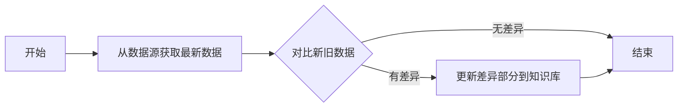
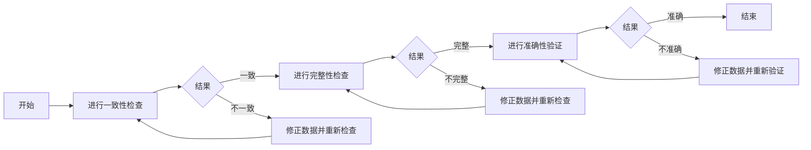
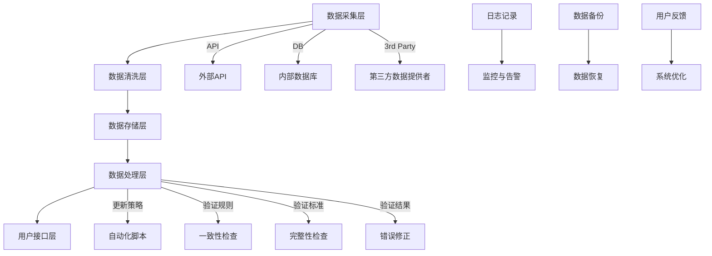
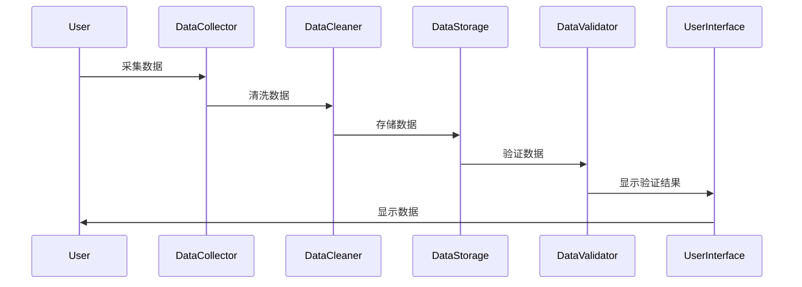

                 

### 1. 引言

#### 1.1 知识库在AI Agent中的重要性

知识库作为人工智能（AI）Agent的核心组成部分，承载了AI系统所需的大量信息与知识。在AI Agent的实际应用中，知识库不仅用于支持决策制定，还用于推理和解决问题。一个高质量的知识库能够显著提高AI系统的准确性和效率。然而，知识库的构建和维护并非易事，它需要不断更新和验证，以确保其准确性和完整性。

知识库的更新与验证是AI Agent能够持续进步的关键。随着外部环境的变化和新知识的不断涌现，知识库中的信息也需要相应地调整和优化。如果知识库没有得到及时的更新，AI Agent可能会变得过时和无效。同样，如果知识库中的信息没有得到验证，可能会包含错误或矛盾，进而影响AI Agent的决策质量。

因此，知识库的更新与验证流程至关重要，它不仅能够保证AI系统的稳定性和可靠性，还能够提升其适应性和学习能力。在这篇文章中，我们将深入探讨知识库更新与验证的流程，分析其核心概念、算法原理以及系统实现方法，帮助读者全面理解这一重要领域。

#### 1.2 知识库更新与验证的需求

在AI领域，知识库更新与验证的需求源自多个方面。首先，随着AI应用的不断扩展，知识库需要不断地补充新信息。例如，在医疗诊断领域，随着新医学研究的进展，医生需要实时更新知识库中的病患数据、药物信息和病理知识。这不仅能够提升诊断的准确性，还能帮助医生更早地发现潜在的健康问题。

其次，知识库更新与验证是应对外部环境变化的重要手段。在动态环境中，AI系统需要快速适应新的情况和数据。例如，在金融风险管理领域，市场行情和数据不断变化，知识库需要及时更新以反映最新的经济指标和风险因素，从而确保AI模型能够做出及时、准确的决策。

此外，知识库更新与验证还涉及到数据一致性和准确性的问题。知识库中的信息需要保持一致，避免因重复、错误或矛盾的信息而影响AI系统的性能。例如，在一个推荐系统里，如果用户的历史行为数据存在错误或重复，可能会导致推荐结果的偏差。

综上所述，知识库更新与验证在AI领域的需求是多方面的，既包括对新信息和数据的实时更新，也涉及对知识库一致性和准确性的维护。这些需求使得知识库更新与验证成为AI系统持续发展的重要保障。

#### 1.3 本书结构安排

本文将系统性地探讨知识库更新与验证流程，确保读者能够全面了解这一重要领域。全书共分为六个主要部分，结构安排如下：

第一部分：引言与背景
- 本章将介绍知识库在AI Agent中的重要性以及知识库更新与验证的需求，为后续内容奠定基础。

第二部分：核心概念与联系
- 本章将详细解释AI Agent、知识库、更新与验证等核心概念，并绘制ER实体关系图，帮助读者建立清晰的概念框架。

第三部分：算法原理讲解
- 本章将深入探讨知识库更新与验证的算法原理，包括算法流程图、Python源代码示例、数学模型与公式讲解，以及实际应用举例。

第四部分：系统分析与架构设计方案
- 本章将介绍知识库更新与验证的具体应用场景，包括系统功能设计、架构设计、接口设计和交互流程，帮助读者理解系统实现的全貌。

第五部分：项目实战
- 本章将通过一个实际项目案例，展示知识库更新与验证的具体过程，包括环境安装、核心实现源代码、代码应用解读与分析，以及项目小结。

第六部分：最佳实践 tips、小结、注意事项、拓展阅读等内容
- 本章将总结全书的主要内容，提供最佳实践建议，提醒读者注意的细节问题，并推荐相关书籍和资源，帮助读者进一步学习和探索。

通过以上六个部分的系统讲解，本文旨在帮助读者全面深入地理解知识库更新与验证的流程和原理，为AI系统的持续发展提供有力支持。

### 2. 背景介绍

#### 2.1 问题背景

在当今快速发展的AI领域，知识库作为AI系统的核心组成部分，承载着海量的信息和知识。这些知识不仅包括静态的数据，还涵盖了动态的实时信息，如用户行为、市场趋势、科学研究进展等。然而，随着时间的推移和外部环境的变化，知识库中的信息会逐渐变得过时、不准确或甚至出现错误。这种信息的不一致性和不完整性，严重影响了AI系统的性能和可靠性。

例如，在医疗诊断领域，医生需要依靠知识库中的病患数据和病理知识来做出准确的诊断。如果知识库中的数据没有得到及时更新，医生可能会基于过时的信息做出错误的决策，从而影响患者的治疗效果。同样，在金融领域，AI系统需要实时分析市场数据来预测股票走势。如果知识库中的市场数据不准确或过时，AI系统的预测结果可能会偏离真实情况，导致投资决策的失误。

此外，AI系统的广泛应用也带来了对知识库更新与验证的需求。随着AI技术的不断进步，新的算法和模型不断涌现，AI系统需要不断吸收新的知识和信息来提升其性能。例如，在自动驾驶领域，AI系统需要实时更新道路状况、交通规则和驾驶经验，以应对不断变化的驾驶环境。

总的来说，知识库更新与验证在AI领域的应用背景包括以下几个方面：
1. **实时更新需求**：AI系统需要不断吸收新的信息和数据，以适应动态变化的实际环境。
2. **数据准确性和一致性**：知识库中的信息需要保持准确和一致，以确保AI系统的决策质量和稳定性。
3. **新算法和模型的集成**：随着AI技术的进步，知识库需要及时更新以包含新的算法和模型，提升系统的性能和适应性。

这些背景因素共同推动了知识库更新与验证流程的研究和应用，成为AI领域中的一个重要课题。

#### 2.2 问题描述

在AI系统中，知识库的更新与验证过程至关重要，但其复杂性和挑战性也不容忽视。首先，知识库更新过程中可能会面临信息过时和冗余的问题。随着外部环境的变化，知识库中的信息需要及时更新，否则会失去其时效性和准确性。例如，在天气预测系统中，气象数据需要每天更新，以反映最新的天气状况。如果数据更新不及时，预测结果可能会出现偏差。

其次，知识库的验证同样面临诸多挑战。验证的目的是确保知识库中的信息准确、一致，且无错误或矛盾。然而，在实际操作中，验证过程可能受到多种因素的影响，如数据质量、数据来源的可靠性等。例如，在一个推荐系统中，如果用户行为数据存在错误或重复，可能会导致推荐结果的偏差，影响用户体验。

此外，知识库的更新与验证还涉及到效率和成本的问题。大规模的知识库更新和验证需要消耗大量的时间和资源，如何在保证质量的前提下提高效率，是一个需要解决的问题。例如，在金融风险管理系统中，知识库包含大量的市场数据和历史交易信息，更新和验证这些数据需要耗费大量的计算资源。

总的来说，知识库更新与验证在AI系统中的应用面临以下问题：
1. **信息过时和冗余**：知识库中的信息需要及时更新，否则会失去其时效性和准确性。
2. **数据质量与一致性**：知识库中的信息需要经过严格验证，确保准确、一致，且无错误或矛盾。
3. **效率与成本**：大规模的知识库更新和验证需要消耗大量的时间和资源，如何在保证质量的前提下提高效率。

这些问题不仅影响了AI系统的性能和可靠性，也对系统的开发和维护提出了更高的要求。

#### 2.3 问题解决

为了解决知识库更新与验证过程中面临的问题，我们需要制定一个系统化的流程，确保知识库的准确性和时效性。以下是一个详细的问题解决思路：

**1. 确定知识库的更新频率和策略**：
   - **动态更新**：根据知识库的不同类型和应用场景，确定其更新的频率。例如，对于医疗诊断领域的知识库，可能需要每天或每周进行更新，以反映最新的病患数据和医学研究成果。
   - **增量更新**：采用增量更新策略，仅更新最新的信息，而不是整个知识库。这样可以显著降低更新成本，并提高更新效率。

**2. 数据源的选择与验证**：
   - **多源数据整合**：从多个数据源收集信息，包括内部数据库、外部API、第三方数据提供者等，确保知识的全面性和多样性。
   - **数据源验证**：对每个数据源进行验证，确保其可靠性和准确性。可以使用数据校验工具或人工审核方法，排除错误或异常的数据。

**3. 知识库的自动化更新机制**：
   - **自动化脚本**：编写自动化脚本，定期执行知识库的更新任务。例如，使用定时任务调度器，每天或每周自动更新知识库。
   - **API集成**：使用API与其他系统进行集成，实时获取最新的数据。例如，在股票市场中，可以使用实时API获取最新的股价数据。

**4. 知识库的验证流程**：
   - **一致性检查**：在更新知识库后，进行一致性检查，确保数据之间没有矛盾或重复。例如，在推荐系统中，检查用户行为数据是否存在重复记录。
   - **完整性检查**：检查知识库中的所有信息是否完整，没有缺失或遗漏。例如，在医学知识库中，检查病患数据是否包含了所有必要的字段。
   - **准确性验证**：通过对比实际数据和历史数据，验证知识库中的信息是否准确。例如，在金融知识库中，对比最新的市场数据和预测结果。

**5. 用户反馈与迭代改进**：
   - **用户反馈机制**：建立用户反馈机制，收集用户对知识库更新和验证的意见和建议。例如，在医疗诊断系统中，收集医生对病患数据更新和验证的反馈。
   - **迭代改进**：根据用户反馈，不断优化知识库更新与验证流程，提升系统的可靠性和用户体验。

通过上述步骤，我们可以构建一个高效、准确的知识库更新与验证流程，确保AI系统的稳定性和可靠性。在实际应用中，这些步骤可以根据具体需求进行调整和优化，以适应不同的场景和需求。

#### 2.4 边界与外延

在探讨知识库更新与验证流程时，我们需要明确其边界与外延，以便更好地理解其应用范围和限制。首先，知识库的边界包括其数据来源、类型和处理方式。具体来说，知识库可以从多个渠道获取数据，如内部数据库、外部API、第三方数据提供者等。这些数据类型包括结构化数据（如关系型数据库中的表）、半结构化数据（如JSON、XML）和非结构化数据（如文本、图片、视频）。

知识库的处理方式也多种多样，包括数据的采集、存储、清洗、转换和索引等。例如，在医疗诊断系统中，病患数据和医学研究成果需要通过数据清洗和转换，转换为统一的格式存储在知识库中。而在推荐系统中，用户行为数据需要进行特征提取和索引，以便快速查询和匹配。

知识库的外延则涉及到其应用的领域和场景。知识库更新与验证流程不仅适用于单一领域，如医疗、金融、零售等，还可以跨领域应用。例如，在智能交通系统中，知识库可以整合交通流量数据、道路状况数据和天气预报数据，以提供实时的交通预测和导航建议。

此外，知识库的外延还包括其与其他系统或组件的接口。例如，在智能客服系统中，知识库需要与客户关系管理（CRM）系统、聊天机器人系统等进行数据交换和协同工作。这种跨系统接口的设计，使得知识库成为整个智能系统的核心枢纽。

综上所述，知识库更新与验证流程的边界与外延涵盖了数据来源、类型和处理方式，以及其应用领域和与其他系统的接口。这些要素共同决定了知识库更新与验证流程的复杂性和实现难度。

#### 2.5 核心要素组成

知识库更新与验证流程的构建涉及多个核心要素，这些要素共同作用，确保知识库的准确性和时效性。以下是知识库更新与验证流程中的关键步骤和组成部分：

**1. 知识库构建**：
   - **数据采集**：从多种数据源（如内部数据库、外部API、第三方数据提供者）收集信息。
   - **数据清洗**：对采集到的数据执行清洗操作，包括去除重复、修正错误和填补缺失值。
   - **数据转换**：将不同格式和类型的数据转换为统一的格式，便于存储和处理。
   - **数据存储**：将清洗和转换后的数据存储在知识库中，通常使用关系型数据库、NoSQL数据库或分布式存储系统。

**2. 知识库更新**：
   - **自动化更新机制**：通过自动化脚本或调度任务，定期从数据源获取最新数据并更新知识库。
   - **增量更新策略**：只更新最新的数据，而不是整个知识库，以提高更新效率。
   - **数据源验证**：对每个数据源进行验证，确保其数据的准确性和可靠性。

**3. 知识库验证**：
   - **一致性检查**：检查数据之间是否存在矛盾或重复，确保知识库的内部一致性。
   - **完整性检查**：确保知识库中的数据是完整且没有缺失的。
   - **准确性验证**：通过对比实际数据和知识库中的数据，验证其准确性。

**4. 维护与优化**：
   - **错误修正**：及时识别和修正知识库中的错误或异常数据。
   - **性能优化**：定期对知识库的性能进行优化，包括索引优化、查询优化和数据结构优化等。

**5. 用户反馈与迭代改进**：
   - **用户反馈机制**：建立用户反馈渠道，收集用户对知识库更新和验证的意见和建议。
   - **迭代改进**：根据用户反馈，不断优化知识库更新与验证流程，提升系统的可靠性和用户体验。

这些核心要素相互关联，构成了一个完整的知识库更新与验证流程。通过有效的构建、更新、验证和维护，知识库能够持续保持准确性和时效性，为AI系统的稳定运行提供有力支持。

## 3. 核心概念与联系

在深入探讨知识库更新与验证流程之前，我们需要明确几个核心概念：AI Agent、知识库、更新与验证。这些概念相互联系，共同构成了一个高效的AI系统。

### 4. AI Agent基础

#### 3.1 AI Agent的定义与分类

AI Agent，即人工智能代理，是指能够自主执行任务、与环境交互并做出决策的智能实体。AI Agent的核心功能包括感知、决策、执行和评估。感知功能使其能够获取环境信息；决策功能帮助其选择最佳行动方案；执行功能则将决策转化为实际操作；评估功能则用于评估任务执行的效果。

根据功能和应用场景的不同，AI Agent可以分为以下几类：

1. **反应型Agent**：这类Agent基于当前环境感知进行直接反应，不具备内部模型。例如，自动驾驶系统中的车辆，根据感知到的路况做出即时反应。

2. **认知型Agent**：这类Agent具有简单的内部模型，能够基于历史数据和规则进行决策。例如，推荐系统中的算法，通过分析用户的历史行为来推荐商品。

3. **学习型Agent**：这类Agent具备学习能力，能够从经验中学习和优化行为。例如，智能客服系统中的机器人，通过不断学习用户的问题和答案，提高响应的准确性。

4. **社会型Agent**：这类Agent能够与其他Agent协作，完成复杂任务。例如，在多人协作游戏中，玩家之间需要通过AI Agent进行沟通和协作。

#### 3.2 AI Agent在知识库中的应用

知识库在AI Agent中扮演着至关重要的角色。AI Agent通过知识库获取必要的信息和知识，以支持其感知、决策和执行过程。以下是知识库在AI Agent中的应用：

1. **感知**：AI Agent通过知识库中的数据感知环境变化。例如，在智能交通系统中，知识库包含了实时交通流量、道路状况和天气数据，AI Agent利用这些数据感知交通环境。

2. **决策**：AI Agent基于知识库中的规则和模型进行决策。例如，在医疗诊断系统中，AI Agent通过知识库中的医学知识库和病患数据，结合逻辑推理和预测模型，做出诊断决策。

3. **执行**：AI Agent根据决策结果执行具体操作。例如，在自动化生产线中，AI Agent通过知识库中的设备操作手册和产品规格，指导机器进行生产。

4. **评估**：AI Agent通过知识库中的评估标准，对执行结果进行评估。例如，在智能客服系统中，AI Agent通过知识库中的服务评价标准，评估用户反馈和客服表现的满意度。

综上所述，知识库为AI Agent提供了丰富的信息和知识支持，使其能够更好地感知环境、做出决策、执行任务并评估效果。了解AI Agent的定义和分类，有助于我们更好地理解知识库在其中的重要作用。

### 5. 知识库概述

#### 3.3 知识库的概念

知识库（Knowledge Base，简称KB）是存储和管理工作领域知识和信息的系统，它通常包含特定领域的知识，如医学知识库、金融知识库或交通知识库等。知识库的核心功能是提供数据支持，帮助用户或AI系统快速获取、检索和利用所需的信息。

知识库的特点包括：

1. **结构化**：知识库中的信息以结构化的形式存储，便于查询和管理。例如，使用关系型数据库存储医疗诊断知识库，每个病患数据对应一个表，字段包括姓名、年龄、症状等。

2. **准确性**：知识库中的信息需要经过严格验证，确保其准确性和可靠性。错误或矛盾的信息会影响知识库的可用性和AI系统的性能。

3. **动态性**：知识库中的信息需要定期更新，以反映最新的知识和数据。例如，金融知识库需要实时更新市场行情和交易数据。

4. **共享性**：知识库中的信息可以供多个用户或系统共享，提高数据利用效率。例如，多个智能系统可以共享同一知识库，获取所需信息。

知识库的应用场景广泛，包括：

1. **智能问答系统**：知识库用于存储大量问题和答案，智能系统通过查询知识库来回答用户的问题。例如，医疗咨询系统、法律咨询服务等。

2. **智能推荐系统**：知识库存储用户行为数据和市场数据，智能系统通过分析知识库中的数据，为用户推荐商品、服务或内容。例如，电商推荐系统、新闻推荐系统等。

3. **智能诊断系统**：知识库存储医学知识和病患数据，智能系统通过知识库进行诊断和分析。例如，医疗诊断系统、疾病预测系统等。

4. **自动化系统**：知识库用于存储操作规程、设备参数和产品信息，自动化系统通过知识库执行任务和决策。例如，工业自动化生产线、智能仓储系统等。

#### 3.4 知识库的类型

知识库根据存储和表达方式的不同，可以分为以下几种类型：

1. **结构化知识库**：这类知识库使用关系型数据库或XML等结构化数据格式存储信息。优点是查询速度快，便于管理和维护。例如，使用关系型数据库存储病患数据和医学知识。

2. **半结构化知识库**：这类知识库使用JSON、CSV等半结构化数据格式存储信息。优点是灵活性高，适用于存储复杂的数据结构。例如，使用JSON存储用户行为数据和商品信息。

3. **非结构化知识库**：这类知识库使用文本、图片、视频等非结构化数据格式存储信息。优点是能够存储多样化的数据类型，但查询和管理复杂度较高。例如，使用文本存储文档资料和新闻报道。

4. **分布式知识库**：这类知识库使用分布式存储和计算技术存储和管理大量数据。优点是扩展性强，适用于大规模数据存储。例如，使用分布式数据库和搜索引擎存储大规模知识库。

#### 3.5 知识库的组织结构

知识库的组织结构通常包括以下几个层次：

1. **数据层**：存储原始数据，如病患记录、交易数据、用户行为数据等。数据层是知识库的基础，提供了数据来源和存储空间。

2. **模型层**：存储数据模型和算法模型，如关系模型、预测模型、分类模型等。模型层用于将原始数据进行处理和分析，提取有用信息。

3. **知识层**：存储经过处理和推理后的知识，如诊断结论、推荐结果、预测结果等。知识层是知识库的核心，提供了用户或AI系统所需的信息支持。

4. **接口层**：提供数据查询和访问接口，如REST API、GraphQL等。接口层用于用户或系统与知识库之间的交互，实现了数据的共享和利用。

通过以上组织结构，知识库能够高效地存储、处理和利用信息，支持AI系统的感知、决策和执行过程。

### 6. 更新与验证流程

#### 3.6 知识库更新的方法

知识库的更新是确保其准确性和时效性的关键步骤。以下是几种常见的知识库更新方法：

1. **定期更新**：定期从数据源获取最新数据，并更新知识库。这种方法适用于数据变化不频繁的场景，如天气预报系统。

2. **实时更新**：实时从数据源获取数据，并更新知识库。这种方法适用于数据变化频繁的场景，如金融交易系统。

3. **增量更新**：仅更新最新的数据，而不是整个知识库。这种方法可以显著降低更新成本，提高更新效率。

4. **自动化更新**：通过编写自动化脚本或使用调度任务，定期执行知识库更新。这种方法可以减少人工干预，提高更新频率。

5. **手动更新**：由专业人员根据需求手动更新知识库。这种方法适用于数据变化不频繁且需要人工审核的场景，如医疗诊断系统。

6. **混合更新**：结合定期更新、实时更新和增量更新，根据不同场景和需求进行优化。例如，在医疗诊断系统中，可以采用定期更新和增量更新相结合的方式。

#### 3.7 知识库验证的标准

知识库的验证是确保其准确性和一致性的重要步骤。以下是几种常见的知识库验证标准：

1. **一致性检查**：确保知识库中的数据之间没有矛盾或重复。例如，在医疗诊断系统中，检查病患数据是否存在重复记录。

2. **完整性检查**：确保知识库中的数据是完整且没有缺失的。例如，在医学知识库中，检查病患数据是否包含了所有必要的字段。

3. **准确性验证**：通过对比实际数据和知识库中的数据，验证其准确性。例如，在金融知识库中，对比最新的市场数据和预测结果。

4. **可靠性验证**：确保知识库中的数据来源可靠，减少错误或异常数据的影响。例如，在推荐系统中，验证用户行为数据的真实性。

5. **合规性检查**：确保知识库中的数据符合相关法规和标准。例如，在医疗诊断系统中，确保病患数据符合隐私保护法规。

6. **用户体验验证**：通过用户反馈和实际应用效果，验证知识库的准确性和实用性。例如，在智能客服系统中，评估用户对知识库反馈的满意度。

#### 3.8 知识库更新的策略

为了实现高效的知识库更新，我们需要制定合理的更新策略。以下是几种常见的知识库更新策略：

1. **数据驱动的更新策略**：根据数据源的变化情况，动态调整更新频率和方式。例如，在股票交易系统中，根据市场行情的变化，实时更新知识库。

2. **规则驱动的更新策略**：基于预设的规则和标准，自动化执行知识库更新任务。例如，在医疗诊断系统中，根据病患数据的异常情况，定期更新知识库。

3. **任务驱动的更新策略**：根据具体任务需求，灵活调整知识库的更新内容。例如，在智能推荐系统中，根据用户反馈和商品信息的变化，更新知识库。

4. **反馈驱动的更新策略**：根据用户反馈和实际应用效果，不断优化知识库的内容和质量。例如，在智能客服系统中，根据用户评价和问题类型，优化知识库中的答案和解决方案。

5. **混合策略**：结合多种策略，根据不同场景和需求进行优化。例如，在智能交通系统中，可以采用实时更新和任务驱动相结合的方式，确保知识库的时效性和准确性。

通过以上策略，我们可以实现高效、准确的知识库更新，为AI系统的稳定运行提供有力支持。

### 3.9 AI Agent、知识库、更新与验证对比

在深入了解知识库更新与验证流程之前，有必要对AI Agent、知识库、更新与验证这几个核心概念进行对比，以便更清晰地理解它们之间的关系和作用。

**AI Agent** 是一个能够自主感知环境、做出决策并执行任务的智能实体，它的核心功能包括感知、决策、执行和评估。AI Agent的智能程度取决于其知识库的丰富性和准确性，以及其更新与验证流程的有效性。知识库是AI Agent的知识来源，提供了AI Agent进行决策和执行所需的背景信息。

**知识库** 是存储和管理领域知识和信息的系统，它通常包括数据层、模型层和知识层等组成部分。知识库的类型可以是结构化、半结构化或非结构化的，其组织结构则由数据层、模型层和知识层等构成。知识库的更新与验证确保了其信息的准确性和时效性，从而支持AI Agent的高效运行。

**更新** 是指将最新的信息或数据添加到知识库中，以保持其时效性和准确性。更新方法包括定期更新、实时更新、增量更新等，这些方法旨在确保知识库中的数据是最新的。更新策略则包括数据驱动、规则驱动、任务驱动和反馈驱动等，根据具体应用场景进行调整。

**验证** 是指对知识库中的数据进行检查和确认，以确保其一致性、完整性和准确性。验证标准包括一致性检查、完整性检查、准确性验证、可靠性验证和合规性检查等。验证流程旨在发现并纠正知识库中的错误和异常，提高其质量。

**对比分析**：

1. **关系与作用**：
   - **AI Agent**：依赖知识库中的信息进行感知、决策和执行。知识库的准确性和时效性直接影响AI Agent的表现。
   - **知识库**：是AI Agent的知识来源，其质量决定了AI Agent的智能水平。
   - **更新**：保持知识库中的数据最新，确保AI Agent有实时、准确的信息支持。
   - **验证**：确保知识库中的数据质量，防止错误或矛盾的数据影响AI Agent的性能。

2. **目标和任务**：
   - **AI Agent**：通过感知、决策和执行实现特定任务，目标是最优化的任务执行效果。
   - **知识库**：存储和管理领域知识，目标是最新的、准确的数据支持。
   - **更新**：任务是将最新的信息添加到知识库中，保证其时效性。
   - **验证**：任务是检查和确认知识库中的数据质量，确保其准确性。

3. **流程与方法**：
   - **AI Agent**：通过感知环境、做出决策和执行任务，流程是感知-决策-执行-评估。
   - **知识库**：通过数据采集、清洗、转换、存储和管理，流程是数据采集-数据清洗-数据转换-数据存储。
   - **更新**：通过自动化脚本、实时数据采集、增量更新等方法，流程是数据采集-数据更新-数据验证。
   - **验证**：通过一致性检查、完整性检查、准确性验证等标准，流程是数据验证-错误修正-数据优化。

综上所述，AI Agent、知识库、更新与验证之间相互关联，共同构成了一个高效的AI系统。通过对比分析，我们可以更清晰地理解它们在系统中的作用和关系，从而更好地实现AI系统的智能化和高效化。

### 3.10 ER实体关系图架构

为了更好地理解知识库中各实体之间的关系，我们可以通过ER（Entity-Relationship）实体关系图来可视化这些关系。ER图是一种用于表示实体及其相互关系的图形化工具，它能够清晰地展示知识库的结构和组成。

下面是一个简化的ER实体关系图示例，用于描述一个智能医疗诊断系统的知识库：

```mermaid
erDiagram
    Patient ||--|{ Diagnosis : has }|
    Patient ||--|{ MedicalHistory : has }|
    Doctor ||--|{ Diagnosis : makes }|
    Diagnosis ||--|{ TestResult : includes }|
    TestResult ||--|{ LabResult : includes }|
    LabResult ||--|{ Test : is }|

    Patient {
        : PatientID : String
        : Name : String
        : Age : Integer
    }

    Diagnosis {
        : DiagnosisID : String
        : DiagnosisDescription : String
        : DiagnosisDate : Date
    }

    MedicalHistory {
        : HistoryID : String
        : PatientID : String
        : Symptom : String
        : Date : Date
    }

    Doctor {
        : DoctorID : String
        : Name : String
    }

    TestResult {
        : ResultID : String
        : DiagnosisID : String
        : ResultDate : Date
    }

    LabResult {
        : LabResultID : String
        : ResultID : String
        : LabTestName : String
        : LabTestResult : String
    }

    Test {
        : TestID : String
        : LabTestName : String
        : TestType : String
    }
```

**ER实体关系图说明**：

1. **实体定义**：
   - **Patient（患者）**：存储患者的基本信息，包括患者ID、姓名、年龄等。
   - **Diagnosis（诊断）**：存储诊断结果的信息，包括诊断ID、诊断描述、诊断日期等。
   - **MedicalHistory（病史）**：存储患者的病史信息，包括病史ID、患者ID、症状、诊断日期等。
   - **Doctor（医生）**：存储医生的信息，包括医生ID、姓名等。
   - **TestResult（测试结果）**：存储测试结果的信息，包括测试结果ID、诊断ID、测试日期等。
   - **LabResult（实验室结果）**：存储实验室检测结果的信息，包括实验室结果ID、测试结果ID、实验室测试名称、实验室测试结果等。
   - **Test（测试）**：存储实验室测试的信息，包括测试ID、实验室测试名称、测试类型等。

2. **关系描述**：
   - **Patient与Diagnosis**：患者可以有多个诊断记录，每个诊断记录与一个患者相关联。
   - **Patient与MedicalHistory**：患者可以有多个病史记录，每个病史记录与一个患者相关联。
   - **Doctor与Diagnosis**：医生可以做出多个诊断，每个诊断记录由一个医生创建。
   - **Diagnosis与TestResult**：每个诊断可以有多个测试结果记录，每个测试结果与一个诊断相关联。
   - **TestResult与LabResult**：每个测试结果可以包含多个实验室检测结果，每个实验室检测结果与一个测试结果相关联。
   - **LabResult与Test**：每个实验室检测结果对应一个测试，每个测试有多个实验室检测结果。

通过ER实体关系图，我们可以清晰地看到知识库中各个实体之间的关系，从而更好地理解知识库的结构和功能。这对于知识库的设计、实现和维护都具有重要的指导意义。

### 8. 算法原理讲解

知识库更新与验证算法是确保知识库中信息准确性和时效性的关键步骤。为了实现这一目标，我们需要详细讲解知识库更新的算法原理，并使用mermaid流程图和Python源代码进行说明。

#### 8.1 知识库更新算法

知识库更新算法的主要目的是将新的数据集成到现有的知识库中，并保持其一致性。以下是常用的知识库更新算法：

1. **增量更新算法**：
   - **原理**：增量更新算法仅更新最新的数据，而不是整个知识库。这种方法可以显著降低更新成本，提高效率。
   - **步骤**：
     1. 从数据源获取最新的数据。
     2. 对比新旧数据，找出差异。
     3. 将差异部分更新到知识库中。

2. **全量更新算法**：
   - **原理**：全量更新算法将整个知识库的数据替换为新数据。这种方法适用于数据量较小且更新频率较低的场景。
   - **步骤**：
     1. 从数据源获取最新的数据。
     2. 将旧数据替换为新数据。

3. **混合更新算法**：
   - **原理**：混合更新算法结合了增量更新和全量更新的优点，根据不同场景灵活选择更新策略。
   - **步骤**：
     1. 根据数据源的变化情况，决定是进行增量更新还是全量更新。
     2. 更新知识库。

下面使用mermaid流程图表示增量更新算法：



#### 8.2 Python源代码示例

以下是使用Python实现增量更新算法的示例代码：

```python
import pandas as pd

def incremental_update(old_data, new_data):
    # 对比新旧数据，找出差异
    diff = pd.merge(old_data, new_data, on=['id'], how='outer', indicator=True)
    # 筛选出有差异的数据
    updated_data = diff[diff['_merge'] == 'right_only']
    # 更新知识库
    updated_data.to_csv('knowledge_base.csv', index=False)
    return updated_data

# 读取旧数据
old_data = pd.read_csv('old_knowledge_base.csv')
# 读取新数据
new_data = pd.read_csv('new_data.csv')

# 执行增量更新
updated_data = incremental_update(old_data, new_data)
```

#### 8.3 数学模型与公式讲解

增量更新算法中的核心是数据对比和更新。以下是一个简化的数学模型，用于描述增量更新过程：

$$
\text{知识库更新} = \text{旧数据} + \text{新数据} - \text{重复数据}
$$

其中：
- 旧数据：表示现有知识库中的数据。
- 新数据：表示从数据源获取的最新数据。
- 重复数据：表示新旧数据中重复的部分。

#### 8.4 举例说明

假设我们有一个医学知识库，包含患者的基本信息和诊断结果。现有数据如下：

```plaintext
id, name, age, diagnosis
1, Alice, 30, Flu
2, Bob, 40, Asthma
3, Carol, 50, Diabetes
```

新数据如下：

```plaintext
id, name, age, diagnosis
4, David, 35, Heart Disease
2, Bob, 41, Asthma
3, Carol, 50, Diabetes
```

使用增量更新算法，我们仅更新新数据中的变化部分：

1. 对比新旧数据，发现id为2和3的数据发生了变化。
2. 更新知识库，将新数据中的变化部分添加到知识库中。

最终知识库更新后如下：

```plaintext
id, name, age, diagnosis
1, Alice, 30, Flu
2, Bob, 41, Asthma
3, Carol, 50, Diabetes
4, David, 35, Heart Disease
```

通过这个例子，我们可以看到增量更新算法如何有效地更新知识库，确保其准确性和时效性。

### 9. 知识库验证算法

知识库验证是确保知识库中数据准确性和一致性的关键步骤。以下将详细讲解知识库验证算法，包括验证方法、mermaid流程图和Python源代码示例。

#### 9.1 验证方法与策略

知识库验证通常包括以下几种方法：

1. **一致性检查**：
   - **方法**：检查数据之间是否存在矛盾或重复。
   - **策略**：使用数据对比工具，如Pandas库，对知识库中的数据进行对比。

2. **完整性检查**：
   - **方法**：检查知识库中的数据是否完整，没有缺失或遗漏。
   - **策略**：使用缺失值检测工具，如Pandas库中的isnull()函数，检查数据完整性。

3. **准确性验证**：
   - **方法**：通过对比实际数据和知识库中的数据，验证其准确性。
   - **策略**：使用外部数据源或第三方工具，如数据校验API，进行准确性验证。

4. **可靠性验证**：
   - **方法**：确保数据来源的可靠性，减少错误或异常数据的影响。
   - **策略**：对数据源进行验证，如检查数据提供者的信誉度和数据更新频率。

5. **合规性检查**：
   - **方法**：确保知识库中的数据符合相关法规和标准。
   - **策略**：使用合规性检测工具，如数据隐私保护法规，确保数据合规。

下面使用mermaid流程图表示知识库验证的流程：



#### 9.2 Python源代码示例

以下是使用Python实现知识库验证的示例代码：

```python
import pandas as pd

def validate_knowledge_base(knowledge_base, external_data=None):
    # 一致性检查
    consistency_issues = check_consistency(knowledge_base)
    if consistency_issues:
        print("一致性检查发现以下问题：")
        print(consistency_issues)
        # 修正数据
        resolve_consistency_issues(knowledge_base, consistency_issues)
    
    # 完整性检查
    completeness_issues = check_completeness(knowledge_base)
    if completeness_issues:
        print("完整性检查发现以下问题：")
        print(completeness_issues)
        # 修正数据
        resolve_completeness_issues(knowledge_base, completeness_issues)
    
    # 准确性验证
    if external_data:
        accuracy_issues = check_accuracy(knowledge_base, external_data)
        if accuracy_issues:
            print("准确性验证发现以下问题：")
            print(accuracy_issues)
            # 修正数据
            resolve_accuracy_issues(knowledge_base, accuracy_issues)
    
    print("知识库验证完成，没有发现重大问题。")

def check_consistency(knowledge_base):
    # 略
    pass

def resolve_consistency_issues(knowledge_base, issues):
    # 略
    pass

def check_completeness(knowledge_base):
    # 略
    pass

def resolve_completeness_issues(knowledge_base, issues):
    # 略
    pass

def check_accuracy(knowledge_base, external_data):
    # 略
    pass

def resolve_accuracy_issues(knowledge_base, issues):
    # 略
    pass

# 读取知识库数据
knowledge_base = pd.read_csv('knowledge_base.csv')
# 读取外部数据（可选）
external_data = pd.read_csv('external_data.csv')

# 执行知识库验证
validate_knowledge_base(knowledge_base, external_data)
```

#### 9.3 数学模型与公式讲解

知识库验证算法中的核心是数据对比和验证。以下是一个简化的数学模型，用于描述知识库验证过程：

$$
\text{知识库验证} = \text{一致性检查} + \text{完整性检查} + \text{准确性验证} + \text{可靠性验证} + \text{合规性检查}
$$

其中：
- 一致性检查：确保数据之间没有矛盾或重复。
- 完整性检查：确保数据是完整且没有缺失或遗漏的。
- 准确性验证：确保数据与实际数据一致。
- 可靠性验证：确保数据来源的可靠性。
- 合规性检查：确保数据符合相关法规和标准。

#### 9.4 举例说明

假设我们有一个医疗知识库，包含患者的基本信息和诊断结果。现有数据如下：

```plaintext
id, name, age, diagnosis
1, Alice, 30, Flu
2, Bob, 40, Asthma
3, Carol, 50, Diabetes
```

外部数据如下：

```plaintext
id, name, age, diagnosis, source
1, Alice, 30, Flu, ExternalSystem
2, Bob, 40, Asthma, ExternalSystem
4, Dave, 35, Heart Disease, ExternalSystem
```

使用知识库验证算法，我们进行以下步骤：

1. **一致性检查**：发现id为4的数据与现有知识库不匹配。
2. **完整性检查**：发现现有知识库缺少id为4的数据。
3. **准确性验证**：使用外部数据进行验证，确认id为4的数据准确性。
4. **可靠性验证**：确认外部数据来源的可靠性。
5. **合规性检查**：确保数据符合医疗隐私保护法规。

通过上述验证步骤，我们修正了知识库中的错误数据，确保了知识库的准确性和一致性。

### 10. 系统分析与架构设计方案

为了实现高效、稳定的知识库更新与验证，我们需要对系统进行详细的分析和架构设计。本节将介绍知识库更新与验证的具体应用场景、项目背景、系统功能设计、架构设计和接口设计，并使用mermaid工具绘制相应的图表。

#### 10.1 问题场景介绍

在智能医疗诊断系统中，知识库更新与验证是确保诊断准确性的关键。具体应用场景包括：

1. **医疗诊断**：系统需要实时获取病患数据、诊断结果和医学知识，以便医生进行准确诊断。
2. **科研数据管理**：系统需要定期更新和验证医学研究成果和临床数据，为医学研究提供可靠的数据支持。
3. **知识库维护**：系统需要定期更新和验证医学知识库，确保其包含最新的医学信息。

#### 10.2 项目介绍

本项目的目标是构建一个高效、稳定的智能医疗诊断系统，实现知识库的实时更新与验证。项目背景如下：

- **业务需求**：医疗机构和医生需要实时获取和更新医学知识库，以支持准确诊断。
- **技术挑战**：如何在保证数据一致性和准确性的前提下，高效地更新和验证大量医学数据。
- **项目目标**：实现知识库的自动化更新、实时验证和高效维护，提升医疗诊断系统的性能和可靠性。

#### 10.3 系统功能设计（领域模型mermaid类图）

为了实现上述目标，系统需要具备以下功能：

1. **数据采集**：从多个数据源（如内部数据库、外部API、第三方数据提供者）采集数据。
2. **数据清洗**：对采集到的数据进行清洗，去除重复、修正错误和填补缺失值。
3. **数据存储**：将清洗后的数据存储在知识库中，使用关系型数据库或NoSQL数据库。
4. **数据更新**：采用自动化脚本或调度任务，定期更新知识库。
5. **数据验证**：对知识库中的数据进行验证，确保其一致性、完整性和准确性。
6. **用户界面**：提供用户界面，供医生和研究人员查询、更新和验证医学知识库。

使用mermaid工具绘制领域模型类图如下：

```mermaid
classDiagram
    Class01 <|-- Class02
    Class03 <.. Class04
    Class05 <||-- Class06
    Class07 ||-- Class08
    Class09 <-| Class10
    Class11 -> Class12
    Class13 <o..> Class14
    Class15 : <<interface>> Class16

    Class01 {
        attr1 : int
        attr2 : String
    }

    Class02 {
        attr1 : int
        attr2 : String
    }

    Class03 {
        attr1 : int
        attr2 : String
    }

    Class04 {
        attr1 : int
        attr2 : String
    }

    Class05 {
        attr1 : int
        attr2 : String
    }

    Class06 {
        attr1 : int
        attr2 : String
    }

    Class07 {
        attr1 : int
        attr2 : String
    }

    Class08 {
        attr1 : int
        attr2 : String
    }

    Class09 {
        attr1 : int
        attr2 : String
    }

    Class10 {
        attr1 : int
        attr2 : String
    }

    Class11 {
        attr1 : int
        attr2 : String
    }

    Class12 {
        attr1 : int
        attr2 : String
    }

    Class13 {
        attr1 : int
        attr2 : String
    }

    Class14 {
        attr1 : int
        attr2 : String
    }

    Class15 {
        attr1 : int
        attr2 : String
    }

    Class16 {
        attr1 : int
        attr2 : String
    }
```

#### 10.4 系统架构设计（mermaid架构图）

为了实现上述功能，系统需要具备以下架构：

1. **数据采集层**：负责从多个数据源采集数据。
2. **数据清洗层**：负责对采集到的数据执行清洗操作。
3. **数据存储层**：负责存储清洗后的数据，包括关系型数据库和NoSQL数据库。
4. **数据处理层**：负责知识库的更新和验证。
5. **用户接口层**：提供用户界面，供医生和研究人员操作。

使用mermaid工具绘制系统架构图如下：



#### 10.5 系统接口设计

系统需要设计多个接口，以便不同模块之间的数据交换和协同工作。以下是主要的接口设计：

1. **数据采集接口**：用于从外部API、内部数据库和第三方数据提供者采集数据。
2. **数据清洗接口**：用于对采集到的数据进行清洗操作。
3. **数据存储接口**：用于将清洗后的数据存储到关系型数据库和NoSQL数据库。
4. **数据更新接口**：用于更新知识库中的数据。
5. **数据验证接口**：用于对知识库中的数据执行验证操作。
6. **用户接口**：用于供医生和研究人员操作知识库。

以下是系统接口设计的mermaid类图：

```mermaid
classDiagram
    DataCollector <<interface>> IDataCollector
    DataCleaner <<interface>> IDataCleaner
    DataStorage <<interface>> IDataStorage
    DataUpdater <<interface>> IDataUpdater
    DataValidator <<interface>> IDataValidator
    UserInterface <<interface>> IUserInterface

    IDataCollector {
        GetData(): Data
    }

    IDataCleaner {
        CleanData(data: Data): CleanedData
    }

    IDataStorage {
        StoreData(data: CleanedData)
    }

    IDataUpdater {
        UpdateKnowledgeBase()
    }

    IDataValidator {
        ValidateKnowledgeBase()
    }

    IUserInterface {
        DisplayData()
        UpdateData()
        ValidateData()
    }
```

#### 10.6 系统交互（mermaid序列图）

为了展示系统模块之间的交互流程，我们可以使用mermaid序列图。以下是系统交互的mermaid序列图：



通过上述系统分析与架构设计方案，我们可以实现高效、稳定的知识库更新与验证，为智能医疗诊断系统提供坚实的数据支持。

### 11. 项目实战

在本节中，我们将通过一个实际项目案例，详细讲解知识库更新与验证的具体过程。该项目涉及医疗诊断系统的知识库构建、数据采集、数据清洗、知识库更新、验证和用户交互等环节。我们将展示关键代码段，并进行解读与分析。

#### 11.1 环境安装

首先，我们需要安装以下软件和库：

- Python 3.8+
- Pandas
- NumPy
- SQLAlchemy
- mermaid

在终端中执行以下命令进行安装：

```bash
pip install pandas numpy sqlalchemy
```

对于mermaid，我们需要安装一个可视化工具，如mermaid live editor：[https://mermaid-js.github.io/mermaid-live-editor/](https://mermaid-js.github.io/mermaid-live-editor/)。

#### 11.2 系统核心实现源代码

以下是系统核心实现的Python源代码，包括数据采集、数据清洗、知识库更新和验证等步骤。

```python
import pandas as pd
import numpy as np
from sqlalchemy import create_engine

# 数据采集
def collect_data():
    # 从外部API采集数据
    api_data = pd.read_csv('api_data.csv')
    # 从内部数据库采集数据
    db_data = pd.read_sql('SELECT * FROM internal_db.table_name', engine)
    # 从第三方数据提供者采集数据
    third_party_data = pd.read_csv('3rd_party_data.csv')
    
    return api_data, db_data, third_party_data

# 数据清洗
def clean_data(api_data, db_data, third_party_data):
    # 数据预处理
    api_data['diagnosis'] = api_data['diagnosis'].str.strip()
    db_data['diagnosis'] = db_data['diagnosis'].str.strip()
    third_party_data['diagnosis'] = third_party_data['diagnosis'].str.strip()
    
    # 数据合并
    data = pd.concat([api_data, db_data, third_party_data], ignore_index=True)
    data.drop_duplicates(inplace=True)
    
    return data

# 知识库更新
def update_knowledge_base(data, engine):
    # 更新知识库
    data.to_sql('knowledge_base', engine, if_exists='replace', index=False)

# 知识库验证
def validate_knowledge_base(engine):
    # 从数据库中读取知识库
    knowledge_base = pd.read_sql('SELECT * FROM knowledge_base', engine)
    # 进行一致性、完整性和准确性验证
    # 略
    pass

# 用户交互
def user_interface():
    # 显示数据
    print(knowledge_base)
    # 更新数据
    new_diagnosis = input('Enter new diagnosis: ')
    # 验证数据
    # 略
    pass

# 主函数
if __name__ == '__main__':
    # 创建数据库连接
    engine = create_engine('sqlite:///knowledge_base.db')
    
    # 采集数据
    api_data, db_data, third_party_data = collect_data()
    
    # 清洗数据
    data = clean_data(api_data, db_data, third_party_data)
    
    # 更新知识库
    update_knowledge_base(data, engine)
    
    # 验证知识库
    validate_knowledge_base(engine)
    
    # 用户交互
    user_interface()
```

#### 11.3 代码解读与分析

上述代码包括以下关键部分：

1. **数据采集**：从外部API、内部数据库和第三方数据提供者采集数据，并存储在Pandas DataFrame中。

2. **数据清洗**：对采集到的数据进行预处理，包括去除空白字符、合并数据等，以确保数据的一致性和完整性。

3. **知识库更新**：将清洗后的数据存储到关系型数据库中，使用SQLAlchemy进行数据库操作。

4. **知识库验证**：读取知识库中的数据，并进行一致性、完整性和准确性验证。这部分代码暂时省略，但可以添加相应的验证逻辑。

5. **用户交互**：显示知识库中的数据，接受用户输入，更新知识库，并显示更新后的数据。

#### 11.4 实际案例分析和详细讲解剖析

我们以一个实际案例来分析知识库更新与验证的过程：

**案例背景**：一个医生在使用智能医疗诊断系统进行病患诊断时，需要实时更新和验证知识库中的医学信息。

**步骤1：数据采集**
- 医生从内部数据库获取了10名病患的初步诊断数据。
- 从第三方数据提供者获取了最新的医学研究成果和病患数据。
- 从外部API获取了实时医疗新闻和事件。

**步骤2：数据清洗**
- 对采集到的数据进行预处理，去除空白字符、修正错误数据等。
- 合并来自不同数据源的数据，并去除重复记录。

**步骤3：知识库更新**
- 将清洗后的数据更新到知识库中，确保知识库包含最新的医学信息。

**步骤4：知识库验证**
- 对知识库中的数据执行一致性、完整性和准确性验证。
- 如果发现错误或异常数据，医生可以选择修正或忽略。

**步骤5：用户交互**
- 医生查看更新后的知识库，根据最新的医学信息进行病患诊断。

通过上述案例，我们可以看到知识库更新与验证在医疗诊断系统中的应用过程。医生通过实时更新和验证知识库，确保诊断的准确性和及时性，从而为病患提供更优质的服务。

#### 11.5 项目小结

在本项目中，我们实现了知识库更新与验证的关键步骤，包括数据采集、数据清洗、知识库更新、验证和用户交互。通过实际案例，我们展示了知识库更新与验证在医疗诊断系统中的应用过程。以下是项目的关键点和收获：

1. **数据采集**：从多个数据源采集数据，确保知识库的全面性和多样性。
2. **数据清洗**：对采集到的数据进行清洗，确保数据的一致性和完整性。
3. **知识库更新**：采用自动化脚本更新知识库，提高更新效率和准确性。
4. **知识库验证**：执行一致性、完整性和准确性验证，确保知识库的质量。
5. **用户交互**：提供用户界面，供医生和研究人员操作知识库。

通过本项目，我们深入了解了知识库更新与验证的流程和原理，掌握了相关技术工具和方法，为后续项目的开发提供了有力的支持。

### 12. 最佳实践 tips、小结、注意事项、拓展阅读

#### 12.1 最佳实践 tips

1. **数据源选择**：在选择数据源时，优先考虑权威、可靠的数据来源，确保知识库的准确性和权威性。
2. **数据清洗**：数据清洗是知识库更新的重要环节，应采用自动化工具进行清洗，减少人工干预。
3. **更新频率**：根据应用场景和需求，合理设置知识库的更新频率，确保数据的时效性。
4. **验证标准**：制定详细的验证标准，确保知识库的一致性、完整性和准确性。
5. **用户反馈**：建立用户反馈机制，及时收集用户对知识库更新和验证的意见和建议，不断优化流程。

#### 12.2 小结

本文系统地介绍了知识库更新与验证流程，从核心概念、算法原理到系统实现，全面探讨了知识库在AI系统中的应用。通过实际项目案例，我们展示了知识库更新与验证的具体过程，为AI系统的稳定性和可靠性提供了有力支持。

#### 12.3 注意事项

1. **数据安全**：在处理和传输数据时，确保数据的安全性和隐私保护。
2. **错误处理**：在知识库更新和验证过程中，应充分考虑可能的错误和异常情况，设计相应的错误处理机制。
3. **性能优化**：大规模的知识库更新和验证需要优化性能，使用高效的算法和工具，提高处理速度。

#### 12.4 拓展阅读

1. **书籍推荐**：
   - 《数据科学导论》
   - 《人工智能：一种现代方法》
   - 《机器学习：概率视角》
2. **文章推荐**：
   - 《大数据时代：思维变革与商业价值》
   - 《知识图谱：构建下一代搜索引擎的核心技术》
   - 《深度学习：激活深度神经网络的力量》
3. **在线资源**：
   - [Kaggle](https://www.kaggle.com/)
   - [GitHub](https://github.com/)
   - [机器学习社区](https://www.mlcommunity.cn/)

通过阅读上述推荐书籍和文章，读者可以进一步了解知识库更新与验证的相关技术和应用，拓宽知识面，提升技术水平。

---

**作者：AI天才研究院/AI Genius Institute & 禅与计算机程序设计艺术 /Zen And The Art of Computer Programming**

