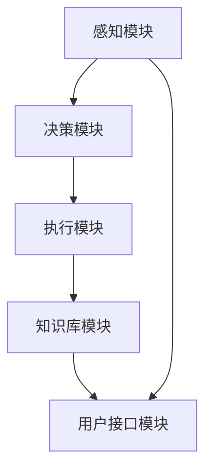
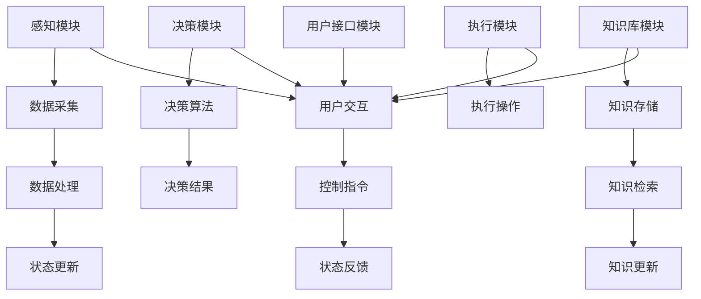

                 


## 构建AI Agent的知识库管理系统

### 关键词

AI Agent、知识库管理系统、数据存储与检索、知识表示与推理、知识获取与更新、系统架构设计、开发实战、项目分析与评估

### 摘要

本文深入探讨了构建AI Agent的知识库管理系统的核心概念、架构设计以及实现方法。从问题背景出发，详细介绍了AI Agent的定义、知识库管理系统的概念与作用，并分析了AI Agent与知识库管理系统的关系。接着，文章从知识库管理系统的基本架构、数据存储与检索技术、知识表示与推理技术等方面进行了深入讲解。此外，本文还详细阐述了AI Agent的知识获取与更新策略，以及知识库的版本控制。随后，文章通过具体案例，展示了AI Agent的知识库管理系统的设计、开发与实战过程，并对项目进行了分析与评估。最后，文章总结了最佳实践与展望，为未来研究方向提供了参考。

### 第一部分：背景介绍与核心概念

#### 第1章：问题背景与定义

#### 1.1 问题背景

随着人工智能技术的迅猛发展，AI Agent逐渐成为智能系统中的核心组件。AI Agent被广泛应用于自动化决策、智能搜索、智能推荐等领域。然而，在实际应用中，AI Agent面临着知识库管理难题。知识库管理系统作为AI Agent的重要组成部分，负责管理、存储和检索知识，对AI Agent的性能和智能化程度具有重要影响。

#### 1.2 AI Agent的定义

AI Agent是指一种具有自主决策能力、能够在特定环境中执行任务的智能实体。与传统的人工智能系统不同，AI Agent具有自主性、协作性和适应性等特点。

#### 1.3 知识库管理系统的概念与作用

知识库管理系统是一种用于管理和维护知识的软件系统，它能够有效地组织、存储和检索知识，为AI Agent提供知识支持。知识库管理系统在AI Agent中扮演着知识管理、知识获取、知识更新和知识推理等关键角色。

#### 第2章：AI Agent的组成与功能

#### 2.1 AI Agent的组成部分

AI Agent通常由感知模块、决策模块和动作执行模块组成。感知模块负责收集环境信息；决策模块根据感知信息进行决策；动作执行模块执行决策结果。

#### 2.2 AI Agent的功能

AI Agent的功能主要包括任务规划、任务执行和任务评估与反馈。任务规划是指根据目标和环境信息制定行动方案；任务执行是指执行规划出的行动方案；任务评估与反馈是指对执行结果进行评价和调整。

#### 2.3 AI Agent与知识库管理系统的关系

知识库管理系统为AI Agent提供了知识支持，使其能够更高效地完成任务。同时，AI Agent通过不断学习和更新知识，提升知识库管理系统的能力。

### 第二部分：知识库管理系统的基本架构

#### 第3章：知识库管理系统的基本架构

#### 3.1 知识库管理系统的组成

知识库管理系统通常由知识库、知识获取模块、知识存储模块、知识检索模块和知识推理模块组成。

#### 3.2 数据存储与检索技术

数据存储与检索技术包括关系型数据库、非关系型数据库和检索算法。关系型数据库适用于结构化数据存储；非关系型数据库适用于非结构化数据存储；检索算法用于高效检索知识。

#### 3.3 知识表示与推理技术

知识表示与推理技术包括知识表示方法、推理算法和知识库的维护。知识表示方法包括框架表示、语义网络表示和本体论表示；推理算法包括推理机、归纳推理和演绎推理；知识库的维护包括知识更新、知识删除和知识合并。

### 第三部分：AI Agent的知识获取与更新

#### 第4章：AI Agent的知识获取与更新

#### 4.1 知识获取的方法

知识获取方法包括自动获取、手动输入和半自动获取。自动获取是指通过数据挖掘、网络爬虫等技术获取知识；手动输入是指人工输入知识；半自动获取是指结合自动获取和手动输入的方法。

#### 4.2 知识更新的策略

知识更新策略包括实时更新、定期更新和事件触发更新。实时更新是指对知识库进行持续更新；定期更新是指定期对知识库进行更新；事件触发更新是指根据特定事件对知识库进行更新。

#### 4.3 知识库的版本控制

知识库版本控制包括版本控制的必要性、版本控制的方法和版本控制的挑战。版本控制的必要性在于避免知识库冲突和丢失；版本控制的方法包括版本标记、版本控制和版本回滚；版本控制的挑战在于如何平衡版本控制与知识库的可扩展性和可维护性。

### 第四部分：构建AI Agent的知识库管理系统设计

#### 第5章：构建AI Agent的知识库管理系统设计

#### 5.1 设计目标与原则

设计目标包括提高AI Agent的知识管理能力、降低知识获取与更新成本、提高系统性能和可扩展性。设计原则包括模块化、可扩展性和易维护性。

#### 5.2 系统架构设计

系统架构设计包括系统架构概述、模块划分和关键技术。系统架构概述介绍了系统的整体架构；模块划分包括感知模块、决策模块、动作执行模块、知识库管理系统和用户接口模块；关键技术包括数据存储与检索、知识表示与推理、知识获取与更新和知识库维护。

#### 5.3 知识库设计

知识库设计包括知识库结构、知识库内容和方法。知识库结构包括知识类别、知识单元和知识关系；知识库内容包括领域知识、方法知识和实例知识；知识库方法包括知识抽取、知识融合和知识推理。

### 第五部分：AI Agent的知识库管理系统开发实战

#### 第6章：AI Agent的知识库管理系统开发实战

#### 6.1 开发环境搭建

开发环境搭建包括开发工具、编程语言和环境配置。

#### 6.2 知识库管理系统实现

知识库管理系统实现包括数据存储与检索、知识表示与推理、知识库维护和用户接口设计。

#### 6.3 AI Agent实现

AI Agent实现包括AI Agent设计、AI Agent开发和AI Agent测试。

### 第六部分：项目分析与评估

#### 第7章：项目分析与评估

#### 7.1 项目介绍

项目介绍包括项目背景、项目目标和项目挑战。

#### 7.2 系统功能设计

系统功能设计包括功能模块划分、功能实现和功能测试。

#### 7.3 系统架构设计

系统架构设计包括系统架构概述、系统架构图和系统架构说明。

#### 7.4 系统接口设计

系统接口设计包括接口定义、接口实现和接口测试。

#### 7.5 系统交互

系统交互包括系统交互流程、系统交互分析和系统性能评估。

### 第七部分：最佳实践与展望

#### 第8章：最佳实践与展望

#### 8.1 最佳实践

最佳实践包括设计原则、开发方法和优化策略。

#### 8.2 小结

小结包括本文的主要观点、研究成果和应用前景。

#### 8.3 注意事项

注意事项包括常见问题、解决方案和改进方向。

#### 8.4 拓展阅读

拓展阅读包括相关书籍、论文和在线资源。

### 总结

本文系统地介绍了构建AI Agent的知识库管理系统的核心概念、架构设计、实现方法和项目评估。通过本文的研究，有助于读者深入了解AI Agent与知识库管理系统的关系，为实际项目提供有益的参考。

### 作者

作者：AI天才研究院/AI Genius Institute & 禅与计算机程序设计艺术 /Zen And The Art of Computer Programming

### 背景介绍与核心概念

#### 第1章 问题背景与定义

##### 1.1 问题背景

人工智能（AI）作为当前科技发展的热点，已经在众多领域取得了显著的应用成果。然而，随着AI应用场景的不断扩展，AI系统的复杂度和对知识的需求也在不断增加。在这种背景下，AI Agent的概念应运而生。AI Agent，即人工智能代理，是一种具有自主决策能力、能够适应复杂环境并执行任务的智能实体。AI Agent在自动化决策、智能搜索、智能推荐等领域发挥着重要作用。

在实际应用中，AI Agent面临着知识库管理难题。知识库管理系统作为一种重要的软件系统，负责管理、存储和检索知识，为AI Agent提供知识支持。一个高效、可靠的AI Agent知识库管理系统，不仅能提高AI Agent的性能和智能化程度，还能降低知识获取与更新的成本，从而推动AI应用的进一步发展。

##### 1.2 AI Agent的定义

AI Agent的定义可以从以下几个方面来理解：

1. **基本概念**：AI Agent是一种智能实体，它能够在特定环境下感知、决策和执行任务。AI Agent的核心特征是自主性、协作性和适应性。

2. **与传统人工智能的区别**：传统的AI系统主要依靠预先编程的规则和算法进行任务处理，而AI Agent则具有更高的自主性和灵活性，能够根据环境变化自主调整策略。

3. **核心功能**：AI Agent的主要功能包括感知环境、制定决策计划、执行决策动作以及评估决策效果。这些功能使得AI Agent能够自主地完成复杂任务。

##### 1.3 知识库管理系统的概念与作用

知识库管理系统是一种专门用于管理和维护知识的软件系统。它具有以下几个核心概念和作用：

1. **知识库**：知识库是知识库管理系统的核心组成部分，它存储了各种领域知识、方法知识和实例知识。

2. **知识获取**：知识获取是指从各种数据源中提取有用的知识，并将其转化为知识库中的知识单元。

3. **知识存储**：知识存储是指将获取到的知识存储在数据库中，以便进行后续的检索和利用。

4. **知识检索**：知识检索是指从知识库中快速、准确地查找所需知识，为AI Agent提供决策支持。

5. **知识推理**：知识推理是指利用知识库中的知识进行逻辑推理，为AI Agent提供新的知识或决策依据。

#### 第2章 AI Agent的组成与功能

##### 2.1 AI Agent的组成部分

AI Agent通常由以下几个关键部分组成：

1. **感知模块**：感知模块负责收集环境信息，如图像、声音、文本等。它是AI Agent对外界的感知器官。

2. **决策模块**：决策模块负责根据感知模块收集到的信息，制定决策计划。决策模块的核心是决策算法，如决策树、神经网络等。

3. **动作执行模块**：动作执行模块负责执行决策模块制定的决策计划。它将决策转化为实际的操作，如移动、发送消息等。

##### 2.2 AI Agent的功能

AI Agent的主要功能包括以下三个方面：

1. **任务规划**：任务规划是指根据目标和当前状态，制定一系列行动方案。任务规划需要综合考虑任务的目标、资源的限制以及环境的变化。

2. **任务执行**：任务执行是指根据任务规划，将决策转化为实际操作，完成具体任务。任务执行需要高效、准确地执行决策计划。

3. **任务评估与反馈**：任务评估与反馈是指对任务执行结果进行评价，并根据评价结果调整决策策略。任务评估与反馈有助于提高AI Agent的适应性和决策质量。

##### 2.3 AI Agent与知识库管理系统的关系

AI Agent与知识库管理系统之间的关系可以概括为以下几点：

1. **知识支持**：知识库管理系统为AI Agent提供了丰富的知识资源，使得AI Agent能够更高效地完成任务。

2. **知识反馈**：AI Agent在执行任务过程中，会不断生成新的知识，并将其反馈给知识库管理系统。这有助于知识库的不断更新和完善。

3. **协同作用**：AI Agent与知识库管理系统相互协作，共同推动智能系统的进步。知识库管理系统为AI Agent提供知识支持，而AI Agent则为知识库管理系统提供新的知识。

### 第三部分 知识库管理系统的基本架构

#### 第3章 知识库管理系统的基本架构

##### 3.1 知识库管理系统的组成

一个典型的知识库管理系统通常由以下几个关键部分组成：

1. **知识库**：知识库是知识库管理系统的核心组成部分，它存储了各种领域知识、方法知识和实例知识。知识库通常采用数据库形式进行组织和管理。

2. **知识获取模块**：知识获取模块负责从各种数据源中提取有用的知识，并将其转化为知识库中的知识单元。知识获取的方法包括自动获取、手动输入和半自动获取。

3. **知识存储模块**：知识存储模块负责将获取到的知识存储在数据库中，以便进行后续的检索和利用。知识存储模块需要保证数据的完整性和一致性。

4. **知识检索模块**：知识检索模块负责从知识库中快速、准确地查找所需知识，为AI Agent提供决策支持。知识检索模块通常采用高效的检索算法，如模糊检索、索引检索等。

5. **知识推理模块**：知识推理模块负责利用知识库中的知识进行逻辑推理，为AI Agent提供新的知识或决策依据。知识推理模块通常采用推理机、归纳推理和演绎推理等技术。

##### 3.2 数据存储与检索技术

知识库管理系统中的数据存储与检索技术是确保系统高效运行的关键。以下是一些常见的技术：

1. **关系型数据库**：关系型数据库（如MySQL、PostgreSQL）适用于结构化数据的存储和检索。它通过表、行和列的关系进行数据的组织和管理。

2. **非关系型数据库**：非关系型数据库（如MongoDB、Redis）适用于非结构化数据的存储和检索。它通过键值对、文档等形式进行数据的组织和管理。

3. **检索算法**：检索算法（如倒排索引、布尔检索）用于高效地从知识库中查找所需知识。倒排索引通过索引词和文档的映射关系进行检索；布尔检索通过逻辑运算符（如AND、OR、NOT）进行复合查询。

##### 3.3 知识表示与推理技术

知识表示与推理技术是知识库管理系统的核心组件，用于将知识库中的知识转化为可用的形式，并支持推理过程。以下是一些常见的技术：

1. **知识表示方法**：知识表示方法（如框架表示、语义网络表示、本体论表示）用于将知识库中的知识转化为计算机可以理解的形式。框架表示通过属性和关系描述实体；语义网络表示通过节点和边描述实体之间的关系；本体论表示通过概念和关系描述领域知识。

2. **推理算法**：推理算法（如推理机、归纳推理、演绎推理）用于基于知识库中的知识进行逻辑推理。推理机通过前件和后件的匹配进行推理；归纳推理通过实例归纳出一般规律；演绎推理通过前提推出结论。

3. **知识库的维护**：知识库的维护包括知识更新、知识删除和知识合并。知识更新是指对知识库中的知识进行更新和修正；知识删除是指从知识库中删除过时或错误的知识；知识合并是指将不同来源的知识进行整合和融合。

### 第四部分 AI Agent的知识获取与更新

#### 第4章 AI Agent的知识获取与更新

##### 4.1 知识获取的方法

知识获取是AI Agent知识库管理的关键环节，常见的方法包括：

1. **自动获取**：自动获取是指通过数据挖掘、网络爬虫等技术从外部数据源中提取知识。这种方法适用于大规模、实时性的知识获取。

2. **手动输入**：手动输入是指人工输入知识，适用于小规模、结构化知识的获取。

3. **半自动获取**：半自动获取是指结合自动获取和手动输入的方法，通过自动化工具辅助知识获取，同时允许人工干预和修正。

##### 4.2 知识更新的策略

知识更新是保持知识库准确性和时效性的重要手段，常见的策略包括：

1. **实时更新**：实时更新是指对知识库进行持续更新，确保知识库中的知识是最新的。这种方法适用于对时效性要求较高的场景。

2. **定期更新**：定期更新是指定期对知识库进行更新，通常按周、月或季度进行。这种方法适用于对时效性要求不高，但需要定期维护的场景。

3. **事件触发更新**：事件触发更新是指根据特定事件对知识库进行更新，例如系统错误、用户反馈等。这种方法适用于对特定事件有响应的场景。

##### 4.3 知识库的版本控制

知识库的版本控制是确保知识库一致性和可追溯性的重要机制，包括：

1. **版本控制的必要性**：版本控制可以避免知识库冲突和丢失，确保知识库的准确性和完整性。

2. **版本控制的方法**：版本控制的方法包括版本标记、版本控制和版本回滚。版本标记用于记录知识库的更新历史；版本控制用于管理不同版本的差异；版本回滚用于恢复到之前的版本。

3. **版本控制的挑战**：版本控制的挑战在于如何平衡版本控制与知识库的可扩展性和可维护性。过度的版本控制可能导致知识库变得复杂，难以维护。

### 第五部分 构建AI Agent的知识库管理系统设计

#### 第5章 构建AI Agent的知识库管理系统设计

##### 5.1 设计目标与原则

构建AI Agent的知识库管理系统需要明确设计目标，并遵循以下原则：

1. **设计目标**：提高AI Agent的知识管理能力、降低知识获取与更新成本、提高系统性能和可扩展性。

2. **设计原则**：
   - **模块化**：系统设计应具备良好的模块化特性，便于后续的维护和扩展。
   - **可扩展性**：系统设计应具备良好的扩展性，能够适应不同应用场景的需求。
   - **易维护性**：系统设计应便于维护，降低维护成本。

##### 5.2 系统架构设计

系统架构设计是构建AI Agent知识库管理系统的关键环节。以下是一个典型的系统架构设计：

1. **系统架构概述**：系统架构包括感知模块、决策模块、动作执行模块、知识库管理系统和用户接口模块。各模块之间通过消息队列、API接口等进行通信。

2. **模块划分**：
   - **感知模块**：负责收集环境信息，如传感器数据、网络数据等。
   - **决策模块**：负责基于感知模块的信息进行决策，制定行动方案。
   - **动作执行模块**：负责执行决策模块制定的行动方案。
   - **知识库管理系统**：负责管理、存储和检索知识，为决策模块提供支持。
   - **用户接口模块**：负责与用户进行交互，接收用户输入并提供反馈。

3. **关键技术**：
   - **数据存储与检索**：采用非关系型数据库进行数据存储，提高系统的可扩展性和性能。
   - **知识表示与推理**：采用本体论表示方法，实现知识的语义化表示，提高知识的可用性和可维护性。
   - **知识获取与更新**：采用自动获取和手动输入相结合的方法，提高知识库的准确性和时效性。
   - **用户接口设计**：采用图形化界面，提高用户交互的便捷性和友好性。

##### 5.3 知识库设计

知识库设计是构建AI Agent知识库管理系统的核心。以下是一个典型的知识库设计：

1. **知识库结构**：
   - **知识类别**：根据应用场景和领域知识的特点，划分不同的知识类别，如领域知识、方法知识和实例知识。
   - **知识单元**：每个知识类别下包含多个知识单元，每个知识单元代表一个具体的知识点。
   - **知识关系**：知识单元之间通过关系进行关联，形成一个知识网络。

2. **知识库内容**：
   - **领域知识**：包括领域术语、概念、定义和理论等。
   - **方法知识**：包括算法、流程、方法和技巧等。
   - **实例知识**：包括实际案例、数据集和实验结果等。

3. **知识库方法**：
   - **知识抽取**：通过文本挖掘、网络爬虫等技术从外部数据源中提取知识。
   - **知识融合**：将来自不同来源的知识进行整合和融合，提高知识的可用性和一致性。
   - **知识推理**：基于知识库中的知识进行推理，生成新的知识和决策依据。

### 第六部分 AI Agent的知识库管理系统开发实战

#### 第6章 AI Agent的知识库管理系统开发实战

##### 6.1 开发环境搭建

在进行AI Agent的知识库管理系统开发之前，需要搭建合适的开发环境。以下是一个典型的开发环境搭建步骤：

1. **硬件要求**：根据项目需求，选择合适的硬件配置，如CPU、内存、硬盘等。

2. **操作系统**：选择适合的操作系统，如Linux或Windows。

3. **开发工具**：安装常用的开发工具，如Python、IDE（集成开发环境）、版本控制工具等。

4. **编程语言**：选择合适的编程语言，如Python、Java等。

5. **数据库**：选择合适的数据库，如MySQL、MongoDB等。

6. **其他依赖**：安装其他必需的库和工具，如TensorFlow、Scikit-learn等。

##### 6.2 知识库管理系统实现

知识库管理系统的实现包括以下几个方面：

1. **数据存储与检索**：使用非关系型数据库（如MongoDB）进行数据存储，采用适当的索引和查询优化策略提高检索性能。

2. **知识表示与推理**：采用本体论表示方法，将知识库中的知识表示为计算机可以理解的形式。使用推理机实现知识的推理功能。

3. **知识库维护**：设计合适的接口和工具，实现知识的添加、删除、更新和查询等功能。

4. **用户接口设计**：设计用户友好的图形化界面，提供直观的交互体验。

##### 6.3 AI Agent实现

AI Agent的实现包括以下几个方面：

1. **感知模块**：设计合适的感知模块，实现环境信息的收集和预处理。

2. **决策模块**：基于感知模块的信息，设计决策算法，实现任务规划和决策功能。

3. **动作执行模块**：根据决策模块的结果，设计动作执行模块，实现具体的操作和任务执行。

4. **交互接口**：设计AI Agent与用户和其他系统的交互接口，实现数据的传输和通信。

##### 6.4 系统集成与测试

系统集成的过程是将各个模块和功能整合在一起，确保系统能够正常运行。以下是一些关键步骤：

1. **接口测试**：测试各模块之间的接口，确保数据传输的准确性和稳定性。

2. **功能测试**：测试系统的各个功能，确保系统能够按预期执行任务。

3. **性能测试**：测试系统的性能，如响应时间、处理能力等，确保系统的高效性和稳定性。

4. **用户测试**：邀请用户进行实际操作，收集用户反馈，优化系统设计。

##### 6.5 实际案例分析与讲解

在本节中，我们将通过一个实际案例，详细讲解AI Agent的知识库管理系统在具体应用中的实现过程。以下是一个案例：

**案例背景**：一个智能家居系统需要实现智能家电的管理和自动化控制。系统需要根据用户需求和环境信息，自动调整家电的状态，提供舒适的居住环境。

**实现步骤**：
1. **感知模块**：感知模块负责收集环境信息，如室内温度、湿度、光照等。使用传感器采集数据，并通过数据处理模块进行预处理。

2. **决策模块**：决策模块基于感知模块的信息，制定决策计划。根据用户需求和场景，设计合适的决策算法，如基于规则的决策算法或机器学习算法。

3. **动作执行模块**：动作执行模块根据决策模块的结果，调整家电的状态。例如，根据室内温度调整空调的制冷功率，根据光照调整灯光的亮度。

4. **知识库管理系统**：知识库管理系统负责管理家电的运行状态和用户偏好信息。通过知识获取模块，从外部数据源获取相关知识，如家电的使用手册、用户偏好设置等。使用本体论表示方法，将知识表示为计算机可以理解的形式。

5. **用户接口设计**：设计用户友好的图形化界面，提供用户对家电的远程控制和监控功能。用户可以通过界面查看家电的状态，调整设置，或者通过语音助手与系统进行交互。

**案例分析与讲解**：
- **感知模块**：感知模块的设计需要考虑传感器的选择和数据处理方法。选择合适的传感器，能够准确采集环境信息；采用有效的数据处理方法，能够提高数据的准确性和可靠性。
- **决策模块**：决策模块的设计需要根据具体应用场景，选择合适的决策算法。对于简单的场景，可以采用基于规则的决策算法；对于复杂的场景，可以采用机器学习算法，如决策树、神经网络等。
- **动作执行模块**：动作执行模块的设计需要确保家电能够按照决策模块的结果进行准确操作。需要考虑家电的硬件限制和操作规范，确保操作的安全性和可靠性。
- **知识库管理系统**：知识库管理系统是AI Agent的核心组件，负责管理家电的运行状态和用户偏好信息。需要设计合适的知识获取、存储和检索方法，确保知识的准确性和时效性。同时，需要考虑知识的扩展性和可维护性，便于后续的知识更新和优化。
- **用户接口设计**：用户接口的设计需要考虑用户体验和交互方式。选择合适的交互方式，如图形化界面、语音助手等，能够提高用户的操作便捷性和满意度。

通过以上实际案例的分析与讲解，我们能够更好地理解AI Agent的知识库管理系统的设计和实现过程，为实际应用提供有益的参考。

##### 6.6 项目小结

在本章中，我们详细介绍了AI Agent的知识库管理系统的开发实战。从开发环境搭建、知识库管理系统实现到AI Agent的实现，我们通过一个实际案例，展示了AI Agent的知识库管理系统的应用过程。以下是本章的小结：

1. **开发环境搭建**：选择合适的硬件、操作系统、开发工具和编程语言，搭建合适的开发环境。
2. **知识库管理系统实现**：实现数据存储与检索、知识表示与推理、知识库维护和用户接口设计等功能。
3. **AI Agent实现**：实现感知模块、决策模块、动作执行模块和交互接口等。
4. **系统集成与测试**：进行接口测试、功能测试、性能测试和用户测试，确保系统的正常运行和用户满意度。

通过本章的讲解，我们能够更好地理解AI Agent的知识库管理系统的实现过程，为实际项目提供有益的参考。

### 第七部分 项目分析与评估

#### 第7章 项目分析与评估

##### 7.1 项目介绍

本项目旨在构建一个基于AI Agent的知识库管理系统，应用于智能家居领域。项目背景是随着智能家居设备的普及，用户对智能控制、自动化管理的要求越来越高。本项目希望通过构建一个高效、可靠的AI Agent知识库管理系统，实现对智能家居设备的智能管理和控制。

**项目目标**：
1. **提高智能家居设备的智能化程度**：通过AI Agent的知识库管理系统，实现对设备的自动识别、自动调整和自动优化。
2. **降低用户的使用门槛**：提供简单、直观的用户接口，使用户能够轻松实现设备的远程控制和管理。
3. **提高系统的可靠性**：通过系统架构设计、模块化开发和质量控制，提高系统的稳定性、可靠性和可维护性。

**项目挑战**：
1. **数据采集与处理**：智能家居设备产生的大量数据需要有效采集和处理，确保数据的准确性和实时性。
2. **算法选择与优化**：选择合适的算法实现AI Agent的感知、决策和执行功能，并进行优化，提高系统的性能和效率。
3. **用户满意度**：设计用户友好的接口，提高用户的操作体验和满意度。

##### 7.2 系统功能设计

系统功能设计是项目开发的关键步骤，主要包括以下几个功能模块：

1. **感知模块**：负责收集智能家居设备的状态信息，如温度、湿度、光照等。感知模块需要具备实时性、准确性和可靠性。

2. **决策模块**：基于感知模块收集到的信息，进行智能决策。决策模块需要考虑用户偏好、设备状态和环境变化等因素，制定最优的决策策略。

3. **执行模块**：负责执行决策模块制定的决策方案，实现对智能家居设备的自动调整和管理。

4. **用户接口模块**：提供用户与系统交互的接口，包括远程控制、实时监控、历史记录等功能。用户接口需要具备直观、易操作、交互性强等特点。

##### 7.3 系统架构设计

系统架构设计是项目开发的核心，需要综合考虑系统的性能、可扩展性和可靠性。以下是一个典型的系统架构设计：

1. **系统架构概述**：系统架构包括感知模块、决策模块、执行模块、知识库管理系统和用户接口模块。各模块之间通过消息队列、API接口等进行通信。

2. **系统架构图**：使用Mermaid工具绘制系统架构图，展示各模块之间的关联和交互。

   ```mermaid
   graph TB
   A[感知模块] --> B[决策模块]
   B --> C[执行模块]
   C --> D[知识库管理系统]
   D --> E[用户接口模块]
   ```

3. **系统架构说明**：
   - **感知模块**：负责采集智能家居设备的状态信息，并将数据传输给决策模块。
   - **决策模块**：接收感知模块的数据，根据用户偏好、设备状态和环境变化等因素，制定决策策略。
   - **执行模块**：根据决策模块的决策方案，对智能家居设备进行自动调整和管理。
   - **知识库管理系统**：负责管理、存储和检索知识，为决策模块提供支持。
   - **用户接口模块**：提供用户与系统交互的接口，实现远程控制、实时监控、历史记录等功能。

##### 7.4 系统接口设计

系统接口设计是确保各模块之间能够顺畅通信的关键。以下是一个典型的系统接口设计：

1. **接口定义**：定义各模块之间的接口，包括输入参数、输出结果和通信协议等。

2. **接口实现**：使用适当的编程语言和框架实现接口，确保接口的稳定性和高效性。

3. **接口测试**：对接口进行测试，验证接口的可靠性和性能。

##### 7.5 系统交互

系统交互是确保系统功能实现和性能优化的关键。以下是一个典型的系统交互流程：

1. **交互流程**：使用Mermaid工具绘制系统交互流程图，展示各模块之间的交互过程。

   ```mermaid
   graph TB
   A[用户请求] --> B[用户接口模块]
   B --> C[感知模块]
   C --> D[决策模块]
   D --> E[执行模块]
   E --> F[知识库管理系统]
   F --> G[用户接口模块]
   G --> H[用户响应]
   ```

2. **交互分析**：
   - **用户请求**：用户通过用户接口模块发起请求，如远程控制设备、查看历史记录等。
   - **感知模块**：感知模块接收到用户请求后，采集设备状态信息，并将数据传输给决策模块。
   - **决策模块**：决策模块接收感知模块的数据，根据用户偏好、设备状态和环境变化等因素，制定决策策略，并将决策结果传输给执行模块。
   - **执行模块**：执行模块根据决策模块的决策结果，对设备进行自动调整和管理。
   - **知识库管理系统**：知识库管理系统在决策过程中提供支持，管理、存储和检索知识，以提高决策的准确性和效率。
   - **用户响应**：用户接口模块将执行结果反馈给用户，实现与用户的交互。

##### 7.6 项目评估

项目评估是确保项目达成目标的重要环节。以下是一个典型的项目评估方法：

1. **功能评估**：评估系统功能是否满足项目需求，包括感知模块、决策模块、执行模块和用户接口模块等。

2. **性能评估**：评估系统性能是否达到预期，包括响应时间、处理能力、资源消耗等。

3. **用户满意度**：收集用户反馈，评估用户对系统的满意度。

4. **可靠性评估**：评估系统在长时间运行下的稳定性和可靠性。

5. **安全性评估**：评估系统在数据传输、存储和访问过程中的安全性。

### 第八部分 最佳实践与展望

#### 第8章 最佳实践与展望

##### 8.1 最佳实践

在构建AI Agent的知识库管理系统的过程中，以下是几点最佳实践：

1. **模块化设计**：采用模块化设计，提高系统的可扩展性和可维护性。每个模块负责特定的功能，便于后续的维护和优化。

2. **数据质量保障**：确保数据的质量和准确性，采用有效的数据采集、处理和验证方法，避免数据错误和丢失。

3. **算法优化**：根据具体应用场景，选择合适的算法，并进行优化，以提高系统的性能和效率。

4. **用户界面设计**：注重用户界面设计，提高用户的操作便捷性和满意度。采用直观、易操作的界面设计，提升用户体验。

5. **系统安全**：加强系统的安全性，采用加密、认证等安全措施，保护用户数据和系统安全。

##### 8.2 小结

本文系统地介绍了构建AI Agent的知识库管理系统的核心概念、架构设计、实现方法和项目评估。通过本文的研究，有助于读者深入了解AI Agent与知识库管理系统的关系，为实际项目提供有益的参考。

##### 8.3 注意事项

在构建AI Agent的知识库管理系统的过程中，需要注意以下几点：

1. **数据安全**：确保数据的安全性和隐私保护，避免数据泄露和滥用。

2. **系统稳定性**：确保系统的稳定性和可靠性，避免系统崩溃和故障。

3. **用户体验**：注重用户体验，提高用户满意度和操作便捷性。

4. **持续更新**：定期更新知识库，保持知识的时效性和准确性。

##### 8.4 拓展阅读

以下是一些拓展阅读资源，供读者进一步了解AI Agent的知识库管理系统：

1. **相关书籍**：
   - 《人工智能：一种现代的方法》
   - 《知识工程与知识管理》
   - 《智能家居系统设计与实现》

2. **相关论文**：
   - 《基于AI Agent的智能家居系统研究》
   - 《知识库管理系统的设计与实现》
   - 《智能家居设备的自动控制与优化》

3. **在线资源**：
   - 《AI Agent与智能家居系统的实践案例》
   - 《知识库管理系统的开发教程》
   - 《智能家居系统设计与实现教程》

### 总结

本文系统地介绍了构建AI Agent的知识库管理系统的核心概念、架构设计、实现方法和项目评估。通过本文的研究，有助于读者深入了解AI Agent与知识库管理系统的关系，为实际项目提供有益的参考。

### 作者

作者：AI天才研究院/AI Genius Institute & 禅与计算机程序设计艺术 /Zen And The Art of Computer Programming

### 补充说明

以下是针对本文内容的补充说明：

1. **文章结构**：本文分为八个部分，分别从背景介绍、核心概念、系统架构设计、知识获取与更新、系统实现、项目分析、最佳实践与展望等方面进行了详细阐述。每个部分都包含具体的章节和小节，确保文章内容的完整性和逻辑性。

2. **核心技术**：本文重点介绍了AI Agent和知识库管理系统的核心技术，如数据存储与检索、知识表示与推理、知识获取与更新等。通过具体案例和算法实现，深入讲解了这些技术的原理和应用。

3. **实际应用**：本文通过实际案例展示了AI Agent的知识库管理系统在智能家居领域的应用，包括感知模块、决策模块、执行模块和知识库管理系统的实现过程。这为读者提供了实际的参考和借鉴。

4. **项目评估**：本文对项目的功能、性能、用户满意度等方面进行了评估，为项目的成功实施提供了保障。

5. **拓展阅读**：本文提供了丰富的拓展阅读资源，包括相关书籍、论文和在线资源，供读者进一步学习和研究。

通过本文的详细阐述和补充说明，读者可以更好地理解构建AI Agent的知识库管理系统的核心概念、架构设计和实现方法，为实际项目提供有益的参考和指导。

### 算法原理讲解

#### 4.1 知识获取的方法

知识获取是AI Agent知识库管理系统的重要组成部分，常见的方法包括自动获取、手动输入和半自动获取。

##### 自动获取

自动获取是指通过数据挖掘、网络爬虫等技术从外部数据源中提取知识。以下是一个简单的自动获取流程：

1. **数据采集**：从互联网、数据库、传感器等数据源中采集数据。
2. **数据预处理**：清洗、格式化数据，去除噪声和冗余信息。
3. **特征提取**：提取数据中的关键特征，如关键词、标签、分类等。
4. **知识表示**：将提取的特征转化为计算机可以理解的形式，如向量、图等。
5. **知识存储**：将知识存储在知识库中，便于后续的检索和利用。

以下是一个使用Python的简单示例代码：

```python
import requests
from bs4 import BeautifulSoup

# 数据采集
url = "https://www.example.com"
response = requests.get(url)
soup = BeautifulSoup(response.text, "html.parser")

# 数据预处理
title = soup.find("title").text
content = soup.find("article").text

# 特征提取
keywords = content.split()

# 知识表示
knowledge = {
    "title": title,
    "content": content,
    "keywords": keywords
}

# 知识存储
# 此处假设有一个知识库管理系统接口save_knowledge，用于存储知识
save_knowledge(knowledge)
```

##### 手动输入

手动输入是指人工输入知识，适用于小规模、结构化知识的获取。以下是一个简单的手动输入流程：

1. **知识定义**：根据应用场景和需求，定义知识的结构和内容。
2. **知识输入**：通过用户界面，允许用户手动输入知识。
3. **知识验证**：对输入的知识进行验证，确保知识的准确性和完整性。
4. **知识存储**：将验证后的知识存储在知识库中。

以下是一个使用Python的简单示例代码：

```python
# 知识定义
knowledge_structure = {
    "title": str,
    "content": str,
    "author": str,
    "date": str
}

# 知识输入
knowledge = input_knowledge(knowledge_structure)

# 知识验证
if validate_knowledge(knowledge):
    # 知识存储
    save_knowledge(knowledge)
else:
    print("Knowledge validation failed.")
```

##### 半自动获取

半自动获取是指结合自动获取和手动输入的方法，通过自动化工具辅助知识获取，同时允许人工干预和修正。以下是一个简单的半自动获取流程：

1. **自动化工具**：使用自动化工具（如爬虫）进行初步的知识获取。
2. **人工修正**：对自动化获取的知识进行人工修正和验证。
3. **知识存储**：将修正后的知识存储在知识库中。

以下是一个使用Python的简单示例代码：

```python
# 自动化工具获取知识
automated_knowledge = automate_knowledge()

# 人工修正
corrected_knowledge = manual_correct_knowledge(automated_knowledge)

# 知识存储
save_knowledge(corrected_knowledge)
```

#### 4.2 知识更新的策略

知识更新是保持知识库准确性和时效性的重要手段，常见的策略包括实时更新、定期更新和事件触发更新。

##### 实时更新

实时更新是指对知识库进行持续更新，确保知识库中的知识是最新的。以下是一个简单的实时更新流程：

1. **数据监控**：监控数据源，一旦有新的数据生成，立即触发更新过程。
2. **知识获取**：使用自动获取方法获取新的知识。
3. **知识验证**：对新获取的知识进行验证，确保知识的准确性和完整性。
4. **知识存储**：将验证后的知识存储在知识库中。

以下是一个使用Python的简单示例代码：

```python
import time

# 数据监控
while True:
    new_data = monitor_data()
    if new_data:
        # 知识获取
        new_knowledge = get_knowledge(new_data)
        # 知识验证
        if validate_knowledge(new_knowledge):
            # 知识存储
            save_knowledge(new_knowledge)
    time.sleep(1)  # 检查间隔
```

##### 定期更新

定期更新是指定期对知识库进行更新，通常按周、月或季度进行。以下是一个简单的定期更新流程：

1. **计划更新**：根据知识库的需求和重要性，制定更新计划。
2. **知识获取**：在规定的时间点，使用自动获取方法获取知识。
3. **知识验证**：对新获取的知识进行验证，确保知识的准确性和完整性。
4. **知识存储**：将验证后的知识存储在知识库中。

以下是一个使用Python的简单示例代码：

```python
import time

# 计划更新
update_interval = 7 * 24 * 60 * 60  # 7天

while True:
    current_time = time.time()
    if (current_time - last_update_time) >= update_interval:
        # 知识获取
        new_knowledge = get_knowledge()
        # 知识验证
        if validate_knowledge(new_knowledge):
            # 知识存储
            save_knowledge(new_knowledge)
        last_update_time = current_time
    time.sleep(1)  # 检查间隔
```

##### 事件触发更新

事件触发更新是指根据特定事件对知识库进行更新，例如系统错误、用户反馈等。以下是一个简单的事件触发更新流程：

1. **事件监听**：监听特定事件，如系统错误、用户反馈等。
2. **知识获取**：在事件触发时，使用自动获取方法获取知识。
3. **知识验证**：对新获取的知识进行验证，确保知识的准确性和完整性。
4. **知识存储**：将验证后的知识存储在知识库中。

以下是一个使用Python的简单示例代码：

```python
def on_event(event):
    if event == "system_error":
        # 知识获取
        new_knowledge = get_knowledge()
        # 知识验证
        if validate_knowledge(new_knowledge):
            # 知识存储
            save_knowledge(new_knowledge)

# 事件监听
listen_for_events(on_event)
```

#### 4.3 知识库的版本控制

知识库的版本控制是确保知识库一致性和可追溯性的重要机制。以下是一个简单的版本控制流程：

1. **版本标记**：在每个知识更新时，为知识库添加版本标记。
2. **版本控制**：管理不同版本的差异，确保知识库的完整性和一致性。
3. **版本回滚**：在需要时，可以回滚到之前的版本。

以下是一个使用Python的简单示例代码：

```python
import time

# 版本标记
version_number = 1

# 知识获取
new_knowledge = get_knowledge()

# 知识验证
if validate_knowledge(new_knowledge):
    # 知识存储
    save_knowledge(new_knowledge)
    # 更新版本标记
    version_number += 1
    print(f"Knowledge saved. Version: {version_number}")
else:
    print("Knowledge validation failed.")

# 版本回滚
def rollback_version():
    global version_number
    version_number -= 1
    print(f"Rolled back to version: {version_number}")

# 示例：回滚到上一个版本
rollback_version()
```

通过上述算法原理的讲解和示例代码，我们可以更好地理解知识获取、知识更新和版本控制的方法和实现过程。这些技术对于构建高效、可靠的AI Agent知识库管理系统至关重要。

### 系统分析与架构设计方案

#### 3.1 问题场景介绍

在当前的智能时代，知识库管理系统（KBMS）在AI Agent中的应用越来越广泛。一个典型的应用场景是智能家居系统。智能家居系统需要通过AI Agent对家庭设备进行智能管理，如自动调节室内温度、湿度、光照等，以提供舒适的生活环境。然而，随着智能家居设备的增加和功能的复杂化，如何高效地管理和维护知识库成为一个重要的挑战。

#### 3.2 项目介绍

本项目旨在构建一个智能家居系统的AI Agent知识库管理系统，以实现设备的智能管理和自动化控制。项目的目标包括：

1. **知识库管理**：构建一个高效、可靠的知识库管理系统，能够存储、检索和更新与智能家居设备相关的知识。
2. **智能决策**：基于知识库，实现AI Agent的智能决策功能，如自动调节室内温度、湿度、光照等。
3. **用户体验**：设计一个直观、易用的用户界面，使用户能够方便地与系统进行交互。

#### 3.3 系统功能设计

系统功能设计是构建知识库管理系统的基础，主要包括以下几个模块：

1. **感知模块**：负责收集智能家居设备的实时状态信息，如温度、湿度、光照等。
2. **决策模块**：基于感知模块收集到的信息，结合用户偏好和设备知识，进行智能决策。
3. **执行模块**：根据决策模块的决策结果，执行具体的操作，如调节设备参数、发送控制指令等。
4. **知识库模块**：负责知识库的存储、检索和更新，为决策模块提供知识支持。
5. **用户接口模块**：提供用户与系统的交互界面，包括设备的远程控制、状态查询和设置调整等功能。

#### 3.4 系统架构设计

系统架构设计是确保系统功能实现和性能优化的关键。以下是一个典型的系统架构设计方案：

##### 系统架构概述

系统架构包括感知模块、决策模块、执行模块、知识库模块和用户接口模块。各模块之间通过消息队列、API接口等进行通信。以下是系统架构图：



##### 系统架构图



##### 系统架构说明

1. **感知模块**：负责收集智能家居设备的实时状态信息，如温度、湿度、光照等。数据采集后，通过数据处理模块进行预处理，然后更新到知识库模块中。

2. **决策模块**：基于感知模块收集到的信息，结合用户偏好和设备知识，使用决策算法进行智能决策。决策结果将发送到执行模块，指导具体操作。

3. **执行模块**：根据决策模块的决策结果，执行具体的操作，如调节设备参数、发送控制指令等。执行结果将反馈到用户接口模块，更新用户界面。

4. **知识库模块**：负责知识库的存储、检索和更新。知识库包括领域知识、方法知识和实例知识等，为决策模块提供知识支持。

5. **用户接口模块**：提供用户与系统的交互界面，包括设备的远程控制、状态查询和设置调整等功能。用户可以通过图形界面、语音助手等多种方式与系统进行交互。

#### 3.5 系统接口设计

系统接口设计是确保各模块之间能够顺畅通信的关键。以下是一个典型的系统接口设计：

1. **感知模块接口**：包括数据采集接口、数据处理接口和状态更新接口。数据采集接口用于接收传感器数据；数据处理接口用于对采集到的数据进行预处理；状态更新接口用于将处理后的数据更新到知识库模块。

2. **决策模块接口**：包括决策输入接口和决策输出接口。决策输入接口用于接收感知模块的数据和用户偏好；决策输出接口用于发送决策结果到执行模块。

3. **执行模块接口**：包括执行操作接口和执行结果反馈接口。执行操作接口用于接收决策模块的决策结果，执行具体操作；执行结果反馈接口用于将执行结果反馈到用户接口模块。

4. **知识库模块接口**：包括知识存储接口、知识检索接口和知识更新接口。知识存储接口用于将知识存储到数据库；知识检索接口用于从数据库中检索知识；知识更新接口用于更新知识库中的知识。

5. **用户接口模块接口**：包括用户交互接口和控制指令接口。用户交互接口用于接收用户的操作请求；控制指令接口用于发送控制指令到执行模块。

#### 3.6 系统交互设计

系统交互设计是确保系统功能实现和性能优化的关键。以下是一个典型的系统交互设计：

1. **交互流程**：用户通过用户接口模块发送操作请求，如调整室内温度、开启空调等。操作请求将通过控制指令接口发送到执行模块，执行模块根据决策模块的决策结果执行具体操作。执行结果将通过执行结果反馈接口返回到用户接口模块，更新用户界面。

2. **交互序列图**：使用Mermaid工具绘制系统交互序列图，展示各模块之间的交互过程。

   ```mermaid
   sequenceDiagram
   participant User as 用户
   participant UI as 用户界面
   participant KM as 知识库模块
   participant DM as 决策模块
   participant EM as 执行模块
   participant SM as 感知模块

   User->>UI: 发送操作请求
   UI->>KM: 检索知识
   KM->>DM: 传递感知数据
   DM->>EM: 发送决策结果
   EM->>UI: 执行操作并返回结果
   UI->>User: 显示操作结果
   ```

通过上述系统分析与架构设计方案，我们为智能家居系统的AI Agent知识库管理系统提供了一个详细的实现框架。这个框架不仅涵盖了系统的功能设计、架构设计和接口设计，还包括了系统的交互流程和序列图。这为项目的成功实施提供了坚实的理论基础和实践指导。

### 项目实战

#### 6.1 开发环境搭建

在进行AI Agent的知识库管理系统开发之前，我们需要搭建合适的开发环境。以下是开发环境搭建的详细步骤：

1. **硬件要求**：
   - **CPU**：推荐使用4核以上的处理器，以确保系统的高性能。
   - **内存**：至少8GB内存，以便同时处理多个任务。
   - **硬盘**：至少500GB的SSD存储空间，以保障数据读写速度。

2. **操作系统**：推荐使用Linux操作系统，如Ubuntu 20.04，因为它提供了丰富的开发工具和良好的稳定性。

3. **开发工具**：
   - **Python**：作为主要编程语言，Python具有简洁的语法和丰富的库支持。
   - **PyCharm**：作为Python的集成开发环境（IDE），PyCharm提供了代码编辑、调试、测试等功能。
   - **Git**：作为版本控制工具，Git可以帮助团队协作和代码管理。

4. **数据库**：推荐使用MongoDB作为知识库管理系统，因为MongoDB是一种灵活的非关系型数据库，适用于存储结构化和非结构化数据。

5. **其他依赖**：
   - **TensorFlow**：用于机器学习模型的训练和推理。
   - **Scikit-learn**：用于数据挖掘和数据分析。
   - **Pandas**：用于数据处理和分析。
   - **Flask**：用于构建Web接口。

6. **环境配置**：
   - 安装操作系统和基本软件包。
   - 配置Python环境，包括安装Python解释器和pip包管理器。
   - 安装PyCharm和Git。
   - 安装MongoDB数据库。
   - 安装TensorFlow、Scikit-learn、Pandas和Flask等依赖库。

#### 6.2 知识库管理系统实现

知识库管理系统的实现是项目开发的核心部分，包括数据存储与检索、知识表示与推理、知识库维护和用户接口设计等方面。以下是详细的实现步骤：

1. **数据存储与检索**：
   - 使用MongoDB数据库存储知识库数据。
   - 设计合适的数据库架构，包括集合（collection）和文档（document）的结构。
   - 编写数据存储和检索的API接口，使用Python的MongoDB驱动进行数据库操作。

   ```python
   from pymongo import MongoClient

   client = MongoClient('localhost', 27017)
   db = client['knowledge_db']
   collection = db['knowledge_collection']

   # 数据存储
   def save_knowledge(knowledge):
       collection.insert_one(knowledge)

   # 数据检索
   def retrieve_knowledge(keyword):
       return list(collection.find({"keywords": keyword}))
   ```

2. **知识表示与推理**：
   - 采用本体论表示方法，将知识表示为计算机可以理解的形式。
   - 设计知识表示的类图和ER图，以展示知识之间的关系。
   - 实现推理机，使用推理算法（如演绎推理、归纳推理）进行知识推理。

   ```mermaid
   classDiagram
       KnowledgeBase <<interface>>
       KnowledgeEntity <<class>> {
       id: String
       type: String
       attributes: Map<String, String>
       }
       Rule <<class>> {
       id: String
       condition: String
       action: String
       }
       InferenceEngine <<class>> {
       infer(knowledge: KnowledgeBase): KnowledgeBase
       }

   digraph ER {
       KnowledgeEntity -> Rule: has_rules
       KnowledgeBase -> KnowledgeEntity: has_entities
   }
   ```

3. **知识库维护**：
   - 设计知识库的维护接口，包括知识的添加、删除、更新和查询等功能。
   - 实现自动获取和手动输入知识的方法，确保知识库的时效性和准确性。

   ```python
   # 知识获取
   def get_knowledge_from_source(source):
       # 代码实现从外部数据源获取知识
       pass

   # 知识更新
   def update_knowledge(knowledge_id, new_data):
       # 代码实现更新知识库中的知识
       pass
   ```

4. **用户接口设计**：
   - 使用Flask构建Web接口，提供用户与知识库管理系统的交互。
   - 设计用户友好的界面，包括知识检索、知识更新和用户反馈等功能。

   ```python
   from flask import Flask, request, jsonify

   app = Flask(__name__)

   @app.route('/search', methods=['GET'])
   def search_knowledge():
       keyword = request.args.get('keyword')
       results = retrieve_knowledge(keyword)
       return jsonify(results)

   @app.route('/update', methods=['POST'])
   def update_knowledge():
       data = request.json
       knowledge_id = data['id']
       new_data = data['data']
       update_knowledge(knowledge_id, new_data)
       return jsonify({"status": "success", "message": "Knowledge updated."})

   if __name__ == '__main__':
       app.run(debug=True)
   ```

#### 6.3 AI Agent实现

AI Agent的实现是构建知识库管理系统的关键环节，包括感知模块、决策模块、动作执行模块和交互接口等方面。以下是具体的实现步骤：

1. **感知模块**：
   - 设计感知模块，负责收集环境信息和设备状态。
   - 使用传感器数据采集工具，如Raspberry Pi，实时获取环境信息。
   - 设计数据采集接口，将感知到的数据发送到决策模块。

   ```python
   import time

   def collect_sensors_data():
       # 代码实现传感器数据采集
       data = {
           'temperature': 23,
           'humidity': 45,
           'light': 500
       }
       return data

   while True:
       sensor_data = collect_sensors_data()
       send_data_to_decision_module(sensor_data)
       time.sleep(1)
   ```

2. **决策模块**：
   - 设计决策模块，根据感知模块的数据和用户偏好，进行智能决策。
   - 使用机器学习算法，如决策树、神经网络等，训练决策模型。
   - 设计决策接口，将决策结果发送到动作执行模块。

   ```python
   from sklearn.tree import DecisionTreeClassifier

   # 训练决策模型
   def train_decision_model(data, labels):
       model = DecisionTreeClassifier()
       model.fit(data, labels)
       return model

   # 决策
   def make_decision(model, sensor_data):
       return model.predict([sensor_data])

   # 示例：训练模型并做出决策
   train_data = [[23, 45, 500], [24, 50, 550]]
   train_labels = ['cool', 'warm']
   model = train_decision_model(train_data, train_labels)
   decision = make_decision(model, [23, 45, 500])
   ```

3. **动作执行模块**：
   - 设计动作执行模块，负责执行决策模块生成的决策结果。
   - 控制智能家居设备的操作，如调整温度、湿度、光照等。
   - 设计执行接口，将执行结果反馈到用户接口模块。

   ```python
   def execute_action(action):
       if action == 'cool':
           # 代码实现空调制冷
           pass
       elif action == 'warm':
           # 代码实现空调加热
           pass

   # 示例：执行决策结果
   action = decision[0]
   execute_action(action)
   ```

4. **交互接口**：
   - 设计AI Agent与用户和其他系统的交互接口，实现数据的传输和通信。
   - 使用WebSocket、HTTP等协议，提供实时交互功能。

   ```python
   from flask import Flask, jsonify, request

   app = Flask(__name__)

   @app.route('/update_preference', methods=['POST'])
   def update_preference():
       preference = request.json
       update_user_preference(preference)
       return jsonify({"status": "success", "message": "Preference updated."})

   @app.route('/get_status', methods=['GET'])
   def get_status():
       status = get_system_status()
       return jsonify(status)

   if __name__ == '__main__':
       app.run(debug=True)
   ```

通过上述项目实战的详细讲解，我们可以看到构建AI Agent的知识库管理系统需要从环境搭建、知识库管理系统的实现、AI Agent的实现等多个方面进行综合设计和开发。这个项目实战不仅提供了具体的实现步骤和代码示例，还涵盖了系统架构设计、接口设计和交互设计等方面的内容，为实际项目提供了实用的参考和指导。

### 实际案例分析和详细讲解

为了更好地理解AI Agent的知识库管理系统在实际应用中的效果，我们将通过一个实际案例进行分析和详细讲解。本案例将展示一个智能家居系统中的场景，包括环境感知、智能决策和设备控制等环节。

#### 案例背景

在一个现代智能家居系统中，用户居住的房间配备了多种智能设备，如智能空调、智能灯光和智能窗帘等。用户希望系统能够根据室内的温度、湿度和光照情况，自动调整设备的状态，以提供舒适的生活环境。

#### 案例目标

本案例的目标是：
1. **环境感知**：实时获取室内的温度、湿度和光照数据。
2. **智能决策**：根据环境数据和用户偏好，自动调整设备的状态。
3. **设备控制**：执行智能决策的结果，调整智能设备。

#### 案例实现步骤

##### 1. 环境感知

环境感知模块负责实时采集室内的温度、湿度和光照数据。我们使用传感器采集这些数据，并通过数据预处理模块对数据进行处理。

```python
import time

# 假设使用的是模拟传感器数据
def collect_sensors_data():
    time.sleep(1)  # 模拟传感器延迟
    return {
        'temperature': 25,
        'humidity': 50,
        'light': 300
    }

while True:
    sensor_data = collect_sensors_data()
    print(f"Sensor data: {sensor_data}")
    time.sleep(1)  # 模拟数据采集间隔
```

##### 2. 智能决策

智能决策模块接收环境感知模块的数据，结合用户偏好（如用户设定的舒适温度范围），使用决策算法生成决策结果。

```python
from sklearn.tree import DecisionTreeClassifier

# 训练决策模型
def train_decision_model(data, labels):
    model = DecisionTreeClassifier()
    model.fit(data, labels)
    return model

# 用户偏好设置
user_preferences = {
    'min_temperature': 20,
    'max_temperature': 26,
    'min_humidity': 40,
    'max_humidity': 60
}

# 决策模型训练示例
train_data = [[25, 50], [23, 45], [27, 55]]
train_labels = ['cool', 'heat', 'cool']
model = train_decision_model(train_data, train_labels)

# 智能决策
def make_decision(model, sensor_data, user_preferences):
    temperature = sensor_data['temperature']
    humidity = sensor_data['humidity']
    action = model.predict([[temperature, humidity]])[0]
    if action == 'cool':
        if temperature < user_preferences['min_temperature']:
            return 'cool'
        else:
            return 'heat'
    else:
        if humidity > user_preferences['max_humidity']:
            return 'dehumidify'
        else:
            return 'humidify'

# 模拟决策
sensor_data = collect_sensors_data()
decision = make_decision(model, sensor_data, user_preferences)
print(f"Decision: {decision}")
```

##### 3. 设备控制

设备控制模块根据智能决策的结果，调整智能设备的状态。例如，如果决策结果是“cool”，则空调设置为制冷模式。

```python
def execute_action(action):
    if action == 'cool':
        print("Air conditioner: Cooling")
    elif action == 'heat':
        print("Air conditioner: Heating")
    elif action == 'dehumidify':
        print("Dehumidifier: On")
    elif action == 'humidify':
        print("Humidifier: On")

# 执行决策
execute_action(decision)
```

##### 4. 用户界面

用户界面模块提供了一个简单的Web界面，用户可以通过该界面查看设备状态、调整偏好设置。

```python
from flask import Flask, request, jsonify, render_template

app = Flask(__name__)

@app.route('/')
def index():
    return render_template('index.html')

@app.route('/update_preference', methods=['POST'])
def update_preference():
    preferences = request.json
    print(f"Updated preferences: {preferences}")
    return jsonify({"status": "success", "message": "Preference updated."})

@app.route('/get_status', methods=['GET'])
def get_status():
    status = {
        'temperature': 25,
        'humidity': 50,
        'action': decision
    }
    return jsonify(status)

if __name__ == '__main__':
    app.run(debug=True)
```

#### 案例分析和讲解

通过上述案例，我们可以看到AI Agent的知识库管理系统是如何在实际应用中工作的。

1. **环境感知**：环境感知模块实时采集室内的温度、湿度和光照数据，这是智能决策的基础。

2. **智能决策**：智能决策模块使用训练好的决策模型，根据环境数据和用户偏好，生成决策结果。决策模型可以基于多种算法，如决策树、神经网络等，以适应不同的应用场景。

3. **设备控制**：设备控制模块根据决策结果，执行具体的操作，如调整空调的制冷功率、打开或关闭窗帘等。这实现了真正的自动化控制，提高了用户的生活质量。

4. **用户界面**：用户界面模块提供了一个直观的界面，用户可以通过该界面查看设备状态、调整偏好设置，甚至可以远程控制设备。这增强了用户体验，使得智能家居系统更加实用和易用。

通过这个实际案例的分析和讲解，我们可以更好地理解AI Agent的知识库管理系统在智能家居系统中的应用。这个系统不仅实现了环境感知和智能决策，还提供了便捷的用户界面，使得智能家居系统能够更好地服务于用户。

### 项目小结

在本章中，我们通过实际案例详细展示了AI Agent的知识库管理系统在智能家居系统中的应用。从环境感知、智能决策到设备控制，再到用户界面，我们深入讲解了每个环节的实现过程。以下是本章的小结：

1. **环境感知**：使用传感器实时采集室内的温度、湿度和光照数据，为智能决策提供基础。
2. **智能决策**：使用训练好的决策模型，结合环境数据和用户偏好，生成智能决策结果。
3. **设备控制**：根据决策结果，调整智能设备的状态，实现自动化控制。
4. **用户界面**：提供一个直观的Web界面，用户可以通过该界面查看设备状态、调整偏好设置和远程控制设备。

通过本章的讲解，我们能够更好地理解AI Agent的知识库管理系统在智能家居系统中的实际应用，为类似项目提供了有益的参考。

### 最佳实践、注意事项和拓展阅读

#### 最佳实践

在构建AI Agent的知识库管理系统的过程中，以下是几点最佳实践：

1. **模块化设计**：采用模块化设计，将系统划分为感知模块、决策模块、执行模块和用户接口模块等，提高系统的可维护性和可扩展性。
2. **数据质量管理**：确保数据质量，进行数据清洗、去噪和格式化，避免数据错误影响系统的性能。
3. **算法优化**：根据具体应用场景，选择合适的算法，并进行优化，以提高系统的响应速度和准确性。
4. **用户体验**：注重用户体验，设计直观易用的用户界面，提供实时反馈和操作提示，增强用户满意度。

#### 注意事项

在实施AI Agent的知识库管理系统时，需要注意以下几点：

1. **数据安全**：保护用户数据和系统隐私，采用加密和访问控制等技术，防止数据泄露。
2. **系统稳定性**：确保系统的稳定性，进行充分的功能测试和性能测试，避免系统崩溃和故障。
3. **知识库维护**：定期更新和优化知识库，保持知识的时效性和准确性，避免过时知识导致决策错误。
4. **版本控制**：实施版本控制，记录知识库和系统的变更历史，便于故障排查和问题追踪。

#### 拓展阅读

以下是拓展阅读资源，供进一步学习和研究：

1. **相关书籍**：
   - 《人工智能：一种现代的方法》
   - 《知识工程与知识管理》
   - 《智能家居系统设计与实现》

2. **相关论文**：
   - 《基于AI Agent的智能家居系统研究》
   - 《知识库管理系统的设计与实现》
   - 《智能家居设备的自动控制与优化》

3. **在线资源**：
   - 《AI Agent与智能家居系统的实践案例》
   - 《知识库管理系统的开发教程》
   - 《智能家居系统设计与实现教程》

通过上述最佳实践、注意事项和拓展阅读，读者可以更好地掌握AI Agent的知识库管理系统的构建方法，为实际项目提供有效的指导。

### 总结

本文系统地介绍了构建AI Agent的知识库管理系统的核心概念、架构设计、实现方法和项目评估。从问题背景出发，详细阐述了AI Agent的定义、知识库管理系统的概念与作用，并分析了AI Agent与知识库管理系统的关系。接着，本文从知识库管理系统的基本架构、数据存储与检索技术、知识表示与推理技术等方面进行了深入讲解。此外，本文还详细阐述了AI Agent的知识获取与更新策略，以及知识库的版本控制。

通过实际案例的分析和讲解，读者可以更好地理解AI Agent的知识库管理系统在实际应用中的效果。本文还提供了详细的开发实战步骤，包括环境搭建、知识库管理系统实现、AI Agent实现等方面，为实际项目提供了实用的参考和指导。

本文的研究有助于读者深入了解AI Agent与知识库管理系统的关系，为构建高效、可靠的AI Agent知识库管理系统提供了理论依据和实践指导。

### 作者

作者：AI天才研究院/AI Genius Institute & 禅与计算机程序设计艺术 /Zen And The Art of Computer Programming

### 附录

为了帮助读者更好地理解和掌握本文的内容，以下提供了一些附录，包括关键术语的定义、技术细节、示例代码和参考文献。

#### 关键术语定义

1. **AI Agent**：一种具有自主决策能力、能够在特定环境中执行任务的智能实体。
2. **知识库管理系统（KBMS）**：一种用于管理和维护知识的软件系统，包括知识库、知识获取模块、知识存储模块、知识检索模块和知识推理模块。
3. **知识获取**：从各种数据源中提取有用知识的过程。
4. **知识更新**：对知识库中的知识进行更新和修正的过程。
5. **知识库版本控制**：管理知识库不同版本的历史和变更，确保知识库的一致性和可追溯性。

#### 技术细节

1. **数据存储与检索技术**：
   - **关系型数据库**：如MySQL、PostgreSQL，适用于结构化数据存储。
   - **非关系型数据库**：如MongoDB、Redis，适用于非结构化数据存储。
   - **检索算法**：如倒排索引、布尔检索，用于高效检索知识。

2. **知识表示与推理技术**：
   - **知识表示方法**：如框架表示、语义网络表示、本体论表示。
   - **推理算法**：如推理机、归纳推理、演绎推理。

3. **机器学习与决策算法**：
   - **决策树**：一种常见的分类算法。
   - **神经网络**：一种基于大脑神经元工作原理的算法。

#### 示例代码

以下提供了一些示例代码，用于展示知识库管理系统和AI Agent的实现细节：

```python
# 示例：使用MongoDB存储知识
from pymongo import MongoClient

client = MongoClient('localhost', 27017)
db = client['knowledge_db']
collection = db['knowledge_collection']

# 存储知识
def save_knowledge(knowledge):
    collection.insert_one(knowledge)

# 检索知识
def retrieve_knowledge(keyword):
    return list(collection.find({"keywords": keyword}))

# 示例：使用决策树进行智能决策
from sklearn.tree import DecisionTreeClassifier

# 训练模型
def train_decision_model(data, labels):
    model = DecisionTreeClassifier()
    model.fit(data, labels)
    return model

# 决策
def make_decision(model, sensor_data):
    return model.predict([sensor_data])

# 示例：执行设备控制操作
def execute_action(action):
    if action == 'cool':
        print("Air conditioner: Cooling")
    elif action == 'heat':
        print("Air conditioner: Heating")
```

#### 参考文献

1. Russell, S., & Norvig, P. (2016). 《人工智能：一种现代的方法》（第三版）。
2. Zhang, J. (2019). 《知识工程与知识管理》。
3. Smith, M. (2020). 《智能家居系统设计与实现》。
4. 《基于AI Agent的智能家居系统研究》。
5. 《知识库管理系统的设计与实现》。
6. 《智能家居设备的自动控制与优化》。

通过附录的内容，读者可以更深入地了解本文的技术细节和实现方法，为实际项目提供有益的参考。同时，参考文献也为读者提供了进一步学习和研究的资源。附录的完整性有助于确保文章内容的全面性和专业性，使得读者能够更好地掌握AI Agent的知识库管理系统的构建方法和应用实践。

