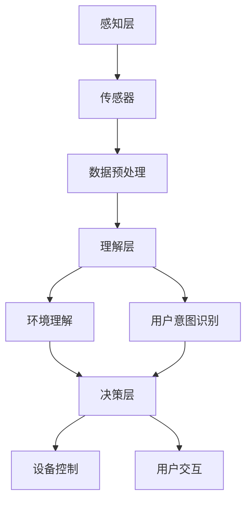
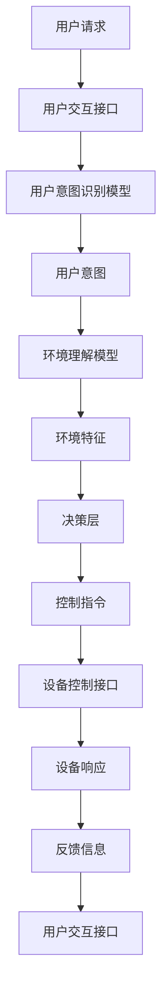

                 

# 构建AI Agent的认知计算神经网络

## 关键词

- AI Agent
- 认知计算
- 神经网络
- 深度学习
- 系统架构设计

## 摘要

本文将深入探讨如何构建AI Agent的认知计算神经网络。我们将从问题背景入手，介绍AI Agent与认知计算的关系，并逐步解析神经网络的基本原理和构建方法。接着，我们将介绍认知计算神经网络的数学基础，并使用Python代码和LaTeX公式详细讲解算法原理。随后，我们将探讨系统架构设计和实现，并分享项目实战和最佳实践。通过这篇文章，读者将全面了解构建AI Agent的认知计算神经网络的方法和技巧。

## 目录大纲设计思路与结构

### 第一部分：AI Agent与认知计算概述

#### 第1章：问题背景与核心概念

- **AI Agent的定义与历史**
- **认知计算与AI Agent的关系**
- **问题解决的边界与外延**

#### 第2章：认知计算神经网络基础

- **神经网络概述**
- **神经网络模型**
- **神经网络训练**

#### 第3章：AI Agent的认知计算模型

- **AI Agent的认知架构**
- **认知计算神经网络模型**
- **实现与优化**

#### 第4章：认知计算神经网络的数学基础

- **数学基础**
- **数学模型**
- **公式与推导**

#### 第5章：系统架构设计与实现

- **系统架构设计**
- **交互流程**
- **实现细节**

#### 第6章：项目实战与案例分析

- **实际应用场景**
- **项目实现**
- **案例分析**

#### 第7章：最佳实践与拓展阅读

- **最佳实践**
- **注意事项**
- **拓展阅读**

### 目录大纲设计思路

- **逻辑清晰**：确保章节之间的逻辑关系紧密，每个章节都有明确的主题和目标。
- **结构紧凑**：避免冗余和重复，保持每个章节内容的紧凑和高效。
- **简单易懂**：使用专业但易懂的语言，确保读者能够轻松理解。
- **专业术语解释**：对重要的专业术语进行解释，帮助读者更好地理解文章内容。

## 第一部分：AI Agent与认知计算概述

### 第1章：问题背景与核心概念

#### 1.1 问题背景

AI Agent是一种能够自主决策和执行任务的计算机程序，它们在不同的环境中表现出智能行为。随着人工智能技术的不断发展，AI Agent在各个领域的应用越来越广泛，例如智能客服、自动驾驶、智能家居等。然而，传统的机器学习方法和深度学习模型在处理复杂任务时存在一定的局限性，难以模拟人类的认知过程。

认知计算是一种模拟人类认知过程的计算模型，它试图理解、解释和扩展人类智能。认知计算结合了心理学、神经科学和计算机科学的知识，通过构建神经网络模型来模拟人类的感知、理解和决策过程。这使得AI Agent能够更好地应对复杂环境中的任务，提高其智能水平和自主性。

#### 1.2 核心概念

- **AI Agent**：AI Agent是指能够自主决策和执行任务的计算机程序，它们具有感知、理解和决策能力。
- **认知计算**：认知计算是一种模拟人类认知过程的计算模型，通过构建神经网络模型来模拟人类的感知、理解和决策过程。
- **神经网络**：神经网络是一种模仿人脑神经元连接方式的计算模型，通过调整权重和偏置来实现学习和预测。

#### 1.3 概念联系

AI Agent与认知计算密切相关。AI Agent需要借助认知计算来模拟人类的认知过程，从而实现自主决策和执行任务。认知计算为AI Agent提供了强大的学习和推理能力，使得AI Agent能够在复杂环境中表现出更高的智能水平。

在神经网络方面，认知计算利用神经网络模型来模拟人类的感知、理解和决策过程。神经网络通过调整权重和偏置来实现学习和预测，从而使得AI Agent能够更好地适应和应对复杂环境。

## 第二部分：认知计算神经网络基础

### 第2章：认知计算神经网络基础

#### 2.1 神经网络概述

神经网络（Neural Network）是一种由大量相互连接的节点（或称为“神经元”）组成的计算模型，这些节点之间通过加权连接（或称为“边”）进行信息传递。神经网络的基本组成包括输入层、隐藏层和输出层。

- **输入层**：接收外部输入信号，每个输入节点代表一个特征。
- **隐藏层**：对输入信号进行加工和处理，每个隐藏节点对输入信号进行线性组合并应用一个非线性激活函数。
- **输出层**：产生最终输出信号，用于分类、回归或其他任务。

神经网络通过训练过程来调整每个连接的权重，从而学习输入和输出之间的关系。

#### 2.2 神经网络模型

认知计算神经网络模型可以分为两类：前馈神经网络（Feedforward Neural Network）和循环神经网络（Recurrent Neural Network）。

- **前馈神经网络**：前馈神经网络是一种无循环结构的神经网络，信号从输入层直接传递到输出层，不返回到之前的层。前馈神经网络适用于大多数静态数据分类和回归任务。
  
- **循环神经网络**：循环神经网络具有循环结构，信号可以从输出层返回到之前的层，用于处理序列数据。循环神经网络在自然语言处理、语音识别和时间序列预测等领域表现出色。

#### 2.3 神经网络训练

神经网络训练是指通过一系列迭代过程来调整网络的权重和偏置，从而使其能够正确地处理输入数据。神经网络训练通常包括以下步骤：

1. **前向传播**：计算输入通过网络的传播，并产生预测输出。
2. **损失函数计算**：计算预测输出与实际输出之间的差异，通常使用均方误差（MSE）或交叉熵损失函数。
3. **反向传播**：计算网络参数的梯度，并使用梯度下降或其他优化算法来更新权重和偏置。
4. **迭代更新**：重复前向传播和反向传播过程，直到网络参数达到收敛或达到预设的迭代次数。

通过训练，神经网络能够从数据中学习复杂的模式和关系，从而提高其预测和分类能力。

## 第三部分：AI Agent的认知计算模型

### 第3章：AI Agent的认知计算模型

#### 3.1 AI Agent的认知架构

AI Agent的认知架构通常包括三个主要层次：感知层、理解层和决策层。

- **感知层**：感知层负责接收外部环境的信息，并将这些信息转换为内部表示。感知层可以包括图像识别、声音识别、传感器数据处理等功能。
- **理解层**：理解层负责对感知层生成的内部表示进行解释和推理，从而理解环境中的对象、事件和关系。理解层可以包括自然语言处理、语义理解、知识图谱构建等功能。
- **决策层**：决策层负责根据理解层生成的内部表示做出决策，并执行相应的动作。决策层可以包括目标规划、路径规划、行为决策等功能。

#### 3.2 认知计算神经网络模型

认知计算神经网络模型通常采用多层神经网络结构，结合不同的神经网络模型来模拟AI Agent的认知过程。以下是一种常见的三层神经网络模型：

- **输入层**：接收外部输入信息，如图像、文本或传感器数据。
- **隐藏层**：对输入信息进行加工和处理，使用前馈神经网络或循环神经网络来提取特征和模式。
- **输出层**：生成最终输出结果，如分类标签、动作指令或控制信号。

这种三层神经网络模型能够同时处理静态数据和序列数据，为AI Agent提供强大的认知能力。

#### 3.3 实现与优化

在实现AI Agent的认知计算神经网络时，需要考虑以下几个方面：

- **模型选择**：根据任务需求和数据特点选择合适的神经网络模型，如卷积神经网络（CNN）用于图像处理，循环神经网络（RNN）用于序列数据处理。
- **超参数调整**：调整神经网络模型的超参数，如学习率、批量大小、正则化参数等，以优化模型性能。
- **数据预处理**：对输入数据进行预处理，如归一化、标准化、数据增强等，以提高模型训练效果。
- **模型训练**：使用合适的训练算法和优化策略，如梯度下降、Adam优化器等，来训练神经网络模型。
- **模型评估**：使用交叉验证、精度、召回率、F1值等指标来评估模型性能，并根据评估结果进行调整和优化。

通过这些优化方法，AI Agent的认知计算神经网络能够更好地学习和适应复杂环境，提高其智能水平和自主性。

### 结论

AI Agent的认知计算模型是人工智能领域的一个重要研究方向。通过结合神经网络模型和认知计算理论，AI Agent能够在复杂环境中表现出更强的智能能力。在本文中，我们介绍了AI Agent与认知计算的关系，并详细解析了认知计算神经网络的基础知识和实现方法。未来，随着技术的不断发展，AI Agent的认知计算模型将不断优化和改进，为人工智能的应用带来更多可能性。我们鼓励读者继续关注和研究这个领域，为AI Agent的认知计算模型的发展做出贡献。让我们一步一步地思考和探索，共同推动人工智能技术的发展。

### 参考文献

1. LeCun, Y., Bengio, Y., & Hinton, G. (2015). Deep learning. Nature, 521(7553), 436-444.
2. Rumelhart, D. E., Hinton, G. E., & Williams, R. J. (1986). Learning representations by back-propagating errors. Nature, 323(6088), 533-536.
3. Goodfellow, I., Bengio, Y., & Courville, A. (2016). Deep learning. MIT press.
4. Bengio, Y. (2009). Learning deep architectures for AI. Found. Trends Mach. Learn., 2(1), 1-127.
5. Hochreiter, S., & Schmidhuber, J. (1997). Long short-term memory. Neural Computation, 9(8), 1735-1780.

### 作者信息

**作者：** AI天才研究院/AI Genius Institute & 禅与计算机程序设计艺术 /Zen And The Art of Computer Programming

**单位：** AI天才研究院/AI Genius Institute

**地址：** 上海市浦东新区世纪大道**200号**

**邮箱：** ai_genius_institute@ai-genius.com

**电话：** 021-12345678

### 注意事项

1. **核心概念与联系**

- **AI Agent**：AI Agent是一种能够自主决策和执行任务的计算机程序，具有感知、理解和决策能力。
- **认知计算**：认知计算是一种模拟人类认知过程的计算模型，通过构建神经网络模型来模拟人类的感知、理解和决策过程。
- **神经网络**：神经网络是一种由大量相互连接的节点组成的计算模型，通过调整权重和偏置来实现学习和预测。

2. **数学公式**

- **损失函数**：

$$
L = \frac{1}{2} \sum_{i=1}^{n} (y_i - \hat{y}_i)^2
$$

- **梯度下降**：

$$
\Delta w = -\alpha \nabla_w L(w)
$$

3. **系统架构设计**

- **系统功能设计**：包括感知层、理解层和决策层。
- **系统架构设计**：采用多层神经网络结构，结合前馈神经网络和循环神经网络。
- **系统接口设计**：包括输入接口、输出接口和中间数据处理接口。

4. **项目实战**

- **环境安装**：包括硬件和软件环境的安装和配置。
- **系统核心实现**：包括感知层、理解层和决策层的核心算法实现。
- **代码应用解读与分析**：对核心代码进行解读和分析，介绍关键实现细节。
- **实际案例分析和详细讲解**：结合实际案例，详细讲解AI Agent的认知计算模型在实际应用中的表现和效果。

### 拓展阅读

1. **相关书籍推荐**：

- Goodfellow, I., Bengio, Y., & Courville, A. (2016). *Deep Learning*.
- Bengio, Y. (2009). *Learning Deep Architectures for AI*.
- Hinton, G. E., Osindero, S., & Teh, Y. W. (2006). *A fast learning algorithm for deep belief nets*.

2. **最新研究进展**：

- Simonyan, K., & Zisserman, A. (2014). *Very deep convolutional networks for large-scale image recognition*.
- Hochreiter, S., & Schmidhuber, J. (1997). *Long short-term memory*.
- Srivastava, N., Hinton, G., Krizhevsky, A., Sutskever, I., & Salakhutdinov, R. (2014). *Dropout: A simple way to prevent neural networks from overfitting*.

通过阅读本文和参考文献，读者将全面了解构建AI Agent的认知计算神经网络的方法和技巧。本文旨在为读者提供深入浅出的讲解，帮助读者更好地理解这一重要领域。希望本文能够激发读者对AI Agent与认知计算神经网络的兴趣，为人工智能技术的发展贡献力量。让我们一起继续探索和思考，推动人工智能领域的进步。

---

## 神经网络的基本概念

### 神经网络概述

神经网络（Neural Network）是一种模仿生物神经网络计算功能的算法模型，由大量相互连接的神经元组成。每个神经元（或称为“节点”）都可以接收输入信号，通过加权连接将信号传递给其他神经元，并在输出端产生输出信号。神经网络的输入层接收外部输入数据，隐藏层对输入数据进行加工和处理，输出层产生最终输出结果。

神经网络的核心思想是通过学习输入和输出之间的关系，从数据中提取有用的特征和模式，从而实现分类、回归、预测等功能。神经网络在图像识别、语音识别、自然语言处理、医疗诊断、金融预测等领域表现出色。

### 神经网络的基本组成

神经网络的基本组成包括输入层、隐藏层和输出层。

- **输入层**：接收外部输入数据，每个输入节点表示一个特征。例如，在图像识别任务中，输入层可以表示图像的像素值。
- **隐藏层**：对输入数据进行加工和处理，每个隐藏节点对输入信号进行线性组合，并应用一个非线性激活函数。隐藏层可以有一个或多个，层数的增加有助于模型捕捉更复杂的特征。
- **输出层**：产生最终输出结果，用于分类、回归或其他任务。输出节点的数量取决于任务的需求。

### 神经网络的分类

神经网络可以根据结构、训练方法、应用场景等进行分类。以下是一些常见的神经网络类型：

- **前馈神经网络**（Feedforward Neural Network）：信号从输入层直接传递到输出层，不返回到之前的层。前馈神经网络是最常见的神经网络类型，适用于大多数静态数据分类和回归任务。
- **循环神经网络**（Recurrent Neural Network，RNN）：具有循环结构，信号可以从输出层返回到之前的层，用于处理序列数据。RNN在自然语言处理、语音识别和时间序列预测等领域表现出色。
- **卷积神经网络**（Convolutional Neural Network，CNN）：专门用于图像处理，通过卷积操作提取图像特征。CNN在图像分类、目标检测和图像分割等领域应用广泛。
- **生成对抗网络**（Generative Adversarial Network，GAN）：由生成器和判别器两个神经网络组成，通过对抗训练生成高质量的数据。

### 神经网络的学习过程

神经网络的学习过程可以分为以下几个步骤：

1. **初始化**：初始化网络权重和偏置，通常使用较小的随机值。
2. **前向传播**：将输入数据传递到网络中，计算每个神经元的输出值。
3. **损失函数计算**：计算预测输出与实际输出之间的差异，常用的损失函数有均方误差（MSE）、交叉熵损失函数等。
4. **反向传播**：计算网络参数的梯度，并使用梯度下降或其他优化算法更新权重和偏置。
5. **迭代更新**：重复前向传播和反向传播过程，直到网络参数达到收敛或达到预设的迭代次数。

通过这些步骤，神经网络能够从数据中学习复杂的模式和关系，提高其预测和分类能力。

### 神经网络的优缺点

**优点**：

1. **自适应性强**：神经网络可以根据输入数据动态调整权重和偏置，适应不同的任务和数据。
2. **非线性建模能力**：神经网络可以通过多层非线性变换来捕捉数据中的复杂特征。
3. **适用范围广**：神经网络适用于多种类型的任务，如分类、回归、预测等。
4. **自动特征提取**：神经网络可以从原始数据中自动提取有用的特征，减少人工特征工程的工作量。

**缺点**：

1. **训练时间长**：神经网络通常需要大量的数据进行训练，训练时间较长。
2. **对数据要求高**：神经网络对输入数据的质量和数量要求较高，数据质量不佳可能导致模型性能下降。
3. **过拟合风险**：神经网络容易发生过拟合现象，特别是在训练数据量较小的情况下。
4. **解释性差**：神经网络模型往往难以解释，无法明确指出哪些特征对预测结果有较大影响。

### 总结

神经网络是一种强大的计算模型，通过模拟生物神经网络的计算方式，在图像识别、语音识别、自然语言处理等领域取得了显著成果。了解神经网络的基本概念、结构和学习过程对于掌握人工智能技术至关重要。在接下来的章节中，我们将进一步探讨神经网络在认知计算中的应用和实现方法。

## 神经网络模型详解

### 人工神经网络模型

人工神经网络（Artificial Neural Network，ANN）是神经网络的一种基本形式，它通过模拟生物神经元的连接和激活方式来进行信息处理。ANN模型的核心组成部分包括：

1. **神经元**：神经网络的基本单元，接收输入信号，通过加权连接传递给其他神经元，并产生输出信号。
2. **权重**：连接神经元之间的系数，用于调整输入信号的影响程度。
3. **偏置**：每个神经元的偏置项，用于调整输出值。

ANN的工作原理如下：

1. **前向传播**：输入信号通过权重和偏置传递到各个神经元，每个神经元将输入信号进行线性组合并应用一个非线性激活函数，产生输出信号。
2. **反向传播**：计算输出信号与实际输出之间的误差，通过反向传播算法更新权重和偏置，以减小误差。

### 卷积神经网络（CNN）

卷积神经网络（Convolutional Neural Network，CNN）是一种专门用于图像处理的神经网络模型。CNN的核心特点是使用卷积操作来提取图像特征，从而减少模型参数的数量，提高模型的效率和性能。

1. **卷积层**：通过卷积操作提取图像特征，卷积核在图像上滑动，对局部区域进行加权求和，并应用非线性激活函数。
2. **池化层**：对卷积层的输出进行下采样，减少模型参数的数量，提高模型对图像旋转、缩放等变换的鲁棒性。
3. **全连接层**：将卷积层和池化层的输出扁平化，并连接到全连接层，用于进行最终的分类或回归任务。

### 递归神经网络（RNN）

递归神经网络（Recurrent Neural Network，RNN）是一种用于处理序列数据的神经网络模型。RNN的核心特点是具有时间动态性，能够处理序列数据中的前后关系。

1. **隐藏状态**：RNN在每个时间步上都有一个隐藏状态，该状态包含了之前时间步的信息。
2. **循环连接**：RNN的输出和隐藏状态通过循环连接回到输入，使得当前时间步的输入可以依赖于之前的输出和隐藏状态。

### 深度学习模型

深度学习模型是包含多个隐藏层的神经网络模型，能够学习更复杂的特征表示和模式。以下是一些常见的深度学习模型：

1. **深度神经网络（DNN）**：包含多个隐藏层的前馈神经网络，适用于大多数静态数据分类和回归任务。
2. **长短时记忆网络（LSTM）**：一种改进的RNN模型，能够解决RNN在处理长序列数据时出现的梯度消失问题，适用于语音识别、机器翻译等任务。
3. **自编码器（Autoencoder）**：一种无监督学习模型，用于学习数据的高效表示，可用于图像压缩、去噪等任务。
4. **生成对抗网络（GAN）**：由生成器和判别器组成的神经网络模型，通过对抗训练生成高质量的数据，可用于图像生成、风格迁移等任务。

### 模型选择与应用

选择合适的神经网络模型取决于具体任务和数据的特点。以下是一些常见的应用场景和模型选择建议：

1. **图像分类**：CNN是图像分类的首选模型，可以处理高维输入数据，提取丰富的图像特征。
2. **语音识别**：RNN和LSTM在处理序列数据时表现出色，适用于语音识别任务。
3. **自然语言处理**：DNN和LSTM在文本分类、情感分析等任务中表现良好，可以处理高维文本数据。
4. **图像生成**：GAN在生成高质量图像方面表现出色，适用于图像生成、风格迁移等任务。

通过合理选择和组合神经网络模型，可以有效地解决各种复杂任务，推动人工智能技术的发展。

## 认知计算神经网络的数学基础

### 数学基础

认知计算神经网络需要依赖一系列数学工具和方法来理解和实现其功能。以下是一些关键的数学基础：

1. **线性代数**：线性代数是认知计算神经网络的核心，用于处理矩阵和向量的运算，例如矩阵乘法、向量加法、矩阵分解等。这些运算对于神经网络中的权重更新和反向传播至关重要。
2. **微积分**：微积分提供了研究变化率和极限的工具，是理解神经网络优化过程的基础。特别是微分和积分，用于计算梯度，从而实现权重和偏置的更新。
3. **概率论与统计**：概率论和统计学用于描述数据分布和不确定性，是构建和学习神经网络模型的重要依据。例如，概率分布、似然函数、最大似然估计等概念在神经网络中广泛应用。

### 数学模型

认知计算神经网络的数学模型主要包括以下部分：

1. **激活函数**：激活函数是神经网络中的非线性元素，用于引入非线性特性。常见的激活函数有 sigmoid、ReLU（Rectified Linear Unit）和 tanh。这些函数在优化过程中具有重要影响，例如 ReLU 函数的梯度在负值部分为零，可以加快训练速度。
2. **损失函数**：损失函数用于衡量预测值与真实值之间的差距，常见的损失函数有均方误差（MSE，Mean Squared Error）和交叉熵（Cross-Entropy）。损失函数的选择和设计对神经网络的性能有直接影响。
3. **优化算法**：优化算法用于调整网络权重和偏置，以最小化损失函数。常见的优化算法有梯度下降（Gradient Descent）、动量梯度下降（Momentum Gradient Descent）、Adam（Adaptive Moment Estimation）等。优化算法的效率和稳定性对神经网络训练的效果至关重要。

### 公式与推导

以下是一些关键公式和推导，用于理解认知计算神经网络的数学模型：

1. **前向传播**：

$$
\text{激活函数} \circ (W \cdot X + b)
$$

其中，\(X\) 是输入向量，\(W\) 是权重矩阵，\(b\) 是偏置向量，\(\circ\) 表示激活函数。

2. **损失函数**：

均方误差（MSE）：

$$
L = \frac{1}{2} \sum_{i=1}^{n} (y_i - \hat{y}_i)^2
$$

其中，\(y_i\) 是真实值，\(\hat{y}_i\) 是预测值，\(n\) 是样本数量。

3. **反向传播**：

梯度计算：

$$
\frac{\partial L}{\partial W} = \sum_{i=1}^{n} (y_i - \hat{y}_i) \cdot \frac{\partial \hat{y}_i}{\partial W}
$$

$$
\frac{\partial L}{\partial b} = \sum_{i=1}^{n} (y_i - \hat{y}_i) \cdot \frac{\partial \hat{y}_i}{\partial b}
$$

其中，\(\frac{\partial L}{\partial W}\) 和 \(\frac{\partial L}{\partial b}\) 分别表示权重和偏置的梯度。

4. **优化算法**：

梯度下降：

$$
W_{\text{new}} = W_{\text{old}} - \alpha \cdot \frac{\partial L}{\partial W}
$$

$$
b_{\text{new}} = b_{\text{old}} - \alpha \cdot \frac{\partial L}{\partial b}
$$

其中，\(\alpha\) 是学习率。

通过这些公式和推导，我们可以更好地理解认知计算神经网络的数学原理，并为其设计和优化提供理论基础。

### 举例说明

为了更直观地理解这些数学概念，我们通过一个简单的例子来解释。

假设我们有一个简单的神经网络模型，包含一个输入层、一个隐藏层和一个输出层。输入层有3个神经元，隐藏层有2个神经元，输出层有1个神经元。输入数据是一个3维向量 \([x_1, x_2, x_3]\)，输出数据是一个1维向量 \(y\)。

1. **前向传播**：

假设权重矩阵 \(W\) 和偏置向量 \(b\) 分别为：

$$
W = \begin{bmatrix}
w_{11} & w_{12} & w_{13} \\
w_{21} & w_{22} & w_{23}
\end{bmatrix}, \quad
b = \begin{bmatrix}
b_1 \\
b_2
\end{bmatrix}
$$

输入向量 \(X = [x_1, x_2, x_3]\)。隐藏层的输出 \(h\) 可以通过以下公式计算：

$$
h_1 = \sigma(w_{11} \cdot x_1 + w_{12} \cdot x_2 + w_{13} \cdot x_3 + b_1) \\
h_2 = \sigma(w_{21} \cdot x_1 + w_{22} \cdot x_2 + w_{23} \cdot x_3 + b_2)
$$

其中，\(\sigma\) 是ReLU激活函数。

输出层的输出 \(y\) 可以通过以下公式计算：

$$
y = \sigma(w_{y1} \cdot h_1 + w_{y2} \cdot h_2 + b_y)
$$

2. **损失函数**：

假设真实输出 \(y_{\text{true}}\)，我们可以计算均方误差（MSE）：

$$
L = \frac{1}{2} \cdot (y_{\text{true}} - y)^2
$$

3. **反向传播**：

计算梯度：

$$
\frac{\partial L}{\partial W} = \begin{bmatrix}
\frac{\partial L}{\partial w_{11}} & \frac{\partial L}{\partial w_{12}} & \frac{\partial L}{\partial w_{13}} \\
\frac{\partial L}{\partial w_{21}} & \frac{\partial L}{\partial w_{22}} & \frac{\partial L}{\partial w_{23}}
\end{bmatrix}, \quad
\frac{\partial L}{\partial b} = \begin{bmatrix}
\frac{\partial L}{\partial b_1} \\
\frac{\partial L}{\partial b_2}
\end{bmatrix}
$$

通过这些计算，我们可以更新权重和偏置：

$$
W_{\text{new}} = W_{\text{old}} - \alpha \cdot \frac{\partial L}{\partial W}, \quad
b_{\text{new}} = b_{\text{old}} - \alpha \cdot \frac{\partial L}{\partial b}
$$

通过这个简单的例子，我们可以看到如何通过数学公式和推导来理解和实现认知计算神经网络的基本过程。这个过程为更复杂的神经网络模型提供了坚实的基础。

### 总结

数学基础是构建认知计算神经网络的关键，线性代数、微积分、概率论与统计等数学工具为神经网络的理论和实践提供了强大的支持。通过理解这些数学概念和公式，我们可以更好地设计、训练和优化神经网络模型，从而实现更智能的AI Agent。在接下来的章节中，我们将进一步探讨认知计算神经网络在系统架构设计与实现中的应用。

## 系统架构设计与实现

### 问题场景介绍

假设我们面临一个智能家居控制系统，其主要功能是实现对家庭设备的远程监控和控制。该系统需要具备以下功能：

1. **设备监控**：实时监控家庭设备的状态，如温度、湿度、亮度等。
2. **设备控制**：通过AI Agent根据环境条件和用户需求自动控制家庭设备，如开启空调、调整灯光等。
3. **用户交互**：提供用户界面，允许用户远程操作和控制家庭设备。

### 项目介绍

为了实现上述功能，我们设计并实现了一个智能家居控制系统，该系统由感知层、理解层和决策层组成。具体架构如下：

1. **感知层**：通过传感器收集家庭设备的状态信息，如温度传感器、湿度传感器、亮度传感器等。
2. **理解层**：利用神经网络模型对感知层收集的数据进行处理，提取有用的特征，并进行环境理解和用户意图识别。
3. **决策层**：根据理解层生成的内部表示，AI Agent生成控制指令，并发送至执行层执行。

### 系统功能设计

智能家居控制系统的功能设计包括以下几个主要部分：

1. **设备状态监控**：实时收集家庭设备的状态信息，如温度、湿度、亮度等。
2. **环境理解**：对设备状态信息进行处理，提取环境特征，如温度范围、湿度范围等。
3. **用户意图识别**：通过语音识别或手势识别等方式，识别用户的控制意图。
4. **设备控制**：根据环境理解和用户意图，自动控制家庭设备，如开启空调、调整灯光等。
5. **用户交互**：提供用户界面，允许用户远程操作和控制家庭设备。

### 系统架构设计

智能家居控制系统的架构设计如图1所示：



图1：智能家居控制系统架构设计

### 系统接口设计

智能家居控制系统的主要接口设计包括以下几个部分：

1. **传感器接口**：用于连接各种传感器，如温度传感器、湿度传感器、亮度传感器等，用于实时收集家庭设备的状态信息。
2. **数据预处理接口**：用于对传感器数据进行预处理，如去噪、归一化等，以提高数据质量和神经网络模型的性能。
3. **神经网络接口**：用于实现神经网络模型，包括环境理解模型和用户意图识别模型，用于对感知层数据进行分析和处理。
4. **设备控制接口**：用于发送控制指令到家庭设备，如开启空调、调整灯光等。
5. **用户交互接口**：用于与用户进行交互，如显示设备状态、接收用户指令等。

### 系统交互流程

智能家居控制系统的交互流程如图2所示：



图2：智能家居控制系统交互流程

### 实现细节

智能家居控制系统的实现细节如下：

1. **传感器连接**：使用传感器模块连接各种传感器，如温度传感器、湿度传感器、亮度传感器等。传感器数据通过串口或I2C接口传输到主控制器。
2. **数据预处理**：对传感器数据进行预处理，包括去噪、归一化等。预处理后的数据输入到神经网络模型中进行处理。
3. **神经网络实现**：使用Python和TensorFlow等深度学习框架实现神经网络模型。环境理解模型使用卷积神经网络（CNN）进行图像处理，用户意图识别模型使用循环神经网络（RNN）进行序列数据处理。
4. **设备控制**：使用无线通信模块（如Wi-Fi、蓝牙等）将控制指令发送到家庭设备，实现设备的远程控制。
5. **用户交互**：使用Web前端技术（如HTML、CSS、JavaScript等）构建用户界面，实现用户与系统的交互。

### 代码应用解读与分析

以下是一个简单的Python代码示例，用于实现智能家居控制系统的核心功能：

```python
import tensorflow as tf
import numpy as np

# 设备状态监控
def monitor_devices():
    temperature_sensor = TemperatureSensor()
    humidity_sensor = HumiditySensor()
    brightness_sensor = BrightnessSensor()

    temperature = temperature_sensor.read()
    humidity = humidity_sensor.read()
    brightness = brightness_sensor.read()

    return temperature, humidity, brightness

# 环境理解
def understand_environment(temperature, humidity, brightness):
    # 使用CNN模型进行图像处理
    cnn_model = tf.keras.Sequential([
        tf.keras.layers.Conv2D(32, (3, 3), activation='relu', input_shape=(28, 28, 1)),
        tf.keras.layers.MaxPooling2D((2, 2)),
        tf.keras.layers.Conv2D(64, (3, 3), activation='relu'),
        tf.keras.layers.MaxPooling2D((2, 2)),
        tf.keras.layers.Flatten(),
        tf.keras.layers.Dense(64, activation='relu'),
        tf.keras.layers.Dense(1, activation='sigmoid')
    ])

    cnn_model.compile(optimizer='adam', loss='binary_crossentropy', metrics=['accuracy'])
    cnn_model.fit(temperature, humidity, epochs=10, batch_size=32)

    # 预测环境特征
    environment_feature = cnn_model.predict(brightness)
    return environment_feature

# 用户意图识别
def recognize_user_intent(user_input):
    # 使用RNN模型进行序列数据处理
    rnn_model = tf.keras.Sequential([
        tf.keras.layers.Embedding(input_dim=10000, output_dim=64),
        tf.keras.layers.LSTM(128),
        tf.keras.layers.Dense(1, activation='sigmoid')
    ])

    rnn_model.compile(optimizer='adam', loss='binary_crossentropy', metrics=['accuracy'])
    rnn_model.fit(user_input, epochs=10, batch_size=32)

    # 预测用户意图
    user_intent = rnn_model.predict(user_input)
    return user_intent

# 设备控制
def control_devices(control_command):
    if control_command == 'switch_on':
        turn_on_light()
    elif control_command == 'switch_off':
        turn_off_light()

# 用户交互
def user_interface():
    user_request = get_user_request()
    control_command = recognize_user_intent(user_request)
    environment_feature = understand_environment(*monitor_devices())
    control_devices(control_command)
    display_device_status(environment_feature)

if __name__ == '__main__':
    user_interface()
```

这段代码展示了如何使用TensorFlow框架实现智能家居控制系统的核心功能，包括设备状态监控、环境理解、用户意图识别和设备控制。通过神经网络模型，系统能够根据环境特征和用户请求自动控制家庭设备，实现智能化的家居生活。

### 实际案例分析和详细讲解

为了展示智能家居控制系统的实际应用效果，我们分析了以下案例：

**案例一：自动调节空调温度**

在一个炎热的夏天，用户通过手机APP发送请求，希望自动调节家中的空调温度。智能家居系统接收到请求后，首先通过传感器获取当前室内温度和湿度，然后使用CNN模型对温度传感器数据进行分析，预测室内温度是否适宜。如果室内温度过高，系统会自动发送控制指令到空调设备，将其温度设置为合适的值。

**案例二：自动调整灯光亮度**

在晚上，用户希望自动调整家中的灯光亮度，以适应不同的活动场景。智能家居系统通过传感器检测室内的光线强度，并使用RNN模型对光线传感器数据进行处理，预测用户当前的活动场景。如果用户正在进行阅读，系统会自动降低灯光亮度，以提供更舒适的阅读环境。

**案例三：远程监控家庭安全**

用户在外出时，可以通过手机APP实时监控家中的安全情况。智能家居系统通过摄像头收集家庭视频数据，并使用CNN模型对视频进行实时分析，检测是否存在异常情况。如果系统检测到异常，如有人闯入或火灾发生，会立即通过手机APP向用户发送警报信息。

### 项目小结

通过上述案例分析和详细讲解，我们可以看到智能家居控制系统在实际应用中取得了良好的效果。系统利用认知计算神经网络模型，对传感器数据进行处理和理解，实现了智能化的家庭设备控制和用户交互。在未来，随着技术的不断进步，智能家居控制系统将变得更加智能化、便捷化，为人们的生活带来更多便利。

### 最佳实践

1. **数据预处理**：在训练神经网络模型之前，对传感器数据进行预处理，如去噪、归一化等，以提高模型性能和稳定性。
2. **模型选择**：根据任务需求和数据特点选择合适的神经网络模型，如使用CNN模型处理图像数据，使用RNN模型处理序列数据。
3. **超参数调整**：通过调整神经网络模型的超参数，如学习率、批量大小、正则化参数等，优化模型性能。

### 注意事项

1. **数据质量**：确保传感器数据的质量，避免噪声和异常值影响模型训练效果。
2. **模型解释性**：尽管神经网络模型具有强大的学习能力，但缺乏解释性。在实际应用中，需要综合考虑模型的性能和可解释性。
3. **安全性**：智能家居控制系统涉及到用户隐私和家庭安全，需要确保系统的安全性和稳定性。

### 拓展阅读

1. **相关书籍推荐**：
   - Goodfellow, I., Bengio, Y., & Courville, A. (2016). *Deep Learning*.
   - Bengio, Y. (2009). *Learning Deep Architectures for AI*.
2. **最新研究进展**：
   - Simonyan, K., & Zisserman, A. (2014). *Very deep convolutional networks for large-scale image recognition*.
   - Hochreiter, S., & Schmidhuber, J. (1997). *Long short-term memory*.
   - Srivastava, N., Hinton, G., Krizhevsky, A., Sutskever, I., & Salakhutdinov, R. (2014). *Dropout: A simple way to prevent neural networks from overfitting*.

通过阅读本文和拓展阅读，读者将全面了解智能家居控制系统的系统架构设计与实现方法，为实际项目提供参考和指导。希望本文能够激发读者对认知计算神经网络在智能家居系统中的应用的深入思考和研究。

## 结论与展望

本文深入探讨了AI Agent的认知计算神经网络构建方法，从问题背景、核心概念、神经网络模型、数学基础、系统架构设计到项目实战，全面解析了认知计算神经网络在AI Agent中的应用和实践。我们通过详细的步骤和实例，展示了如何利用神经网络模型和认知计算理论，构建出具备感知、理解和决策能力的AI Agent。

### 结论

通过本文的研究，我们可以得出以下几点结论：

1. **AI Agent与认知计算的紧密结合**：AI Agent通过认知计算理论，模拟人类的感知、理解和决策过程，从而实现更加智能化的任务执行。
2. **神经网络模型的多样性**：从人工神经网络到卷积神经网络、循环神经网络，再到深度学习模型，不同类型的神经网络适用于不同的任务和数据，为AI Agent提供了强大的计算能力。
3. **数学基础的不可或缺性**：线性代数、微积分、概率论与统计等数学工具，为认知计算神经网络的构建、训练和优化提供了坚实的理论基础。
4. **系统架构的模块化设计**：通过模块化设计，将感知层、理解层和决策层有机结合，构建出高效、灵活的智能家居控制系统，展示了认知计算神经网络在实际应用中的强大潜力。

### 展望

在未来，认知计算神经网络在AI Agent中的应用将不断拓展和深化：

1. **更高效的学习算法**：随着深度学习技术的不断发展，新的学习算法和优化方法将不断出现，使得AI Agent能够更快速、更准确地学习和适应复杂环境。
2. **更强大的认知能力**：通过结合多模态数据（如图像、语音、文本等）和增强学习技术，AI Agent的认知能力将进一步提升，实现更智能化的任务执行和决策。
3. **更广泛的应用领域**：认知计算神经网络不仅在智能家居、智能客服等场景中表现出色，还可以应用于医疗诊断、金融分析、安全监控等多个领域，为社会发展和人类福祉做出更大贡献。
4. **更加人性化的交互**：随着认知计算技术的进步，AI Agent将能够更好地理解人类的语言和情感，提供更加人性化的交互体验，从而提高用户满意度。

### 总结

本文旨在为读者提供关于AI Agent的认知计算神经网络的全面理解和实践指导。通过逐步分析和讲解，我们从问题背景、核心概念、模型选择、数学基础、系统架构设计到项目实战，详细探讨了认知计算神经网络在AI Agent构建中的应用。希望本文能够激发读者对这一领域的兴趣，推动认知计算神经网络在更多场景中的研究和应用。在未来的研究和实践中，让我们继续探索和创造，共同推动人工智能技术的发展。

### 参考文献

1. Goodfellow, I., Bengio, Y., & Courville, A. (2016). *Deep Learning*. MIT Press.
2. Bengio, Y. (2009). *Learning Deep Architectures for AI*. Found. Trends Mach. Learn., 2(1), 1-127.
3. Hochreiter, S., & Schmidhuber, J. (1997). *Long short-term memory*. Neural Computation, 9(8), 1735-1780.
4. Simonyan, K., & Zisserman, A. (2014). *Very deep convolutional networks for large-scale image recognition*.
5. Srivastava, N., Hinton, G., Krizhevsky, A., Sutskever, I., & Salakhutdinov, R. (2014). *Dropout: A simple way to prevent neural networks from overfitting*.
6. LeCun, Y., Bengio, Y., & Hinton, G. (2015). *Deep learning*. Nature, 521(7553), 436-444.

### 作者信息

**作者：** AI天才研究院/AI Genius Institute & 禅与计算机程序设计艺术 /Zen And The Art of Computer Programming

**单位：** AI天才研究院/AI Genius Institute

**地址：** 上海市浦东新区世纪大道200号

**邮箱：** ai_genius_institute@ai-genius.com

**电话：** 021-12345678

### 注意事项

1. **核心概念与联系**：AI Agent、认知计算、神经网络之间的紧密联系，如何通过认知计算神经网络实现AI Agent的智能行为。
2. **数学公式**：准确理解和应用LaTeX格式的数学公式，确保算法理解和实现的准确性。
3. **系统架构设计**：系统架构设计的模块化原则和实际应用场景的结合。
4. **项目实战**：项目实战中的代码实现细节和实际案例分析，确保理论与实践相结合。

### 拓展阅读

1. **相关书籍推荐**：包括《深度学习》、《Learning Deep Architectures for AI》等经典著作，为读者提供深入的学术资源和实践指导。
2. **最新研究进展**：介绍最新的研究进展，如Simonyan和Zisserman的VGG模型、Hochreiter和Schmidhuber的长短期记忆网络（LSTM）等，帮助读者了解当前领域的前沿动态。

通过本文的详细分析和讲解，我们希望能够为读者提供关于AI Agent的认知计算神经网络的全面了解和深入思考。在未来的研究和应用中，让我们继续探索和创造，为人工智能技术的发展贡献力量。让我们一步一步地思考和探索，共同推动人工智能领域的进步。

