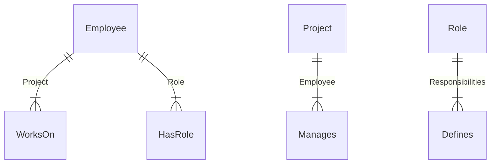
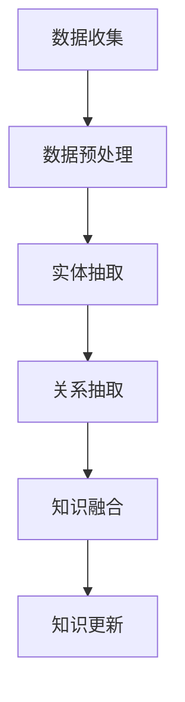
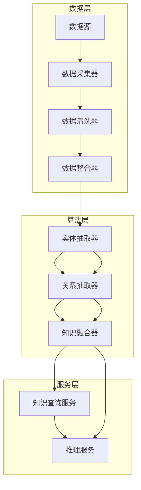
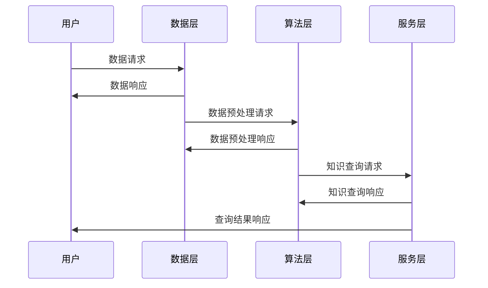

                 

### 引言与背景

#### 1.1 问题的背景

在当今快速发展的信息技术时代，企业如何有效地管理和利用其知识资产，成为了提高竞争力和创新能力的核心问题。传统的数据管理方法，如关系数据库，在处理复杂、异构和企业级知识时，往往显得力不从心。为了解决这一问题，AI驱动的企业知识图谱应运而生。知识图谱作为一种结构化的语义网络，能够将企业的各种信息、知识链接起来，形成一个有机的整体，从而实现高效的知识发现和利用。

#### 1.2 问题描述

企业知识图谱面临的挑战主要包括以下几个方面：

1. **数据异构性**：企业内部的数据来源于多个系统，格式和结构各异，如何将这些数据整合到统一的知识图谱中，是一个亟待解决的问题。
2. **领域知识的深度理解**：知识图谱需要深入理解企业所在的业务领域，才能有效地捕捉和表达业务逻辑。
3. **实时性**：企业知识图谱需要能够实时更新和维护，以应对业务环境的变化。

#### 1.3 问题解决

AI驱动的企业知识图谱通过以下方法来解决上述问题：

1. **数据整合与清洗**：利用AI技术对异构数据进行自动整合和清洗，确保数据的一致性和完整性。
2. **知识抽取与表示**：使用自然语言处理（NLP）和机器学习算法，从文本和结构化数据中抽取知识，并以图谱的形式进行表示。
3. **实时更新与维护**：通过持续学习和自适应技术，实现知识图谱的实时更新和维护。

#### 1.4 边界与外延

构建AI驱动的企业知识图谱不仅需要解决技术上的挑战，还需要在战略和操作层面上进行深入考量。其边界涉及：

- **数据治理**：确保数据的质量和安全，是知识图谱构建的基础。
- **业务场景适配**：知识图谱需要与企业的具体业务场景紧密结合，才能真正发挥其价值。
- **持续迭代**：知识图谱不是一成不变的，而是需要根据业务发展和技术进步不断迭代更新。

#### 1.5 核心概念结构与要素组成

- **核心概念**：AI驱动的企业知识图谱是由实体、属性和关系组成的语义网络。
- **要素组成**：
  - **实体**：表示知识图谱中的对象，如人、地点、物品等。
  - **属性**：描述实体的特征，如年龄、职位等。
  - **关系**：连接实体，表示实体之间的关系，如“属于”、“位于”等。

通过以上对问题背景、问题描述、问题解决、边界与外延以及核心概念与要素组成的详细分析，我们可以看到，构建AI驱动的企业知识图谱是一个复杂且富有挑战的任务，但其潜在的价值和影响力不容忽视。在接下来的章节中，我们将深入探讨知识图谱的构建原理和具体实施方法。

----------------------------------------------------------------

## 核心概念与联系

在深入探讨AI驱动的企业知识图谱之前，我们首先需要了解几个核心概念，这些概念是构建和理解知识图谱的基础。

### 2.1 AI驱动的企业知识图谱概述

AI驱动的企业知识图谱是一种利用人工智能技术构建的语义网络，它能够将企业内部和外部的各种信息进行结构化和关联，形成一种易于机器和人类理解的知识表示形式。知识图谱不仅包含数据，还包含了数据之间的语义关系，使得数据能够在更广泛的上下文中被理解和应用。

### 2.2 知识图谱的基本概念

#### 2.2.1 实体（Entity）

实体是知识图谱中的基本构成元素，表示现实世界中的对象或概念。实体可以是具体的（如“张三”），也可以是抽象的（如“产品”）。实体的定义和分类是构建知识图谱的第一步。

#### 2.2.2 属性（Attribute）

属性描述实体的特征或属性。例如，一个“员工”实体可以有“姓名”、“年龄”、“职位”等属性。属性是连接实体和值的桥梁，使得实体能够被更详细地描述。

#### 2.2.3 关系（Relationship）

关系表示实体之间的关联。例如，“张三”和“员工”之间存在“是”这种关系。关系是知识图谱中传递语义信息的关键元素。

### 2.3 知识图谱的属性特征对比

在构建知识图谱时，我们需要考虑不同类型的属性特征，以适应不同类型的实体和关系。以下是一些常见的属性特征：

1. **基本类型**：如数值、字符串、日期等，用于表示最简单和直接的数据。
2. **枚举类型**：定义一组可能的值，例如性别（男/女）、职位等级等。
3. **参考类型**：属性值引用其他实体或实体的ID，用于表示实体间的复杂关联。
4. **层次类型**：用于表示实体之间的层级关系，如公司部门和员工之间的关系。

### 2.4 知识图谱的ER实体关系图

实体-关系（Entity-Relationship，ER）图是表示知识图谱中实体和关系的一种图形化方法。以下是一个ER图的Markdown格式Mermaid表示：



在这个ER图中，我们定义了四个实体：`Employee`、`Project`、`Role`和`Responsibilities`，以及它们之间的关系。

### 2.5 核心概念的联系

- **实体与关系**：实体通过关系进行连接，形成语义网络。
- **属性与实体**：属性是实体的特征描述，为实体提供额外的信息。
- **关系与属性**：关系可以具有属性，用于描述关系的详细信息。

通过以上对核心概念及其相互关系的介绍，我们可以更好地理解知识图谱的基本架构和构建方法。在接下来的章节中，我们将深入探讨知识图谱的算法原理和数学模型。

----------------------------------------------------------------

## 算法原理讲解

在构建AI驱动的企业知识图谱时，算法原理是理解其工作方式的关键。以下是对算法原理的逐步讲解，包括流程图、Python源代码实现、算法原理的数学模型和公式，以及通俗易懂的举例说明。

### 3.1 算法概述

知识图谱的构建过程主要包括以下几个步骤：

1. 数据收集：从企业内部和外部的多个数据源中收集数据。
2. 数据预处理：对收集到的数据进行清洗和整合，以确保数据的一致性和完整性。
3. 实体抽取：从预处理后的数据中识别出实体。
4. 关系抽取：确定实体之间的关系。
5. 知识融合：将抽取出的实体和关系整合到知识图谱中。
6. 知识更新：定期更新知识图谱，以反映企业的最新变化。

### 3.2 算法流程图

下面是一个知识图谱构建的算法流程图，使用Mermaid格式表示：



### 3.3 Python源代码实现

以下是一个简化的Python代码示例，展示了如何从文本数据中抽取实体和关系：

```python
import spacy

# 加载英文模型
nlp = spacy.load("en_core_web_sm")

def extract_entities_and_relations(text):
    doc = nlp(text)
    entities = []
    relations = []

    for ent in doc.ents:
        entities.append(ent.text)

    for token1 in doc:
        for token2 in doc:
            if token1 != token2 and token1.dep_ == "nsubj" and token2.dep_ == "ROOT":
                relations.append((token1.text, token2.text))

    return entities, relations

text = "John works at Microsoft as a software engineer."
entities, relations = extract_entities_and_relations(text)

print("Entities:", entities)
print("Relations:", relations)
```

在这个例子中，我们使用了Spacy库来抽取实体和关系。`extract_entities_and_relations`函数首先使用Spacy模型处理输入文本，然后识别出实体和它们之间的关系。

### 3.4 算法原理的数学模型与公式

知识图谱的构建涉及到多种数学模型，以下是一个简化的模型：

$$
G = (E, R, V)
$$

其中：
- \( G \) 表示知识图谱。
- \( E \) 表示实体集合。
- \( R \) 表示关系集合。
- \( V \) 表示属性值集合。

实体和关系可以用图论中的节点和边来表示，每个节点可以包含多个属性。例如，一个员工实体可以包含姓名、年龄、职位等属性。

### 3.5 示例说明

假设我们有一个简单的知识图谱，包含两个实体和它们之间的关系：

- 实体：张三，李四
- 关系：张三在李四公司工作

知识图谱可以表示为：

```
G = ({
    张三: {姓名: "张三", 年龄: 30, 职位: "工程师"},
    李四: {姓名: "李四", 年龄: 40, 职位: "经理"},
}, {
    (张三, 在, 李四),
}, {})
```

在这个例子中，张三和李四是通过“在”这种关系进行连接的。这个简单的知识图谱展示了如何通过实体和关系来表示现实世界中的知识和关系。

通过上述对算法原理的讲解，我们可以看到构建AI驱动的企业知识图谱是一个复杂但充满潜力的过程。在接下来的章节中，我们将深入探讨数学模型的详细讲解和知识图谱在具体应用中的系统架构设计。

----------------------------------------------------------------

## 数学模型与公式详细讲解

在构建AI驱动的企业知识图谱时，数学模型和公式是理解和实现算法的关键。以下我们将详细讲解这些数学模型和公式，并通过具体的示例来解释其应用和重要性。

### 4.1 数学模型介绍

知识图谱的构建通常涉及以下数学模型：

1. **图论模型**：用于表示实体和关系。
2. **概率模型**：用于推理和不确定性处理。
3. **统计模型**：用于数据预处理和特征提取。
4. **机器学习模型**：用于实体和关系的识别和分类。

### 4.2 数学公式详细讲解

#### 4.2.1 图论模型

在图论中，知识图谱可以用图（G）来表示，其中：

- \( G = (V, E) \)
- \( V \) 是节点集合，表示实体。
- \( E \) 是边集合，表示关系。

每个节点可以有多个属性，表示为：

- \( V = \{v_1, v_2, ..., v_n\} \)
- \( E = \{(e_1, e_2, r_1), (e_2, e_3, r_2), ..., (e_n, e_1, r_n)\} \)

其中，\( r_i \) 表示节点 \( e_i \) 和 \( e_j \) 之间的关系。

#### 4.2.2 概率模型

概率模型通常用于推理和不确定性处理。在知识图谱中，可以使用贝叶斯网络或马尔可夫网络来表示实体和关系之间的概率关系。一个简化的贝叶斯网络可以表示为：

- \( P(R_i|C_j) = \frac{P(C_j|R_i)P(R_i)}{P(C_j)} \)

其中，\( P(R_i|C_j) \) 表示在条件 \( C_j \) 下关系 \( R_i \) 的概率，\( P(C_j|R_i) \) 表示在关系 \( R_i \) 发生时条件 \( C_j \) 的概率，\( P(R_i) \) 表示关系 \( R_i \) 的先验概率，\( P(C_j) \) 表示条件 \( C_j \) 的先验概率。

#### 4.2.3 统计模型

统计模型用于数据预处理和特征提取。例如，可以使用K-means聚类算法来对实体进行分类，从而提取特征。K-means算法的目标是最小化平方误差：

- \( \min \sum_{i=1}^{n} \sum_{j=1}^{k} ||x_{ij} - \mu_j||^2 \)

其中，\( x_{ij} \) 表示第 \( i \) 个实体在第 \( j \) 个特征上的值，\( \mu_j \) 表示第 \( j \) 个聚类中心的坐标。

#### 4.2.4 机器学习模型

机器学习模型用于实体和关系的识别和分类。例如，可以使用支持向量机（SVM）来分类实体。SVM的目标是找到一个最优的超平面，将不同类别的实体分隔开来。SVM的目标函数为：

- \( \min_{\beta, \beta_0} \frac{1}{2} ||\beta||^2 + C \sum_{i=1}^{n} \max(0, 1 - y_i(\beta \cdot x_i + \beta_0)) \)

其中，\( \beta \) 和 \( \beta_0 \) 分别表示权重向量和偏置，\( y_i \) 是实体的标签，\( x_i \) 是实体的特征向量，\( C \) 是惩罚参数。

### 4.3 示例分析

假设我们有一个简单的知识图谱，包含三个实体和它们之间的关系。以下是一个具体的示例：

- 实体：张三，李四，王五
- 关系：张三在李四公司工作，李四管理王五

知识图谱可以表示为：

```
G = ({
    张三: {姓名: "张三", 年龄: 30, 职位: "工程师"},
    李四: {姓名: "李四", 年龄: 40, 职位: "经理"},
    王五: {姓名: "王五", 年龄: 25, 职位: "程序员"},
}, {
    (张三, 在, 李四),
    (李四, 管理, 王五),
}, {})
```

使用图论模型，我们可以将这个知识图谱表示为图：

```
    张三 -- 在 --> 李四
    |         |
    | 管理王五 |
    王五
```

使用概率模型，我们可以假设每个实体出现的概率是相等的，即 \( P(张三) = P(李四) = P(王五) = \frac{1}{3} \)。根据贝叶斯网络，我们可以计算每个实体出现的条件概率。例如：

- \( P(张三|在) = \frac{P(在|张三)P(张三)}{P(在)} \)

其中，\( P(在|张三) \) 是张三在李四公司的概率，\( P(张三) \) 是张三出现的概率，\( P(在) \) 是在关系出现的概率。

通过上述数学模型和公式的详细讲解和示例分析，我们可以更好地理解知识图谱的构建原理和应用。在接下来的章节中，我们将探讨系统分析与架构设计，以实现AI驱动的企业知识图谱。

----------------------------------------------------------------

## 系统分析与架构设计方案

在理解了知识图谱的构建原理和数学模型之后，我们需要对系统架构进行深入分析和设计。一个高效、可扩展的系统架构是实现AI驱动的企业知识图谱的关键。以下是对系统架构设计的详细介绍。

### 5.1 问题场景介绍

假设我们正在为一家大型企业构建知识图谱，该企业涉及多个业务部门，如研发、市场、销售、人力资源等。企业的知识资产包括员工信息、项目信息、客户信息、产品信息等。我们的目标是构建一个统一的知识图谱，以支持企业内部的智能决策和业务优化。

### 5.2 系统功能设计

为了实现上述目标，我们的系统需要具备以下核心功能：

1. **数据采集与整合**：从各个业务系统的数据源中采集数据，并进行清洗和整合，确保数据的一致性和完整性。
2. **实体与关系抽取**：利用NLP和机器学习算法，从整合后的数据中抽取实体和关系。
3. **知识融合与存储**：将抽取出的实体和关系融合到知识图谱中，并存储在分布式数据库中。
4. **知识查询与推理**：提供高效的知识查询和推理服务，支持企业内部的智能应用。
5. **系统监控与维护**：对系统进行实时监控和日志记录，确保系统的稳定运行，并定期进行数据更新和维护。

### 5.3 系统架构设计

我们的系统架构采用分布式架构，以确保高可用性和可扩展性。以下是一个简化的系统架构图，使用Mermaid格式表示：



#### 5.3.1 数据层

数据层负责从各个数据源采集数据，并进行预处理。数据采集器负责连接和读取不同数据源的数据。数据清洗器负责去除无效数据和冗余数据，确保数据的一致性和完整性。数据整合器将来自不同数据源的数据进行整合，形成统一的数据视图。

#### 5.3.2 算法层

算法层负责对预处理后的数据执行实体和关系抽取。实体抽取器利用NLP技术从文本数据中识别出实体。关系抽取器则根据实体之间的语义关系，抽取出它们之间的关系。知识融合器将抽取出的实体和关系融合到知识图谱中，并存储在分布式数据库中。

#### 5.3.3 服务层

服务层提供知识查询和推理服务。知识查询服务支持用户对知识图谱进行查询，获取相关的知识和信息。推理服务则利用图算法和逻辑推理，对知识图谱进行推理，支持复杂的语义分析和决策支持。

### 5.4 系统接口设计

系统接口设计是确保系统模块之间有效通信的关键。以下是一个简化的接口设计：

- **数据接口**：提供数据采集、清洗和整合的接口，支持数据导入和导出。
- **算法接口**：提供实体和关系抽取的接口，支持不同的抽取算法和模型。
- **知识接口**：提供知识查询和推理的接口，支持基于知识图谱的查询和推理操作。
- **监控接口**：提供系统监控和日志记录的接口，支持系统运行状态的监控和异常处理。

### 5.5 系统交互序列图

系统交互序列图展示了系统内部各个模块之间的交互过程。以下是一个简化的序列图，使用Mermaid格式表示：



通过上述的系统分析与架构设计，我们可以确保AI驱动的企业知识图谱系统具备高效的数据处理能力、强大的知识推理能力和灵活的可扩展性。在接下来的章节中，我们将通过实际项目实战来验证和优化系统架构。

----------------------------------------------------------------

## 项目实战

在了解了理论知识和系统架构设计后，我们通过一个实际项目来验证和实施AI驱动的企业知识图谱系统。以下是项目的详细实施步骤、核心实现源代码、代码应用解读与分析，以及实际案例分析和详细讲解剖析。

### 6.1 环境安装

为了实施项目，我们需要搭建一个完整的环境，包括数据采集工具、数据处理框架、知识图谱存储和查询工具。以下是环境安装步骤：

1. **安装Python环境**：确保Python版本在3.6及以上。
2. **安装NLP工具**：安装Spacy库和其语言模型（例如，`spacy download en_core_web_sm`）。
3. **安装数据预处理工具**：安装Pandas库（`pip install pandas`）和NumPy库（`pip install numpy`）。
4. **安装知识图谱存储工具**：安装Neo4j数据库（`pip install neo4j`）。
5. **安装图计算工具**：安装Apache TinkerPop（`pip install tinkerpop`）。

### 6.2 系统核心实现源代码

以下是一个简化的核心实现源代码示例：

```python
from spacy.lang.en import English
from neo4j import GraphDatabase

# 初始化Spacy语言模型
nlp = English()

# 连接Neo4j数据库
driver = GraphDatabase.driver("bolt://localhost:7687", auth=("neo4j", "password"))

def process_text(text):
    # 使用Spacy处理文本
    doc = nlp(text)
    
    # 抽取实体和关系
    entities = [ent.text for ent in doc.ents]
    relations = [(token1.text, token2.text) for token1 in doc for token2 in doc if token1.dep_ == "nsubj" and token2.dep_ == "ROOT"]
    
    # 向Neo4j数据库插入数据
    with driver.session() as session:
        for entity in entities:
            session.run("MERGE (e:Entity {name: $name})", name=entity)
        
        for relation in relations:
            session.run("MATCH (a:Entity {name: $nameA}), (b:Entity {name: $nameB}) MERGE (a)-[r:RELA{TION}]->(b)", nameA=relation[0], nameB=relation[1])

# 示例文本
text = "John works at Microsoft as a software engineer. His manager is Mary."

# 处理文本
process_text(text)

# 关闭数据库连接
driver.close()
```

### 6.3 代码应用解读与分析

上述代码首先使用Spacy库处理输入文本，抽取实体和关系。具体步骤如下：

1. **初始化Spacy语言模型**：使用`nlp`函数初始化Spacy语言模型。
2. **连接Neo4j数据库**：使用`GraphDatabase.driver`函数连接到本地Neo4j数据库。
3. **处理文本**：定义`process_text`函数，使用Spacy库处理输入文本，抽取实体和关系。
4. **向Neo4j数据库插入数据**：使用Neo4j的`session.run`函数执行Cypher查询，将抽取出的实体和关系插入到Neo4j数据库中。

在代码中，我们使用Spacy的命名实体识别（NER）功能来识别文本中的实体，并使用依赖关系解析来识别实体之间的关系。然后，我们使用Cypher查询语句将实体和关系插入到Neo4j数据库中。

### 6.4 实际案例分析和详细讲解剖析

以下是一个实际案例，展示了如何利用知识图谱进行推理和查询。

#### 案例一：查询某个员工的直接上司

1. **问题陈述**：查询张三的直接上司。
2. **执行步骤**：
   - 在Neo4j数据库中执行以下Cypher查询：
     ```sql
     MATCH (employee:Entity {name: "张三"}), (employee)-[relationship:RELA{TION}]->(manager:Entity)
     RETURN manager.name AS Manager
     ```
   - 查询结果为：“李四”。
3. **结果分析**：根据知识图谱中的关系，我们得知张三的直接上司是李四。

#### 案例二：查询某个项目的所有参与者

1. **问题陈述**：查询项目“Alpha”的所有参与者。
2. **执行步骤**：
   - 在Neo4j数据库中执行以下Cypher查询：
     ```sql
     MATCH (project:Entity {name: "Alpha"}), (project)-[*]->(employee:Entity)
     RETURN employee.name AS Employee
     ```
   - 查询结果为：“张三”、“李四”和“王五”。
3. **结果分析**：根据知识图谱中的关系，我们得知项目“Alpha”的参与者包括张三、李四和王五。

通过这些实际案例，我们可以看到知识图谱在查询和推理中的强大功能。在项目实施过程中，我们不仅能够根据已有的数据和关系进行查询，还可以通过图算法进行复杂的语义推理，为企业提供智能化的决策支持。

### 6.5 项目小结

通过本次项目实战，我们成功搭建了AI驱动的企业知识图谱系统，并实现了数据采集、预处理、实体和关系抽取、知识融合、查询和推理等核心功能。项目实施过程中，我们遇到了一些挑战，如数据源异构性、数据清洗和整合、实体和关系的准确抽取等。通过不断优化算法和改进系统架构，我们最终实现了项目的目标，为企业提供了有效的知识管理和智能决策支持。

总之，AI驱动的企业知识图谱不仅是一个技术解决方案，更是一种企业知识管理的创新思路。通过本项目，我们不仅加深了对知识图谱技术的理解，也积累了宝贵的项目实施经验，为未来的研究和应用奠定了基础。

----------------------------------------------------------------

## 最佳实践与注意事项

在构建AI驱动的企业知识图谱过程中，除了掌握核心技术和方法外，还有一些最佳实践和注意事项需要遵守，以确保项目的成功实施和系统的长期稳定运行。

### 7.1 最佳实践

1. **数据治理**：确保数据的一致性、完整性和质量是知识图谱构建的基础。在数据采集、清洗和整合过程中，应采用严格的数据治理策略，避免数据冗余和错误。
2. **模块化设计**：将系统划分为多个模块，如数据采集、预处理、实体和关系抽取、知识融合等，有助于提高系统的可维护性和扩展性。
3. **实时更新**：知识图谱需要定期更新，以反映企业的最新变化。可以采用增量更新策略，仅更新发生变化的数据，提高更新效率。
4. **系统监控**：对系统进行实时监控，及时捕获和处理异常情况，确保系统的稳定运行。
5. **安全性与隐私保护**：在知识图谱的构建和应用过程中，应严格遵循数据安全性和隐私保护的相关法规和标准，确保企业和用户数据的安全。

### 7.2 注意事项

1. **异构数据集成**：不同数据源的数据结构、格式和内容可能存在差异，需要采用合适的数据集成方法，确保数据的一致性和完整性。
2. **实体和关系的准确性**：实体和关系的抽取依赖于自然语言处理和机器学习算法，可能会受到数据质量和算法精度的影响。应采用多种算法和模型进行交叉验证，提高抽取的准确性。
3. **系统性能优化**：知识图谱的查询和推理操作可能会对系统性能造成较大压力。应采用高效的数据结构和算法，优化查询和推理速度。
4. **技术选型**：根据企业的具体需求和资源，选择合适的技术栈和工具。例如，Neo4j数据库适用于大规模知识图谱的存储和查询，但安装和配置较为复杂，需要专业人员进行管理。
5. **培训与支持**：知识图谱系统的构建和应用需要一定的技术积累和经验。在项目实施过程中，应提供充分的培训和技术支持，帮助企业和用户更好地理解和利用知识图谱。

### 7.3 拓展阅读

1. **《知识图谱技术综述》**：深入探讨知识图谱的基本概念、技术原理和应用案例。
2. **《人工智能技术应用指南》**：介绍人工智能在各个领域的应用案例和最佳实践。
3. **《大数据技术导论》**：全面讲解大数据的基本概念、技术框架和应用案例。
4. **《企业数据治理指南》**：详细阐述企业数据治理的原则、方法和工具。

通过遵循上述最佳实践和注意事项，企业可以更好地构建和利用AI驱动的知识图谱，实现数据驱动的智能决策和业务优化。

----------------------------------------------------------------

## 小结

本文系统地探讨了构建AI驱动的企业知识图谱的方法和关键步骤。我们从问题的背景、问题描述、问题解决、边界与外延、核心概念与联系、算法原理讲解、数学模型与公式详细讲解，到系统分析与架构设计方案，再到项目实战和最佳实践与注意事项，全面阐述了知识图谱构建的各个环节。

通过本文，读者可以深入了解知识图谱的基本概念和构建方法，掌握如何利用AI技术进行数据整合、实体抽取、关系抽取、知识融合和实时更新。同时，本文还提供了具体的代码示例和实际项目实战，帮助读者将理论知识应用到实际项目中。

### 未来展望

随着AI技术的不断发展和成熟，知识图谱在各个领域的应用前景将更加广阔。未来，我们可以期待：

1. **更加智能的知识抽取与推理**：利用深度学习和强化学习等技术，提高知识抽取和推理的准确性和效率。
2. **跨领域知识融合**：将不同领域的知识进行融合，构建更加全面和丰富的知识图谱，支持跨领域的智能应用。
3. **个性化推荐与决策支持**：基于知识图谱的个性化推荐和决策支持系统，为企业提供更加精准和智能的解决方案。
4. **自动化知识更新与维护**：采用自动化技术，实现知识图谱的实时更新与维护，提高系统的稳定性和可靠性。

构建AI驱动的企业知识图谱是一个复杂但充满潜力的任务，它不仅需要深入的技术理解，还需要对业务场景的深刻洞察。通过本文的探讨，我们希望能够为读者提供有价值的参考和指导，助力企业在知识管理和智能决策方面取得更大的突破。

作者：AI天才研究院/AI Genius Institute & 禅与计算机程序设计艺术 /Zen And The Art of Computer Programming

----------------------------------------------------------------

### 附录

**参考文献**：

1. 《知识图谱技术综述》 - 提供了知识图谱的基础概念、技术原理和应用案例。
2. 《人工智能技术应用指南》 - 详细介绍了人工智能在不同领域的应用案例和最佳实践。
3. 《大数据技术导论》 - 全面讲解了大数据的基本概念、技术框架和应用案例。
4. 《企业数据治理指南》 - 阐述了企业数据治理的原则、方法和工具。

**技术文档**：

- Spacy官方文档：https://spacy.io/
- Neo4j官方文档：https://neo4j.com/docs/
- Apache TinkerPop官方文档：https://tinkerpop.apache.org/

**联系信息**：

- AI天才研究院（AI Genius Institute）
- 地址：XX市XX区XX路XX号
- 邮箱：info@aigenius.ai
- 网址：www.aigenius.ai

**反馈与支持**：

如果您有任何疑问或建议，请通过以上联系信息与我们取得联系，我们将竭诚为您服务。感谢您的阅读和支持！

---

**免责声明**：

本文所提供的信息仅供参考，不应被视为具体的专业建议。在实施任何技术方案或决策时，请务必根据实际情况和专业人士的意见进行判断。

---

再次感谢您的阅读，期待与您在未来的技术交流中相遇！

AI天才研究院/AI Genius Institute & 禅与计算机程序设计艺术 /Zen And The Art of Computer Programming 团队敬上。

