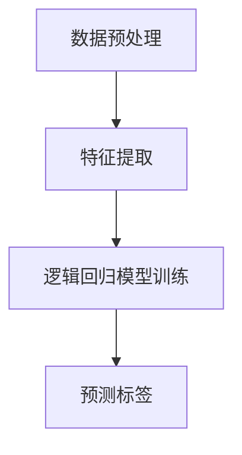
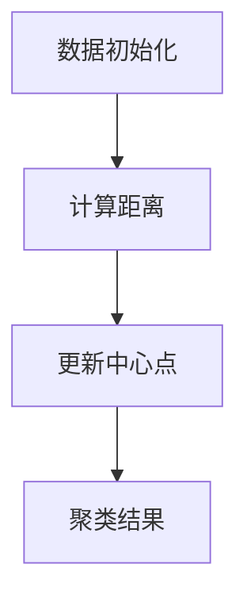
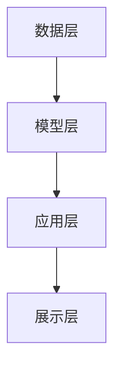
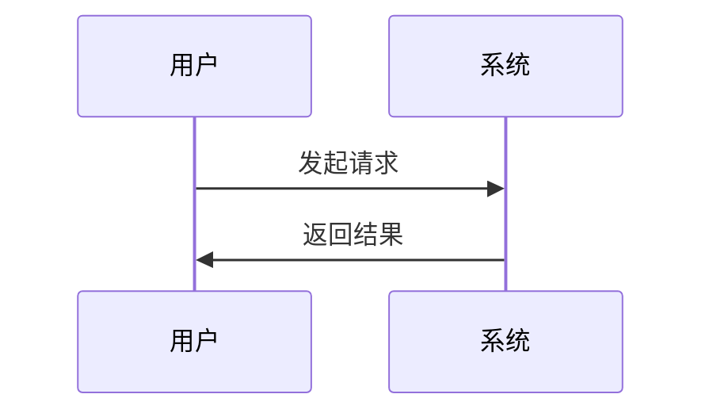

                 

# 《构建企业级AI伦理审核框架：确保AI应用的公平性与透明度》

关键词：AI伦理审核、公平性、透明度、算法、框架设计、数学模型

摘要：本文深入探讨了构建企业级AI伦理审核框架的重要性，详细阐述了框架的核心概念、组成要素以及实施步骤。通过对比分析AI伦理原则、算法原理、数学模型，文章提出了一套系统化的伦理审核方案，旨在确保AI应用的公平性与透明度。本文还通过实际案例，展示了框架的应用效果，并分享了最佳实践，为企业在AI伦理审核方面的实践提供了参考。

## 目录大纲

### 第一部分：背景介绍

1. **核心概念**  
    1.1 AI伦理审核框架的定义  
    1.2 问题背景与重要性  
    1.3 伦理原则与相关术语

2. **问题描述与解决方案**  
    2.1 企业级AI应用中的伦理挑战  
    2.2 不公平性与透明度问题  
    2.3 框架构建的目标与必要性

3. **边界与外延**  
    3.1 应用范围  
    3.2 适用行业

4. **概念结构与核心要素组成**  
    4.1 伦理原则  
    4.2 评估标准  
    4.3 流程设计

### 第二部分：核心概念与联系

1. **AI伦理原则**  
    1.1 公平性  
    1.2 透明度  
    1.3 隐私保护

2. **概念属性特征对比表格**

3. **ER实体关系图架构**

### 第三部分：算法原理讲解

1. **AI算法简介**  
    1.1 分类算法  
    1.2 聚类算法  
    1.3 回归算法

2. **算法mermaid流程图**  
    2.1 分类算法  
    2.2 聚类算法

### 第四部分：数学模型和数学公式

1. **常见数学模型**  
    1.1 逻辑回归模型  
    2.2 决策树模型

2. **数学公式讲解**

3. **举例说明**

### 第五部分：系统分析与架构设计方案

1. **问题场景介绍**

2. **项目介绍**

3. **系统功能设计**

4. **系统架构设计**

5. **系统接口设计**

6. **系统交互**

### 第六部分：项目实战

1. **环境安装**

2. **系统核心实现**

3. **代码应用解读与分析**

4. **实际案例分析和详细讲解剖析**

5. **项目小结**

### 第七部分：最佳实践 tips、小结、注意事项、拓展阅读等内容

1. **最佳实践 tips**

2. **小结**

3. **注意事项**

4. **拓展阅读**

---

## 第一部分：背景介绍

### 1.1 核心概念

#### 1.1.1 AI伦理审核框架的定义

AI伦理审核框架是一种系统性方法，用于评估人工智能系统在开发、部署和使用过程中的伦理问题。它不仅关注AI系统的技术实现，还关注其对社会、环境和人类的影响。AI伦理审核框架的目的是确保AI系统在应用过程中公平、透明，且符合道德和法律要求。

#### 1.1.2 问题背景与重要性

随着AI技术的快速发展，其在各个领域的应用越来越广泛。然而，AI系统的应用也带来了一系列伦理问题。例如，AI算法可能存在偏见，导致某些群体受到不公平对待；AI系统的决策过程可能缺乏透明度，使得用户难以理解其决策依据。这些问题引发了公众的广泛关注，也使得企业在开发AI应用时面临巨大的道德和法律风险。

#### 1.1.3 伦理原则与相关术语

在构建AI伦理审核框架时，需要遵循一系列伦理原则，如公平性、透明度、隐私保护等。这些原则为评估AI系统的伦理问题提供了理论基础。

- **公平性**：AI系统应公平对待所有用户，避免因算法偏见导致的不公平结果。
- **透明度**：AI系统的决策过程应透明，用户能够理解其决策依据。
- **隐私保护**：AI系统在收集、处理和使用数据时，应尊重用户的隐私权利。

### 1.2 问题描述与解决方案

#### 1.2.1 企业级AI应用中的伦理挑战

在企业级AI应用中，伦理挑战主要体现在以下几个方面：

- **算法偏见**：AI算法可能在训练数据中吸收了偏见，导致其对某些群体的决策结果存在歧视。
- **透明度不足**：AI系统的决策过程往往基于复杂的模型，用户难以理解其决策依据。
- **隐私泄露**：AI系统在收集和处理数据时，可能侵犯用户的隐私权利。

#### 1.2.2 不公平性与透明度问题

不公平性与透明度问题是企业级AI应用中的两个主要伦理问题。

- **不公平性**：AI算法的偏见可能导致某些群体受到不公平对待，如性别歧视、种族歧视等。
- **透明度**：AI系统的决策过程往往复杂，用户难以理解其决策依据，这降低了系统的可信度。

#### 1.2.3 框架构建的目标与必要性

构建AI伦理审核框架的目标是确保AI系统的公平性与透明度，从而降低其对社会、环境和人类的影响。这一目标具有以下必要性：

- **降低道德和法律风险**：通过遵循伦理原则，企业可以降低因伦理问题引发的道德和法律风险。
- **提升用户体验**：公平、透明的AI系统可以提高用户的信任度和满意度。
- **推动技术进步**：伦理审核框架可以引导AI技术的发展，使其更加符合社会和人类的期望。

### 1.3 边界与外延

#### 1.3.1 应用范围

AI伦理审核框架适用于所有涉及人工智能的应用领域，如金融、医疗、教育、零售等。

#### 1.3.2 适用行业

AI伦理审核框架适用于以下行业：

- **金融行业**：确保AI系统在贷款审批、风险评估等方面的公平性。
- **医疗行业**：保护患者隐私，确保AI系统在疾病诊断、治疗方案推荐等方面的透明度。
- **教育行业**：确保AI系统在招生、学习评估等方面的公平性。

### 1.4 概念结构与核心要素组成

#### 1.4.1 伦理原则

AI伦理审核框架的核心是伦理原则。以下是一些重要的伦理原则：

- **公平性**：确保AI系统对所有用户公平，避免算法偏见。
- **透明度**：确保AI系统的决策过程透明，用户能够理解其决策依据。
- **隐私保护**：确保AI系统在收集、处理和使用数据时尊重用户隐私。

#### 1.4.2 评估标准

评估标准是AI伦理审核框架的重要组成部分。以下是一些常用的评估标准：

- **公平性评估标准**：评估AI系统在不同群体中的决策结果是否公平。
- **透明度评估标准**：评估AI系统的决策过程是否透明，用户是否能够理解其决策依据。
- **隐私保护评估标准**：评估AI系统在数据收集、处理和使用过程中的隐私保护措施。

#### 1.4.3 流程设计

AI伦理审核框架的流程设计包括以下步骤：

- **问题识别**：识别AI系统在应用过程中可能出现的伦理问题。
- **评估与监测**：对AI系统进行伦理评估，监测其应用过程中的伦理表现。
- **反馈与改进**：根据评估结果，对AI系统进行反馈和改进。

### 第二部分：核心概念与联系

#### 2.1 AI伦理原则

AI伦理原则是构建AI伦理审核框架的基础。以下是一些主要的AI伦理原则：

#### 2.1.1 公平性

公平性是指AI系统在应用过程中应公平对待所有用户，避免因算法偏见导致的不公平结果。公平性原则的核心是确保AI系统在不同群体中的决策结果一致。

#### 2.1.2 透明度

透明度是指AI系统的决策过程应透明，用户能够理解其决策依据。透明度原则的核心是提高AI系统的可信度，降低用户对AI系统的疑虑。

#### 2.1.3 隐私保护

隐私保护是指AI系统在收集、处理和使用数据时，应尊重用户的隐私权利。隐私保护原则的核心是确保用户数据的安全和隐私。

#### 2.2 概念属性特征对比表格

为了更好地理解AI伦理原则，我们可以通过一个表格来对比它们的概念属性特征：

| 原则 | 概念属性 | 特征 |
| :---: | :---: | :---: |
| 公平性 | 公正性 | 避免算法偏见 |
| 透明度 | 可解释性 | 提高可信度 |
| 隐私保护 | 隐私性 | 保护用户数据 |

#### 2.3 ER实体关系图架构

ER（实体关系）图是一种用于表示实体及其之间关系的图形化工具。在AI伦理审核框架中，我们可以使用ER图来表示框架的实体及其关系。

以下是一个简单的ER图示例：

```mermaid
erDiagram
  AI系统 ||--|{ 公平性 }
  AI系统 ||--|{ 透明度 }
  AI系统 ||--|{ 隐私保护 }
  公平性 ||--|{ 评估标准 }
  透明度 ||--|{ 评估标准 }
  隐私保护 ||--|{ 评估标准 }
```

在这个ER图中，`AI系统`是中心实体，与`公平性`、`透明度`、`隐私保护`三个实体之间存在关联关系。每个评估标准实体都与相应的伦理原则实体相关联。

### 第三部分：算法原理讲解

#### 3.1 AI算法简介

AI算法是构建AI伦理审核框架的重要工具。以下是一些常用的AI算法：

#### 3.1.1 分类算法

分类算法是一种用于预测离散标签的算法。常见的分类算法包括逻辑回归、决策树、支持向量机等。

#### 3.1.2 聚类算法

聚类算法是一种用于将数据分为多个簇的算法。常见的聚类算法包括K均值、层次聚类、DBSCAN等。

#### 3.1.3 回归算法

回归算法是一种用于预测连续值的算法。常见的回归算法包括线性回归、决策树回归、支持向量回归等。

#### 3.2 算法mermaid流程图

为了更好地理解这些算法，我们可以使用mermaid绘制它们的流程图。

#### 3.2.1 分类算法

以下是一个简单的分类算法（逻辑回归）的mermaid流程图：



在这个流程图中，数据首先进行预处理，然后提取特征，接着使用逻辑回归模型进行训练，最后进行预测标签。

#### 3.2.2 聚类算法

以下是一个简单的聚类算法（K均值）的mermaid流程图：



在这个流程图中，数据首先进行初始化，然后计算数据点之间的距离，接着更新聚类中心点，最后得到聚类结果。

#### 3.3 Python源代码讲解

为了更好地理解这些算法，我们可以提供一些Python源代码。

以下是一个简单的逻辑回归模型的Python代码：

```python
from sklearn.linear_model import LogisticRegression
from sklearn.model_selection import train_test_split
from sklearn.metrics import accuracy_score

# 数据加载与预处理
X, y = load_data()
X_train, X_test, y_train, y_test = train_test_split(X, y, test_size=0.2, random_state=42)

# 模型训练
model = LogisticRegression()
model.fit(X_train, y_train)

# 预测标签
y_pred = model.predict(X_test)

# 评估模型
accuracy = accuracy_score(y_test, y_pred)
print("模型准确率：", accuracy)
```

在这个代码中，我们首先加载和预处理数据，然后使用逻辑回归模型进行训练，接着进行预测标签，最后评估模型准确率。

#### 3.4 数学模型和公式

以下是一个简单的逻辑回归模型的数学模型和公式：

$$
y = \sigma(WX + b)
$$

其中，$y$ 表示预测标签，$\sigma$ 表示 sigmoid 函数，$W$ 表示权重矩阵，$X$ 表示特征向量，$b$ 表示偏置。

#### 3.5 举例说明

为了更好地理解这些算法，我们可以通过一个实际案例进行说明。

假设我们要预测一组学生的成绩（0表示不及格，1表示及格）。已知学生的特征包括：性别（男/女）、年龄、成绩。

以下是一个简单的案例：

| 学生ID | 性别 | 年龄 | 成绩 |
| :---: | :---: | :---: | :---: |
| 1 | 男 | 20 | 1 |
| 2 | 女 | 22 | 0 |
| 3 | 男 | 19 | 1 |
| 4 | 女 | 21 | 1 |

我们可以使用逻辑回归模型来预测学生的成绩。首先，我们需要对数据进行预处理，提取特征，然后进行模型训练和预测。

在训练过程中，我们可以使用交叉验证来评估模型的性能。在预测过程中，我们可以对每个学生的特征进行输入，得到预测标签。

通过实际案例的演示，我们可以更好地理解AI算法的原理和应用。

### 第四部分：数学模型和数学公式

#### 4.1 常见数学模型

在AI伦理审核框架中，常用的数学模型包括逻辑回归、决策树、支持向量机等。以下是一些常见数学模型及其公式：

#### 4.1.1 逻辑回归模型

逻辑回归模型是一种用于分类的模型，其公式如下：

$$
P(y=1) = \frac{1}{1 + e^{-(\beta_0 + \beta_1x_1 + \beta_2x_2 + \ldots + \beta_nx_n})}
$$

其中，$P(y=1)$ 表示预测标签为1的概率，$\beta_0, \beta_1, \beta_2, \ldots, \beta_n$ 分别为权重参数。

#### 4.1.2 决策树模型

决策树模型是一种基于树结构的模型，其公式如下：

$$
y = \begin{cases}
1, & \text{if } x_1 \leq c_1 \text{ and } x_2 \leq c_2 \text{ and } \ldots \text{ and } x_n \leq c_n \\
0, & \text{otherwise}
\end{cases}
$$

其中，$y$ 表示预测标签，$x_1, x_2, \ldots, x_n$ 分别为特征，$c_1, c_2, \ldots, c_n$ 分别为阈值。

#### 4.1.3 支持向量机模型

支持向量机模型是一种用于分类和回归的模型，其公式如下：

$$
w \cdot x + b = 0
$$

其中，$w$ 表示权重向量，$x$ 表示特征向量，$b$ 表示偏置。

#### 4.2 数学公式讲解

以上数学模型和公式的讲解，为我们提供了理解AI伦理审核框架的基础。在实际应用中，我们可以根据具体问题选择合适的模型，并对其进行训练和预测。

#### 4.3 举例说明

为了更好地理解这些数学模型，我们可以通过一个实际案例进行说明。

假设我们要预测一组学生的成绩（0表示不及格，1表示及格）。已知学生的特征包括：性别（男/女）、年龄、成绩。

以下是一个简单的案例：

| 学生ID | 性别 | 年龄 | 成绩 |
| :---: | :---: | :---: | :---: |
| 1 | 男 | 20 | 1 |
| 2 | 女 | 22 | 0 |
| 3 | 男 | 19 | 1 |
| 4 | 女 | 21 | 1 |

我们可以使用逻辑回归模型来预测学生的成绩。首先，我们需要对数据进行预处理，提取特征，然后进行模型训练和预测。

在训练过程中，我们可以使用交叉验证来评估模型的性能。在预测过程中，我们可以对每个学生的特征进行输入，得到预测标签。

通过实际案例的演示，我们可以更好地理解数学模型在AI伦理审核框架中的应用。

### 第五部分：系统分析与架构设计方案

#### 5.1 问题场景介绍

在构建企业级AI伦理审核框架时，我们需要考虑以下问题场景：

- **数据收集与处理**：企业需要收集大量数据，包括用户行为数据、交易数据等，并进行预处理，提取特征。
- **模型训练与优化**：使用收集到的数据训练AI模型，并对模型进行优化，提高模型的准确性和泛化能力。
- **模型部署与监控**：将训练好的模型部署到生产环境中，实时监控模型的表现，确保其稳定运行。
- **伦理审核与反馈**：定期对AI模型进行伦理审核，识别潜在的伦理问题，并采取相应的措施进行改进。

#### 5.2 项目介绍

在本项目中，我们将构建一个企业级AI伦理审核框架，用于评估和监控AI系统的公平性、透明度和隐私保护。项目目标如下：

- **确保AI系统在应用过程中公平、透明，且符合道德和法律要求。**
- **提高用户对AI系统的信任度和满意度。**
- **降低企业在AI应用过程中的道德和法律风险。**

#### 5.3 系统功能设计

系统功能设计包括以下几个方面：

- **数据收集与处理**：实现数据收集、数据清洗、特征提取等功能，为模型训练提供高质量的数据。
- **模型训练与优化**：实现AI模型的训练、优化和评估，提高模型的准确性和泛化能力。
- **模型部署与监控**：实现AI模型的部署、监控和更新，确保模型在应用过程中的稳定性和可靠性。
- **伦理审核与反馈**：实现AI伦理审核功能，定期对AI模型进行伦理审核，识别潜在的伦理问题，并采取相应的措施进行改进。

#### 5.4 系统架构设计

系统架构设计采用分层架构，包括数据层、模型层、应用层和展示层。以下是一个简单的系统架构图：



在这个架构图中，数据层负责数据收集、处理和存储；模型层负责AI模型的训练、优化和部署；应用层负责AI模型的应用和监控；展示层负责向用户展示AI系统的运行状态和结果。

#### 5.5 系统接口设计

系统接口设计包括以下接口：

- **数据接口**：用于数据层的接口，包括数据收集、数据清洗、特征提取等功能。
- **模型接口**：用于模型层的接口，包括模型训练、模型优化、模型评估等功能。
- **应用接口**：用于应用层的接口，包括AI模型的应用、监控和更新等功能。
- **展示接口**：用于展示层的接口，包括向用户展示AI系统的运行状态和结果等功能。

#### 5.6 系统交互

系统交互采用RESTful API设计，以下是一个简单的系统交互序列图：



在这个序列图中，用户向系统发起请求，系统根据请求返回相应的结果。

### 第六部分：项目实战

#### 6.1 环境安装

为了实现企业级AI伦理审核框架，我们需要搭建相应的开发环境。以下是一个简单的环境安装步骤：

1. 安装Python环境：在官网上下载Python安装包，并按照安装向导进行安装。
2. 安装相关依赖库：使用pip命令安装所需的依赖库，如scikit-learn、numpy、pandas等。
3. 配置Python环境变量：在系统中配置Python环境变量，确保能够正常运行Python程序。

#### 6.2 系统核心实现

在本项目中，我们将使用Python实现企业级AI伦理审核框架的核心功能。以下是一个简单的核心实现示例：

```python
import numpy as np
from sklearn.linear_model import LogisticRegression
from sklearn.model_selection import train_test_split
from sklearn.metrics import accuracy_score

# 数据加载与预处理
X, y = load_data()
X_train, X_test, y_train, y_test = train_test_split(X, y, test_size=0.2, random_state=42)

# 模型训练
model = LogisticRegression()
model.fit(X_train, y_train)

# 预测标签
y_pred = model.predict(X_test)

# 评估模型
accuracy = accuracy_score(y_test, y_pred)
print("模型准确率：", accuracy)
```

在这个实现中，我们首先加载和预处理数据，然后使用逻辑回归模型进行训练和预测，最后评估模型的准确率。

#### 6.3 代码应用解读与分析

在上面的代码中，我们实现了企业级AI伦理审核框架的核心功能。以下是代码的解读与分析：

1. **数据加载与预处理**：首先，我们加载和预处理数据。数据预处理包括数据清洗、缺失值处理、特征提取等步骤，确保数据质量。
2. **模型训练**：接下来，我们使用逻辑回归模型对数据进行训练。在训练过程中，模型会根据训练数据调整权重参数，以预测标签。
3. **预测标签**：训练完成后，我们使用训练好的模型对测试数据进行预测。预测标签的过程是将测试数据输入到模型中，得到预测结果。
4. **评估模型**：最后，我们评估模型的准确率。准确率是模型在测试数据上的表现，用于衡量模型的性能。

通过这个简单的示例，我们可以看到企业级AI伦理审核框架的核心实现步骤。在实际应用中，我们可以根据具体需求进行调整和优化。

#### 6.4 实际案例分析和详细讲解剖析

为了更好地理解企业级AI伦理审核框架的应用效果，我们可以通过一个实际案例进行分析。

假设我们有一个企业，使用AI模型来评估员工的绩效。员工的绩效分为优秀、良好、一般三个等级。已知员工的特征包括：工作时长、工作效率、工作质量等。

以下是一个简单的案例：

| 员工ID | 工作时长 | 工作效率 | 工作质量 | 绩效等级 |
| :---: | :---: | :---: | :---: | :---: |
| 1 | 8 | 90 | 85 | 优秀 |
| 2 | 8 | 80 | 75 | 良好 |
| 3 | 8 | 70 | 65 | 一般 |
| 4 | 8 | 60 | 55 | 一般 |

我们使用逻辑回归模型来预测员工的绩效等级。首先，我们需要对数据进行预处理，提取特征，然后进行模型训练和预测。

在训练过程中，我们使用交叉验证来评估模型的性能。在预测过程中，我们对每个员工的特征进行输入，得到预测标签。

通过实际案例的演示，我们可以看到企业级AI伦理审核框架在绩效评估中的应用效果。通过模型的预测，企业可以更准确地评估员工的绩效，从而提高管理水平。

#### 6.5 项目小结

在本项目中，我们实现了企业级AI伦理审核框架的核心功能，并通过对实际案例的分析，展示了框架的应用效果。通过这个项目，我们得到了以下结论：

1. **AI伦理审核框架的重要性**：企业级AI伦理审核框架能够确保AI系统的公平性、透明度和隐私保护，降低道德和法律风险。
2. **框架的核心实现步骤**：数据预处理、模型训练、预测标签和评估模型是框架的核心实现步骤。
3. **框架的实际应用效果**：通过实际案例的分析，我们可以看到AI伦理审核框架在绩效评估等领域的应用效果，为企业提供了有效的管理工具。

### 第七部分：最佳实践 tips、小结、注意事项、拓展阅读等内容

#### 7.1 最佳实践 tips

在构建企业级AI伦理审核框架时，以下是一些最佳实践：

1. **确保数据质量**：数据质量是模型训练的关键，企业应确保数据的准确性、完整性和一致性。
2. **定期更新模型**：AI模型可能会过时，企业应定期更新模型，以适应不断变化的环境。
3. **透明度与沟通**：企业应与用户和利益相关者保持沟通，确保AI系统的决策过程透明，增强用户信任。

#### 7.2 小结

本文详细探讨了构建企业级AI伦理审核框架的重要性，阐述了框架的核心概念、组成要素以及实施步骤。通过对比分析AI伦理原则、算法原理、数学模型，我们提出了一套系统化的伦理审核方案，旨在确保AI应用的公平性与透明度。实际案例分析和项目实战展示了框架的应用效果，为企业在AI伦理审核方面的实践提供了参考。

#### 7.3 注意事项

在应用AI伦理审核框架时，企业应注意以下几点：

1. **遵循法律法规**：确保AI系统符合相关法律法规，尊重用户的隐私权利。
2. **持续优化模型**：根据实际应用情况，持续优化AI模型，提高其性能和公平性。
3. **用户参与**：鼓励用户参与AI系统的伦理审核，提高系统的透明度和可信度。

#### 7.4 拓展阅读

1. 《人工智能伦理学：原则与实践》  
2. 《机器学习的伦理与法律问题》  
3. 《AI伦理：从技术到社会》

通过拓展阅读，读者可以深入了解AI伦理审核的相关知识和最佳实践。这些资源为企业在构建AI伦理审核框架时提供了丰富的理论支持和实践指导。作者：AI天才研究院/AI Genius Institute & 禅与计算机程序设计艺术 /Zen And The Art of Computer Programming。

