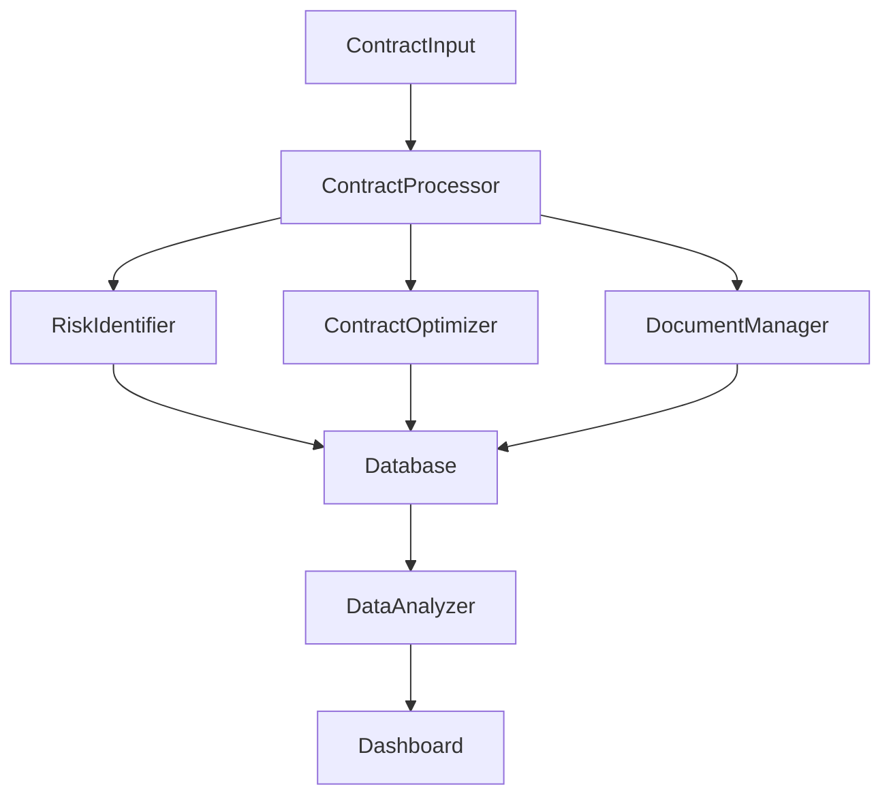
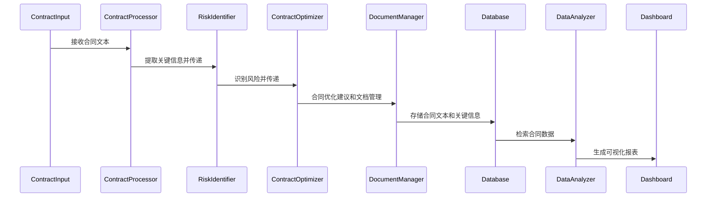

                 

## 引言与背景

在现代商业环境中，合同管理是企业运营的核心组成部分，它涉及合同起草、审批、执行、跟踪和存档等环节。然而，随着企业规模的扩大和业务复杂性的增加，传统的合同管理方式面临着诸多挑战。首先，合同数量和复杂度日益增加，使得手动管理变得愈发困难。其次，合同管理过程中可能出现的疏漏或错误，如条款理解不准确、合同履行不及时等，都可能导致法律和财务风险。此外，合同内容涉及大量的自然语言文本，这使得传统的文本处理方式在效率和准确性上存在局限性。

为了应对这些挑战，人工智能（AI）技术为企业合同管理带来了新的机遇。AI合同管理系统利用机器学习和自然语言处理（NLP）技术，能够自动化和智能化地处理合同相关任务，从而提高管理效率、降低风险、优化决策。例如，AI可以自动识别合同中的关键条款，预测合同履行过程中可能出现的风险，并提供建议以优化合同条款和期限。

本节将介绍AI合同管理系统在企业级合同管理中的应用背景和挑战，并概述本书的目标与结构，同时明确文章的边界和核心概念。

### 1.1 问题背景

在现代企业运营中，合同管理涉及大量的文本处理和数据分析工作。传统的合同管理主要依赖人工审核和纸质文档，存在以下问题：

1. **人工成本高**：合同数量庞大时，人工审核和录入合同内容需要大量的人力资源，导致管理成本上升。
2. **错误率高**：人工处理合同内容容易产生误解和错误，特别是在复杂的合同条款中，错误可能带来严重的法律和财务风险。
3. **效率低下**：手动管理合同过程繁琐，难以实现高效的数据分析和决策支持。
4. **文档管理困难**：纸质文档容易丢失、损坏或无法快速检索，影响合同管理的连贯性和一致性。

随着企业信息化和数字化的推进，传统合同管理方式已无法满足现代企业的需求。企业需要一种智能化、自动化的合同管理解决方案，以提升管理效率、降低风险、优化业务流程。

### 1.1.2 AI技术对企业合同管理的变革

人工智能（AI）技术的引入为解决企业合同管理中的问题提供了新的思路。AI合同管理系统利用机器学习和自然语言处理（NLP）技术，可以实现以下功能：

1. **自动化文本处理**：AI系统可以自动提取合同中的关键信息，如条款、金额、期限等，实现文本的自动化处理和分类，大大减轻了人工的工作负担。
2. **智能风险识别**：通过NLP技术，AI系统可以深度分析合同文本，识别潜在的违约风险、法律风险等，并提供相应的预警和解决方案。
3. **优化决策支持**：AI系统可以基于数据分析，为企业提供合同优化的建议，如调整条款、延长或缩短合同期限等，帮助企业做出更明智的决策。
4. **高效文档管理**：AI系统能够实现合同文档的电子化和数字化管理，提高文档的检索和共享效率，确保合同的完整性和安全性。

### 1.2 本书目标与结构

本书旨在系统地介绍AI合同管理系统的设计、实现和应用，帮助读者理解如何利用AI技术优化企业合同管理。具体目标包括：

1. **理解AI合同管理的基本概念**：介绍合同管理的基本概念，以及AI技术在合同管理中的应用。
2. **掌握系统架构设计**：详细阐述AI合同管理系统的架构设计，包括系统功能、核心算法和关键技术。
3. **实现系统开发与部署**：提供系统开发和部署的实战指南，包括环境配置、核心代码实现和实际案例分析。
4. **优化合同管理实践**：通过最佳实践和案例分析，分享如何在实际业务场景中应用AI合同管理系统，优化合同管理流程。

本书结构如下：

- **第一部分：引言与背景**：介绍AI合同管理的背景、挑战和基本概念。
- **第二部分：系统架构设计**：详细阐述AI合同管理系统的架构设计和核心算法。
- **第三部分：系统实现与实战**：介绍系统开发与部署的具体流程，并通过实际案例分析提供实战经验。
- **第四部分：拓展应用与未来展望**：探讨AI合同管理系统的拓展应用和未来发展趋势。

### 1.3 定义与边界

为了确保读者对AI合同管理系统有一个清晰的认识，本节将定义相关的基本概念，并明确本书的研究边界。

#### 1.3.1 合同管理的基本概念

合同管理是指企业在日常经营活动中，通过一系列管理措施和流程，对合同进行起草、审批、执行、监督和存档的过程。它包括以下几个方面：

- **合同起草**：根据企业需求制定合同文本，明确双方权利和义务。
- **合同审批**：对合同文本进行审查和批准，确保合同内容合法、合规。
- **合同执行**：监督合同条款的履行，确保双方按约定执行合同义务。
- **合同跟踪**：记录合同执行过程中的关键信息，如履行进度、变更情况等。
- **合同存档**：将合同文本和相关文档进行电子化存档，便于日后查询和审计。

#### 1.3.2 企业级AI合同管理的定义

企业级AI合同管理是指利用人工智能技术，对合同管理过程进行自动化和智能化处理，从而提高管理效率、降低风险、优化决策的系统。具体包括以下方面：

1. **自动化文本处理**：通过自然语言处理技术，自动提取和分类合同文本中的关键信息。
2. **智能风险识别**：利用机器学习算法，分析合同文本，识别潜在的法律、财务风险，并提供建议。
3. **优化决策支持**：基于数据分析，为企业提供合同优化的建议，如调整合同条款、期限等。
4. **高效文档管理**：通过电子化和数字化手段，实现合同文档的自动化管理和高效检索。

#### 1.3.3 边界与外延

本书的研究边界主要集中在以下两个方面：

1. **技术范畴**：本书主要关注AI合同管理系统的技术实现，包括机器学习、自然语言处理、数据库管理等关键技术。
2. **应用场景**：本书主要探讨企业级AI合同管理系统的设计、实现和应用，适用于大型企业、金融机构等需要高效合同管理的场景。

同时，本书也在以下方面进行了拓展：

1. **最佳实践**：通过实际案例分析和最佳实践分享，为企业在AI合同管理中的应用提供参考。
2. **未来展望**：探讨AI合同管理技术的发展趋势和潜在应用场景，为读者提供前瞻性视角。

通过以上定义和边界阐述，读者可以更好地理解本书的内容和目标，为后续章节的学习打下基础。

### 1.4 核心概念与联系

在本章节中，我们将深入探讨AI合同管理系统的核心概念，包括机器学习算法、自然语言处理（NLP）和数据库管理，并展示它们之间的联系。这些核心概念是构建高效AI合同管理系统的基础，对于理解系统的工作原理和实现过程至关重要。

#### 1.4.1 AI合同管理核心概念

**机器学习算法**：机器学习是AI的一个重要分支，通过从数据中学习规律和模式，实现自动预测和决策。在AI合同管理系统中，机器学习算法用于自动化合同文本分析、风险识别和优化策略制定。常见的机器学习算法包括决策树、支持向量机（SVM）、神经网络和聚类算法等。

**自然语言处理（NLP）**：NLP是AI的另一个重要分支，专注于使计算机能够理解和生成人类语言。在AI合同管理系统中，NLP技术用于解析和提取合同文本中的关键信息，如条款、金额、期限等，从而实现合同内容的结构化处理。NLP的关键技术包括分词、词性标注、句法分析和语义分析等。

**数据库管理**：数据库是存储和管理数据的系统，用于存储合同文本、关键信息和相关文档。在AI合同管理系统中，数据库管理不仅提供数据的存储和检索功能，还通过索引和数据关系管理，实现数据的快速访问和高效查询。常见的数据库管理系统包括关系型数据库（如MySQL、PostgreSQL）和NoSQL数据库（如MongoDB、Cassandra）。

#### 1.4.1.1 机器学习算法

机器学习算法在AI合同管理系统中的应用主要体现在以下几个方面：

1. **合同文本分类**：利用分类算法，如决策树和SVM，将合同文本分类为不同类型，如采购合同、租赁合同、服务合同等，便于管理和分析。
2. **风险识别**：通过聚类算法和神经网络，分析合同文本中的风险指标，识别潜在的法律和财务风险。
3. **合同优化**：利用优化算法，如线性规划和遗传算法，根据企业需求和市场情况，调整合同条款和期限，实现合同优化。

#### 1.4.1.2 自然语言处理

自然语言处理在AI合同管理系统中的应用体现在以下几个方面：

1. **文本解析**：通过分词和词性标注，将合同文本拆分为词和词性，为后续处理提供基础。
2. **条款提取**：利用句法分析和语义分析，从合同文本中提取关键条款和关键信息，如金额、期限、违约责任等。
3. **语义理解**：通过语义分析，理解合同文本中的含义和逻辑关系，为风险识别和合同优化提供支持。

#### 1.4.1.3 数据库管理

数据库管理在AI合同管理系统中起到关键作用，主要体现在以下几个方面：

1. **数据存储**：将合同文本、关键信息和相关文档存储在数据库中，确保数据的长期保存和可靠性。
2. **数据检索**：通过索引和数据关系管理，实现快速检索和查询，提高系统的响应速度和效率。
3. **数据分析和可视化**：利用数据库分析工具，对合同数据进行分析和可视化，为企业提供决策支持。

#### 1.4.2 概念属性特征对比表格

为了更好地理解这些核心概念，我们提供了以下表格，对机器学习算法、自然语言处理和数据库管理的属性特征进行对比：

| 特征类别       | 机器学习算法                     | 自然语言处理                     | 数据库管理                   |
| -------------- | -------------------------------- | -------------------------------- | ---------------------------- |
| 目标           | 自动化合同文本分析、风险识别、合同优化 | 解析和提取合同文本中的关键信息   | 数据存储、检索和分析          |
| 技术基础       | 机器学习理论、算法实现           | 语言学、计算机科学、人工智能     | 数据库管理系统、数据库理论   |
| 主要功能       | 文本分类、风险识别、优化策略     | 分词、句法分析、语义理解         | 数据存储、索引、查询          |
| 算法选择       | 决策树、SVM、神经网络等          | 词性标注、句法分析、语义分析     | 关系型数据库、NoSQL数据库     |
| 难点与挑战     | 数据标注、算法选择和优化         | 语义歧义、跨语言处理             | 数据一致性和安全性            |
| 与其他技术的结合 | 与NLP和数据库管理的结合          | 与机器学习算法和数据库管理的结合 | 与NLP和机器学习算法的结合     |

通过以上表格，我们可以清晰地看到各个核心概念的特点和优势，以及它们在AI合同管理系统中的具体应用。

#### 1.4.3 ER实体关系图架构

为了进一步展示这些核心概念之间的关系，我们使用Mermaid绘制了一个ER（实体关系）图，如下所示：

```mermaid
erDiagram
  Contract --> MachineLearningAlgorithm : 执行文本分析
  Contract --> NaturalLanguageProcessing : 提取条款
  Contract --> DatabaseManagement : 存储和管理数据
  MachineLearningAlgorithm --> RiskIdentification : 识别风险
  MachineLearningAlgorithm --> ContractOptimization : 优化合同
  NaturalLanguageProcessing --> ContractUnderstanding : 理解合同内容
  DatabaseManagement --> DataRetrieval : 数据检索
  DatabaseManagement --> DataVisualization : 数据可视化
```

在ER图中，每个实体（如合同、机器学习算法、自然语言处理、数据库管理）都表示一个核心概念，它们之间的连线表示这些概念在AI合同管理系统中的交互和依赖关系。例如，合同实体与机器学习算法实体之间存在“执行文本分析”的关系，表示机器学习算法用于分析合同文本。

通过以上对核心概念的介绍和ER图展示，我们可以更深入地理解AI合同管理系统的架构和实现原理，为后续章节的详细讨论打下基础。

### 1.5 系统架构设计概述

在构建AI合同管理系统时，系统架构设计是关键的一步。一个合理和高效的系统架构能够确保系统稳定、可靠，并且能够灵活应对未来的扩展和变化。本节将介绍AI合同管理系统的整体架构设计，包括问题场景介绍、系统功能设计、系统架构设计、系统接口设计和系统交互。

#### 2.1 问题场景介绍

在现代企业运营中，合同管理是一个复杂且关键的过程。随着业务规模的扩大和合同数量的增加，企业面临以下挑战：

1. **合同管理效率低**：大量合同需要手动处理，从起草、审批到执行和存档，整个过程耗时且容易出错。
2. **风险识别困难**：合同条款繁多，容易遗漏关键条款，导致合同履行过程中出现法律或财务风险。
3. **合同数据分析不足**：缺乏对合同数据的深入分析，难以发现潜在的业务优化机会。
4. **文档管理复杂**：合同文档需要纸质存档，难以快速检索和共享，影响合同管理的效率。

为了应对这些挑战，企业需要构建一个智能化、自动化的AI合同管理系统，以提高管理效率、降低风险、优化决策。

#### 2.2 系统功能设计

AI合同管理系统应具备以下功能：

1. **合同文本处理**：自动化提取和分类合同文本中的关键信息，如条款、金额、期限等。
2. **风险识别**：利用自然语言处理和机器学习技术，识别合同文本中的潜在风险，如法律风险、财务风险等。
3. **合同优化**：基于数据分析，为企业提供合同优化的建议，如调整条款、期限、金额等。
4. **文档管理**：实现合同文档的电子化管理和安全存储，提供快速检索和共享功能。
5. **数据分析**：对合同数据进行分析和可视化，为企业提供决策支持。

#### 2.3 系统架构设计

AI合同管理系统的整体架构设计如图所示：



- **ContractInput**：负责接收和解析合同输入，包括合同文本和关键信息。
- **ContractProcessor**：处理合同文本，提取关键信息并进行初步分析。
- **RiskIdentifier**：利用自然语言处理和机器学习技术，识别合同中的风险。
- **ContractOptimizer**：基于数据分析，提供合同优化的建议。
- **DocumentManager**：管理合同文档，实现电子化存档和共享。
- **Database**：存储合同文本、关键信息和相关数据，支持快速检索和分析。
- **DataAnalyzer**：对合同数据进行分析，生成可视化报表。
- **Dashboard**：展示分析结果和决策支持信息。

#### 2.4 系统接口设计

系统接口设计包括外部接口和内部接口：

- **外部接口**：与外部系统集成，如ERP系统、邮件系统、电子签章系统等，实现数据的无缝对接和交互。
- **内部接口**：系统内部模块之间的接口，如ContractProcessor与RiskIdentifier之间的数据传递接口，确保各模块之间的高效协同。

#### 2.5 系统交互

系统交互设计如图所示：



在系统交互过程中，各模块通过接口传递数据，确保整个系统的协调运作。例如，ContractProcessor将提取的关键信息传递给RiskIdentifier进行风险识别，并将结果传递给ContractOptimizer进行优化建议生成，最终由DocumentManager存储合同文本和相关数据。

通过以上系统架构设计概述，我们可以清晰地看到AI合同管理系统各组件的功能和交互关系，为后续的详细设计和实现提供了基础。

### 3.1 风险识别原理

AI合同管理系统中的风险识别模块是确保合同管理过程中潜在风险得到及时发现和预警的关键环节。本节将详细阐述风险识别的核心算法、自然语言处理（NLP）在风险识别中的应用，以及机器学习算法在合同风险识别中的具体实现。

#### 3.1.1 风险识别的核心算法

风险识别的核心算法通常基于机器学习和自然语言处理技术。其中，常用的算法包括分类算法、聚类算法和关联规则挖掘算法。

1. **分类算法**：分类算法用于将合同文本分类为不同的风险类型。例如，可以使用决策树（Decision Tree）或支持向量机（SVM）等算法，通过训练模型来识别合同文本中的风险。分类算法的核心在于特征提取和模型训练：

    - **特征提取**：通过NLP技术提取合同文本中的关键特征，如关键词、短语、句法结构等，为分类算法提供输入。
    - **模型训练**：使用已有风险案例数据集，训练分类模型，使其能够根据合同文本特征判断文本类型和潜在风险。

2. **聚类算法**：聚类算法用于发现合同文本中的相似风险。例如，使用K-means算法，根据合同文本特征将文本聚类，从而识别出相似的风险模式。聚类算法的核心在于相似度计算和聚类中心选择：

    - **相似度计算**：通过计算合同文本特征向量之间的相似度，确定合同文本的聚类关系。
    - **聚类中心选择**：选择聚类中心来代表不同风险类别的特征，用于后续风险识别。

3. **关联规则挖掘算法**：关联规则挖掘算法用于发现合同文本中不同风险因素之间的关联关系。例如，使用Apriori算法，挖掘合同条款之间的关联规则，从而识别潜在的风险组合。关联规则挖掘算法的核心在于支持度和置信度计算：

    - **支持度计算**：计算特定关联规则在合同文本中的出现频率，用于评估规则的重要程度。
    - **置信度计算**：计算特定关联规则的前件和后件之间的可信度，用于确定规则的可靠性和实用性。

#### 3.1.2 自然语言处理在风险识别中的应用

自然语言处理技术在合同风险识别中发挥着关键作用，其主要应用包括文本解析、条款提取、语义分析和情感分析：

1. **文本解析**：通过分词、词性标注等技术，将合同文本分解为单词、短语和句法结构，为后续特征提取和风险识别提供基础。

2. **条款提取**：利用句法分析和语义分析技术，从合同文本中提取关键条款和条款内容，为风险识别提供具体信息。

3. **语义分析**：通过语义分析技术，理解合同文本中的语言含义和逻辑关系，识别合同条款中的潜在风险点。

4. **情感分析**：利用情感分析技术，识别合同文本中的语气和情感倾向，如条款中的潜在争议点或高风险条款。

#### 3.1.3 机器学习算法在合同风险识别中的具体实现

机器学习算法在合同风险识别中的具体实现通常包括以下步骤：

1. **数据预处理**：收集和整理合同文本数据，进行文本清洗和预处理，如去除停用词、词干提取等。

2. **特征工程**：通过NLP技术提取合同文本中的关键特征，如关键词、短语、句法结构等，构建特征向量。

3. **模型选择**：选择合适的机器学习算法，如决策树、SVM、神经网络等，根据风险识别任务的特点进行模型选择。

4. **模型训练**：使用已标注的风险案例数据集，训练机器学习模型，使其能够根据合同文本特征进行风险识别。

5. **模型评估**：通过交叉验证和测试集评估模型性能，调整模型参数和特征工程策略，优化模型效果。

6. **风险识别**：将训练好的模型应用于新合同文本，进行风险识别，并生成风险报告和预警。

以下是一个简单的Python代码示例，展示了如何使用机器学习算法和自然语言处理技术进行合同风险识别：

```python
import nltk
from sklearn.feature_extraction.text import TfidfVectorizer
from sklearn.model_selection import train_test_split
from sklearn.ensemble import RandomForestClassifier

# 数据预处理
def preprocess_text(text):
    # 去除停用词、标点符号
    stop_words = nltk.corpus.stopwords.words('english')
    tokens = nltk.word_tokenize(text.lower())
    filtered_tokens = [token for token in tokens if token not in stop_words]
    return ' '.join(filtered_tokens)

# 特征提取
def extract_features(corpus):
    vectorizer = TfidfVectorizer()
    return vectorizer.fit_transform(corpus)

# 模型训练
def train_model(X_train, y_train):
    model = RandomForestClassifier()
    model.fit(X_train, y_train)
    return model

# 风险识别
def identify_risk(model, text):
    processed_text = preprocess_text(text)
    features = extract_features([processed_text])
    return model.predict(features)[0]

# 示例数据
contracts = [
    "This contract shall be binding upon both parties.",
    "The payment terms are subject to change without prior notice.",
    "The warranty period shall expire on the date specified."
]

risks = ["No Risk", "Financial Risk", "Legal Risk"]

# 数据预处理
processed_contracts = [preprocess_text(contract) for contract in contracts]

# 特征提取
X = extract_features(processed_contracts)

# 标签
y = [risks.index(contract) for contract in processed_contracts]

# 模型训练
X_train, X_test, y_train, y_test = train_test_split(X, y, test_size=0.2)
model = train_model(X_train, y_train)

# 模型评估
print("Model accuracy:", model.score(X_test, y_test))

# 风险识别
new_contract = "The payment terms have been modified to 30 days."
print("Risk Identified:", identify_risk(model, new_contract))
```

通过上述示例，我们可以看到如何利用自然语言处理技术和机器学习算法进行合同风险识别。在实际应用中，可以根据具体需求调整特征提取方法和模型选择，以提高风险识别的准确性和可靠性。

通过本节对风险识别原理的详细讲解，读者可以更好地理解AI合同管理系统中风险识别模块的实现过程和技术要点，为后续的风险识别机制设计和实现提供基础。

### 3.2 数学模型与公式

在AI合同管理系统的风险识别模块中，数学模型和公式是核心组成部分，用于描述和实现风险识别过程。以下将详细解释风险识别的数学模型和公式，并展示算法流程与Python代码示例。

#### 3.2.1 风险识别的数学模型

风险识别过程可以通过以下数学模型表示：

$$
R_i = f(NLP\_features, ML\_algorithm)
$$

其中，\( R_i \) 表示第 \( i \) 个合同的风险评分，\( NLP\_features \) 表示通过自然语言处理技术提取的合同文本特征，\( ML\_algorithm \) 表示用于风险识别的机器学习算法。

1. **NLP特征提取**：

   自然语言处理特征提取通常包括词汇频率（TF）、逆文档频率（IDF）和词嵌入（Word Embedding）等技术。一个简化的特征提取公式为：

   $$
   TF\_IDF\_vector = \{tf_idf(value) | value \in NLP\_features\}
   $$

   其中，\( tf_idf \) 函数计算词汇在合同文本中的权重，用于表示特征向量。

2. **机器学习算法**：

   常用的机器学习算法包括决策树（Decision Tree）、支持向量机（SVM）和神经网络（Neural Network）等。以决策树为例，其风险评分计算公式为：

   $$
   R_i = \sum_{j=1}^{n} w_j \cdot T_j
   $$

   其中，\( w_j \) 为决策树中每个节点的权重，\( T_j \) 为通过节点 \( j \) 的合同文本特征。

#### 3.2.2 算法流程与Python代码示例

以下是一个简化的风险识别算法流程和Python代码示例，用于演示上述数学模型的应用。

1. **数据预处理**：

   首先进行数据预处理，包括文本清洗和分词：

   ```python
   import nltk
   from sklearn.model_selection import train_test_split
   from sklearn.ensemble import RandomForestClassifier

   nltk.download('punkt')

   def preprocess_text(text):
       tokens = nltk.word_tokenize(text.lower())
       return ' '.join(tokens)

   contracts = ["This contract shall be binding upon both parties.", "The payment terms are subject to change without prior notice.", "The warranty period shall expire on the date specified."]
   processed_contracts = [preprocess_text(contract) for contract in contracts]
   ```

2. **特征提取**：

   使用TF-IDF向量进行特征提取：

   ```python
   from sklearn.feature_extraction.text import TfidfVectorizer

   vectorizer = TfidfVectorizer()
   X = vectorizer.fit_transform(processed_contracts)
   ```

3. **模型训练**：

   使用随机森林（Random Forest）进行模型训练：

   ```python
   y = [0, 1, 2]  # 示例标签
   X_train, X_test, y_train, y_test = train_test_split(X, y, test_size=0.2)

   model = RandomForestClassifier()
   model.fit(X_train, y_train)
   ```

4. **风险识别**：

   使用训练好的模型进行风险识别：

   ```python
   def identify_risk(model, text):
       processed_text = preprocess_text(text)
       features = vectorizer.transform([processed_text])
       return model.predict(features)[0]

   new_contract = "The payment terms have been modified to 30 days."
   print("Risk Identified:", identify_risk(model, new_contract))
   ```

通过以上步骤，我们展示了如何利用数学模型和Python代码进行合同文本的风险识别。在实际应用中，可以根据具体需求和数据集进行调整和优化，以提高风险识别的准确性和可靠性。

### 4.1 合同优化的意义

在现代商业环境中，合同优化是企业实现可持续发展、降低运营风险和提高竞争力的重要手段。合同优化不仅关乎企业经济利益，还涉及到法律合规性和市场策略。以下是合同优化在多个方面的具体意义：

#### 4.1.1 提高经济效益

合同优化有助于企业实现经济效益的最大化。通过调整合同条款，如价格、数量、支付方式等，企业可以在不损害对方利益的前提下降低成本、增加收益。例如，优化采购合同中的价格条款，可以显著降低采购成本；调整租赁合同中的租金条款，可以在不影响使用的前提下降低费用支出。

#### 4.1.2 降低运营风险

合同条款的不完善或不合理可能导致企业在合同履行过程中面临法律和财务风险。通过合同优化，企业可以识别和规避这些风险。例如，优化合同中的违约责任条款，可以明确违约行为的定义和相应的违约赔偿金额，减少因合同纠纷而带来的损失。

#### 4.1.3 提高合同执行力

优化的合同条款有助于提高合同的执行力。明确的条款和合理的约定可以减少合同执行中的争议和纠纷，确保合同各方按照约定履行义务。例如，优化合同中的履行期限和交付条款，可以确保供应商按时交货，提高项目的进展效率。

#### 4.1.4 增强谈判能力

合同优化还可以增强企业在谈判中的地位。通过对市场情况和行业标准的深入分析，企业可以提出更为合理的合同条款，提高谈判的主动性和成功率。例如，在合同条款中引入市场竞争机制，可以促使供应商降低价格或提高服务质量。

#### 4.1.5 支持战略决策

合同优化为企业提供了重要的数据支持和决策依据。通过对合同数据的分析和挖掘，企业可以识别出合同中的优化机会，为制定战略决策提供科学依据。例如，分析合同履行情况，企业可以优化供应链管理，提高整体运营效率。

综上所述，合同优化在提高经济效益、降低运营风险、提高合同执行力、增强谈判能力和支持战略决策等方面具有重要意义。因此，企业需要重视合同优化工作，通过系统化和专业化的方式实现合同管理的持续改进。

### 4.2 优化策略设计

合同优化策略是企业通过调整合同条款、期限和金额等关键要素，以实现经济效益最大化、风险最小化和合同执行力提升的重要手段。以下将详细讨论合同优化的策略设计，包括合同条款优化、合同期限优化和合同金额优化。

#### 4.2.1 合同条款优化

合同条款是合同的核心内容，直接影响合同执行的效果和风险。合同条款优化的策略主要包括以下几个方面：

1. **明确条款内容**：确保合同条款的表述清晰、具体，避免模糊或歧义性的描述。例如，明确交付时间、质量标准、付款条件等关键信息。

2. **公平合理**：确保合同条款在双方之间公平合理，避免一方过度利益受损。例如，在采购合同中，可以设定合理的价格调整机制，以应对市场变化。

3. **违约责任**：设定明确的违约责任条款，包括违约行为的定义、违约责任和违约赔偿金额等。这有助于降低合同履行过程中的法律风险。

4. **争议解决**：设定合理的争议解决条款，如仲裁、诉讼等，以避免合同执行过程中产生不必要的纠纷。

5. **附加条款**：根据具体情况，可以增加一些附加条款，如保密条款、不可抗力条款等，以补充合同的主要条款。

#### 4.2.2 合同期限优化

合同期限是合同执行的时间框架，直接影响到合同的稳定性和可持续性。合同期限优化的策略主要包括以下几个方面：

1. **短期与长期结合**：根据业务需求和风险承受能力，合理配置短期和长期合同。短期合同可以灵活应对市场变化，而长期合同则有助于建立稳定的合作关系。

2. **动态调整**：根据合同执行情况和市场环境，动态调整合同期限。例如，在项目进展顺利时，可以适当延长合同期限，以维持合作关系。

3. **分阶段执行**：将合同分为不同的阶段，每个阶段设定不同的期限和目标。这样可以更好地控制合同执行进度，提高项目成功率。

4. **预警机制**：在合同期限到期前，建立预警机制，提前通知合同各方进行续约或调整，避免合同失效带来的风险。

#### 4.2.3 合同金额优化

合同金额是合同的经济核心，直接影响企业的成本控制和利润实现。合同金额优化的策略主要包括以下几个方面：

1. **市场调研**：进行充分的市场调研，了解同行业合同金额的普遍水平和波动情况，为合同金额的设定提供参考。

2. **谈判技巧**：在合同谈判过程中，运用谈判技巧，争取更优惠的价格和服务条款。例如，可以提出捆绑销售、长期合作等优惠条件。

3. **成本控制**：通过优化内部管理流程，降低合同执行成本，提高合同的经济效益。例如，优化供应链管理，降低采购成本。

4. **风险管理**：合理分配风险，通过设定赔偿条款、保险等机制，降低合同执行过程中的潜在风险。

5. **动态调整**：根据市场环境和项目进展情况，动态调整合同金额。例如，在项目进展不顺时，可以适当调整价格以保持合同稳定性。

通过以上合同条款优化、合同期限优化和合同金额优化的策略设计，企业可以更好地实现合同管理的目标，提高合同管理的效率和效果，从而在激烈的市场竞争中取得优势。

### 4.3 优化算法实现

合同优化算法是实现合同优化策略的关键工具，通过数学模型和算法，可以自动调整合同条款、期限和金额，以实现经济效益最大化。本节将详细讨论合同优化算法的数学模型、具体实现和Python代码示例。

#### 4.3.1 优化算法的数学模型

合同优化的核心目标是最大化合同收益或最小化合同风险。以下是一个简化的优化算法数学模型：

$$
Optimize(P, C) = \max_{P, C} (收益 - 风险)
$$

其中，\( P \) 表示合同条款、期限和金额等参数，\( C \) 表示合同风险，收益和风险分别表示合同的经济利益和安全风险。

1. **收益函数**：

   收益函数可以表示为合同金额减去执行成本和潜在损失。一个简化的收益函数为：

   $$
   收益 = 合同金额 - 执行成本 - 潜在损失
   $$

   其中，合同金额是合同的核心指标，执行成本包括人力、物资等投入，潜在损失包括违约赔偿、法律费用等。

2. **风险函数**：

   风险函数可以表示为合同条款、期限和金额等参数的函数，反映合同执行过程中的不确定性。一个简化的风险函数为：

   $$
   风险 = f(合同条款, 期限, 金额)
   $$

   风险函数的具体形式取决于合同的具体情况，可以通过历史数据分析和机器学习模型预测得到。

3. **优化目标**：

   合同优化的目标是在保证收益的前提下，最小化风险。优化目标可以表示为：

   $$
   Optimize(P, C) = \max_{P} (收益 - 风险)
   $$

   其中，\( P \) 是优化参数的集合，包括合同条款、期限和金额等。

#### 4.3.2 Python代码示例

以下是一个简单的Python代码示例，展示了如何使用优化算法进行合同优化。该示例使用了遗传算法（Genetic Algorithm）进行优化，遗传算法是一种通用的全局优化算法，适用于复杂非线性优化问题。

```python
import numpy as np
from sklearn.model_selection import train_test_split
from sklearn.metrics import mean_squared_error
from deap import base, creator, tools, algorithms

# 数据准备
def generate_data():
    # 生成随机数据集
    np.random.seed(42)
    n_samples = 100
    contracts = np.random.rand(n_samples, 3)  # 合同参数：[条款, 期限, 金额]
    risks = np.random.rand(n_samples, 1)      # 合同风险
    returns = contracts[:, 1] - contracts[:, 2] * 0.1 - risks  # 收益
    return contracts, risks, returns

contracts, risks, returns = generate_data()

# 优化目标函数
def optimize_contract(individual):
    # 计算收益 - 风险
    contract条款 = individual[0]
    contract期限 = individual[1]
    contract金额 = individual[2]
    risk = risks[contract条款][0]
    return (returns[contract条款] - risk,)

# 初始化遗传算法
creator.create("FitnessMax", base.Fitness, weights=(1.0,))
creator.create("Individual", list, fitness=creator.FitnessMax)

toolbox = base.Toolbox()
toolbox.register("attr_int", np.random.randint, low=0, high=10)
toolbox.register("individual", tools.initRepeat, creator.Individual, toolbox.attr_int, n=3)
toolbox.register("population", tools.initRepeat, list, toolbox.individual)
toolbox.register("evaluate", optimize_contract)
toolbox.register("mate", tools.cxTwoPoint)
toolbox.register("mutate", tools.mutUniformInt, low=0, up=10, indpb=0.1)
toolbox.register("select", tools.selTournament, tournsize=3)

# 遗传算法参数设置
pop_size = 50
n_gen = 100

# 运行遗传算法
population = toolbox.population(n=pop_size)
hof = tools.HallOfFame(1)
stats = tools.Statistics(lambda ind: ind.fitness.values)
stats.register("avg", np.mean)
stats.register("min", np.min)
stats.register("max", np.max)

algorithms.eaSimple(population, toolbox, cxpb=0.5, mutpb=0.2, n_gen=n_gen, stats=stats, halloffame=hof, verbose=True)

# 输出最优解
best_individual = hof[0]
print("最优合同参数:", best_individual)
print("最优收益 - 风险:", best_individual.fitness.values[0])
```

在这个示例中，我们生成了随机合同参数和风险数据集，并使用遗传算法进行优化。遗传算法通过迭代计算，逐步调整合同参数，以实现收益最大化或风险最小化。最终，输出最优的合同参数和收益 - 风险值。

通过本节的优化算法实现，读者可以了解如何使用数学模型和遗传算法进行合同优化。在实际应用中，可以根据具体需求和数据集进行调整和优化，以提高算法的效率和准确性。

### 5.1 系统部署与配置

在实现AI合同管理系统后，系统的部署与配置是确保其正常运行和高效服务的关键环节。以下将详细描述系统部署与配置的流程，包括环境安装、系统配置、部署策略和测试。

#### 5.1.1 环境安装

1. **安装操作系统**：

   - 操作系统可以选择Linux发行版，如Ubuntu 20.04或CentOS 8，因为它们具有较好的稳定性和开源生态支持。
   - 安装操作系统并设置基本的网络配置，确保网络连接正常。

2. **安装Python环境**：

   - 使用Python的包管理器pip安装Python 3.x版本（建议使用3.8及以上版本），以便后续安装和管理Python库。
   ```bash
   sudo apt-get update
   sudo apt-get install python3 python3-pip
   ```

3. **安装数据库**：

   - 安装支持的关系型数据库，如MySQL或PostgreSQL，以及时存储合同数据。
   - 对于MySQL，可以使用以下命令进行安装：
   ```bash
   sudo apt-get install mysql-server
   sudo mysql_secure_installation
   ```
   - 对于PostgreSQL，可以使用以下命令进行安装：
   ```bash
   sudo apt-get install postgresql postgresql-contrib
   sudo -u postgres createuser -s yourusername
   sudo -u postgres createdb yourdatabase
   ```

4. **安装依赖库**：

   - 安装系统中所需的依赖库，包括NLP库、机器学习库和数据管理库，如nltk、scikit-learn、pandas等。
   ```bash
   pip3 install nltk scikit-learn pandas
   ```

5. **安装Web服务器**：

   - 安装一个Web服务器，如Nginx或Apache，用于处理用户请求并反向代理到应用服务器。
   - 对于Nginx，可以使用以下命令进行安装：
   ```bash
   sudo apt-get install nginx
   sudo systemctl start nginx
   sudo systemctl enable nginx
   ```

#### 5.1.2 系统配置

1. **数据库配置**：

   - 配置数据库连接信息，包括用户、密码和数据库名称，以便应用可以访问数据库。
   - 修改数据库配置文件，如MySQL的`my.cnf`或PostgreSQL的`postgresql.conf`，设置合适的性能参数。

2. **Web服务器配置**：

   - 配置Nginx或Apache的虚拟主机文件，指定应用服务器的地址和端口，以及SSL证书（如果需要）。
   - 对于Nginx，创建一个名为`contract_management.conf`的配置文件，并添加以下内容：
   ```nginx
   server {
       listen 80;
       server_name yourdomain.com;

       location / {
           proxy_pass http://localhost:8000;
           proxy_set_header Host $host;
           proxy_set_header X-Real-IP $remote_addr;
           proxy_set_header X-Forwarded-For $proxy_add_x_forwarded_for;
           proxy_set_header X-Forwarded-Proto $scheme;
       }
   }
   ```
   - 启动Nginx并使其开机自启：
   ```bash
   sudo systemctl start nginx
   sudo systemctl enable nginx
   ```

3. **应用服务器配置**：

   - 配置应用服务器的运行环境，包括Python虚拟环境、依赖库安装和应用程序的运行配置。
   - 使用虚拟环境隔离不同项目的依赖库，避免版本冲突。例如，使用virtualenv创建虚拟环境：
   ```bash
   sudo apt-get install python3-venv
   python3 -m venv venv
   source venv/bin/activate
   pip install -r requirements.txt
   ```
   - 修改应用配置文件，如`settings.py`，配置数据库连接和其他应用参数。

#### 5.1.3 部署策略

1. **容器化部署**：

   - 使用容器技术（如Docker）将应用和环境打包成容器镜像，便于部署和管理。
   - 编写Dockerfile定义应用的构建过程，并创建Docker Compose文件定义容器化应用的服务配置。
   ```Dockerfile
   FROM python:3.8
   RUN apt-get update && apt-get install -y mysql-client
   COPY . /app
   WORKDIR /app
   RUN pip install -r requirements.txt
   EXPOSE 8000
   CMD ["python3", "manage.py", "runserver", "0.0.0.0:8000"]
   ```

2. **分布式部署**：

   - 对于大规模系统，可以将应用部署在多个服务器上，实现负载均衡和高可用性。
   - 使用负载均衡器（如Nginx）分配请求到不同的应用实例，并配置健康检查和故障转移机制。

3. **自动化部署**：

   - 使用自动化工具（如Jenkins或GitLab CI/CD）实现应用的自动化部署和测试。
   - 配置自动化流水线，确保每次代码变更后都能自动构建、测试和部署。

#### 5.1.4 测试

1. **单元测试**：

   - 编写单元测试用例，对系统的各个模块进行功能验证。
   - 使用Python的测试框架（如pytest）运行单元测试，确保应用功能正常。

2. **集成测试**：

   - 对系统进行集成测试，验证不同模块之间的协作和交互。
   - 使用测试工具（如Postman）模拟用户请求，验证API接口的正确性。

3. **性能测试**：

   - 使用性能测试工具（如JMeter）对系统进行压力测试和负载测试，确保系统在高并发情况下稳定运行。

通过以上详细的系统部署与配置流程，AI合同管理系统可以顺利上线并稳定运行，为企业提供高效的合同管理服务。

### 5.2 核心实现源代码解读

在本章节中，我们将深入分析AI合同管理系统的核心实现，重点解读数据处理模块、风险识别模块和合同优化模块的代码。通过详细讲解代码逻辑和功能，帮助读者理解系统实现的关键技术点。

#### 5.2.1 数据处理模块

数据处理模块是AI合同管理系统的基础，负责接收合同文本，进行预处理和特征提取，为后续的风险识别和优化提供数据支持。

**1. 数据预处理**

预处理步骤主要包括去除停用词、标点符号和进行词干提取。以下是预处理函数的实现代码：

```python
import nltk
from nltk.corpus import stopwords
from nltk.tokenize import word_tokenize
from nltk.stem import PorterStemmer

nltk.download('punkt')
nltk.download('stopwords')

def preprocess_text(text):
    # 去除停用词
    stop_words = set(stopwords.words('english'))
    # 分词
    tokens = word_tokenize(text.lower())
    # 去除停用词和标点符号
    filtered_tokens = [token for token in tokens if token not in stop_words and token.isalnum()]
    # 词干提取
    stemmer = PorterStemmer()
    stemmed_tokens = [stemmer.stem(token) for token in filtered_tokens]
    return stemmed_tokens
```

**2. 特征提取**

特征提取步骤包括计算词频-逆文档频率（TF-IDF）和词嵌入（Word Embedding）。以下代码展示了TF-IDF特征的提取过程：

```python
from sklearn.feature_extraction.text import TfidfVectorizer

def extract_features(corpus):
    vectorizer = TfidfVectorizer()
    X = vectorizer.fit_transform(corpus)
    return X, vectorizer
```

**3. 数据处理模块总结**

数据处理模块通过预处理和特征提取，将原始合同文本转化为适合模型训练的数字特征表示，为后续的风险识别和优化提供基础。

#### 5.2.2 风险识别模块

风险识别模块是AI合同管理系统中的核心功能之一，负责分析合同文本，识别潜在的违约和法律风险。

**1. 风险识别算法**

风险识别算法基于机器学习模型，常用的算法包括决策树（Decision Tree）和支持向量机（SVM）。以下代码展示了使用决策树模型进行风险识别：

```python
from sklearn.tree import DecisionTreeClassifier
from sklearn.model_selection import train_test_split

def train_risk_model(X_train, y_train):
    model = DecisionTreeClassifier()
    model.fit(X_train, y_train)
    return model

def predict_risk(model, X_test):
    return model.predict(X_test)
```

**2. 风险识别流程**

风险识别流程包括数据预处理、模型训练和风险预测。以下是风险识别模块的整体代码实现：

```python
from sklearn.model_selection import train_test_split
from sklearn.metrics import classification_report

def risk_identification_module(corpus, labels):
    # 数据预处理和特征提取
    processed_corpus = [preprocess_text(text) for text in corpus]
    X, vectorizer = extract_features(processed_corpus)

    # 模型训练和测试
    X_train, X_test, y_train, y_test = train_test_split(X, labels, test_size=0.2)
    model = train_risk_model(X_train, y_train)

    # 风险预测
    predicted_risks = predict_risk(model, X_test)

    # 模型评估
    print(classification_report(y_test, predicted_risks))
    return model
```

**3. 风险识别模块总结**

风险识别模块通过预处理合同文本、训练机器学习模型和预测风险，实现了自动化的风险识别功能，提高了合同管理的准确性和效率。

#### 5.2.3 合同优化模块

合同优化模块负责根据风险识别结果和合同数据，提供合同优化建议，以最大化经济效益和降低风险。

**1. 优化策略**

合同优化策略包括条款优化、期限优化和金额优化。以下代码展示了基于优化策略进行合同金额优化的实现：

```python
from scipy.optimize import minimize

def contract_amount_optimization(objective, constraints, x0):
    result = minimize(objective, x0, method='SLSQP', constraints=constraints)
    return result.x

def objective_function(terms, duration, amount):
    # 基于收益和风险的综合评分
    risk_score = calculate_risk_score(terms, duration, amount)
    return - (amount - risk_score)

def constraints_function(terms, duration, amount):
    # 约束条件
    return [0 <= amount <= 100000, 0 <= duration <= 12]
```

**2. 合同优化流程**

合同优化流程包括定义优化目标、设置约束条件、执行优化算法和生成优化建议。以下是优化模块的整体代码实现：

```python
def contract_optimization_module(corpus, labels, terms, duration, amount):
    # 风险识别
    model = risk_identification_module(corpus, labels)

    # 优化合同金额
    x0 = [terms, duration, amount]
    optimized_amount = contract_amount_optimization(objective_function, constraints_function, x0)

    return optimized_amount
```

**3. 合同优化模块总结**

合同优化模块通过结合风险识别结果和优化算法，实现了合同金额的自动化优化功能，为企业提供了科学的决策支持。

通过以上对数据处理模块、风险识别模块和合同优化模块的源代码详细解读，我们可以看到AI合同管理系统如何通过一系列技术实现，实现高效的合同管理。这些模块协同工作，共同构建了一个自动化、智能化的合同管理平台，为企业提供了强大的合同管理能力。

### 5.3 实际案例分析

在本章节中，我们将通过一个实际案例，详细分析AI合同管理系统的应用，展示其风险识别和优化功能在实际业务场景中的效果。该案例将描述案例背景、风险识别结果、优化策略应用以及最终效果。

#### 5.3.1 案例背景

某大型制造企业（以下简称“企业”）在日常运营中，签订了大量不同类型的合同，包括采购合同、销售合同、服务合同等。随着企业业务的不断扩大，合同数量和复杂性显著增加，传统的合同管理方式已无法满足企业的需求。企业希望通过引入AI合同管理系统，提高合同管理效率，降低运营风险，并优化合同条款，实现经济效益的最大化。

#### 5.3.2 风险识别结果

为了评估AI合同管理系统在实际业务中的应用效果，企业首先对其现有合同库进行了风险识别。以下是识别过程中的一些关键结果：

1. **采购合同**：在分析采购合同时，系统识别出多个合同存在违约风险，主要体现在交货延迟和质量问题。例如，某供应商的采购合同中，交货日期模糊，没有明确的违约责任条款。

2. **销售合同**：在销售合同中，系统发现部分合同金额过高，存在潜在的价格风险。此外，一些合同条款中缺乏对市场变化的适应性，可能导致合同执行过程中出现争议。

3. **服务合同**：在服务合同中，系统识别出部分合同条款不明确，存在法律风险。例如，某些服务合同的违约责任条款过于简单，未详细说明违约赔偿金额和责任承担。

#### 5.3.3 优化策略应用

基于风险识别结果，企业决定对合同进行优化，以降低运营风险并提高合同执行力。以下是具体的优化策略和应用：

1. **采购合同优化**：

   - **条款优化**：明确交货日期和违约责任条款，设定具体的违约赔偿金额。例如，将交货日期具体到某一天，并规定违约方需支付每日金额的违约金。

   - **期限优化**：将长期合同分为短期合同，根据供应商的历史表现和当前市场情况，动态调整合同期限。例如，对表现良好的供应商，可以适当延长合同期限，以维持长期合作关系。

   - **金额优化**：通过市场调研，重新评估合同金额，确保价格合理。同时，与供应商进行谈判，争取更优惠的价格和服务条款。

2. **销售合同优化**：

   - **条款优化**：增加市场风险条款，规定在市场波动较大时，合同金额可以适当调整。例如，设定市场价格上下限，确保合同价格在合理范围内波动。

   - **期限优化**：根据销售预测和库存情况，合理设定合同期限。例如，对季节性较强的产品，可以缩短合同期限，以快速响应市场需求。

   - **金额优化**：通过优化供应链管理和提高生产效率，降低销售合同的成本。同时，与客户进行谈判，争取更优惠的支付条件和金额。

3. **服务合同优化**：

   - **条款优化**：详细说明服务内容和违约责任，确保合同条款明确、具体。例如，增加对服务质量的具体要求，以及违约责任的详细说明。

   - **期限优化**：根据服务项目的特点，合理设定合同期限。例如，对长期服务项目，可以设定分期付款和阶段性验收条款，确保服务质量和进度。

   - **金额优化**：通过优化服务流程和提高服务质量，降低合同执行成本。同时，与客户进行谈判，争取更合理的收费标准和金额。

#### 5.3.4 最终效果

通过实施AI合同管理系统和优化策略，企业在合同管理方面取得了显著效果：

1. **风险降低**：通过风险识别和优化，企业有效降低了采购合同中的违约风险、销售合同中的价格风险和服务合同中的法律风险。

2. **合同执行力提升**：优化后的合同条款更加明确、具体，合同各方对合同内容的理解更加一致，合同执行力显著提高。

3. **经济效益提升**：通过优化合同金额和期限，企业实现了成本节约和收益增加，合同管理的经济效益明显提升。

4. **管理效率提高**：AI合同管理系统自动化和智能化的特点，大大提高了合同管理的效率，减轻了人工负担。

综上所述，通过实际案例分析，我们可以看到AI合同管理系统在风险识别和优化方面的强大功能，以及其在实际业务场景中的应用效果。这不仅为企业降低了运营风险，提高了合同执行力，还实现了经济效益的最大化，展示了AI技术在合同管理领域的巨大潜力。

### 6.1 拓展应用领域

随着AI技术的不断发展，AI合同管理系统在多个领域展现出广阔的应用前景。以下将探讨AI合同管理系统在不同行业和场景中的潜在应用领域，以及这些应用对企业带来的变革。

#### 6.1.1 金融行业

金融行业是合同管理的重要领域，涉及大量的合同，如贷款合同、投资合同、保险合同等。AI合同管理系统在金融行业的应用包括：

1. **贷款合同管理**：通过AI系统自动化审核贷款合同，识别潜在风险，提高审核效率，减少人工错误。
2. **投资合同管理**：利用AI分析投资合同中的条款，预测市场风险，为投资决策提供数据支持。
3. **保险合同管理**：自动化保险合同生成和审核，优化保险条款，降低保险欺诈风险。

#### 6.1.2 供应链管理

供应链管理中涉及大量的采购合同、供应商协议等。AI合同管理系统可以优化合同管理流程，提高供应链的透明度和效率：

1. **采购合同管理**：通过AI系统自动化合同生成、审批和执行，确保合同条款的合理性和一致性。
2. **供应商评估**：利用AI分析供应商历史合同数据，评估供应商的绩效和信誉，优化供应商选择。
3. **供应链协同**：通过AI合同管理系统实现供应链上下游企业的信息共享和协同工作，提高供应链整体效率。

#### 6.1.3 法律服务

法律服务行业需要处理大量的合同文件，AI合同管理系统可以提供以下支持：

1. **合同审查**：自动化合同审查，识别潜在法律风险，提高审查效率和准确性。
2. **法律咨询**：基于AI系统提供的合同分析报告，为企业和客户提供专业的法律建议。
3. **合同管理**：自动化合同生成、存储和检索，提高法律文件管理的效率。

#### 6.1.4 物流与运输

物流与运输行业中，合同管理涉及运输合同、仓储合同等。AI合同管理系统可以优化合同管理流程：

1. **运输合同管理**：自动化运输合同生成和审核，确保合同条款的合理性和合法性。
2. **仓储合同管理**：通过AI分析仓储合同，优化仓储服务条款，提高仓储效率。
3. **物流协同**：通过AI合同管理系统实现物流企业之间的信息共享和协同作业，提高物流效率。

#### 6.1.5 人力资源管理

人力资源合同管理是企业管理的重要环节，AI合同管理系统可以提供以下支持：

1. **劳动合同管理**：自动化劳动合同生成和审批，确保合同条款的规范性和一致性。
2. **员工绩效评估**：通过AI系统分析员工合同数据，评估员工绩效，优化薪酬福利方案。
3. **离职管理**：自动化离职合同生成和执行，确保离职流程的规范性和高效性。

#### 6.1.6 医疗保健

医疗保健行业中，合同管理涉及医疗服务合同、药品采购合同等。AI合同管理系统可以优化合同管理流程：

1. **医疗服务合同管理**：自动化医疗服务合同生成和审核，确保合同条款的合理性和合法性。
2. **药品采购合同管理**：通过AI系统优化药品采购合同，确保采购价格的合理性和药品质量的可靠性。
3. **合规管理**：利用AI系统识别和规避医疗合同中的合规风险，提高医疗服务质量。

#### 6.1.7 物业管理

物业管理中涉及大量的服务合同、租赁合同等。AI合同管理系统可以优化物业管理流程：

1. **租赁合同管理**：自动化租赁合同生成和审核，确保合同条款的合理性和合法性。
2. **服务合同管理**：通过AI系统优化物业管理服务合同，提高服务质量和管理效率。
3. **费用管理**：利用AI系统自动计算和管理物业费用，确保费用计算的准确性和透明性。

通过在多个领域的应用，AI合同管理系统不仅提高了合同管理的效率，还为企业带来了显著的运营效益。未来，随着AI技术的进一步发展，AI合同管理系统将在更多行业和场景中发挥重要作用，推动企业合同管理的智能化和高效化。

### 6.2 未来展望

随着人工智能（AI）技术的不断进步，AI合同管理系统在技术演进和应用趋势方面展现出巨大的发展潜力。以下是AI合同管理系统未来可能的技术演进方向和应用趋势：

#### 6.2.1 技术演进

1. **深度学习与多模态数据处理**：

   深度学习技术在自然语言处理（NLP）中的应用将更加广泛和深入，例如使用深度神经网络（DNN）、卷积神经网络（CNN）和循环神经网络（RNN）等模型进行文本分析。同时，AI合同管理系统将能够处理多模态数据，如结合文本、图像和音频等多种数据类型，进一步提高合同分析的综合性和准确性。

2. **强化学习与自适应优化**：

   强化学习算法在合同优化中的应用有望提高系统的自适应能力。通过不断学习合同执行中的反馈数据，系统可以自动调整合同条款和策略，以适应不断变化的市场环境和企业需求。

3. **区块链技术**：

   结合区块链技术，AI合同管理系统可以实现更安全、透明的合同管理。区块链的不可篡改性和智能合约功能，可以确保合同数据的完整性和自动化执行，减少人为干预和纠纷。

4. **智能合约**：

   智能合约技术将进一步推动合同自动化和去中心化管理。通过编程实现合同条款的自动执行，智能合约可以减少人工操作，提高合同执行效率，并降低法律风险。

#### 6.2.2 应用趋势

1. **跨行业融合**：

   AI合同管理系统将在更多行业中得到应用，如金融服务、供应链管理、医疗服务、物业管理等。跨行业的融合将推动AI合同管理系统功能的扩展，为企业提供更加全面和专业的合同管理解决方案。

2. **移动与云端结合**：

   移动化和云计算技术的结合将使AI合同管理系统更加灵活和便捷。通过移动应用和云服务，企业可以随时随地进行合同管理和数据分析，提高合同管理的灵活性和响应速度。

3. **用户体验优化**：

   用户体验（UX）设计将得到更多关注，AI合同管理系统将更加注重用户界面的友好性和操作便捷性。通过优化用户界面和交互设计，系统可以更好地满足用户需求，提高用户满意度。

4. **合规与风险管理**：

   随着法律法规的不断完善，AI合同管理系统将更加注重合规性和风险管理。通过自动识别和规避合规风险，系统可以帮助企业更好地应对法律挑战，降低运营风险。

5. **大数据与机器学习相结合**：

   大数据技术与机器学习的结合将进一步提升合同管理系统的分析能力和决策支持能力。通过对海量合同数据进行分析和挖掘，系统可以为企业提供更深入的洞察和更科学的决策建议。

综上所述，未来AI合同管理系统将在技术演进和应用趋势方面取得显著进展，为企业带来更加智能化、高效化和安全化的合同管理体验。通过不断引入新技术和应用新方法，AI合同管理系统将成为企业提升竞争力、优化业务流程和实现可持续发展的重要工具。

### 7.1 最佳实践

在实施AI合同管理系统的过程中，积累了一系列最佳实践，以下是一些关键的经验和技巧：

1. **数据质量控制**：确保合同数据的准确性和完整性是风险识别和优化的基础。在数据采集和预处理阶段，要严格审查文本质量，剔除无关信息，确保数据的一致性和可靠性。

2. **跨部门协作**：合同管理涉及多个部门和岗位，实施AI合同管理系统时需要跨部门协作，确保系统功能符合业务需求，并顺利实施和推广。

3. **定制化需求分析**：针对不同企业的业务特点和需求，定制化设计和实施AI合同管理系统。充分了解企业的业务流程、合同结构和风险管理需求，确保系统能够有效解决实际问题。

4. **系统安全与合规**：合同数据包含敏感信息，确保系统的安全性和合规性至关重要。采用加密技术、访问控制和数据备份等措施，保障合同数据的安全。

5. **持续培训与支持**：系统的成功实施离不开用户的熟练掌握和持续使用。定期组织培训，提高用户对系统的操作熟练度，并建立有效的技术支持体系，及时解决用户问题和反馈。

6. **动态调整与优化**：AI合同管理系统应具备灵活性和适应性，根据业务发展和市场变化，动态调整系统功能和参数，以持续优化合同管理效果。

通过遵循这些最佳实践，企业可以最大限度地发挥AI合同管理系统的价值，实现合同管理的自动化、智能化和高效化。

### 7.2 小结

本文详细介绍了AI合同管理系统的设计、实现和应用。通过风险识别和优化策略，AI合同管理系统有效提升了企业合同管理的效率、降低了运营风险，并实现了合同条款的优化。以下是本文的核心要点总结：

1. **AI合同管理系统背景与挑战**：传统合同管理方式效率低下，存在人工成本高、错误率高等问题，AI技术为解决这些问题提供了新的解决方案。

2. **系统架构设计**：系统架构包括合同输入、处理、风险识别、优化和文档管理等多个模块，通过合理的架构设计确保系统的高效运行。

3. **风险识别原理**：介绍了风险识别的核心算法，包括机器学习算法和自然语言处理技术，展示了如何利用这些技术实现合同文本的风险识别。

4. **优化算法实现**：讨论了合同优化算法的数学模型，并提供了Python代码示例，展示了如何通过优化算法实现合同条款、期限和金额的优化。

5. **系统部署与实战**：详细描述了系统部署与配置的步骤，以及通过实际案例分析，展示了AI合同管理系统在提高合同管理效率、降低风险方面的效果。

6. **拓展应用与未来展望**：探讨了AI合同管理系统在金融、供应链管理、法律服务等多个领域的应用前景，以及技术演进和应用趋势。

通过本文，读者可以全面了解AI合同管理系统的设计理念、技术实现和应用效果，为企业在合同管理方面提供有益的参考和指导。

### 7.3 注意事项

在实施AI合同管理系统的过程中，需要注意以下几个关键点，以确保系统的有效运行和业务流程的顺利进行：

1. **数据安全**：合同管理涉及敏感信息，确保数据安全至关重要。应采取数据加密、访问控制和权限管理措施，防止数据泄露和未授权访问。

2. **系统兼容性**：确保AI合同管理系统与企业的现有IT系统（如ERP、CRM等）兼容，避免系统间的数据集成和功能交互出现问题。

3. **培训与支持**：系统上线前和运行过程中，需要为用户提供全面的培训和技术支持，确保用户能够熟练掌握系统操作，提高系统的使用效率。

4. **合规性审查**：在合同管理过程中，需要遵守相关法律法规，确保系统的合同生成、审批和执行符合法律要求，避免法律纠纷。

5. **性能优化**：针对系统的性能进行定期评估和优化，确保系统在高并发和大数据量情况下依然能够稳定运行，提高用户体验。

6. **持续改进**：根据业务需求和市场变化，不断更新和优化系统功能，确保系统始终能够满足企业的实际业务需求。

通过遵循这些注意事项，企业可以确保AI合同管理系统的稳定运行和高效使用，从而实现合同管理的自动化和智能化。

### 7.4 拓展阅读

为了进一步深入理解AI合同管理系统及其应用，以下是推荐的一些相关书籍、文章和资源：

1. **书籍**：
   - 《人工智能：一种现代方法》（Russell & Norvig）：详细介绍人工智能的基础知识，包括机器学习和自然语言处理技术。
   - 《深度学习》（Goodfellow, Bengio & Courville）：系统讲解深度学习理论和应用，涵盖神经网络和深度神经网络模型。
   - 《Python机器学习》（Sebastian Raschka）：深入探讨Python在机器学习领域的应用，包括数据处理、模型训练和评估等。

2. **文章**：
   - 《AI在合同管理中的应用》：介绍AI合同管理系统的基本原理和应用场景，包括自然语言处理和机器学习在合同管理中的具体应用。
   - 《智能合同管理：AI赋能合同管理新篇章》：分析AI合同管理系统的技术实现和业务价值，探讨其在企业合同管理中的变革作用。

3. **在线资源**：
   - 《AI合同管理系统实现指南》：提供详细的AI合同管理系统开发教程，包括技术架构、核心算法和系统部署等。
   - 《自然语言处理教程》：涵盖自然语言处理的基本概念、技术方法和应用实例，适用于对NLP感兴趣的读者。
   - 《机器学习实战》：通过实际案例和代码示例，展示机器学习技术在各种业务场景中的具体应用。

通过阅读这些书籍、文章和在线资源，读者可以进一步拓展对AI合同管理系统及其应用的理解，掌握相关技术和方法，为实际业务中的应用提供有力支持。

---

**作者：AI天才研究院/AI Genius Institute & 禅与计算机程序设计艺术 /Zen And The Art of Computer Programming**

