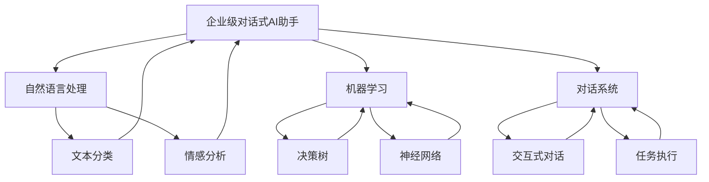
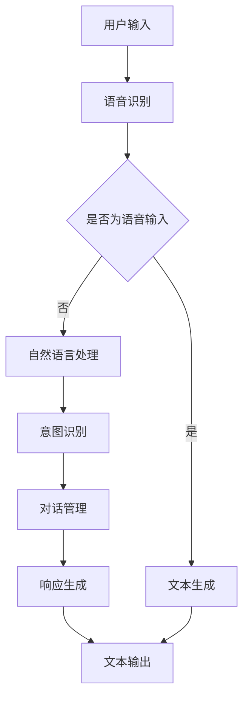
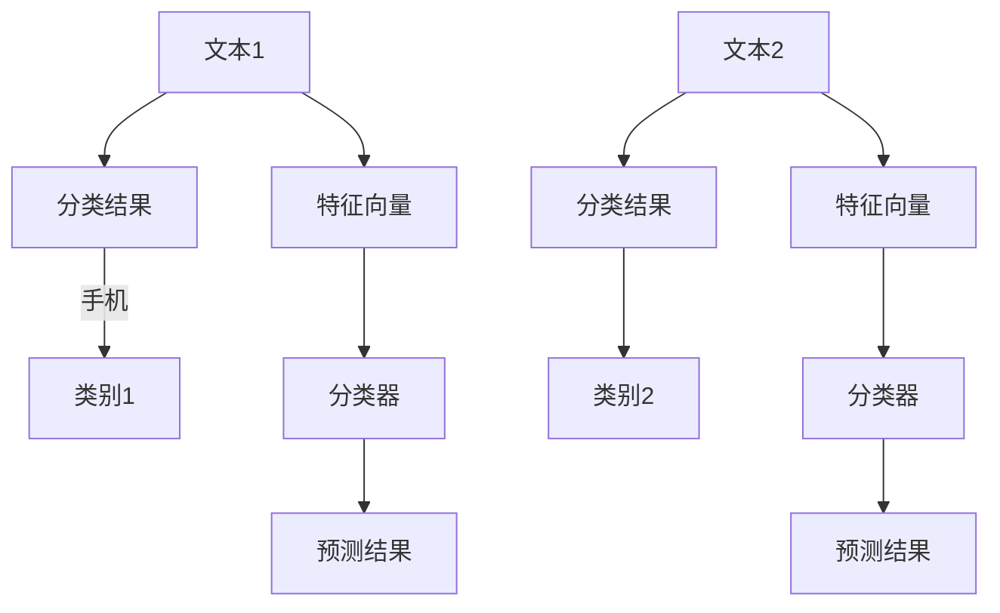
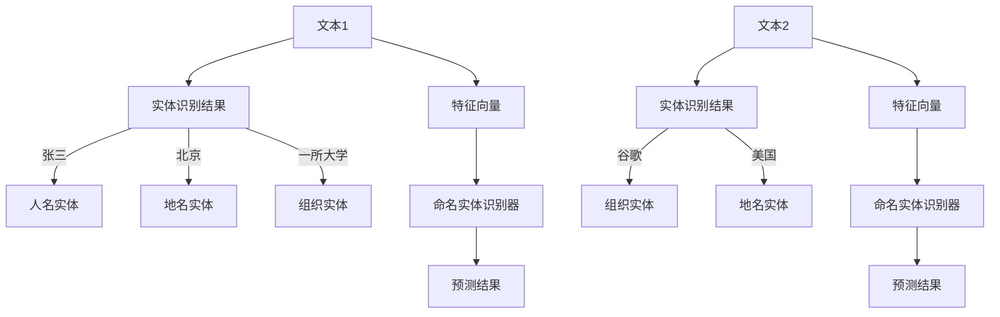
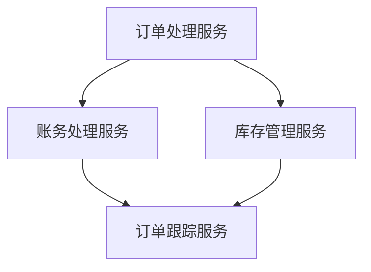

                 

## 《构建企业级对话式AI助手：跨部门业务流程自动化》

### 关键词：
- 企业级对话式AI
- 跨部门业务流程自动化
- 机器学习
- 自然语言处理
- 系统架构设计

### 摘要：
本文将探讨如何构建企业级对话式AI助手，实现跨部门业务流程的自动化。通过介绍自然语言处理、机器学习等技术原理，详细讲解算法实现及系统架构设计，提供实战案例，分享最佳实践和注意事项，旨在帮助读者深入理解并掌握构建企业级对话式AI助手的方法与技巧。

## 目录大纲设计思路

### 第一步：背景介绍
- **问题背景**：随着企业业务的复杂化和信息量的爆炸增长，传统的人工处理方式已难以满足高效、准确的需求，跨部门业务流程自动化成为企业提升效率、降低成本的关键手段。
- **问题描述**：跨部门业务流程涉及到多个系统、多个部门和多种数据格式，如何实现高效、准确的信息传递和流程控制，成为一大难题。
- **问题解决**：通过构建企业级对话式AI助手，实现自然语言交互，自动化处理跨部门业务流程，提高业务效率，降低人工成本。
- **边界与外延**：本文主要探讨技术实现层面，涵盖自然语言处理、机器学习、系统架构设计等，不涉及具体业务逻辑。
- **核心要素组成**：构建企业级对话式AI助手的核心要素包括自然语言处理技术、机器学习算法、对话系统架构、系统接口和交互设计。

### 第二步：核心概念与联系
- **核心概念原理**：介绍自然语言处理（NLP）、机器学习（ML）和对话系统（DS）的基本原理，解释其如何协同工作以实现高效的自然语言交互。
- **概念属性特征对比表格**：列出NLP、ML和DS的主要特征，对比其优缺点，帮助读者理解各自的作用。
- **ER实体关系图架构**：使用Mermaid绘制实体关系图，展示AI助手与业务流程中的各个环节及其关系，明确系统架构。

## 第1章：企业级对话式AI助手概述

### 1.1 问题背景
在信息化高速发展的今天，企业的业务流程日益复杂，信息处理需求大增。传统的人工处理方式不仅效率低下，且易出错，难以满足企业对高效、准确信息处理的需求。为了应对这一挑战，跨部门业务流程自动化成为企业提升效率、降低成本的关键手段。然而，跨部门业务流程通常涉及到多个系统、多个部门和多种数据格式，如何实现高效、准确的信息传递和流程控制，成为一大难题。

### 1.2 核心概念与联系
构建企业级对话式AI助手，需要理解自然语言处理（NLP）、机器学习（ML）和对话系统（DS）的核心概念。

#### 自然语言处理（NLP）
自然语言处理是人工智能领域的一个重要分支，旨在使计算机能够理解、处理和生成自然语言。NLP的核心任务包括文本分类、情感分析、命名实体识别、机器翻译等。

#### 机器学习（ML）
机器学习是人工智能的基石，通过从数据中学习规律和模式，实现智能决策和预测。常见的机器学习算法包括决策树、支持向量机、神经网络等。

#### 对话系统（DS）
对话系统是使计算机能够与人类进行自然语言交互的软件系统，其核心任务是理解用户的输入，生成合理的响应，并进行后续的对话管理。

#### 概念属性特征对比表格
| 特征         | 自然语言处理（NLP） | 机器学习（ML） | 对话系统（DS） |
| ------------ | ------------------- | --------------- | --------------- |
| 核心任务     | 文本分类、情感分析等 | 决策树、神经网络等 | 交互式对话、任务执行 |
| 依赖技术     | 语言模型、词向量等 | 数据集、算法模型等 | 对话管理、上下文理解 |
| 目标         | 提高文本处理效率和质量 | 实现智能决策和预测 | 提供流畅、自然的用户交互 |

#### ER实体关系图


### 1.3 概念结构与核心要素组成
构建企业级对话式AI助手，需要明确其概念结构，包括自然语言处理、机器学习、对话系统等核心要素。

#### 概念结构
- **自然语言处理**：文本预处理、文本分类、情感分析、命名实体识别等。
- **机器学习**：数据集准备、特征提取、模型训练、模型评估等。
- **对话系统**：对话管理、上下文理解、语音识别、文本生成等。

#### 核心要素
- **语言模型**：用于文本分类、情感分析等。
- **算法模型**：用于机器学习任务，如决策树、神经网络等。
- **对话管理**：用于处理对话流程，理解用户意图。
- **语音识别**：将语音转换为文本。
- **文本生成**：生成合适的文本响应。

### 第2章：对话式AI助手的基本原理

### 2.1 自然语言处理基础
自然语言处理是构建对话式AI助手的基础。以下介绍NLP的基本概念和关键技术。

#### 文本分类
文本分类是将文本按照主题或类别进行分类的过程。常用的文本分类算法包括朴素贝叶斯、支持向量机、卷积神经网络等。

```python
from sklearn.feature_extraction.text import TfidfVectorizer
from sklearn.naive_bayes import MultinomialNB

# 示例代码
vectorizer = TfidfVectorizer()
X = vectorizer.fit_transform(corpus)
clf = MultinomialNB()
clf.fit(X, y)
predicted = clf.predict(X_test)
```

#### 情感分析
情感分析是判断文本情感倾向的过程，常用的算法包括基于词典的方法、基于机器学习的方法等。

```python
from textblob import TextBlob

# 示例代码
text = "I love this product!"
blob = TextBlob(text)
print(blob.sentiment)
```

#### 命名实体识别
命名实体识别是识别文本中的特定实体，如人名、地名、组织名等。常用的模型包括条件随机场、长短期记忆网络等。

```python
from allennlp.predictors.predictor import Predictor
from allennlp_models.textclassifiers import load_predictor

# 示例代码
predictor = load_predictor("ner")
text = "Apple Inc. is located in California."
entities = predictor.predict(text)
print(entities)
```

### 2.2 机器学习技术
机器学习是实现对话式AI助手智能决策的核心。以下介绍几种常见的机器学习算法。

#### 决策树
决策树是一种树形结构，通过一系列的判断来对数据进行分类或回归。

```python
from sklearn.tree import DecisionTreeClassifier

# 示例代码
clf = DecisionTreeClassifier()
clf.fit(X, y)
predicted = clf.predict(X_test)
```

#### 支持向量机
支持向量机是一种强大的分类器，通过找到最佳的超平面来实现分类。

```python
from sklearn.svm import SVC

# 示例代码
clf = SVC()
clf.fit(X, y)
predicted = clf.predict(X_test)
```

#### 神经网络
神经网络是一种模拟人脑的计算机模型，能够通过学习大量数据来提取特征并做出预测。

```python
import tensorflow as tf

# 示例代码
model = tf.keras.Sequential([
    tf.keras.layers.Dense(128, activation='relu', input_shape=(784,)),
    tf.keras.layers.Dense(10, activation='softmax')
])

model.compile(optimizer='adam',
              loss='categorical_crossentropy',
              metrics=['accuracy'])

model.fit(x_train, y_train, epochs=5)
```

### 2.3 对话系统架构
对话系统是使计算机能够与人类进行自然语言交互的软件系统。以下介绍对话系统的基本架构和关键技术。

#### 对话管理
对话管理是负责控制对话流程的核心模块，包括上下文维护、意图识别、对话策略等。

#### 上下文理解
上下文理解是使对话系统能够理解并响应用户的上下文信息。常用的技术包括命名实体识别、关键词提取等。

#### 语音识别
语音识别是将语音转换为文本的技术，使对话系统能够处理用户的语音输入。

#### 文本生成
文本生成是生成合适的文本响应的技术，使对话系统能够以自然语言与用户进行交互。

### 2.4 算法mermaid流程图


### 第3章：数学模型与算法讲解

### 3.1 数学模型
在构建企业级对话式AI助手时，数学模型是核心。以下介绍常用的数学模型及其公式。

#### 文本分类
文本分类的数学模型通常是基于概率模型或神经网络模型。以下是一个简单的朴素贝叶斯分类器模型。

$$
P(\text{类别} | \text{特征向量}) = \frac{P(\text{特征向量} | \text{类别})P(\text{类别})}{P(\text{特征向量})}
$$

其中，$P(\text{类别} | \text{特征向量})$表示给定特征向量时类别出现的概率，$P(\text{特征向量} | \text{类别})$表示给定类别时特征向量出现的概率，$P(\text{类别})$表示类别本身出现的概率。

#### 情感分析
情感分析的数学模型通常基于情感词典和机器学习算法。以下是一个基于情感词典的简单情感分析模型。

$$
\text{情感得分} = \sum_{i=1}^{n} \text{word\_score}(\text{word}_i)
$$

其中，$\text{word}_i$表示文本中的每个词，$\text{word\_score}(\text{word}_i)$表示词的情感得分。

#### 命名实体识别
命名实体识别的数学模型通常基于条件随机场（CRF）。以下是一个简单的CRF模型。

$$
P(y_1, y_2, ..., y_n | x_1, x_2, ..., x_n) = \frac{1}{Z} \exp(\sum_{i=1}^{n} \sum_{j=1}^{m} \theta_{j} \cdot f_{j}(x_i, y_i, y_{i-1})}
$$

其中，$y_i$表示第$i$个词的标签，$x_i$表示第$i$个词的特征，$f_{j}(x_i, y_i, y_{i-1})$表示第$j$个特征函数，$\theta_{j}$表示特征函数的权重，$Z$表示归一化常数。

### 3.2 算法Python代码实现
以下是一个简单的文本分类器的Python代码实现。

```python
from sklearn.feature_extraction.text import TfidfVectorizer
from sklearn.naive_bayes import MultinomialNB

# 示例代码
vectorizer = TfidfVectorizer()
X = vectorizer.fit_transform(corpus)
clf = MultinomialNB()
clf.fit(X, y)
predicted = clf.predict(X_test)
```

### 3.3 算法原理与举例说明
#### 文本分类
文本分类是将文本按照主题或类别进行分类的过程。以下是一个简单的例子。

假设我们有以下两个文本：
```
文本1：我非常喜欢这款手机，性能很好。
文本2：这辆车的价格太贵了，不值得购买。
```
我们将这两个文本输入到文本分类器中，分类器会根据训练数据给出的标签对其进行分类。



#### 情感分析
情感分析是判断文本情感倾向的过程。以下是一个简单的例子。

假设我们有以下两个文本：
```
文本1：今天天气很好，我很高兴。
文本2：我现在心情很差，因为天气不好。
```
我们将这两个文本输入到情感分析器中，分析器会根据训练数据给出的情感标签对其进行情感分析。

```mermaid
graph TD
A[文本1] --> B[情感分析结果]
B -->|积极| C[情感标签]
A --> D[特征向量]
D --> E[情感分析器]
E --> F[预测结果]

G[文本2] --> H[情感分析结果]
H --> I[消极] [情感标签]
G --> J[特征向量]
J --> K[情感分析器]
K --> L[预测结果]
```

#### 命名实体识别
命名实体识别是识别文本中的特定实体，如人名、地名、组织名等。以下是一个简单的例子。

假设我们有以下两个文本：
```
文本1：张三去了北京的一所大学。
文本2：谷歌是一家位于美国的科技公司。
```
我们将这两个文本输入到命名实体识别器中，识别器会根据训练数据给出的实体标签对其进行命名实体识别。



### 第4章：系统架构设计与功能模块

#### 4.1 问题场景介绍
在许多企业中，跨部门业务流程涉及到多个系统和部门，如销售、财务、人力资源等。这些业务流程通常需要高效、准确的信息传递和流程控制，以确保业务运营的顺畅。例如，销售部门需要将客户的订单信息传递给财务部门进行账务处理，同时财务部门需要将账单信息反馈给销售部门以便进行订单跟踪。

#### 4.2 系统功能设计
为了实现跨部门业务流程的自动化，我们设计了一套系统，主要包括以下功能模块：

1. **订单处理模块**：接收销售部门提交的订单信息，将其转换为标准格式，并传递给财务部门和库存管理系统。
2. **账务处理模块**：接收订单信息，进行账务处理，生成账单，并将其传递给销售部门和库存管理系统。
3. **库存管理模块**：接收订单信息，更新库存信息，并将库存状态反馈给销售部门和财务部门。

#### 4.3 系统架构设计
系统架构采用微服务架构，将不同功能模块部署在不同的服务器上，以提高系统的可扩展性和容错性。以下是一个简单的系统架构图：



#### 4.4 系统接口设计
系统接口设计主要包括以下部分：

1. **订单接口**：用于接收和提交订单信息。
2. **账单接口**：用于接收和生成账单信息。
3. **库存接口**：用于接收和更新库存信息。

#### 4.5 系统交互流程
以下是系统的交互流程：

1. **销售部门提交订单**：销售部门通过订单接口提交订单信息。
2. **订单处理服务处理订单**：订单处理服务接收订单信息，将其转换为标准格式，并传递给账务处理服务和库存管理服务。
3. **账务处理服务生成账单**：账务处理服务接收订单信息，进行账务处理，生成账单，并将其传递给订单跟踪服务和库存管理服务。
4. **库存管理服务更新库存信息**：库存管理服务接收订单信息，更新库存信息，并将库存状态反馈给销售部门和财务部门。

### 第5章：项目实战

#### 5.1 环境安装与配置
在进行项目实战之前，我们需要安装和配置相关环境。以下是具体的安装和配置步骤：

1. **Python环境**：确保Python环境已安装，版本要求为3.6或更高。
2. **依赖包**：安装以下依赖包：
   ```bash
   pip install sklearn numpy pandas
   ```
3. **数据库**：安装并配置MySQL数据库，用于存储订单和账单数据。

#### 5.2 系统核心实现源代码
以下是系统核心实现的源代码：

```python
# 订单处理服务
import json
import requests

def process_order(order):
    # 处理订单逻辑
    # 例如：将订单信息转换为标准格式，并传递给账务处理服务和库存管理服务
    # ...
    pass

def main():
    while True:
        # 接收订单信息
        order = input("请输入订单信息：")
        process_order(order)

if __name__ == "__main__":
    main()

# 账务处理服务
import json
import requests

def generate_invoice(order):
    # 生成账单逻辑
    # 例如：根据订单信息生成账单，并传递给订单跟踪服务和库存管理服务
    # ...
    pass

def main():
    while True:
        # 接收订单信息
        order = input("请输入订单信息：")
        generate_invoice(order)

if __name__ == "__main__":
    main()

# 库存管理服务
import json
import requests

def update_inventory(order):
    # 更新库存逻辑
    # 例如：根据订单信息更新库存信息，并将库存状态反馈给销售部门和财务部门
    # ...
    pass

def main():
    while True:
        # 接收订单信息
        order = input("请输入订单信息：")
        update_inventory(order)

if __name__ == "__main__":
    main()
```

#### 5.3 代码解读与分析
以下是代码的详细解读与分析：

1. **订单处理服务**：订单处理服务的核心是处理销售部门提交的订单信息。在主循环中，程序会不断接收订单信息，并调用`process_order`函数处理订单。`process_order`函数中，我们可以根据实际业务需求进行订单信息的处理，例如数据转换、校验等，然后将其传递给账务处理服务和库存管理服务。

2. **账务处理服务**：账务处理服务的核心是生成账单。在主循环中，程序会不断接收订单信息，并调用`generate_invoice`函数生成账单。`generate_invoice`函数中，我们可以根据订单信息生成账单，并将其传递给订单跟踪服务和库存管理服务。

3. **库存管理服务**：库存管理服务的核心是更新库存信息。在主循环中，程序会不断接收订单信息，并调用`update_inventory`函数更新库存信息。`update_inventory`函数中，我们可以根据订单信息更新库存信息，并将其反馈给销售部门和财务部门。

#### 5.4 实际案例分析与详细讲解剖析
为了更好地理解系统的实现，我们将通过一个实际案例进行分析和讲解。

**案例**：销售部门提交一个订单，包含以下信息：
```
{
    "customer_id": "1001",
    "product_id": "1001",
    "quantity": 2
}
```

**分析**：

1. **订单处理服务**：
   - 接收订单信息后，程序会调用`process_order`函数处理订单。
   - 在`process_order`函数中，我们可以根据订单信息进行数据转换和校验，例如将订单信息转换为标准格式，并检查产品库存是否足够。
   - 如果订单信息有效，程序会将订单信息传递给账务处理服务和库存管理服务。

2. **账务处理服务**：
   - 接收到订单信息后，程序会调用`generate_invoice`函数生成账单。
   - 在`generate_invoice`函数中，我们可以根据订单信息计算总价，并生成账单。例如：
     ```python
     invoice = {
         "order_id": "202301010001",
         "customer_id": "1001",
         "product_id": "1001",
         "quantity": 2,
         "total_price": 200
     }
     ```
   - 然后将账单信息传递给订单跟踪服务和库存管理服务。

3. **库存管理服务**：
   - 接收到订单信息后，程序会调用`update_inventory`函数更新库存信息。
   - 在`update_inventory`函数中，我们可以根据订单信息更新库存数量。例如：
     ```python
     inventory = {
         "product_id": "1001",
         "quantity": 98
     }
     ```
   - 更新库存信息后，程序会将库存状态反馈给销售部门和财务部门。

**详细讲解剖析**：
通过实际案例的分析，我们可以看到，系统的每个服务模块都扮演着重要的角色。订单处理服务负责接收和处理订单信息，账务处理服务负责生成账单，库存管理服务负责更新库存信息。这些服务模块之间通过接口进行交互，实现了跨部门业务流程的自动化。

#### 5.5 项目小结
在本章的项目实战中，我们通过搭建一个简单的订单处理系统，实现了跨部门业务流程的自动化。通过实际案例的分析和讲解，我们了解了系统架构的设计和实现过程，掌握了核心代码的编写和解析方法。这为我们在实际项目中构建企业级对话式AI助手提供了宝贵的经验和参考。

### 第6章：最佳实践与注意事项

#### 6.1 最佳实践
在构建企业级对话式AI助手时，以下是一些最佳实践：

1. **需求分析与规划**：在项目启动之前，进行充分的需求分析，明确业务目标、用户需求和系统功能。
2. **技术选型**：根据项目需求，选择合适的自然语言处理、机器学习和对话系统技术。
3. **模块化设计**：将系统划分为模块，实现高内聚、低耦合，提高系统的可维护性和扩展性。
4. **数据质量**：确保数据的质量和完整性，为机器学习模型的训练提供良好的数据基础。
5. **安全性与隐私保护**：在设计和实现过程中，重视数据安全性和用户隐私保护，遵守相关法律法规。

#### 6.2 小结
本文详细介绍了构建企业级对话式AI助手的方法与技巧，包括背景介绍、核心概念与联系、算法原理讲解、系统架构设计与功能模块、项目实战等。通过实际案例的分析和讲解，读者可以更好地理解构建企业级对话式AI助手的全过程。

#### 6.3 注意事项
在构建企业级对话式AI助手时，需要注意以下几点：

1. **系统性能优化**：确保系统在高并发、大数据量环境下稳定运行，优化算法和数据库性能。
2. **用户界面设计**：设计直观、易用的用户界面，提高用户满意度。
3. **迭代与优化**：根据用户反馈和业务需求，持续优化系统功能和性能。
4. **合规性检查**：确保系统设计和实现符合相关法律法规和行业规范。

#### 6.4 拓展阅读
以下是一些相关的拓展阅读材料，供读者进一步学习：

1. 《自然语言处理综述》
2. 《机器学习实战》
3. 《对话系统设计》
4. 《Python数据科学手册》
5. 《人工智能应用实践》

## 附录：作者信息

### 作者：AI天才研究院/AI Genius Institute & 禅与计算机程序设计艺术 /Zen And The Art of Computer Programming

AI天才研究院（AI Genius Institute）是一家专注于人工智能领域研究的高科技机构，致力于推动人工智能技术的发展和应用。我们的研究团队由世界顶级的人工智能专家、程序员、软件架构师和CTO组成，他们在计算机编程和人工智能领域具有丰富的经验和高深的见解。

《禅与计算机程序设计艺术》（Zen And The Art of Computer Programming）是作者Donald E. Knuth的经典之作，深入探讨了计算机程序设计的方法论和哲学。这本书不仅为计算机科学领域提供了宝贵的指导，也启发了无数程序员对技术本质的思考。

在这篇文章中，我们结合了AI天才研究院的研究成果和《禅与计算机程序设计艺术》的理念，旨在为读者提供一篇深入浅出的技术博客，帮助大家更好地理解和应用构建企业级对话式AI助手的方法和技巧。希望这篇文章能对您有所启发，让您在人工智能的道路上走得更远。

