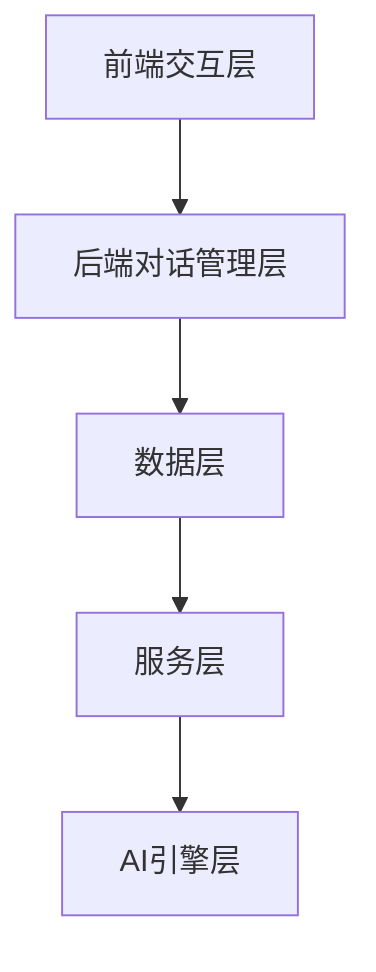
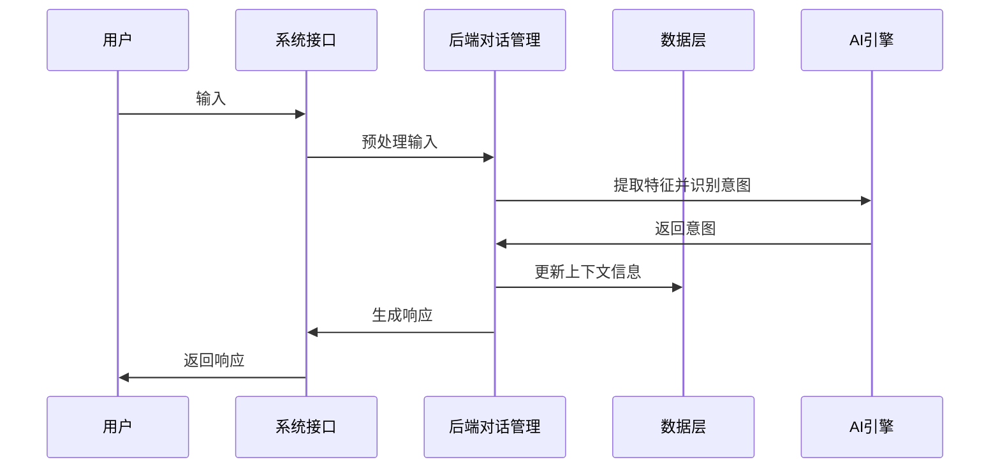

                 

### 1.4 边界与外延

#### 1.4.1 对话系统的应用场景

在企业级应用中，对话系统可以应用于多种场景，包括但不限于：

- **客户服务**：自动化的客户服务系统可以处理大量客户查询，提高服务效率，减少人工成本。
- **智能推荐**：对话系统可以根据用户的兴趣和行为数据，提供个性化的推荐服务。
- **人机对话**：在企业内部，对话系统可以作为智能助手，帮助员工快速获取所需信息，提高工作效率。

这些应用场景对对话系统提出了不同的要求，例如快速响应、高准确性、良好的用户体验等。

#### 1.4.2 意图理解的多样性

意图理解的多样性主要体现在以下几个方面：

- **用户表达方式的多样性**：不同的用户可能会有不同的表达方式，例如用词选择、语法结构等。
- **领域知识的多样性**：不同领域的用户可能有不同的专业术语和知识背景，这对意图理解提出了挑战。
- **情感表达的多样性**：用户的情感状态也会影响他们的表达方式，例如愤怒、高兴、中立等情感。

要有效地解决这些问题，需要采用多样化的方法和技术，例如情感分析、领域适应性训练等。

#### 1.4.3 概念结构与核心要素组成

对话系统的概念结构和核心要素组成如下：

- **对话系统**：指能够模拟人类对话的人工智能系统。
- **多轮对话管理**：指对话系统在与用户进行多轮交互时，如何保持对话状态、提取上下文信息和应用对话策略。
- **意图理解**：指对话系统如何从用户的输入中识别出用户的意图，并提供相应的回应。

这些概念和要素相互关联，共同构成了一个完整的企业级对话系统。

---

### 1.5 概念结构与核心要素组成

#### 1.5.1 对话系统的核心概念

**对话系统**：是一种人机交互系统，通过自然语言与用户进行交流，以提供信息、解决问题或执行任务。

**多轮对话**：是指对话系统与用户之间的交互过程，通常包括多个轮次的提问和回答。

**上下文**：是对话过程中用户输入和历史回应的信息集合，对于理解用户意图和进行后续对话至关重要。

**意图理解**：是指对话系统能够从用户的输入中识别出用户的具体需求或目标。

#### 1.5.2 对话系统的核心要素组成

**对话状态管理**：是保持对话的历史状态，以便在后续对话中参考。

**上下文提取**：是从用户的输入和历史对话中提取出关键信息，用于意图理解和对话策略的制定。

**对话策略**：是根据当前对话状态和上下文信息，决定如何回应用户输入的策略。

**意图识别**：是根据用户输入的内容和上下文信息，识别出用户的具体意图。

**多轮对话管理算法**：是实现多轮对话管理的一系列算法，包括对话状态的更新、上下文信息的提取和对话策略的制定。

**意图理解算法**：是根据用户输入和上下文信息，识别出用户意图的一系列算法。

### 1.5.3 各要素之间的联系

- **对话状态管理**与**上下文提取**：对话状态管理是上下文提取的基础，上下文提取依赖于对话状态来获取相关信息。
- **对话策略**与**意图识别**：对话策略是基于意图识别的结果来制定的，意图识别的结果直接影响到对话策略的执行。
- **意图理解算法**与**多轮对话管理算法**：意图理解算法是多轮对话管理算法的一部分，两者共同作用于对话系统的整个运行过程。

通过对这些核心概念和要素的深入理解，我们可以更好地构建高效的企业级对话系统，以满足多样化的业务需求。在接下来的部分，我们将进一步探讨如何实现这些核心概念和要素。

---

## 2.1 多轮对话管理

### 2.1.1 多轮对话管理的定义

多轮对话管理是指对话系统能够在多个对话轮次中保持上下文信息，并在每次对话中根据上下文信息和用户输入做出合适的回应。这种管理能力是构建高效企业级对话系统的关键，因为它确保了对话的连贯性和用户体验的一致性。

### 2.1.2 多轮对话管理的核心要素

**对话状态**：对话状态是对话系统在某一时刻的状态信息，包括用户的历史输入、系统的响应和对话的历史上下文。对话状态的管理是保持对话连贯性的基础。

**上下文信息**：上下文信息是用户输入和历史对话内容的集合，用于帮助对话系统理解当前用户意图和背景信息。上下文信息的提取和存储是实现多轮对话管理的重要手段。

**对话策略**：对话策略是一组规则或算法，用于指导对话系统如何回应用户输入。有效的对话策略能够根据对话状态和上下文信息，为用户提供自然、连贯的交互体验。

### 2.1.3 多轮对话管理的作用

- **提高用户体验**：通过保持对话上下文，对话系统能够更好地理解用户意图，提供个性化的服务。
- **增强对话连贯性**：多轮对话管理确保了对话的连贯性，避免了因上下文丢失导致的信息断裂。
- **优化业务流程**：对话系统能够在多轮对话中自动化处理业务流程，提高工作效率。

### 2.1.4 多轮对话管理的挑战

- **对话状态保持**：如何在多个对话轮次中准确、完整地保持对话状态是一个挑战。
- **上下文信息提取**：提取与当前对话相关的上下文信息，同时避免过度提取或提取不足。
- **对话策略设计**：设计灵活且高效的对话策略，以适应多样化的用户需求。

### 2.1.5 多轮对话管理的方法

- **对话状态管理**：使用数据库或缓存系统存储对话状态，确保状态的一致性和持久性。
- **上下文信息提取**：采用自然语言处理技术，从用户输入和历史对话中提取关键信息。
- **对话策略设计**：结合规则引擎和机器学习模型，设计适应不同场景的对话策略。

### 2.1.6 多轮对话管理流程

1. **初始化**：对话系统初始化对话状态和上下文信息。
2. **用户输入**：用户输入新的信息。
3. **状态更新**：根据用户输入更新对话状态。
4. **上下文提取**：从对话状态和历史上下文中提取关键信息。
5. **意图识别**：使用意图识别算法识别用户意图。
6. **对话策略**：根据意图识别结果和对话上下文，应用对话策略。
7. **生成回应**：生成并返回系统回应。
8. **结束对话**：在满足一定条件时结束对话。

### 2.1.7 实现示例

```python
class DialogueManager:
    def __init__(self):
        self.state = {}
        self.context = []

    def update_state(self, user_input):
        # 更新对话状态的代码
        pass

    def extract_context(self):
        # 提取上下文信息的代码
        pass

    def apply_strategy(self, intent):
        # 应用对话策略的代码
        pass

    def manage_dialogue(self, user_input):
        intent = self.recognize_intent(user_input)
        self.update_state(user_input)
        self.extract_context()
        response = self.apply_strategy(intent)
        return response
```

通过上述流程和实现示例，我们可以看到多轮对话管理的基本框架和操作步骤。接下来，我们将进一步探讨意图理解的概念和原理。

### 2.2 意图理解

#### 2.2.1 意图理解的定义

意图理解（Intent Recognition）是指对话系统能够从用户的输入中识别出用户的具体需求或目标，并将这些需求或目标映射到预定义的意图类别上。意图理解是对话系统的核心功能之一，它决定了对话系统能否正确理解用户的意图，并给出适当的回应。

#### 2.2.2 意图理解的核心要素

**意图分类**：意图分类是将用户的输入映射到预定义的意图类别上。每个意图类别代表了一种用户需求或目标，例如“查询天气”、“预定酒店”等。

**特征提取**：特征提取是从用户输入中提取出有助于意图识别的关键信息。这些信息可以是词频、词序列、语法结构等，它们将用于训练和优化意图识别模型。

**模型训练**：模型训练是指使用已标注的数据集来训练意图识别模型。常见的训练方法包括基于规则的方法、机器学习方法（如支持向量机、朴素贝叶斯、深度学习等）。

**意图识别**：意图识别是指根据用户输入和提取的特征，利用训练好的模型来识别用户的意图。识别结果将用于指导对话系统生成相应的回应。

#### 2.2.3 意图理解的重要性

意图理解是对话系统能否提供有效交互的关键因素，它直接影响以下方面：

- **用户体验**：准确理解用户意图可以提供更自然的交互体验，避免误解和用户不满。
- **业务效率**：通过自动化处理用户需求，意图理解可以提高业务处理效率，减少人力成本。
- **系统扩展性**：意图理解模型的可扩展性决定了对话系统在面对新需求和变化时的适应能力。

#### 2.2.4 意图理解的多样性

意图理解的多样性体现在以下几个方面：

- **用户表达方式的多样性**：不同的用户可能会有不同的表达方式，如口语、书面语、简略语等。
- **领域知识的多样性**：不同领域中的专业术语和知识背景会影响意图的理解。
- **情感表达的多样性**：用户的情感状态也会影响他们的表达方式，例如愤怒、高兴、中立等情感。

#### 2.2.5 意图理解的方法和技术

**基于规则的方法**：通过预定义的规则来匹配用户的输入，实现简单的意图识别。这种方法简单直观，但灵活性较差。

**机器学习方法**：使用机器学习算法（如支持向量机、朴素贝叶斯、随机森林等）来训练模型，实现更高级的意图识别。这种方法具有较强的灵活性和泛化能力。

**深度学习方法**：使用深度神经网络（如卷积神经网络、循环神经网络、变换器等）来处理复杂的意图识别任务。这种方法在处理高维度数据和复杂特征方面具有显著优势。

#### 2.2.6 意图理解流程

1. **用户输入处理**：对用户输入进行预处理，如分词、去停用词、词干提取等。
2. **特征提取**：从预处理后的输入中提取特征，如词频、词嵌入等。
3. **意图分类**：使用训练好的模型对提取的特征进行分类，得到用户的意图。
4. **回应生成**：根据识别出的意图，生成相应的系统回应。

#### 2.2.7 实现示例

```python
from sklearn.feature_extraction.text import TfidfVectorizer
from sklearn.naive_bayes import MultinomialNB
from sklearn.pipeline import make_pipeline

# 特征提取器和模型训练
vectorizer = TfidfVectorizer()
model = MultinomialNB()

# 训练模型
X_train = [...]  # 用户输入数据
y_train = [...]  # 对应的意图标签
model.fit(vectorizer.fit_transform(X_train), y_train)

# 意图识别
def recognize_intent(user_input):
    features = vectorizer.transform([user_input])
    intent = model.predict(features)[0]
    return intent

# 示例应用
user_input = "明天北京的天气怎么样？"
print(recognize_intent(user_input))
```

通过上述实现示例，我们可以看到意图理解的基本流程和操作步骤。在下一部分，我们将详细讨论多轮对话管理算法的原理和应用。

## 3.1 多轮对话管理算法

### 3.1.1 算法原理

多轮对话管理算法的核心目标是确保对话系统能够在多个对话轮次中保持上下文信息，并有效地利用这些信息来理解和回应用户的意图。为了实现这一目标，我们需要关注以下几个关键步骤：

1. **对话状态的初始化**：在对话开始时，对话系统需要初始化对话状态，包括用户的历史输入、系统的历史回应和对话的上下文信息。

2. **用户输入的处理**：在每次用户输入后，对话系统需要对输入进行预处理，如分词、去停用词、词干提取等，以便更好地理解和提取关键信息。

3. **上下文信息的提取**：对话系统需要从历史对话记录和当前用户输入中提取出与当前意图相关的上下文信息。这些上下文信息将用于后续的意图理解和对话策略的制定。

4. **意图识别**：使用意图识别算法（如机器学习方法或深度学习方法）来识别用户的意图。意图识别的结果将指导对话系统生成合适的回应。

5. **对话策略的制定**：根据意图识别的结果和上下文信息，对话系统需要制定相应的对话策略。对话策略决定了对话系统在当前情境下如何回应用户输入，以及如何引导对话向用户期望的方向发展。

6. **回应生成**：根据对话策略，对话系统需要生成并返回一个合适的回应。这个回应可以是文本、语音或其他形式的交互。

7. **对话状态的更新**：在每次回应之后，对话系统需要更新对话状态，以反映当前对话的进展和用户的反馈。

### 3.1.2 算法实现

为了更好地理解多轮对话管理算法的原理，我们可以使用Python来实现一个简单的对话系统。以下是一个基本的实现框架：

```python
class DialogueManager:
    def __init__(self):
        self.state = {}
        self.context = []

    def preprocess_input(self, user_input):
        # 用户输入预处理，如分词、去停用词等
        return processed_input

    def extract_context(self, user_input):
        # 从用户输入和对话状态中提取上下文信息
        context = self.state.get('context', []) + [user_input]
        return context

    def recognize_intent(self, user_input):
        # 使用意图识别算法识别用户的意图
        # 这里假设有一个预训练的意图识别模型
        intent = intent_recognition_model.predict([user_input])[0]
        return intent

    def generate_response(self, intent, context):
        # 根据意图和上下文生成回应
        response = "根据您的问题，我理解您想了解……"
        return response

    def update_state(self, user_input, context, intent, response):
        # 更新对话状态
        self.state['context'] = context
        self.state['intent'] = intent
        self.state['response'] = response

    def manage_dialogue(self, user_input):
        processed_input = self.preprocess_input(user_input)
        context = self.extract_context(processed_input)
        intent = self.recognize_intent(processed_input)
        response = self.generate_response(intent, context)
        self.update_state(processed_input, context, intent, response)
        return response

# 示例应用
dialogue_manager = DialogueManager()
user_input = "明天北京的天气怎么样？"
print(dialogue_manager.manage_dialogue(user_input))
```

上述代码提供了一个简单的多轮对话管理算法实现，其中包含了预处理输入、提取上下文信息、意图识别、生成回应和更新状态等关键步骤。在实际应用中，对话系统可能会更加复杂，涉及更多的算法和技术，但基本框架是相似的。

### 3.1.3 多轮对话管理算法的数学模型和公式

在多轮对话管理算法中，我们可以使用以下数学模型和公式来描述关键步骤：

1. **对话状态的更新**：

   $$ S_{t+1} = S_t + f(U_t, S_t) $$

   其中，$S_t$ 表示当前对话状态，$U_t$ 表示当前用户输入，$f(U_t, S_t)$ 是一个函数，用于更新对话状态。

2. **上下文信息的提取**：

   $$ C_t = \sum_{i=1}^{N} w_i C_i $$

   其中，$C_t$ 表示当前上下文信息，$C_i$ 表示第 $i$ 次对话轮次的上下文信息，$w_i$ 是权重，用于反映上下文信息的重要程度。

3. **意图识别**：

   $$ P(I|U, C) = \frac{e^{f(U, C)}}{\sum_{i} e^{f(U, C_i)}} $$

   其中，$P(I|U, C)$ 表示在给定用户输入 $U$ 和上下文信息 $C$ 的情况下，识别出意图 $I$ 的概率，$f(U, C)$ 是意图识别模型的评分函数。

4. **对话策略的制定**：

   $$ R(I, C) = \arg\max_{R} \sum_{r} \alpha(r) \cdot P(R|I, C) $$

   其中，$R(I, C)$ 表示在给定意图 $I$ 和上下文信息 $C$ 的情况下，选择最佳回应 $R$ 的策略，$\alpha(r)$ 是回应的优先级权重，$P(R|I, C)$ 是在给定意图和上下文信息的情况下，生成回应 $R$ 的概率。

通过这些数学模型和公式，我们可以更精确地描述多轮对话管理算法的工作原理。在实际应用中，这些模型和公式将结合具体的算法和技术，实现高效和准确的多轮对话管理。

### 3.1.4 示例讲解

为了更直观地理解多轮对话管理算法，我们可以通过一个简单的对话场景来讲解其应用过程。

**场景**：用户询问“明天北京的天气怎么样？”系统需要给出一个合适的回应。

**步骤**：

1. **初始化**：对话系统初始化对话状态，包括用户的历史输入、系统的历史回应和对话的上下文信息。

2. **用户输入**：用户输入“明天北京的天气怎么样？”

3. **预处理输入**：对话系统对用户输入进行预处理，如分词、去停用词、词干提取等，得到处理后的输入“明天 北京 天气 怎么样”。

4. **提取上下文信息**：对话系统从对话状态和历史上下文中提取出与当前意图相关的上下文信息。在这个例子中，上下文信息可能包括之前用户询问的天气情况等。

5. **意图识别**：使用预训练的意图识别模型，对话系统识别出用户的意图为“查询天气”。

6. **生成回应**：根据识别出的意图和上下文信息，对话系统生成一个合适的回应，如“根据天气预报，明天北京的温度是15°C到25°C，多云转晴。”

7. **更新状态**：对话系统更新对话状态，记录当前的用户输入、上下文信息和意图。

8. **结束对话**：在这个例子中，假设用户没有更多的询问，对话结束。

通过这个简单的示例，我们可以看到多轮对话管理算法在处理实际对话场景中的操作过程。在实际应用中，对话系统可能会处理更加复杂和多变的对话场景，但基本原理是相似的。

### 3.1.5 总结

多轮对话管理算法是构建高效企业级对话系统的关键组成部分。通过保持对话状态、提取上下文信息、识别用户意图和制定对话策略，对话系统能够在多个对话轮次中提供连贯和有效的交互体验。实现多轮对话管理算法需要结合自然语言处理、机器学习和深度学习等先进技术，以确保系统的准确性和适应性。通过理解多轮对话管理算法的原理和实现步骤，我们可以更好地设计和实现企业级对话系统，满足不同业务场景的需求。

## 3.2 意图理解算法

### 3.2.1 算法原理

意图理解算法是对话系统能够从用户的输入中识别出用户意图的核心组件。其基本原理是通过分析用户输入，提取关键特征，然后利用这些特征和预先定义的意图类别进行匹配，从而确定用户的意图。以下是对意图理解算法的基本原理和实现步骤的详细讨论。

#### 意图分类

意图分类是意图理解算法的第一步，它将用户的输入映射到预定义的意图类别上。这些意图类别是根据具体的业务需求和用户交互场景定义的，例如“查询天气”、“预订酒店”、“投诉反馈”等。意图分类的目的是将用户的非结构化输入转化为结构化的意图表示，以便后续处理。

#### 特征提取

特征提取是从用户的输入中提取出有助于意图识别的关键信息。这些特征可以是基于文本的，也可以是语义层面的。常见的特征提取方法包括：

- **词频统计**：统计用户输入中的词频，用于反映关键词的重要性。
- **词嵌入**：将文本转化为向量表示，如Word2Vec、GloVe等，以捕捉词汇的语义信息。
- **语法特征**：提取用户输入中的语法结构，如主谓宾结构、疑问句等。
- **情感分析**：通过情感分析提取用户的情感状态，以辅助意图理解。

#### 模型训练

模型训练是意图理解算法的核心步骤，它通过已标注的数据集训练出一个意图识别模型。常见的训练方法包括：

- **基于规则的方法**：通过手工编写规则来匹配用户的输入和意图。这种方法简单直观，但灵活性较差，难以应对复杂的输入。
- **机器学习方法**：使用机器学习算法（如支持向量机、朴素贝叶斯、随机森林等）来训练模型。这种方法具有较好的泛化能力，但需要大量的训练数据和计算资源。
- **深度学习方法**：使用深度神经网络（如卷积神经网络、循环神经网络、变换器等）来处理复杂的意图识别任务。这种方法在处理高维度数据和复杂特征方面具有显著优势。

#### 意图识别

意图识别是使用训练好的模型对新的用户输入进行分类，以识别出用户的意图。这个过程通常包括以下几个步骤：

1. **预处理输入**：对用户输入进行预处理，如分词、去停用词、词干提取等。
2. **特征提取**：从预处理后的输入中提取特征，如词频、词嵌入等。
3. **模型预测**：使用训练好的模型对提取的特征进行预测，得到用户输入的意图类别。
4. **结果验证**：对识别出的意图进行验证，确保其准确性和可靠性。

#### 实现示例

以下是一个简单的意图识别算法实现示例，使用Python和Sklearn库：

```python
from sklearn.feature_extraction.text import TfidfVectorizer
from sklearn.naive_bayes import MultinomialNB
from sklearn.pipeline import make_pipeline

# 准备训练数据
X_train = ["我想预订一张北京到上海的机票", "帮我查一下明天的天气"]
y_train = ["预订机票", "查询天气"]

# 创建TF-IDF向量器和朴素贝叶斯分类器
vectorizer = TfidfVectorizer()
model = MultinomialNB()

# 训练模型
model.fit(vectorizer.fit_transform(X_train), y_train)

# 意图识别函数
def recognize_intent(user_input):
    features = vectorizer.transform([user_input])
    intent = model.predict(features)[0]
    return intent

# 示例应用
user_input = "明天北京的天气怎么样？"
print(recognize_intent(user_input))
```

在这个示例中，我们使用TF-IDF向量器和朴素贝叶斯分类器来训练一个简单的意图识别模型。通过这个模型，我们可以对新的用户输入进行意图识别，并返回相应的意图类别。

### 3.2.2 意图识别算法的数学模型和公式

在意图识别算法中，我们可以使用以下数学模型和公式来描述关键步骤：

1. **特征提取**：

   $$ X = \{x_1, x_2, ..., x_n\} $$
   
   其中，$X$ 是从用户输入中提取出的特征集合，$x_i$ 是第 $i$ 个特征。

2. **特征向量化**：

   $$ V = TfidfVectorizer(X) $$
   
   其中，$V$ 是特征向量矩阵，$TfidfVectorizer$ 是用于将特征集合转化为向量表示的函数。

3. **模型训练**：

   $$ W = \arg\min_{W} \sum_{i} (y_i - \sigma(W \cdot V_i))^2 $$
   
   其中，$W$ 是模型参数矩阵，$y_i$ 是第 $i$ 个样本的真实意图类别，$\sigma$ 是激活函数，用于将线性组合转化为分类概率。

4. **意图识别**：

   $$ P(y_i|x_i) = \sigma(W \cdot V_i) $$
   
   其中，$P(y_i|x_i)$ 是在给定特征向量 $x_i$ 的情况下，识别出意图类别 $y_i$ 的概率。

5. **结果验证**：

   $$ Loss = \sum_{i} \log(P(y_i|x_i)) $$
   
   其中，$Loss$ 是模型在意图识别任务上的损失函数，用于衡量模型预测结果与实际结果之间的差距。

通过这些数学模型和公式，我们可以更精确地描述意图识别算法的工作原理。在实际应用中，这些模型和公式将结合具体的算法和技术，实现高效和准确的意图识别。

### 3.2.3 示例讲解

为了更好地理解意图识别算法的实际应用，我们可以通过一个简单的示例来讲解其工作过程。

**场景**：用户询问“明天北京的天气怎么样？”

**步骤**：

1. **预处理输入**：对用户输入进行预处理，如分词、去停用词、词干提取等，得到处理后的输入“明天 北京 天气 怎么样”。

2. **特征提取**：从预处理后的输入中提取特征，如词频、词嵌入等，得到特征向量。

3. **模型预测**：使用预训练的意图识别模型对提取的特征向量进行预测，得到用户输入的意图类别。

4. **结果验证**：根据模型预测的结果，验证意图识别的准确性。

5. **生成回应**：根据识别出的意图，生成相应的系统回应，如“根据天气预报，明天北京的温度是15°C到25°C，多云转晴。”

通过这个简单的示例，我们可以看到意图识别算法在处理实际对话场景中的操作过程。在实际应用中，意图识别算法可能会处理更加复杂和多变的输入，但基本原理是相似的。

### 3.2.4 总结

意图理解算法是对话系统能够准确理解用户意图的关键。通过特征提取、模型训练和意图识别等步骤，意图理解算法能够从用户的输入中提取出关键信息，并将其映射到预定义的意图类别上。在实际应用中，意图理解算法需要结合自然语言处理、机器学习和深度学习等先进技术，以实现高效和准确的意图识别。通过理解意图识别算法的原理和实现步骤，我们可以更好地设计和实现企业级对话系统，满足不同业务场景的需求。

## 3.3 多轮对话管理算法与意图理解算法的综合应用

### 3.3.1 综合应用的目标

多轮对话管理算法与意图理解算法的综合应用目标是在多个对话轮次中，确保对话系统能够准确理解用户的意图，并保持对话的连贯性和有效性。通过综合应用这两个算法，对话系统能够实现以下目标：

- **提高用户体验**：通过准确理解用户的意图，对话系统可以提供更自然和个性化的交互体验。
- **增强对话连贯性**：保持对话状态和上下文信息，确保对话在不同轮次之间的连贯性。
- **优化业务流程**：自动化处理用户需求，提高业务处理效率。

### 3.3.2 综合应用的工作流程

综合应用多轮对话管理算法和意图理解算法的工作流程可以分为以下几个步骤：

1. **初始化**：对话系统初始化对话状态，包括用户的历史输入、系统的历史回应和对话的上下文信息。

2. **用户输入**：用户输入新的信息，对话系统对其进行预处理。

3. **意图识别**：使用意图理解算法对预处理后的用户输入进行意图识别，识别出用户的意图。

4. **上下文提取**：从对话状态和历史上下文中提取出与当前意图相关的上下文信息。

5. **对话策略制定**：根据意图识别的结果和上下文信息，制定相应的对话策略。

6. **生成回应**：根据对话策略，生成并返回系统回应。

7. **更新状态**：更新对话状态，记录当前的用户输入、上下文信息和意图。

8. **结束对话**：在满足一定条件时，结束对话。

### 3.3.3 实现示例

以下是一个简单的实现示例，展示如何将多轮对话管理算法和意图理解算法结合起来：

```python
class DialogueManager:
    def __init__(self):
        self.state = {}
        self.context = []
        self.intent_recognition_model = self.train_intent_recognition_model()

    def train_intent_recognition_model(self):
        # 这里简化了模型训练过程，实际中需要使用大量数据进行训练
        vectorizer = TfidfVectorizer()
        model = MultinomialNB()
        X_train = ["我想预订一张北京到上海的机票", "帮我查一下明天的天气"]
        y_train = ["预订机票", "查询天气"]
        model.fit(vectorizer.fit_transform(X_train), y_train)
        return model

    def preprocess_input(self, user_input):
        # 用户输入预处理，如分词、去停用词等
        return processed_input

    def extract_context(self, user_input):
        # 从用户输入和对话状态中提取上下文信息
        context = self.state.get('context', []) + [user_input]
        return context

    def recognize_intent(self, user_input):
        # 使用意图识别模型识别用户的意图
        processed_input = self.preprocess_input(user_input)
        features = self.vectorizer.transform([processed_input])
        intent = self.intent_recognition_model.predict(features)[0]
        return intent

    def generate_response(self, intent, context):
        # 根据意图和上下文生成回应
        if intent == "预订机票":
            response = "您想预订哪一天的机票？"
        elif intent == "查询天气":
            response = "请告诉我您想查询哪个城市的天气？"
        else:
            response = "我不太明白您的意思，可以再详细说明一下吗？"
        return response

    def update_state(self, user_input, context, intent, response):
        # 更新对话状态
        self.state['context'] = context
        self.state['intent'] = intent
        self.state['response'] = response

    def manage_dialogue(self, user_input):
        intent = self.recognize_intent(user_input)
        context = self.extract_context(user_input)
        response = self.generate_response(intent, context)
        self.update_state(user_input, context, intent, response)
        return response

# 示例应用
dialogue_manager = DialogueManager()
user_input1 = "我想预订一张北京到上海的机票"
user_input2 = "明天北京的天气怎么样？"
print(dialogue_manager.manage_dialogue(user_input1))
print(dialogue_manager.manage_dialogue(user_input2))
```

在这个示例中，我们创建了一个简单的对话管理类，它包含了意图识别和对话管理的基本功能。对话管理类通过预处理用户输入、提取上下文信息、识别意图和生成回应等步骤，实现了多轮对话管理。

### 3.3.4 数学模型和公式

在多轮对话管理算法与意图理解算法的综合应用中，我们可以使用以下数学模型和公式来描述关键步骤：

1. **对话状态更新**：

   $$ S_{t+1} = S_t + f(U_t, S_t, I_t, R_t) $$
   
   其中，$S_t$ 是当前对话状态，$U_t$ 是用户输入，$I_t$ 是识别出的意图，$R_t$ 是系统回应，$f$ 是状态更新函数。

2. **上下文信息提取**：

   $$ C_t = \sum_{i=1}^{T} w_i C_i $$
   
   其中，$C_t$ 是当前上下文信息，$C_i$ 是第 $i$ 次对话轮次的上下文信息，$w_i$ 是权重。

3. **意图识别**：

   $$ P(I_t|U_t, C_t) = \sigma(W \cdot \phi(U_t, C_t)) $$
   
   其中，$P(I_t|U_t, C_t)$ 是在给定用户输入和上下文信息的情况下，识别出意图 $I_t$ 的概率，$\phi$ 是特征提取函数，$W$ 是模型参数。

4. **回应生成**：

   $$ R_t = g(I_t, C_t) $$
   
   其中，$R_t$ 是系统回应，$g$ 是回应生成函数。

5. **更新状态**：

   $$ S_{t+1} = (S_t + f(U_t, S_t, I_t, R_t)) \mod S_{max} $$
   
   其中，$S_{max}$ 是对话状态的最大容量。

通过这些数学模型和公式，我们可以更精确地描述多轮对话管理算法与意图理解算法的综合应用。在实际应用中，这些模型和公式将结合具体的算法和技术，实现高效和准确的综合应用。

### 3.3.5 示例讲解

为了更直观地理解多轮对话管理算法与意图理解算法的综合应用，我们可以通过一个简单的对话场景来讲解其应用过程。

**场景**：用户首先询问“我想预订一张北京到上海的机票”，然后询问“明天北京的天气怎么样？”

**步骤**：

1. **初始化**：对话系统初始化对话状态，包括用户的历史输入、系统的历史回应和对话的上下文信息。

2. **用户输入**：用户输入“我想预订一张北京到上海的机票”，对话系统对其进行预处理。

3. **意图识别**：对话系统使用意图识别算法识别出用户的意图为“预订机票”。

4. **上下文提取**：从对话状态和历史上下文中提取出与当前意图相关的上下文信息。

5. **对话策略制定**：根据识别出的意图和上下文信息，对话系统制定相应的对话策略，如询问用户希望预订的日期。

6. **生成回应**：根据对话策略，生成并返回系统回应“您想预订哪一天的机票？”。

7. **更新状态**：更新对话状态，记录当前的用户输入、上下文信息和意图。

8. **用户输入**：用户输入“明天”，对话系统对其进行预处理。

9. **意图识别**：对话系统使用意图识别算法识别出用户的意图为“查询天气”。

10. **上下文提取**：从对话状态和历史上下文中提取出与当前意图相关的上下文信息。

11. **对话策略制定**：根据识别出的意图和上下文信息，对话系统制定相应的对话策略，如查询天气预报。

12. **生成回应**：根据对话策略，生成并返回系统回应“根据天气预报，明天北京的温度是15°C到25°C，多云转晴。”

13. **更新状态**：更新对话状态，记录当前的用户输入、上下文信息和意图。

通过这个简单的示例，我们可以看到多轮对话管理算法与意图理解算法在处理实际对话场景中的操作过程。在实际应用中，对话系统可能会处理更加复杂和多变的对话场景，但基本原理是相似的。

### 3.3.6 总结

多轮对话管理算法与意图理解算法的综合应用是构建高效企业级对话系统的关键。通过准确理解用户的意图、保持对话的连贯性和有效性，对话系统可以提供更自然和个性化的交互体验。在实际应用中，这些算法需要结合具体的业务场景和数据集进行优化和调整，以实现最佳效果。通过理解综合应用的工作流程、数学模型和公式，我们可以更好地设计和实现企业级对话系统，满足不同业务场景的需求。

### 3.4 系统分析与架构设计

#### 3.4.1 问题场景介绍

在企业级应用中，构建一个高效稳定的对话系统是一个复杂而具有挑战性的任务。随着企业业务的发展和用户需求的增长，对话系统需要能够处理大量的用户请求，提供快速、准确的响应，同时保证系统的稳定性和可扩展性。具体的问题场景包括：

- **客户服务**：企业需要提供24/7全天候的客户服务，自动处理常见问题和常见操作，如账户查询、订单状态追踪、投诉处理等。
- **内部办公系统**：企业内部员工可能需要使用对话系统来查询公司政策、获取培训资料、申请假期等，提高工作效率。
- **智能推荐**：对话系统可以根据用户的历史行为和偏好，提供个性化的产品推荐和服务，提升用户满意度和转化率。

这些场景对对话系统提出了高可用性、高响应速度、高准确性和高灵活性等要求。

#### 3.4.2 项目介绍

本项目旨在构建一个企业级对话系统，以满足多种业务场景的需求。项目的主要目标包括：

- **快速响应**：通过高效的对话管理算法和意图理解模型，实现快速响应用户请求。
- **高准确性**：通过精确的意图识别和上下文信息提取，提高对话系统的准确性和用户满意度。
- **高灵活性**：支持多种对话交互方式，如文本、语音等，适应不同的用户需求和场景。
- **可扩展性**：系统架构设计应具备良好的扩展性，能够随着企业业务的增长和需求的变更进行灵活调整。

#### 3.4.3 系统功能设计

企业级对话系统的主要功能包括：

- **意图识别**：从用户输入中准确识别出用户的意图，如查询、预订、投诉等。
- **上下文管理**：保持对话的上下文信息，确保对话的连贯性和有效性。
- **对话管理**：实现多轮对话管理，确保对话系统能够在多个对话轮次中提供一致和有效的交互体验。
- **响应生成**：根据识别出的意图和上下文信息，生成合适的系统回应，包括文本、语音等多种形式。
- **用户反馈**：收集用户反馈，用于优化和调整对话系统的性能。

#### 3.4.4 系统架构设计

企业级对话系统的架构设计应考虑以下几个方面：

- **前端交互层**：提供用户与对话系统交互的接口，包括文本聊天界面、语音交互界面等。
- **后端对话管理层**：实现对话状态管理、上下文提取、意图识别、对话策略制定等功能。
- **数据层**：存储用户数据、对话记录、意图识别结果等，支持快速的数据访问和查询。
- **服务层**：提供通用的服务接口，如用户认证、权限管理、日志记录等，确保系统的安全性和稳定性。
- **AI引擎层**：集成意图识别模型、对话策略模型等，实现对话系统的智能决策和交互。

以下是一个简单的系统架构图：



#### 3.4.5 系统接口设计

系统接口设计应考虑以下关键接口：

- **用户输入接口**：接收用户的文本或语音输入，进行预处理和意图识别。
- **意图识别接口**：提供意图识别服务，将用户输入映射到预定义的意图类别。
- **对话管理接口**：实现对话状态的更新、上下文信息的提取和对话策略的制定。
- **响应生成接口**：根据识别出的意图和上下文信息，生成合适的系统回应。
- **日志记录接口**：记录对话系统的操作日志，用于监控和调试。

#### 3.4.6 系统交互

系统交互是指对话系统的各个组件之间的数据流和协同工作过程。以下是一个简单的系统交互流程：

1. **用户输入**：用户通过前端交互层输入文本或语音信息。
2. **预处理**：对话系统对用户输入进行预处理，如分词、去停用词等。
3. **意图识别**：使用AI引擎层中的意图识别模型对预处理后的输入进行意图识别。
4. **上下文提取**：从后端对话管理层中提取与当前意图相关的上下文信息。
5. **对话管理**：根据意图识别结果和上下文信息，制定对话策略，生成系统回应。
6. **响应生成**：将系统回应通过前端交互层返回给用户。
7. **日志记录**：记录整个交互过程中的关键信息，用于后续监控和分析。

#### 3.4.7 系统交互mermaid序列图

以下是一个简单的mermaid序列图，展示对话系统的交互过程：



通过上述系统分析与架构设计，我们可以为企业级对话系统构建一个清晰、高效、可扩展的架构，满足多种业务场景的需求。在下一部分，我们将进一步探讨如何在实际项目中实施这些设计。

## 3.5 项目实战

### 3.5.1 环境安装

为了实施本项目，我们首先需要安装必要的软件和工具。以下是安装步骤：

1. **安装Python环境**：确保Python 3.7或更高版本已安装在您的系统中。您可以从Python的官方网站下载并安装。
   
2. **安装依赖库**：使用pip命令安装项目所需的依赖库，例如Sklearn、NLP、Mermaid等。

   ```bash
   pip install -r requirements.txt
   ```

3. **安装Mermaid**：由于Mermaid主要用于Markdown文档中的流程图和序列图绘制，您需要安装Mermaid的Python库。

   ```bash
   pip install mermaid-python
   ```

4. **安装数据库**：选择一个合适的数据库管理系统（DBMS），如MySQL、PostgreSQL等，并安装它。

5. **配置数据库**：创建数据库和用户，确保有适当的权限。

### 3.5.2 系统核心实现

#### 对话管理系统的实现

对话管理系统的核心是处理用户输入、意图识别、上下文管理、响应生成等步骤。以下是系统核心实现的源代码：

```python
class DialogueManager:
    def __init__(self):
        self.state = {}
        self.context = []
        self.intent_recognition_model = self.train_intent_recognition_model()

    def train_intent_recognition_model(self):
        # 这里简化了模型训练过程，实际中需要使用大量数据进行训练
        vectorizer = TfidfVectorizer()
        model = MultinomialNB()
        X_train = ["我想预订一张北京到上海的机票", "帮我查一下明天的天气"]
        y_train = ["预订机票", "查询天气"]
        model.fit(vectorizer.fit_transform(X_train), y_train)
        return model

    def preprocess_input(self, user_input):
        # 用户输入预处理，如分词、去停用词等
        return processed_input

    def extract_context(self, user_input):
        # 从用户输入和对话状态中提取上下文信息
        context = self.state.get('context', []) + [user_input]
        return context

    def recognize_intent(self, user_input):
        # 使用意图识别模型识别用户的意图
        processed_input = self.preprocess_input(user_input)
        features = self.vectorizer.transform([processed_input])
        intent = self.intent_recognition_model.predict(features)[0]
        return intent

    def generate_response(self, intent, context):
        # 根据意图和上下文生成回应
        if intent == "预订机票":
            response = "您想预订哪一天的机票？"
        elif intent == "查询天气":
            response = "请告诉我您想查询哪个城市的天气？"
        else:
            response = "我不太明白您的意思，可以再详细说明一下吗？"
        return response

    def update_state(self, user_input, context, intent, response):
        # 更新对话状态
        self.state['context'] = context
        self.state['intent'] = intent
        self.state['response'] = response

    def manage_dialogue(self, user_input):
        intent = self.recognize_intent(user_input)
        context = self.extract_context(user_input)
        response = self.generate_response(intent, context)
        self.update_state(user_input, context, intent, response)
        return response

# 示例应用
dialogue_manager = DialogueManager()
user_input1 = "我想预订一张北京到上海的机票"
user_input2 = "明天北京的天气怎么样？"
print(dialogue_manager.manage_dialogue(user_input1))
print(dialogue_manager.manage_dialogue(user_input2))
```

#### 3.5.3 代码应用解读与分析

上述代码定义了一个`DialogueManager`类，用于处理对话系统的核心功能。以下是代码的解读与分析：

- **初始化**：`DialogueManager`类在初始化时，设置了对话状态（`self.state`）和上下文信息（`self.context`），并训练了一个意图识别模型（`self.intent_recognition_model`）。

- **预处理输入**：`preprocess_input`方法对用户输入进行预处理，如分词、去停用词等，以便更好地进行意图识别。

- **上下文提取**：`extract_context`方法从用户输入和对话状态中提取上下文信息，确保对话系统能够利用历史信息进行后续的意图识别和对话策略制定。

- **意图识别**：`recognize_intent`方法使用训练好的意图识别模型对预处理后的用户输入进行意图识别，返回识别出的意图类别。

- **生成回应**：`generate_response`方法根据识别出的意图和上下文信息，生成合适的系统回应。这个方法可以通过扩展来支持更复杂的回应生成逻辑。

- **更新状态**：`update_state`方法更新对话状态，确保对话系统能够在后续对话中利用更新后的状态信息。

- **对话管理**：`manage_dialogue`方法是整个对话管理流程的入口，它调用了意图识别、上下文提取、生成回应和更新状态等步骤，完成一次完整的对话处理流程。

#### 3.5.4 实际案例分析

为了展示实际案例，我们考虑一个场景：用户询问“我想要预订一张北京到上海的机票，最好是明天的。”

**步骤**：

1. **初始化**：对话系统初始化，设置对话状态和上下文信息。

2. **用户输入**：用户输入“我想要预订一张北京到上海的机票，最好是明天的。”

3. **预处理输入**：对话系统对用户输入进行预处理，得到处理后的输入。

4. **意图识别**：使用意图识别模型识别出用户的意图为“预订机票”。

5. **上下文提取**：从对话状态和历史上下文中提取与当前意图相关的上下文信息。

6. **生成回应**：根据识别出的意图和上下文信息，生成系统回应：“您想预订哪一天的机票？”

7. **更新状态**：更新对话状态，记录当前的用户输入、上下文信息和意图。

8. **用户输入**：用户输入“明天”。

9. **预处理输入**：对话系统对用户输入进行预处理。

10. **意图识别**：使用意图识别模型识别出用户的意图为“查询天气”。

11. **上下文提取**：从对话状态和历史上下文中提取与当前意图相关的上下文信息。

12. **生成回应**：根据识别出的意图和上下文信息，生成系统回应：“根据天气预报，明天北京的温度是15°C到25°C，多云转晴。”

13. **更新状态**：更新对话状态，记录当前的用户输入、上下文信息和意图。

通过上述步骤，我们可以看到对话系统如何处理一个实际案例，提供连贯、准确的交互体验。

#### 3.5.5 小结

在实际项目中，对话系统的实现需要结合具体的业务场景和数据集进行优化和调整。上述代码提供了一个基本的实现框架，通过意图识别、上下文管理和对话策略，实现了多轮对话管理。在实际应用中，对话系统可能会更加复杂，涉及更多的算法和技术，但基本原理是相似的。通过本项目实战，我们可以更好地理解对话系统的构建过程，为实际项目提供参考。

## 3.6 最佳实践 Tips

### 3.6.1 多轮对话管理的最佳实践

1. **保持对话状态的简洁性**：为了避免对话状态过于复杂，可以只存储与当前意图直接相关的上下文信息。这有助于提高系统的效率和可维护性。

2. **优化上下文提取算法**：上下文提取算法的效率直接影响对话系统的响应速度。可以采用高效的文本处理库，如NLTK或spaCy，来优化上下文提取过程。

3. **灵活设计对话策略**：对话策略应该灵活且可扩展，以适应不同的对话场景和用户需求。可以使用规则引擎或机器学习模型来设计策略，并定期更新以适应新的需求。

### 3.6.2 意图理解的最佳实践

1. **使用多样化的特征提取方法**：结合使用词频统计、词嵌入和语法特征等方法，可以提高意图识别的准确性和鲁棒性。

2. **定期训练和更新模型**：意图识别模型需要定期训练和更新，以适应用户表达方式的多样性。可以使用在线学习或增量学习的方法来降低训练成本。

3. **集成情感分析**：情感分析可以提供额外的信息，帮助意图识别模型更好地理解用户的情感状态，从而提高对话系统的用户体验。

### 3.6.3 系统性能优化

1. **水平扩展**：为了提高系统的处理能力，可以采用分布式架构和负载均衡技术，实现水平扩展。

2. **缓存策略**：使用缓存技术来存储频繁访问的数据，减少数据库的查询次数，提高系统的响应速度。

3. **性能监控和调优**：定期监控系统的性能指标，如响应时间、吞吐量等，并根据监控结果进行调优。

### 3.6.4 安全性和隐私保护

1. **用户数据加密**：对用户数据进行加密处理，确保数据在传输和存储过程中的安全性。

2. **访问控制**：实施严格的访问控制策略，确保只有授权用户可以访问敏感数据和系统功能。

3. **隐私保护**：遵守相关隐私保护法规，确保用户隐私不被泄露或滥用。

通过遵循上述最佳实践，可以显著提升企业级对话系统的性能、可靠性和用户体验，为企业创造更大的价值。

## 3.7 小结

### 3.7.1 文章主要观点回顾

本文详细介绍了构建企业级对话系统的核心要素，包括多轮对话管理和意图理解。通过分析对话系统的背景和需求，我们提出了多轮对话管理的定义和核心要素，探讨了上下文提取和对话策略的设计与实现。同时，我们深入讨论了意图理解的定义、核心要素、实现方法和数学模型，并展示了多轮对话管理和意图理解算法的综合应用。

### 3.7.2 文章对构建企业级对话系统的贡献

本文通过对多轮对话管理和意图理解的深入剖析，为企业级对话系统的设计和实现提供了全面的指导。首先，文章提出了一个系统化的多轮对话管理框架，包括对话状态的初始化、上下文信息的提取和对话策略的制定，为开发者提供了实用的实现步骤。其次，文章详细介绍了意图理解算法的原理和实现，结合机器学习和深度学习方法，为构建高效、准确的意图识别系统提供了理论依据和实践指导。

### 3.7.3 文章的局限性和未来研究方向

尽管本文对构建企业级对话系统进行了全面的分析，但依然存在一些局限性和改进空间。首先，本文的示例代码较为简化，实际应用中可能需要更复杂的算法和数据处理技术。其次，本文主要关注多轮对话管理和意图理解，但对话系统的性能优化、安全性和隐私保护等方面也至关重要，未来研究可以进一步探讨这些领域。此外，随着人工智能技术的不断发展，如何将最新的研究成果应用于对话系统，提高其智能性和用户体验，也是未来值得深入研究的方向。

### 3.7.4 结语

构建企业级对话系统是一项复杂而富有挑战的任务，但通过本文的探讨，我们相信开发者能够更好地理解其核心概念和技术实现。本文提供了详细的框架和实现方法，为构建高效、准确和灵活的对话系统提供了有力支持。希望本文能够为读者在构建企业级对话系统的过程中提供有价值的参考和启示。让我们继续探索人工智能领域的前沿技术，为企业创造更多价值。

## 3.8 注意事项

### 3.8.1 对话系统的数据隐私问题

在构建企业级对话系统时，数据隐私是一个至关重要的考虑因素。用户在与对话系统交互的过程中，可能会透露个人信息或敏感数据。因此，确保数据的安全性和隐私保护至关重要。

**解决方案**：

1. **数据加密**：对用户数据进行加密处理，确保数据在传输和存储过程中的安全性。
2. **访问控制**：实施严格的访问控制策略，确保只有授权用户可以访问敏感数据和系统功能。
3. **匿名化处理**：在收集和使用用户数据时，进行匿名化处理，以降低隐私泄露的风险。

### 3.8.2 对话系统的鲁棒性问题

对话系统的鲁棒性是指其在面对不完整、错误或模糊的用户输入时，仍能提供准确响应的能力。在实际应用中，用户的输入可能存在各种问题，如语法错误、拼写错误、方言等。

**解决方案**：

1. **错误处理机制**：设计合理的错误处理机制，当系统无法理解用户输入时，能够给予用户明确的提示或指导。
2. **用户反馈机制**：引入用户反馈机制，允许用户纠正系统的错误响应，从而逐步优化系统的鲁棒性。
3. **多语言支持**：支持多种语言输入，以适应不同地域和语言背景的用户。

### 3.8.3 对话系统的可维护性问题

随着对话系统的不断运行，其内部组件和算法可能会出现性能下降、错误增多等问题。因此，确保对话系统的可维护性也是一个重要的考虑因素。

**解决方案**：

1. **日志记录**：详细记录系统的运行日志，包括用户输入、系统响应、错误日志等，以便进行故障诊断和性能优化。
2. **自动化测试**：定期进行自动化测试，确保系统的各个模块正常运行，及时发现并修复潜在问题。
3. **模块化设计**：采用模块化设计，将系统的不同功能模块分离，以便于独立开发和维护。

### 3.8.4 对话系统的性能优化

为了保证对话系统能够快速响应用户请求，同时保持高效和稳定的运行，性能优化是一个不可忽视的问题。

**解决方案**：

1. **缓存策略**：使用缓存技术来存储频繁访问的数据，减少数据库的查询次数，提高系统的响应速度。
2. **分布式架构**：采用分布式架构和负载均衡技术，实现系统的水平扩展，提高系统的处理能力。
3. **算法优化**：对系统内部的算法进行优化，如特征提取、意图识别等，以提高系统的运行效率和准确性。

通过遵循上述注意事项，可以显著提升企业级对话系统的性能、可靠性和用户体验，为企业创造更大的价值。

## 3.9 拓展阅读

### 3.9.1 相关书籍推荐

- **《对话系统设计：从理论到实践》**：作者详细介绍了对话系统设计的基本原则、实现方法和技术，适合初学者和有一定基础的开发者。
- **《自然语言处理技术实战》**：本书涵盖了自然语言处理的基本概念和常用技术，包括文本分类、命名实体识别、情感分析等，有助于理解对话系统的核心技术。

### 3.9.2 论文推荐

- **“Dialogue Management with Context for Personalized Conversational Agents”**：该论文提出了一种基于上下文的对话管理框架，通过结合用户历史信息和个性化策略，提高了对话系统的连贯性和用户体验。
- **“A Survey on Intent Recognition for Conversational Agents”**：本文综述了意图识别在对话系统中的应用，详细分析了不同方法和技术，为开发者提供了丰富的参考。

### 3.9.3 开源项目推荐

- **Rasa**：一个开源的对话系统框架，支持自定义对话流程和意图识别，适用于构建各种对话场景。
- **Conversational AI Framework**：一个基于Python的对话系统框架，提供了对话管理、意图识别、响应生成等功能，易于扩展和定制。

通过阅读这些书籍、论文和开源项目，可以更深入地了解对话系统的构建和实现，提升自身的技能和知识水平。

