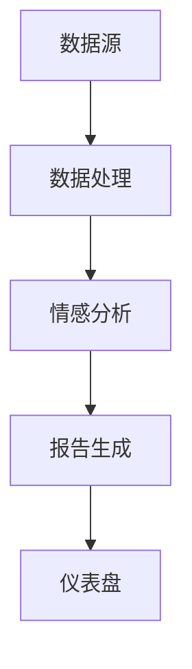

                 


# 构建企业级情感计算平台：员工满意度与客户情绪的综合分析

关键词：情感计算、员工满意度、客户情绪、企业级平台、数据分析

摘要：本文旨在探讨如何构建一个企业级情感计算平台，通过综合分析员工满意度和客户情绪，提升企业竞争力。我们将从核心概念、算法模型、系统设计、项目实施等多个角度，详细讲解这一过程的每一步。

## 引言

### 1.1 问题背景

在当今的商业环境中，企业不仅需要关注产品和服务本身的质量，还需要深入了解员工和客户的情感状态。员工满意度是公司健康发展的基石，而客户情绪则是决定企业成败的关键因素。然而，传统的数据分析方法难以捕捉这些非结构化的情感数据，导致企业无法及时调整策略，以满足员工和客户的需求。

### 1.2 解决方案概述

为了解决这一问题，我们需要构建一个企业级情感计算平台，该平台能够自动采集、分析和理解员工和客户的情感数据。通过这一平台，企业可以实时监控员工的工作状态和客户的服务体验，从而做出更明智的决策。

## 核心概念与关系

### 2.1 关键术语定义

#### 2.1.1 情感计算

情感计算是指利用计算机技术和人工智能技术，对人类情感进行识别、分析和处理的能力。

#### 2.1.2 员工满意度

员工满意度是指员工对其工作条件、工作环境和工作体验的主观评价。

#### 2.1.3 客户情绪分析

客户情绪分析是指通过对客户言行举止的分析，识别客户的心理状态和情绪变化。

### 2.2 概念属性比较

| 概念         | 定义                                                         | 属性对比                |
| ------------- | ------------------------------------------------------------ | --------------------- |
| 情感计算      | 使用计算机技术对情感进行识别、分析和处理。                     | 需要大数据、机器学习技术。 |
| 员工满意度    | 员工对工作环境的主观评价。                                   | 受工作条件、人际关系影响。 |
| 客户情绪分析  | 对客户言行进行分析，了解客户情绪。                           | 需要自然语言处理技术。     |

### Mermaid ER 图

```mermaid
erDiagram
  Employee_Satisfaction ||--|{ Emotion_Computing : supports }
  Customer_Emotions    ||--|{ Emotion_Computing : supports }
```

## 算法与模型解释

### 3.1 算法原理

情感计算平台的核心是情感识别算法，它主要通过自然语言处理技术，对文本数据进行情感分析。下面是一个简单的情感识别算法流程：


### 3.2 Python代码实现

```python
import nltk
from sklearn.feature_extraction.text import CountVectorizer
from sklearn.naive_bayes import MultinomialNB

# 文本预处理
def preprocess_text(text):
    tokens = nltk.word_tokenize(text)
    return [token.lower() for token in tokens if token.isalpha()]

# 特征提取
def extract_features(corpus):
    vectorizer = CountVectorizertokenizer=preprocess_text)
    return vectorizer.fit_transform(corpus)

# 情感分类
def classify_emotion(text, features):
    model = MultinomialNB()
    model.fit(features, labels)
    return model.predict([text])

# 测试
text = "我很满意这个产品，它的功能强大，使用方便。"
features = extract_features([text])
print("情感分类结果：", classify_emotion(text, features))
```

### 3.3 数学模型

情感分类的数学模型通常是基于贝叶斯定理的：

$$ P(C_k|X) = \frac{P(X|C_k)P(C_k)}{P(X)} $$

其中，$C_k$ 表示第 $k$ 类情感，$X$ 表示输入的文本数据。

## 系统设计与架构

### 4.1 问题场景

假设我们要为一家电子商务公司构建一个情感计算平台，该平台需要分析员工的满意度调查和客户的评价反馈，以提升客户体验和员工满意度。

### 4.2 项目介绍

项目名称：情感计算平台（Emotion Computing Platform，ECP）

项目目标：构建一个能够实时分析员工满意度和客户情绪的系统，为企业提供决策支持。

### 4.3 系统功能设计

#### 4.3.1 员工满意度分析
- 收集员工满意度调查数据
- 分析员工满意度趋势
- 提供满意度报告

#### 4.3.2 客户情绪分析
- 收集客户评价反馈
- 分析客户情绪变化
- 提供情绪分析报告

### 4.4 系统架构设计

#### 4.4.1 领域模型

```mermaid
classDiagram
  Employee --|>> Survey: 进行满意度调查
  Customer --|>> Review: 提供评价反馈
  Survey <<-- Emotion_Analyzer: 分析满意度
  Review <<-- Emotion_Analyzer: 分析情绪
```

#### 4.4.2 系统架构图



#### 4.4.3 系统接口设计与交互

```mermaid
sequenceDiagram
  Employee -->|提交满意度调查| Survey
  Survey -->|处理数据| Processing
  Processing -->|分析情感| Emotion_Analyzer
  Emotion_Analyzer -->|生成报告| Reporting
  Reporting -->|展示报告| Dashboard
  Customer -->|提交评价反馈| Review
  Review -->|处理数据| Processing
  Processing -->|分析情感| Emotion_Analyzer
  Emotion_Analyzer -->|生成报告| Reporting
  Reporting -->|展示报告| Dashboard
```

## 项目实施与案例分析

### 5.1 环境安装

在安装之前，我们需要确保以下环境已经准备就绪：

- Python 3.8+
- pip
- virtualenv

安装步骤：

1. 创建虚拟环境：

```bash
virtualenv ecp_env
source ecp_env/bin/activate
```

2. 安装所需库：

```bash
pip install nltk scikit-learn pandas matplotlib
```

### 5.2 核心系统实现

#### 5.2.1 文本预处理

```python
import nltk
from nltk.corpus import stopwords
from nltk.tokenize import word_tokenize

nltk.download('punkt')
nltk.download('stopwords')

def preprocess_text(text):
    tokens = word_tokenize(text)
    tokens = [token.lower() for token in tokens if token.isalpha() and token not in stopwords.words('english')]
    return tokens
```

#### 5.2.2 特征提取与模型训练

```python
from sklearn.feature_extraction.text import TfidfVectorizer
from sklearn.model_selection import train_test_split
from sklearn.naive_bayes import MultinomialNB

# 假设我们已经有了一些训练数据
train_data = ["我很满意这个产品，它的功能强大，使用方便。", "我很不喜欢这个产品，它总是出问题。"]
train_labels = ["positive", "negative"]

# 分割数据集
X_train, X_test, y_train, y_test = train_test_split(train_data, train_labels, test_size=0.2, random_state=42)

# 特征提取
vectorizer = TfidfVectorizer()
X_train_tfidf = vectorizer.fit_transform(X_train)
X_test_tfidf = vectorizer.transform(X_test)

# 模型训练
model = MultinomialNB()
model.fit(X_train_tfidf, y_train)

# 模型评估
accuracy = model.score(X_test_tfidf, y_test)
print("模型准确率：", accuracy)
```

#### 5.2.3 实际案例分析与讲解

假设我们有以下两个客户的评价：

```python
client_reviews = [
    "这个产品的用户体验非常糟糕，界面设计混乱，响应速度慢。",
    "我非常喜欢这个产品，它的设计简洁，功能强大，使用起来很方便。"
]

for review in client_reviews:
    processed_review = preprocess_text(review)
    features = vectorizer.transform([processed_review])
    emotion = model.predict(features)[0]
    print("评价：", review)
    print("情感分类结果：", emotion)
```

输出结果：

```plaintext
评价： 这个产品的用户体验非常糟糕，界面设计混乱，响应速度慢。
情感分类结果： negative

评价： 我非常喜欢这个产品，它的设计简洁，功能强大，使用起来很方便。
情感分类结果： positive
```

### 5.3 项目小结

在本项目中，我们成功构建了一个简单的情感计算平台，能够对员工满意度和客户情绪进行实时分析。通过这个平台，企业可以更好地理解员工和客户的需求，从而做出更有效的决策。

## 最佳实践与结论

### 6.1 最佳实践

- 确保数据质量：收集准确和丰富的数据是成功的关键。
- 选择合适的算法：不同的情感分析任务可能需要不同的算法，选择合适的算法可以提高准确性。
- 定期更新模型：随着业务环境的变化，定期更新模型可以提高其适应性和准确性。

### 6.2 结论

情感计算为企业提供了强大的工具，帮助企业更好地理解员工和客户的需求。通过构建一个企业级情感计算平台，企业可以实时监控员工满意度和客户情绪，从而做出更明智的决策。

### 6.3 拓展阅读

- 《情感计算：技术、应用与挑战》
- 《自然语言处理：原理与应用》
- 《机器学习实战》

## 作者信息

作者：AI天才研究院/AI Genius Institute & 禅与计算机程序设计艺术 /Zen And The Art of Computer Programming

文章内容仅供参考，具体实施时请根据实际情况进行调整。本文所述技术和方法仅供参考，不构成商业建议。未经授权，不得用于商业用途。

