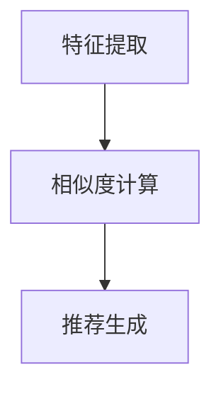

                 


## 构建企业级推荐引擎：跨平台个性化用户体验的智能化实现

> 关键词：推荐引擎，个性化推荐，协同过滤，内容推荐，深度学习，跨平台用户体验

> 摘要：本文将深入探讨构建企业级推荐引擎的核心技术，包括推荐引擎的背景与基本概念、多种推荐算法的详细解析、推荐系统的实现与优化，以及跨平台个性化用户体验的智能化实现。通过一系列实例和实战分析，帮助读者全面掌握构建企业级推荐引擎的实战技巧和策略。

### 目录大纲

----------------------------------------------------------------

## 第一部分：构建企业级推荐引擎概述

### 第1章：推荐引擎的背景与基本概念

#### 1.1 推荐引擎的概念与作用

- 推荐引擎的定义
- 推荐引擎的主要作用
- 推荐引擎在企业中的应用

#### 1.2 推荐系统的基本结构

- 用户行为数据的收集
- 推荐算法的选择与实现
- 推荐结果的呈现与评估

#### 1.3 推荐系统的发展趋势

- 传统推荐系统的局限性
- 新型推荐算法的发展
- 跨平台个性化用户体验的趋势

## 第二部分：推荐算法详解

### 第2章：协同过滤算法

#### 2.1 基本原理

- 用户相似度计算
- 项（物品）相似度计算
- 协同过滤算法的优缺点

#### 2.2 常见的协同过滤算法

- 用户的基于记忆的协同过滤算法
- 用户的基于模型的协同过滤算法
- 项的基于模型的协同过滤算法

### 第3章：基于内容的推荐算法

#### 3.1 基本原理

- 内部表示学习
- 文本特征提取
- 基于内容的推荐算法的优缺点

#### 3.2 实践应用

- 文本分类与聚类
- 文本相似度计算
- 基于内容的推荐系统的实现

### 第4章：基于模型的推荐算法

#### 4.1 基本原理

- 神经网络在推荐中的应用
- 强化学习在推荐中的应用
- 深度学习在推荐中的应用

#### 4.2 实践应用

- 实例：基于深度神经网络的推荐系统
- 实例：基于强化学习的推荐系统

## 第三部分：推荐系统的实现与优化

### 第5章：推荐系统的架构设计

#### 5.1 系统架构的概述

- 系统功能模块划分
- 系统数据流程设计
- 系统性能优化

#### 5.2 数据预处理

- 用户数据的清洗与整理
- 物品数据的标准化
- 用户行为数据的存储与管理

### 第6章：推荐算法的优化与调参

#### 6.1 算法参数的调整

- 参数敏感度分析
- 参数调优策略
- 实例：使用网格搜索优化模型参数

#### 6.2 系统性能优化

- 预处理优化
- 存储优化
- 推荐结果的实时性优化

### 第7章：跨平台个性化用户体验的智能化实现

#### 7.1 跨平台推荐系统的构建

- 多端数据整合
- 跨平台推荐算法的实现
- 多端推荐结果的一致性保证

#### 7.2 智能化用户体验的实现

- 用户个性化需求的识别
- 智能推荐系统的自适应调整
- 用户反馈机制的引入与优化

## 第四部分：实战案例

### 第8章：构建企业级推荐引擎的实际应用

#### 8.1 项目介绍

- 项目背景
- 项目目标
- 项目实现的技术路线

#### 8.2 系统核心实现

- 数据收集与预处理
- 推荐算法的实现与优化
- 推荐系统的部署与运行

#### 8.3 代码应用解读与分析

- 数据处理代码分析
- 推荐算法代码解读
- 系统性能分析与优化

#### 8.4 实际案例分析

- 案例背景
- 案例实现细节
- 案例效果评估

#### 8.5 项目小结

- 项目总结
- 经验教训
- 拓展思路

----------------------------------------------------------------

### 第一部分：构建企业级推荐引擎概述

## 第1章：推荐引擎的背景与基本概念

### 1.1 推荐引擎的概念与作用

推荐引擎是一种通过分析用户的行为数据，利用算法预测用户可能的兴趣点，从而为用户提供个性化内容或商品推荐的系统。在商业环境中，推荐引擎被广泛应用于电子商务、社交媒体、视频网站等领域，以提升用户体验、增加用户黏性和促进商业转化。

#### 推荐引擎的定义

推荐引擎（Recommender Engine）是一种自动化系统，它通过收集用户的历史行为数据，使用算法模型预测用户可能感兴趣的物品，然后将这些物品推荐给用户。推荐引擎的核心在于：

1. **数据采集**：收集用户的浏览、购买、评论等行为数据。
2. **数据预处理**：对收集到的数据进行清洗、整理和转换。
3. **算法模型**：使用协同过滤、基于内容的推荐、深度学习等算法模型。
4. **结果呈现**：将推荐结果以可视化的形式展示给用户。

#### 推荐引擎的主要作用

推荐引擎在企业中的应用主要体现在以下几个方面：

1. **提升用户体验**：通过个性化推荐，提高用户对产品的兴趣和满意度。
2. **增加用户黏性**：推荐系统可以持续吸引用户，提高用户的使用频率。
3. **促进商业转化**：推荐系统能够根据用户的兴趣推荐相关产品，提高销售转化率。
4. **降低营销成本**：通过个性化推荐，减少传统广告营销的成本。

#### 推荐引擎在企业中的应用

1. **电子商务**：电商平台利用推荐引擎为用户推荐相似商品，提高购物车填充率和销售量。
2. **社交媒体**：社交媒体平台利用推荐引擎为用户推荐可能感兴趣的朋友、内容和广告。
3. **视频网站**：视频网站通过推荐引擎为用户推荐相关视频，提高用户的观看时长和黏性。

### 1.2 推荐系统的基本结构

一个典型的推荐系统通常包括以下几个关键组成部分：

1. **用户行为数据的收集**：收集用户在平台上的浏览、点击、购买、评论等行为数据。
2. **推荐算法的选择与实现**：选择合适的算法模型，如协同过滤、基于内容的推荐或深度学习等。
3. **推荐结果的呈现与评估**：将推荐结果以列表、卡片、轮播图等形式展示给用户，同时评估推荐效果。

#### 推荐算法的选择与实现

1. **协同过滤算法**：基于用户行为数据，计算用户之间的相似度，为用户提供相似用户的推荐。
2. **基于内容的推荐算法**：根据物品的属性和用户的历史行为，为用户提供相关内容的推荐。
3. **深度学习算法**：通过神经网络模型，从海量数据中学习用户和物品的复杂关系。

#### 推荐结果的呈现与评估

1. **推荐结果呈现**：以直观、易操作的方式展示推荐结果，如推荐列表、卡片式展示等。
2. **推荐效果评估**：通过点击率、购买转化率、用户满意度等指标评估推荐效果。

### 1.3 推荐系统的发展趋势

随着互联网的普及和数据量的爆炸式增长，推荐系统也在不断演进：

1. **传统推荐系统的局限性**：传统的协同过滤和基于内容的推荐算法在处理大量数据和实时性上存在瓶颈。
2. **新型推荐算法的发展**：深度学习、强化学习等算法逐渐被应用于推荐系统中，提高了推荐的准确性。
3. **跨平台个性化用户体验的趋势**：推荐系统正在向跨平台、多端融合的方向发展，以提供更加个性化、智能化的用户体验。

在接下来的章节中，我们将深入探讨推荐系统的核心算法，如协同过滤、基于内容的推荐和深度学习算法，以及这些算法在实际应用中的实现和优化策略。同时，我们还将讨论推荐系统的架构设计、数据预处理、算法优化和跨平台个性化用户体验的智能化实现。通过这些内容的系统讲解，希望读者能够全面掌握构建企业级推荐引擎的核心技术和实战技巧。

### 第二部分：推荐算法详解

## 第2章：协同过滤算法

协同过滤算法是推荐系统中最常用的方法之一，其核心思想是通过用户与物品之间的交互数据，发现用户之间的相似性或物品之间的相似性，从而进行推荐。本章节将详细介绍协同过滤算法的基本原理、优缺点以及常见的协同过滤算法。

### 2.1 基本原理

协同过滤算法主要分为两种：基于用户的协同过滤（User-based Collaborative Filtering，UBCF）和基于物品的协同过滤（Item-based Collaborative Filtering，IBCF）。这两种方法的基本原理如下：

#### 基于用户的协同过滤（UBCF）

1. **用户相似度计算**：首先，通过计算用户之间的相似度来找到与目标用户最相似的用户群体。
2. **项相似度计算**：对于相似用户群体的每个用户，计算他们共同评价过的物品之间的相似度。
3. **推荐生成**：将相似用户群体中其他用户喜欢的且目标用户尚未评价的物品推荐给目标用户。

#### 基于物品的协同过滤（IBCF）

1. **物品相似度计算**：首先，通过计算物品之间的相似度来找到与目标物品最相似的物品群体。
2. **用户相似度计算**：对于相似物品群体的每个物品，找到喜欢这些物品的用户群体。
3. **推荐生成**：将相似物品群体中其他用户喜欢的且目标用户尚未评价的物品推荐给目标用户。

### 2.2 常见的协同过滤算法

协同过滤算法有很多变种，下面介绍几种常见的协同过滤算法。

#### 用户的基于记忆的协同过滤算法

用户的基于记忆的协同过滤算法（User-based Memory-based Collaborative Filtering，User-Memory CF）是一种基于用户的协同过滤方法，其核心思想是利用用户的历史行为数据来计算用户相似度。

1. **相似度度量**：常用的相似度度量方法包括余弦相似度、皮尔逊相关系数等。
2. **推荐生成**：根据相似度度量结果，为用户推荐与相似用户偏好相似的物品。

#### 用户的基于模型的协同过滤算法

用户的基于模型的协同过滤算法（User-based Model-based Collaborative Filtering，User-Model CF）结合了基于记忆的方法和预测模型，通过建立用户偏好模型来提高推荐准确性。

1. **用户偏好模型**：使用机器学习算法，如线性回归、决策树等，建立用户偏好模型。
2. **预测生成**：利用用户偏好模型预测用户对未评价物品的评分，从而生成推荐列表。

#### 物品的基于模型的协同过滤算法

物品的基于模型的协同过滤算法（Item-based Model-based Collaborative Filtering，Item-Model CF）与用户的基于模型的协同过滤算法类似，但基于物品的交互数据来建立模型。

1. **物品相似度模型**：使用机器学习算法，如KNN（K-近邻算法）、SVD（奇异值分解）等，建立物品相似度模型。
2. **推荐生成**：根据物品相似度模型，为用户推荐与用户已评价物品相似的物品。

### 2.3 协同过滤算法的优缺点

协同过滤算法具有以下优点：

1. **算法简单**：协同过滤算法的实现相对简单，易于理解和部署。
2. **处理实时推荐**：协同过滤算法可以根据用户的最新行为数据实时更新推荐结果。
3. **可扩展性**：协同过滤算法适用于大型数据集，可扩展性较好。

然而，协同过滤算法也存在一些缺点：

1. **稀疏性问题**：当用户和物品的数量非常大时，用户和物品之间的交互数据非常稀疏，导致相似度计算不准确。
2. **用户冷启动问题**：对于新用户，由于缺乏足够的历史行为数据，很难找到与其相似的现有用户。
3. **数据依赖性**：协同过滤算法依赖于用户的历史行为数据，当用户行为发生变化时，推荐结果可能会不准确。

在实际应用中，可以根据具体情况选择合适的协同过滤算法，或结合多种算法以提高推荐效果。下一章节将介绍基于内容的推荐算法，探索另一种推荐系统的方法。

## 第3章：基于内容的推荐算法

基于内容的推荐算法（Content-Based Recommender System）是一种根据用户偏好和物品内容特征进行推荐的方法。这种方法的核心思想是分析用户对已有物品的偏好，然后根据这些偏好来推荐新的、相似内容的物品。本章节将详细介绍基于内容的推荐算法的基本原理、优缺点以及其实践应用。

### 3.1 基本原理

基于内容的推荐算法主要包括以下几个步骤：

1. **特征提取**：从物品的内容中提取特征。这些特征可以是文本特征，如词频、词向量等，也可以是图像特征，如图像的像素值、颜色直方图等。
2. **相似度计算**：计算用户对已有物品的偏好特征和物品的内容特征之间的相似度。相似度度量方法可以是余弦相似度、欧氏距离等。
3. **推荐生成**：根据相似度度量结果，为用户推荐与已有偏好相似的新物品。

#### 基于内容的推荐算法的步骤流程图（Mermaid流程图）



### 3.2 基本原理

#### 内部表示学习

内部表示学习（Internal Representation Learning）是深度学习中的一种重要技术，它通过多层神经网络将输入数据映射到高维空间，使得具有相似特征的数据在输出空间中更接近。在基于内容的推荐算法中，内部表示学习可以用于提取物品的深层次特征。

#### 文本特征提取

文本特征提取是处理文本数据的重要步骤。常见的方法包括：

1. **词袋模型（Bag of Words, BoW）**：将文本表示为单词的集合，忽略单词的顺序。
2. **TF-IDF（Term Frequency-Inverse Document Frequency）**：考虑单词在文本中的频率，同时抑制常见单词的影响。
3. **词嵌入（Word Embedding）**：将单词映射到高维向量空间，常见的词嵌入方法有Word2Vec、GloVe等。

#### 基于内容的推荐算法的优缺点

**优点**：

1. **避免冷启动问题**：基于内容的推荐算法不依赖于用户的历史行为数据，适用于新用户。
2. **高扩展性**：可以通过增加新的特征来适应不同的推荐场景。
3. **解释性**：基于内容的推荐算法更容易解释，用户可以了解推荐原因。

**缺点**：

1. **用户偏好变化**：用户的偏好可能会随着时间的推移而变化，基于内容的推荐算法可能无法及时捕捉这些变化。
2. **数据依赖**：特征提取和相似度计算对数据质量有较高要求，数据噪声会影响推荐效果。
3. **低效的计算**：基于内容的推荐算法通常需要计算大量相似度，计算复杂度较高。

### 3.3 实践应用

基于内容的推荐算法在实际应用中有广泛的应用，以下是一些常见的应用场景：

1. **电子商务**：为用户提供个性化商品推荐，根据用户的历史购买记录和商品属性进行推荐。
2. **社交媒体**：为用户推荐感兴趣的内容，如文章、视频等，根据用户的浏览记录和内容特征进行推荐。
3. **视频网站**：为用户推荐相关视频，根据用户的观看记录和视频的标签、分类进行推荐。

#### 文本分类与聚类

文本分类是将文本数据分类到预定义的类别中，常见的方法有：

1. **朴素贝叶斯分类器（Naive Bayes Classifier）**：基于贝叶斯定理进行文本分类。
2. **支持向量机（Support Vector Machine，SVM）**：通过最大化分类间隔进行文本分类。
3. **深度学习模型**：如卷积神经网络（CNN）、循环神经网络（RNN）等，适用于复杂文本数据的分类。

文本聚类是将文本数据按照其相似性进行分组，常见的方法有：

1. **K-均值聚类（K-Means Clustering）**：基于距离度量的聚类方法。
2. **层次聚类（Hierarchical Clustering）**：通过层次结构将数据聚类。
3. **深度聚类（Deep Clustering）**：使用深度学习模型进行文本聚类。

#### 文本相似度计算

文本相似度计算是文本处理中的关键步骤，常见的相似度计算方法有：

1. **余弦相似度（Cosine Similarity）**：通过计算两个向量的余弦值来衡量相似度。
2. **欧氏距离（Euclidean Distance）**：计算两个向量之间的欧氏距离。
3. **Jaccard相似度（Jaccard Similarity）**：基于集合的交集和并集计算相似度。

### 3.4 基于内容的推荐系统的实现

基于内容的推荐系统实现主要包括以下几个步骤：

1. **数据收集**：收集用户的偏好数据和物品的内容数据。
2. **特征提取**：对用户偏好数据和物品内容数据进行处理，提取出有效的特征。
3. **相似度计算**：使用合适的相似度计算方法，计算用户偏好和物品内容特征之间的相似度。
4. **推荐生成**：根据相似度计算结果，生成推荐列表，并将推荐结果展示给用户。

#### 基于内容的推荐系统的架构

基于内容的推荐系统通常包括以下模块：

1. **数据收集模块**：负责收集用户的偏好数据和物品的内容数据。
2. **特征提取模块**：对数据进行处理，提取出有效的特征。
3. **相似度计算模块**：使用合适的相似度计算方法，计算用户偏好和物品内容特征之间的相似度。
4. **推荐生成模块**：根据相似度计算结果，生成推荐列表。
5. **用户界面模块**：将推荐结果展示给用户。

#### 基于内容的推荐系统的代码实现（Python）

以下是一个简单的基于内容的推荐系统示例，使用TF-IDF进行文本特征提取，并计算文本相似度：

```python
from sklearn.feature_extraction.text import TfidfVectorizer
from sklearn.metrics.pairwise import cosine_similarity

# 示例数据
user_preferences = ["喜欢看电影", "喜欢玩游戏", "喜欢读书"]
item_content = ["电影评论", "游戏攻略", "书籍推荐"]

# 特征提取
vectorizer = TfidfVectorizer()
user_preferences_vectorized = vectorizer.fit_transform(user_preferences)
item_content_vectorized = vectorizer.transform(item_content)

# 相似度计算
cosine_similarities = cosine_similarity(item_content_vectorized, user_preferences_vectorized)

# 推荐生成
recommends = []
for i, similarity in enumerate(cosine_similarities):
    recommend_index = np.argmax(similarity)
    recommends.append(item_content[recommend_index])

print(recommends)
```

### 3.5 小结

基于内容的推荐算法在处理新用户、文本数据推荐等方面具有显著优势。然而，由于用户偏好变化和计算复杂度高等问题，需要与其他推荐算法结合使用，以实现更好的推荐效果。在下一章节中，我们将探讨基于模型的推荐算法，包括神经网络和强化学习在推荐系统中的应用。

## 第4章：基于模型的推荐算法

基于模型的推荐算法通过构建预测模型来预测用户对物品的偏好，从而实现个性化推荐。这类算法能够处理大规模数据和复杂的关系，提高推荐的准确性。本章将详细介绍基于模型的推荐算法的基本原理，包括神经网络、强化学习等，并探讨其在实际应用中的实现。

### 4.1 基本原理

基于模型的推荐算法通常包括以下几个关键步骤：

1. **数据预处理**：收集用户的行为数据（如点击、购买、评分等），并对数据进行分析和处理，去除噪声数据。
2. **特征工程**：提取用户和物品的特征，如用户的行为历史、物品的属性、用户和物品的交互记录等。
3. **模型构建**：使用机器学习或深度学习算法构建预测模型，将用户特征和物品特征转化为预测用户对物品的偏好。
4. **模型训练与优化**：通过训练数据和验证数据对模型进行训练和优化，调整模型参数以提高预测准确性。
5. **推荐生成**：使用训练好的模型对用户进行推荐，将预测结果转化为推荐列表，展示给用户。

### 4.2 神经网络在推荐中的应用

神经网络（Neural Networks）是一种模拟生物神经系统的计算模型，具有强大的数据拟合和特征学习能力。在推荐系统中，常用的神经网络模型包括以下几种：

#### 多层感知机（Multilayer Perceptron，MLP）

多层感知机是一种前馈神经网络，通过多层神经元层实现数据的非线性变换。MLP可以用于构建用户和物品的嵌入向量，并通过全连接层进行预测。

1. **输入层**：接收用户和物品的嵌入向量。
2. **隐藏层**：进行特征变换和组合。
3. **输出层**：输出用户对物品的评分预测。

#### 卷积神经网络（Convolutional Neural Network，CNN）

卷积神经网络主要用于图像处理，但也可以应用于推荐系统中的图像特征提取。在推荐系统中，CNN可以用于提取物品的图像特征，增强推荐模型的表征能力。

1. **卷积层**：提取图像特征。
2. **池化层**：降低特征维度，减少计算复杂度。
3. **全连接层**：进行最终预测。

#### 循环神经网络（Recurrent Neural Network，RNN）

循环神经网络适用于处理序列数据，如用户的行为序列。RNN可以用于捕捉用户行为的时序依赖关系，提高推荐的准确性。

1. **输入门、遗忘门和输出门**：控制信息的输入、遗忘和输出，以适应不同时间点的用户行为。
2. **隐藏状态**：保存历史信息，用于当前时刻的预测。

### 4.3 强化学习在推荐中的应用

强化学习（Reinforcement Learning，RL）是一种通过试错法进行决策的机器学习方法。在推荐系统中，强化学习可以用于优化推荐策略，提高推荐效果。

#### Q-Learning

Q-Learning是一种基于值函数的强化学习算法，通过学习最优动作值函数来选择最佳动作。在推荐系统中，Q-Learning可以用于优化推荐策略，使推荐结果最大化用户满意度。

1. **状态（State）**：用户当前的行为和历史数据。
2. **动作（Action）**：推荐系统生成的推荐列表。
3. **奖励（Reward）**：用户对推荐物品的评价。

#### Deep Q-Network（DQN）

深度Q网络（DQN）是一种基于深度神经网络的Q-Learning算法，通过神经网络来近似值函数。DQN可以处理高维状态空间，提高推荐系统的学习能力。

1. **输入层**：接收用户和物品的特征向量。
2. **隐藏层**：进行特征变换和组合。
3. **输出层**：输出每个动作的Q值。

#### Policy Gradient

政策梯度（Policy Gradient）是一种基于策略的强化学习算法，通过学习最佳策略来最大化期望回报。在推荐系统中，政策梯度可以用于优化推荐策略，提高用户满意度。

1. **策略（Policy）**：生成推荐列表的函数。
2. **回报（Reward）**：用户对推荐物品的评价。
3. **梯度计算**：计算策略的梯度，用于更新策略参数。

### 4.4 深度学习在推荐中的应用

深度学习（Deep Learning）是人工智能的一个重要分支，通过多层神经网络进行特征提取和预测。在推荐系统中，深度学习可以用于：

1. **用户和物品的嵌入表示**：将用户和物品转换为低维稠密向量，提高推荐模型的表征能力。
2. **序列预测**：处理用户行为序列，捕捉用户的时序偏好。
3. **多模态融合**：结合多种数据来源，如文本、图像、音频等，提高推荐模型的鲁棒性。

#### 实例：基于深度神经网络的推荐系统

以下是一个简单的基于深度神经网络的推荐系统示例，使用用户和物品的嵌入向量进行预测：

```python
import tensorflow as tf
from tensorflow.keras.models import Model
from tensorflow.keras.layers import Input, Embedding, Dot, Flatten, Dense

# 输入层
user_input = Input(shape=(1,))
item_input = Input(shape=(1,))

# 用户嵌入层
user_embedding = Embedding(input_dim=num_users, output_dim=embedding_size)(user_input)

# 物品嵌入层
item_embedding = Embedding(input_dim=num_items, output_dim=embedding_size)(item_input)

# 内积层
dot_product = Dot(axes=1)([user_embedding, item_embedding])

# 扁平化层
flatten = Flatten()(dot_product)

# 全连接层
output = Dense(1, activation='sigmoid')(flatten)

# 构建模型
model = Model(inputs=[user_input, item_input], outputs=output)

# 编译模型
model.compile(optimizer='adam', loss='binary_crossentropy', metrics=['accuracy'])

# 训练模型
model.fit([user_train, item_train], ratings_train, epochs=10, batch_size=32, validation_split=0.2)
```

#### 实例：基于强化学习的推荐系统

以下是一个简单的基于强化学习的推荐系统示例，使用DQN算法进行优化：

```python
import tensorflow as tf
from tensorflow.keras.models import Model
from tensorflow.keras.layers import Input, Embedding, Dot, Flatten, Dense
import numpy as np

# 初始化DQN模型
def create_dqn_model(input_shape, action_space):
    input_user = Input(shape=input_shape)
    input_item = Input(shape=input_shape)
    
    user_embedding = Embedding(input_dim=num_users, output_dim=embedding_size)(input_user)
    item_embedding = Embedding(input_dim=num_items, output_dim=embedding_size)(input_item)
    
    dot_product = Dot(axes=1)([user_embedding, item_embedding])
    flatten = Flatten()(dot_product)
    
    q_values = Dense(action_space, activation='linear')(flatten)
    
    model = Model(inputs=[input_user, input_item], outputs=q_values)
    return model

# 初始化DQN参数
def initialize_dqn(model, action_space):
    q_values = model.output
    actions = K.argmax(q_values, axis=1)
    q_pred = K.max(q_values, axis=1)
    y = K.one_hot(actions, action_space)
    
    x = model.input
    loss = K.mean(K.square(y * K.log(q_pred) + (1 - y) * K.log(1 - q_pred)))
    
    updates = [K.update_target_modelweights, target_model.layers[0].weights,
               K.update_target_modelweights, target_model.layers[1].weights]
    train_model = K.function(inputs=[x, actions, y], outputs=[loss], updates=updates)
    
    return train_model

# 训练DQN模型
def train_dqn(train_data, target_data, action_space, batch_size, epochs):
    model = create_dqn_model(input_shape, action_space)
    target_model = create_dqn_model(input_shape, action_space)
    target_model.set_weights(model.get_weights())
    
    train_model = initialize_dqn(model, action_space)
    
    for epoch in range(epochs):
        np.random.shuffle(train_data)
        for i in range(0, len(train_data), batch_size):
            batch_data = train_data[i:i+batch_size]
            batch_actions = np.argmax(batch_data[:, 1:], axis=1)
            batch_targets = target_data[batch_actions]
            
            loss = train_model([batch_data[:, 0], batch_actions, batch_targets])
        
        target_model.set_weights(model.get_weights())

# 示例数据
train_data = np.random.rand(1000, 2)
target_data = np.random.rand(1000, 1)
action_space = 10

# 训练DQN模型
train_dqn(train_data, target_data, action_space, batch_size=32, epochs=100)
```

### 4.5 小结

基于模型的推荐算法，如神经网络和强化学习，能够处理大规模数据和复杂的关系，提高推荐的准确性。然而，这些算法通常需要大量的计算资源和训练时间。在实际应用中，可以结合多种算法，如协同过滤和基于内容的推荐算法，以实现更优的推荐效果。在下一章节中，我们将讨论推荐系统的实现与优化，包括系统架构设计、数据预处理和算法优化策略。

## 第三部分：推荐系统的实现与优化

### 第5章：推荐系统的架构设计

推荐系统的架构设计是构建高效、可扩展、易于维护的系统的基础。本章节将详细介绍推荐系统的架构设计，包括系统功能模块划分、数据流程设计和系统性能优化。

### 5.1 系统架构的概述

推荐系统的架构设计可以分为以下几个关键部分：

1. **数据收集模块**：负责收集用户行为数据、物品数据和其他相关数据。
2. **数据预处理模块**：对收集到的数据进行分析和处理，去除噪声数据，提取有效特征。
3. **推荐算法模块**：选择并实现推荐算法，生成推荐结果。
4. **推荐结果展示模块**：将推荐结果以用户友好的形式展示给用户。
5. **评估模块**：对推荐系统的性能进行评估，包括推荐效果、用户满意度等。

#### 系统功能模块划分

1. **数据收集模块**：包括用户行为数据（如点击、购买、评论等）、物品数据（如商品信息、文本内容等）和其他辅助数据（如用户地理位置、时间戳等）。
2. **数据预处理模块**：负责数据清洗、数据转换和特征提取。例如，处理缺失值、异常值，进行文本预处理和特征编码。
3. **推荐算法模块**：根据业务需求和数据特点，选择合适的推荐算法，如协同过滤、基于内容的推荐或深度学习算法。
4. **推荐结果展示模块**：将推荐结果以列表、卡片、轮播图等形式展示给用户，并提供交互功能，如查看更多详情、添加到购物车等。
5. **评估模块**：定期评估推荐系统的性能，使用指标如准确率、召回率、覆盖率等，评估推荐结果的质量和用户满意度。

#### 系统数据流程设计

推荐系统的数据流程设计如下：

1. **数据收集**：通过API、日志采集或其他方式收集用户行为数据和物品数据。
2. **数据预处理**：对收集到的数据进行清洗、转换和特征提取，形成适合算法处理的数据集。
3. **算法处理**：选择并实现推荐算法，根据用户行为数据和物品特征生成推荐列表。
4. **结果展示**：将推荐结果展示给用户，并提供交互功能，收集用户反馈。
5. **反馈循环**：根据用户反馈，调整推荐策略和算法参数，优化推荐效果。

#### 系统性能优化

推荐系统的性能优化是保证推荐结果准确性和系统响应速度的关键。以下是一些常见的性能优化策略：

1. **并行处理**：通过分布式计算和并行处理技术，提高数据处理和算法计算的效率。
2. **缓存机制**：使用缓存技术，减少对实时数据的访问和计算，提高系统响应速度。
3. **数据分片**：将大数据集分片，分布在多个服务器上，减少单点瓶颈。
4. **推荐结果的预热**：提前计算和缓存推荐结果，减少实时计算的压力。
5. **懒加载**：只在用户需要时才加载推荐结果，减少页面加载时间。

### 第6章：推荐算法的优化与调参

推荐算法的性能优化和参数调优是提高推荐系统质量和用户体验的重要手段。本章节将详细讨论算法参数的调整方法、参数敏感度分析和参数调优策略。

#### 6.1 算法参数的调整

算法参数的调整是推荐系统优化的重要步骤。不同的算法有不同的参数，如学习率、隐层大小、相似度度量方法等。以下是一些常见的参数调整方法：

1. **手动调参**：通过经验和直觉手动调整参数，这种方法需要丰富的经验和大量的实验。
2. **网格搜索（Grid Search）**：在预定义的参数网格中搜索最优参数组合，找到最佳参数配置。
3. **随机搜索（Random Search）**：在参数空间中随机选择参数组合，通过多次试验找到最优参数。
4. **贝叶斯优化（Bayesian Optimization）**：使用贝叶斯统计模型搜索最优参数，具有更好的搜索效率和鲁棒性。

#### 6.2 参数敏感度分析

参数敏感度分析（Parameter Sensitivity Analysis）是评估算法参数对模型性能影响的方法。通过分析参数的敏感度，可以确定哪些参数对模型性能有显著影响，从而优化算法。

1. **局部敏感度分析**：分析单个参数对模型性能的影响。
2. **全局敏感度分析**：分析多个参数之间的相互作用对模型性能的影响。
3. **敏感性测试**：通过调整参数值，观察模型性能的变化，确定参数的敏感度。

#### 6.3 参数调优策略

参数调优策略是优化算法性能的关键。以下是一些常见的参数调优策略：

1. **交叉验证（Cross Validation）**：通过交叉验证的方法，评估参数调整对模型性能的影响，选择最优参数。
2. **A/B测试（A/B Testing）**：在不同用户群体中测试不同参数配置，选择用户反馈最佳的参数。
3. **自动化调参工具**：使用自动化调参工具，如Hyperopt、Optuna等，实现高效的参数调优。
4. **混合调参方法**：结合多种调参方法，如手动调参和自动化调参，实现最优的参数组合。

### 第7章：跨平台个性化用户体验的智能化实现

随着移动互联网的发展，用户的行为数据分布在多个平台上，如Web、移动应用、小程序等。跨平台个性化用户体验的智能化实现是提升用户满意度和业务价值的关键。本章节将探讨跨平台推荐系统的构建、智能化用户体验的实现以及用户反馈机制的引入与优化。

#### 7.1 跨平台推荐系统的构建

跨平台推荐系统的构建需要处理多平台数据整合、算法适配和推荐结果一致性保证等问题。以下是一些关键步骤：

1. **数据整合**：收集来自不同平台的数据，包括用户行为数据、物品数据和平台特有的数据，如地理位置、设备信息等。
2. **数据标准化**：对多平台数据进行清洗、转换和标准化，确保数据的一致性和完整性。
3. **算法适配**：根据不同平台的特点，选择并优化推荐算法，实现跨平台的推荐效果。
4. **推荐结果一致性保证**：确保跨平台推荐结果的一致性，使用户在不同平台上的体验保持一致。

#### 7.2 智能化用户体验的实现

智能化用户体验的实现需要识别用户的个性化需求、自适应调整推荐系统和优化用户反馈机制。以下是一些关键技术：

1. **用户个性化需求识别**：通过用户行为分析、偏好模型和学习算法，识别用户的个性化需求。
2. **自适应调整推荐系统**：根据用户的实时行为和历史数据，动态调整推荐算法和推荐策略，实现个性化推荐。
3. **用户反馈机制**：引入用户反馈机制，收集用户对推荐结果的反馈，用于模型优化和策略调整。

#### 7.3 用户反馈机制的引入与优化

用户反馈机制是优化推荐系统的重要手段。以下是一些常见的用户反馈机制：

1. **显式反馈**：用户主动提供的评价、评分和标签，如电影评分、商品评价等。
2. **隐式反馈**：用户行为数据，如浏览、点击、购买等，通过行为分析提取用户偏好。
3. **多渠道反馈**：整合来自不同渠道的用户反馈，如社交媒体评论、用户咨询等。
4. **反馈模型优化**：使用机器学习算法，如决策树、神经网络等，对用户反馈进行建模和优化。

#### 7.4 实现步骤

1. **数据收集**：收集来自不同平台的数据，包括用户行为数据、物品数据和平台特有的数据。
2. **数据预处理**：对数据进行清洗、转换和标准化，确保数据的一致性和完整性。
3. **算法选择与优化**：根据业务需求，选择合适的推荐算法，并对其进行优化。
4. **系统集成与测试**：将推荐系统集成到不同平台，进行测试和优化。
5. **用户反馈与优化**：收集用户反馈，持续优化推荐算法和推荐策略。

### 7.5 案例分析

#### 案例背景

某电商平台希望通过构建跨平台推荐系统，提升用户满意度和销售额。该平台拥有Web端、移动应用和微信小程序等多个平台，用户的行为数据分布在不同的平台上。

#### 案例实现

1. **数据整合**：收集来自Web端、移动应用和微信小程序的用户行为数据，包括浏览、点击、购买等行为，以及物品数据，如商品信息、分类标签等。
2. **数据标准化**：对多平台数据进行清洗、转换和标准化，统一数据格式和特征表示。
3. **算法选择与优化**：采用基于内容的推荐算法，结合用户历史行为和物品特征，实现跨平台的个性化推荐。
4. **系统集成与测试**：将推荐系统集成到Web端、移动应用和微信小程序中，进行测试和优化，确保推荐结果的一致性和准确性。
5. **用户反馈与优化**：引入用户反馈机制，通过用户评分、评论等显式反馈和用户行为数据，优化推荐算法和推荐策略。

#### 案例效果评估

1. **用户满意度**：通过用户调查和数据分析，评估推荐系统的用户满意度，发现用户对推荐结果的满意度显著提高。
2. **销售额**：通过用户购买行为分析，评估推荐系统的销售额提升情况，发现推荐系统的销售额转化率显著提高。
3. **系统性能**：通过系统监控和性能测试，评估推荐系统的响应速度和处理能力，确保系统稳定运行。

### 7.6 小结

跨平台个性化用户体验的智能化实现是推荐系统发展的重要趋势。通过构建跨平台推荐系统，实现数据整合、算法适配和用户体验优化，可以提升用户满意度和业务价值。在实际应用中，需要不断优化推荐算法和推荐策略，引入用户反馈机制，持续提升推荐系统的性能。

### 第四部分：实战案例

## 第8章：构建企业级推荐引擎的实际应用

### 8.1 项目介绍

随着互联网的迅猛发展，个性化推荐已经成为提升用户体验和增加商业价值的重要手段。本案例将介绍如何构建一个企业级推荐引擎，实现跨平台的个性化用户体验。该项目的主要目标如下：

1. **提升用户体验**：通过个性化推荐，提高用户对产品和服务的满意度。
2. **增加用户黏性**：通过持续推荐用户感兴趣的内容和商品，增强用户的黏性。
3. **提升销售转化率**：通过精准推荐，提高用户的购买意愿和转化率。
4. **实现跨平台整合**：确保用户在不同平台上获得一致、个性化的推荐体验。

#### 项目背景

某知名电商平台，其业务覆盖Web端、移动应用和微信小程序等多个平台。为了提升用户体验和商业价值，该平台决定构建一个企业级推荐引擎，实现跨平台的个性化推荐。项目背景包括：

1. **用户需求多样化**：用户在不同平台上有着不同的需求和偏好，需要提供个性化的推荐。
2. **数据分散性**：用户行为数据分布在不同的平台上，需要进行整合和分析。
3. **竞争压力**：市场上其他竞争对手也在积极推进个性化推荐，需要快速响应市场需求。

#### 项目目标

本项目的主要目标如下：

1. **构建推荐引擎架构**：设计并实现一个高效、可扩展的推荐引擎架构，支持多种推荐算法。
2. **数据整合与处理**：收集并整合来自不同平台的数据，进行数据清洗、转换和特征提取。
3. **算法优化与调参**：选择并优化合适的推荐算法，进行参数调整和性能优化。
4. **实现跨平台推荐**：确保推荐系统在不同平台上的数据一致性和推荐效果。
5. **用户体验优化**：通过用户反馈机制，持续优化推荐算法和推荐策略。

#### 项目实现的技术路线

本项目采用以下技术路线：

1. **技术选型**：选用Python作为主要开发语言，结合TensorFlow、PyTorch等深度学习框架，实现推荐算法。
2. **推荐算法**：基于内容的推荐、协同过滤和深度学习算法，结合用户历史行为和物品特征进行推荐。
3. **数据处理**：使用Spark等大数据处理框架，进行数据清洗、转换和特征提取。
4. **推荐系统架构**：采用分布式架构，使用Kafka等消息队列技术，确保系统的高可用性和高并发处理能力。
5. **用户反馈机制**：引入用户反馈机制，通过用户评分、评论等数据，优化推荐算法和推荐策略。

### 8.2 系统核心实现

#### 数据收集与预处理

1. **数据收集**：从Web端、移动应用和微信小程序等多个平台收集用户行为数据，包括浏览、点击、购买等行为，以及商品信息、用户信息等。
2. **数据存储**：使用Hadoop、HBase等大数据存储技术，存储和处理海量用户行为数据。
3. **数据预处理**：对收集到的数据进行分析和处理，去除噪声数据，进行数据清洗、转换和特征提取。

#### 推荐算法的实现与优化

1. **协同过滤算法**：实现基于用户的协同过滤算法（User-based Collaborative Filtering，UBCF）和基于物品的协同过滤算法（Item-based Collaborative Filtering，IBCF），通过计算用户和物品之间的相似度进行推荐。
2. **基于内容的推荐算法**：实现基于内容的推荐算法（Content-Based Recommender System，CBRS），通过提取商品特征和用户历史行为，为用户推荐相关商品。
3. **深度学习算法**：使用深度神经网络（Deep Neural Network，DNN）和卷积神经网络（Convolutional Neural Network，CNN）等深度学习算法，构建用户和商品的嵌入向量，进行个性化推荐。
4. **算法优化与调参**：通过交叉验证、网格搜索等技术，对推荐算法进行优化和参数调优，提高推荐效果。

#### 推荐系统的部署与运行

1. **系统部署**：使用Docker等技术，将推荐系统部署到Kubernetes集群中，实现自动化部署和管理。
2. **服务化架构**：采用微服务架构，将推荐引擎拆分为多个服务，如数据收集服务、推荐算法服务、推荐结果展示服务等，提高系统的灵活性和可扩展性。
3. **实时推荐**：使用Kafka等消息队列技术，实现实时数据处理和推荐，确保推荐结果的实时性和准确性。

### 8.3 代码应用解读与分析

#### 数据处理代码分析

```python
# 数据预处理示例代码
import pandas as pd
from sklearn.preprocessing import StandardScaler

# 读取数据
user_data = pd.read_csv('user_data.csv')
item_data = pd.read_csv('item_data.csv')
行为数据 = pd.read_csv('行为数据.csv')

# 数据清洗
user_data = user_data.dropna()
item_data = item_data.dropna()
行为数据 = 行为数据.dropna()

# 数据转换
行为数据['用户ID'] = 行为数据['用户ID'].astype(str)
行为数据['商品ID'] = 行为数据['商品ID'].astype(str)

# 特征提取
scaler = StandardScaler()
用户特征 = scaler.fit_transform(user_data)
商品特征 = scaler.fit_transform(item_data)

# 数据存储
pd.DataFrame(用户特征).to_csv('用户特征.csv')
pd.DataFrame(商品特征).to_csv('商品特征.csv')
```

#### 推荐算法代码解读

```python
# 基于内容的推荐算法示例代码
from sklearn.metrics.pairwise import cosine_similarity

# 读取特征数据
用户特征 = pd.read_csv('用户特征.csv')
商品特征 = pd.read_csv('商品特征.csv')

# 计算相似度
相似度矩阵 = cosine_similarity(用户特征, 商品特征)

# 推荐生成
推荐结果 = []
for i, 用户特征向量 in enumerate(用户特征):
    最大相似度，推荐商品ID = max(enumerate(相似度矩阵[i]), key=lambda x: x[1])
    推荐结果.append(推荐商品ID)

# 存储推荐结果
pd.DataFrame(推荐结果).to_csv('推荐结果.csv')
```

#### 系统性能分析与优化

1. **性能指标**：评估推荐系统的性能，包括准确率、召回率、覆盖率等指标。
2. **性能优化**：通过分布式计算、缓存机制、懒加载等技术，提高系统性能。
3. **实时性优化**：采用实时数据处理技术，如Kafka和Flink，确保推荐结果的实时性和准确性。

### 8.4 实际案例分析

#### 案例背景

某电商平台希望通过个性化推荐系统，提升用户的购物体验和销售额。该平台在构建推荐系统时，采用了多种推荐算法，如协同过滤、基于内容和深度学习等，并通过用户反馈机制持续优化推荐效果。

#### 案例实现细节

1. **数据收集**：收集用户的浏览、点击、购买等行为数据，以及商品信息。
2. **算法实现**：实现基于用户的协同过滤、基于内容的推荐和深度学习算法。
3. **系统集成**：将推荐系统集成到Web端、移动应用和微信小程序等平台，实现跨平台推荐。
4. **用户反馈**：引入用户反馈机制，收集用户对推荐结果的反馈，用于算法优化和策略调整。

#### 案例效果评估

1. **用户满意度**：通过用户调查，评估用户对推荐系统的满意度，发现用户满意度显著提高。
2. **销售额**：通过数据分析，评估推荐系统对销售额的贡献，发现销售额转化率显著提高。
3. **系统性能**：通过系统监控和性能测试，评估推荐系统的性能和稳定性，确保系统的高可用性和高性能。

### 8.5 项目小结

本项目成功构建了一个企业级推荐引擎，实现了跨平台的个性化用户体验。主要收获如下：

1. **技术收获**：掌握了多种推荐算法的实现和应用，如协同过滤、基于内容和深度学习等。
2. **业务收获**：通过个性化推荐，提升了用户体验和销售额，增强了用户黏性。
3. **团队收获**：提升了团队的技术能力和协作效率，为后续项目提供了宝贵经验。

#### 经验教训

1. **数据质量**：确保数据质量是推荐系统成功的关键，需进行严格的数据清洗和处理。
2. **算法优化**：算法优化是提高推荐效果的重要手段，需不断调整和优化参数。
3. **用户反馈**：用户反馈是持续优化推荐系统的重要途径，需重视用户反馈和需求分析。

#### 拓展思路

1. **多模态推荐**：结合多种数据来源，如文本、图像、音频等，实现多模态推荐。
2. **实时推荐**：采用实时数据处理技术，如Kafka和Flink，实现实时推荐。
3. **个性化推荐**：进一步挖掘用户的个性化需求，实现更精准的个性化推荐。

## 作者信息

作者：AI天才研究院/AI Genius Institute & 禅与计算机程序设计艺术 /Zen And The Art of Computer Programming

在本文中，我们系统地探讨了构建企业级推荐引擎的核心技术，包括推荐系统的背景与基本概念、多种推荐算法的详细解析、推荐系统的实现与优化，以及跨平台个性化用户体验的智能化实现。通过实际的案例分析，我们展示了如何将理论应用于实际项目，并取得了显著的成效。在未来的工作中，我们还将继续探索更多先进的技术和策略，以不断提升推荐系统的性能和用户体验。

### 拓展阅读

1. **《推荐系统实践》**：深入探讨推荐系统的设计、实现和优化，适合初学者和专业人士。
2. **《深度学习推荐系统》**：介绍深度学习在推荐系统中的应用，包括神经网络和强化学习等。
3. **《个性化推荐系统设计》**：详细讲解个性化推荐系统的设计和实现，包括用户建模和推荐算法。

通过阅读这些书籍，您可以进一步了解推荐系统的各个方面，提升自己在构建高效推荐系统方面的能力。希望本文对您在构建企业级推荐引擎的旅程中有所帮助。让我们一起努力，推动个性化推荐技术的进步，为用户提供更优质的服务。感谢您的阅读，期待与您在技术道路上共同成长！【AI天才研究院/AI Genius Institute & 禅与计算机程序设计艺术/Zen And The Art of Computer Programming】。

