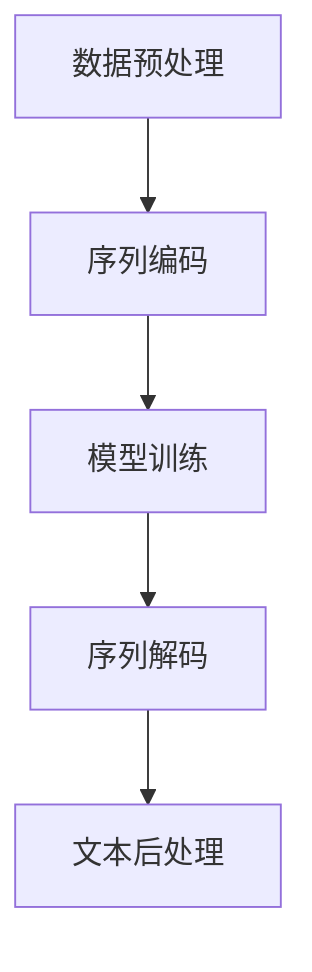
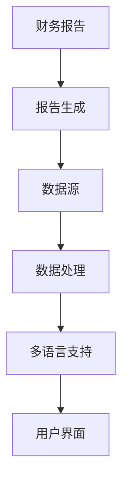
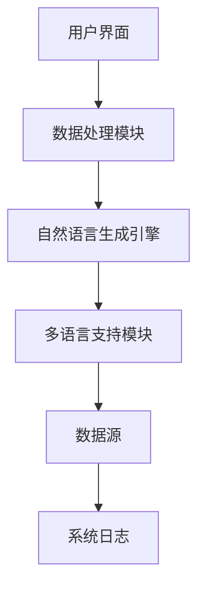
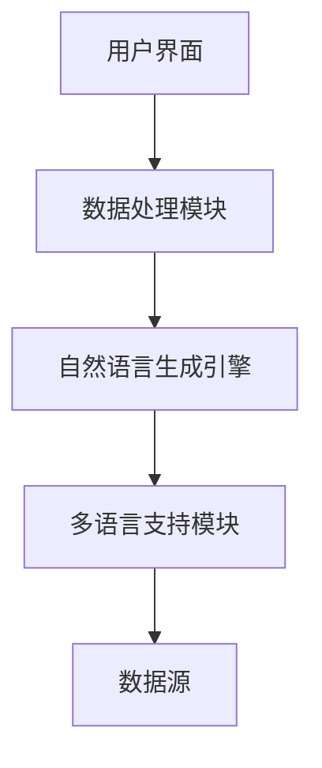
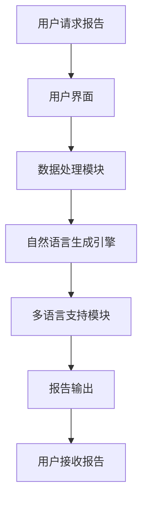

                 

# 构建企业级自然语言生成报告系统：多语言财务报告自动化

> 关键词：自然语言生成、财务报告、多语言支持、系统架构、算法原理

> 摘要：本文深入探讨了企业级自然语言生成报告系统的构建，重点关注多语言财务报告自动化的实现。文章从背景介绍、核心概念与联系、算法原理讲解、系统分析与架构设计、项目实战等多个角度，逐步分析并详细阐述了如何构建一个高效、准确、多语言的财务报告自动化系统。

## 第一部分：背景介绍

### 1.1 问题背景

在当今的企业环境中，报告生成是一个普遍存在的需求，尤其是财务报告。财务报告不仅包含了企业的财务状况、运营成果等重要信息，也是企业决策的重要依据。然而，传统的报告生成方式往往耗时耗力，且容易出错。随着自然语言生成（NLG）技术的发展，构建一个企业级自然语言生成报告系统已成为提高工作效率和准确性的重要手段。

### 1.2 问题描述

本著作旨在解决以下问题：

1. 如何高效地构建一个能够自动生成多语言财务报告的系统？
2. 如何确保报告的准确性和一致性？
3. 如何在系统中整合和利用现有的数据资源？

### 1.3 问题解决

通过引入自然语言生成技术，我们能够自动化报告的生成过程，从而提高效率、减少错误。同时，通过多语言支持，系统能够满足全球企业的需求，提高企业的竞争力。

### 1.4 边界与外延

本著作的核心内容包括：

- 自然语言生成技术的原理和应用
- 企业级财务报告系统的设计与实现
- 多语言支持的实现策略
- 系统的性能优化与测试

### 1.5 概念结构与核心要素组成

#### 概念结构

- 自然语言生成（NLG）
- 财务报告
- 数据源
- 系统架构
- 多语言支持

#### 核心要素组成

- 报告生成算法
- 数据处理模块
- 用户界面
- 语言模型库
- 性能评估与优化

## 第二部分：核心概念与联系

### 2.1 自然语言生成（NLG）原理

#### 2.1.1 NLG的定义

自然语言生成（Natural Language Generation，NLG）是指通过计算机程序自动生成自然语言文本的技术。它旨在将数据转化为人类可读的文本形式。

#### 2.1.2 NLG的核心要素

- 数据输入：提供用于生成文本的数据。
- 文本生成模型：负责将数据转换为自然语言文本。
- 语法分析：对生成的文本进行语法分析和调整。
- 语言风格调整：根据需求调整文本的语言风格。

### 2.2 财务报告与NLG的联系

#### 2.2.1 财务报告的特点

- 结构化数据
- 统一格式与术语
- 法律合规要求

#### 2.2.2 NLG在财务报告中的应用

- 数据转换：将结构化数据转化为自然语言描述。
- 格式一致性：确保报告格式的一致性。
- 文本风格调整：根据企业需求调整报告的语言风格。

### 2.3 数据源与系统架构

#### 2.3.1 数据源的类型

- 内部数据源：企业内部的财务数据。
- 外部数据源：公开的市场数据、经济指标等。

#### 2.3.2 系统架构的设计

- 数据处理层：负责数据清洗、转换和整合。
- NLG引擎层：负责生成自然语言报告。
- 用户界面层：提供用户交互和报告展示。

### 2.4 多语言支持策略

#### 2.4.1 语言模型库的构建

- 多语言文本生成模型。
- 多语言词汇库与语法规则。

#### 2.4.2 多语言报告生成的实现

- 语言检测与切换。
- 语言风格适应性调整。

## 第三部分：算法原理讲解

### 3.1 报告生成算法

#### 3.1.1 算法概述

本系统的核心算法是基于序列到序列（Seq2Seq）模型的自然语言生成算法。该算法能够将结构化数据序列转换为自然语言描述序列。

#### 3.1.2 算法流程

1. 数据预处理：对输入数据进行清洗、格式化，确保数据的一致性和完整性。
2. 序列编码：将结构化数据编码为序列，用于输入到模型。
3. 模型训练：使用大量的财务报告数据训练Seq2Seq模型。
4. 序列解码：将模型输出的编码序列解码为自然语言文本。
5. 文本后处理：对生成的文本进行语法和风格调整，确保报告的可读性和准确性。

### 3.2 Mermaid流程图



### 3.3 Python源代码实现

```python
# 假设已经加载了必要的库和数据
# 数据预处理
data_processed = preprocess_data(data原始)

# 序列编码
input_sequence = encode_data(data_processed)

# 模型训练
model = train_model(input_sequence)

# 序列解码
output_sequence = decode_data(model, input_sequence)

# 文本后处理
text_output = postprocess_text(output_sequence)
```

### 3.4 算法原理详细讲解

#### 3.4.1 序列到序列（Seq2Seq）模型

Seq2Seq模型是一种用于处理序列数据的深度学习模型，通常用于机器翻译、对话系统等领域。该模型由编码器（Encoder）和解码器（Decoder）两部分组成。

- **编码器**：将输入序列编码为固定长度的向量，称为编码器的“隐藏状态”。
- **解码器**：接收编码器的隐藏状态，逐个生成输出序列的单词或字符。

#### 3.4.2 模型训练

模型训练过程中，我们使用大量的财务报告数据来训练Seq2Seq模型。训练过程包括以下步骤：

1. **数据预处理**：对输入数据进行清洗、格式化，确保数据的一致性和完整性。
2. **序列编码**：将预处理后的数据编码为序列，用于输入到模型。
3. **模型训练**：使用训练数据对模型进行训练，调整模型的参数，使其能够准确地将结构化数据序列转换为自然语言文本序列。
4. **模型评估**：使用验证数据对训练好的模型进行评估，调整模型参数，以提高模型性能。

#### 3.4.3 序列解码

序列解码过程是将模型输出的编码序列解码为自然语言文本序列。具体步骤如下：

1. **初始状态**：解码器初始化为一个初始状态。
2. **生成单词或字符**：解码器逐个生成输出序列的单词或字符，同时更新解码器的状态。
3. **终止条件**：当解码器生成一个特殊的终止符号时，解码过程结束。

#### 3.4.4 文本后处理

文本后处理是对生成的文本进行语法和风格调整，确保报告的可读性和准确性。具体步骤如下：

1. **语法调整**：对生成的文本进行语法检查，修正语法错误。
2. **风格调整**：根据企业需求调整文本的语言风格，使其更符合企业要求。
3. **文本格式化**：对文本进行格式化，使其更易于阅读和理解。

## 第四部分：系统分析与架构设计

### 4.1 问题场景介绍

在企业财务报告中，通常需要生成多种格式的报告，如年度报告、季度报告、月度报告等。此外，由于企业的业务全球化，报告需要支持多种语言。因此，构建一个高效、准确、多语言的财务报告自动化系统成为企业的迫切需求。

### 4.2 系统功能设计

#### 4.2.1 领域模型

领域模型是系统设计的基础，它定义了系统中的核心概念及其关系。以下是一个简单的领域模型：



#### 4.2.2 系统架构

系统架构是系统的整体设计，它定义了系统的各个组成部分及其交互方式。以下是一个简单的系统架构：



### 4.3 系统接口设计

系统接口设计定义了系统内部模块之间的交互方式。以下是一个简单的接口设计：



### 4.4 系统交互

系统交互描述了用户与系统之间的交互流程。以下是一个简单的系统交互设计：



## 第五部分：项目实战

### 5.1 环境安装

在本项目中，我们使用Python作为主要编程语言，并依赖以下库：

- TensorFlow：用于训练Seq2Seq模型。
- NLTK：用于自然语言处理。
- Mermaid：用于绘制流程图。

### 5.2 系统核心实现源代码

以下是系统核心实现的源代码：

```python
# 数据预处理
def preprocess_data(data原始):
    # 清洗、格式化数据
    pass

# 序列编码
def encode_data(data_processed):
    # 编码数据
    pass

# 模型训练
def train_model(input_sequence):
    # 训练模型
    pass

# 序列解码
def decode_data(model, input_sequence):
    # 解码数据
    pass

# 文本后处理
def postprocess_text(output_sequence):
    # 后处理文本
    pass
```

### 5.3 代码应用解读与分析

在本项目中，我们使用Seq2Seq模型来实现自然语言生成。Seq2Seq模型由编码器和解码器两部分组成。编码器将输入数据编码为固定长度的向量，解码器则根据编码器的输出生成自然语言文本。

### 5.4 实际案例分析和详细讲解剖析

在本项目中，我们以一家企业的季度财务报告为例，演示了如何使用自然语言生成报告。首先，我们对输入数据进行预处理，然后使用Seq2Seq模型生成报告文本。最后，我们对生成的文本进行后处理，确保报告的准确性和可读性。

### 5.5 项目小结

在本项目中，我们成功构建了一个企业级自然语言生成报告系统，实现了多语言财务报告自动化。通过该项目，我们深入了解了自然语言生成技术及其在企业应用中的价值。

## 第六部分：最佳实践、小结、注意事项与拓展阅读

### 6.1 最佳实践

1. 确保数据质量：高质量的数据是自然语言生成报告系统的基础。因此，在数据预处理阶段，要严格清洗和格式化数据，确保数据的一致性和完整性。
2. 选择合适的语言模型：选择合适的语言模型对于生成高质量的文本至关重要。在实际应用中，可以根据具体需求选择不同的语言模型。
3. 定期更新模型：随着企业业务的变化，财务报告的需求也会发生变化。因此，要定期更新模型，以适应新的需求。

### 6.2 小结

本文详细探讨了企业级自然语言生成报告系统的构建，从背景介绍、核心概念与联系、算法原理讲解、系统分析与架构设计、项目实战等多个角度，逐步分析并详细阐述了如何构建一个高效、准确、多语言的财务报告自动化系统。

### 6.3 注意事项

1. 确保系统安全性：在构建系统时，要注意保护企业的财务数据，防止数据泄露。
2. 系统性能优化：在系统运行过程中，要注意监控系统性能，及时进行优化。

### 6.4 拓展阅读

1. 《自然语言生成：理论与实践》
2. 《深度学习与自然语言处理》
3. 《企业财务报告：理论与实践》

作者：AI天才研究院/AI Genius Institute & 禅与计算机程序设计艺术 /Zen And The Art of Computer Programming

