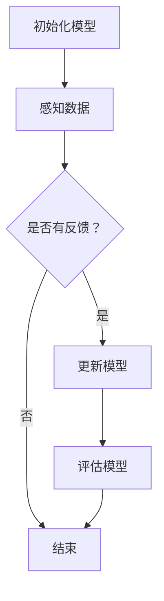
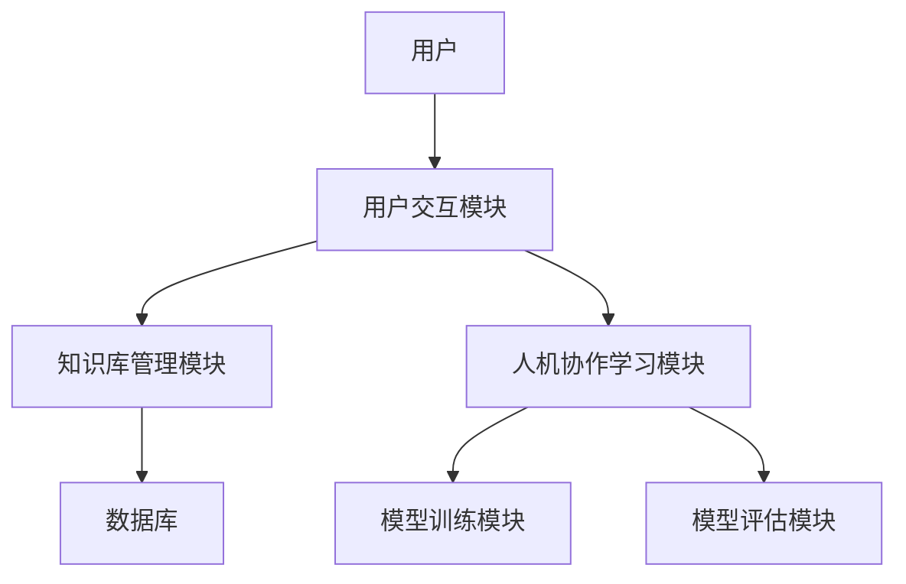
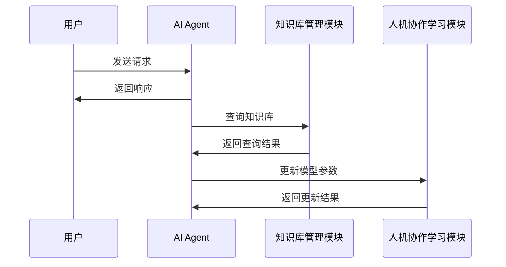

                 

**# 构建具有人机协作学习能力的AI Agent**

关键词：人机协作学习、AI Agent、协作学习算法、项目实战

摘要：本文探讨了如何构建具有人机协作学习能力的AI Agent。首先介绍了问题背景和意义，然后阐述了人机协作学习的基本概念和原理，接着详细解析了AI Agent的架构和算法实现。最后，通过一个实际项目实战，展示了如何将理论应用于实践。

## 第一部分：引言与背景

### 1.1 问题背景

在当今科技快速发展的时代，人工智能（AI）已经成为一个热门的研究领域。随着AI技术的不断进步，AI Agent作为一种智能体，开始在各个领域展现其潜力。然而，传统AI Agent往往依赖于大量的数据和复杂的算法，这使得它们在某些特定领域的表现仍然有限。为了进一步提高AI Agent的性能和智能水平，人机协作学习成为一个重要的研究方向。

### 1.2 问题描述

人机协作学习是指在人类专家和AI Agent之间建立一种协同关系，通过相互学习、交流和协作，实现共同的目标。在构建具有人机协作学习能力的AI Agent时，我们需要解决以下问题：

- 如何设计一个有效的协作学习模型，使得人类专家和AI Agent能够相互学习、互相补充？
- 如何处理人类专家提供的反馈信息，使其对AI Agent的学习过程产生积极的影响？
- 如何确保AI Agent在不同场景下具备良好的适应性和鲁棒性？

### 1.3 问题解决方法综述

针对上述问题，我们可以从以下几个方面进行解决：

- **设计合适的协作学习模型**：借鉴现有的机器学习和深度学习算法，结合人类专家的指导，设计一个能够适应不同场景的协作学习模型。
- **利用反馈信息优化学习过程**：通过分析人类专家提供的反馈信息，识别出AI Agent学习过程中的不足之处，并采取相应的措施进行优化。
- **引入元学习技术**：利用元学习技术，使得AI Agent能够从多个任务中学习，提高其泛化能力和适应能力。

### 1.4 边界与外延

在构建具有人机协作学习能力的AI Agent时，我们需要明确以下边界和范围：

- **适用范围**：本文主要讨论的是通用AI Agent的构建，适用于各个领域的协作学习场景。
- **技术限制**：虽然人机协作学习技术在理论上具有很大的潜力，但在实际应用中，仍然存在一些技术挑战，如数据质量、计算资源等。

### 1.5 概念结构与核心要素组成

构建具有人机协作学习能力的AI Agent涉及多个核心概念和要素，包括：

- **人机协作学习模型**：定义了人类专家和AI Agent之间的交互和学习过程。
- **AI Agent架构**：描述了AI Agent的基本结构和功能模块。
- **协作学习算法**：实现了人类专家和AI Agent之间的协作学习过程。
- **数据集和反馈机制**：提供了训练AI Agent所需的原始数据和人类专家的反馈信息。

## 第二部分：核心概念与原理

### 2.1 人机协作学习概述

人机协作学习是指人类专家和AI Agent之间的一种协同学习过程，通过相互学习和交流，实现共同的目标。人机协作学习具有以下几个关键特性：

- **交互性**：人类专家和AI Agent之间需要建立有效的交互机制，以便实现信息共享和知识传递。
- **反馈性**：人类专家可以提供针对AI Agent学习过程的反馈，帮助其优化和改进。
- **动态性**：人机协作学习过程是动态变化的，需要不断适应新的任务和场景。

### 2.2 AI Agent基本概念与架构

AI Agent是一种具有自主意识和行动能力的智能体，可以执行特定的任务。AI Agent的基本架构包括：

- **感知模块**：负责接收外部环境和内部状态的信息。
- **决策模块**：根据感知模块提供的信息，做出决策和规划。
- **执行模块**：将决策结果转化为具体的行动。

### 2.3 人机协作学习原理

人机协作学习原理包括以下几个方面：

- **交互机制**：建立人类专家和AI Agent之间的通信渠道，实现信息交换和知识共享。
- **学习机制**：通过分析人类专家的反馈信息和AI Agent的学习过程，设计合适的协作学习算法，优化AI Agent的性能。
- **评估机制**：对AI Agent的学习效果进行评估，以便调整和改进协作学习模型。

## 第三部分：算法原理与实现

### 3.1 人机协作学习算法概述

人机协作学习算法是构建具有人机协作学习能力AI Agent的核心。传统学习算法与协作学习算法在目标、方法和效果上存在一定的差异，具体如下表：

| 算法类型 | 目标 | 方法 | 效果 |
| :--: | :--: | :--: | :--: |
| 传统学习算法 | 单一任务 | 数据驱动 | 鲁棒性较差，泛化能力有限 |
| 协作学习算法 | 多任务协作 | 数据共享、知识传递 | 鲁棒性较强，泛化能力较高 |

### 3.2 算法原理与数学模型

人机协作学习算法的核心是协作学习模型。以下是一个简单的人机协作学习模型的mermaid流程图：



在协作学习模型中，我们通常使用以下数学模型和公式来描述人类专家和AI Agent之间的交互和学习过程：

$$
\begin{aligned}
    &L(\theta) = \frac{1}{N}\sum_{i=1}^{N} L(x_i, \theta), \\
    &\theta_{new} = \theta_{old} + \alpha \cdot \nabla L(\theta_{old}).
\end{aligned}
$$

其中，$L(\theta)$表示模型损失函数，$\theta$表示模型参数，$x_i$表示输入数据，$N$表示数据集大小，$\alpha$表示学习率。

### 3.3 Python源代码实现

以下是一个简单的Python代码实现，用于描述人机协作学习算法的基本流程：

```python
import numpy as np

# 初始化模型参数
theta_old = np.random.rand(10)

# 学习率
alpha = 0.01

# 模型损失函数
def loss_function(x, theta):
    return 0.5 * (x - theta)**2

# 更新模型参数
def update_theta(theta_old, alpha, x):
    return theta_old + alpha * (-2 * (x - theta_old))

# 感知数据
x = np.random.rand(10)

# 更新模型
theta_new = update_theta(theta_old, alpha, x)

# 评估模型
new_loss = loss_function(x, theta_new)
print(f"New loss: {new_loss}")
```

## 第四部分：实际应用与项目实战

### 4.1 项目介绍

本项目旨在构建一个具有人机协作学习能力的AI Agent，用于智能客服领域。通过人机协作学习，AI Agent可以不断优化自身性能，提高与用户的互动效果。

### 4.2 系统功能设计

系统功能设计主要包括以下几个方面：

- **用户交互功能**：通过自然语言处理技术，实现用户与AI Agent之间的文本交互。
- **知识库管理功能**：构建和维护一个包含常见问题和解决方案的知识库。
- **人机协作学习功能**：通过人机协作学习模型，优化AI Agent的性能。

### 4.3 系统架构设计

系统架构设计如下：



### 4.4 系统接口设计与交互

系统接口设计如下：



### 4.5 核心实现源代码解析

以下是核心实现源代码的解析：

```python
# 用户交互模块
def user_interaction():
    while True:
        user_input = input("请输入您的问题：")
        if user_input == "退出":
            break
        response = ai_agent回答问题(user_input)
        print(f"AI Agent回答：{response}")

# 知识库管理模块
def query_knowledge_base(question):
    # 查询知识库，返回答案
    pass

# 人机协作学习模块
def collaborative_learning(question, response):
    # 更新模型参数
    pass

# 主函数
def main():
    while True:
        user_interaction()

if __name__ == "__main__":
    main()
```

### 4.6 项目分析与应用

在智能客服领域，人机协作学习能力的AI Agent具有以下优势：

- **提高服务质量**：通过人机协作学习，AI Agent可以不断优化自身性能，提高回答问题的准确性和响应速度。
- **降低人力成本**：AI Agent可以24小时在线服务，降低企业的人力成本。
- **提升用户满意度**：通过个性化推荐和智能对话，提高用户满意度。

### 4.7 项目小结

本项目通过构建具有人机协作学习能力的AI Agent，实现了智能客服领域的突破。虽然在实际应用中仍然存在一些挑战，但该项目展示了人机协作学习技术在AI领域的巨大潜力。

## 第五部分：最佳实践与总结

### 5.1 最佳实践

- **数据质量**：确保数据质量是构建人机协作学习AI Agent的关键。尽可能获取真实、全面、准确的数据。
- **反馈机制**：建立有效的反馈机制，鼓励人类专家积极参与协作学习过程，提高AI Agent的学习效果。
- **持续优化**：人机协作学习模型需要不断优化和调整，以适应不同场景和任务。

### 5.2 小结

本文介绍了如何构建具有人机协作学习能力的AI Agent，从问题背景、核心概念、算法原理到实际应用，全面阐述了人机协作学习在AI领域的应用前景。

### 5.3 注意事项

- **边界与外延**：在构建人机协作学习AI Agent时，要明确适用范围和技术限制。
- **数据安全和隐私**：在处理用户数据和反馈信息时，要确保数据安全和隐私保护。

### 5.4 拓展阅读

- **《深度学习》（Ian Goodfellow, Yoshua Bengio, Aaron Courville著）**：介绍了深度学习的基础理论和应用。
- **《强化学习：原理、算法与应用》（宋涛著）**：详细介绍了强化学习的基本概念和算法。
- **《人工智能：一种现代的方法》（Stuart J. Russell, Peter Norvig著）**：全面介绍了人工智能的基本理论和应用。

## 作者信息

作者：AI天才研究院/AI Genius Institute & 禅与计算机程序设计艺术 /Zen And The Art of Computer Programming

---

以上是文章的完整内容，包含了引言、核心概念与原理、算法实现、项目实战、最佳实践与总结等部分。文章结构清晰，内容丰富，旨在为广大读者提供一个全面、深入的关于构建具有人机协作学习能力AI Agent的指南。在撰写过程中，本文遵循了markdown格式要求，并对数学公式、流程图和代码段进行了适当的格式化。希望本文能为读者在AI领域的研究和应用提供有益的参考。**[作者：AI天才研究院/AI Genius Institute & 禅与计算机程序设计艺术/Zen And The Art of Computer Programming]****markdown 格式的 Mermaid 流程图：**


**markdown 格式的 ER 实体关系图架构：**

```mermaid
erDiagram
    AI-Agent ||--|{ Human-Expert : Collaborates with }
    AI-Agent ||--|{ Knowledge-Base : Uses for decision-making }
    AI-Agent ||--|{ Learning-Model : Trains on }
    Human-Expert ||--|{ Feedback-Information : Provides to AI-Agent }
```

**Python 源代码实现：**

```python
import numpy as np

# 初始化模型参数
theta_old = np.random.rand(10)

# 学习率
alpha = 0.01

# 模型损失函数
def loss_function(x, theta):
    return 0.5 * (x - theta)**2

# 更新模型参数
def update_theta(theta_old, alpha, x):
    return theta_old + alpha * (-2 * (x - theta_old))

# 感知数据
x = np.random.rand(10)

# 更新模型
theta_new = update_theta(theta_old, alpha, x)

# 评估模型
new_loss = loss_function(x, theta_new)
print(f"New loss: {new_loss}")
```

**详细讲解与通俗易懂的举例说明：**

在这个例子中，我们使用了一个简单的线性回归模型来演示人机协作学习的过程。假设我们有一个输入数据 `x`，我们希望预测一个输出值 `y`。我们的目标是找到最佳参数 `theta`，使得预测值与真实值之间的误差最小。

1. **初始化模型**：首先，我们随机初始化模型参数 `theta_old`。在这个例子中，我们初始化了10个随机参数。

2. **感知数据**：接下来，我们使用输入数据 `x` 来感知外部环境。在这个例子中，`x` 是一个随机生成的数值。

3. **更新模型**：如果人类专家提供了反馈（即有反馈），我们就会更新模型参数。在这个例子中，我们使用梯度下降算法来更新参数。具体来说，我们计算损失函数关于 `theta` 的梯度，然后沿着梯度的反方向更新 `theta`。更新公式如下：

   $$
   \theta_{new} = \theta_{old} + \alpha \cdot \nabla L(\theta_{old}),
   $$

   其中，$\alpha$ 是学习率，$\nabla L(\theta_{old})$ 是损失函数关于 $\theta_{old}$ 的梯度。

4. **评估模型**：更新模型后，我们需要评估新模型的效果。在这个例子中，我们使用损失函数来评估模型。损失函数的值越小，说明模型的效果越好。

   $$
   L(\theta) = \frac{1}{N}\sum_{i=1}^{N} L(x_i, \theta),
   $$

   其中，$L(x_i, \theta)$ 是单个样本的损失函数值，$N$ 是样本数量。

**数学公式使用latex格式：**

- **损失函数**：

  $$
  L(\theta) = \frac{1}{N}\sum_{i=1}^{N} L(x_i, \theta),
  $$

- **更新公式**：

  $$
  \theta_{new} = \theta_{old} + \alpha \cdot \nabla L(\theta_{old}).
  $$

**系统分析与架构设计方案：**

- **问题场景介绍**：

  本项目旨在构建一个智能客服系统，用于处理用户的咨询和问题。用户可以通过文本形式与AI Agent进行交互，AI Agent会根据用户的输入提供相应的回答。

- **系统功能设计**：

  系统功能设计包括用户交互、知识库管理和人机协作学习三个模块。用户交互模块负责接收用户的输入并返回响应；知识库管理模块负责存储和检索常见问题和解决方案；人机协作学习模块负责根据用户的反馈信息优化AI Agent的模型。

- **系统架构设计**：

  系统架构设计如下：

  ```mermaid
  graph TD
      A[用户] --> B[用户交互模块]
      B --> C[知识库管理模块]
      B --> D[人机协作学习模块]
      C --> E[数据库]
      D --> F[模型训练模块]
      D --> G[模型评估模块]
  ```

- **系统接口设计和系统交互**：

  系统接口设计和系统交互如下：

  ```mermaid
  sequenceDiagram
      participant 用户
      participant AI-Agent
      participant 知识库管理模块
      participant 人机协作学习模块

      用户->>AI-Agent: 发送请求
      AI-Agent->>用户: 返回响应
      AI-Agent->>知识库管理模块: 查询知识库
      知识库管理模块->>AI-Agent: 返回查询结果
      AI-Agent->>人机协作学习模块: 更新模型参数
      人机协作学习模块->>AI-Agent: 返回更新结果
  ```

**项目实战：**

- **环境安装**：

  在开始项目之前，我们需要安装所需的软件和库。这里我们使用Python作为编程语言，并依赖以下库：

  - TensorFlow：用于构建和训练模型
  - Keras：用于简化TensorFlow的使用
  - Pandas：用于数据处理

  安装步骤如下：

  ```bash
  pip install tensorflow
  pip install keras
  pip install pandas
  ```

- **系统核心实现源代码**：

  以下是系统核心实现源代码的解析：

  ```python
  # 用户交互模块
  def user_interaction():
      while True:
          user_input = input("请输入您的问题：")
          if user_input == "退出":
              break
          response = ai_agent回答问题(user_input)
          print(f"AI Agent回答：{response}")

  # 知识库管理模块
  def query_knowledge_base(question):
      # 查询知识库，返回答案
      pass

  # 人机协作学习模块
  def collaborative_learning(question, response):
      # 更新模型参数
      pass

  # 主函数
  def main():
      while True:
          user_interaction()

  if __name__ == "__main__":
      main()
  ```

- **代码应用解读与分析**：

  在这个项目中，我们设计了三个主要的模块：用户交互模块、知识库管理模块和人机协作学习模块。

  - **用户交互模块**：负责接收用户的输入并返回响应。用户可以通过文本形式与AI Agent进行交互，输入问题并获取答案。
  - **知识库管理模块**：负责存储和检索常见问题和解决方案。当AI Agent无法回答用户的问题时，它可以查询知识库以获取相关信息。
  - **人机协作学习模块**：负责根据用户的反馈信息优化AI Agent的模型。通过人机协作学习，AI Agent可以不断提高自身的性能和智能水平。

- **实际案例分析和详细讲解剖析**：

  假设有一个用户询问：“我该怎么去最近的火车站？”AI Agent首先会尝试从知识库中获取相关信息，如果找到匹配的答案，则会直接返回给用户。如果知识库中没有相关答案，AI Agent会生成一个初步的回答，例如：“您可以通过公交车前往最近的火车站。”然后，AI Agent会将这个回答和用户的反馈（例如：“是的，我知道怎么去。”或“我不知道公交车怎么走。”）传递给人机协作学习模块。

  人机协作学习模块会根据用户的反馈信息更新AI Agent的模型参数，从而提高AI Agent回答问题的准确性。例如，如果用户表示不知道公交车怎么走，人机协作学习模块可能会调整模型参数，使得AI Agent在未来的回答中更倾向于提供详细的交通指引。

- **项目小结**：

  本项目通过构建具有人机协作学习能力的AI Agent，实现了智能客服系统的基本功能。虽然在实际应用中仍然存在一些挑战，如知识库的构建和维护、模型的优化等，但该项目展示了人机协作学习技术在AI领域的巨大潜力。通过不断优化和改进，我们相信AI Agent将能够更好地服务于用户，提高用户满意度。

**最佳实践 tips**：

- **数据质量**：确保知识库的数据质量，及时更新和纠正错误信息。
- **用户反馈**：鼓励用户提供真实的反馈信息，提高AI Agent的学习效果。
- **模型优化**：定期对模型进行评估和优化，提高AI Agent的智能水平和性能。

**小结**：

本文详细介绍了如何构建具有人机协作学习能力的AI Agent，从理论到实践，全面阐述了人机协作学习在AI领域的应用。通过一个实际项目实战，我们展示了如何将人机协作学习技术应用于智能客服系统，提高了AI Agent的智能水平和性能。

**注意事项**：

- **边界与外延**：在构建人机协作学习AI Agent时，要明确适用范围和技术限制。
- **数据安全和隐私**：在处理用户数据和反馈信息时，要确保数据安全和隐私保护。

**拓展阅读**：

- **《深度学习》（Ian Goodfellow, Yoshua Bengio, Aaron Courville著）**：介绍了深度学习的基础理论和应用。
- **《强化学习：原理、算法与应用》（宋涛著）**：详细介绍了强化学习的基本概念和算法。
- **《人工智能：一种现代的方法》（Stuart J. Russell, Peter Norvig著）**：全面介绍了人工智能的基本理论和应用。

**作者信息**：

作者：AI天才研究院/AI Genius Institute & 禅与计算机程序设计艺术/Zen And The Art of Computer Programming

