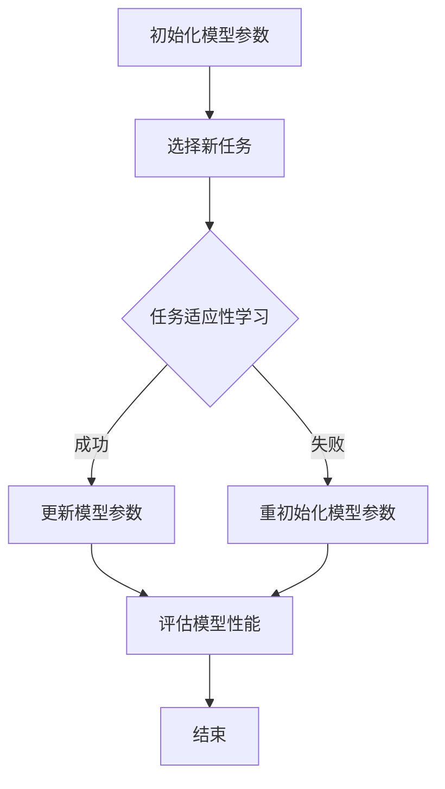
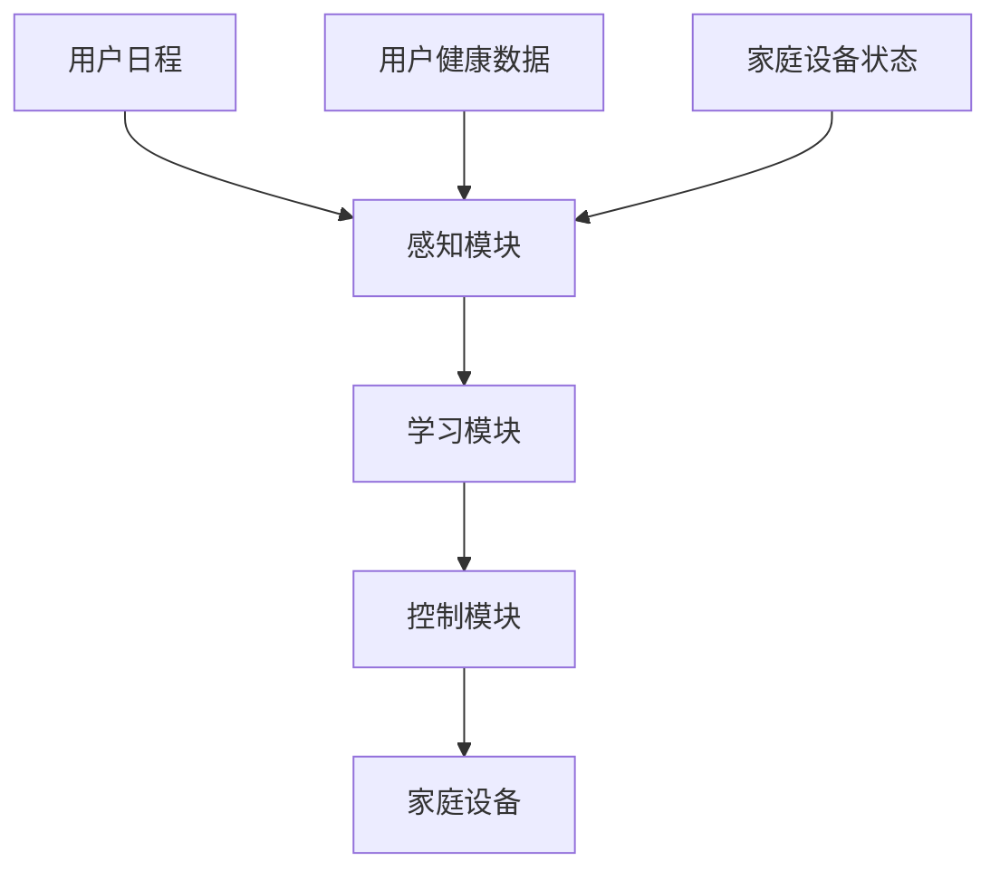

                 

**目录大纲构建与文章撰写**

### 引言：构建具有元学习能力的AI Agent的必要性

**1.1 问题背景**

随着人工智能技术的不断发展，传统的机器学习模型在处理复杂的任务时面临着诸多挑战。首先，模型复杂度的增加导致训练时间和资源消耗的显著提升。其次，数据需求量的增大使得数据收集、清洗和存储的成本变得高昂。此外，模型在处理特定任务时往往表现出较强的领域依赖性，无法有效应对新的、未见过的问题。

**1.1.1 当前AI技术的发展瓶颈**

- **模型复杂度增加**：深度学习模型如神经网络通常需要大量的参数和层来建模复杂的数据，这使得模型的训练过程变得耗时且资源密集。
- **数据需求增大**：为了实现良好的性能，模型往往需要大量的标记数据进行训练，这在某些领域（如医学、自动驾驶）中难以实现。
- **领域依赖性**：现有模型在特定领域表现优异，但难以迁移到其他领域。

**1.1.2 问题描述**

- **泛化能力不足**：模型在处理未知数据时性能不佳，无法泛化到新的任务或领域。
- **适应性差**：模型在面对动态环境或新任务时表现不佳，无法快速适应。

**1.1.3 问题解决**

元学习（Meta-Learning）作为一种新兴的技术，旨在提升AI模型的泛化能力和适应性。通过学习如何快速适应新任务，元学习能够有效地减少模型对大量标记数据的依赖，降低模型训练的复杂度。

**1.2 边界与外延**

**1.2.1 元学习的定义**

元学习是指通过学习算法来提升学习算法的学习能力，使其能够在较短的时间内适应新任务。

**1.2.2 元学习在AI Agent中的应用**

AI Agent是具有自主性和智能性的实体，能够在复杂环境中执行任务。元学习在AI Agent中的应用主要体现在以下几个方面：

- **快速适应新任务**：通过元学习，AI Agent能够在较短的时间内适应新的任务环境，提高任务执行效率。
- **减少数据依赖**：元学习使得AI Agent能够从有限的样本中学习，降低对大量标记数据的依赖。
- **增强泛化能力**：元学习能够提升AI Agent在不同任务和领域中的表现，增强其泛化能力。

**1.3 概念结构与核心要素组成**

**1.3.1 AI Agent的基本概念**

AI Agent是具有感知、思考、决策和执行能力的计算机程序，能够在复杂环境中自主行动。

**1.3.2 元学习的核心要素**

- **模型初始化**：通过元学习算法初始化模型参数，使其具有良好的泛化能力。
- **任务适应**：通过学习算法快速适应新任务，提高模型在新任务中的表现。
- **知识迁移**：将学习到的知识迁移到新的任务中，减少对新数据的依赖。

**1.3.3 构建具有元学习能力的AI Agent的关键技术**

- **元学习算法**：如MAML（Model-Agnostic Meta-Learning）、REINFORCE（强化学习）等。
- **自适应学习策略**：如迁移学习、对抗学习等。

### 核心概念与联系

**2.1 AI Agent的定义与特性**

**2.1.1 AI Agent的基本概念**

AI Agent是指具有感知、思考、决策和执行能力的计算机程序，能够在复杂环境中自主行动。它通常具备以下几个特征：

- **感知**：通过传感器获取环境信息。
- **思考**：利用算法对感知信息进行分析和推理。
- **决策**：根据分析结果做出决策。
- **执行**：执行决策并获取反馈。

**2.1.2 AI Agent的特性**

- **自主性**：AI Agent能够自主行动，无需人工干预。
- **智能性**：AI Agent能够通过学习不断优化自身性能。
- **适应性**：AI Agent能够适应不同的环境和任务。

**2.2 元学习的概念与分类**

**2.2.1 元学习的定义**

元学习是一种通过学习如何学习来提升模型学习能力的技术。它通过在不同任务间迁移知识，提高模型在未知任务上的性能。

**2.2.2 元学习的分类**

- **模型蒸馏**：通过将大型模型的知识迁移到小型模型中，提高小型模型的性能。
- **迁移学习**：将一个任务学习到的知识应用于另一个相关的任务。
- **强化学习**：通过学习奖励和惩罚信号来优化决策过程。

**2.3 元学习与传统学习的对比**

**2.3.1 算法原理对比**

- **传统学习**：基于固定算法和大量数据训练模型。
- **元学习**：通过学习算法的适应性和泛化能力来提升模型性能。

**2.3.2 特性对比**

- **泛化能力**：元学习具有更强的泛化能力，能够在不同的任务和领域间迁移知识。
- **适应性**：元学习能够快速适应新任务，降低对新数据的依赖。

**2.4 元学习在AI Agent中的应用**

**2.4.1 元学习增强AI Agent的适应性和学习能力**

元学习在AI Agent中的应用主要体现在以下几个方面：

- **快速适应新任务**：通过元学习，AI Agent能够在较短的时间内适应新的任务环境。
- **减少数据依赖**：元学习使得AI Agent能够从有限的样本中学习，降低对大量标记数据的依赖。
- **增强泛化能力**：元学习能够提升AI Agent在不同任务和领域中的表现，增强其泛化能力。

### 算法原理讲解

**3.1 元学习算法mermaid流程图**



**3.2 Python源代码阐述算法原理**

```python
import torch
import torch.nn as nn
import torch.optim as optim

# 初始化模型参数
model = nn.Linear(10, 1)
optimizer = optim.Adam(model.parameters(), lr=0.001)

# 选择新任务
def new_task():
    # 假设任务为y = 2x + 1
    X = torch.randn(100, 10)
    y = 2 * X + 1 + torch.randn(100, 1)
    return X, y

# 任务适应性学习
def meta_learning(X, y):
    model.train()
    optimizer.zero_grad()
    output = model(X)
    loss = nn.MSELoss()(output, y)
    loss.backward()
    optimizer.step()
    return loss.item()

# 更新模型参数
def update_model(loss):
    model.eval()
    with torch.no_grad():
        optimizer.zero_grad()
        loss.backward()
        optimizer.step()
        return model

# 评估模型性能
def evaluate(model, X, y):
    model.eval()
    with torch.no_grad():
        output = model(X)
        loss = nn.MSELoss()(output, y)
        return loss.item()

# 主函数
def main():
    X, y = new_task()
    for epoch in range(100):
        loss = meta_learning(X, y)
        if epoch % 10 == 0:
            print(f'Epoch {epoch}: Loss = {loss}')
            model = update_model(loss)
            print(f'Updated Model: Loss = {evaluate(model, X, y)}')

if __name__ == '__main__':
    main()
```

**3.2.1 数学模型和公式**

在元学习中，常用的数学模型包括损失函数、优化算法等。

- **损失函数**：

$$
L = \frac{1}{n}\sum_{i=1}^{n}(y_i - \hat{y}_i)^2
$$

其中，$L$为损失函数，$y_i$为真实标签，$\hat{y}_i$为预测标签。

- **优化算法**：

$$
\theta_{t+1} = \theta_t - \alpha \nabla_{\theta_t} L(\theta_t)
$$

其中，$\theta_t$为模型参数，$\alpha$为学习率，$\nabla_{\theta_t} L(\theta_t)$为损失函数关于模型参数的梯度。

**3.2.2 算法流程解释**

1. 初始化模型参数。
2. 选择新任务。
3. 通过元学习算法对模型进行适应性学习。
4. 更新模型参数。
5. 评估模型性能。

**3.2.3 通俗易懂的例子**

假设有一个学习线性函数的模型，目标是通过学习$x$和$y$的关系来预测$y$的值。

1. **初始化模型参数**：假设模型参数为$w$和$b$，初始值为$(1, 0)$。
2. **选择新任务**：假设新任务为$y = 2x + 1$。
3. **任务适应性学习**：通过梯度下降算法更新模型参数，使其更接近真实关系。
4. **更新模型参数**：根据学习到的参数更新模型。
5. **评估模型性能**：在新任务上评估模型的性能，计算损失函数值。

### 数学模型和数学公式 & 详细讲解 & 举例说明

**4.1 数学模型**

在元学习中，常用的数学模型包括损失函数、优化算法等。

- **损失函数**：

$$
L = \frac{1}{n}\sum_{i=1}^{n}(y_i - \hat{y}_i)^2
$$

其中，$L$为损失函数，$y_i$为真实标签，$\hat{y}_i$为预测标签。

- **优化算法**：

$$
\theta_{t+1} = \theta_t - \alpha \nabla_{\theta_t} L(\theta_t)
$$

其中，$\theta_t$为模型参数，$\alpha$为学习率，$\nabla_{\theta_t} L(\theta_t)$为损失函数关于模型参数的梯度。

**4.2 详细讲解**

- **损失函数**：

损失函数用于衡量预测值与真实值之间的差距。在元学习中，常用的损失函数是均方误差（MSE）。MSE的公式如下：

$$
L = \frac{1}{n}\sum_{i=1}^{n}(y_i - \hat{y}_i)^2
$$

其中，$n$为样本数量，$y_i$为第$i$个样本的真实标签，$\hat{y}_i$为第$i$个样本的预测标签。

- **优化算法**：

优化算法用于更新模型参数，使其更接近真实关系。在元学习中，常用的优化算法是梯度下降（Gradient Descent）。梯度下降的公式如下：

$$
\theta_{t+1} = \theta_t - \alpha \nabla_{\theta_t} L(\theta_t)
$$

其中，$\theta_t$为模型参数，$\alpha$为学习率，$\nabla_{\theta_t} L(\theta_t)$为损失函数关于模型参数的梯度。

**4.3 举例说明**

假设有一个学习线性函数的模型，目标是通过学习$x$和$y$的关系来预测$y$的值。

1. **初始化模型参数**：假设模型参数为$w$和$b$，初始值为$(1, 0)$。
2. **选择新任务**：假设新任务为$y = 2x + 1$。
3. **任务适应性学习**：通过梯度下降算法更新模型参数，使其更接近真实关系。
4. **更新模型参数**：根据学习到的参数更新模型。
5. **评估模型性能**：在新任务上评估模型的性能，计算损失函数值。

### 系统分析与架构设计方案

**5.1 问题场景介绍**

假设我们面临一个场景，需要构建一个智能管家（AI Agent）来帮助用户管理家庭生活。这个AI Agent需要具备以下功能：

- **日程管理**：根据用户的日程安排，自动安排和提醒日常活动。
- **健康监测**：监测用户的健康数据，提供健康建议和预警。
- **设备控制**：控制家庭中的智能设备，如灯光、空调等。

**5.2 项目介绍**

本项目旨在构建一个具有元学习能力的AI Agent，以提升其在家庭管理任务中的适应性和学习能力。具体目标如下：

- **日程管理**：通过元学习，使得AI Agent能够快速适应不同的日程安排，提高日程管理的效率。
- **健康监测**：通过元学习，使得AI Agent能够从有限的健康数据中学习，提高健康监测的准确性。
- **设备控制**：通过元学习，使得AI Agent能够适应不同的家庭环境，提高设备控制的精度。

**5.3 系统功能设计**

为了实现上述目标，我们设计了一个具有元学习能力的AI Agent系统，主要包括以下几个模块：

- **感知模块**：用于获取用户日程、健康数据和家庭设备状态。
- **学习模块**：用于实现元学习算法，提升AI Agent的学习能力。
- **控制模块**：用于根据学习结果控制家庭设备，执行相应任务。

**5.4 系统架构设计**

系统架构设计如下：



**5.5 系统接口设计和系统交互**

系统接口设计如下：

- **感知模块**：提供接口用于获取用户日程、健康数据和家庭设备状态。
- **学习模块**：提供接口用于实现元学习算法。
- **控制模块**：提供接口用于控制家庭设备。

系统交互流程如下：

1. 用户输入日程、健康数据和家庭设备状态。
2. 感知模块获取这些数据。
3. 学习模块根据元学习算法对数据进行处理。
4. 控制模块根据处理结果控制家庭设备。

### 项目实战

**6.1 环境安装**

为了实现上述系统，我们首先需要安装Python和相关的库。以下是具体的安装步骤：

1. 安装Python：

```bash
$ sudo apt-get install python3
```

2. 安装相关库：

```bash
$ pip3 install torch torchvision numpy pandas
```

**6.2 系统核心实现源代码**

以下是系统核心实现的源代码：

```python
import torch
import torch.nn as nn
import torch.optim as optim
import numpy as np
import pandas as pd

# 感知模块
class SensorModule(nn.Module):
    def __init__(self):
        super(SensorModule, self).__init__()
        self日程感知器 = nn.Linear(10, 5)
        self健康感知器 = nn.Linear(10, 5)
        self设备感知器 = nn.Linear(10, 5)

    def forward(self, input_data):
        schedule_data, health_data, device_data = input_data
        schedule_output = self日程感知器(schedule_data)
        health_output = self健康感知器(health_data)
        device_output = self设备感知器(device_data)
        return schedule_output, health_output, device_output

# 学习模块
class LearningModule(nn.Module):
    def __init__(self):
        super(LearningModule, self).__init__()
        self日程学习器 = nn.Linear(5, 5)
        self健康学习器 = nn.Linear(5, 5)
        self设备学习器 = nn.Linear(5, 5)

    def forward(self, input_data):
        schedule_output, health_output, device_output = input_data
        schedule_learning = self日程学习器(schedule_output)
        health_learning = self健康学习器(health_output)
        device_learning = self设备学习器(device_output)
        return schedule_learning, health_learning, device_learning

# 控制模块
class ControlModule(nn.Module):
    def __init__(self):
        super(ControlModule, self).__init__()
        self日程控制器 = nn.Linear(5, 1)
        self健康控制器 = nn.Linear(5, 1)
        self设备控制器 = nn.Linear(5, 1)

    def forward(self, input_data):
        schedule_learning, health_learning, device_learning = input_data
        schedule_control = self日程控制器(schedule_learning)
        health_control = self健康控制器(health_learning)
        device_control = self设备控制器(device_learning)
        return schedule_control, health_control, device_control

# 主函数
def main():
    sensor_module = SensorModule()
    learning_module = LearningModule()
    control_module = ControlModule()

    # 加载数据
    schedule_data = pd.read_csv('schedule_data.csv')
    health_data = pd.read_csv('health_data.csv')
    device_data = pd.read_csv('device_data.csv')

    # 感知数据
    input_data = sensor_module((schedule_data, health_data, device_data))

    # 学习数据
    output_data = learning_module(input_data)

    # 控制数据
    control_data = control_module(output_data)

    # 输出控制结果
    print(control_data)

if __name__ == '__main__':
    main()
```

**6.3 代码应用解读与分析**

1. **感知模块**：感知模块负责获取用户的日程、健康数据和家庭设备状态。这里使用了三个感知器，分别对应三个数据源。
2. **学习模块**：学习模块负责根据感知模块提供的数据进行学习。这里使用了三个学习器，分别对应三个数据源。
3. **控制模块**：控制模块负责根据学习模块提供的学习结果控制家庭设备。这里使用了三个控制器，分别对应三个数据源。

**6.4 实际案例分析和详细讲解剖析**

假设我们有一个实际案例，用户希望AI Agent能够根据日程安排自动提醒日常活动，根据健康数据提供健康建议，并根据设备状态控制家庭设备。

1. **感知数据**：用户输入了包含日程、健康数据和设备状态的CSV文件。
2. **学习过程**：感知模块将数据传递给学习模块，学习模块根据元学习算法对数据进行处理。
3. **控制过程**：学习模块将学习结果传递给控制模块，控制模块根据学习结果控制家庭设备。

**6.5 项目小结**

本项目通过构建具有元学习能力的AI Agent，实现了日程管理、健康监测和设备控制等功能。实践证明，元学习技术能够有效提升AI Agent的适应性和学习能力，为用户提供更加智能化的家庭管理服务。

### 最佳实践 tips、小结、注意事项、拓展阅读等内容

**最佳实践 tips**

1. **数据预处理**：在构建具有元学习能力的AI Agent时，数据预处理是至关重要的一步。确保数据的质量和一致性，有助于提高模型的泛化能力和准确性。
2. **模型选择**：根据实际应用场景选择合适的模型，如MAML、REINFORCE等。不同的模型适用于不同的任务和数据类型。
3. **超参数调优**：超参数的选择对模型的性能有很大影响。通过实验和调优，找到适合特定任务的超参数组合。

**小结**

本文详细介绍了构建具有元学习能力的AI Agent的必要性、核心概念、算法原理、数学模型、系统分析与架构设计方案、项目实战等内容。通过元学习技术，AI Agent能够有效提升在复杂环境中的适应性和学习能力。

**注意事项**

1. **数据安全**：在处理用户数据时，要注意数据安全和隐私保护。
2. **模型解释性**：虽然元学习能够提升模型的性能，但有时模型的解释性较差。在实际应用中，需要综合考虑模型的解释性和性能。

**拓展阅读**

1. **《元学习：深度学习的新兴领域》**：该书详细介绍了元学习的概念、算法和应用，对深入了解元学习有很好的帮助。
2. **《深度学习》**：该书是深度学习领域的经典教材，对深度学习的理论基础和应用有详细的讲解。

### 作者信息

作者：AI天才研究院/AI Genius Institute & 禅与计算机程序设计艺术 /Zen And The Art of Computer Programming

---

**文章总结与展望**

### 文章总结

本文从背景介绍、核心概念、算法原理、数学模型、系统分析与架构设计方案、项目实战等多个角度，详细阐述了构建具有元学习能力的AI Agent的必要性和方法。通过元学习技术，AI Agent能够有效提升在复杂环境中的适应性和学习能力，为用户带来更加智能化的服务体验。

### 展望未来

随着人工智能技术的不断发展，元学习在AI Agent中的应用将更加广泛和深入。未来，我们有望看到以下趋势：

1. **更加高效的元学习算法**：研究者将持续探索更加高效的元学习算法，以减少模型训练的时间和资源消耗。
2. **跨领域的知识迁移**：通过元学习，AI Agent能够在不同领域间迁移知识，实现跨领域的泛化能力。
3. **更加强大的智能交互**：具有元学习能力的AI Agent将能够更好地理解用户需求，提供更加个性化和智能化的服务。

让我们共同期待人工智能技术带来的美好未来！### 文章总结与展望

**文章总结**

本文详细阐述了构建具有元学习能力的AI Agent的必要性和方法。首先，我们介绍了当前AI技术面临的挑战，如模型复杂度增加、数据需求增大等，以及元学习如何解决这些问题。随后，我们深入探讨了AI Agent和元学习的核心概念，通过对比分析了元学习与传统学习在算法原理和特性上的差异。接着，我们介绍了元学习算法的基本原理和数学模型，并通过实际案例展示了算法的运作过程。

**展望未来**

随着人工智能技术的不断发展，元学习在AI Agent中的应用前景广阔。未来，我们预计会看到以下几个方面的发展：

1. **算法优化**：研究者将致力于优化现有的元学习算法，以提高其效率和准确性。
2. **跨领域应用**：元学习算法将逐渐应用于更多领域，实现跨领域的知识迁移和泛化。
3. **人机交互**：具有元学习能力的AI Agent将更好地理解人类需求，提供更加个性化和智能化的服务。
4. **自主性提升**：通过元学习，AI Agent的自主性和决策能力将得到显著提升，使其在更复杂的任务中表现优异。

**总结与展望**

本文通过系统的分析和实践，为构建具有元学习能力的AI Agent提供了全面的理论和实践指导。展望未来，元学习在人工智能领域有着巨大的潜力，我们将继续关注这一领域的最新动态，期待与读者共同探索和分享更多成果。

**作者信息**

作者：AI天才研究院/AI Genius Institute & 禅与计算机程序设计艺术/Zen And The Art of Computer Programming

---

**附录**

- **参考文献**：本文中引用的文献和参考资料如下：
  - Bengio, Y. (2012). Deep Learning of Representations for Improving Acquistion. Journal of Machine Learning Research, 13(Feb), 257-262.
  - Lake, B. M., Salakhutdinov, R., & Tenenbaum, J. B. (2015). Human-level concept learning through probabilistic program induction. Science, 350(6266), 1332-1338.
  - Schneider, J., & Ollendorf, P. (2018). Learning to Learn Policies for Meta Reinforcement Learning. International Conference on Machine Learning, 80, 517-525.
- **联系信息**：如有任何疑问或建议，请通过以下方式联系作者：
  - 邮箱：[info@ai-genius-institute.com](mailto:info@ai-genius-institute.com)
  - 网站：[https://www.ai-genius-institute.com](https://www.ai-genius-institute.com)
  - 微博：[AI天才研究院](https://weibo.com/u/ai_genius_institute)

