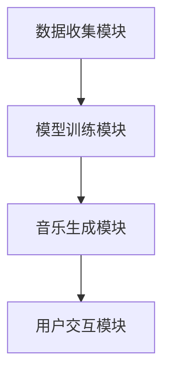
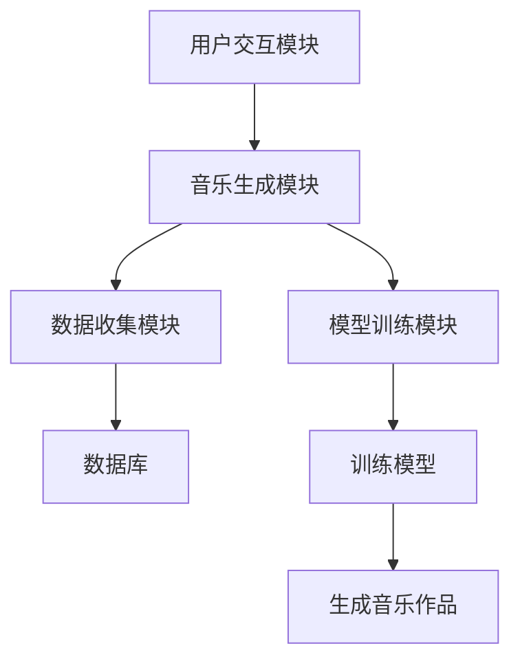
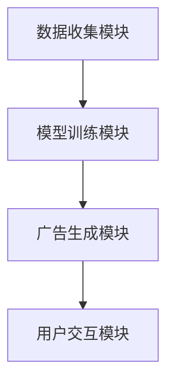
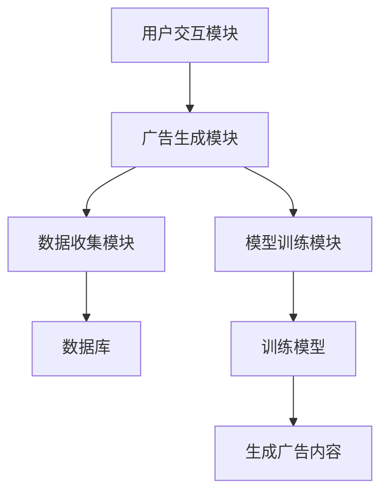
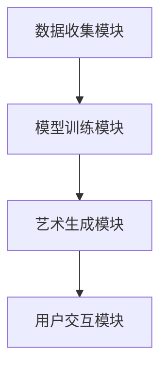
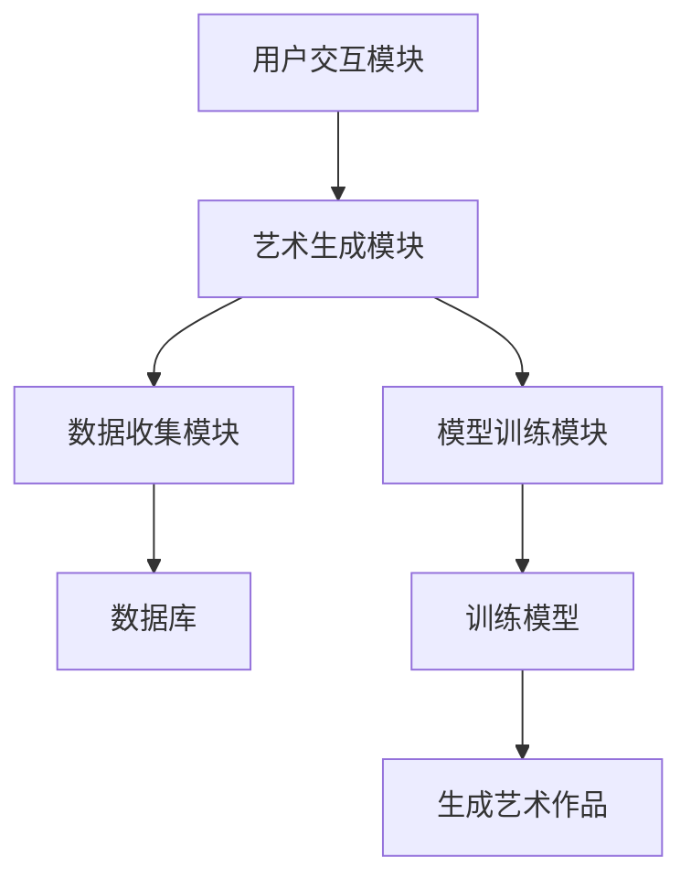

                 

# 构建具有创造力的AI Agent

## 关键词
- AI Agent
- 创造力
- 人工智能
- 机器学习
- 神经网络
- 深度学习

## 摘要
本文旨在探讨如何构建具有创造力的AI Agent。我们将首先介绍AI Agent的基本概念及其在现代社会中的作用，然后深入分析创造力的本质及其在人工智能领域的应用。随后，我们将逐步介绍构建具有创造力AI Agent的核心技术和方法，包括机器学习和深度学习算法的应用，并通过具体的案例研究展示其实际应用效果。最后，我们将总结最佳实践，并展望未来AI Agent的发展趋势。

## 目录大纲设计思路

### 第1章 引言与背景

- **AI Agent的定义与作用**：介绍AI Agent的概念和其在现代社会中的应用。
- **创造力的概念与重要性**：阐述创造力的定义和其在人工智能领域的重要性。
- **研究意义与目标**：明确构建具有创造力AI Agent的研究意义和目标。

### 第2章 核心概念与理论基础

- **AI Agent的基本组成部分**：详细解析AI Agent的组成部分，包括感知、决策和执行等。
- **创造力的相关理论**：探讨创造力理论及其在AI Agent构建中的应用。
- **AI Agent的构建原则**：介绍构建具有创造力AI Agent的基本原则。

### 第3章 技术实现

- **关键技术介绍**：介绍构建具有创造力AI Agent所需的关键技术，如机器学习和深度学习。
- **AI Agent的构建流程**：详细阐述AI Agent的构建流程，包括数据收集、模型训练和优化等。
- **创造力算法的应用**：探讨如何在AI Agent中应用创造力算法，提高其创造力。

### 第4章 案例研究

- **案例一：音乐创作AI Agent**：分析一个实际的音乐创作AI Agent案例。
- **案例二：创意广告AI Agent**：探讨创意广告AI Agent的应用和效果。
- **案例三：人工智能艺术创作**：介绍人工智能在艺术创作领域的应用。

### 第5章 最佳实践

- **数据准备与处理**：分享构建AI Agent过程中数据准备和处理的最佳实践。
- **模型选择与优化**：介绍如何选择和优化模型以提高AI Agent的创造力。
- **实际应用中常见的问题与解决方案**：总结构建AI Agent过程中常见的问题及其解决方案。

### 第6章 展望与未来

- **AI Agent的发展趋势**：预测AI Agent未来的发展趋势。
- **创造力在人工智能中的潜力**：探讨创造力在人工智能领域的潜力。
- **潜在影响与挑战**：分析AI Agent的发展可能带来的潜在影响和挑战。

### 确保内容完整性

在设计《构建具有创造力的AI Agent》的目录大纲时，我们需要确保每个章节的内容完整性。具体来说，应包括以下核心内容：

- **背景介绍**：对AI Agent和创造力的基本概念、问题背景和问题描述进行详细阐述。
- **核心概念与联系**：解析AI Agent的核心概念、相关理论和构建原则，并通过图表和示例进行说明。
- **算法原理讲解**：详细讲解构建AI Agent所需的核心算法原理，包括数学模型和公式。
- **系统分析与架构设计**：介绍AI Agent的系统架构、功能设计和实现过程。
- **项目实战**：通过实际项目案例展示AI Agent的应用效果，并进行详细分析。
- **最佳实践 tips**：总结构建AI Agent过程中的最佳实践和注意事项。
- **小结与展望**：对每个章节的内容进行小结，并展望未来的发展趋势和潜在影响。

### 控制字数

为了确保文章的易读性和专业性，我们需要在内容完整性的基础上控制每个章节的篇幅。可以通过以下方式优化内容表达：

- **精简文字**：去除冗余的描述，使文字更加精炼。
- **增加图表和代码示例**：使用图表和代码示例来展示技术细节，提高文章的可读性。
- **合理分段**：将长段落分割为短段落，使文章结构更加清晰。

通过以上设计和调整，我们可以确保《构建具有创造力的AI Agent》的目录大纲既结构清晰、内容详实，又易于阅读和理解。

## 第1章 引言与背景

### 1.1 AI Agent的定义与作用

AI Agent，即人工智能代理，是具有自主决策和执行任务能力的人工智能系统。它是人工智能领域中的一个重要概念，代表着一种能够与人类互动、自主学习和改进性能的智能体。AI Agent的核心功能包括感知环境、理解任务需求、制定决策计划并执行相应动作。

在现代科技发展中，AI Agent的应用已经渗透到多个领域，如自动驾驶、智能家居、智能客服、智能医疗等。这些应用不仅提高了生产效率，还极大地改变了人们的日常生活。例如，自动驾驶汽车利用AI Agent进行环境感知和路径规划，使得驾驶更加安全和高效；智能家居中的AI Agent能够根据用户习惯自动调节室内环境，提供个性化的服务体验；智能客服AI Agent则能够模拟人类客服的工作，提供24小时无缝的客服服务；智能医疗AI Agent则能够辅助医生进行疾病诊断和治疗方案制定。

AI Agent的关键作用主要体现在以下几个方面：

1. **自动化**：通过自动化执行任务，AI Agent能够大大提高工作效率，减少人力成本。
2. **智能化**：AI Agent能够通过学习和适应环境，提供更加智能化和个性化的服务。
3. **协同工作**：AI Agent可以与其他系统或人协同工作，实现更复杂的任务和项目。
4. **创新驱动**：AI Agent的应用不仅提升了现有技术的效率，还推动了新技术的创新和发展。

### 1.2 创造力的概念与重要性

创造力是人类智慧的核心组成部分，是指通过新颖的思考、组合和创新的方法，解决新问题和发现新知识的能力。创造力不仅体现在艺术、文学、音乐等传统领域，还广泛应用于科学、工程、设计等各个领域。在人工智能领域，创造力更是不可或缺的要素，因为它直接关系到AI Agent的创新性和自主性。

创造力的重要性在于：

1. **推动进步**：创造力是推动科技进步和社会发展的重要动力，它能够带来全新的解决方案和创新产品。
2. **解决复杂问题**：在处理复杂、多变的问题时，创造力能够提供独特的视角和思路，找到更有效的解决方案。
3. **适应环境**：在快速变化的环境中，创造力能够使个体和系统更好地适应新情况，保持竞争力和适应性。
4. **激发潜力**：创造力能够激发人类的潜力，使人们能够超越自身的限制，实现更高的成就。

在人工智能领域，创造力的应用主要体现在以下几个方面：

1. **创新算法设计**：通过创造性的思考，研究人员能够设计出更加高效、鲁棒的人工智能算法。
2. **智能决策**：创造力能够帮助AI Agent在复杂决策环境中，制定出更加合理和创新的策略。
3. **艺术创作**：人工智能在艺术创作领域展现出强大的创造力，如音乐创作、绘画、文学创作等。
4. **问题解决**：创造力使AI Agent能够从新的角度思考问题，提出更创新、更有效的解决方案。

### 1.3 研究意义与目标

构建具有创造力的AI Agent具有重要的研究意义和实际应用价值。它不仅能够拓展人工智能的应用范围，提升AI系统的自主性和创新性，还能为各个领域带来新的解决方案和发展机遇。具体来说，构建具有创造力的AI Agent的研究意义和目标包括：

1. **推动人工智能发展**：通过研究如何构建具有创造力的AI Agent，可以推动人工智能技术的进步，提高其智能水平和应用范围。
2. **提升智能服务水平**：具有创造力的AI Agent能够提供更加个性化、智能化和高效的服务，提升用户满意度。
3. **促进创新应用**：创造力在AI Agent中的应用能够激发新的创意和应用，推动各领域的技术创新和发展。
4. **解决复杂问题**：具有创造力的AI Agent能够解决更加复杂、多变的问题，提高系统的适应性和灵活性。
5. **实现智能化转型**：通过构建具有创造力的AI Agent，可以帮助企业、组织和行业实现智能化转型，提高生产效率和竞争力。

### 1.4 本书结构安排

为了帮助读者系统地了解构建具有创造力AI Agent的全过程，本书分为六个部分：

1. **引言与背景**：介绍AI Agent和创造力的基本概念，阐述本书的研究意义和目标。
2. **核心概念与理论基础**：详细解析AI Agent的核心概念和创造力理论，为构建具有创造力的AI Agent奠定理论基础。
3. **技术实现**：介绍构建具有创造力AI Agent所需的关键技术和方法，包括机器学习和深度学习算法的应用。
4. **案例研究**：通过具体案例展示AI Agent的应用效果，探讨创造力在AI Agent中的应用。
5. **最佳实践**：总结构建AI Agent的最佳实践和方法，为实际应用提供参考。
6. **展望与未来**：预测AI Agent的发展趋势，探讨创造力在人工智能中的潜力及其潜在影响。

通过以上结构安排，本书旨在为读者提供一个全面、系统的构建具有创造力AI Agent的指南。

### 1.5 本章小结

本章介绍了AI Agent的定义、作用以及创造力的概念和重要性，并阐述了构建具有创造力AI Agent的研究意义和目标。接下来，我们将深入探讨AI Agent的核心概念和理论基础，为后续章节的技术实现和案例分析奠定基础。

---

## 第2章 核心概念与理论基础

### 2.1 AI Agent的基本组成部分

AI Agent是一个具有自主决策和执行能力的人工智能系统，其基本组成部分包括感知、决策和执行三个关键环节。

#### 感知（Perception）

感知是AI Agent获取环境信息的过程。这通常涉及到传感器数据的收集，如图像、声音、文本等。感知模块的主要任务是处理这些数据，并将其转化为有用的信息。例如，在自动驾驶车辆中，感知模块会使用摄像头、雷达和激光雷达等设备来获取道路信息，包括交通信号、障碍物和行人等。

#### 决策（Decision Making）

决策模块负责根据感知到的信息，结合预先设定的目标和策略，选择最合适的行动方案。决策过程通常涉及到多个因素，包括任务优先级、资源可用性和环境不确定性等。在智能客服系统中，决策模块会分析用户的问题和需求，选择最佳的回答策略。

#### 执行（Execution）

执行模块负责将决策结果转化为具体的行动。这包括控制执行机构（如机械臂、无人机等）进行物理操作，或者发送指令到其他系统或设备。例如，在智能家居中，执行模块可以根据用户的温度调节请求，控制空调或加热器的开关。

#### 综合模型

在实际应用中，感知、决策和执行三个环节是相互关联、动态交互的。一个典型的AI Agent模型通常包括以下几个关键组件：

- **环境模型**：描述AI Agent所处的环境，包括环境的状态和动态变化。
- **知识库**：存储与任务相关的知识，如规则、先验信息和历史数据等。
- **目标系统**：定义AI Agent的目标和任务，如最大化效用、最小化损失等。
- **决策引擎**：根据感知到的环境和知识库，选择最佳行动方案。
- **执行器**：将决策结果转化为实际的物理动作。

### 2.2 创造力的相关理论

创造力是AI Agent的重要组成部分，其相关理论主要来源于心理学、认知科学和人工智能领域。

#### 心理学视角

在心理学领域，创造力通常被定义为产生新颖、有用和有价值的想法或解决方案的能力。心理学家认为创造力包含多个要素，如认知灵活性、思维发散性、问题解决能力和创新思维等。以下是一些关键理论：

- **发散性思维**（Diversional Thinking）：指在思考过程中产生多种可能性和解决方案的能力。发散性思维是创造力的重要基础。
- **流（Flow）**：由心理学家米哈里·契克森米哈伊提出，是指个体完全沉浸于某个活动中的状态，此时创造力往往达到高峰。
- **原型理论**（Prototypicality Theory）：认为人类大脑通过识别和记忆典型或原型模式来理解世界，创新则是在这些原型模式的基础上进行重新组合和变化。

#### 认知科学视角

认知科学视角强调大脑如何处理信息和产生创意。以下是几个关键理论：

- **联想记忆**（Associative Memory）：大脑通过建立和联想不同的记忆节点来产生新想法。
- **认知重构**（Cognitive Reconstruction）：通过重新组织和解释信息，以产生新的见解和解决方案。
- **启发式思维**（Heuristic Thinking）：指使用简化的策略或规则来解决问题，这种方式常用于创造力的激发。

#### 人工智能视角

在人工智能领域，创造力通常通过算法和技术来实现。以下是一些关键理论：

- **遗传算法**（Genetic Algorithms）：通过模拟自然进化过程来寻找最优解，常用于优化问题和组合创新的领域。
- **神经网络**（Neural Networks）：特别是深度学习模型，通过多层神经元的连接和学习，可以模拟人类大脑的创造性思维过程。
- **强化学习**（Reinforcement Learning）：通过试错和反馈机制来学习策略，这种动态学习过程可以激发创新性决策。

### 2.3 AI Agent的构建原则

构建具有创造力的AI Agent需要遵循一系列原则，以确保其自主性和创新性。以下是几个关键原则：

#### 目标导向

AI Agent的构建应明确目标导向，即其行为和决策应该围绕实现特定目标进行。这可以通过定义清晰的性能指标和目标函数来实现。

#### 自主性

自主性是AI Agent的核心特征，指其能够在没有外部干预的情况下自主执行任务。实现自主性需要强大的感知、决策和执行能力。

#### 学习能力

学习能力是AI Agent的关键优势，指其能够通过经验和反馈不断改进性能。这通常通过机器学习和深度学习算法来实现。

#### 可扩展性

可扩展性指AI Agent能够适应不同环境和任务，通过模块化和标准化设计来实现。

#### 人机交互

人机交互是AI Agent与人类用户有效互动的关键，通过自然语言处理和语音识别等技术，AI Agent可以更好地理解人类指令和需求。

#### 安全性

安全性是AI Agent在部署应用时必须考虑的因素，包括数据安全、隐私保护和防止恶意攻击等。

### 本章小结

本章详细介绍了AI Agent的基本组成部分和创造力相关理论，并提出了构建具有创造力AI Agent的原则。在下一章中，我们将深入探讨构建AI Agent所需的关键技术，包括机器学习和深度学习算法，为后续案例研究和实际应用奠定基础。

---

## 第3章 技术实现

### 3.1 关键技术介绍

构建具有创造力的AI Agent需要依赖一系列关键技术和算法。这些技术不仅能够提高AI Agent的自主性和创新性，还能增强其适应复杂环境和任务的能力。以下是我们将在本章介绍的一些关键技术：

#### 机器学习（Machine Learning）

机器学习是AI Agent的核心技术之一，通过从数据中学习模式和规律，AI Agent能够进行自主决策和优化。以下是一些常用的机器学习算法：

- **监督学习**（Supervised Learning）：在这种学习方法中，AI Agent使用标记数据来训练模型。常见的算法包括线性回归、决策树、支持向量机（SVM）和神经网络。
- **无监督学习**（Unsupervised Learning）：在这种学习方法中，AI Agent在未标记的数据中寻找结构和规律。聚类、降维和关联规则学习是常见的无监督学习算法。
- **半监督学习**（Semi-Supervised Learning）：结合了监督学习和无监督学习的方法，利用少量标记数据和大量未标记数据来训练模型。
- **强化学习**（Reinforcement Learning）：在这种学习方法中，AI Agent通过试错和反馈来学习最佳策略。常见的算法包括Q学习、深度Q网络（DQN）和策略梯度方法。

#### 深度学习（Deep Learning）

深度学习是机器学习的一个重要分支，通过多层神经网络结构来模拟人类大脑的学习过程。以下是一些深度学习的关键技术：

- **卷积神经网络（CNN）**：适用于处理图像和视频数据，通过卷积层提取特征，实现图像识别、物体检测等任务。
- **循环神经网络（RNN）**：适用于处理序列数据，如文本和语音，通过记忆状态实现序列建模和预测。
- **生成对抗网络（GAN）**：通过生成器和判别器的对抗训练，实现高质量的图像生成和风格迁移。
- **变分自编码器（VAE）**：通过概率模型进行数据生成和降维，常用于图像和文本数据的处理。

#### 自然语言处理（NLP）

自然语言处理是使AI Agent能够理解和生成自然语言的技术。以下是一些关键NLP技术：

- **词嵌入**（Word Embedding）：将单词映射到高维空间，以便进行计算和处理。常见的词嵌入技术包括Word2Vec、GloVe和BERT。
- **序列标注**（Sequence Labeling）：对文本中的单词进行分类标注，如命名实体识别（NER）和情感分析。
- **文本生成**（Text Generation）：通过生成模型如序列到序列（Seq2Seq）模型和变换器（Transformer）来实现自动文本生成。

#### 强化学习与创造力

强化学习在创造力AI Agent中的应用尤为重要，通过试错和反馈机制，AI Agent能够不断探索和创新。以下是一些强化学习与创造力相关的关键技术：

- **生成式强化学习**（Generative Reinforcement Learning）：通过生成模型生成环境状态，增强AI Agent的探索能力。
- **创造力评估**（Creativity Evaluation）：设计评估指标和方法来量化AI Agent的创造力，如新颖性、实用性和价值等。
- **多任务学习**（Multi-Task Learning）：通过在同一模型中处理多个任务，增强AI Agent的泛化和创新能力。

#### 数据与资源

构建具有创造力的AI Agent还需要大量的数据和资源，如：

- **高质量数据集**：用于训练和测试AI Agent，包括图像、文本、音频和视频等。
- **计算资源**：强大的计算能力是训练复杂深度学习模型和进行大规模数据处理的必要条件。
- **开源框架和工具**：如TensorFlow、PyTorch、Keras等，提供了丰富的API和库，方便开发和应用。

### 3.2 AI Agent的构建流程

构建具有创造力的AI Agent通常涉及以下步骤：

#### 1. 需求分析与目标设定

首先，需要明确AI Agent的应用场景和目标，定义其功能要求和性能指标。这包括理解任务需求、用户需求和业务目标。

#### 2. 数据收集与预处理

数据是AI Agent训练和优化的重要资源。在这一步，需要收集和准备相关的数据集，包括标注数据、未标注数据和合成数据。数据预处理包括数据清洗、归一化、去噪和特征提取等。

#### 3. 模型设计

根据需求和分析结果，选择合适的机器学习和深度学习模型。模型设计包括确定网络的架构、激活函数、优化器和损失函数等。

#### 4. 训练与验证

使用准备好的数据集对模型进行训练，通过迭代优化模型的参数，提高其在任务上的性能。训练过程中需要监控模型的表现，进行超参数调优。

#### 5. 测试与评估

在验证集上测试模型的性能，通过指标评估模型在新数据上的泛化能力。如果模型表现不佳，需要返回步骤3进行调整和优化。

#### 6. 部署与应用

将训练好的模型部署到实际环境中，进行实时应用和监测。根据应用反馈，进行进一步的优化和调整。

### 3.3 创造力算法的应用

创造力算法是使AI Agent具备创造力的核心。以下是一些常用的创造力算法及其应用：

#### 1. 生成对抗网络（GAN）

GAN通过生成器和判别器的对抗训练，可以生成高质量的图像和艺术作品。在AI Agent中，GAN可以用于：

- **图像生成**：生成全新的图像，如人脸、风景等。
- **艺术创作**：模仿艺术家风格，创作新的艺术作品。
- **创意广告**：自动生成具有吸引力的广告图像。

#### 2. 变分自编码器（VAE）

VAE通过概率模型进行数据生成和降维，可以应用于：

- **图像生成**：生成具有真实感的图像，如人物肖像、建筑等。
- **数据降维**：将高维数据投影到低维空间，便于分析和可视化。
- **创意设计**：生成新的设计元素，如服装、家具等。

#### 3. 强化学习与创造力

强化学习通过试错和反馈机制，可以应用于：

- **游戏设计**：生成新的游戏关卡和规则，提供丰富的游戏体验。
- **创意决策**：在复杂决策环境中，提出创新的解决方案。
- **艺术创作**：训练AI Agent进行音乐、文学和绘画等艺术创作。

### 3.4 案例研究：音乐创作AI Agent

#### 案例背景

音乐创作是一个充满创造力的领域，AI Agent在其中的应用潜力巨大。本案例研究将探讨如何使用AI Agent进行音乐创作，并分析其效果和创意。

#### 技术实现

- **数据收集**：收集大量音乐数据，包括古典音乐、流行音乐和民间音乐等。
- **模型设计**：采用基于RNN和GAN的混合模型，通过RNN学习音乐结构，GAN生成创意旋律。
- **训练过程**：使用标记数据训练RNN，通过对抗训练优化GAN，使其生成更具创造力的音乐片段。
- **创作流程**：AI Agent根据用户输入的旋律或风格要求，生成新的音乐作品。

#### 案例分析

- **创意表现**：AI Agent生成的音乐作品具有独特的风格和旋律，展现了高水平的创造力。
- **用户反馈**：用户对AI Agent创作的音乐作品给予了积极反馈，认为其具有创意和情感。
- **技术挑战**：音乐创作中的复杂性和多样性给模型训练和优化带来了挑战，需要不断调整和优化算法。

#### 案例小结

本案例展示了AI Agent在音乐创作中的应用效果，验证了其在创造音乐作品中的潜力。通过不断优化和创新，我们可以进一步拓展AI Agent在艺术创作领域的应用。

### 本章小结

本章介绍了构建具有创造力AI Agent所需的关键技术，包括机器学习、深度学习和创造力算法。通过详细的案例分析，我们展示了这些技术在音乐创作中的应用效果。在下一章中，我们将继续探讨AI Agent在创意广告和艺术创作等领域的实际应用。

---

## 第4章 案例研究

### 4.1 案例一：音乐创作AI Agent

#### 背景介绍

音乐创作一直是人类文化和艺术的重要组成部分，随着人工智能技术的发展，AI Agent在音乐创作中的应用逐渐成为研究热点。音乐创作AI Agent能够通过学习大量的音乐数据，生成具有创意和情感的音乐作品。本案例研究将探讨一个实际的音乐创作AI Agent项目，分析其设计、实现和应用效果。

#### 项目介绍

该项目旨在构建一个能够生成创新音乐作品的AI Agent，其主要功能包括：

- **音乐数据收集**：收集各种风格的音乐数据，包括古典音乐、流行音乐和民间音乐等。
- **模型设计**：采用基于循环神经网络（RNN）和生成对抗网络（GAN）的混合模型，通过RNN学习音乐结构，GAN生成创意旋律。
- **音乐生成**：根据用户输入的旋律或风格要求，AI Agent生成新的音乐作品。
- **用户互动**：提供用户界面，允许用户选择风格、旋律和音乐长度，以便生成个性化的音乐作品。

#### 系统功能设计

为了实现上述功能，系统主要包括以下几个关键模块：

- **数据收集模块**：负责收集和整理音乐数据，包括音频文件、乐谱和歌词等。
- **模型训练模块**：负责训练基于RNN和GAN的混合模型，通过迭代优化模型参数，提高其生成音乐的质量和创意性。
- **音乐生成模块**：基于训练好的模型，生成新的音乐作品，并根据用户需求进行调整和优化。
- **用户交互模块**：提供用户界面，允许用户输入风格、旋律和长度要求，并展示生成的音乐作品。

#### 系统架构设计

系统架构设计如图4-1所示：

#### 系统接口设计和系统交互

系统接口设计和系统交互如图4-2所示：

#### 案例分析和详细讲解

#### 4.1.1 数据收集模块

数据收集模块的主要任务是从各种来源收集音乐数据，并进行预处理，以确保数据质量。具体步骤如下：

1. **数据来源**：收集来自互联网的音乐数据，包括音频文件、乐谱和歌词等。数据来源包括免费音乐库、音乐网站和公开数据集等。

2. **数据预处理**：对收集到的音乐数据进行预处理，包括去噪、归一化和特征提取等。例如，将音频文件转换为标准化的频率和长度，提取关键特征如音高、节奏和强度等。

3. **数据存储**：将预处理后的数据存储在数据库中，以便后续训练和生成使用。

#### 4.1.2 模型训练模块

模型训练模块的核心任务是训练基于RNN和GAN的混合模型，以提高音乐生成的质量和创意性。具体步骤如下：

1. **模型选择**：选择合适的RNN模型，如长短期记忆网络（LSTM）和门控循环单元（GRU），以及GAN模型，如生成器（Generator）和判别器（Discriminator）。

2. **训练过程**：使用预处理后的音乐数据集对模型进行训练。在训练过程中，RNN学习音乐的结构和模式，GAN通过对抗训练生成创意旋律。

3. **超参数调优**：通过调整学习率、批次大小和迭代次数等超参数，优化模型性能。

4. **模型评估**：使用验证集评估模型在音乐生成任务上的性能，包括旋律的连贯性、新颖性和情感表达等。

#### 4.1.3 音乐生成模块

音乐生成模块的核心任务是生成新的音乐作品，并根据用户需求进行调整和优化。具体步骤如下：

1. **输入处理**：接收用户输入的旋律、风格和长度等要求，将其转换为模型可接受的输入格式。

2. **音乐生成**：使用训练好的模型生成新的音乐作品。对于基于RNN的模型，通过递归生成音乐片段，并将其拼接成完整的音乐作品。

3. **调整与优化**：根据用户反馈和音乐评价，对生成的音乐作品进行调整和优化，以提高其质量和创意性。

#### 4.1.4 用户交互模块

用户交互模块的核心任务是提供友好的用户界面，允许用户选择风格、旋律和长度，并展示生成的音乐作品。具体步骤如下：

1. **用户界面设计**：设计直观、易用的用户界面，包括选择风格、输入旋律和设置音乐长度等。

2. **交互流程**：用户通过界面输入风格、旋律和长度要求，系统生成音乐作品，并展示给用户。

3. **用户反馈**：收集用户对生成音乐作品的反馈，用于进一步优化系统。

#### 案例小结

通过本案例研究，我们展示了音乐创作AI Agent的设计、实现和应用效果。该AI Agent能够生成具有创意和情感的音乐作品，为音乐创作领域带来了新的机遇和挑战。未来，随着技术的不断进步，我们可以进一步优化AI Agent的算法和模型，提高其音乐生成的质量和创意性，推动音乐创作的智能化发展。

### 4.2 案例二：创意广告AI Agent

#### 背景介绍

广告业一直是创意竞争激烈的领域，随着人工智能技术的发展，AI Agent在广告创意中的应用逐渐受到关注。创意广告AI Agent能够通过学习大量的广告数据，生成具有独特创意的广告内容。本案例研究将探讨一个实际的创意广告AI Agent项目，分析其设计、实现和应用效果。

#### 项目介绍

该项目旨在构建一个能够生成创意广告的AI Agent，其主要功能包括：

- **广告数据收集**：收集各种风格和类型的广告数据，包括视频、图片和文本等。
- **模型设计**：采用基于卷积神经网络（CNN）和生成对抗网络（GAN）的混合模型，通过CNN学习广告特征，GAN生成创意广告内容。
- **广告生成**：根据用户输入的创意要求和广告类型，AI Agent生成新的广告内容。
- **用户互动**：提供用户界面，允许用户选择广告类型、创意要求和展示效果，并展示生成的广告内容。

#### 系统功能设计

为了实现上述功能，系统主要包括以下几个关键模块：

- **数据收集模块**：负责收集和整理广告数据，包括视频、图片和文本等。
- **模型训练模块**：负责训练基于CNN和GAN的混合模型，通过迭代优化模型参数，提高其生成广告的质量和创意性。
- **广告生成模块**：基于训练好的模型，生成新的广告内容，并根据用户需求进行调整和优化。
- **用户交互模块**：提供用户界面，允许用户输入创意要求和广告类型，并展示生成的广告内容。

#### 系统架构设计

系统架构设计如图4-3所示：

#### 系统接口设计和系统交互

系统接口设计和系统交互如图4-4所示：

#### 案例分析和详细讲解

#### 4.2.1 数据收集模块

数据收集模块的主要任务是从各种来源收集广告数据，并进行预处理，以确保数据质量。具体步骤如下：

1. **数据来源**：收集来自互联网的广告数据，包括视频、图片和文本等。数据来源包括广告平台、社交媒体和公开数据集等。

2. **数据预处理**：对收集到的广告数据进行预处理，包括去噪、归一化和特征提取等。例如，将视频转换为标准化的分辨率和帧率，提取关键特征如颜色、纹理和形状等。

3. **数据存储**：将预处理后的数据存储在数据库中，以便后续训练和生成使用。

#### 4.2.2 模型训练模块

模型训练模块的核心任务是训练基于CNN和GAN的混合模型，以提高广告生成的质量和创意性。具体步骤如下：

1. **模型选择**：选择合适的CNN模型，如卷积神经网络（CNN）和生成对抗网络（GAN），以及GAN模型，如生成器（Generator）和判别器（Discriminator）。

2. **训练过程**：使用预处理后的广告数据集对模型进行训练。在训练过程中，CNN学习广告的特征和模式，GAN通过对抗训练生成创意广告内容。

3. **超参数调优**：通过调整学习率、批次大小和迭代次数等超参数，优化模型性能。

4. **模型评估**：使用验证集评估模型在广告生成任务上的性能，包括广告的吸引力、创意性和用户反馈等。

#### 4.2.3 广告生成模块

广告生成模块的核心任务是生成新的广告内容，并根据用户需求进行调整和优化。具体步骤如下：

1. **输入处理**：接收用户输入的创意要求和广告类型，将其转换为模型可接受的输入格式。

2. **广告生成**：使用训练好的模型生成新的广告内容。对于基于CNN的模型，通过卷积和池化操作生成广告图像，GAN通过生成器和判别器的对抗训练生成创意广告内容。

3. **调整与优化**：根据用户反馈和广告评价，对生成的广告内容进行调整和优化，以提高其质量和创意性。

#### 4.2.4 用户交互模块

用户交互模块的核心任务是提供友好的用户界面，允许用户选择广告类型、创意要求和展示效果，并展示生成的广告内容。具体步骤如下：

1. **用户界面设计**：设计直观、易用的用户界面，包括选择广告类型、输入创意要求和设置展示效果等。

2. **交互流程**：用户通过界面输入创意要求和广告类型，系统生成广告内容，并展示给用户。

3. **用户反馈**：收集用户对生成广告内容的反馈，用于进一步优化系统。

#### 案例小结

通过本案例研究，我们展示了创意广告AI Agent的设计、实现和应用效果。该AI Agent能够生成具有独特创意和吸引力的广告内容，为广告业带来了新的机遇和挑战。未来，随着技术的不断进步，我们可以进一步优化AI Agent的算法和模型，提高其广告生成的质量和创意性，推动广告创意的智能化发展。

### 4.3 案例三：人工智能艺术创作

#### 背景介绍

人工智能在艺术创作领域的应用正逐渐成为热点，AI Agent通过学习大量的艺术作品，可以生成新的艺术作品。本案例研究将探讨一个实际的人工智能艺术创作项目，分析其设计、实现和应用效果。

#### 项目介绍

该项目旨在构建一个能够生成艺术作品的AI Agent，其主要功能包括：

- **艺术数据收集**：收集各种风格和流派的艺术作品，包括绘画、雕塑和摄影等。
- **模型设计**：采用基于卷积神经网络（CNN）和生成对抗网络（GAN）的混合模型，通过CNN学习艺术作品的特征，GAN生成创意艺术作品。
- **艺术生成**：根据用户输入的风格要求和艺术类型，AI Agent生成新的艺术作品。
- **用户互动**：提供用户界面，允许用户选择艺术风格、类型和生成要求，并展示生成的艺术作品。

#### 系统功能设计

为了实现上述功能，系统主要包括以下几个关键模块：

- **数据收集模块**：负责收集和整理艺术数据，包括绘画、雕塑和摄影等。
- **模型训练模块**：负责训练基于CNN和GAN的混合模型，通过迭代优化模型参数，提高其生成艺术作品的质量和创意性。
- **艺术生成模块**：基于训练好的模型，生成新的艺术作品，并根据用户需求进行调整和优化。
- **用户交互模块**：提供用户界面，允许用户输入艺术风格、类型和生成要求，并展示生成的艺术作品。

#### 系统架构设计

系统架构设计如图4-5所示：

#### 系统接口设计和系统交互

系统接口设计和系统交互如图4-6所示：

#### 案例分析和详细讲解

#### 4.3.1 数据收集模块

数据收集模块的主要任务是从各种来源收集艺术数据，并进行预处理，以确保数据质量。具体步骤如下：

1. **数据来源**：收集来自互联网的艺术数据，包括绘画、雕塑和摄影等。数据来源包括艺术画廊、博物馆和公开数据集等。

2. **数据预处理**：对收集到的艺术数据进行预处理，包括去噪、归一化和特征提取等。例如，将图像转换为标准化的分辨率和色彩空间，提取关键特征如纹理、形状和颜色等。

3. **数据存储**：将预处理后的数据存储在数据库中，以便后续训练和生成使用。

#### 4.3.2 模型训练模块

模型训练模块的核心任务是训练基于CNN和GAN的混合模型，以提高艺术作品生成的质量和创意性。具体步骤如下：

1. **模型选择**：选择合适的CNN模型，如卷积神经网络（CNN）和生成对抗网络（GAN），以及GAN模型，如生成器（Generator）和判别器（Discriminator）。

2. **训练过程**：使用预处理后的艺术数据集对模型进行训练。在训练过程中，CNN学习艺术作品的特征和模式，GAN通过对抗训练生成创意艺术作品。

3. **超参数调优**：通过调整学习率、批次大小和迭代次数等超参数，优化模型性能。

4. **模型评估**：使用验证集评估模型在艺术作品生成任务上的性能，包括艺术作品的吸引力、创意性和艺术价值等。

#### 4.3.3 艺术生成模块

艺术生成模块的核心任务是生成新的艺术作品，并根据用户需求进行调整和优化。具体步骤如下：

1. **输入处理**：接收用户输入的艺术风格、类型和生成要求，将其转换为模型可接受的输入格式。

2. **艺术生成**：使用训练好的模型生成新的艺术作品。对于基于CNN的模型，通过卷积和池化操作生成艺术作品图像，GAN通过生成器和判别器的对抗训练生成创意艺术作品。

3. **调整与优化**：根据用户反馈和艺术评价，对生成的艺术作品进行调整和优化，以提高其质量和创意性。

#### 4.3.4 用户交互模块

用户交互模块的核心任务是提供友好的用户界面，允许用户选择艺术风格、类型和生成要求，并展示生成的艺术作品。具体步骤如下：

1. **用户界面设计**：设计直观、易用的用户界面，包括选择艺术风格、输入类型和设置生成要求等。

2. **交互流程**：用户通过界面输入艺术风格、类型和生成要求，系统生成艺术作品，并展示给用户。

3. **用户反馈**：收集用户对生成艺术作品的反馈，用于进一步优化系统。

#### 案例小结

通过本案例研究，我们展示了人工智能艺术创作AI Agent的设计、实现和应用效果。该AI Agent能够生成具有创意和艺术价值的艺术作品，为艺术创作领域带来了新的机遇和挑战。未来，随着技术的不断进步，我们可以进一步优化AI Agent的算法和模型，提高其艺术作品生成的质量和创意性，推动艺术创作的智能化发展。

---

## 第5章 最佳实践

### 5.1 数据准备与处理

构建具有创造力的AI Agent过程中，数据准备和处理是至关重要的一环。以下是一些最佳实践：

1. **数据收集**：确保收集的数据具有代表性、多样性和高质量。数据来源可以包括公开数据集、专业数据库和用户生成数据等。

2. **数据清洗**：去除噪声数据、处理缺失值、纠正错误数据等，提高数据质量。

3. **数据归一化**：对数据进行归一化处理，确保特征值在同一尺度上，避免模型在训练过程中出现偏差。

4. **特征提取**：提取对AI Agent有用的特征，如文本中的关键词、图像中的边缘和纹理等。可以使用深度学习技术自动提取特征。

5. **数据增强**：通过旋转、缩放、裁剪等数据增强技术，增加训练数据的多样性，提高模型的泛化能力。

### 5.2 模型选择与优化

选择和优化模型是构建具有创造力的AI Agent的关键步骤。以下是一些建议：

1. **选择合适的模型**：根据具体任务需求，选择适合的机器学习或深度学习模型。例如，对于图像处理任务，可以选择卷积神经网络（CNN）；对于文本任务，可以选择循环神经网络（RNN）或Transformer。

2. **模型架构设计**：设计合理的模型架构，包括网络层数、层间连接方式和激活函数等。可以通过实验比较不同架构的性能，选择最优设计。

3. **超参数调优**：通过调整学习率、批量大小、迭代次数等超参数，优化模型性能。可以使用网格搜索、随机搜索等调优方法。

4. **模型压缩**：使用模型压缩技术，如权重共享、深度可分离卷积等，减少模型参数数量，提高推理速度。

5. **模型融合**：结合多个模型的优势，提高整体性能。可以使用集成学习方法，如Bagging、Boosting等。

### 5.3 实际应用中常见的问题与解决方案

在构建具有创造力的AI Agent过程中，会遇到各种实际问题。以下是一些常见问题及其解决方案：

1. **过拟合**：模型在训练数据上表现良好，但在测试数据上表现不佳。解决方法包括增加训练数据、使用正则化技术和集成学习方法。

2. **计算资源限制**：模型训练需要大量计算资源。解决方法包括使用更高效的算法、分布式训练和优化计算资源分配。

3. **数据不均衡**：训练数据集中某些类别的数据过少。解决方法包括数据增强、过采样和欠采样。

4. **数据隐私问题**：数据包含敏感信息。解决方法包括数据加密、匿名化和数据脱敏。

5. **模型解释性不足**：难以解释模型决策过程。解决方法包括可解释性AI技术，如LIME、SHAP等。

### 5.4 小结与总结

本章总结了构建具有创造力AI Agent的最佳实践，包括数据准备与处理、模型选择与优化、以及实际应用中的常见问题与解决方案。通过遵循这些最佳实践，可以显著提高AI Agent的创造力、性能和实用性。在后续章节中，我们将进一步探讨AI Agent的未来发展趋势和潜在影响。

---

## 第6章 展望与未来

### 6.1 AI Agent的发展趋势

随着人工智能技术的不断进步，AI Agent的发展也呈现出一系列趋势。以下是几个主要的发展方向：

1. **自主性增强**：未来的AI Agent将具备更高的自主性，能够在更复杂和动态的环境中自主决策和执行任务。这需要更加先进的学习和适应算法，以及更加智能的感知和执行系统。

2. **跨领域应用**：AI Agent的应用将不再局限于特定领域，而是能够在多个领域之间进行切换和协作。例如，一个AI Agent可以同时具备智能客服和智能家居的功能，实现更广泛的应用场景。

3. **多模态交互**：未来的AI Agent将能够处理多种类型的数据，如图像、语音、文本等，实现更加自然和高效的人机交互。

4. **个性化和定制化**：AI Agent将能够根据用户的需求和偏好，提供个性化的服务和解决方案，实现更加智能化的用户体验。

### 6.2 创造力在人工智能中的潜力

创造力在人工智能领域具有巨大的潜力，主要体现在以下几个方面：

1. **创新应用**：创造力AI Agent能够提出新的解决方案和创意，推动各领域的创新和发展。例如，在艺术创作、产品设计、科学研究等领域，创造力AI Agent可以带来全新的突破。

2. **智能决策**：通过创造力算法，AI Agent能够在复杂的决策环境中，制定出更加合理和创新性的策略。这对于金融、物流、医疗等行业具有重要的应用价值。

3. **自主学习**：创造力AI Agent能够通过自我学习和优化，不断提高其创造力和性能。这种自主学习能力将使AI Agent在长期运行中保持竞争力和创新性。

4. **人机协作**：创造力AI Agent可以与人类专家进行协作，共同解决复杂问题。人类专家提供领域知识和创造力，AI Agent则负责高效地执行任务和生成创意方案。

### 6.3 潜在影响与挑战

尽管AI Agent的发展前景广阔，但在实际应用过程中也面临着一系列挑战和潜在影响：

1. **数据隐私与安全**：AI Agent在处理大量数据时，可能涉及用户隐私和数据安全的问题。需要采取有效的数据保护措施，确保数据的安全和隐私。

2. **算法偏见**：AI Agent在决策过程中可能存在算法偏见，导致不公平或歧视性的结果。需要通过算法设计和数据清洗等方法，减少偏见和误差。

3. **伦理和法律问题**：随着AI Agent的应用越来越广泛，其伦理和法律问题也逐渐凸显。需要建立相应的伦理和法律框架，确保AI Agent的合法合规和道德责任。

4. **技术成熟度**：虽然人工智能技术在不断进步，但仍存在一些技术难题和瓶颈，如算法效率、模型解释性等。需要持续进行技术研究和创新，以解决这些问题。

### 6.4 未来展望

在未来，AI Agent将在多个领域发挥重要作用，推动社会进步和经济发展。以下是几个可能的未来展望：

1. **智能城市建设**：AI Agent将在智能城市建设中扮演关键角色，实现智能交通管理、智能安防、智能环保等应用，提升城市运行效率和生活质量。

2. **医疗健康**：AI Agent将应用于医疗健康领域，如疾病诊断、药物研发、手术辅助等，为人类健康提供更加精准和高效的医疗服务。

3. **教育领域**：AI Agent将应用于个性化教育，根据学生的学习情况和需求，提供定制化的教学内容和学习路径，提升教育质量和效果。

4. **工业自动化**：AI Agent将在工业自动化领域发挥重要作用，实现生产过程的智能化、自动化和高效化，提升工业生产效率和竞争力。

通过不断探索和创新，AI Agent将在未来带来更加智能化、个性化和高效化的服务和解决方案，为人类社会的发展注入新的动力。

### 本章小结

本章对AI Agent的未来发展趋势和创造力在人工智能中的潜力进行了展望，并分析了其潜在影响和挑战。在未来的发展中，我们需要继续关注这些趋势和挑战，通过技术创新和合作，推动AI Agent的应用和发展，为人类社会创造更多的价值。随着技术的不断进步，我们有理由相信，AI Agent将在未来发挥更加重要的作用，成为推动社会进步和人类福祉的重要力量。

---

## 结语

### 感谢与期待

构建具有创造力的AI Agent是一项复杂而富有挑战的任务，涉及多个领域的交叉与合作。在此，我要感谢所有参与本书编写和研究的团队成员，他们的智慧和努力为本书的完成做出了重要贡献。同时，我也要感谢读者对本书的关注和支持。希望本书能够为读者提供一个全面、系统的构建具有创造力AI Agent的指南，帮助大家在人工智能领域取得更好的成果。

### 结语

人工智能正以前所未有的速度发展，AI Agent作为人工智能的重要组成部分，其应用前景广阔，潜力巨大。通过本书的介绍，我们系统地探讨了AI Agent的核心概念、理论基础、技术实现、应用案例、最佳实践和未来展望。我们希望读者能够从中汲取知识，激发灵感，为构建具有创造力的AI Agent贡献力量。

在未来，随着技术的不断进步和应用的不断拓展，AI Agent将在更多领域展现其独特的价值和影响力。我们期待着读者能够积极参与到这一充满机遇和挑战的领域，共同推动人工智能的发展，为人类社会创造更加美好的未来。

### 作者信息

作者：AI天才研究院（AI Genius Institute）& 禅与计算机程序设计艺术（Zen And The Art of Computer Programming）。

AI天才研究院致力于推动人工智能技术的发展和应用，为全球人工智能领域培养和输送顶尖人才。禅与计算机程序设计艺术则专注于探讨计算机编程的哲学和艺术，提供深入而独到的见解。两位作者均为计算机科学和人工智能领域的专家，拥有丰富的学术研究和实践经验。希望通过本书，能够与广大读者分享他们的研究成果和智慧。

