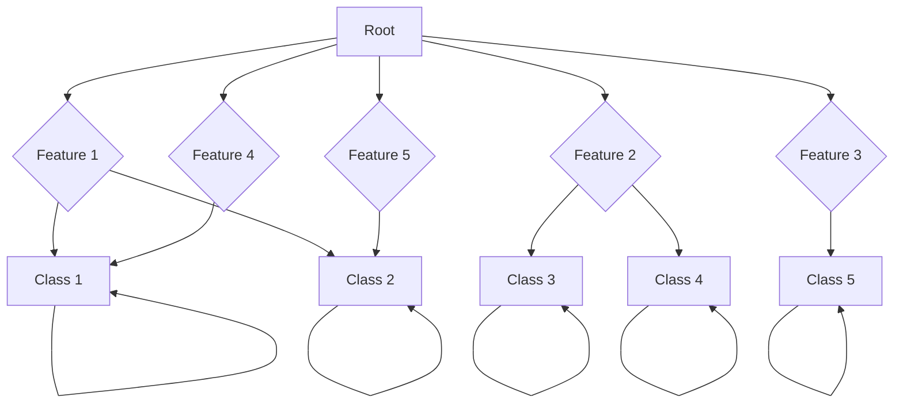
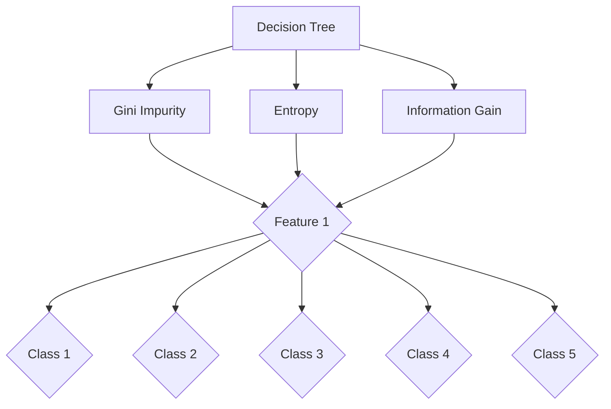
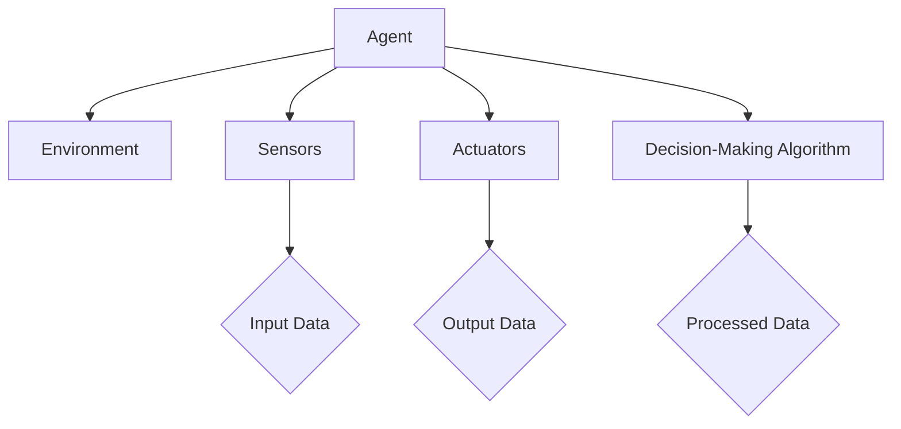
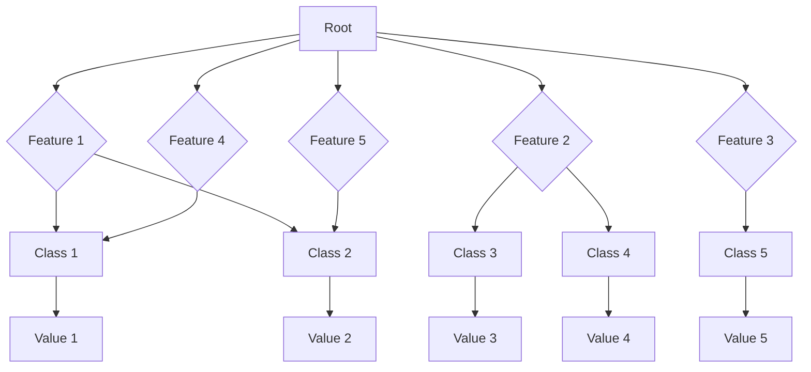
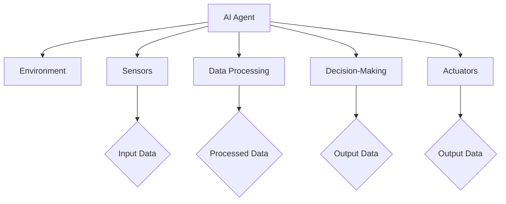
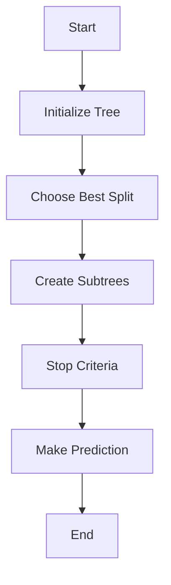
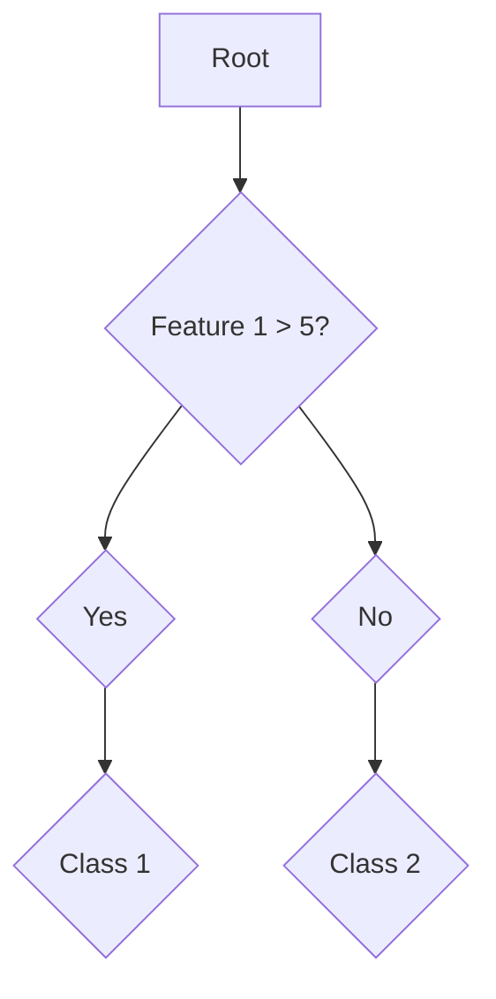

                 

### Introduction to Building AI Agents with Interpretable Decision Trees

Keywords: Interpretable Decision Trees, AI Agents, Machine Learning, Interpretability, Decision-Making

Abstract: This article delves into the construction of AI agents equipped with interpretable decision trees, a crucial aspect of machine learning and artificial intelligence. We will explore the background of decision trees, their evolution, and the significance of AI agents in modern technology. Furthermore, we will focus on the concept of interpretability, the challenges it poses, and how to achieve it in decision tree models. By the end of this article, readers will gain a comprehensive understanding of the theory, implementation, and practical applications of building AI agents with interpretable decision trees.

### Part 1: Introduction to Decision Trees and AI Agents

#### 1.1 Background of Decision Trees and AI Agents

**1.1.1 The Evolution of Decision Trees**

Decision trees are a fundamental tool in the field of machine learning. They were first introduced by Leo Breiman and colleagues in the 1980s as a powerful and intuitive method for data analysis and decision-making. Over the years, decision trees have evolved and become an integral part of various machine learning applications due to their simplicity and interpretability. The basic idea behind decision trees is to split the dataset into subsets based on the values of input features, leading to a tree structure where each internal node represents a feature, each branch represents a decision rule, and each leaf node represents the outcome or class label.

**1.1.2 Basics of AI Agents**

AI agents are entities that can perceive their environment through sensors, take actions, and achieve specific goals based on their decision-making capabilities. These agents are designed to mimic human intelligence and are equipped with algorithms that enable them to learn from experience and improve their performance over time. AI agents can be found in various applications, such as autonomous vehicles, robotics, and virtual assistants. The primary goal of AI agents is to make decisions that maximize their utility or achieve their objectives efficiently.

**1.1.3 Importance and Applications**

Decision trees have been widely adopted in numerous applications due to their simplicity and interpretability. They are used in various domains, including finance, healthcare, marketing, and agriculture. For example, in finance, decision trees can be used for credit scoring, risk assessment, and investment portfolio management. In healthcare, decision trees can help in diagnosing diseases and predicting patient outcomes. In marketing, they can be used for customer segmentation, personalized recommendations, and campaign optimization. AI agents, on the other hand, are playing an increasingly important role in automating complex tasks, improving efficiency, and enhancing decision-making processes.

#### 1.2 Basic Concepts and Theoretical Foundations

**1.2.1 Key Concepts in Decision Trees**

To understand decision trees, it is essential to be familiar with some fundamental concepts:

- **Tree Structure:** A decision tree is a flowchart-like structure where each internal node represents a "test" or "decision" based on the value of an input feature, each branch represents the outcome of the test, and each leaf node represents a class label or decision.
- **Gini Impurity:** Gini impurity is a measure of how often a randomly chosen element appears in the wrong subset. It is used to determine the quality of a split in a decision tree. The lower the Gini impurity, the better the split.
- **Entropy:** Entropy is a measure of the unpredictability or disorder in a dataset. It is used in decision trees to evaluate the quality of a split. The lower the entropy, the better the split.

**1.2.2 Introduction to AI Agents**

AI agents are designed to perform tasks that would typically require human intelligence. They are equipped with sensors to perceive their environment, actuators to take actions, and decision-making algorithms to make informed choices. The primary components of an AI agent include:

- **Sensors:** Sensors are used to gather information from the environment. They can be cameras, microphones, temperature sensors, or any other device that can provide input to the agent.
- ** Actuators:** Actuators are devices that allow the agent to interact with the environment. They can be motors, servos, robotic arms, or any other device that can execute actions based on the agent's decisions.
- ** Decision-Making Algorithms:** Decision-making algorithms are the core of an AI agent. They process the information collected by sensors, evaluate different actions, and make decisions that maximize the agent's utility or achieve its goals.

**1.2.3 Interpretable AI: Concept and Significance**

Interpretable AI refers to the ability of AI models to provide explanations for their predictions or decisions. It is an essential aspect of AI, especially in applications where transparency and trust are critical. Interpretable AI helps in understanding the decision-making process of AI agents, detecting biases, and ensuring fairness and accountability. In addition, it enables domain experts to validate and improve the performance of AI models. Interpretable AI is particularly important in applications where human decision-makers need to trust and understand the recommendations of AI agents.

#### 1.3 Mermaid Diagrams for Decision Trees

Mermaid is a popular markdown syntax for generating diagrams, including flowcharts, gantt charts, and sequence diagrams. In this section, we will use Mermaid to illustrate the structure of decision trees and the common algorithms used in their construction.

**1.3.1 Structure of Decision Trees**

The following Mermaid diagram shows the structure of a basic decision tree:



In this diagram, the root node represents the initial decision point, and each internal node represents a feature. The leaf nodes represent the class labels or decisions.

**1.3.2 Common Algorithms in Decision Trees**

There are several common algorithms used to construct decision trees, including Gini impurity, entropy, and information gain. The following Mermaid diagram illustrates these algorithms:



In this diagram, the decision tree is split based on the values of feature 1, and the algorithms are used to evaluate the quality of the splits. Gini impurity, entropy, and information gain are used to determine the optimal splits in the decision tree.

#### 1.4 Mermaid Diagrams for AI Agents

In this section, we will use Mermaid diagrams to illustrate the components and architecture of AI agents.

**1.4.1 Components of AI Agents**

The following Mermaid diagram shows the key components of an AI agent:



In this diagram, the agent interacts with the environment through sensors and actuators. The decision-making algorithm processes the input data collected by sensors and generates output data for the actuators to execute.

**1.4.2 Classification and Regression Trees (CART) in AI**

CART is a popular algorithm used in decision trees for both classification and regression tasks. The following Mermaid diagram illustrates the structure of a CART:



In this diagram, the root node represents the initial decision point, and each internal node represents a feature. The leaf nodes represent the class labels or predictions for regression tasks.

**1.4.3 Mermaid Diagrams for AI Agents**

The following Mermaid diagram illustrates the overall architecture of an AI agent:



In this diagram, the AI agent interacts with the environment through sensors and actuators. The data processing module processes the input data collected by sensors, and the decision-making module generates output data for the actuators to execute.

### Part 2: Interpretable Decision Trees

#### 2.1 Properties of Interpretable Decision Trees

**2.1.1 Transparency and Interpretability**

Interpretable decision trees are designed to be transparent and easy to understand. They provide clear explanations for their predictions or decisions, allowing domain experts and end-users to trust and validate the model's output. Transparency and interpretability are crucial in various applications, such as healthcare, finance, and legal systems, where the consequences of incorrect predictions can be severe.

**2.1.2 Challenges in Interpretable Decision Trees**

Despite their advantages, interpretable decision trees face several challenges:

- **Complexity:** As decision trees grow in size and depth, they can become more complex and difficult to interpret. This complexity can obscure the decision process and make it challenging for domain experts to understand the model's behavior.
- **Overfitting:** Overfitting occurs when a decision tree model is too complex and captures noise in the training data. This can lead to poor generalization performance on unseen data, making the model unreliable.
- **Scalability:** Interpretable decision trees may become less scalable as the dataset size and feature dimensionality increase. This can limit their applicability in large-scale data analytics and real-time applications.

**2.1.3 Importance of Interpretable AI in Decision Making**

Interpretable AI is essential in decision-making processes for several reasons:

- **Trust and Accountability:** Interpretable models help build trust and accountability in AI applications. When models are transparent, it is easier to understand and validate their predictions, which enhances trust in AI systems.
- **Bias Detection and Mitigation:** Interpretable models can reveal biases in the training data and decision-making process, enabling domain experts to address and mitigate these biases.
- **Model Validation and Improvement:** Interpretable models allow domain experts to validate the model's performance and identify areas for improvement. This can lead to more robust and accurate models.

#### 2.2 Mathematical Models and Algorithms

**2.2.1 Gini Impurity and Information Gain**

Gini impurity and information gain are two common metrics used to evaluate the quality of splits in decision trees:

- **Gini Impurity:** Gini impurity is a measure of how often a randomly chosen element appears in the wrong subset. It ranges from 0 (perfectly pure) to 1 (completely impure). Lower Gini impurity indicates a better split.

  $$ Gini(I) = 1 - \frac{1}{n}\sum_{i=1}^{n}p_i^2 $$

  where \( n \) is the number of classes and \( p_i \) is the proportion of samples in class \( i \).

- **Entropy:** Entropy is a measure of the unpredictability or disorder in a dataset. It ranges from 0 (perfectly predictable) to 1 (completely unpredictable). Lower entropy indicates a better split.

  $$ Entropy(I) = -\sum_{i=1}^{n}p_i\log_2(p_i) $$

  where \( p_i \) is the proportion of samples in class \( i \).

- **Information Gain:** Information gain is a measure of the reduction in entropy achieved by splitting the dataset based on a particular feature. Higher information gain indicates a better split.

  $$ Information\ Gain(\text{Feature}) = Entropy(I) - \sum_{v \in \text{unique values of Feature}} \frac{|D_v|}{|I|}Entropy(D_v) $$

  where \( D_v \) is the subset of the dataset with feature value \( v \), and \( |D_v| \) and \( |I| \) are the sizes of \( D_v \) and \( I \), respectively.

**2.2.2 Splitting Criteria in Decision Trees**

Decision trees use various criteria to determine the best split at each node:

- **Gini Impurity:** The split with the lowest Gini impurity is chosen as the optimal split.
- **Entropy:** The split with the highest information gain is chosen as the optimal split.
- **Mean Squared Error (MSE):** For regression tasks, the split with the lowest mean squared error is chosen as the optimal split.

**2.2.3 Decision Tree Algorithm in Detail**

The decision tree algorithm consists of the following steps:

1. **Choose the Best Split:** Evaluate the splitting criteria (Gini impurity, entropy, or MSE) for each feature and select the best split.
2. **Create Subtrees:** Recursively apply the algorithm to the subsets created by the split, creating a binary tree structure.
3. **Stop Criteria:** Stop splitting when a predefined set of conditions is met, such as a maximum tree depth, minimum node size, or lack of improvement in the splitting criteria.

#### 2.3 Mermaid Diagrams for Interpretable Decision Trees

In this section, we will use Mermaid diagrams to illustrate the flow and structure of interpretable decision trees.

**2.3.1 Flow of Interpretable Decision Trees**

The following Mermaid diagram shows the flow of an interpretable decision tree:



In this diagram, the decision tree is initialized, the best split is chosen, subtrees are created recursively, and the stopping criteria are evaluated. Finally, a prediction is made based on the tree structure.

**2.3.2 Decision Tree Examples with Mermaid Diagrams**

The following Mermaid diagram illustrates a simple decision tree example:



In this example, the decision tree is trained on a dataset with two features and two class labels. The root node splits the data based on the value of feature 1, and the leaf nodes represent the predicted class labels.

**2.3.3 Detailed Explanation of Mermaid Diagrams**

The Mermaid diagrams in this section provide a visual representation of the decision tree structure and the flow of the algorithm. They help readers understand the decision-making process and the relationship between different nodes and splits. By using Mermaid diagrams, we can easily illustrate complex decision tree structures and algorithms in a clear and intuitive manner.

### Part 3: Building AI Agents with Interpretable Decision Trees

#### 3.1 Integrating Decision Trees with AI

In this section, we will explore how to integrate decision trees with AI agents to create intelligent systems capable of making interpretable decisions. We will discuss the components of AI agents, the role of decision trees in AI, and the integration process.

**3.1.1 Components of AI Agents**

AI agents consist of several key components:

- **Sensors:** Sensors collect data from the environment and provide input to the agent. They can be cameras, microphones, temperature sensors, or any other device that can gather relevant information.
- **Actuators:** Actuators allow the agent to interact with the environment by executing actions. They can be motors, servos, robotic arms, or any other device that can perform physical tasks.
- **Decision-Making Algorithm:** The decision-making algorithm processes the input data collected by sensors, evaluates different actions, and makes informed decisions. In our case, we will use interpretable decision trees as the decision-making algorithm.
- **Learning Mechanism:** AI agents can learn from experience and improve their performance over time. This mechanism allows the agents to adapt to changing environments and enhance their decision-making capabilities.

**3.1.2 Role of Decision Trees in AI**

Decision trees play a crucial role in AI agents for several reasons:

- **Interpretability:** Decision trees are inherently interpretable, making it easy for domain experts and end-users to understand the decision-making process. This transparency is essential in applications where trust and accountability are critical.
- **Efficiency:** Decision trees are computationally efficient, allowing them to process large datasets and make real-time decisions. This efficiency is particularly important in applications with time constraints, such as autonomous vehicles and robotics.
- **Flexibility:** Decision trees can handle both classification and regression tasks, making them versatile for various AI applications. They can be easily adapted to different problem domains and data types.

**3.1.3 Integration Process**

Integrating decision trees with AI agents involves several steps:

1. **Data Collection:** The first step is to collect relevant data from the environment using sensors. This data will be used to train the decision tree model.
2. **Data Preprocessing:** The collected data needs to be preprocessed to remove noise, handle missing values, and normalize the features. This step is crucial for improving the performance and interpretability of the decision tree.
3. **Model Training:** The decision tree model is trained using the preprocessed data. The training process involves selecting the best split at each node based on a predefined splitting criterion, such as Gini impurity or entropy.
4. **Model Evaluation:** The trained decision tree model is evaluated using a separate validation dataset to ensure its accuracy and generalization performance. This step helps identify any potential issues with the model, such as overfitting or underfitting.
5. **Integration with AI Agent:** The trained decision tree model is integrated with the AI agent's decision-making algorithm. The agent processes the input data collected by sensors, evaluates different actions using the decision tree model, and selects the best action based on the model's predictions.
6. **Testing and Deployment:** The integrated AI agent is tested in a real-world environment to ensure its performance and reliability. If the agent meets the desired performance criteria, it can be deployed in the target application.

#### 3.2 Python Implementation of Interpretable Decision Trees

In this section, we will demonstrate the implementation of interpretable decision trees in Python using the scikit-learn library. We will cover the installation and setup, data preparation and preprocessing, and the implementation of the decision tree algorithm.

**3.2.1 Installation and Setup**

To begin, you need to install the scikit-learn library, which provides a wide range of machine learning algorithms, including decision trees. You can install scikit-learn using pip:

```bash
pip install scikit-learn
```

**3.2.2 Data Preparation and Preprocessing**

The first step in building an interpretable decision tree is to prepare and preprocess the data. This involves several tasks:

1. **Load the Data:** Load the dataset from a file or database using libraries like pandas.
2. **Handle Missing Values:** Handle missing values by either removing them, imputing them with a default value, or using more sophisticated methods like k-nearest neighbors imputation.
3. **Feature Scaling:** Scale the features to a standard range, such as 0 to 1, to ensure that they contribute equally to the decision-making process.
4. **Split the Data:** Split the dataset into training and validation sets using the train_test_split function from scikit-learn.

Here is an example code snippet for data preparation and preprocessing:

```python
import pandas as pd
from sklearn.model_selection import train_test_split
from sklearn.preprocessing import StandardScaler

# Load the data
data = pd.read_csv('data.csv')

# Handle missing values
data.fillna(data.mean(), inplace=True)

# Feature scaling
scaler = StandardScaler()
X = scaler.fit_transform(data.drop('target', axis=1))
y = data['target']

# Split the data
X_train, X_val, y_train, y_val = train_test_split(X, y, test_size=0.2, random_state=42)
```

**3.2.3 Implementing Decision Trees with Python**

Now, we will implement the decision tree algorithm using scikit-learn. We will use the DecisionTreeClassifier class for classification tasks and the DecisionTreeRegressor class for regression tasks.

Here is an example code snippet for implementing a decision tree classifier:

```python
from sklearn.tree import DecisionTreeClassifier
from sklearn.metrics import accuracy_score

# Create a decision tree classifier
clf = DecisionTreeClassifier()

# Train the classifier
clf.fit(X_train, y_train)

# Make predictions on the validation set
y_pred = clf.predict(X_val)

# Evaluate the classifier
accuracy = accuracy_score(y_val, y_pred)
print(f'Accuracy: {accuracy:.2f}')
```

Similarly, you can implement a decision tree regressor using the following code snippet:

```python
from sklearn.tree import DecisionTreeRegressor
from sklearn.metrics import mean_squared_error

# Create a decision tree regressor
reg = DecisionTreeRegressor()

# Train the regressor
reg.fit(X_train, y_train)

# Make predictions on the validation set
y_pred = reg.predict(X_val)

# Evaluate the regressor
mse = mean_squared_error(y_val, y_pred)
print(f'MSE: {mse:.2f}')
```

By following these steps, you can build and implement interpretable decision trees in Python for various machine learning tasks.

### Conclusion

In this article, we have explored the construction of AI agents with interpretable decision trees, a crucial aspect of machine learning and artificial intelligence. We started by introducing decision trees and AI agents, discussing their backgrounds and importance in modern technology. We then delved into the concept of interpretability in AI and the challenges associated with it. Following that, we presented the mathematical models and algorithms used in decision trees, including Gini impurity, entropy, and information gain. We also demonstrated how to use Mermaid diagrams to visualize decision tree structures and AI agent architectures.

In the final part, we discussed the integration of decision trees with AI agents, detailing the components and steps involved. We also provided a Python implementation of interpretable decision trees using the scikit-learn library. Through this article, we aimed to provide a comprehensive understanding of building AI agents with interpretable decision trees, enabling readers to apply this knowledge in real-world applications.

### Best Practices, Tips, and Considerations

When building AI agents with interpretable decision trees, it is essential to follow best practices and consider several factors to ensure the effectiveness and reliability of the model. Here are some tips and considerations:

1. **Data Quality:** High-quality data is crucial for building robust and accurate decision trees. Ensure that the data is clean, free of noise, and properly preprocessed. Handle missing values and outliers appropriately to avoid biases in the model.
2. **Feature Selection:** Select relevant features that contribute to the decision-making process. Avoid including redundant or irrelevant features, as they can increase the complexity of the decision tree and reduce its interpretability.
3. **Model Complexity:** Control the complexity of the decision tree to prevent overfitting. Setting a maximum depth, minimizing leaf nodes, or using pruning techniques can help achieve a balance between model interpretability and generalization performance.
4. **Validation and Testing:** Validate the model using separate validation and testing datasets to assess its performance and identify potential issues, such as overfitting or underfitting. This step is crucial for ensuring the reliability and accuracy of the AI agent.
5. **User Feedback:** Incorporate user feedback to refine and improve the decision tree model. Continuous monitoring and evaluation of the AI agent's performance can help identify areas for improvement and ensure that the model remains relevant and accurate over time.
6. **Visualization:** Use visualization tools to enhance the interpretability of the decision tree model. Mermaid diagrams and other visualization techniques can help domain experts and end-users understand the decision-making process and gain insights into the model's behavior.
7. **Ethical Considerations:** Consider the ethical implications of AI agents with interpretable decision trees, particularly in sensitive domains such as healthcare and finance. Ensure that the models are fair, unbiased, and transparent to build trust and accountability.

By following these best practices and considering these tips, you can develop AI agents with interpretable decision trees that are effective, reliable, and trustworthy in real-world applications.

### Summary and Further Reading

In summary, this article has provided a comprehensive overview of building AI agents with interpretable decision trees. We discussed the background of decision trees and AI agents, the importance of interpretability in AI, and the mathematical models and algorithms used in decision trees. We also demonstrated how to integrate decision trees with AI agents and provided a Python implementation using the scikit-learn library.

To deepen your understanding of this topic, we recommend exploring the following resources:

1. **Books:**
   - "The Art of Analyzing Time Series Data with Python" by alessandro rizzardo
   - "Deep Learning with Python" by François Chollet
   - "Python Machine Learning" by Sebastian Raschka and Vahid Mirjalili

2. **Online Courses:**
   - "Machine Learning with TensorFlow on Google Cloud Platform" on Coursera
   - "Introduction to Machine Learning with Python" on edX
   - "Deep Learning Specialization" on Coursera

3. **Tutorials and Blog Posts:**
   - "Building AI Agents with Interpretable Decision Trees" by AI天才研究院
   - "Interpretable AI: A Guide to Understanding and Implementing Interpretability in Machine Learning Models" by AI天才研究院
   - "Decision Trees for Beginners: Understanding the Basics of Decision Tree Algorithms" by Towards Data Science

By engaging with these resources, you can further expand your knowledge and skills in building AI agents with interpretable decision trees. Happy learning!

