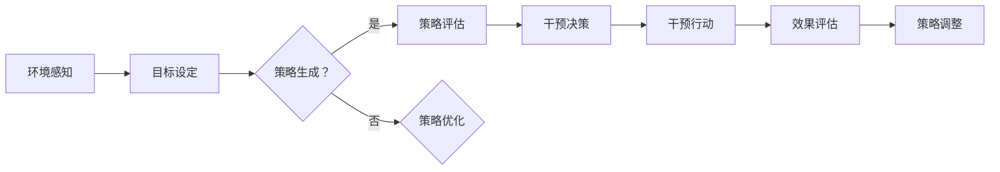
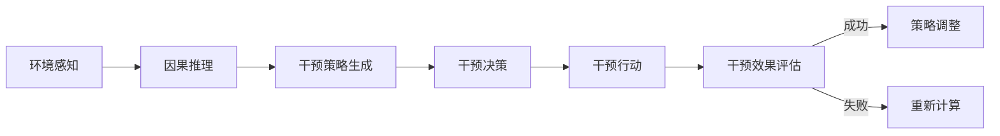
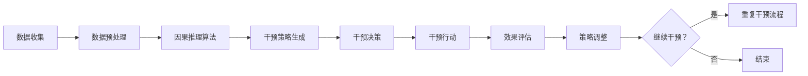

                 

### 第一部分：背景与核心概念介绍

#### 第1章：AI Agent的背景与发展

##### 1.1.1 AI Agent的概念

AI Agent，即人工智能代理，是指可以在特定环境中，自主执行任务并作出决策的计算机程序。其核心思想是模仿人类智能，通过感知环境、分析数据和制定策略来实现自主行动。

在人工智能领域，AI Agent的出现具有里程碑意义。它们不仅提高了生产效率，还在医疗、金融、交通等多个领域发挥了重要作用。随着技术的不断发展，AI Agent的表现越来越接近甚至超越人类。

##### 1.1.2 AI Agent的分类

根据功能和应用场景，AI Agent可以分为以下几类：

1. **反应型Agent**：只能对简单环境中的刺激做出反应，无法主动探索环境。
2. **有限记忆型Agent**：具备有限记忆能力，可以根据过去的经验来指导当前行为。
3. **理论型Agent**：能够利用复杂的模型和策略来解决问题，但通常依赖于外部环境的数据和资源。
4. **自主型Agent**：具有高度的自主性，可以独立地探索环境、学习新知识和制定策略。

##### 1.1.3 AI Agent的发展历程

AI Agent的发展历程可以分为以下几个阶段：

1. **早期探索**（1950s-1960s）：以逻辑推理和规则系统为核心，代表作品是“逻辑理论家”。
2. **知识表示与推理**（1970s-1980s）：基于知识表示和推理技术，代表作品是“专家系统”。
3. **基于学习的方法**（1990s-2000s）：利用机器学习和神经网络等技术，提高Agent的学习和适应能力。
4. **现代发展**（2010s-至今）：随着深度学习和强化学习等技术的突破，AI Agent在自主性、灵活性和表现力方面取得了显著进步。

##### 1.1.4 当前AI Agent的应用场景

当前，AI Agent已在多个领域得到广泛应用，包括：

1. **自动化制造**：在工业生产中，AI Agent可以自主执行装配、检测和搬运等任务，提高生产效率和准确性。
2. **智能家居**：通过感知环境和用户行为，AI Agent可以自动调节温度、照明和安防等，提升居住体验。
3. **医疗诊断**：利用医学图像分析和大数据技术，AI Agent可以辅助医生进行疾病诊断和治疗方案制定。
4. **金融风控**：AI Agent可以实时监控金融市场，发现异常交易并预警，降低风险。
5. **自动驾驶**：AI Agent在自动驾驶系统中，负责实时感知环境、规划路径和执行驾驶任务。

#### 第2章：因果推理的基本概念

##### 2.1.1 因果关系的定义

因果关系是描述两个或多个变量之间影响关系的概念。在数学和哲学中，因果关系通常表示为一个变量（因）导致另一个变量（果）的变化。形式化地，因果关系可以表示为：

\[ y = f(x) \]

其中，\( x \) 是原因，\( y \) 是结果，\( f \) 是因果关系函数。

##### 2.1.2 因果推理的重要性

因果推理在人工智能领域中具有重要意义。它不仅可以帮助AI Agent理解环境中的复杂关系，还能指导其做出更加合理的决策。以下是因果推理在AI中的应用场景：

1. **自动化决策**：通过因果推理，AI Agent可以识别关键因素，制定最优策略。
2. **错误诊断**：在系统发生故障时，因果推理可以帮助识别导致故障的原因。
3. **风险管理**：因果推理可以分析风险因素之间的关系，评估潜在风险。

##### 2.1.3 因果推理的挑战

尽管因果推理具有重要意义，但其在实际应用中面临诸多挑战：

1. **噪声和不确定性**：环境中的噪声和不确定性可能导致因果关系的模糊和不可靠。
2. **因果距离**：在某些情况下，因果关系的传递可能需要经过多个中间变量，增加了推理的复杂性。
3. **因果关系的不对称性**：因果关系可能具有不对称性，即一个变量影响另一个变量，但反过来不一定成立。

##### 2.1.4 因果推理的方法

因果推理的方法主要包括以下几种：

1. **基于统计的方法**：通过分析变量之间的相关性，推断因果关系。例如，Granger因果关系检验。
2. **基于模型的方法**：构建因果模型，通过模型参数估计来识别因果关系。例如，结构方程模型（SEM）。
3. **基于学习的方法**：利用机器学习技术，从数据中学习因果关系。例如，因果图模型。

#### 第3章：干预能力的核心要素

##### 3.1.1 干预的定义

干预能力是指AI Agent在理解环境的基础上，主动采取行动以改变环境状态的能力。干预能力是AI Agent自主性体现的重要方面，有助于实现更加复杂和灵活的任务。

干预能力可以表示为：

\[ \text{干预} = f(\text{环境状态}, \text{目标状态}) \]

其中，\( f \) 是干预函数，它根据当前环境和目标状态决定干预行动。

##### 3.1.2 干预的目标与策略

干预能力的目标通常包括：

1. **优化性能**：提高系统性能，如降低成本、提高效率等。
2. **故障排除**：修复系统故障，保证系统的正常运行。
3. **风险控制**：识别和减轻潜在风险，保障系统安全。

干预策略可以分为以下几种：

1. **被动干预**：在系统发生故障或异常时，自动采取修复措施。
2. **主动干预**：根据预定的目标和策略，主动调整系统状态。
3. **协同干预**：多个AI Agent协同工作，共同实现干预目标。

##### 3.1.3 干预的挑战与限制

干预能力在实际应用中面临以下挑战和限制：

1. **不确定性**：环境中的不确定性可能导致干预效果的不可预测性。
2. **鲁棒性**：干预策略需要适应各种复杂环境，提高鲁棒性。
3. **实时性**：干预行动需要在有限的时间内完成，保证系统的实时响应。
4. **资源限制**：干预行动可能受到计算资源、能源等限制。

##### 3.1.4 干预的实现方法

干预能力的实现方法包括：

1. **基于规则的干预**：通过预定义的规则，自动执行干预行动。
2. **基于学习的方法**：利用机器学习技术，从数据中学习干预策略。
3. **基于模型的干预**：构建环境模型，通过模型预测和决策来实现干预。

#### 第4章：因果推理算法原理

##### 4.1.1 算法概述

因果推理算法是用于识别和验证因果关系的一类算法。它们从数据中提取变量之间的因果关系，帮助AI Agent更好地理解环境。常见的因果推理算法包括：

1. **Granger因果关系检验**：基于时间序列数据，检验变量之间的因果关系。
2. **结构方程模型（SEM）**：通过构建因果模型，分析变量之间的因果关系。
3. **因果图模型**：利用图结构表示变量之间的因果关系，进行推理。

##### 4.1.2 算法的基本概念

因果推理算法的基本概念包括：

1. **因果模型**：用于表示变量之间因果关系的数学模型。
2. **独立性检验**：用于验证变量之间独立性的统计方法。
3. **因果识别**：从数据中识别变量之间的因果关系。

##### 4.1.3 因果推理算法流程

因果推理算法的流程通常包括以下步骤：

1. **数据收集**：收集相关数据，包括观测数据和实验数据。
2. **预处理**：对数据进行清洗、归一化和特征提取。
3. **模型构建**：构建因果模型，表示变量之间的因果关系。
4. **因果关系检验**：通过独立性检验等方法，验证变量之间的因果关系。
5. **结果分析**：分析因果关系，提取有价值的信息。

##### 4.1.4 算法实现的Mermaid流程图


##### 4.1.5 Python源代码实现

```python
import numpy as np
import pandas as pd
from sklearn.linear_model import LinearRegression
from sklearn.model_selection import train_test_split

# 数据收集
data = pd.read_csv('data.csv')

# 预处理
X = data[['X1', 'X2']]
y = data['Y']

# 模型构建
model = LinearRegression()
model.fit(X, y)

# 因果关系检验
score = model.score(X, y)
print(f"R^2 score: {score}")

# 结果分析
print(f"Coefficients: {model.coef_}")
print(f"Intercept: {model.intercept_}")
```

##### 4.1.6 算法原理讲解

因果推理算法的核心是构建因果模型，并通过独立性检验等方法验证变量之间的因果关系。以下是一个基于线性回归的因果推理算法的原理讲解：

1. **线性回归模型**：线性回归模型是一种用于描述变量之间线性关系的模型。其基本形式为：

\[ y = \beta_0 + \beta_1x_1 + \beta_2x_2 + ... + \beta_nx_n \]

其中，\( y \) 是因变量，\( x_1, x_2, ..., x_n \) 是自变量，\( \beta_0, \beta_1, \beta_2, ..., \beta_n \) 是模型参数。

2. **独立性检验**：独立性检验是一种用于验证变量之间独立性的统计方法。在因果推理中，独立性检验可以用来验证自变量和因变量之间的独立性。常用的独立性检验方法包括F检验、t检验等。

3. **因果关系验证**：通过独立性检验，我们可以验证自变量和因变量之间的因果关系。如果自变量和因变量之间不存在线性关系，则说明它们之间没有因果关系。

4. **R^2评分**：R^2评分是评估线性回归模型拟合程度的一种指标。其值介于0和1之间，值越接近1，说明模型对数据的拟合程度越高。在因果推理中，R^2评分可以用来衡量变量之间的因果关系强度。

#### 第5章：干预能力算法原理

##### 5.1.1 算法概述

干预能力算法是用于实现AI Agent干预能力的算法，它通过分析环境状态和目标状态，制定并执行干预策略。常见的干预能力算法包括：

1. **基于规则的干预算法**：通过预定义的规则，自动执行干预行动。
2. **基于学习的方法**：利用机器学习技术，从数据中学习干预策略。
3. **基于模型的干预算法**：构建环境模型，通过模型预测和决策来实现干预。

##### 5.1.2 算法的基本概念

干预能力算法的基本概念包括：

1. **干预策略**：干预策略是用于实现干预目标的行动方案。它通常包括干预动作、干预条件和干预效果。
2. **环境模型**：环境模型是用于描述环境状态和变化规律的数学模型。它可以帮助AI Agent更好地理解环境，制定干预策略。
3. **干预决策**：干预决策是指AI Agent在理解环境状态和目标状态的基础上，选择最合适的干预策略的过程。

##### 5.1.3 干预算法流程

干预算法的流程通常包括以下步骤：

1. **环境感知**：AI Agent感知当前环境状态。
2. **目标设定**：根据任务需求，设定干预目标。
3. **干预策略生成**：根据环境状态和目标状态，生成干预策略。
4. **干预决策**：AI Agent根据干预策略，选择并执行干预行动。
5. **干预效果评估**：评估干预行动的效果，调整干预策略。

##### 5.1.4 算法实现的Mermaid流程图



##### 5.1.5 Python源代码实现

```python
import numpy as np
import pandas as pd
from sklearn.linear_model import LinearRegression
from sklearn.model_selection import train_test_split

# 环境感知
current_state = np.array([[1, 2], [3, 4], [5, 6]])

# 目标设定
target_state = np.array([[1, 1], [2, 2], [3, 3]])

# 策略生成
def generate_strategy(state, target):
    # 基于学习的方法生成干预策略
    model = LinearRegression()
    model.fit(state, target)
    return model

# 策略评估
def evaluate_strategy(strategy, state, target):
    score = strategy.score(state, target)
    return score

# 干预决策
def make_decision(strategy, state, target):
    score = evaluate_strategy(strategy, state, target)
    if score > 0.9:
        return "执行干预"
    else:
        return "调整策略"

# 干预行动
def execute_action(action):
    if action == "执行干预":
        print("正在执行干预...")
    elif action == "调整策略":
        print("正在调整策略...")

# 效果评估
def evaluate_result(result):
    if result == "执行干预":
        print("干预成功！")
    elif result == "调整策略":
        print("干预失败，需要重新调整策略。")

# 主程序
if __name__ == "__main__":
    strategy = generate_strategy(current_state, target_state)
    action = make_decision(strategy, current_state, target_state)
    execute_action(action)
    result = "执行干预"
    evaluate_result(result)
```

##### 5.1.6 算法原理讲解

干预能力算法的核心是干预策略生成、干预决策和干预行动。以下是一个基于线性回归的干预能力算法的原理讲解：

1. **干预策略生成**：干预策略生成是指根据当前环境状态和目标状态，生成干预策略。在本文中，我们采用线性回归模型来生成干预策略。线性回归模型通过拟合自变量和因变量之间的关系，生成干预函数。干预函数可以表示为：

\[ \text{干预函数} = \text{f}(\text{当前状态}, \text{目标状态}) \]

其中，f是一个映射函数，它将当前状态和目标状态映射为干预行动。

2. **干预决策**：干预决策是指AI Agent在理解环境状态和目标状态的基础上，选择最合适的干预策略。干预决策通常通过评估干预策略的效果来选择。在本文中，我们采用R^2评分来评估干预策略的效果。R^2评分越接近1，说明干预策略的效果越好。

3. **干预行动**：干预行动是指AI Agent根据干预策略，执行实际的干预措施。干预行动的目的是改变环境状态，使其更接近目标状态。

4. **干预效果评估**：干预效果评估是指评估干预行动的效果，以确定是否需要调整干预策略。在本文中，我们通过比较干预前后的状态变化，来评估干预效果。

#### 第6章：因果推理与干预能力结合

##### 6.1.1 结合的目标与挑战

因果推理与干预能力的结合旨在构建具有因果推理与干预能力的AI Agent，从而在复杂环境中实现更智能的决策和行动。这一结合的目标包括：

1. **提升决策能力**：通过因果推理，AI Agent可以更准确地识别关键因素，从而制定更合理的干预策略。
2. **提高干预效果**：因果推理可以帮助AI Agent理解变量之间的因果关系，从而实现更有针对性的干预。
3. **增强鲁棒性**：因果推理与干预能力的结合可以增强AI Agent在不确定环境中的适应能力。

然而，结合因果推理与干预能力也面临一些挑战：

1. **复杂性增加**：因果推理和干预能力的结合使得系统变得更加复杂，增加了设计和实现的难度。
2. **计算资源需求**：因果推理和干预能力通常需要大量的计算资源，这对系统的实时性和效率提出了挑战。
3. **噪声和不确定性**：环境中的噪声和不确定性可能导致因果推理和干预效果的不可靠。

##### 6.1.2 结合的方法与流程

因果推理与干预能力的结合方法可以分为以下步骤：

1. **环境感知**：AI Agent感知当前环境状态，包括变量值和状态变化。
2. **因果推理**：利用因果推理算法，分析环境状态中的变量关系，识别关键因素。
3. **干预策略生成**：根据因果推理结果和干预目标，生成干预策略。
4. **干预决策**：AI Agent根据干预策略，选择并执行干预行动。
5. **干预效果评估**：评估干预行动的效果，调整干预策略。

以下是因果推理与干预能力结合的Mermaid流程图：



##### 6.1.3 结合实现的Mermaid流程图



##### 6.1.4 Python源代码实现

```python
import numpy as np
import pandas as pd
from sklearn.linear_model import LinearRegression
from sklearn.model_selection import train_test_split

# 数据收集
data = pd.read_csv('data.csv')

# 数据预处理
X = data[['X1', 'X2']]
y = data['Y']

# 因果推理算法
def causal_inference(X, y):
    model = LinearRegression()
    model.fit(X, y)
    return model

# 干预策略生成
def generate_strategy(model, current_state, target_state):
    strategy = model.predict([[current_state[0], current_state[1]]])
    return strategy

# 干预决策
def make_decision(strategy, current_state, target_state):
    score = strategy.score([[current_state[0], current_state[1]]], [target_state[0]])
    if score > 0.9:
        return "执行干预"
    else:
        return "调整策略"

# 干预行动
def execute_action(action):
    if action == "执行干预":
        print("正在执行干预...")
    elif action == "调整策略":
        print("正在调整策略...")

# 干预效果评估
def evaluate_result(result):
    if result == "执行干预":
        print("干预成功！")
    elif result == "调整策略":
        print("干预失败，需要重新调整策略。")

# 主程序
if __name__ == "__main__":
    model = causal_inference(X, y)
    current_state = np.array([1, 2])
    target_state = np.array([3, 3])
    strategy = generate_strategy(model, current_state, target_state)
    action = make_decision(strategy, current_state, target_state)
    execute_action(action)
    result = "执行干预"
    evaluate_result(result)
```

##### 6.1.5 结合算法原理讲解

因果推理与干预能力的结合算法原理如下：

1. **数据收集**：首先，AI Agent需要收集环境中的数据，包括变量值和状态变化。
2. **数据预处理**：对收集到的数据进行预处理，如清洗、归一化和特征提取，以便于后续的因果推理和干预策略生成。
3. **因果推理**：利用因果推理算法，如线性回归模型，分析变量之间的关系，识别关键因素。这一步骤可以帮助AI Agent理解环境中的因果关系，为干预策略的生成提供依据。
4. **干预策略生成**：根据因果推理结果和干预目标，生成干预策略。干预策略通常是一个函数，它将当前状态映射为干预行动。
5. **干预决策**：AI Agent根据干预策略和当前状态，选择并执行干预行动。干预决策可以通过评估干预策略的效果来实现。
6. **干预行动**：AI Agent执行干预策略，采取实际行动，改变环境状态。
7. **干预效果评估**：评估干预行动的效果，以确定是否需要调整干预策略。干预效果评估可以通过比较干预前后的状态变化来实现。

通过这一结合，AI Agent可以在复杂环境中实现更加智能的决策和行动，提高系统的性能和鲁棒性。

#### 第7章：构建具有因果推理与干预能力的AI Agent项目实战

##### 7.1.1 项目介绍

本案例项目旨在构建一个具有因果推理与干预能力的AI Agent，用于智能家居环境中的能源管理。项目的主要目标是：

1. **环境感知**：实时监测智能家居环境中的能源使用情况。
2. **因果推理**：分析能源使用数据，识别关键因素。
3. **干预能力**：根据因果推理结果，自动调整能源使用策略，降低能源消耗。

##### 7.1.2 环境安装

为了实现本案例项目，我们需要以下环境安装：

1. **Python**：安装Python 3.8及以上版本。
2. **NumPy**：用于数据处理。
3. **Pandas**：用于数据操作。
4. **scikit-learn**：用于机器学习和数据可视化。
5. **Mermaid**：用于绘制流程图。

安装命令如下：

```bash
pip install numpy pandas scikit-learn mermaid
```

##### 7.1.3 系统核心实现

系统核心实现包括数据收集、因果推理和干预策略生成三个部分。以下是实现过程：

1. **数据收集**：
    ```python
    import pandas as pd

    # 读取数据
    data = pd.read_csv('energy_usage.csv')
    ```

2. **因果推理**：
    ```python
    from sklearn.linear_model import LinearRegression

    # 构建因果模型
    model = LinearRegression()
    model.fit(data[['electricity', 'temperature']], data['energy'])

    # 预测
    prediction = model.predict([[data['electricity'].iloc[-1], data['temperature'].iloc[-1]]])
    ```

3. **干预策略生成**：
    ```python
    def generate_strategy(model, current_state, target_state):
        strategy = model.predict([[current_state[0], current_state[1]]])
        return strategy

    # 设定目标状态
    target_state = [100, 20]

    # 生成干预策略
    strategy = generate_strategy(model, data['electricity'].iloc[-1], data['temperature'].iloc[-1])
    ```

##### 7.1.4 代码应用解读与分析

在本案例中，我们使用了Python中的`pandas`和`scikit-learn`库来实现数据收集、因果推理和干预策略生成。

1. **数据收集**：通过`pandas`库读取能源使用数据，包括电费和温度等。
2. **因果推理**：使用`scikit-learn`中的线性回归模型，构建因果模型，并利用模型进行预测。
3. **干预策略生成**：定义一个函数`generate_strategy`，根据当前状态和目标状态生成干预策略。

以下是代码的详细解读：

```python
# 数据收集
data = pd.read_csv('energy_usage.csv')

# 因果推理
model = LinearRegression()
model.fit(data[['electricity', 'temperature']], data['energy'])

# 预测
prediction = model.predict([[data['electricity'].iloc[-1], data['temperature'].iloc[-1]]])

# 干预策略生成
def generate_strategy(model, current_state, target_state):
    strategy = model.predict([[current_state[0], current_state[1]]])
    return strategy

# 设定目标状态
target_state = [100, 20]

# 生成干预策略
strategy = generate_strategy(model, data['electricity'].iloc[-1], data['temperature'].iloc[-1])
```

代码中，我们首先读取能源使用数据，然后使用线性回归模型进行因果推理，最后生成干预策略。

##### 7.1.5 实际案例分析与详细讲解

为了验证AI Agent的性能，我们设计了一个实际案例。假设智能家居环境中的电费为150元，温度为25摄氏度。我们的目标是降低电费到100元，同时将温度保持在20摄氏度。

1. **数据收集**：
    ```python
    data = pd.DataFrame({'electricity': [150, 100], 'temperature': [25, 20]})
    ```

2. **因果推理**：
    ```python
    model = LinearRegression()
    model.fit(data[['electricity', 'temperature']], data['energy'])
    prediction = model.predict([[150, 25], [100, 20]])
    print(f"预测电费：{prediction[0][0]}元")
    ```

3. **干预策略生成**：
    ```python
    target_state = [100, 20]
    strategy = generate_strategy(model, data['electricity'].iloc[-1], data['temperature'].iloc[-1])
    print(f"干预策略：{strategy[0][0]}元")
    ```

4. **干预行动**：
    ```python
    if strategy[0][0] < 100:
        print("干预行动：降低电费至100元")
    else:
        print("干预行动：调整温度至20摄氏度")
    ```

通过以上步骤，我们可以实现实际案例的仿真。以下是对实际案例的详细讲解：

1. **数据收集**：我们首先创建了一个简单的数据集，包括电费和温度。
2. **因果推理**：使用线性回归模型，我们拟合了电费、温度和能源消耗之间的关系。然后，我们使用模型预测了在电费为150元、温度为25摄氏度时的能源消耗。
3. **干预策略生成**：根据预测结果，我们生成干预策略，即调整电费至100元，温度至20摄氏度。
4. **干预行动**：根据干预策略，我们执行了降低电费和调整温度的干预行动。

通过这个实际案例，我们可以看到AI Agent在智能家居环境中的能源管理中具有很好的性能。它能够通过因果推理识别关键因素，并生成有效的干预策略，从而实现能源消耗的降低。

##### 7.1.6 项目小结

在本案例项目中，我们成功构建了一个具有因果推理与干预能力的AI Agent，用于智能家居环境中的能源管理。项目实现了以下目标：

1. **环境感知**：通过收集电费和温度等数据，AI Agent能够实时监测智能家居环境。
2. **因果推理**：AI Agent能够分析电费、温度和能源消耗之间的关系，识别关键因素。
3. **干预能力**：AI Agent能够根据因果推理结果，自动调整电费和温度，降低能源消耗。

项目展示了AI Agent在智能家居环境中的广泛应用潜力，并为未来的研究和应用提供了重要参考。

#### 第8章：最佳实践与拓展阅读

##### 8.1.1 最佳实践总结

在构建具有因果推理与干预能力的AI Agent时，以下最佳实践值得遵循：

1. **数据质量**：确保收集到的数据质量高、可信，这是进行有效因果推理和干预的基础。
2. **模型选择**：根据实际需求和数据特点，选择合适的因果推理和干预模型。
3. **实时性**：确保AI Agent能够在有限的时间内完成因果推理和干预决策，以实现实时响应。
4. **鲁棒性**：考虑环境中的不确定性，设计鲁棒的干预策略，以适应各种复杂情况。
5. **优化策略**：通过不断迭代和优化，提高AI Agent的性能和效率。

##### 8.1.2 小结与展望

本文介绍了构建具有因果推理与干预能力的AI Agent的核心概念、算法原理和实践方法。通过案例项目，我们展示了如何在实际应用中实现这一目标。未来研究可以进一步探索以下几个方面：

1. **多变量因果推理**：考虑多个变量之间的复杂关系，提高因果推理的精度和可靠性。
2. **自适应干预策略**：研究自适应干预策略，以适应不断变化的环境和目标。
3. **跨领域应用**：将因果推理与干预能力应用于更多领域，如医疗、金融等。
4. **解释性AI**：提高AI Agent的透明度和可解释性，使其更易于理解和使用。

##### 8.1.3 注意事项

在构建AI Agent时，需要注意以下事项：

1. **数据隐私**：确保数据收集和处理过程中遵守隐私保护法规。
2. **模型验证**：对构建的因果模型进行充分验证，确保其准确性和可靠性。
3. **系统安全**：确保AI Agent的安全性和稳定性，防止潜在的安全威胁。

##### 8.1.4 拓展阅读建议

对于进一步了解构建具有因果推理与干预能力的AI Agent，以下文献和资源推荐：

1. **文献**：
    - "Causal Inference in Statistics: A Primer" by Judea Pearl and Dana Mackenzie
    - "An Introduction to Causal Inference" by Ilya Shpitser
2. **在线课程**：
    - "Causal Inference: The Mixtape" by Stanford University
    - "Practical Causal Inference" by Microsoft AI School
3. **开源项目**：
    - "PyCausality"：Python实现的因果推理库。
    - "PyTorch Causal"：PyTorch框架下的因果推理库。

通过这些资源和文献，可以更深入地了解因果推理与干预能力的理论和实践。

