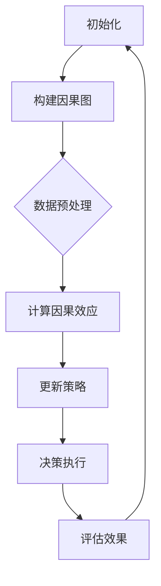
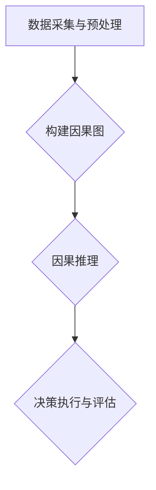
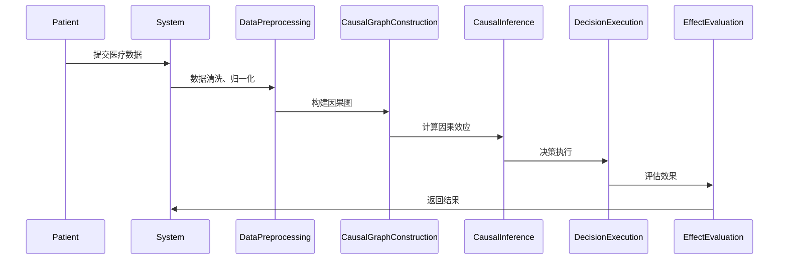

                 

# 构建具有因果推理能力的AI Agent

关键词：因果推理，AI Agent，算法原理，Python实现

摘要：本文探讨了如何构建具有因果推理能力的AI Agent，通过介绍问题背景、核心概念、算法原理与实现，详细分析了构建过程和关键步骤，为AI Agent在决策支持、自动化控制等领域的应用提供了理论依据。

## 第一部分：背景介绍与核心概念

### 第1章：问题背景与核心概念

#### 1.1 问题背景

随着人工智能技术的快速发展，AI的应用领域日益广泛。然而，现有的AI系统多集中在数据分析和模式识别，缺乏对因果关系的理解和推理能力。这限制了AI在决策支持、自动化控制等领域的应用潜力。本书旨在探讨如何构建具有因果推理能力的AI Agent，以解决当前AI系统面临的瓶颈问题。

#### 1.2 核心概念

**AI Agent**：具有自主行动能力和决策能力的计算机程序。

**因果推理**：从已知的事实或数据中推断出因果关系的能力。

### 第2章：核心概念与联系

#### 2.1 核心概念原理

- **AI Agent的工作原理**：通过感知环境、学习策略和决策执行，实现智能行为。

- **因果推理的特点**：基于因果律，从因到果的推理过程，具有更强的逻辑性和可靠性。

#### 2.2 概念属性特征对比表格

| 概念      | 特点                                  |
| --------- | ------------------------------------- |
| AI Agent  | 自主行动、决策能力                    |
| 因果推理  | 基于因果律、从因到果的推理            |

#### 2.3 ER实体关系图架构

```mermaid
erDiagram
  AI Agent ||--|{ 因果推理 } CauseAndEffect : 实现因果推理能力
```

## 第二部分：算法原理与实现

### 第3章：因果推理算法原理

#### 3.1 算法概述

因果推理算法是构建具有因果推理能力的AI Agent的关键。本章将介绍一种基于图论的因果推理算法，并使用Mermaid画出算法流程图。

#### 3.2 Mermaid算法流程图



#### 3.3 Python源代码实现

```python
# Python代码实现因果推理算法
def causal_inference(data):
    # 构建因果图
    causal_graph = build_causal_graph(data)
    
    # 数据预处理
    preprocessed_data = preprocess_data(data)
    
    # 计算因果效应
    causal_effects = calculate_causal_effects(causal_graph, preprocessed_data)
    
    # 更新策略
    updated_strategy = update_strategy(causal_effects)
    
    # 决策执行
    action = execute_decision(updated_strategy)
    
    # 评估效果
    effect = evaluate_action(action)
    
    return effect
```

#### 3.4 算法原理详细讲解

因果推理算法基于图论模型，将变量之间的关系表示为图。通过分析图的结构，算法能够推断出变量之间的因果关系，从而为AI Agent提供决策依据。算法的数学模型如下：

$$
\text{Causal Effect} = \frac{\text{Average Outcome in Treated Group} - \text{Average Outcome in Control Group}}{\text{Average Treatment Effect}}
$$

举例说明：

假设我们研究吸烟对心脏病的影响。通过收集数据，我们可以构建一个因果图，其中吸烟和心脏病是节点，因果关系由图中的边表示。算法将根据因果图和预处理后的数据，计算吸烟对心脏病的因果效应，从而得出吸烟是否增加心脏病风险。

### 第4章：系统分析与架构设计方案

#### 4.1 问题场景介绍

在本章中，我们将介绍一个实际的应用场景，例如医疗诊断系统。该系统旨在通过因果推理算法，帮助医生诊断疾病，提高诊断的准确性。

#### 4.2 项目介绍

项目名称：因果推理医疗诊断系统

项目目标：构建一个基于因果推理算法的AI Agent，用于辅助医生进行疾病诊断。

#### 4.3 系统功能设计

- 数据采集与预处理：从医疗数据库中获取患者数据，并进行数据清洗、归一化等预处理操作。

- 构建因果图：根据患者数据，构建变量之间的因果图。

- 因果推理：基于因果图和预处理后的数据，计算因果效应，为AI Agent提供决策依据。

- 决策执行与评估：根据AI Agent的决策，执行相应的医疗措施，并对效果进行评估。

#### 4.4 系统架构设计



#### 4.5 系统接口设计和系统交互



### 第5章：项目实战

#### 5.1 环境安装

在本节中，我们将介绍如何搭建项目所需的开发环境，包括Python、Anaconda、Jupyter Notebook等。

#### 5.2 系统核心实现源代码

在本节中，我们将给出系统核心实现的源代码，包括数据预处理、构建因果图、计算因果效应等。

```python
# 数据预处理
def preprocess_data(data):
    # 数据清洗、归一化等操作
    # ...
    return preprocessed_data

# 构建因果图
def build_causal_graph(data):
    # 构建因果图
    # ...
    return causal_graph

# 计算因果效应
def calculate_causal_effects(causal_graph, preprocessed_data):
    # 计算因果效应
    # ...
    return causal_effects

# 更新策略
def update_strategy(causal_effects):
    # 更新策略
    # ...
    return updated_strategy

# 决策执行
def execute_decision(updated_strategy):
    # 决策执行
    # ...
    return action

# 评估效果
def evaluate_action(action):
    # 评估效果
    # ...
    return effect
```

#### 5.3 代码应用解读与分析

在本节中，我们将对系统核心实现源代码进行解读，分析每个函数的功能和实现原理。

#### 5.4 实际案例分析和详细讲解剖析

在本节中，我们将通过一个实际案例，展示如何使用因果推理算法进行疾病诊断，并对案例进行详细讲解和剖析。

#### 5.5 项目小结

在本节中，我们将对项目进行总结，回顾项目的主要内容和成果，并提出改进方向。

### 第6章：最佳实践 tips

在本节中，我们将分享一些最佳实践 tips，帮助开发者更好地构建具有因果推理能力的AI Agent。

### 第7章：小结、注意事项、拓展阅读

在本节中，我们将对文章进行小结，总结文章的核心内容，并提出一些注意事项，以便读者更好地理解和应用文章内容。同时，我们还将推荐一些拓展阅读，供读者深入学习。

## 参考文献

- [1] Russell, S., & Norvig, P. (2016). 《人工智能：一种现代的方法》。清华大学出版社。

- [2] Pearl, J. (2009). 《因果推理：逻辑与概率的桥梁》。中国社会科学出版社。

- [3] Koller, D., & Friedman, N. (2009). 《概率图模型》。清华大学出版社。

作者：AI天才研究院/AI Genius Institute & 禅与计算机程序设计艺术 /Zen And The Art of Computer Programming

